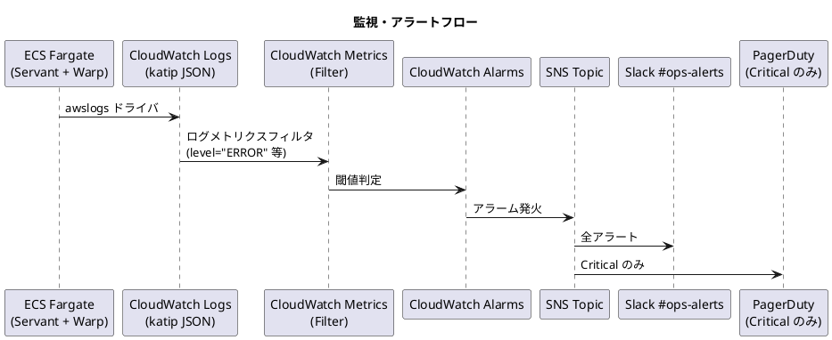
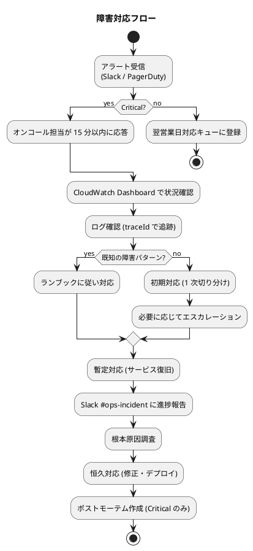

# 運用要件定義 - 国際貨物輸送管理システム (Haskell 版)

## 1. 概要

### 1.1 目的

本ドキュメントは国際貨物輸送管理システム (Haskell 版) の運用要件を定義し、本番稼働後の運用フロー・監視・バックアップ・障害対応・変更管理の基準を示す。

### 1.2 SLA / SLO

| 指標 | 値 |
| :--- | :---: |
| SLA (対外公約) | 99.5% |
| SLO (内部目標) | 99.9% |
| 月間許容停止時間 (SLA) | 約 3.6 時間 |

詳細は [非機能要件](non_functional.md) §3 を参照。

### 1.3 RTO / RPO

| 指標 | 目標値 | 実現手段 |
| :--- | :--- | :--- |
| RTO | 1 時間以内 | RDS Multi-AZ + ECS 再デプロイ |
| RPO | 5 分以内 | RDS 自動バックアップ + PITR |

### 1.4 運用基盤

| 領域 | 採用技術 |
| :--- | :--- |
| インフラ | AWS ECS Fargate + RDS PostgreSQL + ALB |
| 監視 | CloudWatch Logs / Metrics / Alarms / Dashboard |
| ログ収集 | awslogs ドライバ → CloudWatch Logs (katip JSON 構造化) |
| 通知 | SNS → Slack (#ops-alerts) / PagerDuty (Critical のみ) |
| バックアップ | RDS 自動バックアップ (7 日) + 月次手動スナップショット |
| デプロイ | GitHub Actions + ECS Rolling Update |
| IaC | Terraform |

---

## 2. 運用フロー

### 2.1 定常運用カレンダー

| 頻度 | 作業内容 |
| :--- | :--- |
| 日次 | システム状態確認、エラーログ確認、バックアップ確認 |
| 週次 | 不要 ECR イメージ削除、依存ライブラリ更新確認 (`stack ls dependencies --tree`) |
| 月次 | SLA レポート作成、リストアテスト、セキュリティパッチ適用 |
| 四半期 | フェイルオーバー演習、Terraform Drift 検査 |
| 年次 | DR 訓練、侵入テスト (将来)、JWT 鍵ローテーション |

### 2.2 日次運用

```bash
# ECS サービス状態確認
aws ecs describe-services --cluster cargo-tracker-cluster --services cargo-tracker-app \
  --query 'services[0].{Status: status, RunningCount: runningCount, DesiredCount: desiredCount}'

# CloudWatch アラーム確認 (Critical / Warning)
aws cloudwatch describe-alarms --state-value ALARM \
  --query 'MetricAlarms[].{Name: AlarmName, State: StateValue, Reason: StateReason}'

# RDS バックアップ確認 (直近 1 件)
aws rds describe-db-snapshots --db-instance-identifier cargo-tracker-prod \
  --snapshot-type automated --max-items 1 \
  --query 'DBSnapshots[0].{Id: DBSnapshotIdentifier, Status: Status, Time: SnapshotCreateTime}'

# 直近 24 時間の ERROR ログ件数
aws logs filter-log-events \
  --log-group-name /ecs/cargo-tracker \
  --start-time $(date -u -v -1d +%s)000 \
  --filter-pattern '{ $.level = "ERROR" }' \
  --query 'length(events)'
```

### 2.3 週次運用

```bash
# 未使用 ECR イメージ一覧 (30 日以上前) → 削除候補
aws ecr describe-images --repository-name cargo-tracker \
  --query 'imageDetails[?imagePushedAt<`'$(date -u -v -30d +%Y-%m-%dT%H:%M:%SZ)'`].imageDigest' \
  --output text

# 依存ライブラリの脆弱性チェック
stack exec -- cabal-audit  # または stack-audit
```

### 2.4 月次運用

```bash
# 月次 SLA レポート用: 過去 30 日の 5xx エラー率取得
aws cloudwatch get-metric-statistics \
  --namespace AWS/ApplicationELB --metric-name HTTPCode_Target_5XX_Count \
  --start-time $(date -u -v -30d +%Y-%m-%dT%H:%M:%SZ) \
  --end-time $(date -u +%Y-%m-%dT%H:%M:%SZ) \
  --period 86400 --statistics Sum
```

### 2.5 年次運用

| 作業 | 詳細 |
| :--- | :--- |
| DR 訓練 | 別リージョンへのリストア → 動作確認 → 復旧時間計測 |
| 侵入テスト | 外部委託 (将来導入) |
| JWT 鍵ローテーション | Secrets Manager の鍵更新 → 全タスク再起動 |
| AWS アカウント棚卸し | 未使用 IAM ロール・S3 バケット・ELB の削除 |

---

## 3. 監視設計

### 3.1 監視・アラートフロー



### 3.2 監視項目とアラート閾値

#### 3.2.1 アプリケーションメトリクス

| メトリクス | Warning | Critical | アクション |
| :--- | :---: | :---: | :--- |
| HTTP 5xx エラー率 | ≥ 1% (5 分) | ≥ 5% (5 分) | Slack → PagerDuty |
| レスポンスタイム P95 | ≥ 1.0 s (10 分) | ≥ 3.0 s (5 分) | Slack |
| レスポンスタイム P99 | ≥ 2.0 s (10 分) | ≥ 5.0 s (5 分) | Slack |
| ERROR ログ件数 | ≥ 10 件 / 5 分 | ≥ 100 件 / 5 分 | Slack |
| 認証失敗連続 | - | ≥ 100 件 / 5 分 | Slack (ブルートフォース疑い) |

#### 3.2.2 インフラメトリクス

| メトリクス | Warning | Critical | アクション |
| :--- | :---: | :---: | :--- |
| ECS CPU 使用率 | ≥ 70% (5 分) | ≥ 90% (5 分) | Auto Scaling 発火 |
| ECS メモリ使用率 | ≥ 70% (5 分) | ≥ 90% (5 分) | アラート + RTS 設定確認 |
| ECS HealthyHostCount | ≤ 1 | = 0 | PagerDuty (緊急) |
| RDS CPU 使用率 | ≥ 70% (10 分) | ≥ 90% (5 分) | スケールアップ検討 |
| RDS 接続数 | ≥ 80 (max_conn の 80%) | ≥ 95 | プールサイズ確認 |
| RDS レプリケーション遅延 | ≥ 30 s | ≥ 60 s | アラート |
| ALB Target 異常数 | ≥ 1 | ≥ 2 | PagerDuty |

#### 3.2.3 性能 SLO メトリクス

| SLO | 月間バジェット | 計測方法 |
| :--- | :--- | :--- |
| 可用性 99.9% | 月間 43 分の停止許容 | ALB 5xx 率 + Health Check |
| 公開貨物追跡 P95 < 500ms | 月間 P95 が目標値の 99% 以上で達成 | CloudWatch Synthetics (将来) |

### 3.3 CloudWatch アラーム設定 (例)

```bash
# HTTP 5xx エラー率 Critical アラーム作成
aws cloudwatch put-metric-alarm \
  --alarm-name cargo-tracker-5xx-critical \
  --alarm-description "HTTP 5xx error rate >= 5% for 5 minutes" \
  --metric-name HTTPCode_Target_5XX_Count \
  --namespace AWS/ApplicationELB \
  --statistic Sum --period 300 \
  --threshold 5 --comparison-operator GreaterThanOrEqualToThreshold \
  --evaluation-periods 1 \
  --alarm-actions arn:aws:sns:ap-northeast-1:xxx:cargo-tracker-critical

# ECS HealthyHostCount Critical アラーム作成
aws cloudwatch put-metric-alarm \
  --alarm-name cargo-tracker-healthy-host-zero \
  --metric-name HealthyHostCount --namespace AWS/ApplicationELB \
  --statistic Minimum --period 60 --threshold 1 \
  --comparison-operator LessThanThreshold --evaluation-periods 2 \
  --alarm-actions arn:aws:sns:ap-northeast-1:xxx:cargo-tracker-critical
```

### 3.4 ログ設計

| ロググループ | 内容 | 保持期間 |
| :--- | :--- | :---: |
| `/ecs/cargo-tracker` | アプリケーションログ (katip JSON) | 30 日 |
| `/ecs/cargo-tracker/audit` | 監査ログ (重要操作) | 7 年 |
| ALB アクセスログ (S3) | HTTP アクセス履歴 | 1 年 |
| RDS 低速クエリログ | 1 秒以上のクエリ | 30 日 |

#### ログ検索例

```bash
# 直近 1 時間の ERROR ログを抽出
aws logs filter-log-events --log-group-name /ecs/cargo-tracker \
  --start-time $(date -u -v -1H +%s)000 \
  --filter-pattern '{ $.level = "ERROR" }'

# 特定トレース ID のログ追跡
aws logs filter-log-events --log-group-name /ecs/cargo-tracker \
  --filter-pattern '{ $.traceId = "abc123" }'

# 低速クエリ (1 秒以上) の確認
aws logs filter-log-events --log-group-name /aws/rds/instance/cargo-tracker-prod/postgresql \
  --filter-pattern 'duration: { > 1000 }'
```

### 3.5 CloudWatch ダッシュボード

ダッシュボード `cargo-tracker-overview` に以下のウィジェットを配置する。

| ウィジェット | 内容 |
| :--- | :--- |
| HTTP ステータス分布 | 2xx / 4xx / 5xx の時系列 |
| レスポンスタイム | P50 / P95 / P99 の時系列 |
| ECS タスク数 | Desired / Running / Healthy |
| RDS メトリクス | CPU / Connections / IOPS |
| ビジネスメトリクス | 1 時間あたりの予約数・荷役登録数・例外発生数 |
| アラーム状態 | 直近のアラーム履歴 |

---

## 4. バックアップ・リカバリ設計

### 4.1 バックアップ方式

| 対象 | 方式 | 保持期間 | 復旧手段 |
| :--- | :--- | :---: | :--- |
| RDS データ | 自動バックアップ (日次) | 7 日 | PITR |
| RDS データ | 手動スナップショット (月次) | 1 年 | スナップショットからリストア |
| アプリログ | CloudWatch Logs | 30 日 | (検索のみ) |
| 監査ログ | CloudWatch Logs | 7 年 | (検索のみ) |
| Terraform State | S3 + バージョニング | 無期限 | 過去バージョンを復元 |

### 4.2 RDS バックアップ手順

#### 手動スナップショット作成

```bash
# リリース前など任意タイミングで手動スナップショット作成
SNAPSHOT_ID="cargo-tracker-pre-release-$(date -u +%Y%m%d-%H%M%S)"
aws rds create-db-snapshot \
  --db-instance-identifier cargo-tracker-prod \
  --db-snapshot-identifier $SNAPSHOT_ID

# スナップショット作成完了待ち (最大 30 分)
aws rds wait db-snapshot-completed --db-snapshot-identifier $SNAPSHOT_ID

# スナップショット一覧確認
aws rds describe-db-snapshots --db-instance-identifier cargo-tracker-prod \
  --snapshot-type manual
```

### 4.3 リストア手順

#### 4.3.1 Point-in-Time Recovery (データ破損・誤操作時)

```bash
# Step 1: リストア先の DB インスタンスを新規作成 (既存は残す)
aws rds restore-db-instance-to-point-in-time \
  --source-db-instance-identifier cargo-tracker-prod \
  --target-db-instance-identifier cargo-tracker-pitr \
  --restore-time 2026-06-26T10:00:00Z \
  --db-instance-class db.t3.medium

# Step 2: 復旧 DB が利用可能になるまで待機 (最大 30 分)
aws rds wait db-instance-available --db-instance-identifier cargo-tracker-pitr

# Step 3: エンドポイント確認
aws rds describe-db-instances --db-instance-identifier cargo-tracker-pitr \
  --query 'DBInstances[0].Endpoint.Address'

# Step 4: Secrets Manager の接続情報を新エンドポイントに更新
aws secretsmanager update-secret \
  --secret-id cargo-tracker-db-credentials \
  --secret-string '{"host":"<new-endpoint>","port":5432,"username":"...","password":"..."}'

# Step 5: ECS サービスを再デプロイして新 DB に接続切り替え
aws ecs update-service --cluster cargo-tracker-cluster \
  --service cargo-tracker-app --force-new-deployment
```

#### 4.3.2 スナップショットからのリストア (完全復旧)

```bash
# Step 1: 利用可能なスナップショット一覧を確認
aws rds describe-db-snapshots --db-instance-identifier cargo-tracker-prod \
  --query 'DBSnapshots[*].[DBSnapshotIdentifier, SnapshotCreateTime, Status]' --output table

# Step 2: スナップショットから新 DB インスタンスを復元
aws rds restore-db-instance-from-db-snapshot \
  --db-instance-identifier cargo-tracker-restored \
  --db-snapshot-identifier cargo-tracker-pre-release-20260626-100000 \
  --db-instance-class db.t3.medium

# Step 3 以降: PITR の Step 2〜5 と同様
```

### 4.4 月次リストアテスト

毎月 1 回、開発環境でリストア演習を実施し、復旧時間を計測する。

| ステップ | 目標時間 |
| :--- | :---: |
| スナップショットからの DB 作成 | 30 分 |
| Secrets Manager 更新 + ECS 再デプロイ | 10 分 |
| 動作確認 (主要シナリオ) | 20 分 |
| **合計 RTO** | **60 分以内** |

### 4.5 フェイルオーバー演習 (四半期)・DR 訓練 (年次)

| 演習 | 頻度 | 内容 |
| :--- | :--- | :--- |
| RDS フェイルオーバー | 四半期 | Multi-AZ の手動フェイルオーバー実施、ダウンタイム計測 |
| ECS タスク強制終了 | 四半期 | 1 タスクを `aws ecs stop-task` で停止、再起動を確認 |
| DR 訓練 | 年次 | 別リージョンへのリストア → サービス起動 → 動作確認 |

---

## 5. 障害対応設計

### 5.1 障害対応フロー



### 5.2 ECS タスク障害対応

#### 検知条件

- ECS タスクの状態が `STOPPED` で終了 (期待しない)
- `HealthyHostCount` がアラーム閾値以下

#### 対応手順

```bash
# Step 1: 障害タスクの特定
aws ecs list-tasks --cluster cargo-tracker-cluster --service-name cargo-tracker-app --desired-status STOPPED

# Step 2: タスク停止理由の確認
TASK_ARN="<停止タスク ARN>"
aws ecs describe-tasks --cluster cargo-tracker-cluster --tasks $TASK_ARN \
  --query 'tasks[0].{StoppedReason: stoppedReason, ExitCode: containers[0].exitCode}'

# Step 3: アプリケーションログ確認 (直近 100 行)
aws logs filter-log-events --log-group-name /ecs/cargo-tracker \
  --start-time $(date -u -v -10M +%s)000 --max-items 100

# Step 4: 暫定対応 - サービスを再デプロイ
aws ecs update-service --cluster cargo-tracker-cluster \
  --service cargo-tracker-app --force-new-deployment

# Step 5: 復旧確認
aws ecs describe-services --cluster cargo-tracker-cluster --services cargo-tracker-app \
  --query 'services[0].{Running: runningCount, Desired: desiredCount}'
```

### 5.3 RDS 障害対応

| 症状 | 対応 |
| :--- | :--- |
| 接続数枯渇 (max_connections 到達) | プールサイズ削減 / インスタンスタイプ拡張 |
| CPU 100% 継続 | 低速クエリの特定 (`pg_stat_statements`)、インデックス追加、スケールアップ |
| ストレージ枯渇 | 自動拡張設定確認、不要データ削除 |
| Primary 障害 | Multi-AZ 自動フェイルオーバー (60 秒、自動) |

### 5.4 アプリケーション障害対応

| 症状 | 原因候補 | 対応 |
| :--- | :--- | :--- |
| 5xx 多発 | 直近デプロイ / DB 接続不可 | デプロイリバート / DB 接続情報確認 |
| メモリ使用率高騰 | GHC RTS 設定不足 / メモリリーク | `+RTS -hT` でヒーププロファイル取得、再起動 |
| 特定エンドポイントが遅い | N+1 クエリ / 外部 API 遅延 | postgresql-simple ログ確認 / 外部 API タイムアウト確認 |
| ヘルスチェック失敗 | DB 疎通失敗 / 起動時マイグレーション失敗 | dbmate ログ確認 |

### 5.5 セキュリティインシデント対応

| 検知 | 1 次対応 | エスカレーション |
| :--- | :--- | :--- |
| 認証失敗連続 (ブルートフォース疑い) | 該当 IP の WAF ブロック (将来) | セキュリティ責任者 |
| 不正アクセス検知 | 該当ユーザーの強制ログアウト (`session_generation` 更新)、パスワードリセット強制 | セキュリティ責任者 + 法務 |
| シークレット漏洩 | 即座にローテーション、影響範囲調査 | セキュリティ責任者 |
| データ漏洩 | サービス一時停止、法令対応 | 経営層 + 法務 + 個人情報保護委員会 |

### 5.6 ポストモーテム

Critical 障害については以下の項目で振り返りを実施し、`docs/incidents/YYYY-MM-DD-<topic>.md` に記録する。

- 障害の概要・影響範囲・期間
- タイムライン (検知 → 1 次対応 → 復旧)
- 根本原因
- 暫定対応・恒久対応
- 再発防止策 (技術・プロセス・コミュニケーション)
- 良かった点・改善点

> 個人を非難しない (Blameless Postmortem) を原則とする。

---

## 6. 変更管理

### 6.1 デプロイフロー

| ステージ | 内容 | 承認 |
| :--- | :--- | :--- |
| 開発 | feature ブランチで開発 → PR | レビュアー 1 名 |
| ステージング | main へマージ後、自動デプロイ | (自動) |
| ステージング検証 | E2E + 手動確認 | QA |
| 本番 | 手動承認後デプロイ | リード + オンコール |

詳細は [インフラアーキテクチャ](architecture_infrastructure.md) §CI/CD を参照。

### 6.2 デプロイ手順

```bash
# ステージング: main push で自動デプロイ
git push origin main

# 本番: GitHub Actions の手動ワークフロー実行
gh workflow run cd-production.yml -f version=$(git rev-parse HEAD)

# ロールバック: 前バージョンの ECR SHA で再デプロイ
PREV_SHA="<previous-git-sha>"
aws ecs update-service --cluster cargo-tracker-cluster \
  --service cargo-tracker-app \
  --task-definition cargo-tracker-app:$PREV_SHA
```

### 6.3 DB マイグレーション

- スキーマ変更は dbmate のマイグレーションファイルで管理
- マイグレーション適用は Warp 起動前に自動実行
- 破壊的変更 (DROP COLUMN 等) は 2 段階デプロイ (旧カラム残し → アプリ更新 → 旧カラム削除) で実施
- 大規模変更 (数百万行更新) は計画停止枠で実施

### 6.4 設定変更

- アプリ設定: 環境変数 + dhall 設定ファイル。変更は Terraform で管理
- シークレット: Secrets Manager。変更後は ECS サービス再デプロイで反映
- インフラ設定: Terraform。`terraform plan` をレビュー → `terraform apply`

---

## 7. キャパシティ管理

### 7.1 キャパシティ指標

| 指標 | 現状 | 上限 | 対応 |
| :--- | :--- | :--- | :--- |
| ECS タスク数 | 2-3 | 10 (最大) | Auto Scaling |
| RDS インスタンスタイプ | db.t3.medium | db.t3.large | 縦スケール |
| DB ストレージ | 50 GB | 自動拡張 (上限 100 GB) | 自動 |
| ALB リクエスト数 | 200 RPS | 制限なし | (AWS マネージド) |

### 7.2 容量警告閾値

| 指標 | Warning | Critical |
| :--- | :---: | :---: |
| ECS タスク数 | ≥ 8 | = 10 (上限) |
| RDS CPU | ≥ 70% (10 分) | ≥ 90% (5 分) |
| DB ストレージ | ≥ 70% | ≥ 90% |
| RDS 接続数 | ≥ 80% of max | ≥ 95% of max |

警告発生時は容量計画レビューを実施し、必要に応じてスケールアップを判断する。

---

## 8. 運用ドキュメント体系

| ドキュメント | 内容 | 配置 |
| :--- | :--- | :--- |
| ランブック | よくある障害対応手順 | `docs/runbook/*.md` |
| インシデント記録 | 発生した障害の記録・ポストモーテム | `docs/incidents/YYYY-MM-DD-*.md` |
| 運用手順書 | 日次・週次・月次の運用作業 | `docs/operation/*.md` |
| アーキテクチャ | 設計図・構成図 | `docs/design/*.md` |
| 環境構築手順 | セットアップ・デプロイ | `docs/runbook/setup-*.md` |

ランブックは Slack `#ops-runbook` チャンネルにも要約をピン留めし、深夜対応時のアクセスを容易にする。

---

## 9. 連絡体制

### 9.1 オンコール

| 役割 | 担当 | 連絡先 |
| :--- | :--- | :--- |
| 1 次オンコール | 開発チーム輪番 | PagerDuty + Slack DM |
| 2 次オンコール | リードエンジニア | PagerDuty + 電話 |
| 3 次オンコール | CTO / SRE 責任者 | 電話 |

オンコールローテーション: 週次交代、Slack `#ops-oncall` で告知。

### 9.2 ステークホルダー連絡

| イベント | 連絡先 | タイミング |
| :--- | :--- | :--- |
| Critical 障害発生 | 経営層 + 関係部署 | 検知後 30 分以内 |
| サービス停止 | 全社員 + 顧客 | 停止前 (計画) / 即時 (突発) |
| ポストモーテム公開 | 関係部署 | 完成後 1 週間以内 |
| メンテナンス通知 | 顧客 | 1 週間前 |

---

## 10. 運用要件確認チェックリスト

リリース判定時に以下を確認する。

### 監視

- [ ] CloudWatch アラーム (Critical / Warning) 設定済み
- [ ] Slack / PagerDuty 通知が動作
- [ ] ダッシュボード作成済み
- [ ] 監査ログが定義通り出力
- [ ] ログ保持期間 (本番 30 日、監査 7 年) 設定済み

### バックアップ

- [ ] RDS 自動バックアップ (7 日) 有効
- [ ] 月次手動スナップショット手順確立
- [ ] リストアテスト完了 (RTO 60 分以内達成)

### 障害対応

- [ ] オンコール体制確立
- [ ] PagerDuty 設定
- [ ] ランブック作成 (最低 5 シナリオ)
- [ ] ポストモーテムテンプレート作成

### 変更管理

- [ ] デプロイ手順書整備
- [ ] ロールバック手順確認
- [ ] DB マイグレーション運用手順

### キャパシティ

- [ ] Auto Scaling 設定
- [ ] 容量警告アラーム設定
- [ ] 月次キャパシティレビューフロー

---

## 参照

- [バックエンドアーキテクチャ](architecture_backend.md)
- [インフラアーキテクチャ](architecture_infrastructure.md)
- [非機能要件](non_functional.md)
- [テスト戦略](test_strategy.md)
- Scala 版参考: `tmp/case-study-cargo-tracker/docs/design/operation.md`
