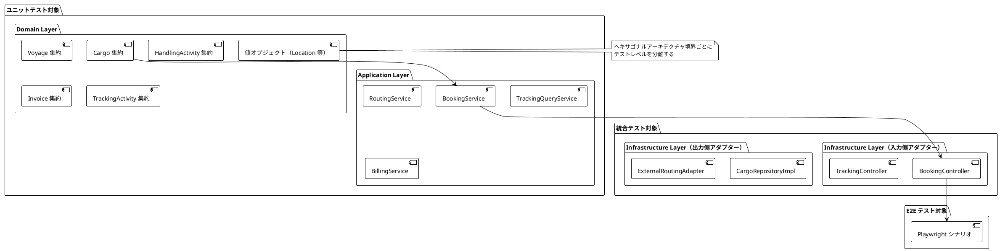
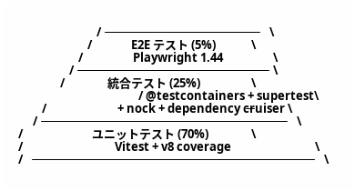
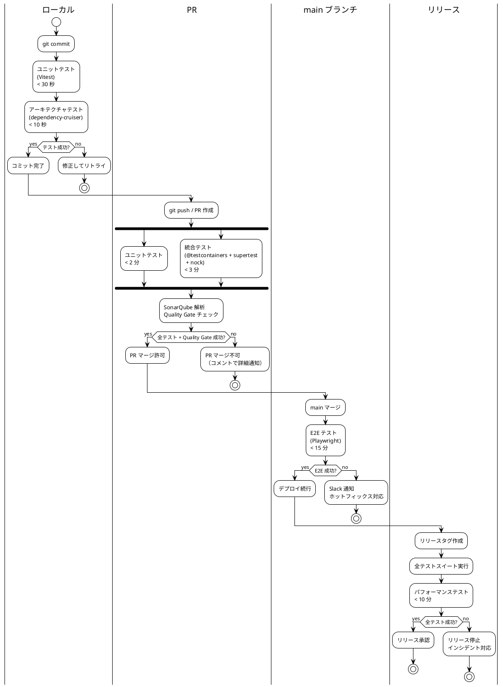
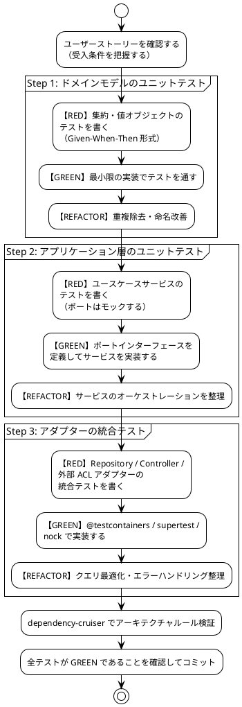

# テスト戦略 - 国際貨物輸送管理システム

## 1. 概要

### 1.1 目的

本ドキュメントは、国際貨物輸送管理システムにおけるテスト戦略を定義する。テスト戦略を事前に策定し、以下の問いに常に回答できる状態を維持することを目的とする。

- 「この機能はどのテストレベルで保証されているか」
- 「何をどこまでテストすべきか」
- 「テストが失敗したとき、どこを修正すべきか」

### 1.2 基本方針

- **TDD（テスト駆動開発）を全開発プロセスで適用する**: レッド → グリーン → リファクタリングのサイクルを厳守する
- **テストをアーキテクチャに対応させる**: ヘキサゴナルアーキテクチャの境界（ポート）を活かし、テスト可能性を設計段階で確保する
- **テストの重複を排除する**: 各テストレベルの責務を明確に分離し、同一ロジックを複数レベルで重複検証しない
- **テストを実行可能なドキュメントとして扱う**: テストコードがシステムの振る舞いを説明する

### 1.3 アーキテクチャとテスト戦略の対応関係



ヘキサゴナルアーキテクチャの各層は以下のテストレベルに対応する。

| アーキテクチャ層 | テストレベル | 理由 |
|---|---|---|
| ドメイン層（集約・値オブジェクト・ドメインサービス） | ユニットテスト | 外部依存ゼロ。純粋なビジネスロジック |
| アプリケーション層（ユースケースサービス） | ユニットテスト（ポートをモック） | ポートへの委譲とオーケストレーションを検証 |
| 入力側アダプター（Controller） | 統合テスト（supertest） | HTTP マッピングとバリデーションを検証 |
| 出力側アダプター（Repository） | 統合テスト（@testcontainers/postgresql） | SQL クエリの正確性を実 DB で検証 |
| 外部 ACL ポート（5 件） | 統合テスト（nock） | 外部システムとの契約を検証 |
| ユーザーシナリオ全体 | E2E テスト（Playwright） | クリティカルパスの品質保証 |

---

## 2. テスト形状の選択

### 2.1 採用形状: ピラミッド型



**採用理由**:

- **ドメイン層が厚い**: DDD を採用しており、Cargo・Voyage・HandlingActivity・Invoice の各集約にビジネスロジックが集中する。BookingStatus の 8 値遷移、荷役妥当性検証（MISROUTED 判定）、法人割引計算など、外部依存なしでテスト可能なロジックが多い
- **ヘキサゴナルアーキテクチャによる高いテスト可能性**: ドメイン層とインフラ層の境界がポートで分離されており、モックの差し替えが容易。ユニットテストが書きやすい設計になっている
- **CQRS による読み取りモデルの分離**: TrackingContext の読み取りクエリはドメインロジックを持たず、統合テストで Repository を直接検証するだけで十分
- **コスト効率**: ユニットテストは実行が高速（< 30 秒）でメンテナンスコストが低い。E2E テストはフレイキーになりやすく、最小限にとどめることで CI の安定性を維持する

### 2.2 採用しない形状と理由

| 形状 | 採用しない理由 |
|---|---|
| **ダイヤモンド型**（統合テスト重視） | 本システムは単一モノリス（ヘキサゴナル）で構成されており、マイクロサービス間の契約検証ニーズがない。統合テストを主軸にするとテスト実行時間が増大し、TDD サイクルが遅くなる |
| **逆ピラミッド型**（E2E 重視） | Playwright テストはヘッドレスブラウザを起動するためフレイキーになりやすく、htmx の 30 秒ポーリングを含む動的 UI はテストの安定性確保が困難。E2E を主軸にするとフィードバックループが 15 分以上になる |

---

## 3. テストレベルの定義

### 3.1 ユニットテスト（Unit Test）

#### 責務・検証対象

- **ドメイン層**: 集約の状態遷移・不変条件・ビジネスルール、値オブジェクトの等価性・バリデーション、ドメインサービスのロジック
- **アプリケーション層**: ユースケースサービスのオーケストレーション（ポートはモック）

#### カバレッジ目標

| 対象 | 行カバレッジ | 分岐カバレッジ |
|---|---|---|
| ドメイン層 | **85% 以上** | **80% 以上** |
| アプリケーション層 | **80% 以上** | **75% 以上** |

#### 使用ツール

- **Vitest**: テストフレームワーク（`test`, `describe`, `test.each`）
- **Vitest のモック機能（`vi.fn` / `vi.mock`）**: ポートインターフェースのモック
- **Vitest の `expect` アサーション**: 流暢なアサーション（`expect(...).toEqual(...)`）

#### 実行タイミング

- **ローカル**: すべてのコミット時（目標 **30 秒以内**）
- **PR**: 自動実行（コミットプッシュ時）
- **CI**: GitHub Actions の `unit-test` ジョブ

#### 除外対象

- インフラ層（Kysely リポジトリ、HTTP クライアント）— 統合テストで担保する
- DTO / 型定義 — データ保持のみでロジックがない
- NestJS アプリケーションモジュール — `Test.createTestingModule` の全体起動はユニットテストに**使用しない**

#### 実装例: Cargo 集約の BookingStatus 遷移テスト

```typescript
import { describe, test, expect } from 'vitest';
import { BookingStatus } from '../domain/booking-status';
import { BookingDomainException } from '../domain/booking-domain-exception';
import { HazardousCargoRoutingException } from '../domain/hazardous-cargo-routing-exception';
import { InvalidBookingStatusTransitionException } from '../domain/invalid-booking-status-transition-exception';
import { CargoFixture } from './fixtures/cargo-fixture';
import { RouteFixture } from './fixtures/route-fixture';

describe('Cargo BookingStatus 遷移', () => {
  test('予約が確定できる', () => {
    // Given: ルートが割り当て済みの貨物
    const cargo = CargoFixture.withRouteAssigned();

    // When: 予約を確定する
    cargo.confirmBooking();

    // Then: ステータスが CONFIRMED に遷移する
    expect(cargo.bookingStatus).toBe(BookingStatus.CONFIRMED);
  });

  test('ルート未割り当て状態で予約確定しようとすると例外が発生する', () => {
    // Given: ルートが未割り当ての貨物
    const cargo = CargoFixture.preliminary();

    // When & Then: 不変条件違反で例外が発生する
    expect(() => cargo.confirmBooking())
      .toThrow(BookingDomainException);
    expect(() => cargo.confirmBooking())
      .toThrow('ルートが割り当てられていません');
  });

  test('危険物の取扱不可港にルートを割り当てると例外が発生する', () => {
    // Given: 危険物フラグが立った貨物と危険物取扱不可の港を経由するルート
    const cargo = CargoFixture.hazardous();
    const prohibitedRoute = RouteFixture.viaHazardousProhibitedPort();

    // When & Then: ドメインルール違反で例外が発生する
    expect(() => cargo.assignRoute(prohibitedRoute))
      .toThrow(HazardousCargoRoutingException);
  });

  test.each([
    BookingStatus.CONFIRMED,
    BookingStatus.COMPLETED,
    BookingStatus.CANCELLED,
  ])('終端状態 %s からの遷移は許可されない', (terminalStatus) => {
    // Given: 終端ステータスの貨物
    const cargo = CargoFixture.withStatus(terminalStatus);

    // When & Then: ステータス遷移が拒否される
    expect(() => cargo.confirmBooking())
      .toThrow(InvalidBookingStatusTransitionException);
  });
});
```

#### 実装例: テスト用 PostgreSQL 設定

ドメイン層に依存した軽量テストでも、本番との差異を最小化するため H2 のような組み込み DB は使用せず、Testcontainers PostgreSQL に統一する。DB を必要としない純粋なドメインロジックのテストはインメモリのフィクスチャで完結させる。

> **補足**: ローカル開発環境のデフォルト DB は pg-mem（インメモリ）だが、統合テストの SQL 互換性検証は Testcontainers（実 PostgreSQL）を正とする。pg-mem はテストの合否判定には使用しない。

```typescript
// vitest.config.ts（統合テストのセットアップ）
import { defineConfig } from 'vitest/config';

export default defineConfig({
  test: {
    globals: true,
    coverage: {
      provider: 'v8',
      reporter: ['text', 'lcov'],
    },
    // 統合テストでは Testcontainers PostgreSQL を起動する
    setupFiles: ['./test/setup-testcontainers.ts'],
  },
});
```

---

### 3.2 統合テスト（Integration Test）

#### 責務・検証対象

- **Repository（Kysely）**: SQL クエリの正確性、トランザクション、楽観的ロック
- **Controller（supertest + cheerio）**: SSR HTML レスポンスの検証（Content-Type、HTML 断片、PRG の 302 リダイレクト、HX-Request によるフラグメント/フルページ分岐）、バリデーションエラーの HTML 再描画
- **外部 ACL ポート（nock）**: 外部システムとの契約遵守、タイムアウト・フォールバック

#### カバレッジ目標

| 対象 | 行カバレッジ |
|---|---|
| Repository（インフラ層） | **75% 以上** |
| Controller 層 | **70% 以上** |

#### 使用ツール

- **Vitest**: テストフレームワーク
- **@testcontainers/postgresql**: 実 PostgreSQL 16 コンテナを自動起動
- **supertest**: NestJS の HTTP エンドポイントテスト（アプリケーションを起動して SSR レスポンスを検証）
- **cheerio**: SSR で返却された HTML 断片のパースとアサート（要素・テキストの存在検証）
- **nock**: 外部 ACL ポートのスタブ（5 件すべてを対象）

#### 実行タイミング

- **PR 時**: GitHub Actions の `integration-test` ジョブ（目標 **5 分以内**）
- **ローカル**: Docker が起動している環境で任意実行

#### 実装例: CargoRepository の保存・検索テスト（@testcontainers/postgresql）

```typescript
import { describe, test, expect, beforeAll, afterAll } from 'vitest';
import { PostgreSqlContainer, StartedPostgreSqlContainer } from '@testcontainers/postgresql';
import { Kysely, PostgresDialect } from 'kysely';
import { Pool } from 'pg';
import { CargoRepositoryImpl } from '../infrastructure/persistence/cargo-repository-impl';
import { TrackingId } from '../domain/tracking-id';
import { UnLocode } from '../domain/un-locode';
import { CargoFixture } from './fixtures/cargo-fixture';

describe('CargoRepository 統合テスト', () => {
  let container: StartedPostgreSqlContainer;
  let db: Kysely<Database>;
  let cargoRepository: CargoRepositoryImpl;

  beforeAll(async () => {
    container = await new PostgreSqlContainer('postgres:16-alpine').start();
    db = new Kysely<Database>({
      dialect: new PostgresDialect({
        pool: new Pool({ connectionString: container.getConnectionUri() }),
      }),
    });
    await runMigrations(db); // node-pg-migrate でスキーマ適用
    cargoRepository = new CargoRepositoryImpl(db);
  }, 60_000);

  afterAll(async () => {
    await db.destroy();
    await container.stop();
  });

  test('貨物を保存して追跡番号で検索できる', async () => {
    // Given: 新規貨物エンティティ
    const cargo = CargoFixture.newBooking(
      TrackingId.of('CARGO-001'),
      UnLocode.of('JPTYO'),
      UnLocode.of('DEHAM'),
    );

    // When: 保存して検索する
    await cargoRepository.save(cargo);
    const found = await cargoRepository.findByTrackingId(TrackingId.of('CARGO-001'));

    // Then: 保存したエンティティと一致する
    expect(found).not.toBeNull();
    expect(found!.origin).toEqual(UnLocode.of('JPTYO'));
    expect(found!.destination).toEqual(UnLocode.of('DEHAM'));
  });

  test('存在しない追跡番号で検索すると null を返す', async () => {
    // Given & When
    const result = await cargoRepository.findByTrackingId(TrackingId.of('NONEXISTENT'));

    // Then
    expect(result).toBeNull();
  });
});
```

#### 実装例: BookingController の supertest テスト（SSR）

本システムの Controller は JSON API ではなく、`renderToStaticMarkup` で HTML を返す SSR である（[フロントエンドアーキテクチャ](architecture_frontend.md) 参照）。統合テストは以下の 4 観点で検証する。

- **Content-Type**: `text/html` であること
- **HTML 断片アサート**: `cheerio` でレスポンス HTML をパースし、期待する要素・テキストの存在を検証する
- **PRG（Post-Redirect-Get）**: 登録・更新成功時に `302` と `Location` ヘッダー（リダイレクト先）を検証する
- **HX-Request ヘッダーによる分岐**: `HX-Request: true` 付きリクエストはフラグメントのみ、通常リクエストは `Layout` でラップしたフルページを返すことを検証する

```typescript
import { describe, test, expect, beforeAll, afterAll, vi } from 'vitest';
import { Test } from '@nestjs/testing';
import { INestApplication, ValidationPipe } from '@nestjs/common';
import request from 'supertest';
import * as cheerio from 'cheerio';
import { BookingController } from '../infrastructure/web/booking.controller';
import { BookingApplicationService } from '../application/booking-application-service';
import { TrackingId } from '../domain/tracking-id';

describe('BookingController（SSR）', () => {
  let app: INestApplication;
  const bookingApplicationService = {
    bookNewCargo: vi.fn(),
    findAll: vi.fn(),
  };

  beforeAll(async () => {
    const moduleRef = await Test.createTestingModule({
      controllers: [BookingController],
      providers: [
        { provide: BookingApplicationService, useValue: bookingApplicationService },
      ],
    }).compile();

    app = moduleRef.createNestApplication();
    app.useGlobalPipes(new ValidationPipe({ transform: true }));
    await app.init();
  });

  afterAll(async () => {
    await app.close();
  });

  test('予約一覧ページが HTML を返す（Content-Type と要素を検証）', async () => {
    // Given: 予約一覧データ
    bookingApplicationService.findAll.mockResolvedValue([
      { trackingId: 'CARGO-001', origin: 'JPTYO', destination: 'DEHAM', status: 'PRELIMINARY' },
    ]);

    // When: 一覧ページを取得する
    const response = await request(app.getHttpServer())
      .get('/bookings')
      .expect(200)
      .expect('Content-Type', /text\/html/);

    // Then: HTML 断片に貨物行が含まれる
    const $ = cheerio.load(response.text);
    expect($('[data-testid="cargo-row"]')).toHaveLength(1);
    expect($('[data-testid="cargo-row"]').text()).toContain('CARGO-001');
  });

  test('貨物予約登録が成功すると 302 で詳細ページにリダイレクトする（PRG）', async () => {
    // Given: 予約登録が成功する
    bookingApplicationService.bookNewCargo.mockResolvedValue(TrackingId.of('CARGO-001'));

    // When & Then: PRG パターン（Post-Redirect-Get）で 302 とリダイレクト先を検証する
    const response = await request(app.getHttpServer())
      .post('/bookings')
      .type('form')
      .send({
        originUnLocode: 'JPTYO',
        destinationUnLocode: 'DEHAM',
        arrivalDeadline: '2026-06-30',
        _csrf: 'test-token',
      })
      .expect(302);

    expect(response.headers.location).toBe('/bookings/CARGO-001');
  });

  test('出発地コードが不正な場合はフォームを HTML で再表示しエラーを埋め込む', async () => {
    // Given: 不正な UN/LOCODE を含むフォーム送信
    // When: 登録を試みる
    const response = await request(app.getHttpServer())
      .post('/bookings')
      .type('form')
      .send({
        originUnLocode: 'INVALID',
        destinationUnLocode: 'DEHAM',
        arrivalDeadline: '2026-06-30',
        _csrf: 'test-token',
      })
      .expect(422)
      .expect('Content-Type', /text\/html/);

    // Then: フォームが再描画され、フィールド単位のエラーが表示される
    const $ = cheerio.load(response.text);
    expect($('[data-testid="error-originUnLocode"]').text()).toContain('UN/LOCODE');
  });

  test('HX-Request ヘッダーがある場合はフラグメントのみを返す（フルページを返さない）', async () => {
    // Given: htmx からの部分更新リクエスト
    bookingApplicationService.findAll.mockResolvedValue([]);

    // When: HX-Request ヘッダー付きで一覧を取得する
    const response = await request(app.getHttpServer())
      .get('/bookings')
      .set('HX-Request', 'true')
      .expect(200)
      .expect('Content-Type', /text\/html/);

    // Then: フラグメント（<html> ラッパーなし）が返る
    const $ = cheerio.load(response.text);
    expect($('html')).toHaveLength(0); // Layout でラップされていない
    expect($('[data-testid="cargo-list-fragment"]')).toHaveLength(1);
  });

  test('通常リクエストは Layout でラップしたフルページを返す', async () => {
    // Given: 通常のページ遷移リクエスト
    bookingApplicationService.findAll.mockResolvedValue([]);

    // When: HX-Request ヘッダーなしで一覧を取得する
    const response = await request(app.getHttpServer())
      .get('/bookings')
      .expect(200);

    // Then: フルページ（navbar を含む Layout）が返る
    const $ = cheerio.load(response.text);
    expect($('html')).toHaveLength(1);
    expect($('nav[data-testid="navbar"]')).toHaveLength(1);
  });
});
```

#### nock 契約テストの概要

各 ACL ポートに対して nock スタブを定義する。詳細は [セクション 4](#4-nock-契約テストシナリオacl-ポート別) を参照。

---

### 3.3 アーキテクチャテスト（Architecture Test）

#### 責務・検証対象

ヘキサゴナルアーキテクチャの依存関係ルールをコードレベルで自動検証する。アーキテクチャの腐敗（依存関係の逆転・Bounded Context 間の直接参照）を CI で検出する。

#### 使用ツール

- **dependency-cruiser**: TypeScript モジュールの依存関係を宣言的に検証

#### 実行タイミング

- **PR 時**: GitHub Actions の `unit-test` ジョブに統合（ユニットテストと同時実行）
- **ローカル**: `npm run arch`（`depcruise` 実行）で自動検証

#### 検証ルール 4 件

```javascript
// .dependency-cruiser.cjs
module.exports = {
  forbidden: [
    // ルール 1: domain が infrastructure を import しない
    {
      name: 'domain-not-to-infrastructure',
      comment:
        'ドメイン層はインフラ層を直接参照してはならない。' +
        '依存方向は infrastructure → domain でなければならない',
      severity: 'error',
      from: { path: '(^|/)domain/' },
      to: { path: '(^|/)infrastructure/' },
    },
    // ルール 2: domain で NestJS デコレータ（@nestjs/*）を使用しない
    {
      name: 'domain-not-to-nestjs',
      comment:
        'ドメイン層は NestJS フレームワークに依存してはならない。' +
        'ドメインオブジェクトはプレーンな TypeScript クラスでなければならない',
      severity: 'error',
      from: { path: '(^|/)domain/' },
      to: { path: 'node_modules/@nestjs/' },
    },
    // ルール 3: application が infrastructure を直接参照しない（Port 経由のみ許可）
    {
      name: 'application-not-to-infrastructure',
      comment:
        'アプリケーション層はポートインターフェース経由でのみ' +
        'インフラ層と通信しなければならない',
      severity: 'error',
      from: { path: '(^|/)application/' },
      to: { path: '(^|/)infrastructure/' },
    },
    // ルール 4: 異なる Bounded Context 間でモジュールを直接参照しない
    {
      name: 'no-cross-bounded-context',
      comment:
        'Bounded Context 間の通信はドメインイベントまたは' +
        'ACL（Anti-Corruption Layer）経由でなければならない。' +
        'shared モジュール（共有カーネル）への参照は許可する',
      severity: 'error',
      from: { path: '^src/contexts/([^/]+)/' },
      to: {
        path: '^src/contexts/([^/]+)/',
        pathNot: [
          '^src/contexts/$1/', // 同一コンテキスト内は許可
          '^src/contexts/shared/', // 共有カーネルは許可
        ],
      },
    },
  ],
  options: {
    tsConfig: { fileName: 'tsconfig.json' },
    doNotFollow: { path: 'node_modules' },
  },
};
```

---

### 3.4 E2E テスト（End-to-End Test）

#### 責務・検証対象

クリティカルなユーザーシナリオをブラウザレベルで検証する。ドメインロジックの再検証は行わず、ユーザー体験の観点からシステム全体が協調動作することを確認する。

**優先シナリオ（US13・US15・US18・US26・US19）**:

| シナリオ | ロール | 理由 |
|---|---|---|
| US13: 予約を確定する | ROLE_SALES | 予約フローの最終ステップ。複数コンテキストが連携する |
| US15: 荷役作業を記録する | ROLE_HANDLER | 最も頻繁に実行される運用操作 |
| US18: 追跡情報を照会する | ROLE_SHIPPER（未ログイン可） | 顧客向け重要機能。htmx ポーリングを含む |
| US26: システムにログインする | 全ロール | 認証はすべての業務機能の入口。ロール別ダッシュボード遷移とアカウントロックを含む |
| US19: 遅延例外を処理する | ROLE_TRACKER | 例外系フローの代表。状態遷移と荷主通知が連鎖する |

#### カバレッジ目標

- 優先度「高」のユーザーシナリオ（US01〜US20・US24〜US26）の **80% カバー**
- 例外処理（US19・US20）、航海スケジュール登録・更新（US24・US25）、認証（US26・US27）を E2E テスト対象に含める

#### 使用ツール

- **Playwright 1.44+**: ブラウザ自動化（TypeScript）
- **htmx 対応**: `waitForSelector` によるポーリング更新の待機

#### 実行タイミング

- **main ブランチマージ後**: GitHub Actions の `e2e-test` ジョブ（目標 **15 分以内**）
- **リリース前**: 全 E2E シナリオを実行

#### htmx 30 秒ポーリングへの対応

htmx の `hx-trigger="every 30s"` による自動更新を Playwright でテストするには、`waitForSelector` でポーリング後の DOM 更新を待機する。

```typescript
// htmx ポーリング完了を待機するユーティリティ
async function waitForHtmxUpdate(page: Page, selector: string, timeout = 35000) {
  // htmx が更新した要素に hx-request 属性が付与されるため、
  // その変化を監視してポーリング完了を検出する
  await page.waitForFunction(
    (sel) => {
      const el = document.querySelector(sel);
      return el && !el.hasAttribute('hx-request');
    },
    selector,
    { timeout }
  );
}
```

#### 実装例: US18 追跡情報照会の Playwright テスト（TypeScript）

```typescript
import { test, expect, Page } from '@playwright/test';

test.describe('US18: 追跡情報を照会する', () => {
  let page: Page;

  test.beforeEach(async ({ browser }) => {
    page = await browser.newPage();
  });

  test('追跡番号で貨物の現在状態を照会できる', async () => {
    // Given: 荷役作業が記録済みの貨物が存在する
    await page.goto('/tracking');

    // When: 追跡番号を入力して検索する
    await page.fill('[data-testid="tracking-id-input"]', 'CARGO-001');
    await page.click('[data-testid="search-button"]');

    // Then: 追跡情報が表示される
    await expect(page.locator('[data-testid="transport-status"]'))
      .toHaveText('IN_PORT', { timeout: 10000 });
    await expect(page.locator('[data-testid="current-location"]'))
      .toContainText('東京港');
  });

  test('htmx ポーリングで追跡情報が自動更新される', async () => {
    // Given: 追跡ページを表示している
    await page.goto('/tracking/CARGO-001');
    const initialStatus = await page
      .locator('[data-testid="transport-status"]')
      .textContent();

    // When: バックエンドで荷役イベントが発生し、30 秒後にポーリングが更新される
    // （テスト環境ではポーリング間隔を 5 秒に短縮）
    await waitForHtmxUpdate(page, '[data-testid="tracking-panel"]', 10000);

    // Then: ページを再読み込みせずに最新状態が反映される
    const updatedStatus = await page
      .locator('[data-testid="transport-status"]')
      .textContent();
    expect(updatedStatus).not.toBe(initialStatus);
  });

  test('存在しない追跡番号を入力するとエラーメッセージが表示される', async () => {
    // Given
    await page.goto('/tracking');

    // When
    await page.fill('[data-testid="tracking-id-input"]', 'NONEXISTENT-999');
    await page.click('[data-testid="search-button"]');

    // Then
    await expect(page.locator('[data-testid="error-message"]'))
      .toContainText('追跡番号が見つかりません');
  });
});

async function waitForHtmxUpdate(page: Page, selector: string, timeout = 35000) {
  await page.waitForFunction(
    (sel) => {
      const el = document.querySelector(sel);
      return el && !el.hasAttribute('hx-request');
    },
    selector,
    { timeout }
  );
}
```

---

### 3.5 TSX テンプレートのテスト方針

#### 責務・検証対象

TSX テンプレートは React 19 の `renderToStaticMarkup` でサーバー上で静的 HTML にレンダリングされる（[フロントエンドアーキテクチャ](architecture_frontend.md) 参照）。テンプレートは型付き props を受け取る純粋な関数コンポーネントであり、Controller やドメイン層に依存せずに単体でレンダリングできる。そのため、Controller 統合テスト（supertest）とは分離し、**TSX コンポーネント単体のレンダリングテスト**として Vitest で検証する。

検証対象は以下の 3 点に絞る。ドメインロジックの再検証は行わず、あくまで「props からどのような HTML が生成されるか」を対象とする。

- **ロール別 props 分岐**: `user` / `roles` props に応じて、許可された操作ボタン・メニューのみが描画されること（6 ロールの UI 出し分け）
- **htmx 属性の出力**: `hx-get` / `hx-post` / `hx-trigger` / `hx-target` / `hx-swap` 等の属性が期待どおりに出力されること（部分更新・ポーリング・確認ダイアログの配線）
- **CSRF トークンの埋め込み**: フォームの hidden field（`<input type="hidden" name="_csrf">`）と `<head>` の `<meta name="_csrf">` にトークンが正しく埋め込まれること

#### 使用ツール

- **Vitest**: テストフレームワーク（コンポーネント関数を直接呼び出す）
- **react-dom/server（`renderToStaticMarkup`）**: TSX コンポーネントを HTML 文字列にレンダリング
- **cheerio**: 出力 HTML のパースとアサート（属性・要素の検証）

#### カバレッジ目標

| 対象 | 行カバレッジ |
|---|---|
| TSX テンプレート（`views` ディレクトリ） | **70% 以上** |

ロール別分岐・htmx 属性・CSRF 埋め込みを含む分岐は必ずテストで網羅する。

#### 実装例: ロール別 props 分岐と htmx 属性・CSRF トークンの検証

```typescript
import { describe, test, expect } from 'vitest';
import { renderToStaticMarkup } from 'react-dom/server';
import * as cheerio from 'cheerio';
import { BookingShow } from '../views/booking/Show';
import { StatusTimeline } from '../views/tracking/StatusTimeline';

describe('BookingShow（ロール別 props 分岐）', () => {
  const cargo = {
    trackingId: 'CARGO-001',
    origin: 'JPTYO',
    destination: 'DEHAM',
    status: 'ROUTE_PROPOSED',
  };

  test('ROLE_SALES には予約確定ボタンが表示される', () => {
    // Given & When: 営業担当者ロールでレンダリングする
    const html = renderToStaticMarkup(
      <BookingShow cargo={cargo} roles={['ROLE_SALES']} csrfToken="tkn-001" />,
    );
    const $ = cheerio.load(html);

    // Then: 予約確定ボタンが表示される
    expect($('[data-testid="confirm-booking-button"]')).toHaveLength(1);
  });

  test('ROLE_HANDLER には予約確定ボタンが表示されない', () => {
    // Given & When: 荷役作業員ロールでレンダリングする
    const html = renderToStaticMarkup(
      <BookingShow cargo={cargo} roles={['ROLE_HANDLER']} csrfToken="tkn-001" />,
    );
    const $ = cheerio.load(html);

    // Then: 予約確定ボタンは描画されない（ロール別 UI 制御）
    expect($('[data-testid="confirm-booking-button"]')).toHaveLength(0);
  });

  test('確定フォームに CSRF トークンが埋め込まれる', () => {
    // Given & When
    const html = renderToStaticMarkup(
      <BookingShow cargo={cargo} roles={['ROLE_SALES']} csrfToken="tkn-abc" />,
    );
    const $ = cheerio.load(html);

    // Then: hidden field に CSRF トークンが埋め込まれる
    expect($('input[name="_csrf"]').attr('value')).toBe('tkn-abc');
  });
});

describe('StatusTimeline（htmx 属性の出力）', () => {
  test('30 秒ポーリングの htmx 属性が出力される', () => {
    // Given & When: 追跡ステータスのタイムラインをレンダリングする
    const html = renderToStaticMarkup(
      <StatusTimeline status={{ trackingId: 'CARGO-001', transportStatus: 'IN_PORT', events: [] }} />,
    );
    const $ = cheerio.load(html);

    // Then: hx-get / hx-trigger でポーリングが配線される
    const container = $('[data-testid="tracking-panel"]');
    expect(container.attr('hx-get')).toBe('/tracking/CARGO-001/status');
    expect(container.attr('hx-trigger')).toBe('every 30s');
    expect(container.attr('hx-swap')).toBe('outerHTML');
  });
});
```

---

## 4. nock 契約テストシナリオ（ACL ポート別）

各外部 ACL ポートに対して正常・異常シナリオを定義し、nock でスタブ化する。

### 4.1 シナリオ一覧

| ポート | 正常シナリオ | 異常シナリオ |
|---|---|---|
| ExternalRoutingServicePort | ルート検索 → 3 候補返却 | 接続タイムアウト → 過去実績データにフォールバック |
| CustomsClearancePort | 通関申請 → CLEARED | HELD ステータス → 例外イベント発行 |
| PaymentGatewayPort | 支払い処理 → CONFIRMED | 決済失敗 → OVERDUE 状態遷移 |
| PortManagementPort | 港湾入港通知 → 受理 | 港湾満杯 → 代替港提案 |
| NotificationPort | メール通知送信 → 202 Accepted | 通知失敗 → ログ記録（非クリティカル） |

### 4.2 nock 実装例

#### ExternalRoutingServicePort: ルート検索（正常・タイムアウト）

```typescript
import { describe, test, expect, afterEach } from 'vitest';
import nock from 'nock';
import { ExternalRoutingAdapter } from '../infrastructure/external/external-routing-adapter';
import { RouteSearchRequest } from '../application/route-search-request';
import { UnLocode } from '../domain/un-locode';

const BASE_URL = 'https://routing.example.com';

describe('ExternalRoutingAdapter', () => {
  afterEach(() => {
    nock.cleanAll();
  });

  test('ルート検索で 3 候補が返却される', async () => {
    // Given: nock スタブ定義（3 候補を返す）
    nock(BASE_URL)
      .post('/api/routes/search', (body) => body.origin === 'JPTYO')
      .reply(200, {
        routes: [
          { id: 'R001', legs: [{ voyageNumber: 'V001' }], transitTime: 14 },
          { id: 'R002', legs: [{ voyageNumber: 'V002' }], transitTime: 18 },
          { id: 'R003', legs: [{ voyageNumber: 'V003' }], transitTime: 21 },
        ],
      });

    const adapter = new ExternalRoutingAdapter(BASE_URL);

    // When: ルート検索を実行する
    const request = RouteSearchRequest.of(
      UnLocode.of('JPTYO'),
      UnLocode.of('DEHAM'),
      new Date('2026-06-30'),
    );
    const routes = await adapter.searchRoutes(request);

    // Then: 3 候補が返却される
    expect(routes).toHaveLength(3);
    expect(routes[0].transitDays).toBe(14);
  });

  test('接続タイムアウト時に過去実績データにフォールバックする', async () => {
    // Given: タイムアウトを発生させるスタブ（6 秒遅延、タイムアウト閾値 5 秒を超過）
    nock(BASE_URL)
      .post('/api/routes/search')
      .delayConnection(6000)
      .reply(200, {});

    const adapter = new ExternalRoutingAdapter(BASE_URL, { timeoutMs: 5000 });

    // When: ルート検索を実行する
    const request = RouteSearchRequest.of(
      UnLocode.of('JPTYO'),
      UnLocode.of('DEHAM'),
      new Date('2026-06-30'),
    );
    const routes = await adapter.searchRoutes(request);

    // Then: 過去実績データからフォールバック候補が返却される
    expect(routes).not.toHaveLength(0);
    expect(routes.every((route) => route.isFallback)).toBe(true);
  });
});
```

#### CustomsClearancePort: 通関申請（CLEARED・HELD）

```typescript
import { describe, test, expect, afterEach } from 'vitest';
import nock from 'nock';
import { CustomsClearanceAdapter } from '../infrastructure/external/customs-clearance-adapter';
import { ClearanceRequest } from '../application/clearance-request';
import { ClearanceStatus } from '../domain/clearance-status';
import { TrackingId } from '../domain/tracking-id';

const BASE_URL = 'https://customs.example.com';

describe('CustomsClearanceAdapter', () => {
  afterEach(() => nock.cleanAll());

  test('通関申請が承認されて CLEARED ステータスを返す', async () => {
    // Given
    nock(BASE_URL)
      .post('/api/customs/clearance')
      .reply(200, { status: 'CLEARED', clearanceId: 'CUS-001' });

    const adapter = new CustomsClearanceAdapter(BASE_URL);

    // When
    const result = await adapter.submitClearance(
      ClearanceRequest.of(TrackingId.of('CARGO-001')),
    );

    // Then
    expect(result.status).toBe(ClearanceStatus.CLEARED);
  });

  test('通関保留 HELD ステータス受信時に例外イベントが発行される', async () => {
    // Given
    nock(BASE_URL)
      .post('/api/customs/clearance')
      .reply(200, { status: 'HELD', reason: '書類不備', holdId: 'HOLD-001' });

    const adapter = new CustomsClearanceAdapter(BASE_URL);

    // When
    const result = await adapter.submitClearance(
      ClearanceRequest.of(TrackingId.of('CARGO-002')),
    );

    // Then: HELD ステータスが返却され、例外イベントが発行可能な状態になる
    expect(result.status).toBe(ClearanceStatus.HELD);
    expect(result.holdReason).toBe('書類不備');
  });
});
```

#### PaymentGatewayPort: 支払い処理（CONFIRMED・失敗）

```typescript
import { describe, test, expect, afterEach } from 'vitest';
import nock from 'nock';
import { PaymentGatewayAdapter } from '../infrastructure/external/payment-gateway-adapter';
import { PaymentRequest } from '../application/payment-request';
import { PaymentStatus } from '../domain/payment-status';
import { InvoiceId } from '../domain/invoice-id';
import { Money } from '../domain/money';

const BASE_URL = 'https://payment.example.com';

describe('PaymentGatewayAdapter', () => {
  afterEach(() => nock.cleanAll());

  test('支払い処理が成功して CONFIRMED を返す', async () => {
    // Given
    nock(BASE_URL)
      .post('/api/payments')
      .reply(200, { status: 'CONFIRMED', transactionId: 'TXN-001' });

    const adapter = new PaymentGatewayAdapter(BASE_URL);

    // When
    const result = await adapter.processPayment(
      PaymentRequest.of(InvoiceId.of('INV-001'), Money.of(150000, 'JPY')),
    );

    // Then
    expect(result.status).toBe(PaymentStatus.CONFIRMED);
  });

  test('決済失敗時に OVERDUE 状態への遷移情報が返却される', async () => {
    // Given: 決済失敗レスポンス
    nock(BASE_URL)
      .post('/api/payments')
      .reply(402, { status: 'FAILED', errorCode: 'INSUFFICIENT_FUNDS' });

    const adapter = new PaymentGatewayAdapter(BASE_URL);

    // When
    const result = await adapter.processPayment(
      PaymentRequest.of(InvoiceId.of('INV-002'), Money.of(500000, 'JPY')),
    );

    // Then: 失敗情報が返却される（OVERDUE 遷移はドメイン層が担当）
    expect(result.status).toBe(PaymentStatus.FAILED);
    expect(result.errorCode).toBe('INSUFFICIENT_FUNDS');
  });
});
```

#### PortManagementPort: 港湾入港通知（受理・代替港提案）

```typescript
import { describe, test, expect, afterEach } from 'vitest';
import nock from 'nock';
import { PortManagementAdapter } from '../infrastructure/external/port-management-adapter';
import { ArrivalNotification } from '../application/arrival-notification';
import { UnLocode } from '../domain/un-locode';
import { VoyageNumber } from '../domain/voyage-number';

const BASE_URL = 'https://port.example.com';

describe('PortManagementAdapter', () => {
  afterEach(() => nock.cleanAll());

  test('港湾入港通知が受理される', async () => {
    // Given
    nock(BASE_URL)
      .post('/api/ports/arrival')
      .reply(202, { accepted: true, berthId: 'BERTH-A1' });

    const adapter = new PortManagementAdapter(BASE_URL);

    // When
    const result = await adapter.notifyArrival(
      ArrivalNotification.of(UnLocode.of('JPTYO'), VoyageNumber.of('V001')),
    );

    // Then
    expect(result.accepted).toBe(true);
    expect(result.berthId).toBe('BERTH-A1');
  });

  test('港湾満杯時に代替港が提案される', async () => {
    // Given
    nock(BASE_URL)
      .post('/api/ports/arrival')
      .reply(409, {
        accepted: false,
        reason: 'PORT_FULL',
        alternativePorts: ['JPYOK', 'JPKOB'],
      });

    const adapter = new PortManagementAdapter(BASE_URL);

    // When
    const result = await adapter.notifyArrival(
      ArrivalNotification.of(UnLocode.of('JPTYO'), VoyageNumber.of('V002')),
    );

    // Then: 代替港リストが返却される
    expect(result.accepted).toBe(false);
    expect(result.alternativePorts).toEqual([
      UnLocode.of('JPYOK'),
      UnLocode.of('JPKOB'),
    ]);
  });
});
```

#### NotificationPort: メール通知（202 Accepted・失敗ログ）

```typescript
import { describe, test, expect, afterEach } from 'vitest';
import nock from 'nock';
import { NotificationAdapter } from '../infrastructure/external/notification-adapter';
import { EmailNotification } from '../application/email-notification';

const BASE_URL = 'https://notification.example.com';

describe('NotificationAdapter', () => {
  afterEach(() => nock.cleanAll());

  test('メール通知送信が 202 Accepted を返す', async () => {
    // Given
    const scope = nock(BASE_URL)
      .post('/api/notifications/email')
      .reply(202);

    const adapter = new NotificationAdapter(BASE_URL);

    // When: 通知送信を実行する
    await expect(
      adapter.sendEmail(
        EmailNotification.of('customer@example.com', '貨物が到着しました', '...'),
      ),
    ).resolves.not.toThrow();

    // Then: スタブが呼び出されたことを確認する
    expect(scope.isDone()).toBe(true);
  });

  test('通知失敗時にログを記録して処理を継続する', async () => {
    // Given: 通知サービスがエラーを返す（非クリティカルなので例外を飲み込む）
    nock(BASE_URL)
      .post('/api/notifications/email')
      .reply(503);

    const adapter = new NotificationAdapter(BASE_URL);

    // When & Then: 例外が外部に伝播しない（ログのみ記録）
    await expect(
      adapter.sendEmail(
        EmailNotification.of('customer@example.com', '通知テスト', '...'),
      ),
    ).resolves.not.toThrow();
  });
});
```

---

## 5. ユーザーストーリーとテストのトレーサビリティ

凡例: E2E テスト列の「**US## シナリオ**」は [セクション 3.4](#34-e2e-テストend-to-end-test) の優先シナリオに対応する。統合テスト（Controller）はすべて SSR（HTML 断片 / PRG リダイレクト）または `/api/v1` フラグメントを対象とする（[セクション 3.2](#32-統合テストintegration-test)・[セクション 3.5](#35-tsx-テンプレートのテスト方針) を参照）。

| US | タイトル | ロール | ユニットテスト | 統合テスト | TSX テンプレート | E2E テスト | 優先度 |
|---|---|---|---|---|---|---|---|
| US01 | 輸送見積を作成する | ROLE_SALES | `QuotationService`、`Quotation` 値オブジェクト | `ExternalRoutingServicePort` nock、`QuotationController`（HTML） | `quotation/New`（見積フォーム）、`quotation/Result` | - | 高 |
| US02 | 荷主を登録する | ROLE_SALES | `Shipper` 集約、`ShipperRegistrationService` | `ShipperRepository`、`ShipperController`（PRG 302） | `shipper/New`（荷主種別分岐） | - | 高 |
| US03 | 法人荷主を登録する | ROLE_SALES | `CorporateShipper` 集約、法人割引率計算（0〜30%） | `CorporateShipperRepository`、`ShipperController`（PRG 302） | `shipper/New`（法人契約フィールド表示分岐） | - | 高 |
| US04 | 貨物予約を登録する | ROLE_SALES | `Cargo` 集約、`BookingStatus` 初期遷移（PRELIMINARY） | `CargoRepository`、`BookingController`（PRG 302） | `booking/New`（予約フォーム）、htmx バリデーション断片 | - | 高 |
| US05 | 危険物・冷凍貨物の予約を登録する | ROLE_SALES | `Cargo` 集約（危険物フラグ）、`CargoCategory` 値オブジェクト | `CargoRepository`、`BookingController`（HTML） | `booking/New`（危険物・温度管理フィールドの htmx 動的表示） | - | 高 |
| US06 | 予約情報を経路設計者に引き渡す | ROLE_SALES | `Cargo#requestRouting()`、`BookingStatus.ROUTING` 遷移 | `BookingController`（引き渡し API、PRG 302）、`NotificationPort` nock | `booking/Show`（経路設計依頼ボタン） | - | 高 |
| US07 | 航海スケジュールを検索する | ROLE_ROUTE_DESIGNER | `VoyageSearchService`、貨物種別絞り込みロジック | `VoyageController`（検索結果 HTML 断片）、`VoyageRepository` | `voyage/SearchResult`（htmx 検索結果テーブル） | - | 高 |
| US08 | 経路候補を算出する | ROLE_ROUTE_DESIGNER | `RoutingService`、`Itinerary` 値オブジェクト、直行便優先ロジック | `ExternalRoutingServicePort` nock（正常・タイムアウト）、`RoutingController`（候補 HTML 断片） | `routing/Candidates`（htmx 経路候補テーブル） | - | 高 |
| US09 | 経路を選択・確定する | ROLE_ROUTE_DESIGNER | `Route#confirm()`、経路状態「確定」遷移 | `RoutingController`（選択 API、PRG 302） | `routing/Candidates`（候補選択フォーム） | - | 高 |
| US10 | 経路条件を調整して再算出する | ROLE_ROUTE_DESIGNER | `RouteSearchSpec` 再構築、条件緩和ロジック | `RoutingController`（再算出 API、HTML 断片）、`ExternalRoutingServicePort` nock | `routing/AdjustConditions`（条件調整フォーム） | - | 高 |
| US11 | 経路情報を予約に紐付ける | ROLE_ROUTE_DESIGNER | `Cargo#assignRoute()`、`BookingStatus.ROUTE_PROPOSED` 遷移 | `CargoRepository`（ルート保存）、`RoutingController`（紐付け API、PRG 302） | `booking/Route`（経路割り当て） | - | 高 |
| US12 | 確定経路を荷主に通知する | ROLE_SALES | `RouteNotification` 生成、通知記録 | `BookingController`（通知 API、PRG 302）、`NotificationPort` nock | `booking/Show`（経路通知内容確認） | - | 高 |
| US13 | 予約を確定する | ROLE_SALES | `Cargo#confirmBooking()`、`BookingStatus.CONFIRMED` 遷移、キャンセル遷移 | `BookingController`（確定 API、PRG 302）、`CargoRepository` | `booking/Show`（確定・差し戻し・キャンセルボタン） | **US13 シナリオ** | 高 |
| US14 | 追跡番号を発行する | ROLE_ROUTE_DESIGNER | `TrackingId` 値オブジェクト（一意性）、`TrackingIdGenerator` | `CargoRepository`（追跡番号保存）、`BookingController`（発行 API）、`NotificationPort` nock | `booking/Show`（追跡番号発行ボタン） | - | 高 |
| US15 | 荷役作業を記録する | ROLE_HANDLER | `HandlingActivity` 集約、MISROUTED 判定ロジック | `HandlingActivityRepository`、`HandlingController`（記録 API、PRG 302） | `handling/New`（作業種別選択、ルート外警告断片） | **US15 シナリオ** | 高 |
| US16 | 引取作業を記録する | ROLE_HANDLER | `HandlingActivity`（RECEIVED / CLAIM イベント）、引取済遷移 | `HandlingController`（引取 API、PRG 302） | `handling/New`（荷受人確認フィールドの htmx 表示分岐） | - | 高 |
| US17 | 貨物状態を手動更新する | ROLE_TRACKER | `TrackingActivity`、`TransportStatus` 遷移 | `TrackingController`（手動更新 API、PRG 302） | `tracking/Update`（状態更新フォーム） | - | 高 |
| US18 | 追跡情報を照会する | ROLE_SHIPPER（未ログイン可） | - | `TrackingQueryService`（CQRS 読み取り）、`TrackingController`（HTML / htmx 断片） | `tracking/Index`（追跡入力）、`tracking/Show`、`StatusTimeline`（ポーリング断片） | **US18 シナリオ** | 高 |
| US19 | 遅延例外を処理する | ROLE_TRACKER | `TrackingExceptionEvent` エスカレーション判定、「例外発生」遷移 | `TrackingController`（例外処理 API、PRG 302）、`NotificationPort` nock | `tracking/Exception`（遅延記録・対応報告フォーム） | **US19 シナリオ** | 高 |
| US20 | 破損・紛失例外を処理する | ROLE_TRACKER / ROLE_HANDLER | `HandlingException` 集約、`ExceptionType` 値オブジェクト、紛失時緊急フラグ | `HandlingController`（例外記録 API、PRG 302）、`NotificationPort` nock（escalation） | `handling/Exception`（破損・紛失記録フォーム） | - | 高 |
| US21 | 輸送料金を算出する | ROLE_BILLING | `Invoice` 集約、`FreightCalculationService`、消費税計算 | `InvoiceRepository`、`BillingController`（算出 API、HTML） | `billing/invoices/New`（料金算出・調整入力） | - | 中 |
| US22 | 法人割引を適用する | ROLE_BILLING | `DiscountPolicy` 値オブジェクト、法人割引率計算ロジック | `BillingController`（割引適用 API、HTML）、`PaymentGatewayPort` nock | `billing/invoices/Show`（割引根拠表示） | - | 中 |
| US23 | 精算を処理する | ROLE_BILLING | `Invoice#settle()`、`InvoiceStatus` 遷移 | `BillingController`（精算 API、PRG 302）、`PaymentGatewayPort` nock（正常・失敗） | `billing/invoices/Show`（精算書発行・入金確認） | - | 中 |
| US24 | 航海スケジュールを新規登録する | ROLE_ROUTE_DESIGNER | `Voyage` 集約、日付整合性検証、航海番号重複検証 | `VoyageRepository`、`VoyageController`（登録 API、PRG 302） | `voyage/New`（寄港地の順序付き入力、必須項目エラー断片） | - | 高 |
| US25 | 既存航海スケジュールを更新する | ROLE_ROUTE_DESIGNER | `Voyage#update()`、差分算出ロジック | `VoyageRepository`、`VoyageController`（更新 API、PRG 302） | `voyage/Edit`（差分確認画面） | - | 高 |
| US26 | システムにログインする | 全ロール | `LoginAttempt` カウント、アカウントロック判定（5 回）、`Role` 値オブジェクト | `AuthController`（ログイン API、認証成功時 302 / 失敗時 HTML）、`UserRepository` | `auth/Login`（ロール別遷移先・エラー表示） | **US26 シナリオ** | 高 |
| US27 | システムからログアウトする | 全ロール | セッション破棄ロジック | `AuthController`（ログアウト API、302）、セッション無効化 | `layout/Nav`（ログアウトリンク） | - | 中 |

> **ロール表記**: 6 ロール（`ROLE_SHIPPER` / `ROLE_SALES` / `ROLE_ROUTE_DESIGNER` / `ROLE_TRACKER` / `ROLE_HANDLER` / `ROLE_BILLING`）は [認証・認可のテスト（セクション 9）](#9-認証認可のテスト) のアクセス制御マトリクスと対応する。

---

## 6. カバレッジ目標とメトリクス

### 6.1 レイヤー別カバレッジ目標

| レイヤー | 行カバレッジ目標 | 分岐カバレッジ目標 | 計測ツール |
|---|---|---|---|
| ドメイン層（`domain` ディレクトリ） | **85% 以上** | **80% 以上** | Vitest（v8 provider）/ SonarQube |
| アプリケーション層（`application` ディレクトリ） | **80% 以上** | **75% 以上** | Vitest（v8 provider）/ SonarQube |
| インフラ層 - Repository（`infrastructure/persistence` ディレクトリ） | **75% 以上** | — | Vitest（v8 provider）/ SonarQube |
| インフラ層 - Controller（`infrastructure/web` ディレクトリ） | **70% 以上** | — | Vitest（v8 provider）/ SonarQube |

### 6.2 SonarQube Quality Gate 条件

| 条件 | 基準値 | 適用対象 |
|---|---|---|
| 行カバレッジ（新規コード） | **80% 以上** | 新規追加コード |
| 重複コード率 | **3% 以下** | プロジェクト全体 |
| Reliability Rating | **A**（バグゼロ） | プロジェクト全体 |
| Security Rating | **A**（脆弱性ゼロ） | プロジェクト全体 |
| Maintainability Rating | **A** | 新規コード |
| Security Hotspot Review | **100%** | 新規コード |

Quality Gate が失敗した場合、PR のマージをブロックする。

---

## 7. CI/CD とのテスト連携

### 7.1 ステージ別テスト戦略

| ステージ | テスト種別 | 目標時間 | 失敗時の扱い |
|---|---|---|---|
| コミット（ローカル） | ユニットテスト + アーキテクチャテスト | **< 60 秒** | コミット前に修正 |
| PR | ユニット + 統合 + dependency-cruiser + SonarQube | **< 5 分** | PR マージ不可 |
| main ブランチマージ後 | E2E テスト | **< 15 分** | Slack 通知（ホットフィックス優先） |
| リリース | 全テスト + パフォーマンステスト | **< 30 分** | リリース停止 |

### 7.2 GitHub Actions パイプライン図



---

## 8. TDD 開発ワークフロー

### 8.1 インサイドアウト TDD（バックエンド）

ドメイン層から外側に向かって開発する。外部依存を後回しにすることで、ビジネスロジックに集中できる。



### 8.2 重要なビジネスルール（必ず TDD 適用）

以下のビジネスルールは複雑度が高く、テストファーストで実装しなければならない。

#### Cargo の BookingStatus 状態遷移（8 値）

```
PRELIMINARY → ROUTE_PROPOSED → CONFIRMED → CUSTOMS_PENDING
    → IN_TRANSIT → IN_PORT → COMPLETED
    ↘ MISROUTED（異常系）
    ↘ CANCELLED（キャンセル）
```

テスト観点:

- 各遷移の正常系（許可されている遷移）
- 各遷移の異常系（許可されていない遷移 → `InvalidBookingStatusTransitionException`）
- 終端状態（COMPLETED・CANCELLED）からの遷移拒否

#### HandlingActivity の荷役妥当性検証（MISROUTED 判定）

```typescript
import { test, expect } from 'vitest';
import { HandlingActivity } from '../domain/handling-activity';
import { HandlingType } from '../domain/handling-type';
import { BookingStatus } from '../domain/booking-status';
import { UnLocode } from '../domain/un-locode';
import { CargoFixture } from './fixtures/cargo-fixture';
import { RouteFixture } from './fixtures/route-fixture';

test('指定ルート外の港で荷役を実行すると MISROUTED 判定になる', () => {
  // Given: 東京→ハンブルク のルートを持つ貨物
  const cargo = CargoFixture.withRoute(RouteFixture.tokyoToHamburg());

  // When: ルートに含まれないシンガポールで荷役を記録する
  const activity = HandlingActivity.of(
    cargo.trackingId,
    UnLocode.of('SGSIN'), // ルート外の港
    HandlingType.LOAD,
    new Date(),
  );

  // Then: 貨物が MISROUTED 状態に遷移する
  cargo.applyHandlingActivity(activity);
  expect(cargo.bookingStatus).toBe(BookingStatus.MISROUTED);
});
```

#### Invoice の料金計算（法人割引・消費税計算）

```typescript
import { test, expect } from 'vitest';
import { Invoice } from '../domain/invoice';
import { Money } from '../domain/money';
import { DiscountPolicy } from '../domain/discount-policy';
import { Percentage } from '../domain/percentage';
import { TaxRate } from '../domain/tax-rate';

test('法人割引 10% と消費税 10% が正しく計算される', () => {
  // Given: 基本料金 100,000 円、法人割引率 10% の Invoice
  const baseAmount = Money.of(100_000, 'JPY');
  const corporateDiscount = DiscountPolicy.corporate(Percentage.of(10));

  // When: 料金を確定する
  const invoice = Invoice.calculate(baseAmount, corporateDiscount, TaxRate.STANDARD);

  // Then: 割引後 90,000 円 × 消費税 10% = 99,000 円
  expect(invoice.netAmount).toEqual(Money.of(90_000, 'JPY'));
  expect(invoice.taxAmount).toEqual(Money.of(9_000, 'JPY'));
  expect(invoice.totalAmount).toEqual(Money.of(99_000, 'JPY'));
});
```

#### TrackingExceptionEvent のエスカレーション判定

```typescript
import { test, expect } from 'vitest';
import { TrackingExceptionEvent } from '../domain/tracking-exception-event';
import { EscalationPolicy } from '../domain/escalation-policy';
import { EscalationLevel } from '../domain/escalation-level';
import { TrackingId } from '../domain/tracking-id';

const escalationPolicy = new EscalationPolicy();

test('遅延が 48 時間を超える場合にエスカレーションフラグが立つ', () => {
  // Given: 遅延 72 時間の例外イベント
  const event = TrackingExceptionEvent.delay(TrackingId.of('CARGO-001'), { hours: 72 });

  // When: エスカレーション判定を実行する
  const result = escalationPolicy.evaluate(event);

  // Then: エスカレーション対象と判定される
  expect(result.requiresEscalation).toBe(true);
  expect(result.escalationLevel).toBe(EscalationLevel.CRITICAL);
});

test('遅延が 48 時間以内の場合はエスカレーション不要と判定される', () => {
  // Given: 遅延 24 時間の例外イベント
  const event = TrackingExceptionEvent.delay(TrackingId.of('CARGO-002'), { hours: 24 });

  // When
  const result = escalationPolicy.evaluate(event);

  // Then
  expect(result.requiresEscalation).toBe(false);
});
```

### 8.3 Bounded Context 別 TDD 優先順位

| Bounded Context | TDD 優先ルール | 理由 |
|---|---|---|
| Booking Context | BookingStatus 遷移（8 値）を最初にテストする | 最も複雑な状態機械。バグの影響範囲が大きい |
| Routing Context | ExternalRoutingServicePort のフォールバックをテストする | 外部依存が本番障害の主要因になりやすい |
| Tracking Context | CQRS 読み取りクエリのパフォーマンスを統合テストで検証する | 30 秒ポーリングの負荷を事前に確認する |
| Handling Context | MISROUTED 判定ロジックを先にテストする | 荷役記録ミスは運用上重大なインシデントになる |
| Billing Context | 割引・消費税計算を `test.each` で網羅する | 金額計算のバグは法的リスクを伴う |
| Shared Domain | Location（UN/LOCODE）のバリデーションを値オブジェクトレベルで担保する | 全コンテキストが共有するため、バグの影響範囲が広い |

---

## 9. 認証・認可のテスト

US26（ログイン）・US27（ログアウト）で導入する認証・認可は、業務データ保護と監査証跡の要である。[非機能要件（4.1 認証・認可）](non_functional.md)のセキュリティ要件と整合させ、以下の観点をテストする。テストレベルは、状態遷移・ロック判定などのロジックは**ユニットテスト**、CSRF・セッション・アクセス制御などフレームワーク境界を含むものは**統合テスト**（supertest）で担保する。

### 9.1 アカウントロックの境界値・状態遷移（US26）

ログイン失敗 5 回でアカウントロック（30 分自動解除または管理者解除）という非機能要件を、境界値テストと状態遷移テストで検証する。ロック判定ロジックは `LoginAttempt` / ロックポリシーのユニットテストで、ロック後の挙動は統合テストで確認する。

| 観点 | テストレベル | 検証内容 |
|---|---|---|
| 境界値: 失敗 4 回 | ユニット | 4 回連続失敗後もアカウントはロックされず、正しい認証情報でログインできる |
| 境界値: 失敗 5 回 | ユニット | 5 回目の失敗でアカウントがロック状態に遷移する |
| ロック中のログイン拒否 | 統合 | ロック中は正しい認証情報でもログインできず、ロック案内メッセージが HTML で表示される |
| 成功による失敗カウントのリセット | ユニット | ロック前（4 回以内）に認証成功すると失敗カウントが 0 にリセットされる |
| 30 分経過による自動解除 | ユニット | ロック時刻から 30 分経過後はロックが解除され、再度ログインできる |
| 無効化アカウント | 統合 | 無効化されたアカウントはログインできず、管理者への問い合わせ案内が表示される |

```typescript
import { describe, test, expect } from 'vitest';
import { UserAccount } from '../domain/user-account';

describe('UserAccount アカウントロックの境界値', () => {
  const MAX_ATTEMPTS = 5;

  test('失敗 4 回まではロックされない（境界値）', () => {
    // Given: 新規アカウント
    const account = UserAccount.active('sales01');

    // When: 4 回連続で認証に失敗する
    for (let i = 0; i < MAX_ATTEMPTS - 1; i++) {
      account.recordFailedLogin();
    }

    // Then: まだロックされていない
    expect(account.isLocked()).toBe(false);
  });

  test('失敗 5 回でロックされる（境界値）', () => {
    // Given: 新規アカウント
    const account = UserAccount.active('sales01');

    // When: 5 回連続で認証に失敗する
    for (let i = 0; i < MAX_ATTEMPTS; i++) {
      account.recordFailedLogin();
    }

    // Then: ロック状態に遷移する
    expect(account.isLocked()).toBe(true);
  });

  test('ロック前に成功すると失敗カウントがリセットされる', () => {
    // Given: 4 回失敗したアカウント
    const account = UserAccount.active('sales01');
    for (let i = 0; i < MAX_ATTEMPTS - 1; i++) {
      account.recordFailedLogin();
    }

    // When: 正しい認証情報でログインに成功する
    account.recordSuccessfulLogin();

    // Then: 失敗カウントがリセットされ、その後 4 回失敗してもロックされない
    for (let i = 0; i < MAX_ATTEMPTS - 1; i++) {
      account.recordFailedLogin();
    }
    expect(account.isLocked()).toBe(false);
  });
});
```

### 9.2 ロール別アクセス制御（6 ロール × 主要エンドポイント）

6 ロール（`ROLE_SHIPPER` / `ROLE_SALES` / `ROLE_ROUTE_DESIGNER` / `ROLE_TRACKER` / `ROLE_HANDLER` / `ROLE_BILLING`）に対し、主要エンドポイントの許可/拒否を統合テスト（supertest）でマトリクス検証する。認可ガード（`RolesGuard` 相当）を通した実リクエストで、許可時は `200`、拒否時は `403`（またはダッシュボードへのリダイレクト）を確認する。テストは `test.each` でマトリクスを網羅する。

**許可/拒否マトリクス方針**（○=許可、×=拒否。エンドポイントは代表例）:

| エンドポイント | SHIPPER | SALES | ROUTE_DESIGNER | TRACKER | HANDLER | BILLING |
|---|:---:|:---:|:---:|:---:|:---:|:---:|
| `GET /tracking`（US18 追跡照会） | ○ | ○ | ○ | ○ | ○ | ○ |
| `POST /bookings`（US04 予約登録） | × | ○ | × | × | × | × |
| `POST /bookings/:id/confirm`（US13 予約確定） | × | ○ | × | × | × | × |
| `POST /routing/candidates`（US08 経路算出） | × | × | ○ | × | × | × |
| `POST /voyages`（US24 航海登録） | × | × | ○ | × | × | × |
| `POST /handling`（US15 荷役記録） | × | × | × | × | ○ | × |
| `POST /tracking/:id/exception`（US19 例外処理） | × | × | × | ○ | × | × |
| `POST /billing/invoices`（US21 料金算出） | × | × | × | × | × | ○ |

- `GET /tracking`（US18）は未ログインでも到達可能とし、認可ガードの適用除外パスとして別途検証する（[非機能要件 4.1](non_functional.md)・US18 受け入れ基準）
- 拒否時のレスポンスが業務情報を漏らさないこと（`404` ではなく `403`、エラー本文に内部構造を含めない）を確認する

```typescript
import { describe, test, expect } from 'vitest';

const ALL_ROLES = [
  'ROLE_SHIPPER', 'ROLE_SALES', 'ROLE_ROUTE_DESIGNER',
  'ROLE_TRACKER', 'ROLE_HANDLER', 'ROLE_BILLING',
] as const;

describe('ロール別アクセス制御マトリクス', () => {
  // 各エンドポイントに対する許可ロールを定義する
  const matrix: Array<{ method: 'get' | 'post'; path: string; allowed: string[] }> = [
    { method: 'post', path: '/bookings', allowed: ['ROLE_SALES'] },
    { method: 'post', path: '/routing/candidates', allowed: ['ROLE_ROUTE_DESIGNER'] },
    { method: 'post', path: '/handling', allowed: ['ROLE_HANDLER'] },
    { method: 'post', path: '/tracking/CARGO-001/exception', allowed: ['ROLE_TRACKER'] },
    { method: 'post', path: '/billing/invoices', allowed: ['ROLE_BILLING'] },
  ];

  for (const { method, path, allowed } of matrix) {
    for (const role of ALL_ROLES) {
      const expected = allowed.includes(role) ? 'allow' : 'deny';
      test(`${role} は ${method.toUpperCase()} ${path} を ${expected} される`, async () => {
        const agent = await loginAs(role); // ロール別にログイン済みセッションを生成するヘルパー
        const response = await agent[method](path).type('form').send({ _csrf: agent.csrfToken });

        if (expected === 'allow') {
          expect(response.status).not.toBe(403);
        } else {
          expect(response.status).toBe(403);
        }
      });
    }
  }
});
```

### 9.3 セッションタイムアウト・同時セッション制御・CSRF（統合テスト）

| 観点 | テストレベル | 検証内容 |
|---|---|---|
| セッションタイムアウト（その他ロール 30 分） | 統合 | 最終アクセスから 30 分経過後のリクエストは `401`（htmx はインラインエラー、通常はログイン画面誘導） |
| セッションタイムアウト（ROLE_HANDLER 2 時間） | 統合 | `ROLE_HANDLER` は 30 分では失効せず、2 時間経過で失効する（ロール別設定の境界） |
| セッション固定攻撃対策 | 統合 | 認証成功後にセッション ID が再生成される（ログイン前後で Cookie の値が変わる） |
| 同時セッション制御（同時 1） | 統合 | 同一ユーザーの後続ログインが既存セッションを無効化し、旧セッションのリクエストが `401` になる |
| CSRF トークン検証（フォーム） | 統合 | `_csrf` トークンなし/不正のフォーム POST は `403` で拒否される |
| CSRF トークン検証（htmx） | 統合 | `x-csrf-token` ヘッダーなしの `hx-post` は `403` で拒否される |
| ログアウト（US27） | 統合 | ログアウト後はセッションが破棄され、業務画面への再アクセスは `401`（ブラウザバック不可） |

- テスト環境ではタイムアウト閾値を短縮（例: 30 分 → 数秒）してセッション失効を検証する
- CSRF・セッション再生成・同時セッション制御はミドルウェア境界を含むため、ユニットではなく統合テスト（supertest + セッションストア）で担保する
- 認証成功・失敗・ログアウトがログに記録されること（[非機能要件 認証ログ](non_functional.md)）は、ログ出力をスパイして検証する
