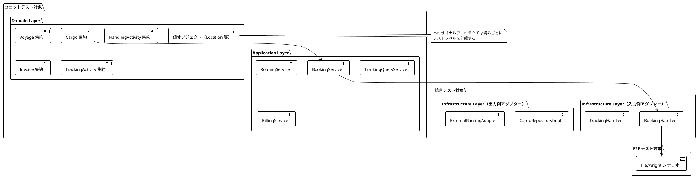
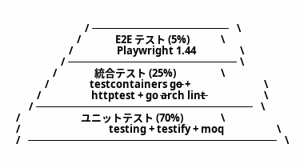
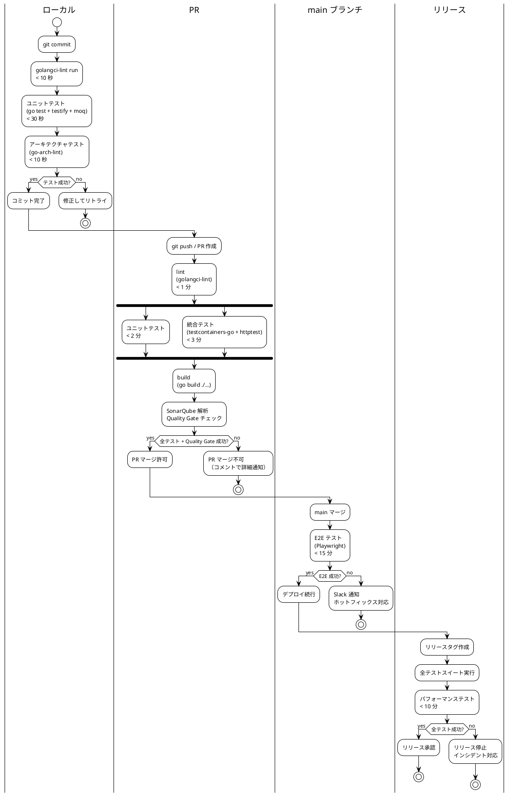
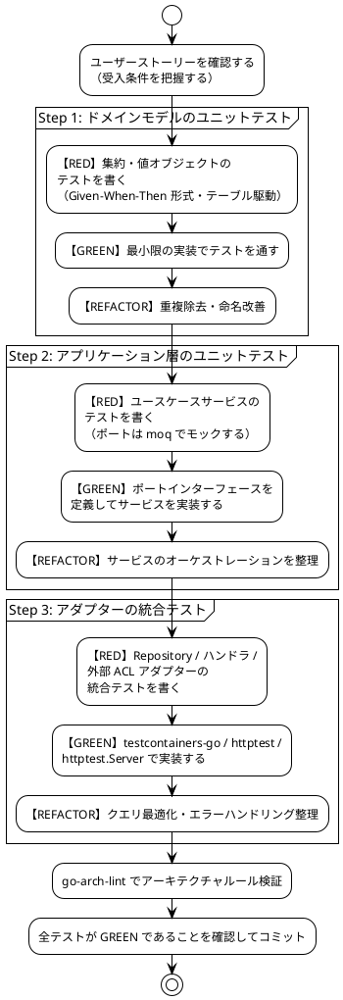

# テスト戦略 - 国際貨物輸送管理システム（Go 版）

## 1. 概要

### 1.1 目的

本ドキュメントは、国際貨物輸送管理システム（Go 移植版）におけるテスト戦略を定義する。テスト戦略を事前に策定し、以下の問いに常に回答できる状態を維持することを目的とする。

- 「この機能はどのテストレベルで保証されているか」
- 「何をどこまでテストすべきか」
- 「テストが失敗したとき、どこを修正すべきか」

### 1.2 基本方針

- **TDD（テスト駆動開発）を全開発プロセスで適用する**: レッド → グリーン → リファクタリングのサイクルを厳守する
- **テストをアーキテクチャに対応させる**: ヘキサゴナルアーキテクチャの境界（ポート）を活かし、テスト可能性を設計段階で確保する
- **テストの重複を排除する**: 各テストレベルの責務を明確に分離し、同一ロジックを複数レベルで重複検証しない
- **テストを実行可能なドキュメントとして扱う**: テーブル駆動テストとテスト名がシステムの振る舞いを説明する

### 1.3 アーキテクチャとテスト戦略の対応関係



ヘキサゴナルアーキテクチャの各層は以下のテストレベルに対応する。

| アーキテクチャ層 | テストレベル | 理由 |
|---|---|---|
| ドメイン層（集約・値オブジェクト・ドメインサービス） | ユニットテスト | 外部依存ゼロ。純粋なビジネスロジック |
| アプリケーション層（ユースケースサービス） | ユニットテスト（ポートを moq でモック） | ポートへの委譲とオーケストレーションを検証 |
| 入力側アダプター（HTTP ハンドラ） | 統合テスト（net/http/httptest） | HTTP マッピングとバリデーション、html/template レンダリングを検証 |
| 出力側アダプター（Repository） | 統合テスト（testcontainers-go） | sqlc 生成コードと SQL クエリの正確性を実 DB で検証 |
| 外部 ACL ポート（5 件） | 統合テスト（httptest.Server） | 外部システムとの契約を検証 |
| ユーザーシナリオ全体 | E2E テスト（Playwright） | クリティカルパスの品質保証 |

---

## 2. テスト形状の選択

### 2.1 採用形状: ピラミッド型



**採用理由**:

- **ドメイン層が厚い**: DDD を採用しており、Cargo・Voyage・HandlingActivity・Invoice の各集約にビジネスロジックが集中する。BookingStatus の 8 値遷移、荷役妥当性検証（MISROUTED 判定）、法人割引計算など、外部依存なしでテスト可能なロジックが多い
- **ヘキサゴナルアーキテクチャによる高いテスト可能性**: ドメイン層とインフラ層の境界がポート（Go の interface）で分離されており、moq によるモックの差し替えが容易。ユニットテストが書きやすい設計になっている
- **CQRS による読み取りモデルの分離**: TrackingContext の読み取りクエリはドメインロジックを持たず、統合テストで Repository を直接検証するだけで十分
- **コスト効率**: ユニットテストは実行が高速（< 30 秒）でメンテナンスコストが低い。E2E テストはフレイキーになりやすく、最小限にとどめることで CI の安定性を維持する

### 2.2 採用しない形状と理由

| 形状 | 採用しない理由 |
|---|---|
| **ダイヤモンド型**（統合テスト重視） | 本システムは単一モノリス（ヘキサゴナル）で構成されており、マイクロサービス間の契約検証ニーズがない。統合テストを主軸にするとテスト実行時間が増大し、TDD サイクルが遅くなる |
| **逆ピラミッド型**（E2E 重視） | Playwright テストはヘッドレスブラウザを起動するためフレイキーになりやすく、htmx の 30 秒ポーリングを含む動的 UI はテストの安定性確保が困難。E2E を主軸にするとフィードバックループが 15 分以上になる |

---

## 3. テストレベルの定義

### 3.1 ユニットテスト（Unit Test）

#### 責務・検証対象

- **ドメイン層**: 集約の状態遷移・不変条件・ビジネスルール、値オブジェクトの等価性・バリデーション、ドメインサービスのロジック
- **アプリケーション層**: ユースケースサービスのオーケストレーション（ポートは moq 生成モック）

#### カバレッジ目標

| 対象 | 行カバレッジ | 分岐カバレッジ |
|---|---|---|
| ドメイン層 | **85% 以上** | **80% 以上** |
| アプリケーション層 | **80% 以上** | **75% 以上** |

#### 使用ツール

- **標準 testing パッケージ**: テストフレームワーク。テーブル駆動テストで網羅性を確保する（JUnit 5 の `@ParameterizedTest` 代替）
- **testify（assert / require）**: 流暢なアサーション（AssertJ 代替。`assert.Equal(t, want, got)`）
- **moq**: ポートインターフェースのモックコード生成（Mockito 代替。`//go:generate moq` ディレクティブで生成）

#### 実行タイミング

- **ローカル**: すべてのコミット時（目標 **30 秒以内**。`go test ./...`）
- **PR**: 自動実行（コミットプッシュ時）
- **CI**: GitHub Actions の `unit-test` ジョブ

#### 除外対象

- インフラ層（sqlc 生成コード、HTTP クライアント）— 統合テストで担保する
- DTO / 単純な struct — データ保持のみでロジックがない
- `main.go` の DI 組み立て（wiring）— ユニットテストの対象に**しない**

#### 時刻・一意 ID の非決定性対策（テスト容易性の設計方針）

現在時刻（`time.Now()`）や一意 ID（UUID 等）をドメイン/アプリケーション層で直接生成すると、テストが非決定的になり境界値の検証ができない。以下の方針でテスト容易性を設計段階で確保する。

- **`Clock` ポートを注入する**: ドメイン/アプリケーション層は `time.Now()` を直接呼ばず、`Clock` ポート（`Now() time.Time`）を注入して現在時刻を取得する。テストでは固定時刻を返すスタブに差し替える
- **`IDGenerator` ポートを注入する**: TrackingID・InvoiceId 等の一意 ID の採番は `IDGenerator` ポートに委譲する。テストでは決定的 ID（`"CARGO-001"` 等）を返すスタブに差し替える

```go
// internal/shared/port/clock.go
type Clock interface {
	Now() time.Time
}

// internal/shared/port/id_generator.go
type IDGenerator interface {
	Generate() string
}

// テスト用スタブ
type FixedClock struct{ T time.Time }

func (c FixedClock) Now() time.Time { return c.T }
```

固定時刻スタブにより、48 時間のエスカレーション境界（47:59 / 48:00 / 48:01）をテーブル駆動テストで決定的に検証できる。

```go
func TestEscalationPolicy_Evaluate_48HourBoundary(t *testing.T) {
	// Given: 遅延発生時刻を固定する
	occurredAt := time.Date(2026, 7, 1, 0, 0, 0, 0, time.UTC)

	tests := []struct {
		name               string
		now                time.Time
		requiresEscalation bool
	}{
		{
			name:               "遅延 47 時間 59 分ではエスカレーション不要と判定される",
			now:                occurredAt.Add(47*time.Hour + 59*time.Minute),
			requiresEscalation: false,
		},
		{
			name:               "遅延ちょうど 48 時間ではエスカレーション不要と判定される（超過が条件）",
			now:                occurredAt.Add(48 * time.Hour),
			requiresEscalation: false,
		},
		{
			name:               "遅延 48 時間 1 分でエスカレーションフラグが立つ",
			now:                occurredAt.Add(48*time.Hour + 1*time.Minute),
			requiresEscalation: true,
		},
	}

	for _, tt := range tests {
		t.Run(tt.name, func(t *testing.T) {
			// Given: 固定時刻 Clock を注入したエスカレーションポリシー
			clock := FixedClock{T: tt.now}
			policy := domain.NewEscalationPolicy(clock)
			event := domain.NewDelayEvent(domain.MustTrackingID("CARGO-001"), occurredAt)

			// When: エスカレーション判定を実行する
			result := policy.Evaluate(event)

			// Then
			assert.Equal(t, tt.requiresEscalation, result.RequiresEscalation)
		})
	}
}
```

#### 実装例: Cargo 集約の BookingStatus 遷移テスト

```go
package booking_test

import (
	"testing"

	"github.com/example/cargotracker/internal/booking/domain"
	"github.com/stretchr/testify/assert"
	"github.com/stretchr/testify/require"
)

func TestCargo_ConfirmBooking(t *testing.T) {
	t.Run("予約が確定できる", func(t *testing.T) {
		// Given: ルートが割り当て済みの貨物
		cargo := domain.FixtureWithRouteAssigned()

		// When: 予約を確定する
		err := cargo.ConfirmBooking()

		// Then: ステータスが CONFIRMED に遷移する
		require.NoError(t, err)
		assert.Equal(t, domain.BookingStatusConfirmed, cargo.BookingStatus())
	})

	t.Run("ルート未割り当て状態で予約確定しようとするとエラーが返る", func(t *testing.T) {
		// Given: ルートが未割り当ての貨物
		cargo := domain.FixturePreliminary()

		// When: 予約を確定する
		err := cargo.ConfirmBooking()

		// Then: 不変条件違反でドメインエラーが返る
		require.Error(t, err)
		assert.ErrorIs(t, err, domain.ErrRouteNotAssigned)
		assert.Contains(t, err.Error(), "ルートが割り当てられていません")
	})

	t.Run("危険物の取扱不可港にルートを割り当てるとエラーが返る", func(t *testing.T) {
		// Given: 危険物フラグが立った貨物と危険物取扱不可の港を経由するルート
		cargo := domain.FixtureHazardous()
		prohibitedRoute := domain.RouteFixtureViaHazardousProhibitedPort()

		// When & Then: ドメインルール違反でエラーが返る
		err := cargo.AssignRoute(prohibitedRoute)
		assert.ErrorIs(t, err, domain.ErrHazardousCargoRouting)
	})
}

// テーブル駆動テスト（@ParameterizedTest 代替）
func TestCargo_ConfirmBooking_TerminalStates(t *testing.T) {
	terminalStatuses := []domain.BookingStatus{
		domain.BookingStatusSettled,
		domain.BookingStatusCancelled,
	}

	for _, status := range terminalStatuses {
		t.Run("終端状態 "+status.String()+" からの遷移は許可されない", func(t *testing.T) {
			// Given: 終端ステータスの貨物
			cargo := domain.FixtureWithStatus(status)

			// When & Then: ステータス遷移が拒否される
			err := cargo.ConfirmBooking()
			assert.ErrorIs(t, err, domain.ErrInvalidBookingStatusTransition)
		})
	}
}
```

#### 実装例: moq によるポートモック生成

アプリケーション層のユニットテストでは、moq で生成したモックを使ってポートの振る舞いを差し替える。

```go
// internal/booking/application/port.go
package application

//go:generate moq -out cargo_repository_moq_test.go . CargoRepository

type CargoRepository interface {
	Save(ctx context.Context, cargo *domain.Cargo) error
	FindByTrackingID(ctx context.Context, id domain.TrackingID) (*domain.Cargo, error)
}
```

```go
// internal/booking/application/booking_service_test.go
func TestBookingService_BookNewCargo(t *testing.T) {
	// Given: 保存を成功させるモックリポジトリ
	repo := &CargoRepositoryMock{
		SaveFunc: func(ctx context.Context, cargo *domain.Cargo) error {
			return nil
		},
	}
	service := application.NewBookingService(repo)

	// When: 新規予約を登録する
	trackingID, err := service.BookNewCargo(context.Background(), application.BookNewCargoCommand{
		Origin:          "JPTYO",
		Destination:     "DEHAM",
		ArrivalDeadline: time.Date(2026, 6, 30, 0, 0, 0, 0, time.UTC),
	})

	// Then: 追跡番号が発行され、リポジトリが 1 回呼ばれる
	require.NoError(t, err)
	assert.NotEmpty(t, trackingID)
	assert.Len(t, repo.SaveCalls(), 1)
}
```

---

### 3.2 統合テスト（Integration Test）

#### 責務・検証対象

- **Repository（sqlc 生成コード）**: SQL クエリの正確性、トランザクション、楽観的ロック
- **HTTP ハンドラ（net/http/httptest）**: HTTP リクエスト/レスポンスのマッピング、バリデーション、エラーハンドリング、html/template のレンダリング
- **外部 ACL ポート（httptest.Server）**: 外部システムとの契約遵守、タイムアウト・フォールバック

H2 のようなインメモリ DB は使用せず、testcontainers-go による実 PostgreSQL のみを使用する（Testcontainers 方針を継承しつつ H2 は廃止）。

#### カバレッジ目標

| 対象 | 行カバレッジ |
|---|---|
| Repository（インフラ層） | **75% 以上** |
| ハンドラ層 | **70% 以上** |

#### 使用ツール

- **testcontainers-go**: 実 PostgreSQL 16 コンテナをテストコードから自動起動（Testcontainers + `@ServiceConnection` 代替）
- **net/http/httptest**: HTTP 層の結合テスト（MockMvc 代替。`httptest.NewRecorder` / `httptest.NewRequest`）
- **httptest.Server**: 外部 ACL ポートのスタブ（WireMock 代替。5 件すべてを対象）
- **sqlc**: 型安全な SQL コード生成。生成コードをリポジトリテストで検証する

#### 実行タイミング

- **PR 時**: GitHub Actions の `integration-test` ジョブ（目標 **5 分以内**）
- **ローカル**: Docker が起動している環境で任意実行（`go test -tags=integration ./...`）

#### 実装例: CargoRepository の保存・検索テスト（testcontainers-go）

```go
//go:build integration

package persistence_test

import (
	"context"
	"testing"

	"github.com/testcontainers/testcontainers-go/modules/postgres"
	"github.com/stretchr/testify/assert"
	"github.com/stretchr/testify/require"
)

func TestCargoRepository_SaveAndFind(t *testing.T) {
	ctx := context.Background()

	// Given: 実 PostgreSQL 16 コンテナを起動しマイグレーションを適用する
	container, err := postgres.Run(ctx,
		"postgres:16-alpine",
		postgres.WithInitScripts("../../../db/migrations"),
		postgres.BasicWaitStrategies(),
	)
	require.NoError(t, err)
	t.Cleanup(func() { _ = container.Terminate(ctx) })

	pool := mustConnect(t, ctx, container)
	repo := persistence.NewCargoRepository(pool) // sqlc 生成コードを内部で使用

	t.Run("貨物を保存して追跡番号で検索できる", func(t *testing.T) {
		// Given: 新規貨物エンティティ
		cargo := domain.FixtureNewBooking(
			domain.MustTrackingID("CARGO-001"),
			domain.MustUnLocode("JPTYO"),
			domain.MustUnLocode("DEHAM"),
		)

		// When: 保存して検索する
		require.NoError(t, repo.Save(ctx, cargo))
		found, err := repo.FindByTrackingID(ctx, domain.MustTrackingID("CARGO-001"))

		// Then: 保存したエンティティと一致する
		require.NoError(t, err)
		assert.Equal(t, domain.MustUnLocode("JPTYO"), found.Origin())
		assert.Equal(t, domain.MustUnLocode("DEHAM"), found.Destination())
	})

	t.Run("存在しない追跡番号で検索すると ErrNotFound を返す", func(t *testing.T) {
		// Given & When
		_, err := repo.FindByTrackingID(ctx, domain.MustTrackingID("NONEXISTENT"))

		// Then
		assert.ErrorIs(t, err, persistence.ErrCargoNotFound)
	})
}
```

#### 実装例: BookingHandler の httptest テスト

```go
func TestBookingHandler_CreateBooking(t *testing.T) {
	t.Run("貨物予約登録 API が 201 を返す", func(t *testing.T) {
		// Given: 予約登録リクエストとモックサービス
		service := &BookingServiceMock{
			BookNewCargoFunc: func(ctx context.Context, cmd application.BookNewCargoCommand) (domain.TrackingID, error) {
				return domain.MustTrackingID("CARGO-001"), nil
			},
		}
		handler := web.NewBookingHandler(service)

		body := strings.NewReader(`{
			"originUnLocode": "JPTYO",
			"destinationUnLocode": "DEHAM",
			"arrivalDeadline": "2026-06-30"
		}`)
		req := httptest.NewRequest(http.MethodPost, "/api/bookings", body)
		req.Header.Set("Content-Type", "application/json")
		rec := httptest.NewRecorder()

		// When
		handler.ServeHTTP(rec, req)

		// Then
		assert.Equal(t, http.StatusCreated, rec.Code)
		assert.JSONEq(t, `{"trackingId": "CARGO-001"}`, rec.Body.String())
	})

	t.Run("出発地コードが不正な場合は 400 を返す", func(t *testing.T) {
		// Given: 不正な UN/LOCODE を含むリクエスト
		handler := web.NewBookingHandler(&BookingServiceMock{})
		body := strings.NewReader(`{
			"originUnLocode": "INVALID",
			"destinationUnLocode": "DEHAM",
			"arrivalDeadline": "2026-06-30"
		}`)
		req := httptest.NewRequest(http.MethodPost, "/api/bookings", body)
		req.Header.Set("Content-Type", "application/json")
		rec := httptest.NewRecorder()

		// When
		handler.ServeHTTP(rec, req)

		// Then
		assert.Equal(t, http.StatusBadRequest, rec.Code)
		assert.Contains(t, rec.Body.String(), "originUnLocode")
	})
}
```

#### 実装例: html/template レンダリング検証

```go
func TestTrackingHandler_RendersTrackingPage(t *testing.T) {
	// Given: 追跡情報を返すモックと html/template を組み込んだハンドラ
	handler := web.NewTrackingHandler(&TrackingQueryServiceMock{
		FindByTrackingIDFunc: func(ctx context.Context, id domain.TrackingID) (query.TrackingView, error) {
			return query.TrackingView{TrackingID: "CARGO-001", TransportStatus: "UNLOADED", CurrentLocation: "東京港"}, nil
		},
	})
	req := httptest.NewRequest(http.MethodGet, "/tracking/CARGO-001", nil)
	rec := httptest.NewRecorder()

	// When
	handler.ServeHTTP(rec, req)

	// Then: テンプレートに追跡情報が描画される
	assert.Equal(t, http.StatusOK, rec.Code)
	assert.Contains(t, rec.Body.String(), "UNLOADED")
	assert.Contains(t, rec.Body.String(), "東京港")
}
```

#### httptest.Server 契約テストの概要

各 ACL ポートに対して httptest.Server スタブを定義する。詳細は [セクション 4](#4-httptestserver-契約テストシナリオacl-ポート別) を参照。

---

### 3.3 アーキテクチャテスト（Architecture Test）

#### 責務・検証対象

ヘキサゴナルアーキテクチャの依存関係ルールをコードレベルで自動検証する。アーキテクチャの腐敗（依存関係の逆転・Bounded Context 間の直接参照）を CI で検出する。

#### 使用ツール

- **go-arch-lint**: Go パッケージの依存関係を YAML で宣言的に検証（ArchUnit 代替）

#### 実行タイミング

- **PR 時**: GitHub Actions の `unit-test` ジョブに統合（ユニットテストと同時実行）
- **ローカル**: `go-arch-lint check` で実行

#### 検証ルール 4 件

```yaml
# .go-arch-lint.yml
version: 3
workdir: .
allow:
  depOnAnyVendor: false

components:
  domain:         { in: internal/*/domain/** }
  application:    { in: internal/*/application/** }
  infrastructure: { in: internal/*/infrastructure/** }
  shared:         { in: internal/shared/** }

deps:
  # ルール 1: domain パッケージが infrastructure パッケージを import しない
  # （依存方向は infrastructure → domain でなければならない）
  domain:
    mayDependOn:
      - shared

  # ルール 2: domain パッケージがフレームワーク（HTTP・DB ドライバ等）に依存しない
  # （ドメインオブジェクトは標準ライブラリのみで構成する。
  #   canUse を空にすることで外部ライブラリ依存を禁止する）

  # ルール 3: アプリケーション層がインフラ層を直接参照しない（Port 経由のみ許可）
  application:
    mayDependOn:
      - domain
      - shared

  # ルール 4: 異なる Bounded Context 間でパッケージを直接参照しない
  # （internal/booking・internal/routing 等はお互いを import できない。
  #   Bounded Context 間の通信はドメインイベントまたは ACL 経由とし、
  #   shared パッケージ（共有カーネル）への参照のみ許可する）
  infrastructure:
    mayDependOn:
      - domain
      - application
      - shared
```

補足として、Bounded Context 間の相互参照禁止（ルール 4）は各コンテキストをコンポーネントとして個別定義し `mayDependOn` に他コンテキストを含めないことで強制する。go-arch-lint で表現しきれないルールは `go vet` カスタムアナライザで補完する。

---

### 3.4 E2E テスト（End-to-End Test）

#### 責務・検証対象

クリティカルなユーザーシナリオをブラウザレベルで検証する。ドメインロジックの再検証は行わず、ユーザー体験の観点からシステム全体が協調動作することを確認する。

**優先シナリオ（US08・US10・US13）**:

| シナリオ | 理由 |
|---|---|
| US08: 予約を確定する | 予約フローの最終ステップ。複数コンテキストが連携する |
| US10: 荷役作業を記録する | 最も頻繁に実行される運用操作 |
| US13: 追跡情報を照会する | 顧客向け重要機能。htmx ポーリングを含む |

#### カバレッジ目標

- 優先度「高」のユーザーシナリオ（US01〜US15）の **80% カバー**

#### 使用ツール

- **Playwright 1.44+**: ブラウザ自動化（TypeScript）
- **htmx 対応**: `waitForSelector` によるポーリング更新の待機

#### 実行タイミング

- **main ブランチマージ後**: GitHub Actions の `e2e-test` ジョブ（目標 **15 分以内**）
- **リリース前**: 全 E2E シナリオを実行

#### htmx 30 秒ポーリングへの対応

htmx の `hx-trigger="every 30s"` による自動更新を Playwright でテストするには、`waitForSelector` でポーリング後の DOM 更新を待機する。

```typescript
// htmx ポーリング完了を待機するユーティリティ
async function waitForHtmxUpdate(page: Page, selector: string, timeout = 35000) {
  // htmx が更新した要素に hx-request 属性が付与されるため、
  // その変化を監視してポーリング完了を検出する
  await page.waitForFunction(
    (sel) => {
      const el = document.querySelector(sel);
      return el && !el.hasAttribute('hx-request');
    },
    selector,
    { timeout }
  );
}
```

#### 実装例: US13 追跡情報照会の Playwright テスト（TypeScript）

```typescript
import { test, expect, Page } from '@playwright/test';

test.describe('US13: 追跡情報を照会する', () => {
  let page: Page;

  test.beforeEach(async ({ browser }) => {
    page = await browser.newPage();
  });

  test('追跡番号で貨物の現在状態を照会できる', async () => {
    // Given: 荷役作業が記録済みの貨物が存在する
    await page.goto('/tracking');

    // When: 追跡番号を入力して検索する
    await page.fill('[data-testid="tracking-id-input"]', 'CARGO-001');
    await page.click('[data-testid="search-button"]');

    // Then: 追跡情報が表示される
    await expect(page.locator('[data-testid="transport-status"]'))
      .toHaveText('UNLOADED', { timeout: 10000 });
    await expect(page.locator('[data-testid="current-location"]'))
      .toContainText('東京港');
  });

  test('htmx ポーリングで追跡情報が自動更新される', async () => {
    // Given: 追跡ページを表示している
    await page.goto('/tracking/CARGO-001');
    const initialStatus = await page
      .locator('[data-testid="transport-status"]')
      .textContent();

    // When: バックエンドで荷役イベントが発生し、30 秒後にポーリングが更新される
    // （テスト環境ではポーリング間隔を 5 秒に短縮）
    await waitForHtmxUpdate(page, '[data-testid="tracking-panel"]', 10000);

    // Then: ページを再読み込みせずに最新状態が反映される
    const updatedStatus = await page
      .locator('[data-testid="transport-status"]')
      .textContent();
    expect(updatedStatus).not.toBe(initialStatus);
  });

  test('存在しない追跡番号を入力するとエラーメッセージが表示される', async () => {
    // Given
    await page.goto('/tracking');

    // When
    await page.fill('[data-testid="tracking-id-input"]', 'NONEXISTENT-999');
    await page.click('[data-testid="search-button"]');

    // Then
    await expect(page.locator('[data-testid="error-message"]'))
      .toContainText('追跡番号が見つかりません');
  });
});

async function waitForHtmxUpdate(page: Page, selector: string, timeout = 35000) {
  await page.waitForFunction(
    (sel) => {
      const el = document.querySelector(sel);
      return el && !el.hasAttribute('hx-request');
    },
    selector,
    { timeout }
  );
}
```

---

## 4. httptest.Server 契約テストシナリオ（ACL ポート別）

各外部 ACL ポートに対して正常・異常シナリオを定義し、httptest.Server でスタブ化する（WireMock 代替。契約テストの考え方は維持する）。

### 4.1 シナリオ一覧

| ポート | 正常シナリオ | 異常シナリオ |
|---|---|---|
| ExternalRoutingServicePort | ルート検索 → 3 候補返却 | 接続タイムアウト → 過去実績データにフォールバック |
| CustomsClearancePort | 通関申請 → CLEARED | HELD ステータス → 例外イベント発行 |
| PaymentGatewayPort | 支払い処理 → CONFIRMED | 決済失敗 → OVERDUE 状態遷移 |
| PortManagementPort | 港湾入港通知 → 受理 | 港湾満杯 → 代替港提案 |
| NotificationPort | メール通知送信 → 202 Accepted | 通知失敗 → ログ記録（非クリティカル） |

### 4.2 httptest.Server 実装例

#### ExternalRoutingServicePort: ルート検索（正常・タイムアウト）

```go
func TestExternalRoutingAdapter_SearchRoutes(t *testing.T) {
	t.Run("ルート検索で 3 候補が返却される", func(t *testing.T) {
		// Given: 3 候補を返すスタブサーバー
		server := httptest.NewServer(http.HandlerFunc(func(w http.ResponseWriter, r *http.Request) {
			assert.Equal(t, "/api/routes/search", r.URL.Path)
			w.Header().Set("Content-Type", "application/json")
			_, _ = w.Write([]byte(`{
				"routes": [
					{"id": "R001", "legs": [{"voyageNumber": "V001"}], "transitTime": 14},
					{"id": "R002", "legs": [{"voyageNumber": "V002"}], "transitTime": 18},
					{"id": "R003", "legs": [{"voyageNumber": "V003"}], "transitTime": 21}
				]
			}`))
		}))
		defer server.Close()

		adapter := acl.NewExternalRoutingAdapter(server.URL, 5*time.Second, fallbackRepo)

		// When: ルート検索を実行する
		routes, err := adapter.SearchRoutes(context.Background(), acl.RouteSearchRequest{
			Origin:      domain.MustUnLocode("JPTYO"),
			Destination: domain.MustUnLocode("DEHAM"),
			Deadline:    time.Date(2026, 6, 30, 0, 0, 0, 0, time.UTC),
		})

		// Then: 3 候補が返却される
		require.NoError(t, err)
		assert.Len(t, routes, 3)
		assert.Equal(t, 14, routes[0].TransitDays)
	})

	t.Run("接続タイムアウト時に過去実績データにフォールバックする", func(t *testing.T) {
		// Given: タイムアウトを発生させるスタブ（タイムアウト閾値 5 秒を超過する 6 秒遅延）
		server := httptest.NewServer(http.HandlerFunc(func(w http.ResponseWriter, r *http.Request) {
			time.Sleep(6 * time.Second)
		}))
		defer server.Close()

		adapter := acl.NewExternalRoutingAdapter(server.URL, 5*time.Second, fallbackRepo)

		// When: ルート検索を実行する
		routes, err := adapter.SearchRoutes(context.Background(), acl.RouteSearchRequest{
			Origin:      domain.MustUnLocode("JPTYO"),
			Destination: domain.MustUnLocode("DEHAM"),
			Deadline:    time.Date(2026, 6, 30, 0, 0, 0, 0, time.UTC),
		})

		// Then: 過去実績データからフォールバック候補が返却される
		require.NoError(t, err)
		assert.NotEmpty(t, routes)
		for _, route := range routes {
			assert.True(t, route.IsFallback)
		}
	})
}
```

#### CustomsClearancePort: 通関申請（CLEARED・HELD）

```go
func TestCustomsClearanceAdapter_SubmitClearance(t *testing.T) {
	t.Run("通関申請が承認されて CLEARED ステータスを返す", func(t *testing.T) {
		// Given
		server := stubJSON(t, "/api/customs/clearance", http.StatusOK,
			`{"status": "CLEARED", "clearanceId": "CUS-001"}`)
		defer server.Close()

		adapter := acl.NewCustomsClearanceAdapter(server.URL)

		// When
		result, err := adapter.SubmitClearance(context.Background(),
			acl.ClearanceRequest{TrackingID: domain.MustTrackingID("CARGO-001")})

		// Then
		require.NoError(t, err)
		assert.Equal(t, acl.ClearanceStatusCleared, result.Status)
	})

	t.Run("通関保留 HELD ステータス受信時に例外イベントが発行される", func(t *testing.T) {
		// Given
		server := stubJSON(t, "/api/customs/clearance", http.StatusOK,
			`{"status": "HELD", "reason": "書類不備", "holdId": "HOLD-001"}`)
		defer server.Close()

		adapter := acl.NewCustomsClearanceAdapter(server.URL)

		// When
		result, err := adapter.SubmitClearance(context.Background(),
			acl.ClearanceRequest{TrackingID: domain.MustTrackingID("CARGO-002")})

		// Then: HELD ステータスが返却され、例外イベントが発行可能な状態になる
		require.NoError(t, err)
		assert.Equal(t, acl.ClearanceStatusHeld, result.Status)
		assert.Equal(t, "書類不備", result.HoldReason)
	})
}
```

#### PaymentGatewayPort: 支払い処理（CONFIRMED・失敗）

```go
func TestPaymentGatewayAdapter_ProcessPayment(t *testing.T) {
	t.Run("支払い処理が成功して CONFIRMED を返す", func(t *testing.T) {
		// Given
		server := stubJSON(t, "/api/payments", http.StatusOK,
			`{"status": "CONFIRMED", "transactionId": "TXN-001"}`)
		defer server.Close()

		adapter := acl.NewPaymentGatewayAdapter(server.URL)

		// When
		result, err := adapter.ProcessPayment(context.Background(), acl.PaymentRequest{
			InvoiceID: domain.MustInvoiceID("INV-001"),
			Amount:    domain.MustMoney(150_000, "JPY"),
		})

		// Then
		require.NoError(t, err)
		assert.Equal(t, acl.PaymentStatusConfirmed, result.Status)
	})

	t.Run("決済失敗時に OVERDUE 状態への遷移情報が返却される", func(t *testing.T) {
		// Given: 決済失敗レスポンス
		server := stubJSON(t, "/api/payments", http.StatusPaymentRequired,
			`{"status": "FAILED", "errorCode": "INSUFFICIENT_FUNDS"}`)
		defer server.Close()

		adapter := acl.NewPaymentGatewayAdapter(server.URL)

		// When
		result, err := adapter.ProcessPayment(context.Background(), acl.PaymentRequest{
			InvoiceID: domain.MustInvoiceID("INV-002"),
			Amount:    domain.MustMoney(500_000, "JPY"),
		})

		// Then: 失敗情報が返却される（OVERDUE 遷移はドメイン層が担当）
		require.NoError(t, err)
		assert.Equal(t, acl.PaymentStatusFailed, result.Status)
		assert.Equal(t, "INSUFFICIENT_FUNDS", result.ErrorCode)
	})
}
```

#### PortManagementPort: 港湾入港通知（受理・代替港提案）

```go
func TestPortManagementAdapter_NotifyArrival(t *testing.T) {
	t.Run("港湾入港通知が受理される", func(t *testing.T) {
		// Given
		server := stubJSON(t, "/api/ports/arrival", http.StatusAccepted,
			`{"accepted": true, "berthId": "BERTH-A1"}`)
		defer server.Close()

		adapter := acl.NewPortManagementAdapter(server.URL)

		// When
		result, err := adapter.NotifyArrival(context.Background(), acl.ArrivalNotification{
			Port:         domain.MustUnLocode("JPTYO"),
			VoyageNumber: domain.MustVoyageNumber("V001"),
		})

		// Then
		require.NoError(t, err)
		assert.True(t, result.Accepted)
		assert.Equal(t, "BERTH-A1", result.BerthID)
	})

	t.Run("港湾満杯時に代替港が提案される", func(t *testing.T) {
		// Given
		server := stubJSON(t, "/api/ports/arrival", http.StatusConflict, `{
			"accepted": false,
			"reason": "PORT_FULL",
			"alternativePorts": ["JPYOK", "JPKOB"]
		}`)
		defer server.Close()

		adapter := acl.NewPortManagementAdapter(server.URL)

		// When
		result, err := adapter.NotifyArrival(context.Background(), acl.ArrivalNotification{
			Port:         domain.MustUnLocode("JPTYO"),
			VoyageNumber: domain.MustVoyageNumber("V002"),
		})

		// Then: 代替港リストが返却される
		require.NoError(t, err)
		assert.False(t, result.Accepted)
		assert.Equal(t, []domain.UnLocode{
			domain.MustUnLocode("JPYOK"),
			domain.MustUnLocode("JPKOB"),
		}, result.AlternativePorts)
	})
}
```

#### NotificationPort: メール通知（202 Accepted・失敗ログ）

```go
func TestNotificationAdapter_SendEmail(t *testing.T) {
	t.Run("メール通知送信が 202 Accepted を返す", func(t *testing.T) {
		// Given: 呼び出し回数を記録するスタブ
		var calls int32
		server := httptest.NewServer(http.HandlerFunc(func(w http.ResponseWriter, r *http.Request) {
			atomic.AddInt32(&calls, 1)
			assert.Equal(t, "/api/notifications/email", r.URL.Path)
			w.WriteHeader(http.StatusAccepted)
		}))
		defer server.Close()

		adapter := acl.NewNotificationAdapter(server.URL)

		// When: 通知送信を実行する
		err := adapter.SendEmail(context.Background(), acl.EmailNotification{
			To:      "customer@example.com",
			Subject: "貨物が到着しました",
			Body:    "...",
		})

		// Then: エラーなく、スタブが 1 回呼び出される
		require.NoError(t, err)
		assert.EqualValues(t, 1, atomic.LoadInt32(&calls))
	})

	t.Run("通知失敗時にログを記録して処理を継続する", func(t *testing.T) {
		// Given: 通知サービスがエラーを返す（非クリティカルなのでエラーを伝播しない）
		server := stubJSON(t, "/api/notifications/email", http.StatusServiceUnavailable, `{}`)
		defer server.Close()

		adapter := acl.NewNotificationAdapter(server.URL)

		// When & Then: エラーが外部に伝播しない（ログのみ記録）
		err := adapter.SendEmail(context.Background(), acl.EmailNotification{
			To:      "customer@example.com",
			Subject: "通知テスト",
			Body:    "...",
		})
		assert.NoError(t, err)
	})
}
```

---

## 5. ユーザーストーリーとテストのトレーサビリティ

| US | タイトル | ユニットテスト | 統合テスト | E2E テスト | 優先度 |
|---|---|---|---|---|---|
| US01 | 輸送見積を作成する | `QuotationService`、`Quotation` 値オブジェクト | `ExternalRoutingServicePort` httptest.Server | - | 高 |
| US02 | 荷主を登録する | `Shipper` 集約、`ShipperRegistrationService` | `ShipperRepository`、`ShipperHandler` | - | 高 |
| US03 | 法人荷主を登録する | `CorporateShipper` 集約、法人割引率計算 | `CorporateShipperRepository`、`ShipperHandler` | - | 高 |
| US04 | 貨物予約を登録する | `Cargo` 集約、`BookingStatus` 初期遷移 | `CargoRepository`、`BookingHandler` | - | 高 |
| US05 | 危険物・冷凍貨物の予約を登録する | `Cargo` 集約（危険物フラグ）、`CargoCategory` 値オブジェクト | `CargoRepository`、`BookingHandler` | - | 高 |
| US06 | 最適ルートを検索する | `RoutingService`、`Itinerary` 値オブジェクト | `ExternalRoutingServicePort` httptest.Server（正常・タイムアウト） | - | 高 |
| US07 | ルートを選択して予約に紐付ける | `Cargo.AssignRoute()`、`BookingStatus` ROUTE_PROPOSED 遷移 | `CargoRepository`（ルート保存）、`RoutingHandler` | - | 高 |
| US08 | 予約を確定する | `Cargo.ConfirmBooking()`、`BookingStatus` CONFIRMED 遷移 | `BookingHandler`（確定 API）、`CargoRepository` | **US08 シナリオ** | 高 |
| US09 | 追跡番号を発行する | `TrackingID` 値オブジェクト（一意性）、`TrackingIDGenerator` | `CargoRepository`（追跡番号保存） | - | 高 |
| US10 | 荷役作業を記録する | `HandlingActivity` 集約、MISROUTED 判定ロジック | `HandlingActivityRepository`、`HandlingHandler` | **US10 シナリオ** | 高 |
| US11 | 引取作業を記録する | `HandlingActivity`（RECEIVED イベント） | `HandlingHandler`（引取 API） | - | 高 |
| US12 | 貨物状態を手動更新する | `TrackingActivity`、`TransportStatus` 遷移（9 値） | `TrackingHandler`（手動更新 API） | - | 高 |
| US13 | 追跡情報を照会する | - | `TrackingQueryService`（CQRS 読み取り）、`TrackingHandler` | **US13 シナリオ** | 高 |
| US14 | 遅延例外を処理する | `TrackingExceptionEvent` エスカレーション判定 | `TrackingHandler`（例外処理 API）、`NotificationPort` httptest.Server | - | 高 |
| US15 | 破損・紛失例外を処理する | `HandlingException` 集約、`ExceptionType` 値オブジェクト | `HandlingHandler`（例外記録 API）、`CustomsClearancePort` httptest.Server | - | 高 |
| US16 | 輸送料金を算出する | `Invoice` 集約、`FreightCalculationService`、消費税計算 | `InvoiceRepository`、`BillingHandler` | - | 中 |
| US17 | 法人割引を適用する | `DiscountPolicy` 値オブジェクト、法人割引率計算ロジック | `BillingHandler`（割引適用 API）、`PaymentGatewayPort` httptest.Server | - | 中 |
| US18 | 精算を処理する | `Invoice.Settle()`、`InvoiceStatus` 遷移 | `BillingHandler`（精算 API）、`PaymentGatewayPort` httptest.Server（正常・失敗） | - | 中 |

---

## 6. カバレッジ目標とメトリクス

### 6.1 レイヤー別カバレッジ目標

| レイヤー | 行カバレッジ目標 | 分岐カバレッジ目標 | 計測ツール |
|---|---|---|---|
| ドメイン層（`internal/*/domain` パッケージ） | **85% 以上** | **80% 以上** | go test -cover / SonarQube |
| アプリケーション層（`internal/*/application` パッケージ） | **80% 以上** | **75% 以上** | go test -cover / SonarQube |
| インフラ層 - Repository（`internal/*/infrastructure/persistence` パッケージ） | **75% 以上** | — | go test -cover / SonarQube |
| インフラ層 - ハンドラ（`internal/*/infrastructure/web` パッケージ） | **70% 以上** | — | go test -cover / SonarQube |

カバレッジプロファイルは以下のコマンドで生成し、SonarQube に連携する。

```bash
go test -coverprofile=coverage.out -covermode=atomic ./...
go tool cover -func=coverage.out   # レイヤー別確認
# sonar-project.properties: sonar.go.coverage.reportPaths=coverage.out
```

### 6.2 SonarQube Quality Gate 条件

| 条件 | 基準値 | 適用対象 |
|---|---|---|
| 行カバレッジ（新規コード） | **80% 以上** | 新規追加コード |
| 重複コード率 | **3% 以下** | プロジェクト全体 |
| Reliability Rating | **A**（バグゼロ） | プロジェクト全体 |
| Security Rating | **A**（脆弱性ゼロ） | プロジェクト全体 |
| Maintainability Rating | **A** | 新規コード |
| Security Hotspot Review | **100%** | 新規コード |

Quality Gate が失敗した場合、PR のマージをブロックする。

---

## 7. CI/CD とのテスト連携

### 7.1 ステージ別テスト戦略

GitHub Actions では lint（golangci-lint）→ test → build の順にジョブを実行する。

| ステージ | テスト種別 | 目標時間 | 失敗時の扱い |
|---|---|---|---|
| コミット（ローカル） | golangci-lint + ユニットテスト + アーキテクチャテスト | **< 60 秒** | コミット前に修正 |
| PR | lint + ユニット + 統合 + go-arch-lint + SonarQube | **< 5 分** | PR マージ不可 |
| main ブランチマージ後 | E2E テスト | **< 15 分** | Slack 通知（ホットフィックス優先） |
| リリース | 全テスト + パフォーマンステスト | **< 30 分** | リリース停止 |

### 7.2 GitHub Actions パイプライン図



---

## 8. TDD 開発ワークフロー

### 8.1 インサイドアウト TDD（バックエンド）

ドメイン層から外側に向かって開発する。外部依存を後回しにすることで、ビジネスロジックに集中できる。



### 8.2 重要なビジネスルール（必ず TDD 適用）

以下のビジネスルールは複雑度が高く、テストファーストで実装しなければならない。

#### Cargo の BookingStatus 状態遷移（8 値）

```
PRELIMINARY → ROUTE_PROPOSED → CONFIRMED → TRACKING_ISSUED
    → IN_TRANSIT → DELIVERED → SETTLED
    ↘ CANCELLED（いずれの状態からも遷移可能）
```

テスト観点:

- 各遷移の正常系（許可されている遷移）
- 各遷移の異常系（許可されていない遷移 → `ErrInvalidBookingStatusTransition`）
- いずれの状態からも CANCELLED へ遷移できること
- 終端状態（SETTLED・CANCELLED）からの遷移拒否

なお MISROUTED は BookingStatus の値ではなく、RoutingStatus（NOT_ROUTED / ROUTED / MISROUTED）の値である。MISROUTED 判定は次項の HandlingActivity 集約の荷役妥当性検証でテストする。

#### HandlingActivity の荷役妥当性検証（RoutingStatus の MISROUTED 判定）

対象集約は Handling Context の `HandlingActivity` 集約（妥当性検証 `isValidFor`）と、その結果を反映する Booking Context の `Cargo` 集約（`Delivery.routingStatus`）である。荷役記録時刻は `Clock` ポート経由の固定時刻を使用する。

```go
func TestHandlingActivity_IsValidFor_Misrouted(t *testing.T) {
	// Given: 東京→ハンブルク の旅程を持つ貨物スナップショット（ACL 経由取得）と固定時刻 Clock
	clock := FixedClock{T: time.Date(2026, 7, 1, 10, 0, 0, 0, time.UTC)}
	snapshot := domain.CargoSnapshotFixtureTokyoToHamburg()

	// When: 旅程の積込港に含まれないシンガポールで LOAD 作業を登録する
	activity := domain.NewHandlingActivity(
		domain.MustCargoBookingId("CARGO-001"),
		domain.MustUnLocode("SGSIN"), // 旅程外の港
		domain.HandlingTypeLoad,
		domain.MustVoyageNumber("V0100"), // LOAD は VoyageNumber 必須
		clock.Now(),
	)
	result := activity.IsValidFor(snapshot)

	// Then: 荷役妥当性検証が MISROUTED と判定する
	assert.Equal(t, domain.RoutingStatusMisrouted, result.RoutingStatus())
}

func TestCargo_ReflectMisrouted_RoutingStatus(t *testing.T) {
	// Given: ルート割り当て済み（ROUTED）の貨物
	cargo := domain.FixtureWithRouteAssigned()
	require.Equal(t, domain.RoutingStatusRouted, cargo.Delivery().RoutingStatus())

	// When: Handling Context の MISROUTED 確定を Booking Context に反映する
	cargo.MarkMisrouted()

	// Then: Cargo の RoutingStatus が MISROUTED になる（BookingStatus は変化しない）
	assert.Equal(t, domain.RoutingStatusMisrouted, cargo.Delivery().RoutingStatus())
}
```

#### Invoice の料金計算（法人割引・消費税計算）

```go
func TestInvoice_Calculate_CorporateDiscountAndTax(t *testing.T) {
	// Given: 基本料金 100,000 円、法人割引率 10% の Invoice
	baseAmount := domain.MustMoney(100_000, "JPY")
	corporateDiscount := domain.CorporateDiscount(domain.MustPercentage(10))

	// When: 料金を確定する
	invoice, err := domain.CalculateInvoice(baseAmount, corporateDiscount, domain.TaxRateStandard)

	// Then: 割引後 90,000 円 × 消費税 10% = 99,000 円
	require.NoError(t, err)
	assert.Equal(t, domain.MustMoney(90_000, "JPY"), invoice.NetAmount())
	assert.Equal(t, domain.MustMoney(9_000, "JPY"), invoice.TaxAmount())
	assert.Equal(t, domain.MustMoney(99_000, "JPY"), invoice.TotalAmount())
}
```

#### TrackingExceptionEvent のエスカレーション判定

```go
func TestEscalationPolicy_Evaluate(t *testing.T) {
	tests := []struct {
		name               string
		delay              time.Duration
		requiresEscalation bool
		level              domain.EscalationLevel
	}{
		{
			name:               "遅延が 48 時間を超える場合にエスカレーションフラグが立つ",
			delay:              72 * time.Hour,
			requiresEscalation: true,
			level:              domain.EscalationLevelCritical,
		},
		{
			name:               "遅延が 48 時間以内の場合はエスカレーション不要と判定される",
			delay:              24 * time.Hour,
			requiresEscalation: false,
		},
	}

	for _, tt := range tests {
		t.Run(tt.name, func(t *testing.T) {
			// Given: 遅延例外イベント
			event := domain.NewDelayEvent(domain.MustTrackingID("CARGO-001"), tt.delay)

			// When: エスカレーション判定を実行する
			result := domain.DefaultEscalationPolicy.Evaluate(event)

			// Then
			assert.Equal(t, tt.requiresEscalation, result.RequiresEscalation)
			if tt.requiresEscalation {
				assert.Equal(t, tt.level, result.EscalationLevel)
			}
		})
	}
}
```

### 8.3 Bounded Context 別 TDD 優先順位

| Bounded Context | TDD 優先ルール | 理由 |
|---|---|---|
| Booking Context | BookingStatus 遷移（8 値）を最初にテストする | 最も複雑な状態機械。バグの影響範囲が大きい |
| Routing Context | ExternalRoutingServicePort のフォールバックをテストする | 外部依存が本番障害の主要因になりやすい |
| Tracking Context | CQRS 読み取りクエリのパフォーマンスを統合テストで検証する | 30 秒ポーリングの負荷を事前に確認する |
| Handling Context | MISROUTED 判定ロジックを先にテストする | 荷役記録ミスは運用上重大なインシデントになる |
| Billing Context | 割引・消費税計算をテーブル駆動テストで網羅する | 金額計算のバグは法的リスクを伴う |
| Shared Domain | Location（UN/LOCODE）のバリデーションを値オブジェクトレベルで担保する | 全コンテキストが共有するため、バグの影響範囲が広い |
