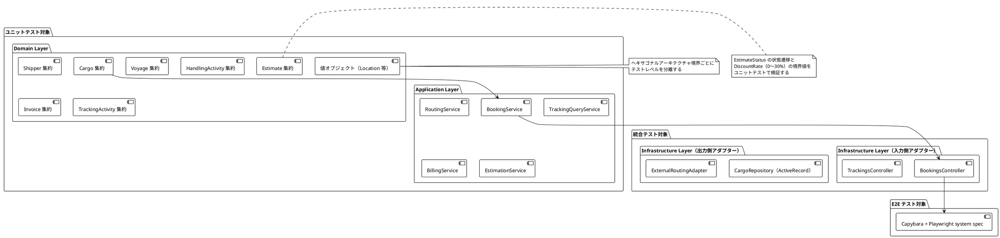
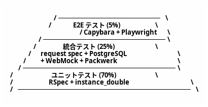
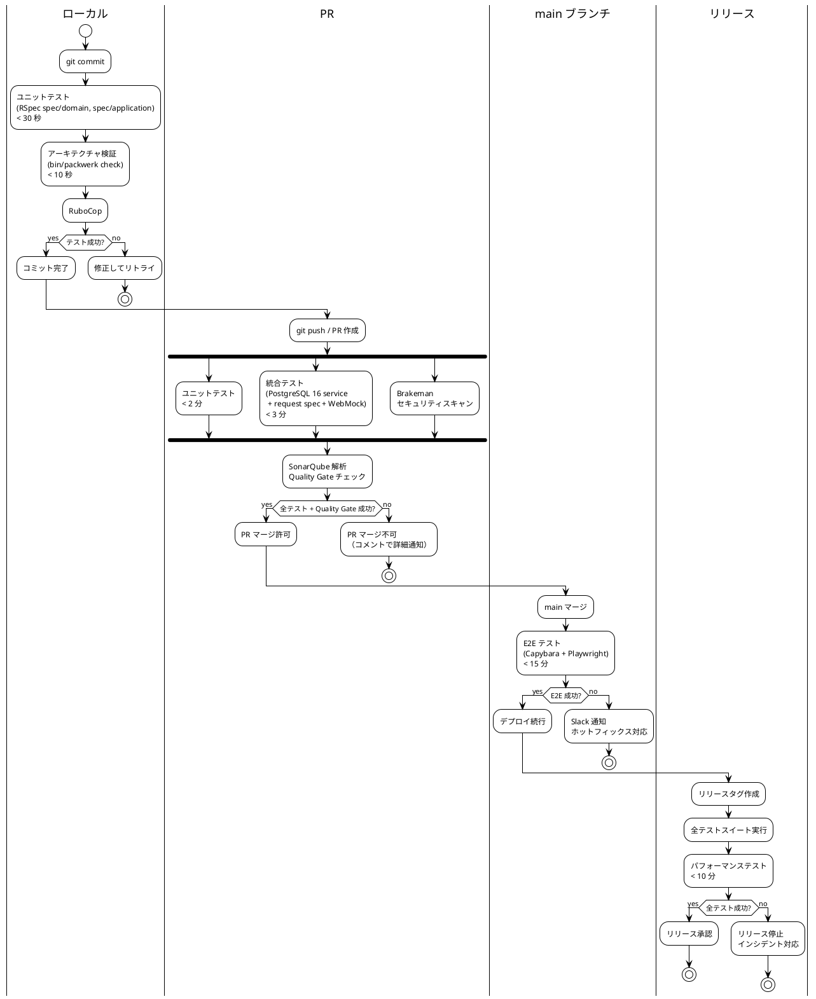
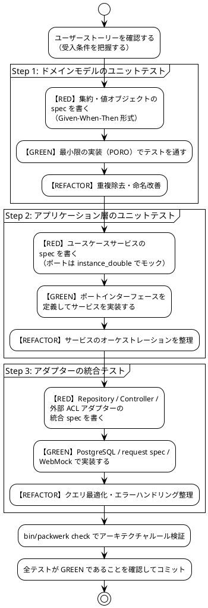

# テスト戦略 - 国際貨物輸送管理システム

## 1. 概要

### 1.1 目的

本ドキュメントは、国際貨物輸送管理システムにおけるテスト戦略を定義します。テスト戦略を事前に策定し、以下の問いに常に回答できる状態を維持することを目的とします。

- 「この機能はどのテストレベルで保証されているか」
- 「何をどこまでテストすべきか」
- 「テストが失敗したとき、どこを修正すべきか」

### 1.2 基本方針

- **TDD（テスト駆動開発）を全開発プロセスで適用する**: レッド → グリーン → リファクタリングのサイクルを厳守します
- **テストをアーキテクチャに対応させる**: ヘキサゴナルアーキテクチャの境界（ポート）を活かし、テスト可能性を設計段階で確保します
- **テストの重複を排除する**: 各テストレベルの責務を明確に分離し、同一ロジックを複数レベルで重複検証しません
- **テストを実行可能なドキュメントとして扱う**: RSpec のテストコードがシステムの振る舞いを説明します

### 1.3 アーキテクチャとテスト戦略の対応関係



ヘキサゴナルアーキテクチャの各層は以下のテストレベルに対応します。

| アーキテクチャ層 | テストレベル | 理由 |
|---|---|---|
| ドメイン層（集約・値オブジェクト・ドメインサービス） | ユニットテスト | 外部依存ゼロ。純粋なビジネスロジック |
| アプリケーション層（ユースケースサービス） | ユニットテスト（ポートを `instance_double` でモック） | ポートへの委譲とオーケストレーションを検証 |
| 入力側アダプター（Controller） | 統合テスト（request spec） | HTTP マッピングとバリデーションを検証 |
| 出力側アダプター（Repository） | 統合テスト（PostgreSQL 16） | SQL クエリの正確性を実 DB で検証 |
| 外部 ACL ポート（5 件） | 統合テスト（WebMock） | 外部システムとの契約を検証 |
| ユーザーシナリオ全体 | E2E テスト（Capybara + Playwright） | クリティカルパスの品質保証 |

---

## 2. テスト形状の選択

### 2.1 採用形状: ピラミッド型



**採用理由**:

- **ドメイン層が厚い**: DDD を採用しており、Cargo・Shipper・Voyage・HandlingActivity・Invoice・Estimate の各集約にビジネスロジックが集中します。BookingStatus の 9 値遷移、荷役妥当性検証（RoutingStatus の MISROUTED 判定）、FreightCalculationService による料金計算（法人割引・消費税 10% を含む）など、外部依存なしでテスト可能なロジックが豊富にあります
- **ヘキサゴナルアーキテクチャによる高いテスト可能性**: ドメイン層とインフラ層の境界がポートで分離されており、`instance_double` によるモックの差し替えが容易です。ユニットテストが書きやすい設計になっています
- **CQRS による読み取りモデルの分離**: TrackingContext の読み取りクエリはドメインロジックを持たず、統合テストで Repository を直接検証するだけで十分です
- **コスト効率**: ユニットテストは実行が高速（< 30 秒）でメンテナンスコストが低くなります。E2E テストはフレイキーになりやすいため最小限にとどめ、CI の安定性を維持します
- **開発・テスト・本番で同一 RDBMS**: PostgreSQL 16 を Docker Compose で全環境共通に使用します。インメモリ DB（H2 相当）による方言差異が原理的に発生せず、「テストは通るが本番で SQL が失敗する」リスクを排除できます

### 2.2 採用しない形状と理由

| 形状 | 採用しない理由 |
|---|---|
| **ダイヤモンド型**（統合テスト重視） | 本システムは単一の Rails モノリス（ヘキサゴナル）で構成されており、マイクロサービス間の契約検証ニーズがありません。統合テストを主軸にするとテスト実行時間が増大し、TDD サイクルが遅くなります |
| **逆ピラミッド型**（E2E 重視） | system spec はヘッドレスブラウザを起動するためフレイキーになりやすく、Turbo Frame の 30 秒ポーリングを含む動的 UI はテストの安定性確保が困難です。E2E を主軸にするとフィードバックループが 15 分以上になります |

---

## 3. テストレベルの定義

### 3.1 ユニットテスト（Unit Test）

#### 責務・検証対象

- **ドメイン層**: 集約の状態遷移・不変条件・ビジネスルール、値オブジェクトの等価性・バリデーション、ドメインサービスのロジック
- **アプリケーション層**: ユースケースサービスのオーケストレーション（ポートは `instance_double` でモック）

#### カバレッジ目標

| 対象 | 行カバレッジ | 分岐カバレッジ |
|---|---|---|
| ドメイン層 | **85% 以上** | **80% 以上** |
| アプリケーション層 | **80% 以上** | **75% 以上** |

#### 使用ツール

- **RSpec**: テストフレームワーク（`describe` / `context` / `it`）
- **instance_double + verify partial doubles**: ポートインターフェースの検証付きモック（存在しないメソッドのスタブを検知）
- **FactoryBot**: テストデータの生成（Fixture の代替）
- **SimpleCov**: カバレッジ計測

`spec/spec_helper.rb` では verify partial doubles を必ず有効化します。

```ruby
RSpec.configure do |config|
  config.mock_with :rspec do |mocks|
    mocks.verify_partial_doubles = true
  end
end
```

#### 実行タイミング

- **ローカル**: すべてのコミット時（目標 **30 秒以内**）。DB 不要のドメイン層 spec は `bundle exec rspec spec/domain` で単独高速実行できます
- **PR**: 自動実行（コミットプッシュ時）
- **CI**: GitHub Actions の `unit-test` ジョブ

#### 除外対象

- インフラ層（ActiveRecord リポジトリ、HTTP クライアント）— 統合テストで担保します
- DTO / 単純な Struct — データ保持のみでロジックがありません
- Rails のフルブート（`rails_helper` 経由の起動）— ドメイン層のユニットテストでは**使用しません**（`spec_helper` のみを require します）

#### 実装例: Cargo 集約の BookingStatus 遷移テスト

```ruby
# spec/domain/booking/cargo_booking_status_spec.rb
require "spec_helper"

RSpec.describe Booking::Cargo do
  describe "#confirm_booking" do
    context "ルートが割り当て済みの場合" do
      it "ステータスが CONFIRMED に遷移する" do
        # Given: ルートが割り当て済みの貨物
        cargo = build(:cargo, :route_assigned)

        # When: 予約を確定する
        cargo.confirm_booking

        # Then: ステータスが CONFIRMED に遷移する
        expect(cargo.booking_status).to eq(Booking::BookingStatus::CONFIRMED)
      end
    end

    context "ルートが未割り当ての場合" do
      it "不変条件違反で例外が発生する" do
        # Given: ルートが未割り当ての貨物
        cargo = build(:cargo, :preliminary)

        # When & Then: 不変条件違反で例外が発生する
        expect { cargo.confirm_booking }
          .to raise_error(Booking::BookingDomainError, /ルートが割り当てられていません/)
      end
    end
  end

  describe "#assign_route" do
    it "危険物の取扱不可港にルートを割り当てると例外が発生する" do
      # Given: 危険物フラグが立った貨物と危険物取扱不可の港を経由するルート
      cargo = build(:cargo, :hazardous)
      prohibited_route = build(:route, :via_hazardous_prohibited_port)

      # When & Then: ドメインルール違反で例外が発生する
      expect { cargo.assign_route(prohibited_route) }
        .to raise_error(Booking::HazardousCargoRoutingError)
    end
  end

  describe "終端状態からの遷移" do
    %i[settled cancelled].each do |terminal_status|
      context "ステータスが #{terminal_status} の場合" do
        it "ステータス遷移が拒否される" do
          # Given: 終端ステータスの貨物
          cargo = build(:cargo, booking_status: terminal_status)

          # When & Then: ステータス遷移が拒否される
          expect { cargo.confirm_booking }
            .to raise_error(Booking::InvalidBookingStatusTransitionError)
        end
      end
    end
  end
end
```

#### 実装例: FactoryBot の定義

```ruby
# spec/factories/cargos.rb
FactoryBot.define do
  factory :cargo, class: "Booking::Cargo" do
    tracking_id { generate(:tracking_id) }
    origin { "JPTYO" }
    destination { "DEHAM" }
    booking_status { :preliminary }

    trait :preliminary do
      booking_status { :preliminary }
    end

    trait :route_assigned do
      booking_status { :route_proposed }
      itinerary { association(:itinerary, :tokyo_to_hamburg) }
    end

    trait :hazardous do
      cargo_category { :hazardous }
    end
  end

  sequence(:tracking_id) { |n| format("CARGO-%03d", n) }
end
```

#### データベースについての補足

本プロジェクトでは開発・テスト・本番のすべてで PostgreSQL 16（Docker Compose）を使用します。インメモリ DB による互換モード設定は不要であり、方言差異による設定・トラブルシューティングコストがゼロになる点を利点として位置づけます。DB を必要としない spec は `spec_helper` のみで実行し、実行速度を確保します。

---

### 3.2 統合テスト（Integration Test）

#### 責務・検証対象

- **Repository（ActiveRecord）**: SQL クエリの正確性、トランザクション、楽観的ロック（`lock_version`）
- **Controller（request spec）**: HTTP リクエスト/レスポンスのマッピング、バリデーション、エラーハンドリング
- **外部 ACL ポート（WebMock）**: 外部システムとの契約遵守、タイムアウト・フォールバック

#### カバレッジ目標

| 対象 | 行カバレッジ |
|---|---|
| Repository（インフラ層） | **75% 以上** |
| Controller 層 | **70% 以上** |

#### 使用ツール

- **RSpec（rails_helper）**: Rails 統合テストフレームワーク
- **PostgreSQL 16（Docker Compose）**: 開発・テスト・本番で同一の実 RDBMS。`docker compose up -d db` で起動し、`config/database.yml` の test 環境が接続します
- **RSpec request spec**: HTTP 層の結合テスト（ルーティング・ミドルウェアを通過）
- **WebMock**: 外部 ACL ポートのスタブ（5 件すべてを対象）。VCR は使用しない方針とし、スタブ定義を spec 内に明示して契約を可読に保ちます

#### 実行タイミング

- **PR 時**: GitHub Actions の `integration-test` ジョブ（目標 **5 分以内**）。CI では `services: postgres:16-alpine` を使用します
- **ローカル**: Docker Compose の DB が起動している環境で任意実行

#### 実装例: CargoRepository の保存・検索テスト（PostgreSQL 16）

```ruby
# spec/infrastructure/persistence/cargo_repository_spec.rb
require "rails_helper"

RSpec.describe Infrastructure::Persistence::CargoRepository do
  subject(:repository) { described_class.new }

  describe "#save / #find_by_tracking_id" do
    it "貨物を保存して追跡番号で検索できる" do
      # Given: 新規貨物エンティティ
      cargo = build(:cargo,
                    tracking_id: "CARGO-001",
                    origin: "JPTYO",
                    destination: "DEHAM")

      # When: 保存して検索する
      repository.save(cargo)
      found = repository.find_by_tracking_id("CARGO-001")

      # Then: 保存したエンティティと一致する
      expect(found).not_to be_nil
      expect(found.origin).to eq("JPTYO")
      expect(found.destination).to eq("DEHAM")
    end

    it "存在しない追跡番号で検索すると nil を返す" do
      # Given & When
      result = repository.find_by_tracking_id("NONEXISTENT")

      # Then
      expect(result).to be_nil
    end
  end
end
```

#### 実装例: BookingsController の request spec

```ruby
# spec/requests/api/bookings_spec.rb
require "rails_helper"

RSpec.describe "API::Bookings", type: :request do
  describe "POST /api/bookings" do
    let(:booking_service) { instance_double(Booking::BookingApplicationService) }

    before do
      allow(Booking::BookingApplicationService).to receive(:new).and_return(booking_service)
    end

    context "正常なリクエストの場合" do
      it "貨物予約登録 API が 201 を返す" do
        # Given: 予約登録リクエスト
        allow(booking_service).to receive(:book_new_cargo).and_return("CARGO-001")
        params = {
          origin_un_locode: "JPTYO",
          destination_un_locode: "DEHAM",
          arrival_deadline: "2026-06-30"
        }

        # When & Then
        post "/api/bookings", params: params, as: :json

        expect(response).to have_http_status(:created)
        expect(response.parsed_body["tracking_id"]).to eq("CARGO-001")
      end
    end

    context "出発地コードが不正な場合" do
      it "400 を返す" do
        # Given: 不正な UN/LOCODE を含むリクエスト
        invalid_params = {
          origin_un_locode: "INVALID",
          destination_un_locode: "DEHAM",
          arrival_deadline: "2026-06-30"
        }

        # When & Then
        post "/api/bookings", params: invalid_params, as: :json

        expect(response).to have_http_status(:bad_request)
        expect(response.parsed_body["errors"].first["field"]).to eq("origin_un_locode")
      end
    end
  end
end
```

#### WebMock 契約テストの概要

各 ACL ポートに対して WebMock スタブを定義します。詳細は [セクション 4](#4-webmock-契約テストシナリオacl-ポート別) を参照してください。

---

### 3.3 アーキテクチャテスト（Architecture Test）

#### 責務・検証対象

ヘキサゴナルアーキテクチャの依存関係ルールをコードレベルで自動検証します。アーキテクチャの腐敗（依存関係の逆転・Bounded Context 間の直接参照）を CI で検出します。

#### 使用ツール

- **Packwerk**: Ruby のパッケージ境界と依存関係を宣言的に検証します。`package.yml` で各パッケージの依存を明示し、`bin/packwerk check` を CI で実行します

#### 実行タイミング

- **PR 時**: GitHub Actions の `unit-test` ジョブに統合（ユニットテストと同時実行）
- **ローカル**: `bin/packwerk check` で任意実行

#### 検証ルール 4 件

パッケージ構成と `package.yml` により以下のルールを強制します。

```yaml
# packwerk.yml
packs:
  - packs/*
  - packs/*/app/domain
  - packs/*/app/application
```

```yaml
# packs/booking/app/domain/package.yml
# ルール 1: domain パッケージが infrastructure パッケージに依存しない
# ルール 2: domain パッケージは Rails（ActiveRecord 等）に依存しない
#           dependencies に rails 系パッケージを含めないことで強制する
enforce_dependencies: true
dependencies:
  - packs/shared
```

```yaml
# packs/booking/app/application/package.yml
# ルール 3: アプリケーション層はポート（domain 内のインターフェース）経由でのみ
#           インフラ層と通信する。infrastructure への依存を宣言しない
enforce_dependencies: true
dependencies:
  - packs/booking/app/domain
  - packs/shared
```

```yaml
# packs/booking/package.yml
# ルール 4: 異なる Bounded Context（booking / shipper / routing / tracking /
#           handling / billing / estimation）間でクラスを直接参照しない。
#           shared（共有カーネル）への依存のみ許可する
enforce_dependencies: true
enforce_privacy: true
dependencies:
  - packs/shared
```

| ルール | 内容 | 強制手段 |
|---|---|---|
| 1 | ドメイン層はインフラ層を直接参照しない（依存方向は infrastructure → domain） | domain の `dependencies` に infrastructure を含めない |
| 2 | ドメイン層は Rails フレームワークに依存しない（PORO を維持） | domain パッケージを ActiveRecord 非依存で構成し、違反を `packwerk check` で検出 |
| 3 | アプリケーション層はポートインターフェース経由でのみインフラ層と通信する | application の `dependencies` を domain + shared に限定 |
| 4 | Bounded Context 間の通信はドメインイベントまたは ACL 経由のみ。shared（共有カーネル）参照は許可 | 各コンテキストパッケージで `enforce_privacy: true` |

違反が検出された場合、CI の `bin/packwerk check` が失敗し PR マージをブロックします。`deprecated_references.yml`（TODO リスト）への追加は原則禁止とします。

---

### 3.4 E2E テスト（End-to-End Test）

#### 責務・検証対象

クリティカルなユーザーシナリオをブラウザレベルで検証します。ドメインロジックの再検証は行わず、ユーザー体験の観点からシステム全体が協調動作することを確認します。

**優先シナリオ（US13・US15・US18）**:

| シナリオ | 理由 |
|---|---|
| US13: 予約を確定する | 予約フローの最終ステップ。複数コンテキストが連携する |
| US15: 荷役作業を記録する | 最も頻繁に実行される運用操作 |
| US18: 追跡情報を照会する | 顧客向け重要機能。Turbo Frame ポーリングを含む |

#### カバレッジ目標

- E2E 対象シナリオ（US13・US15・US18）の受け入れ基準数（計 18 件）を分母とし、その **80% 以上**（15 件以上）をブラウザレベルで検証します。優先度「高」の全ストーリーを E2E で網羅するのではなく、主要 3 シナリオに限定することで CI の安定性を維持します

#### 使用ツール

- **Capybara + capybara-playwright-driver**: Playwright エンジンによる system spec。自動待機によりフレイキーさを低減します
- **Hotwire（Turbo）対応**: Capybara の待機付きマッチャ（`have_css` / `have_text` + `wait:` オプション）でポーリング更新を待機します

```ruby
# spec/support/capybara.rb
Capybara.register_driver(:playwright) do |app|
  Capybara::Playwright::Driver.new(app, browser_type: :chromium, headless: true)
end

RSpec.configure do |config|
  config.before(:each, type: :system) do
    driven_by :playwright
  end
end
```

#### 実行タイミング

- **main ブランチマージ後**: GitHub Actions の `e2e-test` ジョブ（目標 **15 分以内**）
- **リリース前**: 全 E2E シナリオを実行

#### Turbo Frame 30 秒ポーリングへの対応

Turbo Frame の `<turbo-frame src="..." data-controller="polling">`（30 秒間隔で `frame.reload` を実行）による自動更新は、Capybara の待機付きマッチャで DOM 更新を待機してテストします。テスト環境ではポーリング間隔を 5 秒に短縮します。

```ruby
# spec/support/turbo_helpers.rb
module TurboHelpers
  # Turbo Frame ポーリング完了を待機するユーティリティ。
  # Turbo Frame はリクエスト中の frame に busy 属性を付与するため、
  # その消失を待機してポーリング完了を検出する
  def wait_for_turbo_frame_update(selector, timeout: 10)
    expect(page).to have_no_css("#{selector}[busy]", wait: timeout)
  end
end

RSpec.configure do |config|
  config.include TurboHelpers, type: :system
end
```

#### 実装例: US18 追跡情報照会の system spec

```ruby
# spec/system/tracking/us18_track_cargo_spec.rb
require "rails_helper"

RSpec.describe "US18: 追跡情報を照会する", type: :system do
  it "追跡番号で貨物の現在状態を照会できる" do
    # Given: 荷役作業が記録済みの貨物が存在する
    create(:cargo, :with_handling_history, tracking_id: "CARGO-001")
    visit "/tracking"

    # When: 追跡番号を入力して検索する
    fill_in "tracking-id-input", with: "CARGO-001"
    click_button "search-button"

    # Then: 追跡情報が表示される（TrackingStatus は 9 値のいずれか）
    expect(page).to have_css("[data-testid='tracking-status']", text: "UNLOADED", wait: 10)
    expect(page).to have_css("[data-testid='current-location']", text: "東京港")
  end

  it "Turbo Frame ポーリングで追跡情報が自動更新される" do
    # Given: 追跡ページを表示している
    cargo = create(:cargo, :in_transit, tracking_id: "CARGO-001")
    visit "/tracking/CARGO-001"
    initial_status = find("[data-testid='tracking-status']").text

    # When: バックエンドで荷役イベントが発生し、ポーリングが更新される
    # （テスト環境ではポーリング間隔を 5 秒に短縮している）
    record_handling_event(cargo, type: :unload, location: "DEHAM")
    wait_for_turbo_frame_update("[data-testid='tracking-panel']", timeout: 10)

    # Then: ページを再読み込みせずに最新状態が反映される
    expect(page).to have_css("[data-testid='tracking-status']", wait: 10)
    expect(find("[data-testid='tracking-status']").text).not_to eq(initial_status)
  end

  it "存在しない追跡番号を入力するとエラーメッセージが表示される" do
    # Given
    visit "/tracking"

    # When
    fill_in "tracking-id-input", with: "NONEXISTENT-999"
    click_button "search-button"

    # Then
    expect(page).to have_css("[data-testid='error-message']", text: "追跡番号が見つかりません")
  end
end
```

---

## 4. WebMock 契約テストシナリオ（ACL ポート別）

各外部 ACL ポートに対して正常・異常シナリオを定義し、WebMock でスタブ化します。VCR によるカセット録画は採用せず、スタブ定義を spec 内に明示することで外部契約を可読な状態に保ちます。

```ruby
# spec/rails_helper.rb（抜粋）
require "webmock/rspec"
WebMock.disable_net_connect!(allow_localhost: true)
```

### 4.1 シナリオ一覧

| ポート | 正常シナリオ | 異常シナリオ |
|---|---|---|
| ExternalRoutingServicePort | ルート検索 → 3 候補返却 | 接続タイムアウト → 過去実績データにフォールバック |
| CustomsClearancePort | 通関申請 → CLEARED | HELD ステータス → 例外イベント発行 |
| PaymentGatewayPort | 支払い処理 → CONFIRMED | 決済失敗 → OVERDUE 状態遷移 |
| PortManagementPort | 港湾入港通知 → 受理 | 港湾満杯 → 代替港提案 |
| NotificationPort | メール通知送信 → 202 Accepted | 通知失敗 → ログ記録（非クリティカル） |

### 4.2 WebMock 実装例

#### ExternalRoutingServicePort: ルート検索（正常・タイムアウト）

```ruby
# spec/infrastructure/acl/external_routing_service_adapter_spec.rb
require "rails_helper"

RSpec.describe Infrastructure::Acl::ExternalRoutingServiceAdapter do
  subject(:adapter) { described_class.new(base_url: "https://routing.example.com") }

  describe "#search_routes" do
    it "ルート検索で 3 候補が返却される" do
      # Given: WebMock スタブ定義（3 候補を返す）
      stub_request(:post, "https://routing.example.com/api/routes/search")
        .with(body: hash_including(origin: "JPTYO"))
        .to_return(
          status: 200,
          headers: { "Content-Type" => "application/json" },
          body: {
            routes: [
              { id: "R001", legs: [{ voyage_number: "V001" }], transit_time: 14 },
              { id: "R002", legs: [{ voyage_number: "V002" }], transit_time: 18 },
              { id: "R003", legs: [{ voyage_number: "V003" }], transit_time: 21 }
            ]
          }.to_json
        )

      # When: ルート検索を実行する
      request = Routing::RouteSearchRequest.new(
        origin: "JPTYO", destination: "DEHAM", deadline: Date.new(2026, 6, 30)
      )
      routes = adapter.search_routes(request)

      # Then: 3 候補が返却される
      expect(routes.size).to eq(3)
      expect(routes.first.transit_days).to eq(14)
    end

    it "接続タイムアウト時に過去実績データにフォールバックする" do
      # Given: タイムアウトを発生させるスタブ（タイムアウト閾値 5 秒を超過）
      stub_request(:post, "https://routing.example.com/api/routes/search")
        .to_timeout

      # When: ルート検索を実行する
      request = Routing::RouteSearchRequest.new(
        origin: "JPTYO", destination: "DEHAM", deadline: Date.new(2026, 6, 30)
      )
      routes = adapter.search_routes(request)

      # Then: 過去実績データからフォールバック候補が返却される
      expect(routes).not_to be_empty
      expect(routes).to all(be_fallback)
    end
  end
end
```

#### CustomsClearancePort: 通関申請（CLEARED・HELD）

```ruby
# spec/infrastructure/acl/customs_clearance_adapter_spec.rb
require "rails_helper"

RSpec.describe Infrastructure::Acl::CustomsClearanceAdapter do
  subject(:adapter) { described_class.new(base_url: "https://customs.example.com") }

  it "通関申請が承認されて CLEARED ステータスを返す" do
    # Given
    stub_request(:post, "https://customs.example.com/api/customs/clearance")
      .to_return(
        status: 200,
        body: { status: "CLEARED", clearance_id: "CUS-001" }.to_json
      )

    # When
    result = adapter.submit_clearance(tracking_id: "CARGO-001")

    # Then
    expect(result.status).to eq(:cleared)
  end

  it "通関保留 HELD ステータス受信時に例外イベントが発行される" do
    # Given
    stub_request(:post, "https://customs.example.com/api/customs/clearance")
      .to_return(
        status: 200,
        body: { status: "HELD", reason: "書類不備", hold_id: "HOLD-001" }.to_json
      )

    # When
    result = adapter.submit_clearance(tracking_id: "CARGO-002")

    # Then: HELD ステータスが返却され、例外イベントが発行可能な状態になる
    expect(result.status).to eq(:held)
    expect(result.hold_reason).to eq("書類不備")
  end
end
```

#### PaymentGatewayPort: 支払い処理（CONFIRMED・失敗）

```ruby
# spec/infrastructure/acl/payment_gateway_adapter_spec.rb
require "rails_helper"

RSpec.describe Infrastructure::Acl::PaymentGatewayAdapter do
  subject(:adapter) { described_class.new(base_url: "https://payment.example.com") }

  it "支払い処理が成功して CONFIRMED を返す" do
    # Given
    stub_request(:post, "https://payment.example.com/api/payments")
      .to_return(
        status: 200,
        body: { status: "CONFIRMED", transaction_id: "TXN-001" }.to_json
      )

    # When
    result = adapter.process_payment(
      invoice_id: "INV-001", amount: Money.new(150_000, "JPY")
    )

    # Then
    expect(result.status).to eq(:confirmed)
  end

  it "決済失敗時に OVERDUE 状態への遷移情報が返却される" do
    # Given: 決済失敗レスポンス
    stub_request(:post, "https://payment.example.com/api/payments")
      .to_return(
        status: 402,
        body: { status: "FAILED", error_code: "INSUFFICIENT_FUNDS" }.to_json
      )

    # When
    result = adapter.process_payment(
      invoice_id: "INV-002", amount: Money.new(500_000, "JPY")
    )

    # Then: 失敗情報が返却される（OVERDUE 遷移はドメイン層が担当する）
    expect(result.status).to eq(:failed)
    expect(result.error_code).to eq("INSUFFICIENT_FUNDS")
  end
end
```

#### PortManagementPort: 港湾入港通知（受理・代替港提案）

```ruby
# spec/infrastructure/acl/port_management_adapter_spec.rb
require "rails_helper"

RSpec.describe Infrastructure::Acl::PortManagementAdapter do
  subject(:adapter) { described_class.new(base_url: "https://port.example.com") }

  it "港湾入港通知が受理される" do
    # Given
    stub_request(:post, "https://port.example.com/api/ports/arrival")
      .to_return(
        status: 202,
        body: { accepted: true, berth_id: "BERTH-A1" }.to_json
      )

    # When
    result = adapter.notify_arrival(un_locode: "JPTYO", voyage_number: "V001")

    # Then
    expect(result).to be_accepted
    expect(result.berth_id).to eq("BERTH-A1")
  end

  it "港湾満杯時に代替港が提案される" do
    # Given
    stub_request(:post, "https://port.example.com/api/ports/arrival")
      .to_return(
        status: 409,
        body: {
          accepted: false,
          reason: "PORT_FULL",
          alternative_ports: %w[JPYOK JPKOB]
        }.to_json
      )

    # When
    result = adapter.notify_arrival(un_locode: "JPTYO", voyage_number: "V002")

    # Then: 代替港リストが返却される
    expect(result).not_to be_accepted
    expect(result.alternative_ports).to eq(%w[JPYOK JPKOB])
  end
end
```

#### NotificationPort: メール通知（202 Accepted・失敗ログ）

```ruby
# spec/infrastructure/acl/notification_adapter_spec.rb
require "rails_helper"

RSpec.describe Infrastructure::Acl::NotificationAdapter do
  subject(:adapter) { described_class.new(base_url: "https://notify.example.com") }

  it "メール通知送信が 202 Accepted を返す" do
    # Given
    stub = stub_request(:post, "https://notify.example.com/api/notifications/email")
             .to_return(status: 202)

    # When: 通知送信を実行する
    expect {
      adapter.send_email(to: "customer@example.com", subject: "貨物が到着しました", body: "...")
    }.not_to raise_error

    # Then: スタブが呼び出されたことを確認する
    expect(stub).to have_been_requested.once
  end

  it "通知失敗時にログを記録して処理を継続する" do
    # Given: 通知サービスがエラーを返す（非クリティカルなので例外を飲み込む）
    stub_request(:post, "https://notify.example.com/api/notifications/email")
      .to_return(status: 503)

    # When & Then: 例外が外部に伝播しない（ログのみ記録する）
    expect {
      adapter.send_email(to: "customer@example.com", subject: "通知テスト", body: "...")
    }.not_to raise_error
  end
end
```

---

## 5. ユーザーストーリーとテストのトレーサビリティ

| US | タイトル | ユニットテスト | 統合テスト | E2E テスト | 優先度 |
|---|---|---|---|---|---|
| US01 | 輸送見積を作成する | `Estimate` 集約、`EstimateStatus` 遷移、`FreightCalculationService`（概算料金） | `EstimateRepository`、estimates request spec | - | 高 |
| US02 | 荷主を登録する | `Shipper` 集約、荷主種別（個人/法人）バリデーション | `ShipperRepository`、shippers request spec | - | 高 |
| US03 | 法人荷主を登録する | `Shipper` 集約（法人契約）、`DiscountRate` 0〜30% 境界値（-1%・0%・30%・31%） | shippers request spec（法人登録 API） | - | 高 |
| US04 | 貨物予約を登録する | `Cargo` 集約、`BookingStatus` PRELIMINARY 初期化 | `CargoRepository`、bookings request spec | - | 高 |
| US05 | 危険物・冷凍貨物の予約を登録する | `Cargo` 集約（危険物申告・温度管理条件）、`CargoCategory` 値オブジェクト | `CargoRepository`、bookings request spec | - | 高 |
| US06 | 予約情報を経路設計者に引き渡す | `Cargo#request_route`、`BookingStatus` ROUTE_REQUESTED 遷移 | bookings request spec、`NotificationPort` WebMock | - | 高 |
| US07 | 航海スケジュールを検索する | `Voyage` 集約、検索条件（貨物種別対応）の絞り込みロジック | `VoyageRepository`、voyages request spec | - | 高 |
| US08 | 経路候補を算出する | `RoutingService`、`Itinerary` 値オブジェクト、推奨順ソート | `ExternalRoutingServicePort` WebMock（正常・タイムアウト） | - | 高 |
| US09 | 経路を選択・確定する | `RouteCandidate` 選択・確定ロジック | routings request spec（確定 API） | - | 高 |
| US10 | 経路条件を調整して再算出する | `RoutingService` 条件調整・再算出ロジック | `ExternalRoutingServicePort` WebMock（再算出） | - | 高 |
| US11 | 経路情報を予約に紐付ける | `Cargo#assign_route`、`BookingStatus` ROUTE_PROPOSED 遷移 | `CargoRepository`（ルート保存）、routings request spec | - | 高 |
| US12 | 確定経路を荷主に通知する | 通知内容（経由港・所要日数・到着予定日）生成ロジック | `NotificationPort` WebMock（送信・失敗ログ） | - | 高 |
| US13 | 予約を確定する | `Cargo#confirm_booking`、`BookingStatus` CONFIRMED 遷移・CANCELLED 遷移 | bookings request spec（確定 API）、`CargoRepository` | **US13 シナリオ** | 高 |
| US14 | 追跡番号を発行する | `TrackingId` 値オブジェクト（一意性）、`BookingStatus` TRACKING_ISSUED 遷移 | `CargoRepository`（追跡番号保存） | - | 高 |
| US15 | 荷役作業を記録する | `HandlingActivity` 集約、`TrackingStatus` RECEIVED/LOADED/UNLOADED 遷移、ルート外警告（`RoutingStatus` MISROUTED 判定） | `HandlingActivityRepository`、handlings request spec | **US15 シナリオ** | 高 |
| US16 | 引取作業を記録する | `HandlingActivity`（CLAIMED イベント）、荷受人確認の必須検証 | handlings request spec（引取 API） | - | 高 |
| US17 | 貨物状態を手動更新する | `TrackingActivity`、`TrackingStatus` 遷移（9 値） | trackings request spec（手動更新 API） | - | 高 |
| US18 | 追跡情報を照会する | - | `TrackingQueryService`（CQRS 読み取り）、trackings request spec | **US18 シナリオ** | 高 |
| US19 | 遅延例外を処理する | `TrackingExceptionEvent`（DELAY）、`TrackingStatus` EXCEPTION 遷移、escalationFlag 判定 | trackings request spec（例外処理 API）、`NotificationPort` WebMock | - | 高 |
| US20 | 破損・紛失例外を処理する | `TrackingExceptionEvent`（DAMAGE/LOST）、紛失時の escalationFlag 設定・管理職通知判定 | trackings request spec（例外記録 API）、`NotificationPort` WebMock（緊急通知） | - | 高 |
| US21 | 輸送料金を算出する | `FreightCalculationService`（距離係数 × 重量 × 貨物種別係数 + 燃油サーチャージ + 消費税 10%）、`Invoice` 集約 | `InvoiceRepository`、billings request spec | - | 中 |
| US22 | 法人割引を適用する | `FreightCalculationService`（割引適用）、`DiscountRate` 0〜30% 境界値 | billings request spec（割引適用 API） | - | 中 |
| US23 | 精算を処理する | `Invoice#settle`、`BookingStatus` SETTLED 遷移 | billings request spec（精算 API）、`PaymentGatewayPort` WebMock（正常・失敗） | - | 中 |
| US24 | 航海スケジュールを新規登録する | `Voyage` 集約、出発日 > 到着日の日付整合性境界値（同日・前日・翌日）、航海番号一意性 | `VoyageRepository`、voyages request spec | - | 高 |
| US25 | 既存航海スケジュールを更新する | `Voyage` 更新・差分算出ロジック | `VoyageRepository`（上書き更新）、voyages request spec（検索結果への反映） | - | 高 |

### 5.1 US19〜US25 のテスト観点補足

- **US19/US20（例外イベント）**: `TrackingExceptionEvent` の例外種別（DELAY / DAMAGE / LOST）ごとにユニットテストを分離します。特に LOST では escalationFlag が設定されること、`NotificationPort` 経由で管理職への escalation 通知が送信されることを検証します（通知送信自体は WebMock による統合テスト）
- **US24（日付整合性）**: 出発日 > 到着日をドメイン不変条件として境界値テスト（出発日 = 到着日は許容、出発日 > 到着日はエラー）で検証します
- **US25（スケジュール更新）**: 更新の影響範囲（UC05 の検索結果への反映、既存経路候補算出への影響）を統合テストで検証し、「キャンセル」時に既存スケジュールが変更されないことを確認します

---

## 6. カバレッジ目標とメトリクス

### 6.1 レイヤー別カバレッジ目標

| レイヤー | 行カバレッジ目標 | 分岐カバレッジ目標 | 計測ツール |
|---|---|---|---|
| ドメイン層（`packs/*/app/domain`） | **85% 以上** | **80% 以上** | SimpleCov / SonarQube |
| アプリケーション層（`packs/*/app/application`） | **80% 以上** | **75% 以上** | SimpleCov / SonarQube |
| インフラ層 - Repository（`packs/*/app/infrastructure/persistence`） | **75% 以上** | — | SimpleCov / SonarQube |
| インフラ層 - Controller（`app/controllers`） | **70% 以上** | — | SimpleCov / SonarQube |

SimpleCov はグループ機能でレイヤー別カバレッジを計測します。

```ruby
# spec/spec_helper.rb（抜粋）
require "simplecov"
SimpleCov.start "rails" do
  enable_coverage :branch
  add_group "Domain", %r{packs/.+/app/domain}
  add_group "Application", %r{packs/.+/app/application}
  add_group "Persistence", %r{packs/.+/app/infrastructure/persistence}
  add_group "Controllers", "app/controllers"
end
```

### 6.2 静的解析と Quality Gate 条件

静的解析には **RuboCop**（コードスタイル・複雑度）と **Brakeman**（Rails セキュリティスキャン）を使用し、SonarQube と併せて品質ゲートを構成します。

| 条件 | 基準値 | 適用対象 | ツール |
|---|---|---|---|
| 行カバレッジ（新規コード） | **80% 以上** | 新規追加コード | SimpleCov / SonarQube |
| 重複コード率 | **3% 以下** | プロジェクト全体 | SonarQube |
| Reliability Rating | **A**（バグゼロ） | プロジェクト全体 | SonarQube |
| Security Rating | **A**（脆弱性ゼロ） | プロジェクト全体 | SonarQube / Brakeman |
| Maintainability Rating | **A** | 新規コード | SonarQube |
| RuboCop 違反 | **0 件** | プロジェクト全体 | RuboCop |
| Brakeman 警告 | **0 件**（confidence: High/Medium） | プロジェクト全体 | Brakeman |

Quality Gate が失敗した場合、PR のマージをブロックします。

---

## 7. CI/CD とのテスト連携

### 7.1 ステージ別テスト戦略

| ステージ | テスト種別 | 目標時間 | 失敗時の扱い |
|---|---|---|---|
| コミット（ローカル） | ユニットテスト + Packwerk + RuboCop | **< 60 秒** | コミット前に修正 |
| PR | ユニット + 統合 + Packwerk + Brakeman + SonarQube | **< 5 分** | PR マージ不可 |
| main ブランチマージ後 | E2E テスト（system spec） | **< 15 分** | Slack 通知（ホットフィックス優先） |
| リリース | 全テスト + パフォーマンステスト | **< 30 分** | リリース停止 |

### 7.2 GitHub Actions パイプライン図



---

## 8. TDD 開発ワークフロー

### 8.1 インサイドアウト TDD（バックエンド）

ドメイン層から外側に向かって開発します。外部依存を後回しにすることで、ビジネスロジックに集中できます。



### 8.2 重要なビジネスルール（必ず TDD 適用）

以下のビジネスルールは複雑度が高く、テストファーストで実装しなければなりません。

#### Cargo の BookingStatus 状態遷移（9 値）

```
PRELIMINARY → ROUTE_REQUESTED → ROUTE_PROPOSED → CONFIRMED
    → TRACKING_ISSUED → IN_TRANSIT → DELIVERED → SETTLED
    ↘ CANCELLED（終端状態を除く任意の状態から遷移可能）
```

状態 × イベントの遷移表（デシジョンテーブル）:

| 現在の状態 \ イベント | 経路設計依頼 | 経路提案 | 予約確定 | 追跡番号発行 | 輸送開始 | 引き渡し | 精算完了 | キャンセル |
|---|---|---|---|---|---|---|---|---|
| PRELIMINARY | → ROUTE_REQUESTED | × | × | × | × | × | × | → CANCELLED |
| ROUTE_REQUESTED | × | → ROUTE_PROPOSED | × | × | × | × | × | → CANCELLED |
| ROUTE_PROPOSED | ×（再依頼は許可） | ○（再提案） | → CONFIRMED | × | × | × | × | → CANCELLED |
| CONFIRMED | × | × | × | → TRACKING_ISSUED | × | × | × | → CANCELLED |
| TRACKING_ISSUED | × | × | × | × | → IN_TRANSIT | × | × | → CANCELLED |
| IN_TRANSIT | × | × | × | × | × | → DELIVERED | × | × |
| DELIVERED | × | × | × | × | × | × | → SETTLED | × |
| SETTLED（終端） | × | × | × | × | × | × | × | × |
| CANCELLED（終端） | × | × | × | × | × | × | × | × |

テスト観点:

- 遷移表の「→」セルすべての正常系（許可されている遷移）
- 遷移表の「×」セルすべての異常系（許可されていない遷移 → `InvalidBookingStatusTransitionError`）
- 終端状態（SETTLED・CANCELLED）からの全イベント拒否

#### HandlingActivity の荷役妥当性検証（RoutingStatus の MISROUTED 判定）

MISROUTED は BookingStatus ではなく、Delivery 内の RoutingStatus で表現します。

```ruby
it "指定ルート外の港で荷役を実行すると RoutingStatus が MISROUTED になる" do
  # Given: 東京→ハンブルク のルートを持つ貨物
  cargo = build(:cargo, :route_assigned, route: build(:route, :tokyo_to_hamburg))

  # When: ルートに含まれないシンガポールで荷役を記録する
  activity = Handling::HandlingActivity.new(
    tracking_id: cargo.tracking_id,
    location: "SGSIN", # ルート外の港
    handling_type: :load,
    completed_at: Time.current
  )

  # Then: 貨物の配送状況（Delivery）の経路整合ステータスが MISROUTED になる
  cargo.apply_handling_activity(activity)
  expect(cargo.delivery.routing_status).to eq(Shared::RoutingStatus::MISROUTED)
end
```

#### Invoice の料金計算（法人割引・消費税計算）

```ruby
it "法人割引 10% と消費税 10% が正しく計算される" do
  # Given: 基本料金 100,000 円、法人割引率 10% の Invoice
  base_amount = Money.new(100_000, "JPY")
  corporate_discount = Billing::DiscountPolicy.corporate(percentage: 10)

  # When: 料金を確定する
  invoice = Billing::Invoice.calculate(
    base_amount, corporate_discount, Billing::TaxRate::STANDARD
  )

  # Then: 割引後 90,000 円 × 消費税 10% = 99,000 円
  expect(invoice.net_amount).to eq(Money.new(90_000, "JPY"))
  expect(invoice.tax_amount).to eq(Money.new(9_000, "JPY"))
  expect(invoice.total_amount).to eq(Money.new(99_000, "JPY"))
end
```

#### TrackingExceptionEvent のエスカレーション判定

```ruby
it "遅延が 48 時間を超える場合にエスカレーションフラグが立つ" do
  # Given: 遅延 72 時間の例外イベント
  event = Tracking::TrackingExceptionEvent.delay(
    tracking_id: "CARGO-001", duration: 72.hours
  )

  # When: エスカレーション判定を実行する
  result = escalation_policy.evaluate(event)

  # Then: エスカレーション対象と判定される
  expect(result).to be_requires_escalation
  expect(result.escalation_level).to eq(Tracking::EscalationLevel::CRITICAL)
end

it "遅延が 48 時間以内の場合はエスカレーション不要と判定される" do
  # Given: 遅延 24 時間の例外イベント
  event = Tracking::TrackingExceptionEvent.delay(
    tracking_id: "CARGO-002", duration: 24.hours
  )

  # When
  result = escalation_policy.evaluate(event)

  # Then
  expect(result).not_to be_requires_escalation
end
```

### 8.3 Bounded Context 別 TDD 優先順位

| Bounded Context | TDD 優先ルール | 理由 |
|---|---|---|
| Booking Context | BookingStatus 遷移（9 値）を最初にテストする | 最も複雑な状態機械。バグの影響範囲が大きい |
| Routing Context | ExternalRoutingServicePort のフォールバックをテストする | 外部依存が本番障害の主要因になりやすい |
| Tracking Context | CQRS 読み取りクエリのパフォーマンスを統合テストで検証する | 30 秒ポーリングの負荷を事前に確認する |
| Handling Context | MISROUTED 判定ロジックを先にテストする | 荷役記録ミスは運用上重大なインシデントになる |
| Billing Context | 割引・消費税計算をパラメタライズした shared examples で網羅する | 金額計算のバグは法的リスクを伴う |
| Shared Domain | Location（UN/LOCODE）のバリデーションを値オブジェクトレベルで担保する | 全コンテキストが共有するため、バグの影響範囲が広い |
