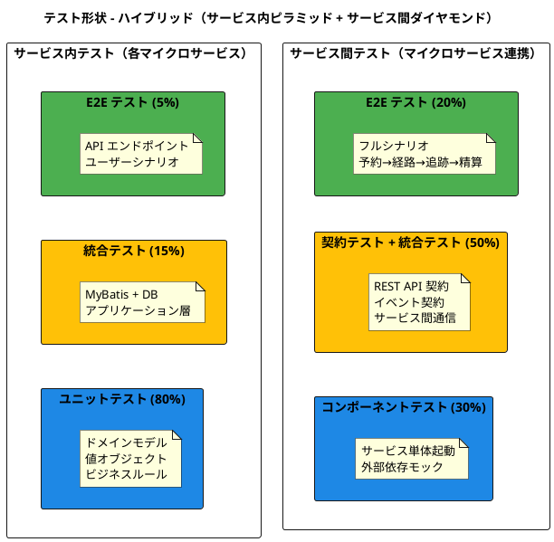
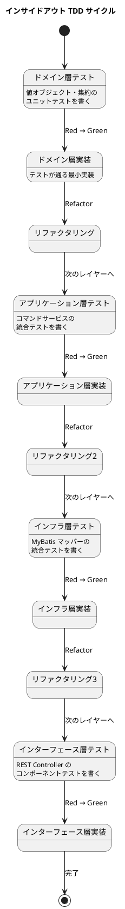
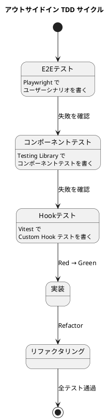
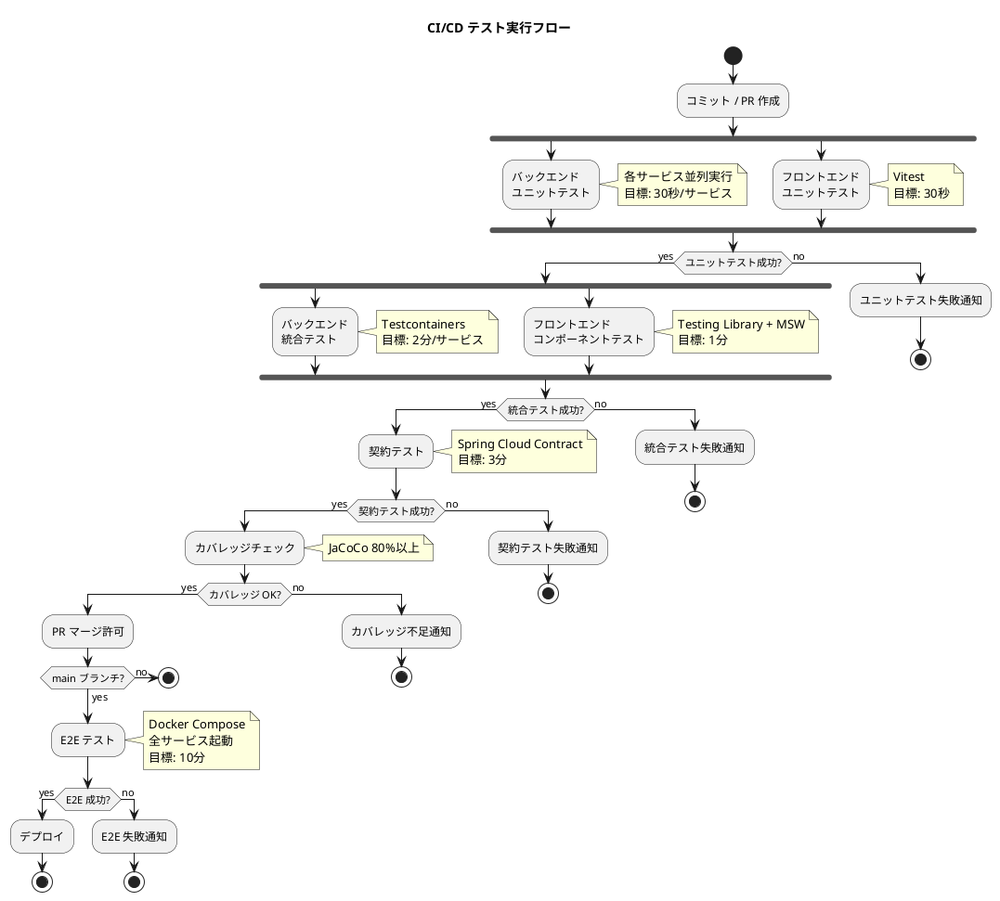

# テスト戦略 - 国際貨物輸送管理システム

## 概要

本ドキュメントは、マイクロサービスアーキテクチャ（7 サービス）とヘキサゴナルアーキテクチャを採用した国際貨物輸送管理システムのテスト戦略を定義する。

### テスト戦略の目的

- **安全な変更**: 各マイクロサービスを独立してデプロイできる品質保証
- **設計の改善**: TDD によるドメインモデルの設計品質向上
- **ドキュメント**: テストコードを実行可能な仕様書として機能させる
- **品質の保証**: サービス間連携を含むバグの早期発見と予防

---

## テスト形状の選択

### アーキテクチャ特性の評価

| 評価軸 | 判定 | 根拠 |
| :--- | :--- | :--- |
| アーキテクチャパターン | ヘキサゴナル + マイクロサービス | DDD ドメインモデルパターン + Database per Service |
| ドメインロジックの複雑さ | 高 | 貨物状態遷移・経路割り当て・料金計算・割引ポリシー |
| 外部連携の多さ | 高 | 6 DB + RabbitMQ + REST API（サービス間） |
| サービス間結合点 | 中 | 同期: Booking→Routing REST、非同期: 6 ドメインイベント |

### 選択: ハイブリッド形（サービス内ピラミッド + サービス間ダイヤモンド）

マイクロサービスアーキテクチャでは、**サービス内部**と**サービス間**で最適なテスト形状が異なる。



**選択理由**:

1. **サービス内ピラミッド型**: 各サービスはヘキサゴナルアーキテクチャを採用しドメインモデルが厚い。ビジネスルール（状態遷移・金額計算・妥当性検証）のユニットテストが品質の土台となる
2. **サービス間ダイヤモンド型**: マイクロサービス間の結合点（REST API・ドメインイベント）が障害の主要因。契約テストと統合テストでサービス間の整合性を重点的に検証する

---

## テストレベルの定義

### バックエンド（各マイクロサービス）

#### レベル 1: ユニットテスト

**対象**: ドメイン層（`domain/model/`）のすべてのクラス

- 集約ルート・エンティティのビジネスルール
- 値オブジェクトのバリデーション・等価性
- ドメインサービスのロジック
- 列挙型の振る舞い

```java
// 例: Booking Context - Cargo 集約のユニットテスト
@Test
void 貨物予約の状態遷移が正しい() {
    Cargo cargo = Cargo.create(bookingId, shipperId, routeSpec, CargoType.GENERAL, weight);
    assertThat(cargo.getBookingStatus()).isEqualTo(BookingStatus.PRELIMINARY);

    cargo.assignRoute(itinerary);
    assertThat(cargo.getBookingStatus()).isEqualTo(BookingStatus.ROUTE_PROPOSED);
}

@Test
void HAZARDOUS貨物にはHazardousDeclarationが必須() {
    assertThatThrownBy(() -> Cargo.create(
        bookingId, shipperId, routeSpec, CargoType.HAZARDOUS, weight))
        .isInstanceOf(IllegalArgumentException.class)
        .hasMessageContaining("HazardousDeclaration");
}
```

**ツール**: JUnit 5, AssertJ, Mockito

**実行時間目標**: 30 秒以内（サービスあたり）

---

#### レベル 2: 統合テスト

**対象**: アプリケーション層（`application/`）とインフラ層（`infrastructure/`）の連携

- MyBatis マッパー + PostgreSQL（Testcontainers）
- コマンドサービス + リポジトリの組み合わせ
- ACL（Anti-Corruption Layer）の変換ロジック
- RabbitMQ パブリッシャーの動作確認

```java
// 例: Booking Context - MyBatis リポジトリの統合テスト
@SpringBootTest
@Testcontainers
@Transactional
class MyBatisCargoRepositoryTest {
    @Container
    static PostgreSQLContainer<?> postgres = new PostgreSQLContainer<>("postgres:16");

    @Autowired
    private CargoRepository cargoRepository;

    @Test
    void 貨物を保存して取得できる() {
        Cargo cargo = CargoFixture.validCargo();
        cargoRepository.save(cargo);

        Optional<Cargo> found = cargoRepository.findByBookingId(cargo.getBookingId());
        assertThat(found).isPresent();
        assertThat(found.get().getCargoType()).isEqualTo(CargoType.GENERAL);
    }
}
```

**ツール**: Spring Boot Test, Testcontainers (PostgreSQL 16), MyBatis Test

**実行時間目標**: 2 分以内（サービスあたり）

---

#### レベル 3: コンポーネントテスト（サービス単体 E2E）

**対象**: マイクロサービス単体の API エンドポイント

- REST Controller → Application → Domain → Infrastructure の一貫テスト
- 外部マイクロサービスはモック（WireMock）
- RabbitMQ はテスト用 Embedded Broker

```java
// 例: Booking Context - API エンドポイントのコンポーネントテスト
@SpringBootTest(webEnvironment = WebEnvironment.RANDOM_PORT)
@Testcontainers
class CargoBookingApiTest {
    @Container
    static PostgreSQLContainer<?> postgres = new PostgreSQLContainer<>("postgres:16");

    @Autowired
    private TestRestTemplate restTemplate;

    @Test
    void 貨物予約の登録から経路割り当てまでの一連の流れ() {
        // 1. 貨物予約を登録
        BookCargoRequest request = new BookCargoRequest(
            "SHP-001", "JPOSA", "USLAX", "2026-04-15", "GENERAL", 1200);
        ResponseEntity<BookingResponse> response =
            restTemplate.postForEntity("/api/booking/cargos", request, BookingResponse.class);
        assertThat(response.getStatusCode()).isEqualTo(HttpStatus.CREATED);
        String bookingId = response.getBody().getBookingId();

        // 2. 予約詳細を取得
        ResponseEntity<BookingDetailResponse> detail =
            restTemplate.getForEntity("/api/booking/cargos/" + bookingId, BookingDetailResponse.class);
        assertThat(detail.getBody().getBookingStatus()).isEqualTo("PRELIMINARY");
    }
}
```

**ツール**: Spring Boot Test, WireMock, TestRestTemplate

**実行時間目標**: 5 分以内（サービスあたり）

---

### バックエンド（サービス間テスト）

#### レベル 4: 契約テスト

**対象**: マイクロサービス間の API 契約とイベント契約

- REST API のリクエスト/レスポンス形式の整合性
- ドメインイベントのペイロード形式の整合性
- Consumer-Driven Contract パターン

| 契約 | プロバイダー | コンシューマー | 検証内容 |
| :--- | :--- | :--- | :--- |
| 経路照会 API | routingms | bookingms | `GET /api/routing/routes` のレスポンス形式 |
| CargoBookedEvent | bookingms | trackingms | イベントペイロードのフィールド |
| HandlingActivityRegisteredEvent | handlingms | trackingms, bookingms | イベントペイロードのフィールド |
| CargoDeliveredEvent | trackingms | billingms | イベントペイロードのフィールド |
| CargoSnapshot API | bookingms | handlingms | `GET /api/booking/cargos/:id/snapshot` のレスポンス形式 |

**ツール**: Spring Cloud Contract

**実行時間目標**: 3 分以内

---

#### レベル 5: E2E テスト（フルシナリオ）

**対象**: 複数マイクロサービスを跨ぐビジネスシナリオ全体

- Docker Compose で全サービスを起動
- 予約→経路設計→追跡→荷役→精算の一連のフロー
- API Gateway 経由のリクエスト

```java
// 例: 貨物輸送の完全シナリオ E2E テスト
@SpringBootTest
@Testcontainers
class CargoTransportE2ETest {
    @Container
    static DockerComposeContainer<?> environment =
        new DockerComposeContainer<>(new File("docker-compose.test.yml"))
            .withExposedService("gateway", 8080);

    @Test
    void 貨物予約から精算完了までの完全シナリオ() {
        // 1. ログイン → JWT 取得
        // 2. 荷主登録
        // 3. 貨物予約登録（bookingms）
        // 4. 経路照会・割り当て（bookingms → routingms）
        // 5. 追跡番号発行（bookingms → trackingms イベント）
        // 6. 荷役作業記録（handlingms → trackingms イベント）
        // 7. 追跡状態確認（trackingms）
        // 8. 精算処理（billingms）
    }
}
```

**ツール**: Docker Compose, Testcontainers, REST Assured

**実行時間目標**: 10 分以内

---

### フロントエンド（React SPA）

| テストレベル | 対象 | ツール | 比率 |
| :--- | :--- | :--- | :--- |
| ユニットテスト | Custom Hooks, ユーティリティ関数, バリデーション | Vitest | 50% |
| コンポーネントテスト | Presentational コンポーネント, Container + API モック | Testing Library + MSW | 30% |
| E2E テスト | 主要フロー（ログイン→予約→追跡） | Playwright | 20% |

```tsx
// 例: useBookings Hook のユニットテスト
import { renderHook, waitFor } from '@testing-library/react';
import { useBookings } from './useBookings';

test('予約一覧を取得できる', async () => {
  const { result } = renderHook(() => useBookings({}), { wrapper: QueryWrapper });
  await waitFor(() => expect(result.current.isSuccess).toBe(true));
  expect(result.current.data).toHaveLength(3);
});
```

```tsx
// 例: Playwright E2E テスト
test('貨物予約を登録できる', async ({ page }) => {
  await page.goto('/login');
  await page.fill('[name="email"]', 'operator@example.com');
  await page.fill('[name="password"]', 'password');
  await page.click('button[type="submit"]');

  await page.goto('/booking/new');
  await page.fill('[name="origin"]', 'JPOSA');
  await page.fill('[name="destination"]', 'USLAX');
  await page.click('button:has-text("登録する")');

  await expect(page.locator('.badge')).toContainText('PRELIMINARY');
});
```

---

## カバレッジ目標

### バックエンド（サービスごと）

| レイヤー | パッケージ | カバレッジ目標 | 測定ツール |
| :--- | :--- | :--- | :--- |
| Domain | `domain/model/` | 90% 以上 | JaCoCo |
| Application | `application/internal/` | 85% 以上 | JaCoCo |
| Infrastructure | `infrastructure/` | 70% 以上 | JaCoCo |
| Interfaces | `interfaces/rest/` | 60% 以上 | JaCoCo |
| **全体** | | **80% 以上** | JaCoCo |

### フロントエンド

| 対象 | カバレッジ目標 | 測定ツール |
| :--- | :--- | :--- |
| Custom Hooks | 90% 以上 | Vitest + c8 |
| ユーティリティ関数 | 90% 以上 | Vitest + c8 |
| コンポーネント | 70% 以上 | Vitest + c8 |
| **全体** | **75% 以上** | Vitest + c8 |

### 品質ゲート

CI パイプラインで以下の品質ゲートを設定する。ゲートを通過しないとマージ・デプロイを許可しない。

| ゲート | 基準 | 適用タイミング |
| :--- | :--- | :--- |
| ユニットテスト全通過 | 失敗 0 件 | PR 作成時 |
| 統合テスト全通過 | 失敗 0 件 | PR マージ時 |
| カバレッジ閾値 | 全体 80% 以上 | PR マージ時 |
| E2E テスト全通過 | 失敗 0 件 | リリース前 |

---

## テストツール一覧

### バックエンド

| カテゴリ | ツール | バージョン | 用途 |
| :--- | :--- | :--- | :--- |
| テストフレームワーク | JUnit 5 | 5.x | テスト実行・アサーション |
| アサーション | AssertJ | 3.x | 流暢なアサーション |
| モック | Mockito | 5.x | ドメインサービスのモック |
| Spring テスト | Spring Boot Test | 4.x | DI コンテナ・統合テスト |
| DB テスト | Testcontainers | 1.x | PostgreSQL コンテナ |
| API テスト | MockMvc / TestRestTemplate | - | REST API テスト |
| 契約テスト | Spring Cloud Contract | 4.x | サービス間契約検証 |
| カバレッジ | JaCoCo | 0.8.x | コードカバレッジ測定 |
| 変異テスト | PIT (pitest) | 1.x | テスト品質検証 |
| 外部サービスモック | WireMock | 3.x | 外部 API モック |

### フロントエンド

| カテゴリ | ツール | バージョン | 用途 |
| :--- | :--- | :--- | :--- |
| テストフレームワーク | Vitest | 3.x | ユニット・コンポーネントテスト |
| コンポーネントテスト | Testing Library | 16.x | React コンポーネントテスト |
| API モック | MSW (Mock Service Worker) | 2.x | API レスポンスモック |
| E2E テスト | Playwright | 1.x | ブラウザ E2E テスト |
| カバレッジ | c8 | - | コードカバレッジ測定 |

---

## TDD サイクルと開発フロー

### インサイドアウト TDD（バックエンド）

各マイクロサービスの開発はインサイドアウトアプローチで進める。



### アウトサイドイン TDD（フロントエンド）



---

## CI/CD パイプラインとの連携

### テスト実行フロー



### テスト実行時間の目標

| テストレベル | 目標時間 | 実行タイミング |
| :--- | :--- | :--- |
| ユニットテスト（全サービス） | 2 分以内 | 毎コミット |
| 統合テスト（全サービス） | 10 分以内 | PR 作成時 |
| 契約テスト | 3 分以内 | PR マージ時 |
| E2E テスト | 10 分以内 | main マージ後 |
| **全テスト合計** | **25 分以内** | リリース前 |

---

## テストデータ管理

### Object Mother パターン

各マイクロサービスに `test/fixtures/` パッケージを設け、テストデータ生成を一元化する。

```java
// bookingms/src/test/java/fixtures/CargoFixture.java
public class CargoFixture {
    public static Cargo validCargo() {
        return Cargo.create(
            BookingId.generate(),
            new ShipperId("SHP-001"),
            RouteSpecFixture.jposaToUslax(),
            CargoType.GENERAL,
            new Weight(BigDecimal.valueOf(1200))
        );
    }

    public static Cargo hazardousCargo() {
        return Cargo.create(
            BookingId.generate(),
            new ShipperId("SHP-001"),
            RouteSpecFixture.jposaToUslax(),
            CargoType.HAZARDOUS,
            new Weight(BigDecimal.valueOf(500)),
            HazardousDeclarationFixture.valid()
        );
    }
}
```

### Testcontainers によるデータベース管理

```java
// 共通テストベースクラス
@SpringBootTest
@Testcontainers
@Transactional
public abstract class DatabaseTestBase {
    @Container
    static PostgreSQLContainer<?> postgres = new PostgreSQLContainer<>("postgres:16")
        .withDatabaseName("testdb")
        .withUsername("test")
        .withPassword("test");

    @DynamicPropertySource
    static void configureProperties(DynamicPropertyRegistry registry) {
        registry.add("spring.datasource.url", postgres::getJdbcUrl);
        registry.add("spring.datasource.username", postgres::getUsername);
        registry.add("spring.datasource.password", postgres::getPassword);
    }
}
```

---

## トレーサビリティ

### ユーザーストーリーとテストケースの対応

| US | ストーリー | テストレベル | テストクラス（例） |
| :--- | :--- | :--- | :--- |
| US01 | 輸送見積を作成する | ユニット | `EstimateTest` |
| US02 | 荷主を登録する | ユニット + 統合 | `ShipperTest`, `ShipperRepositoryTest` |
| US04 | 貨物予約を登録する | ユニット + 統合 + コンポーネント | `CargoTest`, `CargoBookingCommandServiceTest`, `CargoBookingApiTest` |
| US07 | 航海スケジュールを検索する | ユニット + 統合 | `VoyageTest`, `VoyageQueryServiceTest` |
| US09 | 経路を選択・確定する | ユニット + 契約 | `CargoItineraryTest`, `RoutingServiceContractTest` |
| US15 | 荷役作業を記録する | ユニット + 統合 + 契約 | `HandlingActivityTest`, `HandlingEventContractTest` |
| US18 | 追跡情報を照会する | ユニット + E2E | `TrackingActivityTest`, `TrackingE2ETest` |
| US21 | 輸送料金を算出する | ユニット | `InvoiceTest`, `MoneyTest`, `DiscountPolicyTest` |
| US23 | 精算を処理する | ユニット + 統合 + E2E | `InvoiceTest`, `InvoiceRepositoryTest`, `BillingE2ETest` |
| US24 | 航海スケジュールを新規登録する | ユニット + 統合 | `VoyageTest`, `VoyageCommandServiceTest` |

### テスト命名規則

テストメソッド名は日本語で記述し、仕様として読めるようにする。

```
[対象]_[条件]_[期待結果]
```

例:

- `貨物予約の状態遷移が正しい()`
- `HAZARDOUS貨物にはHazardousDeclarationが必須()`
- `法人荷主の割引率は30パーセント以内()`
- `同一メールアドレスの荷主は登録できない()`
