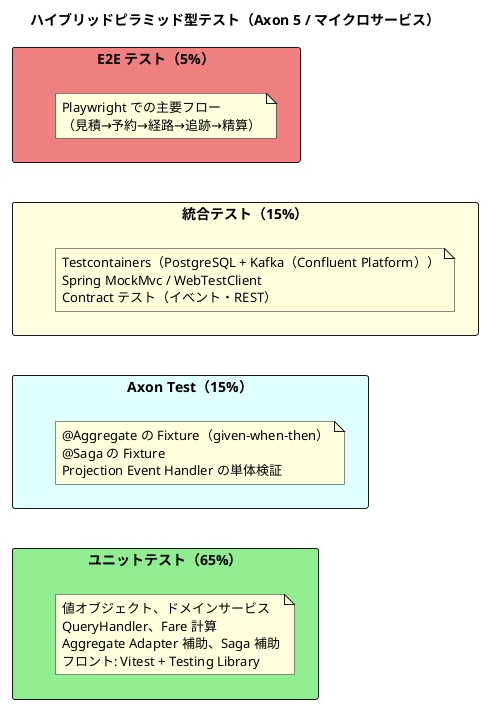
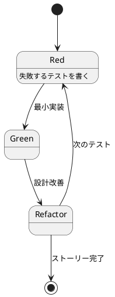
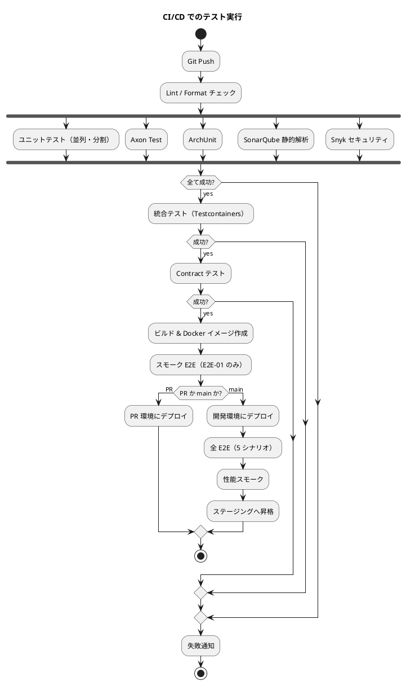

# テスト戦略 - 国際貨物輸送管理システム

## 概要

国際貨物輸送管理システムは **DDD ドメインモデル + ヘキサゴナルアーキテクチャ + CQRS + Event Sourcing + Saga + マイクロサービス** を採用している。この特性に最適化したテスト戦略として **ハイブリッドピラミッド型**（ユニット土台 + Axon Test 専用層 + 統合 + E2E）を採用する。

テスト戦略の指針：

- **TDD（テストファースト）** を全コンテキストで徹底し、Red-Green-Refactor サイクルで設計品質を高める
- **集約・Saga は Axon Test Fixture** で Given-When-Then を直接記述する（イベントログを検証）
- **マイクロサービス間連携は Contract テスト + 統合テスト** で結合点を保証する
- **E2E は最小限**（主要 5 シナリオ）に絞り、実行時間を抑える
- **受入基準（ユーザーストーリー）⇔ テストケース** のトレーサビリティを維持する

## テスト形状の選択

### 採用形状: ハイブリッドピラミッド型



### 形状選択の根拠

| 観点 | 根拠 |
| :--- | :--- |
| ドメインモデル + ヘキサゴナル | ビジネスロジックがドメイン層に厚いため **ユニット重視**（ピラミッドの利点） |
| マイクロサービス（6 BC + 1 GW） | サービス間結合点と契約が多いため **統合 / Contract を厚め**（ダイヤモンドの一部要素を取り込む） |
| Event Sourcing / CQRS / Saga | 集約・Saga はイベント列の検証が中核 → **Axon Test Fixture を独立層** として配置 |
| 操作対象が業務ツール | E2E はゴールデンパスに集約、複雑な分岐は統合テストで担保 |

純粋なピラミッドと異なり、Axon Test を独立した中間層に配置することで、集約・Saga の検証が「単なるユニット」では収まらない特性を反映する。

## テストレベルの定義

### レベル 1: ユニットテスト（全体の 65%）

| 対象 | 例 | ツール | 方針 |
| :--- | :--- | :--- | :--- |
| 値オブジェクト | `UnLocode`, `Money`, `RouteSpecification`, `CargoItinerary` | JUnit 5 + AssertJ | 不変条件・等価性・境界値・例外を網羅 |
| ドメインサービス | `OptimalRouteService`, `FareCalculator`, `TransportStatusTransition` | JUnit 5 + Mockito | リポジトリをモック化、純粋ロジックを検証 |
| Projection Event Handler | `CargoProjectionsEventHandler` | JUnit 5 + Mockito | MyBatis Mapper をモック、INSERT / UPDATE 呼出と引数を検証 |
| QueryHandler | `CargoAggregateQueryHandler` | JUnit 5 + Mockito | Named Query 呼出と結果変換を検証 |
| Application Service | `CargoBookingService`（CommandGateway ラッパー） | JUnit 5 + Mockito | CommandGateway をモックして送信パラメータを検証 |
| ACL | `ExternalCargoRoutingService` | JUnit 5 + Mockito | RestTemplate をモック、変換ロジックを検証 |
| フロント Custom Hook | `useBookings`, `useBookCargo`, `useTracking` | Vitest + Testing Library | 戻り値の状態遷移と副作用を検証 |
| フロント Utility | `formatMoney`, `validateUnLocode` | Vitest | 純粋関数として境界値検証 |

外部依存は**すべてモック**。実 DB・実 Kafka・実ネットワークは使わない。

### レベル 2: Axon Test（全体の 15%）

Axon Framework 専用の `AggregateTestFixture` / `SagaTestFixture` を使い、集約・Saga の **イベントログ単位** の検証を行う。

| 対象 | Fixture | 方針 |
| :--- | :--- | :--- |
| Aggregate (`Cargo`, `Voyage`, `TrackingActivity`, `HandlingActivity`, `Invoice`) | `AggregateTestFixture<Aggregate>` | `givenNoPriorActivity()` または `given(events...)` → `when(command)` → `expectEvents(...)` / `expectException(...)` |
| Saga (`BookingSagaManager`) | `SagaTestFixture<Saga>` | `givenAggregate(id).published(event)` → `whenAggregate(id).publishes(event)` → `expectDispatchedCommands(...)` / `expectActiveSagas(...)` |
| Projection Update Flow | カスタム Fixture | イベントを Event Bus に流し、Projection が期待通り更新されるか検証（Testcontainers なしの軽量版） |

#### Aggregate Test の代表例

```java
class CargoAggregateTest {

    private FixtureConfiguration<Cargo> fixture;

    @BeforeEach
    void setUp() {
        fixture = new AggregateTestFixture<>(Cargo.class);
    }

    @Test
    void 危険物の予約は危険物申告必須() {
        // Given - 何もない状態
        fixture.givenNoPriorActivity()
            .when(new BookCargoCommand("B-001", new Money(1000, "JPY"),
                CargoSpecification.hazardous("UN1170", null, null), // 申告なし
                routeSpec(), shipperId()))
            .expectException(IllegalArgumentException.class)
            .expectExceptionMessage("危険物申告は必須");
    }

    @Test
    void 経路確定済の貨物は再度経路を割り当てられない() {
        fixture.given(
                new CargoBookedEvent("B-001", /* ... */),
                new CargoRoutedEvent("B-001", itinerary()))
            .when(new AssignRouteToCargoCommand("B-001", anotherItinerary()))
            .expectException(IllegalStateException.class);
    }

    @Test
    void 仕向地変更で経路は未設定に戻る() {
        fixture.given(
                new CargoBookedEvent("B-001", /* ... */),
                new CargoRoutedEvent("B-001", itinerary()))
            .when(new ChangeDestinationCommand("B-001", new Location("USNYC")))
            .expectEvents(new CargoDestinationChangedEvent("B-001", /* ... */));
    }
}
```

#### Saga Test の代表例

```java
class BookingSagaManagerTest {

    private SagaTestFixture<BookingSagaManager> fixture;

    @BeforeEach
    void setUp() {
        fixture = new SagaTestFixture<>(BookingSagaManager.class);
        fixture.registerResource(mockRoutingService());
    }

    @Test
    void 予約イベントで経路割当コマンドが発行される() {
        fixture.givenNoPriorActivity()
            .whenPublishingA(new CargoBookedEvent("B-001", /* ... */))
            .expectActiveSagas(1)
            .expectDispatchedCommandsMatching(
                payloadsMatching(exactSequenceOf(
                    equalTo(new AssignRouteToCargoCommand("B-001", expectedLegs)))));
    }

    @Test
    void 経路確定イベントで追跡番号発行コマンドが発行される() {
        fixture.givenAggregate("B-001").published(new CargoBookedEvent(/* ... */))
            .whenAggregate("B-001").publishes(new CargoRoutedEvent("B-001", itinerary()))
            .expectDispatchedCommandsMatching(
                payloadsMatching(messagesMatching(
                    m -> ((AssignTrackingDetailsToCargoCommand) m).getBookingId().equals("B-001"))));
    }

    @Test
    void 追跡イベントで Saga が終了する() {
        fixture.givenAggregate("B-001")
                .published(new CargoBookedEvent(/* ... */), new CargoRoutedEvent(/* ... */))
            .whenAggregate("B-001").publishes(new CargoTrackedEvent("B-001", "TRK-..."))
            .expectActiveSagas(0);
    }
}
```

### レベル 3: 統合テスト（全体の 15%）

| 対象 | 範囲 | ツール |
| :--- | :--- | :--- |
| REST API（Command 側） | Controller → CommandGateway → Aggregate → Event Store | Spring MockMvc + Testcontainers（Kafka（Confluent Platform） + PostgreSQL） |
| REST API（Query 側） | Controller → QueryGateway → QueryHandler → MyBatis Mapper → Projection | Spring MockMvc + Testcontainers |
| Projection 更新（E2E 内部版） | Event Store → @EventHandler → MyBatis Mapper → Projection 反映 | Testcontainers（Kafka（Confluent Platform） + PostgreSQL） |
| MyBatis Mapper | Read Model のクエリ・マイグレーション・SQL 検証 | `@MybatisTest` + Testcontainers + Flyway |
| サービス間 Contract | イベント契約・REST 契約 | Spring Cloud Contract |
| フロント統合 | Container コンポーネント + Command / Query API モック | Vitest + Testing Library + MSW |

#### Testcontainers セットアップ例

```java
@SpringBootTest
@Testcontainers
class CargoApiIntegrationTest {

    @Container
    static PostgreSQLContainer<?> postgres = new PostgreSQLContainer<>("postgres:16")
        .withDatabaseName("booking_read_db");

    @Container
    static KafkaContainer kafka = new KafkaContainer(
            DockerImageName.parse("confluentinc/cp-kafka:7.6.0"))
        .withEnv("KAFKA_AUTO_CREATE_TOPICS_ENABLE", "true");

    @DynamicPropertySource
    static void registerProperties(DynamicPropertyRegistry registry) {
        registry.add("spring.datasource.url", postgres::getJdbcUrl);
        registry.add("spring.datasource.username", postgres::getUsername);
        registry.add("spring.datasource.password", postgres::getPassword);
        registry.add("spring.kafka.bootstrap-servers", kafka::getBootstrapServers);
    }

    @Autowired private MockMvc mockMvc;

    @Test
    @WithMockUser(roles = "SALES")
    void 予約登録から Projection 反映まで() throws Exception {
        // Command 送信
        mockMvc.perform(post("/api/v1/bookings")
                .contentType(MediaType.APPLICATION_JSON)
                .content(bookCargoRequestJson()))
            .andExpect(status().isAccepted());

        // Projection 反映を await（結果整合性）
        await().atMost(5, SECONDS).untilAsserted(() -> {
            mockMvc.perform(get("/api/v1/bookings/B-001"))
                .andExpect(status().isOk())
                .andExpect(jsonPath("$.bookingStatus").value("PRELIMINARY"));
        });
    }
}
```

#### Contract テスト

サービス間イベントのスキーマと REST API の契約を検証する。

| 契約種別 | ツール | 検証対象 |
| :--- | :--- | :--- |
| イベント契約 | Spring Cloud Contract | `CargoRoutedEvent` 等のスキーマ（発行側 / 購読側で同一） |
| REST 契約 | Spring Cloud Contract / openapi-typescript | `/api/v1/routes/optimal` 等のリクエスト・レスポンス形式 |
| OpenAPI | springdoc + openapi-typescript | バックエンドが生成、フロントが消費する型の整合 |

### レベル 4: E2E テスト（全体の 5%）

| シナリオ ID | 内容 | 関連 US |
| :--- | :--- | :--- |
| E2E-01 | 見積作成 → 荷主登録 → 予約登録 → 経路設計 → 予約確定 → 追跡番号発行 | US01〜US14 |
| E2E-02 | 荷役作業記録（受領 → 積込 → 荷降し → 引取）→ 追跡照会 | US15, US16, US18 |
| E2E-03 | 例外発生（遅延）→ 対応入力 → 解決 → 荷主通知 | US19 |
| E2E-04 | 配送完了 → 輸送料金算出 → 法人割引適用 → 精算書発行 → 入金確認 | US21〜US23 |
| E2E-05 | 航海スケジュール新規登録 → 検索 → 更新 | US24, US25 |

ツール: **Playwright**（クロスブラウザ・並列実行・トレース保存）

```typescript
test('E2E-01: 予約から追跡番号発行まで', async ({ page }) => {
  await loginAs(page, 'sales');

  await page.goto('/quotes/new');
  await fillQuoteForm(page, { origin: 'JPTYO', destination: 'USNYC', /* ... */ });
  await page.click('button:has-text("見積として保存")');

  const quoteId = await waitForToast(page, /見積を保存しました/);
  // 後続シナリオ続き...

  await expect(page.locator('[data-testid="booking-status"]'))
    .toHaveText('追跡番号発行済');
  await expect(page.locator('[data-testid="tracking-number"]'))
    .toContainText(/^TRK-/);
});
```

E2E は **PR 時にはスモーク（E2E-01 のみ）**、**main マージ後に全シナリオ実行** とする。実行時間 10 分以内を維持する。

### レベル 5: 非機能テスト（補助）

| 種別 | ツール | 対象 |
| :--- | :--- | :--- |
| 性能（負荷） | k6 / JMeter | API スループット・p99 レイテンシ |
| 性能（マイクロ） | JMH | `OptimalRouteService` などのアルゴリズム |
| 障害注入 | Chaos Monkey for Spring Boot | ランダムな例外注入で復旧性検証 |
| セキュリティ | OWASP ZAP / Snyk | 脆弱性スキャン |
| アーキテクチャ | ArchUnit | パッケージ依存・アノテーション利用ルール |
| 静的解析 | SonarQube / SpotBugs / Checkstyle | コード品質 |
| 変異テスト | PIT（PITest） | テストの「強さ」を測定 |

#### ArchUnit 例

```java
@AnalyzeClasses(packages = "com.example.bookingms")
class BookingArchitectureTest {

    @ArchTest
    static final ArchRule domain_does_not_depend_on_infrastructure =
        noClasses().that().resideInAPackage("..domain..")
            .should().dependOnClassesThat().resideInAnyPackage("..infrastructure..");

    @ArchTest
    static final ArchRule aggregates_must_have_aggregate_identifier =
        classes().that().areAnnotatedWith(Aggregate.class)
            .should().haveFieldOfType(String.class)
                .annotatedWith(AggregateIdentifier.class);

    @ArchTest
    static final ArchRule no_javax_persistence_usage =
        noClasses().should().dependOnClassesThat().haveNameMatching("javax\\.persistence\\..*");
}
```

## カバレッジ目標

### 指標の優先度

レイヤーごとに **主指標** と **副指標** を区別する。Event Sourcing 集約は `@EventSourcingHandler` や private setter で行カバレッジが容易に膨らむ一方、テストの「強さ」を保証しないため、**ドメイン層では PIT（ミューテーションスコア）を主指標** とする。行・分岐カバレッジは副指標として計測する（H21 反映）。

| レイヤー | 主指標 | 副指標 | 補足 |
| :--- | :--- | :--- | :--- |
| Domain（集約・値オブジェクト・ドメインサービス） | **PIT 75% 以上** | 行 90% / 分岐 85% | テストの強さで品質を担保 |
| Application（CommandService / QueryService / Saga） | PIT 70% 以上 | 行 85% / 分岐 80% | Saga 分岐網羅を重視 |
| Infrastructure（Repository / Adapter / Config） | 行 70% / 分岐 60% | PIT（任意） | I/O 中心のため PIT は必須としない |
| Interfaces（Controller / EventHandler） | 行 75% / 分岐 70% | PIT（任意） | E2E / 統合テストで補完 |
| Frontend（features / hooks / utils） | 行 80% / 分岐 75% | StrykerJS（補助） | Vitest c8 を主指標 |
| **全体** | **PIT 65% / 行 80%** | 分岐 75% | 平均値としての品質ゲート |

### 数値の参照表（後方互換、参考表記）

| レイヤー | 行カバレッジ | 分岐カバレッジ | ミューテーション (PIT) |
| :--- | :--- | :--- | :--- |
| Domain（集約・値オブジェクト・ドメインサービス） | 90% 以上 | 85% 以上 | **75% 以上（主指標）** |
| Application（CommandService / QueryService / Saga） | 85% 以上 | 80% 以上 | 70% 以上 |
| Infrastructure（Repository / Adapter / Config） | 70% 以上 | 60% 以上 | - |
| Interfaces（Controller / EventHandler） | 75% 以上 | 70% 以上 | - |
| Frontend（features / hooks / utils） | 80% 以上 | 75% 以上 | - |
| **全体** | **80% 以上** | **75% 以上** | **65% 以上** |

### 計測ツール

| 言語 | カバレッジ | ミューテーション |
| :--- | :--- | :--- |
| Java | JaCoCo | PIT |
| TypeScript | Vitest（c8） | StrykerJS（補助） |

JaCoCo の `check` ゴールを Gradle ビルドに組み込み、未達は CI 失敗とする。

```kotlin
// build.gradle.kts 例
jacoco {
    toolVersion = "0.8.12"
}
tasks.test {
    finalizedBy(tasks.jacocoTestReport)
}
tasks.jacocoTestCoverageVerification {
    violationRules {
        rule {
            limit {
                counter = "LINE"
                minimum = "0.80".toBigDecimal()
            }
        }
        rule {
            element = "PACKAGE"
            includes = listOf("com.example.*.domain.*")
            limit {
                counter = "LINE"
                minimum = "0.90".toBigDecimal()
            }
        }
    }
}
```

## テスト命名規則

| 言語 | 規則 | 例 |
| :--- | :--- | :--- |
| Java | テストメソッド名は **日本語の振る舞い記述**（バッククォート禁止、`_` で分割可） | `危険物の予約は危険物申告必須` |
| Java | テストクラス名は `<対象>Test` または `<対象>IntegrationTest` | `CargoAggregateTest`, `CargoApiIntegrationTest` |
| TypeScript | `describe / it` の文字列で振る舞いを記述 | `it('Command 完了時に Query を再フェッチする', ...)` |

Given-When-Then のコメントを必須（ユニット）、JUnit 5 の `@DisplayName` で日本語記述を補完してもよい。

## TDD / BDD の運用

### TDD サイクル



- **Red**: 受け入れ基準の 1 項目を選び、テストとして表現。最初は失敗することを確認
- **Green**: テストが通る最小コード（しばしばハードコーディングで構わない）
- **Refactor**: 重複削除・命名改善・設計改善。テストで保護されているので大胆に

### BDD 風の受入テスト

ユーザーストーリーの受入基準を Gherkin 風コメント + JUnit 5 で書き、ステークホルダーが読める形にする。

```java
@Test
@DisplayName("US14: 予約確定状態の予約に追跡番号を発行できる")
void 追跡番号を発行する() {
    // Given: 予約確定状態の Cargo
    fixture.given(
        new CargoBookedEvent("B-001", /* ... */),
        new CargoRoutedEvent("B-001", itinerary()),
        new BookingConfirmedEvent("B-001"))

    // When: 追跡番号発行コマンド
    .when(new AssignTrackingDetailsToCargoCommand("B-001", "TRK-AB12CD3456"))

    // Then: イベントが発行され貨物状態が変わる
    .expectEvents(new CargoTrackedEvent("B-001", "TRK-AB12CD3456"));
}
```

## テストデータ管理

### Object Mother パターン

```java
public final class CargoFixture {

    public static BookCargoCommand bookCargoCommand() {
        return BookCargoCommand.builder()
            .bookingId("B-001")
            .shipperId("S-001")
            .amount(new Money(1_000_000L, "JPY"))
            .cargoSpec(CargoSpecificationFixture.general())
            .routeSpec(RouteSpecificationFixture.tokyoToNewYork())
            .build();
    }

    public static CargoBookedEvent generalCargoBooked() {
        return new CargoBookedEvent("B-001", /* ... */);
    }
}

public final class CargoSpecificationFixture {
    public static CargoSpecification general() { /* ... */ }
    public static CargoSpecification hazardous(String unNumber) { /* ... */ }
    public static CargoSpecification refrigerated(int min, int max) { /* ... */ }
}
```

### Test Data Builder（流暢パターン）

```java
new BookCargoCommandBuilder()
    .withBookingId("B-001")
    .withShipper(shipperOf("法人", discount(10)))
    .withCargo(CargoSpecificationFixture.hazardous("UN1170"))
    .withRoute(JPTYO, USNYC, deadline(180))
    .build();
```

### Faker / 乱数

`net.datafaker:datafaker` で大量データテスト用の合成データを生成。テストは決定的にするため `Faker(new Random(seed))` で固定化する。

## CI/CD 統合

### パイプライン構成



### 実行時間目標

| ジョブ | 目標時間 |
| :--- | :--- |
| Lint / Format | 30 秒 |
| ユニットテスト（バックエンド全体） | 90 秒 |
| Axon Test | 60 秒 |
| ArchUnit | 30 秒 |
| 統合テスト（Testcontainers） | 5 分 |
| Contract テスト | 2 分 |
| ビルド | 3 分 |
| スモーク E2E | 3 分 |
| **PR 時 合計** | **10 分以内** |
| 全 E2E（main） | 10 分 |
| **main マージ後 合計** | **20 分以内** |

並列実行とテスト分割で時間を抑える。

### 失敗時の振る舞い

| 失敗種別 | 対応 |
| :--- | :--- |
| Lint / 静的解析 | PR ブロック |
| ユニット / Axon Test | PR ブロック |
| ArchUnit | PR ブロック（ADR コンプライアンス） |
| 統合テスト | PR ブロック |
| Contract テスト | PR ブロック、関連サービスへ通知 |
| E2E スモーク | PR ブロック |
| 性能スモーク | 警告（ブロックしない、しきい値超過のみブロック） |
| 全 E2E（main） | ロールバック検討 |

### Flaky テスト対策

- **JUnit 5 retry**: `RetryingTest` で 2 回までリトライ（CI のみ）
- **Playwright retry**: `retries: 2` 設定
- **Testcontainers**: コンテナ起動失敗時の自動再試行
- 連続して flaky なテストは `@Disabled` + Issue 起票し 1 週間以内に修正

## 受入基準とテストケースのトレーサビリティ

ユーザーストーリー（US01〜US25）の受入基準とテストの対応を維持する。受入基準 1 件 ≒ テスト 1 件（または 1 シナリオ）が基本。

| US | 受入基準 | 主担当テスト | レベル |
| :--- | :--- | :--- | :--- |
| US01 | 出発地等を入力し見積を作成 | `QuotationAggregateTest#見積を作成できる` | Axon Test |
| US01 | 危険物の申告フォーム必須 | `QuotationAggregateTest#危険物の見積は申告必須` | Axon Test |
| US04 | 予約登録、状態が「仮受付」 | `CargoAggregateTest#予約登録で PRELIMINARY` | Axon Test |
| US04 | 経路設計者への通知 | `BookingSagaManagerTest#予約イベントで Saga 開始` | Axon Test |
| US05 | 危険物・冷凍貨物の追加情報必須 | `CargoSpecificationTest#危険物は申告必須` | ユニット |
| US07 | UN/LOCODE 形式で検索 | `VoyageQueryHandlerTest#unlocode で検索` | ユニット |
| US08 | 経路候補の自動算出 | `OptimalRouteServiceTest#最短経路を返す` | ユニット |
| US09 | 経路候補から 1 件選択 | `CargoAggregateTest#経路を確定できる` | Axon Test |
| US10 | 条件調整で再算出 | `CargoAggregateTest#仕向地変更で経路リセット` | Axon Test |
| US13 | 予約確定 | `CargoAggregateTest#確定状態に遷移` | Axon Test |
| US13 | キャンセル時の通知 | `CargoAggregateTest#キャンセル状態` + `NotificationAdapterIntegrationTest` | Axon + 統合 |
| US14 | 追跡番号一意性 | `TrackingNumberTest#推測困難な書式` + `TrackingApiIntegrationTest` | ユニット + 統合 |
| US15 | 作業種別による状態遷移 | `HandlingActivityAggregateTest#LOAD で状態遷移` | Axon Test |
| US15 | 予定外場所の警告 | `HandlingActivityValidatorTest#予定外を検知` | ユニット |
| US16 | 引取時の荷受人確認必須 | `HandlingActivityAggregateTest#引取は確認必須` | Axon Test |
| US18 | 追跡履歴の時系列表示 | `TrackingApiIntegrationTest#履歴を時系列で返す` | 統合 |
| US18 | ログインなしで照会 | `TrackingApiIntegrationTest#公開で照会可能` | 統合 |
| US19 | 遅延例外の記録と対応 | `TrackingActivityAggregateTest#遅延例外` | Axon Test |
| US20 | 紛失時の escalation | `TrackingActivityAggregateTest#紛失で escalation` | Axon Test |
| US22 | 法人割引の自動適用 | `CorporateDiscountPolicyTest#10% 割引` + `InvoiceAggregateTest#割引適用` | ユニット + Axon |
| US23 | 入金確認で状態 SETTLED | `InvoiceAggregateTest#支払で SETTLED` | Axon Test |
| US24 | 重複航海番号エラー | `VoyageAggregateTest#同一航海番号は登録不可` | Axon Test |
| US25 | 既存スケジュール更新 | `VoyageAggregateTest#スケジュール更新` | Axon Test |
| 全 US（ゴールデンパス） | 主要フローの貫通 | `E2E-01`〜`E2E-05` | E2E |

すべての受入基準にテストを必ず紐付ける（チェックボックスがテストの存在を表す）。

## モック・スタブの方針

| 対象 | 方針 |
| :--- | :--- |
| **集約自体** | モックしない（Axon Test Fixture でイベント列を直接検証） |
| Axon CommandGateway / QueryGateway | Application Service のテストで Mockito モック |
| Kafka（Confluent Platform） | 統合テストは Testcontainers で実体起動。ユニットは使わない |
| PostgreSQL | 統合テストは Testcontainers。ユニットでは MyBatis Mapper をモック |
| 外部 ACL（Routing / Notification / Payment / Customs） | ユニット・統合では Mockito モック。E2E はスタブサーバ（WireMock） |
| Front: React Query | テストでは `QueryClientProvider` を生成し、API 部分のみ MSW で intercept |

## テスト環境

| 環境 | 用途 | データ | データベース |
| :--- | :--- | :--- | :--- |
| ローカル | 開発時 TDD | Object Mother + Fixture | Testcontainers / H2 |
| CI（PR） | 自動テスト | テスト用シード | Testcontainers |
| 開発環境 | 統合検証 | 共有のテストデータセット | RDS（開発用） |
| ステージング | 受入テスト・E2E | 本番に近い匿名化データ | RDS（ステージング） |
| 本番 | スモークテスト（読み取り系のみ） | 本番データ | RDS（本番） |

## メトリクスと継続的改善

### テスト健全性メトリクス

| メトリクス | 目標 | 計測タイミング |
| :--- | :--- | :--- |
| ビルド成功率（main） | 95% 以上 | 週次 |
| Flaky テスト発生率 | 月 5 件以下 | 月次 |
| テスト実行時間（PR） | 10 分以内（p95） | 週次 |
| カバレッジ（行、全体） | 80% 以上維持（副指標） | PR 毎 |
| ミューテーションスコア（全体） | 65% 以上維持 | 週次 |
| ミューテーションスコア（ドメイン層、**主指標**） | 75% 以上維持 | PR 毎 |
| カバレッジ（行、ドメイン層、副指標） | 90% 以上維持 | PR 毎 |
| 受入基準対応率 | 100% | スプリント毎 |
| 検知バグの段階 | 80% を CI で検知（残り 20% はステージング以前） | 月次 |

### レビュー観点

PR レビューで次のテスト関連項目をチェック：

- [ ] 受入基準すべてに対応するテストがあるか
- [ ] 集約変更時に Axon Test Fixture テストが追加されているか
- [ ] 新規イベント / コマンドに Contract テストが追加されているか
- [ ] テスト名が日本語の振る舞い記述になっているか
- [ ] テストが Given-When-Then の構造を持つか
- [ ] モックは「必要最小限」で、集約はモック化していないか
- [ ] flaky になりやすい時刻依存・乱数依存を排除しているか
- [ ] カバレッジが目標を下回っていないか（CI 自動チェック）

## 参照

- [要件定義書](../requirements/requirements_definition.md)
- [ビジネスユースケース](../requirements/business_usecase.md)
- [システムユースケース](../requirements/system_usecase.md)
- [ユーザーストーリー](../requirements/user_story.md)
- [バックエンドアーキテクチャ](architecture_backend.md)
- [フロントエンドアーキテクチャ](architecture_frontend.md)
- [ドメインモデル設計](domain-model.md)
- [データモデル設計](data-model.md)
- [技術スタック](tech_stack.md)
- [ADR-0001 メッセージング基盤として Axon Framework 5 を採用する](../adr/0001-axon-framework-adoption.md)
- [テスト戦略ガイド](../reference/テスト戦略ガイド.md)
