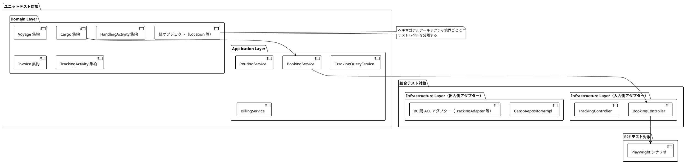
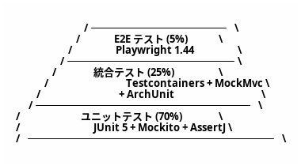
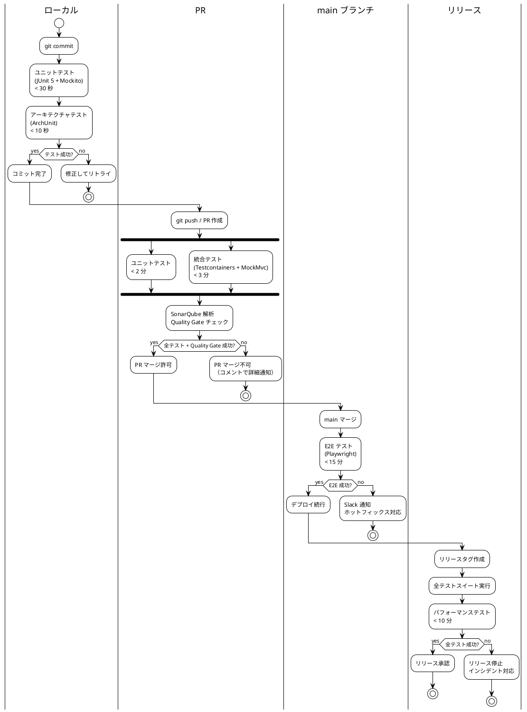
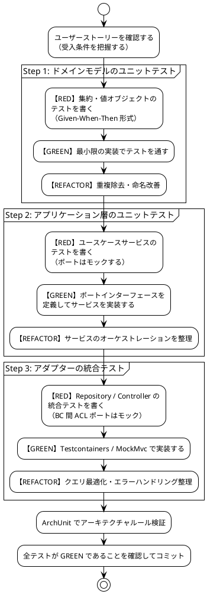

# テスト戦略 - 国際貨物輸送管理システム

## 1. 概要

### 1.1 目的

本ドキュメントは、国際貨物輸送管理システムにおけるテスト戦略を定義する。テスト戦略を事前に策定し、以下の問いに常に回答できる状態を維持することを目的とする。

- 「この機能はどのテストレベルで保証されているか」
- 「何をどこまでテストすべきか」
- 「テストが失敗したとき、どこを修正すべきか」

### 1.2 基本方針

- **TDD（テスト駆動開発）を全開発プロセスで適用する**: レッド → グリーン → リファクタリングのサイクルを厳守する
- **テストをアーキテクチャに対応させる**: ヘキサゴナルアーキテクチャの境界（ポート）を活かし、テスト可能性を設計段階で確保する
- **テストの重複を排除する**: 各テストレベルの責務を明確に分離し、同一ロジックを複数レベルで重複検証しない
- **テストを実行可能なドキュメントとして扱う**: テストコードがシステムの振る舞いを説明する

### 1.3 アーキテクチャとテスト戦略の対応関係



ヘキサゴナルアーキテクチャの各層は以下のテストレベルに対応する。

| アーキテクチャ層 | テストレベル | 理由 |
|---|---|---|
| ドメイン層（集約・値オブジェクト・ドメインサービス） | ユニットテスト | 外部依存ゼロ。純粋なビジネスロジック |
| アプリケーション層（ユースケースサービス） | ユニットテスト（ポートをモック） | ポートへの委譲とオーケストレーションを検証 |
| 入力側アダプター（Controller） | 統合テスト（MockMvc） | HTTP マッピングとバリデーションを検証 |
| 出力側アダプター（Repository） | 統合テスト（Testcontainers） | SQL クエリの正確性を実 DB で検証 |
| BC 間 ACL ポート（TrackingPort / ShipperDiscountPort / BookingSettlementPort） | ユニットテスト（ポートをモック） | 呼び出し側は Mockito でモックし委譲を検証。ポート実装（Adapter）は連携先 BC のサービスへの委譲のみのため、必要に応じて委譲先をモックしたユニットテストで検証 |
| ユーザーシナリオ全体 | E2E テスト（Playwright） | クリティカルパスの品質保証 |

> **注記（外部システム連携の現状）**: 本システムは単一モノリスであり、ルーティング・通関・決済・港湾・通知といった外部システムとの HTTP 連携は実装していない。これらは各 Bounded Context 内のドメインロジック・アプリケーションサービスとして内部シミュレーション実装される。そのため「外部 HTTP サービスの契約を WireMock で検証する」テストは現時点で対象外である。実在する境界間連携は Bounded Context 間の ACL（Anti-Corruption Layer）ポートのみであり、これらは連携先 BC のアプリケーションサービスへ委譲する内部実装のため、Mockito によるモックで検証する。将来、外部 HTTP 連携を実際に導入した場合は [セクション 4](#4-bounded-context-間-acl-ポートのテスト) の将来方針に従い WireMock を採用する。

---

## 2. テスト形状の選択

### 2.1 採用形状: ピラミッド型



**採用理由**:

- **ドメイン層が厚い**: DDD を採用しており、Cargo・Voyage・HandlingActivity・Invoice の各集約にビジネスロジックが集中する。BookingStatus の 8 値遷移、荷役妥当性検証（MISROUTED 判定）、法人割引計算など、外部依存なしでテスト可能なロジックが多い
- **ヘキサゴナルアーキテクチャによる高いテスト可能性**: ドメイン層とインフラ層の境界がポートで分離されており、モックの差し替えが容易。ユニットテストが書きやすい設計になっている
- **CQRS による読み取りモデルの分離**: TrackingContext の読み取りクエリはドメインロジックを持たず、統合テストで Repository を直接検証するだけで十分
- **コスト効率**: ユニットテストは実行が高速（< 30 秒）でメンテナンスコストが低い。E2E テストはフレイキーになりやすく、最小限にとどめることで CI の安定性を維持する

### 2.2 採用しない形状と理由

| 形状 | 採用しない理由 |
|---|---|
| **ダイヤモンド型**（統合テスト重視） | 本システムは単一モノリス（ヘキサゴナル）で構成されており、マイクロサービス間の契約検証ニーズがない。統合テストを主軸にするとテスト実行時間が増大し、TDD サイクルが遅くなる |
| **逆ピラミッド型**（E2E 重視） | Playwright テストはヘッドレスブラウザを起動するためフレイキーになりやすく、htmx の 30 秒ポーリングを含む動的 UI はテストの安定性確保が困難。E2E を主軸にするとフィードバックループが 15 分以上になる |

---

## 3. テストレベルの定義

### 3.1 ユニットテスト（Unit Test）

#### 責務・検証対象

- **ドメイン層**: 集約の状態遷移・不変条件・ビジネスルール、値オブジェクトの等価性・バリデーション、ドメインサービスのロジック
- **アプリケーション層**: ユースケースサービスのオーケストレーション（ポートはモック）

#### カバレッジ目標

| 対象 | 行カバレッジ | 分岐カバレッジ |
|---|---|---|
| ドメイン層 | **85% 以上** | **80% 以上** |
| アプリケーション層 | **80% 以上** | **75% 以上** |

#### 使用ツール

- **JUnit 5**: テストフレームワーク（`@Test`, `@ParameterizedTest`）
- **Mockito 5**: ポートインターフェースのモック（`@Mock`, `@InjectMocks`）
- **AssertJ 3**: 流暢なアサーション（`assertThat(...).isEqualTo(...)`）

#### 実行タイミング

- **ローカル**: すべてのコミット時（目標 **30 秒以内**）
- **PR**: 自動実行（コミットプッシュ時）
- **CI**: GitHub Actions の `unit-test` ジョブ

#### 除外対象

- インフラ層（MyBatis マッパー、HTTP クライアント）— 統合テストで担保する
- DTO / レコードクラス — データ保持のみでロジックがない
- Spring Boot アプリケーションコンテキスト — `@SpringBootTest` はユニットテストに**使用しない**

#### 実装例: Cargo 集約の BookingStatus 遷移テスト

```java
class CargoBookingStatusTest {

    @Test
    void 予約が確定できる() {
        // Given: ルートが割り当て済みの貨物
        var cargo = CargoFixture.withRouteAssigned();

        // When: 予約を確定する
        cargo.confirmBooking();

        // Then: ステータスが CONFIRMED に遷移する
        assertThat(cargo.getBookingStatus()).isEqualTo(BookingStatus.CONFIRMED);
    }

    @Test
    void ルート未割り当て状態で予約確定しようとすると例外が発生する() {
        // Given: ルートが未割り当ての貨物
        var cargo = CargoFixture.preliminary();

        // When & Then: 不変条件違反で例外が発生する
        assertThatThrownBy(cargo::confirmBooking)
                .isInstanceOf(BookingDomainException.class)
                .hasMessageContaining("ルートが割り当てられていません");
    }

    @Test
    void 危険物の取扱不可港にルートを割り当てると例外が発生する() {
        // Given: 危険物フラグが立った貨物と危険物取扱不可の港を経由するルート
        var cargo = CargoFixture.hazardous();
        var prohibitedRoute = RouteFixture.viaHazardousProhibitedPort();

        // When & Then: ドメインルール違反で例外が発生する
        assertThatThrownBy(() -> cargo.assignRoute(prohibitedRoute))
                .isInstanceOf(HazardousCargoRoutingException.class);
    }

    @ParameterizedTest
    @EnumSource(value = BookingStatus.class,
                names = {"SETTLED", "CANCELLED"},
                mode = EnumSource.Mode.INCLUDE)
    void 終端状態からの遷移は許可されない(BookingStatus terminalStatus) {
        // Given: 終端ステータスの貨物
        var cargo = CargoFixture.withStatus(terminalStatus);

        // When & Then: ステータス遷移が拒否される
        assertThatThrownBy(cargo::confirmBooking)
                .isInstanceOf(InvalidBookingStatusTransitionException.class);
    }
}
```

#### データベースを伴うテストの方針（H2 と Testcontainers の使い分け）

- **DB との結合が必要なテストは、原則 Testcontainers（実 PostgreSQL 16）で行う**（[セクション 3.2](#32-統合テストintegration-test) を参照）。本番と同一の PostgreSQL を用いることで、方言差（型・NULL ソート・関数）に起因する「テストは通るが本番で壊れる」乖離を防ぐ。統合テストの基底クラスは `PostgreSQLIntegrationTestBase`（Testcontainers シングルトンコンテナ）である。
- **ドメイン層・アプリケーション層のユニットテストは DB に依存しない**。集約・値オブジェクト・ユースケースサービスは POJO とモックのみで検証するため、そもそも DB を起動しない。
- **H2 はインメモリ DB としては採用しない**。`application-test.yml` では H2 コンソールを無効化しているのみで、テスト用データソースは Testcontainers が動的に上書きする（`@DynamicPropertySource`）。H2 を PostgreSQL 互換モードで使う方針は、方言差リスクを避けるため取らない。

---

### 3.2 統合テスト（Integration Test）

#### 責務・検証対象

- **Repository（MyBatis マッパー）**: SQL クエリの正確性、トランザクション、楽観的ロック
- **Controller（MockMvc）**: HTTP リクエスト/レスポンスのマッピング、バリデーション、エラーハンドリング

> BC 間 ACL ポート（TrackingPort 等）は外部 HTTP 連携ではなく連携先 BC のアプリケーションサービスへの委譲のため、統合テストではなくユニットテスト（Mockito モック）で検証する。詳細は [セクション 4](#4-bounded-context-間-acl-ポートのテスト) を参照。

#### カバレッジ目標

| 対象 | 行カバレッジ |
|---|---|
| Repository（インフラ層） | **75% 以上** |
| Controller 層 | **70% 以上** |

#### 使用ツール

- **JUnit 5**: テストフレームワーク
- **Testcontainers 1.20（`junit-jupiter` + `postgresql`）**: 実 PostgreSQL 16 コンテナを自動起動。基底クラス `PostgreSQLIntegrationTestBase` がシングルトンコンテナを起動し `@DynamicPropertySource` でデータソースを上書きする
- **Spring MockMvc**: HTTP 層の結合テスト（サーブレットコンテキストは起動）

#### 実行タイミング

- **PR 時**: GitHub Actions の `integration-test` ジョブ（目標 **5 分以内**）
- **ローカル**: Docker が起動している環境で任意実行

#### 実装例: CargoRepository の保存・検索テスト（Testcontainers）

> 実プロジェクトではコンテナ起動を共通化するため、`support.PostgreSQLIntegrationTestBase`（シングルトンコンテナ + `@DynamicPropertySource`）を継承する。以下はコンテナ設定を明示した最小例である。

```java
@SpringBootTest
class CargoRepositoryIntegrationTest extends PostgreSQLIntegrationTestBase {

    @Autowired
    private CargoRepository cargoRepository;

    @Test
    @Transactional
    void 貨物を保存して追跡番号で検索できる() {
        // Given: 新規貨物エンティティ
        var cargo = CargoFixture.newBooking(
                TrackingId.of("CARGO-001"),
                UnLocode.of("JPTYO"),
                UnLocode.of("DEHAM")
        );

        // When: 保存して検索する
        cargoRepository.save(cargo);
        var found = cargoRepository.findByTrackingId(TrackingId.of("CARGO-001"));

        // Then: 保存したエンティティと一致する
        assertThat(found).isPresent();
        assertThat(found.get().getOrigin()).isEqualTo(UnLocode.of("JPTYO"));
        assertThat(found.get().getDestination()).isEqualTo(UnLocode.of("DEHAM"));
    }

    @Test
    void 存在しない追跡番号で検索するとOptionalEmptyを返す() {
        // Given & When
        var result = cargoRepository.findByTrackingId(TrackingId.of("NONEXISTENT"));

        // Then
        assertThat(result).isEmpty();
    }
}
```

#### 実装例: BookingController の MockMvc テスト

```java
@WebMvcTest(BookingController.class)
class BookingControllerTest {

    @Autowired
    private MockMvc mockMvc;

    // Spring Boot 3.4+ では @MockBean は deprecated。@MockitoBean（org.springframework.test.context.bean.override.mockito）を使用する
    @MockitoBean
    private BookingApplicationService bookingApplicationService;

    @Test
    void 貨物予約登録APIが201を返す() throws Exception {
        // Given: 予約登録リクエスト
        var request = """
                {
                  "originUnLocode": "JPTYO",
                  "destinationUnLocode": "DEHAM",
                  "arrivalDeadline": "2026-06-30"
                }
                """;
        var expectedTrackingId = TrackingId.of("CARGO-001");
        given(bookingApplicationService.bookNewCargo(any()))
                .willReturn(expectedTrackingId);

        // When & Then
        mockMvc.perform(post("/api/bookings")
                        .contentType(MediaType.APPLICATION_JSON)
                        .content(request))
                .andExpect(status().isCreated())
                .andExpect(jsonPath("$.trackingId").value("CARGO-001"));
    }

    @Test
    void 出発地コードが不正な場合は400を返す() throws Exception {
        // Given: 不正な UN/LOCODE を含むリクエスト
        var invalidRequest = """
                {
                  "originUnLocode": "INVALID",
                  "destinationUnLocode": "DEHAM",
                  "arrivalDeadline": "2026-06-30"
                }
                """;

        // When & Then
        mockMvc.perform(post("/api/bookings")
                        .contentType(MediaType.APPLICATION_JSON)
                        .content(invalidRequest))
                .andExpect(status().isBadRequest())
                .andExpect(jsonPath("$.errors[0].field").value("originUnLocode"));
    }
}
```

#### BC 間 ACL ポートのテスト概要

外部 HTTP サービスへの ACL は現時点で存在しない。実在する境界間連携は Bounded Context 間の ACL ポートのみで、Mockito モックによるユニットテストで検証する。詳細は [セクション 4](#4-bounded-context-間-acl-ポートのテスト) を参照。

---

### 3.3 アーキテクチャテスト（Architecture Test）

#### 責務・検証対象

ヘキサゴナルアーキテクチャの依存関係ルールをコードレベルで自動検証する。アーキテクチャの腐敗（依存関係の逆転・Bounded Context 間の直接参照）を CI で検出する。

#### 使用ツール

- **ArchUnit 1.x**: Java パッケージの依存関係を宣言的に検証

#### 実行タイミング

- **PR 時**: GitHub Actions の `unit-test` ジョブに統合（ユニットテストと同時実行）
- **ローカル**: `./gradlew test` で自動実行

#### 検証ルール 4 件

```java
@AnalyzeClasses(packages = "com.example.cargotracker")
class HexagonalArchitectureTest {

    // ルール 1: domain パッケージが infrastructure パッケージを import しない
    @ArchTest
    static final ArchRule domainDoesNotDependOnInfrastructure =
            noClasses()
                    .that().resideInAPackage("..domain..")
                    .should().dependOnClassesThat()
                    .resideInAPackage("..infrastructure..")
                    .because("ドメイン層はインフラ層を直接参照してはならない。" +
                             "依存方向は infrastructure → domain でなければならない");

    // ルール 2: domain パッケージで Spring アノテーションを使用しない
    @ArchTest
    static final ArchRule domainDoesNotUseSpringAnnotations =
            noClasses()
                    .that().resideInAPackage("..domain..")
                    .should().beAnnotatedWith(Component.class)
                    .orShould().beAnnotatedWith(Service.class)
                    .orShould().beAnnotatedWith(Repository.class)
                    .orShould().beAnnotatedWith(Autowired.class)
                    .because("ドメイン層は Spring フレームワークに依存してはならない。" +
                             "ドメインオブジェクトは POJO でなければならない");

    // ルール 3: アプリケーション層がインフラ層を直接参照しない（Port 経由のみ許可）
    @ArchTest
    static final ArchRule applicationDoesNotDependOnInfrastructureDirectly =
            noClasses()
                    .that().resideInAPackage("..application..")
                    .should().dependOnClassesThat()
                    .resideInAPackage("..infrastructure..")
                    .because("アプリケーション層はポートインターフェース経由でのみ" +
                             "インフラ層と通信しなければならない");

    // ルール 4: 異なる Bounded Context 間でクラスを直接参照しない
    @ArchTest
    static final ArchRule boundedContextsDoNotDirectlyReference =
            SlicesRuleDefinition.slices()
                    .matching("com.example.cargotracker.(*)..")
                    .should().notDependOnEachOther()
                    .ignoreDependency(
                            resideInAPackage("..shared.."),
                            alwaysTrue()
                    )
                    .because("Bounded Context 間の通信はドメインイベントまたは" +
                             "ACL（Anti-Corruption Layer）経由でなければならない。" +
                             "shared パッケージ（共有カーネル）への参照は許可する");
}
```

---

### 3.4 E2E テスト（End-to-End Test）

#### 責務・検証対象

クリティカルなユーザーシナリオをブラウザレベルで検証する。ドメインロジックの再検証は行わず、ユーザー体験の観点からシステム全体が協調動作することを確認する。

**優先シナリオ（US13・US15・US18）**:

| シナリオ | 理由 |
|---|---|
| US13: 予約を確定する | 予約フローの最終ステップ。複数コンテキストが連携する |
| US15: 荷役作業を記録する | 最も頻繁に実行される運用操作 |
| US18: 追跡情報を照会する | 顧客向け重要機能。htmx ポーリングを含む |

#### カバレッジ目標

- 優先度「高」のユーザーシナリオ（US01〜US20）の **80% カバー**

US 採番は `docs/requirements/user_story.md` を正典とする。

#### 使用ツール

- **Playwright 1.44+**: ブラウザ自動化（TypeScript）
- **htmx 対応**: `waitForSelector` によるポーリング更新の待機

#### 実行タイミング

- **main ブランチマージ後**: GitHub Actions の `e2e-test` ジョブ（目標 **15 分以内**）
- **リリース前**: 全 E2E シナリオを実行

#### htmx 30 秒ポーリングへの対応

htmx の `hx-trigger="every 30s"` による自動更新を Playwright でテストするには、`waitForSelector` でポーリング後の DOM 更新を待機する。

```typescript
// htmx ポーリング完了を待機するユーティリティ
async function waitForHtmxUpdate(page: Page, selector: string, timeout = 35000) {
  // htmx が更新した要素に hx-request 属性が付与されるため、
  // その変化を監視してポーリング完了を検出する
  await page.waitForFunction(
    (sel) => {
      const el = document.querySelector(sel);
      return el && !el.hasAttribute('hx-request');
    },
    selector,
    { timeout }
  );
}
```

#### 実装例: US18 追跡情報照会の Playwright テスト（TypeScript）

```typescript
import { test, expect, Page } from '@playwright/test';

test.describe('US18: 追跡情報を照会する', () => {
  let page: Page;

  test.beforeEach(async ({ browser }) => {
    page = await browser.newPage();
  });

  test('追跡番号で貨物の現在状態を照会できる', async () => {
    // Given: 荷役作業が記録済みの貨物が存在する
    await page.goto('/tracking');

    // When: 追跡番号を入力して検索する
    await page.fill('[data-testid="tracking-id-input"]', 'CARGO-001');
    await page.click('[data-testid="search-button"]');

    // Then: 追跡情報が表示される
    await expect(page.locator('[data-testid="transport-status"]'))
      .toHaveText('ONBOARD_CARRIER', { timeout: 10000 });
    await expect(page.locator('[data-testid="current-location"]'))
      .toContainText('東京港');
  });

  test('htmx ポーリングで追跡情報が自動更新される', async () => {
    // Given: 追跡ページを表示している
    await page.goto('/tracking/CARGO-001');
    const initialStatus = await page
      .locator('[data-testid="transport-status"]')
      .textContent();

    // When: バックエンドで荷役イベントが発生し、30 秒後にポーリングが更新される
    // （テスト環境ではポーリング間隔を 5 秒に短縮）
    await waitForHtmxUpdate(page, '[data-testid="tracking-panel"]', 10000);

    // Then: ページを再読み込みせずに最新状態が反映される
    const updatedStatus = await page
      .locator('[data-testid="transport-status"]')
      .textContent();
    expect(updatedStatus).not.toBe(initialStatus);
  });

  test('存在しない追跡番号を入力するとエラーメッセージが表示される', async () => {
    // Given
    await page.goto('/tracking');

    // When
    await page.fill('[data-testid="tracking-id-input"]', 'NONEXISTENT-999');
    await page.click('[data-testid="search-button"]');

    // Then
    await expect(page.locator('[data-testid="error-message"]'))
      .toContainText('追跡番号が見つかりません');
  });
});

async function waitForHtmxUpdate(page: Page, selector: string, timeout = 35000) {
  await page.waitForFunction(
    (sel) => {
      const el = document.querySelector(sel);
      return el && !el.hasAttribute('hx-request');
    },
    selector,
    { timeout }
  );
}
```

---

## 4. Bounded Context 間 ACL ポートのテスト

### 4.1 現状: 外部 HTTP 連携は未実装

本システムは単一モノリスであり、ルーティング・通関・決済・港湾・通知といった外部システムとの HTTP 連携は実装していない。これらの業務は各 Bounded Context 内のドメインロジックとアプリケーションサービスとして内部シミュレーション実装される。したがって「外部 HTTP サービスの契約を WireMock でスタブ化して検証する」テストは現時点で対象外である。

実在する境界間連携は、Bounded Context 間の ACL（Anti-Corruption Layer）ポートのみである。

| ACL ポート | 呼び出し元 BC | 委譲先 BC | 役割 |
|---|---|---|---|
| `TrackingPort` | Booking | Tracking | 予約確定時に追跡番号を発行する |
| `ShipperDiscountPort` | Billing | Shipper | 荷主区分に応じた割引ポリシーを取得する |
| `BookingSettlementPort` | Billing | Booking | 精算完了時に予約を SETTLED へ遷移させる |

これらのポート実装（`TrackingAdapter` / `ShipperDiscountAdapter` / `BookingSettlementAdapter`）は、いずれも連携先 BC のアプリケーションサービスまたはクエリサービスへ委譲するだけの薄い内部実装であり、HTTP 通信・タイムアウト・リトライは介在しない。

### 4.2 ACL ポートのテスト方針

外部 HTTP 連携が無いため、契約テスト（WireMock）は不要である。ACL ポートは以下の 2 観点でユニットテストする。

- **呼び出し元のテスト**: ポートインターフェースを Mockito でモックし、アプリケーションサービスがポートを正しく呼び出す（委譲する）ことを検証する。実例は `InvoiceCommandServiceTest`（`ShipperDiscountPort` / `BookingSettlementPort` を `@Mock`）を参照。

```java
@ExtendWith(MockitoExtension.class)
class InvoiceCommandServiceTest {

    @Mock
    private ShipperDiscountPort shipperDiscountPort;

    @Mock
    private BookingSettlementPort bookingSettlementPort;

    @InjectMocks
    private InvoiceCommandService invoiceCommandService;

    @Test
    void 精算時に予約が確定される() {
        // Given: 割引ポリシーを返すようポートをスタブする
        given(shipperDiscountPort.getDiscountPolicyForShipper(any()))
                .willReturn(DiscountPolicy.none());

        // When: 精算を実行する
        invoiceCommandService.settle(/* ... */);

        // Then: 予約確定ポートへ委譲される
        verify(bookingSettlementPort).settleBooking(any());
    }
}
```

- **ポート実装（Adapter）のテスト**: Adapter は委譲のみのため、委譲先 BC のサービスをモックしたユニットテストで「引数の変換と委譲先呼び出し」を検証すれば十分である。委譲先 BC を含めた結合を確認したい場合は、`@SpringBootTest` + Testcontainers による統合テストで実 DB を跨いだ連携を検証する（ただし ArchUnit ルール 4 が示すとおり、BC 間の直接参照は ACL 経由に限定される）。

### 4.3 将来方針: 外部 HTTP 連携を導入した場合

将来、ルーティング・決済・通知などを実際の外部 HTTP サービスとして連携する場合は、次の方針で契約テストを追加する。

- 各外部連携を出力側ポート（例: `ExternalRoutingServicePort`）として定義し、HTTP クライアント実装の Adapter を用意する。
- Adapter の統合テストで **WireMock**（`spring-cloud-contract-wiremock` の `@AutoConfigureWireMock` 等）を導入し、正常系・タイムアウト・エラーステータス・フォールバックをスタブ化して契約を検証する。
- ピラミッド §2.1 の統合テスト層に「+ WireMock」を追記し、§1.3 の対応表に外部 ACL ポート行を戻す。

現時点では YAGNI に従い、実装が存在しない外部連携の契約テストは設けない。

---

## 5. ユーザーストーリーとテストのトレーサビリティ

US 採番は `docs/requirements/user_story.md`（US01〜US24）を正典とする。

| US | タイトル | ユニットテスト | 統合テスト | E2E テスト | 優先度 |
|---|---|---|---|---|---|
| US01 | 輸送見積を作成する | `QuotationService`、`Quotation` 値オブジェクト | `QuotationController`（見積 API） | - | 高 |
| US02 | 荷主を登録する | `Shipper` 集約、`ShipperRegistrationService` | `ShipperRepository`、`ShipperController` | - | 高 |
| US03 | 法人荷主を登録する | `CorporateShipper` 集約、法人割引率計算 | `CorporateShipperRepository`、`ShipperController` | - | 高 |
| US04 | 貨物予約を登録する | `Cargo` 集約、`BookingStatus` 初期遷移 | `CargoRepository`、`BookingController` | - | 高 |
| US05 | 危険物・冷凍貨物の予約を登録する | `Cargo` 集約（危険物フラグ）、`CargoCategory` 値オブジェクト | `CargoRepository`、`BookingController` | - | 高 |
| US06 | 予約情報を経路設計者に引き渡す | `Cargo` 集約（`BookingStatus.ROUTE_PROPOSED` 遷移） | `BookingController`（引き渡し API） | - | 高 |
| US07 | 航海スケジュールを検索する | `Voyage` 集約、スケジュール検索ロジック | `VoyageRepository`、`RoutingController` | - | 高 |
| US08 | 経路候補を算出する | `RoutingService`（内部シミュレーション）、`Itinerary` 値オブジェクト | `RoutingController`（ルート検索 API） | - | 高 |
| US09 | 経路を選択・確定する | `Cargo#assignRoute()` | `CargoRepository`（ルート保存）、`RoutingController` | - | 高 |
| US10 | 経路条件を調整して再算出する | `RoutingService`（条件変更・再算出） | `RoutingController`（再算出 API） | - | 高 |
| US11 | 経路情報を予約に紐付ける | `Cargo#assignRoute()`（経路保存・不変条件） | `CargoRepository`（ルート保存） | - | 高 |
| US12 | 確定経路を荷主に通知する | 経路確定ドメインイベント発行 | イベントリスナー（AFTER_COMMIT） | - | 高 |
| US13 | 予約を確定する | `Cargo#confirmBooking()`、`BookingStatus.CONFIRMED` 遷移 | `BookingController`（確定 API）、`CargoRepository` | **US13 シナリオ** | 高 |
| US14 | 追跡番号を発行する | `TrackingId` 値オブジェクト（一意性）、`TrackingIdGenerator` | `CargoRepository`（追跡番号保存） | - | 高 |
| US15 | 荷役作業を記録する | `HandlingActivity` 集約、MISROUTED 判定ロジック | `HandlingActivityRepository`、`HandlingController` | **US15 シナリオ** | 高 |
| US16 | 引取作業を記録する | `HandlingActivity`（RECEIVED イベント） | `HandlingController`（引取 API） | - | 高 |
| US17 | 貨物状態を手動更新する | `TrackingActivity`、`TransportStatus` 遷移（9 値） | `TrackingController`（手動更新 API） | - | 高 |
| US18 | 追跡情報を照会する | - | `TrackingQueryService`（CQRS 読み取り）、`TrackingController` | **US18 シナリオ** | 高 |
| US19 | 遅延例外を処理する | `TrackingExceptionEvent` エスカレーション判定 | `TrackingController`（例外処理 API） | - | 高 |
| US20 | 破損・紛失例外を処理する | `HandlingException` 集約、`ExceptionType` 値オブジェクト | `HandlingController`（例外記録 API） | - | 高 |
| US21 | 輸送料金を算出する | `Invoice` 集約、`FreightCalculationService`、消費税計算 | `InvoiceRepository`、`BillingController` | - | 中 |
| US22 | 法人割引を適用する | `DiscountPolicy` 値オブジェクト、法人割引率計算ロジック、`ShipperDiscountPort`（モック） | `BillingController`（割引適用 API） | - | 中 |
| US23 | 精算を処理する | `Invoice#settle()`、`InvoiceStatus` 遷移、`BookingSettlementPort`（モック） | `BillingController`（精算 API） | - | 中 |
| US24 | 割引ポリシーを管理する | `DiscountPolicy`（割引率 0〜30% バリデーション・有効期限判定） | 割引ポリシー管理 Controller / Repository | - | 中 |

---

## 6. カバレッジ目標とメトリクス

### 6.1 レイヤー別カバレッジ目標（最終目標）

以下は各レイヤーが目指す**最終目標**である。強制の実効化は §6.3 の JaCoCo 検証で段階的に行う。

| レイヤー | 行カバレッジ目標 | 分岐カバレッジ目標 | 計測ツール |
|---|---|---|---|
| ドメイン層（`domain` パッケージ） | **85% 以上** | **80% 以上** | JaCoCo / SonarQube |
| アプリケーション層（`application` パッケージ） | **80% 以上** | **75% 以上** | JaCoCo / SonarQube |
| インフラ層 - Repository（`infrastructure.persistence` パッケージ） | **75% 以上** | — | JaCoCo / SonarQube |
| インフラ層 - Controller（`infrastructure.web` パッケージ） | **70% 以上** | — | JaCoCo / SonarQube |

### 6.2 SonarQube Quality Gate 条件

| 条件 | 基準値 | 適用対象 |
|---|---|---|
| 行カバレッジ（新規コード） | **80% 以上** | 新規追加コード |
| 重複コード率 | **3% 以下** | プロジェクト全体 |
| Reliability Rating | **A**（バグゼロ） | プロジェクト全体 |
| Security Rating | **A**（脆弱性ゼロ） | プロジェクト全体 |
| Maintainability Rating | **A** | 新規コード |
| Security Hotspot Review | **100%** | 新規コード |

Quality Gate が失敗した場合、PR のマージをブロックする。

### 6.3 カバレッジ目標の CI 強制方法（JaCoCo 検証）

§6.1 の目標を「飾り」で終わらせないため、`build.gradle` の **`jacocoTestCoverageVerification`** タスクでビルド時に閾値を強制する。`check` タスクに依存させているため、`./gradlew check`（および CI の PR ジョブ）で自動実行され、閾値を下回るとビルドが失敗する。

```gradle
// apps/cargo-tracker/build.gradle
jacocoTestCoverageVerification {
    dependsOn test
    violationRules {
        rule {
            limit {
                counter = 'LINE'
                value = 'COVEREDRATIO'
                minimum = 0.75
            }
        }
        rule {
            limit {
                counter = 'BRANCH'
                value = 'COVEREDRATIO'
                minimum = 0.65
            }
        }
    }
}

check.dependsOn jacocoTestCoverageVerification
```

**段階的引き上げ方針**:

- **現在の閾値**: 全体行 **75%** / 分岐 **65%**。これは現状の実測カバレッジ（全体行約 81.5% / 分岐約 76.8%）を下回る安全側の値で、「いきなり 85% でビルドが壊れる」事態を避けるための開始点である。
- **引き上げ手順**: カバレッジが安定して目標を上回るようになったら、閾値を段階的に引き上げる。最終的には JaCoCo のパッケージ単位ルール（`includes` / `element = 'PACKAGE'`）を用いてレイヤー別目標（§6.1: ドメイン 85% / 分岐 80% 等）を個別に強制する形へ移行する。
- **手順の目安**: (1) 現在の閾値で緑を維持 → (2) 実測が閾値+5% を安定して超えたら閾値を実測近くまで引き上げ → (3) レイヤー別ルールへ分割。1 度に大きく上げず、実測に追随させる。
- **SonarQube との役割分担**: JaCoCo 検証は「プロジェクト全体の後退防止」を担い、SonarQube Quality Gate（§6.2）は「新規コードのカバレッジ 80%」を担う。両者を併用し、既存の底上げと新規の品質担保を両立させる。

---

## 7. CI/CD とのテスト連携

### 7.1 ステージ別テスト戦略

| ステージ | テスト種別 | 目標時間 | 失敗時の扱い |
|---|---|---|---|
| コミット（ローカル） | ユニットテスト + アーキテクチャテスト | **< 60 秒** | コミット前に修正 |
| PR | ユニット + 統合 + ArchUnit + SonarQube | **< 5 分** | PR マージ不可 |
| main ブランチマージ後 | E2E テスト | **< 15 分** | Slack 通知（ホットフィックス優先） |
| リリース | 全テスト + パフォーマンステスト | **< 30 分** | リリース停止 |

### 7.2 GitHub Actions パイプライン図



---

## 8. TDD 開発ワークフロー

### 8.1 インサイドアウト TDD（バックエンド）

ドメイン層から外側に向かって開発する。外部依存を後回しにすることで、ビジネスロジックに集中できる。



### 8.2 重要なビジネスルール（必ず TDD 適用）

以下のビジネスルールは複雑度が高く、テストファーストで実装しなければならない。

#### Cargo の BookingStatus 状態遷移（8 値）

```
PRELIMINARY → ROUTE_PROPOSED → CONFIRMED → TRACKING_ISSUED
    → IN_TRANSIT → DELIVERED → SETTLED
    ↘ CANCELLED（いずれの状態からも遷移可能）
```

テスト観点:

- 各遷移の正常系（許可されている遷移）
- 各遷移の異常系（許可されていない遷移 → `InvalidBookingStatusTransitionException`）
- 終端状態（SETTLED・CANCELLED）からの遷移拒否

#### HandlingActivity の荷役妥当性検証（MISROUTED 判定）

```java
@Test
void 指定ルート外の港で荷役を実行するとMISROUTED判定になる() {
    // Given: 東京→ハンブルク のルートを持つ貨物
    var cargo = CargoFixture.withRoute(
            RouteFixture.tokyoToHamburg()
    );

    // When: ルートに含まれないシンガポールで荷役を記録する
    var activity = HandlingActivity.of(
            cargo.getTrackingId(),
            UnLocode.of("SGSIN"), // ルート外の港
            HandlingType.LOAD,
            LocalDateTime.now()
    );

    // Then: 貨物の経路状態が MISROUTED に遷移する
    cargo.applyHandlingActivity(activity);
    assertThat(cargo.getRoutingStatus()).isEqualTo(RoutingStatus.MISROUTED);
}
```

#### Invoice の料金計算（法人割引・消費税計算）

```java
@Test
void 法人割引10%と消費税10%が正しく計算される() {
    // Given: 基本料金 100,000 円、法人割引率 10% の Invoice
    var baseAmount = Money.of(100_000, "JPY");
    var corporateDiscount = DiscountPolicy.corporate(Percentage.of(10));

    // When: 料金を確定する
    var invoice = Invoice.calculate(baseAmount, corporateDiscount, TaxRate.STANDARD);

    // Then: 割引後 90,000 円 × 消費税 10% = 99,000 円
    assertThat(invoice.getNetAmount()).isEqualTo(Money.of(90_000, "JPY"));
    assertThat(invoice.getTaxAmount()).isEqualTo(Money.of(9_000, "JPY"));
    assertThat(invoice.getTotalAmount()).isEqualTo(Money.of(99_000, "JPY"));
}
```

#### TrackingExceptionEvent のエスカレーション判定

```java
@Test
void 遅延が48時間を超える場合にエスカレーションフラグが立つ() {
    // Given: 遅延 72 時間の例外イベント
    var event = TrackingExceptionEvent.delay(
            TrackingId.of("CARGO-001"),
            Duration.ofHours(72)
    );

    // When: エスカレーション判定を実行する
    var result = escalationPolicy.evaluate(event);

    // Then: エスカレーション対象と判定される
    assertThat(result.requiresEscalation()).isTrue();
    assertThat(result.getEscalationLevel()).isEqualTo(EscalationLevel.CRITICAL);
}

@Test
void 遅延が48時間以内の場合はエスカレーション不要と判定される() {
    // Given: 遅延 24 時間の例外イベント
    var event = TrackingExceptionEvent.delay(
            TrackingId.of("CARGO-002"),
            Duration.ofHours(24)
    );

    // When
    var result = escalationPolicy.evaluate(event);

    // Then
    assertThat(result.requiresEscalation()).isFalse();
}
```

### 8.3 Bounded Context 別 TDD 優先順位

| Bounded Context | TDD 優先ルール | 理由 |
|---|---|---|
| Booking Context | BookingStatus 遷移（8 値）を最初にテストする | 最も複雑な状態機械。バグの影響範囲が大きい |
| Routing Context | ルート選択ロジック（内部シミュレーション）を最初にテストする | 経路計算はビジネスルールが集中する。外部 HTTP 連携を導入する際は WireMock 契約テストへ拡張する（§4.3） |
| Tracking Context | CQRS 読み取りクエリのパフォーマンスを統合テストで検証する | 30 秒ポーリングの負荷を事前に確認する |
| Handling Context | MISROUTED 判定ロジックを先にテストする | 荷役記録ミスは運用上重大なインシデントになる |
| Billing Context | 割引・消費税計算を `@ParameterizedTest` で網羅する | 金額計算のバグは法的リスクを伴う |
| Shared Domain | Location（UN/LOCODE）のバリデーションを値オブジェクトレベルで担保する | 全コンテキストが共有するため、バグの影響範囲が広い |
