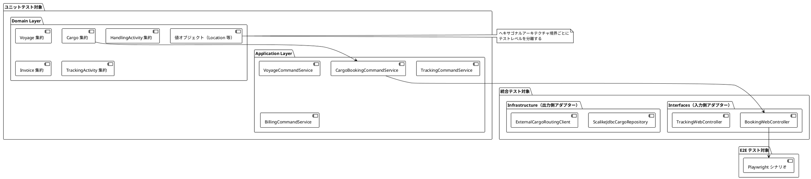
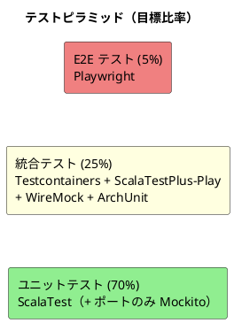
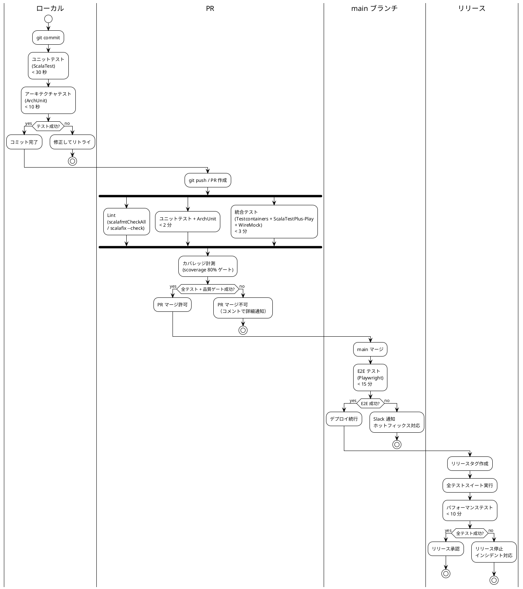
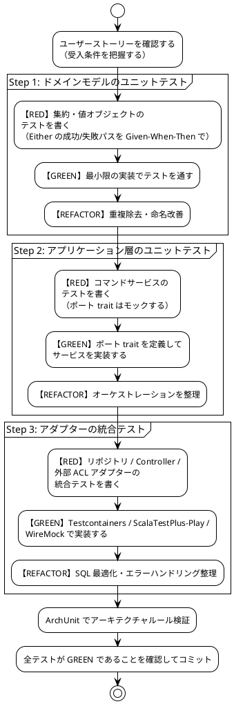

# テスト戦略 - 国際貨物輸送管理システム

## 1. 概要

### 1.1 目的

本ドキュメントは、国際貨物輸送管理システム（Scala 版）におけるテスト戦略を定義する。テスト戦略を事前に策定し、以下の問いに常に回答できる状態を維持することを目的とする。

- 「この機能はどのテストレベルで保証されているか」
- 「何をどこまでテストすべきか」
- 「テストが失敗したとき、どこを修正すべきか」

### 1.2 基本方針

- **TDD（テスト駆動開発）を全開発プロセスで適用する**: レッド → グリーン → リファクタリングのサイクルを厳守する
- **テストをアーキテクチャに対応させる**: ヘキサゴナルアーキテクチャの境界（ポート trait）を活かし、テスト可能性を設計段階で確保する
- **型で防げるものはテストしない**: opaque type・enum・ADT で表現された制約（不正な型の混入・網羅漏れ）はコンパイラが保証する。テストは型で表現できないビジネスルール（値の範囲・状態遷移・計算）に集中する
- **テストの重複を排除する**: 各テストレベルの責務を明確に分離し、同一ロジックを複数レベルで重複検証しない
- **テストを実行可能なドキュメントとして扱う**: テストコードがシステムの振る舞いを説明する

### 1.3 アーキテクチャとテスト戦略の対応関係



ヘキサゴナルアーキテクチャの各層は以下のテストレベルに対応する。

| アーキテクチャ層 | テストレベル | 理由 |
|---|---|---|
| ドメイン層（集約・値オブジェクト・ドメインサービス） | ユニットテスト（モック不要） | 外部依存ゼロの純粋関数。`Either` の入出力検証のみで完結する |
| アプリケーション層（コマンド/クエリサービス） | ユニットテスト（ポート trait をモック） | ポートへの委譲とオーケストレーションを検証 |
| 入力側アダプター（Controller / routes / Twirl） | 統合テスト（ScalaTestPlus-Play） | HTTP マッピング・Play Form 検証・テンプレートレンダリングを検証 |
| 出力側アダプター（ScalikeJDBC リポジトリ） | 統合テスト（Testcontainers） | SQL クエリの正確性を実 PostgreSQL で検証 |
| 外部 ACL ポート（5 件） | 統合テスト（WireMock） | 外部システムとの契約を検証 |
| アーキテクチャ規約 | アーキテクチャテスト（ArchUnit） | 依存方向ルールの自動検証 |
| ユーザーシナリオ全体 | E2E テスト（Playwright） | クリティカルパスの品質保証 |

---

## 2. テスト形状の選択

### 2.1 採用形状: ピラミッド型



**採用理由**:

- **ドメイン層が厚い**: DDD を採用しており、Cargo・Voyage・HandlingActivity・Invoice・TrackingActivity の各集約にビジネスロジックが集中する。BookingStatus の 8 値遷移、荷役妥当性検証（`HandlingValidity` 判定）、法人割引計算など、外部依存なしでテスト可能なロジックが多い
- **イミュータブル設計によるテスト容易性**: ドメインモデルは純粋関数（入力 → `Either[DomainError, A]`）であり、モックもセットアップも不要。ユニットテストの記述コストが極めて低い
- **ヘキサゴナルアーキテクチャによる境界分離**: アプリケーション層とインフラ層の境界がポート trait で分離されており、モックの差し替えが容易
- **CQRS による読み取りモデルの分離**: クエリ側はドメインロジックを持たず、統合テストでリポジトリの SQL を直接検証するだけで十分
- **コスト効率**: ユニットテストは実行が高速（< 30 秒）でメンテナンスコストが低い。E2E テストはフレイキーになりやすく、最小限にとどめることで CI の安定性を維持する

### 2.2 採用しない形状と理由

| 形状 | 採用しない理由 |
|---|---|
| **ダイヤモンド型**（統合テスト重視） | 本システムは単一モノリス（ヘキサゴナル）で構成されており、マイクロサービス間の契約検証ニーズがない。統合テストを主軸にするとテスト実行時間が増大し、TDD サイクルが遅くなる |
| **逆ピラミッド型**（E2E 重視） | Playwright テストはヘッドレスブラウザを起動するためフレイキーになりやすく、htmx の 30 秒ポーリングを含む動的 UI はテストの安定性確保が困難。E2E を主軸にするとフィードバックループが 15 分以上になる |

---

## 3. テストレベルの定義

### 3.1 ユニットテスト（Unit Test）

#### 責務・検証対象

- **ドメイン層**: 集約の状態遷移・不変条件・ビジネスルール（`Either` の成功/失敗パス）、値オブジェクトのスマートコンストラクタ、ドメインサービスのロジック
- **アプリケーション層**: コマンド/クエリサービスのオーケストレーション（ポート trait はモック）

#### カバレッジ目標

| 対象 | ステートメントカバレッジ | ブランチカバレッジ |
|---|---|---|
| ドメイン層 | **85% 以上** | **80% 以上** |
| アプリケーション層 | **80% 以上** | **75% 以上** |

#### 使用ツール

- **ScalaTest**: テストフレームワーク（`AnyFunSuite` / `AnyWordSpec`）。パラメータ化テストは `TableDrivenPropertyChecks` を使用
- **Mockito（scalatestplus-mockito）**: ポート trait のモック（アプリケーション層のみ）
- **ScalaTest Matchers**: アサーション（`shouldBe` / `should matchPattern`）

#### 実行タイミング

- **ローカル**: すべてのコミット時（目標 **30 秒以内**）。`sbt test`（ユニットのみのスコープ）
- **PR**: 自動実行（コミットプッシュ時）
- **CI**: GitHub Actions の `unit-test` ジョブ

#### 除外対象

- インフラ層（ScalikeJDBC リポジトリ、Play WS クライアント）— 統合テストで担保する
- Query DTO / コマンド case class — データ保持のみでロジックがない
- Play アプリケーションコンテキスト — `GuiceApplicationBuilder` はユニットテストに**使用しない**

#### 実装例: Cargo 集約の BookingStatus 遷移テスト

ドメインモデルは `Either` を返す純粋関数のため、例外でなく値のパターンマッチで検証する。

```scala
class CargoBookingStatusTest extends AnyFunSuite with TableDrivenPropertyChecks:

  test("経路提案済みの予約を確定できる") {
    // Given: ルートが割り当て済みの貨物
    val cargo = CargoFixture.withRouteAssigned()

    // When: 予約を確定する
    val result = cargo.confirm()

    // Then: ステータスが Confirmed に遷移した新しい Cargo が返る
    result.map(_.status) shouldBe Right(BookingStatus.Confirmed)
  }

  test("ルート未割り当て状態で予約確定しようとするとドメインエラーが返る") {
    // Given: ルートが未割り当ての貨物（Preliminary）
    val cargo = CargoFixture.preliminary()

    // When & Then: 不変条件違反が Left で表現される（例外は投げない）
    cargo.confirm() should matchPattern {
      case Left(DomainError.InvalidStatusTransition(_, BookingStatus.Preliminary, _)) =>
    }
  }

  test("危険物の取扱不可港を経由するルートは割り当てできない") {
    // Given: 危険物の貨物と危険物取扱不可の港を経由するルート
    val cargo = CargoFixture.hazardous()
    val prohibitedRoute = RouteFixture.viaHazardousProhibitedPort()

    // When & Then
    cargo.assignRoute(prohibitedRoute) should matchPattern {
      case Left(DomainError.HazardousCargoNotSupported(_, _)) =>
    }
  }

  test("終端状態からの遷移は拒否される") {
    // Given: 終端ステータスの組（TableDrivenPropertyChecks でパラメータ化）
    val terminalStatuses = Table("status", BookingStatus.Settled, BookingStatus.Cancelled)

    forAll(terminalStatuses) { terminal =>
      val cargo = CargoFixture.withStatus(terminal)
      cargo.confirm() should matchPattern {
        case Left(DomainError.InvalidStatusTransition(_, _, _)) =>
      }
    }
  }
```

#### 実装例: 値オブジェクトのスマートコンストラクタテスト

```scala
class UnLocodeTest extends AnyFunSuite with TableDrivenPropertyChecks:

  test("有効な UN/LOCODE で生成できる") {
    UnLocode("JPTYO").map(_.value) shouldBe Right("JPTYO")
  }

  test("不正な形式はドメインエラーになる") {
    val invalidCodes = Table("code", "TOKYO1", "jp", "", "JPTY")
    forAll(invalidCodes) { code =>
      UnLocode(code) should matchPattern { case Left(DomainError.InvalidUnLocode(_)) => }
    }
  }
```

> **テストデータ管理**: テストフィクスチャは Object Mother パターン（`CargoFixture.preliminary()` 等）で
> `test/fixtures/` に集約する。イミュータブルな case class は `copy` で派生データを作れるため、
> ビルダーパターンは不要。

---

### 3.2 統合テスト（Integration Test）

#### 責務・検証対象

- **リポジトリ（ScalikeJDBC）**: SQL クエリの正確性、トランザクション、opaque type ⇔ DB 型のマッピング
- **Controller（ScalaTestPlus-Play）**: ルーティング・Play Form 検証・Twirl レンダリング・エラーハンドリング
- **外部 ACL ポート（WireMock）**: 外部システムとの契約遵守、タイムアウト・フォールバック

#### カバレッジ目標

| 対象 | ステートメントカバレッジ |
|---|---|
| リポジトリ（インフラ層） | **75% 以上** |
| Controller（interfaces 層） | **70% 以上** |

#### 使用ツール

- **testcontainers-scala**: 実 PostgreSQL 16 コンテナを自動起動（H2 は使用しない。本番と同一エンジンで検証）
- **ScalaTestPlus-Play**: `FakeRequest` による HTTP 層の結合テスト（`GuiceApplicationBuilder` でテスト用バインディングを差し替え）
- **WireMock**: 外部 ACL ポートのスタブ（5 件すべてを対象）
- **Flyway**: テスト起動時にマイグレーションを適用し、本番と同一スキーマで検証

#### 実行タイミング

- **PR 時**: GitHub Actions の `integration-test` ジョブ（目標 **5 分以内**）
- **ローカル**: Docker が起動している環境で任意実行

#### 実装例: CargoRepository の保存・検索テスト（Testcontainers）

```scala
class CargoRepositoryIntegrationTest
    extends AnyFunSuite
    with TestContainerForAll
    with BeforeAndAfterAll:

  override val containerDef: PostgreSQLContainer.Def =
    PostgreSQLContainer.Def(DockerImageName.parse("postgres:16-alpine"))

  // コンテナ起動後に Flyway 適用 + ScalikeJDBC ConnectionPool 初期化（基底トレイトで共通化）

  test("貨物を保存して予約 ID で検索できる") {
    // Given: 新規貨物集約
    val cargo = CargoFixture.newBooking(
      bookingId = BookingId.unsafe("BK-000001"),
      origin = Location.unsafe("JPTYO"),
      destination = Location.unsafe("DEHAM")
    )
    val repository = new ScalikeJdbcCargoRepository

    // When: 保存して検索する
    DB.localTx { implicit session => repository.save(cargo) }
    val found = DB.readOnly { implicit session =>
      repository.findByBookingId(cargo.bookingId)
    }

    // Then: 保存した集約と一致する（opaque type のマッピングも検証される）
    found.map(_.routeSpecification.origin) shouldBe Some(Location.unsafe("JPTYO"))
    found.map(_.status) shouldBe Some(BookingStatus.Preliminary)
  }

  test("存在しない予約 ID で検索すると None を返す") {
    val repository = new ScalikeJdbcCargoRepository
    val result = DB.readOnly { implicit session =>
      repository.findByBookingId(BookingId.unsafe("BK-999999"))
    }
    result shouldBe None
  }
```

#### 実装例: BookingWebController の ScalaTestPlus-Play テスト

```scala
class BookingWebControllerTest extends PlaySpec with GuiceOneAppPerSuite with MockitoSugar:

  private val commandService = mock[CargoBookingCommandService]

  override def fakeApplication(): Application =
    GuiceApplicationBuilder()
      .overrides(bind[CargoBookingCommandService].toInstance(commandService))
      .build()

  "POST /bookings" should {
    "予約登録に成功すると詳細画面へリダイレクトする（PRG）" in {
      when(commandService.bookCargo(any[BookCargoCommand]))
        .thenReturn(Right(BookingId.unsafe("BK-000001")))

      val request = FakeRequest(POST, "/bookings")
        .withFormUrlEncodedBody(
          "shipperId" -> "SHP-A1B2C3D4",
          "origin" -> "JPTYO",
          "destination" -> "DEHAM",
          "arrivalDeadline" -> "2026-07-30",
          "cargoType" -> "GENERAL",
          "weightKg" -> "1200"
        )
        .withSession("userId" -> "sales-01", "roles" -> "SALES")
        .withCSRFToken

      val result = route(app, request).get

      status(result) mustBe SEE_OTHER
      redirectLocation(result) mustBe Some("/bookings/BK-000001")
      flash(result).get("success") mustBe defined
    }

    "出発地コードが不正な場合はフォームエラーで再描画する" in {
      val request = FakeRequest(POST, "/bookings")
        .withFormUrlEncodedBody("origin" -> "INVALID")
        .withSession("userId" -> "sales-01", "roles" -> "SALES")
        .withCSRFToken

      val result = route(app, request).get

      status(result) mustBe BAD_REQUEST
      contentAsString(result) must include("is-invalid")
    }

    "Sales ロールがない場合は 403 を返す" in {
      val request = FakeRequest(POST, "/bookings")
        .withSession("userId" -> "handler-01", "roles" -> "HANDLER")
        .withCSRFToken

      val result = route(app, request).get
      status(result) mustBe FORBIDDEN
    }
  }
```

#### WireMock 契約テストの概要

各 ACL ポートに対して WireMock スタブを定義する。詳細は [セクション 4](#4-wiremock-契約テストシナリオacl-ポート別) を参照。

---

### 3.3 アーキテクチャテスト（Architecture Test）

#### 責務・検証対象

ヘキサゴナルアーキテクチャの依存関係ルールをコードレベルで自動検証する。アーキテクチャの腐敗（依存関係の逆転・Bounded Context 間の直接参照）を CI で検出する。
ArchUnit は JVM バイトコードを検証するため、Scala でもそのまま利用できる（テストコードは Scala で記述する）。

#### 実行タイミング

- **PR 時**: GitHub Actions の `unit-test` ジョブに統合（ユニットテストと同時実行）
- **ローカル**: `sbt test` で自動実行

#### 検証ルール 4 件

```scala
class HexagonalArchitectureTest extends AnyFunSuite:

  private val classes =
    new ClassFileImporter().importPackages("cargotracker")

  test("ルール 1: ドメイン層がインフラ層に依存しない") {
    noClasses()
      .that().resideInAPackage("..domain..")
      .should().dependOnClassesThat().resideInAPackage("..infrastructure..")
      .because("依存方向は infrastructure → domain でなければならない")
      .check(classes)
  }

  test("ルール 2: ドメイン層が Play / ScalikeJDBC / Guice に依存しない") {
    noClasses()
      .that().resideInAPackage("..domain..")
      .should().dependOnClassesThat().resideInAnyPackage(
        "play..", "scalikejdbc..", "com.google.inject.."
      )
      .because("ドメイン層は純粋な Scala で表現しなければならない")
      .check(classes)
  }

  test("ルール 3: アプリケーション層がインフラ層を直接参照しない") {
    noClasses()
      .that().resideInAPackage("..application..")
      .should().dependOnClassesThat().resideInAPackage("..infrastructure..")
      .because("アプリケーション層はポート trait 経由でのみインフラ層と通信する")
      .check(classes)
  }

  test("ルール 4: Bounded Context 間でクラスを直接参照しない") {
    slices()
      .matching("cargotracker.(*)..")
      .should().notDependOnEachOther()
      .ignoreDependency(resideInAPackage("..shared.."), alwaysTrue())
      .because("Context 間の通信はドメインイベントまたは ACL 経由。shared（共有カーネル）は許可")
      .check(classes)
  }
```

> Scala コンパイラが生成する合成クラス（`$anonfun` 等）が誤検出を生む場合は、
> `ImportOption` で `*$*.class` を除外する等の調整を行う。

---

### 3.4 E2E テスト（End-to-End Test）

#### 責務・検証対象

クリティカルなユーザーシナリオをブラウザレベルで検証する。ドメインロジックの再検証は行わず、ユーザー体験の観点からシステム全体が協調動作することを確認する。

**優先シナリオ**:

| シナリオ | 対応 US | 理由 |
|---|---|---|
| 予約を確定する | US13 | 予約フローの最終ステップ。複数コンテキストが連携する |
| 荷役作業を記録する | US15 | 最も頻繁に実行される運用操作。貨物状態の自動更新と通知を含む |
| 追跡情報を照会する | US18 | 顧客向け重要機能。htmx ポーリングと公開追跡（未認証）を含む |

#### カバレッジ目標

- 優先度「高」のユーザーストーリーの主成功シナリオの **80% カバー**

#### 使用ツール

- **Playwright**: ブラウザ自動化（TypeScript）
- **htmx 対応**: ポーリング更新の DOM 変化を待機するユーティリティを共通化

#### 実行タイミング

- **main ブランチマージ後**: GitHub Actions の `e2e-test` ジョブ（目標 **15 分以内**）
- **リリース前**: 全 E2E シナリオを実行

#### htmx 30 秒ポーリングへの対応

htmx の `hx-trigger="every 30s"` による自動更新を Playwright でテストするには、ポーリング後の DOM 更新を待機する。
テスト環境ではポーリング間隔を短縮（5 秒）して実行時間を抑える（間隔は Twirl テンプレートに設定値として注入する）。

```typescript
// htmx ポーリング完了を待機するユーティリティ
async function waitForHtmxUpdate(page: Page, selector: string, timeout = 10000) {
  await page.waitForFunction(
    (sel) => {
      const el = document.querySelector(sel);
      return el && !el.hasAttribute('hx-request');
    },
    selector,
    { timeout }
  );
}
```

**フレイキー対策**: E2E はネットワーク遅延・ポーリングタイミングで不安定化しやすいため、以下を運用ルールとする。

- Playwright の `retries: 2`（CI のみ）を設定し、リトライで成功したテストは flaky としてレポートに記録する
- 同一テストが 1 週間に 2 回以上 flaky になった場合は修正タスクを起票する（放置すると E2E への信頼が失われる）
- 待機は `waitForHtmxUpdate` / `expect(...).toHaveText`（自動リトライ付きアサーション）に限定し、固定 `sleep` を禁止する

#### 実装例: US18 追跡情報照会の Playwright テスト（TypeScript）

```typescript
import { test, expect } from '@playwright/test';

test.describe('US18: 追跡情報を照会する', () => {

  test('追跡番号で貨物の現在状態を照会できる', async ({ page }) => {
    // Given: 荷役作業が記録済みの貨物が存在する（シードデータ）
    await page.goto('/tracking');

    // When: 追跡番号を入力して検索する
    await page.fill('[data-testid="tracking-number-input"]', 'TRK-20260612-0001');
    await page.click('[data-testid="search-button"]');

    // Then: 追跡情報が表示される
    await expect(page.locator('[data-testid="transport-status"]'))
      .toHaveText('積込済', { timeout: 10000 });
    await expect(page.locator('[data-testid="current-location"]'))
      .toContainText('JPTYO');
  });

  test('htmx ポーリングで追跡情報が自動更新される', async ({ page }) => {
    // Given: 追跡詳細を表示している
    await page.goto('/tracking/TRK-20260612-0001');
    const initialStatus = await page
      .locator('[data-testid="transport-status"]').textContent();

    // When: バックエンドで荷役イベントが発生し、ポーリングが更新される
    await registerHandlingEventViaApi('TRK-20260612-0001', 'UNLOAD', 'USLAX');
    await waitForHtmxUpdate(page, '[data-testid="status-timeline"]');

    // Then: ページを再読み込みせずに最新状態が反映される
    const updatedStatus = await page
      .locator('[data-testid="transport-status"]').textContent();
    expect(updatedStatus).not.toBe(initialStatus);
  });

  test('未認証でも公開追跡ページで照会できる', async ({ page }) => {
    // Given & When: ログインせずに公開追跡 URL へ直接アクセスする
    await page.goto('/public/tracking/TRK-20260612-0001');

    // Then: ステータスとイベント履歴のみ表示される（個人情報は非表示）
    await expect(page.locator('[data-testid="transport-status"]')).toBeVisible();
    await expect(page.locator('body')).not.toContainText('荷主住所');
  });

  test('存在しない追跡番号を入力するとエラーメッセージが表示される', async ({ page }) => {
    await page.goto('/tracking');
    await page.fill('[data-testid="tracking-number-input"]', 'TRK-99999999-9999');
    await page.click('[data-testid="search-button"]');

    await expect(page.locator('[data-testid="error-message"]'))
      .toContainText('追跡番号が見つかりません');
  });
});
```

---

## 4. WireMock 契約テストシナリオ（ACL ポート別）

各外部 ACL ポート（Play WS アダプター）に対して正常・異常シナリオを定義し、WireMock でスタブ化する。

### 4.1 シナリオ一覧

| ポート | 正常シナリオ | 異常シナリオ |
|---|---|---|
| ExternalRoutingServicePort | ルート検索 → 3 候補返却 | 接続タイムアウト → 過去実績データにフォールバック（UC01 拡張 3a） |
| CustomsClearancePort | 通関申請 → CLEARED | HELD ステータス → CustomsHold 例外イベント発行 |
| PaymentGatewayPort | 支払い処理 → CONFIRMED | 決済失敗 → 失敗情報返却（Overdue 遷移はドメイン層が担当） |
| PortManagementPort | 取扱可能貨物種別の照会 → 受理 | 港湾満杯 → 代替港提案 |
| NotificationPort | メール通知送信 → 202 Accepted | 通知失敗 → ログ記録のみ（非クリティカル・処理継続） |

### 4.2 WireMock 実装例

#### ExternalRoutingServicePort: ルート検索（正常・タイムアウト）

```scala
class ExternalCargoRoutingClientTest
    extends AnyFunSuite
    with BeforeAndAfterAll:

  private val wireMock = new WireMockServer(wireMockConfig().dynamicPort())

  override def beforeAll(): Unit = wireMock.start()
  override def afterAll(): Unit = wireMock.stop()

  test("ルート検索で 3 候補が返却される") {
    // Given: WireMock スタブ定義（3 候補を返す）
    wireMock.stubFor(
      post(urlEqualTo("/api/routes/search"))
        .withRequestBody(matchingJsonPath("$.origin", equalTo("JPTYO")))
        .willReturn(okJson(
          """{"routes": [
               {"id": "R001", "legs": [{"voyageNumber": "V001"}], "transitDays": 14},
               {"id": "R002", "legs": [{"voyageNumber": "V002"}], "transitDays": 18},
               {"id": "R003", "legs": [{"voyageNumber": "V003"}], "transitDays": 21}
             ]}"""
        ))
    )
    val client = newClient(wireMock.baseUrl())

    // When
    val result = client.searchRoutes(
      RouteSearchRequest(Location.unsafe("JPTYO"), Location.unsafe("DEHAM"),
        LocalDate.of(2026, 7, 30))
    )

    // Then
    result.map(_.size) shouldBe Right(3)
    result.map(_.head.transitDays) shouldBe Right(14)
  }

  test("接続タイムアウト時に過去実績データにフォールバックする") {
    // Given: タイムアウトを発生させるスタブ（閾値 5 秒を超過する 6 秒遅延）
    wireMock.stubFor(
      post(urlEqualTo("/api/routes/search"))
        .willReturn(aResponse().withStatus(200).withFixedDelay(6000))
    )
    val client = newClient(wireMock.baseUrl())

    // When
    val result = client.searchRoutes(
      RouteSearchRequest(Location.unsafe("JPTYO"), Location.unsafe("DEHAM"),
        LocalDate.of(2026, 7, 30))
    )

    // Then: フォールバック候補が返却される
    result.map(_.forall(_.isFallback)) shouldBe Right(true)
  }
```

#### NotificationPort: 通知失敗時の処理継続

```scala
test("通知失敗時にログを記録して処理を継続する") {
  // Given: 通知サービスがエラーを返す（非クリティカルなのでエラーを伝播しない）
  wireMock.stubFor(
    post(urlEqualTo("/api/notifications/email"))
      .willReturn(aResponse().withStatus(503))
  )
  val adapter = newNotificationAdapter(wireMock.baseUrl())

  // When & Then: 戻り値は Unit（失敗はログのみ）。呼び出し元の業務処理は継続する
  noException should be thrownBy adapter.sendEmail(
    EmailNotification("customer@example.com", "貨物が到着しました", "...")
  )
}
```

#### 残り 3 ポートの異常系シナリオ

CustomsClearancePort・PaymentGatewayPort・PortManagementPort は単純なスタブ差し替えに留まらず、
**スタブ応答 + 後続の状態連鎖・イベント発行の検証**をセットで行う。

| ポート | 異常シナリオ | 検証内容 |
|---|---|---|
| `CustomsClearancePort` | `HELD`（税関保留）応答 | `CustomsHold` 例外イベントが `TrackingActivity` に自動登録され、`currentStatus()` が `InException` を返すこと |
| `PaymentGatewayPort` | 決済失敗応答・期限超過 | `PaymentStatus` が `Overdue` へ連鎖すること（US23）。失敗時に `Invoice` の状態が変化しないこと |
| `PortManagementPort` | 代替港提案応答・タイムアウト | 代替港提案が経路候補の再算出入力に反映されること。タイムアウト時にユーザー向けエラーが返ること |

レスポンス仕様は外部システム連携技術（[技術スタック選定](tech_stack.md)）の各ポート定義に従う。

---

## 5. ユーザーストーリーとテストのトレーサビリティ

本リポジトリの [ユーザーストーリー](../requirements/user_story.md)（US01〜US25）とテストレベルの対応を定義する。
受け入れ基準の各項目は、原則として下表のいずれかのテストで自動検証する。

| US | タイトル | ユニットテスト | 統合テスト | E2E | 優先度 |
|---|---|---|---|---|---|
| US01 | 輸送見積を作成する | `Estimate` 集約、`Weight`、料金概算ロジック | `EstimateRepository`、`ExternalRoutingServicePort` WireMock（正常・タイムアウト） | - | 高 |
| US02 | 荷主を登録する | `IndividualShipper`、`ShipperCode` 自動生成、Email 重複検出 | `ShipperRepository`、`ShipperWebController` | - | 高 |
| US03 | 法人荷主を登録する | `CorporateShipper`（ADT）、`DiscountRate`（0〜30% 検証） | `ShipperRepository`、`ShipperWebController` | - | 高 |
| US04 | 貨物予約を登録する | `Cargo.create`、`BookingStatus` 初期状態 | `CargoRepository`、`BookingWebController`（Form 検証含む） | - | 高 |
| US05 | 危険物・冷凍貨物の予約を登録する | `Cargo.create` の条件付き必須検証（`HazardousDeclaration` / `TemperatureRequirement`） | `BookingWebController`（条件付きフィールド） | - | 高 |
| US06 | 予約情報を経路設計者に引き渡す | `Cargo` の `Preliminary → RouteProposed` 遷移 | `BookingWebController`（引き渡し操作）、`NotificationPort` WireMock | - | 高 |
| US07 | 航海スケジュールを検索する | 検索条件の貨物種別絞り込みロジック | `VoyageRepository`（検索 SQL）、`VoyageWebController` | - | 高 |
| US08 | 経路候補を算出する | 経路候補算出ドメインサービス（接続判定・期限判定・推奨順） | `ExternalRoutingServicePort` WireMock | - | 高 |
| US09 | 経路を選択・確定する | 経路確定ロジック | `RouteWebController`（選択・確定操作） | - | 高 |
| US10 | 経路条件を調整して再算出する | 条件調整後の再算出（期限内経路なしの通知）、条件協議依頼の通知トリガー | `RouteWebController`（htmx 部分更新） | - | 高 |
| US11 | 経路情報を予約に紐付ける | `Cargo.assignRoute`（Leg 連結制約・`isSatisfiedBy`） | `CargoRepository`（旅程保存） | - | 高 |
| US12 | 確定経路を荷主に通知する | - | `BookingWebController`（通知操作）、`NotificationPort` WireMock | - | 高 |
| US13 | 予約を確定する | `Cargo.confirm`、`canTransitionTo`（8 値遷移）、差し戻し遷移（`Confirmed → RouteProposed`） | `BookingWebController`（確定 API・差し戻し操作） | **シナリオ 1** | 高 |
| US14 | 追跡番号を発行する | `TrackingNumber` 形式検証・一意採番、`TrackingIssued` 遷移 | `CargoRepository`・`TrackingActivityRepository`（イベント連携） | - | 高 |
| US15 | 荷役作業を記録する | `HandlingActivity.isValidFor`（`HandlingValidity` デシジョンテーブル） | `HandlingActivityRepository`、`HandlingWebController` | **シナリオ 2** | 高 |
| US16 | 引取作業を記録する | Claim 時の通関 Cleared 前提条件、`Claimed` 遷移 | `HandlingWebController`（荷受人確認フィールド） | - | 高 |
| US17 | 貨物状態を手動更新する | `TrackingActivity.addEvent`（時系列検証）、`currentStatus()` 導出 | `TrackingWebController`（手動更新 API） | - | 高 |
| US18 | 追跡情報を照会する | - | `TrackingQueryService`（CQRS 読み取り SQL）、公開追跡ルート（未認証） | **シナリオ 3** | 高 |
| US19 | 遅延例外を処理する | `TrackingActivity.addException`（Delay）、`InException` 導出 | `TrackingWebController`（例外登録）、`NotificationPort` WireMock | - | 高 |
| US20 | 破損・紛失例外を処理する | Lost 時の `escalationFlag` 設定ロジック | `TrackingWebController`、escalation 通知の発行検証 | - | 高 |
| US21 | 輸送料金を算出する | `Invoice` 集約、料金計算（貨物種別係数）、`Money` 演算 | `InvoiceRepository`、`BillingWebController` | - | 中 |
| US22 | 法人割引を適用する | `DiscountPolicy.calculateRate`、法人/個人の分岐（ADT パターンマッチ） | `BillingWebController`（割引内訳表示） | - | 中 |
| US23 | 精算を処理する | `Invoice.confirmPayment`、`PaymentStatus` 遷移、期限超過判定 | `BillingWebController`、`PaymentGatewayPort` WireMock（正常・失敗） | - | 中 |
| US24 | 航海スケジュールを新規登録する | `Schedule` スマートコンストラクタ（日付整合性・順序）、`Voyage` 重複検出 | `VoyageRepository`、`VoyageWebController`（Form 検証） | - | 高 |
| US25 | 既存航海スケジュールを更新する | スケジュール上書きロジック | `VoyageWebController`（差分確認・更新・キャンセル）、並行更新の競合検出 | - | 高 |

### 5.1 横断要件のテスト（US 番号を持たない要件）

US に紐付かない横断要件は以下で検証する。

| 横断要件 | テストレベル | 検証内容 |
|---|---|---|
| 状態遷移 enum の全セル網羅 | ユニット | `BookingStatus`（8 値）に加え、`TrackingStatus`（9 値）・`PaymentStatus`・`CustomsStatus`・`RoutingStatus` の各 enum について、**N×N の全遷移ペア**（許可 = `Right` / 不許可 = `Left`）を `TableDrivenPropertyChecks` で網羅する。`TrackingStatus` は `currentStatus()` の導出関数のため、「例外解決後に発生前状態へ復帰」を各先行状態（Received / Loaded / Unloaded 等）との組み合わせで検証する |
| `TrackingStatus` ↔ `TransportStatus` 対応表 | ユニット | 両 enum の変換（`toTransportStatus`）が全域かつ 1 対 1 であることを Table で全網羅検証する（[ドメインモデル設計](domain-model.md) の連携規約） |
| 同時更新（楽観ロック） | 統合 | Testcontainers 上で同一集約（`Cargo` / `Voyage`）を 2 つのトランザクションが並行更新し、後発が `DomainError.ConcurrentModification` を受け取ること（先勝ち）。US17 の手動状態更新・US25 のスケジュール上書きを代表シナリオとする |
| セッションタイムアウト境界 | 統合 | `lastAccessedAt` を操作した FakeRequest で、タイムアウト直前（29:59）は 200、直後（30:01）は 401 を返すこと。`HANDLER` ロールは 2 時間境界で同様に検証する |
| 同時セッション制御 | 統合 | 再ログインで `session_generation` がインクリメントされ、旧世代 Cookie のリクエストが 401 になること |
| ポーリングの keep-alive 除外 | 統合 | `HX-Trigger` ヘッダー付きポーリングリクエストでは `lastAccessedAt` が更新されないこと（[非機能要件定義](non_functional.md) 4.1） |
| MDC 伝搬 | 統合 | `Future` をまたぐリクエスト処理で `requestId` / `userId` がログに保持されること（監査ログの追跡可能性。[非機能要件定義](non_functional.md) 5.1） |

---

## 6. カバレッジ目標とメトリクス

### 6.1 レイヤー別カバレッジ目標

| レイヤー | ステートメントカバレッジ目標 | ブランチカバレッジ目標 | 計測ツール |
|---|---|---|---|
| ドメイン層（`domain` パッケージ） | **85% 以上** | **80% 以上** | scoverage |
| アプリケーション層（`application` パッケージ） | **80% 以上** | **75% 以上** | scoverage |
| インフラ層 - リポジトリ（`infrastructure` パッケージ） | **75% 以上** | — | scoverage |
| Interfaces 層 - Controller（`interfaces` パッケージ） | **70% 以上** | — | scoverage |

カバレッジは `sbt coverage test coverageReport` で計測し、`coverageMinimumStmtTotal` を CI ゲートとして設定する。

### 6.2 品質ゲート条件

| 条件 | 基準値 | 適用対象 | 検証手段 |
|---|---|---|---|
| ステートメントカバレッジ | **80% 以上** | プロジェクト全体 | scoverage（`coverageFailOnMinimum := true`） |
| フォーマット準拠 | 違反ゼロ | プロジェクト全体 | `scalafmtCheckAll` |
| 静的解析 | 違反ゼロ | プロジェクト全体 | `scalafix --check` |
| コンパイラ警告 | 警告ゼロ | プロジェクト全体 | `-Werror`（fatal warnings） |
| アーキテクチャルール | 4 ルールすべて成功 | プロジェクト全体 | ArchUnit |

品質ゲートが失敗した場合、PR のマージをブロックする。
SonarQube は scoverage レポートの可視化用途とし、ゲートの一次防衛線は上記 CI チェックとする（[技術スタック選定](tech_stack.md)参照）。

---

## 7. CI/CD とのテスト連携

### 7.1 ステージ別テスト戦略

| ステージ | テスト種別 | 目標時間 | 失敗時の扱い |
|---|---|---|---|
| コミット（ローカル） | ユニットテスト + アーキテクチャテスト | **< 60 秒** | コミット前に修正 |
| PR | ユニット + 統合 + ArchUnit + カバレッジ + Lint | **< 5 分** | PR マージ不可 |
| main ブランチマージ後 | E2E テスト | **< 15 分** | Slack 通知（ホットフィックス優先） |
| リリース | 全テスト + パフォーマンステスト | **< 30 分** | リリース停止 |

### 7.2 GitHub Actions パイプライン図



---

## 8. TDD 開発ワークフロー

### 8.1 インサイドアウト TDD（バックエンド）

ドメイン層から外側に向かって開発する。外部依存を後回しにすることで、ビジネスロジックに集中できる。



### 8.2 重要なビジネスルール（必ず TDD 適用）

以下のビジネスルールは複雑度が高く、テストファーストで実装しなければならない。

#### Cargo の BookingStatus 状態遷移（8 値）

```text
Preliminary → RouteProposed → Confirmed → TrackingIssued
    → InTransit → Delivered → Settled
Preliminary / RouteProposed / Confirmed → Cancelled
```

テスト観点（`BookingStatus.canTransitionTo` に集約されているため、遷移表を Table で網羅する）:

- 各遷移の正常系（許可されている遷移 → `Right`）
- 各遷移の異常系（許可されていない遷移 → `Left(InvalidStatusTransition)`）
- 終端状態（Settled・Cancelled）からの遷移拒否

#### HandlingActivity の荷役妥当性検証（HandlingValidity 判定）

ドメインモデル設計のデシジョンテーブル（Receive/Load/Unload/Claim × 場所一致/不一致）を
`TableDrivenPropertyChecks` で網羅する。

```scala
test("Itinerary の積込港と異なる港で Load を実行すると Misrouted 判定になる") {
  // Given: 東京 → ハンブルクの旅程を持つ貨物スナップショット
  val snapshot = CargoSnapshotFixture.tokyoToHamburg()

  // When: 旅程に含まれないシンガポールで Load を記録する
  val activity = HandlingActivityFixture.load(location = "SGSIN")

  // Then: Misrouted 判定が返る（Booking Context への通知はイベント経由）
  activity.isValidFor(snapshot) should matchPattern {
    case HandlingValidity.Misrouted(_) =>
  }
}
```

#### Invoice の料金計算（法人割引・消費税計算）

`Money` は最小通貨単位の `Long` で計算するため、端数の丸め（HALF_UP）を含めて検証する。

```scala
test("法人割引 10% と消費税 10% が正しく計算される") {
  // Given: 基本料金 100,000 円、法人割引率 10%
  val baseAmount = Money(100_000, Currency.JPY)
  val discount = DiscountRate.unsafe(BigDecimal("0.10"))

  // When: 料金を確定する
  val invoice = Invoice.calculate(baseAmount, discount, TaxRate.Standard)

  // Then: 割引後 90,000 円 + 消費税 9,000 円 = 99,000 円
  invoice.map(_.netAmount) shouldBe Right(Money(90_000, Currency.JPY))
  invoice.map(_.taxAmount) shouldBe Right(Money(9_000, Currency.JPY))
  invoice.map(_.totalAmount) shouldBe Right(Money(99_000, Currency.JPY))
}

test("個人荷主には割引が適用されない") {
  val rate = DiscountPolicy.discountRateOf(ShipperFixture.individual())
  rate shouldBe DiscountRate.zero
}
```

#### TrackingActivity の例外処理とエスカレーション判定

```scala
test("紛失例外の登録で escalationFlag が立つ") {
  // Given: 輸送中の追跡レコード
  val tracking = TrackingActivityFixture.onboardCarrier()

  // When: Lost 例外を登録する
  val result = tracking.addException(
    TrackingExceptionEventFixture.lost(occurredAt = now)
  )

  // Then: 例外が記録され、エスカレーションフラグが true になる
  result.map(_.exceptions.last.escalationFlag) shouldBe Right(true)
  result.map(_.currentStatus()) shouldBe Right(TrackingStatus.InException)
}

test("例外解決後は currentStatus が例外発生前の状態に復帰する") {
  // Given: Loaded 状態で Delay 例外が発生した追跡レコード
  val tracking = TrackingActivityFixture.loadedWithDelayException()

  // When: 例外を解決する
  val result = tracking.resolveException(resolvedAt = now)

  // Then: 導出ロジックにより Loaded に復帰する（状態の二重管理なし）
  result.map(_.currentStatus()) shouldBe Right(TrackingStatus.Loaded)
}
```

### 8.3 Bounded Context 別 TDD 優先順位

| Bounded Context | TDD 優先ルール | 理由 |
|---|---|---|
| Booking Context | `BookingStatus.canTransitionTo`（8 値遷移）を最初にテストする | 最も複雑な状態機械。バグの影響範囲が大きい |
| Shipper Context | `DiscountRate` の範囲検証と ADT 分岐（法人/個人）をテストする | 精算の割引計算に直結する |
| Routing Context | `Schedule` スマートコンストラクタ（日付整合性・順序）をテストする | US24/US25 の受け入れ基準に直結する |
| Tracking Context | `currentStatus()` 導出ロジックと例外復帰をテストする | 状態の二重管理を排除する設計の要 |
| Handling Context | `HandlingValidity` デシジョンテーブルを先にテストする | 荷役記録ミスは運用上重大なインシデントになる |
| Billing Context | 割引・消費税計算を `TableDrivenPropertyChecks` で網羅する | 金額計算のバグは法的リスクを伴う。`Long` 最小通貨単位の丸めを含む |
| Estimation Context | `Estimate.create` の検証（同一地点不可・正の重量）をテストする | 見積精度が営業の信頼性に直結する |
| Shared Domain | `UnLocode` のバリデーションを値オブジェクトレベルで担保する | 全コンテキストが共有するため、バグの影響範囲が広い |

---

## 参照

- [バックエンドアーキテクチャ](architecture_backend.md)（テストピラミッド・ArchUnit ルール）
- [ドメインモデル設計](domain-model.md)（ビジネスルール・デシジョンテーブル）
- [技術スタック選定](tech_stack.md)（テストツールのバージョン）
- [ユーザーストーリー](../requirements/user_story.md)（受け入れ基準）
