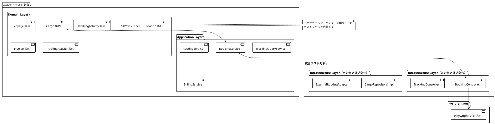
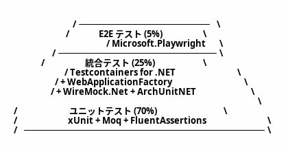
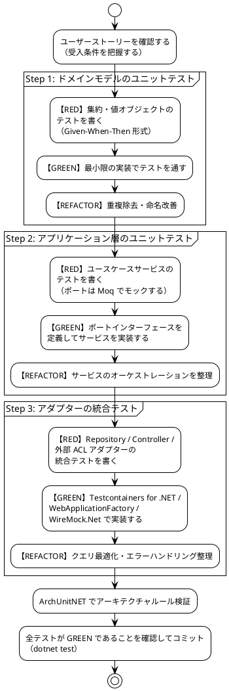

# テスト戦略 - 国際貨物輸送管理システム

## 1. 概要

### 1.1 目的

本ドキュメントは、国際貨物輸送管理システム（C# / .NET 版）におけるテスト戦略を定義します。テスト戦略を事前に策定し、以下の問いに常に回答できる状態を維持することを目的とします。

- 「この機能はどのテストレベルで保証されているか」
- 「何をどこまでテストすべきか」
- 「テストが失敗したとき、どこを修正すべきか」

### 1.2 基本方針

- **TDD（テスト駆動開発）を全開発プロセスで適用する**: レッド → グリーン → リファクタリングのサイクルを厳守します
- **テストをアーキテクチャに対応させる**: ヘキサゴナルアーキテクチャの境界（ポート）を活かし、テスト可能性を設計段階で確保します
- **テストの重複を排除する**: 各テストレベルの責務を明確に分離し、同一ロジックを複数レベルで重複検証しません
- **テストを実行可能なドキュメントとして扱う**: テストコードがシステムの振る舞いを説明します

### 1.3 アーキテクチャとテスト戦略の対応関係



ヘキサゴナルアーキテクチャの各層は以下のテストレベルに対応します。

| アーキテクチャ層 | テストレベル | 理由 |
|---|---|---|
| ドメイン層（集約・値オブジェクト・ドメインサービス） | ユニットテスト | 外部依存ゼロ。純粋なビジネスロジック |
| アプリケーション層（ユースケースサービス） | ユニットテスト（ポートをモック） | ポートへの委譲とオーケストレーションを検証 |
| 入力側アダプター（Controller） | 統合テスト（WebApplicationFactory） | HTTP マッピングとバリデーションを検証 |
| 出力側アダプター（Repository） | 統合テスト（Testcontainers for .NET） | SQL クエリの正確性を実 DB で検証 |
| 外部 ACL ポート（5 件） | 統合テスト（WireMock.Net） | 外部システムとの契約を検証 |
| ユーザーシナリオ全体 | E2E テスト（Microsoft.Playwright） | クリティカルパスの品質保証 |

---

## 2. テスト形状の選択

### 2.1 採用形状: ピラミッド型



**採用理由**:

- **ドメイン層が厚い**: DDD を採用しており、Cargo・Voyage・HandlingActivity・Invoice の各集約にビジネスロジックが集中します。BookingStatus の 8 値遷移、荷役妥当性検証（MISROUTED 判定）、法人割引計算など、外部依存なしでテスト可能なロジックが多いです
- **ヘキサゴナルアーキテクチャによる高いテスト可能性**: ドメイン層とインフラ層の境界がポートで分離されており、モックの差し替えが容易です。ユニットテストが書きやすい設計になっています
- **CQRS による読み取りモデルの分離**: TrackingContext の読み取りクエリはドメインロジックを持たず、統合テストで Repository を直接検証するだけで十分です
- **コスト効率**: ユニットテストは実行が高速（< 30 秒）でメンテナンスコストが低いです。E2E テストはフレイキーになりやすく、最小限にとどめることで CI の安定性を維持します

### 2.2 採用しない形状と理由

| 形状 | 採用しない理由 |
|---|---|
| **ダイヤモンド型**（統合テスト重視） | 本システムは単一モノリス（ヘキサゴナル）で構成されており、マイクロサービス間の契約検証ニーズがありません。統合テストを主軸にするとテスト実行時間が増大し、TDD サイクルが遅くなります |
| **逆ピラミッド型**（E2E 重視） | Playwright テストはヘッドレスブラウザを起動するためフレイキーになりやすく、htmx の 30 秒ポーリングを含む動的 UI はテストの安定性確保が困難です。E2E を主軸にするとフィードバックループが 15 分以上になります |

---

## 3. テストレベルの定義

### 3.1 ユニットテスト（Unit Test）

#### 責務・検証対象

- **ドメイン層**: 集約の状態遷移・不変条件・ビジネスルール、値オブジェクトの等価性・バリデーション、ドメインサービスのロジック
- **アプリケーション層**: ユースケースサービスのオーケストレーション（ポートはモック）

#### カバレッジ目標

| 対象 | 行カバレッジ | 分岐カバレッジ |
|---|---|---|
| ドメイン層 | **85% 以上** | **80% 以上** |
| アプリケーション層 | **80% 以上** | **75% 以上** |

#### 使用ツール

- **xUnit**: テストフレームワーク（`[Fact]`, `[Theory]`）
- **Moq**: ポートインターフェースのモック（`Mock<T>`, `Setup`, `Verify`）
- **FluentAssertions**: 流暢なアサーション（`result.Should().Be(...)`）

#### 実行タイミング

- **ローカル**: すべてのコミット時（目標 **30 秒以内**）
- **PR**: 自動実行（コミットプッシュ時）
- **CI**: GitHub Actions の `unit-test` ジョブ

#### 除外対象

- インフラ層（Dapper のデータアクセス、HTTP クライアント）— 統合テストで担保します
- DTO / record クラス — データ保持のみでロジックがありません
- ASP.NET Core ホストの起動 — `WebApplicationFactory` はユニットテストに**使用しません**

#### 実装例: Cargo 集約の BookingStatus 遷移テスト

```csharp
public class CargoBookingStatusTest
{
    [Fact]
    public void 予約が確定できる()
    {
        // Given: ルートが割り当て済みの貨物
        var cargo = CargoFixture.WithRouteAssigned();

        // When: 予約を確定する
        cargo.ConfirmBooking();

        // Then: ステータスが Confirmed に遷移する
        cargo.BookingStatus.Should().Be(BookingStatus.Confirmed);
    }

    [Fact]
    public void ルート未割り当て状態で予約確定しようとすると例外が発生する()
    {
        // Given: ルートが未割り当ての貨物
        var cargo = CargoFixture.Preliminary();

        // When & Then: 不変条件違反で例外が発生する
        var act = () => cargo.ConfirmBooking();
        act.Should().Throw<BookingDomainException>()
            .WithMessage("*ルートが割り当てられていません*");
    }

    [Fact]
    public void 危険物の取扱不可港にルートを割り当てると例外が発生する()
    {
        // Given: 危険物フラグが立った貨物と危険物取扱不可の港を経由するルート
        var cargo = CargoFixture.Hazardous();
        var prohibitedRoute = RouteFixture.ViaHazardousProhibitedPort();

        // When & Then: ドメインルール違反で例外が発生する
        var act = () => cargo.AssignRoute(prohibitedRoute);
        act.Should().Throw<HazardousCargoRoutingException>();
    }

    [Theory]
    [InlineData(BookingStatus.Confirmed)]
    [InlineData(BookingStatus.Completed)]
    [InlineData(BookingStatus.Cancelled)]
    public void 終端状態からの遷移は許可されない(BookingStatus terminalStatus)
    {
        // Given: 終端ステータスの貨物
        var cargo = CargoFixture.WithStatus(terminalStatus);

        // When & Then: ステータス遷移が拒否される
        var act = () => cargo.ConfirmBooking();
        act.Should().Throw<InvalidBookingStatusTransitionException>();
    }
}
```

#### データベースを伴うテストの方針

開発環境の実行 DB には SQLite を使用しますが、本番は PostgreSQL であるため、データアクセスを検証するテストはすべて Testcontainers for .NET による実 PostgreSQL で実施します（SQLite での動作は本番の挙動を保証しないため、テストの根拠としません）。単体テストではリポジトリインターフェース（Port）を Moq でモック化します。

---

### 3.2 統合テスト（Integration Test）

#### 責務・検証対象

- **Repository（Dapper）**: 手書き SQL の正確性、トランザクション、楽観的ロック
- **Controller（WebApplicationFactory）**: HTTP リクエスト/レスポンスのマッピング、バリデーション、エラーハンドリング
- **外部 ACL ポート（WireMock.Net）**: 外部システムとの契約遵守、タイムアウト・フォールバック

#### カバレッジ目標

| 対象 | 行カバレッジ |
|---|---|
| Repository（インフラ層） | **75% 以上** |
| Controller 層 | **70% 以上** |

#### 使用ツール

- **xUnit**: テストフレームワーク
- **Testcontainers for .NET（`Testcontainers.PostgreSql`）**: 実 PostgreSQL 16 コンテナを自動起動
- **Microsoft.AspNetCore.Mvc.Testing（WebApplicationFactory）**: HTTP 層の結合テスト（インメモリ TestServer を起動）
- **WireMock.Net**: 外部 ACL ポートのスタブ（5 件すべてを対象）

#### 実行タイミング

- **PR 時**: GitHub Actions の `integration-test` ジョブ（目標 **5 分以内**）
- **ローカル**: Docker が起動している環境で任意実行

#### 実装例: CargoRepository の保存・検索テスト（Testcontainers for .NET）

```csharp
public class CargoRepositoryIntegrationTest : IAsyncLifetime
{
    private readonly PostgreSqlContainer _postgres = new PostgreSqlBuilder()
        .WithImage("postgres:16-alpine")
        .Build();

    private CargoRepository _cargoRepository = null!;

    public async Task InitializeAsync()
    {
        await _postgres.StartAsync();

        // DbUp でマイグレーションスクリプトを適用する
        var upgrader = DeployChanges.To
            .PostgresqlDatabase(_postgres.GetConnectionString())
            .WithScriptsEmbeddedInAssembly(typeof(InfrastructureMarker).Assembly)
            .Build();
        upgrader.PerformUpgrade().Successful.Should().BeTrue();

        var dataSource = NpgsqlDataSource.Create(_postgres.GetConnectionString());
        _cargoRepository = new CargoRepository(dataSource);
    }

    public Task DisposeAsync() => _postgres.DisposeAsync().AsTask();

    [Fact]
    public async Task 貨物を保存して追跡番号で検索できる()
    {
        // Given: 新規貨物エンティティ
        var cargo = CargoFixture.NewBooking(
            TrackingId.Of("CARGO-001"),
            UnLocode.Of("JPTYO"),
            UnLocode.Of("DEHAM")
        );

        // When: 保存して検索する
        await _cargoRepository.SaveAsync(cargo);
        var found = await _cargoRepository.FindByTrackingIdAsync(TrackingId.Of("CARGO-001"));

        // Then: 保存したエンティティと一致する
        found.Should().NotBeNull();
        found!.Origin.Should().Be(UnLocode.Of("JPTYO"));
        found.Destination.Should().Be(UnLocode.Of("DEHAM"));
    }

    [Fact]
    public async Task 存在しない追跡番号で検索するとnullを返す()
    {
        // Given & When
        var result = await _cargoRepository.FindByTrackingIdAsync(TrackingId.Of("NONEXISTENT"));

        // Then
        result.Should().BeNull();
    }
}
```

#### 実装例: BookingController の WebApplicationFactory テスト

```csharp
public class BookingControllerTest : IClassFixture<WebApplicationFactory<Program>>
{
    private readonly WebApplicationFactory<Program> _factory;
    private readonly Mock<IBookingApplicationService> _bookingServiceMock = new();

    public BookingControllerTest(WebApplicationFactory<Program> factory)
    {
        _factory = factory.WithWebHostBuilder(builder =>
        {
            builder.ConfigureTestServices(services =>
            {
                services.AddSingleton(_bookingServiceMock.Object);
            });
        });
    }

    [Fact]
    public async Task 貨物予約登録APIが201を返す()
    {
        // Given: 予約登録リクエスト
        var request = new
        {
            originUnLocode = "JPTYO",
            destinationUnLocode = "DEHAM",
            arrivalDeadline = "2026-06-30"
        };
        _bookingServiceMock
            .Setup(s => s.BookNewCargoAsync(It.IsAny<BookNewCargoCommand>()))
            .ReturnsAsync(TrackingId.Of("CARGO-001"));

        var client = _factory.CreateClient();

        // When
        var response = await client.PostAsJsonAsync("/api/bookings", request);

        // Then
        response.StatusCode.Should().Be(HttpStatusCode.Created);
        var body = await response.Content.ReadFromJsonAsync<JsonElement>();
        body.GetProperty("trackingId").GetString().Should().Be("CARGO-001");
    }

    [Fact]
    public async Task 出発地コードが不正な場合は400を返す()
    {
        // Given: 不正な UN/LOCODE を含むリクエスト
        var invalidRequest = new
        {
            originUnLocode = "INVALID",
            destinationUnLocode = "DEHAM",
            arrivalDeadline = "2026-06-30"
        };

        var client = _factory.CreateClient();

        // When
        var response = await client.PostAsJsonAsync("/api/bookings", invalidRequest);

        // Then
        response.StatusCode.Should().Be(HttpStatusCode.BadRequest);
        var body = await response.Content.ReadFromJsonAsync<JsonElement>();
        body.GetProperty("errors")[0].GetProperty("field").GetString()
            .Should().Be("originUnLocode");
    }
}
```

#### WireMock.Net 契約テストの概要

各 ACL ポートに対して WireMock.Net スタブを定義します。詳細は [セクション 4](#4-wiremocknet-契約テストシナリオacl-ポート別) を参照してください。

---

### 3.3 アーキテクチャテスト（Architecture Test）

#### 責務・検証対象

ヘキサゴナルアーキテクチャの依存関係ルールをコードレベルで自動検証します。アーキテクチャの腐敗（依存関係の逆転・Bounded Context 間の直接参照）を CI で検出します。

#### 使用ツール

- **ArchUnitNET（`TngTech.ArchUnitNET.xUnit`）**: .NET アセンブリの名前空間依存関係を宣言的に検証

#### 実行タイミング

- **PR 時**: GitHub Actions の `unit-test` ジョブに統合（ユニットテストと同時実行）
- **ローカル**: `dotnet test` で自動実行

#### 検証ルール 4 件

```csharp
using static ArchUnitNET.Fluent.ArchRuleDefinition;

public class HexagonalArchitectureTest
{
    private static readonly Architecture Architecture = new ArchLoader()
        .LoadAssemblies(typeof(Cargo).Assembly, typeof(BookingService).Assembly,
                        typeof(CargoRepository).Assembly)
        .Build();

    private readonly IObjectProvider<IType> _domainLayer =
        Types().That().ResideInNamespace("CargoTracker.*.Domain", true).As("ドメイン層");

    private readonly IObjectProvider<IType> _applicationLayer =
        Types().That().ResideInNamespace("CargoTracker.*.Application", true).As("アプリケーション層");

    private readonly IObjectProvider<IType> _infrastructureLayer =
        Types().That().ResideInNamespace("CargoTracker.*.Infrastructure", true).As("インフラ層");

    // ルール 1: Domain 名前空間が Infrastructure 名前空間に依存しない
    [Fact]
    public void ドメイン層はインフラ層に依存しない()
    {
        Types().That().Are(_domainLayer)
            .Should().NotDependOnAny(_infrastructureLayer)
            .Because("ドメイン層はインフラ層を直接参照してはならない。" +
                     "依存方向は Infrastructure → Domain でなければならない")
            .Check(Architecture);
    }

    // ルール 2: Domain 名前空間で ASP.NET Core / Dapper / Npgsql の属性・型を使用しない
    [Fact]
    public void ドメイン層はフレームワークに依存しない()
    {
        Types().That().Are(_domainLayer)
            .Should().NotDependOnAny(
                Types().That().ResideInNamespace("Microsoft.AspNetCore", true)
                    .Or().ResideInNamespace("Dapper", true)
                    .Or().ResideInNamespace("Npgsql", true))
            .Because("ドメイン層はフレームワークに依存してはならない。" +
                     "ドメインオブジェクトは POCO でなければならない")
            .Check(Architecture);
    }

    // ルール 3: アプリケーション層がインフラ層を直接参照しない（Port 経由のみ許可）
    [Fact]
    public void アプリケーション層はインフラ層に直接依存しない()
    {
        Types().That().Are(_applicationLayer)
            .Should().NotDependOnAny(_infrastructureLayer)
            .Because("アプリケーション層はポートインターフェース経由でのみ" +
                     "インフラ層と通信しなければならない")
            .Check(Architecture);
    }

    // ルール 4: 異なる Bounded Context 間でクラスを直接参照しない
    [Fact]
    public void BoundedContext間で直接参照しない()
    {
        // shared 名前空間（共有カーネル）への参照は許可する
        SliceRuleDefinition.Slices()
            .Matching("CargoTracker.(*)")
            .Should().NotDependOnEachOther()
            .Because("Bounded Context 間の通信はドメインイベントまたは" +
                     "ACL（Anti-Corruption Layer）経由でなければならない。" +
                     "Shared 名前空間（共有カーネル）への参照は許可する")
            .Check(Architecture);
    }
}
```

---

### 3.4 E2E テスト（End-to-End Test）

#### 責務・検証対象

クリティカルなユーザーシナリオをブラウザレベルで検証します。ドメインロジックの再検証は行わず、ユーザー体験の観点からシステム全体が協調動作することを確認します。

**優先シナリオ（US13・US15・US18）**:

| シナリオ | 理由 |
|---|---|
| US13: 予約を確定する | 予約フローの最終ステップ。複数コンテキストが連携する |
| US15: 荷役作業を記録する | 最も頻繁に実行される運用操作 |
| US18: 追跡情報を照会する | 顧客向け重要機能。htmx ポーリングを含む |

#### カバレッジ目標

- 優先度「高」のユーザーシナリオ（US01〜US20、US24〜US25）の **80% カバー**

#### 使用ツール

- **Microsoft.Playwright（.NET 版 Playwright）**: ブラウザ自動化（C#）
- **htmx 対応**: `WaitForFunctionAsync` によるポーリング更新の待機

#### 実行タイミング

- **main ブランチマージ後**: GitHub Actions の `e2e-test` ジョブ（目標 **15 分以内**）
- **リリース前**: 全 E2E シナリオを実行

#### htmx 30 秒ポーリングへの対応

htmx の `hx-trigger="every 30s"` による自動更新を Playwright でテストするには、`WaitForFunctionAsync` でポーリング後の DOM 更新を待機します。

```csharp
// htmx ポーリング完了を待機するユーティリティ
private static async Task WaitForHtmxUpdateAsync(IPage page, string selector, float timeout = 35000)
{
    // htmx が更新中の要素に hx-request 属性が付与されるため、
    // その変化を監視してポーリング完了を検出する
    await page.WaitForFunctionAsync(
        @"(sel) => {
            const el = document.querySelector(sel);
            return el && !el.hasAttribute('hx-request');
        }",
        selector,
        new PageWaitForFunctionOptions { Timeout = timeout });
}
```

#### 実装例: US18 追跡情報照会の Playwright テスト（C#）

```csharp
[Collection("E2E")]
public class Us13TrackingQueryTest : PageTest
{
    [Fact]
    public async Task 追跡番号で貨物の現在状態を照会できる()
    {
        // Given: 荷役作業が記録済みの貨物が存在する
        await Page.GotoAsync("/tracking");

        // When: 追跡番号を入力して検索する
        await Page.FillAsync("[data-testid='tracking-id-input']", "CARGO-001");
        await Page.ClickAsync("[data-testid='search-button']");

        // Then: 追跡情報が表示される
        await Expect(Page.Locator("[data-testid='transport-status']"))
            .ToHaveTextAsync("IN_PORT", new LocatorAssertionsToHaveTextOptions { Timeout = 10000 });
        await Expect(Page.Locator("[data-testid='current-location']"))
            .ToContainTextAsync("東京港");
    }

    [Fact]
    public async Task htmxポーリングで追跡情報が自動更新される()
    {
        // Given: 追跡ページを表示している
        await Page.GotoAsync("/tracking/CARGO-001");
        var initialStatus = await Page
            .Locator("[data-testid='transport-status']")
            .TextContentAsync();

        // When: バックエンドで荷役イベントが発生し、30 秒後にポーリングが更新される
        // （テスト環境ではポーリング間隔を 5 秒に短縮）
        await WaitForHtmxUpdateAsync(Page, "[data-testid='tracking-panel']", 10000);

        // Then: ページを再読み込みせずに最新状態が反映される
        var updatedStatus = await Page
            .Locator("[data-testid='transport-status']")
            .TextContentAsync();
        updatedStatus.Should().NotBe(initialStatus);
    }

    [Fact]
    public async Task 存在しない追跡番号を入力するとエラーメッセージが表示される()
    {
        // Given
        await Page.GotoAsync("/tracking");

        // When
        await Page.FillAsync("[data-testid='tracking-id-input']", "NONEXISTENT-999");
        await Page.ClickAsync("[data-testid='search-button']");

        // Then
        await Expect(Page.Locator("[data-testid='error-message']"))
            .ToContainTextAsync("追跡番号が見つかりません");
    }

    private static async Task WaitForHtmxUpdateAsync(IPage page, string selector, float timeout = 35000)
    {
        await page.WaitForFunctionAsync(
            @"(sel) => {
                const el = document.querySelector(sel);
                return el && !el.hasAttribute('hx-request');
            }",
            selector,
            new PageWaitForFunctionOptions { Timeout = timeout });
    }
}
```

---

## 4. WireMock.Net 契約テストシナリオ（ACL ポート別）

各外部 ACL ポートに対して正常・異常シナリオを定義し、WireMock.Net でスタブ化します。

### 4.1 シナリオ一覧

| ポート | 正常シナリオ | 異常シナリオ |
|---|---|---|
| IExternalRoutingServicePort | ルート検索 → 3 候補返却 | 接続タイムアウト → 過去実績データにフォールバック |
| ICustomsClearancePort | 通関申請 → CLEARED | HELD ステータス → 例外イベント発行 |
| IPaymentGatewayPort | 支払い処理 → CONFIRMED | 決済失敗 → OVERDUE 状態遷移 |
| IPortManagementPort | 港湾入港通知 → 受理 | 港湾満杯 → 代替港提案 |
| INotificationPort | メール通知送信 → 202 Accepted | 通知失敗 → ログ記録（非クリティカル） |

### 4.2 WireMock.Net 実装例

#### IExternalRoutingServicePort: ルート検索（正常・タイムアウト）

```csharp
public class ExternalRoutingServiceAdapterTest : IDisposable
{
    private readonly WireMockServer _server;
    private readonly IExternalRoutingServicePort _routingServicePort;

    public ExternalRoutingServiceAdapterTest()
    {
        _server = WireMockServer.Start();
        _routingServicePort = new ExternalRoutingServiceAdapter(
            new HttpClient { BaseAddress = new Uri(_server.Urls[0]), Timeout = TimeSpan.FromSeconds(5) },
            new HistoricalRouteFallbackProvider());
    }

    public void Dispose() => _server.Stop();

    [Fact]
    public async Task ルート検索で3候補が返却される()
    {
        // Given: WireMock.Net スタブ定義（3 候補を返す）
        _server
            .Given(Request.Create()
                .WithPath("/api/routes/search")
                .UsingPost()
                .WithBody(new JsonPathMatcher("$[?(@.origin == 'JPTYO')]")))
            .RespondWith(Response.Create()
                .WithStatusCode(200)
                .WithHeader("Content-Type", "application/json")
                .WithBody("""
                        {
                          "routes": [
                            {"id": "R001", "legs": [{"voyageNumber": "V001"}], "transitTime": 14},
                            {"id": "R002", "legs": [{"voyageNumber": "V002"}], "transitTime": 18},
                            {"id": "R003", "legs": [{"voyageNumber": "V003"}], "transitTime": 21}
                          ]
                        }
                        """));

        // When: ルート検索を実行する
        var request = RouteSearchRequest.Of(
            UnLocode.Of("JPTYO"),
            UnLocode.Of("DEHAM"),
            new DateOnly(2026, 6, 30)
        );
        var routes = await _routingServicePort.SearchRoutesAsync(request);

        // Then: 3 候補が返却される
        routes.Should().HaveCount(3);
        routes[0].TransitDays.Should().Be(14);
    }

    [Fact]
    public async Task 接続タイムアウト時に過去実績データにフォールバックする()
    {
        // Given: タイムアウトを発生させるスタブ（6 秒遅延、タイムアウト閾値 5 秒を超過）
        _server
            .Given(Request.Create().WithPath("/api/routes/search").UsingPost())
            .RespondWith(Response.Create()
                .WithStatusCode(200)
                .WithDelay(TimeSpan.FromSeconds(6)));

        // When: ルート検索を実行する
        var request = RouteSearchRequest.Of(
            UnLocode.Of("JPTYO"),
            UnLocode.Of("DEHAM"),
            new DateOnly(2026, 6, 30)
        );
        var routes = await _routingServicePort.SearchRoutesAsync(request);

        // Then: 過去実績データからフォールバック候補が返却される
        routes.Should().NotBeEmpty();
        routes.Should().AllSatisfy(route => route.IsFallback.Should().BeTrue());
    }
}
```

#### ICustomsClearancePort: 通関申請（CLEARED・HELD）

```csharp
public class CustomsClearanceAdapterTest : IDisposable
{
    private readonly WireMockServer _server;
    private readonly ICustomsClearancePort _customsClearancePort;

    public CustomsClearanceAdapterTest()
    {
        _server = WireMockServer.Start();
        _customsClearancePort = new CustomsClearanceAdapter(
            new HttpClient { BaseAddress = new Uri(_server.Urls[0]) });
    }

    public void Dispose() => _server.Stop();

    [Fact]
    public async Task 通関申請が承認されてCLEAREDステータスを返す()
    {
        // Given
        _server
            .Given(Request.Create().WithPath("/api/customs/clearance").UsingPost())
            .RespondWith(Response.Create()
                .WithStatusCode(200)
                .WithBody("""
                        {"status": "CLEARED", "clearanceId": "CUS-001"}
                        """));

        // When
        var result = await _customsClearancePort.SubmitClearanceAsync(
            ClearanceRequest.Of(TrackingId.Of("CARGO-001"))
        );

        // Then
        result.Status.Should().Be(ClearanceStatus.Cleared);
    }

    [Fact]
    public async Task 通関保留HELDステータス受信時に例外イベントが発行される()
    {
        // Given
        _server
            .Given(Request.Create().WithPath("/api/customs/clearance").UsingPost())
            .RespondWith(Response.Create()
                .WithStatusCode(200)
                .WithBody("""
                        {"status": "HELD", "reason": "書類不備", "holdId": "HOLD-001"}
                        """));

        // When
        var result = await _customsClearancePort.SubmitClearanceAsync(
            ClearanceRequest.Of(TrackingId.Of("CARGO-002"))
        );

        // Then: HELD ステータスが返却され、例外イベントが発行可能な状態になる
        result.Status.Should().Be(ClearanceStatus.Held);
        result.HoldReason.Should().Be("書類不備");
    }
}
```

#### IPaymentGatewayPort: 支払い処理（CONFIRMED・失敗）

```csharp
public class PaymentGatewayAdapterTest : IDisposable
{
    private readonly WireMockServer _server;
    private readonly IPaymentGatewayPort _paymentGatewayPort;

    public PaymentGatewayAdapterTest()
    {
        _server = WireMockServer.Start();
        _paymentGatewayPort = new PaymentGatewayAdapter(
            new HttpClient { BaseAddress = new Uri(_server.Urls[0]) });
    }

    public void Dispose() => _server.Stop();

    [Fact]
    public async Task 支払い処理が成功してCONFIRMEDを返す()
    {
        // Given
        _server
            .Given(Request.Create().WithPath("/api/payments").UsingPost())
            .RespondWith(Response.Create()
                .WithStatusCode(200)
                .WithBody("""
                        {"status": "CONFIRMED", "transactionId": "TXN-001"}
                        """));

        // When
        var result = await _paymentGatewayPort.ProcessPaymentAsync(
            PaymentRequest.Of(InvoiceId.Of("INV-001"), Money.Of(150_000, "JPY"))
        );

        // Then
        result.Status.Should().Be(PaymentStatus.Confirmed);
    }

    [Fact]
    public async Task 決済失敗時にOVERDUE状態への遷移情報が返却される()
    {
        // Given: 決済失敗レスポンス
        _server
            .Given(Request.Create().WithPath("/api/payments").UsingPost())
            .RespondWith(Response.Create()
                .WithStatusCode(402)
                .WithBody("""
                        {"status": "FAILED", "errorCode": "INSUFFICIENT_FUNDS"}
                        """));

        // When
        var result = await _paymentGatewayPort.ProcessPaymentAsync(
            PaymentRequest.Of(InvoiceId.Of("INV-002"), Money.Of(500_000, "JPY"))
        );

        // Then: 失敗情報が返却される（OVERDUE 遷移はドメイン層が担当）
        result.Status.Should().Be(PaymentStatus.Failed);
        result.ErrorCode.Should().Be("INSUFFICIENT_FUNDS");
    }
}
```

#### IPortManagementPort: 港湾入港通知（受理・代替港提案）

```csharp
public class PortManagementAdapterTest : IDisposable
{
    private readonly WireMockServer _server;
    private readonly IPortManagementPort _portManagementPort;

    public PortManagementAdapterTest()
    {
        _server = WireMockServer.Start();
        _portManagementPort = new PortManagementAdapter(
            new HttpClient { BaseAddress = new Uri(_server.Urls[0]) });
    }

    public void Dispose() => _server.Stop();

    [Fact]
    public async Task 港湾入港通知が受理される()
    {
        // Given
        _server
            .Given(Request.Create().WithPath("/api/ports/arrival").UsingPost())
            .RespondWith(Response.Create()
                .WithStatusCode(202)
                .WithBody("""
                        {"accepted": true, "berthId": "BERTH-A1"}
                        """));

        // When
        var result = await _portManagementPort.NotifyArrivalAsync(
            ArrivalNotification.Of(UnLocode.Of("JPTYO"), VoyageNumber.Of("V001"))
        );

        // Then
        result.IsAccepted.Should().BeTrue();
        result.BerthId.Should().Be("BERTH-A1");
    }

    [Fact]
    public async Task 港湾満杯時に代替港が提案される()
    {
        // Given
        _server
            .Given(Request.Create().WithPath("/api/ports/arrival").UsingPost())
            .RespondWith(Response.Create()
                .WithStatusCode(409)
                .WithBody("""
                        {
                          "accepted": false,
                          "reason": "PORT_FULL",
                          "alternativePorts": ["JPYOK", "JPKOB"]
                        }
                        """));

        // When
        var result = await _portManagementPort.NotifyArrivalAsync(
            ArrivalNotification.Of(UnLocode.Of("JPTYO"), VoyageNumber.Of("V002"))
        );

        // Then: 代替港リストが返却される
        result.IsAccepted.Should().BeFalse();
        result.AlternativePorts.Should()
            .ContainInOrder(UnLocode.Of("JPYOK"), UnLocode.Of("JPKOB"));
    }
}
```

#### INotificationPort: メール通知（202 Accepted・失敗ログ）

```csharp
public class NotificationAdapterTest : IDisposable
{
    private readonly WireMockServer _server;
    private readonly INotificationPort _notificationPort;

    public NotificationAdapterTest()
    {
        _server = WireMockServer.Start();
        _notificationPort = new NotificationAdapter(
            new HttpClient { BaseAddress = new Uri(_server.Urls[0]) },
            NullLogger<NotificationAdapter>.Instance);
    }

    public void Dispose() => _server.Stop();

    [Fact]
    public async Task メール通知送信が202Acceptedを返す()
    {
        // Given
        _server
            .Given(Request.Create().WithPath("/api/notifications/email").UsingPost())
            .RespondWith(Response.Create().WithStatusCode(202));

        // When: 通知送信を実行する
        var act = () => _notificationPort.SendEmailAsync(
            EmailNotification.Of("customer@example.com", "貨物が到着しました", "...")
        );
        await act.Should().NotThrowAsync();

        // Then: スタブが呼び出されたことを確認する
        _server.LogEntries
            .Count(e => e.RequestMessage.Path == "/api/notifications/email")
            .Should().Be(1);
    }

    [Fact]
    public async Task 通知失敗時にログを記録して処理を継続する()
    {
        // Given: 通知サービスがエラーを返す（非クリティカルなので例外を飲み込む）
        _server
            .Given(Request.Create().WithPath("/api/notifications/email").UsingPost())
            .RespondWith(Response.Create().WithStatusCode(503));

        // When & Then: 例外が外部に伝播しない（ログのみ記録）
        var act = () => _notificationPort.SendEmailAsync(
            EmailNotification.Of("customer@example.com", "通知テスト", "...")
        );
        await act.Should().NotThrowAsync();
    }
}
```

---

## 5. ユーザーストーリーとテストのトレーサビリティ

| US | タイトル | ユニットテスト | 統合テスト | E2E テスト | 優先度 |
|---|---|---|---|---|---|
| US01 | 輸送見積を作成する | `QuotationService`、`Quotation` 値オブジェクト | `IExternalRoutingServicePort` WireMock.Net | - | 高 |
| US02 | 荷主を登録する | `Shipper` 集約、`ShipperRegistrationService` | `ShipperRepository`、`ShipperController` | - | 高 |
| US03 | 法人荷主を登録する | `CorporateShipper` 集約、法人割引率計算 | `CorporateShipperRepository`、`ShipperController` | - | 高 |
| US04 | 貨物予約を登録する | `Cargo` 集約、`BookingStatus` 初期遷移 | `CargoRepository`、`BookingController` | - | 高 |
| US05 | 危険物・冷凍貨物の予約を登録する | `Cargo` 集約（危険物フラグ）、`CargoCategory` 値オブジェクト | `CargoRepository`、`BookingController` | - | 高 |
| US06 | 予約情報を経路設計者に引き渡す | `Cargo` 集約（経路設計への引き渡し遷移） | `BookingController`（引き渡し API） | - | 高 |
| US07 | 航海スケジュールを検索する | 検索条件の値オブジェクト | `VoyageQueryService`（CQRS 読み取り）、`VoyageController` | - | 高 |
| US08 | 経路候補を算出する | `RoutingService`、`Itinerary` 値オブジェクト | `IExternalRoutingServicePort` WireMock.Net（正常・タイムアウト） | - | 高 |
| US09 | 経路を選択・確定する | `Cargo.AssignRoute()`、`BookingStatus.RouteProposed` 遷移 | `RoutingController`（経路確定 API） | - | 高 |
| US10 | 経路条件を調整して再算出する | `RouteSpecification` 更新・再算出ロジック | `IExternalRoutingServicePort` WireMock.Net（再算出） | - | 高 |
| US11 | 経路情報を予約に紐付ける | `Cargo`（経路の保持・不変条件） | `CargoRepository`（ルート保存）、`RoutingController` | - | 高 |
| US12 | 確定経路を荷主に通知する | 通知内容の組み立てロジック | `INotificationPort` WireMock.Net（正常・失敗） | - | 高 |
| US13 | 予約を確定する | `Cargo.ConfirmBooking()`、`BookingStatus.Confirmed` 遷移 | `BookingController`（確定 API）、`CargoRepository` | **US13 シナリオ** | 高 |
| US14 | 追跡番号を発行する | `TrackingId` 値オブジェクト（一意性）、`TrackingIdGenerator` | `CargoRepository`（追跡番号保存） | - | 高 |
| US15 | 荷役作業を記録する | `HandlingActivity` 集約、MISROUTED 判定ロジック | `HandlingActivityRepository`、`HandlingController` | **US15 シナリオ** | 高 |
| US16 | 引取作業を記録する | `HandlingActivity`（CLAIM イベント・荷受人確認） | `HandlingController`（引取 API） | - | 高 |
| US17 | 貨物状態を手動更新する | `TrackingActivity`、`TransportStatus` 遷移（9 値） | `TrackingController`（手動更新 API） | - | 高 |
| US18 | 追跡情報を照会する | - | `TrackingQueryService`（CQRS 読み取り）、`TrackingController` | **US18 シナリオ** | 高 |
| US19 | 遅延例外を処理する | `TrackingExceptionEvent` エスカレーション判定 | `TrackingController`（例外処理 API）、`INotificationPort` WireMock.Net | - | 高 |
| US20 | 破損・紛失例外を処理する | `HandlingException` 集約、`ExceptionType` 値オブジェクト、紛失時エスカレーション | `HandlingController`（例外記録 API）、`INotificationPort` WireMock.Net | - | 高 |
| US21 | 輸送料金を算出する | `Invoice` 集約、`FreightCalculationService`、消費税計算 | `InvoiceRepository`、`BillingController` | - | 中 |
| US22 | 法人割引を適用する | `DiscountPolicy` 値オブジェクト、法人割引率計算（上限 30%） | `BillingController`（割引適用 API） | - | 中 |
| US23 | 精算を処理する | `Invoice.Settle()`、`InvoiceStatus` 遷移 | `BillingController`（精算 API）、`IPaymentGatewayPort` WireMock.Net（正常・失敗） | - | 中 |
| US24 | 航海スケジュールを新規登録する | `Voyage` 集約、`Schedule` 値オブジェクト（区間整合） | `VoyageRepository`、`VoyageController`（登録 API） | - | 高 |
| US25 | 既存航海スケジュールを更新する | `Voyage.UpdateSchedule()`（影響予約の検出） | `VoyageController`（更新 API）、`INotificationPort` WireMock.Net | - | 高 |

---

## 6. カバレッジ目標とメトリクス

### 6.1 レイヤー別カバレッジ目標

| レイヤー | 行カバレッジ目標 | 分岐カバレッジ目標 | 計測ツール |
|---|---|---|---|
| ドメイン層（`Domain` 名前空間） | **85% 以上** | **80% 以上** | coverlet + ReportGenerator / SonarQube |
| アプリケーション層（`Application` 名前空間） | **80% 以上** | **75% 以上** | coverlet + ReportGenerator / SonarQube |
| インフラ層 - Repository（`Infrastructure.Persistence` 名前空間） | **75% 以上** | — | coverlet + ReportGenerator / SonarQube |
| インフラ層 - Controller（`Infrastructure.Web` 名前空間） | **70% 以上** | — | coverlet + ReportGenerator / SonarQube |

カバレッジは `dotnet test --collect:"XPlat Code Coverage"`（coverlet）で収集し、ReportGenerator で HTML / Cobertura レポートに変換します。

### 6.2 SonarQube Quality Gate 条件

| 条件 | 基準値 | 適用対象 |
|---|---|---|
| 行カバレッジ（新規コード） | **80% 以上** | 新規追加コード |
| 重複コード率 | **3% 以下** | プロジェクト全体 |
| Reliability Rating | **A**（バグゼロ） | プロジェクト全体 |
| Security Rating | **A**（脆弱性ゼロ） | プロジェクト全体 |
| Maintainability Rating | **A** | 新規コード |
| Security Hotspot Review | **100%** | 新規コード |

Quality Gate が失敗した場合、PR のマージをブロックします。

---

## 7. CI/CD とのテスト連携

### 7.1 ステージ別テスト戦略

| ステージ | テスト種別 | 目標時間 | 失敗時の扱い |
|---|---|---|---|
| コミット（ローカル） | ユニットテスト + アーキテクチャテスト | **< 60 秒** | コミット前に修正 |
| PR | ユニット + 統合 + ArchUnitNET + SonarQube | **< 5 分** | PR マージ不可 |
| main ブランチマージ後 | E2E テスト | **< 15 分** | Slack 通知（ホットフィックス優先） |
| リリース | 全テスト + パフォーマンステスト | **< 30 分** | リリース停止 |

### 7.2 GitHub Actions パイプライン図


---

## 8. TDD 開発ワークフロー

### 8.1 インサイドアウト TDD（バックエンド）

ドメイン層から外側に向かって開発します。外部依存を後回しにすることで、ビジネスロジックに集中できます。



### 8.2 重要なビジネスルール（必ず TDD 適用）

以下のビジネスルールは複雑度が高く、テストファーストで実装しなければなりません。

#### Cargo の BookingStatus 状態遷移（8 値）

```
PRELIMINARY → ROUTE_PROPOSED → CONFIRMED → CUSTOMS_PENDING
    → IN_TRANSIT → IN_PORT → COMPLETED
    ↘ MISROUTED（異常系）
    ↘ CANCELLED（キャンセル）
```

テスト観点:

- 各遷移の正常系（許可されている遷移）
- 各遷移の異常系（許可されていない遷移 → `InvalidBookingStatusTransitionException`）
- 終端状態（COMPLETED・CANCELLED）からの遷移拒否

#### HandlingActivity の荷役妥当性検証（MISROUTED 判定）

```csharp
[Fact]
public void 指定ルート外の港で荷役を実行するとMISROUTED判定になる()
{
    // Given: 東京→ハンブルク のルートを持つ貨物
    var cargo = CargoFixture.WithRoute(
        RouteFixture.TokyoToHamburg()
    );

    // When: ルートに含まれないシンガポールで荷役を記録する
    var activity = HandlingActivity.Of(
        cargo.TrackingId,
        UnLocode.Of("SGSIN"), // ルート外の港
        HandlingType.Load,
        DateTimeOffset.UtcNow
    );

    // Then: 貨物が MISROUTED 状態に遷移する
    cargo.ApplyHandlingActivity(activity);
    cargo.BookingStatus.Should().Be(BookingStatus.Misrouted);
}
```

#### Invoice の料金計算（法人割引・消費税計算）

```csharp
[Fact]
public void 法人割引10パーセントと消費税10パーセントが正しく計算される()
{
    // Given: 基本料金 100,000 円、法人割引率 10% の Invoice
    var baseAmount = Money.Of(100_000, "JPY");
    var corporateDiscount = DiscountPolicy.Corporate(Percentage.Of(10));

    // When: 料金を確定する
    var invoice = Invoice.Calculate(baseAmount, corporateDiscount, TaxRate.Standard);

    // Then: 割引後 90,000 円 × 消費税 10% = 99,000 円
    invoice.NetAmount.Should().Be(Money.Of(90_000, "JPY"));
    invoice.TaxAmount.Should().Be(Money.Of(9_000, "JPY"));
    invoice.TotalAmount.Should().Be(Money.Of(99_000, "JPY"));
}
```

#### TrackingExceptionEvent のエスカレーション判定

```csharp
[Fact]
public void 遅延が48時間を超える場合にエスカレーションフラグが立つ()
{
    // Given: 遅延 72 時間の例外イベント
    var @event = TrackingExceptionEvent.Delay(
        TrackingId.Of("CARGO-001"),
        TimeSpan.FromHours(72)
    );

    // When: エスカレーション判定を実行する
    var result = _escalationPolicy.Evaluate(@event);

    // Then: エスカレーション対象と判定される
    result.RequiresEscalation.Should().BeTrue();
    result.EscalationLevel.Should().Be(EscalationLevel.Critical);
}

[Fact]
public void 遅延が48時間以内の場合はエスカレーション不要と判定される()
{
    // Given: 遅延 24 時間の例外イベント
    var @event = TrackingExceptionEvent.Delay(
        TrackingId.Of("CARGO-002"),
        TimeSpan.FromHours(24)
    );

    // When
    var result = _escalationPolicy.Evaluate(@event);

    // Then
    result.RequiresEscalation.Should().BeFalse();
}
```

### 8.3 Bounded Context 別 TDD 優先順位

| Bounded Context | TDD 優先ルール | 理由 |
|---|---|---|
| Booking Context | BookingStatus 遷移（8 値）を最初にテストする | 最も複雑な状態機械。バグの影響範囲が大きい |
| Routing Context | IExternalRoutingServicePort のフォールバックをテストする | 外部依存が本番障害の主要因になりやすい |
| Tracking Context | CQRS 読み取りクエリのパフォーマンスを統合テストで検証する | 30 秒ポーリングの負荷を事前に確認する |
| Handling Context | MISROUTED 判定ロジックを先にテストする | 荷役記録ミスは運用上重大なインシデントになる |
| Billing Context | 割引・消費税計算を `[Theory]` で網羅する | 金額計算のバグは法的リスクを伴う |
| Shared Domain | Location（UN/LOCODE）のバリデーションを値オブジェクトレベルで担保する | 全コンテキストが共有するため、バグの影響範囲が広い |
