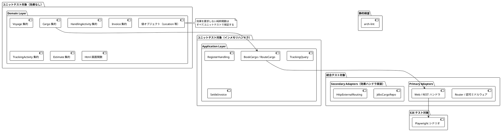
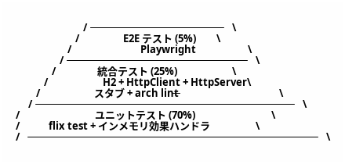
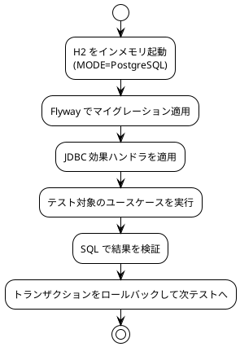
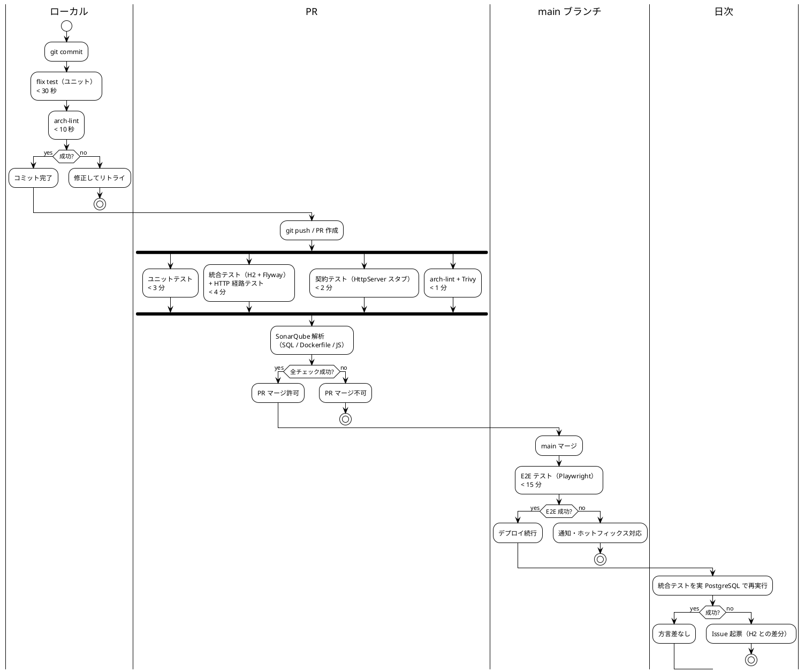
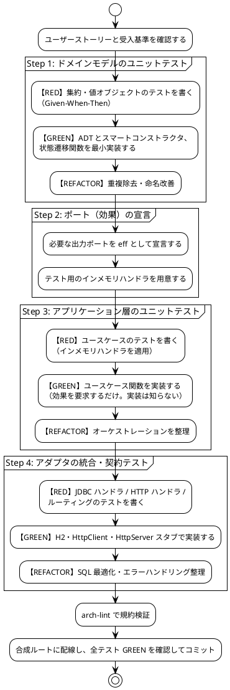

# テスト戦略 - 国際貨物輸送管理システム（Flix 版）

## 1. 概要

### 1.1 目的

本ドキュメントは、国際貨物輸送管理システム（Flix 実装）のテスト戦略を定義する。以下の問いに常に回答できる状態を維持することを目的とする。

- 「この機能はどのテストレベルで保証されているか」
- 「何をどこまでテストすべきか」
- 「テストが失敗したとき、どこを修正すべきか」

### 1.2 基本方針

- **TDD を全開発プロセスで適用する**: レッド → グリーン → リファクタリングのサイクルを厳守する
- **テストをアーキテクチャに対応させる**: ヘキサゴナルの境界（= 効果宣言）を活かし、テスト可能性を設計段階で確保する
- **テストダブルは言語機能で作る**: モックライブラリを使わず、出力ポート（効果）に**インメモリ実装のハンドラ**を適用する
- **テストの重複を排除する**: 各テストレベルの責務を分離し、同一ロジックを複数レベルで重複検証しない
- **テストを実行可能なドキュメントとして扱う**: テストコードがシステムの振る舞いを説明する

### 1.3 Flix 固有の前提と、それがもたらす戦略上の差分

| Flix の事情 | 戦略への影響 |
| :--- | :--- |
| モックライブラリが存在しない | 効果ハンドラでテストダブルを作る。**むしろ Java 版より単純**になる |
| カバレッジ計測ツールが存在しない | 行カバレッジを品質ゲートに使えない。**ビジネスルール ⇄ テストのトレーサビリティ表**で網羅を担保する（6 章） |
| SonarQube に Flix アナライザがない | Flix コードの静的解析は `arch-lint`（自作）+ コンパイラ警告 + レビューで代替する |
| ArchUnit が使えない | `use` / `import` 宣言を走査する `arch-lint` を自作し、CI で強制する（3.3 節） |
| Testcontainers の相互運用コストが高い | 既定は H2（PostgreSQL 互換モード）。CI の日次ジョブのみ実 PostgreSQL に対して同じテストを流す |
| WireMock が使えない | JDK `HttpServer` によるスタブサーバで外部 API 契約テストを行う（4 章） |
| パターンマッチの網羅性検査がある | 状態 `enum` にケースを追加すると**コンパイラが考慮漏れを検出する**。状態遷移テストの一部をコンパイル時に前倒しできる |
| 効果がシグネチャに現れる | 「このユースケースが触る副作用」がテスト前に型で分かる。テストで用意すべきハンドラの漏れが起きない |

### 1.4 アーキテクチャとテストレベルの対応



| アーキテクチャ層 | テストレベル | 手段 |
| :--- | :--- | :--- |
| ドメイン層（集約・値オブジェクト・ドメインサービス） | ユニット | `flix test`。依存なし |
| 画面関数（`Html` を返す純粋関数） | ユニット | `Html.render` の結果を検証 |
| アプリケーション層（ユースケース） | ユニット | 出力ポートにインメモリ効果ハンドラを適用 |
| ルーティング・認可ミドルウェア | 統合 | JDK `HttpClient` で実リクエスト |
| 出力アダプタ（JDBC ハンドラ・SQL） | 統合 | H2 + Flyway（日次は実 PostgreSQL） |
| 外部 ACL ポート（5 件） | 契約 | JDK `HttpServer` スタブ |
| アーキテクチャ規約 | 静的検査 | `arch-lint` |
| ユーザーシナリオ全体 | E2E | Playwright |

---

## 2. テスト形状の選択

### 2.1 採用形状: ピラミッド型



**採用理由**

- **ドメイン層が厚い**: DDD により、`BookingStatus` の状態遷移、荷役妥当性検証（MISROUTED 判定）、割引・税計算など、外部依存なしでテスト可能なロジックが集中する
- **効果によりテストダブルのコストがほぼゼロ**: ポートのインメモリ実装を 1 度書けば全ユースケースで再利用でき、ユニットテストを厚くする障壁が低い
- **純粋関数が多い**: 画面生成すら純粋関数であり、ブラウザを起動せずに検証できる領域が Java 版より広い
- **コスト効率**: ユニットテストは高速（目標 30 秒以内）。E2E はフレイキーになりやすく最小限に留める

### 2.2 採用しない形状と理由

| 形状 | 採用しない理由 |
| :--- | :--- |
| **ダイヤモンド型**（統合テスト重視） | 単一プロセスのモノリスであり、サービス間契約の検証ニーズがない。統合テストを主軸にすると TDD サイクルが遅くなる |
| **逆ピラミッド型**（E2E 重視） | Playwright はヘッドレスブラウザを起動するためフレイキーになりやすく、htmx の 30 秒ポーリングを含む動的 UI は安定性確保が困難。フィードバックループが 15 分以上になる |

---

## 3. テストレベルの定義

### 3.1 ユニットテスト

#### 3.1.1 ドメイン層（効果なし）

集約・値オブジェクトは効果を一切要求しない。したがって準備が不要で、入力と出力だけで検証できる。

```flix
/// test/booking/CargoTest.flix
@Test
def 経路未割当の貨物は予約確定できない(): Bool =
    let cargo = Fixtures.preliminaryCargo();
    match Cargo.confirm(cargo, Fixtures.timestamp()) {
        case Err(ItineraryNotAssigned) => true
        case _                         => false
    }

@Test
def 到着期限が出発日以前の経路は割り当てを拒否する(): Bool =
    let cargo = Fixtures.preliminaryCargo();          // 期限 2026-06-30
    let bad   = Fixtures.itineraryArrivingAt("2026-07-05");
    Result.isErr(Cargo.assignItinerary(cargo, bad, Fixtures.timestamp()))
```

| 観点 | 方針 |
| :--- | :--- |
| 状態遷移 | 許可される遷移・拒否される遷移の**両方**を書く。終端状態からの遷移拒否を必ず含める |
| 値オブジェクト | スマートコンストラクタの境界値（空文字・桁数・範囲外）を検証する |
| 網羅性 | `enum` にケースを追加した際、パターンマッチの網羅性検査がコンパイル時に漏れを検出する。テストはそれを補完する位置づけとする |
| 日付・時刻 | ドメイン層は `Timestamp` を引数で受け取り、現在時刻を取得しない。テストで時刻を完全に固定できる |

> **境界の落とし穴**: 期限が日付（DATE）、到着が時刻付き（TIMESTAMP）の場合、素朴な大小比較では
> 「期限当日の到着」を期限超過と誤判定する。日付単位で比較し、テストに**期限当日の時刻付き到着**を必ず含めること。

#### 3.1.2 アプリケーション層（インメモリ効果ハンドラ）

出力ポートが効果であるため、テストではハンドラを差し替えるだけでよい。モックライブラリは不要である。

```flix
/// test/support/InMemoryHandlers.flix
pub def withInMemoryCargoRepo(initial: List[Cargo], f: Unit -> a \ ef + CargoRepo): a \ ef =
    let store = Ref.fresh(initial);
    run f() with handler CargoRepo {
        def findByTrackingId(id, k) =
            k(List.find(c -> Cargo.trackingId(c) == id, Ref.get(store)))
        def store(cargo, k) =
            Ref.put(upsert(cargo, Ref.get(store)), store); k()
        def listAll(k) = k(Ref.get(store))
    }

/// 発行イベントを記録するスパイ
pub def withRecordingEventBus(f: Unit -> a \ ef + EventBus): (a, List[DomainEvent]) \ ef

/// test/booking/RouteCargoTest.flix
@Test
def 経路割当に成功するとCargoRoutedイベントが発行される(): Bool =
    withInMemoryCargoRepo(Fixtures.preliminaryCargo() :: Nil, () ->
        withFixedClock(Fixtures.timestamp(), () -> {
            let (result, events) = withRecordingEventBus(() ->
                BookCargoService.routeCargo(Fixtures.routeCommand())
            );
            Result.isOk(result) and List.exists(isCargoRouted, events)
        })
    )
```

| 観点 | 方針 |
| :--- | :--- |
| 検証対象 | ユースケースのオーケストレーション（取得 → ドメイン呼び出し → 保存 → イベント発行）と、失敗時に保存もイベント発行も起きないこと |
| 検証しない対象 | ドメインのビジネスルールそのもの（3.1.1 の責務） |
| スパイ | `RecordingEventBus` で「何が発行されたか」、`RecordingCargoRepo` で「何回 store されたか」を検証する |
| 時刻 | `Clock` 効果を固定ハンドラで差し替え、時刻依存ロジックを決定的にする |

#### 3.1.3 画面関数

```flix
@Test
def 予約詳細に追跡番号とステータスバッジが表示される(): Bool =
    let html = Booking.Pages.show(Fixtures.bookingDetailView()) |> Html.render;
    String.contains("CARGO-001", html) and String.contains("badge bg-primary", html)

@Test
def 貨物種別のスクリプトタグはエスケープされる(): Bool =
    let view = Fixtures.bookingDetailViewWithName("<script>alert(1)</script>");
    let html = Booking.Pages.show(view) |> Html.render;
    not String.contains("<script>alert(1)</script>", html)
```

### 3.2 統合テスト

#### 3.2.1 永続化（JDBC ハンドラ + SQL）



| 観点 | 方針 |
| :--- | :--- |
| 対象 | `ResultSet` ⇄ ADT のマッピング、SQL の正確性、CQRS 読み取りクエリの JOIN、一意制約・楽観ロック |
| DB | 既定は H2（PostgreSQL 互換モード）。**CI の日次ジョブで実 PostgreSQL コンテナに対して同一テストを実行**し、方言差を検出する |
| 分離 | テストごとにトランザクションをロールバックする。並列実行時はスキーマを分ける |
| マイグレーション | テストも本番と同じ Flyway スクリプトを適用する。テスト専用 DDL を作らない |

> **H2 と PostgreSQL の差分リスク**: 型変換・日付関数・`ON CONFLICT` などで挙動が異なりうる。
> 「H2 で緑・本番で赤」を防ぐため、日次の実 PostgreSQL 実行を品質ゲートの一部とする。

#### 3.2.2 HTTP 経路（ルーティング・認可・PRG）

```flix
@Test
def 荷役ロールは予約登録APIにアクセスできない(): Bool \ IO =
    TestServer.withApp(app -> {
        let res = TestClient.post(app, "/api/v1/bookings", Fixtures.bookingJson(),
                                  TestClient.asRole(Handler));
        Response.status(res) == 403
    })
```

| 観点 | 方針 |
| :--- | :--- |
| 認可 | **全ルート × 全ロール**の可否をテーブル駆動で網羅する。ルーティング表からテストケースを生成し、ルート追加時にテスト漏れが起きない構造にする |
| 未認証 | 保護ルートへの未認証アクセスが `302 /login` になること、公開ルートは `200` になること |
| CSRF | トークンなしの `POST` が `403` になること |
| PRG | フォーム送信成功時の `302` とリダイレクト先 |
| バリデーション | 不正入力時に `400` とフィールドエラーが返ること |

### 3.3 アーキテクチャテスト（`arch-lint`）

`ops/scripts/arch-lint`（Node.js）で Flix ソースの `use` / `import` / 特定構文を走査し、以下の規約を検査する。違反は CI で失敗させる。

| # | 規約 | 検出方法 |
| :--- | :--- | :--- |
| 1 | `domain/**` が `infrastructure/**`・`interfaces/**` を参照しない | `use` 宣言の走査 |
| 2 | `domain/**` が `java.**` を参照しない | `import java.` の走査 |
| 3 | `application/**` が `infrastructure/**` を参照しない | `use` 宣言の走査 |
| 4 | 異なる Bounded Context 間の直接参照がない（`Shared`・ACL・イベント経由のみ） | モジュールパスの照合 |
| 5 | `run ... with` によるハンドラ適用が `infrastructure/runtime/**` とテスト以外に出現しない | 構文パターンの走査 |
| 6 | SQL 文字列の連結（`"SELECT " + x`）が存在しない | 文字列連結パターンの走査 |
| 7 | `Html.RawUnsafe` の使用箇所が許可リストに含まれる | 呼び出し箇所の列挙と突合 |
| 8 | `<form>` を `Element("form", ...)` で直接構築していない（`Components.form` を使う） | 構文パターンの走査 |

> 新しい Bounded Context を配線した際は、`arch-lint` の許可リスト（合成ルートからの依存）を同じコミットで更新する。
> 更新漏れは CI 失敗として即座に検出される。

### 3.4 E2E テスト（Playwright）

| 項目 | 内容 |
| :--- | :--- |
| 実行対象 | `flix build-jar` で生成した JAR を Docker Compose（アプリ + PostgreSQL）で起動 |
| シナリオ数 | 5 本以内に抑える |
| 対象シナリオ | ①見積作成 → 承認 → 予約登録、②経路割り当て → 予約確定、③荷役登録 → 追跡ステータス反映（htmx ポーリング含む）、④公開追跡照会（未認証）、⑤配送完了 → 精算書発行 → 支払記録 |
| 安定化 | 固定シードデータを投入する。時刻依存は環境変数でアプリの `Clock` ハンドラを固定時刻モードに切り替える |
| 失敗時 | スクリーンショット・トレースを Artifact として保存する |

---

## 4. 外部 API 契約テスト（JDK `HttpServer` スタブ）

WireMock の代替として、JDK 標準の `HttpServer` でスタブを立て、ACL ポートの HTTP 契約を固定する。
外部依存ライブラリを追加しないため、脆弱性・保守リスクを持ち込まない。

### 4.1 シナリオ一覧

| ポート（効果） | 正常シナリオ | 異常シナリオ |
| :--- | :--- | :--- |
| `ExternalRouting` | ルート検索 → 3 候補返却 | 接続タイムアウト → 過去実績データにフォールバック |
| `CustomsClearance` | 通関申請 → `CLEARED` | `HELD` ステータス → 例外イベント発行 |
| `PaymentGateway` | 支払処理 → `CONFIRMED` | 決済失敗 → `OVERDUE` 状態遷移 |
| `PortManagement` | 港湾入港通知 → 受理 | 港湾満杯 → 代替港提案 |
| `Notification` | 通知送信 → `202 Accepted` | 通知失敗 → ログ記録のみ（非クリティカル） |

### 4.2 スタブサーバの実装方針

```flix
/// test/support/StubServer.flix
/// ルート → 応答（ステータス・ボディ・遅延）の対応表を受け取り、一時ポートで起動する
pub def withStub(stubs: List[(String, StubResponse)], f: Int32 -> a \ ef + IO): a \ ef + IO

@Test
def ルート検索で3候補が返却される(): Bool \ IO =
    withStub(("/api/routes/search", StubResponse.json(200, Fixtures.threeRoutesJson())) :: Nil, port -> {
        let routes = HttpExternalRouting.searchRoutes(baseUrl(port), Fixtures.routeSearchRequest());
        List.length(routes) == 3
    })

@Test
def 接続タイムアウト時に過去実績データへフォールバックする(): Bool \ IO =
    withStub(("/api/routes/search", StubResponse.delayed(6000)) :: Nil, port -> {
        // タイムアウト閾値 5 秒を超過させる
        let routes = HttpExternalRouting.searchRoutes(baseUrl(port), Fixtures.routeSearchRequest());
        not List.isEmpty(routes) and List.forAll(RouteCandidate.isFallback, routes)
    })
```

| 観点 | 方針 |
| :--- | :--- |
| 検証内容 | 送信リクエスト（パス・メソッド・ボディの必須項目）と、応答からドメイン型へのデコード結果の両方 |
| 異常系 | タイムアウト・4xx・5xx・不正 JSON の 4 種を各ポートで最低 1 本ずつ用意する |
| ACL の責務 | 外部システムのモデルがドメインに漏れないこと（`RouteCandidate` 等の自ドメイン型に変換されていること）を検証する |
| 適用先 | ACL アダプタ（効果ハンドラ実装）に対して行う。アプリケーション層のテストではスタブハンドラを使い、HTTP を経由しない |

---

## 5. ユーザーストーリーとテストのトレーサビリティ

| US | タイトル | ユニットテスト | 統合 / 契約テスト | E2E | 優先度 |
| :--- | :--- | :--- | :--- | :--- | :--- |
| US01 | 輸送見積を作成する | `Estimate` 集約・`RouteCandidate` | `ExternalRouting` スタブ | - | 高 |
| US02 | 荷主を登録する | `Shipper` 集約・`ContactInfo` | `JdbcShipperRepo`・登録 API | - | 高 |
| US03 | 法人荷主を登録する | 法人割引率の値オブジェクト | `JdbcShipperRepo`・登録 API | - | 高 |
| US04 | 貨物予約を登録する | `Cargo` 集約・`BookingStatus` 初期遷移 | `JdbcCargoRepo`・予約 API | - | 高 |
| US05 | 危険物・冷凍貨物の予約を登録する | `CargoType` 値オブジェクト・特殊要件検証 | 予約 API（バリデーション） | - | 高 |
| US06 | 最適ルートを検索する | 到達可能性判定（Datalog）・`Itinerary` | `ExternalRouting` スタブ（正常・タイムアウト） | - | 高 |
| US07 | ルートを選択して予約に紐付ける | `Cargo.assignItinerary`・`ROUTE_PROPOSED` 遷移 | `JdbcCargoRepo`・経路割当 API | - | 高 |
| US08 | 予約を確定する | `Cargo.confirm`・`CONFIRMED` 遷移 | 確定 API・`CargoBooked` イベント配信 | **シナリオ②** | 高 |
| US09 | 追跡番号を発行する | `TrackingId` 生成規則・一意性 | 追跡番号の永続化 | - | 高 |
| US10 | 荷役作業を記録する | `HandlingActivity` 集約・MISROUTED 判定 | `JdbcHandlingRepo`・荷役 API | **シナリオ③** | 高 |
| US11 | 引取作業を記録する | `HandlingType.Claim` の妥当性検証 | 引取 API | - | 高 |
| US12 | 貨物状態を手動更新する | `TransportStatus` 遷移（9 値） | 手動更新 API・権限検証 | - | 高 |
| US13 | 追跡情報を照会する | 追跡画面関数（`Html`） | 追跡クエリ（JOIN）・公開追跡 API | **シナリオ④** | 高 |
| US14 | 遅延例外を処理する | エスカレーション判定 | `Notification` スタブ | - | 高 |
| US15 | 破損・紛失例外を処理する | `ExceptionType`・例外イベント生成 | `CustomsClearance` スタブ | - | 高 |
| US16 | 輸送料金を算出する | `Invoice` 集約・`Money`・消費税計算 | `JdbcInvoiceRepo`・精算 API | - | 中 |
| US17 | 法人割引を適用する | `DiscountPolicy`・割引率計算 | 割引適用 API | - | 中 |
| US18 | 精算を処理する | `Invoice.settle`・`PaymentStatus` 遷移 | `PaymentGateway` スタブ（正常・失敗） | **シナリオ⑤** | 中 |

このトレーサビリティ表は、カバレッジ計測の代替統制として機能する。**ユーザーストーリー完了の定義（DoD）に「本表への行追加」を含める**。

---

## 6. 品質メトリクスと代替統制

### 6.1 カバレッジ計測不能への対処

Flix にはカバレッジツールが存在しないため、行カバレッジ率を品質ゲートに用いない。代わりに以下 3 点で網羅性を担保する。

| 統制 | 内容 | 判定 |
| :--- | :--- | :--- |
| **ビジネスルールの網羅** | [ドメインモデル設計](domain-model.md) の「ビジネスルール」節に列挙された各ルールに、対応するテスト関数名を紐づけた一覧を維持する | 未対応ルールがゼロであること |
| **ストーリートレーサビリティ** | 5 章の表を各イテレーションで更新する | 完了ストーリーに空欄がないこと |
| **状態遷移の網羅** | 状態 `enum` の各ケースについて、遷移可否テストが存在する | パターンマッチ網羅性検査（コンパイラ）+ 遷移表テスト |

### 6.2 品質ゲート条件

| 条件 | 基準 | 適用対象 | 判定手段 |
| :--- | :--- | :--- | :--- |
| 全テスト成功 | 100% | プロジェクト全体 | `flix test` |
| アーキテクチャ規約違反 | 0 件 | Flix ソース全体 | `arch-lint` |
| コンパイラ警告 | 0 件 | Flix ソース全体 | `flix build`（警告をエラー扱い） |
| ビジネスルール未テスト | 0 件 | ドメイン層 | 6.1 の一覧レビュー |
| 依存脆弱性（High 以上） | 0 件 | `flix.toml` の Maven 依存・Docker イメージ | Trivy |
| SQL・Dockerfile・JS の静的解析 | Rating A | 対象ファイルのみ | SonarQube（Flix コードは対象外） |
| E2E シナリオ | 全 5 本成功 | main ブランチ | Playwright |

品質ゲートが失敗した場合、PR のマージをブロックする。

---

## 7. CI/CD とのテスト連携

### 7.1 ステージ別テスト戦略

| ステージ | テスト種別 | 目標時間 | 失敗時の扱い |
| :--- | :--- | :--- | :--- |
| コミット（ローカル） | ユニットテスト + `arch-lint` | **< 60 秒** | コミット前に修正 |
| PR | ユニット + 統合（H2）+ 契約 + `arch-lint` + Trivy | **< 8 分** | PR マージ不可 |
| main マージ後 | E2E（Playwright） | **< 15 分** | 通知（ホットフィックス優先） |
| 日次 | 全テスト（統合を**実 PostgreSQL** で再実行） | **< 20 分** | 通知。方言差の検出 |
| リリース | 全テスト + 性能テスト | **< 30 分** | リリース停止 |

> Flix のコンパイルは Java より時間がかかる場合がある。CI ではビルドキャッシュ（`~/.flix`・`lib/`）を必ず有効化する。

### 7.2 パイプライン図



---

## 8. TDD 開発ワークフロー

### 8.1 インサイドアウト TDD（バックエンド）

ドメイン層から外側へ向かって開発する。効果宣言を先に置くことで、実装なしにアプリケーション層のテストが書ける。



> **アウトサイドイン TDD（画面主導）** を使う局面では、画面関数（純粋）→ ルーティング → ユースケース → ドメインの順に降りる。
> どちらを採るかは局面ごとに開発戦略で定める。

### 8.2 必ず TDD を適用するビジネスルール

#### `Cargo` の `BookingStatus` 状態遷移

```
PRELIMINARY → ROUTE_PROPOSED → CONFIRMED → TRACKING_ISSUED
    → IN_TRANSIT → DELIVERED → SETTLED
    ↘ MISROUTED（異常系）
    ↘ CANCELLED（キャンセル）
```

テスト観点：許可される遷移／拒否される遷移の両方、終端状態（`SETTLED`・`CANCELLED`）からの遷移拒否。
遷移表を `List[(BookingStatus, BookingEvent, Result[...])]` として定義し、テーブル駆動で網羅する。

#### `HandlingActivity` の MISROUTED 判定

```flix
@Test
def ルート外の港で荷役するとMISROUTED判定になる(): Bool =
    let cargo    = Fixtures.cargoRoutedTokyoToHamburg();
    let activity = Fixtures.handlingAt("SGSIN", Load);   // 旅程に含まれない港
    match Cargo.applyHandling(cargo, activity) {
        case Ok(updated) => Cargo.status(updated) == MisRouted
        case Err(_)      => false
    }
```

#### `Invoice` の料金計算（法人割引・消費税）

```flix
@Test
def 法人割引10パーセントと消費税10パーセントが正しく計算される(): Bool =
    let base     = Money.jpy(100_000);
    let discount = DiscountPolicy.corporate(Percentage.of(10));
    match Invoice.calculate(base, discount, TaxRate.standard()) {
        case Ok(inv) =>
            Invoice.netAmount(inv)   == Money.jpy(90_000) and
            Invoice.taxAmount(inv)   == Money.jpy(9_000)  and
            Invoice.totalAmount(inv) == Money.jpy(99_000)
        case Err(_) => false
    }
```

端数処理（切り捨て・四捨五入）と通貨混在の拒否を必ずテストに含める。金額は整数最小単位で保持する。

#### `TrackingExceptionEvent` のエスカレーション判定

遅延 48 時間を閾値とし、閾値ちょうど・閾値未満・閾値超過の 3 ケースを必ず書く。

### 8.3 Bounded Context 別の TDD 優先順位

| Bounded Context | 最初にテストするルール | 理由 |
| :--- | :--- | :--- |
| Booking | `BookingStatus` 遷移 | 最も複雑な状態機械。影響範囲が大きい |
| Estimation | 見積からの予約生成（承認イベント） | コンテキスト間連携の起点であり、壊れると業務が始まらない |
| Routing | 到達可能性判定（Datalog）と `ExternalRouting` のフォールバック | 外部依存は本番障害の主要因。Datalog は本実装固有で検証が必要 |
| Tracking | CQRS 読み取りクエリの結果整合と性能 | 30 秒ポーリングの負荷を事前に確認する |
| Handling | MISROUTED 判定 | 荷役記録ミスは重大な運用インシデントになる |
| Billing | 割引・消費税計算をテーブル駆動で網羅 | 金額計算のバグは法的リスクを伴う |
| Shared | `Location`（UN/LOCODE）のバリデーション | 全コンテキストが共有し、影響範囲が広い |

### 8.4 セキュリティ回帰テスト（必須）

認証・セッション・CSRF を自作するため、以下を回帰テストとして固定する（[技術スタック選定](tech_stack.md) のリスク補償）。

| 項目 | 検証内容 |
| :--- | :--- |
| パスワード | 平文がログ・レスポンス・DB に現れないこと、BCrypt 検証が誤ったパスワードを拒否すること |
| セッション | ログイン成功時にセッション ID が再生成されること（セッション固定攻撃対策）、ログアウトで無効化されること、タイムアウトが効くこと |
| Cookie | `HttpOnly` / `Secure` / `SameSite` 属性が付与されていること |
| CSRF | トークンなし・他セッションのトークンでの `POST` が拒否されること |
| 認可 | 全ルート × 全ロールの可否表（3.2.2）に一致すること |
| エスケープ | 主要画面でスクリプト混入入力がエスケープされること |
| SQL | 入力値に `'` や `;` を含めても構文エラー・情報漏洩が起きないこと |
