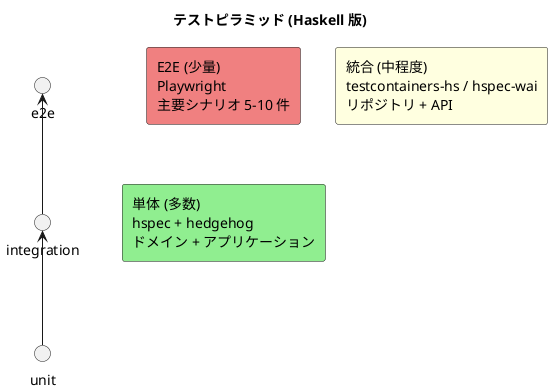
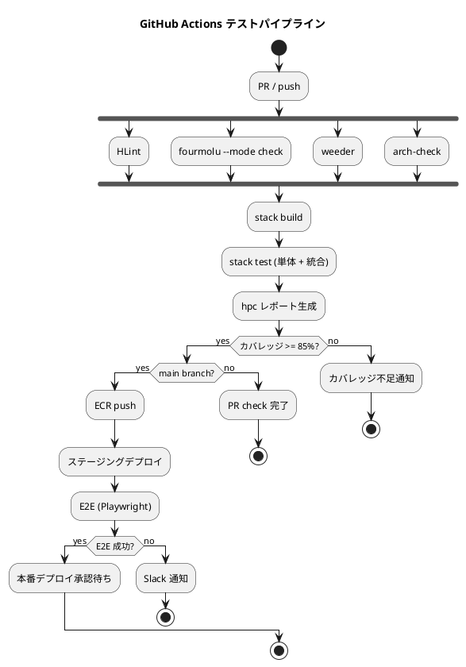

# テスト戦略 - 国際貨物輸送管理システム (Haskell 版)

## 1. 概要

### 1.1 目的

本ドキュメントは、国際貨物輸送管理システム (Haskell 版) のテスト戦略を定義する。
DDD + ヘキサゴナル + CQRS アーキテクチャの特性を活かし、**変更を楽に安全にできるソフトウェア**を支えるテスト設計を行う。

### 1.2 基本方針

| 方針 | 内容 |
| :--- | :--- |
| **テスト形状はピラミッド** | ドメイン層が純粋 Haskell (副作用なし) であることを活かし、単体テスト中心の構成 |
| **モックなし優先** | ドメイン層は副作用を持たないためモック不要。型クラスポートのテストダブルは純粋実装で代替 |
| **本番と同一 DB** | テスト DB は Testcontainers PostgreSQL を使用。SQLite 等の代替は使用しない |
| **アーキテクチャ規約を自動検証** | 依存方向の制約は HLint カスタムルール + 自作 import 規約チェッカで CI 検証 |
| **プロパティテスト活用** | スマートコンストラクタ、状態遷移、`TransportStatus` ↔ `TrackingStatus` 変換は hedgehog で網羅的検証 |

### 1.3 アーキテクチャとテスト戦略の対応関係

| レイヤー | 主要テスト種別 | 使用ツール | 特徴 |
| :--- | :--- | :--- | :--- |
| Domain (純粋) | 単体テスト (例ベース + プロパティ) | hspec + hedgehog | モックなし。`Either` の成功・失敗を網羅 |
| Application | 単体テスト (ポートをテストダブルに差替) | hspec | 型クラスポートを純粋な `State`/`IORef` ベース実装で差替 |
| Infrastructure (Repository) | 統合テスト | hspec + testcontainers-hs | 実 PostgreSQL に対する SQL 検証 |
| Infrastructure (External Service) | 契約テスト | hspec + WireMock (Docker) | 外部システム ACL の HTTP 通信検証 |
| Interfaces (Servant API) | 統合テスト | hspec-wai | エンドポイント入出力・認証・JSON 整合性 |
| アーキテクチャ規約 | 規約テスト | HLint + 自作チェッカ | 依存方向を CI で検証 |
| E2E | E2E テスト | Playwright | 主要ユーザーシナリオ |

---

## 2. テスト形状の選択

### 2.1 採用形状: ピラミッド型



**比率の目安** (テスト件数ベース):

- 単体: 70%
- 統合: 25%
- E2E: 5%

### 2.2 採用しない形状と理由

| 形状 | 不採用理由 |
| :--- | :--- |
| ダイヤモンド型 (統合中心) | 純粋ドメインの利点を活かせず、テスト実行時間が増大 |
| 逆ピラミッド (E2E 中心) | 失敗の原因特定が困難。CI 時間も長期化 |
| カップ型 (単体 + E2E、統合スキップ) | リポジトリの SQL バグを E2E で初めて検出することになり、修正コストが高い |

---

## 3. テストレベルの定義

### 3.1 ユニットテスト (Unit Test)

#### 責務・検証対象

- ドメイン層: 集約・値オブジェクト・スマートコンストラクタ・状態遷移・ドメインサービス
- アプリケーション層: コマンドサービス・クエリサービスのフロー (ポートはテストダブルに差替)
- 共有ユーティリティ: `DomainError` 変換、`TransportStatus` ↔ `TrackingStatus` マッピング

#### カバレッジ目標

- ドメイン層: **95% 以上** (ステートメント + ブランチ)
- アプリケーション層: **85% 以上**

#### 使用ツール

- **hspec**: 例ベース BDD スタイル
- **hedgehog**: プロパティテスト (網羅的検証)
- **tasty-hspec + tasty-hedgehog**: テストランナー統合
- **hpc**: コードカバレッジ計測

#### 実行タイミング

- ローカル: `ghcid` によるホットリロード時、または `stack test`
- CI: 全 PR / push で実行

#### 除外対象

- `IO` を直接含む関数 (リポジトリ実装等は統合テスト側で検証)
- 外部システムへの実通信 (契約テスト側で検証)

#### 実装例: `Cargo` 集約の `BookingStatus` 遷移テスト

```haskell
{-# LANGUAGE OverloadedStrings #-}
module Cargotracker.Booking.Domain.Model.Aggregates.CargoSpec where

import Test.Hspec
import Cargotracker.Booking.Domain.Model.Aggregates.Cargo
import Cargotracker.Shared.Domain.Model.DomainError

spec :: Spec
spec = describe "Cargo aggregate" $ do
  describe "assignRoute" $ do
    it "Preliminary 状態から RouteProposed への遷移が成功する" $ do
      let cargo = sampleCargo Preliminary
      let result = assignRoute cargo sampleItinerary
      result `shouldSatisfy` isRight
      fmap cargoStatus result `shouldBe` Right RouteProposed

    it "Cancelled 状態からは遷移できない" $ do
      let cargo = sampleCargo Cancelled
      let result = assignRoute cargo sampleItinerary
      result `shouldBe` Left (InvalidStatusTransition (cargoBookingId cargo) Cancelled RouteProposed)

    it "RouteSpecification を満たさない Itinerary は拒否される" $ do
      let cargo = sampleCargo Preliminary
      let result = assignRoute cargo invalidItinerary
      result `shouldSatisfy` (\r -> case r of { Left (RouteNotSatisfied _) -> True; _ -> False })

  describe "canTransitionTo (全 9 状態 × 9 状態 = 81 ペア)" $
    it "禁止された遷移を網羅的に拒否する" $
      forM_ [(s1, s2) | s1 <- allStatuses, s2 <- allStatuses] $ \(s1, s2) ->
        canTransitionTo s1 s2 `shouldBe` expectedTransition s1 s2
```

#### 実装例: 値オブジェクトのスマートコンストラクタテスト (プロパティ)

```haskell
module Cargotracker.Shared.Domain.Model.UnLocodeSpec where

import Test.Hspec
import Hedgehog
import qualified Hedgehog.Gen as Gen
import qualified Hedgehog.Range as Range

spec :: Spec
spec = describe "UnLocode smart constructor" $ do
  it "形式に合う 5 文字 (大文字 2 + 英数 3) は受理する" $ hedgehog $ do
    cc  <- forAll $ Gen.text (Range.singleton 2) Gen.upper
    loc <- forAll $ Gen.text (Range.singleton 3) (Gen.choice [Gen.upper, Gen.digit])
    mkUnLocode (cc <> loc) === Right (unsafeUnLocode (cc <> loc))

  it "5 文字以外は拒否する" $ hedgehog $ do
    t <- forAll $ Gen.filter ((/= 5) . T.length) (Gen.text (Range.linear 0 10) Gen.alphaNum)
    case mkUnLocode t of
      Left (InvalidUnLocode _) -> success
      _                        -> failure
```

#### 実装例: `TransportStatus ↔ TrackingStatus` 全網羅マッピング (プロパティ)

```haskell
spec = describe "trackingStatusToTransportStatus" $
  it "全 9 値が一意に変換される (双方向)" $ hedgehog $ do
    s <- forAll Gen.enumBounded :: PropertyT IO TrackingStatus
    let ts = trackingStatusToTransportStatus s
    transportStatusToTrackingStatus ts === s
```

### 3.2 統合テスト (Integration Test)

#### 責務・検証対象

- リポジトリ実装: postgresql-simple の SQL クエリ・トランザクション・楽観ロック
- Servant API: エンドポイントの入出力・認証・JSON シリアライズ
- DB マイグレーション: dbmate スクリプトの適用

#### カバレッジ目標

- リポジトリ層: **80% 以上**
- API 層: **75% 以上**

#### 使用ツール

- **testcontainers-hs**: 実 PostgreSQL コンテナを spec 単位で起動
- **hspec-wai**: WAI Application 上で Servant API をテスト
- **dbmate**: マイグレーション適用

#### 実行タイミング

- CI: PR / push 時 (単体テスト後)
- ローカル: `stack test --test-arguments="--match Integration"` で明示的に実行

#### 実装例: `CargoRepository` の保存・検索テスト

```haskell
module Cargotracker.Booking.Infrastructure.Repository.PostgresCargoRepositorySpec where

import Test.Hspec
import TestContainers.Hspec (withContainers)
import Database.PostgreSQL.Simple

spec :: Spec
spec = aroundAll (withContainers postgresContainer) $
  describe "PostgresCargoRepository" $ do
    it "保存した Cargo が同じ BookingId で取得できる" $ \conn -> do
      let cargo = sampleCargo Preliminary
      _ <- saveCargo conn cargo
      found <- findByBookingId conn (cargoBookingId cargo)
      found `shouldBe` Just cargo

    it "存在しない BookingId は Nothing を返す" $ \conn -> do
      found <- findByBookingId conn (unsafeBookingId "BK-NOTFND")
      found `shouldBe` Nothing

    it "楽観ロック: 古いバージョンの UPDATE は ConcurrentModification を返す" $ \conn -> do
      let cargo = sampleCargo Preliminary
      _ <- saveCargo conn cargo
      -- 別ユーザーが先に更新したと仮定
      _ <- execute_ conn "UPDATE cargo SET version = version + 1 WHERE booking_id = 'BK-A1B2C3'"
      result <- saveCargo conn cargo  -- version は古いまま
      result `shouldSatisfy` isLeft
```

#### 実装例: Servant API の hspec-wai テスト

```haskell
module Cargotracker.Booking.Interfaces.ApiSpec where

import Test.Hspec
import Test.Hspec.Wai
import Test.Hspec.Wai.JSON

spec :: Spec
spec = with (testApp <$> buildTestEnv) $
  describe "POST /api/v1/bookings" $ do
    it "正常系: 201 と BookingId を返す" $
      request "POST" "/api/v1/bookings"
        [("Content-Type", "application/json"), authHeader]
        validBookingPayload
      `shouldRespondWith` 201

    it "認証なしは 401" $
      request "POST" "/api/v1/bookings" [("Content-Type", "application/json")] validBookingPayload
      `shouldRespondWith` 401

    it "バリデーション失敗時は 400 と DomainError を返す" $
      request "POST" "/api/v1/bookings"
        [("Content-Type", "application/json"), authHeader]
        invalidPayload
      `shouldRespondWith` [json|{ "code": "INVALID_BOOKING_ID", "message": "..." }|]
```

#### WireMock 契約テストの概要

外部システム ACL は WireMock (Docker コンテナ) を起動し、http-client が発行する HTTP リクエスト・レスポンスを検証する。
契約定義は WireMock の JSON マッピングで記述し、テストコードからは `wreq` または `http-client` で実通信する。

### 3.3 アーキテクチャテスト (Architecture Test)

#### 責務・検証対象

依存方向ルールを CI で自動検証する。

#### 実行タイミング

- CI: 全 PR / push (単体テスト前)

#### 検証ルール 4 件

1. **ドメイン層がインフラ層に依存しない**: `*.Domain.*` モジュールが `*.Infrastructure.*` を import しない
2. **ドメイン層がフレームワークに依存しない**: `*.Domain.*` が `Servant.*` / `Database.PostgreSQL.Simple.*` / `Data.Aeson.*` を import しない
3. **アプリケーション層はポート経由でのみインフラ参照**: `*.Application.*` が `*.Infrastructure.*` を直接 import しない
4. **Bounded Context 間の直接参照禁止**: `Booking.*` が `Tracking.*` を import しない (共有カーネル `Shared.*` を除く)

#### 実装方針

```bash
# CI で実行: 自作 import 規約チェッカ
stack exec arch-check -- src/Cargotracker/

# HLint カスタムルール (hlint.yaml)
- modules:
  - name: [Servant, Database.PostgreSQL.Simple, Data.Aeson]
    within: [Cargotracker.*.Infrastructure, Cargotracker.*.Interfaces]
    message: "ドメイン層からフレームワーク API への依存禁止"
```

### 3.4 E2E テスト (End-to-End Test)

#### 責務・検証対象

主要ユーザーシナリオを実ブラウザで通しで実行する。

| シナリオ | 対応 US |
| :--- | :--- |
| 営業担当者が見積から予約・経路割り当て・確定までを行う | US01 → US04 → US06 → US07-09 → US11 |
| 荷役作業員が荷役を登録し、追跡情報に反映される | US15 → US18 |
| 荷主が追跡番号で貨物状態を確認する | US18 |
| 例外発生時に荷主へ通知され、追跡管理者が解決する | US19 / US20 → US17 |
| 経理担当者が請求書を発行し支払い確認する | US21 → US22 → US23 |

#### カバレッジ目標

- 主要 US: **80% 以上カバー**
- 件数目安: 5〜10 シナリオ

#### 使用ツール

- **Playwright** (TypeScript)
- ステージング環境または `docker compose` 環境で実行

#### 実行タイミング

- CI: main branch push 時 (ステージングデプロイ後)
- リリース前: 全シナリオを手動 + 自動で実行

#### htmx 30 秒ポーリングへの対応

タイムラインの自動更新は Playwright の `waitForResponse` で次のポーリング応答を待ち、UI に反映されることを確認する。

```typescript
test('US18 追跡情報照会: ポーリングで状態が更新される', async ({ page }) => {
  await page.goto('/public/tracking/TR12345');
  await expect(page.locator('#status-container')).toContainText('OnboardCarrier');

  // 状態を裏で更新 (テストヘルパー API 経由)
  await api.updateTrackingStatus('TR12345', 'Unloaded');

  // 次のポーリングで反映されることを確認
  await page.waitForResponse(r => r.url().includes('/tracking/') && r.status() === 200);
  await expect(page.locator('#status-container')).toContainText('Unloaded');
});
```

---

## 4. WireMock 契約テストシナリオ (ACL ポート別)

### 4.1 シナリオ一覧

| ACL ポート | 正常系 | 異常系 |
| :--- | :--- | :--- |
| `ExternalRoutingServicePort` | 経路候補を返す | タイムアウト・5xx → Retry → Circuit Breaker |
| `CustomsClearancePort` | 通関ステータス取得 | 404 → DomainError 変換 |
| `PaymentGatewayPort` | 決済完了 | 拒否レスポンス → 状態遷移なし |
| `PortManagementPort` | 港湾情報取得 | 接続不可 → キャッシュフォールバック |
| `NotificationPort` | 通知送信成功 | 失敗時もメインフロー継続 (ログ記録) |

### 4.2 WireMock 実装例

`ExternalRoutingServicePort` のタイムアウトシナリオ:

```haskell
spec :: Spec
spec = around (withWireMock "external-routing.json") $
  describe "ExternalRoutingServicePort" $ do
    it "タイムアウト時に Left RoutingServiceUnavailable を返す" $ \wmHost -> do
      -- WireMock: 10 秒遅延を返すスタブ
      result <- findOptimalItinerary sampleSpec `runReaderT` mkEnv wmHost (timeout 1)
      result `shouldBe` Left RoutingServiceUnavailable
```

---

## 5. ユーザーストーリーとテストのトレーサビリティ

各 US は以下のテストレベルでカバーする。

| US | 単体 | 統合 | E2E |
| :--- | :---: | :---: | :---: |
| US01 (見積作成) | ✓ Estimate.create | ✓ EstimateRepository | ✓ |
| US04 (予約登録) | ✓ Cargo.create | ✓ CargoRepository, API | ✓ |
| US07-09 (経路設計) | ✓ Itinerary.isSatisfiedBy | ✓ VoyageRepository | ✓ |
| US13 (予約確定) | ✓ canTransitionTo | ✓ API | ✓ |
| US15 (荷役登録) | ✓ HandlingActivity.isValidFor | ✓ Repository, API | ✓ |
| US18 (追跡照会) | ✓ TrackingActivity.currentStatus | ✓ API | ✓ |
| US19-20 (例外処理) | ✓ addException | ✓ API | ✓ |
| US21-22 (料金算出) | ✓ Invoice.applyDiscount | ✓ Repository | |
| US23 (精算) | ✓ Invoice.confirmPayment | ✓ API | ✓ |
| US24-25 (航海登録/更新) | ✓ Schedule 整合性 | ✓ VoyageRepository | |

### 5.1 横断要件のテスト (US 番号を持たない要件)

| 横断要件 | テスト方法 |
| :--- | :--- |
| 認証・認可 | hspec-wai で各ロールの 403/401 検証、E2E で正常フロー |
| CSRF 対策 | hspec-wai でトークン欠落リクエストの拒否を検証 |
| 楽観ロック | testcontainers で並行更新の `ConcurrentModification` を検証 |
| トランザクション境界 | testcontainers でロールバック時のイベント未発行を検証 |
| 監査ログ | hspec-wai で重要操作後の `notification_log` レコード作成を検証 |

---

## 6. カバレッジ目標とメトリクス

### 6.1 レイヤー別カバレッジ目標

| レイヤー | ステートメント | ブランチ | 計測ツール |
| :--- | :---: | :---: | :--- |
| Domain | 95% | 90% | hpc |
| Application | 85% | 80% | hpc |
| Infrastructure (Repository) | 80% | 70% | hpc |
| Interfaces (API) | 75% | 65% | hpc |
| **全体** | **85% 以上** | **75% 以上** | hpc |

### 6.2 品質ゲート条件

CI で以下を満たさない場合はマージ不可:

- [x] 全テスト Green (`stack test`)
- [x] hpc カバレッジが目標値以上 (全体 85% / Domain 95%)
- [x] HLint 警告なし (`hlint src/`)
- [x] fourmolu フォーマット適用済み (`fourmolu --mode check src/`)
- [x] weeder デッドコードなし (`weeder`)
- [x] アーキテクチャ規約検査 Pass (`stack exec arch-check`)

---

## 7. CI/CD とのテスト連携

### 7.1 ステージ別テスト戦略

| ステージ | 実行内容 | 所要時間目安 |
| :--- | :--- | :--- |
| Pre-commit (ローカル) | fourmolu / HLint / 単体テスト | 30 秒 |
| PR / push (GitHub Actions) | アーキテクチャ規約 + 単体 + 統合 (Testcontainers) + WireMock | 5-10 分 |
| main push | + ステージングデプロイ + E2E (Playwright) | 15-20 分 |
| リリースタグ | + 本番デプロイ前手動承認 + スモークテスト | 30 分 |

### 7.2 GitHub Actions パイプライン図



---

## 8. テストデータ管理

### 8.1 フィクスチャ戦略

- ドメインテスト: `sampleCargo`, `sampleItinerary` 等の純粋なファクトリ関数をテストヘルパーモジュールに集約
- 統合テスト: dbmate のシードファイル (`db/seeds.sql`) で基本マスタ (location 等) を投入、テスト個別データは spec 内で挿入
- 並列実行: testcontainers-hs は spec 単位で独立コンテナを起動可能。並列実行時はテストごとに独立 DB を使用

### 8.2 ランダム生成 vs 例ベース

| 目的 | アプローチ |
| :--- | :--- |
| ビジネスルールの境界値検証 | 例ベース (hspec) |
| スマートコンストラクタの全域検証 | プロパティ (hedgehog) |
| 状態遷移の網羅性検査 | 例ベース (全ペア列挙) |
| 不変条件 (`forall x. f x = g x`) | プロパティ (hedgehog) |

---

## 9. パフォーマンステスト (将来)

初期リリース対象外だが、以下を将来検討する。

- 負荷テスト: `wrk` または k6 で `/api/v1/tracking/:number` の RPS 計測
- 長時間稼働: GHC RTS のメモリリーク検出 (`+RTS -hT`)

---

## 参照

- [バックエンドアーキテクチャ](architecture_backend.md)
- [ドメインモデル設計](domain-model.md)
- [技術スタック選定](tech_stack.md)
- [ユーザーストーリー](../requirements/user_story.md)
- Scala 版参考: `tmp/case-study-cargo-tracker/docs/design/test_strategy.md`
