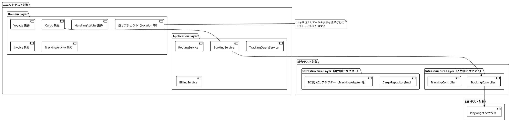
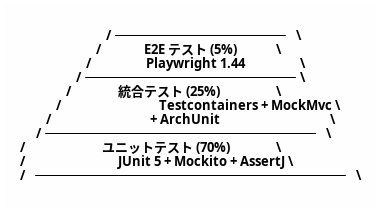
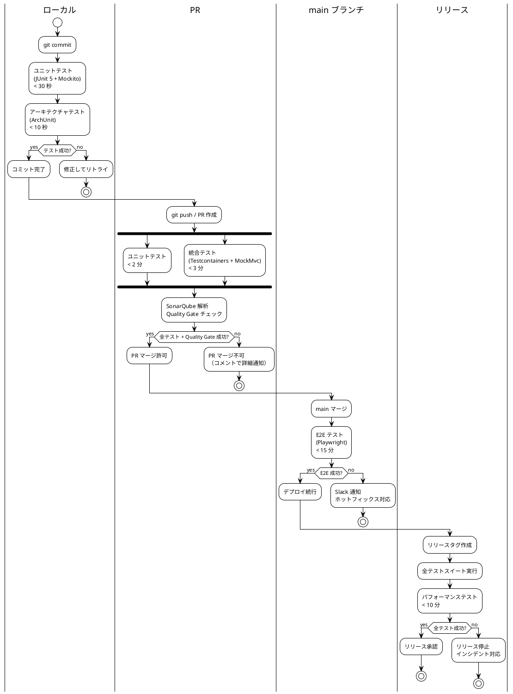
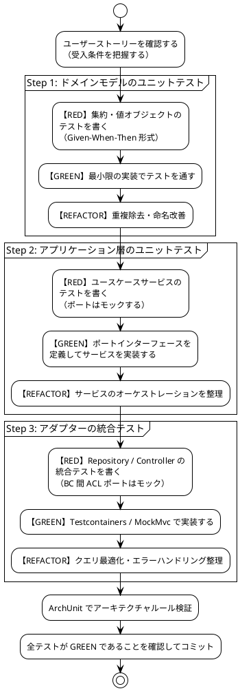

# テスト戦略 - 国際貨物輸送管理システム

## 1. 概要

### 1.1 目的

本ドキュメントは、国際貨物輸送管理システムにおけるテスト戦略を定義する。テスト戦略を事前に策定し、以下の問いに常に回答できる状態を維持することを目的とする。

- 「この機能はどのテストレベルで保証されているか」
- 「何をどこまでテストすべきか」
- 「テストが失敗したとき、どこを修正すべきか」

### 1.2 基本方針

- **TDD（テスト駆動開発）を全開発プロセスで適用する**: レッド → グリーン → リファクタリングのサイクルを厳守する
- **テストをアーキテクチャに対応させる**: ヘキサゴナルアーキテクチャの境界（ポート）を活かし、テスト可能性を設計段階で確保する
- **テストの重複を排除する**: 各テストレベルの責務を明確に分離し、同一ロジックを複数レベルで重複検証しない
- **テストを実行可能なドキュメントとして扱う**: テストコードがシステムの振る舞いを説明する

### 1.3 アーキテクチャとテスト戦略の対応関係



ヘキサゴナルアーキテクチャの各層は以下のテストレベルに対応する。

| アーキテクチャ層 | テストレベル | 理由 |
|---|---|---|
| ドメイン層（集約・値オブジェクト・ドメインサービス） | ユニットテスト | 外部依存ゼロ。純粋なビジネスロジック |
| アプリケーション層（ユースケースサービス） | ユニットテスト（ポートをモック） | ポートへの委譲とオーケストレーションを検証 |
| 入力側アダプター（Controller） | 統合テスト（MockMvc） | HTTP マッピングとバリデーションを検証 |
| 出力側アダプター（Repository） | 統合テスト（Testcontainers） | SQL クエリの正確性を実 DB で検証 |
| BC 間 ACL ポート（TrackingPort / ShipperDiscountPort / BookingSettlementPort） | ユニットテスト（ポートをモック） | 呼び出し側は Mockito でモックし委譲を検証。ポート実装（Adapter）は連携先 BC のサービスへの委譲のみのため、必要に応じて委譲先をモックしたユニットテストで検証 |
| ユーザーシナリオ全体 | E2E テスト（Playwright） | クリティカルパスの品質保証 |

> **注記（外部システム連携の現状）**: 本システムは単一モノリスであり、ルーティング・通関・決済・港湾・通知といった外部システムとの HTTP 連携は実装していない。これらは各 Bounded Context 内のドメインロジック・アプリケーションサービスとして内部シミュレーション実装される。そのため「外部 HTTP サービスの契約を WireMock で検証する」テストは現時点で対象外である。実在する境界間連携は Bounded Context 間の ACL（Anti-Corruption Layer）ポートのみであり、これらは連携先 BC のアプリケーションサービスへ委譲する内部実装のため、Mockito によるモックで検証する。将来、外部 HTTP 連携を実際に導入した場合は [セクション 4](#4-bounded-context-間-acl-ポートのテスト) の将来方針に従い WireMock を採用する。

---

## 2. テスト形状の選択

### 2.1 採用形状: ピラミッド型



**採用理由**:

- **ドメイン層が厚い**: DDD を採用しており、Cargo・Voyage・HandlingActivity・Invoice の各集約にビジネスロジックが集中する。BookingStatus の 8 値遷移、荷役妥当性検証（MISROUTED 判定）、法人割引計算など、外部依存なしでテスト可能なロジックが多い
- **ヘキサゴナルアーキテクチャによる高いテスト可能性**: ドメイン層とインフラ層の境界がポートで分離されており、モックの差し替えが容易。ユニットテストが書きやすい設計になっている
- **CQRS による読み取りモデルの分離**: TrackingContext の読み取りクエリはドメインロジックを持たず、統合テストで Repository を直接検証するだけで十分
- **コスト効率**: ユニットテストは実行が高速（< 30 秒）でメンテナンスコストが低い。E2E テストはフレイキーになりやすく、最小限にとどめることで CI の安定性を維持する

### 2.2 採用しない形状と理由

| 形状 | 採用しない理由 |
|---|---|
| **ダイヤモンド型**（統合テスト重視） | 本システムは単一モノリス（ヘキサゴナル）で構成されており、マイクロサービス間の契約検証ニーズがない。統合テストを主軸にするとテスト実行時間が増大し、TDD サイクルが遅くなる |
| **逆ピラミッド型**（E2E 重視） | Playwright テストはヘッドレスブラウザを起動するためフレイキーになりやすく、htmx の 30 秒ポーリングを含む動的 UI はテストの安定性確保が困難。E2E を主軸にするとフィードバックループが 15 分以上になる |

---

## 3. テストレベルの定義

### 3.1 ユニットテスト（Unit Test）

#### 責務・検証対象

- **ドメイン層**: 集約の状態遷移・不変条件・ビジネスルール、値オブジェクトの等価性・バリデーション、ドメインサービスのロジック
- **アプリケーション層**: ユースケースサービスのオーケストレーション（ポートはモック）

#### カバレッジ目標

| 対象 | 行カバレッジ | 分岐カバレッジ |
|---|---|---|
| ドメイン層 | **85% 以上** | **80% 以上** |
| アプリケーション層 | **80% 以上** | **75% 以上** |

#### 使用ツール

- **JUnit 5**: テストフレームワーク（`@Test`, `@ParameterizedTest`）
- **Mockito 5**: ポートインターフェースのモック（`@Mock`, `@InjectMocks`）
- **AssertJ 3**: 流暢なアサーション（`assertThat(...).isEqualTo(...)`）

#### 実行タイミング

- **ローカル**: すべてのコミット時（目標 **30 秒以内**）
- **PR**: 自動実行（コミットプッシュ時）
- **CI**: GitHub Actions の `unit-test` ジョブ

#### 除外対象

- インフラ層（MyBatis マッパー、HTTP クライアント）— 統合テストで担保する
- DTO / レコードクラス — データ保持のみでロジックがない
- Spring Boot アプリケーションコンテキスト — `@SpringBootTest` はユニットテストに**使用しない**

#### 実装例: Cargo 集約の BookingStatus 遷移テスト

```java
class CargoBookingStatusTest {

    // 状態遷移の正典は domain-model.md「BookingStatus 状態遷移表」。
    // 表の全セル（許可・拒否の両方）を網羅すること。

    @Test
    void 経路割り当て済みの予約は確定できる() {
        // Given: ROUTE_PROPOSED かつ RoutingStatus = ROUTED の貨物（遷移 #4）
        var cargo = CargoFixture.withRouteAssigned();

        // When: 予約を確定する
        cargo.confirmBooking();

        // Then: ステータスが CONFIRMED に遷移する
        assertThat(cargo.getBookingStatus()).isEqualTo(BookingStatus.CONFIRMED);
    }

    @Test
    void ルート未割り当て状態で予約確定しようとすると例外が発生する() {
        // Given: PRELIMINARY の貨物（遷移表に PRELIMINARY → CONFIRMED は存在しない）
        var cargo = CargoFixture.preliminary();

        // When & Then: 不変条件違反で例外が発生する
        assertThatThrownBy(cargo::confirmBooking)
                .isInstanceOf(BookingDomainException.class)
                .hasMessageContaining("ルートが割り当てられていません");
    }

    @Test
    void 危険物の取扱不可港にルートを割り当てると例外が発生する() {
        // Given: 危険物フラグが立った貨物と危険物取扱不可の港を経由するルート
        var cargo = CargoFixture.hazardous();
        var prohibitedRoute = RouteFixture.viaHazardousProhibitedPort();

        // When & Then: ドメインルール違反で例外が発生する
        assertThatThrownBy(() -> cargo.assignRoute(prohibitedRoute))
                .isInstanceOf(HazardousCargoRoutingException.class);
    }

    @ParameterizedTest
    @EnumSource(value = BookingStatus.class,
                names = {"SETTLED", "CANCELLED"},
                mode = EnumSource.Mode.INCLUDE)
    void 終端状態からの遷移は許可されない(BookingStatus terminalStatus) {
        // Given: 終端ステータスの貨物
        var cargo = CargoFixture.withStatus(terminalStatus);

        // When & Then: ステータス遷移が拒否される
        assertThatThrownBy(cargo::confirmBooking)
                .isInstanceOf(InvalidBookingStatusTransitionException.class);
    }

    /**
     * 遷移表の拒否側を網羅する。8 状態 × 各コマンドの組み合わせのうち、
     * domain-model.md の遷移表に存在しないものはすべて例外となること。
     * 許可される遷移のみをホワイトリストとして持ち、それ以外を拒否と判定する。
     */
    @ParameterizedTest
    @MethodSource("全ての状態とコマンドの組み合わせ")
    void 遷移表に無い遷移はすべて拒否される(BookingStatus from, BookingCommand command) {
        var cargo = CargoFixture.withStatus(from);

        if (TransitionTable.allows(from, command)) {
            assertThatCode(() -> cargo.apply(command)).doesNotThrowAnyException();
        } else {
            assertThatThrownBy(() -> cargo.apply(command))
                    .isInstanceOf(InvalidBookingStatusTransitionException.class);
        }
    }
}
```

#### 必須の境界値ケース

戦略として以下の境界を必ずテストケースに含める（テスト技法: 境界値分析・同値分割・デシジョンテーブル）。

| 対象 | 境界値 | 落とし穴 |
| :--- | :--- | :--- |
| 到着期限の判定 | 期限前日 23:59 / **期限当日 00:00** / **期限当日 23:59** / 翌日 00:00 | `arrival_deadline`(`DATE`) と `unload_time`(`TIMESTAMPTZ`) を素朴に比較すると**期限当日の時刻付き到着を誤って刈る**。`domain-model.md` ビジネスルール 2-1 を参照 |
| 割引率 | 0 / 0.0001 / 0.3000 / **0.3001** | 上限 30% の境界。管理画面の入力上限とドメインの検証上限が一致していること |
| エスカレーション判定 | 24h / **ちょうど 48h** / 72h | 旧版の例は 24h と 72h のみで**境界そのものが未検証**だった |
| 金額の丸め | 端数の出る金額（例: 基本料金 100,003 円 × 割引 15% × 税 10%） | `domain-model.md`「金額の丸め規則」に従い、**切り捨て・段階丸め・適用順序（割引→丸め→課税→丸め）**を検証する。「割引→課税→丸め」との差（1 円）を区別できるケースを必ず入れる |
| 丸めの境界 | 小数部が .5 ちょうどになる金額 | 切り捨てなので繰り上がらないこと。四捨五入実装が混入したら落ちる |
| タイムゾーン | 日付変更線をまたぐ港間の輸送 | 全時刻列を `TIMESTAMPTZ` に統一済み（`data-model.md`）。`location.time_zone` を用いた日付丸めを検証する |

#### データベースを伴うテストの方針（ADR-003）

| 対象 | DB | 理由 |
|---|---|---|
| ドメイン層・アプリケーション層のユニットテスト | **使わない** | POJO とモックのみ。そもそも DB に依存しない |
| **Repository / MyBatis Mapper のテスト** | **Testcontainers（実 PostgreSQL 16）** | **SQL の正しさを検証する唯一の場所** |
| Controller の統合テスト（MockMvc） | Testcontainers（実 PostgreSQL 16） | Repository を経由するため |
| E2E（Playwright） | PostgreSQL（Docker Compose） | 本番に近い構成で通しの動作を見る |

統合テストの基底クラスは `PostgreSQLIntegrationTestBase`（Testcontainers シングルトンコンテナ）である。

> **H2 で Repository テストを書かないこと。** H2 はローカルでアプリを起動して画面を触る用途に限る（ADR-003）。H2 の PostgreSQL 互換モードは `TIMESTAMPTZ`・部分インデックス・`NUMERIC` の丸め挙動を完全には再現しないため、**H2 上で緑になった SQL が本番で落ちうる**。
>
> **方言差のリスクは「SQL を検証する場所を実 PostgreSQL に固定する」ことで抑える。** 開発ループの速度と本番の安全性はトレードオフだが、用途で使い分けることで双方を満たせる。
>
> レビューで確認すること: Repository / Mapper のテストが H2 で書かれていないこと。

---

### 3.2 統合テスト（Integration Test）

#### 責務・検証対象

- **Repository（MyBatis マッパー）**: SQL クエリの正確性、トランザクション、楽観的ロック

> **楽観的ロックは「競合を実際に起こすテスト」で固定する。** `data-model.md` 判断 8 に従い集約ルートのテーブルに `version` を付与したうえで、次を DoD とする。
>
> - 同一 `Cargo` を 2 スレッドから更新すると、後勝ちが `OptimisticLockingFailureException` になる
> - 荷役登録が `tracking_activity` と `cargo` を同時更新する経路でも同様に検出される
>
> 旧版は本節で楽観的ロックを検証対象に挙げていたが、データモデルに `version` 相当の列が存在せず**検証対象そのものが無かった**。文言だけの安全装置は安全装置ではない。
- **Controller（MockMvc）**: HTTP リクエスト/レスポンスのマッピング、バリデーション、エラーハンドリング

> BC 間 ACL ポート（TrackingPort 等）は外部 HTTP 連携ではなく連携先 BC のアプリケーションサービスへの委譲のため、統合テストではなくユニットテスト（Mockito モック）で検証する。詳細は [セクション 4](#4-bounded-context-間-acl-ポートのテスト) を参照。

#### テストデータ準備の規約

Testcontainers はシングルトンコンテナで共有するため、**テスト間のデータ独立性は自前で担保する**。次を規約とする。

| 規約 | 内容 |
|---|---|
| 準備はテスト内で完結させる | 共有 seed に依存しない。テストが必要とするデータはそのテストが作る。**共有 seed に依存したテストは、他のテストの追加で壊れる** |
| 既定は `@Transactional` ロールバック | Repository テストは `@Transactional` を付け、テスト終了時にロールバックする。**クラス内で有無を混在させない** |
| コミットが必要なテストは明示クリーンアップ | AFTER_COMMIT リスナーや楽観的ロックの検証はコミットを伴うため、`@Transactional` を使わず `@AfterEach` で明示的に削除する |
| 一意な識別子を使う | 追跡番号・予約 ID はテストごとに一意にする。固定値の使い回しは並列実行時に衝突する |
| Fixture は最小限の有効なオブジェクトを返す | `CargoFixture.preliminary()` のように状態を名前で表し、テストが必要な差分だけを上書きする |

#### AFTER_COMMIT リスナーの検証

`architecture_backend.md` はドメインイベントの購読に `@TransactionalEventListener(AFTER_COMMIT)` を用いる。**テストメソッドに `@Transactional` を付けるとコミットが起きず、リスナーは呼ばれない。** 付けたまま「イベントが飛ばない」ことを確認しても、それは何も検証していない。

```java
@SpringBootTest
@RecordApplicationEvents
class CargoBookedEventIntegrationTest extends PostgreSQLIntegrationTestBase {

    @Autowired private TransactionTemplate transactionTemplate;
    @Autowired private ApplicationEvents events;

    @Test  // ★ @Transactional を付けない
    void コミット後にイベントが発行される() {
        transactionTemplate.execute(status -> commandService.book(command));

        assertThat(events.stream(CargoBookedEvent.class)).hasSize(1);
    }

    @Test
    void ロールバック時はイベントが発行されない() {
        assertThatThrownBy(() -> transactionTemplate.execute(status -> {
            commandService.book(command);
            throw new IllegalStateException("強制ロールバック");
        })).isInstanceOf(IllegalStateException.class);

        // AFTER_COMMIT なので発行されないこと自体が仕様
        assertThat(events.stream(CargoBookedEvent.class)).isEmpty();
    }
}
```

> **「発行されないこと」の検証は、コミットするテストと対で書く。** 片方だけだと、リスナーが常に呼ばれない実装（配線漏れ）でも緑になる。

#### カバレッジ目標

| 対象 | 行カバレッジ |
|---|---|
| Repository（インフラ層） | **75% 以上** |
| Controller 層 | **70% 以上** |

#### 使用ツール

- **JUnit 5**: テストフレームワーク
- **Testcontainers 1.20（`junit-jupiter` + `postgresql`）**: 実 PostgreSQL 16 コンテナを自動起動。基底クラス `PostgreSQLIntegrationTestBase` がシングルトンコンテナを起動し `@DynamicPropertySource` でデータソースを上書きする
- **Spring MockMvc**: HTTP 層の結合テスト（サーブレットコンテキストは起動）

#### 実行タイミング

- **PR 時**: GitHub Actions の `integration-test` ジョブ（目標 **5 分以内**）
- **ローカル**: Docker が起動している環境で任意実行

#### 実装例: CargoRepository の保存・検索テスト（Testcontainers）

> 実プロジェクトではコンテナ起動を共通化するため、`support.PostgreSQLIntegrationTestBase`（シングルトンコンテナ + `@DynamicPropertySource`）を継承する。以下はコンテナ設定を明示した最小例である。

```java
@SpringBootTest
class CargoRepositoryIntegrationTest extends PostgreSQLIntegrationTestBase {

    @Autowired
    private CargoRepository cargoRepository;

    @Test
    @Transactional
    void 貨物を保存して追跡番号で検索できる() {
        // Given: 新規貨物エンティティ
        var cargo = CargoFixture.newBooking(
                TrackingId.of("TRK-20260401-0042"),
                UnLocode.of("JPTYO"),
                UnLocode.of("DEHAM")
        );

        // When: 保存して検索する
        cargoRepository.save(cargo);
        var found = cargoRepository.findByTrackingId(TrackingId.of("TRK-20260401-0042"));

        // Then: 保存したエンティティと一致する
        assertThat(found).isPresent();
        assertThat(found.get().getOrigin()).isEqualTo(UnLocode.of("JPTYO"));
        assertThat(found.get().getDestination()).isEqualTo(UnLocode.of("DEHAM"));
    }

    @Test
    void 存在しない追跡番号で検索するとOptionalEmptyを返す() {
        // Given & When
        var result = cargoRepository.findByTrackingId(TrackingId.of("TRK-20260401-9999"));

        // Then
        assertThat(result).isEmpty();
    }
}
```

#### 実装例: BookingController の MockMvc テスト

```java
@WebMvcTest(BookingController.class)
class BookingControllerTest {

    @Autowired
    private MockMvc mockMvc;

    // Spring Boot 3.4+ では @MockBean は deprecated。@MockitoBean（org.springframework.test.context.bean.override.mockito）を使用する
    @MockitoBean
    private BookingApplicationService bookingApplicationService;

    @Test
    void 貨物予約登録APIが201を返す() throws Exception {
        // Given: 予約登録リクエスト
        var request = """
                {
                  "originUnLocode": "JPTYO",
                  "destinationUnLocode": "DEHAM",
                  "arrivalDeadline": "2026-06-30"
                }
                """;
        var expectedTrackingId = TrackingId.of("TRK-20260401-0042");
        given(bookingApplicationService.bookNewCargo(any()))
                .willReturn(expectedTrackingId);

        // When & Then
        mockMvc.perform(post("/api/bookings")
                        .contentType(MediaType.APPLICATION_JSON)
                        .content(request))
                .andExpect(status().isCreated())
                .andExpect(jsonPath("$.trackingId").value("TRK-20260401-0042"));
    }

    @Test
    void 出発地コードが不正な場合は400を返す() throws Exception {
        // Given: 不正な UN/LOCODE を含むリクエスト
        var invalidRequest = """
                {
                  "originUnLocode": "INVALID",
                  "destinationUnLocode": "DEHAM",
                  "arrivalDeadline": "2026-06-30"
                }
                """;

        // When & Then
        mockMvc.perform(post("/api/bookings")
                        .contentType(MediaType.APPLICATION_JSON)
                        .content(invalidRequest))
                .andExpect(status().isBadRequest())
                .andExpect(jsonPath("$.errors[0].field").value("originUnLocode"));
    }
}
```

#### BC 間 ACL ポートのテスト概要

外部 HTTP サービスへの ACL は現時点で存在しない。実在する境界間連携は Bounded Context 間の ACL ポートのみで、Mockito モックによるユニットテストで検証する。詳細は [セクション 4](#4-bounded-context-間-acl-ポートのテスト) を参照。

---

### 3.3 アーキテクチャテスト（Architecture Test）

#### 責務・検証対象

ヘキサゴナルアーキテクチャの依存関係ルールをコードレベルで自動検証する。アーキテクチャの腐敗（依存関係の逆転・Bounded Context 間の直接参照）を CI で検出する。

#### 使用ツール

- **ArchUnit 1.x**: Java パッケージの依存関係を宣言的に検証

#### 実行タイミング

- **PR 時**: GitHub Actions の `unit-test` ジョブに統合（ユニットテストと同時実行）
- **ローカル**: `./gradlew test` で自動実行

> **`slices().matching("com.example.cargotracker.(*)..")` は「トップレベルパッケージ = BC 境界」を前提とする。** 対象となる BC は `booking` / `shipper` / `routing` / `tracking` / `billing` / `estimation` の 6 つであり、`handling` は `tracking` のサブパッケージである（ADR-002）。パッケージ構成の正典は `architecture_backend.md`「パッケージ構成（全 BC 共通の正典）」。
>
> **構成がずれるとルールは素通りするか誤検出する。** ルール 5 として、期待する BC の集合と実際のトップレベルパッケージが一致することを検証し、パッケージ追加時に気づけるようにする。

#### 検証ルール 6 件

```java
@AnalyzeClasses(packages = "com.example.cargotracker")
class HexagonalArchitectureTest {

    // ルール 1: domain パッケージが infrastructure パッケージを import しない
    @ArchTest
    static final ArchRule domainDoesNotDependOnInfrastructure =
            noClasses()
                    .that().resideInAPackage("..domain..")
                    .should().dependOnClassesThat()
                    .resideInAPackage("..infrastructure..")
                    .because("ドメイン層はインフラ層を直接参照してはならない。" +
                             "依存方向は infrastructure → domain でなければならない");

    // ルール 2: domain パッケージで Spring アノテーションを使用しない
    @ArchTest
    static final ArchRule domainDoesNotUseSpringAnnotations =
            noClasses()
                    .that().resideInAPackage("..domain..")
                    .should().beAnnotatedWith(Component.class)
                    .orShould().beAnnotatedWith(Service.class)
                    .orShould().beAnnotatedWith(Repository.class)
                    .orShould().beAnnotatedWith(Autowired.class)
                    .because("ドメイン層は Spring フレームワークに依存してはならない。" +
                             "ドメインオブジェクトは POJO でなければならない");

    // ルール 3: アプリケーション層がインフラ層を直接参照しない（Port 経由のみ許可）
    @ArchTest
    static final ArchRule applicationDoesNotDependOnInfrastructureDirectly =
            noClasses()
                    .that().resideInAPackage("..application..")
                    .should().dependOnClassesThat()
                    .resideInAPackage("..infrastructure..")
                    .because("アプリケーション層はポートインターフェース経由でのみ" +
                             "インフラ層と通信しなければならない");

    // ルール 5: トップレベルパッケージが期待する BC 集合と一致する
    //           （BC を追加・改名したらここが落ちる。slices ルールの前提を守る）
    @ArchTest
    static final ArchRule topLevelPackagesMatchBoundedContexts =
            classes()
                    .that().resideOutsideOfPackage("..shared..")
                    .should().resideInAnyPackage(
                            "com.example.cargotracker.booking..",
                            "com.example.cargotracker.shipper..",
                            "com.example.cargotracker.routing..",
                            "com.example.cargotracker.tracking..",
                            "com.example.cargotracker.billing..",
                            "com.example.cargotracker.estimation..",
                            // 認証・認可の支援サブドメイン。業務 BC ではないが
                            // 共有カーネルにも入れない（ADR-005）
                            "com.example.cargotracker.security..")
                    .because("トップレベルパッケージは Bounded Context と 1 対 1 である。" +
                             "handling は tracking のサブパッケージ（ADR-002）");

    // ルール 6: 共有カーネルに Location と ShipperId 以外を置かない（ADR-005）
    //           共有カーネルは放置すると必ず肥大化するため、レビューではなくテストで固定する
    @ArchTest
    static final ArchRule sharedKernelContainsOnlyTwoTypes =
            classes()
                    .that().resideInAPackage("..shared.domain.model..")
                    .should().haveSimpleNameEndingWith("Location")
                    .orShould().haveSimpleName("ShipperId")
                    .because("共有カーネルは Location と ShipperId のみ（ADR-005）。" +
                             "追加は最も高い変更コストを全 BC に課す");

    // ルール 4: 異なる Bounded Context 間でクラスを直接参照しない
    @ArchTest
    static final ArchRule boundedContextsDoNotDirectlyReference =
            SlicesRuleDefinition.slices()
                    .matching("com.example.cargotracker.(*)..")
                    .should().notDependOnEachOther()
                    // **引数は (依存元, 依存先)。** 向きを逆にすると
                    // 「shared から他 BC への依存」を無視することになり、狙いと反対に働く
                    .ignoreDependency(alwaysTrue(), resideInAPackage("..shared.."))
                    // 認可は全 BC の入口に横断的に効く。security への参照は BC 間結合ではない
                    .ignoreDependency(alwaysTrue(), resideInAPackage("..security.."))
                    // テストの共通基盤（統合テストの基底クラス）。BC ではない
                    .ignoreDependency(alwaysTrue(), resideInAPackage("..support.."))
                    .because("Bounded Context 間の通信はドメインイベントまたは" +
                             "ACL（Anti-Corruption Layer）経由でなければならない。" +
                             "shared パッケージ（共有カーネル）への参照は許可する");
}
```

---

### 3.4 E2E テスト（End-to-End Test）

#### 責務・検証対象

クリティカルなユーザーシナリオをブラウザレベルで検証する。ドメインロジックの再検証は行わず、ユーザー体験の観点からシステム全体が協調動作することを確認する。

**優先シナリオ（US13・US15・US18）**:

| シナリオ | 理由 |
|---|---|
| US13: 予約を確定する | 予約フローの最終ステップ。複数コンテキストが連携する |
| US15: 荷役作業を記録する | 最も頻繁に実行される運用操作 |
| US18: 追跡情報を照会する | 顧客向け重要機能。htmx ポーリングを含む |

#### カバレッジ目標

- **クリティカルパス 3 本**（US13 / US15 / US18）を必ず緑に保つ

E2E はピラミッドの 5%（§2.1）であり、CI 15 分制約（§7.1）とも両立させる必要がある。**この 3 本が本戦略における E2E のカバレッジ目標のすべてである。**

> 旧版は「優先度『高』のユーザーシナリオ（US01〜US20）の 80% カバー」を目標としていたが、定義されたシナリオは 3 件（15%）であり、文書が自身の目標を満たしていなかった。**書き写した目標値は正典が変わっても追随せず、以後のイテレーションで「未達」を誤記録し続ける。** 実態に合わせて目標を是正した。
>
> シナリオを増やす場合は、ピラミッド比率と CI 時間の両方に対する影響を評価したうえで本節を更新する。「増やしたいから増やす」ではなく「このシナリオが壊れると事業が止まる」を根拠とする。

US 採番は `docs/requirements/user_story.md`（US01〜US31）を正典とする。

#### 使用ツール

- **Playwright 1.44+**: ブラウザ自動化（TypeScript）
- **htmx 対応**: 後述の待機ユーティリティ（`waitForSelector` 単体では不十分）

#### テスト環境の設定

E2E 実行時のポーリング間隔は `application-e2e.yml` で外部化する。**コメントで「テストでは短くする」と書くだけでは短くならない。**

```yaml
# src/main/resources/application-e2e.yml
cargotracker:
  tracking:
    polling-interval: 5s   # 本番は 30s（application.yml）
```

Thymeleaf テンプレートはこの値を参照して `hx-trigger="every ${pollingInterval}"` を出力する。GitHub Actions の `e2e-test` ジョブは `SPRING_PROFILES_ACTIVE=e2e` で起動する。

#### 実行タイミング

- **main ブランチマージ後**: GitHub Actions の `e2e-test` ジョブ（目標 **15 分以内**）
- **リリース前**: 全 E2E シナリオを実行

#### htmx ポーリングへの対応

**待機ユーティリティが「待たずに常に成功する」ことがないよう注意する。** htmx がリクエスト中に付与するのは `hx-request` **属性**ではなく `htmx-request` **クラス**である。属性の不在を待つ実装は初期表示の時点で真になり、**何も待たずに即座に通過して常に緑になる**。

安全なのは「**期待する変化そのもの**を待つ」ことである。内部実装の状態フラグを待つより、利用者から見える結果を待つほうが空振りしない。

```typescript
/**
 * htmx の swap を待つ。
 * 内部フラグではなく「テキストが変わったこと」を待機条件にする。
 */
async function waitForHtmxSwap(
  page: Page,
  selector: string,
  previousText: string,
  timeout = 15000,
) {
  await expect(page.locator(selector)).not.toHaveText(previousText, { timeout });
}

/**
 * htmx のリクエスト完了を待つ必要がある場合は、
 * htmx が発火するイベントを購読する（クラス名に依存しない）。
 */
async function waitForHtmxSettle(page: Page, timeout = 15000) {
  await page.waitForFunction(
    () => !document.body.classList.contains('htmx-request'),
    undefined,
    { timeout },
  );
}
```

> **待機ユーティリティ自体のメタテストを置く。** 「変化が起きない場合にタイムアウトで失敗すること」を検証するテストを 1 本書く。**待機処理は壊れても緑になるため、壊れたことに気づけない。**

#### 実装例: US18 追跡情報照会の Playwright テスト（TypeScript）

```typescript
import { test, expect, Page } from '@playwright/test';

test.describe('US18: 追跡情報を照会する', () => {
  let page: Page;

  test.beforeEach(async ({ browser }) => {
    page = await browser.newPage();
  });

  test('追跡番号で貨物の現在状態を照会できる', async () => {
    // Given: 荷役作業が記録済みの貨物が存在する
    await page.goto('/tracking');

    // When: 追跡番号を入力して検索する
    await page.fill('[data-testid="tracking-id-input"]', 'TRK-20260401-0042');
    await page.click('[data-testid="search-button"]');

    // Then: 追跡情報が表示される
    //       画面には日本語ラベルが出る（ui_design.md 付録が正典）。
    //       生の英語 enum をアサートすると、ラベル定義の退行を検出できない。
    await expect(page.locator('[data-testid="transport-status"]'))
      .toHaveText('船上輸送中', { timeout: 10000 });
    await expect(page.locator('[data-testid="current-location"]'))
      .toContainText('東京港');
  });

  test('htmx ポーリングで追跡情報が自動更新される', async ({ request }) => {
    // Given: 追跡ページを表示しており、現在の状態を控えている
    await page.goto('/tracking/TRK-20260401-0042');
    const initialStatus = await page
      .locator('[data-testid="transport-status"]')
      .textContent();
    expect(initialStatus).toBe('積込済');

    // When: バックエンドで荷役イベントを実際に発生させる
    //       （この Arrange が無いと状態は変わらず、テストは必ず落ちるかフレイキーになる）
    await registerHandlingEvent(request, {
      trackingNumber: 'TRK-20260401-0042',
      eventType: 'UNLOAD',
      location: 'USLAX',
    });

    // Then: ページを再読み込みせずに最新状態が反映される
    //       （application-e2e.yml でポーリング間隔は 5s）
    await waitForHtmxSwap(
      page,
      '[data-testid="transport-status"]',
      initialStatus!,
    );
    await expect(page.locator('[data-testid="transport-status"]'))
      .toHaveText('荷降し済');
  });

  test('待機ユーティリティは変化が無ければタイムアウトする（メタテスト）', async () => {
    // Given: 何も起きない状態で追跡ページを表示する
    await page.goto('/tracking/TRK-20260401-0042');
    const status = await page
      .locator('[data-testid="transport-status"]')
      .textContent();

    // When & Then: 変化が無いので待機は失敗しなければならない。
    //              ここが通ってしまう待機実装は「常に緑」の空振りである。
    await expect(
      waitForHtmxSwap(page, '[data-testid="transport-status"]', status!, 8000),
    ).rejects.toThrow();
  });

  test('存在しない追跡番号を入力するとエラーメッセージが表示される', async () => {
    // Given
    await page.goto('/tracking');

    // When
    await page.fill('[data-testid="tracking-id-input"]', 'TRK-20260401-9999');
    await page.click('[data-testid="search-button"]');

    // Then
    await expect(page.locator('[data-testid="error-message"]'))
      .toContainText('追跡番号が見つかりません');
  });
});

/** 荷役イベントを API 経由で発生させる（E2E の Arrange 用）。 */
async function registerHandlingEvent(
  request: APIRequestContext,
  event: { trackingNumber: string; eventType: string; location: string },
) {
  const response = await request.post('/api/v1/handling-activities', {
    data: event,
  });
  expect(response.ok()).toBeTruthy();
}
```

---

### 3.4.1 設計ドキュメント生成は「テスト」ではない

JIG（`./gradlew jigReports`）と jig-erd（`./gradlew jigErd`）はコードと DB スキーマから設計情報を生成するが、**検証を行わないためテストではない**。

- `SchemaErdDocument` は JUnit で書かれているが、アサーションを持たない。通常の `test` タスクからは**除外する**
- 生成物をテストの合否判定に使わない。**「図が出た」ことは「設計どおりである」ことを意味しない**
- 設計との突き合わせは人間が行う。自動で守りたい制約は ArchUnit ルール（§3.3）として書く

---

### 3.5 認証・認可テスト（Security Test）

**`non_functional.md` §4.1 が 8 ロールを RBAC の正典として定義し、`ui_design.md` が 30 画面をロール別に出し分ける以上、「ロール × 画面」の認可マトリクスは受入基準そのものである。** 旧版のテスト戦略には認可テストの記載が 1 行も無かった。

#### 責務・検証対象

| 対象 | 検証内容 | テストレベル |
|---|---|---|
| 画面・API の認可 | 権限のないロールからのアクセスが **403** になること | 統合テスト（MockMvc） |
| 未認証アクセス | 認証必須の URL が **302 → /login** にリダイレクトされること | 統合テスト |
| ログイン | 正しい資格情報で認証が成功すること（US26） | 統合テスト |
| アカウントロック | 5 回連続失敗でロックされ、6 回目は正しいパスワードでも拒否されること（US26） | 統合テスト |
| 無効化アカウント | `enabled = false` のユーザーがログインできないこと（US26） | 統合テスト |
| ログアウト | セッションが無効化され、ブラウザバックで認証済み画面が表示されないこと（US27） | E2E |
| 公開追跡の情報露出 | `/public/tracking/{trackingId}` が個人情報を返さないこと | 統合テスト |
| 追跡番号の列挙 | 存在しない番号と権限外の番号が**区別できない同一応答**であること | 統合テスト |

#### 認可マトリクスの網羅

**画面ごとに手書きせず、マトリクスをパラメタライズして全組み合わせを回す。** 画面が増えたときにテストの追加漏れが起きないようにする。

```java
class AuthorizationMatrixTest {

    /**
     * ui_design.md の画面一覧「表示ロール」列がこの表の正典。
     * 画面を追加したらここに 1 行足す。足し忘れると新画面が無検証になる。
     */
    static Stream<Arguments> 画面とロールの全組み合わせ() {
        return SCREENS.stream().flatMap(screen ->
                ALL_ROLES.stream().map(role -> Arguments.of(screen, role)));
    }

    @ParameterizedTest
    @MethodSource("画面とロールの全組み合わせ")
    void 権限のないロールは403になる(Screen screen, String role) throws Exception {
        var request = get(screen.path()).with(user("tester").roles(role));

        if (screen.allowedRoles().contains(role)) {
            mockMvc.perform(request).andExpect(status().isOk());
        } else {
            mockMvc.perform(request).andExpect(status().isForbidden());
        }
    }

    @ParameterizedTest
    @MethodSource("認証が必要な画面")
    void 未認証アクセスはログインへリダイレクトされる(Screen screen) throws Exception {
        mockMvc.perform(get(screen.path()))
                .andExpect(status().is3xxRedirection())
                .andExpect(redirectedUrlPattern("**/login"));
    }
}
```

#### 公開追跡エンドポイントの検証

`/public/tracking/{trackingId}` は認証不要であり、**攻撃面として最も広い**。次を明示的な観点とする。

- **返却項目の限定**: 担当者名・荷主の住所・連絡先・社内メモが応答に含まれないこと（項目のホワイトリストで検証し、「含まれていないこと」をアサートする）
- **列挙攻撃**: 存在しない追跡番号と、存在するが権限外の追跡番号で、**ステータスコード・本文・応答時間が区別できない**こと
- **レートリミット**: 閾値を超えた場合に 429 が返ること

#### 実行タイミング

- **PR**: 認可マトリクステストを毎回実行する（統合テスト層に含める）
- **リリース前**: ログアウト後のブラウザバック防止を E2E で確認する

---

## 4. Bounded Context 間 ACL ポートのテスト

### 4.1 現状: 外部 HTTP 連携は未実装

本システムは単一モノリスであり、ルーティング・通関・決済・港湾・通知といった外部システムとの HTTP 連携は実装していない。これらの業務は各 Bounded Context 内のドメインロジックとアプリケーションサービスとして内部シミュレーション実装される。したがって「外部 HTTP サービスの契約を WireMock でスタブ化して検証する」テストは現時点で対象外である。

実在する境界間連携は、Bounded Context 間の ACL（Anti-Corruption Layer）ポートのみである。

**ACL ポートの一覧は `domain-model.md` を正典とする。** 本ドキュメントは一覧を再掲しない。旧版は `architecture_backend.md`・`domain-model.md`・`test_strategy.md` の 3 文書がそれぞれ異なるポート名を挙げており、**コンテキスト間の契約が定まっていない状態**だった（ADR-006）。

これらのポート実装（`TrackingAdapter` / `ShipperDiscountAdapter` / `BookingSettlementAdapter`）は、いずれも連携先 BC のアプリケーションサービスまたはクエリサービスへ委譲するだけの薄い内部実装であり、HTTP 通信・タイムアウト・リトライは介在しない。

### 4.2 ACL ポートのテスト方針

外部 HTTP 連携が無いため、契約テスト（WireMock）は不要である。ACL ポートは以下の 2 観点でユニットテストする。

- **呼び出し元のテスト**: ポートインターフェースを Mockito でモックし、アプリケーションサービスがポートを正しく呼び出す（委譲する）ことを検証する。実例は `InvoiceCommandServiceTest`（`ShipperDiscountPort` / `BookingSettlementPort` を `@Mock`）を参照。

```java
@ExtendWith(MockitoExtension.class)
class InvoiceCommandServiceTest {

    @Mock
    private ShipperDiscountPort shipperDiscountPort;

    @Mock
    private BookingSettlementPort bookingSettlementPort;

    @InjectMocks
    private InvoiceCommandService invoiceCommandService;

    @Test
    void 精算時に予約が確定される() {
        // Given: 割引ポリシーを返すようポートをスタブする
        given(shipperDiscountPort.getDiscountPolicyForShipper(any()))
                .willReturn(DiscountPolicy.none());

        // When: 精算を実行する
        invoiceCommandService.settle(/* ... */);

        // Then: 予約確定ポートへ委譲される
        verify(bookingSettlementPort).settleBooking(any());
    }
}
```

- **ポート実装（Adapter）のテスト**: Adapter は委譲のみのため、委譲先 BC のサービスをモックしたユニットテストで「引数の変換と委譲先呼び出し」を検証すれば十分である。委譲先 BC を含めた結合を確認したい場合は、`@SpringBootTest` + Testcontainers による統合テストで実 DB を跨いだ連携を検証する（ただし ArchUnit ルール 4 が示すとおり、BC 間の直接参照は ACL 経由に限定される）。

### 4.3 将来方針: 外部 HTTP 連携を導入した場合

将来、ルーティング・決済・通知などを実際の外部 HTTP サービスとして連携する場合は、次の方針で契約テストを追加する。

- 各外部連携を出力側ポート（例: `ExternalRoutingServicePort`）として定義し、HTTP クライアント実装の Adapter を用意する。
- Adapter の統合テストで **WireMock**（`spring-cloud-contract-wiremock` の `@AutoConfigureWireMock` 等）を導入し、正常系・タイムアウト・エラーステータス・フォールバックをスタブ化して契約を検証する。
- ピラミッド §2.1 の統合テスト層に「+ WireMock」を追記し、§1.3 の対応表に外部 ACL ポート行を戻す。

現時点では YAGNI に従い、実装が存在しない外部連携の契約テストは設けない。

---

## 5. ユーザーストーリーとテストのトレーサビリティ

US 採番は `docs/requirements/user_story.md`（US01〜US31）を正典とする。

| US | タイトル | ユニットテスト | 統合テスト | E2E テスト | 優先度 |
|---|---|---|---|---|---|
| US01 | 輸送見積を作成する | `QuotationService`、`Quotation` 値オブジェクト | `QuotationController`（見積 API） | - | 高 |
| US02 | 荷主を登録する | `Shipper` 集約、`ShipperRegistrationService` | `ShipperRepository`、`ShipperController` | - | 高 |
| US03 | 法人荷主を登録する | `CorporateShipper` 集約、法人割引率計算 | `CorporateShipperRepository`、`ShipperController` | - | 高 |
| US04 | 貨物予約を登録する | `Cargo` 集約、`BookingStatus` 初期遷移 | `CargoRepository`、`BookingController` | - | 高 |
| US05 | 危険物・冷凍貨物の予約を登録する | `Cargo` 集約（危険物フラグ）、`CargoCategory` 値オブジェクト | `CargoRepository`、`BookingController` | - | 高 |
| US06 | 予約情報を経路設計者に引き渡す | `Cargo` 集約（`BookingStatus.ROUTE_PROPOSED` 遷移） | `BookingController`（引き渡し API） | - | 高 |
| US07 | 航海スケジュールを検索する | `Voyage` 集約、スケジュール検索ロジック | `VoyageRepository`、`RoutingController` | - | 高 |
| US08 | 経路候補を算出する | `RoutingService`（内部シミュレーション）、`Itinerary` 値オブジェクト | `RoutingController`（ルート検索 API） | - | 高 |
| US09 | 経路を選択・確定する | `Cargo#assignRoute()` | `CargoRepository`（ルート保存）、`RoutingController` | - | 高 |
| US10 | 経路条件を調整して再算出する | `RoutingService`（条件変更・再算出） | `RoutingController`（再算出 API） | - | 高 |
| US11 | 経路情報を予約に紐付ける | `Cargo#assignRoute()`（経路保存・不変条件） | `CargoRepository`（ルート保存） | - | 高 |
| US12 | 確定経路を荷主に通知する | 経路確定ドメインイベント発行 | イベントリスナー（AFTER_COMMIT） | - | 高 |
| US13 | 予約を確定する | `Cargo#confirmBooking()`、`BookingStatus.CONFIRMED` 遷移 | `BookingController`（確定 API）、`CargoRepository` | **US13 シナリオ** | 高 |
| US14 | 追跡番号を発行する | `TrackingId` 値オブジェクト（一意性）、`TrackingIdGenerator` | `CargoRepository`（追跡番号保存） | - | 高 |
| US15 | 荷役作業を記録する | `HandlingActivity` 集約、MISROUTED 判定ロジック | `HandlingActivityRepository`、`HandlingController` | **US15 シナリオ** | 高 |
| US16 | 引取作業を記録する | `HandlingActivity`（RECEIVED イベント） | `HandlingController`（引取 API） | - | 高 |
| US17 | 貨物状態を手動更新する | `TrackingActivity`、`TransportStatus` 遷移（9 値） | `TrackingController`（手動更新 API） | - | 高 |
| US18 | 追跡情報を照会する | - | `TrackingQueryService`（CQRS 読み取り）、`TrackingController` | **US18 シナリオ** | 高 |
| US19 | 遅延例外を処理する | `TrackingExceptionEvent` エスカレーション判定 | `TrackingController`（例外処理 API） | - | 高 |
| US20 | 破損・紛失例外を処理する | `HandlingException` 集約、`ExceptionType` 値オブジェクト | `HandlingController`（例外記録 API） | - | 高 |
| US21 | 輸送料金を算出する | `Invoice` 集約、`FreightCalculationService`、消費税計算 | `InvoiceRepository`、`BillingController` | - | 中 |
| US22 | 法人割引を適用する | `DiscountPolicy` 値オブジェクト、法人割引率計算ロジック、`ShipperDiscountPort`（モック） | `BillingController`（割引適用 API） | - | 中 |
| US23 | 精算を処理する | `Invoice#settle()`、`InvoiceStatus` 遷移、`BookingSettlementPort`（モック） | `BillingController`（精算 API） | - | 中 |
| US24 | 航海スケジュールを新規登録する | `Voyage` 集約（`CarrierMovement` の連結制約・出発/到着時刻の順序） | `VoyageRepository`、`VoyageController`（登録 API） | - | 高 |
| US25 | 既存航海スケジュールを更新する | `Voyage` 集約（スケジュール変更時の既存 `Leg` への影響判定） | `VoyageRepository`、`VoyageController`（更新 API） | - | 高 |
| US26 | システムにログインする | `PasswordEncoder`（BCrypt コスト 12） | §3.5 認可マトリクス・未認証リダイレクト・403 検証 | - | 高 |
| US27 | システムからログアウトする | - | セッション無効化 | **ログアウト後のブラウザバック防止** | 中 |
| US28 | 誤配を検知して経路を再設計する | `Cargo#isOnExpectedRoute()`（予定ルート照合）、`RoutingStatus.MISROUTED` 遷移 | `HandlingController`（誤配警告）、`RoutingController`（現在地からの再算出） | - | 高 |
| US29 | 通関申告を登録・管理する | `CustomsDeclaration`（状態遷移、CLEARED でないと CLAIM 不可の不変条件）、留置 3 日超の判定 | `CustomsController`、`CustomsDeclarationRepository`、引取拒否の検証 | - | 高 |
| US30 | 輸送中の予約キャンセルを承認する | `Cargo#requestCancel()` / `#approveCancel()`（遷移 #9・#10 の区別）、キャンセル料算定 | `BookingController`（申請・承認・却下 API）、ROLE_TRACKER 以外の承認が 403 になること | - | 中 |
| US31 | 認証失敗が続いたアカウントを保護する | `LoginAttempt`（5 回連続で lock、成功でリセット）、ロック解除の時間経過判定 | §3.5 アカウントロック（**ロック中は正しいパスワードでも拒否**）・無効化アカウント・同一メッセージの検証 | - | 高 |

> **注**: 旧版では US24 を「割引ポリシーを管理する」としていたが、これは US 採番の誤りであった（正典の US24 は「航海スケジュールを新規登録する」）。割引ポリシー管理は `user_story.md` に要求元を持たないため、`ui_design.md` の該当 3 画面とあわせて削除候補とする（レビュー 2026-08-06 C2）。US22（法人割引）が必要とするのは荷主ごとの**契約**割引率であり、別途対応する。

---

## 6. カバレッジ目標とメトリクス

### 6.1 レイヤー別カバレッジ目標（最終目標）

以下は各レイヤーが目指す**最終目標**である。強制の実効化は §6.3 の JaCoCo 検証で段階的に行う。

| レイヤー | 行カバレッジ目標 | 分岐カバレッジ目標 | 計測ツール |
|---|---|---|---|
| ドメイン層（`domain` パッケージ） | **85% 以上** | **80% 以上** | JaCoCo / SonarQube |
| アプリケーション層（`application` パッケージ） | **80% 以上** | **75% 以上** | JaCoCo / SonarQube |
| インフラ層 - Repository（`infrastructure.persistence` パッケージ） | **75% 以上** | — | JaCoCo / SonarQube |
| インフラ層 - Controller（`infrastructure.web` パッケージ） | **70% 以上** | — | JaCoCo / SonarQube |

### 6.2 SonarQube Quality Gate 条件

| 条件 | 基準値 | 適用対象 |
|---|---|---|
| 行カバレッジ（新規コード） | **80% 以上** | 新規追加コード |
| 重複コード率 | **3% 以下** | プロジェクト全体 |
| Reliability Rating | **A**（バグゼロ） | プロジェクト全体 |
| Security Rating | **A**（脆弱性ゼロ） | プロジェクト全体 |
| Maintainability Rating | **A** | 新規コード |
| Security Hotspot Review | **100%** | 新規コード |
| Checkstyle 違反 | **0 件** | プロジェクト全体 |
| SpotBugs 検出 | **0 件** | プロジェクト全体 |
| 技術的負債比率 | **5% 未満** | プロジェクト全体 |

Quality Gate が失敗した場合、PR のマージをブロックする。

> 下 3 項目は `non_functional.md` §5.3 が定めるコード品質目標である。旧版は本表から欠落しており、**定義されているが誰も検証しない要件**になっていた。`non_functional.md` は本表を参照し、値を再掲しない。

### 6.3 カバレッジ目標の CI 強制方法（JaCoCo 検証）

§6.1 の目標を「飾り」で終わらせないため、`build.gradle` の **`jacocoTestCoverageVerification`** タスクでビルド時に閾値を強制する。`check` タスクに依存させているため、`./gradlew check`（および CI の PR ジョブ）で自動実行され、閾値を下回るとビルドが失敗する。

```gradle
// apps/cargo-tracker/build.gradle
jacocoTestCoverageVerification {
    dependsOn test
    violationRules {
        rule {
            limit {
                counter = 'LINE'
                value = 'COVEREDRATIO'
                minimum = 0.75
            }
        }
        rule {
            limit {
                counter = 'BRANCH'
                value = 'COVEREDRATIO'
                minimum = 0.65
            }
        }
    }
}

check.dependsOn jacocoTestCoverageVerification
```

**段階的引き上げ方針**:

- **現在の閾値**: 全体行 **75%** / 分岐 **65%**。これは実測カバレッジ（全体行約 81.5% / 分岐約 76.8%。**計測日: 2026-03-31、IT2 完了時点**）を下回る安全側の値で、「いきなり 85% でビルドが壊れる」事態を避けるための開始点である。**実測値には必ず計測日を併記する。** 日付の無い実測値は、以後どの時点の判断材料にもならない。
- **引き上げ手順**: カバレッジが安定して目標を上回るようになったら、閾値を段階的に引き上げる。最終的には JaCoCo のパッケージ単位ルール（`includes` / `element = 'PACKAGE'`）を用いてレイヤー別目標（§6.1: ドメイン 85% / 分岐 80% 等）を個別に強制する形へ移行する。
- **手順の目安**: (1) 現在の閾値で緑を維持 → (2) 実測が閾値+5% を安定して超えたら閾値を実測近くまで引き上げ → (3) レイヤー別ルールへ分割。1 度に大きく上げず、実測に追随させる。
- **レイヤー別ルールへの分割期限**: **Release 1 の最終イテレーション**までに実施する。「余力次第」としない。
  - プロジェクト全体の単一ルールは、**DTO や Controller の薄いテストでドメイン層の穴を相殺できる**。ドメイン層 85% という目標は、全体 75% のルールでは一切強制されていない。
  - 返済枠を「余力があれば」と書くと毎イテレーション繰り越されて固定化する。イテレーションの独立したコミット枠として先に着手するか、明示的にスコープ外とするかの二択にする。
- **SonarQube との役割分担**: JaCoCo 検証は「プロジェクト全体の後退防止」を担い、SonarQube Quality Gate（§6.2）は「新規コードのカバレッジ 80%」を担う。両者を併用し、既存の底上げと新規の品質担保を両立させる。

---

## 7. CI/CD とのテスト連携

### 7.1 ステージ別テスト戦略

| ステージ | テスト種別 | 目標時間 | 失敗時の扱い |
|---|---|---|---|
| コミット（ローカル） | ユニットテスト + アーキテクチャテスト | **< 60 秒** | コミット前に修正 |
| PR | ユニット + 統合 + **認可マトリクス** + ArchUnit + SonarQube | **< 5 分** | PR マージ不可 |
| main ブランチマージ後 | E2E テスト（クリティカルパス 3 本） | **< 15 分** | Slack 通知（ホットフィックス優先） |
| リリース | 全テスト + 負荷試験 | **< 30 分** | リリース停止 |

> **統合テストの比率は「目標」ではなく「上限アラート」として扱う。** Testcontainers 上の統合テストが数百件規模になると PR 5 分以内は成立しない。§2.1 の 25% を超えたら、ユニットテストで代替できる検証が統合テストに漏れ出していないかを見直す合図とする。

### 7.2 非機能要件の検証手段

`non_functional.md` が定める非機能目標に対し、**誰がどう検証するか**を本表で引き受ける。ここに無い非機能目標は、検証されないまま残る。

| 非機能要件（`non_functional.md`） | 検証手段 | 実行タイミング | 自動 / 手動 |
|---|---|---|---|
| 主要操作の p95 レイテンシ | **k6** による負荷試験（ツール名は本表を正典とする） | リリース前 | 自動 |
| 公開追跡 API のスループット | k6。目標値は `release_scope.md` のリリース別目標に従う | リリース前 | 自動 |
| RTO / RPO | リストア訓練（`operation.md` の手順） | `release_scope.md` の頻度に従う | 手動 |
| セキュリティヘッダー（HSTS / CSP 等） | 統合テストで応答ヘッダーをアサート | PR | 自動 |
| CSRF 保護 | 統合テストで CSRF トークン無しの POST が 403 になることを検証 | PR | 自動 |
| BCrypt コスト 12 | ユニットテストでエンコーダ設定値を検証 | PR | 自動 |
| RBAC（ロール × 画面） | §3.5 認可マトリクステスト | PR | 自動 |
| 依存ライブラリの脆弱性 | 脆弱性スキャン（**導入失敗と検出が同じ赤にならないよう、スキャナの起動成否とスキャン結果を別ステップに分ける**） | PR | 自動 |
| Checkstyle 0 件 / SpotBugs 0 件 / 技術的負債比率 5% 未満 | SonarQube Quality Gate（§6.2 の表に本 3 項目を含めること） | PR | 自動 |
| ヘルスチェックの独立性 | `/actuator/health` がレートリミット・並行数制限の対象外であることを検証（**過負荷時に liveness が 503 を返すと ECS が再起動ループに入る**） | PR | 自動 |

> **負荷試験は Release 1 で追跡 API に 1 本だけ実施する**（`release_scope.md`）。統合テストで性能を測らない。Testcontainers 上の測定値は本番構成を代表しないため、性能の判断材料にならない。

### 7.3 GitHub Actions パイプライン図



---

## 8. TDD 開発ワークフロー

### 8.1 インサイドアウト TDD（バックエンド）

ドメイン層から外側に向かって開発する。外部依存を後回しにすることで、ビジネスロジックに集中できる。



### 8.2 重要なビジネスルール（必ず TDD 適用）

以下のビジネスルールは複雑度が高く、テストファーストで実装しなければならない。

#### Cargo の BookingStatus 状態遷移（8 値）

```
PRELIMINARY → ROUTE_PROPOSED → CONFIRMED → TRACKING_ISSUED
    → IN_TRANSIT → DELIVERED → SETTLED
    ↘ CANCELLED（いずれの状態からも遷移可能）
```

テスト観点:

- 各遷移の正常系（許可されている遷移）
- 各遷移の異常系（許可されていない遷移 → `InvalidBookingStatusTransitionException`）
- 終端状態（SETTLED・CANCELLED）からの遷移拒否

#### HandlingActivity の荷役妥当性検証（MISROUTED 判定）

```java
@Test
void 指定ルート外の港で荷役を実行するとMISROUTED判定になる() {
    // Given: 東京→ハンブルク のルートを持つ貨物
    var cargo = CargoFixture.withRoute(
            RouteFixture.tokyoToHamburg()
    );

    // When: ルートに含まれないシンガポールで荷役を記録する
    var activity = HandlingActivity.of(
            cargo.getTrackingId(),
            UnLocode.of("SGSIN"), // ルート外の港
            HandlingType.LOAD,
            LocalDateTime.now()
    );

    // Then: 貨物の経路状態が MISROUTED に遷移する
    cargo.applyHandlingActivity(activity);
    assertThat(cargo.getRoutingStatus()).isEqualTo(RoutingStatus.MISROUTED);
}
```

#### Invoice の料金計算（法人割引・消費税計算）

割り切れる金額だけをテストすると、丸め規則の誤りを一切検出できない。**端数の出る金額を必ず入れる。**

```java
@Test
void 割り切れる金額の計算() {
    // Given: 基本料金 100,000 円、契約割引率 10%
    var invoice = Invoice.calculate(
            Money.of(100_000, "JPY"),
            DiscountRate.of("0.10"),
            TaxRate.STANDARD);

    // Then: 90,000 + 9,000 = 99,000
    assertThat(invoice.netAmount()).isEqualTo(Money.of(90_000, "JPY"));
    assertThat(invoice.taxAmount()).isEqualTo(Money.of(9_000, "JPY"));
    assertThat(invoice.totalAmount()).isEqualTo(Money.of(99_000, "JPY"));
}

@Test
void 端数は切り捨てられ段階的に丸められる() {
    // Given: 端数の出る基本料金と割引率（domain-model.md「金額の丸め規則」の計算例）
    var invoice = Invoice.calculate(
            Money.of(100_003, "JPY"),
            DiscountRate.of("0.15"),
            TaxRate.STANDARD);

    // Then: 100,003 × 0.85 = 85,002.55 → 85,002（切り捨て）
    assertThat(invoice.netAmount()).isEqualTo(Money.of(85_002, "JPY"));
    //       85,002 × 0.10 = 8,500.2 → 8,500（切り捨て）
    assertThat(invoice.taxAmount()).isEqualTo(Money.of(8_500, "JPY"));
    assertThat(invoice.totalAmount()).isEqualTo(Money.of(93_502, "JPY"));
}

@Test
void 割引と課税の適用順序が仕様どおりである() {
    // Given: 「割引→丸め→課税→丸め」と「割引→課税→丸め」で結果が 1 円ずれる入力
    var invoice = Invoice.calculate(
            Money.of(100_003, "JPY"),
            DiscountRate.of("0.15"),
            TaxRate.STANDARD);

    // Then: 段階丸めの 93,502 であること。
    //       一括丸め（100,003 × 0.85 × 1.10 = 93,502.8 → 93,502）と
    //       区別できる入力を選ぶこと。順序が決まっていないと実装者ごとに結果が変わる。
    assertThat(invoice.totalAmount()).isEqualTo(Money.of(93_502, "JPY"));
}

@Test
void 小数部がちょうど05でも切り上がらない() {
    // Given: 割引後が .5 ちょうどになる金額
    var invoice = Invoice.calculate(
            Money.of(101, "JPY"),
            DiscountRate.of("0.005"),
            TaxRate.ZERO);

    // Then: 100.495 → 100（切り捨て）。四捨五入実装が混入したら落ちる
    assertThat(invoice.netAmount()).isEqualTo(Money.of(100, "JPY"));
}

@Test
void 発行済み請求書の金額は税率が変わっても変化しない() {
    // Given: 税率 10% で発行した請求書
    var invoice = Invoice.calculate(
            Money.of(100_003, "JPY"), DiscountRate.of("0.15"), TaxRate.STANDARD);
    var issued = invoiceRepository.save(invoice);

    // When: 税率が変更された後に再読み込みする
    taxRateSettings.change(TaxRate.of("0.12"));
    var reloaded = invoiceRepository.findById(issued.id()).orElseThrow();

    // Then: 保存済みの金額がそのまま返る（再計算で導出しない）
    assertThat(reloaded.totalAmount()).isEqualTo(Money.of(93_502, "JPY"));
}
```

#### TrackingExceptionEvent のエスカレーション判定

```java
判定は `TrackingExceptionEvent` 自身が持つ（`domain-model.md` の `escalationFlag`）。**設計に存在しない `escalationPolicy` のような協力オブジェクトをテスト例に登場させない。** テストが設計より先行すると、そのままでは書けないサンプルが残る。

```java
@ParameterizedTest(name = "遅延 {0} 時間 → エスカレーション {1}")
@CsvSource({
        "24, false",   // 境界の内側
        "47, false",
        "48, false",   // ★ ちょうど 48 時間。境界そのもの
        "49, true",    // 境界の外側
        "72, true",
})
void 遅延48時間超でエスカレーションフラグが立つ(long delayHours, boolean expected) {
    // Given: 指定時間の遅延が発生した例外イベント
    var event = TrackingExceptionEvent.delay(
            TrackingId.of("TRK-20260401-0042"),
            Duration.ofHours(delayHours));

    // When & Then: 48 時間「超」で立つ（48 時間ちょうどでは立たない）
    assertThat(event.escalationFlag()).isEqualTo(expected);
}

@Test
void 紛失は遅延時間によらず即座にエスカレーション対象になる() {
    // Given: 紛失の例外イベント（domain-model.md ビジネスルール 3）
    var event = TrackingExceptionEvent.lost(TrackingId.of("TRK-20260401-0043"));

    // Then
    assertThat(event.escalationFlag()).isTrue();
}
```

> **`48` ちょうどのケースが本テストの中心である。** 旧版の例は 24 時間と 72 時間だけで、**境界そのものが検証されていなかった**。「48 時間を超える」が `>` なのか `>=` なのかは、境界のケースを書かない限り決まらない。

### 8.3 Bounded Context 別 TDD 優先順位

| Bounded Context | TDD 優先ルール | 理由 |
|---|---|---|
| Booking Context | BookingStatus 遷移（8 値）を最初にテストする | 最も複雑な状態機械。バグの影響範囲が大きい |
| Routing Context | ルート選択ロジック（内部シミュレーション）を最初にテストする | 経路計算はビジネスルールが集中する。外部 HTTP 連携を導入する際は WireMock 契約テストへ拡張する（§4.3） |
| Tracking Context | CQRS 読み取りクエリのパフォーマンスを統合テストで検証する | 30 秒ポーリングの負荷を事前に確認する |
| Handling モジュール | MISROUTED 判定ロジックを先にテストする | 荷役記録ミスは運用上重大なインシデントになる |
| Billing Context | 割引・消費税計算を `@ParameterizedTest` で網羅する | 金額計算のバグは法的リスクを伴う |
| Shared Domain | Location（UN/LOCODE）のバリデーションを値オブジェクトレベルで担保する | 全コンテキストが共有するため、バグの影響範囲が広い |
