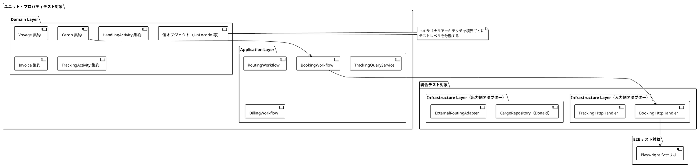
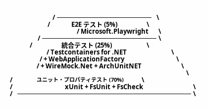
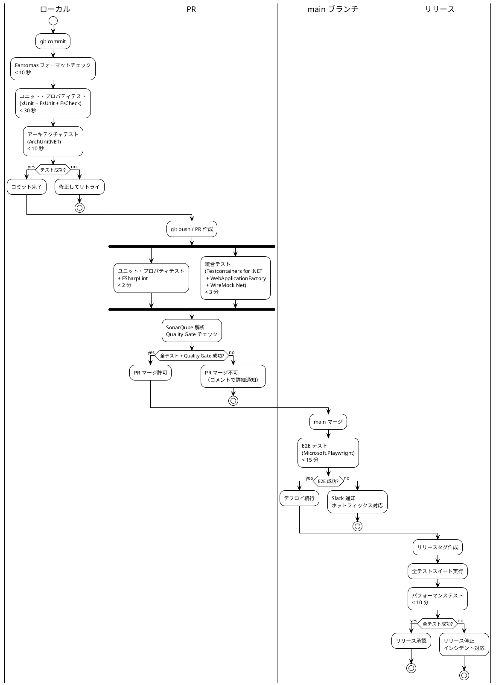
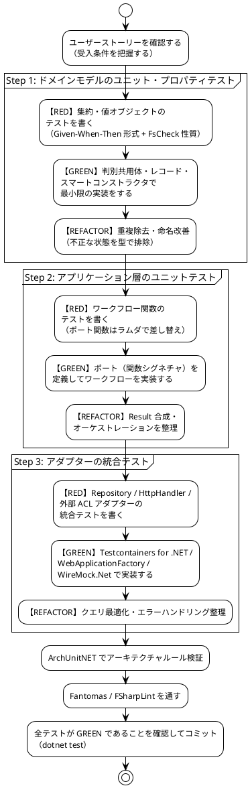

# テスト戦略 - 国際貨物輸送管理システム（F# 版）

## 1. 概要

### 1.1 目的

本ドキュメントは、国際貨物輸送管理システム（F# 9 / .NET 10 版）におけるテスト戦略を定義します。テスト戦略を事前に策定し、以下の問いに常に回答できる状態を維持することを目的とします。

- 「この機能はどのテストレベルで保証されているか」
- 「何をどこまでテストすべきか」
- 「テストが失敗したとき、どこを修正すべきか」

### 1.2 基本方針

- **TDD（テスト駆動開発）を全開発プロセスで適用する**: レッド → グリーン → リファクタリングのサイクルを厳守します
- **型で守れるものは型で守る**: F# の判別共用体・レコード・スマートコンストラクタにより「不正な状態を表現不可能にする」設計を優先し、テストは型で守れない性質（値の検証・計算・遷移）に集中させます
- **テストをアーキテクチャに対応させる**: ヘキサゴナルアーキテクチャの境界（ポート = 関数シグネチャ）を活かし、テスト可能性を設計段階で確保します
- **テストの重複を排除する**: 各テストレベルの責務を明確に分離し、同一ロジックを複数レベルで重複検証しません
- **テストを実行可能なドキュメントとして扱う**: テストコードがシステムの振る舞いを説明します

### 1.3 アーキテクチャとテスト戦略の対応関係



ヘキサゴナルアーキテクチャの各層は以下のテストレベルに対応します。

| アーキテクチャ層 | テストレベル | 理由 |
|---|---|---|
| ドメイン層（集約・値オブジェクト・ドメインサービス） | ユニットテスト + プロパティベーステスト（FsCheck） | 外部依存ゼロ。純粋関数のビジネスロジック |
| アプリケーション層（ワークフロー関数） | ユニットテスト（ポート関数を差し替え） | ポートへの委譲とオーケストレーションを検証 |
| 入力側アダプター（Giraffe HttpHandler） | 統合テスト（WebApplicationFactory） | HTTP マッピングとバリデーションを検証 |
| 出力側アダプター（Repository） | 統合テスト（Testcontainers for .NET） | SQL クエリの正確性を実 DB で検証 |
| 外部 ACL ポート（5 件） | 統合テスト（WireMock.Net） | 外部システムとの契約を検証 |
| ユーザーシナリオ全体 | E2E テスト（Microsoft.Playwright） | クリティカルパスの品質保証 |

---

## 2. テスト形状の選択

### 2.1 採用形状: ピラミッド型



**採用理由**:

- **ドメイン層が厚い**: DDD を採用しており、Cargo・Voyage・HandlingActivity・Invoice の各集約にビジネスロジックが集中します。BookingState の 9 値遷移、荷役妥当性検証（MISROUTED 判定）、法人割引計算など、外部依存なしでテスト可能な純粋関数が多いです
- **ヘキサゴナルアーキテクチャによる高いテスト可能性**: ドメイン層とインフラ層の境界がポート（関数シグネチャ）で分離されており、テスト用関数への差し替えが容易です。ユニットテストが書きやすい設計になっています
- **CQRS による読み取りモデルの分離**: TrackingContext の読み取りクエリはドメインロジックを持たず、統合テストで Repository を直接検証するだけで十分です
- **コスト効率**: ユニットテストは実行が高速（< 30 秒）でメンテナンスコストが低いです。E2E テストはフレイキーになりやすく、最小限にとどめることで CI の安定性を維持します

### 2.2 採用しない形状と理由

| 形状 | 採用しない理由 |
|---|---|
| **ダイヤモンド型**（統合テスト重視） | 本システムは単一モノリス（ヘキサゴナル）で構成されており、マイクロサービス間の契約検証ニーズがありません。統合テストを主軸にするとテスト実行時間が増大し、TDD サイクルが遅くなります |
| **逆ピラミッド型**（E2E 重視） | Playwright テストはヘッドレスブラウザを起動するためフレイキーになりやすく、htmx の 30 秒ポーリングを含む動的 UI はテストの安定性確保が困難です。E2E を主軸にするとフィードバックループが 15 分以上になります |

### 2.3 Moq / FluentAssertions を採用しない理由

C# 版では Moq と FluentAssertions を採用していましたが、F# 版では以下の理由により採用しません。

| C# 版ツール | F# 版での代替 | 理由 |
|---|---|---|
| Moq | **関数の差し替え** | F# ではポートを関数型（例: `TrackingId -> Task<Cargo option>`）で定義するため、テスト時はラムダ式を渡すだけでモックが完成します。モックフレームワークによるプロキシ生成・`Setup`/`Verify` の学習コストが不要です |
| FluentAssertions | **FsUnit（+ Unquote 任意）** | FsUnit の `should equal` はレコード・判別共用体の構造的等価性をそのまま検証できます。F# の値はデフォルトで構造的等価であるため、流暢な API による深い比較支援が不要です |

呼び出し検証（`Verify` 相当）が必要な場合は、`ResizeArray` や `ref` セルに引数を記録する関数を渡すことで実現します。

```fsharp
// ポート関数の差し替え例: Moq 不要
let savedCargos = ResizeArray<Cargo>()

let deps: BookingDeps =
    { FindCargo = fun _ -> Task.FromResult None
      SaveCargo = fun cargo -> savedCargos.Add cargo; Task.FromResult ()
      GenerateTrackingId = fun () -> TrackingId.unsafe "CARGO-001" }
```

---

## 3. テストレベルの定義

### 3.1 ユニットテスト（Unit Test）

#### 責務・検証対象

- **ドメイン層**: 集約の状態遷移・不変条件・ビジネスルール、値オブジェクトのスマートコンストラクタによるバリデーション、ドメインサービスのロジック
- **アプリケーション層**: ワークフロー関数のオーケストレーション（ポート関数はテスト用実装に差し替え）

#### カバレッジ目標

| 対象 | 行カバレッジ | 分岐カバレッジ |
|---|---|---|
| ドメイン層 | **85% 以上** | **80% 以上** |
| アプリケーション層 | **80% 以上** | **75% 以上** |

> **カバレッジゲート（IT2 で整備）**: `node ops/scripts/coverage-gate.cjs` で、全体 80% / ドメイン層（`CargoTracker.*.Domain*`）85% の行カバレッジ閾値を機械判定する（閾値未達で非ゼロ終了）。
> `gulp dev:test:coverage:gate` でテスト収集からゲートまで一括実行できる。Backend CI（`.github/workflows/backend-ci.yml`）でも実行し、閾値の出所は本表とする。

#### 使用ツール

- **xUnit**: テストフレームワーク（`[<Fact>]`, `[<Theory>]`）
- **FsUnit.xUnit**: F# らしいアサーション（`should equal`, `should throw`）
- **FsCheck.Xunit**: プロパティベーステスト（[セクション 4](#4-fscheck-プロパティベーステスト) 参照）

#### 実行タイミング

- **ローカル**: すべてのコミット時（目標 **30 秒以内**）
- **PR**: 自動実行（コミットプッシュ時）
- **CI**: GitHub Actions の `unit-test` ジョブ

#### 除外対象

- インフラ層（Donald のデータアクセス、HTTP クライアント）— 統合テストで担保します
- DTO / 単純なレコード型 — データ保持のみでロジックがありません
- ASP.NET Core ホストの起動 — `WebApplicationFactory` はユニットテストに**使用しません**

#### 実装例: Cargo 集約の BookingState 遷移テスト

F# 版のドメイン操作は例外ではなく `Result` を返す設計とし、成功・失敗をパターンマッチで検証します。

```fsharp
module CargoBookingStateTests

open Xunit
open FsUnit.Xunit
open CargoTracker.Booking.Domain

[<Fact>]
let ``予約が確定できる`` () =
    // Given: ルートが割り当て済みの貨物
    let cargo = CargoFixture.withRouteAssigned ()

    // When: 予約を確定する
    let result = Cargo.confirmBooking cargo

    // Then: ステータスが Confirmed に遷移する
    match result with
    | Ok confirmed -> confirmed.BookingState |> should equal BookingState.Confirmed
    | Error e -> failwith $"予約確定が失敗しました: %A{e}"

[<Fact>]
let ``ルート未割り当て状態で予約確定しようとするとエラーになる`` () =
    // Given: ルートが未割り当ての貨物
    let cargo = CargoFixture.preliminary ()

    // When: 予約を確定する
    let result = Cargo.confirmBooking cargo

    // Then: 不変条件違反エラーが返る
    result |> should equal (Error BookingError.RouteNotAssigned)

[<Fact>]
let ``危険物の取扱不可港にルートを割り当てるとエラーになる`` () =
    // Given: 危険物フラグが立った貨物と危険物取扱不可の港を経由するルート
    let cargo = CargoFixture.hazardous ()
    let prohibitedRoute = RouteFixture.viaHazardousProhibitedPort ()

    // When: ルートを割り当てる
    let result = Cargo.assignRoute prohibitedRoute cargo

    // Then: ドメインルール違反エラーが返る
    match result with
    | Error (BookingError.HazardousCargoRouting _) -> ()
    | other -> failwith $"HazardousCargoRouting エラーを期待しましたが %A{other} でした"

[<Theory>]
[<InlineData("Completed")>]
[<InlineData("Cancelled")>]
[<InlineData("Misrouted")>]
let ``終端状態からの遷移は許可されない`` (terminalStatus: string) =
    // Given: 終端ステータスの貨物
    let status = BookingState.parse terminalStatus |> Result.defaultWith (fun _ -> failwith "fixture 不正")
    let cargo = CargoFixture.withStatus status

    // When: 予約確定を試みる
    let result = Cargo.confirmBooking cargo

    // Then: ステータス遷移が拒否される
    match result with
    | Error (BookingError.InvalidStatusTransition _) -> ()
    | other -> failwith $"InvalidStatusTransition エラーを期待しましたが %A{other} でした"
```

#### 実装例: アプリケーション層ワークフローのテスト（関数差し替え）

```fsharp
module BookingWorkflowTests

open System.Threading.Tasks
open Xunit
open FsUnit.Xunit

[<Fact>]
let ``新規予約ワークフローが貨物を保存して追跡番号を返す`` () =
    task {
        // Given: テスト用ポート関数（Moq 不要）
        let savedCargos = ResizeArray<Cargo>()
        let deps: BookingDeps =
            { SaveCargo = fun cargo -> savedCargos.Add cargo; Task.FromResult ()
              GenerateTrackingId = fun () -> TrackingId.unsafe "CARGO-001" }

        let command =
            { OriginUnLocode = "JPTYO"
              DestinationUnLocode = "DEHAM"
              ArrivalDeadline = DateOnly(2026, 6, 30) }

        // When: ワークフローを実行する
        let! result = BookingWorkflow.bookNewCargo deps command

        // Then: 保存が 1 回行われ、追跡番号が返る
        savedCargos.Count |> should equal 1
        result |> should equal (Ok (TrackingId.unsafe "CARGO-001"))
    }
```

#### データベースを伴うテストの方針

開発環境の実行 DB には SQLite を使用しますが、本番は PostgreSQL 16 であるため、データアクセスの検証は **Testcontainers for .NET による実 PostgreSQL を正** とします（SQLite での動作のみでは本番の挙動を保証しないため、単独ではテストの根拠としません）。加えて、開発環境の SQLite が本番と異なる挙動を示す回帰を CI で検出するため、Repository 統合テストは SQLite（インメモリ / ファイル）でも同一テストスイートを実行します（二方言実行の詳細は [3.2 統合テスト](#32-統合テストintegration-test) を参照）。ユニットテストではリポジトリポート（関数型）をテスト用関数に差し替えます。

#### 時刻・ID 生成の注入（Clock / NewId ポート）

時刻依存のビジネスルールと ID 生成は、`DateTimeOffset.UtcNow` や `Guid.NewGuid()` をドメイン・アプリケーション層で直接呼び出さず、以下の関数注入ポートとして分離します（ドメインモデル設計の Port 一覧参照）。

- `Clock: unit -> DateTimeOffset` — 現在時刻の取得
- `NewId: unit -> Guid` — ID の生成

対象となる時刻依存ルールは次のとおりです。

- Invoice の支払期限（発行日 + 30 日）の算出
- `MarkOverdue` の期限超過判定（期限当日 / 翌日の境界）
- エスカレーション判定の時間境界（48h 閾値に対する 72h / 24h、およびちょうど 48h）

テストでは固定値を返す関数を注入することで、時刻境界と ID を決定的に検証します。

```fsharp
module InvoiceClockInjectionTests

open System
open Xunit
open FsUnit.Xunit

// 固定時刻を返す Clock（テスト用）
let fixedClock (instant: DateTimeOffset) : Clock = fun () -> instant

// 固定 Guid を返す NewId（テスト用）
let fixedNewId (guid: Guid) : NewId = fun () -> guid

[<Fact>]
let ``支払期限は発行日の30日後に設定される`` () =
    // Given: 2026-01-01 00:00:00Z 固定の Clock
    let issuedAt = DateTimeOffset(2026, 1, 1, 0, 0, 0, TimeSpan.Zero)
    let clock = fixedClock issuedAt

    // When: Invoice を発行する
    let invoice = Invoice.issue clock (Money.ofJpy 100_000m)

    // Then: 支払期限は 30 日後
    invoice.DueDate |> should equal (issuedAt.AddDays 30.0)

[<Theory>]
[<InlineData(30, false)>] // 期限当日はまだ延滞ではない
[<InlineData(31, true)>]  // 期限翌日から延滞
let ``MarkOverdueは支払期限を過ぎた場合のみ延滞に遷移する`` (elapsedDays: int) (expectOverdue: bool) =
    // Given: 発行から elapsedDays 日経過した時点の Clock
    let issuedAt = DateTimeOffset(2026, 1, 1, 0, 0, 0, TimeSpan.Zero)
    let invoice = Invoice.issue (fixedClock issuedAt) (Money.ofJpy 100_000m)
    let now = fixedClock (issuedAt.AddDays(float elapsedDays))

    // When: 延滞判定を実行する
    let result = Invoice.markOverdue now invoice

    // Then: 期限超過時のみ Overdue に遷移する
    (result.Status = InvoiceStatus.Overdue) |> should equal expectOverdue

[<Fact>]
let ``NewIdを固定すると発行されるIDが決定的になる`` () =
    // Given: 固定 Guid を返す NewId
    let guid = Guid.Parse "00000000-0000-0000-0000-000000000001"
    let deps = { defaultDeps with NewId = fixedNewId guid }

    // When: ID を採番する
    let id = InvoiceId.generate deps.NewId

    // Then: 固定値から生成された ID になる
    InvoiceId.value id |> should equal (guid.ToString "N")
```

エスカレーション判定（48h / 72h / 24h 境界）も同様に、イベント発生時刻と `Clock` の差分で判定する設計とし、`fixedClock` で境界値（47h59m / 48h00m / 48h01m）を Theory で網羅します。E2E・統合テストでは実時刻（`fun () -> DateTimeOffset.UtcNow`）を注入します。

---

### 3.2 統合テスト（Integration Test）

#### 責務・検証対象

- **Repository（Donald）**: 手書き SQL の正確性、トランザクション、楽観的ロック
- **HttpHandler（WebApplicationFactory）**: HTTP リクエスト/レスポンスのマッピング、バリデーション、エラーハンドリング
- **外部 ACL ポート（WireMock.Net）**: 外部システムとの契約遵守、タイムアウト・フォールバック

#### SQLite / PostgreSQL 二方言テスト方針

開発環境（SQLite）と本番（PostgreSQL 16）の二方言構成（data-model.md「SQL 方言方針」参照）によるテストギャップを防ぐため、以下の方針を採用します。

- **PostgreSQL（Testcontainers）を正とする**: Repository 統合テストの合否判定・カバレッジ計測は Testcontainers PostgreSQL での実行結果を基準とします
- **同一テストスイートを SQLite でも実行する**: `[<Theory>]` またはコレクションフィクスチャのパラメータ化により、同一の Repository テストスイートを SQLite（インメモリ / ファイル）でも実行します。これにより、両方言で共通の SQL（ANSI 標準の範囲）が同一挙動を示すことを CI で継続的に検証します
- **方言差の回帰を検出する**: 特に以下の方言差に起因する回帰を検出対象とします
  - 採番順（`BIGSERIAL` と `INTEGER PRIMARY KEY AUTOINCREMENT` の採番挙動）
  - 日時精度（PostgreSQL `timestamptz` のマイクロ秒精度と SQLite の文字列格納精度）
  - 型の緩さ（SQLite の動的型付けによる暗黙変換）
  - NULL のソート順（`ORDER BY` における NULL の先頭 / 末尾の違い）

**テスト対象外とする基準**: 両方言で挙動が異なることが仕様上許容される箇所（例: エラーメッセージの文言、実行計画依存の性能特性、DB 固有のロック粒度）は二方言共通スイートの検証対象外とし、PostgreSQL 側のテストでのみ検証します。対象外とした項目はテストコードのコメントに理由を明記します。

#### カバレッジ目標

| 対象 | 行カバレッジ |
|---|---|
| Repository（インフラ層） | **75% 以上** |
| HttpHandler 層 | **70% 以上** |

#### 使用ツール

- **xUnit + FsUnit.xUnit**: テストフレームワークとアサーション
- **Testcontainers for .NET（`Testcontainers.PostgreSql`）**: 実 PostgreSQL 16 コンテナを自動起動
- **Microsoft.AspNetCore.Mvc.Testing（WebApplicationFactory）**: Giraffe パイプラインの結合テスト（インメモリ TestServer を起動）
- **WireMock.Net**: 外部 ACL ポートのスタブ（5 件すべてを対象）

#### 実行タイミング

- **PR 時**: GitHub Actions の `integration-test` ジョブ（目標 **5 分以内**）
- **ローカル**: Docker が起動している環境で任意実行

#### 実装例: CargoRepository の保存・検索テスト（Testcontainers for .NET + Donald）

```fsharp
module CargoRepositoryIntegrationTests

open System.Threading.Tasks
open Xunit
open FsUnit.Xunit
open Testcontainers.PostgreSql
open DbUp
open Npgsql

type CargoRepositoryFixture() =
    let postgres = PostgreSqlBuilder().WithImage("postgres:16-alpine").Build()

    member val DataSource: NpgsqlDataSource = Unchecked.defaultof<_> with get, set

    interface IAsyncLifetime with
        member this.InitializeAsync() =
            task {
                do! postgres.StartAsync()

                // DbUp でマイグレーションスクリプトを適用する
                let upgrader =
                    DeployChanges.To
                        .PostgresqlDatabase(postgres.GetConnectionString())
                        .WithScriptsEmbeddedInAssembly(typeof<InfrastructureMarker>.Assembly)
                        .Build()
                upgrader.PerformUpgrade().Successful |> should equal true

                this.DataSource <- NpgsqlDataSource.Create(postgres.GetConnectionString())
            }
        member _.DisposeAsync() = postgres.DisposeAsync().AsTask()

type CargoRepositoryIntegrationTests(fixture: CargoRepositoryFixture) =
    interface IClassFixture<CargoRepositoryFixture>

    [<Fact>]
    member _.``貨物を保存して追跡番号で検索できる`` () =
        task {
            // Given: 新規貨物エンティティ
            let cargo =
                CargoFixture.newBooking
                    (TrackingId.unsafe "CARGO-001")
                    (UnLocode.unsafe "JPTYO")
                    (UnLocode.unsafe "DEHAM")

            // When: 保存して検索する
            do! CargoRepository.save fixture.DataSource cargo
            let! found = CargoRepository.findByTrackingId fixture.DataSource (TrackingId.unsafe "CARGO-001")

            // Then: 保存したエンティティと一致する
            match found with
            | Some c ->
                c.Origin |> should equal (UnLocode.unsafe "JPTYO")
                c.Destination |> should equal (UnLocode.unsafe "DEHAM")
            | None -> failwith "貨物が見つかりませんでした"
        }

    [<Fact>]
    member _.``存在しない追跡番号で検索するとNoneを返す`` () =
        task {
            // Given & When
            let! result = CargoRepository.findByTrackingId fixture.DataSource (TrackingId.unsafe "NONEXISTENT")

            // Then
            result |> should equal None
        }
```

#### 実装例: 楽観的ロックの並行競合テスト（Testcontainers PostgreSQL）

`version` 列による楽観的ロック（data-model.md「楽観的ロック」・ADR-0001 参照）は、実 PostgreSQL 上で 2 つの独立した接続・トランザクションから同一集約を更新し、後発の UPDATE が `WHERE version = @expected_version` で 0 行更新となって `Error ConcurrencyError.VersionConflict` を返すことを検証します。

```fsharp
type CargoOptimisticLockTests(fixture: CargoRepositoryFixture) =
    interface IClassFixture<CargoRepositoryFixture>

    [<Fact>]
    member _.``同一貨物への並行更新は後発がVersionConflictになる`` () =
        task {
            // Given: version = 0 の貨物を保存し、2 つの接続から同じスナップショットを読み込む
            let trackingNumber = TrackingId.unsafe "CARGO-LOCK-001"
            do! CargoRepository.save fixture.DataSource (CargoFixture.withTrackingId trackingNumber)

            // 独立した 2 接続（= 2 トランザクション）が同一 version を観測する
            let! cargoA = CargoRepository.findByTrackingId fixture.DataSource trackingNumber
            let! cargoB = CargoRepository.findByTrackingId fixture.DataSource trackingNumber
            let cargoA = cargoA |> Option.defaultWith (fun () -> failwith "fixture 不正")
            let cargoB = cargoB |> Option.defaultWith (fun () -> failwith "fixture 不正")

            // When: 先発（A）が更新に成功し version がインクリメントされる
            let! resultA = CargoRepository.update fixture.DataSource (Cargo.confirmBookingUnsafe cargoA)

            // 後発（B）は古い version（0）を expected_version として更新を試みる
            let! resultB = CargoRepository.update fixture.DataSource (Cargo.confirmBookingUnsafe cargoB)

            // Then: 先発は成功、後発は WHERE version = @expected_version が 0 行更新となり競合エラー
            resultA |> should equal (Ok ())
            resultB |> should equal (Error ConcurrencyError.VersionConflict)

            // 永続化された version は 1 回分だけ増分されている（ロストアップデートなし）
            let! reloaded = CargoRepository.findByTrackingId fixture.DataSource trackingNumber
            (reloaded |> Option.get).Version |> should equal 1L
        }

    [<Fact>]
    member _.``子テーブル（leg）の更新でも集約ルートのversionが増分される`` () =
        task {
            // Given: Itinerary（leg 子テーブル）を持つ貨物
            let trackingNumber = TrackingId.unsafe "CARGO-LOCK-002"
            do! CargoRepository.save fixture.DataSource (CargoFixture.withRouteAndTrackingId trackingNumber)
            let! before = CargoRepository.findByTrackingId fixture.DataSource trackingNumber

            // When: 集約ルート経由で leg を差し替える（ADR-0001: 子テーブルは集約ルート経由でのみ更新）
            let updated = Cargo.assignRouteUnsafe (RouteFixture.alternative ()) (Option.get before)
            let! result = CargoRepository.update fixture.DataSource updated

            // Then: 子テーブルのみの変更でも親（cargo）の version が増分され、並行競合の検出対象になる
            result |> should equal (Ok ())
            let! after = CargoRepository.findByTrackingId fixture.DataSource trackingNumber
            (after |> Option.get).Version |> should equal ((before |> Option.get).Version + 1L)
        }
```

このテストは方言差（`UPDATE ... WHERE version = ...` の更新件数取得）の回帰検出対象でもあるため、二方言共通スイート（前述）に含めて SQLite でも実行します。

#### 実装例: Booking HttpHandler の WebApplicationFactory テスト

Giraffe では Controller の代わりに `HttpHandler` を合成します。テストではアプリケーションサービス（ポート関数のレコード）を DI コンテナ上でテスト用実装に差し替えます。

```fsharp
module BookingHandlerTests

open System.Net
open System.Net.Http.Json
open System.Text.Json
open System.Threading.Tasks
open Microsoft.AspNetCore.Mvc.Testing
open Microsoft.Extensions.DependencyInjection
open Xunit
open FsUnit.Xunit

type BookingHandlerTests(factory: WebApplicationFactory<Program>) =
    interface IClassFixture<WebApplicationFactory<Program>>

    // テスト用のブッキングサービス実装（Moq 不要）
    let stubBookingService: IBookingApplicationService =
        { new IBookingApplicationService with
            member _.BookNewCargo _ =
                Task.FromResult(Ok(TrackingId.unsafe "CARGO-001")) }

    let client =
        factory
            .WithWebHostBuilder(fun builder ->
                builder.ConfigureServices(fun services ->
                    services.AddSingleton<IBookingApplicationService>(stubBookingService)
                    |> ignore))
            .CreateClient()

    [<Fact>]
    member _.``貨物予約登録APIが201を返す`` () =
        task {
            // Given: 予約登録リクエスト
            let request =
                {| originUnLocode = "JPTYO"
                   destinationUnLocode = "DEHAM"
                   arrivalDeadline = "2026-06-30" |}

            // When
            let! response = client.PostAsJsonAsync("/api/bookings", request)

            // Then
            response.StatusCode |> should equal HttpStatusCode.Created
            let! body = response.Content.ReadFromJsonAsync<JsonElement>()
            body.GetProperty("trackingNumber").GetString() |> should equal "CARGO-001"
        }

    [<Fact>]
    member _.``出発地コードが不正な場合は400を返す`` () =
        task {
            // Given: 不正な UN/LOCODE を含むリクエスト
            let invalidRequest =
                {| originUnLocode = "INVALID"
                   destinationUnLocode = "DEHAM"
                   arrivalDeadline = "2026-06-30" |}

            // When
            let! response = client.PostAsJsonAsync("/api/bookings", invalidRequest)

            // Then
            response.StatusCode |> should equal HttpStatusCode.BadRequest
            let! body = response.Content.ReadFromJsonAsync<JsonElement>()
            body.GetProperty("errors").[0].GetProperty("field").GetString()
            |> should equal "originUnLocode"
        }
```

#### WireMock.Net 契約テストの概要

各 ACL ポートに対して WireMock.Net スタブを定義します。詳細は [セクション 5](#5-wiremocknet-契約テストシナリオacl-ポート別) を参照してください。

---

### 3.3 アーキテクチャテスト（Architecture Test）

#### 責務・検証対象

ヘキサゴナルアーキテクチャの依存関係ルールをコードレベルで自動検証します。アーキテクチャの腐敗（依存関係の逆転・Bounded Context 間の直接参照）を CI で検出します。ArchUnitNET は IL レベルでアセンブリを解析するため、**F# アセンブリにもそのまま適用可能**です（F# のモジュールは静的クラスとしてコンパイルされるため、名前空間ベースのルールが機能します）。

#### 使用ツール

- **ArchUnitNET（`TngTech.ArchUnitNET.xUnit`）**: .NET アセンブリの名前空間依存関係を宣言的に検証

#### 実行タイミング

- **PR 時**: GitHub Actions の `unit-test` ジョブに統合（ユニットテストと同時実行）
- **ローカル**: `dotnet test` で自動実行

#### 検証ルール 4 件

```fsharp
module HexagonalArchitectureTests

open Xunit
open ArchUnitNET.Domain
open ArchUnitNET.Loader
open ArchUnitNET.Fluent
open ArchUnitNET.xUnit
open type ArchUnitNET.Fluent.ArchRuleDefinition

let architecture =
    ArchLoader()
        .LoadAssemblies(
            typeof<Cargo>.Assembly,           // Domain
            typeof<BookingDeps>.Assembly,     // Application
            typeof<InfrastructureMarker>.Assembly) // Infrastructure
        .Build()

let domainLayer =
    Types().That().ResideInNamespace("CargoTracker.*.Domain", true).As("ドメイン層")

let applicationLayer =
    Types().That().ResideInNamespace("CargoTracker.*.Application", true).As("アプリケーション層")

let infrastructureLayer =
    Types().That().ResideInNamespace("CargoTracker.*.Infrastructure", true).As("インフラ層")

// ルール 1: Domain 名前空間が Infrastructure 名前空間に依存しない
[<Fact>]
let ``ドメイン層はインフラ層に依存しない`` () =
    Types().That().Are(domainLayer)
        .Should().NotDependOnAny(infrastructureLayer)
        .Because("ドメイン層はインフラ層を直接参照してはならない。"
                 + "依存方向は Infrastructure → Domain でなければならない")
        .Check(architecture)

// ルール 2: Domain 名前空間で Giraffe / Donald / Npgsql の型を使用しない
[<Fact>]
let ``ドメイン層はフレームワークに依存しない`` () =
    Types().That().Are(domainLayer)
        .Should().NotDependOnAny(
            Types().That().ResideInNamespace("Giraffe", true)
                .Or().ResideInNamespace("Donald", true)
                .Or().ResideInNamespace("Npgsql", true))
        .Because("ドメイン層はフレームワークに依存してはならない。"
                 + "ドメイン型は純粋な F# のレコード・判別共用体でなければならない")
        .Check(architecture)

// ルール 3: アプリケーション層がインフラ層を直接参照しない（Port 経由のみ許可）
[<Fact>]
let ``アプリケーション層はインフラ層に直接依存しない`` () =
    Types().That().Are(applicationLayer)
        .Should().NotDependOnAny(infrastructureLayer)
        .Because("アプリケーション層はポート（関数シグネチャ）経由でのみ"
                 + "インフラ層と通信しなければならない")
        .Check(architecture)

// ルール 4: 異なる Bounded Context 間でクラスを直接参照しない
[<Fact>]
let ``BoundedContext間で直接参照しない`` () =
    // Shared 名前空間（共有カーネル）への参照は許可する
    SliceRuleDefinition.Slices()
        .Matching("CargoTracker.(*)")
        .Should().NotDependOnEachOther()
        .Because("Bounded Context 間の通信はドメインイベントまたは"
                 + "ACL（Anti-Corruption Layer）経由でなければならない。"
                 + "Shared 名前空間（共有カーネル）への参照は許可する")
        .Check(architecture)
```

---

### 3.4 E2E テスト（End-to-End Test）

#### 責務・検証対象

クリティカルなユーザーシナリオをブラウザレベルで検証します。ドメインロジックの再検証は行わず、ユーザー体験の観点からシステム全体（Giraffe.ViewEngine による HTML + htmx）が協調動作することを確認します。

**優先シナリオ（US13・US15・US18）**:

| シナリオ | 理由 |
|---|---|
| US13: 予約を確定する | 予約フローの最終ステップ。複数コンテキストが連携する |
| US15: 荷役作業を記録する | 最も頻繁に実行される運用操作 |
| US18: 追跡情報を照会する | 顧客向け重要機能。htmx ポーリングを含む |

#### カバレッジ範囲

- E2E テストは**クリティカルパス 3 シナリオに限定**します: 予約登録 → 経路 → 確定（US13）、荷役記録（US15）、公開追跡（US18）
- ユーザーストーリーの受入確認は統合テスト層（HttpHandler + Repository + WireMock.Net）が担います。E2E にストーリー網羅率の目標は設定せず、テストピラミッドの E2E 5% と整合させます

#### 使用ツール

- **Microsoft.Playwright（.NET 版 Playwright）**: ブラウザ自動化（F# から利用）
- **htmx 対応**: `WaitForFunctionAsync` によるポーリング更新の待機

#### 実行タイミング

- **main ブランチマージ後**: GitHub Actions の `e2e-test` ジョブ（目標 **15 分以内**）
- **リリース前**: 全 E2E シナリオを実行

#### htmx 30 秒ポーリングへの対応

htmx の `hx-trigger="every 30s"` による自動更新を Playwright で決定的にテストするため、以下の 2 点を徹底します。

- **状態変更の明示注入**: Arrange でテスト用 API（またはテスト用シード）から荷役イベントを明示的に注入し、「いつの間にか状態が変わっている」ことに依存しません。検証も「初期値と異なる」ではなく、注入した変更が導く**期待状態そのもの**をアサートします
- **ポーリング間隔の短縮**: テスト環境の設定でポーリング間隔を 30 秒から 1 秒に短縮し（設定値 `Polling:IntervalSeconds`）、待機タイムアウト内に確実に更新が到達するようにします

DOM 更新の待機には Playwright の自動リトライ付きアサーション（`Expect(...).ToHaveTextAsync`）を優先し、補助的に `WaitForFunctionAsync` でポーリング完了を検出できます。

```fsharp
// htmx ポーリング完了を待機するユーティリティ
let waitForHtmxUpdate (page: IPage) (selector: string) (timeout: float32) =
    // htmx が更新中の要素に hx-request 属性が付与されるため、
    // その変化を監視してポーリング完了を検出する
    page.WaitForFunctionAsync(
        """(sel) => {
            const el = document.querySelector(sel);
            return el && !el.hasAttribute('hx-request');
        }""",
        selector,
        PageWaitForFunctionOptions(Timeout = timeout))
```

#### 実装例: US18 追跡情報照会の Playwright テスト（F#）

```fsharp
module Us18TrackingQueryTests

open Microsoft.Playwright
open Microsoft.Playwright.Xunit
open Xunit
open FsUnit.Xunit

[<Collection("E2E")>]
type Us18TrackingQueryTests() =
    inherit PageTest()

    [<Fact>]
    member this.``追跡番号で貨物の現在状態を照会できる`` () =
        task {
            // Given: 荷役作業が記録済みの貨物が存在する
            let! _ = this.Page.GotoAsync("/tracking")

            // When: 追跡番号を入力して検索する
            do! this.Page.FillAsync("[data-testid='tracking-id-input']", "CARGO-001")
            do! this.Page.ClickAsync("[data-testid='search-button']")

            // Then: 追跡情報が表示される
            do! this.Expect(this.Page.Locator("[data-testid='transport-status']"))
                    .ToHaveTextAsync("IN_PORT", LocatorAssertionsToHaveTextOptions(Timeout = 10000f))
            do! this.Expect(this.Page.Locator("[data-testid='current-location']"))
                    .ToContainTextAsync("東京港")
        }

    [<Fact>]
    member this.``htmxポーリングで追跡情報が自動更新される`` () =
        task {
            // Given: IN_PORT 状態の貨物の追跡ページを表示している
            // （テスト設定でポーリング間隔を 1 秒に短縮: Polling:IntervalSeconds = 1）
            let! _ = this.Page.GotoAsync("/tracking/CARGO-001")
            do! this.Expect(this.Page.Locator("[data-testid='transport-status']"))
                    .ToHaveTextAsync("IN_PORT")

            // When: バックエンドに荷役イベント（LOAD @ JPTYO）を明示的に注入して状態を変更する
            do! TestDataApi.recordHandlingEvent
                    { TrackingId = "CARGO-001"
                      HandlingType = "LOAD"
                      Location = "JPTYO" }

            // Then: ページを再読み込みせずに、ポーリングで期待状態が反映される
            // （初期状態との差分ではなく、注入した状態変更の結果を明示的に検証する）
            do! this.Expect(this.Page.Locator("[data-testid='transport-status']"))
                    .ToHaveTextAsync("ONBOARD_CARRIER", LocatorAssertionsToHaveTextOptions(Timeout = 10000f))
        }

    [<Fact>]
    member this.``存在しない追跡番号を入力するとエラーメッセージが表示される`` () =
        task {
            // Given
            let! _ = this.Page.GotoAsync("/tracking")

            // When
            do! this.Page.FillAsync("[data-testid='tracking-id-input']", "NONEXISTENT-999")
            do! this.Page.ClickAsync("[data-testid='search-button']")

            // Then
            do! this.Expect(this.Page.Locator("[data-testid='error-message']"))
                    .ToContainTextAsync("追跡番号が見つかりません")
        }
```

### 3.5 テストデータ生成（Fixture 戦略）

テストデータの生成は **Object Mother パターン** をモジュール関数として実装し、全テストレベルで共通利用します。本ドキュメントの実装例で使用している `CargoFixture` / `RouteFixture` がこの Object Mother に相当します（命名は `〜Fixture` モジュールで統一。`CargoMother` のような別名は導入しません）。

#### 方針

- **代表的な状態ごとに命名された生成関数を提供する** — `CargoFixture.preliminary ()`（ルート未割り当て）、`CargoFixture.withRouteAssigned ()`、`CargoFixture.hazardous ()`、`ShipperFixture.corporate ()`（法人顧客）のように、テストの Given を関数名で表現します
- **ビルダークラスは導入しない** — F# ではレコードの `with` 式で任意フィールドを差し替えられるため、C# 流のビルダークラスよりも「Mother 関数 + `with` 式」の組み合わせが簡潔で型安全です
- **Fixture はテストプロジェクト内の共有モジュールに配置する** — Bounded Context ごとに `Tests/Fixtures/` に集約し、重複した組み立てコードの散在を防ぎます
- **ランダム生成は FsCheck に委ねる** — Fixture は決定的な代表値を返し、網羅的な入力生成は [4. FsCheck プロパティベーステスト](#4-fscheck-プロパティベーステスト) の Arbitrary と役割を分担します

#### 実装例: CargoFixture（Object Mother + `with` 式）

```fsharp
module CargoFixture

open CargoTracker.Booking.Domain

/// ルート未割り当ての初期状態の貨物
let preliminary () =
    { TrackingId = TrackingId.unsafe "CARGO-001"
      Origin = UnLocode.unsafe "JPTYO"
      Destination = UnLocode.unsafe "USNYC"
      BookingState = BookingState.Preliminary
      IsHazardous = false
      Route = None }

/// ルート割り当て済みの貨物（with 式で差分だけ表現する）
let withRouteAssigned () =
    { preliminary () with
        BookingState = BookingState.RouteAssigned
        Route = Some (RouteFixture.tokyoToNewYork ()) }

/// 任意の BookingState を持つ貨物
let withStatus status =
    { preliminary () with BookingState = status }
```

基準となる状態を Mother 関数で 1 か所に定義し、バリエーションは `with` 式による差分で表現することで、ドメインモデルにフィールドが追加された際の修正箇所を Fixture モジュールに局所化できます。

---

## 4. FsCheck プロパティベーステスト

### 4.1 目的と位置づけ

FsCheck によるプロパティベーステストは、example ベースのユニットテストを補完し、「あらゆる入力に対して成り立つ性質」を数百の生成データで検証します。F# 版では以下の 2 つを主対象とします。

1. **値オブジェクトのスマートコンストラクタ**: 「不正な入力は必ず `Error`、正当な入力は必ず `Ok`」「作成された値は必ず不変条件を満たす」というラウンドトリップ性質
2. **集約の不変条件**: 任意の操作列を適用しても集約の不変条件が破れないこと

| 対象 | 検証する性質の例 |
|---|---|
| TrackingId | 正規形式の文字列は `Ok`、空・不正文字は `Error`。`value >> create` のラウンドトリップ |
| UnLocode | 大文字 5 文字（国 2 + 地名 3）のみ `Ok`。作成後の値は常に正規形式。5 文字でも小文字・数字を含む場合は必ず `Error` |
| RouteSpecification | 出発地 ≠ 目的地が常に成立。期限は常に未来日付 |
| Itinerary | レグは常に連結している（前レグの荷降港 = 次レグの荷積港）。満足判定はルート仕様と整合 |
| Delivery | どの荷役イベント列から導出しても LastEvent と TransportStatus（定義済み 9 値）が整合する。イベントが空でなければ NotReceived に戻らない |
| Invoice | 割引・税計算で金額が負にならない。合計 = 割引後金額 + 税額 |

### 4.2 使用ツール

- **FsCheck.Xunit**: `[<Property>]` 属性で xUnit に統合
- **カスタム Arbitrary**: ドメイン固有の生成器（有効な UnLocode、荷役イベント列など）を `Arb.fromGen` で定義

### 4.3 実装例: 値オブジェクトのスマートコンストラクタ

```fsharp
module TrackingIdPropertyTests

open FsCheck
open FsCheck.FSharp
open FsCheck.Xunit
open CargoTracker.Shared.Domain

// 有効な TrackingId 文字列の生成器（例: "CARGO-" + 数字 3〜6 桁）
let validTrackingIdGen =
    Gen.choose (100, 999999)
    |> Gen.map (fun n -> $"CARGO-%d{n}")

type TrackingIdArbitraries =
    static member ValidTrackingId() = Arb.fromGen validTrackingIdGen

[<Property(Arbitrary = [| typeof<TrackingIdArbitraries> |])>]
let ``正当な形式の文字列からは必ず TrackingId が作成できる`` (raw: string) =
    match TrackingId.create raw with
    | Ok _ -> true
    | Error _ -> false

[<Property>]
let ``TrackingId のラウンドトリップ: value して create すると同じ値に戻る`` () =
    Prop.forAll (Arb.fromGen validTrackingIdGen) (fun raw ->
        match TrackingId.create raw with
        | Ok id -> TrackingId.create (TrackingId.value id) = Ok id
        | Error _ -> false)

[<Property>]
let ``空白のみ・空文字からは TrackingId を作成できない`` (NonNegativeInt n) =
    let raw = String.replicate n " "
    TrackingId.create raw |> Result.isError
```

```fsharp
module UnLocodePropertyTests

open FsCheck
open FsCheck.FSharp
open FsCheck.Xunit

let upperLetterGen = Gen.choose (int 'A', int 'Z') |> Gen.map char

// 有効な UN/LOCODE（国コード 2 文字 + 地名コード 3 文字）の生成器
let validUnLocodeGen =
    Gen.arrayOfLength 5 upperLetterGen
    |> Gen.map System.String

[<Property>]
let ``有効な UN/LOCODE は必ず作成でき、値は常に大文字 5 文字である`` () =
    Prop.forAll (Arb.fromGen validUnLocodeGen) (fun raw ->
        match UnLocode.create raw with
        | Ok loc ->
            let v = UnLocode.value loc
            v.Length = 5 && v = v.ToUpperInvariant()
        | Error _ -> false)

[<Property>]
let ``5 文字以外の文字列からは UnLocode を作成できない`` (s: string) =
    (isNull s || s.Length <> 5) ==> lazy (UnLocode.create s |> Result.isError)

// 長さ 5 は満たすが、小文字または数字を 1 文字以上含む文字列の生成器
let invalidChar5Gen =
    gen {
        let! badChar =
            Gen.oneof
                [ Gen.choose (int 'a', int 'z') |> Gen.map char   // 小文字
                  Gen.choose (int '0', int '9') |> Gen.map char ] // 数字
        let! badIndex = Gen.choose (0, 4)
        let! chars = Gen.arrayOfLength 5 upperLetterGen
        chars.[badIndex] <- badChar
        return System.String chars
    }

[<Property>]
let ``5 文字でも小文字や数字を含む文字列からは必ず UnLocode を作成できない`` () =
    // 「長さ 5 なら Ok」という誤実装（大文字英字チェック漏れ）を反例として検出する負のプロパティ
    Prop.forAll (Arb.fromGen invalidChar5Gen) (fun raw ->
        UnLocode.create raw |> Result.isError)
```

### 4.4 実装例: 集約・値オブジェクトの不変条件

```fsharp
module ItineraryPropertyTests

open FsCheck
open FsCheck.FSharp
open FsCheck.Xunit

// 連結したレグ列を生成する（前レグの荷降港 = 次レグの荷積港）
let connectedLegsGen: Gen<Leg list> =
    gen {
        let! locations = Gen.listOfLength 4 validUnLocodeGen |> Gen.map (List.map UnLocode.unsafe)
        let! baseDate = Gen.choose (0, 365) |> Gen.map (fun d -> DateOnly(2026, 1, 1).AddDays d)
        return
            locations
            |> List.pairwise
            |> List.mapi (fun i (from, to') ->
                { VoyageNumber = VoyageNumber.unsafe $"V%03d{i}"
                  LoadLocation = from
                  UnloadLocation = to'
                  LoadDate = baseDate.AddDays(i * 7)
                  UnloadDate = baseDate.AddDays(i * 7 + 5) })
    }

[<Property>]
let ``Itinerary のレグは常に連結している`` () =
    Prop.forAll (Arb.fromGen connectedLegsGen) (fun legs ->
        match Itinerary.create legs with
        | Ok itinerary ->
            Itinerary.legs itinerary
            |> List.pairwise
            |> List.forall (fun (prev, next) -> prev.UnloadLocation = next.LoadLocation)
        | Error _ -> false)

[<Property>]
let ``Itinerary の出発地と最終目的地はレグ列の端点と一致する`` () =
    Prop.forAll (Arb.fromGen connectedLegsGen) (fun legs ->
        match Itinerary.create legs with
        | Ok itinerary ->
            Itinerary.initialDepartureLocation itinerary = (List.head legs).LoadLocation
            && Itinerary.finalArrivalLocation itinerary = (List.last legs).UnloadLocation
        | Error _ -> false)
```

```fsharp
module DeliveryPropertyTests

open FsCheck.FSharp
open FsCheck.Xunit

let handlingEventGen: Gen<HandlingEvent> = (* LOAD/UNLOAD/RECEIVE/CLAIM/CUSTOMS を生成 *) ...

// TransportStatus は定義済み 9 値（NotReceived / Received / Loaded / OnboardCarrier /
// Unloaded / AwaitingClaim / Claimed / InException / Unknown）の判別共用体であり、
// 「いずれかの値である」ことはコンパイラが保証する（恒真であり性質として無意味）。
// 検証すべきは「LastEvent と TransportStatus の導出が整合する」という破れうる性質である。

[<Property>]
let ``Delivery の TransportStatus は LastEvent と整合する`` () =
    Prop.forAll (Arb.fromGen (Gen.listOf handlingEventGen)) (fun events ->
        let delivery = Delivery.derivedFrom routeSpec itinerary events
        match delivery.LastEvent, delivery.TransportStatus with
        // 荷役イベントが 1 件もなければ必ず NotReceived
        | None, status -> status = TransportStatus.NotReceived
        // 最終イベント種別と導出ステータスの対応（導出ロジックのバグはここで反例として検出される）
        | Some e, status ->
            match e.HandlingType with
            | HandlingType.Receive -> status = TransportStatus.Received
            | HandlingType.Load -> status = TransportStatus.Loaded || status = TransportStatus.OnboardCarrier
            | HandlingType.Unload ->
                status = TransportStatus.Unloaded || status = TransportStatus.AwaitingClaim
            | HandlingType.Claim -> status = TransportStatus.Claimed
            | HandlingType.Customs -> status <> TransportStatus.NotReceived)

[<Property>]
let ``荷役イベントが空でない限り TransportStatus は NotReceived に戻らない`` () =
    Prop.forAll (Arb.fromGen (Gen.nonEmptyListOf handlingEventGen)) (fun events ->
        let delivery = Delivery.derivedFrom routeSpec itinerary events
        delivery.TransportStatus <> TransportStatus.NotReceived)

[<Property>]
let ``RouteSpecification は出発地と目的地が同一なら必ず作成に失敗する`` () =
    Prop.forAll (Arb.fromGen validUnLocodeGen) (fun raw ->
        let loc = UnLocode.unsafe raw
        RouteSpecification.create loc loc (DateOnly(2026, 12, 31)) |> Result.isError)
```

### 4.5 運用ルール

- プロパティテストはユニットテストと同じ `unit-test` ジョブで実行します（1 プロパティあたりデフォルト 100 ケース）
- 反例が見つかった場合は、FsCheck が出力する縮小済み反例（shrunk counterexample）を **example ベースの回帰テストとして追加**してから修正します
- 実行時間が問題になる場合のみ `MaxTest` を調整します（下限 50）

---

## 5. WireMock.Net 契約テストシナリオ（ACL ポート別）

各外部 ACL ポートに対して正常・異常シナリオを定義し、WireMock.Net でスタブ化します。F# 版のポートは関数シグネチャ（またはポート関数のレコード）として定義しますが、契約テストではアダプター実装を実 HTTP スタブに向けて検証します。

### 5.1 シナリオ一覧

| ポート | 正常シナリオ | 異常シナリオ |
|---|---|---|
| ExternalRoutingServicePort | ルート検索 → 3 候補返却 | 接続タイムアウト → 過去実績データにフォールバック |
| CustomsClearancePort | 通関申請 → CLEARED | HELD ステータス → 例外イベント発行 |
| PaymentGatewayPort | 支払い処理 → CONFIRMED | 決済失敗 → OVERDUE 状態遷移 |
| PortManagementPort | 港湾入港通知 → 受理 | 港湾満杯 → 代替港提案 |
| NotificationPort | メール通知送信 → 202 Accepted | 通知失敗 → ログ記録（非クリティカル） |

### 5.2 WireMock.Net 実装例

#### ExternalRoutingServicePort: ルート検索（正常・タイムアウト）

```fsharp
module ExternalRoutingServiceAdapterTests

open System
open System.Net.Http
open Xunit
open FsUnit.Xunit
open WireMock.Server
open WireMock.RequestBuilders
open WireMock.ResponseBuilders
open WireMock.Matchers

type ExternalRoutingServiceAdapterTests() =
    let server = WireMockServer.Start()

    let searchRoutes =
        ExternalRoutingAdapter.searchRoutes
            (new HttpClient(BaseAddress = Uri(server.Urls.[0]), Timeout = TimeSpan.FromSeconds 5.0))
            HistoricalRouteFallback.provide

    interface IDisposable with
        member _.Dispose() = server.Stop()

    [<Fact>]
    member _.``ルート検索で3候補が返却される`` () =
        task {
            // Given: WireMock.Net スタブ定義（3 候補を返す）
            server
                .Given(
                    Request.Create()
                        .WithPath("/api/routes/search")
                        .UsingPost()
                        .WithBody(JsonPathMatcher("$[?(@.origin == 'JPTYO')]")))
                .RespondWith(
                    Response.Create()
                        .WithStatusCode(200)
                        .WithHeader("Content-Type", "application/json")
                        .WithBody("""
                        {
                          "routes": [
                            {"id": "R001", "legs": [{"voyageNumber": "V001"}], "transitTime": 14},
                            {"id": "R002", "legs": [{"voyageNumber": "V002"}], "transitTime": 18},
                            {"id": "R003", "legs": [{"voyageNumber": "V003"}], "transitTime": 21}
                          ]
                        }
                        """))
            |> ignore

            // When: ルート検索を実行する
            let request =
                { Origin = UnLocode.unsafe "JPTYO"
                  Destination = UnLocode.unsafe "DEHAM"
                  ArrivalDeadline = DateOnly(2026, 6, 30) }
            let! routes = searchRoutes request

            // Then: 3 候補が返却される
            routes |> List.length |> should equal 3
            routes.[0].TransitDays |> should equal 14
        }

    [<Fact>]
    member _.``接続タイムアウト時に過去実績データにフォールバックする`` () =
        task {
            // Given: タイムアウトを発生させるスタブ（6 秒遅延、タイムアウト閾値 5 秒を超過）
            server
                .Given(Request.Create().WithPath("/api/routes/search").UsingPost())
                .RespondWith(
                    Response.Create()
                        .WithStatusCode(200)
                        .WithDelay(TimeSpan.FromSeconds 6.0))
            |> ignore

            // When: ルート検索を実行する
            let request =
                { Origin = UnLocode.unsafe "JPTYO"
                  Destination = UnLocode.unsafe "DEHAM"
                  ArrivalDeadline = DateOnly(2026, 6, 30) }
            let! routes = searchRoutes request

            // Then: 過去実績データからフォールバック候補が返却される
            routes |> should not' (be Empty)
            routes |> List.forall (fun r -> r.IsFallback) |> should equal true
        }
```

#### CustomsClearancePort: 通関申請（CLEARED・HELD）

```fsharp
module CustomsClearanceAdapterTests

open System
open System.Net.Http
open Xunit
open FsUnit.Xunit
open WireMock.Server
open WireMock.RequestBuilders
open WireMock.ResponseBuilders

type CustomsClearanceAdapterTests() =
    let server = WireMockServer.Start()
    let submitClearance =
        CustomsClearanceAdapter.submitClearance
            (new HttpClient(BaseAddress = Uri(server.Urls.[0])))

    interface IDisposable with
        member _.Dispose() = server.Stop()

    [<Fact>]
    member _.``通関申請が承認されてCLEAREDステータスを返す`` () =
        task {
            // Given
            server
                .Given(Request.Create().WithPath("/api/customs/clearance").UsingPost())
                .RespondWith(
                    Response.Create()
                        .WithStatusCode(200)
                        .WithBody("""{"status": "CLEARED", "clearanceId": "CUS-001"}"""))
            |> ignore

            // When
            let! result = submitClearance { TrackingId = TrackingId.unsafe "CARGO-001" }

            // Then
            result.Status |> should equal ClearanceStatus.Cleared
        }

    [<Fact>]
    member _.``通関保留HELDステータス受信時に例外イベントが発行される`` () =
        task {
            // Given
            server
                .Given(Request.Create().WithPath("/api/customs/clearance").UsingPost())
                .RespondWith(
                    Response.Create()
                        .WithStatusCode(200)
                        .WithBody("""{"status": "HELD", "reason": "書類不備", "holdId": "HOLD-001"}"""))
            |> ignore

            // When
            let! result = submitClearance { TrackingId = TrackingId.unsafe "CARGO-002" }

            // Then: HELD ステータスが返却され、例外イベントが発行可能な状態になる
            match result.Status with
            | ClearanceStatus.Held reason -> reason |> should equal "書類不備"
            | other -> failwith $"Held を期待しましたが %A{other} でした"
        }
```

#### PaymentGatewayPort: 支払い処理（CONFIRMED・失敗）

```fsharp
module PaymentGatewayAdapterTests

open System
open System.Net.Http
open Xunit
open FsUnit.Xunit
open WireMock.Server
open WireMock.RequestBuilders
open WireMock.ResponseBuilders

type PaymentGatewayAdapterTests() =
    let server = WireMockServer.Start()
    let processPayment =
        PaymentGatewayAdapter.processPayment
            (new HttpClient(BaseAddress = Uri(server.Urls.[0])))

    interface IDisposable with
        member _.Dispose() = server.Stop()

    [<Fact>]
    member _.``支払い処理が成功してCONFIRMEDを返す`` () =
        task {
            // Given
            server
                .Given(Request.Create().WithPath("/api/payments").UsingPost())
                .RespondWith(
                    Response.Create()
                        .WithStatusCode(200)
                        .WithBody("""{"status": "CONFIRMED", "transactionId": "TXN-001"}"""))
            |> ignore

            // When
            let! result =
                processPayment
                    { InvoiceId = InvoiceId.unsafe "INV-001"
                      Amount = Money.ofJpy 150_000m }

            // Then
            result.Status |> should equal PaymentState.Confirmed
        }

    [<Fact>]
    member _.``決済失敗時にOVERDUE状態への遷移情報が返却される`` () =
        task {
            // Given: 決済失敗レスポンス
            server
                .Given(Request.Create().WithPath("/api/payments").UsingPost())
                .RespondWith(
                    Response.Create()
                        .WithStatusCode(402)
                        .WithBody("""{"status": "FAILED", "errorCode": "INSUFFICIENT_FUNDS"}"""))
            |> ignore

            // When
            let! result =
                processPayment
                    { InvoiceId = InvoiceId.unsafe "INV-002"
                      Amount = Money.ofJpy 500_000m }

            // Then: 失敗情報が返却される（OVERDUE 遷移はドメイン層が担当）
            match result.Status with
            | PaymentState.Failed errorCode -> errorCode |> should equal "INSUFFICIENT_FUNDS"
            | other -> failwith $"Failed を期待しましたが %A{other} でした"
        }
```

#### PortManagementPort: 港湾入港通知（受理・代替港提案）

```fsharp
module PortManagementAdapterTests

open System
open System.Net.Http
open Xunit
open FsUnit.Xunit
open WireMock.Server
open WireMock.RequestBuilders
open WireMock.ResponseBuilders

type PortManagementAdapterTests() =
    let server = WireMockServer.Start()
    let notifyArrival =
        PortManagementAdapter.notifyArrival
            (new HttpClient(BaseAddress = Uri(server.Urls.[0])))

    interface IDisposable with
        member _.Dispose() = server.Stop()

    [<Fact>]
    member _.``港湾入港通知が受理される`` () =
        task {
            // Given
            server
                .Given(Request.Create().WithPath("/api/ports/arrival").UsingPost())
                .RespondWith(
                    Response.Create()
                        .WithStatusCode(202)
                        .WithBody("""{"accepted": true, "berthId": "BERTH-A1"}"""))
            |> ignore

            // When
            let! result =
                notifyArrival
                    { Location = UnLocode.unsafe "JPTYO"
                      VoyageNumber = VoyageNumber.unsafe "V001" }

            // Then
            match result with
            | ArrivalResult.Accepted berthId -> berthId |> should equal "BERTH-A1"
            | other -> failwith $"Accepted を期待しましたが %A{other} でした"
        }

    [<Fact>]
    member _.``港湾満杯時に代替港が提案される`` () =
        task {
            // Given
            server
                .Given(Request.Create().WithPath("/api/ports/arrival").UsingPost())
                .RespondWith(
                    Response.Create()
                        .WithStatusCode(409)
                        .WithBody("""
                        {
                          "accepted": false,
                          "reason": "PORT_FULL",
                          "alternativePorts": ["JPYOK", "JPKOB"]
                        }
                        """))
            |> ignore

            // When
            let! result =
                notifyArrival
                    { Location = UnLocode.unsafe "JPTYO"
                      VoyageNumber = VoyageNumber.unsafe "V002" }

            // Then: 代替港リストが返却される
            match result with
            | ArrivalResult.Rejected(_, alternativePorts) ->
                alternativePorts
                |> should equal [ UnLocode.unsafe "JPYOK"; UnLocode.unsafe "JPKOB" ]
            | other -> failwith $"Rejected を期待しましたが %A{other} でした"
        }
```

#### NotificationPort: メール通知（202 Accepted・失敗ログ）

```fsharp
module NotificationAdapterTests

open System
open System.Net.Http
open Xunit
open FsUnit.Xunit
open Microsoft.Extensions.Logging.Abstractions
open WireMock.Server
open WireMock.RequestBuilders
open WireMock.ResponseBuilders

type NotificationAdapterTests() =
    let server = WireMockServer.Start()
    let sendEmail =
        NotificationAdapter.sendEmail
            (new HttpClient(BaseAddress = Uri(server.Urls.[0])))
            NullLogger.Instance

    interface IDisposable with
        member _.Dispose() = server.Stop()

    [<Fact>]
    member _.``メール通知送信が202Acceptedを返す`` () =
        task {
            // Given
            server
                .Given(Request.Create().WithPath("/api/notifications/email").UsingPost())
                .RespondWith(Response.Create().WithStatusCode(202))
            |> ignore

            // When: 通知送信を実行する（例外が発生しないこと）
            do! sendEmail
                    { To = "customer@example.com"
                      Subject = "貨物が到着しました"
                      Body = "..." }

            // Then: スタブが呼び出されたことを確認する
            server.LogEntries
            |> Seq.filter (fun e -> e.RequestMessage.Path = "/api/notifications/email")
            |> Seq.length
            |> should equal 1
        }

    [<Fact>]
    member _.``通知失敗時にログを記録して処理を継続する`` () =
        task {
            // Given: 通知サービスがエラーを返す（非クリティカルなので例外を飲み込む）
            server
                .Given(Request.Create().WithPath("/api/notifications/email").UsingPost())
                .RespondWith(Response.Create().WithStatusCode(503))
            |> ignore

            // When & Then: 例外が外部に伝播しない（ログのみ記録）
            do! sendEmail
                    { To = "customer@example.com"
                      Subject = "通知テスト"
                      Body = "..." }
        }
```

---

## 6. ユーザーストーリーとテストのトレーサビリティ

| US | タイトル | ユニット・プロパティテスト | 統合テスト | E2E テスト | 優先度 |
|---|---|---|---|---|---|
| US01 | 輸送見積を作成する | `QuotationService`、`Quotation` 値オブジェクト | `ExternalRoutingServicePort` WireMock.Net | - | 高 |
| US02 | 荷主を登録する | `Shipper` 集約、`ShipperRegistration` ワークフロー | `ShipperRepository`、Shipper HttpHandler | - | 高 |
| US03 | 法人荷主を登録する | `CorporateShipper` 集約、法人割引率計算 | `CorporateShipperRepository`、Shipper HttpHandler | - | 高 |
| US04 | 貨物予約を登録する | `Cargo` 集約、`BookingState` 初期遷移 | `CargoRepository`、Booking HttpHandler | - | 高 |
| US05 | 危険物・冷凍貨物の予約を登録する | `Cargo` 集約（危険物フラグ）、`CargoCategory` 値オブジェクト | `CargoRepository`、Booking HttpHandler | - | 高 |
| US06 | 予約情報を経路設計者に引き渡す | `Cargo` 集約（経路設計への引き渡し遷移） | Booking HttpHandler（引き渡し API） | - | 高 |
| US07 | 航海スケジュールを検索する | 検索条件の値オブジェクト | `VoyageQueryService`（CQRS 読み取り）、Voyage HttpHandler | - | 高 |
| US08 | 経路候補を算出する | `RoutingService`、`Itinerary` 値オブジェクト（FsCheck 連結性質含む） | `ExternalRoutingServicePort` WireMock.Net（正常・タイムアウト） | - | 高 |
| US09 | 経路を選択・確定する | `Cargo.assignRoute`、`BookingState.RouteProposed` 遷移 | Routing HttpHandler（経路確定 API） | - | 高 |
| US10 | 経路条件を調整して再算出する | `RouteSpecification` 更新・再算出ロジック（FsCheck 不変条件含む） | `ExternalRoutingServicePort` WireMock.Net（再算出） | - | 高 |
| US11 | 経路情報を予約に紐付ける | `Cargo`（経路の保持・不変条件） | `CargoRepository`（ルート保存）、Routing HttpHandler | - | 高 |
| US12 | 確定経路を荷主に通知する | 通知内容の組み立てロジック | `NotificationPort` WireMock.Net（正常・失敗） | - | 高 |
| US13 | 予約を確定する | `Cargo.confirmBooking`、`BookingState.Confirmed` 遷移 | Booking HttpHandler（確定 API）、`CargoRepository` | **US13 シナリオ** | 高 |
| US14 | 追跡番号を発行する | `TrackingId` 値オブジェクト（FsCheck ラウンドトリップ含む）、`TrackingIdGenerator` | `CargoRepository`（追跡番号保存） | - | 高 |
| US15 | 荷役作業を記録する | `HandlingActivity` 集約、MISROUTED 判定ロジック | `HandlingActivityRepository`、Handling HttpHandler | **US15 シナリオ** | 高 |
| US16 | 引取作業を記録する | `HandlingActivity`（CLAIM イベント・荷受人確認） | Handling HttpHandler（引取 API） | - | 高 |
| US17 | 貨物状態を手動更新する | `TrackingActivity`、`TransportStatus` 遷移（9 値） | Tracking HttpHandler（手動更新 API） | - | 高 |
| US18 | 追跡情報を照会する | `Delivery` 導出（FsCheck 性質含む） | `TrackingQueryService`（CQRS 読み取り）、Tracking HttpHandler | **US18 シナリオ** | 高 |
| US19 | 遅延例外を処理する | `TrackingExceptionEvent` エスカレーション判定 | Tracking HttpHandler（例外処理 API）、`NotificationPort` WireMock.Net | - | 高 |
| US20 | 破損・紛失例外を処理する | `HandlingException` 集約、`ExceptionType` 値オブジェクト、紛失時エスカレーション | Handling HttpHandler（例外記録 API）、`NotificationPort` WireMock.Net | - | 高 |
| US21 | 輸送料金を算出する | `Invoice` 集約、`FreightCalculationService`、消費税計算（FsCheck 非負性質含む） | `InvoiceRepository`、Billing HttpHandler | - | 中 |
| US22 | 法人割引を適用する | `DiscountPolicy` 値オブジェクト、法人割引率計算（上限 30%） | Billing HttpHandler（割引適用 API） | - | 中 |
| US23 | 精算を処理する | `Invoice.settle`、`InvoiceStatus` 遷移 | Billing HttpHandler（精算 API）、`PaymentGatewayPort` WireMock.Net（正常・失敗） | - | 中 |
| US24 | 航海スケジュールを新規登録する | `Voyage` 集約、`Schedule` 値オブジェクト（区間整合） | `VoyageRepository`、Voyage HttpHandler（登録 API） | - | 高 |
| US25 | 既存航海スケジュールを更新する | `Voyage.updateSchedule`（影響予約の検出） | Voyage HttpHandler（更新 API）、`NotificationPort` WireMock.Net | - | 高 |

E2E テスト列に記載があるのはクリティカルパス 3 シナリオ（US13: 予約登録 → 経路 → 確定、US15: 荷役記録、US18: 公開追跡）のみです。E2E はこの 3 シナリオに限定し、その他のストーリーの受入確認は統合テスト層が担います（[3.4 E2E テスト](#34-e2e-テストend-to-end-test) のカバレッジ範囲と整合）。

---

## 7. カバレッジ目標とメトリクス

### 7.1 レイヤー別カバレッジ目標

| レイヤー | 行カバレッジ目標 | 分岐カバレッジ目標 | 計測ツール |
|---|---|---|---|
| ドメイン層（`Domain` 名前空間） | **85% 以上** | **80% 以上** | coverlet + ReportGenerator / SonarQube |
| アプリケーション層（`Application` 名前空間） | **80% 以上** | **75% 以上** | coverlet + ReportGenerator / SonarQube |
| インフラ層 - Repository（`Infrastructure.Persistence` 名前空間） | **75% 以上** | — | coverlet + ReportGenerator / SonarQube |
| インフラ層 - HttpHandler（`Infrastructure.Web` 名前空間） | **70% 以上** | — | coverlet + ReportGenerator / SonarQube |

カバレッジは `dotnet test --collect:"XPlat Code Coverage"`（coverlet）で収集し、ReportGenerator で HTML / Cobertura レポートに変換します。F# のパターンマッチはコンパイラが分岐網羅を静的に検査するため（不完全なマッチは警告）、分岐カバレッジの数値は C# 版より達成しやすい点に留意します。

### 7.2 SonarQube Quality Gate 条件

| 条件 | 基準値 | 適用対象 |
|---|---|---|
| 行カバレッジ（新規コード） | **80% 以上** | 新規追加コード |
| 重複コード率 | **3% 以下** | プロジェクト全体 |
| Reliability Rating | **A**（バグゼロ） | プロジェクト全体 |
| Security Rating | **A**（脆弱性ゼロ） | プロジェクト全体 |
| Maintainability Rating | **A** | 新規コード |
| Security Hotspot Review | **100%** | 新規コード |

Quality Gate が失敗した場合、PR のマージをブロックします。

### 7.3 静的検査・フォーマット

| ツール | 用途 | 実行タイミング |
|---|---|---|
| **Fantomas** | F# コードフォーマット（`dotnet fantomas --check .`） | コミット前・PR |
| **FSharpLint** | F# 静的解析（命名規約・冗長コード検出） | PR |

### 7.4 ミューテーションテストの限定導入（Stryker.NET）

行カバレッジ 85% はテストが「実行したコード量」を示すだけで、アサーションの質までは保証しません。カバレッジ目標の「質」を補完する手段として、**Stryker.NET によるミューテーションテストを重要ビジネスルールのドメインモジュールに限定して導入**します。

#### 適用対象（限定）

| 対象モジュール | 理由 |
|---|---|
| Invoice の料金計算（法人割引・消費税計算） | 金額計算のバグは法的リスクを伴う（[9.2](#92-重要なビジネスルール必ず-tdd-適用) と整合） |
| Cargo の BookingState 状態遷移 | 最も複雑な状態機械。境界条件の取り違えを検出したい |
| HandlingActivity の荷役妥当性検証（MISROUTED 判定） | 判定ロジックの演算子ミューテーションに対する耐性を確認したい |

#### 運用ルール

- **CI パイプラインには組み込まない** — ミューテーションテストは実行コストが高いため、PR ごとの実行はパイプラインを重くします。**夜間または週次のスケジュール実行**とし、ミューテーションスコアの低下を Slack 通知で検知します
- **ミューテーションスコアはあくまで参考指標** — Quality Gate の必須条件にはせず、生き残ったミュータント（survived mutants）をテスト改善の入力として扱います
- **F# サポート状況は実装フェーズで検証する** — Stryker.NET の F# サポートは C# に比べて限定的（実験的）であるため、導入前に対象モジュールでの動作を検証し、動作しない場合は代替手段（対象モジュールの C# 相当検証や手動ミュータント演習）を ADR で判断します

---

## 8. CI/CD とのテスト連携

### 8.1 ステージ別テスト戦略

| ステージ | テスト種別 | 目標時間 | 失敗時の扱い |
|---|---|---|---|
| コミット（ローカル） | ユニット・プロパティテスト + アーキテクチャテスト + Fantomas チェック | **< 60 秒** | コミット前に修正 |
| PR | ユニット + 統合 + ArchUnitNET + FSharpLint + SonarQube | **< 5 分** | PR マージ不可 |
| main ブランチマージ後 | E2E テスト | **< 15 分** | Slack 通知（ホットフィックス優先） |
| リリース | 全テスト + パフォーマンステスト | **< 30 分** | リリース停止 |

### 8.2 GitHub Actions パイプライン図



### 8.3 パフォーマンステスト

リリースステージで実行するパフォーマンステスト（8.1 参照）の実施内容を定義します。非機能要件定義書（non_functional.md 2 章）のレスポンスタイム・スループット目標が合否基準です。

#### ツール

- **k6**: 負荷生成ツール。シナリオを JavaScript でコード管理し、`thresholds` に p95 / p99 目標を宣言して合否を自動判定します（CI 統合が容易なため JMeter ではなく k6 を採用）
- **WireMock.Net（スタンドアロン）**: 外部システム 5 件のスタブ。正常応答（固定遅延 500ms）を返し、「外部システム正常時」の前提条件（non_functional.md 2.1）を再現します

#### シナリオ

| シナリオ | 負荷モデル | 合否基準（threshold） |
|---|---|---|
| 平常時ミックス（予約登録・一覧・詳細・荷役登録） | 50 VU / 50 RPS × 10 分 | 各操作の p95 が non_functional.md 2.1 の目標値以内 |
| ピーク時ミックス（月末精算含む） | 200 VU / 200 RPS × 10 分 | 同上、かつエラー率 < 0.1% |
| 追跡 API スパイク（公開） | 1,000 RPS × 5 分（ramp-up 1 分） | p95 200ms、エラー率 < 0.1% |
| 最適ルート検索（外部込み） | 20 RPS × 10 分（スタブ遅延 2 秒） | p95 5,000ms・p99 10,000ms |
| 縮退動作（外部障害注入） | スタブを 503 / 無応答に切り替え | サーキットブレーカーオープン後、フォールバック応答 p95 1,000ms（non_functional.md「縮退動作目標」） |

#### データ量

本番 5 年後相当のデータを事前投入した状態で計測します（non_functional.md 2.3 の見積もりと整合）。

- cargoes: 50,000 件 / tracking_events: 1,000,000 件 / route_candidates: 150,000 件 / invoices: 50,000 件
- 投入は DbUp 適用後にシードスクリプト（`COPY` ベース）で実施し、実行ごとに同一データセットを再現します

#### 実行環境

- **対象**: ステージング環境を本番同等構成（ECS Fargate 1 vCPU / 2 GB × 2 タスク、RDS db.t3.medium Multi-AZ、ALB）に一時スケールして実行します。Auto Scaling は本番と同一設定で有効化し、スケールアウト挙動も検証対象とします
- **負荷生成元**: 同一リージョンの EC2（またはコンテナ）から k6 を実行し、クライアント側ネットワークの影響を排除します
- **計測**: ALB アクセスログ + CloudWatch メトリクスを正とし、k6 のクライアント計測は補助とします（non_functional.md 2.1 の計測基準と整合）
- **実行タイミング**: リリースタグ作成時（目標 10 分以内 / 8.2 参照）。しきい値超過時はリリースを停止します

---

## 9. TDD 開発ワークフロー

### 9.1 インサイドアウト TDD（バックエンド）

ドメイン層から外側に向かって開発します。外部依存を後回しにすることで、ビジネスロジックに集中できます。



### 9.2 重要なビジネスルール（必ず TDD 適用）

以下のビジネスルールは複雑度が高く、テストファーストで実装しなければなりません。

#### Cargo の BookingState 状態遷移（9 値）

```
PRELIMINARY → ROUTE_PROPOSED → CONFIRMED → CUSTOMS_PENDING
    → IN_TRANSIT → IN_PORT → COMPLETED
    ↘ MISROUTED（異常系）
    ↘ CANCELLED（キャンセル）
```

テスト観点:

- 各遷移の正常系（許可されている遷移）
- 各遷移の異常系（許可されていない遷移 → `Error (InvalidStatusTransition _)`）
- 終端状態（COMPLETED・CANCELLED・MISROUTED）からの遷移拒否
- FsCheck: 任意の遷移列を適用しても不正な状態に到達しないこと

#### HandlingActivity の荷役妥当性検証（MISROUTED 判定）

```fsharp
[<Fact>]
let ``指定ルート外の港で荷役を実行するとMISROUTED判定になる`` () =
    // Given: 東京→ハンブルク のルートを持つ貨物
    let cargo = CargoFixture.withRoute (RouteFixture.tokyoToHamburg ())

    // When: ルートに含まれないシンガポールで荷役を記録する
    let activity =
        { TrackingId = cargo.TrackingId
          Location = UnLocode.unsafe "SGSIN" // ルート外の港
          HandlingType = HandlingType.Load
          CompletedAt = DateTimeOffset.UtcNow }

    // Then: 貨物が MISROUTED 状態に遷移する
    let updated = Cargo.applyHandlingActivity activity cargo
    updated.BookingState |> should equal BookingState.Misrouted
```

#### Invoice の料金計算（法人割引・消費税計算）

```fsharp
[<Fact>]
let ``法人割引10パーセントと消費税10パーセントが正しく計算される`` () =
    // Given: 基本料金 100,000 円、法人割引率 10% の Invoice
    let baseAmount = Money.ofJpy 100_000m
    let corporateDiscount = DiscountPolicy.corporate (Percentage.unsafe 10)

    // When: 料金を確定する
    let invoice = Invoice.calculate baseAmount corporateDiscount TaxRate.standard

    // Then: 割引後 90,000 円 × 消費税 10% = 99,000 円
    invoice.NetAmount |> should equal (Money.ofJpy 90_000m)
    invoice.TaxAmount |> should equal (Money.ofJpy 9_000m)
    invoice.TotalAmount |> should equal (Money.ofJpy 99_000m)
```

#### TrackingExceptionEvent のエスカレーション判定

```fsharp
[<Fact>]
let ``遅延が48時間を超える場合にエスカレーションフラグが立つ`` () =
    // Given: 遅延 72 時間の例外イベント
    let event =
        TrackingExceptionEvent.delay
            (TrackingId.unsafe "CARGO-001")
            (TimeSpan.FromHours 72.0)

    // When: エスカレーション判定を実行する
    let result = EscalationPolicy.evaluate event

    // Then: エスカレーション対象と判定される
    result.RequiresEscalation |> should equal true
    result.EscalationLevel |> should equal EscalationLevel.Critical

[<Fact>]
let ``遅延が48時間以内の場合はエスカレーション不要と判定される`` () =
    // Given: 遅延 24 時間の例外イベント
    let event =
        TrackingExceptionEvent.delay
            (TrackingId.unsafe "CARGO-002")
            (TimeSpan.FromHours 24.0)

    // When
    let result = EscalationPolicy.evaluate event

    // Then
    result.RequiresEscalation |> should equal false
```

### 9.3 Bounded Context 別 TDD 優先順位

| Bounded Context | TDD 優先ルール | 理由 |
|---|---|---|
| Booking Context | BookingState 遷移（9 値）を最初にテストする | 最も複雑な状態機械。バグの影響範囲が大きい |
| Routing Context | ExternalRoutingServicePort のフォールバックをテストする | 外部依存が本番障害の主要因になりやすい |
| Tracking Context | CQRS 読み取りクエリのパフォーマンスを統合テストで検証する | 30 秒ポーリングの負荷を事前に確認する |
| Handling Context | MISROUTED 判定ロジックを先にテストする | 荷役記録ミスは運用上重大なインシデントになる |
| Billing Context | 割引・消費税計算を `[<Theory>]` と FsCheck で網羅する | 金額計算のバグは法的リスクを伴う |
| Shared Domain | UnLocode（UN/LOCODE）のバリデーションをスマートコンストラクタ + FsCheck で担保する | 全コンテキストが共有するため、バグの影響範囲が広い |
