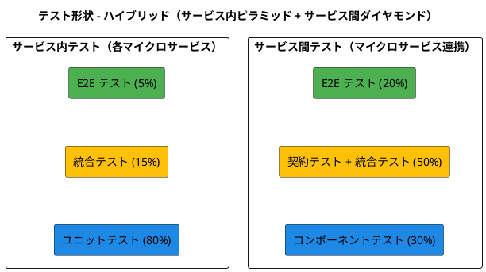
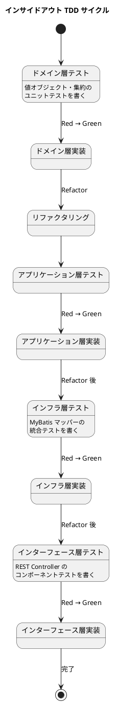
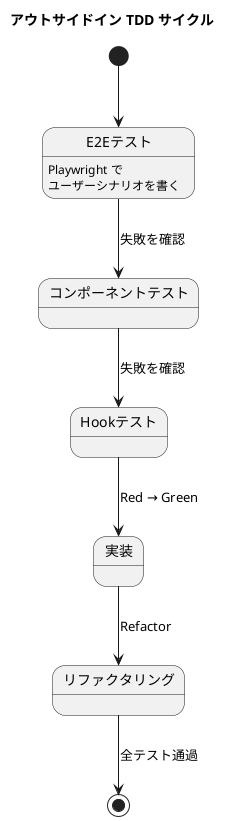
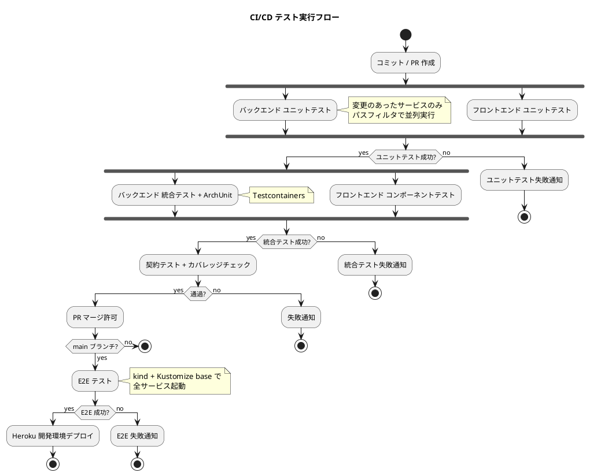

# テスト戦略 - 国際貨物輸送管理システム

## 概要

本ドキュメントは、マイクロサービスアーキテクチャ（7 サービス）とヘキサゴナルアーキテクチャを採用した国際貨物輸送管理システムのテスト戦略を定義する。
take-3 のテスト戦略を基礎とし、本プロジェクトの差分（通関ガード・キャンセル承認・誤配検知・アカウント保護のテスト対象化、E2E 実行基盤の kind + Kustomize 化）を反映している。

### テスト戦略の目的

- **安全な変更**: 各マイクロサービスを独立してデプロイできる品質保証
- **設計の改善**: TDD によるドメインモデルの設計品質向上
- **ドキュメント**: テストコードを実行可能な仕様書として機能させる
- **品質の保証**: サービス間連携を含むバグの早期発見と予防

---

## テスト形状の選択

### アーキテクチャ特性の評価

| 評価軸 | 判定 | 根拠 |
| :--- | :--- | :--- |
| アーキテクチャパターン | ヘキサゴナル + マイクロサービス | DDD ドメインモデルパターン + Database per Service |
| ドメインロジックの複雑さ | 高 | 貨物状態遷移・経路割り当て・通関ガード・キャンセル承認・料金計算 |
| 外部連携の多さ | 高 | 6 DB + RabbitMQ + REST API（サービス間） |
| サービス間結合点 | 中 | 同期: Booking→Routing REST、非同期: 7 ドメインイベント |

### 選択: ハイブリッド形（サービス内ピラミッド + サービス間ダイヤモンド）

マイクロサービスアーキテクチャでは、**サービス内部**と**サービス間**で最適なテスト形状が異なる。



**選択理由**:

1. **サービス内ピラミッド型**: 各サービスはヘキサゴナルアーキテクチャを採用しドメインモデルが厚い。ビジネスルール（状態遷移・金額計算・妥当性検証）のユニットテストが品質の土台となる
2. **サービス間ダイヤモンド型**: マイクロサービス間の結合点（REST API・ドメインイベント）が障害の主要因。契約テストと統合テストでサービス間の整合性を重点的に検証する

---

## テストレベルの定義

### バックエンド（各マイクロサービス）

#### レベル 1: ユニットテスト

**対象**: ドメイン層（`domain/model/`）のすべてのクラス

- 集約ルート・エンティティのビジネスルール
- 値オブジェクトのバリデーション・等価性
- ドメインサービスのロジック
- 列挙型の振る舞い

take-7 で特に重点的にテストするビジネスルール:

| ルール | 対象集約 | テスト観点 |
| :--- | :--- | :--- |
| キャンセル承認（UC22） | Cargo / CancellationRequest | 状態別のキャンセル可否・承認時の陸揚げ地必須・却下時の状態維持・履歴保持 |
| 通関ガード（UC21） | CustomsDeclaration / HandlingActivity | CLEARED 以外での CLAIM 拒否・状態更新の理由必須・履歴の追記 |
| 誤配検知（US28） | Cargo / TrackingActivity | 予定ルート外の荷役で MISROUTED 遷移・再設計で ROUTED 復帰・例外の自動起票 |
| アカウントロック（US31） | User / AccountLock | 5 回失敗でロック・ロック中は正しいパスワードでも拒否・成功時リセット |

```java
// 例: キャンセル承認の不変条件
@Test
void 輸送中の予約は承認なしにキャンセルできない() {
    Cargo cargo = CargoFixture.inTransitCargo();
    CancellationRequest request = cargo.requestCancellation("荷主都合", "sato");

    assertThat(cargo.getBookingStatus()).isEqualTo(BookingStatus.IN_TRANSIT); // 申請だけでは変わらない
    assertThat(request.getStatus()).isEqualTo(CancellationStatus.REQUESTED);
}

@Test
void 陸揚げ地なしの承認は拒否される() {
    Cargo cargo = CargoFixture.inTransitCargoWithCancellationRequest();
    assertThatThrownBy(() -> cargo.approveCancellation(null, "tracker"))
        .isInstanceOf(IllegalArgumentException.class)
        .hasMessageContaining("陸揚げ地");
}
```

**ツール**: JUnit 5, AssertJ, Mockito

**実行時間目標**: 30 秒以内（サービスあたり）

**テストの規律**:

- **安全装置は破るテストで固定する**: 通関ガード・アカウントロック・誤配検知は「入れたこと」でなく「働くこと」を検証する。ガードを外した実装でもテストが緑になるなら、そのテストは安全網ではない
- **分岐の結果で判定する**: どちらの検査で拒否されたか（エラーコード・例外型）をアサートする。経過時間や副作用の有無だけで判定しない
- **テストも同じ Clock で「今日」を決める**: 期限判定・HELD 3 日超の判定は注入した Clock を使い、テストと実装で同じ時刻源を共有する。CI（UTC）でのみ落ちるテストを作らない
- **境界値テスト**: 期限当日着（DATE と TIMESTAMP の比較）・割引率 0%/30%・失敗 4 回目/5 回目を必ず含める

#### レベル 2: 統合テスト

**対象**: アプリケーション層（`application/`）とインフラ層（`infrastructure/`）の連携

- MyBatis マッパー + PostgreSQL（Testcontainers）
- コマンドサービス + リポジトリの組み合わせ
- ACL（Anti-Corruption Layer）の変換ロジック
- RabbitMQ パブリッシャー・コンシューマーの動作確認（Testcontainers RabbitMQ）

**ツール**: Spring Boot Test, Testcontainers (PostgreSQL 16 / RabbitMQ), MyBatis Test

**実行時間目標**: 2 分以内（サービスあたり）

**テストの規律**:

- 全マイグレーション SQL は H2（PostgreSQL 互換モード）でも「解釈できるか」を確認するスモークを CI に置く（方言差は両方向に起きる。Heroku 開発環境は H2 で動く）
- テストデータの採番はシーケンス等の本番経路を使う（MAX+1 の自前採番は UNIQUE 制約衝突の原因）
- イベント購読を伴うテストは、テストごとに購読側の状態をリセットして他テストへのポリューションを防ぐ

#### レベル 3: コンポーネントテスト（サービス単体 E2E）

**対象**: マイクロサービス単体の API エンドポイント

- REST Controller → Application → Domain → Infrastructure の一貫テスト
- 外部マイクロサービスはモック（WireMock）
- 認可（ロール別 403）・公開エンドポイント（追跡照会の認証不要）もここで検証する

```java
@Test
void 通関が完了していない貨物のCLAIMは409を返す() {
    // 通関状態 HELD の貨物に対する CLAIM 登録
    ResponseEntity<ErrorResponse> response = restTemplate.postForEntity(
        "/api/v1/handling", claimRequestFor(heldCargo), ErrorResponse.class);

    assertThat(response.getStatusCode()).isEqualTo(HttpStatus.CONFLICT);
    assertThat(response.getBody().getCode()).isEqualTo("CUSTOMS_NOT_CLEARED"); // どの検査で落ちたかを判定
}
```

**ツール**: Spring Boot Test, WireMock, TestRestTemplate

**実行時間目標**: 5 分以内（サービスあたり）

### バックエンド（サービス間テスト）

#### レベル 4: 契約テスト

**対象**: マイクロサービス間の API 契約とイベント契約（Consumer-Driven Contract）

| 契約 | プロバイダー | コンシューマー | 検証内容 |
| :--- | :--- | :--- | :--- |
| 経路照会 API | routingms | bookingms | `GET /api/v1/routes/optimal` のレスポンス形式（現在地起点の再設計を含む） |
| CargoBookedEvent | bookingms | trackingms | イベントペイロードのフィールド |
| CargoRoutedEvent | bookingms | trackingms | イベントペイロードのフィールド |
| CargoCancelledEvent | bookingms | trackingms, billingms | キャンセル時状態・陸揚げ地を含むペイロード |
| HandlingActivityRegisteredEvent | handlingms | trackingms, bookingms | 作業場所・種別を含むペイロード（誤配検知の入力） |
| CustomsStatusChangedEvent | handlingms | trackingms | 通関状態・理由を含むペイロード |
| CargoDeliveredEvent | trackingms | billingms | イベントペイロードのフィールド |
| CargoSnapshot API | bookingms | handlingms | `GET /api/v1/bookings/{id}/snapshot` のレスポンス形式 |

**ツール**: Spring Cloud Contract

**実行時間目標**: 3 分以内

#### レベル 5: E2E テスト（フルシナリオ）

**対象**: 複数マイクロサービスを跨ぐビジネスシナリオ全体

- **kind クラスタに Kustomize base を適用して全サービスを起動する**（ローカルと CI で同一手段・同一マニフェストを共有。ADR-002）
- API Gateway 経由のリクエスト
- 主要シナリオ:
  1. **正常系フル**: ログイン → 荷主登録 → 予約 → 経路割り当て → 確定 → 追跡番号 → 荷役（RECEIVE/LOAD/UNLOAD）→ 通関（PENDING → CLEARED）→ CLAIM → 精算
  2. **通関ガード**: UNLOAD 後、通関 HELD のまま CLAIM → 拒否 → CLEARED 後に CLAIM 成功
  3. **誤配再設計**: 予定外港で UNLOAD → 誤配起票 → 現在地起点で再設計 → 復帰
  4. **輸送中キャンセル**: 申請 → 追跡管理者が陸揚げ地指定で承認 → キャンセル料算定
  5. **公開追跡**: 未認証で追跡照会が成功し、業務 API は 401 になる

```bash
# CI での E2E 環境起動（ローカルと同じ base を使用）
kubectl apply -k apps/k8s/kustomize/overlays/ci
kubectl -n cargo wait --for=condition=ready pod --all --timeout=300s
```

**ツール**: kind + Kustomize, Playwright（UI 経由）/ REST Assured（API 経由）

**実行時間目標**: 10 分以内（クラスタ起動含まず）

### フロントエンド（React SPA）

| テストレベル | 対象 | ツール | 比率 |
| :--- | :--- | :--- | :--- |
| ユニットテスト | Custom Hooks, ユーティリティ関数, バリデーション | Vitest | 50% |
| コンポーネントテスト | Presentational コンポーネント, Container + API モック | Testing Library + MSW | 30% |
| E2E テスト | 主要フロー（ログイン→予約→追跡）+ 導線検証 | Playwright | 20% |

**フロントエンド固有の検証観点（take-7）**:

- **導線の検証**: ロール別ナビゲーション・ダッシュボード件数からの遷移・公開追跡への入口（ログイン画面/ポータル）を E2E で確認する（ロール別到達性・状態軸の到達性）
- **同一エラーメッセージ**: 認証失敗・ロック中・無効化で表示メッセージが同一であることをコンポーネントテストで固定する（US31）
- **E2E の日時は業務タイムゾーンで生成する共有ヘルパを使う**（`toISOString()` を直接使わない。CI の UTC で落ちるテストを作らない）
- 画面からドメインの守りを踏むテストを置く（例: 通関未完了の CLAIM がエラートーストになる）。集約の単体テストは画面の見え方（500 等）を判別しない

---

## カバレッジ目標

### バックエンド（サービスごと）

| レイヤー | パッケージ | カバレッジ目標 | 測定ツール |
| :--- | :--- | :--- | :--- |
| Domain | `domain/model/` | 90% 以上 | JaCoCo |
| Application | `application/internal/` | 85% 以上 | JaCoCo |
| Infrastructure | `infrastructure/` | 70% 以上 | JaCoCo |
| Interfaces | `interfaces/rest/` | 60% 以上 | JaCoCo |
| **全体** | | **80% 以上** | JaCoCo |

### フロントエンド

| 対象 | カバレッジ目標 | 測定ツール |
| :--- | :--- | :--- |
| Custom Hooks | 90% 以上 | Vitest + c8 |
| ユーティリティ関数 | 90% 以上 | Vitest + c8 |
| コンポーネント | 70% 以上 | Vitest + c8 |
| **全体** | **75% 以上** | Vitest + c8 |

### 品質ゲート

CI パイプラインで以下の品質ゲートを設定する。ゲートを通過しないとマージ・デプロイを許可しない。

| ゲート | 基準 | 適用タイミング |
| :--- | :--- | :--- |
| ユニットテスト全通過 | 失敗 0 件 | PR 作成時 |
| 統合テスト全通過 | 失敗 0 件 | PR マージ時 |
| ArchUnit（レイヤー依存・BC 独立性） | 違反 0 件 | PR マージ時 |
| カバレッジ閾値 | 全体 80% 以上 | PR マージ時 |
| 契約テスト全通過 | 失敗 0 件 | PR マージ時 |
| E2E テスト全通過 | 失敗 0 件 | リリース前 |
| SonarQube Quality Gate | Passed | リリース前 |

> ArchUnit の BC 独立性ルールは Port（ACL）のパッケージのみ除外する。BC 単位で緩めない。
> 新しい Port・イベントを追加した際は必ずフルテスト（ArchUnit 含む）を実行する。

---

## テストツール一覧

### バックエンド

| カテゴリ | ツール | バージョン | 用途 |
| :--- | :--- | :--- | :--- |
| テストフレームワーク | JUnit 5 | 5.x | テスト実行・アサーション |
| アサーション | AssertJ | 3.x | 流暢なアサーション |
| モック | Mockito | 5.x | ドメインサービスのモック |
| Spring テスト | Spring Boot Test | 4.x | DI コンテナ・統合テスト |
| DB / MQ テスト | Testcontainers | 1.x | PostgreSQL / RabbitMQ コンテナ |
| API テスト | MockMvc / TestRestTemplate | - | REST API テスト |
| 契約テスト | Spring Cloud Contract | 4.x | サービス間契約検証 |
| アーキテクチャテスト | ArchUnit | 1.x | レイヤー依存・BC 独立性検証 |
| カバレッジ | JaCoCo | 0.8.x | コードカバレッジ測定 |
| 変異テスト | PIT (pitest) | 1.x | ドメイン層のテスト品質検証（任意） |
| 外部サービスモック | WireMock | 3.x | 外部 API モック |

### フロントエンド

| カテゴリ | ツール | バージョン | 用途 |
| :--- | :--- | :--- | :--- |
| テストフレームワーク | Vitest | 3.x | ユニット・コンポーネントテスト |
| コンポーネントテスト | Testing Library | 16.x | React コンポーネントテスト |
| API モック | MSW (Mock Service Worker) | 2.x | API レスポンスモック |
| E2E テスト | Playwright | 1.x | ブラウザ E2E テスト |
| カバレッジ | c8 | - | コードカバレッジ測定 |

---

## TDD サイクルと開発フロー

### インサイドアウト TDD（バックエンド）

各マイクロサービスの開発はインサイドアウトアプローチで進める。



### アウトサイドイン TDD（フロントエンド）



---

## CI/CD パイプラインとの連携

### テスト実行フロー



### テスト実行時間の目標

| テストレベル | 目標時間 | 実行タイミング |
| :--- | :--- | :--- |
| ユニットテスト（全サービス） | 2 分以内 | 毎コミット |
| 統合テスト + ArchUnit（全サービス） | 10 分以内 | PR 作成時 |
| 契約テスト | 3 分以内 | PR マージ時 |
| E2E テスト | 10 分以内（クラスタ起動含まず） | main マージ後 |
| **全テスト合計** | **25 分以内** | リリース前 |

---

## テストデータ管理

### Object Mother パターン

各マイクロサービスに `test/fixtures/` パッケージを設け、テストデータ生成を一元化する。

```java
// bookingms/src/test/java/fixtures/CargoFixture.java
public class CargoFixture {
    public static Cargo validCargo() {
        return Cargo.create(
            BookingId.generate(),
            new ShipperId("SHP-001"),
            RouteSpecFixture.jposaToUslax(),
            CargoType.GENERAL,
            new Weight(BigDecimal.valueOf(1200))
        );
    }

    public static Cargo inTransitCargo() { /* IN_TRANSIT 状態まで進めたフィクスチャ */ }
    public static Cargo misroutedCargo() { /* MISROUTED 状態のフィクスチャ */ }
}
```

> フィクスチャは実データの形で作る。「最小の違反例」だけではメタテストが緑でも実コードの違反を見逃す。

### Testcontainers によるデータベース管理

```java
@SpringBootTest
@Testcontainers
@Transactional
public abstract class DatabaseTestBase {
    @Container
    static PostgreSQLContainer<?> postgres = new PostgreSQLContainer<>("postgres:16")
        .withDatabaseName("testdb").withUsername("test").withPassword("test");

    @DynamicPropertySource
    static void configureProperties(DynamicPropertyRegistry registry) {
        registry.add("spring.datasource.url", postgres::getJdbcUrl);
        registry.add("spring.datasource.username", postgres::getUsername);
        registry.add("spring.datasource.password", postgres::getPassword);
    }
}
```

---

## トレーサビリティ

### ユーザーストーリーとテストケースの対応

| US | ストーリー | テストレベル | テストクラス（例） |
| :--- | :--- | :--- | :--- |
| US01 | 輸送見積を作成する | ユニット | `EstimateTest` |
| US02, US03 | 荷主を登録する | ユニット + 統合 | `ShipperTest`, `ShipperRepositoryTest` |
| US04, US05 | 貨物予約を登録する | ユニット + 統合 + コンポーネント | `CargoTest`, `CargoBookingCommandServiceTest`, `CargoBookingApiTest` |
| US07, US08 | 航海スケジュール検索・経路候補算出 | ユニット + 統合 | `VoyageTest`, `CargoRoutingQueryServiceTest` |
| US09-US11 | 経路の選択・確定・紐付け | ユニット + 契約 | `CargoItineraryTest`, `RoutingServiceContractTest` |
| US13, US14 | 予約確定・追跡番号発行 | ユニット + 統合 + 契約 | `CargoTest`, `CargoBookedEventContractTest` |
| US15, US16 | 荷役作業・引取を記録する | ユニット + 統合 + 契約 | `HandlingActivityTest`, `HandlingEventContractTest` |
| US17, US18 | 状態更新・追跡照会 | ユニット + E2E | `TrackingActivityTest`, `PublicTrackingE2ETest` |
| US19, US20 | 遅延・破損・紛失例外 | ユニット + 統合 | `TrackingExceptionEventTest`（LOST の escalation 含む） |
| US21-US23 | 料金算出・割引・精算 | ユニット + 統合 + E2E | `InvoiceTest`, `MoneyTest`, `DiscountPolicyTest`, `BillingE2ETest` |
| US24, US25 | 航海スケジュール登録・更新 | ユニット + 統合 | `VoyageTest`, `VoyageCommandServiceTest` |
| US26, US27 | ログイン・ログアウト | ユニット + コンポーネント | `UserTest`, `AuthApiTest` |
| US28 | 誤配を検知して経路を再設計する | ユニット + 統合 + E2E | `MisrouteDetectionTest`, `MisrouteRedesignE2ETest` |
| US29 | 通関申告を登録・管理する | ユニット + 統合 + E2E | `CustomsDeclarationTest`（理由必須・履歴・HELD 3 日超）, `CustomsGuardE2ETest` |
| US30 | 輸送中の予約キャンセルを承認する | ユニット + 統合 + E2E | `CancellationRequestTest`, `CancellationApprovalE2ETest` |
| US31 | アカウントを保護する | ユニット + コンポーネント | `AccountLockTest`, `AuthLockoutApiTest`（同一メッセージの検証含む） |

### テスト命名規則

テストメソッド名は日本語で記述し、仕様として読めるようにする。

```
[対象]_[条件]_[期待結果]
```

例:

- `貨物予約の状態遷移が正しい()`
- `通関がCLEAREDでない貨物のCLAIMは拒否される()`
- `認証失敗5回目でアカウントがロックされる()`
- `ロック中は正しいパスワードでもログインできない()`
- `予定ルート外の荷役で誤配例外が自動起票される()`

---

## 参照

- [バックエンドアーキテクチャ設計](architecture_backend.md)
- [フロントエンドアーキテクチャ設計](architecture_frontend.md)
- [ドメインモデル設計](domain-model.md)
- [ユーザーストーリー](../requirements/user_story.md)
- [テスト戦略ガイド](../reference/テスト戦略ガイド.md)
- [ADR-002 ローカル環境 kind + Kustomize](../adr/002-local-kubernetes-kustomize.md)
