# UI 設計 - 国際貨物輸送管理システム

## 概要

本ドキュメントでは、国際貨物輸送管理システムの UI 設計を定義する。

### 設計方針

**OOUX（オブジェクト指向 UI 設計）** をベースに、ユーザーが操作する「オブジェクト」（貨物予約・追跡・荷役・航路・請求書）を中心に画面を構成する。各画面はオブジェクトの状態を可視化し、アクターに応じた操作を提供する。

### 技術スタック

| 技術 | 役割 |
| :--- | :--- |
| React 19.x | SPA フレームワーク |
| React Router 7.x | クライアントサイドルーティング |
| TanStack Query 5.x | サーバー状態管理（API データのキャッシュ・ポーリング） |
| Zustand 5.x | クライアント状態管理（認証・UI 状態） |
| Tailwind CSS 4.x | ユーティリティファーストのスタイリング |
| fetch (built-in) | HTTP クライアント（API Gateway 経由で各マイクロサービスに接続） |

### 基本 UX 原則

- **オブジェクト中心**: 一覧 → 詳細 → アクションの自然な流れ
- **状態の可視化**: BookingStatus・TransportStatus をバッジで常時表示
- **フィードバック**: 操作成功・失敗はトースト通知で即時フィードバック
- **アクセシビリティ**: ARIA ラベル・キーボードナビゲーション対応
- **SPA UX**: ページ遷移はクライアントサイドルーティングで高速化

### 認証・認可ポリシー（UI）

- すべての業務画面はログイン必須とする
- 追跡照会（`/tracking/:trackingNumber`）も認証必須とし、`ROLE_SHIPPER` または `ROLE_TRACKING` のユーザーのみ閲覧可能とする
- 画面表示制御と API 実行可否は同一の RBAC マトリクスに従う

### API Gateway 経由のデータ取得

React SPA はすべての API リクエストを API Gateway（`gatewayms`）経由で送信する。Gateway が JWT トークンを検証し、各マイクロサービスにルーティングする。

```
React SPA → API Gateway (gatewayms) → authms / bookingms / routingms / trackingms / handlingms / billingms
```

---

## UI オブジェクト定義

OOUX に基づき、システム内の主要オブジェクトとそのアクション・属性を定義する。

### 主要オブジェクト

| オブジェクト | 主な属性 | ユーザーアクション | 関連オブジェクト |
| :--- | :--- | :--- | :--- |
| **貨物予約（Booking）** | bookingId, 出発地, 目的地, 希望期限, 貨物種別, 重量, BookingStatus | 新規登録・詳細確認・経路割り当て・キャンセル | 追跡情報, 航路, 荷役履歴 |
| **荷主（Shipper）** | shipperCode, 荷主名, メール, 種別（個人/法人）, 割引率 | 新規登録・一覧確認・詳細確認 | 貨物予約 |
| **見積（Estimate）** | estimateId, 出発地, 目的地, 期限, 貨物種別, 重量, ルート候補 | 新規作成・一覧確認・詳細確認 | 貨物予約 |
| **追跡情報（Tracking）** | trackingNumber, TransportStatus, 現在地, ステータス履歴 | 追跡番号検索・履歴確認 | 貨物予約 |
| **荷役作業（HandlingEvent）** | eventId, 貨物 ID, 荷役種別, 場所, 実施日時, 担当者 | 新規登録・一覧確認 | 貨物予約 |
| **航海（Voyage）** | voyageNumber, 出発港, 到着港, 出発予定日, 到着予定日 | 一覧確認・新規登録・更新 | 貨物予約 |
| **請求書（Invoice）** | invoiceId, 貨物予約, 金額, 割引, 消費税, PaymentStatus | 一覧確認・詳細確認・支払い確認 | 貨物予約 |

### オブジェクト間の関係

```
Booking 1 ─── 1 Tracking
Booking 1 ─── N HandlingEvent
Booking N ─── M Voyage（経路割り当てを通じて）
Booking 1 ─── 1 Invoice
Booking N ─── 1 Shipper
Estimate 1 ─── N RouteCandidate
```

---

## 画面一覧

| 画面名 | URL パス | 説明 | 主要アクター | 対応 US |
| :--- | :--- | :--- | :--- | :--- |
| ログイン | `/login` | JWT 認証フォーム | 全ロール | - |
| ダッシュボード | `/dashboard` | 全体サマリー・最新荷役情報 | 全ロール | - |
| 荷主一覧 | `/booking/shippers` | 荷主の一覧・検索 | 営業担当者 | US02, US03 |
| 荷主登録 | `/booking/shippers/new` | 新規荷主登録フォーム | 営業担当者 | US02, US03 |
| 見積一覧 | `/booking/estimates` | 見積の一覧・検索 | 営業担当者 | US01 |
| 見積作成 | `/booking/estimates/new` | 新規見積フォーム | 営業担当者 | US01 |
| 見積詳細 | `/booking/estimates/:estimateId` | ルート候補一覧 | 営業担当者 | US01 |
| 貨物予約一覧 | `/booking` | 予約済み貨物の一覧・検索 | 荷主、営業担当者 | US04, US05 |
| 貨物予約登録 | `/booking/new` | 新規予約フォーム | 営業担当者 | US04, US05 |
| 予約詳細 | `/booking/:bookingId` | 予約情報・経路・荷役履歴 | 荷主、営業担当者 | US06, US13 |
| 経路設計 | `/routing/design/:bookingId` | 経路候補選択・割り当て | 経路設計者 | US07-US11 |
| 航海スケジュール管理 | `/routing/voyages` | 航海スケジュール一覧 | 経路設計者 | US24, US25 |
| 航海スケジュール登録 | `/routing/voyages/new` | 新規航海登録フォーム | 経路設計者 | US24 |
| 貨物追跡照会 | `/tracking/:trackingNumber` | 輸送ステータスタイムライン（認証必須） | 荷主、荷受人、追跡管理者 | US18 |
| 荷役作業記録 | `/tracking/handling` | 荷役イベント登録フォーム | 荷役作業員 | US15, US16 |
| 荷役作業一覧 | `/tracking/handling/list` | 荷役履歴一覧・検索 | 荷役作業員、追跡管理者 | US15 |
| 精算管理 | `/billing` | 請求書一覧・フィルタ | 経理担当者 | US21-US23 |
| 請求書詳細 | `/billing/:invoiceId` | 請求書詳細・支払い確認 | 経理担当者 | US23 |

---

## 共通レイアウト設計

### ナビゲーション構成

全画面共通のサイドバーナビゲーションを左側に配置する。ロールに応じてメニュー項目を表示制御する。

| メニュー項目 | 遷移先 | 表示ロール |
| :--- | :--- | :--- |
| ダッシュボード | `/dashboard` | 全ロール |
| 荷主管理 | `/booking/shippers` | ROLE_SALES |
| 見積管理 | `/booking/estimates` | ROLE_SALES |
| 貨物予約 | `/booking` | ROLE_SALES, ROLE_SHIPPER |
| 航海スケジュール | `/routing/voyages` | ROLE_ROUTING |
| 経路設計 | `/routing/design` | ROLE_ROUTING |
| 貨物追跡 | `/tracking` | ROLE_SHIPPER, ROLE_TRACKING |
| 荷役管理 | `/tracking/handling` | ROLE_HANDLING, ROLE_TRACKING |
| 精算管理 | `/billing` | ROLE_BILLING |
| ログアウト | - | 全ロール |

### 画面/API 権限マトリクス

| 機能 | 画面パス | API プレフィックス | 実行ロール |
| :--- | :--- | :--- | :--- |
| 荷主管理 | `/booking/shippers*` | `/api/booking/shippers` | `ROLE_SALES` |
| 見積管理 | `/booking/estimates*` | `/api/booking/estimates` | `ROLE_SALES` |
| 予約管理 | `/booking*` | `/api/booking/cargos` | `ROLE_SALES`, `ROLE_SHIPPER`（参照のみ） |
| 航海・経路設計 | `/routing*` | `/api/routing` | `ROLE_ROUTING` |
| 追跡照会 | `/tracking/:trackingNumber` | `/api/tracking` | `ROLE_SHIPPER`, `ROLE_TRACKING` |
| 荷役管理 | `/tracking/handling*` | `/api/handling` | `ROLE_HANDLING`, `ROLE_TRACKING`（参照のみ） |
| 精算管理 | `/billing*` | `/api/billing` | `ROLE_BILLING` |

### 共通レイアウト ワイヤーフレーム

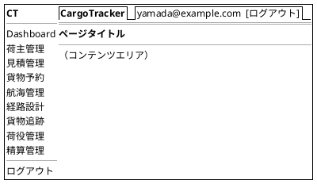

### Tailwind CSS レイアウトルール

- サイドバー: `w-64 fixed left-0 top-0 h-full bg-gray-800 text-white`
- メインコンテンツ: `ml-64 p-6`
- 一覧画面: テーブル `w-full`
- フォーム画面: `max-w-2xl mx-auto`
- 詳細画面: `grid grid-cols-1 lg:grid-cols-3 gap-6`（左 2 カラム + 右 1 カラム）
- レスポンシブ: モバイル（`< 768px`）ではサイドバーをハンバーガーメニューに折り畳み

---

## 画面遷移図

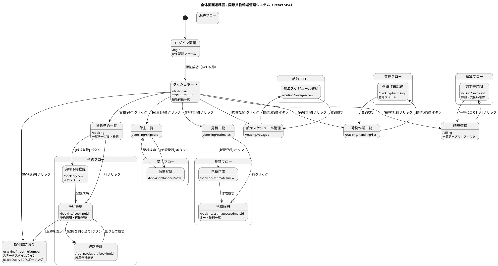

---

## 画面詳細設計

### ログイン画面 (/login)

#### ワイヤーフレーム

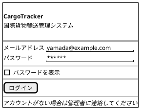

#### 仕様

- `POST /api/auth/login` で JWT トークンを取得し Zustand ストアに保存
- ログイン失敗時: 「メールアドレスまたはパスワードが正しくありません」を赤色で表示
- ログイン成功後: `/dashboard` へ React Router で遷移
- JWT 有効期限切れ時: 自動的に `/login` へリダイレクト（API クライアントの 401 ハンドリング）

---

### ダッシュボード (/dashboard)

#### ワイヤーフレーム

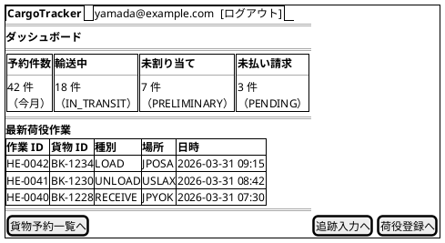

#### 仕様

- サマリーカード: React Query で `/api/booking/summary` を取得
- 最新荷役作業: `/api/handling/recent` から直近 10 件を降順表示
- ロール制御: `ROLE_BILLING` 以外は「未払い請求」カードを非表示
- 自動更新: React Query の `refetchInterval: 60000`（60 秒）でサマリーを更新

---

### 貨物予約一覧 (/booking)

#### ワイヤーフレーム

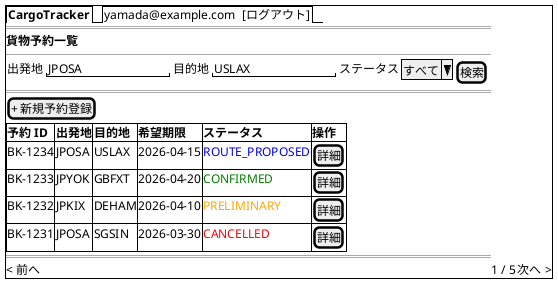

#### 仕様

- **データ取得**: `useBookings()` Hook で `GET /api/booking/cargos` を React Query でキャッシュ
- **検索フィルタ**: 出発地・目的地（UN/LOCODE）・BookingStatus でクエリパラメータ付与
- **ステータスバッジ**: Tailwind CSS のバッジクラスで BookingStatus に応じた色分け
- **ページネーション**: 1 ページ 20 件。React Query の `keepPreviousData` でちらつき防止
- **新規登録**: `ROLE_SALES` のみ表示

---

### 貨物予約登録 (/booking/new)

#### ワイヤーフレーム

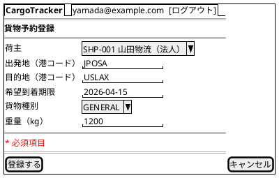

#### 仕様

- **荷主選択**: `useShippers()` で荷主一覧を取得しセレクトボックスで選択
- **入力項目**: 荷主・出発地・目的地（UNLOCODE 形式 5 文字）・希望到着期限・貨物種別・重量
- **貨物種別**: `GENERAL` / `HAZARDOUS` / `REFRIGERATED` から選択
- **条件付きフォーム**: `HAZARDOUS` 選択時は危険物申告フィールド表示、`REFRIGERATED` 選択時は温度管理フィールド表示
- **バリデーション**: クライアントサイド（React Hook Form）+ サーバーサイド（API 422 レスポンス）
- **登録成功**: `POST /api/booking/cargos` → React Router で `/booking/:bookingId` へ遷移
- **エラー時**: フォームフィールドにインラインエラー表示

---

### 予約詳細 (/booking/:bookingId)

#### ワイヤーフレーム

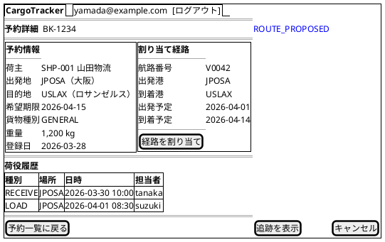

#### 仕様

- **データ取得**: `useBookingDetail(bookingId)` で `GET /api/booking/cargos/:bookingId`
- **ステータスバッジ**: ページタイトル横に BookingStatus を大きく表示
- **経路情報**: 未割り当ての場合は「経路が割り当てられていません」と表示し `[経路を割り当て]` を強調
- **荷役履歴**: `GET /api/handling/activities?bookingId=:bookingId` で取得。時系列降順表示
- **[経路を割り当て]**: `ROLE_ROUTING` かつ `PRELIMINARY` / `ROUTE_PROPOSED` のみ表示
- **[キャンセル]**: `ROLE_SALES` のみ表示。確認ダイアログ後に `PUT /api/booking/cargos/:bookingId/cancel`
- **[追跡を表示]**: `trackingNumber` が発行済みの場合のみ表示

---

### 経路設計 (/routing/design/:bookingId)

#### ワイヤーフレーム

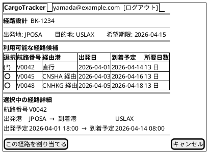

#### 仕様

- **経路候補取得**: `GET /api/routing/routes?origin=JPOSA&destination=USLAX&deadline=2026-04-15` を React Query でキャッシュ
- **ラジオ選択**: 経路を選択するとローカルステート更新で下部詳細を切り替え
- **希望期限超過**: 到着予定が希望期限を超える経路は警告バッジ付き
- **割り当て成功**: `PUT /api/booking/cargos/:bookingId/route` → React Router で `/booking/:bookingId` へ遷移

---

### 貨物追跡照会 (/tracking/:trackingNumber)

#### ワイヤーフレーム

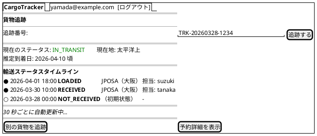

#### 仕様

- **自動更新**: `useTracking(trackingNumber)` で React Query `refetchInterval: 30000` によるポーリング
- **タイムライン**: TransportStatus の変化を時系列で表示。最新状態を最上部に
- **追跡番号入力**: URL パスパラメータまたは画面上部の入力フォームから検索
- **未発見**: 404 の場合は「該当する貨物が見つかりません」トースト表示
- **例外表示**: ExceptionType が存在する場合は赤色バッジで表示
- **[予約詳細を表示]**: `ROLE_TRACKING` のみ表示

---

### 荷役作業記録 (/tracking/handling)

#### ワイヤーフレーム

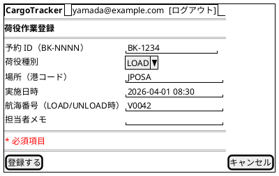

#### 仕様

- **荷役種別**: `RECEIVE` / `LOAD` / `UNLOAD` / `CUSTOMS` / `CLAIM` から選択
- **航海番号**: `LOAD` / `UNLOAD` 選択時のみ必須表示
- **登録成功**: `POST /api/handling/activities` → トースト通知 + フォームリセット
- **バリデーション**: CargoSnapshot による妥当性検証結果をサーバーから返却

---

### 航海スケジュール管理 (/routing/voyages)

#### ワイヤーフレーム

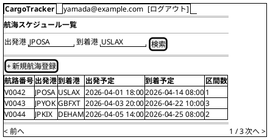

#### 仕様

- **データ取得**: `useVoyages()` で `GET /api/routing/voyages` をキャッシュ
- **検索フィルタ**: 出発港・到着港でフィルタリング
- **新規登録**: `ROLE_ROUTING` のみ表示
- **行クリック**: 航海詳細（CarrierMovement 一覧）をモーダルで表示

---

### 精算管理 (/billing)

#### ワイヤーフレーム

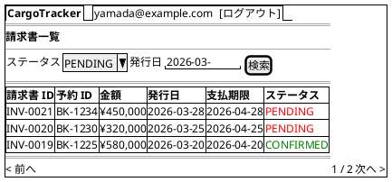

#### 仕様

- **データ取得**: `useInvoices()` で `GET /api/billing/invoices`
- **フィルタ**: PaymentStatus・発行日でフィルタリング
- **ステータスバッジ**: `PENDING` は赤、`CONFIRMED` は緑、`OVERDUE` は濃い赤
- **支払期限超過**: 期限超過かつ未払いの行を赤色ハイライト
- **アクセス制御**: `ROLE_BILLING` のみ

---

### 請求書詳細 (/billing/:invoiceId)

#### ワイヤーフレーム

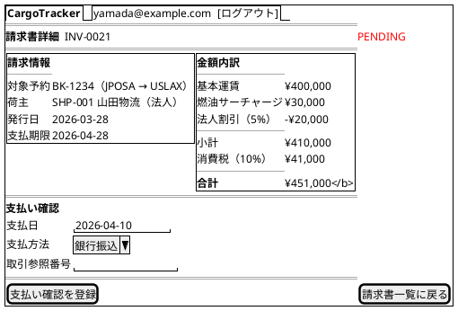

#### 仕様

- **金額内訳**: 基本運賃・サーチャージ・割引・消費税を明細表示
- **[支払い確認を登録]**: `PUT /api/billing/invoices/:invoiceId/confirm` を送信
- **確認済み**: PaymentStatus が `CONFIRMED` の場合は支払いフォームを非表示にし、確認日時を表示

---

## インタラクション設計

### React Query によるデータ取得パターン

#### 追跡ステータスのリアルタイム更新

```tsx
// features/tracking/hooks/useTracking.ts
export function useTracking(trackingNumber: string) {
  return useQuery({
    queryKey: ['tracking', trackingNumber],
    queryFn: () => apiClient.get<TrackingInfo>(
      `/api/tracking/${trackingNumber}`
    ),
    refetchInterval: 30000, // 30秒ごとにポーリング
    enabled: !!trackingNumber,
  });
}
```

#### 検索フィルタの URL 同期

```tsx
// features/booking/hooks/useBookings.ts
export function useBookings(filters: BookingFilters) {
  const params = new URLSearchParams();
  if (filters.origin) params.set('origin', filters.origin);
  if (filters.destination) params.set('destination', filters.destination);
  if (filters.status) params.set('status', filters.status);

  return useQuery({
    queryKey: ['bookings', filters],
    queryFn: () => apiClient.get<PagedResult<BookingSummary>>(
      `/api/booking/cargos?${params.toString()}`
    ),
    keepPreviousData: true,
  });
}
```

#### Mutation によるデータ更新

```tsx
// features/booking/hooks/useCreateBooking.ts
export function useCreateBooking() {
  const queryClient = useQueryClient();
  return useMutation({
    mutationFn: (data: CreateBookingData) =>
      apiClient.post<BookingDetail>('/api/booking/cargos', data),
    onSuccess: () => {
      queryClient.invalidateQueries({ queryKey: ['bookings'] });
    },
  });
}
```

### トースト通知

操作結果のフィードバックはトースト通知で即時表示する。

| 操作 | メッセージ例 | 種別 |
| :--- | :--- | :--- |
| 予約登録成功 | 「貨物予約 BK-1234 を登録しました」 | success |
| 経路割り当て成功 | 「経路 V0042 を割り当てました」 | success |
| 荷役登録成功 | 「荷役作業を登録しました」 | success |
| 支払い確認成功 | 「請求書 INV-0021 の支払いを確認しました」 | success |
| バリデーションエラー | 「入力内容に誤りがあります」 | error |
| 認証エラー | 「セッションが切れました。再ログインしてください」 | error |
| サーバーエラー | 「処理中にエラーが発生しました」 | error |

### エラーハンドリング

#### API エラーの共通処理

```tsx
// lib/api-client.ts の request 関数内
if (response.status === 401) {
  useAuthStore.getState().logout();
  throw new Error('Unauthorized');
}
if (response.status === 422) {
  const error = await response.json();
  throw new ValidationError(error.fieldErrors);
}
if (!response.ok) {
  throw new ApiError(response.status, 'Request failed');
}
```

#### React Error Boundary

ページ単位で Error Boundary を設置し、予期しないエラーをキャッチして復旧 UI を表示する。

---

## アクセシビリティ

### キーボードナビゲーション

- **Tab 順序**: サイドバー → メインコンテンツ → フォーム項目の自然な Tab 移動
- **Enter キー**: フォーカス中のボタン・リンクを実行
- **Escape キー**: モーダル・ドロップダウンを閉じる
- **スキップリンク**: `<a href="#main-content" className="sr-only focus:not-sr-only">コンテンツにスキップ</a>`

### ARIA 対応

| 要素 | ARIA 属性 |
| :--- | :--- |
| サイドバーナビゲーション | `role="navigation" aria-label="メインナビゲーション"` |
| 検索フォーム | `role="search" aria-label="貨物検索"` |
| データテーブル | `role="grid" aria-label="[テーブル名]"` |
| ステータスバッジ | `aria-label="ステータス: ROUTE_PROPOSED"` |
| ローディングインジケーター | `aria-live="polite" aria-busy="true"` |
| エラーメッセージ | `role="alert" aria-live="assertive"` |
| トースト通知 | `role="status" aria-live="polite"` |

### カラーコントラスト

- 通常テキスト: コントラスト比 4.5:1 以上（WCAG AA 準拠）
- 大きいテキスト（18px 以上）: 3:1 以上
- ステータスバッジは色のみに依存せず、テキストラベルを必ず併記

---

## 付録: ステータスバッジ定義

### BookingStatus バッジ定義

| ステータス | 表示ラベル | Tailwind クラス | 意味 |
| :--- | :--- | :--- | :--- |
| `PRELIMINARY` | 仮予約 | `bg-yellow-100 text-yellow-800` | 経路未割り当て |
| `ROUTE_PROPOSED` | 経路提案済 | `bg-blue-100 text-blue-800` | 経路割り当て完了・未確認 |
| `CONFIRMED` | 確認済 | `bg-green-100 text-green-800` | 予約確定 |
| `TRACKING_ISSUED` | 追跡番号発行済 | `bg-cyan-100 text-cyan-800` | 追跡番号付与 |
| `IN_TRANSIT` | 輸送中 | `bg-blue-100 text-blue-800` | 積み込み済・輸送中 |
| `DELIVERED` | 配送完了 | `bg-green-100 text-green-800` | 配達完了 |
| `SETTLED` | 精算完了 | `bg-gray-100 text-gray-800` | 請求・支払い完了 |
| `CANCELLED` | キャンセル | `bg-red-100 text-red-800` | キャンセル済 |

### TransportStatus バッジ定義

| ステータス | 表示ラベル | Tailwind クラス |
| :--- | :--- | :--- |
| `NOT_RECEIVED` | 未受取 | `bg-gray-100 text-gray-800` |
| `RECEIVED` | 受取済 | `bg-cyan-100 text-cyan-800` |
| `LOADED` | 積み込み済 | `bg-blue-100 text-blue-800` |
| `IN_TRANSIT` | 輸送中 | `bg-blue-100 text-blue-800` |
| `UNLOADED` | 荷降ろし済 | `bg-yellow-100 text-yellow-800` |
| `AWAITING_CLAIM` | 引取待ち | `bg-yellow-100 text-yellow-800` |
| `DELIVERED` | 引取完了 | `bg-green-100 text-green-800` |
| `EXCEPTION` | 例外 | `bg-red-100 text-red-800` |

### PaymentStatus バッジ定義

| ステータス | 表示ラベル | Tailwind クラス |
| :--- | :--- | :--- |
| `PENDING` | 未払い | `bg-red-100 text-red-800` |
| `CONFIRMED` | 支払済 | `bg-green-100 text-green-800` |
| `OVERDUE` | 期限超過 | `bg-red-200 text-red-900` |
| `REFUNDED` | 返金済 | `bg-gray-100 text-gray-800` |
