# UI 設計 - 国際貨物輸送管理システム

## 概要

本ドキュメントでは、国際貨物輸送管理システムの UI 設計を定義します。

### 設計方針

**OOUX（オブジェクト指向 UI 設計）** をベースに、ユーザーが操作する「オブジェクト」（貨物予約・追跡・荷役・航路・精算書）を中心に画面を構成します。各画面はオブジェクトの状態を可視化し、アクターに応じた操作を提供します。

### 技術スタック

| 技術 | 役割 |
| :--- | :--- |
| Giraffe + Giraffe.ViewEngine（F#） | SSR（サーバーサイドレンダリング）でフル HTML を関数型 HTML DSL で生成 |
| htmx 2.0 | フォームバリデーション・ステータス自動更新など部分的な動的更新 |
| Bootstrap 5.3 | レスポンシブグリッド・コンポーネント |
| PRG パターン | フォーム送信後は必ず Redirect-Get で二重送信を防止 |

### 基本 UX 原則

- **オブジェクト中心**: 一覧 → 詳細 → アクションの自然な流れ
- **状態の可視化**: BookingState・TransportStatus をバッジで常時表示
- **フィードバック**: 操作成功・失敗はフラッシュメッセージで通知
- **アクセシビリティ**: ARIA ラベル・キーボードナビゲーション対応

---

## UI オブジェクト定義

OOUX に基づき、システム内の主要オブジェクトとそのアクション・属性を定義します。

### 主要オブジェクト

| オブジェクト | 主な属性 | ユーザーアクション | 関連オブジェクト |
| :--- | :--- | :--- | :--- |
| **貨物予約（Booking）** | bookingId, 出発地, 目的地, 希望期限, 貨物種別, 重量, BookingState | 新規登録・詳細確認・経路設計者への引き渡し・荷主通知・予約確定・キャンセル | 追跡情報, 航路, 荷役履歴 |
| **追跡情報（Tracking）** | trackingNumber, TransportStatus, 現在地, ステータス履歴 | 追跡番号検索・履歴確認 | 貨物予約 |
| **荷役作業（HandlingEvent）** | eventId, 貨物 ID, 荷役種別, 場所, 実施日時, 担当者 | 新規登録・一覧確認 | 貨物予約 |
| **航路（Voyage）** | voyageNumber, 出発港, 到着港, 出発予定日, 到着予定日 | 一覧確認・経路設計への提供 | 貨物予約 |
| **精算書（Invoice）** | invoiceId, 貨物予約, 金額, 割引, 消費税, PaymentState | 一覧確認・詳細確認・支払い確認 | 貨物予約 |

### オブジェクト間の関係

```
Booking 1 ─── 1 Tracking
Booking 1 ─── N HandlingEvent
Booking N ─── M Voyage（経路設計・確定を通じて）
Booking 1 ─── 1 Invoice
```

---

## 画面一覧

| 画面名 | URL パス | 説明 | 主要アクター | 対応 US |
| :--- | :--- | :--- | :--- | :--- |
| ログイン | `/login` | 認証フォーム | 全ロール | - |
| ダッシュボード | `/` | 全体サマリー・最新荷役情報 | 全ロール | -（横断） |
| 貨物予約一覧 | `/bookings` | 予約済み貨物の一覧・検索 | 荷主、営業担当者 | US04, US13 |
| 貨物予約登録 | `/bookings/new` | 新規予約フォーム | 営業担当者 | US04, US05 |
| 予約詳細 | `/bookings/{bookingId}` | 予約情報・経路・荷役履歴・荷主通知・予約確定 | 荷主、営業担当者 | US06, US12, US13 |
| 貨物追跡入力 | `/tracking` | 追跡番号入力フォーム | 荷主、荷受人、追跡管理者 | US18 |
| 追跡詳細 | `/tracking/{trackingNumber}` | 輸送ステータス履歴タイムライン | 荷主、荷受人 | US18 |
| 貨物状態更新 | `/tracking/{trackingNumber}/status/new` | 出港・入港等の通常状態の手動更新フォーム | 追跡管理者 | US17 |
| 例外登録 | `/tracking/{trackingNumber}/exceptions/new` | 遅延・破損・紛失などの例外登録フォーム | 追跡管理者 | US19, US20 |
| 荷役作業登録 | `/handling/new` | 荷役イベント登録フォーム | 荷役作業員 | US15, US16 |
| 荷役作業一覧 | `/handling` | 荷役履歴一覧・検索 | 荷役作業員、追跡管理者 | US15, US17 |
| 航路一覧 | `/voyages` | 航路・スケジュール一覧 | 経路設計者 | US07 |
| 航海スケジュール登録 | `/voyages/new` | 航海スケジュール新規登録フォーム | 経路設計者 | US24 |
| 航海スケジュール更新 | `/voyages/{voyageNumber}/edit` | 航海スケジュール更新フォーム（差分確認付き） | 経路設計者 | US25 |
| 経路設計依頼一覧 | `/routing/requests` | 経路設計待ちの予約一覧・追跡番号発行 | 経路設計者 | US07, US11, US14 |
| 経路設計・候補算出 | `/routing/requests/{bookingId}` | 航海検索・経路候補算出・比較・確定 | 経路設計者 | US07, US08, US09, US10, US11 |
| 荷主一覧 | `/shippers` | 荷主の一覧・検索 | 営業担当者 | US02, US03 |
| 荷主登録 | `/shippers/new` | 新規荷主登録フォーム（個人/法人切替） | 営業担当者 | US02, US03 |
| 精算書一覧 | `/billing/invoices` | 精算書の一覧・ステータス管理 | 経理担当者 | US21, US23 |
| 料金算出 | `/billing/invoices/new` | 輸送実績に基づく料金算出・調整・法人割引適用 | 経理担当者 | US21, US22 |
| 精算書詳細 | `/billing/invoices/{invoiceId}` | 精算書詳細・支払い確認 | 経理担当者 | US22, US23 |
| 割引ポリシー一覧 | `/admin/discount-policies` | 割引ポリシーの一覧・有効期限管理 | ROLE_ADMIN | US-ADM-01 |
| 割引ポリシー登録 | `/admin/discount-policies/new` | 新規割引ポリシー登録フォーム | ROLE_ADMIN | US-ADM-01 |
| 割引ポリシー編集 | `/admin/discount-policies/{id}/edit` | 割引ポリシー編集フォーム | ROLE_ADMIN | US-ADM-01 |
| 公開貨物追跡 | `/public/tracking/{accessToken}` | 認証不要の貨物状態照会ページ（推測困難なアクセストークンで照会・荷主が URL 共有可） | 荷主・荷受人（未認証） | US18 |
| 見積一覧 | `/estimates` | 見積の一覧・検索 | 営業担当者 | US01 |
| 見積作成 | `/estimates/new` | 新規見積フォーム（出発地・目的地・期限・貨物仕様入力） | 営業担当者 | US01 |
| 見積詳細 | `/estimates/{estimateId}` | 見積詳細・スタブルート候補一覧 | 営業担当者 | US01 |

---

## 共通レイアウト設計

### ナビゲーション構成

全画面共通のナビゲーションバー（Bootstrap 5 `navbar`）を上部に配置します。ロールに応じてメニュー項目を表示制御します。

| メニュー項目 | 遷移先 | 表示ロール |
| :--- | :--- | :--- |
| ダッシュボード | `/` | 全ロール |
| 貨物予約 | `/bookings` | ROLE_SALES, ROLE_SHIPPER |
| 荷主管理 | `/shippers` | ROLE_SALES |
| 見積管理 | `/estimates` | ROLE_SALES |
| 貨物追跡 | `/tracking` | ROLE_SHIPPER, ROLE_CONSIGNEE, ROLE_TRACKER |
| 荷役管理 | `/handling` | ROLE_HANDLER, ROLE_TRACKER |
| 航路管理 | `/voyages` | ROLE_ROUTE_DESIGNER |
| 経路設計 | `/routing/requests` | ROLE_ROUTE_DESIGNER |
| 請求管理 | `/billing/invoices` | ROLE_BILLING |
| 管理設定 | `/admin/discount-policies` | ROLE_ADMIN |
| ログアウト | `/logout` | 全ロール |

### ロール別ナビゲーションマトリクス

ロールごとのナビゲーションバー表示項目を以下のマトリクスに集約します（○: 表示、−: 非表示）。

| メニュー項目 | 営業担当者 | 経路設計者 | 荷役作業員 | 追跡管理者 | 経理担当者 | 運用管理者 |
| :--- | :---: | :---: | :---: | :---: | :---: | :---: |
| ダッシュボード | ○ | ○ | ○ | ○ | ○ | ○ |
| 貨物予約 | ○ | − | − | − | − | − |
| 荷主管理 | ○ | − | − | − | − | − |
| 見積管理 | ○ | − | − | − | − | − |
| 貨物追跡 | − | − | − | ○ | − | − |
| 荷役管理 | − | − | ○ | ○ | − | − |
| 航路管理 | − | ○ | − | − | − | − |
| 経路設計 | − | ○ | − | − | − | − |
| 請求管理 | − | − | − | − | ○ | − |
| 管理設定 | − | − | − | − | − | ○ |
| ログアウト | ○ | ○ | ○ | ○ | ○ | ○ |

> **注記**: 各画面のワイヤーフレームに描かれたナビゲーションバーの表示項目は簡略化した例示であり、実際のナビ表示項目は本マトリクスを正とします。

### 共通レイアウト ワイヤーフレーム

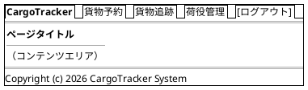

### Bootstrap 5 グリッド運用ルール

- コンテナ: `container-fluid` で横幅を最大活用
- 一覧画面: テーブル幅 `col-12`
- フォーム画面: 入力欄 `col-md-8 offset-md-2`（中央寄せ）
- 詳細画面: 左カラム `col-md-8`、右サイドバー `col-md-4`
- ブレークポイント: モバイル（`< 768px`）では 1 カラム積み上げ

---

## 画面遷移図

フロー全体の画面遷移を PlantUML ステートチャート図で表現します。

```plantuml
@startuml
title 全体画面遷移図 - 国際貨物輸送管理システム

[*] --> ログイン画面

state ログイン画面 {
  ログイン画面 : /login
  ログイン画面 : 認証フォーム
}

ログイン画面 --> ダッシュボード : 認証成功

state ダッシュボード {
  ダッシュボード : /
  ダッシュボード : サマリーカード\n最新荷役一覧
}

ダッシュボード --> 貨物予約一覧 : [予約管理] クリック
ダッシュボード --> 貨物追跡入力 : [追跡] クリック
ダッシュボード --> 荷役作業一覧 : [荷役管理] クリック
ダッシュボード --> 精算書一覧 : [請求管理] クリック
ダッシュボード --> 航路一覧 : [航路管理] クリック

state "予約フロー" as booking_flow {
  state 貨物予約一覧 {
    貨物予約一覧 : /bookings
    貨物予約一覧 : 一覧テーブル・検索
  }
  state 貨物予約登録 {
    貨物予約登録 : /bookings/new
    貨物予約登録 : 入力フォーム
  }
  state 予約詳細 {
    予約詳細 : /bookings/{bookingId}
    予約詳細 : 予約情報・荷役履歴\n荷主通知・予約確定
  }

  貨物予約一覧 --> 貨物予約登録 : [新規登録] ボタン
  貨物予約一覧 --> 予約詳細 : 行クリック
  貨物予約登録 --> 予約詳細 : 登録成功（PRG）
  貨物予約登録 --> 貨物予約登録 : バリデーションエラー
  予約詳細 --> 予約詳細 : [荷主に経路を通知]（US12・PRG）\n[予約を確定]（US13・PRG）
}

note bottom of booking_flow
  経路の割り当て・確定は経路設計者フロー
  （/routing/requests/{bookingId}）に一本化
end note

state "追跡フロー" as tracking_flow {
  state 貨物追跡入力 {
    貨物追跡入力 : /tracking
    貨物追跡入力 : 追跡番号入力
  }
  state 追跡詳細 {
    追跡詳細 : /tracking/{trackingNumber}
    追跡詳細 : ステータスタイムライン\n30 秒自動更新（htmx）
  }

  state 貨物状態更新 {
    貨物状態更新 : /tracking/{trackingNumber}/status/new
    貨物状態更新 : 状態・位置・日時入力
  }

  state 例外登録 {
    例外登録 : /tracking/{trackingNumber}/exceptions/new
    例外登録 : 例外種別・状況・対応方針入力
  }

  貨物追跡入力 --> 追跡詳細 : 追跡番号送信
  貨物追跡入力 --> 貨物追跡入力 : 番号不正・未発見
  追跡詳細 --> 貨物追跡入力 : [別の貨物を追跡]
  追跡詳細 --> 貨物状態更新 : [状態を更新] ボタン（ROLE_TRACKER）
  貨物状態更新 --> 追跡詳細 : 更新成功（PRG）
  貨物状態更新 --> 貨物状態更新 : バリデーションエラー
  追跡詳細 --> 例外登録 : [例外を登録] ボタン（ROLE_TRACKER）
  例外登録 --> 追跡詳細 : 登録成功（PRG・InException・荷主通知・LOST はエスカレーション）
  例外登録 --> 例外登録 : バリデーションエラー
  追跡詳細 --> 追跡詳細 : [解決] インラインフォーム（POST .../exceptions/{index}/resolve・PRG・状態復帰・対応内容記録）
}

state "荷役フロー" as handling_flow {
  state 荷役作業一覧 {
    荷役作業一覧 : /handling
    荷役作業一覧 : 一覧テーブル・検索
  }
  state 荷役作業登録 {
    荷役作業登録 : /handling/new
    荷役作業登録 : 登録フォーム
  }

  荷役作業一覧 --> 荷役作業登録 : [新規登録] ボタン
  荷役作業登録 --> 荷役作業一覧 : 登録成功（PRG）
  荷役作業登録 --> 荷役作業登録 : バリデーションエラー
}

state "精算フロー" as billing_flow {
  state 精算書一覧 {
    精算書一覧 : /billing/invoices
    精算書一覧 : 一覧テーブル・フィルタ
  }
  state 料金算出 {
    料金算出 : /billing/invoices/new
    料金算出 : 輸送実績・基本料金自動計算\n料金調整・法人割引適用
  }
  state 精算書詳細 {
    精算書詳細 : /billing/invoices/{invoiceId}
    精算書詳細 : 詳細・支払い確認
  }

  精算書一覧 --> 料金算出 : [+ 新規精算書発行] ボタン
  料金算出 --> 料金算出 : 料金調整・再計算（htmx）
  料金算出 --> 精算書詳細 : 料金確定成功（PRG）
  料金算出 --> 料金算出 : バリデーションエラー
  精算書一覧 --> 精算書詳細 : 行クリック
  精算書詳細 --> 精算書一覧 : [一覧に戻る] / 支払い確認成功（PRG）
}

state "航路・経路設計フロー" as routing_flow {
  state 航路一覧 {
    航路一覧 : /voyages
    航路一覧 : 航路・スケジュール一覧
  }
  state 航海スケジュール登録 {
    航海スケジュール登録 : /voyages/new
    航海スケジュール登録 : 運送区間の複数行入力
  }
  state 航海スケジュール更新 {
    航海スケジュール更新 : /voyages/{voyageNumber}/edit
    航海スケジュール更新 : 差分確認ステップ付き
  }
  state 経路設計依頼一覧 {
    経路設計依頼一覧 : /routing/requests
    経路設計依頼一覧 : 経路設計待ちの予約一覧
  }
  state 経路設計候補算出 {
    経路設計候補算出 : /routing/requests/{bookingId}
    経路設計候補算出 : 航海検索・候補算出・比較・確定
  }

  航路一覧 --> 航海スケジュール登録 : [+ 新規航海] ボタン
  航路一覧 --> 航海スケジュール更新 : 行の [編集] ボタン
  航海スケジュール登録 --> 航路一覧 : 登録成功（PRG）
  航海スケジュール登録 --> 航海スケジュール登録 : 連続性検証エラー
  航海スケジュール更新 --> 航路一覧 : 更新成功（PRG）
  航海スケジュール更新 --> 航海スケジュール更新 : 差分確認・エラー
  経路設計依頼一覧 --> 経路設計候補算出 : 行クリック
  経路設計依頼一覧 --> 経路設計依頼一覧 : [追跡番号を発行]\n（CONFIRMED 予約・US14・PRG）
  経路設計候補算出 --> 経路設計候補算出 : 条件調整・再算出（US10）
  経路設計候補算出 --> 経路設計依頼一覧 : 確定・紐付け成功（PRG）
}

ダッシュボード --> 経路設計依頼一覧 : [経路設計] クリック

state "管理フロー" as admin_flow {
  state 割引ポリシー一覧 {
    割引ポリシー一覧 : /admin/discount-policies
    割引ポリシー一覧 : 一覧テーブル・有効期限フィルタ
  }
  state 割引ポリシー登録 {
    割引ポリシー登録 : /admin/discount-policies/new
    割引ポリシー登録 : 登録フォーム
  }
  state 割引ポリシー編集 {
    割引ポリシー編集 : /admin/discount-policies/{id}/edit
    割引ポリシー編集 : 編集フォーム
  }

  割引ポリシー一覧 --> 割引ポリシー登録 : [新規登録] ボタン
  割引ポリシー一覧 --> 割引ポリシー編集 : 行の [編集] リンク
  割引ポリシー登録 --> 割引ポリシー一覧 : 登録成功（PRG）
  割引ポリシー編集 --> 割引ポリシー一覧 : 更新成功（PRG）
}

state 公開貨物追跡 {
  公開貨物追跡 : /public/tracking/{accessToken}
  公開貨物追跡 : 認証不要・シンプルステータス
}

ダッシュボード --> 割引ポリシー一覧 : [管理設定] クリック
[*] --> 公開貨物追跡 : 直接 URL アクセス（認証不要）

state "見積フロー" as estimation_flow {
  state 見積一覧 {
    見積一覧 : /estimates
    見積一覧 : 一覧テーブル・検索
  }
  state 見積作成 {
    見積作成 : /estimates/new
    見積作成 : 入力フォーム
  }
  state 見積詳細 {
    見積詳細 : /estimates/{estimateId}
    見積詳細 : ルート候補一覧
  }

  見積一覧 --> 見積作成 : [新規見積作成] ボタン
  見積一覧 --> 見積詳細 : 行クリック
  見積作成 --> 見積詳細 : 作成成功（PRG）
  見積作成 --> 見積作成 : バリデーションエラー
}

ダッシュボード --> 見積一覧 : [見積管理] クリック（US01）

state "荷主フロー" as shipper_flow {
  state 荷主一覧 {
    荷主一覧 : /shippers
    荷主一覧 : 一覧テーブル・検索
  }
  state 荷主登録 {
    荷主登録 : /shippers/new
    荷主登録 : 個人/法人切替フォーム
  }

  荷主一覧 --> 荷主登録 : [+ 新規荷主登録] ボタン
  荷主登録 --> 荷主一覧 : 登録成功（PRG）
  荷主登録 --> 荷主登録 : バリデーションエラー
}

ダッシュボード --> 荷主一覧 : [荷主管理] クリック
貨物予約登録 --> 荷主登録 : [荷主を登録] リンク（未登録荷主）

@enduml
```

---

## 画面詳細設計

### ログイン画面 (/login)

#### ワイヤーフレーム

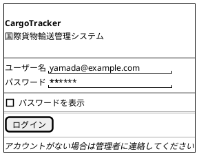

#### 仕様

- ASP.NET Core の Cookie 認証（Giraffe の `signIn` / `challenge` ハンドラ）でログイン画面を実装
- ログイン失敗時: 「ユーザー名またはパスワードが正しくありません」を赤色で表示
- ログイン成功後: ロールに応じてダッシュボードへリダイレクト
- セッションタイムアウト後は自動的に `/login?timeout` へリダイレクト

---

### ダッシュボード (/)

#### ワイヤーフレーム

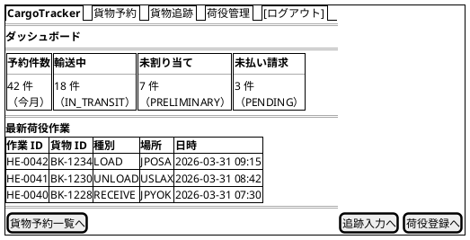

#### 仕様

- サマリーカード: 今月の予約件数・輸送中件数・未割り当て件数・未払い請求件数
- 最新荷役作業: 直近 10 件を降順表示
- ロール制御: ROLE_BILLING のみ「未払い請求」カードを表示
- htmx: ページ初期ロード時に `/api/dashboard/summary` を `hx-get` で取得

---

### 貨物予約一覧 (/bookings)

#### ワイヤーフレーム

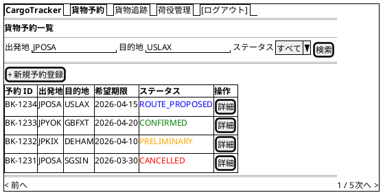

#### 仕様

- **検索フィルタ**: 出発地・目的地（港コード）・BookingState でフィルタリング
- **ステータスバッジ**: BookingState に応じた色分け（Bootstrap `badge`）
- **ページネーション**: 1 ページ 20 件
- **新規登録**: ROLE_SALES のみ表示
- **htmx**: 検索フォームに `hx-get="/bookings" hx-target="#booking-list"` で部分更新

---

### 貨物予約登録 (/bookings/new)

#### ワイヤーフレーム

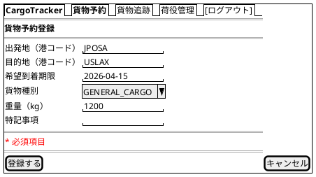

#### 仕様

- **入力項目**: 出発地・目的地（UNLOCODE 形式 5 文字）・希望到着期限・貨物種別・重量
- **荷主選択**: 登録済み荷主をインクリメンタル検索で選択する。未登録の場合は `[荷主を登録]` リンクから荷主登録画面（`/shippers/new`）へ遷移し、登録後に本画面へ戻る（US02, US03）
- **バリデーション**: htmx で `hx-post` 送信前にクライアントサイドチェック、サーバー側は F# のバリデーション関数（`Form -> Result<Command, ValidationErrors>`）による検証
- **貨物種別**: `GENERAL_CARGO`, `REFRIGERATED`, `HAZARDOUS`, `PERISHABLE` から選択
- **登録成功**: PRG パターンで `/bookings/{bookingId}` へリダイレクト
- **エラー時**: 同画面を再描画し、エラーフィールドを赤ボーダーで強調

---

### 予約詳細 (/bookings/{bookingId})

#### ワイヤーフレーム

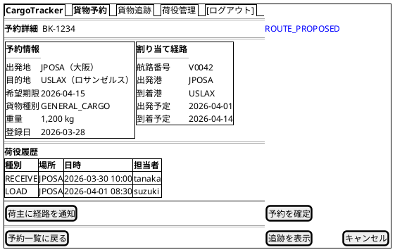

#### 仕様

- **ステータスバッジ**: ページタイトル横に BookingState を大きく表示
- **経路情報**: 未割り当ての場合は「経路が割り当てられていません（経路設計者による設計待ち）」と表示する。経路の割り当て・確定は経路設計者フロー（`/routing/requests/{bookingId}`）に一本化しており、本画面から経路を割り当てる操作は提供しない
- **荷役履歴**: HandlingEvent を時系列降順で表示
- **[経路設計者に引き渡す]**: ROLE_SALES かつ BookingState = PRELIMINARY の場合のみ表示（US06）。確認モーダル表示後に `POST /bookings/{bookingId}/assign-routing`。成功時 PRG で同詳細画面へリダイレクト、BookingState が ROUTE_PROPOSED に遷移する
- **[荷主に経路を通知]**: ROLE_SALES のみ表示し、BookingState = ROUTE_PROPOSED（経路紐付け済み）の場合に活性化する（US12）。確認モーダルに通知内容（経由港・所要日数・到着予定日・料金概算）を表示し、`POST /bookings/{bookingId}/notify-route` で荷主へ経路通知を送信する。送信後、通知送信記録が登録され、PRG で同詳細画面へリダイレクトする
- **[予約を確定]**: ROLE_SALES のみ表示し、荷主の経路承認が記録された後に活性化する（US13）。確認モーダル表示後に `POST /bookings/{bookingId}/confirm` を送信し、BookingState が CONFIRMED に更新される。確定時、経路設計者に追跡番号発行依頼の通知が送信される。荷主がルート変更を希望する場合は `[経路設計に戻す]` で経路設計中に戻し、キャンセルを希望する場合は `[キャンセル]` でキャンセル状態に変更する（キャンセル時は荷主にキャンセル確認通知を送信）
- **[キャンセル]**: ROLE_SALES のみ表示。確認ダイアログ後に `POST /bookings/{bookingId}/cancel`
- **[追跡を表示]**: `trackingNumber` が発行済みの場合のみ表示

#### BookingState × 表示ボタン対応表

| BookingState | 表示・活性となる操作ボタン（ROLE_SALES） |
| :--- | :--- |
| `PRELIMINARY` | `[経路設計者に引き渡す]`、`[キャンセル]` |
| `ROUTE_PROPOSED`（経路紐付け済み） | `[荷主に経路を通知]`、`[予約を確定]`（荷主承認後に活性）、`[経路設計に戻す]`、`[キャンセル]` |
| `CONFIRMED` | `[キャンセル]`（追跡番号発行は経路設計者が `/routing/requests` で実行） |
| `TRACKING_ISSUED` / `IN_TRANSIT` / `DELIVERED` | `[追跡を表示]` |
| `SETTLED` / `CANCELLED` | 操作ボタンなし（参照のみ） |

---

### 貨物追跡入力 (/tracking)

#### ワイヤーフレーム

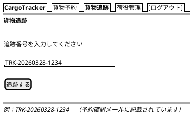

#### 仕様

- **入力フィールド**: 追跡番号（`TRK-YYYYMMDD-NNNN` 形式）
- **バリデーション**: フォーマット不正の場合はインラインエラー表示
- **未発見**: 404 の場合は「該当する貨物が見つかりません」メッセージ
- **認証不要**: 荷受人（ROLE_CONSIGNEE）は認証なしでもアクセス可

---

### 追跡詳細 (/tracking/{trackingNumber})

#### ワイヤーフレーム

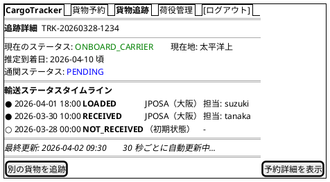

#### 仕様

- **自動更新**: htmx `hx-get="/tracking/{trackingNumber}/status" hx-trigger="every 30s" hx-target="#status-timeline"` で部分更新
- **ポーリング停止条件**: 貨物が終端状態（`CLAIMED` / `DELIVERED` / `CANCELLED`）に達した場合、サーバーは HTTP 286 でフラグメントを返す。htmx は 286 レスポンスを受け取るとポーリングを停止するため、終端状態以降の無駄なリクエストが発生しない。停止後は「最終更新」表示を「追跡は完了しました」に切り替える
- **aria-live の読み上げ制御**: ポーリングでタイムライン全体を差し替えると全履歴が再読み上げされるため、`aria-live="polite"` は最新イベント 1 件のみを含む差分領域に付与し、読み上げを最新 1 件の差分に絞る
- **タイムライン**: TransportStatus の変化を時系列で表示。最新状態を最上部に
- **TransportStatus の遷移**: `NOT_RECEIVED → RECEIVED → LOADED → ONBOARD_CARRIER → UNLOADED → AWAITING_CLAIM → CLAIMED`
- **推定到着日**: `YYYY-MM-DD 頃` の形式で表示。未確定の場合は「未確定」と表示
- **CustomsStatus**: `PENDING`（審査中）/ `CLEARED`（通関済）/ `HELD`（留置中）/ `REJECTED`（不可） をバッジで表示
- **EXCEPTION**: 異常発生時は赤色バッジで表示し、内容を詳細表示
- **[状態を更新]**: ROLE_TRACKER のみ表示。`/tracking/{trackingNumber}/status/new` へ遷移し、出港・入港等の通常状態を手動更新する（US17）
- **[例外を登録]**: ROLE_TRACKER のみ表示。`/tracking/{trackingNumber}/exceptions/new` へ遷移し、遅延・破損・紛失などの例外を登録する（US19, US20）
- **[予約詳細を表示]**: ROLE_SALES, ROLE_SHIPPER のみ表示

---

### 貨物状態更新 (/tracking/{trackingNumber}/status/new)

#### ワイヤーフレーム

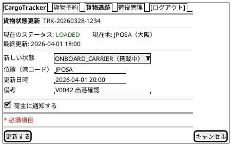

#### 仕様

- **現在情報の表示**: 追跡番号を指定して現在の貨物状態・位置・最終更新日時を画面上部に表示する（US17）
- **入力項目**: 新しい状態（TransportStatus）・位置（UN/LOCODE 形式の港コード）・更新日時・備考
- **対象状態**: 出港・入港等、荷役作業員の記録だけでは捕捉できない通常状態の変化を対象とする。遅延・破損・紛失などの例外は例外登録画面（`/tracking/{trackingNumber}/exceptions/new`、US19/US20）で扱う
- **履歴記録**: 更新後、追跡イベントが履歴に記録され、追跡詳細のタイムラインに反映される
- **荷主通知**: 状態変更の種類に応じて荷主への通知が送信される。「荷主に通知する」チェックボックスをデフォルト ON で表示する
- **バリデーション**: 港コードのフォーマット不正・TransportStatus の遷移順序違反はインラインエラー表示
- **更新成功**: PRG パターンで `/tracking/{trackingNumber}` へリダイレクト
- **アクセス制御**: ROLE_TRACKER のみアクセス可能

---

### 例外登録 (/tracking/{trackingNumber}/exceptions/new)

#### ワイヤーフレーム

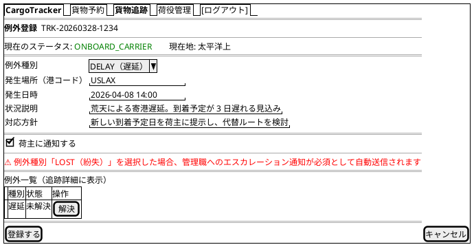

#### 仕様

- **例外種別**: `DELAY`（遅延）, `DAMAGE`（破損）, `LOST`（紛失）, `CUSTOMS_HOLD`（通関保留）から選択（US19, US20。永続値・`ExceptionType.ofString` と一致）
- **入力項目**: 発生場所（港コード）・発生日時・状況説明・対応方針（新しい到着予定日・補償方針等）
- **荷主通知**: 「荷主に通知する」チェックボックスをデフォルト ON で表示。登録時に荷主へ例外発生通知を送信する
- **LOST 選択時**: 緊急フラグが設定され、管理職へのエスカレーション通知が必須・自動で送信される旨を画面上に表示する（US20）
- **例外解決（追跡詳細から）**: 追跡詳細（`/tracking/{trackingNumber}`）の例外一覧に未解決例外ごとの [解決] インラインフォームを表示し、対応内容を入力して `POST /tracking/{trackingNumber}/exceptions/{index}/resolve` で解決する（ROLE_TRACKER）。解決すると `resolution_notes` に対応内容が記録され、貨物状態は例外発生前へ復帰する（US19「対応報告」）
- **登録成功**: 貨物状態が `EXCEPTION` に更新され、PRG パターンで `/tracking/{trackingNumber}` へリダイレクト。例外対応履歴が記録される
- **アクセス制御**: ROLE_TRACKER のみアクセス可能

---

### 荷役作業登録 (/handling/new)

#### ワイヤーフレーム

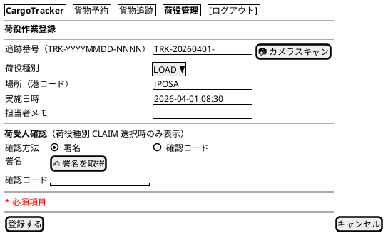

#### 仕様

- **荷役種別**: `RECEIVE`（受領）, `LOAD`（積込）, `UNLOAD`（荷降し）, `CUSTOMS`（通関）, `CLAIM`（引取）から選択。コード値は `CUSTOMS` に統一し、画面上の表示ラベルは「通関」とする
- **経路不一致警告（US15）**: 入力された作業場所が予定ルート（Itinerary）と異なる場合、登録時に「作業場所が予定ルートと一致しません（MISROUTED 判定）」の警告を表示する。作業員は内容を確認のうえ `[警告を確認して登録を続行]` で登録を続行できる（ドメインの経路不一致 Warning ロジックと整合）
- **追跡番号**: `TRK-YYYYMMDD-NNNN` 形式。`[📷 カメラスキャン]` ボタンでバーコード・QR スキャン入力に対応
- **荷受人確認（CLAIM 選択時）**: 荷役種別で `CLAIM`（引取）を選択すると、htmx `hx-get="/handling/new/claim-fields" hx-trigger="change" hx-target="#claim-confirmation"` で「荷受人確認」欄（署名または確認コード）を動的に追加表示する（US16）。荷受人確認の取得は引取作業登録の必須条件とし、未取得の場合はバリデーションエラーを表示する
- **CLAIM 登録後の状態**: 荷受人確認が取得されると引取作業が記録され、貨物状態が `CLAIMED`（引取済）に更新される。引取済は配送完了を意味し、精算処理（US21）の開始条件となる
- **実施日時**: 画面表示時に現在日時をデフォルト値として自動入力する（作業直後の登録が大半のため入力の手間を削減）。過去・未来の日時を登録する場合のみ手動で修正する。未来日時は警告表示（投機的な登録は許可）
- **登録成功**: PRG パターンで `/handling` へリダイレクト

---

### 荷役作業一覧 (/handling)

#### ワイヤーフレーム

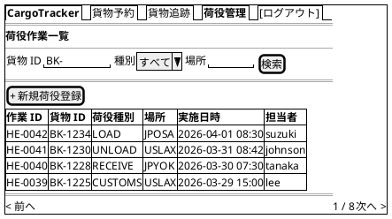

#### 仕様

- **検索フィルタ**: 貨物 ID・荷役種別・場所（港コード）でフィルタリング
- **htmx**: 検索フォームに `hx-get="/handling" hx-target="#handling-list"` で部分更新
- **新規登録**: ROLE_HANDLER のみ表示
- **ページネーション**: 1 ページ 20 件

---

### 航路一覧 (/voyages)

#### ワイヤーフレーム

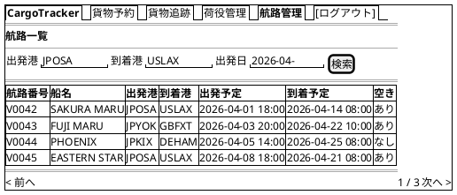

#### 仕様

- **検索フィルタ**: 出発港・到着港・出発日でフィルタリング
- **空き状況**: 積載容量に余裕があるかを「あり / なし」で表示
- **航路の追加・変更**: `[+ 新規航海]` ボタンで航海スケジュール登録画面（`/voyages/new`、US24）へ、各行の `[編集]` ボタンで航海スケジュール更新画面（`/voyages/{voyageNumber}/edit`、US25）へ遷移する（ROLE_ROUTE_DESIGNER のみ表示）
- **経路設計への連携**: 経路設計・候補算出画面（`/routing/requests/{bookingId}`）が本データを参照して候補を生成

---

### 航海スケジュール登録 (/voyages/new)

#### ワイヤーフレーム

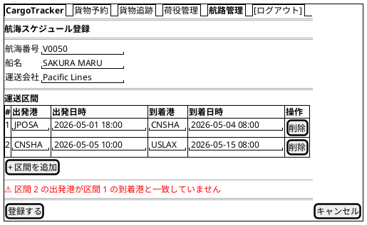

#### 仕様

- **入力項目**: 航海番号・船名・運送会社・運送区間（出発港・到着港・出発日時・到着日時、UN/LOCODE 形式）・対応貨物種別（US24）
- **複数行入力**: `[+ 区間を追加]` で運送区間の行を追加できる。寄港地は区間の連なりとして順序付きで表現する
- **連続性検証**: 区間 N の到着港と区間 N+1 の出発港が一致しない場合、および出発日時が到着日時より後の場合はエラーを赤色で表示する
- **重複チェック**: 同一航海番号が既に存在する場合はエラー表示。存在しない場合のみ登録が完了し登録番号が発行される
- **登録成功**: PRG パターンで `/voyages` へリダイレクト。以降、航海スケジュール検索（US07）の対象となる
- **アクセス制御**: ROLE_ROUTE_DESIGNER のみアクセス可能

---

### 航海スケジュール更新 (/voyages/{voyageNumber}/edit)

#### ワイヤーフレーム

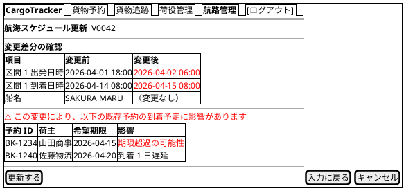

#### 仕様

- **呼び出し**: 既存の航海番号を指定して登録済みスケジュールをフォームに読み込む（US25）
- **差分確認ステップ**: 入力内容の送信後、既存内容と更新内容の差分を確認画面に表示し、`[更新する]` の選択で初めて上書き更新する（US25 受入基準）
- **影響予約の警告**: 変更により到着予定が変わる既存予約（当該航海が経路に含まれる予約）を一覧表示し、希望期限超過の可能性がある予約を赤色で警告する
- **更新成功**: PRG パターンで `/voyages` へリダイレクト。航海スケジュール検索（US07）の結果に更新内容が反映される
- **[キャンセル]**: 既存スケジュールは変更されずに `/voyages` へ戻る
- **アクセス制御**: ROLE_ROUTE_DESIGNER のみアクセス可能

---

### 経路設計依頼一覧 (/routing/requests)

#### ワイヤーフレーム

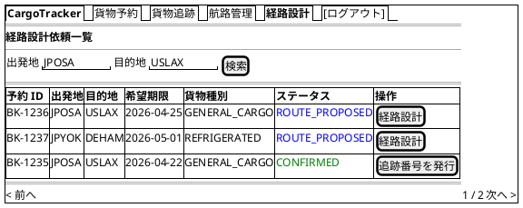

#### 仕様

- **一覧対象**: 営業担当者から経路設計者に引き渡された予約（ROUTE_PROPOSED 待ち、`assign-routing` 済み）と、追跡番号発行待ちの CONFIRMED 予約を引き渡し日昇順で表示する
- **検索フィルタ**: 出発地・目的地（港コード）でフィルタリング
- **[経路設計]**: `/routing/requests/{bookingId}` へ遷移し、経路設計・候補算出を開始する
- **[追跡番号を発行]**: BookingState = CONFIRMED（予約確定）の予約にのみ表示する（US14）。確認モーダル表示後に `POST /routing/requests/{bookingId}/issue-tracking` を送信し、一意の追跡番号（`TRK-YYYYMMDD-NNNN` 形式）を採番する。発行時に公開追跡用の推測困難なアクセストークンも併せて発行する。発行後、貨物状態が「受領待ち（NOT_RECEIVED）」に設定され、荷主へ追跡番号と追跡方法（公開追跡 URL `/public/tracking/{accessToken}`）がメール通知される。成功時 PRG で本一覧へリダイレクトし、BookingState が TRACKING_ISSUED に更新される
- **アクセス制御**: ROLE_ROUTE_DESIGNER のみアクセス可能

---

### 経路設計・候補算出 (/routing/requests/{bookingId})

#### ワイヤーフレーム

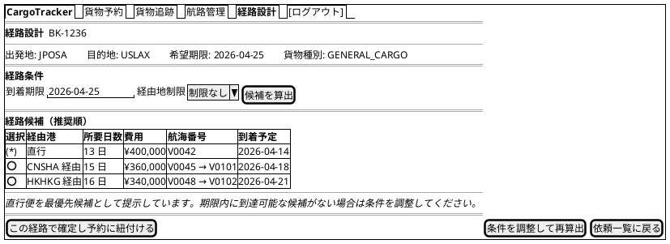

#### 仕様

- **経路条件表示**: 予約番号から出発地・目的地・希望期限・貨物仕様を表示する（US07）
- **航海スケジュール検索**: 経路条件をもとに航海スケジュールを検索し、寄港地接続・港湾制約・貨物種別対応を満たす航海に絞り込む。危険物・冷凍貨物は対応可能な航海のみ対象とする（US07）
- **経路候補算出**: `[候補を算出]` で経路候補を自動算出し、所要日数・経由港・費用・航海番号を推奨順に表示する。直行便がある場合は最優先候補として提示する（US08）
- **候補比較・選択**: ラジオボタンで候補を 1 件選択できる。選択すると htmx `hx-get` で候補詳細を部分更新する（US09）
- **条件調整・再算出**: `[条件を調整して再算出]` で期限延長・経由地追加等の条件を変更し再算出できる。調整後も候補がない場合は営業担当者への条件協議依頼を送信できる（US10）
- **確定・紐付け**: `[この経路で確定し予約に紐付ける]` で `POST /routing/requests/{bookingId}/confirm` を送信。経路状態が「確定」となり予約に紐付き、BookingState が ROUTE_PROPOSED に更新される。PRG パターンで `/routing/requests` へリダイレクト（US11）
- **経路割り当ての一本化**: 経路の割り当て・確定は本画面（経路設計者フロー）に一本化する。営業担当者は予約詳細画面から `[経路設計者に引き渡す]` で設計を依頼し、確定後は `[荷主に経路を通知]`（US12）・`[予約を確定]`（US13）を担う
- **アクセス制御**: ROLE_ROUTE_DESIGNER のみアクセス可能

---

### 荷主一覧 (/shippers)

#### ワイヤーフレーム

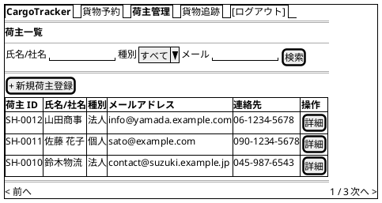

#### 仕様

- **検索フィルタ**: 氏名/社名・荷主種別（個人/法人）・メールアドレスでフィルタリング
- **htmx**: 検索フォームに `hx-get="/shippers" hx-target="#shipper-list"` で部分更新
- **[+ 新規荷主登録]**: `/shippers/new` へ遷移
- **予約登録との連携**: 貨物予約登録画面の荷主選択が本データを参照する
- **アクセス制御**: ROLE_SALES のみアクセス可能

---

### 荷主登録 (/shippers/new)

#### ワイヤーフレーム

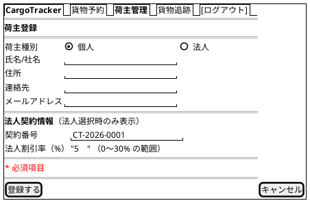

#### 仕様

- **入力項目**: 氏名/社名・住所・連絡先・メールアドレス・荷主種別（個人/法人）（US02）
- **種別切替**: 荷主種別「法人」を選択すると、契約番号・法人割引率の入力フィールドを htmx で追加表示する（US03）
- **法人割引率**: 0〜30% の範囲でバリデーションする。登録した割引率は精算時（US22）に自動適用される
- **重複チェック**: 同一メールアドレスが既に登録されている場合、既存荷主を表示しどちらを使用するか選択できる
- **登録成功**: 荷主 ID を発行し、PRG パターンで `/shippers` へリダイレクト。予約登録画面から遷移した場合は予約登録画面へ戻る
- **アクセス制御**: ROLE_SALES のみアクセス可能

---

### 精算書一覧 (/billing/invoices)

#### ワイヤーフレーム

```plantuml
@startsalt
{+
  {/ <b>CargoTracker</b> | 貨物予約 | 貨物追跡 | 荷役管理 | <b>請求管理</b> | [ログアウト] }
  ==
  <b>精算書一覧</b>
  --
  {
    ステータス | ^PENDING^ | 発行日 | "2026-03-  " | [検索]
  }
  ==
  [+ 新規精算書発行]
  {#
    **精算書 ID** | **予約 ID** | **金額** | **発行日**   | **支払期限** | **ステータス**
    INV-0021      | BK-1234     | ¥450,000 | 2026-03-28   | 2026-04-28   | <color:red>PENDING</color>
    INV-0020      | BK-1230     | ¥320,000 | 2026-03-25   | 2026-04-25   | <color:red>PENDING</color>
    INV-0019      | BK-1225     | ¥580,000 | 2026-03-20   | 2026-04-20   | <color:green>CONFIRMED</color>
    INV-0018      | BK-1220     | ¥210,000 | 2026-03-15   | 2026-04-15   | <color:green>CONFIRMED</color>
  }
  ==
  < 前へ | 1 / 2 | 次へ >
}
@endsalt
```

#### 仕様

- **フィルタ**: PaymentState（`PENDING`, `CONFIRMED`, `OVERDUE`）・発行日でフィルタリング
- **ステータスバッジ**: `PENDING` は赤、`CONFIRMED` は緑、`OVERDUE` は濃い赤で表示
- **支払期限超過**: 期限超過かつ未払いの場合は行を赤色ハイライトし、あわせてステータス欄に警告アイコン（⚠）付きの `OVERDUE` バッジをラベル表示する。色のみに依存しない表示とすることで WCAG 2.1 の「色だけに頼らない（1.4.1 Use of Color）」に準拠する
- **[+ 新規精算書発行]**: 料金算出画面（`/billing/invoices/new`、US21/US22）へ遷移する
- **アクセス制御**: ROLE_BILLING のみアクセス可能

---

### 料金算出 (/billing/invoices/new)

#### ワイヤーフレーム

```plantuml
@startsalt
{+
  {/ <b>CargoTracker</b> | 貨物予約 | 貨物追跡 | 荷役管理 | <b>請求管理</b> | [ログアウト] }
  ==
  <b>料金算出</b>
  ==
  {
    対象予約（引取済のみ） | ^BK-1234（JPOSA → USLAX / 山田商事）^ | [実績を読み込む]
  }
  ==
  <b>輸送実績</b>
  {+
    経路       | JPOSA → USLAX（直行 / V0042）
    距離       | 9,100 km
    重量       | 1,200 kg
    貨物種別   | GENERAL_CARGO
    ----
    <b>荷役作業実績</b>
    {#
      **種別** | **場所** | **日時**
      RECEIVE  | JPOSA    | 2026-03-30 10:00
      LOAD     | JPOSA    | 2026-04-01 08:30
      UNLOAD   | USLAX    | 2026-04-14 09:00
      CLAIM    | USLAX    | 2026-04-15 14:00
    }
  }
  ==
  {
    {+
      <b>料金計算</b>
      ----
      基本料金（自動計算）   | ¥400,000
      燃油サーチャージ       | ¥30,000
      ----
      <b>料金調整</b>（例外発生時のみ入力可）
      調整種別   | ^減額（遅延補償）^
      調整額     | "-10,000      "
      調整理由   | "3 日遅延に伴う減額    "
    } |
    {+
      <b>法人割引</b>（自動取得）
      ----
      荷主種別   | 法人（山田商事）
      契約番号   | CT-2026-0001
      契約割引率 | 5%（自動適用）
      割引額     | -¥21,000
      ----
      <b>請求金額</b>
      小計       | ¥399,000
      消費税（10%）| ¥39,900
      <b>合計   | ¥438,900</b>
    }
  }
  ==
  [料金を確定する] | [キャンセル]
}
@endsalt
```

#### 仕様

- **対象予約**: 貨物状態が「引取済（CLAIMED）」の予約のみ選択できる（US21）。引取済以外の予約は選択リストに表示しない
- **輸送実績表示**: `[実績を読み込む]` で htmx `hx-get` により対象予約の輸送実績（経路・距離・重量・貨物種別・荷役作業実績）を部分表示する（US21）
- **基本料金の自動計算**: 輸送実績（経路・距離・重量・貨物種別）に基づき基本料金をサーバー側で自動計算して表示する（US21）
- **料金調整**: 例外（遅延・破損等）が発生している予約の場合のみ、料金調整（減額・補償費用）の入力欄を活性化する。調整種別・調整額・調整理由を入力すると htmx で請求金額を再計算・部分更新する（US21）
- **法人割引の自動取得・適用**: 荷主種別が「法人」の場合、荷主登録時（US03）の契約割引率（0〜30%）を自動的に取得・表示し、基本料金に適用した割引後の金額を表示する。個人荷主の場合は法人割引欄に「適用なし（個人荷主）」と表示し、割引を適用しない（US22）
- **割引根拠の記載**: 割引計算の根拠（割引率・基本料金・割引後料金）は確定後の精算書（精算書詳細）に記載される（US22）
- **[料金を確定する]**: `POST /billing/invoices` を送信し、輸送料金が「確定」状態で登録される。成功時 PRG パターンで `/billing/invoices/{invoiceId}`（精算書詳細）へリダイレクトする
- **アクセス制御**: ROLE_BILLING のみアクセス可能

---

### 精算書詳細 (/billing/invoices/{invoiceId})

#### ワイヤーフレーム

```plantuml
@startsalt
{+
  {/ <b>CargoTracker</b> | 貨物予約 | 貨物追跡 | 荷役管理 | <b>請求管理</b> | [ログアウト] }
  ==
  <b>精算書詳細</b>  INV-0021  |  <color:red>PENDING</color>
  ==
  {
    {+
      <b>請求情報</b>
      ----
      対象予約   | BK-1234（JPOSA → USLAX）
      発行日     | 2026-03-28
      支払期限   | 2026-04-28
      担当営業   | 山田 太郎
    } |
    {+
      <b>金額内訳</b>
      ----
      基本運賃   | ¥400,000
      燃油サーチャージ | ¥30,000
      割引（早期予約） | -¥10,000
      ----
      小計       | ¥420,000
      消費税（10%）   | ¥42,000
      ----
      <b>合計     | ¥462,000</b>
    }
  }
  ==
  <b>支払い確認</b>
  {
    支払日    | "2026-04-10   "
    支払方法  | ^銀行振込^
    備考      | "              "
  }
  ==
  [支払い確認を登録] | [精算書一覧に戻る]
}
@endsalt
```

#### 仕様

- **金額内訳**: 基本運賃・サーチャージ・割引・消費税を明細表示
- **[支払い確認を登録]**: `POST /billing/invoices/{invoiceId}/confirm` を送信。PRG パターンで同画面へリダイレクト
- **確認済み**: PaymentState が `CONFIRMED` の場合は支払いフォームを非表示にし、確認日時を表示
- **PDF 出力**: `GET /billing/invoices/{invoiceId}/pdf` で精算書 PDF をダウンロード（将来実装）

---

### 割引ポリシー一覧 (/admin/discount-policies)

#### ワイヤーフレーム

```plantuml
@startsalt
{+
  {/ <b>CargoTracker</b> | 貨物予約 | 貨物追跡 | 管理設定 | [ログアウト] }
  ==
  <b>割引ポリシー一覧</b>
  ==
  {
    検索: | "貨物種別または顧客カテゴリ  " | [検索]
  }
  {#
    **ID** | **ポリシー名** | **貨物種別** | **顧客区分** | **割引率** | **有効開始** | **有効終了** | **操作**
    DP-001 | 一般顧客基本割引 | GENERAL | STANDARD | 0% | 2026-01-01 | -（無期限） | [編集][無効化]
    DP-002 | 契約顧客割引 | ALL | CONTRACT | 5% | 2026-01-01 | -（無期限） | [編集][無効化]
    DP-003 | ボリューム顧客割引 | ALL | VOLUME | 10% | 2026-01-01 | -（無期限） | [編集][無効化]
    DP-004 | 危険物割増 | DANGEROUS | ALL | -3% | 2026-01-01 | -（無期限） | [編集][無効化]
  }
  ==
  [+ 新規ポリシー登録]
}
@endsalt
```

#### 仕様

- **一覧**: 有効期間・有効 / 無効ステータスでフィルタリング可能
- **[編集]**: `/admin/discount-policies/{id}/edit` に遷移
- **[無効化]**: `POST /admin/discount-policies/{id}/disable` で論理削除（PRG パターン）
- **[+ 新規ポリシー登録]**: `/admin/discount-policies/new` に遷移
- **アクセス制御**: `ROLE_ADMIN` のみアクセス可能。他ロールは 403 画面を表示

---

### 割引ポリシー登録 (/admin/discount-policies/new)

#### ワイヤーフレーム

```plantuml
@startsalt
{+
  {/ <b>CargoTracker</b> | 貨物予約 | 貨物追跡 | 管理設定 | [ログアウト] }
  ==
  <b>割引ポリシー登録</b>
  ==
  {
    ポリシー名       | "                              "
    対象貨物種別     | ^GENERAL（一般）▼^
    対象顧客区分     | ^STANDARD（通常）▼^
    割引率（%）      | "    "  （プラス: 割引 / マイナス: 割増）
    有効開始日       | "YYYY-MM-DD  "
    有効終了日       | "YYYY-MM-DD  " （空欄 = 無期限）
  }
  ==
  [  登録する  ] | [キャンセル]
}
@endsalt
```

#### 仕様

- **バリデーション**: 割引率は -50〜100% の範囲、有効開始日 ≤ 有効終了日
- **重複チェック**: 同一の「貨物種別 × 顧客区分 × 期間」のポリシーが既に存在する場合はエラー表示
- **[登録する]**: `POST /admin/discount-policies` に送信。PRG パターンで一覧にリダイレクト
- **[キャンセル]**: `/admin/discount-policies` に戻る

---

### 公開貨物追跡 (/public/tracking/{accessToken})

#### ワイヤーフレーム

```plantuml
@startsalt
{+
  ==
  {
    .
    <b>CargoTracker 公開追跡</b>
    貨物の現在状況をご確認いただけます
    .
  }
  ==
  {
    追跡番号 | "TRK-20260328-1234          " | [追跡]
  }
  ==
  <b>追跡結果</b>
  {+
    追跡番号: TRK-20260328-1234
    ステータス: <b>輸送中（IN_TRANSIT）</b>
    現在地: JPOSA → USLAX
    ----
    <b>イベント履歴</b>
    {#
      **日時** | **イベント** | **場所**
      2026-03-31 09:15 | 積込（LOAD） | JPOSA
      2026-03-30 14:00 | 受取（RECEIVE） | JPOSA
    }
  }
  ==
  <i>お問い合わせ: support@cargotracker.example.com</i>
}
@endsalt
```

#### 仕様

- **認証**: 不要（Giraffe のルーティングで `/public/**` を認可ハンドラの外に配置して許可）
- **アクセストークン方式**: 追跡番号（`TRK-YYYYMMDD-NNNN`）は連番を含み URL からの推測が可能なため、公開ページの URL には埋め込まない。追跡番号発行時（US14）に推測困難なアクセストークン（例: 128 bit 以上のランダム値）を併せて発行し、公開追跡 URL `/public/tracking/{accessToken}` を荷主へメール通知する。認証済み画面（`/tracking/{trackingNumber}`）は従来どおり追跡番号を使用する
- **追跡番号フォーム**: `GET /public/tracking/{accessToken}` でページ表示。結果は同一ページ内に表示
- **404 処理**: 存在しないアクセストークンは「該当する貨物が見つかりません。お知らせした追跡 URL を確認の上、再度お試しください」を表示（トークンの有効・無効を推測されないよう、形式不正・未登録とも同一メッセージとする）
- **連絡先**: フッターに問い合わせメールアドレスを表示（荷主への導線確保）
- **レスポンシブ**: モバイルファースト（スマートフォンで QR コードから直接アクセスを想定）
- **表示情報の制限**: TransportStatus・最終イベント・現在地のみ（荷主名・住所等の個人情報は非表示）
- **AFTER_COMMIT タイムラグ**: ステータス反映に最大 30 秒かかる旨を画面下部に注記する

---

### コンポーネント設計（Giraffe.ViewEngine 関数コンポーネント）

すべての UI 部品は Giraffe.ViewEngine の **F# 関数（`DTO -> XmlNode`）** として実装し、関数合成で画面を組み立てます。
Razor のパーシャルビュー・タグヘルパーに相当するものはすべてモジュール関数です。

| コンポーネント | シグネチャ | 用途 |
| :--- | :--- | :--- |
| `Layout.layout` | `PageContext -> XmlNode list -> XmlNode` | 共通レイアウト（ナビ・フッター・フラッシュ表示を合成） |
| `Nav.navBar` | `UserContext option -> XmlNode` | ロール別ナビゲーションバー |
| `Alerts.alerts` | `FlashMessage list -> XmlNode` | フラッシュメッセージ表示 |
| `Pagination.pagination` | `PageInfo -> XmlNode` | ページネーション |
| `StatusBadge.bookingStateBadge` | `BookingState -> XmlNode` | BookingState バッジ（付録の対応表に従う） |
| `StatusBadge.transportStatusBadge` | `TransportStatus -> XmlNode` | TransportStatus バッジ |
| `Form.textField` | `string -> string -> string -> ValidationErrors -> XmlNode` | ラベル + input + エラー表示の型安全フィールド |
| `Tracking.Partials.statusTimeline` | `TransportStatusDto -> XmlNode` | 追跡タイムライン（htmx 部分更新対象） |
| `Booking.Partials.bookingList` | `BookingListDto -> XmlNode` | 予約一覧テーブル（htmx 部分更新対象） |

ステータスバッジの実装例です。

```fsharp
module CargoTracker.Web.Views.Components.StatusBadge

open Giraffe.ViewEngine

let bookingStateBadge (status: BookingState) : XmlNode =
    let cls, label' =
        match status with
        | Preliminary    -> "badge bg-warning text-dark", "仮予約"
        | RouteProposed  -> "badge bg-primary", "経路提案済"
        | Confirmed      -> "badge bg-success", "確認済"
        | TrackingIssued -> "badge bg-info text-dark", "追跡番号発行済"
        | InTransit      -> "badge bg-primary", "輸送中"
        | Delivered      -> "badge bg-success", "配送完了"
        | Settled        -> "badge bg-secondary", "精算完了"
        | Cancelled      -> "badge bg-danger", "キャンセル"
    span [ _class cls; attr "aria-label" $"ステータス: {label'}" ] [ str label' ]
```

判別共用体のパターンマッチにより、ステータス追加時の表示漏れをコンパイラが検出します。
htmx 部分更新対象の部分ビュー関数は、ページビューとハンドラの両方から呼び出せる独立関数として定義します
（詳細は [フロントエンドアーキテクチャ](architecture_frontend.md) を参照）。

---

### htmx 部分更新パターン

#### 追跡ステータス自動更新

追跡詳細画面では、荷物の状態をユーザーがリロードせずに確認できるよう、30 秒ごとに自動更新します。

```fsharp
// 追跡詳細画面のステータスタイムライン部分（Views/Tracking/Partials.fs）
let statusTimelineContainer (dto: TransportStatusDto) : XmlNode =
    div [ _id "status-timeline"
          Htmx._hxGet $"/tracking/{dto.TrackingNumber}/status"
          Htmx._hxTrigger "every 30s"
          Htmx._hxSwap "innerHTML" ] [
        statusTimeline dto  // サーバーレンダリングされた初期コンテンツ
    ]

let lastUpdated (dto: TransportStatusDto) : XmlNode =
    p [ _id "last-updated" ] [ str "最終更新: "; span [] [ str dto.LastUpdated ] ]
```

**サーバー側レスポンス**: `/tracking/{trackingNumber}/status` は `htmlView (statusTimeline dto)` で HTML フラグメント（部分ビュー関数の出力）を返す（`Content-Type: text/html`）。

**ポーリングの停止**: 貨物が終端状態（`CLAIMED` / `DELIVERED` / `CANCELLED`）の場合、サーバーはステータスコード **HTTP 286** でフラグメントを返す。htmx は 286 を受け取ると `hx-trigger="every 30s"` のポーリングを停止する仕様のため、クライアント側の追加実装なしに終端状態でポーリングが止まる。

```fsharp
// 終端状態なら 286 を返してポーリングを停止させる
let statusCode' = if TransportStatus.isTerminal dto.Status then 286 else 200
return! (setStatusCode statusCode' >=> htmlView (statusTimeline dto)) next ctx
```

**aria-live の扱い**: タイムライン全体（`#status-timeline`）には `aria-live` を付与せず、最新イベント 1 件のみを描画する差分領域（`#latest-event`）に `aria-live="polite"` を付与する。これによりポーリングごとの全履歴再読み上げを防ぎ、スクリーンリーダーへの通知を最新 1 件の差分に絞る。

#### 検索フォームの部分更新

貨物予約一覧・荷役作業一覧の検索フォームは、ページ全体を再読み込みせずに結果テーブルのみを更新します。

```html
<form hx-get="/bookings"
      hx-target="#booking-list"
      hx-swap="outerHTML"
      hx-push-url="true">
  <input name="origin" type="text" placeholder="出発地">
  <input name="destination" type="text" placeholder="目的地">
  <select name="status">...</select>
  <button type="submit">検索</button>
</form>
<div id="booking-list">
  <!-- 検索結果テーブル -->
</div>
```

`hx-push-url="true"` により、検索条件が URL に反映されブラウザ履歴に残ります。

#### 経路候補の動的読み込み

経路設計・候補算出画面でラジオボタンを選択すると、選択した航路の詳細を動的に読み込みます。

```html
<input type="radio" name="voyageNumber" value="V0042"
       hx-get="/api/voyages/V0042/detail"
       hx-target="#voyage-detail"
       hx-swap="innerHTML">
```

#### フォームのインラインバリデーション

入力フィールドからフォーカスが外れたタイミング（`blur`）でサーバーサイドバリデーションを実行します。

```html
<input name="origin" type="text"
       hx-post="/api/validate/location"
       hx-trigger="blur"
       hx-target="next .error-message"
       hx-swap="innerHTML">
<span class="error-message text-danger"></span>
```

---

### エラーハンドリング

#### バリデーションエラー表示

- **フィールドレベル**: 各入力フィールドの下に赤字でメッセージ表示（Bootstrap `invalid-feedback`）
- **フォームレベル**: フォーム上部にアラートバナー（`alert-danger`）でまとめて表示
- **Giraffe.ViewEngine**: `Form.textField` 関数がフィールドごとのサーバーバリデーションエラーを表示

```fsharp
// Form.textField が生成する HTML（エラーあり時）
div [ _class "mb-3" ] [
    label [ _class "form-label"; _for "Origin" ] [
        str "出発地 "; span [ _class "text-danger" ] [ str "*" ] ]
    input [ _type "text"; _id "Origin"; _name "Origin"
            _class "form-control is-invalid"; _value form.Origin ]
    div [ _class "invalid-feedback d-block" ] [ str "出発地は必須です" ]
]
```

#### フラッシュメッセージ

PRG パターンのリダイレクト後に、操作結果を Session ベースのフラッシュメッセージ（`Flash` モジュール）でフィードバックします。

| 操作 | メッセージ例 | Bootstrap クラス |
| :--- | :--- | :--- |
| 予約登録成功 | 「貨物予約 BK-1234 を登録しました」 | `alert-success` |
| 経路確定成功 | 「経路 V0042 を確定し予約に紐付けました」 | `alert-success` |
| 追跡番号発行成功 | 「追跡番号 TRK-20260328-1234 を発行し、荷主にメール通知しました」 | `alert-success` |
| 荷役登録成功 | 「荷役作業 HE-0042 を登録しました」 | `alert-success` |
| 支払い確認成功 | 「精算書 INV-0021 の支払いを確認しました」 | `alert-success` |
| バリデーションエラー | 「入力内容に誤りがあります。確認してください」 | `alert-danger` |
| システムエラー | 「処理中にエラーが発生しました。時間をおいて再試行してください」 | `alert-danger` |

フラッシュメッセージは共通コンポーネント関数 `Views/Shared/Components/Alerts.fs` の `alerts` 関数で一元管理し、レイアウト関数から合成します。

#### エラーページ

| HTTP ステータス | 画面 | 内容 |
| :--- | :--- | :--- |
| 400 Bad Request | `/error/400` | 不正なリクエスト。入力を確認してください |
| 403 Forbidden | `/error/403` | アクセス権限がありません |
| 404 Not Found | `/error/404` | 指定されたページまたはリソースが見つかりません |
| 500 Internal Server Error | `/error/500` | サーバーエラーが発生しました。管理者に連絡してください |

各エラーページはナビゲーションバーを表示し、ダッシュボードへ戻るリンクを提供します（`UseStatusCodePagesWithReExecute` で実装）。

#### htmx エラーハンドリング

htmx リクエストがエラーを返した場合は、`htmx:responseError` イベントをキャッチして通知を表示します。

```javascript
document.addEventListener('htmx:responseError', function(event) {
  const status = event.detail.xhr.status;
  const messageEl = document.getElementById('htmx-error-toast');
  if (status === 404) {
    messageEl.textContent = '対象データが見つかりませんでした';
  } else {
    messageEl.textContent = '通信エラーが発生しました。再試行してください';
  }
  messageEl.classList.remove('d-none');
});
```

---

### アクセシビリティ

#### キーボードナビゲーション

- **Tab 順序**: フォーム項目 → 送信ボタン → ナビゲーションの順に自然な Tab 移動
- **Enter キー**: フォーム内でのフォーカス状態で Enter キーを押すと送信
- **Escape キー**: モーダル・確認ダイアログを閉じる
- **スキップリンク**: `<a href="#main-content" class="visually-hidden-focusable">コンテンツにスキップ</a>` をヘッダー先頭に配置

#### ARIA 対応

| 要素 | ARIA 属性 |
| :--- | :--- |
| ナビゲーションバー | `role="navigation" aria-label="メインナビゲーション"` |
| 検索フォーム | `role="search" aria-label="貨物検索"` |
| データテーブル | `role="grid" aria-label="[テーブル名]"` |
| ステータスバッジ | `aria-label="ステータス: ROUTE_PROPOSED"` |
| ローディングインジケーター | `aria-live="polite" aria-busy="true"` |
| エラーメッセージ | `role="alert" aria-live="assertive"` |
| フラッシュメッセージ | `role="status" aria-live="polite"` |

#### htmx と ARIA

htmx の部分更新後に動的コンテンツが更新されることをスクリーンリーダーに通知します。
ただし、ポーリングでタイムライン全体を読み上げ対象にすると更新のたびに全履歴が再読み上げされるため、`aria-live` は最新イベント 1 件のみの差分領域に付与し、通知を最新 1 件に絞ります。

```html
<!-- ポーリング対象のタイムライン本体には aria-live を付与しない -->
<div id="status-timeline"
     hx-get="/tracking/TRK-20260328-1234/status"
     hx-trigger="every 30s">
  <!-- 最新イベント 1 件のみを aria-live で通知 -->
  <div id="latest-event" aria-live="polite" aria-atomic="true">
    2026-04-01 18:00 LOADED JPOSA（大阪）
  </div>
  <!-- 過去履歴（読み上げ通知の対象外） -->
</div>
```

なお、終端状態（CLAIMED / DELIVERED / CANCELLED）ではサーバーが HTTP 286 を返してポーリング自体を停止します（「htmx 部分更新パターン」参照）。

#### カラーコントラスト

- 通常テキスト: コントラスト比 4.5:1 以上（WCAG AA 準拠）
- 大きいテキスト（18px 以上）: 3:1 以上
- ステータスバッジは色のみに依存せず、テキストラベルを必ず併記

---

## 付録: BookingState / TransportStatus 対応表

### BookingState バッジ定義

| ステータス | 表示ラベル | Bootstrap クラス | 意味 |
| :--- | :--- | :--- | :--- |
| `PRELIMINARY` | 仮予約 | `badge bg-warning text-dark` | 経路未割り当て |
| `ROUTE_PROPOSED` | 経路提案済 | `badge bg-primary` | 経路割り当て完了・未確認 |
| `CONFIRMED` | 確認済 | `badge bg-success` | 予約確定 |
| `TRACKING_ISSUED` | 追跡番号発行済 | `badge bg-info text-dark` | 追跡番号付与 |
| `IN_TRANSIT` | 輸送中 | `badge bg-primary` | 積み込み済・輸送中 |
| `DELIVERED` | 配送完了 | `badge bg-success` | 配達完了 |
| `SETTLED` | 精算完了 | `badge bg-secondary` | 請求・支払い完了 |
| `CANCELLED` | キャンセル | `badge bg-danger` | キャンセル済 |

### TransportStatus バッジ定義

| ステータス | 表示ラベル | Bootstrap クラス |
| :--- | :--- | :--- |
| `NOT_RECEIVED` | 未受取 | `badge bg-secondary` |
| `RECEIVED` | 受取済 | `badge bg-info text-dark` |
| `LOADED` | 積み込み済 | `badge bg-primary` |
| `ONBOARD_CARRIER` | 搭載中 | `badge bg-primary` |
| `UNLOADED` | 荷降ろし済 | `badge bg-warning text-dark` |
| `AWAITING_CLAIM` | 引取待ち | `badge bg-warning text-dark` |
| `CLAIMED` | 引取完了 | `badge bg-success` |
| `EXCEPTION` | 例外 | `badge bg-danger` |
