# UI 設計 - 国際貨物輸送管理システム

## 概要

本ドキュメントでは、国際貨物輸送管理システムの UI 設計を定義する。

### 設計方針

**OOUX（オブジェクト指向 UI 設計）** をベースに、ユーザーが操作する「オブジェクト」（貨物予約・追跡・荷役・航路・請求書）を中心に画面を構成する。各画面はオブジェクトの状態を可視化し、アクターに応じた操作を提供する。

### 技術スタック

| 技術 | 役割 |
| :--- | :--- |
| Flix `Html` DSL | SSR（サーバーサイドレンダリング）でフル HTML を生成。テンプレートエンジンは使わず、型付き ADT と結合子で構築する |
| htmx 2.x | フォームバリデーション・ステータス自動更新など部分的な動的更新 |
| Bootstrap 5 | レスポンシブグリッド・コンポーネント |
| PRG パターン | フォーム送信後は必ず Redirect-Get で二重送信を防止 |

### 基本 UX 原則

- **オブジェクト中心**: 一覧 → 詳細 → アクションの自然な流れ
- **状態の可視化**: BookingStatus・TransportStatus をバッジで常時表示
- **フィードバック**: 操作成功・失敗はフラッシュメッセージで通知
- **アクセシビリティ**: ARIA ラベル・キーボードナビゲーション対応

---

## UI オブジェクト定義

OOUX に基づき、システム内の主要オブジェクトとそのアクション・属性を定義する。

### 主要オブジェクト

| オブジェクト | 主な属性 | ユーザーアクション | 関連オブジェクト |
| :--- | :--- | :--- | :--- |
| **貨物予約（Booking）** | bookingId, 出発地, 目的地, 希望期限, 貨物種別, 重量, BookingStatus | 新規登録・詳細確認・経路割り当て・キャンセル | 追跡情報, 航路, 荷役履歴 |
| **追跡情報（Tracking）** | trackingNumber, TransportStatus, 現在地, ステータス履歴 | 追跡番号検索・履歴確認 | 貨物予約 |
| **荷役作業（HandlingEvent）** | eventId, 貨物 ID, 荷役種別, 場所, 実施日時, 担当者 | 新規登録・一覧確認 | 貨物予約 |
| **航路（Voyage）** | voyageNumber, 出発港, 到着港, 出発予定日, 到着予定日 | 一覧確認・経路割り当てへの提供 | 貨物予約 |
| **請求書（Invoice）** | invoiceId, 貨物予約, 金額, 割引, 消費税, PaymentStatus | 一覧確認・詳細確認・支払い確認 | 貨物予約 |

### オブジェクト間の関係

```
Booking 1 ─── 1 Tracking
Booking 1 ─── N HandlingEvent
Booking N ─── M Voyage（経路割り当てを通じて）
Booking 1 ─── 1 Invoice
```

---

## 画面一覧

「対応 US」は `docs/requirements/user_story.md` の US01-US27 を参照する。**ストーリー番号が変わった場合は本表を同一の変更で更新する**。

| 画面名 | URL パス | 説明 | 主要アクター | 対応 US |
| :--- | :--- | :--- | :--- | :--- |
| ログイン | `/login` | 認証フォーム | 全ロール | US26, US27 |
| ダッシュボード | `/` | 全体サマリー・最新荷役情報・ロール別の作業入口 | 全ロール | - |
| 貨物予約一覧 | `/bookings` | 予約済み貨物の一覧・検索 | 荷主、営業担当者 | US04 |
| 貨物予約登録 | `/bookings/new` | 新規予約フォーム | 営業担当者 | US04 |
| 予約詳細 | `/bookings/{bookingId}` | 予約情報・経路・荷役履歴 | 荷主、営業担当者 | US05, US06 |
| 経路割り当て | `/bookings/{bookingId}/route` | 利用可能な航路から経路を選択 | 経路設計者 | US07, US08, US09, US10, US11 |
| 貨物追跡入力 | `/tracking` | 追跡番号入力フォーム | 荷主、荷受人、追跡管理者 | US18 |
| 追跡詳細 | `/tracking/{trackingNumber}` | 輸送ステータス履歴タイムライン | 荷主、荷受人、追跡管理者 | US17, US18 |
| 荷役作業登録 | `/handling/new` | 荷役イベント登録フォーム | 荷役作業員 | US15, US16 |
| 荷役作業一覧 | `/handling` | 荷役履歴一覧・検索 | 荷役作業員、追跡管理者 | US15, US16 |
| 航路一覧 | `/voyages` | 航路・スケジュール一覧 | 経路設計者 | US07, US24, US25 |
| 精算書一覧 | `/billing/invoices` | 精算書の一覧・ステータス管理 | 経理担当者 | US21, US22 |
| 精算書詳細 | `/billing/invoices/{invoiceId}` | 精算書詳細・支払い確認 | 経理担当者 | US22, US23 |
| 荷主一覧 | `/shippers` | 荷主の一覧・検索 | 営業担当者 | US02, US03 |
| 荷主登録 | `/shippers/new` | 荷主登録フォーム（個人・法人の切替） | 営業担当者 | US02, US03 |
| 航海スケジュール登録 | `/voyages/new` | 航海スケジュール新規登録フォーム | 経路設計者 | US24 |
| 航海スケジュール編集 | `/voyages/{voyageNumber}/edit` | 既存スケジュールの更新（差分確認付き） | 経路設計者 | US25 |
| 追跡例外対応 | `/tracking/{trackingNumber}/exceptions/{exceptionId}` | 遅延・破損・紛失例外の対応記録と通知 | 追跡管理者 | US19, US20 |
| 割引ポリシー一覧 | `/admin/discount-policies` | 割引ポリシーの一覧・有効期限管理 | システム管理者 | US22（管理機能） |
| 割引ポリシー登録 | `/admin/discount-policies/new` | 新規割引ポリシー登録フォーム | システム管理者 | US22（管理機能） |
| 割引ポリシー編集 | `/admin/discount-policies/{id}/edit` | 割引ポリシー編集フォーム | システム管理者 | US22（管理機能） |
| 公開貨物追跡 | `/public/tracking/{trackingId}` | 認証不要の貨物状態照会ページ（荷主が URL 共有可） | 荷主・荷受人（未認証） | US18 |
| 見積一覧 | `/estimates` | 見積の一覧・検索 | 営業担当者、荷主 | US01 |
| 見積作成 | `/estimates/new` | 新規見積フォーム（出発地・目的地・期限・貨物仕様入力） | 営業担当者 | US01 |
| 見積詳細 | `/estimates/{estimateId}` | 見積詳細・スタブルート候補一覧 | 営業担当者、荷主 | US01 |

---

## 共通レイアウト設計

### ナビゲーション構成

全画面共通のナビゲーションバー（Bootstrap 5 `navbar`）を上部に配置する。ロールに応じてメニュー項目を表示制御する。

| メニュー項目 | 遷移先 | 表示ロール |
| :--- | :--- | :--- |
| ダッシュボード | `/` | 全ロール |
| 見積 | `/estimates` | ROLE_SALES, ROLE_SHIPPER |
| 荷主 | `/shippers` | ROLE_SALES |
| 貨物予約 | `/bookings` | ROLE_SALES, ROLE_SHIPPER |
| 貨物追跡 | `/tracking` | ROLE_SHIPPER, ROLE_CONSIGNEE, ROLE_TRACKER |
| 荷役管理 | `/handling` | ROLE_HANDLER, ROLE_TRACKER |
| 航路管理 | `/voyages` | ROLE_ROUTER |
| 請求管理 | `/billing/invoices` | ROLE_ACCOUNTANT |
| 管理設定 | `/admin/discount-policies` | ROLE_ADMIN |
| ログアウト | `/logout` | 全ロール |

### 共通レイアウト ワイヤーフレーム

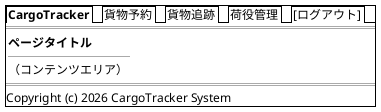

### Bootstrap 5 グリッド運用ルール

- コンテナ: `container-fluid` で横幅を最大活用
- 一覧画面: テーブル幅 `col-12`
- フォーム画面: 入力欄 `col-md-8 offset-md-2`（中央寄せ）
- 詳細画面: 左カラム `col-md-8`、右サイドバー `col-md-4`
- ブレークポイント: モバイル（`< 768px`）では 1 カラム積み上げ

---

## 画面遷移図

フロー全体の画面遷移を PlantUML ステートチャート図で表現する。

```plantuml
@startuml
title 全体画面遷移図 - 国際貨物輸送管理システム

[*] --> ログイン画面

state ログイン画面 {
  ログイン画面 : /login
  ログイン画面 : 認証フォーム
}

ログイン画面 --> ダッシュボード : 認証成功

state ダッシュボード {
  ダッシュボード : /
  ダッシュボード : サマリーカード\n最新荷役一覧
}

ダッシュボード --> 見積一覧 : [見積管理] クリック
ダッシュボード --> 荷主一覧 : [荷主管理] クリック
ダッシュボード --> 貨物予約一覧 : [予約管理] クリック
ダッシュボード --> 貨物追跡入力 : [追跡] クリック
ダッシュボード --> 荷役作業一覧 : [荷役管理] クリック
ダッシュボード --> 請求書一覧 : [請求管理] クリック
ダッシュボード --> 航路一覧 : [航路管理] クリック

state "荷主フロー" as shipper_flow {
  state 荷主一覧 {
    荷主一覧 : /shippers
  }
  state 荷主登録 {
    荷主登録 : /shippers/new
    荷主登録 : 個人・法人の切替
  }

  荷主一覧 --> 荷主登録 : [新規登録] ボタン
  荷主登録 --> 荷主一覧 : 登録成功（PRG）
  荷主登録 --> 荷主登録 : バリデーションエラー
}

state "航海スケジュール管理フロー" as voyage_admin_flow {
  state 航海スケジュール登録 {
    航海スケジュール登録 : /voyages/new
  }
  state 航海スケジュール編集 {
    航海スケジュール編集 : /voyages/{voyageNumber}/edit
    航海スケジュール編集 : 差分確認
  }

  航路一覧 --> 航海スケジュール登録 : [新規登録] ボタン（ROLE_ROUTER）
  航路一覧 --> 航海スケジュール編集 : [編集] ボタン（ROLE_ROUTER）
  航海スケジュール登録 --> 航路一覧 : 登録成功（PRG）
  航海スケジュール編集 --> 航路一覧 : 更新成功（PRG）
}

state "例外対応フロー" as exception_flow {
  state 追跡例外対応 {
    追跡例外対応 : /tracking/{trackingNumber}/exceptions/{exceptionId}
    追跡例外対応 : 対応記録・関係者通知
  }

  追跡詳細 --> 追跡例外対応 : EXCEPTION バッジクリック（ROLE_TRACKER）
  追跡例外対応 --> 追跡詳細 : 対応記録成功（PRG）
}

state "予約フロー" as booking_flow {
  state 貨物予約一覧 {
    貨物予約一覧 : /bookings
    貨物予約一覧 : 一覧テーブル・検索
  }
  state 貨物予約登録 {
    貨物予約登録 : /bookings/new
    貨物予約登録 : 入力フォーム
  }
  state 予約詳細 {
    予約詳細 : /bookings/{bookingId}
    予約詳細 : 予約情報・荷役履歴
  }
  state 経路割り当て {
    経路割り当て : /bookings/{bookingId}/route
    経路割り当て : 航路候補テーブル
  }

  貨物予約一覧 --> 貨物予約登録 : [新規登録] ボタン
  貨物予約一覧 --> 予約詳細 : 行クリック
  貨物予約登録 --> 予約詳細 : 登録成功（PRG）
  貨物予約登録 --> 貨物予約登録 : バリデーションエラー
  予約詳細 --> 経路割り当て : [経路を割り当て] ボタン
  経路割り当て --> 予約詳細 : 割り当て成功（PRG）
  経路割り当て --> 経路割り当て : バリデーションエラー
}

state "追跡フロー" as tracking_flow {
  state 貨物追跡入力 {
    貨物追跡入力 : /tracking
    貨物追跡入力 : 追跡番号入力
  }
  state 追跡詳細 {
    追跡詳細 : /tracking/{trackingNumber}
    追跡詳細 : ステータスタイムライン\n30 秒自動更新（htmx）
  }

  貨物追跡入力 --> 追跡詳細 : 追跡番号送信
  貨物追跡入力 --> 貨物追跡入力 : 番号不正・未発見
  追跡詳細 --> 貨物追跡入力 : [別の貨物を追跡]
}

state "荷役フロー" as handling_flow {
  state 荷役作業一覧 {
    荷役作業一覧 : /handling
    荷役作業一覧 : 一覧テーブル・検索
  }
  state 荷役作業登録 {
    荷役作業登録 : /handling/new
    荷役作業登録 : 登録フォーム
  }

  荷役作業一覧 --> 荷役作業登録 : [新規登録] ボタン
  荷役作業登録 --> 荷役作業一覧 : 登録成功（PRG）
  荷役作業登録 --> 荷役作業登録 : バリデーションエラー
}

state "精算フロー" as billing_flow {
  state 請求書一覧 {
    請求書一覧 : /billing/invoices
    請求書一覧 : 一覧テーブル・フィルタ
  }
  state 請求書詳細 {
    請求書詳細 : /billing/invoices/{invoiceId}
    請求書詳細 : 詳細・支払い確認
  }

  請求書一覧 --> 請求書詳細 : 行クリック
  請求書詳細 --> 請求書一覧 : [一覧に戻る] / 支払い確認成功（PRG）
}

state 航路一覧 {
  航路一覧 : /voyages
  航路一覧 : 航路・スケジュール一覧
}

state "管理フロー" as admin_flow {
  state 割引ポリシー一覧 {
    割引ポリシー一覧 : /admin/discount-policies
    割引ポリシー一覧 : 一覧テーブル・有効期限フィルタ
  }
  state 割引ポリシー登録 {
    割引ポリシー登録 : /admin/discount-policies/new
    割引ポリシー登録 : 登録フォーム
  }
  state 割引ポリシー編集 {
    割引ポリシー編集 : /admin/discount-policies/{id}/edit
    割引ポリシー編集 : 編集フォーム
  }

  割引ポリシー一覧 --> 割引ポリシー登録 : [新規登録] ボタン
  割引ポリシー一覧 --> 割引ポリシー編集 : 行の [編集] リンク
  割引ポリシー登録 --> 割引ポリシー一覧 : 登録成功（PRG）
  割引ポリシー編集 --> 割引ポリシー一覧 : 更新成功（PRG）
}

state 公開貨物追跡 {
  公開貨物追跡 : /public/tracking/{trackingId}
  公開貨物追跡 : 認証不要・シンプルステータス
}

ダッシュボード --> 割引ポリシー一覧 : [管理設定] クリック
[*] --> 公開貨物追跡 : 直接 URL アクセス（認証不要）

state "見積フロー" as estimation_flow {
  state 見積一覧 {
    見積一覧 : /estimates
    見積一覧 : 一覧テーブル・検索
  }
  state 見積作成 {
    見積作成 : /estimates/new
    見積作成 : 入力フォーム
  }
  state 見積詳細 {
    見積詳細 : /estimates/{estimateId}
    見積詳細 : ルート候補一覧
  }

  見積一覧 --> 見積作成 : [新規見積作成] ボタン
  見積一覧 --> 見積詳細 : 行クリック
  見積作成 --> 見積詳細 : 作成成功（PRG）
  見積作成 --> 見積作成 : バリデーションエラー
}

ダッシュボード --> 見積一覧 : [見積管理] クリック（US01）

@enduml
```

---

> **ワイヤーフレーム未作成の画面**: 荷主一覧・荷主登録・航海スケジュール登録・航海スケジュール編集・追跡例外対応の
> 5 画面は、対応するユーザーストーリー（US02/03、US24/25、US19/20）が優先度「高」であるため画面一覧・遷移図に
> 追加したが、詳細なワイヤーフレームは未作成である。実装イテレーション着手前に本節へ追加すること。

## 画面詳細設計

### ログイン画面 (/login)

#### ワイヤーフレーム

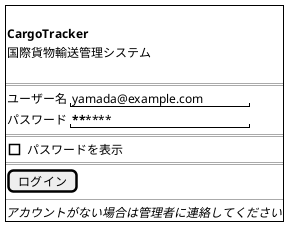

#### 仕様

- 自作の認証ミドルウェアに対応するログインフォーム（`Auth.Pages.login`）
- ログイン失敗時: 「ユーザー名またはパスワードが正しくありません」を赤色で表示
- ログイン成功後: ロールに応じてダッシュボードへリダイレクト
- セッションタイムアウト後は自動的に `/login?timeout` へリダイレクト

---

### ダッシュボード (/)

#### ワイヤーフレーム

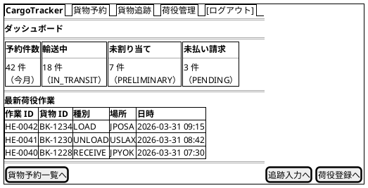

#### 仕様

- サマリーカード: 今月の予約件数・輸送中件数・未割り当て件数・未払い請求件数
- 最新荷役作業: 直近 10 件を降順表示
- ロール制御: ROLE_ACCOUNTANT のみ「未払い請求」カードを表示
- htmx: ページ初期ロード時に `/api/dashboard/summary` を `hx-get` で取得

---

### 貨物予約一覧 (/bookings)

#### ワイヤーフレーム

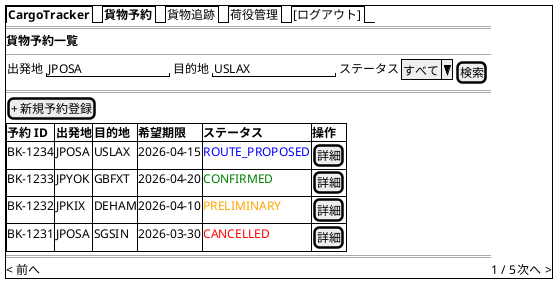

#### 仕様

- **検索フィルタ**: 出発地・目的地（港コード）・BookingStatus でフィルタリング
- **ステータスバッジ**: BookingStatus に応じた色分け（Bootstrap `badge`）
- **ページネーション**: 1 ページ 20 件
- **新規登録**: ROLE_SALES のみ表示
- **htmx**: 検索フォームに `hx-get="/bookings" hx-target="#booking-list"` で部分更新

---

### 貨物予約登録 (/bookings/new)

#### ワイヤーフレーム

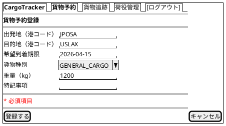

#### 仕様

- **入力項目**: 出発地・目的地（UNLOCODE 形式 5 文字）・希望到着期限・貨物種別・重量
- **バリデーション**: htmx で `hx-post` 送信前にクライアントサイドチェック、サーバー側は Bean Validation
- **貨物種別**: `GENERAL_CARGO`, `REFRIGERATED`, `HAZARDOUS`, `PERISHABLE` から選択
- **登録成功**: PRG パターンで `/bookings/{bookingId}` へリダイレクト
- **エラー時**: 同画面を再描画し、エラーフィールドを赤ボーダーで強調

---

### 予約詳細 (/bookings/{bookingId})

#### ワイヤーフレーム

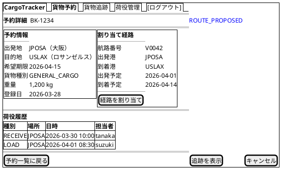

#### 仕様

- **ステータスバッジ**: ページタイトル横に BookingStatus を大きく表示
- **経路情報**: 未割り当ての場合は「経路が割り当てられていません」と表示し `[経路を割り当て]` を強調
- **荷役履歴**: HandlingEvent を時系列降順で表示
- **[経路設計者に引き渡す]**: ROLE_SALES かつ BookingStatus = PRELIMINARY の場合のみ表示（US06）。確認モーダル表示後に `POST /bookings/{bookingId}/assign-routing`。成功時 PRG で同詳細画面へリダイレクト、BookingStatus が ROUTE_PROPOSED に遷移する
- **[キャンセル]**: ROLE_SALES のみ表示。確認ダイアログ後に `POST /bookings/{bookingId}/cancel`
- **[追跡を表示]**: `trackingNumber` が発行済みの場合のみ表示

---

### 経路割り当て (/bookings/{bookingId}/route)

#### ワイヤーフレーム

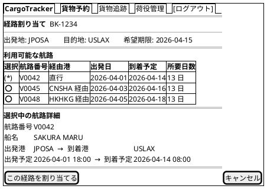

#### 仕様

- **航路候補**: 出発地・目的地・希望期限を条件に絞り込み済みの候補を表示
- **ラジオ選択**: 航路を選択すると htmx `hx-get` で下部の「選択中の航路詳細」を部分更新
- **希望期限超過**: 到着予定が希望期限を超える航路は `⚠` アイコン付きで警告
- **候補 0 件 / 全候補が期限超過の場合**: 「条件を満たす経路がありません」を表示し、
  [条件を変更して再算出]（US10）と [営業担当者に条件協議を依頼] の 2 つの導線を提示する。
  操作の行き止まりを作らない
- **アクセス制御**: ROLE_ROUTER のみ。経路の選択・確定は経路設計者の専門業務であり、
  営業担当者は US06 の「経路設計者への引き渡し」までを担う
- **割り当て成功**: PRG パターンで `/bookings/{bookingId}` へリダイレクト

---

### 貨物追跡入力 (/tracking)

#### ワイヤーフレーム

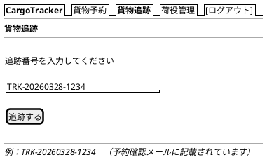

#### 仕様

- **入力フィールド**: 追跡番号（`TRK-YYYYMMDD-NNNN` 形式）
- **バリデーション**: フォーマット不正の場合はインラインエラー表示
- **未発見**: 404 の場合は「該当する貨物が見つかりません」メッセージ
- **認証不要**: 荷受人（ROLE_CONSIGNEE）は認証なしでもアクセス可

---

### 追跡詳細 (/tracking/{trackingNumber})

#### ワイヤーフレーム

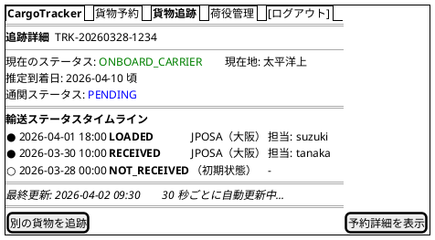

#### 仕様

- **自動更新**: htmx `hx-get="/tracking/{trackingNumber}/status" hx-trigger="every 30s" hx-target="#status-timeline"` で部分更新
- **タイムライン**: TransportStatus の変化を時系列で表示。最新状態を最上部に
- **TransportStatus の遷移**: `NOT_RECEIVED → RECEIVED → LOADED → ONBOARD_CARRIER → UNLOADED → AWAITING_CLAIM → CLAIMED`
- **推定到着日**: `YYYY-MM-DD 頃` の形式で表示。未確定の場合は「未確定」と表示
- **CustomsStatus**: `PENDING`（審査中）/ `CLEARED`（通関済）/ `HELD`（留置中）/ `REJECTED`（不可） をバッジで表示
- **EXCEPTION**: 異常発生時は赤色バッジで表示し、内容を詳細表示
- **反映の遅延**: 荷役登録は「コミット後にイベント配信 → 追跡へ反映」されるため、画面表示が実際の状態に追いつくまで
  最大 30 秒（ポーリング間隔）かかる。タイムライン下部に「最新の荷役作業が反映されるまで最大 30 秒かかります」と注記する
- **[予約詳細を表示]**: ROLE_SALES, ROLE_SHIPPER のみ表示

---

### 荷役作業登録 (/handling/new)

#### ワイヤーフレーム

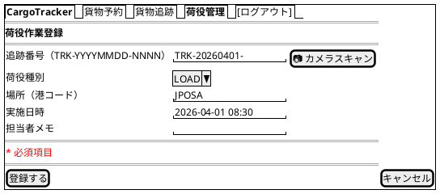

#### 仕様

- **荷役種別**: `RECEIVE`, `LOAD`, `UNLOAD`, `CUSTOMS_CLEARANCE`, `CLAIM` から選択
- **追跡番号**: `TRK-YYYYMMDD-NNNN` 形式。`[📷 カメラスキャン]` ボタンでバーコード・QR スキャン入力に対応
- **実施日時**: 未来日時は警告表示（投機的な登録は許可）
- **登録成功**: PRG パターンで `/handling` へリダイレクト

---

### 荷役作業一覧 (/handling)

#### ワイヤーフレーム

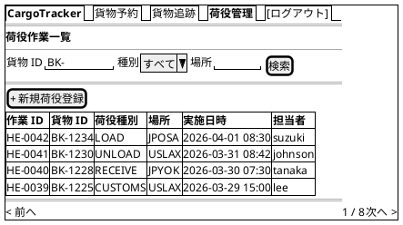

#### 仕様

- **検索フィルタ**: 貨物 ID・荷役種別・場所（港コード）でフィルタリング
- **htmx**: 検索フォームに `hx-get="/handling" hx-target="#handling-list"` で部分更新
- **新規登録**: ROLE_HANDLER のみ表示
- **ページネーション**: 1 ページ 20 件

---

### 航路一覧 (/voyages)

#### ワイヤーフレーム

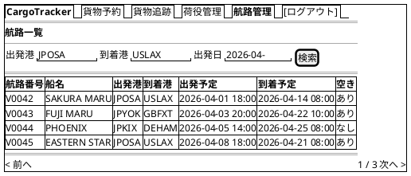

#### 仕様

- **検索フィルタ**: 出発港・到着港・出発日でフィルタリング
- **空き状況**: 積載容量に余裕があるかを「あり / なし」で表示
- **[新規登録]**: ROLE_ROUTER のみ表示。`/voyages/new` へ遷移（US24）
- **[編集]**: 各行に表示。ROLE_ROUTER のみ。`/voyages/{voyageNumber}/edit` へ遷移（US25）
- 他ロールは閲覧のみ
- **経路割り当てへの連携**: 経路割り当て画面が本データを参照して候補を生成

---

### 請求書一覧 (/billing/invoices)

#### ワイヤーフレーム


#### 仕様

- **フィルタ**: PaymentStatus（`PENDING`, `CONFIRMED`, `OVERDUE`）・発行日でフィルタリング
- **ステータスバッジ**: `PENDING` は赤、`CONFIRMED` は緑、`OVERDUE` は濃い赤で表示
- **支払期限超過**: 期限超過かつ未払いの場合は行を赤色ハイライト
- **アクセス制御**: ROLE_ACCOUNTANT のみアクセス可能

---

### 請求書詳細 (/billing/invoices/{invoiceId})

#### ワイヤーフレーム

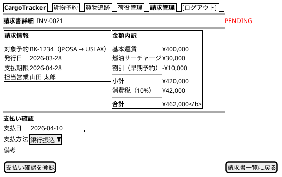

#### 仕様

- **金額内訳**: 基本運賃・サーチャージ・割引・消費税を明細表示
- **[支払い確認を登録]**: `POST /billing/invoices/{invoiceId}/confirm` を送信。PRG パターンで同画面へリダイレクト
- **確認済み**: PaymentStatus が `CONFIRMED` の場合は支払いフォームを非表示にし、確認日時を表示
- **PDF 出力**: `GET /billing/invoices/{invoiceId}/pdf` で請求書 PDF をダウンロード（将来実装）

---

### 割引ポリシー一覧 (/admin/discount-policies)

#### ワイヤーフレーム

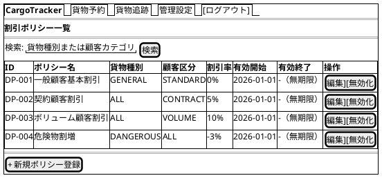

#### 仕様

- **一覧**: 有効期間・有効 / 無効ステータスでフィルタリング可能
- **[編集]**: `/admin/discount-policies/{id}/edit` に遷移
- **[無効化]**: `POST /admin/discount-policies/{id}/disable` で論理削除（PRG パターン）
- **[+ 新規ポリシー登録]**: `/admin/discount-policies/new` に遷移
- **アクセス制御**: `ROLE_ADMIN` のみアクセス可能。他ロールは 403 画面を表示

---

### 割引ポリシー登録 (/admin/discount-policies/new)

#### ワイヤーフレーム

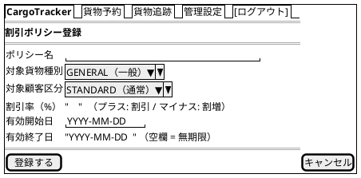

#### 仕様

- **バリデーション**: 割引率は -50〜100% の範囲、有効開始日 ≤ 有効終了日
- **重複チェック**: 同一の「貨物種別 × 顧客区分 × 期間」のポリシーが既に存在する場合はエラー表示
- **[登録する]**: `POST /admin/discount-policies` に送信。PRG パターンで一覧にリダイレクト
- **[キャンセル]**: `/admin/discount-policies` に戻る

---

### 公開貨物追跡 (/public/tracking/{trackingId})

#### ワイヤーフレーム

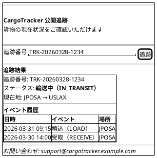

#### 仕様

- **認証**: 不要（ルーティング表で `/public/**` を `Anonymous` として宣言する）
- **追跡番号フォーム**: `GET /public/tracking/{trackingId}` でページ表示。結果は同一ページ内に表示
- **404 処理**: 存在しない追跡番号は「該当する貨物が見つかりません。追跡番号を確認の上、再度お試しください」を表示
- **連絡先**: フッターに問い合わせメールアドレスを表示（荷主への導線確保）
- **レスポンシブ**: モバイルファースト（スマートフォンで QR コードから直接アクセスを想定）
- **表示情報の制限**: TransportStatus・最終イベント・現在地のみ（荷主名・住所等の個人情報は非表示）
- **AFTER_COMMIT タイムラグ**: ステータス反映に最大 30 秒かかる旨を画面下部に注記する

---

### htmx 部分更新パターン

#### 追跡ステータス自動更新

追跡詳細画面では、荷物の状態をユーザーがリロードせずに確認できるよう、30 秒ごとに自動更新する。

```html
<!-- 追跡詳細画面のステータスタイムライン部分 -->
<div id="status-timeline"
     hx-get="/tracking/TRK-20260328-1234/status"
     hx-trigger="every 30s"
     hx-swap="innerHTML">
  <!-- Flix の Tracking.Pages.statusTimeline が生成した初期コンテンツ -->
</div>
<p id="last-updated">最終更新: <span>2026-07-31 10:00</span></p>
```

**サーバー側レスポンス**: `/tracking/{trackingNumber}/status` は HTML フラグメントを返す（`Content-Type: text/html`）。

#### 検索フォームの部分更新

貨物予約一覧・荷役作業一覧の検索フォームは、ページ全体を再読み込みせずに結果テーブルのみを更新する。

```html
<form hx-get="/bookings"
      hx-target="#booking-list"
      hx-swap="outerHTML"
      hx-push-url="true">
  <input name="origin" type="text" placeholder="出発地">
  <input name="destination" type="text" placeholder="目的地">
  <select name="status">...</select>
  <button type="submit">検索</button>
</form>
<div id="booking-list">
  <!-- 検索結果テーブル -->
</div>
```

`hx-push-url="true"` により、検索条件が URL に反映されブラウザ履歴に残る。

#### 経路候補の動的読み込み

経路割り当て画面でラジオボタンを選択すると、選択した航路の詳細を動的に読み込む。

```html
<input type="radio" name="voyageNumber" value="V0042"
       hx-get="/api/voyages/V0042/detail"
       hx-target="#voyage-detail"
       hx-swap="innerHTML">
```

#### フォームのインラインバリデーション

入力フィールドからフォーカスが外れたタイミング（`blur`）でサーバーサイドバリデーションを実行する。

```html
<input name="origin" type="text"
       hx-post="/api/validate/location"
       hx-trigger="blur"
       hx-target="next .error-message"
       hx-swap="innerHTML">
<span class="error-message text-danger"></span>
```

---

### エラーハンドリング

#### バリデーションエラー表示

- **フィールドレベル**: 各入力フィールドの下に赤字でメッセージ表示（Bootstrap `invalid-feedback`）
- **フォームレベル**: フォーム上部にアラートバナー（`alert-danger`）でまとめて表示
- **生成**: `Components.formField(label, name, value, errors)` がラベル・入力・エラーメッセージをまとめて生成する。画面側でエラー表示を書き忘れられない構造にする

```flix
/// Components.formField が生成する構造（出力例は下の HTML）
Components.formField("出発地", "origin", vm.origin, vm.errors)
```

```html
<div class="mb-3">
  <label for="origin" class="form-label">出発地 <span class="text-danger">*</span></label>
  <input type="text" id="origin" name="origin" value="" class="form-control is-invalid">
  <div class="invalid-feedback">出発地は必須です</div>
</div>
```

> 入力値とエラーは `FormView`（入力文字列 + `List[FieldError]`）として画面関数へ渡す。
> 不正値を値オブジェクトへ変換できないまま画面に戻す必要があるため、**ドメイン型ではなく入力文字列を保持する ViewModel** を用いる。

#### フラッシュメッセージ

PRG パターンのリダイレクト後に、操作結果を Flash Attribute でフィードバックする。

| 操作 | メッセージ例 | Bootstrap クラス |
| :--- | :--- | :--- |
| 予約登録成功 | 「貨物予約 BK-1234 を登録しました」 | `alert-success` |
| 経路割り当て成功 | 「経路 V0042 を割り当てました」 | `alert-success` |
| 荷役登録成功 | 「荷役作業 HE-0042 を登録しました」 | `alert-success` |
| 支払い確認成功 | 「請求書 INV-0021 の支払いを確認しました」 | `alert-success` |
| バリデーションエラー | 「入力内容に誤りがあります。確認してください」 | `alert-danger` |
| システムエラー | 「処理中にエラーが発生しました。時間をおいて再試行してください」 | `alert-danger` |

フラッシュメッセージは共通フラグメント `fragments/alerts.html` で一元管理する。

#### エラーページ

| HTTP ステータス | 画面 | 内容 |
| :--- | :--- | :--- |
| 400 Bad Request | `/error/400` | 不正なリクエスト。入力を確認してください |
| 403 Forbidden | `/error/403` | アクセス権限がありません |
| 404 Not Found | `/error/404` | 指定されたページまたはリソースが見つかりません |
| 500 Internal Server Error | `/error/500` | サーバーエラーが発生しました。管理者に連絡してください |

各エラーページはナビゲーションバーを表示し、ダッシュボードへ戻るリンクを提供する。

#### htmx エラーハンドリング

htmx リクエストがエラーを返した場合は、`htmx:responseError` イベントをキャッチして通知を表示する。

```javascript
document.addEventListener('htmx:responseError', function(event) {
  const status = event.detail.xhr.status;
  const messageEl = document.getElementById('htmx-error-toast');
  if (status === 404) {
    messageEl.textContent = '対象データが見つかりませんでした';
  } else {
    messageEl.textContent = '通信エラーが発生しました。再試行してください';
  }
  messageEl.classList.remove('d-none');
});
```

---

### アクセシビリティ

#### キーボードナビゲーション

- **Tab 順序**: フォーム項目 → 送信ボタン → ナビゲーションの順に自然な Tab 移動
- **Enter キー**: フォーム内でのフォーカス状態でEnterキーを押すと送信
- **Escape キー**: モーダル・確認ダイアログを閉じる
- **スキップリンク**: `<a href="#main-content" class="visually-hidden-focusable">コンテンツにスキップ</a>` をヘッダー先頭に配置

#### ARIA 対応

| 要素 | ARIA 属性 |
| :--- | :--- |
| ナビゲーションバー | `role="navigation" aria-label="メインナビゲーション"` |
| 検索フォーム | `role="search" aria-label="貨物検索"` |
| データテーブル | `role="grid" aria-label="[テーブル名]"` |
| ステータスバッジ | `aria-label="ステータス: ROUTE_PROPOSED"` |
| ローディングインジケーター | `aria-live="polite" aria-busy="true"` |
| エラーメッセージ | `role="alert" aria-live="assertive"` |
| フラッシュメッセージ | `role="status" aria-live="polite"` |

#### htmx と ARIA

htmx の部分更新後に動的コンテンツが更新されることをスクリーンリーダーに通知する。

```html
<!-- 自動更新エリアは aria-live="polite" で通知 -->
<div id="status-timeline"
     aria-live="polite"
     aria-atomic="false"
     hx-get="/tracking/TRK-20260328-1234/status"
     hx-trigger="every 30s">
</div>
```

#### カラーコントラスト

- 通常テキスト: コントラスト比 4.5:1 以上（WCAG AA 準拠）
- 大きいテキスト（18px 以上）: 3:1 以上
- ステータスバッジは色のみに依存せず、テキストラベルを必ず併記

---

## 付録: BookingStatus / TransportStatus 対応表

### BookingStatus バッジ定義

| ステータス | 表示ラベル | Bootstrap クラス | 意味 |
| :--- | :--- | :--- | :--- |
| `PRELIMINARY` | 仮予約 | `badge bg-warning text-dark` | 経路未割り当て |
| `ROUTE_PROPOSED` | 経路提案済 | `badge bg-primary` | 経路割り当て完了・未確認 |
| `CONFIRMED` | 確認済 | `badge bg-success` | 予約確定 |
| `TRACKING_ISSUED` | 追跡番号発行済 | `badge bg-info text-dark` | 追跡番号付与 |
| `IN_TRANSIT` | 輸送中 | `badge bg-primary` | 積み込み済・輸送中 |
| `DELIVERED` | 配送完了 | `badge bg-success` | 配達完了 |
| `SETTLED` | 精算完了 | `badge bg-secondary` | 請求・支払い完了 |
| `CANCELLED` | キャンセル | `badge bg-danger` | キャンセル済 |

### TransportStatus バッジ定義

| ステータス | 表示ラベル | Bootstrap クラス |
| :--- | :--- | :--- |
| `NOT_RECEIVED` | 未受取 | `badge bg-secondary` |
| `RECEIVED` | 受取済 | `badge bg-info text-dark` |
| `LOADED` | 積み込み済 | `badge bg-primary` |
| `ONBOARD_CARRIER` | 搭載中 | `badge bg-primary` |
| `UNLOADED` | 荷降ろし済 | `badge bg-warning text-dark` |
| `AWAITING_CLAIM` | 引取待ち | `badge bg-warning text-dark` |
| `CLAIMED` | 引取完了 | `badge bg-success` |
| `EXCEPTION` | 例外 | `badge bg-danger` |
