# UI 設計 - 国際貨物輸送管理システム

## 概要

本ドキュメントでは、国際貨物輸送管理システムの UI 設計を定義する。

### 設計方針

**OOUX（オブジェクト指向 UI 設計）** をベースに、ユーザーが操作する「オブジェクト」（貨物予約・追跡・荷役・航路・請求書）を中心に画面を構成する。各画面はオブジェクトの状態を可視化し、アクターに応じた操作を提供する。

### 技術スタック

| 技術 | 役割 |
| :--- | :--- |
| axum + Askama | SSR（サーバーサイドレンダリング）でフル HTML を生成。テンプレートはコンパイル時に型検査 |
| htmx 2.x | フォームバリデーション・ステータス自動更新など部分的な動的更新 |
| Bootstrap 5.3 | レスポンシブグリッド・コンポーネント |
| axum-login | 認証・ロール別 UI 制御（テンプレートコンテキスト経由） |
| PRG パターン | フォーム送信後は必ず Redirect-Get で二重送信を防止 |

### 基本 UX 原則

- **オブジェクト中心**: 一覧 → 詳細 → アクションの自然な流れ
- **状態の可視化**: BookingStatus・TransportStatus をバッジで常時表示
- **フィードバック**: 操作成功・失敗はフラッシュメッセージで通知
- **アクセシビリティ**: ARIA ラベル・キーボードナビゲーション対応

---

## UI オブジェクト定義

OOUX に基づき、システム内の主要オブジェクトとそのアクション・属性を定義する。

### 主要オブジェクト

| オブジェクト | 主な属性 | ユーザーアクション | 関連オブジェクト |
| :--- | :--- | :--- | :--- |
| **貨物予約（Booking）** | bookingId, 出発地, 目的地, 希望期限, 貨物種別, 重量, BookingStatus | 新規登録・詳細確認・経路割り当て・キャンセル | 追跡情報, 航路, 荷役履歴 |
| **追跡情報（Tracking）** | trackingNumber, TransportStatus, 現在地, ステータス履歴 | 追跡番号検索・履歴確認 | 貨物予約 |
| **荷役作業（HandlingEvent）** | eventId, 追跡番号（主）, 貨物 ID（併記）, 荷役種別（HandlingType）, 場所, 実施日時, 担当者 | 新規登録・一覧確認 | 貨物予約 |
| **通関申告（CustomsDeclaration）** | declarationId, 追跡番号, 貨物 ID, 申告日, CustomsStatus | 一覧確認・状態更新 | 貨物予約, 荷役作業 |
| **航路（Voyage）** | voyageNumber, 出発港, 到着港, 出発予定日, 到着予定日 | 一覧確認・経路割り当てへの提供 | 貨物予約 |
| **請求書（Invoice）** | invoiceId, 貨物予約, 金額, 割引, 消費税, PaymentStatus | 一覧確認・詳細確認・支払い確認 | 貨物予約 |

### オブジェクト間の関係

```
Booking 1 ─── 1 Tracking
Booking 1 ─── N HandlingEvent
Booking N ─── M Voyage（経路割り当てを通じて）
Booking 1 ─── 1 Invoice
```

---

## 画面一覧

| 画面名 | URL パス | 説明 | 主要アクター | 対応 US |
| :--- | :--- | :--- | :--- | :--- |
| ログイン | `/login` | 認証フォーム | 全ロール | - |
| ダッシュボード | `/` | 全体サマリー・最新荷役情報 | 全ロール | US01 |
| 貨物予約一覧 | `/bookings` | 予約済み貨物の一覧（状態・出発地→目的地・詳細導線） | 荷主、営業担当者、経路設計者 | US04 |
| 貨物予約登録 | `/bookings/new` | 新規予約フォーム（荷主・荷受人情報を含む） | 営業担当者 | US02, US03, US04, US05 |
| 予約詳細 | `/bookings/{bookingId}` | 予約情報・経路・荷役履歴。経路設計依頼・荷主への経路通知・予約確定・追跡番号発行の起点 | 荷主、営業担当者、経路設計者 | US06, US12, US13, US14 |
| 経路設計・割り当て | `/bookings/{bookingId}/route` | 航海スケジュール検索 → 経路候補算出 → 選択・確定 → 予約への紐付け。条件調整・再算出を含む | 経路設計者（営業担当者は引き渡しまで） | US07, US08, US09, US10, US11 |
| 貨物追跡入力 | `/tracking` | 追跡番号入力フォーム | 荷主、荷受人、追跡管理者 | US18 |
| 追跡詳細 | `/tracking/{trackingNumber}` | 輸送ステータス履歴タイムライン | 荷主、荷受人 | US17, US18 |
| 例外登録 | `/tracking/{trackingNumber}/exceptions/new` | 輸送例外（遅延・損傷等）の登録フォーム | 追跡管理者 | US19, US20 |
| 例外解決 | `/tracking/{trackingNumber}/exceptions/{exceptionId}/resolve` | 例外の解決記録フォーム | 追跡管理者 | US19, US20 |
| 荷役作業登録 | `/handling/new` | 荷役イベント登録フォーム | 荷役作業員 | US15, US16 |
| 荷役作業一覧 | `/handling` | 荷役履歴一覧・検索 | 荷役作業員、追跡管理者 | US15 |
| 通関一覧 | `/customs` | 通関申告の一覧・CustomsStatus 別フィルタ | 荷役作業員、追跡管理者 | US15, US16 |
| 通関状態更新 | `/customs/{declarationId}/update` | 通関状態の更新フォーム（Pending → Cleared / Held / Rejected） | 荷役作業員 | US16 |
| 航路一覧 | `/voyages` | 航路・スケジュール一覧・検索（出発港・到着港・貨物種別） | 経路設計者 | US07, US24, US25 |
| 航路登録 | `/voyages/new` | 航海スケジュール新規登録フォーム（航海番号・船名・運送会社・対応貨物種別・運送区間） | 経路設計者 | US24 |
| 航路更新 | `/voyages/{voyageNumber}/edit` | 航海スケジュール更新フォーム（現在の登録内容の差分確認付き） | 経路設計者 | US25 |
| 請求書一覧 | `/billing/invoices` | 請求書の一覧・ステータス管理 | 経理担当者 | US21, US23 |
| 請求書詳細 | `/billing/invoices/{invoiceId}` | 請求書詳細・支払い確認 | 経理担当者 | US22, US23 |
| 割引ポリシー一覧 | `/admin/discount-policies` | 割引ポリシーの一覧・有効期限管理 | ROLE_ADMIN | US-ADM-01 |
| 割引ポリシー登録 | `/admin/discount-policies/new` | 新規割引ポリシー登録フォーム | ROLE_ADMIN | US-ADM-01 |
| 割引ポリシー編集 | `/admin/discount-policies/{id}/edit` | 割引ポリシー編集フォーム | ROLE_ADMIN | US-ADM-01 |
| 公開貨物追跡 | `/public/tracking/{trackingNumber}` | 認証不要の貨物状態照会ページ（荷主が URL 共有可） | 荷主・荷受人（未認証） | US18 |
| 見積一覧 | `/estimates` | 見積の一覧・検索 | 営業担当者 | US01 |
| 見積作成 | `/estimates/new` | 新規見積フォーム（出発地・目的地・期限・貨物仕様入力） | 営業担当者 | US01 |
| 見積詳細 | `/estimates/{estimateId}` | 見積詳細・スタブルート候補一覧 | 営業担当者 | US01 |

---

## 共通レイアウト設計

### ナビゲーション構成

全画面共通のナビゲーションバー（Bootstrap 5 `navbar`）を上部に配置する。axum-login のロールをテンプレートコンテキストに渡し、Askama の条件分岐でメニュー項目を表示制御する。

| メニュー項目 | 遷移先 | 表示ロール |
| :--- | :--- | :--- |
| ダッシュボード | `/` | 全ロール |
| 貨物予約 | `/bookings` | ROLE_SALES, ROLE_SHIPPER, ROLE_ROUTE_DESIGNER |
| 貨物追跡 | `/tracking` | ROLE_SHIPPER, ROLE_CONSIGNEE, ROLE_TRACKER |
| 荷役管理 | `/handling` | ROLE_HANDLER, ROLE_TRACKER |
| 通関管理 | `/customs` | ROLE_HANDLER, ROLE_TRACKER |
| 見積管理 | `/estimates` | ROLE_SALES |
| 航路管理 | `/voyages` | ROLE_ROUTE_DESIGNER |
| 請求管理 | `/billing/invoices` | ROLE_BILLING |
| 管理設定 | `/admin/discount-policies` | ROLE_ADMIN |
| ログアウト | `/logout` | 全ロール |

#### ロール別ナビゲーション表示例

ナビゲーションはロールに応じて出し分ける。各ワイヤーフレームのヘッダーに記載する固定 4 項目（貨物予約・貨物追跡・荷役管理・ログアウト）は代表例であり、実際の構成は上記メニュー表に従う。

| ロール | 表示されるメニュー例 |
| :--- | :--- |
| 営業担当者（ROLE_SALES） | ダッシュボード \| 貨物予約 \| 見積管理 \| ログアウト |
| 経理担当者（ROLE_BILLING） | ダッシュボード \| 請求管理 \| ログアウト |
| 荷役作業員（ROLE_HANDLER） | ダッシュボード \| 荷役管理 \| 通関管理 \| ログアウト |
| 追跡管理者（ROLE_TRACKER） | ダッシュボード \| 貨物追跡 \| 荷役管理 \| 通関管理 \| ログアウト |

### 共通レイアウト ワイヤーフレーム

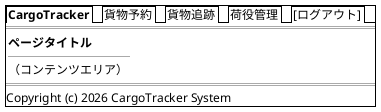

> 注記: 以降の各ワイヤーフレームの固定 4 項目ヘッダー（貨物予約 | 貨物追跡 | 荷役管理 | ログアウト）は代表例である。ナビゲーションはロールに応じて出し分け、構成は共通レイアウト設計のメニュー表を参照すること。

### Bootstrap 5 グリッド運用ルール

- コンテナ: `container-fluid` で横幅を最大活用
- 一覧画面: テーブル幅 `col-12`
- フォーム画面: 入力欄 `col-md-8 offset-md-2`（中央寄せ）
- 詳細画面: 左カラム `col-md-8`、右サイドバー `col-md-4`
- ブレークポイント: モバイル（`< 768px`）では 1 カラム積み上げ

---

## 画面遷移図

フロー全体の画面遷移を PlantUML ステートチャート図で表現する。

```plantuml
@startuml
title 全体画面遷移図 - 国際貨物輸送管理システム

[*] --> ログイン画面

state ログイン画面 {
  ログイン画面 : /login
  ログイン画面 : 認証フォーム
}

ログイン画面 --> ダッシュボード : 認証成功

state ダッシュボード {
  ダッシュボード : /
  ダッシュボード : サマリーカード\n最新荷役一覧
}

ダッシュボード --> 貨物予約一覧 : [予約管理] クリック
ダッシュボード --> 貨物追跡入力 : [追跡] クリック
ダッシュボード --> 荷役作業一覧 : [荷役管理] クリック
ダッシュボード --> 請求書一覧 : [請求管理] クリック
ダッシュボード --> 航路一覧 : [航路管理] クリック

state "予約フロー" as booking_flow {
  state 貨物予約一覧 {
    貨物予約一覧 : /bookings
    貨物予約一覧 : 一覧テーブル・検索
  }
  state 貨物予約登録 {
    貨物予約登録 : /bookings/new
    貨物予約登録 : 入力フォーム
  }
  state 予約詳細 {
    予約詳細 : /bookings/{bookingId}
    予約詳細 : 予約情報・荷役履歴
  }
  state "経路設計・割り当て" as route_design {
    route_design : /bookings/{bookingId}/route
    route_design : 航海スケジュール検索 → 経路候補算出\n→ 選択・確定 → 予約に紐付け
    route_design : 主要アクター: 経路設計者
  }

  貨物予約一覧 --> 貨物予約登録 : [新規登録] ボタン
  貨物予約一覧 --> 予約詳細 : 行クリック
  貨物予約登録 --> 予約詳細 : 登録成功（PRG）
  貨物予約登録 --> 貨物予約登録 : バリデーションエラー
  予約詳細 --> 予約詳細 : [経路設計依頼]（営業担当者・US06）\n経路設計中へ・経路設計者に通知
  予約詳細 --> route_design : [経路を設計する] ボタン\n（経路設計者・US07〜US11）
  route_design --> route_design : 条件調整・再算出\n（US10）/ バリデーションエラー
  route_design --> 予約詳細 : 経路確定・紐付け成功（PRG）\n経路提案中（RouteProposed）へ（US09, US11）
  予約詳細 --> 予約詳細 : [荷主に経路通知]（営業担当者・US12）
  予約詳細 --> 予約詳細 : [予約確定]（営業担当者・US13）\n予約確定（Confirmed）へ\n差し戻し時は経路設計中に戻す
  予約詳細 --> 予約詳細 : [追跡番号発行]（経路設計者・US14）\n追跡番号発行済（TrackingIssued）へ\n荷主にメール通知
}

state "追跡フロー" as tracking_flow {
  state 貨物追跡入力 {
    貨物追跡入力 : /tracking
    貨物追跡入力 : 追跡番号入力
  }
  state 追跡詳細 {
    追跡詳細 : /tracking/{trackingNumber}
    追跡詳細 : ステータスタイムライン\n30 秒自動更新（htmx）
  }

  state 例外登録 {
    例外登録 : /tracking/{trackingNumber}/exceptions/new
    例外登録 : ExceptionType 選択・発生場所・内容
  }
  state 例外解決 {
    例外解決 : /tracking/{trackingNumber}/exceptions/{exceptionId}/resolve
    例外解決 : 解決内容の記録
  }

  貨物追跡入力 --> 追跡詳細 : 追跡番号送信
  貨物追跡入力 --> 貨物追跡入力 : 番号不正・未発見
  追跡詳細 --> 貨物追跡入力 : [別の貨物を追跡]
  追跡詳細 --> 例外登録 : [例外を登録]（追跡管理者）
  例外登録 --> 追跡詳細 : 登録成功（PRG）
  例外登録 --> 例外登録 : バリデーションエラー
  追跡詳細 --> 例外解決 : 例外行の [解決]（追跡管理者）
  例外解決 --> 追跡詳細 : 解決成功（PRG）
}

state "荷役フロー" as handling_flow {
  state 荷役作業一覧 {
    荷役作業一覧 : /handling
    荷役作業一覧 : 一覧テーブル・検索
  }
  state 荷役作業登録 {
    荷役作業登録 : /handling/new
    荷役作業登録 : 登録フォーム
  }

  荷役作業一覧 --> 荷役作業登録 : [新規登録] ボタン
  荷役作業登録 --> 荷役作業一覧 : 登録成功（PRG）
  荷役作業登録 --> 荷役作業登録 : バリデーションエラー
}

state "通関フロー" as customs_flow {
  state 通関一覧 {
    通関一覧 : /customs
    通関一覧 : CustomsStatus 別フィルタ\n対象貨物・申告情報一覧
  }
  state 通関状態更新 {
    通関状態更新 : /customs/{declarationId}/update
    通関状態更新 : Pending → Cleared / Held / Rejected
  }

  通関一覧 --> 通関状態更新 : 行の [状態更新]（荷役作業員）
  通関状態更新 --> 通関一覧 : 更新成功（PRG）
  通関状態更新 --> 通関状態更新 : バリデーションエラー
}

ダッシュボード --> 通関一覧 : [通関管理] クリック

state "精算フロー" as billing_flow {
  state 請求書一覧 {
    請求書一覧 : /billing/invoices
    請求書一覧 : 一覧テーブル・フィルタ
  }
  state 請求書詳細 {
    請求書詳細 : /billing/invoices/{invoiceId}
    請求書詳細 : 詳細・支払い確認
  }

  請求書一覧 --> 請求書詳細 : 行クリック
  請求書詳細 --> 請求書一覧 : [一覧に戻る] / 支払い確認成功（PRG）
}

state "航路管理フロー" as voyage_flow {
  state 航路一覧 {
    航路一覧 : /voyages
    航路一覧 : 航路・スケジュール一覧・検索
  }
  state 航路登録 {
    航路登録 : /voyages/new
    航路登録 : 登録フォーム（航海番号・船名・運送会社・貨物種別・運送区間）
  }
  state 航路更新 {
    航路更新 : /voyages/{voyageNumber}/edit
    航路更新 : 更新フォーム（現在の登録内容の差分確認）
  }
  航路一覧 --> 航路登録 : [新規登録] ボタン
  航路一覧 --> 航路更新 : 行の [編集] リンク
  航路登録 --> 航路登録 : バリデーションエラー（自己ループ・422）
  航路登録 --> 航路一覧 : 登録成功（PRG）
  航路更新 --> 航路更新 : バリデーションエラー（自己ループ・422）
  航路更新 --> 航路一覧 : 更新成功（PRG） / [キャンセル]
}

state "管理フロー" as admin_flow {
  state 割引ポリシー一覧 {
    割引ポリシー一覧 : /admin/discount-policies
    割引ポリシー一覧 : 一覧テーブル・有効期限フィルタ
  }
  state 割引ポリシー登録 {
    割引ポリシー登録 : /admin/discount-policies/new
    割引ポリシー登録 : 登録フォーム
  }
  state 割引ポリシー編集 {
    割引ポリシー編集 : /admin/discount-policies/{id}/edit
    割引ポリシー編集 : 編集フォーム
  }

  割引ポリシー一覧 --> 割引ポリシー登録 : [新規登録] ボタン
  割引ポリシー一覧 --> 割引ポリシー編集 : 行の [編集] リンク
  割引ポリシー登録 --> 割引ポリシー一覧 : 登録成功（PRG）
  割引ポリシー編集 --> 割引ポリシー一覧 : 更新成功（PRG）
}

state 公開貨物追跡 {
  公開貨物追跡 : /public/tracking/{trackingNumber}
  公開貨物追跡 : 認証不要・シンプルステータス
}

ダッシュボード --> 割引ポリシー一覧 : [管理設定] クリック
[*] --> 公開貨物追跡 : 直接 URL アクセス（認証不要）

state "見積フロー" as estimation_flow {
  state 見積一覧 {
    見積一覧 : /estimates
    見積一覧 : 一覧テーブル・検索
  }
  state 見積作成 {
    見積作成 : /estimates/new
    見積作成 : 入力フォーム
  }
  state 見積詳細 {
    見積詳細 : /estimates/{estimateId}
    見積詳細 : ルート候補一覧
  }

  見積一覧 --> 見積作成 : [新規見積作成] ボタン
  見積一覧 --> 見積詳細 : 行クリック
  見積作成 --> 見積詳細 : 作成成功（PRG）
  見積作成 --> 見積作成 : バリデーションエラー
}

ダッシュボード --> 見積一覧 : [見積管理] クリック（US01）
見積詳細 --> 貨物予約登録 : [この見積で予約する]\n見積内容を引き継ぎ（Phase 4 実装予定）

@enduml
```

---

## 画面詳細設計

### ログイン画面 (/login)

#### ワイヤーフレーム

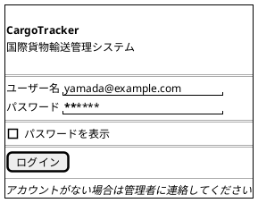

#### 仕様

- axum-login によるフォーム認証。ログインフォームは Askama テンプレート（`auth/login.html`）で提供
- ログイン失敗時: 「ユーザー名またはパスワードが正しくありません」を赤色で表示
- ログイン成功後: ロールに応じてダッシュボードへリダイレクト
- セッションタイムアウト後は自動的に `/login?timeout` へリダイレクト

---

### ダッシュボード (/)

#### ワイヤーフレーム

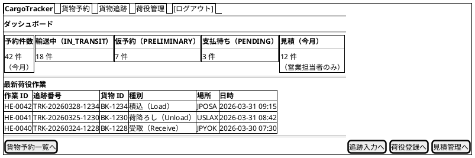

#### 仕様

- サマリーカード: 今月の予約件数・輸送中（IN_TRANSIT）件数・仮予約（PRELIMINARY）件数・支払待ち（PENDING）件数。ステータス表記は付録のステータス対応表を正典とし「日本語ラベル（コード）」形式で統一する
- 最新荷役作業: 直近 10 件を降順表示。識別子は追跡番号を主とし、貨物 ID を併記する。荷役種別は付録の HandlingType 対応表に従い「日本語ラベル（コード）」形式で表示
- ロール制御: ROLE_BILLING のみ「未払い請求」カードを表示（Askama の条件分岐）
- 見積導線: ROLE_SALES のみ「見積（今月）」サマリーカードとクイックリンク `[見積管理へ]`（`/estimates`）を表示（US01）
- htmx: ページ初期ロード時に `/api/dashboard/summary` を `hx-get` で取得

---

### 貨物予約一覧 (/bookings)

#### ワイヤーフレーム

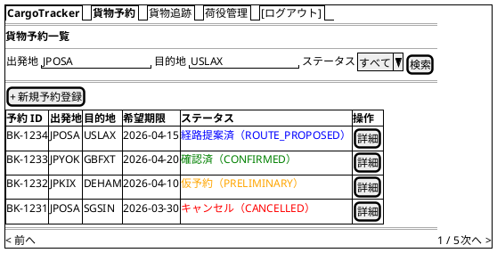

#### 仕様

- **検索フィルタ**: 出発地・目的地（港コード）・BookingStatus でフィルタリング
- **ステータスバッジ**: BookingStatus に応じた色分け（Bootstrap `badge`）。表記は付録のステータス対応表に従い「日本語ラベル（コード）」形式で統一
- **ページネーション**: 1 ページ 20 件
- **新規登録**: ROLE_SALES のみ表示
- **htmx**: 検索フォームに `hx-get="/bookings" hx-target="#booking-list"` で部分更新

---

### 貨物予約登録 (/bookings/new)

#### ワイヤーフレーム

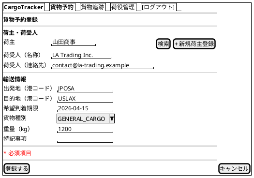

#### 仕様

- **入力項目**: 荷主・荷受人（Consignee: 名称・連絡先）・出発地・目的地（UNLOCODE 形式 5 文字）・希望到着期限・貨物種別・重量
- **荷主選択**: 既存荷主をインクリメンタル検索（htmx `hx-get="/api/shippers?q="` で候補を部分更新）して選択する。該当がない場合は `[+ 新規荷主登録]` から荷主登録モーダルを開き、登録後に自動選択される
- **荷受人**: 名称と連絡先（メールアドレスまたは電話番号）を直接入力する（必須）
- **バリデーション**: htmx で `hx-post` 送信前にクライアントサイドチェック、サーバー側は validator クレートによる検証
- **貨物種別**: `GENERAL_CARGO`, `REFRIGERATED`, `HAZARDOUS`, `PERISHABLE` から選択
- **登録成功**: PRG パターンで `/bookings/{bookingId}` へリダイレクト
- **エラー時**: 同画面を再描画し、エラーフィールドを赤ボーダーで強調

---

### 予約詳細 (/bookings/{bookingId})

#### ワイヤーフレーム

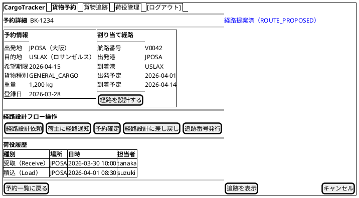

#### 仕様

- **ステータスバッジ**: ページタイトル横に BookingStatus を大きく表示
- **経路情報**: 未割り当ての場合は「経路が割り当てられていません」と表示し `[経路を設計する]` を強調
- **[経路を設計する]**: ROLE_ROUTE_DESIGNER のみ表示。経路設計・割り当て画面（`/bookings/{bookingId}/route`）へ遷移する。営業担当者の関与は「経路設計依頼」までであり、依頼後は営業担当者（ROLE_SALES）に本ボタンを表示しない
- **荷役履歴**: HandlingEvent を時系列降順で表示
- **[経路設計依頼]**: ROLE_SALES かつ BookingStatus = `Preliminary` の場合のみ表示（US06 / UC04）。予約情報（出発地・目的地・期限・貨物仕様）を確認し、不備があれば修正してから依頼する。確認モーダル表示後に `POST /bookings/{bookingId}/assign-routing`。成功時 PRG で同詳細画面へリダイレクトし、**BookingStatus が `RouteDesigning`（経路設計中）に遷移**し経路設計者に通知が送信される（IT4）
- **[荷主に経路通知]**: ROLE_SALES かつ BookingStatus = `RouteProposed` の場合のみ表示（US12 / UC10）。通知内容（経由港・所要日数・到着予定日・料金概算）を確認モーダルで表示し、`POST /bookings/{bookingId}/notify-route` で荷主へ送信。通知送信記録を登録する
- **[予約確定]**: ROLE_SALES かつ経路通知済みの場合のみ表示（US13 / UC11）。荷主の承認を確認して `POST /bookings/{bookingId}/confirm` を送信し、BookingStatus が `Confirmed` に遷移。経路設計者に追跡番号発行依頼の通知が送信される
- **[経路設計に差し戻し]**: ROLE_SALES のみ表示（US13）。荷主がルート変更を希望する場合に予約を「経路設計中」に戻す
- **[追跡番号発行]**: ROLE_ROUTE_DESIGNER かつ BookingStatus = `Confirmed` の場合のみ表示（US14 / UC12）。`POST /bookings/{bookingId}/issue-tracking-number` で一意の追跡番号を採番し、BookingStatus が `TrackingIssued`、貨物状態が「受領待ち（NotReceived）」に設定される。荷主に追跡番号と追跡方法をメール通知する
- **[キャンセル]**: ROLE_SALES のみ表示。確認ダイアログ後に `POST /bookings/{bookingId}/cancel`。キャンセル時は荷主にキャンセル確認通知を送信する
- **[追跡を表示]**: `trackingNumber` が発行済みの場合のみ表示

---

### 経路設計・割り当て (/bookings/{bookingId}/route)

航海スケジュール検索（US07）→ 経路候補算出（US08）→ 選択・確定（US09）→ 予約への紐付け（US11）を単一画面のステップとして統合する。条件調整・再算出（US10）は同一画面内の調整パネルで行う。

#### ワイヤーフレーム

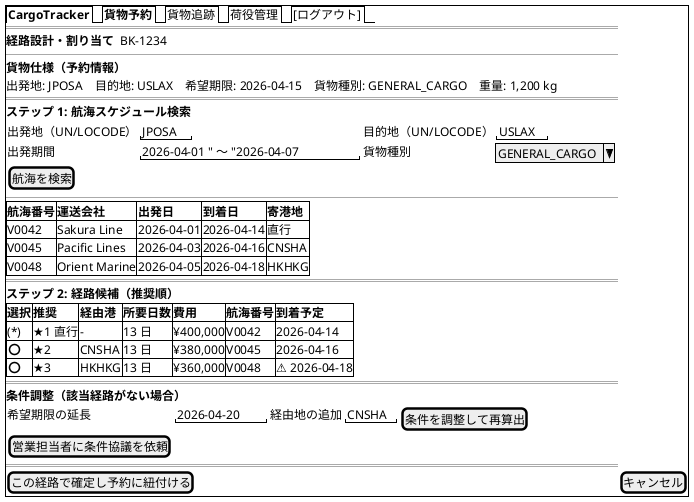

#### 仕様

- **主要アクター**: 経路設計者（ROLE_ROUTE_DESIGNER）。営業担当者は予約詳細画面での「経路設計依頼」までを担い、本画面での操作は行わない
- **貨物仕様確認（US07 / UC05）**: 予約番号に紐づく出発地・目的地・期限・貨物仕様を画面上部に常時表示する
- **航海スケジュール検索（US07 / UC05）**:
  - 検索条件は出発地・目的地・出発期間・貨物種別。出発地・目的地は UN/LOCODE 形式（5 文字）で指定する
  - 制約条件（航海スケジュール・寄港地接続・港湾制約・貨物種別対応）に基づいて利用可能な航海のみを表示する
  - 危険物（HAZARDOUS）・冷凍貨物（REFRIGERATED）の場合は対応可能な航海のみに絞り込む
  - 条件を満たす航海がない場合は「該当する航海がありません」と表示し、条件を緩和して再検索できる
- **経路候補算出（US08 / UC06）**:
  - 検索結果と出発地・目的地・期限を入力として経路候補を自動算出し、寄港地の接続可能性を評価する
  - 候補ごとに所要日数・経由港・費用・航海番号を表示し、推奨順に並べる。直行便がある場合は最優先候補として提示する
  - 期限内に到達可能な経路がない場合はその旨を通知し、条件調整パネルへ誘導する
  - 到着予定が希望期限を超える候補は `⚠` アイコン付きで警告
- **経路選択・確定（US09 / UC07）**: ラジオ選択で候補を 1 件選択すると htmx `hx-get` で詳細を部分更新。`[この経路で確定し予約に紐付ける]` で経路状態が「確定」となる
- **条件調整・再算出（US10 / UC08)**: 現在の制約条件（期限・経由地制限等）を表示し、期限延長・経由地追加・貨物種別変更等を調整して `[条件を調整して再算出]` で経路候補を再算出する。調整後も条件を満たす経路がない場合は `[営業担当者に条件協議を依頼]` で荷主との条件協議を依頼できる
- **予約への紐付け（US11 / UC09）**: 確定成功時は PRG パターンで `/bookings/{bookingId}` へリダイレクトし、BookingStatus が `RouteProposed`（経路提案中）に更新される

---

### 貨物追跡入力 (/tracking)

#### ワイヤーフレーム

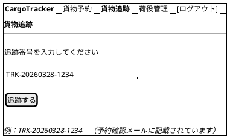

#### 仕様

- **入力フィールド**: 追跡番号（`TRK-YYYYMMDD-NNNN` 形式）
- **バリデーション**: フォーマット不正の場合はインラインエラー表示
- **未発見**: 404 の場合は「該当する貨物が見つかりません」メッセージ
- **認証不要**: 荷受人（ROLE_CONSIGNEE）は認証なしでもアクセス可

---

### 追跡詳細 (/tracking/{trackingNumber})

#### ワイヤーフレーム

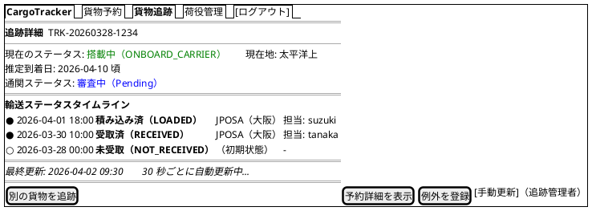

#### 仕様

- **自動更新**: htmx `hx-get="/tracking/{trackingNumber}/status" hx-trigger="every 30s" hx-target="#status-timeline"` で部分更新
- **手動更新（US17・追跡管理者）**: `ROLE_TRACKER` にのみ「貨物状態を手動更新する」フォームを表示し、新しい状態（搭載中=出港 / 荷降し済=入港 等）・位置（UN/LOCODE）・更新日時・航海番号（任意）を入力して `POST /tracking/{trackingNumber}/updates` で更新する（確認ダイアログ付・PRG）。更新は追跡イベント履歴に追記され、状態変更の種類に応じて荷主へ通知（記録）される。自動更新の `GET .../status`（部分更新）とパスの用途が異なるため、手動更新は `POST .../updates` を用いる
- **タイムライン**: TransportStatus の変化を時系列で表示。最新状態を最上部に
- **TransportStatus の遷移**: `NOT_RECEIVED → RECEIVED → LOADED → ONBOARD_CARRIER → UNLOADED → AWAITING_CLAIM → CLAIMED`
- **推定到着日**: `YYYY-MM-DD 頃` の形式で表示。未確定の場合は「未確定」と表示
- **CustomsStatus**: `Pending`（審査中）/ `Cleared`（通関済）/ `Held`（留置中）/ `Rejected`（却下）を付録の CustomsStatus バッジ定義に従い表示
- **EXCEPTION**: 異常発生時は「例外（EXCEPTION）」の赤色バッジで表示し、内容を詳細表示。未解決の例外行には追跡管理者向けに `[解決]` リンクを表示
- **[予約詳細を表示]**: ROLE_SALES, ROLE_SHIPPER のみ表示
- **[例外を登録]**: ROLE_TRACKER のみ表示。`/tracking/{trackingNumber}/exceptions/new` へ遷移

---

### 例外登録 (/tracking/{trackingNumber}/exceptions/new)

#### ワイヤーフレーム

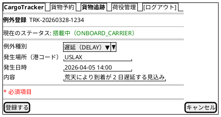

#### 仕様

- **アクセス制御**: ROLE_TRACKER のみアクセス可能
- **例外種別**: ExceptionType（`DELAY`（遅延）/ `DAMAGE`（損傷）/ `LOST`（紛失）/ `CUSTOMS_HOLD`（通関保留））から選択
- **入力項目**: 例外種別・発生場所（港コード）・発生日時・内容（必須）
- **登録成功**: PRG パターンで追跡詳細へリダイレクトし、TransportStatus が「例外（EXCEPTION）」に遷移する
- **エラー時**: 同画面を再描画し、エラーフィールドを赤ボーダーで強調

---

### 例外解決 (/tracking/{trackingNumber}/exceptions/{exceptionId}/resolve)

#### ワイヤーフレーム

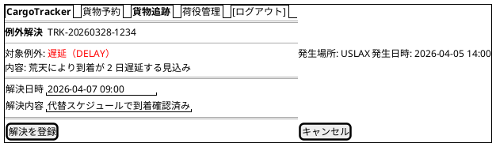

#### 仕様

- **アクセス制御**: ROLE_TRACKER のみアクセス可能
- **対象例外**: 例外種別・発生場所・発生日時・内容を読み取り専用で表示
- **入力項目**: 解決日時・解決内容（必須）
- **解決成功**: PRG パターンで追跡詳細へリダイレクトし、TransportStatus は直前の正常ステータスに復帰する

---

### 荷役作業登録 (/handling/new)

#### ワイヤーフレーム

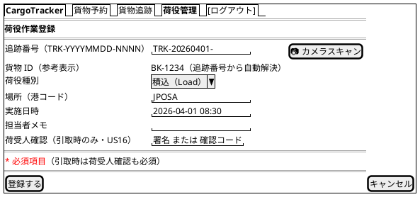

#### 仕様

- **荷役種別**: HandlingType（`Receive` / `Load` / `Unload` / `Customs` / `Claim`）から選択。表記は付録の HandlingType 対応表に従い「日本語ラベル（コード）」形式で表示
- **識別子**: 追跡番号（`TRK-YYYYMMDD-NNNN` 形式）を主キー入力とし、対応する貨物 ID を参考表示として併記する
- **カメラスキャン**: `[📷 カメラスキャン]` ボタンはバーコード・QR コードから**追跡番号**を読み取って入力欄に反映する
- **荷受人確認（US16・引取時のみ）**: 荷役種別 `Claim`（引取）を選択したときのみ「荷受人確認（署名または確認コード）」フィールドを htmx／JS で表示し必須化する。引取以外では非表示。荷受人確認を伴う引取記録で貨物状態が「引取済（CLAIMED）」に更新され、配送完了＝精算処理の開始条件となる。不変条件はドメイン（`HandlingActivity::register`）が担保し UI ガードに依存しない
- **通関前提チェック**: 荷役種別 `Claim` は対象貨物の CustomsStatus が `Cleared` の場合のみ登録可能（IT6 の通関スコープ）。未クリアの場合はサーバーバリデーションでエラー表示（通関一覧画面で状態を確認できる）
- **実施日時**: 未来日時は警告表示（投機的な登録は許可）
- **登録成功**: PRG パターンで `/handling` へリダイレクト

---

### 荷役作業一覧 (/handling)

#### ワイヤーフレーム

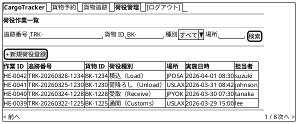

#### 仕様

- **検索フィルタ**: 追跡番号（主）・貨物 ID（併記）・荷役種別・場所（港コード）でフィルタリング
- **識別子**: 一覧は追跡番号を主として表示し、貨物 ID を併記する（荷役登録と同一の識別子体系）
- **htmx**: 検索フォームに `hx-get="/handling" hx-target="#handling-list"` で部分更新
- **新規登録**: ROLE_HANDLER のみ表示
- **ページネーション**: 1 ページ 20 件

---

### 通関一覧 (/customs)

#### ワイヤーフレーム

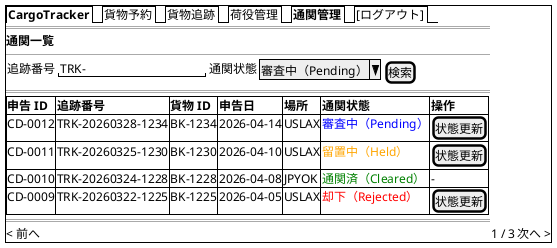

#### 仕様

- **主要アクター**: 荷役作業員（ROLE_HANDLER）。追跡管理者（ROLE_TRACKER）は閲覧可能
- **検索フィルタ**: 追跡番号（主。貨物 ID を一覧に併記）・CustomsStatus（`Pending` / `Cleared` / `Held` / `Rejected`）でフィルタリング
- **ステータスバッジ**: 付録の CustomsStatus バッジ定義に従い「日本語ラベル（コード）」形式で表示
- **[状態更新]**: ROLE_HANDLER のみ表示。`/customs/{declarationId}/update` へ遷移。`Cleared` 確定済みの行には表示しない
- **業務ルール**: 対象貨物の CustomsStatus が `Cleared` になるまで荷役種別 `Claim`（引取）は登録できない。本画面で貨物ごとの通関状態を確認してから引取作業に進む
- **htmx**: 検索フォームに `hx-get="/customs" hx-target="#customs-list"` で部分更新

---

### 通関状態更新 (/customs/{declarationId}/update)

#### ワイヤーフレーム

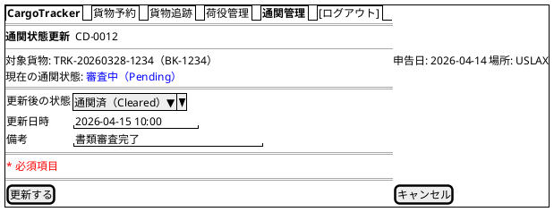

#### 仕様

- **アクセス制御**: ROLE_HANDLER のみアクセス可能
- **状態遷移**: `Pending` から `Cleared`（通関済）/ `Held`（留置中）/ `Rejected`（却下）へ更新する。`Held` からは `Cleared` / `Rejected` への再更新が可能
- **業務ルール**: `Cleared` に更新されるまで対象貨物の `Claim`（引取）荷役は登録不可。`Rejected` の場合は追跡管理者へ通知され、例外（`CUSTOMS_HOLD`）登録の判断を促す
- **更新成功**: PRG パターンで `/customs` へリダイレクトし、フラッシュメッセージを表示
- **エラー時**: 同画面を再描画し、エラーフィールドを赤ボーダーで強調

---

### 航路一覧 (/voyages)

#### ワイヤーフレーム

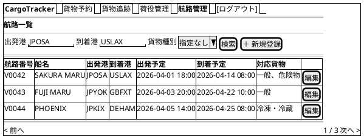

#### 仕様

- **検索フィルタ（US07）**: 出発港・到着港・貨物種別でフィルタリング。危険物・冷凍貨物は対応可能な航海のみに絞り込む
- **0 件時**: 条件を満たす航海がない場合は「該当する航海がありません」を表示し、条件を緩和して再検索できる
- **登録・更新（US24/US25）**: ROLE_ROUTE_DESIGNER は [＋ 新規登録] から航路登録、行の [編集] から航路更新ができる
- **経路設計への連携**: 経路設計・割り当て画面が本データを参照して航海検索・経路候補を生成

> **注記（IT2 実装）**: 参考実装の「空き状況」列・「閲覧専用」方針は、Routing Context の Voyage 集約（航海番号・船名・運送会社・対応貨物種別・運送区間）に基づく登録・更新・検索へと再設計した。積載容量に基づく空き状況表示は将来対応とする。

---

### 航路登録 (/voyages/new) / 航路更新 (/voyages/{voyageNumber}/edit)

#### ワイヤーフレーム

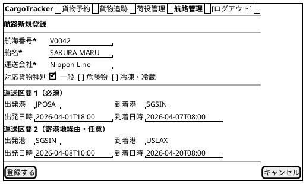

#### 仕様

- **航路登録（US24）**: 航海番号・船名・運送会社・出発港/到着港（UN/LOCODE）・出発日時/到着日時・対応貨物種別を入力する。寄港地は運送区間を順序付きで複数入力できる（IT2 は 2 区間まで）
- **バリデーション**: 必須項目未入力・出発日時が到着日時より後・区間跨ぎの時系列逆転・同一航海番号の重複は `422` で該当エラーを表示し、フォームを再描画する（自己ループ）
- **航路更新（US25）**: 更新画面は上部に「現在の登録内容」カードを表示し、フォームで上書き更新する。航海番号は読み取り専用。[キャンセル] で一覧へ戻り既存は変更されない
- **成功時**: PRG パターンで `303 See Other` により `/voyages` へリダイレクトし、成功メッセージ（`alert-success`）を表示する

---

### 請求書一覧 (/billing/invoices)

#### ワイヤーフレーム

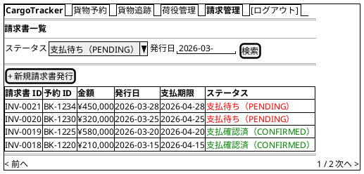

#### 仕様

- **フィルタ**: PaymentStatus（`PENDING`, `CONFIRMED`, `OVERDUE`, `REFUNDED`）・発行日でフィルタリング
- **ステータスバッジ**: 付録の PaymentStatus バッジ定義に従い「日本語ラベル（コード）」形式で表示
- **支払期限超過**: 期限超過かつ未払いの場合は行を赤色ハイライト
- **アクセス制御**: ROLE_BILLING のみアクセス可能

---

### 請求書詳細 (/billing/invoices/{invoiceId})

#### ワイヤーフレーム

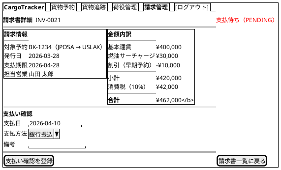

#### 仕様

- **金額内訳**: 基本運賃・サーチャージ・割引・消費税を明細表示
- **[支払い確認を登録]**: `POST /billing/invoices/{invoiceId}/confirm` を送信。PRG パターンで同画面へリダイレクト
- **確認済み**: PaymentStatus が `CONFIRMED` の場合は支払いフォームを非表示にし、確認日時を表示
- **PDF 出力**: `GET /billing/invoices/{invoiceId}/pdf` で請求書 PDF をダウンロード（将来実装）

---

### 割引ポリシー一覧 (/admin/discount-policies)

#### ワイヤーフレーム

```plantuml
@startsalt
{+
  {/ <b>CargoTracker</b> | 貨物予約 | 貨物追跡 | 管理設定 | [ログアウト] }
  ==
  <b>割引ポリシー一覧</b>
  ==
  {
    検索: | "貨物種別または顧客カテゴリ  " | [検索]
  }
  {#
    **ID** | **ポリシー名** | **貨物種別** | **顧客区分** | **割引率** | **有効開始** | **有効終了** | **操作**
    DP-001 | 一般顧客基本割引 | GENERAL | STANDARD | 0% | 2026-01-01 | -（無期限） | [編集][無効化]
    DP-002 | 契約顧客割引 | ALL | CONTRACT | 5% | 2026-01-01 | -（無期限） | [編集][無効化]
    DP-003 | ボリューム顧客割引 | ALL | VOLUME | 10% | 2026-01-01 | -（無期限） | [編集][無効化]
    DP-004 | 危険物割増 | DANGEROUS | ALL | -3% | 2026-01-01 | -（無期限） | [編集][無効化]
  }
  ==
  [+ 新規ポリシー登録]
}
@endsalt
```

#### 仕様

- **一覧**: 有効期間・有効 / 無効ステータスでフィルタリング可能
- **[編集]**: `/admin/discount-policies/{id}/edit` に遷移
- **[無効化]**: `POST /admin/discount-policies/{id}/disable` で論理削除（PRG パターン）
- **[+ 新規ポリシー登録]**: `/admin/discount-policies/new` に遷移
- **アクセス制御**: `ROLE_ADMIN` のみアクセス可能。他ロールは 403 画面を表示

---

### 割引ポリシー登録 (/admin/discount-policies/new)

#### ワイヤーフレーム

```plantuml
@startsalt
{+
  {/ <b>CargoTracker</b> | 貨物予約 | 貨物追跡 | 管理設定 | [ログアウト] }
  ==
  <b>割引ポリシー登録</b>
  ==
  {
    ポリシー名       | "                              "
    対象貨物種別     | ^GENERAL（一般）▼^
    対象顧客区分     | ^STANDARD（通常）▼^
    割引率（%）      | "    "  （プラス: 割引 / マイナス: 割増）
    有効開始日       | "YYYY-MM-DD  "
    有効終了日       | "YYYY-MM-DD  " （空欄 = 無期限）
  }
  ==
  [  登録する  ] | [キャンセル]
}
@endsalt
```

#### 仕様

- **バリデーション**: 割引率は -50〜100% の範囲、有効開始日 ≤ 有効終了日
- **重複チェック**: 同一の「貨物種別 × 顧客区分 × 期間」のポリシーが既に存在する場合はエラー表示
- **[登録する]**: `POST /admin/discount-policies` に送信。PRG パターンで一覧にリダイレクト
- **[キャンセル]**: `/admin/discount-policies` に戻る

---

### 公開貨物追跡 (/public/tracking/{trackingNumber})

#### ワイヤーフレーム

```plantuml
@startsalt
{+
  ==
  {
    .
    <b>CargoTracker 公開追跡</b>
    貨物の現在状況をご確認いただけます
    .
  }
  ==
  {
    追跡番号 | "TRK-20260328-1234          " | [追跡]
  }
  ==
  <b>追跡結果</b>
  {+
    追跡番号: TRK-20260328-1234
    ステータス: <b>搭載中（ONBOARD_CARRIER）</b>
    現在地: JPOSA → USLAX
    ----
    <b>イベント履歴</b>
    {#
      **日時** | **イベント** | **場所**
      2026-03-31 09:15 | 積込（Load） | JPOSA
      2026-03-30 14:00 | 受取（Receive） | JPOSA
    }
  }
  ==
  <i>お問い合わせ: support@cargotracker.example.com</i>
}
@endsalt
```

#### 仕様

- **認証**: 不要（axum のルーター構成で `/public/**` を認証ミドルウェアの対象外とする）
- **追跡番号フォーム**: `GET /public/tracking/{trackingNumber}` でページ表示。結果は同一ページ内に表示
- **404 処理**: 存在しない追跡番号は「該当する貨物が見つかりません。追跡番号を確認の上、再度お試しください」を表示
- **連絡先**: フッターに問い合わせメールアドレスを表示（荷主への導線確保）
- **レスポンシブ**: モバイルファースト（スマートフォンで QR コードから直接アクセスを想定）
- **表示情報の制限**: TransportStatus・最終イベント・現在地のみ（荷主名・住所等の個人情報は非表示）
- **ステータス表記**: TransportStatus 体系に統一し、付録の TransportStatus バッジ定義に従い「日本語ラベル（コード）」形式で表示する（BookingStatus は表示しない）
- **AFTER_COMMIT タイムラグ**: ステータス反映に最大 30 秒かかる旨を画面下部に注記する

---

### 見積詳細 (/estimates/{estimateId})

#### ワイヤーフレーム

```plantuml
@startsalt
{+
  {/ <b>CargoTracker</b> | 貨物予約 | <b>見積管理</b> | [ログアウト] }
  ==
  <b>見積詳細</b>  EST-0031
  --
  出発地: JPOSA　目的地: USLAX　希望期限: 2026-04-15　貨物種別: GENERAL_CARGO　重量: 1,200 kg
  ==
  <b>ルート候補（スタブ）</b>
  {#
    **候補** | **経由港** | **所要日数** | **概算費用**
    1        | 直行       | 13 日        | ¥400,000
    2        | CNSHA      | 13 日        | ¥380,000
  }
  ==
  [この見積で予約する] | [見積一覧に戻る]
}
@endsalt
```

#### 仕様

- **アクセス制御**: ROLE_SALES のみアクセス可能
- **[この見積で予約する]**: 予約登録フォーム（`/bookings/new`）へ遷移し、見積内容（出発地・目的地・貨物種別・重量）を初期値として引き継ぐ（Phase 4 実装予定）
- **ルート候補**: スタブルート候補を概算費用付きで一覧表示（US01）

---

### htmx 部分更新パターン

#### 追跡ステータス自動更新

追跡詳細画面では、荷物の状態をユーザーがリロードせずに確認できるよう、30 秒ごとに自動更新する。

```html
<!-- 追跡詳細画面のステータスタイムライン部分 -->
<div id="status-timeline"
     hx-get="/tracking/TRK-20260328-1234/status"
     hx-trigger="every 30s"
     hx-swap="innerHTML">
  {# Askama でサーバーレンダリングされた初期コンテンツ #}
</div>
<p id="last-updated">最終更新: <span>{{ last_updated }}</span></p>
```

**サーバー側レスポンス**: `/tracking/{trackingNumber}/status` は HTML フラグメント（`_status_timeline.html` の Template 構造体）を返す（`Content-Type: text/html`）。

#### 検索フォームの部分更新

貨物予約一覧・荷役作業一覧の検索フォームは、ページ全体を再読み込みせずに結果テーブルのみを更新する。

```html
<form hx-get="/bookings"
      hx-target="#booking-list"
      hx-swap="outerHTML"
      hx-push-url="true">
  <input name="origin" type="text" placeholder="出発地">
  <input name="destination" type="text" placeholder="目的地">
  <select name="status">...</select>
  <button type="submit">検索</button>
</form>
<div id="booking-list">
  <!-- 検索結果テーブル -->
</div>
```

`hx-push-url="true"` により、検索条件が URL に反映されブラウザ履歴に残る。

#### 経路候補の動的読み込み

経路設計・割り当て画面でラジオボタンを選択すると、選択した航路の詳細を動的に読み込む。

```html
<input type="radio" name="voyage_number" value="V0042"
       hx-get="/api/voyages/V0042/detail"
       hx-target="#voyage-detail"
       hx-swap="innerHTML">
```

#### フォームのインラインバリデーション

入力フィールドからフォーカスが外れたタイミング（`blur`）でサーバーサイドバリデーションを実行する。業務フォームでは過剰発火を避けるため、トリガーは `blur changed`（値が変化した場合のみ blur で発火）に統一する。`change` トリガーは使用しない。

```html
<input name="origin" type="text"
       hx-post="/api/validate/location"
       hx-trigger="blur changed"
       hx-target="next .error-message"
       hx-swap="innerHTML">
<span class="error-message text-danger"></span>
```

---

### エラーハンドリング

#### バリデーションエラー表示

- **フィールドレベル**: 各入力フィールドの下に赤字でメッセージ表示（Bootstrap `invalid-feedback`）
- **フォームレベル**: フォーム上部にアラートバナー（`alert-danger`）でまとめて表示
- **Askama**: サーバーバリデーション結果（フィールド名 → エラーメッセージのマップ）をテンプレート構造体に渡し、条件分岐で表示

```html
<div class="mb-3">
  <label for="origin" class="form-label">出発地 <span class="text-danger">*</span></label>
  <input type="text" id="origin" name="origin" value="{{ form.origin }}"
         class="form-control is-invalid">
  
  <div class="invalid-feedback">{{ msg }}</div>
  
</div>
```

#### フラッシュメッセージ

PRG パターンのリダイレクト後に、操作結果をフラッシュメッセージ（axum-messages / tower-sessions ベース）でフィードバックする。

| 操作 | メッセージ例 | Bootstrap クラス |
| :--- | :--- | :--- |
| 予約登録成功 | 「貨物予約 BK-1234 を登録しました」 | `alert-success` |
| 経路割り当て成功 | 「経路 V0042 を割り当てました」 | `alert-success` |
| 荷役登録成功 | 「荷役作業 HE-0042 を登録しました」 | `alert-success` |
| 支払い確認成功 | 「請求書 INV-0021 の支払いを確認しました」 | `alert-success` |
| バリデーションエラー | 「入力内容に誤りがあります。確認してください」 | `alert-danger` |
| システムエラー | 「処理中にエラーが発生しました。時間をおいて再試行してください」 | `alert-danger` |

フラッシュメッセージは共通テンプレート `fragments/alerts.html` で一元管理する。

#### エラーページ

| HTTP ステータス | 画面 | 内容 |
| :--- | :--- | :--- |
| 400 Bad Request | `/error/400` | 不正なリクエスト。入力を確認してください |
| 403 Forbidden | `/error/403` | アクセス権限がありません |
| 404 Not Found | `/error/404` | 指定されたページまたはリソースが見つかりません |
| 500 Internal Server Error | `/error/500` | サーバーエラーが発生しました。管理者に連絡してください |

各エラーページはナビゲーションバーを表示し、ダッシュボードへ戻るリンクを提供する。

#### htmx エラーハンドリング

htmx リクエストがエラーを返した場合は、`htmx:responseError` イベントをキャッチして通知を表示する。

```javascript
document.addEventListener('htmx:responseError', function(event) {
  const status = event.detail.xhr.status;
  const messageEl = document.getElementById('htmx-error-toast');
  if (status === 404) {
    messageEl.textContent = '対象データが見つかりませんでした';
  } else {
    messageEl.textContent = '通信エラーが発生しました。再試行してください';
  }
  messageEl.classList.remove('d-none');
});
```

---

### アクセシビリティ

#### キーボードナビゲーション

- **Tab 順序**: フォーム項目 → 送信ボタン → ナビゲーションの順に自然な Tab 移動
- **Enter キー**: フォーム内でのフォーカス状態で Enter キーを押すと送信
- **Escape キー**: モーダル・確認ダイアログを閉じる
- **スキップリンク**: `<a href="#main-content" class="visually-hidden-focusable">コンテンツにスキップ</a>` をヘッダー先頭に配置

#### ARIA 対応

| 要素 | ARIA 属性 |
| :--- | :--- |
| ナビゲーションバー | `role="navigation" aria-label="メインナビゲーション"` |
| 検索フォーム | `role="search" aria-label="貨物検索"` |
| データテーブル | `role="grid" aria-label="[テーブル名]"` |
| ステータスバッジ | `aria-label="ステータス: 経路提案済（ROUTE_PROPOSED）"` |
| ローディングインジケーター | `aria-live="polite" aria-busy="true"` |
| エラーメッセージ | `role="alert" aria-live="assertive"` |
| フラッシュメッセージ | `role="status" aria-live="polite"` |

#### htmx と ARIA

htmx の部分更新後に動的コンテンツが更新されることをスクリーンリーダーに通知する。

```html
<!-- 自動更新エリアは aria-live="polite" で通知 -->
<div id="status-timeline"
     aria-live="polite"
     aria-atomic="false"
     hx-get="/tracking/TRK-20260328-1234/status"
     hx-trigger="every 30s">
</div>
```

#### カラーコントラスト

- 通常テキスト: コントラスト比 4.5:1 以上（WCAG AA 準拠）
- 大きいテキスト（18px 以上）: 3:1 以上
- ステータスバッジは色のみに依存せず、テキストラベルを必ず併記

---

## 付録: ステータス対応表（正典）

本対応表を UI 上のステータス表記の Single Source とする。ワイヤーフレーム・実装のバッジ表示は「日本語ラベル（コード）」形式（例: 仮予約（PRELIMINARY））で本表の定義に従うこと。

### BookingStatus バッジ定義

| ステータス | 表示ラベル | Bootstrap クラス | 意味 |
| :--- | :--- | :--- | :--- |
| `PRELIMINARY` | 仮予約 | `badge bg-warning text-dark` | 経路未割り当て |
| `ROUTE_DESIGNING` | 経路設計中 | `badge bg-warning text-dark` | 経路設計依頼済み・設計者が経路を設計中（IT4） |
| `ROUTE_PROPOSED` | 経路提案済 | `badge bg-primary` | 経路割り当て完了・未確認 |
| `CONFIRMED` | 確認済 | `badge bg-success` | 予約確定 |
| `TRACKING_ISSUED` | 追跡番号発行済 | `badge bg-info text-dark` | 追跡番号付与 |
| `IN_TRANSIT` | 輸送中 | `badge bg-primary` | 積み込み済・輸送中 |
| `DELIVERED` | 配送完了 | `badge bg-success` | 配達完了 |
| `SETTLED` | 精算完了 | `badge bg-secondary` | 請求・支払い完了 |
| `CANCELLED` | キャンセル | `badge bg-danger` | キャンセル済 |

### TransportStatus バッジ定義

| ステータス | 表示ラベル | Bootstrap クラス |
| :--- | :--- | :--- |
| `NOT_RECEIVED` | 未受取 | `badge bg-secondary` |
| `RECEIVED` | 受取済 | `badge bg-info text-dark` |
| `LOADED` | 積み込み済 | `badge bg-primary` |
| `ONBOARD_CARRIER` | 搭載中 | `badge bg-primary` |
| `UNLOADED` | 荷降ろし済 | `badge bg-warning text-dark` |
| `AWAITING_CLAIM` | 引取待ち | `badge bg-warning text-dark` |
| `CLAIMED` | 引取完了 | `badge bg-success` |
| `EXCEPTION` | 例外 | `badge bg-danger` |
| `UNKNOWN` | 不明 | `badge bg-secondary` |

### PaymentStatus バッジ定義

| ステータス | 表示ラベル | Bootstrap クラス | 意味 |
| :--- | :--- | :--- | :--- |
| `PENDING` | 支払待ち | `badge bg-danger` | 請求発行済・未入金 |
| `CONFIRMED` | 支払確認済 | `badge bg-success` | 入金確認完了 |
| `OVERDUE` | 期限超過 | `badge bg-danger` | 支払期限を超過した未入金 |
| `REFUNDED` | 返金済 | `badge bg-secondary` | 返金処理完了 |

### ExceptionType 定義

| 種別 | 表示ラベル | 意味 |
| :--- | :--- | :--- |
| `DELAY` | 遅延 | スケジュール遅延 |
| `DAMAGE` | 損傷 | 貨物の損傷 |
| `LOST` | 紛失 | 貨物の紛失 |
| `CUSTOMS_HOLD` | 通関保留 | 通関手続きでの留置 |

### CustomsStatus バッジ定義

ドメインモデル（domain-model.md）の `CustomsStatus` enum を正典とする。

| ステータス | 表示ラベル | Bootstrap クラス | 意味 |
| :--- | :--- | :--- | :--- |
| `Pending` | 審査中 | `badge bg-primary` | 通関申告済・審査中 |
| `Cleared` | 通関済 | `badge bg-success` | 通関完了。引取（Claim）可能 |
| `Held` | 留置中 | `badge bg-warning text-dark` | 税関で留置中 |
| `Rejected` | 却下 | `badge bg-danger` | 通関不許可 |

### HandlingType 対応表

ドメインモデル（domain-model.md）の `HandlingType` enum（`Receive` / `Load` / `Unload` / `Customs` / `Claim`）を正典とする。`CUSTOMS_CLEARANCE` 等の別表記は使用しない。

| 種別（正典） | 表示ラベル | 意味 |
| :--- | :--- | :--- |
| `Receive` | 受取 | 出発地での貨物受取 |
| `Load` | 積込 | 船舶への積み込み |
| `Unload` | 荷降ろし | 船舶からの荷降ろし |
| `Customs` | 通関 | 通関手続き |
| `Claim` | 引取 | 目的地での荷受人引取（CustomsStatus が `Cleared` の場合のみ登録可） |
