# UI 設計 - 国際貨物輸送管理システム

## 概要

本ドキュメントでは、国際貨物輸送管理システムの UI 設計を定義します。

### 設計方針

**OOUX（オブジェクト指向 UI 設計）** をベースに、ユーザーが操作する「オブジェクト」（貨物予約・追跡・荷役・航路・請求書）を中心に画面を構成します。各画面はオブジェクトの状態を可視化し、アクターに応じた操作を提供します。

### 技術スタック

| 技術 | 役割 |
| :--- | :--- |
| Ruby on Rails + ERB | SSR（サーバーサイドレンダリング）でフル HTML を生成 |
| Hotwire（Turbo Frames / Turbo Streams / Stimulus） | フォームバリデーション・ステータス自動更新など部分的な動的更新 |
| Bootstrap 5.3 | レスポンシブグリッド・コンポーネント |
| PRG パターン | フォーム送信後は必ず Redirect-Get で二重送信を防止（Turbo は 303 See Other リダイレクトに追従） |

### 基本 UX 原則

- **オブジェクト中心**: 一覧 → 詳細 → アクションの自然な流れ
- **状態の可視化**: BookingStatus・TrackingStatus をバッジで常時表示（画面上は日本語ラベルに統一。「画面ラベル定義」を参照）
- **フィードバック**: 操作成功・失敗はフラッシュメッセージで通知
- **アクセシビリティ**: ARIA ラベル・キーボードナビゲーション対応

---

## UI オブジェクト定義

OOUX に基づき、システム内の主要オブジェクトとそのアクション・属性を定義します。

### 主要オブジェクト

| オブジェクト | 主な属性 | ユーザーアクション | 関連オブジェクト |
| :--- | :--- | :--- | :--- |
| **貨物予約（Booking）** | booking_id, 出発地, 目的地, 希望期限, 貨物種別, 重量, BookingStatus | 新規登録・詳細確認・経路割り当て・キャンセル | 追跡情報, 航路, 荷役履歴 |
| **追跡情報（Tracking）** | tracking_number, TrackingStatus, 現在地, ステータス履歴 | 追跡番号検索・履歴確認 | 貨物予約 |
| **荷役作業（HandlingEvent）** | event_id, 貨物 ID, 荷役種別, 場所, 実施日時, 担当者 | 新規登録・一覧確認 | 貨物予約 |
| **航路（Voyage）** | voyage_number, 出発港, 到着港, 出発予定日, 到着予定日 | 一覧確認・経路割り当てへの提供 | 貨物予約 |
| **請求書（Invoice）** | invoice_id, 貨物予約, 金額, 割引, 消費税, PaymentStatus | 一覧確認・詳細確認・支払い確認 | 貨物予約 |

### オブジェクト間の関係

```
Booking 1 ─── 1 Tracking
Booking 1 ─── N HandlingEvent
Booking N ─── M Voyage（経路割り当てを通じて）
Booking 1 ─── 1 Invoice
```

---

## 画面一覧

URL は Rails の RESTful ルーティング規約（`resources`）に合わせて設計します。

| 画面名 | URL パス | 説明 | 主要アクター | 対応 US |
| :--- | :--- | :--- | :--- | :--- |
| ログイン | `/login` | 認証フォーム | 全ロール | - |
| ダッシュボード | `/` | 全体サマリー・最新荷役情報 | 全ロール | US01 |
| 荷主一覧 | `/shippers` | 登録済み荷主の一覧 | 営業担当者 | US02, US03 |
| 荷主登録 | `/shippers/new` | 個人・法人荷主の登録フォーム（種別選択で法人契約情報を表示） | 営業担当者 | US02, US03 |
| 貨物予約一覧 | `/bookings` | 予約済み貨物の一覧・検索 | 荷主、営業担当者 | - |
| 貨物予約登録 | `/bookings/new` | 新規予約フォーム | 営業担当者 | US04 |
| 予約詳細 | `/bookings/:id` | 予約情報・旅程・荷役履歴・通知記録・確定/差戻し/キャンセル操作・追跡番号発行（CONFIRMED 時） | 荷主、営業担当者、経路設計者 | US05, US06, US12, US13, US14 |
| 経路割り当て | `/bookings/:booking_id/route/edit` | 利用可能な航路から経路を選択・条件調整で再算出 | 営業担当者 | US07, US08, US09, US10, US11 |
| 貨物追跡入力 | `/tracking` | 追跡番号入力フォーム | 荷主、荷受人、追跡管理者 | US18 |
| 追跡詳細 | `/tracking/:tracking_number` | 輸送ステータス履歴タイムライン・状態手動更新（追跡管理者） | 荷主、荷受人、追跡管理者 | US17, US18 |
| 荷役作業登録 | `/handling_events/new` | 荷役イベント登録フォーム（RECEIVE/LOAD/UNLOAD/CLAIM・CLAIM 時に荷受人確認フィールド表示） | 荷役作業員 | US15, US16 |
| 荷役作業一覧 | `/handling_events` | 荷役履歴一覧・検索 | 荷役作業員、追跡管理者 | US15, US16 |
| 航路一覧 | `/voyages` | 航路・スケジュール一覧 | 経路設計者 | - |
| 請求書一覧 | `/billing/invoices` | 請求書の一覧・ステータス管理 | 経理担当者 | US16, US17 |
| 請求書詳細 | `/billing/invoices/:id` | 請求書詳細・支払い確認 | 経理担当者 | US18 |
| 割引ポリシー一覧 | `/admin/discount_policies` | 割引ポリシーの一覧・有効期限管理 | admin ロール | US-ADM-01 |
| 割引ポリシー登録 | `/admin/discount_policies/new` | 新規割引ポリシー登録フォーム | admin ロール | US-ADM-01 |
| 割引ポリシー編集 | `/admin/discount_policies/:id/edit` | 割引ポリシー編集フォーム | admin ロール | US-ADM-01 |
| 公開貨物追跡入力 | `/public/tracking` | 認証不要の追跡番号入力フォーム（未認証ユーザーの入口） | 荷主・荷受人（未認証） | US13 |
| 公開貨物追跡 | `/public/tracking/:tracking_id` | 認証不要の貨物状態照会ページ（荷主が URL 共有可） | 荷主・荷受人（未認証） | US13 |
| 見積一覧 | `/estimates` | 見積の一覧・検索 | 営業担当者 | US01 |
| 見積作成 | `/estimates/new` | 新規見積フォーム（出発地・目的地・期限・貨物仕様入力） | 営業担当者 | US01 |
| 見積詳細 | `/estimates/:id` | 見積詳細・ルート候補一覧 | 営業担当者 | US01 |
| 例外管理一覧 | `/exceptions` | 例外イベント一覧・対応状況の確認（IT6） | 追跡管理者 | US19, US20 |
| 例外イベント登録 | `/exceptions/new` | 例外イベント登録・荷主への対応報告（IT6） | 追跡管理者 | US19, US20 |

### ルーティング設計（config/routes.rb）

Rails の `resources` / `namespace` を用いた RESTful ルーティングとして定義します。

| HTTP メソッド | パス | コントローラ#アクション | 用途 |
| :--- | :--- | :--- | :--- |
| GET | `/` | `dashboard#show` | ダッシュボード表示 |
| GET | `/login` | `sessions#new` | ログインフォーム |
| POST | `/login` | `sessions#create` | 認証実行 |
| DELETE | `/logout` | `sessions#destroy` | ログアウト |
| GET | `/bookings` | `bookings#index` | 予約一覧・検索 |
| GET | `/bookings/new` | `bookings#new` | 予約フォーム |
| POST | `/bookings` | `bookings#create` | 予約登録 |
| GET | `/bookings/:id` | `bookings#show` | 予約詳細 |
| GET | `/bookings/:booking_id/route/edit` | `bookings/routes#edit` | 経路割り当て画面（経路候補一覧・US09 / 条件調整再算出フォーム・US10） |
| PATCH | `/bookings/:booking_id/route` | `bookings/routes#update` | 経路割り当て実行（候補選択→紐付け・US09/US11・ROUTE_PROPOSED） |
| POST | `/bookings/:id/assign_routing` | `bookings#assign_routing` | 経路設計者への引き渡し（US06） |
| POST | `/bookings/:id/confirm` | `bookings#confirm` | 予約確定（US13・ROUTE_PROPOSED → CONFIRMED） |
| POST | `/bookings/:id/reroute` | `bookings#reroute` | ルート変更で差戻し（US13・ROUTE_PROPOSED → ROUTE_REQUESTED） |
| POST | `/bookings/:id/cancel` | `bookings#cancel` | 予約キャンセル（US13・→ CANCELLED） |
| POST | `/bookings/:id/issue_tracking` | `bookings#issue_tracking` | 追跡番号発行（US14・CONFIRMED → TRACKING_ISSUED・経路設計者／MVP は営業担当者） |
| GET | `/tracking` | `trackings#new` | 追跡番号入力フォーム（US18 追跡照会の入口） |
| GET | `/tracking/:tracking_number` | `trackings#show` | 追跡詳細（US18） |
| PATCH | `/tracking/:tracking_number/status` | `trackings#update_status` | 輸送状態の手動更新（US17・追跡管理者・追跡イベント履歴追加・荷主通知） |
| GET | `/handling_events` | `handling_events#index` | 荷役一覧・検索 |
| GET | `/handling_events/new` | `handling_events#new` | 荷役登録フォーム |
| POST | `/handling_events` | `handling_events#create` | 荷役登録 |
| GET | `/voyages` | `voyages#index` | 航路一覧・検索 |
| GET | `/voyages/:id` | `voyages#show` | 航路詳細（Turbo Frame 部分取得） |
| GET | `/billing/invoices` | `billing/invoices#index` | 請求書一覧 |
| GET | `/billing/invoices/:id` | `billing/invoices#show` | 請求書詳細 |
| POST | `/billing/invoices/:id/confirm` | `billing/invoices#confirm` | 支払い確認登録 |
| GET | `/admin/discount_policies` | `admin/discount_policies#index` | 割引ポリシー一覧 |
| GET | `/admin/discount_policies/new` | `admin/discount_policies#new` | 割引ポリシー登録フォーム |
| POST | `/admin/discount_policies` | `admin/discount_policies#create` | 割引ポリシー登録 |
| GET | `/admin/discount_policies/:id/edit` | `admin/discount_policies#edit` | 割引ポリシー編集フォーム |
| PATCH | `/admin/discount_policies/:id` | `admin/discount_policies#update` | 割引ポリシー更新 |
| POST | `/admin/discount_policies/:id/disable` | `admin/discount_policies#disable` | 割引ポリシー無効化 |
| GET | `/public/tracking` | `public/trackings#new` | 公開追跡番号入力フォーム（認証不要） |
| GET | `/public/tracking/:tracking_id` | `public/trackings#show` | 公開貨物追跡（認証不要） |
| GET | `/estimates` | `estimates#index` | 見積一覧・検索 |
| GET | `/estimates/new` | `estimates#new` | 見積フォーム |
| POST | `/estimates` | `estimates#create` | 見積作成 |
| GET | `/estimates/:id` | `estimates#show` | 見積詳細 |
| GET | `/exceptions` | `exceptions#index` | 例外イベント一覧 |
| GET | `/exceptions/new` | `exceptions#new` | 例外イベント登録フォーム |
| POST | `/exceptions` | `exceptions#create` | 例外イベント登録 |
| PATCH | `/exceptions/:id/status` | `exceptions#update_status` | 例外イベントの状態更新（IT6・US17 の輸送状態手動更新は `PATCH /tracking/:tracking_number/status` に帰属） |
| POST | `/exceptions/:id/report` | `exceptions#report` | 荷主への対応報告送信 |
| POST | `/keep-alive` | `sessions#keep_alive` | セッション延長（タイムアウト警告からの継続、非機能要件 7.4） |

```ruby
# config/routes.rb（抜粋）
Rails.application.routes.draw do
  root "dashboard#show"

  get    "login",  to: "sessions#new"
  post   "login",  to: "sessions#create"
  delete "logout", to: "sessions#destroy"
  post   "keep-alive", to: "sessions#keep_alive"

  resources :bookings, only: %i[index new create show] do
    member do
      post :assign_routing
      post :confirm   # US13 予約確定（ROUTE_PROPOSED → CONFIRMED）
      post :cancel    # US13 予約キャンセル（→ CANCELLED）
      post :reroute   # US13 ルート変更で差戻し（ROUTE_PROPOSED → ROUTE_REQUESTED）
      post :issue_tracking  # US14 追跡番号発行（CONFIRMED → TRACKING_ISSUED）
    end
  end
  # 経路割り当て（US09/US10/US11）— booking_id をパスに持つネスト経路
  get   "bookings/:booking_id/route/edit", to: "bookings/routes#edit", as: :edit_booking_route
  patch "bookings/:booking_id/route",      to: "bookings/routes#update", as: :booking_route

  # 追跡は独立ルートで定義（追跡番号を業務キーとしてパスに埋め込む）
  get   "tracking", to: "trackings#new", as: :tracking
  get   "tracking/:tracking_number", to: "trackings#show", as: :tracking_detail
  patch "tracking/:tracking_number/status", to: "trackings#update_status", as: :tracking_status # US17 手動更新

  resources :handling_events, only: %i[index new create]
  resources :voyages, only: %i[index show]
  resources :estimates, only: %i[index new create show]

  resources :exceptions, only: %i[index new create] do
    member do
      patch :status, action: :update_status
      post  :report
    end
  end

  namespace :billing do
    resources :invoices, only: %i[index show] do
      member { post :confirm }
    end
  end

  namespace :admin do
    resources :discount_policies, only: %i[index new create edit update] do
      member { post :disable }
    end
  end

  namespace :public do
    get "tracking", to: "trackings#new"  # 追跡番号入力フォーム（未認証の入口）
    resources :trackings, path: "tracking", param: :tracking_id, only: %i[show]
  end
end
```

---

## 共通レイアウト設計

### ナビゲーション構成

全画面共通のナビゲーションバー（Bootstrap 5 `navbar`）を上部に配置します。レイアウトは `app/views/layouts/application.html.erb` に定義し、ナビゲーションは partial `app/views/shared/_navbar.html.erb` に切り出してロールに応じてメニュー項目を表示制御します。

| メニュー項目 | 遷移先 | 表示ロール |
| :--- | :--- | :--- |
| ダッシュボード | `/` | 全ロール |
| 荷主登録 | `/shippers/new` | sales |
| 荷主一覧 | `/shippers` | sales |
| 貨物予約 | `/bookings` | sales |
| 見積 | `/estimates` | sales |
| 貨物追跡 | `/tracking` | tracker, handler |
| 荷役管理 | `/handling_events` | handler, tracker |
| 例外管理 | `/exceptions` | tracker |
| 航路管理 | `/voyages` | sales（MVP で経路設計者を代替） |
| 請求管理 | `/billing/invoices` | billing |
| 管理設定 | `/admin/discount_policies` | admin |
| ログアウト | `/logout`（DELETE） | 全ロール |

### 共通レイアウト ワイヤーフレーム

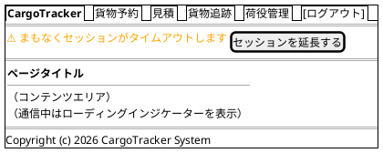

#### セッションタイムアウト警告とローディング表示（非機能要件 7.4 / 7.5）

- **セッションタイムアウト警告バナー**: ナビゲーションバー直下に警告バナー領域を確保します。Stimulus コントローラがタイムアウト 5 分前にバナーを表示し、`[セッションを延長する]` ボタンで `POST /keep-alive` を送信してセッションを延長します（非機能要件 7.4）
- **ローディングインジケーター**: フォーム送信・Turbo Frame 読み込み中は共通のローディングインジケーター（スピナー）を表示します。Turbo の `turbo:submit-start` / `turbo:submit-end` イベントと `aria-busy` を利用し、処理中であることを視覚とスクリーンリーダーの両方に伝えます（非機能要件 7.5）

### Bootstrap 5.3 グリッド運用ルール

- コンテナ: `container-fluid` で横幅を最大活用
- 一覧画面: テーブル幅 `col-12`
- フォーム画面: 入力欄 `col-md-8 offset-md-2`（中央寄せ）
- 詳細画面: 左カラム `col-md-8`、右サイドバー `col-md-4`
- ブレークポイント: モバイル（`< 768px`）では 1 カラム積み上げ

---

## 画面遷移図

フロー全体の画面遷移を PlantUML ステートチャート図で表現します。

```plantuml
@startuml
title 全体画面遷移図 - 国際貨物輸送管理システム

[*] --> ログイン画面

state ログイン画面 {
  ログイン画面 : /login
  ログイン画面 : 認証フォーム
}

ログイン画面 --> ダッシュボード : 認証成功

state ダッシュボード {
  ダッシュボード : /
  ダッシュボード : サマリーカード\n最新荷役一覧
}

ダッシュボード --> 貨物予約一覧 : [予約管理] クリック
ダッシュボード --> 貨物追跡入力 : [追跡] クリック
ダッシュボード --> 荷役作業一覧 : [荷役管理] クリック
ダッシュボード --> 請求書一覧 : [請求管理] クリック
ダッシュボード --> 航路一覧 : [航路管理] クリック

state "予約フロー" as booking_flow {
  state 貨物予約一覧 {
    貨物予約一覧 : /bookings
    貨物予約一覧 : 一覧テーブル・検索
  }
  state 貨物予約登録 {
    貨物予約登録 : /bookings/new
    貨物予約登録 : 入力フォーム
  }
  state 予約詳細 {
    予約詳細 : /bookings/:id
    予約詳細 : 予約情報・旅程・荷役履歴・通知記録
  }
  state 経路割り当て {
    経路割り当て : /bookings/:booking_id/route/edit
    経路割り当て : 航路候補テーブル・条件調整フォーム
  }

  貨物予約一覧 --> 貨物予約登録 : [新規登録] ボタン
  貨物予約一覧 --> 予約詳細 : 行クリック
  貨物予約登録 --> 予約詳細 : 登録成功（PRG）
  貨物予約登録 --> 貨物予約登録 : バリデーションエラー（422）
  予約詳細 --> 経路割り当て : [経路を割り当て]（ROUTE_REQUESTED 時）
  経路割り当て --> 経路割り当て : 条件調整→再算出（US10）
  経路割り当て --> 予約詳細 : 候補選択→割り当て（US09/US11・PRG・ROUTE_PROPOSED）
  経路割り当て --> 経路割り当て : バリデーションエラー（422）
  予約詳細 --> 予約詳細 : 予約確定（US13・→CONFIRMED）
  予約詳細 --> 予約詳細 : ルート変更で差戻し / キャンセル（US13）
  予約詳細 --> 予約詳細 : 追跡番号発行（US14・CONFIRMED 時・→TRACKING_ISSUED）
}

state "追跡フロー" as tracking_flow {
  state 貨物追跡入力 {
    貨物追跡入力 : /tracking
    貨物追跡入力 : 追跡番号入力
  }
  state 追跡詳細 {
    追跡詳細 : /tracking/:tracking_number
    追跡詳細 : ステータスタイムライン\n30 秒自動更新（Turbo Frame + Stimulus）
  }

  貨物追跡入力 --> 追跡詳細 : 追跡番号送信
  貨物追跡入力 --> 貨物追跡入力 : 番号不正・未発見
  追跡詳細 --> 貨物追跡入力 : [別の貨物を追跡]
  追跡詳細 --> 追跡詳細 : 状態手動更新（US17・追跡管理者・PATCH status・履歴追加・荷主通知）
}

state "荷役フロー" as handling_flow {
  state 荷役作業一覧 {
    荷役作業一覧 : /handling_events
    荷役作業一覧 : 一覧テーブル・検索
  }
  state 荷役作業登録 {
    荷役作業登録 : /handling_events/new
    荷役作業登録 : 登録フォーム
  }

  荷役作業一覧 --> 荷役作業登録 : [新規登録] ボタン
  荷役作業登録 --> 荷役作業登録 : CLAIM 選択→荷受人確認フィールド表示（US16・Stimulus）
  荷役作業登録 --> 荷役作業一覧 : 登録成功（US15/US16・PRG）
  荷役作業登録 --> 荷役作業登録 : 追跡番号未発見エラー / MISROUTED 警告（US15）
  荷役作業登録 --> 荷役作業登録 : バリデーションエラー（422）
}

state "精算フロー" as billing_flow {
  state 請求書一覧 {
    請求書一覧 : /billing/invoices
    請求書一覧 : 一覧テーブル・フィルタ
  }
  state 請求書詳細 {
    請求書詳細 : /billing/invoices/:id
    請求書詳細 : 詳細・支払い確認
  }

  請求書一覧 --> 請求書詳細 : 行クリック
  請求書詳細 --> 請求書一覧 : [一覧に戻る] / 支払い確認成功（PRG）
}

state 航路一覧 {
  航路一覧 : /voyages
  航路一覧 : 航路・スケジュール一覧
}

state "管理フロー" as admin_flow {
  state 割引ポリシー一覧 {
    割引ポリシー一覧 : /admin/discount_policies
    割引ポリシー一覧 : 一覧テーブル・有効期限フィルタ
  }
  state 割引ポリシー登録 {
    割引ポリシー登録 : /admin/discount_policies/new
    割引ポリシー登録 : 登録フォーム
  }
  state 割引ポリシー編集 {
    割引ポリシー編集 : /admin/discount_policies/:id/edit
    割引ポリシー編集 : 編集フォーム
  }

  割引ポリシー一覧 --> 割引ポリシー登録 : [新規登録] ボタン
  割引ポリシー一覧 --> 割引ポリシー編集 : 行の [編集] リンク
  割引ポリシー登録 --> 割引ポリシー一覧 : 登録成功（PRG）
  割引ポリシー編集 --> 割引ポリシー一覧 : 更新成功（PRG）
}

state "公開追跡フロー" as public_tracking_flow {
  state 公開貨物追跡入力 {
    公開貨物追跡入力 : /public/tracking
    公開貨物追跡入力 : 追跡番号入力フォーム（認証不要）
  }
  state 公開貨物追跡 {
    公開貨物追跡 : /public/tracking/:tracking_id
    公開貨物追跡 : 認証不要・シンプルステータス
  }

  公開貨物追跡入力 --> 公開貨物追跡 : 追跡番号送信
  公開貨物追跡入力 --> 公開貨物追跡入力 : 番号不正・未発見
}

state "例外処理フロー" as exception_flow {
  state 例外管理一覧 {
    例外管理一覧 : /exceptions
    例外管理一覧 : 例外イベント一覧・対応状況
  }
  state 例外イベント登録 {
    例外イベント登録 : /exceptions/new
    例外イベント登録 : 例外登録・荷主への対応報告（IT6）
  }

  例外管理一覧 --> 例外イベント登録 : [新規登録] ボタン
  例外イベント登録 --> 例外管理一覧 : 登録成功（PRG）
  例外イベント登録 --> 例外イベント登録 : バリデーションエラー（422）
}

ダッシュボード --> 割引ポリシー一覧 : [管理設定] クリック
ダッシュボード --> 例外管理一覧 : [例外管理] クリック（tracker）
[*] --> 公開貨物追跡入力 : 未認証トップ（認証不要）
[*] --> 公開貨物追跡 : 共有 URL 直接アクセス（認証不要）

state "見積フロー" as estimation_flow {
  state 見積一覧 {
    見積一覧 : /estimates
    見積一覧 : 一覧テーブル・検索
  }
  state 見積作成 {
    見積作成 : /estimates/new
    見積作成 : 入力フォーム
  }
  state 見積詳細 {
    見積詳細 : /estimates/:id
    見積詳細 : ルート候補一覧
  }

  見積一覧 --> 見積作成 : [新規見積作成] ボタン
  見積一覧 --> 見積詳細 : 行クリック
  見積作成 --> 見積詳細 : 作成成功（PRG）
  見積作成 --> 見積作成 : バリデーションエラー（422）
}

ダッシュボード --> 見積一覧 : [見積管理] クリック（US01）

@enduml
```

---

## 画面詳細設計

### ログイン画面 (/login)

#### ワイヤーフレーム

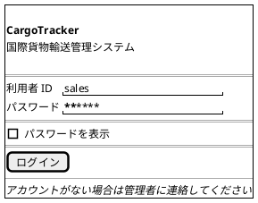

#### 仕様

- 認証は Rails 8 標準の `SessionsController` + `has_secure_password` で実装し、ログイン画面をカスタマイズ
- ログイン失敗時: 「利用者 ID またはパスワードが正しくありません」を赤色で表示（`422 Unprocessable Entity` でフォームを再描画）
- ログイン成功後: ロールに応じてダッシュボードへリダイレクト
- セッションタイムアウト後は自動的に `/login?timeout=true` へリダイレクト

---

### ダッシュボード (/)

#### ワイヤーフレーム

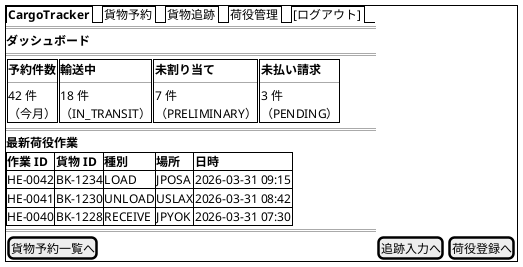

#### 仕様

- サマリーカード: 今月の予約件数・輸送中件数・未割り当て件数・未払い請求件数
- 最新荷役作業: 直近 10 件を降順表示。partial `dashboard/_recent_handling_events.html.erb` で描画
- ロール制御: billing ロールのみ「未払い請求」カードを表示
- Hotwire: サマリーカード部分を `turbo_frame_tag "dashboard_summary", src: dashboard_summary_path` で遅延読み込み（初期表示を高速化）

---

### 貨物予約一覧 (/bookings)

#### ワイヤーフレーム

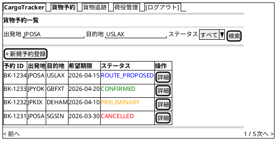

#### 仕様

- **検索フィルタ**: 出発地・目的地（港コード）・BookingStatus でフィルタリング
- **ステータスバッジ**: BookingStatus に応じた色分け（Bootstrap `badge`）。ヘルパー `booking_status_badge` で共通化
- **ページネーション**: 1 ページ 20 件（kaminari / pagy）
- **新規登録**: sales ロールのみ表示
- **Hotwire**: 検索フォーム（`form_with method: :get`）と結果テーブルを `turbo_frame_tag "booking_list"` で囲み、検索時はフレーム内のみ部分更新。`data: { turbo_action: "advance" }` で検索条件を URL・ブラウザ履歴に反映

---

### 貨物予約登録 (/bookings/new)

#### ワイヤーフレーム

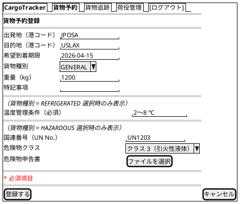

#### 仕様

- **入力項目**: 出発地・目的地（UNLOCODE 形式 5 文字）・希望到着期限・貨物種別・重量
- **バリデーション**: サーバー側は Active Model バリデーション（`validates` + カスタムバリデータ）。エラー時はコントローラが `render :new, status: :unprocessable_entity` を返し、Turbo がフォーム部分を再描画
- **貨物種別**: `GENERAL`, `HAZARDOUS`, `REFRIGERATED` の 3 値から選択（enum）
- **条件付き入力欄（Stimulus による条件表示）**: 貨物種別 = `REFRIGERATED` 選択時は温度管理条件（必須）を、`HAZARDOUS` 選択時は危険物申告フォーム（国連番号・危険物クラス・申告書添付）を表示する（US01, US05）。見積作成フォーム（`/estimates/new`）でも同一の条件付き入力欄を適用する
- **登録成功**: PRG パターンで `redirect_to booking_path(@booking), status: :see_other`
- **エラー時**: 同フォームを 422 で再描画し、エラーフィールドを `is-invalid` クラスで赤ボーダー強調

---

### 予約詳細 (/bookings/:id)

#### ワイヤーフレーム

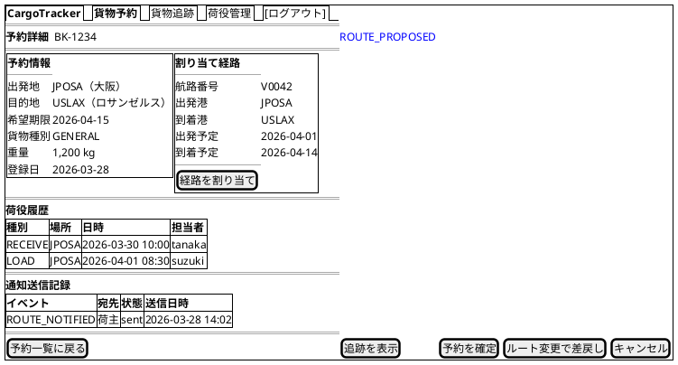

#### 仕様

- **ステータスバッジ**: ページタイトル横に BookingStatus を大きく表示
- **経路情報**: 未割り当ての場合は「経路が割り当てられていません」と表示し `[経路を割り当て]` を強調。経路カードは partial `bookings/_route.html.erb`
- **荷役履歴**: HandlingEvent を時系列降順で表示（partial `bookings/_handling_events.html.erb`）
- **[経路設計者に引き渡す]**: sales ロールかつ BookingStatus = PRELIMINARY の場合のみ表示（US06）。確認モーダル（Stimulus コントローラ）表示後に `button_to assign_routing_booking_path(@booking), method: :post`。成功時 PRG で同詳細画面へリダイレクトし、BookingStatus が ROUTE_REQUESTED（経路設計中）に遷移する
- **旅程表**: 割り当て済みの CargoItinerary を Leg（航海番号・積込港/荷降港・積込/荷降予定日時）の一覧として表示。到着予定日は最終 Leg の荷降時刻。partial `bookings/_itinerary.html.erb`
- **通知送信記録表**: 当該予約に対する `notifications` の送信記録（イベント種別・宛先・件名・状態・送信日時）を時系列降順で表示（US12/US13 の通知が登録されたことを確認できる）。partial `bookings/_notifications.html.erb`
- **[予約を確定]**: sales ロールかつ BookingStatus = ROUTE_PROPOSED の場合のみ表示（US13）。`button_to confirm_booking_path(@booking), method: :post`。成功時 PRG で同詳細画面へリダイレクトし CONFIRMED に遷移。あわせて `cargo_confirmed` イベントで経路設計者へ追跡番号発行依頼（TRACKING_REQUESTED）が通知される
- **[ルート変更で差戻し]**: sales ロールかつ BookingStatus = ROUTE_PROPOSED の場合のみ表示（US13）。確認ダイアログ後に `POST /bookings/:id/reroute`。成功時 ROUTE_REQUESTED に戻り、割り当て済みの旅程は破棄される
- **[キャンセル]**: sales ロールのみ表示。確認ダイアログ（`data: { turbo_confirm: "キャンセルしますか？" }`）後に `POST /bookings/:id/cancel`。キャンセル時は `cargo_cancelled` イベントで荷主へキャンセル確認（BOOKING_CANCELLED）が通知される
- **荷主通知（US12）**: 経路紐付け（`PATCH route`）成功時に `cargo_routed` イベントが発火し、荷主へ確定経路が自動通知（ROUTE_NOTIFIED）される。専用の通知ボタンは設けず、通知送信記録表で送信結果を確認する
- **[追跡を表示]**: `tracking_number` が発行済みの場合のみ表示

---

### 経路割り当て (/bookings/:booking_id/route/edit)

#### ワイヤーフレーム

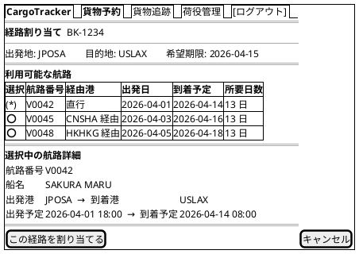

#### 仕様

- **航路候補（US09）**: 出発地・目的地・希望期限を条件に絞り込み済みの候補（航海番号・経由港・出発日・到着予定・所要日数・費用・運送会社）を表示。ラジオで 1 件選択する
- **ラジオ選択**: 航路を選択すると Turbo Frame `voyage_detail` に `GET /voyages/:id` の部分 HTML を読み込み、下部の「選択中の航路詳細」を部分更新（Stimulus コントローラで `change` イベントを検知してフレームの `src` を切り替え）
- **希望期限超過**: 到着予定が希望期限を超える航路は `⚠` アイコン付きで警告
- **条件調整・再算出（US10）**: 画面上部に条件調整フォーム（期限延長の新しい到着期限・出発希望日）を設け、`GET /bookings/:booking_id/route/edit?arrival_deadline=...&departure_after=...` で再算出する。調整後の条件で候補を再表示し、満たす候補がない場合は「条件を満たす経路がありません。荷主と条件協議してください」を表示する
- **割り当て成功（US09/US11）**: 候補選択→ `PATCH /bookings/:booking_id/route` の後、選択候補から CargoItinerary を生成して `assign_itinerary` で紐付け、PRG パターンで `redirect_to booking_path(@booking), status: :see_other`。BookingStatus は ROUTE_PROPOSED に遷移する

---

### 貨物追跡入力 (/tracking)

#### ワイヤーフレーム

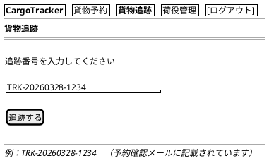

#### 仕様

- **入力フィールド**: 追跡番号（`TRK-YYYYMMDD-NNNN` 形式）
- **バリデーション**: フォーマット不正の場合はインラインエラー表示（422 でフォーム再描画）
- **未発見**: 404 の場合は「該当する貨物が見つかりません」メッセージ
- **認証不要**: 荷主・荷受人（未認証の外部利用者）は認証なしでもアクセス可（`skip_before_action :require_login`）

---

### 追跡詳細 (/tracking/:tracking_number)

#### ワイヤーフレーム

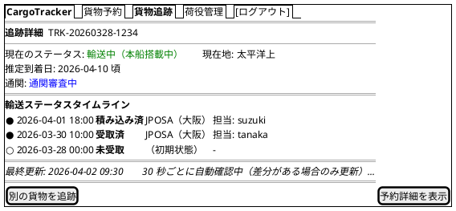

#### 仕様

- **自動更新**: タイムライン部分を `turbo_frame_tag "status_timeline", src: status_tracking_path(@tracking)` とし、Stimulus コントローラ（`polling_controller`）が 30 秒ごとに `frame.reload()` を呼ぶ。サーバーは ETag を返し、差分がない場合は 304 Not Modified で DOM を更新しない（差分がある場合のみ更新・aria-live 通知）。リアルタイム性を高める場合は `turbo_stream_from @tracking` による Turbo Streams（Action Cable）配信への置き換えも可能
- **タイムライン**: TrackingStatus の変化を時系列で表示。最新状態を最上部に。表示は日本語ラベル（「画面ラベル定義」参照）
- **TrackingStatus の遷移**: `NOT_RECEIVED → RECEIVED → LOADED → ONBOARD_CARRIER → UNLOADED → CUSTOMS_INSPECTION → AWAITING_CLAIM → CLAIMED`（異常時は任意の状態から `EXCEPTION`）
- **推定到着日**: `YYYY-MM-DD 頃` の形式で表示。未確定の場合は「未確定」と表示
- **CustomsStatus**: `PENDING`（審査中）/ `CLEARED`（通関済）/ `HELD`（留置中）/ `REJECTED`（不可） をバッジで表示
- **EXCEPTION**: 異常発生時は赤色バッジで表示し、内容を詳細表示
- **[予約詳細を表示]**: sales ロールのみ表示

---

### 荷役作業登録 (/handling_events/new)

#### ワイヤーフレーム

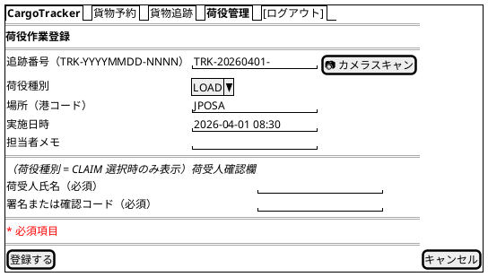

#### 仕様

- **荷役種別**: `RECEIVE`, `LOAD`, `UNLOAD`, `CUSTOMS`, `CLAIM` から選択（enum）
- **荷受人確認欄（US16）**: 荷役種別 = `CLAIM` 選択時のみ、荷受人氏名と署名または確認コードの入力欄を表示する（Stimulus コントローラで `change` イベントを検知して条件表示）。CLAIM 登録時は両項目とも必須
- **追跡番号**: `TRK-YYYYMMDD-NNNN` 形式。`[📷 カメラスキャン]` ボタンは Stimulus コントローラでバーコード・QR スキャン入力に対応
- **実施日時**: 未来日時は警告表示（投機的な登録は許可）
- **登録成功**: PRG パターンで `redirect_to handling_events_path, status: :see_other`

---

### 荷役作業一覧 (/handling_events)

#### ワイヤーフレーム

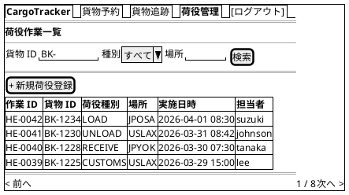

#### 仕様

- **検索フィルタ**: 貨物 ID・荷役種別・場所（港コード）でフィルタリング
- **Hotwire**: 検索フォームと結果テーブルを `turbo_frame_tag "handling_event_list"` で囲み、検索時はフレーム内のみ部分更新（`data: { turbo_action: "advance" }` で URL 反映）
- **新規登録**: handler ロールのみ表示
- **ページネーション**: 1 ページ 20 件

---

### 航路一覧 (/voyages)

#### ワイヤーフレーム

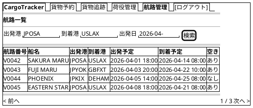

#### 仕様

- **検索フィルタ**: 出発港・到着港・出発日でフィルタリング
- **空き状況**: 積載容量に余裕があるかを「あり / なし」で表示
- **閲覧専用**: sales ロール（MVP で経路設計者を代替）は読み取りのみ。航路の追加・変更は管理機能から
- **経路割り当てへの連携**: 経路割り当て画面が本データを参照して候補を生成（`voyages#show` が Turbo Frame 用の部分 HTML を返す）

---

### 請求書一覧 (/billing/invoices)

#### ワイヤーフレーム


#### 仕様

- **フィルタ**: PaymentStatus（`PENDING`, `CONFIRMED`, `OVERDUE`）・発行日でフィルタリング
- **ステータスバッジ**: `PENDING` は赤、`CONFIRMED` は緑、`OVERDUE` は濃い赤で表示
- **支払期限超過**: 期限超過かつ未払いの場合は行を赤色ハイライト
- **アクセス制御**: billing ロールのみアクセス可能（`before_action :require_billing_role`）

---

### 請求書詳細 (/billing/invoices/:id)

#### ワイヤーフレーム

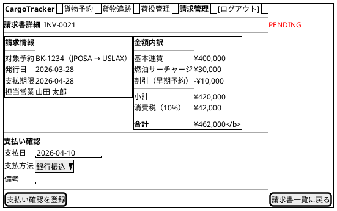

#### 仕様

- **金額内訳**: 基本運賃・サーチャージ・割引・消費税を明細表示（partial `billing/invoices/_amount_breakdown.html.erb`）
- **[支払い確認を登録]**: `POST /billing/invoices/:id/confirm` を送信。PRG パターンで同画面へリダイレクト（303）
- **確認済み**: PaymentStatus が `CONFIRMED` の場合は支払いフォームを非表示にし、確認日時を表示
- **PDF 出力**: `GET /billing/invoices/:id.pdf` で請求書 PDF をダウンロード（`respond_to` で format 分岐、将来実装）

---

### 割引ポリシー一覧 (/admin/discount_policies)

#### ワイヤーフレーム

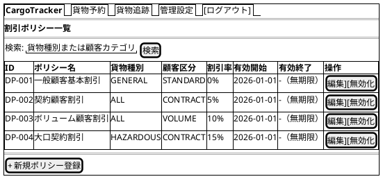

#### 仕様

- **一覧**: 有効期間・有効 / 無効ステータスでフィルタリング可能
- **[編集]**: `edit_admin_discount_policy_path(policy)` に遷移
- **[無効化]**: `button_to disable_admin_discount_policy_path(policy), method: :post` で論理削除（PRG パターン）。`data: { turbo_confirm: "無効化しますか？" }` で確認
- **[+ 新規ポリシー登録]**: `new_admin_discount_policy_path` に遷移
- **アクセス制御**: admin ロールのみアクセス可能。他ロールは 403 画面を表示

---

### 割引ポリシー登録 (/admin/discount_policies/new)

#### ワイヤーフレーム

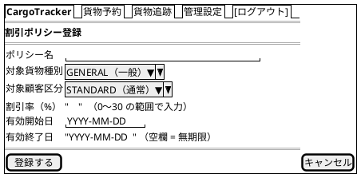

#### 仕様

- **バリデーション**: 割引率は 0〜30% の範囲（ドメインの DiscountRate に整合、`numericality`）、有効開始日 ≤ 有効終了日（カスタムバリデータ）
- **割増の扱い**: 危険物割増などの割増（Surcharge）は割引ポリシーとは別概念として管理します（負の割引率では表現しません）。割増の管理画面は料金計算機能の実装イテレーションで追加します
- **重複チェック**: 同一の「貨物種別 × 顧客区分 × 期間」のポリシーが既に存在する場合はエラー表示（モデルレベルのカスタムバリデーション + DB ユニーク制約）
- **[登録する]**: `POST /admin/discount_policies` に送信。成功時は PRG パターンで一覧にリダイレクト、エラー時は 422 でフォーム再描画
- **[キャンセル]**: `admin_discount_policies_path` に戻る

---

### 公開貨物追跡 (/public/tracking/:tracking_id)

#### ワイヤーフレーム

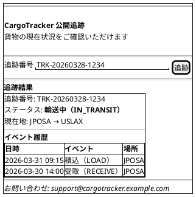

#### 仕様

- **認証**: 不要（`Public::TrackingsController` で `skip_before_action :require_login`）。専用レイアウト `layouts/public.html.erb` を使用
- **追跡番号フォーム**: `GET /public/tracking/:tracking_id` でページ表示。結果は同一ページ内に表示
- **404 処理**: 存在しない追跡番号は「該当する貨物が見つかりません。追跡番号を確認の上、再度お試しください」を表示
- **連絡先**: フッターに問い合わせメールアドレスを表示（荷主への導線確保）
- **レスポンシブ**: モバイルファースト（スマートフォンで QR コードから直接アクセスを想定）
- **表示情報の制限**: TransportStatus・最終イベント・現在地のみ（荷主名・住所等の個人情報は非表示）
- **非同期反映タイムラグ**: ステータス反映に最大 30 秒かかる旨を画面下部に注記する

---

### Hotwire 部分更新パターン

#### 追跡ステータス自動更新（Turbo Frame + Stimulus ポーリング）

追跡詳細画面では、荷物の状態をユーザーがリロードせずに確認できるよう、30 秒ごとに自動更新します。

```erb
<%# app/views/trackings/show.html.erb（タイムライン部分） %>
<div data-controller="polling" data-polling-interval-value="30000">
  <%= turbo_frame_tag "status_timeline",
        src: status_tracking_path(@tracking.tracking_number) do %>
    <%= render "timeline", events: @tracking.events %>
  <% end %>
</div>
<p id="last-updated">最終更新: <%= l(@tracking.updated_at, format: :short) %></p>
```

```javascript
// app/javascript/controllers/polling_controller.js
import { Controller } from "@hotwired/stimulus"

export default class extends Controller {
  static values = { interval: Number }

  connect() {
    this.timer = setInterval(() => {
      this.element.querySelector("turbo-frame")?.reload()
    }, this.intervalValue)
  }

  disconnect() {
    clearInterval(this.timer)
  }
}
```

**サーバー側レスポンス**: `trackings#status` は `turbo_frame_tag "status_timeline"` を含む部分 HTML を返します（レイアウトなし、`Content-Type: text/html`）。よりリアルタイムな配信が必要になった場合は、`turbo_stream_from @tracking` + モデルの `broadcasts_to` による Turbo Streams（Action Cable）配信へ段階的に移行できます。

#### 検索フォームの部分更新（Turbo Frame）

貨物予約一覧・荷役作業一覧の検索フォームは、ページ全体を再読み込みせずに結果テーブルのみを更新します。

```erb
<%= turbo_frame_tag "booking_list", data: { turbo_action: "advance" } do %>
  <%= form_with url: bookings_path, method: :get do |f| %>
    <%= f.text_field :origin, placeholder: "出発地" %>
    <%= f.text_field :destination, placeholder: "目的地" %>
    <%= f.select :status, booking_status_options, include_blank: "すべて" %>
    <%= f.submit "検索" %>
  <% end %>

  <%= render "list", bookings: @bookings %>
<% end %>
```

`data: { turbo_action: "advance" }` により、検索条件が URL に反映されブラウザ履歴に残ります。

#### 経路候補の動的読み込み（Turbo Frame + Stimulus）

経路割り当て画面でラジオボタンを選択すると、選択した航路の詳細を動的に読み込みます。

```erb
<%# ラジオボタン: Stimulus がフレームの src を切り替える %>
<input type="radio" name="voyage_number" value="V0042"
       data-action="change->voyage-detail#load"
       data-voyage-detail-url-param="<%= voyage_path('V0042') %>">

<%= turbo_frame_tag "voyage_detail" %>
```

```javascript
// app/javascript/controllers/voyage_detail_controller.js
import { Controller } from "@hotwired/stimulus"

export default class extends Controller {
  load({ params }) {
    document.getElementById("voyage_detail").src = params.url
  }
}
```

#### フォームバリデーション（Active Model エラー + Turbo 422 部分更新）

フォーム送信は Turbo が横取りし、バリデーションエラー時はコントローラが `422 Unprocessable Entity` でフォームを再描画します。ページ全体の遷移なしにエラー表示が更新されます。

```ruby
# app/controllers/bookings_controller.rb
def create
  @booking = Booking.new(booking_params)
  if @booking.save
    redirect_to booking_path(@booking),
                notice: "貨物予約 #{@booking.booking_id} を登録しました",
                status: :see_other
  else
    render :new, status: :unprocessable_entity
  end
end
```

即時のフィールド単位チェックが必要な場合は、Stimulus コントローラで `blur` イベントを検知し、検証用エンドポイントへ `fetch` する方式を追加できます。

---

### エラーハンドリング

#### バリデーションエラー表示

- **フィールドレベル**: 各入力フィールドの下に赤字でメッセージ表示（Bootstrap `invalid-feedback`）
- **フォームレベル**: フォーム上部にアラートバナー（`alert-danger`）で `@booking.errors.full_messages` をまとめて表示
- **ERB**: `object.errors[:field]` を参照してサーバーバリデーションエラーを表示。フォームは partial `_form.html.erb` に共通化し、new / エラー再描画で再利用する

```erb
<div class="mb-3">
  <%= f.label :origin, class: "form-label" do %>
    出発地 <span class="text-danger">*</span>
  <% end %>
  <%= f.text_field :origin,
        class: class_names("form-control",
                           "is-invalid": @booking.errors.include?(:origin)) %>
  <div class="invalid-feedback">
    <%= @booking.errors.full_messages_for(:origin).first %>
  </div>
</div>
```

#### フラッシュメッセージ

PRG パターンのリダイレクト後に、操作結果を `flash[:notice]` / `flash[:alert]` でフィードバックします。

| 操作 | メッセージ例 | Bootstrap クラス |
| :--- | :--- | :--- |
| 予約登録成功 | 「貨物予約 BK-1234 を登録しました」 | `alert-success` |
| 経路割り当て成功 | 「経路 V0042 を割り当てました」 | `alert-success` |
| 荷役登録成功 | 「荷役作業 HE-0042 を登録しました」 | `alert-success` |
| 支払い確認成功 | 「請求書 INV-0021 の支払いを確認しました」 | `alert-success` |
| バリデーションエラー | 「入力内容に誤りがあります。確認してください」 | `alert-danger` |
| システムエラー | 「処理中にエラーが発生しました。時間をおいて再試行してください」 | `alert-danger` |

フラッシュメッセージは共通 partial `app/views/shared/_flash.html.erb` で一元管理し、layout から `<%= render "shared/flash" %>` で描画します。

#### エラーページ

| HTTP ステータス | 画面 | 内容 |
| :--- | :--- | :--- |
| 400 Bad Request | `public/400.html` | 不正なリクエスト。入力を確認してください |
| 403 Forbidden | `public/403.html` | アクセス権限がありません |
| 404 Not Found | `public/404.html` | 指定されたページまたはリソースが見つかりません |
| 500 Internal Server Error | `public/500.html` | サーバーエラーが発生しました。管理者に連絡してください |

ナビゲーション付きのエラー画面が必要な場合は `config.exceptions_app = routes` で `ErrorsController` にルーティングし、レイアウト付き ERB で描画します。各エラーページはダッシュボードへ戻るリンクを提供します。

#### Turbo エラーハンドリング

Turbo Frame / Stream のリクエストがエラーを返した場合は、`turbo:frame-missing` や `turbo:fetch-request-error` イベントをキャッチして通知を表示します。

```javascript
// app/javascript/application.js
document.addEventListener("turbo:frame-missing", (event) => {
  event.preventDefault()
  showToast("対象データが見つかりませんでした")
})

document.addEventListener("turbo:fetch-request-error", () => {
  showToast("通信エラーが発生しました。再試行してください")
})
```

---

### アクセシビリティ

#### キーボードナビゲーション

- **Tab 順序**: フォーム項目 → 送信ボタン → ナビゲーションの順に自然な Tab 移動
- **Enter キー**: フォーム内でのフォーカス状態で Enter キーを押すと送信
- **Escape キー**: モーダル・確認ダイアログを閉じる
- **スキップリンク**: `<a href="#main-content" class="visually-hidden-focusable">コンテンツにスキップ</a>` をヘッダー先頭に配置

#### ARIA 対応

| 要素 | ARIA 属性 |
| :--- | :--- |
| ナビゲーションバー | `role="navigation" aria-label="メインナビゲーション"` |
| 検索フォーム | `role="search" aria-label="貨物検索"` |
| データテーブル | `role="grid" aria-label="[テーブル名]"` |
| ステータスバッジ | `aria-label="ステータス: ROUTE_PROPOSED"` |
| ローディングインジケーター | `aria-live="polite" aria-busy="true"` |
| エラーメッセージ | `role="alert" aria-live="assertive"` |
| フラッシュメッセージ | `role="status" aria-live="polite"` |

#### Turbo と ARIA

Turbo Frame の部分更新後に動的コンテンツが更新されることをスクリーンリーダーに通知します。Turbo Frame は更新中に自動で `aria-busy="true"` を付与するため、これと `aria-live` を組み合わせます。

```erb
<%# 自動更新エリアは aria-live="polite" で通知 %>
<%= turbo_frame_tag "status_timeline",
      src: status_tracking_path(@tracking.tracking_number),
      "aria-live": "polite",
      "aria-atomic": "false" %>
```

#### カラーコントラスト

- 通常テキスト: コントラスト比 4.5:1 以上（WCAG AA 準拠）
- 大きいテキスト（18px 以上）: 3:1 以上
- ステータスバッジは色のみに依存せず、テキストラベルを必ず併記

---

## 画面ラベル定義（ステータス表示の統一）

画面に表示するステータスは日本語ラベル 1 系統に統一します。ユーザーには BookingStatus 系の見出し語を主として提示し、輸送フェーズの詳細（TrackingStatus）や通関状況（CustomsStatus）は「見出し語（補足）」の入れ子で表示します（例: 「輸送中（通関審査中）」）。内部の列挙値をそのまま画面に出すことは禁止します。

### BookingStatus バッジ定義

| ステータス | 表示ラベル | Bootstrap クラス | 意味 |
| :--- | :--- | :--- | :--- |
| `PRELIMINARY` | 仮受付 | `badge bg-warning text-dark` | 経路未割り当て |
| `ROUTE_REQUESTED` | 経路設計中 | `badge bg-info text-dark` | 経路設計者へ引き渡し済み・経路未提案 |
| `ROUTE_PROPOSED` | 経路提案済 | `badge bg-primary` | 経路割り当て完了・未確認 |
| `CONFIRMED` | 確認済 | `badge bg-success` | 予約確定 |
| `TRACKING_ISSUED` | 追跡番号発行済 | `badge bg-info text-dark` | 追跡番号付与 |
| `IN_TRANSIT` | 輸送中 | `badge bg-primary` | 積み込み済・輸送中 |
| `DELIVERED` | 配送完了 | `badge bg-success` | 配達完了 |
| `SETTLED` | 精算完了 | `badge bg-secondary` | 請求・支払い完了 |
| `CANCELLED` | キャンセル | `badge bg-danger` | キャンセル済 |

### TrackingStatus 補足ラベル定義

追跡詳細・公開追跡のタイムラインでは、見出し語（BookingStatus のラベル）に以下の補足を組み合わせて表示します。

| ステータス | 表示ラベル（補足） | Bootstrap クラス |
| :--- | :--- | :--- |
| `NOT_RECEIVED` | 未受取 | `badge bg-secondary` |
| `RECEIVED` | 受取済 | `badge bg-info text-dark` |
| `LOADED` | 積み込み済 | `badge bg-primary` |
| `ONBOARD_CARRIER` | 搭載中 | `badge bg-primary` |
| `UNLOADED` | 荷降ろし済 | `badge bg-warning text-dark` |
| `CUSTOMS_INSPECTION` | 通関審査中 | `badge bg-warning text-dark` |
| `AWAITING_CLAIM` | 引取待ち | `badge bg-warning text-dark` |
| `CLAIMED` | 引取完了 | `badge bg-success` |
| `EXCEPTION` | 例外 | `badge bg-danger` |

## 一覧・検索画面の空状態（Empty State）

すべての一覧・検索画面（予約・荷役・航路・請求書・見積・例外）で、検索結果が 0 件の場合は共通 partial（`shared/_empty_state.html.erb`）を表示します。

- メッセージ: 「条件に一致する〇〇はありません。検索条件を変えてお試しください。」
- 主要 CTA: 画面の主目的に応じたボタン（例: 予約一覧では [新規予約登録]、見積一覧では [新規見積作成]）を併記します
- 初回利用（データ自体が 0 件）の場合は検索条件の言及を省き、CTA のみを強調します

## MVP スコープと段階リリース

経路設計者向けの中核業務画面（US07 航海検索・US08 経路候補算出・US09 経路選択確定・US10 条件調整・US14 追跡番号発行・US24/US25 航海スケジュール登録更新）は、初期リリース（MVP）では専用画面を提供せず、営業担当者の経路割り当て画面（`/bookings/:booking_id/route/edit`）で代替します。経路設計者向けの専用画面（経路設計キュー・候補算出・スケジュール管理）は後続イテレーションで追加します。イテレーションへの割り当てはリリース計画（`docs/development/`）で管理します。
