# UI 設計 - 国際貨物輸送管理システム

## 概要

本ドキュメントでは、国際貨物輸送管理システム（Scala 版）の UI 設計を定義する。

### 設計方針

**OOUX（オブジェクト指向 UI 設計）** をベースに、ユーザーが操作する「オブジェクト」（貨物予約・追跡・荷役・航路・請求書・見積）を中心に画面を構成する。各画面はオブジェクトの状態を可視化し、アクターに応じた操作を提供する。

### 技術スタック

| 技術 | 役割 |
| :--- | :--- |
| Play Framework 3.x + Twirl | SSR（サーバーサイドレンダリング）でフル HTML を生成。テンプレートはコンパイル時に型検査される |
| htmx 2.x | フォームバリデーション・ステータス自動更新など部分的な動的更新 |
| Bootstrap 5 | レスポンシブグリッド・コンポーネント |
| Play Form | サーバーサイドの形式バリデーション（ドメイン層の業務ルール検証と二段構え） |
| PRG パターン | フォーム送信後は必ず Redirect-Get + Flash で二重送信を防止 |

### 基本 UX 原則

- **オブジェクト中心**: 一覧 → 詳細 → アクションの自然な流れ
- **状態の可視化**: BookingStatus・TransportStatus をバッジで常時表示
- **フィードバック**: 操作成功・失敗はフラッシュメッセージで通知
- **アクセシビリティ**: ARIA ラベル・キーボードナビゲーション対応

---

## UI オブジェクト定義

OOUX に基づき、システム内の主要オブジェクトとそのアクション・属性を定義する。

### 主要オブジェクト

| オブジェクト | 主な属性 | ユーザーアクション | 関連オブジェクト |
| :--- | :--- | :--- | :--- |
| **貨物予約（Booking）** | bookingId, 出発地, 目的地, 希望期限, 貨物種別, 重量, BookingStatus | 新規登録・詳細確認・経路設計依頼・予約確定・キャンセル | 追跡情報, 航路, 荷役履歴, 見積 |
| **追跡情報（Tracking）** | trackingNumber, TransportStatus, 現在地, ステータス履歴, 例外履歴 | 追跡番号検索・履歴確認・状態更新・例外登録（管理者） | 貨物予約 |
| **荷役作業（HandlingActivity）** | 作業 ID, 貨物 ID, 荷役種別, 場所, 実施日時, 担当者 | 新規登録・一覧確認 | 貨物予約 |
| **航路（Voyage）** | voyageNumber, 船名, 出発港, 到着港, 出発予定日, 到着予定日, 対応貨物種別 | 一覧確認・新規登録・更新・経路割り当てへの提供 | 貨物予約 |
| **請求書（Invoice）** | invoiceId, 貨物予約, 金額, 割引, 消費税, PaymentStatus | 一覧確認・詳細確認・支払い確認 | 貨物予約 |
| **見積（Estimate)** | estimateId, 出発地, 目的地, 期限, 貨物種別, 重量, ルート候補 | 新規作成・詳細確認 | 貨物予約 |

### オブジェクト間の関係

```text
Booking 1 ─── 1 Tracking
Booking 1 ─── N HandlingActivity
Booking N ─── M Voyage（経路割り当てを通じて）
Booking 1 ─── 1 Invoice
Estimate 1 ─── N RouteCandidate（見積→予約への引き継ぎは将来対応）
```

---

## 画面一覧

対応 US は本リポジトリの [ユーザーストーリー](../requirements/user_story.md)（US01〜US25）に対応付ける。

| 画面名 | URL パス | 説明 | 主要アクター | 対応 US |
| :--- | :--- | :--- | :--- | :--- |
| ログイン | `/login` | 認証フォーム | 全ロール | - |
| ダッシュボード | `/` | 全体サマリー・最新荷役情報 | 全ロール | - |
| 見積一覧 | `/estimates` | 見積の一覧・検索 | 営業担当者 | US01 |
| 見積作成 | `/estimates/new` | 新規見積フォーム（出発地・目的地・期限・貨物仕様入力） | 営業担当者 | US01 |
| 見積詳細 | `/estimates/:estimateId` | 見積詳細・ルート候補一覧 | 営業担当者 | US01 |
| 荷主一覧・登録 | `/shippers`, `/shippers/new` | 荷主の一覧・新規登録（個人/法人） | 営業担当者 | US02, US03 |
| 貨物予約一覧 | `/bookings` | 予約済み貨物の一覧・検索 | 荷主、営業担当者 | US04, US06 |
| 貨物予約登録 | `/bookings/new` | 新規予約フォーム | 営業担当者 | US04, US05 |
| 予約詳細 | `/bookings/:bookingId` | 予約情報・経路・荷役履歴・確定/引き渡し操作 | 荷主、営業担当者 | US06, US12, US13, US14 |
| 経路割り当て | `/bookings/:bookingId/routes` | 航海検索・経路候補から経路を選択・確定 | 経路設計者、営業担当者 | US07, US08, US09, US10, US11 |
| 貨物追跡入力 | `/tracking` | 追跡番号入力フォーム | 荷主、荷受人、追跡管理者 | US18 |
| 追跡詳細 | `/tracking/:trackingNumber` | 輸送ステータス履歴タイムライン・状態更新・例外登録（管理者） | 荷主、荷受人、追跡管理者 | US17, US18, US19, US20 |
| 荷役作業登録 | `/handling/new` | 荷役イベント登録フォーム（引取時は荷受人確認） | 荷役作業員 | US15, US16 |
| 荷役作業一覧 | `/handling` | 荷役履歴一覧・検索 | 荷役作業員、追跡管理者 | US15 |
| 航路一覧 | `/voyages` | 航路・スケジュール一覧・検索（マスタ管理の起点） | 経路設計者 | US24, US25 |
| 航海スケジュール登録 | `/voyages/new` | 航海スケジュール新規登録フォーム | 経路設計者 | US24 |
| 航海スケジュール更新 | `/voyages/:voyageNumber/edit` | 既存スケジュールの差分確認・上書き更新 | 経路設計者 | US25 |
| 請求書一覧 | `/billing/invoices` | 請求書の一覧・ステータス管理・一括入金確認・CSV 出力 | 経理担当者 | US23 |
| 新規請求書発行 | `/billing/invoices/new` | 引取済予約の選択・輸送実績表示・料金自動算出 | 経理担当者 | US21, US22 |
| 請求書詳細 | `/billing/invoices/:invoiceId` | 請求書詳細・割引内訳・支払い確認・PDF 出力 | 経理担当者 | US22, US23 |
| 割引ポリシー管理 | `/admin/discount-policies`（一覧・登録・編集） | 割引ポリシーの管理 | Admin | US22（関連・将来） |
| 公開貨物追跡 | `/public/tracking/:trackingNumber` | 認証不要の貨物状態照会ページ（荷主が URL 共有可） | 荷主・荷受人（未認証） | US18 |

---

## 共通レイアウト設計

### ロール定義

UI の表示制御は [バックエンドアーキテクチャ](architecture_backend.md) の `enum Role` を拡張した以下のロールで行う。

| ロール | 対象ユーザー | 備考 |
| :--- | :--- | :--- |
| `Shipper` | 荷主 | 予約照会・追跡照会 |
| `Sales` | 営業担当者 | 見積・荷主登録・予約登録・確定・通知 |
| `RouteDesigner` | 経路設計者 | 航海スケジュール管理・経路選択・確定・追跡番号発行 |
| `Handler` | 荷役作業員 | 荷役作業登録 |
| `Tracker` | 追跡管理者 | 追跡情報管理・状態更新・例外対応 |
| `Accountant` | 経理担当者 | 料金算出・精算管理 |
| `Admin` | システム管理者 | 全機能・割引ポリシー管理 |

> **荷受人について**: 荷受人専用ロールは設けない。荷受人は認証不要の公開貨物追跡（`/public/tracking/:trackingNumber`）で
> 追跡情報を照会する（US18 の「ログインなしでも追跡番号があれば照会できる」に対応）。
>
> **注記**: `RouteDesigner` は経路設計者のユースケース（US07〜US11・US14・US24・US25）に対応するために本設計で追加した。
> バックエンドアーキテクチャのロール表・データモデルの `user_roles` にも反映済み。

### ナビゲーション構成

全画面共通のナビゲーションバー（Bootstrap 5 `navbar`）を上部に配置する。ロールに応じてメニュー項目を表示制御する。

| メニュー項目 | 遷移先 | 表示ロール |
| :--- | :--- | :--- |
| ダッシュボード | `/` | 全ロール |
| 見積管理 | `/estimates` | Sales |
| 荷主管理 | `/shippers` | Sales |
| 貨物予約 | `/bookings` | Sales, Shipper |
| 貨物追跡 | `/tracking` | Shipper, Tracker |
| 荷役管理 | `/handling` | Handler, Tracker |
| 航路管理 | `/voyages` | RouteDesigner |
| 請求管理 | `/billing/invoices` | Accountant |
| 管理設定 | `/admin/discount-policies` | Admin |
| ログアウト | `/logout` | 全ロール |

ロール別表示は Twirl テンプレート内で認証済みユーザー情報（`AuthenticatedRequest`）のロールを参照して制御する。

```html
@* layout/nav.scala.html - ロール別メニュー表示 *@
@(user: AuthenticatedUser)
@if(user.hasRole(Role.Sales)) {
  <li class="nav-item"><a class="nav-link" href="@routes.EstimateWebController.index()">見積管理</a></li>
}
```

### 共通レイアウト ワイヤーフレーム

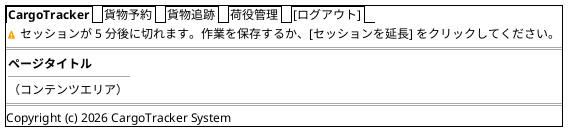

#### セッションタイムアウト警告（共通動作）

- セッション残り 5 分でナビゲーション直下に警告バナーを表示する（`role="alert"`。全認証済み画面共通）
- [セッションを延長] は `/keep-alive` を呼び出してタイムアウトをリセットする
- htmx の自動ポーリング（追跡詳細の 30 秒更新等）は**セッションを延長しない**（keep-alive と見なさない）。画面を放置すればタイムアウトは通常どおり進行する（[非機能要件定義](non_functional.md) 4.1 の設計判断）
- 入力フォーム画面でタイムアウトした場合の入力値退避は Phase 2（荷役作業登録のみ初期リリースで対応。荷役作業登録の仕様を参照）

### Bootstrap 5 グリッド運用ルール

- コンテナ: `container-fluid` で横幅を最大活用
- 一覧画面: テーブル幅 `col-12`
- フォーム画面: 入力欄 `col-md-8 offset-md-2`（中央寄せ）
- 詳細画面: 左カラム `col-md-8`、右サイドバー `col-md-4`
- ブレークポイント: モバイル（`< 768px`）では 1 カラム積み上げ。荷役作業登録はモバイルファースト（要件: モバイル対応の荷役作業記録）

---

## 画面遷移図

フロー全体の画面遷移を PlantUML ステートチャート図で表現する。

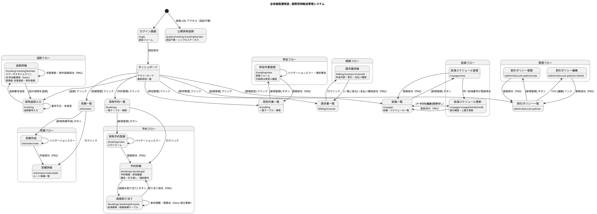

---

## 画面詳細設計

### ログイン画面 (/login)

#### ワイヤーフレーム

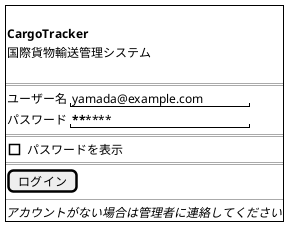

#### 仕様

- `AuthController`（Play）が `users` テーブルと bcrypt でパスワードを検証し、署名付き Session Cookie を発行する
- ログイン失敗時: 「ユーザー名またはパスワードが正しくありません」を赤色で表示（同画面再描画）
- ログイン成功後: ダッシュボードへリダイレクト（PRG）
- 未認証アクセスは `AuthenticatedAction` が `/login` へリダイレクトする

---

### ダッシュボード (/)

#### ワイヤーフレーム

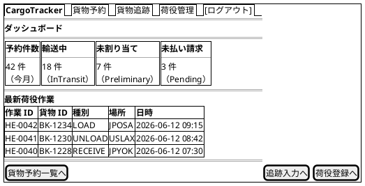

#### 仕様

- サマリーカード: 今月の予約件数・輸送中件数・未割り当て件数・未払い請求件数（CQRS クエリサービスの集計 DTO）
- 最新荷役作業: 直近 10 件を降順表示
- ロール制御: Accountant のみ「未払い請求」カードを表示
- htmx: サマリーカードを `hx-get="/dashboard/summary"` で部分取得（初期ロード後）

---

### 見積作成 (/estimates/new)

#### ワイヤーフレーム

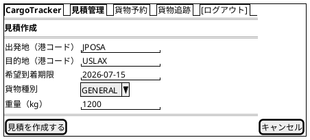

#### 仕様

- **入力項目**: 出発地・目的地（UN/LOCODE 形式 5 文字）・希望到着期限・貨物種別・重量
- **作成成功**: PRG で `/estimates/:estimateId` へリダイレクトし、ルート候補一覧（経由港・所要日数・概算料金・航海番号）を表示（US01）
- **期限内ルートなし**: 「指定期限に間に合うルートなし」をアラート表示
- **危険物選択時**: 見積は概算のため、危険物の入力は**種別の選択のみ**とする（料金係数の判定に必要な範囲）。UN 番号・正式輸送品名等の詳細申告は予約登録（US05）で入力する。htmx の動的表示も種別選択の補足説明に留める
- **予約への引き継ぎ**: 見積から予約への自動転記は将来対応。当面、予約登録時は見積内容を参照しながら手入力する運用となる（営業担当者の二度打ち負担は将来ストーリーの優先度判断材料とする）

---

### 貨物予約一覧 (/bookings)

#### ワイヤーフレーム

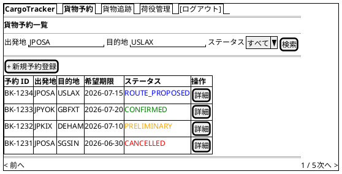

#### 仕様

- **検索フィルタ**: 出発地・目的地（港コード）・BookingStatus でフィルタリング
- **ステータスバッジ**: BookingStatus に応じた色分け（付録のバッジ定義参照）
- **ページネーション**: 1 ページ 20 件
- **新規登録**: Sales のみ表示
- **htmx**: 検索フォームに `hx-get="/bookings" hx-target="#booking-list" hx-push-url="true"` で部分更新
- **荷主ロール**: Shipper は自分の予約のみ表示される

---

### 貨物予約登録 (/bookings/new)

#### ワイヤーフレーム

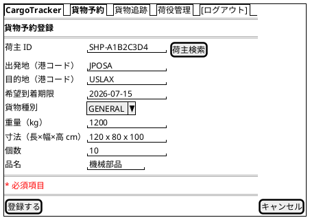

#### 仕様

- **入力項目**: 荷主 ID・出発地・目的地（UN/LOCODE 形式 5 文字）・希望到着期限・貨物種別・重量・寸法・個数・品名
- **貨物種別**: `GENERAL`（一般貨物）, `HAZARDOUS`（危険物）, `REFRIGERATED`（冷凍・冷蔵貨物）から選択（ドメインモデルの `CargoType` と一致）
- **条件付き必須フィールド**（US05）: 貨物種別の選択に応じて htmx で動的表示
  - `HAZARDOUS`: 危険物申告（危険物クラス・UN 番号・正式輸送品名）が必須になる
  - `REFRIGERATED`: 温度管理条件（最低温度・最高温度・単位）が必須になる
- **バリデーション**: クライアントサイド（HTML5）→ Play Form（形式）→ ドメイン層スマートコンストラクタ（業務ルール）の三段構え
- **登録成功**: PRG パターンで `/bookings/:bookingId` へリダイレクト。状態は `PRELIMINARY`（仮受付）
- **エラー時**: 同画面を再描画し、エラーフィールドを赤ボーダーで強調（`@helper.inputText` のエラー表示）

---

### 予約詳細 (/bookings/:bookingId)

#### ワイヤーフレーム

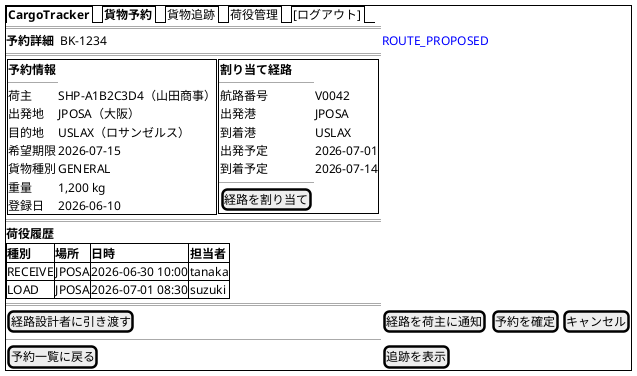

#### 仕様

- **ステータスバッジ**: ページタイトル横に BookingStatus を大きく表示
- **経路情報**: 未割り当ての場合は「経路が割り当てられていません」と表示し `[経路を割り当て]` を強調
- **荷役履歴**: HandlingActivity を時系列降順で表示
- 操作ボタンはロールと BookingStatus に応じて表示制御する:

| 操作 | 表示条件 | 処理 | 対応 US |
| :--- | :--- | :--- | :--- |
| [経路設計者に引き渡す] | Sales かつ `PRELIMINARY` | 確認モーダル後 `POST /bookings/:bookingId/assign-routing`。`ROUTE_PROPOSED` に遷移（PRG） | US06 |
| [経路を確定] | RouteDesigner / Sales かつ `ROUTE_PROPOSED` かつ経路候補表示中 | 経路候補画面で `POST /bookings/:bookingId/routes/:idx/confirm`。選択経路を予約に紐付け `ROUTE_ASSIGNED` に遷移（PRG） | US09 |
| [経路を荷主に通知] | Sales かつ経路紐付け済み（`ROUTE_ASSIGNED`） | `POST /bookings/:bookingId/notify-route`。通知送信記録を登録（PRG） | US12 |
| [予約を確定] | Sales かつ経路提案済み | 確認モーダル後 `POST /bookings/:bookingId/confirm`。`CONFIRMED` に遷移し追跡番号発行依頼を通知（PRG） | US13 |
| [追跡番号を発行] | RouteDesigner かつ `CONFIRMED` | `POST /bookings/:bookingId/issue-tracking`。`TRACKING_ISSUED` に遷移し荷主にメール通知（PRG） | US14 |
| [経路設計中へ戻す]（差し戻し） | Sales かつ `CONFIRMED`（輸送開始前） | 荷主のルート変更依頼時。確認モーダル後 `POST /bookings/:bookingId/revert-routing`。`ROUTE_PROPOSED` に戻し経路設計者に再設計を通知（PRG） | US13 |
| [キャンセル] | Sales かつ確定前 | 確認ダイアログ（`hx-confirm`）後 `POST /bookings/:bookingId/cancel` | US13 |
| [追跡を表示] | 追跡番号発行済み | `/tracking/:trackingNumber` へ遷移 | US18 |

---

### 経路割り当て (/bookings/:bookingId/routes)

#### ワイヤーフレーム

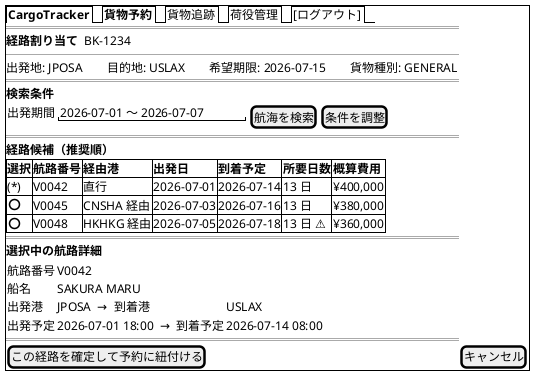

#### 仕様

- **航海検索**（US07）: 予約の出発地・目的地・期限・貨物種別を初期条件として航海を検索。危険物・冷凍貨物の場合は対応可能な航海のみに絞り込む。**本画面が US07 の主担当**であり、航路一覧（`/voyages`）はマスタ管理用の閲覧・検索（検索ロジックは共通のクエリサービスを利用し二重実装しない）
- **絞り込み理由の表示**: 貨物種別による絞り込みが行われた場合、「危険物対応航海のみ表示しています（N 件を除外）」のように除外理由・件数を候補テーブル上部に表示する。経路設計者が「候補が少ない」と戸惑わないための配慮（取扱可能港の制約による除外も同様）
- **経路候補算出**（US08）: 検索結果をもとに経路候補を推奨順に表示。直行便は最優先候補。各候補に所要日数・経由港・概算費用・航海番号を表示
- **期限内ルートなし**: 「期限内に到達可能な経路なし」をアラート表示し `[条件を調整]` を促す（US10）
- **条件調整**（US10）: 出発期間・期限等を調整して `[航海を検索]` で再算出（htmx で候補テーブルのみ部分更新）
- **ラジオ選択**: 航路を選択すると htmx `hx-get` で「選択中の航路詳細」を部分更新
- **希望期限超過**: 到着予定が希望期限を超える候補は `⚠` アイコン付きで警告
- **確定・紐付け**（US09, US11）: `[この経路を確定して予約に紐付ける]` で経路を確定し予約に紐付け。PRG で `/bookings/:bookingId` へリダイレクトし、予約状態が「経路提案中」になる
- **アクセス制御**: RouteDesigner（経路選択・確定）。Sales は参照のみ

---

### 貨物追跡入力 (/tracking)

#### ワイヤーフレーム


#### 仕様

- **入力フィールド**: 追跡番号（`TRK-YYYYMMDD-NNNN` 形式。ドメインの `TrackingNumber` スマートコンストラクタと同一の形式検証）
- **バリデーション**: フォーマット不正の場合はインラインエラー表示
- **未発見**: 「該当する貨物が見つかりません」メッセージ（US18）
- **未認証ユーザー**: 公開貨物追跡（`/public/tracking/:trackingNumber`）へ誘導

---

### 追跡詳細 (/tracking/:trackingNumber)

#### ワイヤーフレーム

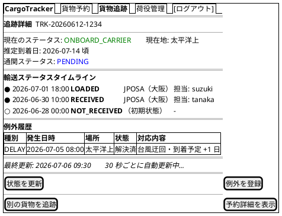

#### 仕様

- **自動更新**: htmx `hx-get="/tracking/:trackingNumber/status" hx-trigger="every 30s" hx-target="#status-timeline"` で部分更新
- **タイムライン**: TransportStatus の変化を時系列で表示。最新状態を最上部に
- **TransportStatus の遷移**: `NOT_RECEIVED → RECEIVED → LOADED → ONBOARD_CARRIER → UNLOADED → AWAITING_CLAIM → CLAIMED`（ドメインモデルの 9 値に対応。例外時は `IN_EXCEPTION`）
- **推定到着日**: `YYYY-MM-DD 頃` の形式で表示。未確定の場合は「未確定」と表示
- **CustomsStatus**: `PENDING`（審査中）/ `CLEARED`（通関済）/ `HELD`（留置中）/ `REJECTED`（不可）をバッジで表示
- **例外表示**: 例外発生中は赤色バッジ + 例外履歴（種別・発生状況・対応内容）を表示
- **[状態を更新]**（US17）: Tracker のみ表示。モーダルフォーム（新しい状態・位置・日時）から `POST /tracking/:trackingNumber/status`。更新後に追跡イベントが履歴に記録され、荷主へ通知（PRG）
- **[例外を登録]**（US19, US20）: Tracker のみ表示。モーダルフォーム（例外種別: 遅延/破損/紛失、発生状況、対応内容）から `POST /tracking/:trackingNumber/exceptions`。紛失の場合は緊急フラグが設定され escalation 通知が送信される旨を画面に明示
- **[予約詳細を表示]**: Sales, Shipper のみ表示

---

### 荷役作業登録 (/handling/new)

#### ワイヤーフレーム

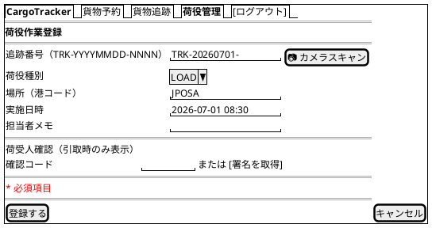

#### 仕様

- **荷役種別**: `RECEIVE`, `LOAD`, `UNLOAD`, `CUSTOMS`, `CLAIM` から選択（ドメインモデルの `HandlingType` と一致）。US15 の対象は `RECEIVE` / `LOAD` / `UNLOAD` の 3 種、`CLAIM` は US16 の対象。`CUSTOMS` は通関記録（CustomsClearancePort 連携の手動補完）としてドメインモデル準拠で追加した種別である
- **追跡番号**: `[📷 カメラスキャン]` ボタンでバーコード・QR スキャン入力に対応。存在しない番号はエラー表示（US15）
- **荷受人確認**（US16）: 荷役種別 `CLAIM`（引取）選択時のみ、htmx で荷受人確認フィールド（署名または確認コード）を表示し必須とする。登録後、貨物状態が「引取済」になり精算処理の開始条件となる
- **場所警告**（US15）: 作業場所が予定ルートと異なる場合、フォーム上部にインライン警告（`role="alert"`・黄色背景）を表示し、[このまま続行する] / [入力に戻る] の二択ボタンを提示する。[このまま続行する] を選ぶと警告理由が作業記録に残る（モーダルは使わない — 現場の片手操作でモーダルは誤タップしやすいため）
- **VoyageNumber**: 荷役種別が `LOAD` / `UNLOAD` の場合は航海番号が必須（htmx で動的表示）
- **実施日時**: 未来日時は警告表示（投機的な登録は許可）
- **登録成功**: PRG パターンで `/handling` へリダイレクト。貨物状態が自動更新され荷主に通知される
- **モバイルファースト**: 港湾現場でのスマートフォン利用を想定し、1 カラム・大きなタップ領域で構成する

#### オフライン・通信断対応（初期リリース対象）

港湾・倉庫はコンテナヤードの奥など圏外・電波不安定が日常であるため、本画面に限り初期リリースから以下を実装する。

- フォーム入力値は入力のたびに `localStorage` へ自動退避する（追跡番号・種別・場所・日時・メモ）
- 送信失敗（通信エラー・タイムアウト）時は入力値を保持したまま「送信できませんでした。電波の届く場所で [再送信] してください」と表示し、[再送信] ボタンを提示する
- 退避した未送信データはページ再訪時に復元し、「未送信の作業記録があります」と通知する
- 連続作業（積込 10 件等）を想定し、登録成功後も直前の場所・航海番号は次の入力の初期値として引き継ぐ
- セッションタイムアウト（2 時間）と通信断が重なった場合も、再ログイン後に退避データから再送できる

#### モバイル（375px）レイアウト

現場利用（片手・手袋・直射日光）を想定し、375px では以下の縦積み 1 カラム構成とする。

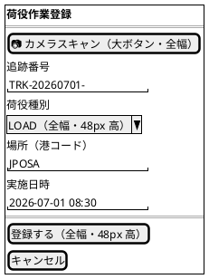

- すべてのタップターゲットは 44px 以上（主要ボタンは 48px）
- カメラスキャンを最上部に置き、「スキャン → 種別タップ → 登録」の 3 操作で完了する動線とする
- 高コントラスト（直射日光下の視認性）のため、主要ボタンは Bootstrap の `btn-primary` + 大サイズを使用する

---

### 荷役作業一覧 (/handling)

#### ワイヤーフレーム


#### 仕様

- **検索フィルタ**: 貨物 ID・荷役種別・場所（港コード）でフィルタリング
- **htmx**: 検索フォームに `hx-get="/handling" hx-target="#handling-list"` で部分更新
- **新規登録**: Handler のみ表示
- **ページネーション**: 1 ページ 20 件
- **データソース**: CQRS クエリ側の Read Model（`HandlingActivityHistory`）を表示する

---

### 航路一覧 (/voyages)

#### ワイヤーフレーム

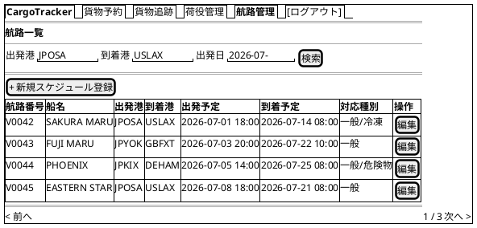

#### 仕様

- **検索フィルタ**: 出発港・到着港・出発日でフィルタリング
- **対応種別**: 航海が対応する貨物種別（一般/危険物/冷凍）を表示。経路候補算出時の絞り込みに使用
- **[+ 新規スケジュール登録]**: `/voyages/new` に遷移（US24）。RouteDesigner のみ表示
- **[編集]**: `/voyages/:voyageNumber/edit` に遷移（US25）
- **経路割り当てへの連携**: 経路割り当て画面が本データを参照して候補を生成

---

### 航海スケジュール登録 (/voyages/new)

#### ワイヤーフレーム

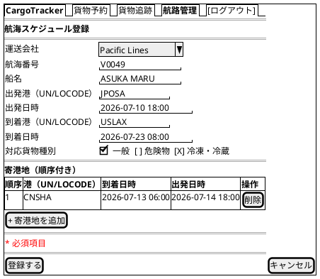

#### 仕様

- **入力項目**（US24）: 運送会社・航海番号・船名・出発港/到着港（UN/LOCODE）・出発/到着日時・寄港地（順序付きリスト、htmx で行追加）・対応貨物種別
- **バリデーション**: 必須項目未入力は未入力箇所を明示したエラー表示。出発日が到着日より後の場合は日付整合性エラー（ドメインの `Schedule` スマートコンストラクタに対応）
- **重複検出**: 同一航海番号が登録済みの場合、差分確認画面（`/voyages/:voyageNumber/edit`）へ誘導する
- **登録成功**: PRG で `/voyages` へリダイレクト。以降 US07（航海スケジュール検索）の検索対象になる

---

### 航海スケジュール更新 (/voyages/:voyageNumber/edit)

#### 仕様

- **差分表示**（US25）: 既存登録内容と入力した更新内容を左右 2 カラムで対比表示し、変更箇所をハイライトする
- **[更新する]**: 差分確認後に既存スケジュールを上書き更新（PRG で `/voyages` へ）。更新後は US07 の検索結果に反映される
- **[キャンセル]**: 既存スケジュールを変更せず `/voyages` に戻る
- **アクセス制御**: RouteDesigner のみ

---

### 請求書一覧 (/billing/invoices)

#### ワイヤーフレーム

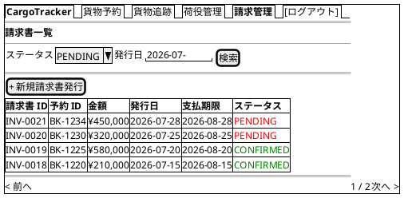

#### 仕様

- **フィルタ**: PaymentStatus（`PENDING`, `CONFIRMED`, `OVERDUE`, `REFUNDED`）・発行日でフィルタリング
- **支払期限超過**: 期限超過かつ未払いの場合は行を赤色ハイライトし、経理担当者に未払い通知（US23）
- **アクセス制御**: Accountant のみアクセス可能
- 本画面の主担当は US23（精算処理の一覧管理）。US21（料金算出）の主担当は後述の新規請求書発行画面

#### 月末締め向け一括処理（初期リリース対象）

月末は数十〜数百件の入金消込を一括処理するため、1 件ずつの詳細画面操作とは別に以下を提供する。

- **未払い一覧ビュー**: フィルタ `PENDING + OVERDUE` のプリセットボタンを用意する
- **一括入金確認**: 一覧の各行にチェックボックスを置き、複数選択して [選択した請求の入金を確認] で一括処理する（確認モーダルで件数・合計金額を表示）
- **CSV 出力**: 現在のフィルタ条件の請求一覧を CSV ダウンロードできる（経理システムへの取込・突合用）
- **請求書 PDF 出力**: 請求書詳細から PDF をダウンロードできる（電子帳簿保存法の 7 年保存要件に対応するため初期リリースに含める）

#### 新規請求書発行（/billing/invoices/new）（US21）

- 「引取済」状態の予約を検索・選択して料金算出を開始する
- 選択した予約の**輸送実績**（経路・重量・貨物種別・荷役実績）を表示し、**基本料金を自動計算**する（貨物種別係数 × 重量・距離）
- 法人荷主の場合は割引率を自動適用し、内訳をプレビュー表示する（US22）
- 例外（遅延・破損）が記録されている場合は料金調整（減額・補償費用）の入力欄を表示する
- [発行する] で請求書を作成し、PRG で請求書詳細へ遷移する

---

### 請求書詳細 (/billing/invoices/:invoiceId)

#### ワイヤーフレーム

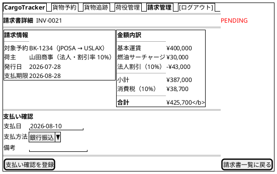

#### 仕様

- **金額内訳**: 基本運賃・サーチャージ・割引・消費税を明細表示
- **法人割引**（US22）: 荷主が法人の場合、契約割引率を自動取得して適用し、割引計算の根拠（割引率・基本料金・割引後料金）を明細に記載する。個人荷主は割引行を表示しない
- **[支払い確認を登録]**（US23）: `POST /billing/invoices/:invoiceId/confirm` を送信。入金確認後、精算状態と予約状態が「精算済」になる（PRG で同画面へリダイレクト）
- **確認済み**: PaymentStatus が `CONFIRMED` の場合は支払いフォームを非表示にし、確認日時を表示
- **PDF 出力**: `GET /billing/invoices/:invoiceId/pdf` で請求書 PDF をダウンロード（将来実装）

---

### 割引ポリシー管理 (/admin/discount-policies)

#### 仕様（概要）

- **一覧**: ポリシー名・貨物種別・顧客区分・割引率・有効期間を表示。有効期限でフィルタリング可能
- **登録・編集**: 割引率（-50〜100%）・有効開始日 ≤ 有効終了日のバリデーション。同一「貨物種別 × 顧客区分 × 期間」の重複はエラー
- **無効化**: `POST /admin/discount-policies/:id/disable` で論理削除（PRG）
- **アクセス制御**: Admin のみ。他ロールは 403 画面
- **位置づけ**: ドメインモデルの `DiscountPolicy` に対応する管理機能。初期フェーズでは法人契約割引（shipper.discount_rate）のみで運用し、本画面は将来イテレーションで実装する

---

### 公開貨物追跡 (/public/tracking/:trackingNumber)

#### ワイヤーフレーム

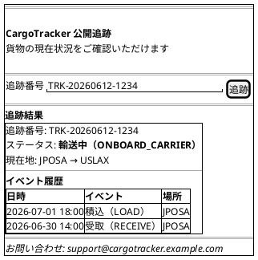

#### 仕様

- **認証**: 不要。`conf/routes` で本パスのアクションには `AuthenticatedAction` を適用せず、素の `Action` で公開する
- **追跡番号フォーム**: `GET /public/tracking/:trackingNumber` でページ表示。結果は同一ページ内に表示
- **404 処理**: 存在しない追跡番号は「該当する貨物が見つかりません。追跡番号を確認の上、再度お試しください」を表示
- **連絡先**: フッターに問い合わせメールアドレスを表示（荷主への導線確保）
- **レスポンシブ**: モバイルファースト（スマートフォンで QR コードから直接アクセスを想定）
- **表示情報の制限**: TransportStatus・最終イベント・現在地のみ（荷主名・住所等の個人情報は非表示）
- **反映タイムラグ**: イベント発行がトランザクションコミット後となるため、ステータス反映に最大 30 秒程度かかる旨を画面下部に注記する

---

## htmx 部分更新パターン

### 追跡ステータス自動更新

追跡詳細画面では、荷物の状態をユーザーがリロードせずに確認できるよう、30 秒ごとに自動更新する。

```html
@* tracking/show.scala.html - ステータスタイムライン部分 *@
<div id="status-timeline"
     hx-get="@routes.TrackingWebController.status(trackingNumber)"
     hx-trigger="every 30s"
     hx-swap="innerHTML">
  @tracking._statusTimeline(statusDto)  @* Twirl でサーバーレンダリングされた初期コンテンツ *@
</div>
<p id="last-updated">最終更新: @statusDto.lastUpdated</p>
```

**サーバー側レスポンス**: `/tracking/:trackingNumber/status` は Twirl フラグメント（`_statusTimeline.scala.html`）の HTML を返す（`Content-Type: text/html`）。

### 検索フォームの部分更新

貨物予約一覧・荷役作業一覧の検索フォームは、ページ全体を再読み込みせずに結果テーブルのみを更新する。

```html
<form hx-get="@routes.BookingWebController.index()"
      hx-target="#booking-list"
      hx-swap="outerHTML"
      hx-push-url="true">
  <input name="origin" type="text" placeholder="出発地">
  <input name="destination" type="text" placeholder="目的地">
  <select name="status">...</select>
  <button type="submit">検索</button>
</form>
<div id="booking-list">
  @booking._bookingList(summaries)
</div>
```

`hx-push-url="true"` により、検索条件が URL に反映されブラウザ履歴に残る。

### 経路候補の動的読み込み

経路割り当て画面でラジオボタンを選択すると、選択した航路の詳細を動的に読み込む。

```html
<input type="radio" name="voyageNumber" value="V0042"
       hx-get="@routes.VoyageWebController.detail("V0042")"
       hx-target="#voyage-detail"
       hx-swap="innerHTML">
```

### フォームのインラインバリデーション

入力フィールドからフォーカスが外れたタイミング（`blur`）でサーバーサイドバリデーションを実行する。

```html
<input name="origin" type="text"
       hx-post="@routes.ValidationController.location()"
       hx-trigger="blur"
       hx-target="next .error-message"
       hx-swap="innerHTML">
<span class="error-message text-danger"></span>
```

### 条件付きフィールドの動的表示

貨物予約登録の貨物種別・荷役登録の作業種別に応じて、必須フィールドを動的に表示する。

```html
<select name="cargoType"
        hx-get="@routes.BookingWebController.cargoTypeFields()"
        hx-target="#cargo-type-fields"
        hx-trigger="change">
  <option value="GENERAL">一般貨物</option>
  <option value="HAZARDOUS">危険物</option>
  <option value="REFRIGERATED">冷凍・冷蔵貨物</option>
</select>
<div id="cargo-type-fields">
  @* HAZARDOUS: 危険物申告 / REFRIGERATED: 温度管理条件 のフラグメントを返す *@
</div>
```

> **重要**: 動的表示はあくまで入力補助であり、必須検証はサーバー側（Play Form の条件付き検証 + ドメイン層スマートコンストラクタ）で必ず行う。JS 無効・ネットワーク遅延等でフィールドが表示されないまま送信された場合も、サーバーが「危険物には申告情報が必須です」とエラーを返す（クライアント表示に依存した検証漏れを許さない）。

---

## エラーハンドリング

### バリデーションエラー表示

- **フィールドレベル**: 各入力フィールドの下に赤字でメッセージ表示（Bootstrap `invalid-feedback`）
- **フォームレベル**: フォーム上部にアラートバナー（`alert-danger`）でまとめて表示
- **Twirl + Play Form**: `form("origin").hasErrors` でエラー有無を判定し、`form("origin").errors` でメッセージを表示する

```html
@* Play Form のフィールドエラー表示 *@
<div class="mb-3">
  <label for="origin" class="form-label">出発地 <span class="text-danger">*</span></label>
  <input type="text" id="origin" name="origin" value="@form("origin").value"
         class="form-control @if(form("origin").hasErrors) {is-invalid}">
  @form("origin").errors.map { error =>
    <div class="invalid-feedback">@messages(error.message)</div>
  }
</div>
```

ドメイン層の業務ルール違反（`Left(DomainError)`）は、interfaces 層でフォームのグローバルエラー
（`form.withGlobalError`）またはフラッシュメッセージに変換して表示する。

### フラッシュメッセージ

PRG パターンのリダイレクト後に、操作結果を Play の Flash スコープでフィードバックする。

| 操作 | メッセージ例 | Bootstrap クラス |
| :--- | :--- | :--- |
| 予約登録成功 | 「貨物予約 BK-1234 を登録しました」 | `alert-success` |
| 経路確定・紐付け成功 | 「経路 V0042 を予約に紐付けました」 | `alert-success` |
| 荷役登録成功 | 「荷役作業 HE-0042 を登録しました」 | `alert-success` |
| 航海スケジュール登録成功 | 「航海 V0049 を登録しました」 | `alert-success` |
| 例外登録成功 | 「例外（遅延）を登録し、荷主に通知しました」 | `alert-warning` |
| 支払い確認成功 | 「請求書 INV-0021 の支払いを確認しました」 | `alert-success` |
| バリデーションエラー | 「入力内容に誤りがあります。確認してください」 | `alert-danger` |
| システムエラー | 「処理中にエラーが発生しました。時間をおいて再試行してください」 | `alert-danger` |

フラッシュメッセージは共通フラグメント `fragments/alerts.scala.html` で一元管理する。

### エラーページ

Play の `HttpErrorHandler` をカスタマイズし、ステータスごとの Twirl エラーページを返す。

| HTTP ステータス | 画面 | 内容 |
| :--- | :--- | :--- |
| 400 Bad Request | `views/errors/badRequest.scala.html` | 不正なリクエスト。入力を確認してください |
| 403 Forbidden | `views/errors/forbidden.scala.html` | アクセス権限がありません |
| 404 Not Found | `views/errors/notFound.scala.html` | 指定されたページまたはリソースが見つかりません |
| 500 Internal Server Error | `views/errors/serverError.scala.html` | サーバーエラーが発生しました。管理者に連絡してください |

各エラーページはナビゲーションバーを表示し、ダッシュボードへ戻るリンクを提供する。

### htmx エラーハンドリング

htmx リクエストがエラーを返した場合は、`htmx:responseError` イベントをキャッチして通知を表示する。

```javascript
// public/js/app.js
document.addEventListener('htmx:responseError', function(event) {
  const status = event.detail.xhr.status;
  if (status === 401) {
    // セッション切れ: 部分領域にログインページが差し込まれる表示崩れを防ぎ、
    // ログイン画面へフルリダイレクトする（サーバーは HX-Request 時に HX-Redirect ヘッダーでも誘導する）
    window.location.href = '/login?expired=true';
    return;
  }
  const messageEl = document.getElementById('htmx-error-toast');
  if (status === 404) {
    messageEl.textContent = '対象データが見つかりませんでした';
  } else {
    messageEl.textContent = '通信エラーが発生しました。再試行してください';
  }
  messageEl.classList.remove('d-none');
});
```

- `#htmx-error-toast` 要素には `role="alert" aria-live="assertive"` を付与し、スクリーンリーダー利用者にもエラー発生を即時通知する（ARIA 対応表参照）
- 30 秒ポーリングが連続して失敗した場合は、タイムライン上部に「自動更新が停止しています。[再読み込み]」を表示し、古い情報を最新と誤認させない
- 認証必須エンドポイントは htmx リクエスト（`HX-Request` ヘッダーあり）に対して 401 + `HX-Redirect: /login` を返し、フルページの HTML を部分領域に差し込まない

---

## アクセシビリティ

### キーボードナビゲーション

- **Tab 順序**: フォーム項目 → 送信ボタン → ナビゲーションの順に自然な Tab 移動
- **Enter キー**: フォーム内でのフォーカス状態で Enter キーを押すと送信
- **Escape キー**: モーダル・確認ダイアログを閉じる
- **スキップリンク**: `<a href="#main-content" class="visually-hidden-focusable">コンテンツにスキップ</a>` をヘッダー先頭に配置

### ARIA 対応

| 要素 | ARIA 属性 |
| :--- | :--- |
| ナビゲーションバー | `role="navigation" aria-label="メインナビゲーション"` |
| 検索フォーム | `role="search" aria-label="貨物検索"` |
| データテーブル | `role="grid" aria-label="[テーブル名]"` |
| ステータスバッジ | `aria-label="ステータス: ROUTE_PROPOSED"` |
| ローディングインジケーター | `aria-live="polite" aria-busy="true"` |
| エラーメッセージ | `role="alert" aria-live="assertive"` |
| フラッシュメッセージ | `role="status" aria-live="polite"` |

### htmx と ARIA

htmx の部分更新後に動的コンテンツが更新されることをスクリーンリーダーに通知する。

```html
<!-- 自動更新エリアは aria-live="polite" で通知 -->
<div id="status-timeline"
     aria-live="polite"
     aria-atomic="false"
     hx-get="/tracking/TRK-20260612-1234/status"
     hx-trigger="every 30s">
</div>
```

### カラーコントラスト

- 通常テキスト: コントラスト比 4.5:1 以上（WCAG AA 準拠）
- 大きいテキスト（18px 以上）: 3:1 以上
- ステータスバッジは色のみに依存せず、テキストラベルを必ず併記

---

## 付録: ステータスバッジ定義

ステータスは DB 永続化値（`SCREAMING_SNAKE_CASE`）で表記する。Scala コード上は対応する enum ケース
（`RouteProposed` 等）を使用する（ドメインモデル設計参照）。

**表示の一元管理**: ステータスの表示ラベル・バッジ色は `fragments/statusBadge.scala.html` に一元実装し、
認証済み画面・公開追跡ページの両方が同一フラグメントを参照する。表示ラベルを二重管理しない。

**画面用語の統一**:

- `Invoice` の画面表示は「**請求書**」に統一する（ドメインモデル・データモデルの「精算書」と同一概念。荷主向け帳票の呼称として請求書を採用）
- `ROUTE_PROPOSED`（経路提案中）は要件定義の「経路提案中」複合状態（ルート検討中〜経路選択済）に対応し、営業の引き渡しから経路確定・荷主承認待ちまでの**経路設計プロセス進行中**を広く表す。「荷主への提案が完了した」ことを意味しないため、荷主に通知済みかどうかは予約詳細の通知記録（US12）で確認する

### BookingStatus バッジ定義

| ステータス | 表示ラベル | Bootstrap クラス | 意味 |
| :--- | :--- | :--- | :--- |
| `PRELIMINARY` | 仮受付 | `badge bg-warning text-dark` | 経路未割り当て |
| `ROUTE_PROPOSED` | 経路提案中 | `badge bg-primary` | 経路割り当て完了・荷主未承認 |
| `CONFIRMED` | 予約確定 | `badge bg-success` | 荷主承認済み |
| `TRACKING_ISSUED` | 追跡番号発行済 | `badge bg-info text-dark` | 追跡番号付与 |
| `IN_TRANSIT` | 輸送中 | `badge bg-primary` | 積み込み済・輸送中 |
| `DELIVERED` | 配送完了 | `badge bg-success` | 配達完了 |
| `SETTLED` | 精算済 | `badge bg-secondary` | 請求・支払い完了 |
| `CANCELLED` | キャンセル | `badge bg-danger` | キャンセル済 |

### TransportStatus バッジ定義

| ステータス | 表示ラベル | Bootstrap クラス |
| :--- | :--- | :--- |
| `NOT_RECEIVED` | 受領待ち | `badge bg-secondary` |
| `RECEIVED` | 受領済 | `badge bg-info text-dark` |
| `LOADED` | 積込済 | `badge bg-primary` |
| `ONBOARD_CARRIER` | 輸送中 | `badge bg-primary` |
| `UNLOADED` | 荷降し済 | `badge bg-warning text-dark` |
| `AWAITING_CLAIM` | 引取待ち | `badge bg-warning text-dark` |
| `CLAIMED` | 引取済 | `badge bg-success` |
| `IN_EXCEPTION` | 例外発生 | `badge bg-danger` |
| `UNKNOWN` | 不明 | `badge bg-secondary` |

---

## 参照

- [フロントエンドアーキテクチャ](architecture_frontend.md)
- [ドメインモデル設計](domain-model.md)（ステータス・荷役種別・貨物種別の定義）
- [ユーザーストーリー](../requirements/user_story.md)
- [システムユースケース](../requirements/system_usecase.md)
