# UI 設計 - 国際貨物輸送管理システム

## 概要

本ドキュメントでは、国際貨物輸送管理システムの UI 設計を定義する。

### 設計方針

**OOUX（オブジェクト指向 UI 設計）** をベースに、ユーザーが操作する「オブジェクト」（貨物予約・追跡・荷役・航路・請求書）を中心に画面を構成する。各画面はオブジェクトの状態を可視化し、アクターに応じた操作を提供する。

### 技術スタック

| 技術 | 役割 |
| :--- | :--- |
| Node.js 24.18 LTS + TypeScript 5.x + NestJS 11 | アプリケーションフレームワーク |
| TSX（React 19 / react-dom/server） | SSR（サーバーサイド JSX レンダリング）でフル HTML を生成。クライアント側 React・ハイドレーションは行わない |
| htmx 2.x | フォームバリデーション・ステータス自動更新など部分的な動的更新 |
| Bootstrap 5.3 | レスポンシブグリッド・コンポーネント |
| PRG パターン | フォーム送信後は必ず Redirect-Get で二重送信を防止 |

### 基本 UX 原則

- **オブジェクト中心**: 一覧 → 詳細 → アクションの自然な流れ
- **状態の可視化**: BookingStatus・TransportStatus をバッジで常時表示
- **フィードバック**: 操作成功・失敗はフラッシュメッセージで通知
- **アクセシビリティ**: ARIA ラベル・キーボードナビゲーション対応

---

## UI オブジェクト定義

OOUX に基づき、システム内の主要オブジェクトとそのアクション・属性を定義する。

### 主要オブジェクト

| オブジェクト | 主な属性 | ユーザーアクション | 関連オブジェクト |
| :--- | :--- | :--- | :--- |
| **貨物予約（Booking）** | bookingId, 出発地, 目的地, 希望期限, 貨物種別, 重量, BookingStatus | 新規登録・詳細確認・経路割り当て・キャンセル | 追跡情報, 航路, 荷役履歴 |
| **追跡情報（Tracking）** | trackingNumber, TransportStatus, 現在地, ステータス履歴 | 追跡番号検索・履歴確認 | 貨物予約 |
| **荷役作業（HandlingEvent）** | eventId, 貨物 ID, 荷役種別, 場所, 実施日時, 担当者 | 新規登録・一覧確認 | 貨物予約 |
| **航路（Voyage）** | voyageNumber, 出発港, 到着港, 出発予定日, 到着予定日 | 一覧確認・経路割り当てへの提供 | 貨物予約 |
| **請求書（Invoice）** | invoiceId, 貨物予約, 金額, 割引, 消費税, PaymentStatus | 一覧確認・詳細確認・支払い確認 | 貨物予約 |

### オブジェクト間の関係

```
Booking 1 ─── 1 Tracking
Booking 1 ─── N HandlingEvent
Booking N ─── M Voyage（経路割り当てを通じて）
Booking 1 ─── 1 Invoice
```

---

## 画面一覧

| 画面名 | URL パス | 説明 | 主要アクター | 対応 US |
| :--- | :--- | :--- | :--- | :--- |
| ログイン | `/login` | 認証フォーム | 全ロール | US26, US27 |
| ダッシュボード | `/` | ロール別サマリー・最新荷役情報 | 全ロール | US26 |
| 荷主登録 | `/shippers/new` | 荷主登録フォーム（個人/法人・法人契約情報は htmx で差替） | 営業担当者 | US02, US03 |
| 貨物予約一覧 | `/bookings` | 予約済み貨物の一覧・検索（経路設計待ちフィルタ含む） | 営業担当者、荷主、経路設計者 | US04 |
| 貨物予約登録 | `/bookings/new` | 新規予約フォーム（荷主・荷受人・貨物仕様） | 営業担当者 | US04, US05 |
| 予約詳細 | `/bookings/{bookingId}` | 予約情報・確定経路（Leg 一覧）・荷役履歴・追跡番号・状態別アクション（引き渡し・経路通知・確定・差戻し・キャンセル・追跡番号発行） | 営業担当者、荷主、経路設計者 | US06, US12, US13, US14 |
| 経路割り当て | `/bookings/{bookingId}/route` | 経路候補一覧（航海番号・経由港・所要日数・費用）の選択、条件調整フォーム（到着期限・貨物種別の再算出）、候補なし時の営業への条件協議依頼、選択経路の紐付け | 経路設計者 | US07, US08, US09, US10, US11 |
| 貨物追跡入力 | `/tracking` | 追跡番号入力フォーム | 荷主、追跡管理者 | US18 |
| 追跡詳細 | `/tracking/{trackingNumber}` | 輸送ステータス履歴タイムライン・手動更新 | 荷主、追跡管理者 | US17, US18 |
| 例外登録 | `/tracking/{trackingNumber}/exceptions/new` | 例外（遅延・破損・紛失）の記録フォーム | 追跡管理者、荷役作業員 | US19, US20 |
| 例外一覧・詳細 | `/tracking/{trackingNumber}/exceptions` | 例外の一覧・詳細・対応報告送信 | 追跡管理者 | US19, US20 |
| 荷役作業登録 | `/handling/new` | 荷役・引取イベント登録フォーム | 荷役作業員 | US15, US16 |
| 荷役作業一覧 | `/handling` | 荷役履歴一覧・検索 | 荷役作業員、追跡管理者 | US15 |
| 通関ステータス | `/tracking/{trackingNumber}/customs` | 通関申告の照会・更新（PENDING/CLEARED/HELD/REJECTED）・HELD 時の対応 | 追跡管理者、荷役作業員 | US19, US20 |
| 航路一覧 | `/voyages` | 航路・スケジュール一覧・検索 | 経路設計者 | US07 |
| 航海登録 | `/voyages/new` | 航海番号・船名・運送会社・運送区間・対応貨物種別の登録 | 経路設計者 | US24 |
| 航海更新 | `/voyages/{voyageNumber}/edit` | 既存航海スケジュールの呼び出し・日程更新 | 経路設計者 | US25 |
| 航海更新確認 | `/voyages/{voyageNumber}/confirm` | 既存内容と更新内容の差分確認・更新確定・キャンセル | 経路設計者 | US25 |
| 請求書一覧 | `/billing/invoices` | 請求書の一覧・料金算出・ステータス管理 | 経理担当者 | US21, US23 |
| 請求書詳細 | `/billing/invoices/{invoiceId}` | 請求書詳細・法人割引・支払い確認 | 経理担当者 | US22, US23 |
| 公開貨物追跡 | `/public/tracking/{trackingId}` | 認証不要の貨物状態照会ページ（荷主が URL 共有可） | 荷主・荷受人（未認証） | US18 |
| 見積一覧 | `/estimates` | 見積の一覧・検索 | 営業担当者 | US01 |
| 見積作成 | `/estimates/new` | 新規見積フォーム（出発地・目的地・期限・貨物仕様入力） | 営業担当者 | US01 |
| 見積詳細 | `/estimates/{estimateId}` | 見積詳細・スタブルート候補一覧 | 営業担当者 | US01 |

---

## 共通レイアウト設計

### ナビゲーション構成

全画面共通のナビゲーションバー（Bootstrap 5 `navbar`）を上部に配置する。ロールに応じてメニュー項目を表示制御する。

| メニュー項目 | 遷移先 | 表示ロール |
| :--- | :--- | :--- |
| ダッシュボード | `/` | 全ロール |
| 見積管理 | `/estimates` | ROLE_SALES |
| 貨物予約 | `/bookings` | ROLE_SALES, ROLE_SHIPPER |
| 経路設計 | `/bookings?status=ROUTING_IN_PROGRESS`（経路設計待ち予約一覧） | ROLE_ROUTE_DESIGNER |
| 航路管理 | `/voyages` | ROLE_ROUTE_DESIGNER |
| 貨物追跡 | `/tracking` | ROLE_SHIPPER, ROLE_TRACKER |
| 例外管理 | `/tracking`（追跡詳細から例外登録・対応報告へ遷移） | ROLE_TRACKER |
| 荷役管理 | `/handling` | ROLE_HANDLER, ROLE_TRACKER |
| 請求管理 | `/billing/invoices` | ROLE_BILLING |
| ログアウト | `/logout` | 全ロール |

> ロール別の表示制御は、認証済みユーザーのロール情報を TSX コンポーネントの型付き props（例: `user.roles: Role[]`）として渡し、
> `{user.roles.includes('ROLE_SALES') && <NavItem ... />}` のような条件分岐でメニュー項目を出し分ける。props に型が付くため、表示制御の分岐もコンパイル時に型検査される。

### 共通レイアウト ワイヤーフレーム

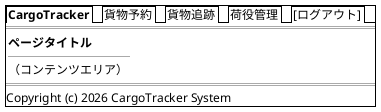

### Bootstrap 5 グリッド運用ルール

- コンテナ: `container-fluid` で横幅を最大活用
- 一覧画面: テーブル幅 `col-12`
- フォーム画面: 入力欄 `col-md-8 offset-md-2`（中央寄せ）
- 詳細画面: 左カラム `col-md-8`、右サイドバー `col-md-4`
- ブレークポイント: モバイル（`< 768px`）では 1 カラム積み上げ

---

## 画面遷移図

フロー全体の画面遷移を PlantUML ステートチャート図で表現する。

```plantuml
@startuml
title 全体画面遷移図 - 国際貨物輸送管理システム

[*] --> ログイン画面

state ログイン画面 {
  ログイン画面 : /login
  ログイン画面 : 認証フォーム
}

ログイン画面 --> ダッシュボード : 認証成功

state ダッシュボード {
  ダッシュボード : /
  ダッシュボード : サマリーカード\n最新荷役一覧
}

ダッシュボード --> 貨物予約一覧 : [予約管理] クリック
ダッシュボード --> 貨物予約一覧 : [経路設計] クリック（経路設計待ち）
ダッシュボード --> 貨物追跡入力 : [追跡] クリック
ダッシュボード --> 荷役作業一覧 : [荷役管理] クリック
ダッシュボード --> 請求書一覧 : [請求管理] クリック
ダッシュボード --> 航路一覧 : [航路管理] クリック

state "予約フロー" as booking_flow {
  state 貨物予約一覧 {
    貨物予約一覧 : /bookings
    貨物予約一覧 : 一覧テーブル・検索
  }
  state 貨物予約登録 {
    貨物予約登録 : /bookings/new
    貨物予約登録 : 入力フォーム
  }
  state 予約詳細 {
    予約詳細 : /bookings/{bookingId}
    予約詳細 : 予約情報・確定経路（Leg）\n荷役履歴・追跡番号\n状態別アクション
  }
  state 経路割り当て {
    経路割り当て : GET/POST /bookings/{bookingId}/route
    経路割り当て : 経路候補テーブル\n条件調整（期限・貨物種別 再算出）\n候補なし時 営業へ条件協議依頼
  }

  貨物予約一覧 --> 貨物予約登録 : [新規登録] ボタン
  貨物予約一覧 --> 予約詳細 : 行クリック
  貨物予約一覧 --> 予約詳細 : 経路設計待ち一覧\n（?status=ROUTING_IN_PROGRESS）行クリック
  貨物予約登録 --> 予約詳細 : 登録成功（PRG）
  貨物予約登録 --> 貨物予約登録 : バリデーションエラー
  予約詳細 --> 経路割り当て : [経路を割り当てる] ボタン\n（経路設計者・ROUTING_IN_PROGRESS）
  経路割り当て --> 経路割り当て : 条件調整で候補再算出（GET）
  経路割り当て --> 予約詳細 : 候補選択で紐付け成功\n（POST → ROUTE_PROPOSED・PRG）
  経路割り当て --> 経路割り当て : バリデーションエラー
  予約詳細 --> 予約詳細 : [経路を荷主に通知]（営業・US12・PRG）
  予約詳細 --> 予約詳細 : [予約を確定]（営業・ROUTE_PROPOSED→CONFIRMED・US13・PRG）
  予約詳細 --> 予約詳細 : [経路設計に戻す]（営業・→ROUTING_IN_PROGRESS・US13・PRG）
  予約詳細 --> 予約詳細 : [キャンセル]（営業・ROUTE_PROPOSED・US13・PRG）
  予約詳細 --> 予約詳細 : [追跡番号を発行]（経路設計者・CONFIRMED・US14・PRG）
}

state "追跡フロー" as tracking_flow {
  state 貨物追跡入力 {
    貨物追跡入力 : /tracking
    貨物追跡入力 : 追跡番号入力
  }
  state 追跡詳細 {
    追跡詳細 : /tracking/{trackingNumber}
    追跡詳細 : ステータスタイムライン\n30 秒自動更新（htmx）\n手動更新（追跡管理者）
  }
  state 例外登録 {
    例外登録 : /tracking/{trackingNumber}/exceptions/new
    例外登録 : 例外種別・発生状況入力
  }
  state 例外一覧詳細 {
    例外一覧詳細 : /tracking/{trackingNumber}/exceptions
    例外一覧詳細 : 例外一覧・詳細・対応報告送信
  }
  state 通関ステータス {
    通関ステータス : /tracking/{trackingNumber}/customs
    通関ステータス : CustomsStatus 照会・更新\nHELD 時の対応
  }

  貨物追跡入力 --> 追跡詳細 : 追跡番号送信
  貨物追跡入力 --> 貨物追跡入力 : 番号不正・未発見
  追跡詳細 --> 追跡詳細 : POST /tracking/{trackingNumber}/events（手動更新・PRG・US17）
  追跡詳細 --> 貨物追跡入力 : [別の貨物を追跡]
  追跡詳細 --> 例外登録 : [例外を登録]（追跡管理者）
  追跡詳細 --> 例外一覧詳細 : [例外を確認]（追跡管理者）
  追跡詳細 --> 通関ステータス : [通関を確認]（追跡管理者・荷役作業員）
  例外登録 --> 例外一覧詳細 : 登録成功（PRG）
  例外登録 --> 例外登録 : バリデーションエラー
  例外一覧詳細 --> 例外一覧詳細 : 対応報告送信（PRG）
  通関ステータス --> 通関ステータス : ステータス更新（PRG）
  通関ステータス --> 追跡詳細 : [追跡詳細に戻る]
}

state "荷役フロー" as handling_flow {
  state 荷役作業一覧 {
    荷役作業一覧 : /handling
    荷役作業一覧 : 一覧テーブル・検索
  }
  state 荷役作業登録 {
    荷役作業登録 : /handling/new
    荷役作業登録 : 登録フォーム
  }

  荷役作業一覧 --> 荷役作業登録 : [新規登録] ボタン
  荷役作業登録 --> 荷役作業一覧 : 登録成功（PRG・場所不一致時は警告/MISROUTED を一覧に表示）
  荷役作業登録 --> 荷役作業登録 : バリデーションエラー・追跡番号未存在・通関未 CLEARED（引取）
}

state "精算フロー" as billing_flow {
  state 請求書一覧 {
    請求書一覧 : /billing/invoices
    請求書一覧 : 一覧テーブル・フィルタ
  }
  state 請求書詳細 {
    請求書詳細 : /billing/invoices/{invoiceId}
    請求書詳細 : 詳細・支払い確認
  }

  請求書一覧 --> 請求書詳細 : 行クリック
  請求書詳細 --> 請求書一覧 : [一覧に戻る] / 支払い確認成功（PRG）
}

state "航路管理フロー" as routing_flow {
  state 航路一覧 {
    航路一覧 : /voyages
    航路一覧 : 航路・スケジュール一覧・検索
  }
  state 航海登録 {
    航海登録 : /voyages/new
    航海登録 : 登録フォーム
  }
  state 航海更新 {
    航海更新 : /voyages/{voyageNumber}/edit
    航海更新 : 更新フォーム
  }
  state 航海更新確認 {
    航海更新確認 : /voyages/{voyageNumber}/confirm
    航海更新確認 : 差分確認・更新確定・キャンセル
  }

  航路一覧 --> 航路一覧 : 検索（htmx fragment）
  航路一覧 --> 航海登録 : [航海登録]
  航海登録 --> 航路一覧 : 登録成功（PRG）
  航海登録 --> 航海登録 : バリデーションエラー
  航路一覧 --> 航海更新 : [編集]
  航海更新 --> 航海更新確認 : 差分確認
  航海更新 --> 航海更新 : バリデーションエラー
  航海更新確認 --> 航路一覧 : 更新成功（PRG）
  航海更新確認 --> 航路一覧 : キャンセル（変更なし）
}

state 公開貨物追跡 {
  公開貨物追跡 : /public/tracking/{trackingId}
  公開貨物追跡 : 認証不要・シンプルステータス
}

[*] --> 公開貨物追跡 : 直接 URL アクセス（認証不要）

state "見積フロー" as estimation_flow {
  state 見積一覧 {
    見積一覧 : /estimates
    見積一覧 : 一覧テーブル・検索
  }
  state 見積作成 {
    見積作成 : /estimates/new
    見積作成 : 入力フォーム
  }
  state 見積詳細 {
    見積詳細 : /estimates/{estimateId}
    見積詳細 : ルート候補一覧
  }

  見積一覧 --> 見積作成 : [新規見積作成] ボタン
  見積一覧 --> 見積詳細 : 行クリック
  見積作成 --> 見積詳細 : 作成成功（PRG）
  見積作成 --> 見積作成 : バリデーションエラー
}

ダッシュボード --> 見積一覧 : [見積管理] クリック（US01）

@enduml
```

---

## 画面詳細設計

### ログイン画面 (/login)

#### ワイヤーフレーム

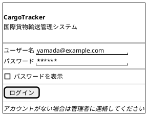

#### 仕様

- Passport（`passport-local`）のフォーム認証を利用したカスタムログイン画面
- ログイン失敗時: 「ユーザー名またはパスワードが正しくありません」を赤色で表示
- ログイン成功後: ロールに応じてダッシュボードへリダイレクト
- セッションタイムアウト後は自動的に `/login?timeout` へリダイレクト

---

### ダッシュボード (/)

#### ワイヤーフレーム

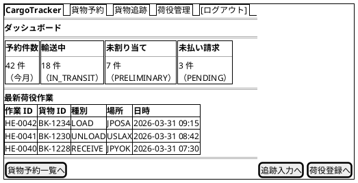

#### 仕様

- サマリーカード: 今月の予約件数・輸送中件数・未割り当て件数・未払い請求件数
- 最新荷役作業: 直近 10 件を降順表示
- ロール制御: ROLE_BILLING のみ「未払い請求」カードを表示
- **初期表示**: サマリーカード・最新荷役作業の初期値は SSR（TSX）でレンダリングして初回表示時点で内容が揃うようにする。htmx は初回ロード後の更新（再取得・自動更新）に限定し、初期描画のための `hx-get` には依存しない

---

### 貨物予約一覧 (/bookings)

#### ワイヤーフレーム

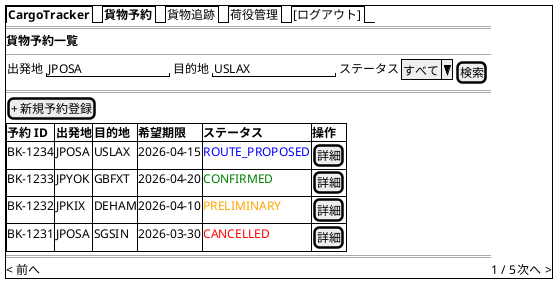

#### 仕様

- **検索フィルタ**: 出発地・目的地（港コード）・BookingStatus でフィルタリング
- **ステータスバッジ**: BookingStatus に応じた色分け（Bootstrap `badge`）
- **ページネーション**: 1 ページ 20 件
- **新規登録**: ROLE_SALES のみ表示
- **htmx**: 検索フォームに `hx-get="/bookings" hx-target="#booking-list"` で部分更新

---

### 貨物予約登録 (/bookings/new)

#### ワイヤーフレーム

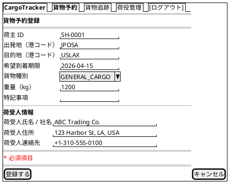

#### 仕様

- **入力項目**: 荷主 ID・出発地・目的地（UNLOCODE 形式 5 文字）・希望到着期限・貨物種別・重量・荷受人情報（氏名 / 社名・住所・連絡先）
- **荷受人情報**: 氏名 / 社名・住所・連絡先を必須入力とする。荷受人は認証ロールを持たず、引き渡し時の確認・公開追跡ページの対象となる
- **バリデーション**: htmx で `hx-post` 送信前にクライアントサイドチェック、サーバー側は class-validator による DTO 検証
- **貨物種別**: `GENERAL_CARGO`, `REFRIGERATED`, `HAZARDOUS`, `PERISHABLE` から選択
- **登録成功**: PRG パターンで `/bookings/{bookingId}` へリダイレクト
- **エラー時**: 同画面を再描画し、エラーフィールドを赤ボーダーで強調

---

### 予約詳細 (/bookings/{bookingId})

#### ワイヤーフレーム

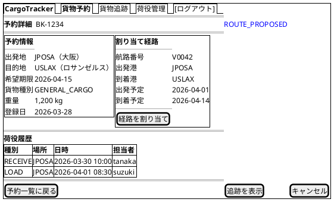

#### 仕様

- **ステータスバッジ**: ページタイトル横に BookingStatus を大きく表示
- **到達ロール**: ROLE_SALES・ROLE_SHIPPER に加え、経路設計者（ROLE_ROUTE_DESIGNER）も到達可能。経路設計者は navbar「経路設計」または経路設計待ち予約一覧（`/bookings?status=ROUTING_IN_PROGRESS`）から本画面へ遷移し、経路割り当て・追跡番号発行を行う
- **経路情報**: 未割り当ての場合は「経路が割り当てられていません」と表示し `[経路を割り当て]` を強調。割り当て済みの場合は確定経路（Leg 一覧: 航海番号・積地・揚地・出発予定・到着予定）と追跡番号を表示する
- **荷役履歴**: HandlingEvent を時系列降順で表示
- **[経路設計者に引き渡す]**: ROLE_SALES かつ BookingStatus = PRELIMINARY の場合のみ表示（US06）。確認モーダル表示後に `POST /bookings/{bookingId}/assign-routing`。成功時 PRG で同詳細画面へリダイレクト、BookingStatus が ROUTING_IN_PROGRESS に遷移する
- **[経路を割り当てる]**: ROLE_ROUTE_DESIGNER かつ BookingStatus = ROUTING_IN_PROGRESS の場合に表示。`/bookings/{bookingId}/route`（経路割り当て画面）へ遷移する
- **[経路を荷主に通知（内容確認）]**: ROLE_SALES かつ BookingStatus = ROUTE_PROPOSED の場合のみ表示（US12）。`GET /bookings/{bookingId}/notify`（通知内容確認画面）へ遷移する。確認画面では宛先（荷主メール）・経由港・所要日数・到着予定日・料金概算を表示し、`POST /bookings/{bookingId}/notify` で荷主（shipper）宛に通知して PRG で予約詳細へリダイレクトする（IT5 で通知先を荷受人から荷主へ是正・確認画面を追加）
- **[予約を確定]**: ROLE_SALES かつ BookingStatus = ROUTE_PROPOSED の場合のみ表示（US13）。`POST /bookings/{bookingId}/confirm` を送信。成功時 BookingStatus が CONFIRMED に遷移し PRG で同詳細画面へリダイレクト
- **[経路設計に戻す]**: ROLE_SALES かつ BookingStatus = ROUTE_PROPOSED の場合のみ表示（US13）。`POST /bookings/{bookingId}/return-to-routing` を送信し、BookingStatus を ROUTING_IN_PROGRESS に戻す。成功時 PRG で同詳細画面へリダイレクト
- **[追跡番号を発行]**: ROLE_ROUTE_DESIGNER かつ BookingStatus = CONFIRMED の場合のみ表示（US14）。`POST /bookings/{bookingId}/tracking-number` を送信し追跡番号を発行する。成功時 PRG で同詳細画面へリダイレクトし、発行済み追跡番号を表示する
- **[キャンセル]**: ROLE_SALES かつ BookingStatus = ROUTE_PROPOSED の場合に表示。確認ダイアログ後に `POST /bookings/{bookingId}/cancel`（キャンセル＋通知、US13）。ドメインルール上は任意状態から CANCELLED への遷移が可能だが、IT4 の画面導線では ROUTE_PROPOSED からのキャンセルのみを提供する（他状態からのキャンセル導線は将来対応）
- **[追跡を表示]**: `trackingNumber` が発行済みの場合に表示し `/tracking/{trackingNumber}` へ遷移する。IT4 時点では未実装（追跡番号は dd 表示のみ）で、追跡照会画面とあわせて IT6 で追加予定

---

### 経路割り当て (/bookings/{bookingId}/route)

#### ワイヤーフレーム

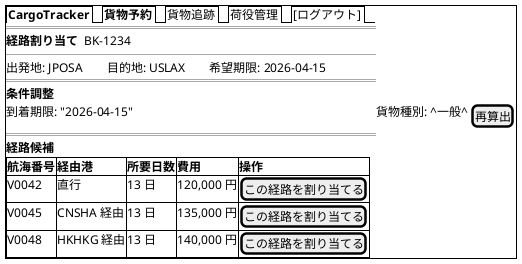

#### 仕様

- **主要アクター**: 経路設計者（ROLE_ROUTE_DESIGNER）。営業担当者は US06 の予約情報引き渡しまでを担当し、経路の選択・確定は経路設計者が行う
- **導線**: navbar「経路設計」または経路設計待ち予約一覧（`/bookings?status=ROUTING_IN_PROGRESS`）→ 予約詳細 → `[経路を割り当てる]` ボタンから遷移する
- **候補一覧表示**: `GET /bookings/{bookingId}/route` で経路候補一覧（航海番号・経由港・所要日数・費用）を表示（US09）
- **候補一覧の表示形式**: 候補はテーブル（航海番号・経由港・所要日数・費用）で一覧表示し、各行の操作列に候補ごとの `[この経路を割り当てる]` ボタン（`POST /bookings/{bookingId}/route` へ `candidateId` を送信する個別フォーム）を配置する。ラジオ選択・「選択中の航路詳細」の部分更新は行わない
- **条件調整フォーム**: 到着期限・貨物種別を変更して `GET /bookings/{bookingId}/route?arrivalDeadline=...&cargoType=...` で候補を再算出する（US10）。GET フォーム送信によるページ遷移で再算出し、htmx による部分更新は用いない。詳細は [ADR-008](../adr/008-routing-candidate-port-boundary.md) の経路候補・港境界を参照
- **希望期限超過候補の扱い**: 到着予定が希望期限を超える候補は一覧に表示しない。ドメイン／ACL 側で期限内の候補のみを返すため、画面での `⚠` 警告表示は行わない
- **候補なし時**: 期限内の候補が存在しない場合は候補テーブルに代えて「期限内に到達可能な経路候補がありません。条件を調整するか、営業担当者に条件協議を依頼してください」と表示し、営業への条件協議依頼導線を案内する（US11）
- **経路の紐付け（割り当て成功）**: 選択した候補を `POST /bookings/{bookingId}/route` で予約に紐付ける。成功時 BookingStatus が ROUTE_PROPOSED に遷移し、PRG パターンで `/bookings/{bookingId}` へリダイレクト

---

### 貨物追跡入力 (/tracking)

#### ワイヤーフレーム

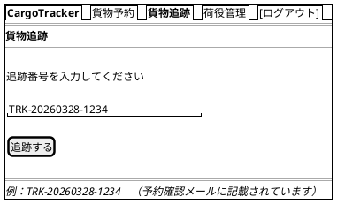

#### 仕様

- **入力フィールド**: 追跡番号（`TRK-YYYYMMDD-NNNN` 形式）
- **バリデーション**: フォーマット不正の場合はインラインエラー表示
- **未発見**: 404 の場合は「該当する貨物が見つかりません」メッセージ
- **認証不要**: 荷受人（認証ロールを持たない公開追跡ページ利用者）は認証なしでもアクセス可

---

### 追跡詳細 (/tracking/{trackingNumber})

#### ワイヤーフレーム

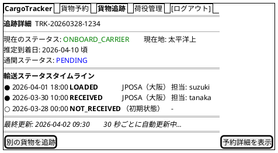

#### 仕様

- **自動更新**: htmx `hx-get="/tracking/{trackingNumber}/status" hx-trigger="every 30s" hx-target="#status-timeline"` で部分更新
- **ポーリング停止条件**: TransportStatus が終端状態（`CLAIMED`／BookingStatus = `DELIVERED`）に達した場合は自動更新を停止する。サーバー側レスポンスに `hx-trigger` を含めない（または `HX-Reswap: none` で以後のポーリングを行わない）フラグメントを返し、「輸送は完了しました」と表示する
- **タイムライン**: TransportStatus の変化を時系列で表示。最新状態を最上部に
- **TransportStatus の遷移**: `NOT_RECEIVED → RECEIVED → LOADED → ONBOARD_CARRIER → UNLOADED → AWAITING_CLAIM → CLAIMED`
- **推定到着日**: `YYYY-MM-DD 頃` の形式で表示。未確定の場合は「未確定」と表示
- **CustomsStatus**: `PENDING`（審査中）/ `CLEARED`（通関済）/ `HELD`（留置中）/ `REJECTED`（不可） をバッジで表示
- **EXCEPTION**: 異常発生時は赤色バッジで表示し、内容を詳細表示
- **手動更新**: 追跡管理者（ROLE_TRACKER）のみ手動更新フォーム（新しい状態・位置 UN/LOCODE・日時・航海番号）を表示し、`POST /tracking/{trackingNumber}/events` で追跡イベントを履歴に記録する（US17・PRG）。更新後、荷主へ状態変更通知（通知記録）が登録される
- **例外導線**: 追跡管理者のみ `[例外を登録]`（US19・US20）・`[例外を確認]` を表示し、例外登録・例外一覧画面へ遷移する
- **[予約詳細を表示]**: ROLE_SALES, ROLE_SHIPPER のみ表示

---

### 荷役作業登録 (/handling/new)

#### ワイヤーフレーム

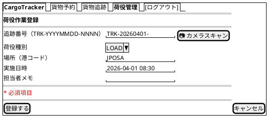

#### 仕様

- **荷役種別**: `RECEIVE`（受領）, `LOAD`（積込）, `UNLOAD`（荷降し）, `CLAIM`（引取）から選択（IT5 実装。`CUSTOMS` は通関申告コマンド経由で扱い、画面選択肢は IT6 で検討）
- **追跡番号**: `TRK-` プレフィックス形式。テキスト手入力（カメラスキャンは将来対応）。未存在の追跡番号はエラーメッセージを表示してフォームを再表示する
- **航海番号**: `LOAD` / `UNLOAD` は必須。未入力はドメイン検証エラーとしてフォームを再表示する
- **荷受人確認**: `CLAIM` 選択時に必須（署名または確認コード）。通関申告が `CLEARED` になるまで引取は登録できない（US16）
- **場所検証**: 作業場所が予定ルートと異なる場合、`RECEIVE`/`CLAIM` は警告、`LOAD`/`UNLOAD` は MISROUTED として記録し、一覧画面のフラッシュに表示する
- **登録成功**: PRG パターンで `/handling` へリダイレクトし、貨物状態の自動更新（イベント購読）と荷主への状態変更通知が行われる

---

### 荷役作業一覧 (/handling)

#### ワイヤーフレーム

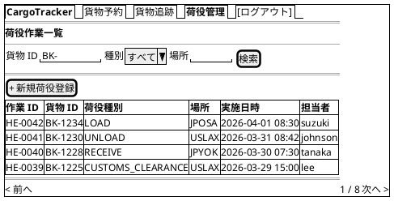

#### 仕様

- **検索フィルタ**: 貨物 ID・荷役種別・場所（港コード）でフィルタリング
- **htmx**: 検索フォームに `hx-get="/handling" hx-target="#handling-list"` で部分更新
- **新規登録**: ROLE_HANDLER のみ表示
- **ページネーション**: 1 ページ 20 件

---

### 航路一覧 (/voyages)

#### ワイヤーフレーム

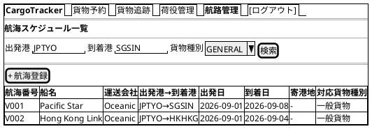

#### 仕様

- **検索フィルタ**: 出発港・到着港・貨物種別でフィルタリング。`ROUTING_IN_PROGRESS` の予約番号指定時は予約の出発地・目的地・貨物種別・希望着日を検索条件へ引き継ぐ。
- **登録・更新**: ROLE_ROUTE_DESIGNER は `/voyages/new` で航海を登録し、`/voyages/{voyageNumber}/edit` で運送区間の日程を入力する。更新時は `/voyages/{voyageNumber}/confirm` で既存内容と更新内容の差分を確認し、「更新する」で上書き、「キャンセル」で変更なしのまま一覧へ戻る。
- **htmx**: 一覧検索は `HX-Request` 時に航海一覧テーブル fragment を返す。
- **経路候補算出**: `/routing/candidates` は htmx fragment として候補テーブル（航海番号・所要日数・経由港・費用）を返す。期限内候補がない場合は条件調整を促す。
- **経路割り当てへの連携**: 経路割り当て画面は `/routing/candidates` を参照して候補を生成する。

---

### 請求書一覧 (/billing/invoices)

#### ワイヤーフレーム


#### 仕様

- **フィルタ**: PaymentStatus（`PENDING`, `CONFIRMED`, `OVERDUE`）・発行日でフィルタリング
- **ステータスバッジ**: `PENDING` は赤、`CONFIRMED` は緑、`OVERDUE` は濃い赤で表示
- **支払期限超過**: 期限超過かつ未払いの場合は行を赤色ハイライト
- **アクセス制御**: ROLE_BILLING のみアクセス可能

---

### 請求書詳細 (/billing/invoices/{invoiceId})

#### ワイヤーフレーム

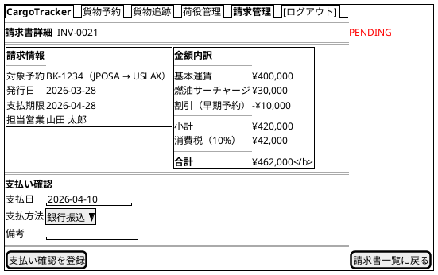

#### 仕様

- **金額内訳**: 基本運賃・サーチャージ・割引・消費税を明細表示
- **US23 精算フロー**: 精算書発行（`POST /billing/invoices` で PaymentStatus = `PENDING`）→ 入金確認（`POST /billing/invoices/{invoiceId}/confirm` で `CONFIRMED`）→ 精算完了（対象予約の BookingStatus が `SETTLED` に遷移）の 3 段階で進行する。本画面は入金確認以降を担う
- **[支払い確認を登録]**: `POST /billing/invoices/{invoiceId}/confirm` を送信。PRG パターンで同画面へリダイレクト
- **確認済み**: PaymentStatus が `CONFIRMED` の場合は支払いフォームを非表示にし、確認日時と精算完了ステータスを表示
- **PDF 出力**: `GET /billing/invoices/{invoiceId}/pdf` で請求書 PDF をダウンロード（将来実装）

---

### 例外登録 (/tracking/{trackingNumber}/exceptions/new)

#### ワイヤーフレーム

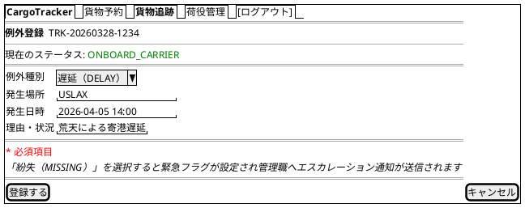

#### 仕様

- **主要アクター**: 追跡管理者（ROLE_TRACKER）。破損・紛失は荷役作業員（ROLE_HANDLER）も登録可能
- **例外種別**: `DELAY`（遅延）/ `DAMAGE`（破損）/ `MISSING`（紛失）から選択
- **登録後**: 貨物状態が `EXCEPTION`（例外発生）に更新され、荷主に例外発生通知が送信される
- **エスカレーション**: 例外種別「紛失」の場合は緊急フラグを設定し、管理職へのエスカレーション通知を送信（US20）
- **登録成功**: PRG パターンで `/tracking/{trackingNumber}/exceptions` へリダイレクト
- **導線**: 追跡詳細画面の `[例外を登録]`（追跡管理者のみ表示）から遷移

---

### 例外一覧・詳細 (/tracking/{trackingNumber}/exceptions)

#### ワイヤーフレーム

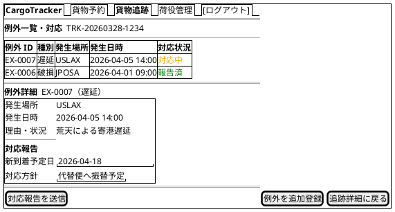

#### 仕様

- **主要アクター**: 追跡管理者（ROLE_TRACKER）
- **例外一覧**: 対象貨物の例外を時系列で一覧表示し、対応状況（対応中 / 報告済）をバッジで表示
- **対応報告**: 新しい到着予定日・対応方針（遅延）または補償方針（破損・紛失）を入力し、`POST /tracking/{trackingNumber}/exceptions/{exceptionId}/report` で荷主へ対応報告を送信（US19・US20）
- **対応履歴**: 送信した対応報告は例外対応履歴として記録される
- **送信成功**: PRG パターンで同画面へリダイレクト
- **導線**: 追跡詳細画面の `[例外を確認]`（追跡管理者のみ表示）から遷移

---

### 通関ステータス (/tracking/{trackingNumber}/customs)

#### ワイヤーフレーム

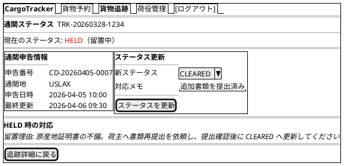

#### 仕様

- **主要アクター**: 追跡管理者（ROLE_TRACKER）。荷役作業員（ROLE_HANDLER）も照会・更新可能
- **CustomsStatus**: `PENDING`（審査中）/ `CLEARED`（通関済）/ `HELD`（留置中）/ `REJECTED`（不可） をバッジで表示
- **ステータス更新**: `POST /tracking/{trackingNumber}/customs` で CustomsStatus を更新。PRG パターンで同画面へリダイレクト
- **HELD 時の対応**: 留置理由と対応手順を表示し、書類再提出などの対応後に CLEARED へ更新する導線を提供
- **REJECTED 時**: 通関不可の理由を表示し、例外登録（返送・廃棄などの対応）への導線を案内
- **導線**: 追跡詳細画面の `[通関を確認]`（追跡管理者・荷役作業員のみ表示）から遷移

---

### 公開貨物追跡 (/public/tracking/{trackingId})

#### ワイヤーフレーム

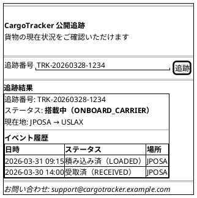

#### 仕様

- **認証**: 不要（Passport のガードを適用せず `/public/**` を全公開する）
- **追跡番号フォーム**: `GET /public/tracking/{trackingId}` でページ表示。結果は同一ページ内に表示
- **404 処理**: 存在しない追跡番号は「該当する貨物が見つかりません。追跡番号を確認の上、再度お試しください」を表示
- **連絡先**: フッターに問い合わせメールアドレスを表示（荷主への導線確保）
- **レスポンシブ**: モバイルファースト（スマートフォンで QR コードから直接アクセスを想定）
- **表示情報の制限**: TransportStatus・最終イベント・現在地のみ（荷主名・住所等の個人情報は非表示）
- **AFTER_COMMIT タイムラグ**: ステータス反映に最大 30 秒かかる旨を画面下部に注記する

---

### htmx 部分更新パターン

#### 追跡ステータス自動更新

追跡詳細画面では、荷物の状態をユーザーがリロードせずに確認できるよう、30 秒ごとに自動更新する。

```html
<!-- 追跡詳細画面のステータスタイムライン部分 -->
<div id="status-timeline"
     hx-get="/tracking/TRK-20260328-1234/status"
     hx-trigger="every 30s"
     hx-swap="innerHTML">
  {/* TSX（StatusTimeline コンポーネント）でサーバーレンダリングされた初期コンテンツ */}
</div>
<p id="last-updated">最終更新: <span>{lastUpdated}</span></p>
```

**サーバー側レスポンス**: `/tracking/{trackingNumber}/status` は HTML フラグメントを返す（`Content-Type: text/html`）。

#### 検索フォームの部分更新

貨物予約一覧・荷役作業一覧の検索フォームは、ページ全体を再読み込みせずに結果テーブルのみを更新する。

```html
<form hx-get="/bookings"
      hx-target="#booking-list"
      hx-swap="outerHTML"
      hx-push-url="true">
  <input name="origin" type="text" placeholder="出発地">
  <input name="destination" type="text" placeholder="目的地">
  <select name="status">...</select>
  <button type="submit">検索</button>
</form>
<div id="booking-list">
  <!-- 検索結果テーブル -->
</div>
```

`hx-push-url="true"` により、検索条件が URL に反映されブラウザ履歴に残る。

#### 経路候補の動的読み込み

航海検索画面で予約条件または検索条件を指定すると、経路候補を動的に読み込む。

```html
<form hx-get="/routing/candidates"
      hx-target="#route-candidates"
       hx-swap="innerHTML">
  <input type="hidden" name="origin" value="JPTYO">
  <input type="hidden" name="destination" value="SGSIN">
  <input type="hidden" name="arrivalDeadline" value="2026-09-30">
  <input type="hidden" name="cargoType" value="GENERAL">
  <button type="submit">経路候補を算出</button>
</form>
```

#### フォームのインラインバリデーション

入力フィールドからフォーカスが外れたタイミング（`blur`）でサーバーサイドバリデーションを実行する。

```html
<input name="origin" type="text"
       hx-post="/api/validate/location"
       hx-trigger="blur"
       hx-target="next .error-message"
       hx-swap="innerHTML">
<span class="error-message text-danger"></span>
```

---

### エラーハンドリング

#### バリデーションエラー表示

- **フィールドレベル**: 各入力フィールドの下に赤字でメッセージ表示（Bootstrap `invalid-feedback`）
- **フォームレベル**: フォーム上部にアラートバナー（`alert-danger`）でまとめて表示
- **TSX**: `ValidationPipe` の例外から得たエラー情報を型付き props（`errors`）として渡し、フィールドごとに表示する

```tsx
<div className="mb-3">
  <label htmlFor="origin" className="form-label">出発地 <span className="text-danger">*</span></label>
  <input type="text" id="origin" name="origin"
         className={`form-control ${errors.origin ? 'is-invalid' : ''}`} />
  {errors.origin && (
    <div className="invalid-feedback">{errors.origin}</div>
  )}
</div>
```

#### フラッシュメッセージ

PRG パターンのリダイレクト後に、操作結果を `connect-flash`（セッション経由の一時メッセージ）でフィードバックする。

| 操作 | メッセージ例 | Bootstrap クラス |
| :--- | :--- | :--- |
| 予約登録成功 | 「貨物予約 BK-1234 を登録しました」 | `alert-success` |
| 経路割り当て成功 | 「経路 V0042 を割り当てました」 | `alert-success` |
| 荷役登録成功 | 「荷役作業 HE-0042 を登録しました」 | `alert-success` |
| 支払い確認成功 | 「請求書 INV-0021 の支払いを確認しました」 | `alert-success` |
| バリデーションエラー | 「入力内容に誤りがあります。確認してください」 | `alert-danger` |
| システムエラー | 「処理中にエラーが発生しました。時間をおいて再試行してください」 | `alert-danger` |

フラッシュメッセージは共通コンポーネント `fragments/Alerts.tsx` で一元管理する。

#### エラーページ

| HTTP ステータス | 画面 | 内容 |
| :--- | :--- | :--- |
| 400 Bad Request | `/error/400` | 不正なリクエスト。入力を確認してください |
| 403 Forbidden | `/error/403` | アクセス権限がありません |
| 404 Not Found | `/error/404` | 指定されたページまたはリソースが見つかりません |
| 500 Internal Server Error | `/error/500` | サーバーエラーが発生しました。管理者に連絡してください |

各エラーページはナビゲーションバーを表示し、ダッシュボードへ戻るリンクを提供する。
NestJS では `ExceptionFilter`（`HttpExceptionFilter`）で例外を捕捉し、対応するエラーページテンプレートを描画する。

#### htmx エラーハンドリング

htmx リクエストがエラーを返した場合は、`htmx:responseError` イベントをキャッチして通知を表示する。

```javascript
document.addEventListener('htmx:responseError', function(event) {
  const status = event.detail.xhr.status;
  const messageEl = document.getElementById('htmx-error-toast');
  if (status === 404) {
    messageEl.textContent = '対象データが見つかりませんでした';
  } else {
    messageEl.textContent = '通信エラーが発生しました。再試行してください';
  }
  messageEl.classList.remove('d-none');
});
```

---

### アクセシビリティ

#### キーボードナビゲーション

- **Tab 順序**: フォーム項目 → 送信ボタン → ナビゲーションの順に自然な Tab 移動
- **Enter キー**: フォーム内でのフォーカス状態でEnterキーを押すと送信
- **Escape キー**: モーダル・確認ダイアログを閉じる
- **スキップリンク**: `<a href="#main-content" class="visually-hidden-focusable">コンテンツにスキップ</a>` をヘッダー先頭に配置

#### ARIA 対応

| 要素 | ARIA 属性 |
| :--- | :--- |
| ナビゲーションバー | `role="navigation" aria-label="メインナビゲーション"` |
| 検索フォーム | `role="search" aria-label="貨物検索"` |
| データテーブル | `role="grid" aria-label="[テーブル名]"` |
| ステータスバッジ | `aria-label="ステータス: ROUTE_PROPOSED"` |
| ローディングインジケーター | `aria-live="polite" aria-busy="true"` |
| エラーメッセージ | `role="alert" aria-live="assertive"` |
| フラッシュメッセージ | `role="status" aria-live="polite"` |

#### htmx と ARIA

htmx の部分更新後に動的コンテンツが更新されることをスクリーンリーダーに通知する。

```html
<!-- 自動更新エリアは aria-live="polite" で通知 -->
<div id="status-timeline"
     aria-live="polite"
     aria-atomic="false"
     hx-get="/tracking/TRK-20260328-1234/status"
     hx-trigger="every 30s">
</div>
```

#### カラーコントラスト

- 通常テキスト: コントラスト比 4.5:1 以上（WCAG AA 準拠）
- 大きいテキスト（18px 以上）: 3:1 以上
- ステータスバッジは色のみに依存せず、テキストラベルを必ず併記

---

## 付録: BookingStatus / TransportStatus 対応表

### BookingStatus バッジ定義

| ステータス | 表示ラベル | Bootstrap クラス | 意味 |
| :--- | :--- | :--- | :--- |
| `PRELIMINARY` | 仮予約 | `badge bg-warning text-dark` | 経路未割り当て |
| `ROUTING_IN_PROGRESS` | 経路設計中 | `badge bg-info text-dark` | 経路設計者へ引き渡し済・経路検討中 |
| `ROUTE_PROPOSED` | 経路提案中 | `badge bg-primary` | 経路割り当て完了・未確認 |
| `CONFIRMED` | 確認済 | `badge bg-success` | 予約確定 |
| `TRACKING_ISSUED` | 追跡番号発行済 | `badge bg-info text-dark` | 追跡番号付与 |
| `IN_TRANSIT` | 輸送中 | `badge bg-primary` | 積み込み済・輸送中 |
| `DELIVERED` | 配送完了 | `badge bg-success` | 配達完了 |
| `SETTLED` | 精算完了 | `badge bg-secondary` | 請求・支払い完了 |
| `CANCELLED` | キャンセル | `badge bg-danger` | キャンセル済 |

### TransportStatus バッジ定義

| ステータス | 表示ラベル | Bootstrap クラス |
| :--- | :--- | :--- |
| `NOT_RECEIVED` | 未受取 | `badge bg-secondary` |
| `RECEIVED` | 受取済 | `badge bg-info text-dark` |
| `LOADED` | 積み込み済 | `badge bg-primary` |
| `ONBOARD_CARRIER` | 搭載中 | `badge bg-primary` |
| `UNLOADED` | 荷降ろし済 | `badge bg-warning text-dark` |
| `AWAITING_CLAIM` | 引取待ち | `badge bg-warning text-dark` |
| `CLAIMED` | 引取完了 | `badge bg-success` |
| `EXCEPTION` | 例外 | `badge bg-danger` |

### HandlingEventType 対応表

荷役種別の列挙値と日本語ラベルを統一する。UI 上の表記は必ず下表の列挙値・ラベルに揃える（`CUSTOMS` 等の略記は使用しない）。

| 列挙値 | 表示ラベル | 意味 |
| :--- | :--- | :--- |
| `RECEIVE` | 受取 | 出発地で貨物を受け取る |
| `LOAD` | 積込 | 航路への積み込み |
| `UNLOAD` | 荷降ろし | 航路からの荷降ろし |
| `CUSTOMS_CLEARANCE` | 通関 | 通関手続き |
| `CLAIM` | 引取 | 荷受人による引き取り |

### CustomsStatus 対応表

| 列挙値 | 表示ラベル | Bootstrap クラス | 意味 |
| :--- | :--- | :--- | :--- |
| `PENDING` | 審査中 | `badge bg-primary` | 通関申告済・審査中 |
| `CLEARED` | 通関済 | `badge bg-success` | 通関完了 |
| `HELD` | 留置中 | `badge bg-warning text-dark` | 書類不備等で留置 |
| `REJECTED` | 不可 | `badge bg-danger` | 通関不可 |

---

## 付録: ロール別画面到達性マトリクス

各ロールが主要画面へナビゲーション（navbar・ダッシュボード・画面内導線）から到達できるかを一覧化する。到達可能な画面は導線を必ず用意し、ロール別の作業入口の欠落を防ぐ。

| 画面 | ROLE_SALES | ROLE_SHIPPER | ROLE_ROUTE_DESIGNER | ROLE_TRACKER | ROLE_HANDLER | ROLE_BILLING |
| :--- | :---: | :---: | :---: | :---: | :---: | :---: |
| ダッシュボード | ○ | ○ | ○ | ○ | ○ | ○ |
| 荷主登録 | ○ | - | - | - | - | - |
| 見積一覧・作成・詳細 | ○ | - | - | - | - | - |
| 貨物予約一覧・登録 | ○ | ○ | ○ (経路設計待ち) | - | - | - |
| 予約詳細 | ○ | ○ | ○ | - | - | - |
| 経路割り当て | - | - | ○ | - | - | - |
| 航路一覧 | - | - | ○ | - | - | - |
| 貨物追跡入力・追跡詳細 | ○ (予約経由) | ○ | ○ | - | - | - |
| 例外登録 | - | - | - | ○ | ○ (破損・紛失) | - |
| 例外一覧・詳細 | - | - | - | ○ | - | - |
| 通関ステータス | - | - | - | ○ | ○ | - |
| 荷役作業一覧 | - | - | - | ○ | ○ | - |
| 荷役作業登録 | - | - | - | - | ○ | - |
| 請求書一覧・詳細 | - | - | - | - | - | ○ |

> 「予約経由」は予約詳細の `[追跡を表示]` から遷移する導線を指す。未認証の荷主・荷受人は公開貨物追跡（`/public/tracking/{trackingId}`）で追跡できる。
