# UI 設計 - 国際貨物輸送管理システム

## 概要

本ドキュメントでは、国際貨物輸送管理システムの UI 設計を定義する。
take-3 の UI 設計を基礎とし、本プロジェクトの要件差分（公開追跡照会 US18・通関管理 US29・キャンセル承認 US30・誤配再設計 US28・アカウント保護 US31）を反映している。

### 設計方針

**OOUX（オブジェクト指向 UI 設計）** をベースに、ユーザーが操作する「オブジェクト」（貨物予約・追跡・荷役・通関申告・航海・請求書）を中心に画面を構成する。各画面はオブジェクトの状態を可視化し、アクターに応じた操作を提供する。

### 技術スタック

| 技術 | 役割 |
| :--- | :--- |
| React 19.x | SPA フレームワーク |
| React Router 7.x | クライアントサイドルーティング |
| TanStack Query 5.x | サーバー状態管理（API データのキャッシュ・ポーリング） |
| Zustand 5.x | クライアント状態管理（認証・UI 状態） |
| Tailwind CSS 4.x | ユーティリティファーストのスタイリング |
| fetch (built-in) | HTTP クライアント（API Gateway 経由で各マイクロサービスに接続） |

### 基本 UX 原則

- **オブジェクト中心**: 一覧 → 詳細 → アクションの自然な流れ
- **状態の可視化**: BookingStatus・TransportStatus・CustomsStatus をバッジで常時表示
- **フィードバック**: 操作成功・失敗はトースト通知で即時フィードバック
- **アクセシビリティ**: ARIA ラベル・キーボードナビゲーション対応
- **導線設計**: ロール別到達性・状態軸の到達性・認証不要画面の入口を DoD に含める（フロントエンドアーキテクチャの導線設計の原則に準拠）

### 認証・認可ポリシー（UI）

- 業務画面はログイン必須とする
- **追跡照会（`/tracking/:trackingNumber`）は認証不要の公開画面とする**（US18）。ログイン画面とポータル（トップ）にも入口を置く
- 未ログインで業務画面にアクセスした場合はログイン画面へリダイレクトする
- ログイン済みで権限のない画面にアクセスした場合は 403 画面を表示する
- 画面表示制御と API 実行可否は同一の RBAC マトリクスに従う

---

## UI オブジェクト定義

| オブジェクト | 主な属性 | ユーザーアクション | 関連オブジェクト |
| :--- | :--- | :--- | :--- |
| **貨物予約（Booking）** | bookingId, 出発地, 目的地, 希望期限, 貨物種別, BookingStatus, RoutingStatus | 新規登録・詳細確認・経路割り当て・確定・キャンセル申請 | 追跡情報, 航海, 荷役履歴, キャンセル申請 |
| **キャンセル申請（CancellationRequest）** | 理由, 状態, 申請者/日時, 陸揚げ地, 承認者/日時 | 申請・承認（陸揚げ地指定）・却下（理由必須） | 貨物予約 |
| **荷主（Shipper）** | shipperCode, 荷主名, メール, 種別（個人/法人）, 割引率 | 新規登録・一覧確認・詳細確認 | 貨物予約 |
| **見積（Estimate）** | estimateId, 出発地, 目的地, 期限, 貨物種別, ルート候補 | 新規作成・一覧確認・詳細確認 | 貨物予約 |
| **追跡情報（Tracking）** | trackingNumber, TransportStatus, 現在地, イベント履歴, 例外 | 追跡番号検索・履歴確認・例外解決 | 貨物予約 |
| **例外イベント（Exception）** | 種別（遅延/破損/紛失/誤配/税関保留）, 発生場所/日時, 解決状況 | 起票・解決記録・一覧確認 | 追跡情報 |
| **荷役作業（HandlingEvent）** | eventId, 貨物 ID, 荷役種別, 場所, 実施日時, 荷受人確認 | 新規登録・一覧確認 | 貨物予約, 通関申告 |
| **通関申告（CustomsDeclaration）** | 申告番号, 追跡番号, CustomsStatus, 申告日時, 状態履歴 | 申告登録・状態更新（理由必須）・履歴確認 | 荷役作業 |
| **航海（Voyage）** | voyageNumber, 出発港, 到着港, 出発予定日, 到着予定日 | 一覧確認・新規登録・更新（差分確認） | 貨物予約 |
| **請求書（Invoice）** | invoiceId, 貨物予約, 金額, 割引, キャンセル料, PaymentStatus | 一覧確認・詳細確認・支払い確認 | 貨物予約 |

---

## 画面一覧

| 画面名 | URL パス | 説明 | 主要アクター | 対応 US |
| :--- | :--- | :--- | :--- | :--- |
| ポータル | `/` | 公開トップ。追跡照会への入口とログイン導線 | 全員（認証不要） | US18 |
| ログイン | `/login` | JWT 認証フォーム。追跡照会への導線あり | 全ロール | US26, US31 |
| ダッシュボード | `/dashboard` | ロール別サマリー・要対応件数 | 全ロール | - |
| 荷主一覧 | `/booking/shippers` | 荷主の一覧・検索 | 営業担当者 | US02, US03 |
| 権限エラー（403） | `/403` | 権限のない画面へのアクセス時に表示。**そのロールのダッシュボードへ戻る導線を置く**（行き止まりにしない） | 全ロール | US26 |
| 荷主登録 | `/booking/shippers/new` | 新規荷主登録フォーム。**同一メールアドレスの荷主が既にある場合は既存荷主を提示し、「既存の荷主を使う」「それでも新規で登録する」の 2 択を出す**（IT1 で確定。詳細は本節末尾） | 営業担当者 | US02, US03 |
| 見積一覧 | `/booking/estimates` | 見積の一覧・検索 | 営業担当者 | US01 |
| 見積作成 | `/booking/estimates/new` | 新規見積フォーム | 営業担当者 | US01 |
| 見積詳細 | `/booking/estimates/:estimateId` | ルート候補一覧 | 営業担当者 | US01 |
| 貨物予約一覧 | `/booking` | 予約済み貨物の一覧・検索 | 荷主、営業担当者 | US04, US05 |
| 貨物予約登録 | `/booking/new` | 新規予約フォーム | 営業担当者 | US04, US05 |
| 予約詳細 | `/booking/:bookingId` | 予約情報・経路・荷役履歴・キャンセル申請履歴・誤配バナー | 荷主、営業担当者、追跡管理者 | US06, US13, US28, US30 |
| キャンセル承認 | `/booking/cancellations` | 承認待ちキャンセル申請の一覧・承認/却下 | 追跡管理者 | US30 |
| 経路設計 | `/routing/design/:bookingId` | 経路候補選択・割り当て（誤配時は現在地起点） | 経路設計者 | US07-US11, US28 |
| 航海スケジュール管理 | `/routing/voyages` | 航海スケジュール一覧 | 経路設計者 | US24, US25 |
| 航海スケジュール登録 | `/routing/voyages/new` | 新規航海登録フォーム（重複時は差分確認） | 経路設計者 | US24, US25 |
| 貨物追跡照会（公開） | `/tracking/:trackingNumber` | 輸送ステータスタイムライン（**認証不要**） | 荷主、荷受人 | US18 |
| 貨物状態管理 | `/tracking/manage` | 状態手動更新・例外一覧・例外解決 | 追跡管理者 | US17, US19, US20, US28 |
| 荷役作業記録 | `/handling` | 荷役イベント登録フォーム（モバイル対応） | 荷役作業員 | US15, US16 |
| 荷役作業一覧 | `/handling/list` | 荷役履歴一覧・検索 | 荷役作業員、追跡管理者 | US15 |
| 通関管理 | `/customs` | 通関申告一覧・検索（留置 3 日超の警告表示） | 荷役作業員、追跡管理者 | US29 |
| 通関申告登録 | `/customs/new` | 申告番号・日時の登録 | 荷役作業員 | US29 |
| 通関申告詳細 | `/customs/:declarationId` | 状態更新（理由必須）・状態変更履歴 | 追跡管理者 | US29 |
| 精算管理 | `/billing` | 請求書一覧・フィルタ | 経理担当者 | US21-US23 |
| 請求書詳細 | `/billing/:invoiceId` | 請求書詳細・キャンセル料内訳・支払い確認 | 経理担当者 | US23 |

---

## 共通レイアウト設計

### ナビゲーション構成

全画面共通のサイドバーナビゲーションを左側に配置する。ロールに応じてメニュー項目を表示制御する。

| メニュー項目 | 遷移先 | 表示ロール |
| :--- | :--- | :--- |
| ダッシュボード | `/dashboard` | 全ロール |
| 荷主管理 | `/booking/shippers` | ROLE_SALES |
| 見積管理 | `/booking/estimates` | ROLE_SALES |
| 貨物予約 | `/booking` | ROLE_SALES（[ADR-008](../adr/008-no-user-shipper-link-in-it2.md) により ROLE_SHIPPER は US18 まで開かない） |
| キャンセル承認 | `/booking/cancellations` | ROLE_TRACKER |
| 航海スケジュール | `/routing/voyages` | ROLE_ROUTING |
| 経路設計 | `/routing/design` | ROLE_ROUTING |
| 貨物追跡 | `/tracking` | 全ロール（公開画面への導線） |
| 貨物状態管理 | `/tracking/manage` | ROLE_TRACKER |
| 荷役管理 | `/handling` | ROLE_HANDLER, ROLE_TRACKER |
| 通関管理 | `/customs` | ROLE_HANDLER, ROLE_TRACKER |
| 精算管理 | `/billing` | ROLE_ACCOUNTANT |
| ログアウト | - | 全ロール |

> **ロール名は IT1 で確定した（2026-08-19）**。経路設計者は独立したロール `ROLE_ROUTING` とする。
> 根拠: 要件定義のアクター一覧で経路設計者は営業担当者と別のアクターであり、`ROLE_SALES` が兼ねると
> 営業が航海スケジュール登録・経路確定まで行えてしまい職掌分離が崩れる。
> 全 7 値: `ROLE_SHIPPER` / `ROLE_SALES` / `ROLE_ROUTING` / `ROLE_HANDLER` / `ROLE_TRACKER` / `ROLE_ACCOUNTANT` / `ROLE_ADMIN`
> （domain-model.md・architecture_backend.md・non_functional.md と同一変更で更新済み）。

> **荷主ロールの予約参照について（[ADR-008](../adr/008-no-user-shipper-link-in-it2.md)・2026-08-20）**:
> 当初は予約参照を `ROLE_SALES` と `ROLE_SHIPPER` の両方に開く設計だったが、authms の利用者と bookingms の
> 荷主を結ぶキーがどこにも無く、「自分の予約だけ」に絞り込めない。この状態で開くと**全荷主の予約が見える**ため、
> 紐付けを設計する US18（IT6）まで `ROLE_SHIPPER` には開かない。US18 で紐付けと同時に広げ直す。

> **段階実装の注記**: ポータル（`/`）の追跡番号入力欄は、**IT1 では非活性**とする（追跡照会 US18 は Release 1.0）。
> IT1 ではログイン導線と「未認証で 200 を返す入口」としての役割のみを担い、US18 の実装時に活性化する。

### 画面/API 権限マトリクス

| 機能 | 画面パス | API プレフィックス | 実行ロール |
| :--- | :--- | :--- | :--- |
| 荷主・見積管理 | `/booking/shippers*`, `/booking/estimates*` | `/api/v1/shippers`, `/api/v1/estimates` | `ROLE_SALES` |
| 予約管理 | `/booking*` | `/api/v1/bookings` | `ROLE_SALES`（**`ROLE_SHIPPER` は開かない**。[ADR-008](../adr/008-no-user-shipper-link-in-it2.md)） |
| キャンセル承認 | `/booking/cancellations` | `/api/v1/bookings/*/cancellation/approve|reject` | `ROLE_TRACKER` |
| 航海・経路設計 | `/routing*` | `/api/v1/voyages`, `/api/v1/routes` | `ROLE_ROUTING` |
| 追跡照会（公開） | `/tracking/:trackingNumber` | `GET /api/v1/public/tracking/*` | **認証不要** |
| 貨物状態管理・例外 | `/tracking/manage` | `PUT /api/v1/tracking/*`, `/exceptions` | `ROLE_TRACKER` |
| 荷役管理 | `/handling*` | `/api/v1/handling` | `ROLE_HANDLER`, `ROLE_TRACKER`（参照のみ） |
| 通関管理 | `/customs*` | `/api/v1/customs` | `ROLE_HANDLER`（申告登録）, `ROLE_TRACKER`（状態更新） |
| 精算管理 | `/billing*` | `/api/v1/billing` | `ROLE_ACCOUNTANT` |

### 共通レイアウト ワイヤーフレーム

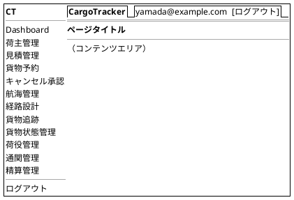

---

## 画面遷移図

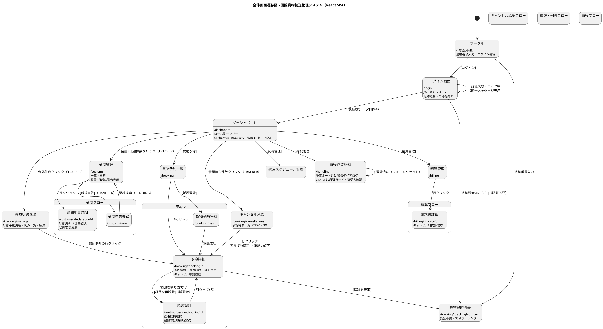

---

## 画面詳細設計

> 荷主・見積・予約一覧/登録・航海スケジュール・精算の各画面は take-3 の設計を踏襲する（API パスは `/api/v1/` に統一）。以下では take-7 で追加・変更した画面を中心に定義する。

### ポータル (/) ― 追加

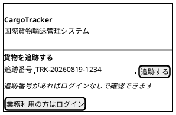

- 認証不要。追跡番号を入力すると `/tracking/:trackingNumber` に遷移する
- 業務利用者は `[ログイン]` から `/login` へ

### ログイン画面 (/login) ― 変更

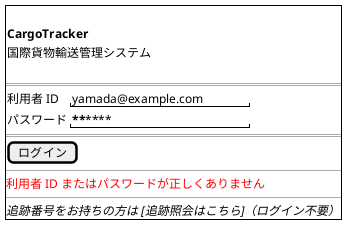

#### 仕様

- `POST /api/v1/auth/login` で JWT トークンを取得し Zustand ストアに保存
- **エラーメッセージは認証情報誤り・アカウントロック中・無効化アカウントのすべてで同一文言**「利用者 ID またはパスワードが正しくありません」を表示する（US31。アカウントの存在有無を攻撃者に教えない）
- ロック発生時の通知はメール等の帯域外で行う。画面には出さない
- ログイン成功後: ロールに応じたダッシュボードへ遷移
- 追跡照会（認証不要）への導線を必ず配置する

### ダッシュボード (/dashboard) ― 変更

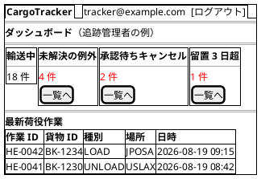

#### 仕様

- **ロール別ウィジェット**: 表示カードはロールで切り替える
  - 営業担当者: 予約件数・未割り当て・キャンセル申請中
  - 追跡管理者: 未解決例外・承認待ちキャンセル・留置 3 日超（**件数クリックで該当一覧へ直接遷移**）
  - 荷役作業員: 本日の荷役件数・通関待ち貨物
  - 経理担当者: 未払い請求・期限超過
- 要対応件数のカードは対応が必要な状態のレコード一覧へ 1 クリックで遷移できる（状態軸の到達性）

### 荷主登録 (/booking/shippers/new) ― 追加（IT1）

同一メールアドレスの荷主が既にある場合の確認。**エラーではなく問いかけ**として扱う。

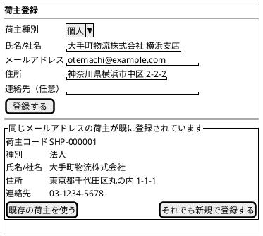

#### 仕様

- `POST /api/v1/shippers` が 409 を返したときに表示する（契約は architecture_backend.md を参照）
- **種別を必ず示す。** 個人か法人かは「同じ相手か別会社か」を判断する一番大きな手がかりである
- 「既存の荷主を使う」→ そのメールアドレスで**絞り込んだ**荷主一覧へ遷移する。絞り込まずに戻すと、営業担当者は用のある荷主を全件から探し直すことになる
- 「それでも新規で登録する」→ `registerAnyway: true` で再送し、別の荷主コードで登録する

### 荷主一覧 (/booking/shippers) ― 追加（IT1）

- **新しく登録した順**に並べる。営業の使い方は「登録した直後に一覧へ戻って入ったか確かめる」であり、登録順だと今入れた 1 件が常に最下部に沈む
- 件数を表示する。絞り込み中は条件も併記する（「絞り込めていないのに 0 件」という読み違いを防ぐ）
- 絞り込み条件は URL のクエリに持つ。重複確認から遷移したときに、その荷主に絞られた状態で開けるようにするため

### 予約詳細 (/booking/:bookingId) ― 変更

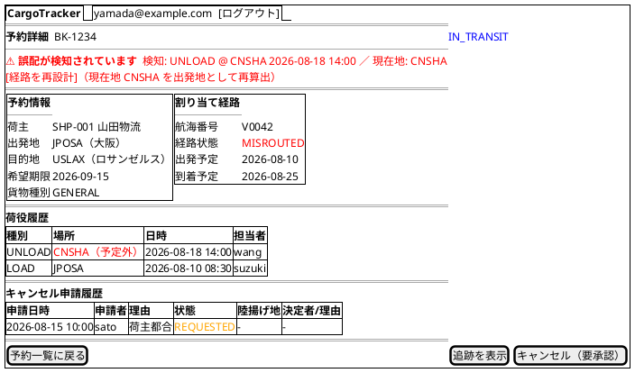

#### 仕様

- **誤配バナー（US28）**: RoutingStatus が `MISROUTED` の場合、検知した荷役イベント（場所・日時）と貨物の現在地を警告バナーで表示する。`[経路を再設計]` は `ROLE_ROUTING` に表示し、**現在地を出発地**・目的地と希望期限は元の予約から引き継いだ経路設計画面へ遷移する
- **キャンセルボタンの出し分け（US30）**: 集約の述語（キャンセル可否）をそのまま使う
  - 輸送開始前（PRELIMINARY〜TRACKING_ISSUED）: `[キャンセル]`（即時確定・理由必須）
  - `IN_TRANSIT`: `[キャンセル（要承認）]`（申請のみ。理由必須）
  - `DELIVERED` 以降: ボタン非表示
- **キャンセル申請履歴**: 申請・承認・却下の履歴（日時・実行者・理由）を表示する
- `[追跡を表示]` は公開追跡画面（認証不要）へ遷移する

### キャンセル承認 (/booking/cancellations) ― 追加

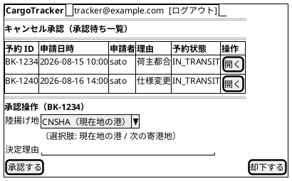

#### 仕様

- `ROLE_TRACKER` のみアクセス可。承認待ち（`status = REQUESTED`）の申請を一覧表示する
- **承認**: 陸揚げ地（現在地の港または次の寄港地）の指定が必須。承認するとキャンセルが確定し、陸揚げ地への荷降しが手配され、荷主に通知される
- **却下**: 決定理由の入力が必須。却下すると予約は輸送中のまま維持され、理由が申請者と荷主に通知される
- ダッシュボードの「承認待ちキャンセル」件数から直接遷移できる

### 貨物追跡照会 (/tracking/:trackingNumber) ― 変更（公開画面）

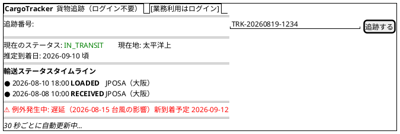

#### 仕様

- **認証不要**。追跡番号のみで照会できる（US18）。担当者名等の内部情報は表示しない
- 未発見時は「追跡番号が見つかりません」と表示する
- 例外発生中は種別と対応状況（新到着予定等）を表示する。通関保留中は「通関手続き中」を表示する
- `refetchInterval: 30000` によるポーリングで自動更新

### 貨物状態管理 (/tracking/manage) ― 追加

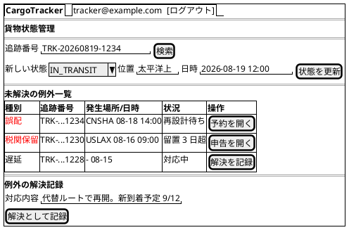

#### 仕様

- 状態手動更新（US17）: 追跡番号を指定して状態・位置・日時を更新する。更新後は追跡イベントが履歴に記録され荷主に通知される
- 例外一覧（US19/20/28）: 未解決の例外を種別バッジ付きで一覧表示。誤配は該当予約詳細へ、税関保留は該当申告詳細へ 1 クリックで遷移する
- 解決記録: 対応内容を入力して解決を記録する。解決後も例外の事実は履歴として残る
- 例外の手動起票（遅延・破損・紛失）もこの画面から行う。紛失は緊急フラグが自動設定される

### 荷役作業記録 (/handling) ― 変更

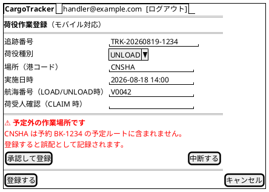

#### 仕様

- **荷役種別**: `RECEIVE` / `LOAD` / `UNLOAD` / `CLAIM` の 4 種（通関は通関管理画面で扱う）
- **予定ルート外警告（US28）**: 作業場所が予定ルートに含まれない場合、登録前に警告ダイアログを表示する。承認して登録すると誤配として自動起票される
- **CLAIM の通関ガード（US29）**: 通関状態が `CLEARED` でない貨物への CLAIM は API がエラーを返し、現在の通関状態（例:「留置中のため引き取りできません」）を表示する
- **CLAIM の荷受人確認（US16）**: 種別 `CLAIM` 選択時のみ荷受人確認（署名または確認コード）フィールドを表示し必須とする
- 追跡番号が存在しない場合はエラーを表示する

### 通関管理 (/customs) ― 追加

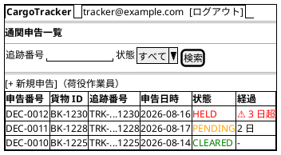

### 通関申告詳細 (/customs/:declarationId) ― 追加

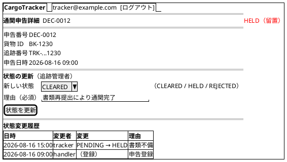

#### 仕様（通関管理・詳細共通）

- **申告登録**（`/customs/new`・荷役作業員）: 追跡番号・申告番号・申告日時を入力して登録する。初期状態は `PENDING`
- **状態更新**（追跡管理者）: `CLEARED` / `HELD` / `REJECTED` に更新できる。**理由の入力は必須**で、状態変更履歴（日時・変更者・理由）が申告詳細に表示される
- `HELD` になると税関保留の例外が自動起票される。`HELD` のまま 3 日を超えた申告は一覧で警告表示され、追跡管理者のダッシュボードに件数が現れる
- `CLEARED` になると荷主・荷受人に通関完了が通知され、CLAIM 荷役が可能になる。`REJECTED` は荷主に返送/廃棄の判断を求める通知を送る
- 一覧は貨物 ID・追跡番号・通関状態で検索できる

### 請求書詳細 (/billing/:invoiceId) ― 変更

金額内訳にキャンセル料を追加する。

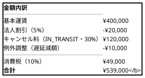

- キャンセル確定した予約の請求はキャンセル料（キャンセル時の予約状態・料率）を根拠付きで表示する（US30）
- 例外（遅延・破損等）の料金調整は明細行として表示する（US21）

---

## インタラクション設計

### React Query によるデータ取得パターン

take-3 のパターン（ポーリング・URL 同期・Mutation + invalidateQueries）を踏襲する。API パスは `/api/v1/` に統一する。

```tsx
// 公開追跡（認証ヘッダなしで呼べるクライアントを使用）
export function usePublicTracking(trackingNumber: string) {
  return useQuery({
    queryKey: ['tracking', trackingNumber],
    queryFn: () => publicApiClient.get<TrackingInfo>(`/api/v1/public/tracking/${trackingNumber}`),
    refetchInterval: 30000,
    enabled: !!trackingNumber,
  });
}

// 承認待ちキャンセル（ダッシュボード件数と一覧で共有）
export function usePendingCancellations() {
  return useQuery({
    queryKey: ['cancellations', 'pending'],
    queryFn: () => apiClient.get<CancellationRequest[]>('/api/v1/bookings/cancellations?status=REQUESTED'),
  });
}
```

### トースト通知

| 操作 | メッセージ例 | 種別 |
| :--- | :--- | :--- |
| 予約登録成功 | 「貨物予約 BK-1234 を登録しました」 | success |
| キャンセル申請 | 「キャンセルを申請しました（追跡管理者の承認待ち）」 | info |
| キャンセル承認 | 「BK-1234 のキャンセルを承認しました（陸揚げ地: CNSHA）」 | success |
| キャンセル却下 | 「BK-1234 のキャンセル申請を却下しました」 | info |
| 誤配登録 | 「予定外の場所で登録されたため、誤配として起票しました」 | warning |
| 通関状態更新 | 「DEC-0012 を CLEARED に更新しました」 | success |
| CLAIM 拒否 | 「通関が完了していないため引き取りできません（現在: 留置）」 | error |
| バリデーションエラー | 「入力内容に誤りがあります」 | error |
| 認証エラー | 「セッションが切れました。再ログインしてください」 | error |

### エラーハンドリング

- 401: 認証ストアをクリアしてログイン画面へ（公開追跡画面は対象外）
- 403: 「この操作を行う権限がありません」画面を表示
- 409: 状態競合（例: 既に承認済みのキャンセル申請）はメッセージ表示のうえ最新データを再取得
- 422: フォームフィールドにインラインエラー表示
- ページ単位の Error Boundary で予期しないエラーの復旧 UI を表示

---

## アクセシビリティ

take-3 の方針（キーボードナビゲーション・ARIA・カラーコントラスト WCAG AA）を踏襲する。追加事項：

- 警告ダイアログ（誤配・通関ガード）は `role="alertdialog"` とし、フォーカスをダイアログ内にトラップする
- ステータスバッジ・警告は色のみに依存せずテキストラベルを必ず併記する
- 荷役作業記録はモバイル利用を想定し、タップ領域 44px 以上・数値入力は適切な `inputmode` を指定する

---

## 付録: ステータスバッジ定義

### BookingStatus バッジ定義

| ステータス | 表示ラベル | Tailwind クラス |
| :--- | :--- | :--- |
| `PRELIMINARY` | 仮予約 | `bg-yellow-100 text-yellow-800` |
| `ROUTE_PROPOSED` | 経路提案済 | `bg-blue-100 text-blue-800` |
| `CONFIRMED` | 確認済 | `bg-green-100 text-green-800` |
| `TRACKING_ISSUED` | 追跡番号発行済 | `bg-cyan-100 text-cyan-800` |
| `IN_TRANSIT` | 輸送中 | `bg-blue-100 text-blue-800` |
| `DELIVERED` | 配送完了 | `bg-green-100 text-green-800` |
| `SETTLED` | 精算完了 | `bg-gray-100 text-gray-800` |
| `CANCELLED` | キャンセル | `bg-red-100 text-red-800` |

### TransportStatus バッジ定義

| ステータス | 表示ラベル | Tailwind クラス |
| :--- | :--- | :--- |
| `NOT_RECEIVED` | 未受取 | `bg-gray-100 text-gray-800` |
| `RECEIVED` | 受取済 | `bg-cyan-100 text-cyan-800` |
| `LOADED` | 積み込み済 | `bg-blue-100 text-blue-800` |
| `IN_TRANSIT` | 輸送中 | `bg-blue-100 text-blue-800` |
| `UNLOADED` | 荷降ろし済 | `bg-yellow-100 text-yellow-800` |
| `AWAITING_CLAIM` | 引取待ち | `bg-yellow-100 text-yellow-800` |
| `DELIVERED` | 引取完了 | `bg-green-100 text-green-800` |
| `MISROUTED` | 誤配 | `bg-red-100 text-red-800` |

### CustomsStatus バッジ定義

| ステータス | 表示ラベル | Tailwind クラス |
| :--- | :--- | :--- |
| `PENDING` | 審査中 | `bg-orange-100 text-orange-800` |
| `CLEARED` | 通関済 | `bg-green-100 text-green-800` |
| `HELD` | 留置 | `bg-red-100 text-red-800` |
| `REJECTED` | 不可 | `bg-red-200 text-red-900` |

### CancellationStatus バッジ定義

| ステータス | 表示ラベル | Tailwind クラス |
| :--- | :--- | :--- |
| `REQUESTED` | 承認待ち | `bg-orange-100 text-orange-800` |
| `APPROVED` | 承認済 | `bg-red-100 text-red-800` |
| `REJECTED` | 却下 | `bg-gray-100 text-gray-800` |

### PaymentStatus バッジ定義

| ステータス | 表示ラベル | Tailwind クラス |
| :--- | :--- | :--- |
| `PENDING` | 未払い | `bg-red-100 text-red-800` |
| `CONFIRMED` | 支払済 | `bg-green-100 text-green-800` |
| `OVERDUE` | 期限超過 | `bg-red-200 text-red-900` |
| `REFUNDED` | 返金済 | `bg-gray-100 text-gray-800` |

---

## 参照

- [要件定義書](../requirements/requirements_definition.md)
- [ユーザーストーリー](../requirements/user_story.md)
- [フロントエンドアーキテクチャ設計](architecture_frontend.md)
- [ドメインモデル設計](domain-model.md)
- [UI 設計ガイド](../reference/UI設計ガイド.md)
