# UI 設計 - 国際貨物輸送管理システム

## 概要

オブジェクト指向 UI 設計（OOUX）に基づき、業務オブジェクトを中心に画面を設計する。コンテキスト境界（Booking / Routing / Tracking / Handling / Billing / Auth）に対応するナビゲーションを定義し、各オブジェクトについてコレクションビュー（一覧）とシングルビュー（詳細）を提供する。

CQRS バックエンド（[`architecture_backend.md`](architecture_backend.md)）と整合させるため、画面側でも Command（書き込み）と Query（読み取り）の流れを明確に分離する。結果整合性に伴う **コマンド受領 → Read Model 反映待ち** の遷移を「処理中」「反映済み」のフィードバックで吸収する。

## OOUX による業務オブジェクトの整理

| オブジェクト | 属性（主要） | アクション | 関係 |
| :--- | :--- | :--- | :--- |
| 見積（Quotation） | 見積番号・出発地・目的地・期限・概算料金 | 作成 / 表示 / ルート確定 / 失効 | 荷主 (N:1)、予約 (1:0..1) |
| 荷主（Shipper） | 荷主 ID・種別・名前・連絡先・契約情報 | 登録 / 表示 / 連絡先更新 / 法人契約付与 | 見積・予約・請求 (1:N) |
| 予約（Cargo） | 予約 ID・荷主・経路・状態・追跡番号 | 登録 / 経路割当 / 経路変更 / 確定 / キャンセル | 荷主 (N:1)、追跡 (1:0..1)、請求 (1:0..1)、航海 (N:N via Leg) |
| 航海（Voyage） | 航海番号・運送会社・出発日・到着日・寄港地 | 登録 / 更新 / キャンセル | 予約 (Leg) (1:N) |
| 経路候補（RouteCandidate） | 経由港・所要日数・費用 | 算出 / 選択 | 予約 (N:1) |
| 追跡情報（TrackingActivity） | 追跡番号・現在状態・現在位置・到着予定 | 状態更新 / 例外登録 / 例外解決 | 予約 (1:1)、荷役 (1:N)、例外 (1:N) |
| 追跡例外（TrackingException） | 例外 ID・種別・発生場所・対応状態 | 登録 / 対応 / 解決 | 追跡 (N:1) |
| 荷役作業（HandlingActivity） | 活動 ID・種別・作業日時・港湾 | 登録 | 追跡 (N:1 via 追跡番号) |
| 請求書（Invoice） | 請求書 ID・基本料金・割引・合計・支払期限 | 算出 / 割引適用 / 発行 / 入金記録 | 予約 (1:1)、荷主 (N:1) |
| ユーザー（User） | ユーザー ID・ユーザー名・ロール | ログイン / ログアウト | （クロスカット） |

ナビゲーションは **左サイドナビ + トップヘッダ** の構成を採用する。ロール別に表示メニューを制御し、業務オブジェクト単位でセクションを分ける。

## 画面一覧

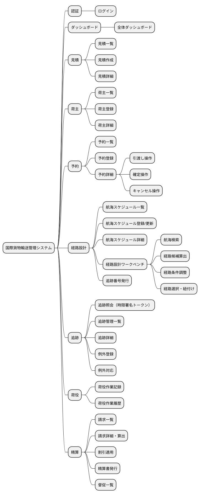

### 主要画面一覧表

| ID | 画面名 | パス | 対応 UC | ロール | OOUX 種別 |
| :--- | :--- | :--- | :--- | :--- | :--- |
| S00 | ログイン | `/login` | - | 全 | フォーム |
| S01 | ダッシュボード | `/dashboard` | - | 全 | サマリ |
| S02 | 見積一覧 | `/quotes` | UC01 | 営業 | コレクション |
| S03 | 見積作成 | `/quotes/new` | UC01 | 営業 | フォーム |
| S04 | 見積詳細 | `/quotes/:id` | UC01 | 営業 | シングル |
| S05 | 荷主一覧 | `/shippers` | UC02 | 営業・経理 | コレクション |
| S06 | 荷主登録 | `/shippers/new` | UC02 | 営業 | フォーム |
| S07 | 荷主詳細 | `/shippers/:id` | UC02 | 営業・経理 | シングル |
| S08 | 予約一覧 | `/bookings` | UC03, UC04 | 営業 | コレクション |
| S09 | 予約登録 | `/bookings/new` | UC03 | 営業 | フォーム |
| S10 | 予約詳細 | `/bookings/:id` | UC04, UC11 | 営業 | シングル |
| S11 | 航海スケジュール一覧 | `/routing/voyages` | UC05, UC19 | 経路設計 | コレクション |
| S12 | 航海スケジュール登録/更新 | `/routing/voyages/new`、`/routing/voyages/:vn/edit` | UC19 | 経路設計 | フォーム |
| S13 | 航海スケジュール詳細 | `/routing/voyages/:vn` | UC05, UC19 | 経路設計 | シングル |
| S14 | 経路設計ワークベンチ | `/routing/design/:bookingId` | UC05〜UC10, UC12 | 経路設計 | 複合 |
| S15 | 追跡照会（時限署名トークン） | `/tracking/:trackingNumber?token=<JWT>` | UC15 | 荷主・荷受人 | シングル |
| S16 | 追跡管理一覧 | `/tracking` | UC14, UC16 | 追跡管理 | コレクション |
| S17 | 追跡詳細・管理 | `/tracking/:trackingNumber/manage` | UC14, UC16 | 追跡管理 | シングル |
| S18 | 例外登録 | `/tracking/:trackingNumber/exceptions/new` | UC16 | 追跡管理・荷役 | フォーム |
| S19 | 例外対応一覧 | `/tracking/exceptions` | UC16 | 追跡管理 | コレクション |
| S20 | 荷役作業記録 | `/handling/new` | UC13 | 荷役 | フォーム |
| S21 | 荷役作業履歴 | `/handling` | UC13 | 荷役・追跡管理 | コレクション |
| S22 | 請求一覧 | `/billing` | UC17, UC18 | 経理 | コレクション |
| S23 | 請求詳細・算出 | `/billing/:invoiceId` | UC17 | 経理 | シングル |
| S24 | 精算書発行 | `/billing/:invoiceId/issue` | UC18 | 経理 | フォーム |
| S25 | 督促一覧 | `/billing/overdue` | UC18（拡張） | 経理 | コレクション |
| S26 | エラー / 共通 | `/error/*` | - | 全 | システム |

## ロール別ナビゲーション

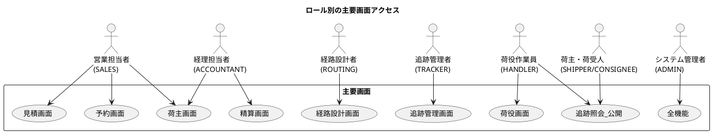

## 画面遷移図

### 全体遷移（業務フロー視点）

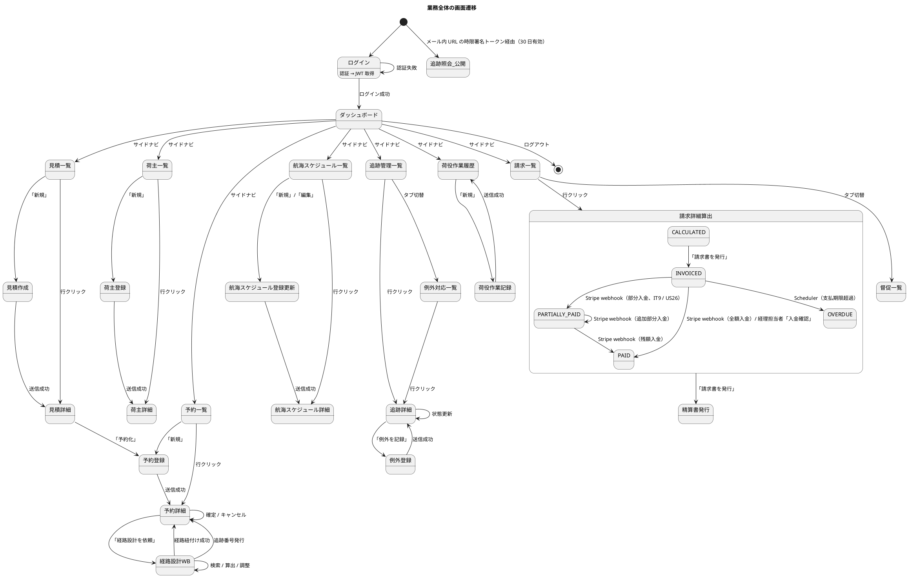

### 予約フロー（UC03 → UC11）の遷移

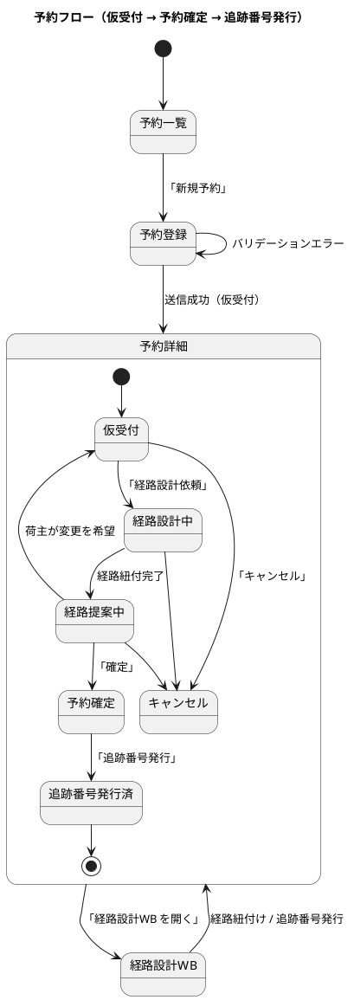

### 経路設計ワークベンチ内の遷移

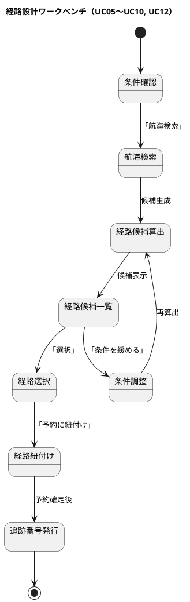

### 追跡 / 例外フロー

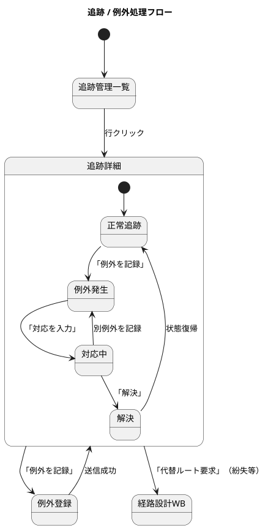

## 画面イメージ（PlantUML salt 図）

### S00: ログイン

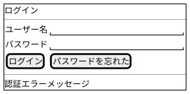

### S01: ダッシュボード

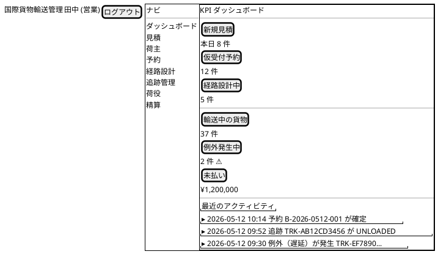

### S02: 見積一覧（コレクションビュー）

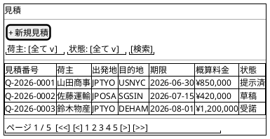

### S03: 見積作成（フォーム）

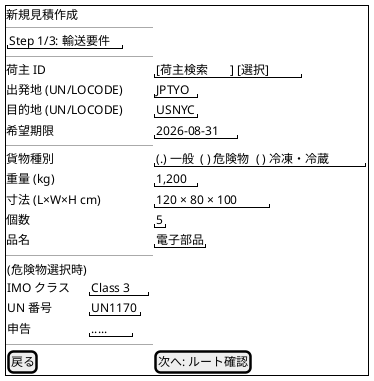

### S04: 見積詳細（シングルビュー）

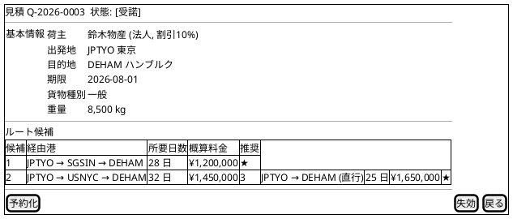

### S05: 荷主一覧（コレクションビュー）

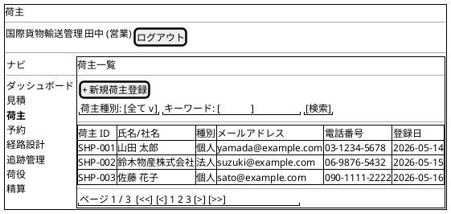

### S06: 荷主登録（フォームビュー）

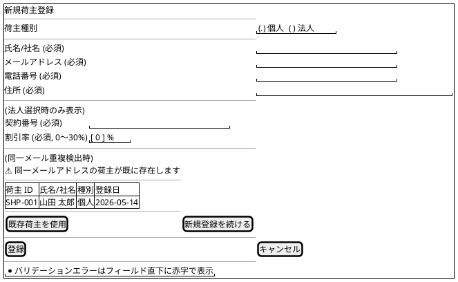

### S07: 荷主詳細（シングルビュー）

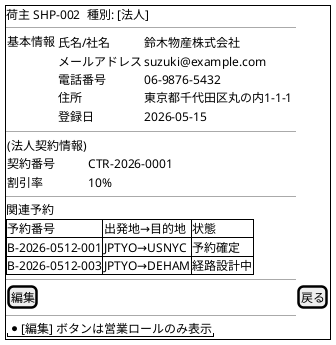

### S08: 予約一覧

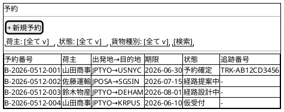

### S10: 予約詳細（シングルビュー + アクション）

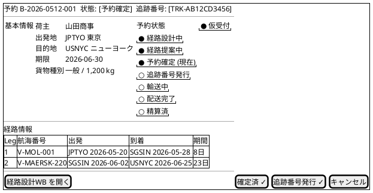

### S14: 経路設計ワークベンチ

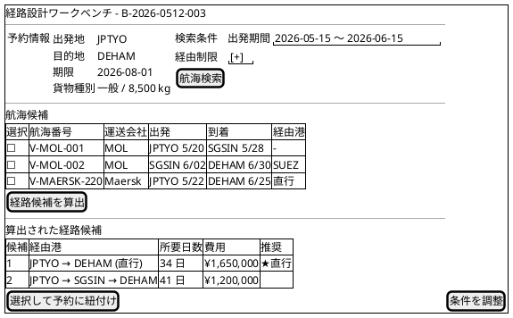

### S15: 追跡照会（時限署名トークン、荷主・荷受人向け）

**アクセス方式**: 荷主・荷受人へのメール通知に含まれる URL（`/tracking/{trackingNumber}?token=<JWT>`）からアクセス。トークンは追跡番号と権限主体を含み、有効期限 **30 日**（配送完了後 7 日で自動失効）。ログイン不要だが、URL を知らない第三者は閲覧不可。

| 項目 | 仕様 |
| :--- | :--- |
| トークン形式 | JWT (HS256)、Claims: `tn`（追跡番号）、`sub`（荷主 ID or 荷受人 ID）、`exp`（有効期限）、`iat`、`role`(`SHIPPER` or `CONSIGNEE`) |
| 署名鍵 | AWS Secrets Manager 管理、四半期ローテーション |
| トークン発行タイミング | 追跡番号発行時（UC12）+ 例外発生時（UC16） |
| 配信方法 | NotificationAcl 経由でメール送信、SMS は将来 |
| 失効 | 有効期限切れ・配送完了 + 7 日経過・荷主側で手動失効可 |
| トークン検証失敗時 | 403 ページ → 「リンクの有効期限が切れています。営業担当者にお問い合わせください」 |
| レート制限 | 同一 IP から 60 req/min、超過は 429 |

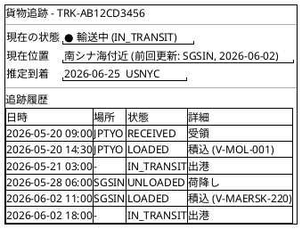

### S17: 追跡詳細・管理

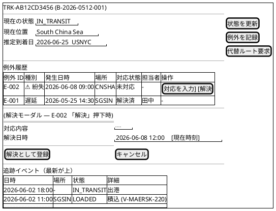

> **例外履歴の動作**:
> - `対応状態 = 未対応 / 対応中` の行にのみ `[対応を入力]` `[解決]` ボタンを表示。解決済みの行はボタン非表示
> - `[対応を入力]` は対応内容を記録するが解決扱いにしない（複数回の報告に対応）
> - `[解決]` 押下でインライン解決モーダルを表示。`PATCH /exceptions/{exceptionId}/resolve` を呼び出す
> - escalation 中（紛失）の行は ⚠ アイコンと警告色で強調表示
> - 「誤配送 False」は通常時非表示。True のときだけ赤バッジで表示

### S18: 例外登録

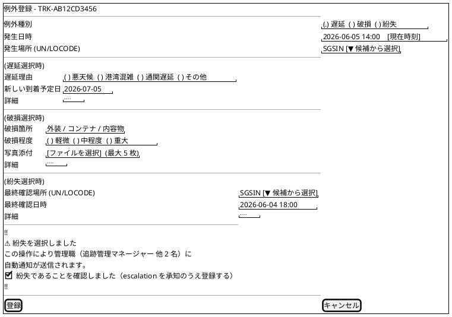

> **フォーム動作**:
> - 発生日時のデフォルトは現在時刻。`[現在時刻]` ボタンで随時リセット可能
> - 発生場所は UN/LOCODE オートコンプリート（S20 の LocationSelector と共通コンポーネント）
> - 種別変更時に対応するサブフォームが動的展開・折りたたみ
> - 紛失選択時の確認チェックボックスは必須（未チェック時は「登録」ボタン無効）
> - 「登録」押下後、紛失の場合はさらに確認モーダル（「○○に通知します。よろしいですか？」）を表示

### S19: 例外対応一覧

```plantuml
@startsalt
{+
  例外対応一覧
  ---
  {
    "種別: [全て v]" | "対応状態: [未対応 v]" | "期間: [全て v]" | "[検索]"
  }
  ---
  {#
    ! | 例外 ID | 追跡番号 | 種別 | 発生日時 | 経過時間 | 発生場所 | 対応状態 | 担当者
    ⚠ | E-005 | TRK-GH9012... | 紛失 | 2026-06-08 09:00 | 3時間前 | CNSHA | 未対応 | -
    . | E-004 | TRK-EF7890... | 遅延 | 2026-06-07 14:30 | 昨日 | SGSIN | 対応中 | 田中
    . | E-003 | TRK-CD5678... | 破損 | 2026-06-06 11:00 | 2日前 | JPOSA | 未対応 | -
    . | E-002 | TRK-AB1234... | 遅延 | 2026-06-05 08:00 | 3日前 | JPTYO | 解決済 | 鈴木
  }
  ---
  {
    "未対応 3 件 (うち escalation 中 1 件)" |
    "ページ 1 / 1  [<<] [<] 1 [>] [>>]"
  }
}
@endsalt
```

> **注意**:
> - 初期表示は「対応状態: 未対応」フィルタ適用済み。escalation 中（紛失）の行は ⚠ アイコンと警告色で強調表示する
> - ソート順: escalation 中を最上段に固定し、同一グループ内は発生日時の古い順（SLA リスク順）
> - 行クリック → S17（追跡詳細・管理）に遷移
> - タブに未対応件数バッジを表示（例: 「例外対応 (3)」）

### S20: 荷役作業記録

```plantuml
@startsalt
{+
  荷役作業記録
  ---
  追跡番号 | "TRK-AB12CD3456" [スキャン]
  ---
  ' 追跡番号が確定すると貨物概要が表示される
  {
    貨物 | B-2026-0512-001 (山田商事, JPTYO→USNYC)
    現在状態 | RECEIVED
    現在地 | JPTYO
    次の予定 | LOADED @ JPTYO (V-MOL-001)
  }
  ---
  作業種別 | "( ) 受領  (.) 積込  ( ) 荷降し  ( ) 引取  ( ) 税関通過"
  作業場所 (UN/LOCODE) | "JPTYO"
  航海番号 (LOAD/UNLOAD 時必須) | "V-MOL-001"
  作業日時 | "2026-05-20 14:30"
  ---
  {(引取選択時)
    荷受人氏名 | "John Doe"
    確認方法 | "( ) 署名画像  (.) 確認コード"
    確認コード | "AX9-2K7"
  }
  ---
  [登録] | [キャンセル]
}
@endsalt
```

### S23: 請求詳細・算出

```plantuml
@startsalt
{+
  請求 INV-2026-0001  状態: [PARTIALLY_PAID]
  ---
  {
    予約 | B-2026-0512-001
    荷主 | 山田商事 (個人)
    通貨 | JPY
  } |
  {
    基本料金 | ¥1,650,000
    割引 (-) | ¥0
    調整 (例外補償等) | ¥-30,000
    ----
    合計 | ¥1,620,000
    入金済 (-) | ¥800,000
    ----
    残額 | ¥820,000
  }
  ---
  料金内訳
  {#
    種別 | 説明 | 金額
    BASIC | 基本料金（重量・距離） | ¥1,500,000
    BASIC | 港湾利用料 | ¥150,000
    ADJUSTMENT | 遅延補償 (E-001) | -¥30,000
  }
  ---
  入金履歴（IT9 / US26）
  {#
    日時 | 金額 | 支払方法 | 取引 ID | 種別 | 操作
    2026-06-30 10:32 | ¥500,000 | STRIPE | ch_3OxYz... | 部分 | [Stripe で表示]
    2026-07-05 14:15 | ¥300,000 | STRIPE | ch_3PyAa... | 部分 | [Stripe で表示]
  }
  ---
  [割引を再適用] | [請求書を発行] | [取消]
}
@endsalt
```

**注記（IT9 / US26、ADR-0020）**:

- 状態 `PARTIALLY_PAID` は新規追加状態。`INVOICED` 状態で Stripe webhook 経由の部分入金を受信すると遷移する。
- 「入金履歴」セクションは Stripe webhook で記録された `payment` 行を時系列表示する（`is_partial = TRUE` も含む）。
- 「Stripe で表示」リンクは `external_reference` に格納された Stripe Charge ID から Stripe ダッシュボード URL（`https://dashboard.stripe.com/payments/{external_reference}`）に遷移する。
- 残額がゼロになると状態は `PAID` に遷移し、`paid_at` が記録される。

### S24: 精算書発行

```plantuml
@startsalt
{+
  精算書発行 - INV-2026-0001
  ---
  請求書番号 | "INV-2026-0001 (自動)"
  支払期限 | "2026-07-25"
  送信先メール | "yamada@example.com"
  ---
  メッセージ (任意) | ".............."
  ---
  [プレビュー] | [発行＆送信] | [戻る]
}
@endsalt
```

## インタラクション設計

### 一般原則

| 観点 | 方針 |
| :--- | :--- |
| フォーム送信 | 送信中はボタンを disabled + スピナー、二重送信を防ぐ |
| Command 完了 | トーストで「コマンドを受け付けました」を表示し、Read Model 反映を待つ |
| Read Model 反映 | `invalidateQueries` + 指数バックオフでの再フェッチ。最大 3 回（合計約 5 秒）で反映確認 |
| 楽観的更新 | 状態切替（経路設計依頼・確定・キャンセル）で先行表示し、失敗時にロールバック |
| バリデーション | クライアント側で即時検証、サーバー 4xx エラー時はフィールドにマッピング |
| ナビゲーション | フォーム未保存時に離脱確認モーダル |
| ロール権限 | ナビゲーションとアクションを動的に表示制御。サーバー側で 403 を最終的に保証 |
| アクセシビリティ | キーボード操作、フォーカス可視化、ARIA ラベル、コントラスト AA |

### 結果整合性を伴う操作のパターン

```plantuml
@startuml
title Command 送信から Read Model 反映までの UX

actor User
participant "Container" as C
participant "useMutation" as M
participant "API\n(Command)" as Cmd
participant "API\n(Query)" as Q

User -> C : フォーム送信
C -> M : mutate(command)
M -> Cmd : POST/PUT
Cmd --> M : 202 Accepted
M -> C : onSuccess
C -> User : トースト「処理を受け付けました」
C -> Q : invalidateQueries
Q --> C : 旧データ
C -> Q : refetch (指数バックオフ)
Q --> C : 新データ
C -> User : 詳細画面が更新される
@enduml
```

### エラー処理パターン

| 種別 | 表示パターン | 復帰手段 |
| :--- | :--- | :--- |
| バリデーションエラー（400） | フィールド直下に赤字メッセージ、フォーカス自動移動 | 入力修正 → 再送信 |
| 未認証（401） | 即座にログイン画面へ遷移、トースト「セッションが切れました」 | 再ログイン |
| 権限なし（403） | モーダル「操作権限がありません」 | 操作中止 |
| 見つからない（404） | 専用エラーページに遷移、戻るボタンを表示 | 一覧へ戻る |
| 競合（409） | トースト「他のユーザーが更新しました」+ 「再取得」ボタン | 再取得して再操作 |
| ドメインルール違反（422） | モーダルにエラーコード・理由を表示 | 操作見直し |
| 通信エラー / 5xx | 汎用エラートースト + Sentry へ送信 | リトライまたは時間をおく |
| Read Model 未反映 | リトライ後も未反映の場合「ページを再読み込み」ボタンを提示 | 手動更新 |

### フィードバックメッセージ規約

`alert-*` クラス（Bootstrap / Tailwind 系を想定）でカラーリングを統一する。S23 部分入金履歴（IT9 / US26）を含む全画面共通のパターン。

| 種別 | スタイル | 用途・例 |
| :--- | :--- | :--- |
| 成功 | `alert-success`（緑） | 入金記録成功「¥500,000 の入金を記録しました（残額: ¥820,000）」 |
| 警告 | `alert-warning`（黄） | 重複検知「同一の Stripe Event ID（evt_xxx）はすでに処理済みです。副作用なく完了しました」 |
| 情報 | `alert-info`（青） | 状態遷移通知「請求書が `PARTIALLY_PAID` 状態になりました」 |
| エラー | `alert-error` / `alert-danger`（赤） | webhook 失敗「Stripe webhook の HMAC 署名検証に失敗しました。Stripe ダッシュボードでイベントを確認してください」 |

S23 では入金履歴の右上に直近のフィードバックメッセージを表示し、ユーザーが「閉じる」を押すまで残す。Stripe webhook の非同期受信のため、表示は polling またはサーバーセントイベント（SSE）で更新される。

### 主要操作シナリオ

#### シナリオ A: 営業担当者の見積〜予約フロー

1. ダッシュボードで「新規見積」をクリック → S03 へ
2. 荷主検索モーダルで荷主を選択（未登録なら S06 へ）
3. 出発地・目的地・期限・貨物情報を入力（危険物選択時は申告情報必須）
4. 「次へ」でルート候補表示 → 推奨ルートを確認
5. 「見積として保存」で S04 へ遷移、トースト表示
6. 荷主に承認をもらった後、S04 から「予約化」→ S09 で予約情報を補完
7. 送信後 S10 で「仮受付」状態を確認
8. 「経路設計依頼」→ 楽観的更新で即座に「経路設計中」、サーバー応答後トースト

#### シナリオ B: 経路設計者のワークベンチ

1. 通知から S10「経路設計中」状態の予約を開く
2. 「経路設計WB を開く」→ S14
3. 検索条件を入力 → 「航海検索」で候補表示
4. 候補を選択 → 「経路候補を算出」（UC06 サブ機能を実行）
5. 推奨候補を選択 →「選択して予約に紐付け」
6. S10 で「経路提案中」に遷移したことを確認
7. 営業担当者の S10 から「確定」操作を促す通知

#### シナリオ C: 荷役作業員の作業記録

1. モバイルで S20 を開く（PWA / レスポンシブ）
2. バーコード/QR でスキャン → 追跡番号自動入力
3. 自動表示された貨物概要を確認
4. 作業種別を選択、引取の場合は荷受人確認入力
5. 送信 → トースト「作業を記録しました」
6. S21 で履歴に反映されたことを確認

#### シナリオ D: 追跡管理者の例外対応

1. S16 で「例外発生」フィルタを適用
2. 該当行クリック → S17
3. 「例外を記録」→ S18 で例外種別を選択
4. 紛失の場合は管理職 escalation の警告を確認
5. 送信 → S17 に戻り、例外履歴に反映
6. 後日「対応を入力」→ 「解決」を選択

#### シナリオ E: 荷主の追跡照会

1. メールで受け取った時限署名トークン付き URL（`/tracking/{tn}?token=<JWT>`）を開く（S15）
2. サーバが JWT を検証（署名・有効期限・追跡番号一致）
3. 現在状態・現在位置・推定到着日を確認
4. 履歴を時系列で確認
5. URL の有効期限は 30 日（配送完了後 7 日で自動失効）

## レスポンシブ・モバイル対応

| 画面 | 対応方針 |
| :--- | :--- |
| ログイン (S00) | モバイル対応必須（外出先からのアクセス） |
| 荷役作業記録 (S20) | **モバイル最優先**（タブレット・スマホでの利用前提、PWA） |
| 追跡照会 (S15) | モバイル対応（荷主・荷受人のスマホ利用）、時限署名トークンで認証 |
| ダッシュボード (S01) | デスクトップ最適化、モバイルでも読み取り可能 |
| 経路設計WB (S14) | デスクトップのみ（情報量が多くモバイル非対応） |
| その他業務画面 | デスクトップ最適化、タブレット縦横可能、スマホは閲覧のみ |

ブレイクポイント（Tailwind 既定）:

- `sm`: 640px、`md`: 768px、`lg`: 1024px、`xl`: 1280px

## アクセシビリティ要件

| 項目 | 要件 |
| :--- | :--- |
| WCAG 適合レベル | AA |
| キーボード操作 | Tab / Shift+Tab / Enter / Esc で完結（モーダルも含む） |
| フォーカス可視化 | デフォルトのフォーカスリングを保持し、独自スタイルで強調 |
| 色のみで意味を伝えない | 状態には色 + アイコン + ラベルの 3 重表現 |
| スクリーンリーダー | セマンティック HTML、適切な aria 属性 |
| エラー表示 | フィールドとメッセージを `aria-describedby` で関連付け |
| 動的更新 | `aria-live` で読み上げ通知（トースト、追跡更新等） |

## デザインシステム方針

| カテゴリ | 方針 |
| :--- | :--- |
| カラー | Tailwind の標準パレットをベースに、ブランドカラー（蒼: `#1E3A8A`）を主導色とする |
| タイポグラフィ | 日本語: `Noto Sans JP`、英数字: `Inter`、コード: `JetBrains Mono` |
| 余白 | 8px グリッド（Tailwind `space-2` を最小単位） |
| アイコン | Lucide React |
| 状態色 | 成功: green-600、警告: amber-500、エラー: red-600、情報: blue-600 |
| ステータスバッジ | 円形マーカー + ラベル、9 種の輸送ステータスと 9 種の予約ステータスで配色を定義 |
| ボタン階層 | Primary（青塗り）/ Secondary（白枠）/ Danger（赤塗り）/ Ghost（テキストのみ） |

## トレーサビリティ（UC ↔ 画面）

| UC | 画面 ID | 補足 |
| :--- | :--- | :--- |
| UC01 見積作成 | S02, S03, S04 | 見積一覧 → 作成 → 詳細 |
| UC02 荷主登録 | S05, S06, S07 | 荷主一覧 → 登録 → 詳細 |
| UC03 貨物予約登録 | S08, S09, S10 | 予約一覧 → 登録 → 詳細 |
| UC04 予約引渡 | S10（アクション） | 「経路設計依頼」ボタン |
| UC05 航海検索 | S11, S14 | 一覧画面と経路設計WB |
| UC06 経路候補算出 | S14 | ワークベンチ内 |
| UC07 経路選択・確定 | S14 | 候補から選択 |
| UC08 経路条件調整 | S14 | 「条件を調整」 |
| UC09 経路紐付け | S14, S10 | WB の「予約に紐付け」 |
| UC10 確定経路通知 | S10（アクション） | 「荷主に通知」 |
| UC11 予約確定 | S10（アクション） | 「確定」「キャンセル」 |
| UC12 追跡番号発行 | S10（アクション）、S14 | WB から発行 |
| UC13 荷役作業記録 | S20, S21 | 引取は S20 内分岐 |
| UC14 貨物状態更新 | S17 | 「状態を更新」 |
| UC15 追跡情報照会 | S15 | 時限署名トークンによる照会画面 |
| UC16 例外処理 | S17, S18, S19 | 例外登録から対応一覧 |
| UC17 輸送料金算出 | S22, S23 | 一覧 → 詳細・算出 |
| UC18 精算処理 | S23, S24, S25 | 算出 → 発行 → 督促 |
| UC19 航海スケジュール登録 | S11, S12, S13 | 一覧 → 登録更新 → 詳細 |

## 参照

- [要件定義書](../requirements/requirements_definition.md)
- [ビジネスユースケース](../requirements/business_usecase.md)
- [システムユースケース](../requirements/system_usecase.md)
- [ユーザーストーリー](../requirements/user_story.md)
- [フロントエンドアーキテクチャ](architecture_frontend.md)
- [バックエンドアーキテクチャ](architecture_backend.md)
- [ドメインモデル設計](domain-model.md)
- [UI 設計ガイド](../reference/UI設計ガイド.md)
