# UI 設計 - 国際貨物輸送管理システム

## 概要

本ドキュメントでは、国際貨物輸送管理システムの UI 設計を定義する。

### 設計方針

**OOUX（オブジェクト指向 UI 設計）** をベースに、ユーザーが操作する「オブジェクト」（貨物予約・追跡・荷役・航路・請求書）を中心に画面を構成する。各画面はオブジェクトの状態を可視化し、アクターに応じた操作を提供する。

### 技術スタック

| 技術 | 役割 |
| :--- | :--- |
| Spring Boot 4 + Thymeleaf | SSR（サーバーサイドレンダリング）でフル HTML を生成 |
| htmx 2.x | フォームバリデーション・ステータス自動更新など部分的な動的更新 |
| Bootstrap 5 | レスポンシブグリッド・コンポーネント |
| PRG パターン | フォーム送信後は必ず Redirect-Get で二重送信を防止 |

### 基本 UX 原則

- **オブジェクト中心**: 一覧 → 詳細 → アクションの自然な流れ
- **状態の可視化**: BookingStatus・TransportStatus をバッジで常時表示
- **フィードバック**: 操作成功・失敗はフラッシュメッセージで通知
- **アクセシビリティ**: ARIA ラベル・キーボードナビゲーション対応

---

## UI オブジェクト定義

OOUX に基づき、システム内の主要オブジェクトとそのアクション・属性を定義する。

### 主要オブジェクト

| オブジェクト | 主な属性 | ユーザーアクション | 関連オブジェクト |
| :--- | :--- | :--- | :--- |
| **貨物予約（Booking）** | bookingId, 出発地, 目的地, 希望期限, 貨物種別, 重量, BookingStatus | 新規登録・詳細確認・経路割り当て・キャンセル | 追跡情報, 航路, 荷役履歴 |
| **追跡情報（Tracking）** | trackingNumber, TransportStatus, 現在地, ステータス履歴 | 追跡番号検索・履歴確認 | 貨物予約 |
| **荷役作業（HandlingEvent）** | eventId, 貨物 ID, 荷役種別, 場所, 実施日時, 担当者 | 新規登録・一覧確認 | 貨物予約 |
| **航路（Voyage）** | voyageNumber, 出発港, 到着港, 出発予定日, 到着予定日 | 一覧確認・経路割り当てへの提供 | 貨物予約 |
| **請求書（Invoice）** | invoiceId, 貨物予約, 金額, 割引, 消費税, PaymentStatus | 一覧確認・詳細確認・支払い確認 | 貨物予約 |

### オブジェクト間の関係

```
Booking 1 ─── 1 Tracking
Booking 1 ─── N HandlingEvent
Booking N ─── M Voyage（経路割り当てを通じて）
Booking 1 ─── 1 Invoice
```

---

## 画面一覧

| 画面名 | URL パス | 説明 | 表示ロール | 対応 US |
| :--- | :--- | :--- | :--- | :--- |
| ログイン | `/login` | 認証フォーム | 未認証ユーザー | US26, US31 |
| ダッシュボード | `/` | 全体サマリー・最新荷役情報 | 全ロール | - |
| 荷主一覧 | `/shippers` | 荷主の一覧・検索 | ROLE_SALES | US02, US03 |
| 荷主登録 | `/shippers/new` | 荷主登録フォーム（個人 / 法人切替。法人は契約割引率を入力） | ROLE_SALES | US02, US03 |
| 荷主詳細 | `/shippers/{shipperId}` | 荷主情報・契約割引率・予約履歴 | ROLE_SALES | US02, US03 |
| 荷主編集 | `/shippers/{shipperId}/edit` | 荷主情報の訂正（荷主コード・種別は変更不可） | ROLE_SALES | US32 |
| 貨物予約一覧 | `/bookings` | 予約済み貨物の一覧・検索 | ROLE_SALES | US04 |
| 貨物予約登録 | `/bookings/new` | 新規予約フォーム | ROLE_SALES | US04, US05 |
| 予約詳細 | `/bookings/{bookingId}` | 予約情報・経路・追跡番号・荷役履歴 | ROLE_SHIPPER, ROLE_SALES, ROLE_ROUTER（GET のみ）, ROLE_TRACKER（GET のみ） | US06, US12, US13, US14, US28, US30 |
| 経路割り当て待ち一覧 | `/routing/queue` | 引き渡し済みで経路未割り当ての予約一覧（**経路設計者の作業入口**） | ROLE_ROUTER | US06, US08 |
| 経路割り当て | `/bookings/{bookingId}/route` | 利用可能な航路から経路を選択・条件を変えて再算出 | ROLE_ROUTER | US07, US08, US09, US10, US11, US28 |
| 追跡番号発行待ち一覧 | `/tracking/queue` | 確定済みで追跡番号が未発行の予約一覧（**追跡管理者の作業入口**） | ROLE_TRACKER | US13, US14 |
| 貨物追跡入力 | `/tracking` | 追跡番号入力フォーム（**要認証**） | ROLE_SHIPPER, ROLE_CONSIGNEE, ROLE_TRACKER | US18 |
| 追跡詳細 | `/tracking/{trackingNumber}` | 輸送ステータス履歴タイムライン | ROLE_SHIPPER, ROLE_CONSIGNEE, ROLE_TRACKER | US18 |
| 貨物状態手動更新 | `/tracking/{trackingNumber}/status` | 出港・入港など荷役を伴わない状態を手動で更新（**POST のみ**）。**入口は追跡詳細の中の ROLE_TRACKER 専用パネル**であり、単独で開く画面は無い | ROLE_TRACKER | US17 |
| 荷役作業登録 | `/handling/new` | 荷役イベント登録フォーム（引取時は荷受人確認を含む） | ROLE_HANDLER | US15, US16, US28 |
| 荷役作業一覧 | `/handling` | 荷役履歴一覧・検索（追跡番号・貨物 ID の両方で検索可） | ROLE_HANDLER, ROLE_TRACKER | US15, US16 |
| 通関申告一覧 | `/handling/customs` | 通関申告の一覧・状態確認 | ROLE_HANDLER, ROLE_TRACKER | US29 |
| 通関申告登録 | `/handling/customs/new` | 通関申告の登録フォーム | ROLE_HANDLER, ROLE_TRACKER | US29 |
| 通関申告詳細 | `/handling/customs/{declarationId}` | 通関申告の詳細確認・状態更新 | ROLE_HANDLER, ROLE_TRACKER | US29 |
| 例外イベント一覧 | `/tracking/exceptions` | 例外イベントの一覧・状態確認 | ROLE_TRACKER | US19, US20, US28 |
| 例外イベント登録 | `/tracking/exceptions/new` | 例外イベント登録フォーム | ROLE_TRACKER | US19, US20 |
| 例外イベント解決 | `/tracking/exceptions/{exceptionId}` | 例外の詳細確認・解決フォーム | ROLE_TRACKER | US19, US20, US28 |
| ロック中アカウント | `/admin/accounts` | ロックされたアカウントの確認と解除 | ROLE_ADMIN | US33 |
| 航路一覧 | `/voyages` | 航路・スケジュール一覧 | ROLE_ROUTER | US07 |
| 航海詳細 | `/voyages/{voyageNumber}` | 全区間の発着港・発着日時（乗り継ぎ便の寄港地ごとの時刻） | ROLE_ROUTER | US07, US08 |
| 航海スケジュール登録 | `/voyages/new` | 航海番号・寄港地・発着日時の登録フォーム | ROLE_ROUTER | US24 |
| 航海スケジュール編集 | `/voyages/{voyageNumber}/edit` | 既存スケジュールの変更（影響する予約を警告表示） | ROLE_ROUTER | US25 |
| 請求書一覧 | `/billing/invoices` | 請求書の一覧・ステータス管理 | ROLE_BILLING | US21, US22 |
| 請求書詳細 | `/billing/invoices/{invoiceId}` | 請求書詳細・支払い確認 | ROLE_BILLING | US23 |
| 公開貨物追跡 | `/public/tracking/{trackingNumber}` | 認証不要の貨物状態照会ページ（荷主が URL 共有可）。入力フォームは `/public/tracking` | 未認証ユーザー | US18 |
| 見積一覧 | `/estimates` | 見積の一覧・検索 | ROLE_SALES | US01 |
| 見積作成 | `/estimates/new` | 新規見積フォーム（出発地・目的地・期限・貨物仕様入力） | ROLE_SALES | US01 |
| 見積詳細 | `/estimates/{estimateId}` | 見積詳細・ルート候補一覧・`[この見積で予約する]` | ROLE_SALES | US01, US04 |

対応 US は `docs/requirements/user_story.md` の US 採番（**US01〜US31**）を正典とする。ロール名は `non_functional.md` の RBAC ロール定義（正典）に準拠し、**本ドキュメント全体で `ROLE_*` 表記に統一する**（旧版は画面一覧が日本語職種名、ナビゲーション表が `ROLE_*` と二系統に分かれており、ロールの欠落が発見されにくい構造になっていた）。

- ※2: 旧版に存在した割引ポリシー管理 3 画面（`/admin/discount-policies`）は**削除した**。US24 に紐付けていたのは US 採番の誤りであり（正典の US24 は「航海スケジュールを新規登録する」）、`user_story.md` に要求元を持たないため（レビュー 2026-08-06 C2 / `docs/development/release_scope.md` スコープ外）。US22（法人割引）が必要とするのは荷主ごとの**契約**割引率であり、荷主登録画面（US03）で入力する。

### US と画面のトレーサビリティ（全 31 US）

正典 US01〜US31 のすべてが、いずれかの画面に対応していることを確認する表。

| US | タイトル | 対応画面 |
| :--- | :--- | :--- |
| US01 | 輸送見積を作成する | 見積一覧 / 見積作成 / 見積詳細 |
| US02 | 荷主を登録する | 荷主一覧 / 荷主登録 / 荷主詳細 |
| US03 | 法人荷主を登録する | 荷主登録（法人切替・契約割引率） |
| US04 | 貨物予約を登録する | 貨物予約一覧 / 貨物予約登録 |
| US05 | 危険物・冷凍貨物の予約を登録する | 貨物予約登録 |
| US06 | 予約情報を経路設計者に引き渡す | 予約詳細 → 経路割り当て待ち一覧 |
| US07 | 航海スケジュールを検索する | 航路一覧 / 経路割り当て |
| US08 | 経路候補を算出する | 経路割り当て |
| US09 | 経路を選択・確定する | 経路割り当て |
| US10 | 経路条件を調整して再算出する | 経路割り当て（条件変更パネル） |
| US11 | 経路情報を予約に紐付ける | 経路割り当て |
| US12 | 確定経路を荷主に通知する | 予約詳細（通知アクション・送信記録） |
| US13 | 予約を確定する | 予約詳細 |
| US14 | 追跡番号を発行する | 追跡番号発行待ち一覧 / 予約詳細 |
| US15 | 荷役作業を記録する | 荷役作業登録 / 荷役作業一覧 |
| US16 | 引取作業を記録する | 荷役作業登録（荷受人確認） |
| US17 | 貨物状態を手動更新する | 貨物状態手動更新 |
| US18 | 追跡情報を照会する | 貨物追跡入力 / 追跡詳細 / 公開貨物追跡 |
| US19 | 遅延例外を処理する | 例外イベント一覧 / 登録 / 解決 |
| US20 | 破損・紛失例外を処理する | 例外イベント一覧 / 登録 / 解決 |
| US21 | 輸送料金を算出する | 請求書一覧 / 請求書詳細 |
| US22 | 法人割引を適用する | 請求書詳細（割引根拠の表示）/ 荷主登録（契約割引率） |
| US23 | 精算を処理する | 請求書詳細 |
| US24 | 航海スケジュールを新規登録する | 航海スケジュール登録 |
| US25 | 既存航海スケジュールを更新する | 航海スケジュール編集 |
| US26 | システムにログインする | ログイン |
| US31 | 認証失敗が続いたアカウントを保護する | ログイン（ロック時のメッセージ） |
| US32 | 荷主情報を訂正する | 荷主詳細 → 荷主編集 |
| US27 | システムからログアウトする | 全画面の navbar（ログアウト） |
| US28 | 誤配を検知して経路を再設計する | 荷役作業登録（警告）／ 予約詳細（警告バナー・再設計）／ 経路割り当て／ 例外イベント一覧・解決 |
| US29 | 通関申告を登録・管理する | 通関申告一覧 / 登録 / 詳細 |
| US30 | 輸送中の予約キャンセルを承認する | 予約詳細（申請・承認・却下） |

> **US 未起票の画面は存在しない。** 旧版で未起票だった通関申告・誤配の再ルーティング・輸送中キャンセルの承認は、US28〜US30 として要件側に起票済みである（BUC23 / BUC24 / UC21 / UC22 を含む）。

---

## 共通レイアウト設計

### ナビゲーション構成

全画面共通のナビゲーションバー（Bootstrap 5 `navbar`）を上部に配置する。ロールに応じてメニュー項目を表示制御する。

ロール名は `non_functional.md` の RBAC ロール定義（正典）に準拠する。

| メニュー項目 | 遷移先 | 表示ロール |
| :--- | :--- | :--- |
| ダッシュボード | `/` | 全ロール |
| 見積管理 | `/estimates` | ROLE_SALES |
| 荷主管理 | `/shippers` | ROLE_SALES |
| 貨物予約 | `/bookings` | ROLE_SALES |
| **経路設計** | `/routing/queue` | **ROLE_ROUTER** |
| 航路管理 | `/voyages` | ROLE_ROUTER |
| **追跡管理** | `/tracking/queue` | **ROLE_TRACKER** |
| 貨物追跡 | `/tracking` | ROLE_SHIPPER, ROLE_CONSIGNEE, ROLE_TRACKER |
| 荷役管理 | `/handling` | ROLE_HANDLER, ROLE_TRACKER |
| 通関管理 | `/handling/customs` | ROLE_HANDLER, ROLE_TRACKER |
| 例外管理 | `/tracking/exceptions` | ROLE_TRACKER |
| 請求管理 | `/billing/invoices` | ROLE_BILLING |
| **アカウント管理** | `/admin/accounts` | **ROLE_ADMIN** |
| ログアウト | `/logout` | 全ロール |

> **ロール別の到達性は画面実装の DoD とする。** 「そのロールが navbar またはダッシュボードから当該画面に到達できるか」に加え、「**その状態のレコードから操作画面を開けるか**」（例: `EXCEPTION` の貨物から例外解決へ、`DELIVERED` の貨物から請求書へ、`ROUTE_PROPOSED` の予約から経路割り当てへ）を必ず確認する。
>
> 旧版は経路割り当てを ROLE_ROUTER の権限としながら、navbar で ROLE_ROUTER に見えるのは `/voyages` のみで、**US06 で引き渡された経路設計者が対象予約に到達できなかった**。`/routing/queue`（経路割り当て待ち一覧）はこの作業入口である。
>
> **同じ欠落が追跡管理者にも起きていた**（IT6 の開始準備で発覚）。`[追跡番号を発行]` は ROLE_TRACKER に表示すると定めながら、予約詳細の表示ロールに ROLE_TRACKER が無く、**押す人が画面を開けなかった**。加えて「確定済みで未発行の予約」を探す一覧が無かった。`/tracking/queue`（追跡番号発行待ち一覧）はこの作業入口である。
>
> **ADR-006 により通知は送らない。** 確定した予約が発行待ち一覧に現れることが、業務上の「発行依頼」である（US13 の受入基準の代替）。

> ナビゲーションバーは項目数が多いため、Bootstrap 5 の `dropdown` を用いて業務カテゴリ（見積・予約・追跡・荷役・請求・管理）ごとにグルーピングする。表示ロールに該当しない項目は Thymeleaf の `sec:authorize` でサーバー側から非表示にする。

### 共通レイアウト ワイヤーフレーム

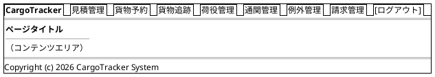

> 上記 navbar 例はロール表示制御前の全項目を示す。実際の表示は「ナビゲーション構成」表の表示ロールに従う。個別画面のワイヤーフレームでは紙面の都合上、当該画面に関連する主要項目のみを抜粋して記載している。

### Bootstrap 5 グリッド運用ルール

- コンテナ: `container-fluid` で横幅を最大活用
- 一覧画面: テーブル幅 `col-12`
- フォーム画面: 入力欄 `col-md-8 offset-md-2`（中央寄せ）
- 詳細画面: 左カラム `col-md-8`、右サイドバー `col-md-4`
- ブレークポイント: モバイル（`< 768px`）では 1 カラム積み上げ

---

## 画面遷移図

フロー全体の画面遷移を PlantUML ステートチャート図で表現する。

```plantuml
@startuml
title 全体画面遷移図 - 国際貨物輸送管理システム

[*] --> ログイン画面

state ログイン画面 {
  ログイン画面 : /login
  ログイン画面 : 認証フォーム
}

ログイン画面 --> ダッシュボード : 認証成功

state ダッシュボード {
  ダッシュボード : /
  ダッシュボード : サマリーカード\n最新荷役一覧
}

ダッシュボード --> 貨物予約一覧 : [予約管理] クリック
ダッシュボード --> 貨物追跡入力 : [追跡] クリック
ダッシュボード --> 荷役作業一覧 : [荷役管理] クリック
ダッシュボード --> 請求書一覧 : [請求管理] クリック
ダッシュボード --> 航路一覧 : [航路管理] クリック
ダッシュボード --> 荷主一覧 : [荷主管理] クリック
ダッシュボード --> 経路割り当て待ち一覧 : [経路設計] クリック
ダッシュボード --> 例外イベント一覧 : [未解決例外] カードクリック
ダッシュボード --> 通関申告一覧 : [通関留置中] カードクリック

state "荷主フロー" as shipper_flow {
  state 荷主一覧 {
    荷主一覧 : /shippers
    荷主一覧 : 一覧テーブル・検索
  }
  state 荷主登録 {
    荷主登録 : /shippers/new
    荷主登録 : 個人 / 法人切替フォーム
  }
  state 荷主詳細 {
    荷主詳細 : /shippers/{shipperId}
    荷主詳細 : 荷主情報・契約割引率・予約履歴
  }
  state 荷主編集 {
    荷主編集 : /shippers/{shipperId}/edit
    荷主編集 : 名称・連絡先・住所の訂正
  }

  荷主一覧 --> 荷主登録 : [新規荷主登録] ボタン
  荷主一覧 --> 荷主詳細 : 行クリック
  荷主登録 --> 荷主詳細 : 登録成功（PRG）
  荷主登録 --> 荷主登録 : バリデーションエラー
  荷主詳細 --> 荷主編集 : [編集] ボタン
  荷主編集 --> 荷主詳細 : 訂正成功（PRG）
  荷主編集 --> 荷主編集 : バリデーションエラー・メール重複
}

state "航路管理フロー" as voyage_flow {
  state 航路一覧 {
    航路一覧 : /voyages
    航路一覧 : 航路・スケジュール一覧
  }
  state 航海スケジュール登録 {
    航海スケジュール登録 : /voyages/new
    航海スケジュール登録 : 寄港地・発着日時入力
  }
  state 航海スケジュール編集 {
    航海スケジュール編集 : /voyages/{voyageNumber}/edit
    航海スケジュール編集 : 影響予約の警告表示
  }

  航路一覧 --> 航海スケジュール登録 : [新規登録] ボタン
  航路一覧 --> 航海スケジュール編集 : 行の [編集] リンク
  航海スケジュール登録 --> 航路一覧 : 登録成功（PRG）
  航海スケジュール編集 --> 航路一覧 : 更新成功（PRG）
}

state "予約フロー" as booking_flow {
  state 貨物予約一覧 {
    貨物予約一覧 : /bookings
    貨物予約一覧 : 一覧テーブル・検索
  }
  state 貨物予約登録 {
    貨物予約登録 : /bookings/new
    貨物予約登録 : 入力フォーム
  }
  state 予約詳細 {
    予約詳細 : /bookings/{bookingId}
    予約詳細 : 予約情報・荷役履歴
  }
  state 経路割り当て待ち一覧 {
    経路割り当て待ち一覧 : /routing/queue
    航海詳細 : /voyages/{voyageNumber}
    ロック中アカウント : /admin/accounts
    経路割り当て待ち一覧 : ROLE_ROUTER の作業入口\n期限昇順
  }
  state 経路割り当て {
    経路割り当て : /bookings/{bookingId}/route
    経路割り当て : 航路候補テーブル\n条件変更・再算出（US10）
  }

  貨物予約一覧 --> 貨物予約登録 : [新規登録] ボタン
  貨物予約一覧 --> 予約詳細 : 行クリック
  貨物予約登録 --> 予約詳細 : 登録成功（PRG）
  貨物予約登録 --> 貨物予約登録 : バリデーションエラー
  予約詳細 --> 経路割り当て待ち一覧 : [経路設計者に引き渡す]（US06）
  経路割り当て待ち一覧 --> 経路割り当て : [経路を割り当て] ボタン
  経路割り当て --> 予約詳細 : 割り当て成功（PRG）
  経路割り当て --> 経路割り当て : 条件を変えて再算出（US10）
  予約詳細 --> 経路割り当て : [経路を再設計]（MISROUTED 時）
  予約詳細 --> 請求書詳細 : [請求書を表示]（DELIVERED 以降）
  荷主詳細 --> 貨物予約登録 : [この荷主で予約する]
  見積詳細 --> 貨物予約登録 : [この見積で予約する]（内容プリフィル）
}

state "追跡フロー" as tracking_flow {
  state 貨物追跡入力 {
    貨物追跡入力 : /tracking
    貨物追跡入力 : 追跡番号入力
  }
  state 追跡詳細 {
    追跡詳細 : /tracking/{trackingNumber}
    追跡詳細 : ステータスタイムライン\n30 秒自動更新（htmx）
  }

  state 貨物状態手動更新 {
    貨物状態手動更新 : /tracking/{trackingNumber}/status
    貨物状態手動更新 : ROLE_TRACKER が手動遷移
  }

  貨物追跡入力 --> 追跡詳細 : 追跡番号送信
  貨物追跡入力 --> 貨物追跡入力 : 番号不正・未発見
  追跡詳細 --> 貨物状態手動更新 : [状態を手動更新]（ROLE_TRACKER）
  貨物状態手動更新 --> 追跡詳細 : 更新成功（PRG）
  追跡詳細 --> 貨物追跡入力 : [別の貨物を追跡]
}

state "荷役フロー" as handling_flow {
  state 荷役作業一覧 {
    荷役作業一覧 : /handling
    荷役作業一覧 : 一覧テーブル・検索
  }
  state 荷役作業登録 {
    荷役作業登録 : /handling/new
    荷役作業登録 : 登録フォーム
  }

  荷役作業一覧 --> 荷役作業登録 : [新規登録] ボタン
  荷役作業登録 --> 荷役作業一覧 : 登録成功（PRG）
  荷役作業登録 --> 荷役作業登録 : バリデーションエラー
}

state "精算フロー" as billing_flow {
  state 請求書一覧 {
    請求書一覧 : /billing/invoices
    請求書一覧 : 一覧テーブル・フィルタ
  }
  state 請求書詳細 {
    請求書詳細 : /billing/invoices/{invoiceId}
    請求書詳細 : 詳細・支払い確認
  }

  請求書一覧 --> 請求書詳細 : 行クリック
  請求書詳細 --> 請求書一覧 : [一覧に戻る] / 支払い確認成功（PRG）
}

state "通関フロー" as customs_flow {
  state 通関申告一覧 {
    通関申告一覧 : /handling/customs
    通関申告一覧 : 一覧テーブル・状態フィルタ
  }
  state 通関申告登録 {
    通関申告登録 : /handling/customs/new
    通関申告登録 : 登録・状態更新フォーム
  }

  通関申告一覧 --> 通関申告登録 : [新規申告] ボタン
  通関申告登録 --> 通関申告一覧 : 登録・更新成功（PRG）
  通関申告登録 --> 通関申告登録 : バリデーションエラー
}

state "例外フロー" as exception_flow {
  state 例外イベント一覧 {
    例外イベント一覧 : /tracking/exceptions
    例外イベント一覧 : 一覧テーブル・状態フィルタ
  }
  state 例外イベント登録 {
    例外イベント登録 : /tracking/exceptions/new
    例外イベント登録 : 登録フォーム
  }
  state 例外イベント解決 {
    例外イベント解決 : /tracking/exceptions/{exceptionId}
    例外イベント解決 : 詳細・解決フォーム
  }

  例外イベント一覧 --> 例外イベント登録 : [新規登録] ボタン
  例外イベント一覧 --> 例外イベント解決 : 行クリック
  例外イベント登録 --> 例外イベント一覧 : 登録成功（PRG）
  例外イベント解決 --> 例外イベント一覧 : 解決成功（PRG）
}

ダッシュボード --> 通関申告一覧 : [通関管理] クリック
ダッシュボード --> 例外イベント一覧 : [例外管理] クリック
荷役作業一覧 --> 通関申告一覧 : [通関申告] タブ
追跡詳細 --> 例外イベント登録 : [例外を登録]

state 航路一覧 {
  航路一覧 : /voyages
  航路一覧 : 航路・スケジュール一覧
}

state "管理フロー" as admin_flow {

}

state 公開貨物追跡 {
  公開貨物追跡 : /public/tracking/{trackingId}
  公開貨物追跡 : 認証不要・シンプルステータス
}

[*] --> 公開貨物追跡 : 直接 URL アクセス（認証不要）

state "見積フロー" as estimation_flow {
  state 見積一覧 {
    見積一覧 : /estimates
    見積一覧 : 一覧テーブル・検索
  }
  state 見積作成 {
    見積作成 : /estimates/new
    見積作成 : 入力フォーム
  }
  state 見積詳細 {
    見積詳細 : /estimates/{estimateId}
    見積詳細 : ルート候補一覧
  }

  見積一覧 --> 見積作成 : [新規見積作成] ボタン
  見積一覧 --> 見積詳細 : 行クリック
  見積作成 --> 見積詳細 : 作成成功（PRG）
  見積作成 --> 見積作成 : バリデーションエラー
}

ダッシュボード --> 見積一覧 : [見積管理] クリック（US01）

@enduml
```

---

## 画面詳細設計

### ログイン画面 (/login)

#### ワイヤーフレーム

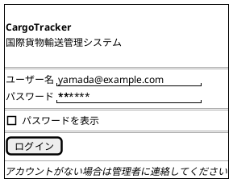

#### 仕様

- Spring Security の標準ログイン画面をカスタマイズ
- ログイン失敗時: 「ユーザー名またはパスワードが正しくありません」を赤色で表示
- ログイン成功後: ロールに応じてダッシュボードへリダイレクト
- セッションタイムアウト後は自動的に `/login?timeout` へリダイレクト

---

### ダッシュボード (/)

#### ワイヤーフレーム

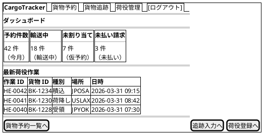

#### 仕様

- **サマリーカードは必ずクリック可能**とし、その条件で絞り込んだ一覧画面へ遷移する。件数だけを見せると、利用者は結局一覧画面で条件を入れ直すことになり二度手間になる
- 最新荷役作業: 直近 10 件を降順表示
- htmx: ページ初期ロード時に `/api/v1/dashboard/summary` を `hx-get` で取得

#### ロール別ダッシュボード構成

**ダッシュボードは「毎朝出社して今日やるべき仕事を見つける」ための作業入口である。** 全ロールに同じ件数カードを見せる設計では、どのロールにとっても自分の仕事が見えない。ロールごとに表示するカードと一覧を切り替える。

| ロール | カード（クリック時の遷移先） | 下段の一覧 |
| :--- | :--- | :--- |
| ROLE_SALES | 仮予約（`/bookings?status=PRELIMINARY`）／**希望期限が 3 日以内で経路未割り当て**（`/bookings?deadline=within3d&routing=NOT_ROUTED`）／今月の予約件数 | 自分が担当する直近の予約 10 件 |
| ROLE_ROUTER | **経路割り当て待ち**（`/routing/queue`）／候補ゼロで保留中（`/routing/queue?status=NO_CANDIDATE`）／今週出港予定 | 経路割り当て待ちの予約 10 件 |
| ROLE_TRACKER | **未解決の例外**（`/tracking/exceptions?resolved=false`）／うち紛失（`?type=LOST`）／**通関で 3 日以上留置中**（`/handling/customs?status=HELD&days=3`）／誤配（`/bookings?routing=MISROUTED`） | 未解決の例外 10 件 |
| ROLE_HANDLER | **本日の自分の荷役実績**（`/handling?operator=me&date=today`）／**未処理の引取待ち**（`/handling?status=AWAITING_CLAIM`） | 本日自分が登録した荷役 10 件 |
| ROLE_BILLING | 未払い請求（`/billing/invoices?status=PENDING`）／**支払期限超過**（`?status=OVERDUE`）／今月の請求総額 | 支払期限超過の請求書 10 件 |
| ROLE_SHIPPER / ROLE_CONSIGNEE | 自分の輸送中貨物／到着予定（7 日以内） | 自分の貨物の最新状態 10 件 |

- 表示するカードは**ロールの権限で決まる**。権限のないロールにカードを出さない（`sec:authorize`）
- 「未解決の例外」「支払期限超過」「通関留置」は**放置するとコストが発生する**項目であり、該当件数が 0 でない場合は警告色（`bg-warning` / `bg-danger`）で表示する
- 件数 0 のカードは非表示にせず「0 件」と表示する。**表示されないことと 0 件であることは利用者にとって別の意味を持つ**

---

### 荷主一覧 (/shippers)

#### ワイヤーフレーム

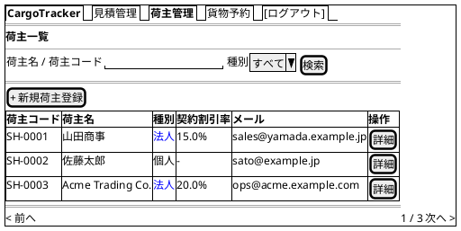

#### 仕様

- **検索**: 荷主名の部分一致、荷主コードの完全一致、種別（個人 / 法人 / すべて）で絞り込む
- **契約割引率**: 法人のみ表示。個人は `-` を表示する（0% と `-` は意味が異なる。個人には契約割引の概念自体が無い）
- 貨物予約登録画面の荷主選択からも本画面をモーダルで開けるようにする（US04 の「荷主 ID を入力して既存荷主を選択できる」を、コードの暗記に頼らず満たす）
- **空状態**: 0 件のとき「荷主が登録されていません。まず荷主を登録してください」と理由と次アクションを表示し `[+ 新規荷主登録]` を強調する

---

### 荷主登録 (/shippers/new)

#### ワイヤーフレーム

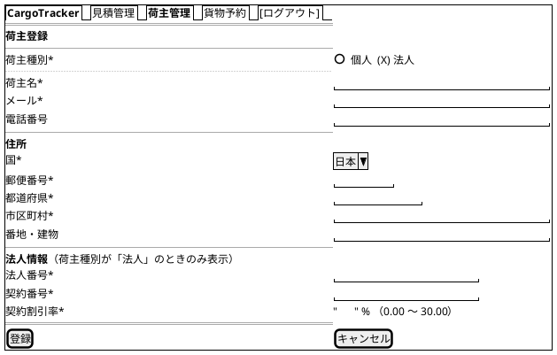

#### 仕様

- **荷主種別の切替**: 「法人」を選択したときのみ法人情報セクションを表示する（htmx `hx-trigger="change"` で当該フラグメントを差し替え）
- **契約割引率**: 入力範囲は **0.00〜30.00%**。上限はドメインの不変条件（`domain-model.md` 割引率上限 30%）と一致させる。**画面側に別の上限を書かない**（旧版の割引ポリシー画面は -50〜100% を許容しており、画面から入力できてドメインが弾く状態だった）
- **メールアドレスの重複チェック**: `hx-post="/api/v1/shippers/validate"`、`hx-trigger="blur"` で非同期検証。DB 側にも UNIQUE 制約を置き、画面のみで担保しない
- **バリデーション**: 必須項目、メール形式、郵便番号形式、法人選択時は法人番号・契約番号・契約割引率が必須
- 登録成功時は PRG で荷主詳細へリダイレクトし、フラッシュメッセージ「荷主を登録しました」を表示する

---

### 荷主詳細 (/shippers/{shipperId})

#### 仕様

- 荷主情報（種別・名称・連絡先・住所）、法人の場合は契約番号と契約割引率を表示する
- **予約履歴**: この荷主の予約を新しい順に表示し、各行から予約詳細へ遷移できる
- `[この荷主で予約する]` を配置し、貨物予約登録へ荷主をプリフィルした状態で遷移する
- `[編集]` は ROLE_SALES のみ表示。契約割引率の変更は監査ログに記録する（`non_functional.md` §4.4 業務操作ログ）

---

### 荷主編集 (/shippers/{shipperId}/edit)

#### ワイヤーフレーム

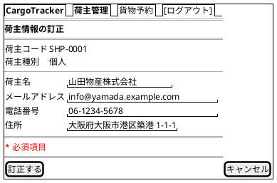

#### 仕様

- **訂正できる項目**: 荷主名・メールアドレス・電話番号・住所
- **訂正できない項目**: 荷主コード・荷主種別。**入力欄ではなく確定値として表示する**（US32 の受入基準「識別子と区分の変更は訂正ではなく別の荷主である」）。編集不可の項目を無効化した入力欄として置くと「操作できるように見えるが操作できない」状態になるため、欄そのものを置かない
- **メールアドレスの重複**: 他の荷主と同じ値に変更しようとした場合は訂正せず、既存の荷主（荷主コードと名称、詳細へのリンク）を提示する。**DB の UNIQUE 違反を 500 にしない**
- **同時更新**: 別の担当者が先に訂正していた場合、後の訂正は保存されず「他の担当者が先に更新しました。最新の内容を確認してください」と表示する（`shipper.version` による楽観的ロック）。**後勝ちで黙って上書きしない**
- **訂正成功**: PRG で荷主詳細へリダイレクトし、フラッシュメッセージ「荷主情報を訂正しました」を表示する
- **監査**: 誰がいつ何を訂正したかを業務操作ログに記録する（`non_functional.md` §4.4）
- **到達性**: ROLE_SALES のみ。荷主詳細の `[編集]` からのみ到達する

---

### 経路割り当て待ち一覧 (/routing/queue)

**経路設計者（ROLE_ROUTER）の作業入口。** US06 で営業担当者から引き渡された予約は、この画面に現れる。

#### ワイヤーフレーム

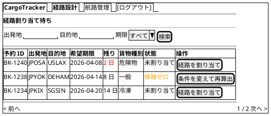

#### 仕様

- **対象**: BookingStatus = `ROUTE_PROPOSED` かつ `RoutingStatus = NOT_ROUTED` の予約
- **既定の並び順は希望期限の昇順**（残りが少ないものが上）。経路設計者が朝に見るのは「どれが一番切羽詰まっているか」であり、予約 ID 順では役に立たない
- **残り日数**: 3 日以内は赤、7 日以内は橙で表示する
- **候補ゼロ**: 経路候補が 1 件も見つからなかった予約は状態を「候補ゼロ」とし、`[条件を変えて再算出]` から US10 の条件変更パネルを開いた状態で経路割り当て画面へ遷移する
- **貨物種別**: 危険物・冷凍は取扱可能港の制約があるため一覧に表示する（割り当て前に難易度が分かる）
- **空状態**: 0 件のとき「経路割り当て待ちの予約はありません」と表示し、`[航路管理へ]` を次アクションとして提示する

---

### 貨物予約一覧 (/bookings)

#### ワイヤーフレーム

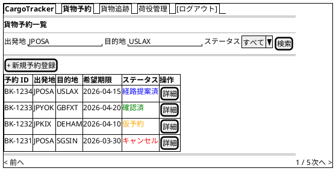

#### 仕様

- **検索フィルタ**: 出発地・目的地（港コード）・BookingStatus でフィルタリング
- **ステータスバッジ**: BookingStatus に応じた色分け（Bootstrap `badge`）
- **ページネーション**: 1 ページ 20 件
- **新規登録**: ROLE_SALES のみ表示
- **htmx**: 検索フォームに `hx-get="/bookings" hx-target="#booking-list"` で部分更新

---

### 貨物予約登録 (/bookings/new)

#### ワイヤーフレーム

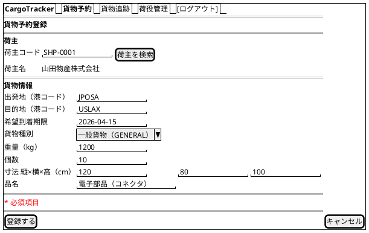

#### 仕様

- **荷主 入力項目**: 荷主コード（必須）。`[荷主を検索]` で荷主一覧をモーダルで開き、選択すると荷主コードと荷主名が埋まる。**荷主コードの暗記を前提にしない**（US04 の受入基準「荷主 ID を入力して既存荷主を選択できる」）
  - 荷主詳細から `[この荷主で予約する]` で遷移した場合はプリフィル済みで表示する
  - 存在しない荷主コードは登録時に「該当する荷主がありません」とし、`cargo.shipper_id NOT NULL` を画面で担保しない（BC 間の存在確認は `ShipperExistenceChecker` ACL が行う）
- **貨物情報 入力項目**: 出発地・目的地（UNLOCODE 形式 5 文字）・希望到着期限・貨物種別・重量・個数・寸法（縦 / 横 / 高）・品名
- **業務ルールによる拒否**: 出発地と目的地が同じ場合、希望到着期限が過去日の場合は登録できない（`domain-model.md` ビジネスルール 2）
- **バリデーション**: htmx で `hx-post` 送信前にクライアントサイドチェック、サーバー側は Bean Validation

> **荷受人情報は本画面では入力しない。** 旧版は荷受人 3 項目（氏名・住所・連絡先メール）を必須としていたが、
> **US04 の受入基準に無く、`cargo` テーブルにも住所のカラムが無い**。画面・受入基準・データモデルの
> 3 者で扱いが食い違っていた。
>
> 「国際輸送では荷受人が必須」という業務上の指摘は妥当であるため、落とすのではなく担当ストーリーを決めた。
> **荷受人の入力は [US16（引取作業を記録する）](../requirements/user_story.md#us16-引取作業を記録する) で扱う**
> — 荷受人の情報を最初に実際に使うのが引取時の本人確認だからである。それまでは予約に荷受人を持たせない。
- **貨物種別**: `GENERAL`（一般貨物）, `HAZARDOUS`（危険物）, `REFRIGERATED`（冷凍・冷蔵）から選択。プルダウンは日本語ラベルで表示する（付録の CargoType 対応表を参照）
- **登録成功**: PRG パターンで `/bookings/{bookingId}` へリダイレクト
- **エラー時**: 同画面を再描画し、エラーフィールドを赤ボーダーで強調

---

### 予約詳細 (/bookings/{bookingId})

#### ワイヤーフレーム

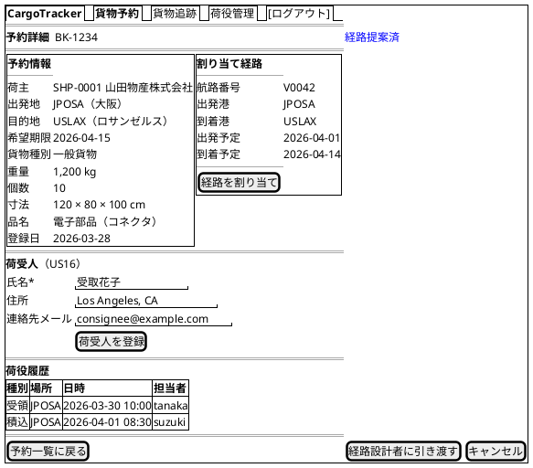

> **注**: ワイヤーフレームは BookingStatus = `PRELIMINARY`（ROLE_SALES で表示）の状態を描いている。表示されるアクションボタンは状態とロールで変わるため、下記「アクションボタンの出し分け」を実装の根拠とすること。

#### 仕様

- **ステータスバッジ**: ページタイトル横に BookingStatus を大きく表示。バッジは日本語ラベル（付録の BookingStatus 対応表）で表示する
- **荷受人情報**（US16）: 予約詳細の中で登録・訂正する。**荷受人だけのための画面は作らない**（作ると営業担当者は「予約を開く → 荷受人の画面へ → 戻る」を毎回行うことになる）
  - **氏名のみ必須**。住所・連絡先は引き渡しの当日までに分かればよい。必須にすると、氏名しか分かっていない段階で登録できず**結局どこにも記録されない**
  - **予約登録フォーム（US04）には戻さない。** 荷受人は予約の時点では未確定でありうる
  - **引き渡し済み（`DELIVERED` 以降）は変更できない。** 書き換えると誰に渡したかの記録が後から作り変えられる。フォームそのものを出さず、理由を表示する
  - 表示ロールは ROLE_SALES
- **経路情報**: 未割り当ての場合は「経路が割り当てられていません」と表示し `[経路を割り当て]` を強調
- **荷役履歴**: HandlingEvent を時系列降順で表示
- **[追跡を表示]**: `trackingNumber` が発行済みの場合のみ表示（状態遷移を伴わない参照リンク）

#### アクションボタンの出し分け

`domain-model.md`「BookingStatus 状態遷移表」を正典とし、**ボタンの表示条件は集約の遷移可否判定をそのまま呼び出す**（画面側に遷移規則を書き写さない）。書き写すと正典が変わったときに追随しない。

| BookingStatus | 表示するボタン | 表示ロール | エンドポイント | 遷移 |
| :--- | :--- | :--- | :--- | :--- |
| `PRELIMINARY` | `[経路設計者に引き渡す]` | ROLE_SALES | `POST /bookings/{bookingId}/assign-routing` | #2 |
| `ROUTE_PROPOSED`（経路未割り当て） | `[経路を割り当て]` | ROLE_ROUTER | 経路割り当て画面へ遷移 | #3 |
| `ROUTE_PROPOSED`（経路割り当て済み） | `[予約を確定]` | ROLE_SALES | `POST /bookings/{bookingId}/confirm` | #4 |
| `CONFIRMED` | `[追跡番号を発行]` | ROLE_TRACKER | `POST /bookings/{bookingId}/tracking-number` | #5 |
| `TRACKING_ISSUED` | （操作ボタンなし。荷役登録により自動遷移） | - | - | #6 |
| `IN_TRANSIT` | （操作ボタンなし。引取登録により自動遷移） | - | - | #7 |
| `DELIVERED` | `[請求書を表示]` | ROLE_BILLING | 請求書詳細へ遷移（精算は請求書詳細で実行） | #8 |
| `SETTLED` / `CANCELLED` | （操作ボタンなし。終端状態） | - | - | - |

- **[キャンセル]**: `PRELIMINARY` / `ROUTE_PROPOSED` / `CONFIRMED` / `TRACKING_ISSUED` では ROLE_SALES に表示し、確認ダイアログ後に `POST /bookings/{bookingId}/cancel`（遷移 #9）
- **[キャンセル（要承認）]**: `IN_TRANSIT` では **ROLE_TRACKER の承認が必要**（遷移 #10）。貨物が船上にあるため降ろす場所の判断とキャンセル料が発生する。ROLE_SALES には申請ボタンのみを表示する
- `DELIVERED` 以降はキャンセルボタンを表示しない（引き渡し済み貨物の取り消しは「返送」であり別ユースケース）

#### 荷主への経路通知（US12）

経路が確定した予約には `[荷主に経路を通知]`（ROLE_SALES）を表示する。

- 送信前に通知内容（確定経路・出発日・到着予定日・追跡番号）をプレビューし、送信先メールアドレスを確認する
- 送信後は**通知履歴**を予約詳細に常時表示する。項目は 送信日時 / 送信者 / 送信先 / 種別（経路確定・スケジュール変更・例外発生）/ 結果（成功・失敗）
- **「送ったつもり」を検知できることが本機能の目的である。** 送信操作だけを実装して履歴を残さないと、荷主から「聞いていない」と言われたときに確認する手段が無い
- 送信失敗時は履歴に失敗として記録し、`[再送]` を表示する

#### 誤配（MISROUTED）の表示と再ルーティング

`RoutingStatus = MISROUTED` の予約は、予約詳細の先頭に**警告バナー**を表示する。

- バナーの内容: 「予定と異なる経路で輸送されています」＋ 検知した荷役イベント（作業場所・日時）＋ 現在地
- `[経路を再設計]`（ROLE_ROUTER）を配置し、**現在地を出発地とした経路割り当て画面**へ遷移する。目的地と希望期限は元の予約から引き継ぐ
- `[荷主に状況を通知]`（ROLE_SALES）を配置する。誤配時に荷主へ説明することは業務上必須である
- 誤配は例外イベントとしても記録し、例外一覧（ROLE_TRACKER）にも現れるようにする

---

### 経路割り当て (/bookings/{bookingId}/route)

#### ワイヤーフレーム

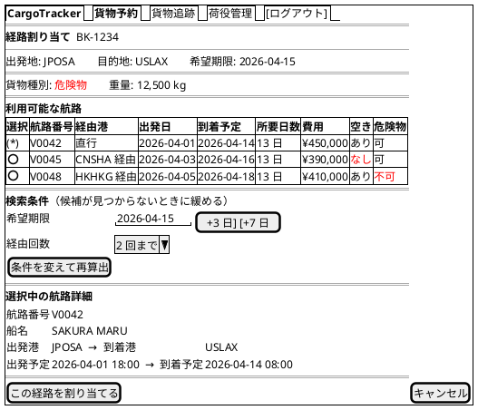

#### 仕様

- **候補テーブルの列は US08 の受入基準に対応させる**: 所要日数・経由港・**費用**・航海番号。加えて**空き容量**と**危険物 / 冷凍の取扱可否**を表示する
  - **費用は「概算」と明示する**（ADR-008）。運賃表も港間の距離も持たないため、重量と所要日数から算出した目安である。**実額として荷主に渡ると業務上の事故になる**
  - **空き容量の列は IT5 で出す。** IT4 では判定の材料が無く、常に「あり」を返す装置になるため出さなかった（**確かめていない「あり」を出すことは、確かめたと言うことと同じ**である）。経路の確定（US09）を実装した IT5 で、航海の積載可能重量と確定済み貨物の重量合計から判定するようにした
- **`[この経路で確定]` は選べる候補にだけ出す。** ただし**ボタンを出さないことは防御ではない**。集約（`BookingRouteProposal.select`）が空きなし・取扱不可を拒否する
  - 費用が無いと荷主に提案できない（提案時に最初に聞かれる）
  - 空き容量が無いと**満船の便を選べてしまう**
  - 取扱可否は US05・US07 の受入基準（危険物・冷凍は指定港のみ取扱可能）に対応する
- **選択不可の候補**: 空きなし・取扱不可の航路はラジオボタンを `disabled` にし、理由をツールチップで示す。**一覧から消さない**（「なぜあの便が出てこないのか」を利用者が確認できなくなる）
- **ラジオ選択**: 航路を選択すると htmx `hx-get` で下部の「選択中の航路詳細」を部分更新
- **希望期限超過**: 到着予定が希望期限を超える航路は `⚠` アイコン付きで警告。**判定は日付単位で行う**（期限当日に時刻付きで到着する便を誤って警告しない — `domain-model.md` ビジネスルール 2-1）
- **割り当て成功**: PRG パターンで `/bookings/{bookingId}` へリダイレクト

#### 候補ゼロ時の再算出（US10）

**候補ゼロは異常ではなく日常的に起きる。** 期限が厳しい、危険物対応港が限られる、といった理由で 1 件も出ないことは珍しくない。

- 候補が 0 件のとき、空状態として「条件に合う航路が見つかりませんでした」と表示し、**検索条件パネルを開いた状態**にする
- **条件の緩め方を提示する**: `[+3 日]` `[+7 日]`（希望期限の延長）、経由回数の上限緩和。ワンクリックで再算出できるようにし、利用者に条件を考えさせない
- 再算出は `POST /bookings/{bookingId}/route/proposals` に条件を付けて送り、**PRG で画面へ戻す**（IT8 タスク 0-2 で是正）
- 期限を延長して割り当てた場合、**元の希望期限との差分を予約詳細に記録**し、荷主への通知（US12）に含める
- 候補ゼロのまま保留した予約は、経路割り当て待ち一覧に「候補ゼロ」として表示する

#### 誤配時の再ルーティング

`RoutingStatus = MISROUTED` の予約から本画面に入った場合、**出発地を貨物の現在地**（最後の荷役イベントの場所）として候補を算出する。目的地と希望期限は元の予約から引き継ぐ。画面上部に「誤配のため現在地 USLAX から再設計しています」と明示する。

---

### 貨物追跡入力 (/tracking)

#### ワイヤーフレーム

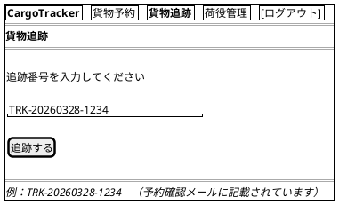

#### 仕様

- **本画面は要認証である。** 未認証の照会は公開貨物追跡（`/public/tracking/{trackingNumber}`）で行う。本画面および追跡詳細は担当者名などの内部情報を表示するため、認証なしで開放しない
- **入力フィールド**: 追跡番号（`TRK-YYYYMMDD-NNNN` 形式）。大小文字は問わない
- **末尾 4 桁のみでの部分一致検索は実装しない**（IT7 の判断）。候補一覧を出すと、**番号を知らない利用者に他社の貨物を列挙させる**。絞り込みの根拠が「入力した 4 桁」しか無いためである。利用者アカウントと荷主を結びつける **US34（IT9）で紐付けを作ってから開放する**（認証つき一覧を出さない判断と同じ理由）
- **バリデーション**: フォーマット不正の場合はインラインエラー表示
- **未発見**: 404 の場合は「該当する貨物が見つかりません」メッセージ

---

### 追跡詳細 (/tracking/{trackingNumber})

#### ワイヤーフレーム

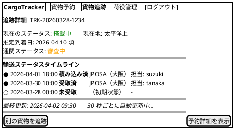

#### 仕様

- **自動更新**: htmx `hx-get="/tracking/{trackingNumber}/status-fragment" hx-trigger="every 30s" hx-target="#status-timeline"` で部分更新。**`/status` は貨物状態手動更新（US17・POST）が使うため取得先にしない**（IT7 の突合で判明）
- **タイムライン**: TransportStatus の変化を時系列で表示。最新状態を最上部に。バッジは日本語ラベル（付録の TransportStatus 対応表）で表示する
- **TransportStatus 全 9 値の表示規則**: 通常フロー（`NOT_RECEIVED → RECEIVED → LOADED → ONBOARD_CARRIER → UNLOADED → AWAITING_CLAIM → CLAIMED`）に加え、`EXCEPTION`（例外）・`UNKNOWN`（不明）の表示挙動を付録「TransportStatus 全 9 値の表示規則」に従って行う
- **推定到着日**: `YYYY-MM-DD 頃` の形式で表示。未確定の場合は「未確定」と表示
- **CustomsStatus**: 通関状態を日本語ラベルバッジ（付録の CustomsStatus 対応表）で表示
- **例外表示・登録**: `EXCEPTION` ステータス時は赤バッジ「例外」と例外種別・内容を詳細表示する。ROLE_TRACKER には `[例外を登録]` ボタンを表示し、例外イベント登録画面（`/tracking/exceptions/new`）へ遷移する
- **[予約詳細を表示]**: ROLE_SALES, ROLE_SHIPPER のみ表示

---

### 荷役作業登録 (/handling/new)

#### ワイヤーフレーム

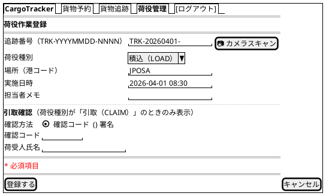

#### 仕様

- **荷役種別**: `RECEIVE`（受領）, `LOAD`（積込）, `UNLOAD`（荷降し）, `CUSTOMS`（通関）, `CLAIM`（引取）から選択。プルダウンは日本語ラベル表示（付録の HandlingType 対応表）。domain-model の HandlingType 定義に準拠
- **追跡番号**: `TRK-YYYYMMDD-NNNN` 形式。`[📷 カメラスキャン]` ボタンでバーコード・QR スキャン入力に対応
- **実施日時**: 未来日時は警告表示（投機的な登録は許可）
- **登録成功**: PRG パターンで `/handling` へリダイレクトし、**登録した作業を先頭に表示した状態**にする（自分が今スキャンした荷物を探し直させない）

#### 引取確認（US16）

荷役種別が `CLAIM`（引取）のときのみ、引取確認セクションを表示する。

- **確認方法**: 確認コード（荷受人に事前送付した 6 桁）または署名（タッチ入力の画像）のいずれか。**どちらも未入力では登録できない**
- **引き渡し証明は事故時の唯一の防御線である。** 「渡した / 受け取っていない」の争いになったとき、確認記録が無ければ会社が負う
- 荷受人氏名は必須。予約の荷受人と異なる氏名が入力された場合は警告を表示し、メモへの理由記入を求める（代理受領は実務で頻繁に起きるため禁止はしない）
- 引取登録の成功により BookingStatus が `DELIVERED` に遷移する（`domain-model.md` 遷移 #7）

#### 予定ルートとの照合（US15 受入基準・誤配検知）

- 登録された作業場所が予約の予定ルート（`CargoItinerary` の各 `Leg`）に含まれない場合、**登録前に警告を表示する**（「この場所は予定ルートに含まれていません。誤配の可能性があります」）
- 警告を承認して登録した場合、`RoutingStatus` を `MISROUTED` に更新し、例外イベント（種別: 誤配）を自動起票する
- 誤配の可視化と再ルーティング導線は予約詳細を参照

#### カメラスキャン失敗時の導線

港湾・倉庫ではラベルの汚損・逆光・手袋操作が常態であり、**スキャン失敗は例外ではなく日常である。**

- 追跡番号の手入力欄はスキャンボタンと**常に併置**し、スキャン失敗時に画面遷移なく手入力へ移れるようにする
- スキャン失敗時は「読み取れませんでした。手入力するか、もう一度スキャンしてください」と表示し、手入力欄にフォーカスを移す
- **モバイル最適化**: ROLE_HANDLER は現場での携帯端末利用が前提（セッション 2 時間の根拠）。タップ領域は最小 44×44 px、主要操作は片手で届く下部に配置、屋外の直射日光下を想定してコントラスト比 7:1 以上を確保する

---

### 荷役作業一覧 (/handling)

#### ワイヤーフレーム

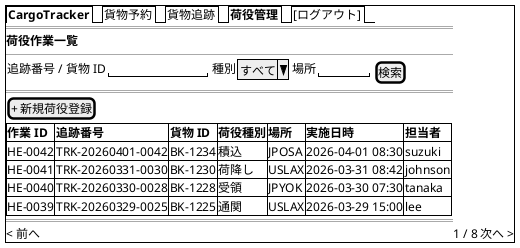

#### 仕様

- **検索フィルタ**: **追跡番号・貨物 ID の両方**、荷役種別、場所（港コード）でフィルタリング
- **一覧には追跡番号を表示する。** 荷役作業員が手にしているのは荷物に貼られた追跡番号（`TRK-`）であり、貨物 ID（`BK-`）ではない。登録は追跡番号、検索は貨物 ID という設計では、**自分がたった今スキャンして登録した作業を一覧から探せない**
- **追跡番号は部分一致で検索できる**。`TRK-YYYYMMDD-NNNN` は電話口で読み上げるには長く、実務では末尾 4 桁で照合することが多い
- **htmx**: 検索フォームに `hx-get="/handling" hx-target="#handling-list"` で部分更新
- **新規登録**: ROLE_HANDLER のみ表示
- **ページネーション**: 1 ページ 20 件
- **空状態**: 0 件のとき、検索条件が設定されていれば「条件に一致する荷役作業がありません。条件を緩めてください」＋`[条件をクリア]`、条件なしで 0 件なら「荷役作業がまだ登録されていません」＋`[+ 新規荷役登録]` を表示する

---

### 通関申告一覧 (/handling/customs)

#### ワイヤーフレーム

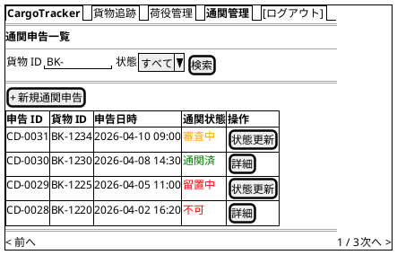

#### 仕様

- **一覧項目**: 申告 ID・貨物 ID・申告日時・通関状態（CustomsStatus）。domain-model の `CustomsDeclaration` エンティティに対応
- **通関状態バッジ**: CustomsStatus を日本語ラベル（付録の CustomsStatus 対応表）で表示。審査中は橙、通関済は緑、留置中・不可は赤
- **検索フィルタ**: 貨物 ID・通関状態でフィルタリング
- **アクセス制御**: ROLE_HANDLER・ROLE_TRACKER のみアクセス可能
- **htmx**: 検索フォームに `hx-get="/handling/customs" hx-target="#customs-list"` で部分更新
- **業務連携**: 通関状態が `CLEARED`（通関済）になると荷役作業 `CLAIM`（引取）が可能になる（domain-model の CLEARED→CLAIM ルール）。留置中・不可の場合は該当予約の追跡詳細に `CUSTOMS_HOLD` 例外として反映される

---

### 通関申告登録 (/handling/customs/new)

#### ワイヤーフレーム

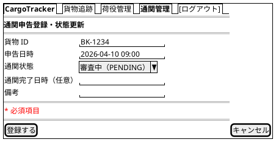

#### 仕様

- **入力項目**: 貨物 ID・申告日時・通関状態・通関完了日時（`CLEARED` 選択時のみ必須）・備考
- **通関状態**: `PENDING`（審査中）・`CLEARED`（通関済）・`HELD`（留置中）・`REJECTED`（不可）から選択。プルダウンは日本語ラベル表示（付録の CustomsStatus 対応表）
- **本画面は新規登録専用である。** 既存申告の状態更新は通関申告詳細（`/handling/customs/{declarationId}`）で行う。旧版は `new` の URL で既存申告の更新も行う設計だったが、URL の意味と操作が食い違い、ブックマークとブラウザバックで混乱する
- **登録成功**: PRG パターンで `/handling/customs/{declarationId}` へリダイレクト
- **アクセス制御**: ROLE_HANDLER・ROLE_TRACKER のみ操作可能

---

### 通関申告詳細 (/handling/customs/{declarationId})

#### 仕様

- **表示項目**: 申告番号・貨物 ID / 追跡番号・申告日時・現在の通関状態・通関完了日時・備考・状態変更履歴
- **状態更新**: `PENDING` →（`CLEARED` / `HELD` / `REJECTED`）への更新フォームを配置する。更新時は理由の入力を必須とし、監査ログに記録する
- **`CLEARED` への更新**: 対応予約の引取（`CLAIM`）荷役が有効化される（`domain-model.md` のビジネスルール「通関済でないと引取不可」）
- **`HELD` への更新**: 追跡側に `CUSTOMS_HOLD` 例外イベントを自動起票し、例外一覧（ROLE_TRACKER）に現れるようにする
- **留置日数の警告**: `HELD` のまま 3 日以上経過している場合、「留置 N 日目。保管料が発生している可能性があります」と警告を表示する。**放置するとコストが発生する項目は放置できないように見せる**
- `[追跡詳細を表示]` / `[荷役一覧に戻る]` を配置する

---

### 例外イベント一覧 (/tracking/exceptions)

#### ワイヤーフレーム

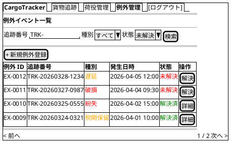

#### 仕様

- **一覧項目**: 例外 ID・追跡番号・例外種別（ExceptionType）・発生日時・解決状態。domain-model の `TrackingExceptionEvent` エンティティに対応
- **例外種別バッジ**: ExceptionType を日本語ラベル（付録の ExceptionType 対応表）で表示。遅延・税関保留は橙、破損・紛失は赤
- **検索フィルタ**: 追跡番号・例外種別・解決状態でフィルタリング
- **緊急表示**: 例外種別が `LOST`（紛失）の行は緊急フラグ（escalation）付きとして赤色ハイライト
- **アクセス制御**: ROLE_TRACKER のみアクセス可能
- **htmx**: 検索フォームに `hx-get="/tracking/exceptions" hx-target="#exception-list"` で部分更新

---

### 例外イベント登録 (/tracking/exceptions/new)

#### ワイヤーフレーム

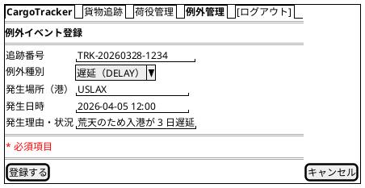

#### 仕様

- **入力項目**: 追跡番号・例外種別・発生場所（港コード）・発生日時・発生理由。domain-model の `RegisterExceptionCommand` に対応
- **例外種別**: `DELAY`（遅延）・`DAMAGE`（破損）・`LOST`（紛失）・`CUSTOMS_HOLD`（税関保留）から選択。プルダウンは日本語ラベル表示（付録の ExceptionType 対応表）
- **状態遷移**: 登録すると対象貨物の TransportStatus が `EXCEPTION`（例外）に更新され、追跡詳細に赤バッジで表示される
- **緊急通知**: 例外種別が `LOST`（紛失）の場合、緊急フラグを設定し管理職へ escalation 通知を送信する
- **登録成功**: PRG パターンで `/tracking/exceptions` へリダイレクト
- **アクセス制御**: ROLE_TRACKER のみ操作可能

---

### 例外イベント解決 (/tracking/exceptions/{exceptionId})

#### ワイヤーフレーム

```plantuml
@startsalt
{+
  {/ <b>CargoTracker</b> | 貨物追跡 | 荷役管理 | <b>例外管理</b> | [ログアウト] }
  ==
  <b>例外イベント解決</b>  EX-0012  |  <color:red>未解決</color>
  ==
  {
    {+
      <b>例外情報</b>
      ----
      追跡番号   | TRK-20260328-1234
      例外種別   | 遅延（DELAY）
      発生場所   | USLAX（ロサンゼルス）
      発生日時   | 2026-04-05 12:00
      発生理由   | 荒天のため入港が 3 日遅延
    } |
    {+
      <b>解決内容</b>
      ----
      新到着予定日 | "2026-04-13    "
      対応方針     | "代替便へ振替済み "
      解決日時     | "2026-04-06 09:00 "
    }
  }
  ==
  [解決を登録] | [一覧に戻る]
}
@endsalt
```

#### 仕様

- **例外情報**: 登録済みの例外イベント内容を表示（追跡番号・種別・発生場所・発生日時・理由）
- **解決フォーム**: 新到着予定日・対応方針・解決日時を入力。domain-model の `ResolveExceptionCommand` に対応
- **状態復帰**: 解決を登録すると TransportStatus が例外発生前の状態に復帰し（domain-model のビジネスルール 5）、荷主へ対応報告の通知が送信される
- **解決済み**: 既に解決済みの場合は解決フォームを非表示にし、解決日時・対応方針を表示する
- **[解決を登録]**: `POST /tracking/exceptions/{exceptionId}/resolve` を送信。PRG パターンで `/tracking/exceptions` へリダイレクト
- **アクセス制御**: ROLE_TRACKER のみ操作可能

---

### 航海スケジュール登録 (/voyages/new)

**US07・US08 の入力データを作る唯一の手段。** この画面が無いと経路候補を算出できない。

#### ワイヤーフレーム

```plantuml
@startsalt
{+
  {/ <b>CargoTracker</b> | 経路設計 | <b>航路管理</b> | [ログアウト] }
  ==
  <b>航海スケジュール登録</b>
  --
  航海番号*   | "V0050              "
  船舶名      | "Pacific Voyager    "
  運航会社    | "                   "
  ==
  <b>寄港地（運送区間）</b>
  {#
    **#** | **出発港** | **出発日時** | **到着港** | **到着日時** | **操作**
    1     | "JPOSA"    | "2026-05-01 09:00" | "CNSHA" | "2026-05-03 14:00" | [削除]
    2     | "CNSHA"    | "2026-05-04 08:00" | "USLAX" | "2026-05-16 10:00" | [削除]
  }
  [+ 区間を追加]
  --
  <b>取扱可否</b>
  危険物      | [X] 取扱可
  冷凍        | [X] 取扱可
  最大積載量  | "        " TEU
  ==
  [登録] | [キャンセル]
}
@endsalt
```

#### 仕様

- **区間の連結制約**: 区間 N の到着港は区間 N+1 の出発港と一致していなければならない（`domain-model.md` の `CarrierMovement` 連結制約）。不一致は登録時に拒否し、該当行を赤枠で示す
- **時刻の順序制約**: 各区間で出発日時 < 到着日時、かつ区間 N の到着日時 ≤ 区間 N+1 の出発日時
- **港の入力**: UN/LOCODE のオートコンプリート（`hx-get="/api/v1/locations/search"`、`hx-trigger="keyup changed delay:300ms"`）。生の UN/LOCODE を暗記させない
- **取扱可否**: 危険物・冷凍の取扱可否は経路候補の絞り込み（US05・US07）に使うため必須
- **航海番号の重複**: 既存の航海番号は登録できない。`hx-post="/api/v1/voyages/validate"` で非同期検証

---

### 航海スケジュール編集 (/voyages/{voyageNumber}/edit)

**船会社のスケジュール変更は週に何度も発生する。** 反映手段が無いと初日からデータが古くなる。

#### 仕様

- 登録画面と同じフォーム構成。既存値をプリフィルする
- **影響範囲の警告**: この航海を経路に含む予約が存在する場合、保存前に「この変更は N 件の予約に影響します」と一覧（予約 ID・荷主・希望期限）を提示し、確認を求める
- **期限超過の検出**: 変更後の到着日時が予約の希望期限を超える場合、該当予約を警告として列挙する。**日付単位で比較する**（`arrival_deadline` は `DATE`、到着日時は `TIMESTAMPTZ`。素朴に比較すると期限当日の時刻付き到着を誤って超過と判定する — `domain-model.md` ビジネスルール 2-1）
- **出港済み区間の変更禁止**: 実績（荷役イベント）が登録済みの区間は編集不可とし、理由を表示する
- 保存後、影響を受けた予約の担当営業に通知する（US12 の通知機構を利用）

---

### 貨物状態手動更新 (/tracking/{trackingNumber}/status)

**出港・入港は荷役作業員が登録しない。** 追跡管理者（ROLE_TRACKER）が手で入れるための画面。

#### ワイヤーフレーム

```plantuml
@startsalt
{+
  {/ <b>CargoTracker</b> | 貨物追跡 | 荷役管理 | <b>例外管理</b> | [ログアウト] }
  ==
  <b>貨物状態の手動更新</b>  TRK-20260401-0042
  --
  貨物 ID     | BK-1234
  現在の状態  | <color:blue>船上輸送中</color>
  ==
  新しい状態* | ^荷降し済^
  発生日時*   | "2026-04-16 10:30"
  発生場所*   | "USLAX"
  航海番号    | "V0050"
  更新理由*   | "船社からの入港連絡に基づく手動更新                "
  ==
  [更新] | [キャンセル]
}
@endsalt
```

#### 仕様

- **選択できる状態は現在の状態から遷移可能なものだけ**を列挙する。遷移可否は Tracking 集約の判定メソッドをそのまま呼び出し、画面側に遷移規則を書き写さない
- **更新理由は必須**。手動更新は本来システムが自動で行う遷移を人が上書きする操作であり、後から「なぜこの状態になっているのか」を追跡できなければならない。理由は監査ログに記録する
- 更新成功時は PRG で追跡詳細へリダイレクトし、タイムラインに「手動更新」バッジ付きで表示する
- **`EXCEPTION` への遷移は本画面では行わない**。例外は例外イベント登録（`/tracking/exceptions/new`）から登録し、種別と詳細を伴う必要がある

---

### 航路一覧 (/voyages)

#### ワイヤーフレーム

```plantuml
@startsalt
{+
  {/ <b>CargoTracker</b> | 貨物予約 | 貨物追跡 | 荷役管理 | <b>航路管理</b> | [ログアウト] }
  ==
  <b>航路一覧</b>
  --
  {
    出発港 | "JPOSA    " | 到着港 | "USLAX    " | 出発日 | "2026-04-  " | [検索]
  }
  ==
  {#
    **航路番号** | **船名**     | **出発港** | **到着港** | **出発予定**     | **到着予定**     | **空き**
    V0042        | SAKURA MARU  | JPOSA      | USLAX      | 2026-04-01 18:00 | 2026-04-14 08:00 | あり
    V0043        | FUJI MARU    | JPYOK      | GBFXT      | 2026-04-03 20:00 | 2026-04-22 10:00 | あり
    V0044        | PHOENIX      | JPKIX      | DEHAM      | 2026-04-05 14:00 | 2026-04-25 08:00 | なし
    V0045        | EASTERN STAR | JPOSA      | USLAX      | 2026-04-08 18:00 | 2026-04-21 08:00 | あり
  }
  ==
  < 前へ | 1 / 3 | 次へ >
}
@endsalt
```

#### 仕様

- **検索フィルタ**: 出発港・到着港・出発日でフィルタリング
- **空き状況**: 積載容量に余裕があるかを「あり / なし」で表示
- **閲覧専用**: ROLE_ROUTER は読み取りのみ。航路の追加・変更は管理機能から
- **経路割り当てへの連携**: 経路割り当て画面が本データを参照して候補を生成

---

### 請求書一覧 (/billing/invoices)

#### ワイヤーフレーム

```plantuml
@startsalt
{+
  {/ <b>CargoTracker</b> | 貨物予約 | 貨物追跡 | 荷役管理 | <b>請求管理</b> | [ログアウト] }
  ==
  <b>請求書一覧</b>
  --
  {
    ステータス | ^未払い^ | 発行日 | "2026-03-  " | [検索]
  }
  ==
  {#
    **請求書 ID** | **予約 ID** | **金額** | **発行日**   | **支払期限** | **ステータス**
    INV-0021      | BK-1234     | ¥450,000 | 2026-03-28   | 2026-04-28   | <color:red>未払い</color>
    INV-0020      | BK-1230     | ¥320,000 | 2026-03-25   | 2026-04-25   | <color:red>支払期限超過</color>
    INV-0019      | BK-1225     | ¥580,000 | 2026-03-20   | 2026-04-20   | <color:green>支払確認済</color>
    INV-0018      | BK-1220     | ¥210,000 | 2026-03-15   | 2026-04-15   | <color:green>支払確認済</color>
  }
  ==
  < 前へ | 1 / 2 | 次へ >
}
@endsalt
```

#### 仕様

- **フィルタ**: PaymentStatus（`PENDING`, `CONFIRMED`, `OVERDUE`, `REFUNDED`）・発行日でフィルタリング。プルダウンは日本語ラベル表示
- **ステータスバッジ**: 日本語ラベルバッジ（付録の PaymentStatus 対応表）で表示。`PENDING`（未払い）と `OVERDUE`（支払期限超過）は赤、`CONFIRMED`（支払確認済）は緑、`REFUNDED`（返金済）は灰
- **支払期限超過**: `OVERDUE` の場合は行を赤色ハイライト
- **アクセス制御**: ROLE_BILLING のみアクセス可能
- **請求書は手動発行しない。** BookingStatus が `DELIVERED` に遷移した時点でドメインイベント（`CargoDeliveredEvent`）を契機に自動発行する（`domain-model.md` ビジネスルール「Invoice は貨物配送完了後にのみ発行できる」）。旧版の `[+ 新規請求書発行]` ボタンは遷移先の画面が存在せずデッドエンドだったため削除した
- **空状態**: 0 件のとき「請求書がまだ発行されていません。貨物の配送完了後に自動発行されます」と表示する

---

### 請求書詳細 (/billing/invoices/{invoiceId})

#### ワイヤーフレーム

```plantuml
@startsalt
{+
  {/ <b>CargoTracker</b> | 貨物予約 | 貨物追跡 | 荷役管理 | <b>請求管理</b> | [ログアウト] }
  ==
  <b>請求書詳細</b>  INV-0021  |  <color:red>未払い</color>
  ==
  {
    {+
      <b>請求情報</b>
      ----
      対象予約   | BK-1234（JPOSA → USLAX）
      発行日     | 2026-03-28
      支払期限   | 2026-04-28
      担当営業   | 山田 太郎
    } |
    {+
      <b>金額内訳</b>
      ----
      基本運賃   | ¥400,000
      燃油サーチャージ | ¥30,000
      割引（早期予約） | -¥10,000
      ----
      小計       | ¥420,000
      消費税（10%）   | ¥42,000
      ----
      <b>合計     | ¥462,000</b>
    }
  }
  ==
  <b>支払い確認</b>
  {
    支払日    | "2026-04-10   "
    支払方法  | ^銀行振込^
    備考      | "              "
  }
  ==
  [支払い確認を登録] | [請求書一覧に戻る]
}
@endsalt
```

#### 仕様

- **金額内訳**: 基本運賃・サーチャージ・割引・消費税を明細表示
- **[支払い確認を登録]**: `POST /billing/invoices/{invoiceId}/confirm` を送信。PRG パターンで同画面へリダイレクト
- **確認済み**: PaymentStatus が `CONFIRMED` の場合は支払いフォームを非表示にし、確認日時を表示
- **PDF 出力**: `GET /billing/invoices/{invoiceId}/pdf` で請求書 PDF をダウンロード（将来実装）

---

### 見積一覧 (/estimates)

#### 仕様

- **検索**: 出発地・目的地・作成日範囲・状態（`CREATED` / `EXPIRED`）で絞り込む
- **表示列**: 見積 ID・出発地・目的地・希望期限・貨物種別・重量・最安候補の費用・状態・作成日
- `[+ 新規見積作成]` から見積作成へ遷移する
- **空状態**: 0 件のとき「見積がまだありません。輸送条件から概算を作成できます」＋`[+ 新規見積作成]`

---

### 見積作成 (/estimates/new)

#### 仕様

- **入力項目**: 出発地\*・目的地\*・希望到着期限\*・貨物種別\*（一般 / 危険物 / 冷凍）・重量\*・寸法・数量
- **港の入力**: UN/LOCODE のオートコンプリート（`hx-get="/api/v1/locations/search"`）。生の UN/LOCODE を暗記させない
- **バリデーション**: 出発地と目的地が同一の場合はエラー（`domain-model.md` ビジネスルール 2）。希望期限は当日以降
- **荷主は任意**。見積は予約前の照会であり、荷主が確定していない段階でも作成できる
- 作成成功時は PRG で見積詳細へリダイレクトする

---

### 見積詳細 (/estimates/{estimateId})

#### 仕様

- **見積条件**（出発地・目的地・希望期限・貨物仕様）と**ルート候補一覧**（経由港・所要日数・費用・航海番号）を表示する
- 候補の算出は内部シミュレーションである（ADR-006）。**その旨を画面上に明記する**（「概算です。実際の経路は予約時に確定します」）
- **`[この見積で予約する]`** を配置し、貨物予約登録へ**見積内容をプリフィルした状態**で遷移する。出発地・目的地・希望期限・貨物仕様を引き継ぐ
  - この導線が無いと、営業担当者は見積で入力した内容を予約登録でもう一度入力することになる
- 状態が `EXPIRED` の場合は `[この見積で予約する]` を無効化し、「この見積は有効期限を過ぎています」と理由を表示したうえで `[同じ条件で再見積]` を提示する

---

### 公開貨物追跡 (/public/tracking/{trackingId})

#### ワイヤーフレーム

```plantuml
@startsalt
{+
  ==
  {
    .
    <b>CargoTracker 公開追跡</b>
    貨物の現在状況をご確認いただけます
    .
  }
  ==
  {
    追跡番号 | "TRK-20260328-1234          " | [追跡]
  }
  ==
  <b>追跡結果</b>
  {+
    追跡番号: TRK-20260328-1234
    ステータス: <b>搭載中</b>
    現在地: JPOSA → USLAX
    ----
    <b>イベント履歴</b>
    {#
      **日時** | **イベント** | **場所**
      2026-03-31 09:15 | 積込 | JPOSA
      2026-03-30 14:00 | 受領 | JPOSA
    }
  }
  ==
  <i>お問い合わせ: support@cargotracker.example.com</i>
}
@endsalt
```

#### 仕様

- **認証**: 不要（Spring Security の `permitAll()` で `/public/**` を許可）
- **エンドポイント**: 追跡番号を入力するフォームの表示・送信先は `GET /public/tracking`（パス変数なし）、直接照会は `GET /public/tracking/{trackingId}`（QR コード・共有 URL からの直アクセス）の 2 本を用意する
- **本画面は認証不要**であり、**担当者名・荷主の住所・連絡先といった個人情報は表示しない**。荷主が取引先に URL を転送するのは日常的に起きるため、内部情報を含めない
- **レートリミット到達時（429）**: 「アクセスが集中しています。しばらくしてからもう一度お試しください」と表示し、再試行までの目安秒数を示す（`non_functional.md` のレートリミット設定に対応）
- **列挙攻撃対策**: 存在しない追跡番号と権限外の追跡番号は**区別できない同一のメッセージ**（「該当する貨物が見つかりません」）を返す
- **404 処理**: 存在しない追跡番号は「該当する貨物が見つかりません。追跡番号を確認の上、再度お試しください」を表示
- **連絡先**: フッターに問い合わせメールアドレスを表示（荷主への導線確保）
- **レスポンシブ**: モバイルファースト（スマートフォンで QR コードから直接アクセスを想定）
- **表示情報の制限**: TransportStatus・最終イベント・現在地のみ（荷主名・住所等の個人情報は非表示）
- **AFTER_COMMIT タイムラグ**: ステータス反映に最大 30 秒かかる旨を画面下部に注記する

---

### htmx 部分更新パターン

> **本文書の `/api/v1/...` は本システムの規約ではない**（IT8 タスク 0-2 で確認）。
> 実装済みの htmx 取得先は画面 URL の下に置いており（例: `/shippers/picker`）、
> `/api/v1` で始まる経路は 1 つも存在しない。書き分けの規約を決めないまま
> それらしい URL を書いたことによる残骸である。
>
> **本 IT で触る箇所（再算出・追跡の自動更新）は画面 URL の下に直した。**
> 残る記述（ダッシュボード集計・重複チェック・オートコンプリート・航海詳細）は
> **いずれも未実装の機能**であり、実装する IT で同じ規約に合わせる。

#### 追跡ステータス自動更新

追跡詳細画面では、荷物の状態をユーザーがリロードせずに確認できるよう、30 秒ごとに自動更新する。

> **取得先を `/status` にしない**（IT7 の突合で判明）。同じパスを画面一覧が
> 貨物状態手動更新（ROLE_TRACKER・US17）として使っており、**片方は更新・片方は参照**で
> 認可の対象が違う。自動更新は `/tracking/{trackingNumber}/status-fragment` から取得する。
> **US17 を実装する前に直す** — 実装してからでは、どちらの規則が先に書かれているかで
> 挙動が決まる。

```html
<!-- 追跡詳細画面のステータスタイムライン部分 -->
<div id="status-timeline"
     hx-get="/tracking/TRK-20260328-1234/status-fragment"
     hx-trigger="every 30s"
     hx-swap="innerHTML">
  <!-- Thymeleaf でサーバーレンダリングされた初期コンテンツ -->
</div>
<p id="last-updated">最終更新: <span th:text="${lastUpdated}"></span></p>
```

**サーバー側レスポンス**: `/tracking/{trackingNumber}/status-fragment` は HTML フラグメントを返す（`Content-Type: text/html`）。**`/status` ではない**（同じ節の上で「取得先を `/status` にしない」と決めたばかりの規則を、次の行で破っていた。IT8 タスク 0-2）。

#### 検索フォームの部分更新

貨物予約一覧・荷役作業一覧の検索フォームは、ページ全体を再読み込みせずに結果テーブルのみを更新する。

```html
<form hx-get="/bookings"
      hx-target="#booking-list"
      hx-swap="outerHTML"
      hx-push-url="true">
  <input name="origin" type="text" placeholder="出発地">
  <input name="destination" type="text" placeholder="目的地">
  <select name="status">...</select>
  <button type="submit">検索</button>
</form>
<div id="booking-list">
  <!-- 検索結果テーブル -->
</div>
```

`hx-push-url="true"` により、検索条件が URL に反映されブラウザ履歴に残る。

#### 経路候補の動的読み込み

経路割り当て画面でラジオボタンを選択すると、選択した航路の詳細を動的に読み込む。

```html
<input type="radio" name="voyageNumber" value="V0042"
       hx-get="/api/v1/voyages/V0042/detail"
       hx-target="#voyage-detail"
       hx-swap="innerHTML">
```

#### フォームのインラインバリデーション

入力フィールドからフォーカスが外れたタイミング（`blur`）でサーバーサイドバリデーションを実行する。

```html
<input name="origin" type="text"
       hx-post="/api/v1/bookings/validate"
       hx-trigger="blur"
       hx-target="next .error-message"
       hx-swap="innerHTML">
<span class="error-message text-danger"></span>
```

---

### エラーハンドリング

#### バリデーションエラー表示

- **フィールドレベル**: 各入力フィールドの下に赤字でメッセージ表示（Bootstrap `invalid-feedback`）
- **フォームレベル**: フォーム上部にアラートバナー（`alert-danger`）でまとめて表示
- **Thymeleaf**: `th:errors="*{fieldName}"` でサーバーバリデーションエラーを表示

```html
<div class="mb-3">
  <label for="origin" class="form-label">出発地 <span class="text-danger">*</span></label>
  <input type="text" id="origin" name="origin"
         th:class="${#fields.hasErrors('origin')} ? 'form-control is-invalid' : 'form-control'">
  <div class="invalid-feedback" th:errors="*{origin}">出発地は必須です</div>
</div>
```

#### フラッシュメッセージ

PRG パターンのリダイレクト後に、操作結果を Flash Attribute でフィードバックする。

| 操作 | メッセージ例 | Bootstrap クラス |
| :--- | :--- | :--- |
| 予約登録成功 | 「貨物予約 BK-1234 を登録しました」 | `alert-success` |
| 経路割り当て成功 | 「経路 V0042 を割り当てました」 | `alert-success` |
| 荷役登録成功 | 「荷役作業 HE-0042 を登録しました」 | `alert-success` |
| 支払い確認成功 | 「請求書 INV-0021 の支払いを確認しました」 | `alert-success` |
| バリデーションエラー | 「入力内容に誤りがあります。確認してください」 | `alert-danger` |
| システムエラー | 「処理中にエラーが発生しました。時間をおいて再試行してください」 | `alert-danger` |

フラッシュメッセージは共通フラグメント `fragments/alerts.html` で一元管理する。

#### エラーページ

| HTTP ステータス | 画面 | 内容 |
| :--- | :--- | :--- |
| 400 Bad Request | `/error/400` | 不正なリクエスト。入力を確認してください |
| 403 Forbidden | `/error/403` | アクセス権限がありません |
| 404 Not Found | `/error/404` | 指定されたページまたはリソースが見つかりません |
| 429 Too Many Requests | `/error/429` | アクセスが集中しています。しばらくしてからもう一度お試しください（再試行までの目安秒数を表示） |
| 500 Internal Server Error | `/error/500` | サーバーエラーが発生しました。管理者に連絡してください |

#### 空状態（Empty State）

**全一覧画面に空状態の設計を必須とする。** 業務系では初日・絞り込み過剰・権限起因の 0 件が頻発し、何も表示しないと利用者は「壊れている」と解釈する。共通フラグメント `fragments/empty-state.html` で一元管理する。

| 状況 | 表示するメッセージ | 次アクション |
| :--- | :--- | :--- |
| データが 1 件も無い（初期状態） | 「まだ〇〇が登録されていません」 | `[+ 新規登録]` を強調表示 |
| 検索条件に一致しない | 「条件に一致する〇〇がありません。条件を緩めてください」 | `[条件をクリア]` |
| 権限により表示できるものが無い | 「表示できる〇〇がありません」 | ダッシュボードへ戻る |

**理由と次アクションの両方を示す。** 「該当なし」だけでは、利用者は条件を変えればよいのか、そもそもデータが無いのか判断できない。

#### ローディング表示

| 場面 | 表示 |
| :--- | :--- |
| 一覧の検索中 | 検索結果領域に `hx-indicator` のスピナーを重ねる。既存の結果は消さずに半透明化する |
| 経路候補の読み込み中 | 「経路を探索しています…」＋スピナー。探索は数秒かかりうるため、無反応に見せない |
| 追跡タイムラインのポーリング中 | **スピナーを表示しない。** 30 秒ごとの自動更新に毎回スピナーが出ると、利用者は自分の操作に対する反応と誤解する。代わりに「最終更新: HH:MM:SS」を更新する |
| フォーム送信中 | 送信ボタンを `disabled` にしてラベルを「送信中…」に変える（二重送信の防止を兼ねる） |

各エラーページはナビゲーションバーを表示し、ダッシュボードへ戻るリンクを提供する。

#### htmx エラーハンドリング

htmx リクエストがエラーを返した場合は、`htmx:responseError` イベントをキャッチして通知を表示する。

```javascript
document.addEventListener('htmx:responseError', function(event) {
  const status = event.detail.xhr.status;
  const messageEl = document.getElementById('htmx-error-toast');
  if (status === 404) {
    messageEl.textContent = '対象データが見つかりませんでした';
  } else {
    messageEl.textContent = '通信エラーが発生しました。再試行してください';
  }
  messageEl.classList.remove('d-none');
});
```

---

### アクセシビリティ

#### キーボードナビゲーション

- **Tab 順序**: フォーム項目 → 送信ボタン → ナビゲーションの順に自然な Tab 移動
- **Enter キー**: フォーム内でのフォーカス状態でEnterキーを押すと送信
- **Escape キー**: モーダル・確認ダイアログを閉じる
- **スキップリンク**: `<a href="#main-content" class="visually-hidden-focusable">コンテンツにスキップ</a>` をヘッダー先頭に配置

#### ARIA 対応

| 要素 | ARIA 属性 |
| :--- | :--- |
| ナビゲーションバー | `role="navigation" aria-label="メインナビゲーション"` |
| 検索フォーム | `role="search" aria-label="貨物検索"` |
| データテーブル | `role="grid" aria-label="[テーブル名]"` |
| ステータスバッジ | `aria-label="ステータス: 経路提案済"`（**日本語ラベルを使う**。英語 enum は日本語読み上げエンジンで綴り読みされ、スクリーンリーダー利用者だけが理解できない非対等な体験になる） |
| ローディングインジケーター | `aria-live="polite" aria-busy="true"` |
| エラーメッセージ | `role="alert" aria-live="assertive"` |
| フラッシュメッセージ | `role="status" aria-live="polite"` |

#### htmx と ARIA

htmx の部分更新後に動的コンテンツが更新されることをスクリーンリーダーに通知する。

**ポーリング領域そのものを live region にしない。** タイムライン全体に `aria-live` を付けると、内容が変わっていなくても swap のたびに再読み上げされる可能性がある。更新の告知用に独立した live region を用意し、**状態が変化したときだけ**メッセージを差し込む。

```html
<!-- 更新の告知専用。変化が無い swap では空のままにする -->
<div id="tracking-announcer" aria-live="polite" aria-atomic="true" class="visually-hidden"></div>

<!-- ポーリング対象そのものには aria-live を付けない -->
<div id="status-timeline"
     hx-get="/tracking/TRK-20260328-1234/status-fragment"
     hx-trigger="every 30s"
     hx-swap="innerHTML">
</div>

<!-- 最終更新時刻は視覚的な手がかりとして常時更新する -->
<p class="text-muted small">最終更新: <span id="last-updated">10:32:05</span></p>
```

サーバー側は状態が変化した場合のみ `#tracking-announcer` を更新するフラグメントを返す（例: 「輸送状態が『荷降し済』に変わりました」）。変化が無い場合は空文字を返す。

#### カラーコントラスト

- 通常テキスト: コントラスト比 4.5:1 以上（WCAG AA 準拠）
- 大きいテキスト（18px 以上）: 3:1 以上
- ステータスバッジは色のみに依存せず、テキストラベルを必ず併記
- **モバイル（ROLE_HANDLER の現場利用）**: タップ領域は最小 44×44 px。屋外の直射日光下での視認性を確保するため、荷役登録・荷役一覧のコントラスト比は 7:1 以上（WCAG AAA 相当）を目標とする

---

## 付録: enum 日本語ラベル対応表

> 本付録は全 enum の日本語ラベルの正典である。**`BookingStatus` は表示名とバッジのクラスを列挙子自身が持ち、本表を実装に写している**（画面側で状態名を並べて分岐しない）。ワイヤーフレーム・プルダウン・バッジ・テーブルの表示はすべて日本語ラベルを正とし、生の英語 enum 値を画面に露出させない（英語値はコード内部・API・aria-label にのみ使用）。enum の値定義は `domain-model.md` に準拠する。

### BookingStatus バッジ定義

| ステータス | 表示ラベル | Bootstrap クラス | 意味 |
| :--- | :--- | :--- | :--- |
| `PRELIMINARY` | 仮予約 | `badge bg-warning text-dark` | 経路未割り当て |
| `ROUTE_PROPOSED` | 経路提案済 | `badge bg-primary` | 経路割り当て完了・未確認 |
| `CONFIRMED` | 確認済 | `badge bg-success` | 予約確定 |
| `TRACKING_ISSUED` | 追跡番号発行済 | `badge bg-info text-dark` | 追跡番号付与 |
| `IN_TRANSIT` | 輸送中 | `badge bg-primary` | 積み込み済・輸送中 |
| `DELIVERED` | 配送完了 | `badge bg-success` | 配達完了 |
| `SETTLED` | 精算完了 | `badge bg-secondary` | 請求・支払い完了 |
| `CANCELLED` | キャンセル | `badge bg-danger` | キャンセル済 |

### TransportStatus バッジ定義

| ステータス | 表示ラベル | Bootstrap クラス |
| :--- | :--- | :--- |
| `NOT_RECEIVED` | 未受取 | `badge bg-secondary` |
| `RECEIVED` | 受取済 | `badge bg-info text-dark` |
| `LOADED` | 積み込み済 | `badge bg-primary` |
| `ONBOARD_CARRIER` | 搭載中 | `badge bg-primary` |
| `UNLOADED` | 荷降ろし済 | `badge bg-warning text-dark` |
| `AWAITING_CLAIM` | 引取待ち | `badge bg-warning text-dark` |
| `CLAIMED` | 引取完了 | `badge bg-success` |
| `EXCEPTION` | 例外 | `badge bg-danger` |
| `UNKNOWN` | 不明 | `badge bg-secondary` |

#### TransportStatus 全 9 値の表示規則（追跡詳細）

追跡詳細画面（`/tracking/{trackingNumber}`）では、TransportStatus の全 9 値を以下の規則で表示する。

- **通常フロー（7 値）**: `NOT_RECEIVED → RECEIVED → LOADED → ONBOARD_CARRIER → UNLOADED → AWAITING_CLAIM → CLAIMED` はタイムライン上に順に配置し、現在ステータスを緑バッジで強調。到達済みは `●`、未到達は `○` で表示する
- **`EXCEPTION`（例外）**: 例外イベント発生中は、現在ステータス欄を赤バッジ「例外」で表示し、その直下に例外種別（付録の ExceptionType 対応表）と発生状況を明示する。タイムラインには例外発生時点のイベントを赤字で挿入する。解決後は例外発生前のステータスに復帰し、通常表示に戻る
- **`UNKNOWN`（不明）**: ステータスが確定できない場合（外部システム未連携・データ欠損）は灰バッジ「不明」を表示し、「最新の状態を取得できませんでした。時間をおいて再度ご確認ください」の注記を添える。タイムラインは取得済みイベントのみを表示する

### CargoType バッジ定義

| ステータス | 表示ラベル | Bootstrap クラス | 意味 |
| :--- | :--- | :--- | :--- |
| `GENERAL` | 一般貨物 | `badge bg-secondary` | 通常貨物（係数 1.0） |
| `HAZARDOUS` | 危険物 | `badge bg-danger` | 危険物・要申告（係数 1.8） |
| `REFRIGERATED` | 冷凍・冷蔵 | `badge bg-info text-dark` | 温度管理必須（係数 1.5） |

### HandlingType 表示ラベル定義

| 値 | 表示ラベル | 意味 |
| :--- | :--- | :--- |
| `RECEIVE` | 受領 | 出発港での貨物受領 |
| `LOAD` | 積込 | 航海への積み込み（VoyageNumber 必須） |
| `UNLOAD` | 荷降し | 航海からの荷降ろし（VoyageNumber 必須） |
| `CUSTOMS` | 通関 | 通関手続き |
| `CLAIM` | 引取 | 目的港での貨物引取 |

### PaymentStatus バッジ定義

| ステータス | 表示ラベル | Bootstrap クラス | 意味 |
| :--- | :--- | :--- | :--- |
| `PENDING` | 未払い | `badge bg-danger` | 請求発行済・未入金 |
| `CONFIRMED` | 支払確認済 | `badge bg-success` | 入金確認済 |
| `OVERDUE` | 支払期限超過 | `badge bg-danger` | 支払期限（発行 + 30 日）超過・未入金。行を赤色ハイライト |
| `REFUNDED` | 返金済 | `badge bg-secondary` | 返金処理完了 |

### CustomsStatus バッジ定義

| ステータス | 表示ラベル | Bootstrap クラス | 意味 |
| :--- | :--- | :--- | :--- |
| `PENDING` | 審査中 | `badge bg-warning text-dark` | 通関審査中 |
| `CLEARED` | 通関済 | `badge bg-success` | 通関完了。引取（CLAIM）可能 |
| `HELD` | 留置中 | `badge bg-danger` | 税関留置。追跡に CUSTOMS_HOLD 例外を反映 |
| `REJECTED` | 不可 | `badge bg-danger` | 通関不可 |

### ExceptionType 表示ラベル定義

| 値 | 表示ラベル | Bootstrap クラス | 意味 |
| :--- | :--- | :--- | :--- |
| `DELAY` | 遅延 | `badge bg-warning text-dark` | 輸送遅延 |
| `DAMAGE` | 破損 | `badge bg-danger` | 貨物破損 |
| `LOST` | 紛失 | `badge bg-danger` | 貨物紛失（escalation 対象） |
| `CUSTOMS_HOLD` | 税関保留 | `badge bg-warning text-dark` | 税関留置による保留 |

### DiscountPolicyType 表示ラベル定義

| 値 | 表示ラベル | 意味 |
| :--- | :--- | :--- |
| `CORPORATE_CONTRACT` | 法人契約割引 | 荷主ごとの契約割引率を適用（US22） |
| `NONE` | 割引なし | 割引非適用 |

### CargoRoutingStatus（経路状態）バッジ定義

| 列挙子 | 日本語ラベル | バッジクラス | 意味 |
| :--- | :--- | :--- | :--- |
| `NOT_ROUTED` | 未割り当て | `bg-secondary` | 経路が割り当てられていない |
| `ROUTED` | 割り当て済 | `bg-success` | 経路が割り当てられている |
| `MISROUTED` | 誤配 | `bg-danger` | 予定と異なる経路で輸送されている（US28） |

> **US09 の受入基準は「経路状態が**確定**になる」、US11 は「経路状態が**割り当て済**に
> なる」と、同じ値を別の言葉で呼んでいた**（IT5 の開始準備で検出）。状態の名前は
> **「割り当て済」**に統一する。作業入口が「経路割り当て待ち」であり、画面のことばと
> 揃うためである。**「確定」は操作の名前**（`[この経路で確定]`）として残し、
> 状態の名前とは分ける。

### ShipperType（荷主種別）表示ラベル定義

| 値 | 表示ラベル | 意味 |
| :--- | :--- | :--- |
| `INDIVIDUAL` | 個人 | 個人荷主 |
| `CORPORATE` | 法人 | 法人荷主（割引適用対象） |
