# UI 設計 - 国際貨物輸送管理システム (Haskell 版)

## 概要

本ドキュメントでは、国際貨物輸送管理システム (Haskell 版) の UI 設計を定義する。

### 設計方針

**OOUX (オブジェクト指向 UI 設計)** をベースに、ユーザーが操作する「オブジェクト」(貨物予約・追跡・荷役・航路・請求書・見積) を中心に画面を構成する。各画面はオブジェクトの状態を可視化し、アクターに応じた操作を提供する。

### 技術スタック

| 技術 | 役割 |
| :--- | :--- |
| Servant + Warp | HTTP 配信。Web 画面エンドポイントは `Get '[HTML] (Html ())` 型として定義 |
| Lucid | SSR (サーバーサイドレンダリング) で HTML を生成。Haskell コードそのものでコンパイル時型検査 |
| htmx 2.x | フォームバリデーション・ステータス自動更新など部分的な動的更新 |
| Bootstrap 5 | レスポンシブグリッド・コンポーネント |
| `Web.FormUrlEncoded` (`FromForm`) | サーバーサイドの形式バリデーション (ドメイン層の業務ルール検証と二段構え) |
| PRG パターン | フォーム送信後は `303 See Other` + Flash Cookie で二重送信を防止 |

### 基本 UX 原則

- **オブジェクト中心**: 一覧 → 詳細 → アクションの自然な流れ
- **状態の可視化**: `BookingStatus`・`TransportStatus` をバッジで常時表示
- **フィードバック**: 操作成功・失敗は Flash Cookie 経由のメッセージで通知
- **アクセシビリティ**: ARIA ラベル・キーボードナビゲーション対応

---

## UI オブジェクト定義

OOUX に基づき、システム内の主要オブジェクトとそのアクション・属性を定義する。

### 主要オブジェクト

| オブジェクト | 主な属性 | ユーザーアクション | 関連オブジェクト |
| :--- | :--- | :--- | :--- |
| **貨物予約 (Booking)** | bookingId, 出発地, 目的地, 希望期限, 貨物種別, 重量, BookingStatus | 新規登録・詳細確認・経路設計依頼・予約確定・キャンセル | 追跡情報, 航路, 荷役履歴, 見積 |
| **追跡情報 (Tracking)** | trackingNumber, TransportStatus, 現在地, ステータス履歴, 例外履歴 | 追跡番号検索・履歴確認・状態更新・例外登録 (管理者) | 貨物予約 |
| **荷役作業 (HandlingActivity)** | 作業 ID, 貨物 ID, 荷役種別, 場所, 実施日時, 担当者 | 新規登録・一覧確認 | 貨物予約 |
| **航路 (Voyage)** | voyageNumber, 船名, 出発港, 到着港, 出発予定日, 到着予定日, 対応貨物種別 | 一覧確認・新規登録・更新・経路割り当てへの提供 | 貨物予約 |
| **請求書 (Invoice)** | invoiceId, 貨物予約, 金額, 割引, 消費税, PaymentStatus | 一覧確認・詳細確認・支払い確認 | 貨物予約 |

> **実装差分 (M-02, IT8)**: 消費税 (tax) は `invoice` テーブルに列
> (`tax_rate` / `tax_amount`) を持つが、IT8 の `Invoice` 集約では未使用
> (税計算ロジックは未実装、Release 2.0+ で対応)。UI の請求書詳細も
> 基本料金・割引・請求金額のみ表示し、税内訳は表示しない。
| **見積 (Estimate)** | estimateId, 出発地, 目的地, 期限, 貨物種別, 重量, ルート候補 | 新規作成・詳細確認 | 貨物予約 |
| **荷主 (Shipper)** | shipperCode, 種別 (個人/法人), 名称, 連絡先, 割引率 (法人) | 一覧・登録・詳細 | 貨物予約 |

### オブジェクト間の関係

```text
Booking 1 ─── 1 Tracking
Booking 1 ─── N HandlingActivity
Booking N ─── M Voyage (経路割り当てを通じて)
Booking 1 ─── 1 Invoice
Estimate 1 ─── N RouteCandidate (見積→予約への引き継ぎは将来対応)
Shipper 1 ─── N Booking
```

---

## 画面一覧

対応 US は [ユーザーストーリー](../requirements/user_story.md) (US01〜US25) に対応付ける。

| 画面名 | URL パス | 説明 | 主要アクター | 対応 US |
| :--- | :--- | :--- | :--- | :--- |
| ログイン | `/login` | 認証フォーム | 全ロール | - |
| ダッシュボード | `/` | 全体サマリー・最新荷役情報 | 全ロール | - |
| 見積一覧 | `/estimates` | 見積の一覧・検索 | 営業担当者 | US01 |
| 見積作成 | `/estimates/new` | 新規見積フォーム | 営業担当者 | US01 |
| 見積詳細 | `/estimates/:estimateId` | 見積詳細・ルート候補一覧 | 営業担当者 | US01 |
| 荷主一覧・登録 | `/shippers`, `/shippers/new` | 荷主の一覧・新規登録 (個人/法人) | 営業担当者 | US02, US03 |
| 貨物予約一覧 | `/bookings` | 予約済み貨物の一覧・検索 | 荷主, 営業担当者 | US04, US06 |
| 貨物予約登録 | `/bookings/new` | 新規予約フォーム | 営業担当者 | US04, US05 |
| 予約詳細 | `/bookings/:bookingId` | 予約情報・経路・荷役履歴・確定/引き渡し操作 | 荷主, 営業担当者 | US06, US12, US13, US14 |
| 経路割り当て | `/bookings/:bookingId/routes` | 航海検索・経路候補から経路を選択・確定 | 経路設計者, 営業担当者 | US07, US08, US09, US10, US11 |
| 貨物追跡入力 | `/tracking` | 追跡番号入力フォーム | 荷主, 荷受人, 追跡管理者 | US18 |
| 追跡詳細 | `/tracking/:trackingNumber` | 輸送ステータス履歴タイムライン・状態更新・例外登録 | 荷主, 荷受人, 追跡管理者 | US17, US18, US19, US20 |
| 荷役作業登録 | `/handling/new` | 荷役イベント登録フォーム (引取時は荷受人確認) | 荷役作業員 | US15, US16 |
| 荷役作業一覧 | `/handling` | 荷役履歴一覧・検索 | 荷役作業員, 追跡管理者 | US15 |
| 航路一覧 | `/voyages` | 航路・スケジュール一覧・検索 | 経路設計者 | US24, US25 |
| 航海スケジュール登録 | `/voyages/new` | 航海スケジュール新規登録フォーム | 経路設計者 | US24 |
| 航海スケジュール更新 | `/voyages/:voyageNumber/edit` | 既存スケジュールの差分確認・上書き更新 | 経路設計者 | US25 |
| 請求書一覧 | `/billing/invoices` | 請求書の一覧・ステータス管理・CSV 出力 | 経理担当者 | US23 |
| 新規請求書発行 | `/billing/invoices/new` | 引取済予約の選択・料金自動算出 | 経理担当者 | US21, US22 |
| 請求書詳細 | `/billing/invoices/:invoiceId` | 請求書詳細・割引内訳・支払い確認・PDF 出力 | 経理担当者 | US22, US23 |
| 入金発行 | `/billing/invoices/:id/issue-payment` (POST) | 確定済 Invoice に支払期日 + reference_code を設定 (Pending 遷移) | 経理担当者 | US23 |
| 入金確認 | `/billing/invoices/:id/confirm-payment` (POST) | reference_code 入力で入金確認 → Confirmed + Cargo.Settled 遷移 | 経理担当者 | US23 |
| 公開貨物追跡 | `/public/tracking/:trackingNumber` | 認証不要の貨物状態照会 | 荷主・荷受人 (未認証) | US18 |
| 例外一覧 | `/exceptions` | 3 種例外 (Delay/Damage/Loss) 一覧・種別/重要度/状態フィルタ | Handler, Tracker, Admin | US19, US20 |
| 遅延例外登録 | `/exceptions/delay` (GET/POST) | 遅延時間 + 理由 + 重要度で登録、Tracking を TsInException 遷移 (ADR-0014) | Handler, Tracker | US19 |
| 破損例外登録 | `/exceptions/damage` (GET/POST) | 損害額 + 詳細 + 重要度で登録 | Handler, Tracker | US20 |
| 紛失例外登録 | `/exceptions/loss` (GET/POST) | 損失額 + 最終目視地点 (UN/LOCODE) + 重要度で登録 | Handler, Tracker | US20 |
| 例外詳細・解決 | `/exceptions/:id` (GET) + `/exceptions/:id/resolve` (POST) | 詳細表示・解決記録 (二重解決不可) | Tracker, Admin | US19, US20 |

---

## 共通レイアウト設計

### ロール定義

| ロール | 主な権限 | 表示メニュー |
| :--- | :--- | :--- |
| `Shipper` | 予約照会、追跡照会、請求書照会 | ダッシュボード、貨物予約一覧 (自分のみ)、追跡入力、請求書一覧 (自分のみ) |
| `Sales` | 見積作成、荷主登録、貨物予約登録、予約確定、経路通知 | 見積、荷主、貨物予約、追跡 |
| `RouteDesigner` | 航海スケジュール管理、経路選択・確定、追跡番号発行 | 航路、貨物予約 (経路設計)、追跡 |
| `Handler` | 荷役作業登録 | ダッシュボード、荷役作業 |
| `Tracker` | 追跡状態更新、例外対応 | ダッシュボード、追跡 |
| `Accountant` | 請求書発行、支払い確認 | ダッシュボード、請求書 |
| `Admin` | 全機能 | 全メニュー + 割引ポリシー管理 |

### ナビゲーション構成

```text
[ロゴ] Cargo Tracker                                    [ユーザー名] [ログアウト]
────────────────────────────────────────────────────────────────────────
ダッシュボード | 見積 | 荷主 | 貨物予約 | 追跡 | 荷役 | 航路 | 請求 | (管理)
```

ロールに応じて表示メニューを動的に制御する (`navView :: AuthenticatedUser -> Html ()`)。

### 共通レイアウト ワイヤーフレーム (PlantUML salt)

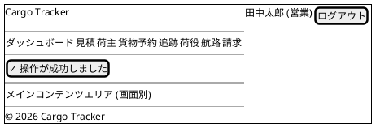

#### セッションタイムアウト警告 (共通動作)

JWT / Cookie の有効期限の 5 分前に htmx で警告モーダルを表示し、「セッション延長」ボタンで再認証を促す。
未操作のまま期限切れになった場合は `/login` にリダイレクトする。

### Bootstrap 5 グリッド運用ルール

- コンテナ: `<div class="container-fluid px-4">` を共通レイアウトで採用
- 主要レイアウト: 12 カラムグリッド (`row` + `col-md-*`)
- ブレークポイント: `sm` (576px) / `md` (768px) / `lg` (992px) / `xl` (1200px)
- モバイル (375px): 単一カラム、サイドナビゲーションはハンバーガーメニュー化

---

## 画面遷移図

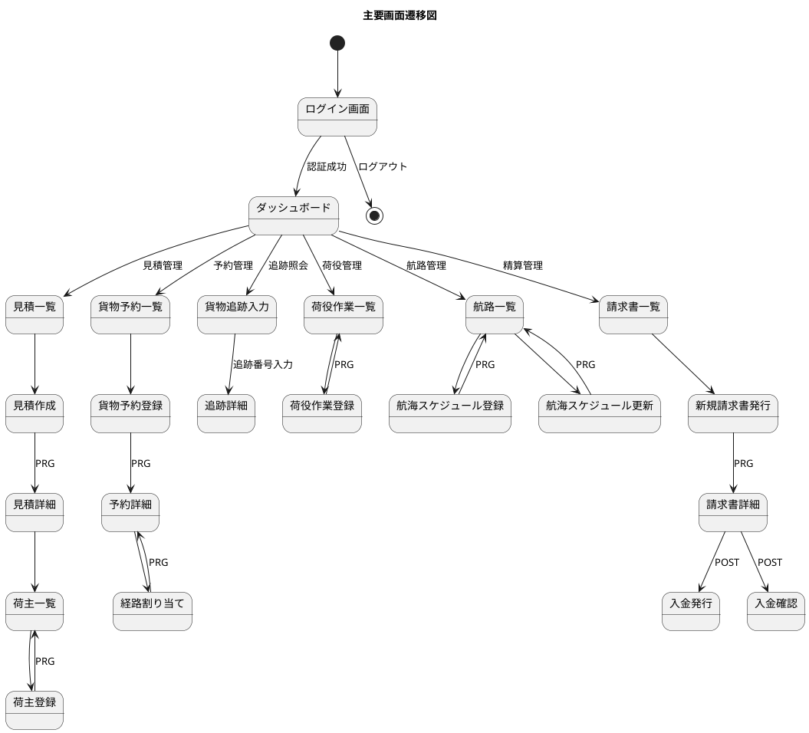

---

## 画面詳細設計

代表 5 画面のワイヤーフレームと仕様を示す。残りの画面 (見積一覧/作成/詳細・荷主一覧/登録・航路一覧/登録/更新・請求書一覧/詳細・荷役一覧 等) は Scala 版 `tmp/case-study-cargo-tracker/docs/design/ui_design.md` の構造を踏襲し、Lucid 関数として実装する。

### ログイン画面 (`/login`)

#### ワイヤーフレーム

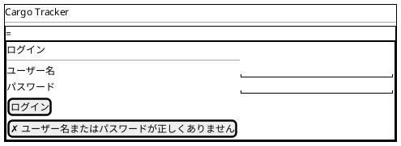

#### 仕様

- **Servant**: `"login" :> Get '[HTML] (Html ())` (フォーム表示) と `"login" :> ReqBody '[FormUrlEncoded] LoginForm :> Post '[HTML] (Headers '[Header "Set-Cookie" Text, Header "Location" Text] NoContent)` (認証処理)
- **フォーム型**: `data LoginForm = LoginForm { username :: Text, password :: Text } deriving (Generic, FromForm)`
- **認証**: bcrypt でハッシュ照合 → JWT または HMAC 署名付き Cookie を発行 → ダッシュボードへ 303 リダイレクト
- **エラー**: 認証失敗時はフォーム再表示 + Flash メッセージ。失敗回数 5 回でアカウントロック (`users.failed_login_attempts`)
- **CSRF**: Double Submit Cookie パターン (Layout に meta タグ埋め込み)

### ダッシュボード (`/`)

#### ワイヤーフレーム

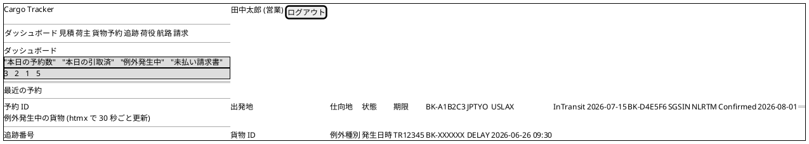

#### 仕様

- **Servant**: `Get '[HTML] (Html ())`
- **Lucid view**: `dashboardView :: DashboardSummary -> Html ()` で `mainLayout` 合成
- **データ**: `QueryService` の `findDashboardSummary :: AppM DashboardSummary` で 1 クエリ集約 (集計を SQL で実行)
- **htmx 動的更新**: 例外発生中ブロックを `hx-get="/dashboard/exceptions" hx-trigger="every 30s" hx-target="#exceptions-container"` で更新
- **ロール別表示**: `Shipper` は自分の予約のみ表示、`Tracker` は例外ブロックを強調

### 貨物予約詳細 (`/bookings/:bookingId`)

#### ワイヤーフレーム

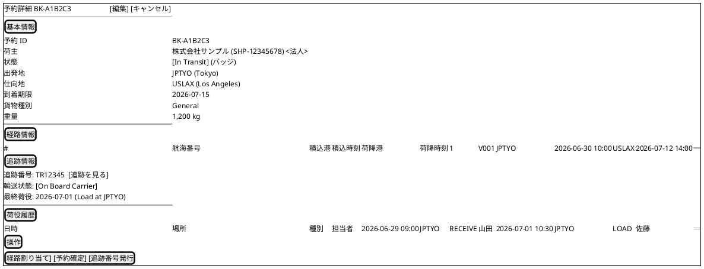

#### 仕様

- **Servant**: `"bookings" :> Capture "id" Text :> Get '[HTML] (Html ())`
- **Query Service**: `findBookingDetail :: BookingId -> AppM (Maybe BookingDetailDto)` (cargo + leg + tracking + handling を JOIN で 1 クエリ集約)
- **操作ボタン**: ロール + 状態に応じて表示制御 (`Sales` のみ「予約確定」「経路割り当て依頼」、`RouteDesigner` のみ「追跡番号発行」)
- **状態バッジ**: `BookingStatus` に応じて `bg-secondary` / `bg-primary` / `bg-info` / `bg-success` / `bg-warning` / `bg-danger` 等を選択
- **htmx**: 追跡情報ブロックは `hx-get="/bookings/:id/tracking-summary" hx-trigger="every 60s"` で更新

### 追跡詳細 (`/tracking/:trackingNumber`)

#### ワイヤーフレーム

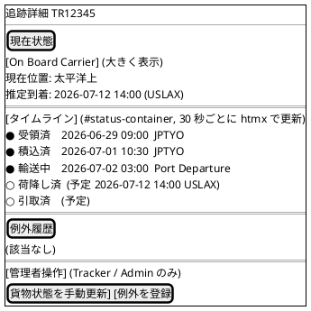

#### 仕様

- **Servant**: `"tracking" :> Capture "number" Text :> Header "HX-Request" Text :> Get '[HTML] (Html ())`
- **htmx ヘッダ判定**: `HX-Request: true` の場合はタイムライン fragment のみ返す、それ以外は全画面
- **公開エンドポイント**: `/public/tracking/:number` は認証不要。ナビゲーション・管理者操作を省略した簡易レイアウト
- **htmx**: タイムラインを `hx-get="/tracking/:number" hx-trigger="every 30s" hx-headers='{"HX-Request":"true"}'` で更新
- **手動状態更新 (US17, IT7)**: `[貨物状態を手動更新]` は `hx-get="/tracking/:number/manual-update"` で編集フォーム (状態選択 + 変更理由) をモーダル/インライン表示。POST `/tracking/:number/manual-update` (PRG 303) で更新し `tracking_state_audit` に監査ログ (前状態・新状態・変更者・理由) を記録。Role: Tracker / Admin 限定、それ以外は 403

##### M-14 反映: 地図 + タイムラインのメタファー強化

追跡詳細画面を以下の **三層構造** に再設計する。「貨物の現在地が一目でわかる」UX を実現する。

| 層 | 表示内容 | 実装方針 |
| :--- | :--- | :--- |
| **上部 (Map View)** | 世界地図上に出発地・経由港・現在地・目的地のピンを表示。現在地は点滅マーカー | Leaflet.js (OSM タイル) + 静的地点座標 (`location` テーブルに `lat`/`lon` カラム追加) |
| **中部 (Timeline)** | 出発 → 受領 → 積込 → 輸送中 → 荷降し → 引取の状態タイムライン (水平方向 step indicator) | Bootstrap 5 progress + カスタム CSS。現在状態を強調 |
| **下部 (Event History)** | 時系列のイベント一覧 (日時・場所・作業種別・操作者) | Bootstrap 5 list-group |

実装方針:

- 地図は **Lucid で `<div id="map" data-route='[...]'>` を出力** し、JS 側で Leaflet を初期化
- 地点座標は `Location` 値オブジェクトに `latitude :: Maybe Double` / `longitude :: Maybe Double` を追加 (将来拡張)
- 公開貨物追跡 (`/public/tracking/:number`) でも地図表示を提供 (荷主・荷受人が共有しやすい)
- 地図 / タイムライン / イベント履歴の 3 層は段階的に htmx で更新可能 (`hx-target="#status-container"` 等)

```haskell
-- Views/Tracking/Show.hs
showView :: AuthenticatedUser -> CsrfToken -> TrackingDetailDto -> Html ()
showView user csrf dto = mainLayout user csrf "追跡詳細" Nothing $ do
  -- 上部: 地図ビュー (M-14)
  section_ [class_ "tracking-map mb-4"] $ do
    h2_ [class_ "visually-hidden"] "貨物の現在位置"
    div_ [ id_ "map"
         , class_ "leaflet-container"
         , style_ "height: 400px;"
         , data_ "route" (toJSON (mapPoints dto))
         , aria_ "label" "貨物の輸送経路を表示する地図"
         ] mempty

  -- 中部: タイムライン
  section_ [class_ "tracking-timeline mb-4"
           , id_ "timeline-container"
           , aria_ "live" "polite"  -- M-16: 自動更新を読み上げ
           ] $ do
    h2_ "輸送ステータス"
    timelineFragment dto

  -- 下部: イベント履歴
  section_ [class_ "tracking-events"] $ do
    h2_ "イベント履歴"
    eventListView (tdEvents dto)
```

##### M-16 反映: htmx 部分更新時の `aria-live` 規約

htmx で動的に置き換えられる領域には **必ず `aria-live` 属性を設定** し、スクリーンリーダーが更新を読み上げるようにする。

| 更新領域 | `aria-live` 値 | 理由 |
| :--- | :--- | :--- |
| 追跡タイムライン (30 秒ポーリング) | `polite` | 重要だが緊急ではない。会話を中断しない |
| 例外発生通知 (荷主向け) | `assertive` | 緊急 (遅延・破損・紛失) は即座に通知 |
| フォームバリデーションエラー | `polite` | 入力中の読み上げを中断しない |
| 検索結果一覧 (インクリメンタル検索) | `polite` | 入力中の頻繁な更新で中断回避 |
| ダッシュボードの例外数表示 | `polite` | 自動更新を控えめに通知 |
| 楽観ロック衝突モーダル | `assertive` | 即座にユーザーに気付かせる |
| Flash メッセージ (成功・エラー) | `polite` | PRG パターン後の通知 |

追加属性:

- `aria-atomic="true"`: 領域全体を一括で読み上げる (部分的な変化でも全体読み直し)
- `aria-busy="true"`: htmx リクエスト中は設定し、完了時 `false` に戻す

```html
<!-- 良い例: タイムライン領域 -->
<section id="timeline-container"
         aria-live="polite"
         aria-atomic="true"
         hx-get="/tracking/TR12345/status"
         hx-trigger="every 30s">
  <!-- timelineFragment が置き換わる -->
</section>

<!-- 良い例: 例外通知 (緊急) -->
<div id="exception-alert"
     aria-live="assertive"
     hx-get="/notifications/exceptions"
     hx-trigger="every 60s">
</div>
```

実装ルール:

- 全 24 画面の htmx 動的更新領域に `aria-live` を漏れなく設定
- Lucid ヘルパー関数 `liveRegion :: AriaLive -> Html () -> Html ()` を用意し、デフォルトで `polite` を強制
- E2E テスト (Playwright + axe-core) で `aria-live` 設定漏れを自動検出

### 荷役作業登録 (`/handling/new`)

#### ワイヤーフレーム

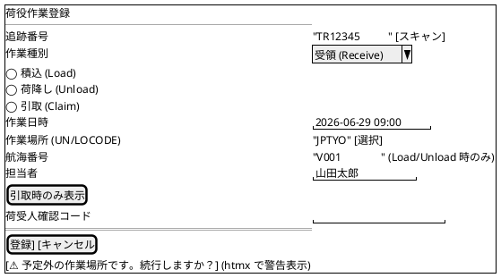

#### 仕様

- **Servant**: `"handling" :> "new" :> Get '[HTML] (Html ())` + `"handling" :> ReqBody '[FormUrlEncoded] HandlingForm :> Post ...`
- **フォーム型**:
  ```haskell
  data HandlingForm = HandlingForm
    { hfTrackingNumber :: Text
    , hfEventType      :: Text
    , hfCompletionTime :: UTCTime
    , hfLocation       :: Text
    , hfVoyageNumber   :: Maybe Text
    , hfOperator       :: Maybe Text
    , hfConsigneeConfirmation :: Maybe Text
    } deriving (Generic, FromForm)
  ```
- **動的フィールド**: `eventType` の変更を htmx で検知 (`hx-trigger="change"`) し、`Load`/`Unload` 時に `voyage_number` を必須化、`Claim` 時に `荷受人確認コード` を表示
- **妥当性検証**: ドメイン層の `isValidFor :: HandlingActivity -> CargoSnapshot -> HandlingValidity` を呼び出し、`Misrouted` の場合はエラー、`Warning` の場合は htmx で警告表示し再確認

#### モバイル (375px) レイアウト

タブレット・スマホでの利用を想定し、`col-12` の単一カラム + 大きめのタッチターゲット (後述の規約参照)。
追跡番号入力欄にバーコードスキャン連携 (`hx-trigger="qrcode-scanned"` でカスタムイベント)。

#### オフライン・通信断対応 (H-14 反映: IT1 で前倒し検討)

港湾・倉庫は通信不安定が常態のため、Service Worker + IndexedDB によるオフライン対応を **IT5 (荷役登録実装時) までに完成** させる。

**設計方針**:

1. **Service Worker**: `static/js/sw.js` で `/handling/new` のフォーム送信を intercept
2. **IndexedDB**: オフライン時の POST リクエスト (action / formData / timestamp) を `pending-handling-events` ストアに永続化
3. **再送キュー**: `online` イベント発火時に IndexedDB から取り出して順次再送 (FIFO)
4. **UI フィードバック**: オフライン時は黄色バナー「オフライン: 作業は端末に保存され、オンライン復帰時に送信されます」を常時表示
5. **競合解決**: サーバー側で楽観ロック (`version` カラム) を確認し、競合時は再送リクエストを「保留中」として管理画面に表示

**Lucid + htmx での実装スケッチ**:

```haskell
-- Views/Handling/New.hs
newHandlingFormView :: AuthenticatedUser -> Html ()
newHandlingFormView _ = mainLayout "荷役作業登録" Nothing $ do
  div_ [id_ "offline-banner", class_ "alert alert-warning d-none", role_ "alert"]
    "オフライン: 作業は端末に保存され、オンライン復帰時に送信されます"
  form_
    [ method_ "POST"
    , action_ "/handling"
    , hxPost_ "/handling"
    , hxTarget_ "#form-result"
    , hxOn_ "htmx:sendError" "queueOfflineSubmit(event)"  -- Service Worker 連携
    ] $ do
      -- フォームフィールド
      ...
```

**初期リリース (Release 0.1) では未対応**、Release 1.0 MVP までに対応。Release 1.0 の判定基準に追加。

#### エラー状態統一ハンドリング (H-15 反映)

24 画面で発生し得るエラー (ネットワーク・権限・楽観ロック衝突) は **共通フラグメント** `Views/Fragments/ErrorAlert.hs` で統一表示する。

| HTTP ステータス | 表示メッセージ | 表示位置 | 自動消失 |
| :--- | :--- | :--- | :--- |
| 401 (未認証) | `/login` へリダイレクト | 全画面 | - |
| 403 (権限不足) | 「この操作を実行する権限がありません」 | ページ上部 alert-danger | 8 秒 |
| 404 (リソース未存在) | 「指定されたリソースが見つかりません」 | ページ上部 alert-warning | 8 秒 |
| 409 (楽観ロック衝突) | 「他のユーザーが更新しました。最新の内容を確認して再度操作してください」 + 再読込ボタン | モーダル | 手動閉じ |
| 422 (バリデーション) | フィールド毎に赤字エラー (Bootstrap `.invalid-feedback`) | 該当フィールド下 | 入力で消失 |
| 5xx (サーバーエラー) | 「一時的なエラーが発生しました。しばらくしてから再度お試しください」(詳細はログのみ) | ページ上部 alert-danger | 手動閉じ |
| ネットワーク切断 (htmx) | 「オフラインです。オンライン復帰を待っています」(黄バナー、Service Worker 連動) | 全画面上部 | online 復帰で消失 |

htmx の `hx-on:htmx:response-error` をグローバルで定義し、ステータスコード毎に統一処理:

```html
<!-- Layout.hs の <body> 直下に配置 -->
<div id="global-error-handler"
     hx-on:htmx:response-error="window.handleHtmxError(event)"
     hx-on:htmx:send-error="window.handleNetworkError(event)"></div>

<script>
window.handleHtmxError = (event) => {
  const status = event.detail.xhr.status;
  const handlers = {
    401: () => location.href = '/login?returnTo=' + encodeURIComponent(location.pathname),
    403: () => showAlert('danger', 'この操作を実行する権限がありません'),
    409: () => showConflictModal(),
    422: () => {} /* フィールドエラーは hx-target で部分更新済み */,
    500: () => showAlert('danger', '一時的なエラーが発生しました。しばらくしてから再度お試しください'),
  };
  (handlers[status] || handlers[500])();
};
</script>
```

#### タッチターゲット・コントラスト規約 (H-16 反映)

WCAG 2.5.5 (Target Size) と Apple HIG / Material Design に準拠し、以下を **全ボタン・リンク・入力フィールドに適用** する。

| 要素 | 最小タッチターゲット | 推奨 |
| :--- | :---: | :---: |
| プライマリボタン (CTA) | 44×44 px | 48×48 px |
| セカンダリボタン | 44×44 px | - |
| ラジオ・チェックボックス | 44×44 px (周辺の `<label>` 含む) | - |
| アイコンボタン (削除等) | 44×44 px | - |
| テキスト入力 | 高さ 44 px 以上 | 48 px |
| 隣接するボタン間の間隔 | 8 px 以上 | 12 px |

Bootstrap 5 では:

- 通常ボタン (`.btn`) は約 38 px → モバイル向けに `.btn-lg` (約 48 px) を **荷役登録画面では必須**
- カスタム CSS で `.touch-target` クラス (`min-width: 44px; min-height: 44px;`) を定義

```css
/* static/css/custom.css */
.touch-target,
.btn-lg,
.form-control-lg {
  min-width: 44px;
  min-height: 44px;
}

@media (max-width: 768px) {
  .btn { min-width: 44px; min-height: 44px; }
}
```

コントラスト比 (WCAG AA):

- 通常テキスト: 4.5:1 以上
- 18pt 以上または太字 14pt 以上: 3:1 以上
- ステータスバッジ (IN_TRANSIT 等の色付き要素): 背景とのコントラスト 3:1 以上を確保

**ステータスバッジのコントラスト検証結果** (Bootstrap 5 デフォルトテーマ):

| バッジ | 背景色 | 文字色 | コントラスト比 | WCAG AA |
| :--- | :--- | :--- | :---: | :---: |
| `bg-primary` (Confirmed 等) | `#0d6efd` | `#ffffff` | 4.51 | ✅ |
| `bg-success` (Delivered) | `#198754` | `#ffffff` | 4.55 | ✅ |
| `bg-warning` (RouteProposed) | `#ffc107` | `#000000` | 11.34 | ✅ |
| `bg-danger` (Cancelled) | `#dc3545` | `#ffffff` | 4.50 | ✅ |
| `bg-info` (TrackingIssued) | `#0dcaf0` | `#000000` | 8.59 | ✅ |
| `bg-secondary` (Preliminary) | `#6c757d` | `#ffffff` | 5.07 | ✅ |

→ 全 6 バリエーション WCAG AA 準拠。色のみに依存せず、テキストラベルも併用すること。

---

## 料金算出画面 (`/pricing/calculate`, US21 IT6 追加)

輸送料金の算出画面。GET / POST を同一 URL に配置し、成功時は入力フォームに結果カードを追加してレンダリングする (PRG は使用せず、POST 200 で結果表示)。

### ワイヤーフレーム

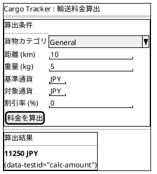

### 遷移とインタラクション

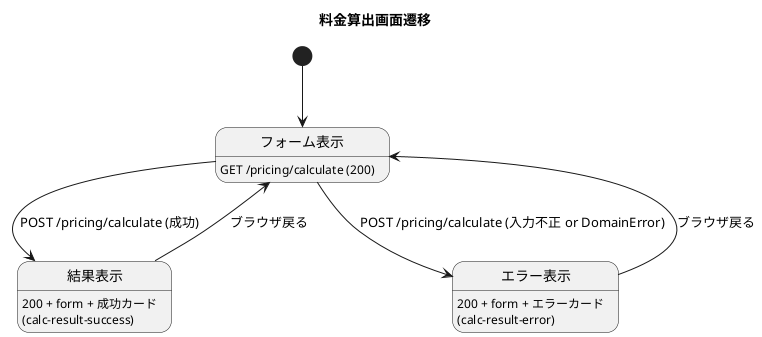

### 業務ルール

1. 貨物カテゴリは `General` / `Refrigerated` / `Hazardous` の 3 種のみ受理 (未対応値は「未対応の貨物カテゴリ: X」エラー)
2. 距離 / 重量 / 割引率は 0 以上の整数 (小数点不可、フォームで `min=0` + `pattern` で制約)
3. 基準通貨 / 対象通貨は ISO 4217 の 3 文字大文字 (`pattern="[A-Z]{3}"`)
4. 割引率は 0-100 の整数 (フォームで `max=100`)
5. DomainError (PricingRuleNotFound / CurrencyRateNotFound / CurrencyRateExpired 等) は 500 でなく 200 + エラー表示で返す (UX 重視)

### E2E テスト用属性

- `data-testid="calc-result-success"`: 算出成功カードのルート
- `data-testid="calc-amount"`: 表示金額
- `data-testid="calc-result-error"`: 算出失敗カードのルート

---

## 通知一覧画面 (`/notifications?bookingId=X`, US26 IT6 追加)

管理者ビューで予約 ID 別の通知履歴をテーブル表示する。

### ワイヤーフレーム

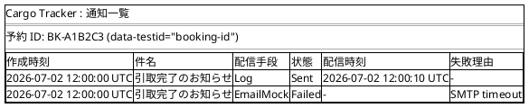

### 遷移とインタラクション

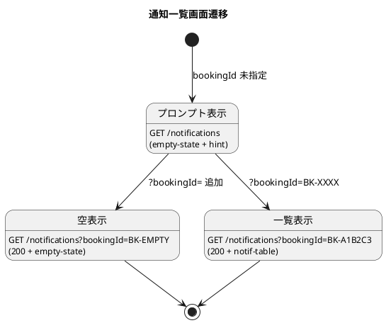

### 業務ルール

1. `bookingId` クエリパラメータが未指定または空文字の場合、プロンプト empty-state を表示 (「bookingId が未指定です」)
2. 該当予約の通知履歴が 0 件なら empty-state (「この予約の通知履歴はまだありません」)
3. 履歴ありならテーブル (6 列: 作成時刻 / 件名 / 配信手段 / 状態 / 配信時刻 / 失敗理由) をレンダリング
4. 状態バッジ: Sent=`bg-success` (緑) / Failed=`bg-danger` (赤) / Pending=`bg-secondary` (灰)
5. 履歴は `created_at DESC` で並び (新しい通知が上)
6. 認証は現行未実装だが、将来的に管理者ロール (Admin) の AuthProtect を適用予定 (IT7 T6-09)

### E2E テスト用属性

- `data-testid="booking-id"`: 予約 ID の表示要素
- `data-testid="empty-state"`: 履歴なし時のカード
- `data-testid="notif-table"`: 通知テーブル本体
- `data-testid="notif-row"`: 各通知行 (件数カウント用)

---

## 例外一覧・登録画面 (`/exceptions`, US19/US20 IT7 追加)

Exception BC (domain-model.md §11, data-model.md §exception_record) の
Interfaces。3 種例外 (Delay / Damage / Loss) を統一 UI で扱い、
ADR-0014 に基づく Tracking 状態遷移 (`TsInException`) と原子的に統合する。

### ワイヤーフレーム (一覧)

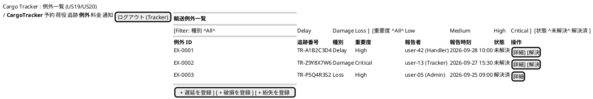

### ワイヤーフレーム (遅延登録フォーム)

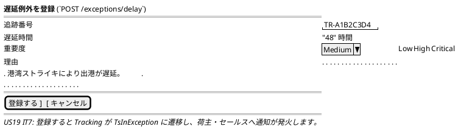

### ワイヤーフレーム (破損登録フォーム)

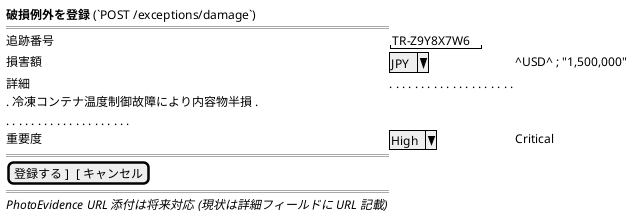

### ワイヤーフレーム (紛失登録フォーム)

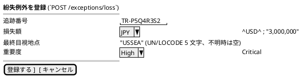

### 画面遷移

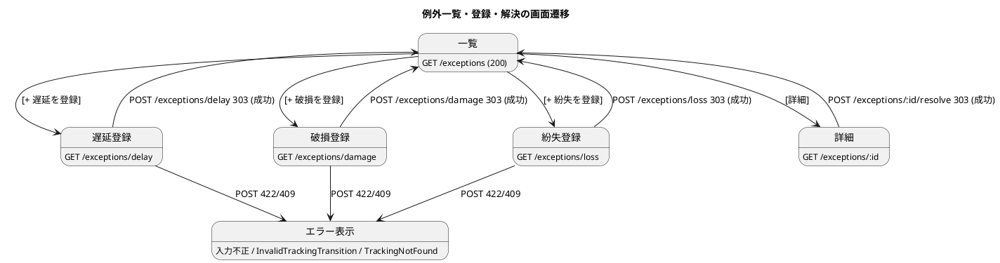

### エラー時のフラッシュメッセージ

| DomainError | HTTP | 表示メッセージ |
| :--- | :---: | :--- |
| `InvalidDelayHours` | 422 | 「遅延時間は正の整数を入力してください」 |
| `InvalidExceptionReason "empty"` | 422 | 「理由を入力してください」 |
| `InvalidExceptionReason "too long"` | 422 | 「理由は 500 文字以内で入力してください」 |
| `InvalidCost` (負の損害額 / 損失額) | 422 | 「金額は 0 以上を入力してください」 |
| `InvalidCurrency` | 422 | 「通貨は ISO 4217 大文字 3 文字で入力してください (JPY/USD)」 |
| `InvalidReporter` | 422 | 「セッションから報告者を特定できませんでした」 |
| `TrackingNotFound` | 404 | 「該当する追跡番号が見つかりません」 |
| `InvalidTrackingTransition from to` | 409 | 「現在の状態 (from) から例外状態への遷移は禁止されています (ADR-0014)」 |
| `ExceptionAlreadyResolved` | 409 | 「この例外は既に解決済です」 |

### `data-testid` 規約

- `data-testid="exception-list"`: 一覧テーブル本体
- `data-testid="exception-row"`: 各行 (件数 / assertion 用)
- `data-testid="exception-form-delay"` / `-damage` / `-loss`: 3 種登録フォーム
- `data-testid="exception-detail"`: 詳細セクション
- `data-testid="resolve-button"`: 解決ボタン
- `data-testid="tracking-transition-error"`: ADR-0014 遷移エラー表示

### 実装参照

- Application: `Cargotracker.Exception.Application.Record{Delay,Damage,Loss}ExceptionCommand` / `ResolveExceptionCommand`
- Cross-BC: `Cargotracker.Tracking.Application.Ports.markInExceptionByTrackingNumber` (ADR-0014 Phase 1)
- Interfaces: `Cargotracker.Exception.Interfaces.ExceptionListPageApi` (未実装、次イテレーション)
- 権限判定: Handler / Tracker / Admin のみ登録可 (Tracker / Admin のみ解決可)

---

## 請求書画面 (`/billing/invoices`, US23 IT8 追加)

精算処理 (US23) の 3 画面。iteration_plan-8 の設計に基づき IT8 で実装。
RoleGate (`canManageBilling` = Accountant/MasterAdmin) を全エンドポイントに適用する
(ADR-0016)。

### 請求書一覧

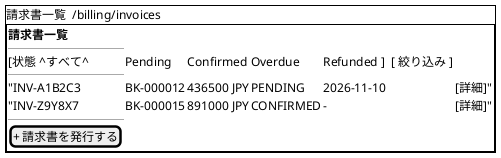

### 新規請求書発行

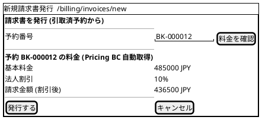

### 請求書詳細 (入金発行 / 入金確認)

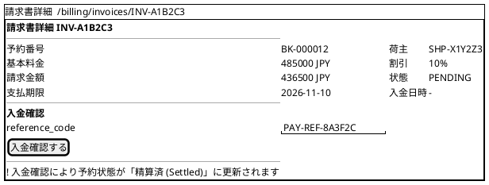

### 実装注記 (IT8)

- 状態に応じてフォームを出し分ける: PENDING かつ支払期限未設定 → 入金発行
  フォーム、PENDING (期限設定済) / OVERDUE → 入金確認フォーム、
  CONFIRMED / REFUNDED → フォーム非表示
- フィードバックは flash クエリコード方式 (`?flash=issued|payment-issued|confirmed|not-delivered|already-exists|reference-mismatch|already-confirmed|not-found|bad-due-date`)。
  Location ヘッダに日本語を含めない
- **画面遷移図との差分**: 発行成功時の PRG は請求書詳細ではなく
  `/billing/invoices?flash=issued` (一覧) に戻る (実装済の挙動)
- CSV 出力・PDF 出力 (画面一覧の記載) は IT8 スコープ外
- 実装: `Cargotracker.Billing.Views.InvoiceViews` /
  `Cargotracker.Billing.Interfaces.BillingPageApi` (6 エンドポイント)

---

## 共通パンくず (Breadcrumb) 規約 (L-10 反映)

階層深い画面 (予約詳細 → 経路割り当て、貨物追跡 → 追跡詳細 等) で戻り動線が画面ごとにブレないよう、**共通パンくずコンポーネント** を全画面で統一する。

### 設計方針

- Bootstrap 5 の `breadcrumb` コンポーネントを使用
- `mainLayout` の第 6 引数として `[BreadcrumbItem]` を受け取る (省略不可、空リストは「ホーム」のみ表示)
- 各画面のビュー関数は自身のパンくず階層を宣言的に渡す
- 最後の要素は `aria-current="page"` で現在ページを明示

```haskell
-- Views/Layout.hs
data BreadcrumbItem = BreadcrumbItem
  { biLabel :: !Text
  , biLink  :: !(Maybe Text)   -- Just URL = リンク、Nothing = 現在ページ
  }

mainLayout :: AuthenticatedUser
           -> CsrfToken
           -> Text              -- title
           -> [BreadcrumbItem]  -- breadcrumb (省略不可)
           -> Maybe FlashMessage
           -> Html ()
           -> Html ()
mainLayout user csrf title crumbs flash content = doctypehtml_ $ do
  head_ $ ...
  body_ $ do
    navView user
    main_ [class_ "container"] $ do
      breadcrumbView crumbs
      alertsView flash
      content
    footerView

breadcrumbView :: [BreadcrumbItem] -> Html ()
breadcrumbView crumbs = nav_ [ariaLabel_ "パンくずリスト"] $
  ol_ [class_ "breadcrumb"] $ do
    li_ [class_ "breadcrumb-item"] $
      a_ [href_ "/"] "ホーム"
    forM_ crumbs $ \(BreadcrumbItem label link) ->
      case link of
        Just url -> li_ [class_ "breadcrumb-item"] $
          a_ [href_ url] (toHtml label)
        Nothing  -> li_ [class_ "breadcrumb-item active", ariaCurrent_ "page"] $
          toHtml label
```

### 標準パンくず階層

| 画面 | パンくず |
| :--- | :--- |
| ダッシュボード | ホーム |
| 貨物予約一覧 | ホーム > 貨物予約 |
| 貨物予約登録 | ホーム > 貨物予約 > 新規登録 |
| 予約詳細 | ホーム > 貨物予約 > BK-XXXXXX |
| 経路割り当て | ホーム > 貨物予約 > BK-XXXXXX > 経路割り当て |
| 貨物追跡入力 | ホーム > 貨物追跡 |
| 追跡詳細 | ホーム > 貨物追跡 > TR12345 |
| 荷役作業一覧 | ホーム > 荷役作業 |
| 荷役作業登録 | ホーム > 荷役作業 > 新規登録 |
| 航路一覧 | ホーム > 航路 |
| 航海スケジュール登録 | ホーム > 航路 > 新規登録 |
| 航海スケジュール更新 | ホーム > 航路 > V001 > 更新 |
| 請求書一覧 | ホーム > 請求書 |
| 請求書詳細 | ホーム > 請求書 > INV-001 |

### 利用例

```haskell
-- Views/Booking/Show.hs
bookingShowView :: AuthenticatedUser -> CsrfToken -> BookingDetailDto -> Html ()
bookingShowView user csrf dto = mainLayout user csrf "予約詳細"
  [ BreadcrumbItem "貨物予約" (Just "/bookings")
  , BreadcrumbItem (unBookingId (bdBookingId dto)) Nothing  -- 現在ページ
  ]
  Nothing $ do
    -- 詳細コンテンツ
    ...
```

これにより全画面で戻り動線が一貫し、ユーザーの認知負荷が低減する。
パンくず欠落は型システム (`mainLayout` 引数必須) で防止する。

## Lucid ビュー構成 (実装方針)

```text
src/Cargotracker/Views/
├── Layout.hs                -- mainLayout / navView / footerView
├── Fragments.hs             -- alertsView / paginationView / statusBadgeView / cargoSummaryView
├── Auth/
│   └── Login.hs
├── Dashboard.hs
├── Estimate/
│   ├── Index.hs / New.hs / Show.hs
│   └── RouteCandidates.hs   -- htmx fragment
├── Shipper/
│   ├── Index.hs / New.hs
├── Booking/
│   ├── Index.hs / New.hs / Show.hs / Route.hs
│   └── CargoRow.hs          -- htmx fragment
├── Tracking/
│   ├── Index.hs / Show.hs
│   └── StatusTimeline.hs    -- htmx fragment
├── Handling/
│   ├── Index.hs / New.hs
├── Voyage/
│   ├── Index.hs / New.hs / Edit.hs
└── Billing/
    └── Invoices/
        ├── Index.hs / Show.hs / New.hs
```

### 代表的なビュー関数のシグネチャ

```haskell
mainLayout       :: AuthenticatedUser -> Text -> Maybe FlashMessage -> Html () -> Html ()
navView          :: AuthenticatedUser -> Html ()
alertsView       :: Maybe FlashMessage -> Html ()
statusBadgeView  :: BookingStatus -> Html ()

-- 画面
loginView        :: Maybe Text -> Html ()
dashboardView    :: AuthenticatedUser -> DashboardSummary -> Html ()
bookingIndexView :: AuthenticatedUser -> [BookingSummary] -> Pagination -> Html ()
bookingShowView  :: AuthenticatedUser -> BookingDetailDto -> Html ()

-- htmx 部分更新用
trackingTimelineFragment :: TrackingDetailDto -> Html ()
exceptionsFragment       :: [ExceptionSummary] -> Html ()
```

### Servant ハンドラの統合パターン

```haskell
type WebAPI =
       AuthProtect "cookie-auth" :> "" :> Get '[HTML] (Html ())            -- ダッシュボード
  :<|> AuthProtect "cookie-auth" :> "bookings" :> Get '[HTML] (Html ())
  :<|> AuthProtect "cookie-auth" :> "bookings" :> Capture "id" Text :> Get '[HTML] (Html ())
  :<|>                              "login"    :> Get '[HTML] (Html ())
  :<|>                              "login"    :> ReqBody '[FormUrlEncoded] LoginForm
                                               :> Post '[HTML] (SetCookie303 NoContent)

webServer :: ServerT WebAPI AppM
webServer = dashboard :<|> listBookings :<|> showBooking
       :<|> loginForm :<|> doLogin
```

---

## アクセシビリティ・i18n

### アクセシビリティ

- 全フォーム要素に `<label>` を付与
- ボタン・リンクに `aria-label` を必要に応じて付与
- ステータスバッジには `aria-live="polite"` で動的更新を読み上げ
- キーボードナビゲーション: タブ順を `tabindex` で制御せず HTML 構造順に従う
- コントラスト比 4.5:1 以上 (Bootstrap デフォルトテーマで担保)

### 国際化 (将来対応)

初期リリースは日本語のみ。将来 `messages_ja.properties` 相当の Haskell 実装は `data-default-class` ベースの `Messages` レコード + Reader で配信予定。

---

## デザインシステム要素

### カラー

| 用途 | Bootstrap クラス | 用途例 |
| :--- | :--- | :--- |
| プライマリ | `bg-primary` / `btn-primary` | メイン操作 |
| 成功 | `bg-success` | `Delivered` / `Settled` |
| 情報 | `bg-info` | `Confirmed` / `OnboardCarrier` |
| 警告 | `bg-warning` | `RouteProposed` / 警告メッセージ |
| 危険 | `bg-danger` | `Cancelled` / 例外発生 |
| セカンダリ | `bg-secondary` | `Preliminary` / 中立状態 |

### バッジ表現の例

```haskell
statusBadgeView :: BookingStatus -> Html ()
statusBadgeView s = span_ [class_ (cls s)] (toHtml (label s))
  where
    cls Preliminary    = "badge bg-secondary"
    cls RouteProposed  = "badge bg-warning"
    cls RouteAssigned  = "badge bg-info"
    cls Confirmed      = "badge bg-info"
    cls TrackingIssued = "badge bg-info"
    cls InTransit      = "badge bg-primary"
    cls Delivered      = "badge bg-success"
    cls Settled        = "badge bg-success"
    cls Cancelled      = "badge bg-danger"
    label = T.pack . show
```

### コンポーネント

- カード: `<div class="card">` で予約・追跡サマリを表示
- テーブル: `<table class="table table-hover">` で一覧
- フォーム: `<form class="row g-3">` でグリッド配置
- アラート: `<div class="alert alert-success/danger/warning/info">` でフラッシュメッセージ

---

## 参照

- [バックエンドアーキテクチャ](architecture_backend.md)
- [フロントエンドアーキテクチャ](architecture_frontend.md)
- [ドメインモデル設計](domain-model.md)
- [ユーザーストーリー](../requirements/user_story.md)
- Scala 版参考: `tmp/case-study-cargo-tracker/docs/design/ui_design.md` (全画面ワイヤーフレームの詳細)
