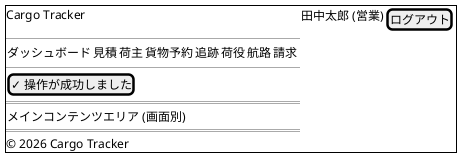
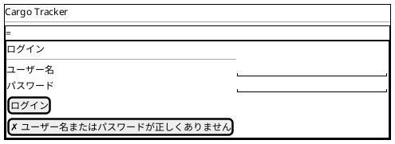
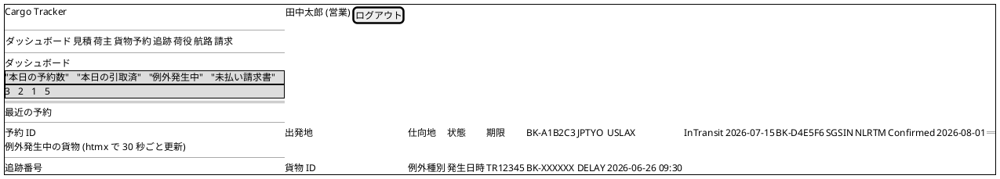
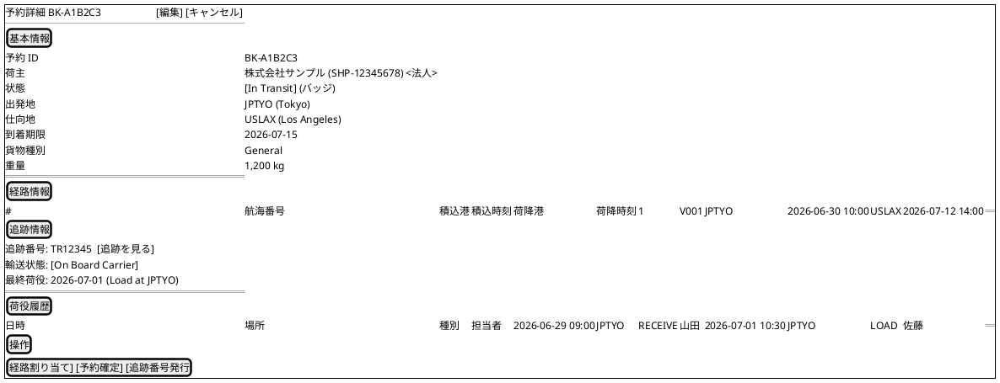
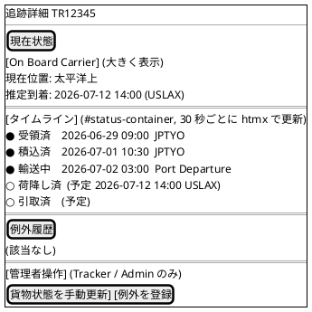
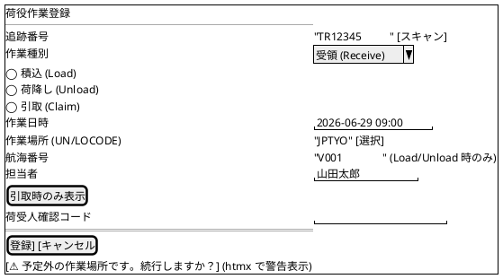

# UI 設計 - 国際貨物輸送管理システム (Haskell 版)

## 概要

本ドキュメントでは、国際貨物輸送管理システム (Haskell 版) の UI 設計を定義する。

### 設計方針

**OOUX (オブジェクト指向 UI 設計)** をベースに、ユーザーが操作する「オブジェクト」(貨物予約・追跡・荷役・航路・請求書・見積) を中心に画面を構成する。各画面はオブジェクトの状態を可視化し、アクターに応じた操作を提供する。

### 技術スタック

| 技術 | 役割 |
| :--- | :--- |
| Servant + Warp | HTTP 配信。Web 画面エンドポイントは `Get '[HTML] (Html ())` 型として定義 |
| Lucid | SSR (サーバーサイドレンダリング) で HTML を生成。Haskell コードそのものでコンパイル時型検査 |
| htmx 2.x | フォームバリデーション・ステータス自動更新など部分的な動的更新 |
| Bootstrap 5 | レスポンシブグリッド・コンポーネント |
| `Web.FormUrlEncoded` (`FromForm`) | サーバーサイドの形式バリデーション (ドメイン層の業務ルール検証と二段構え) |
| PRG パターン | フォーム送信後は `303 See Other` + Flash Cookie で二重送信を防止 |

### 基本 UX 原則

- **オブジェクト中心**: 一覧 → 詳細 → アクションの自然な流れ
- **状態の可視化**: `BookingStatus`・`TransportStatus` をバッジで常時表示
- **フィードバック**: 操作成功・失敗は Flash Cookie 経由のメッセージで通知
- **アクセシビリティ**: ARIA ラベル・キーボードナビゲーション対応

---

## UI オブジェクト定義

OOUX に基づき、システム内の主要オブジェクトとそのアクション・属性を定義する。

### 主要オブジェクト

| オブジェクト | 主な属性 | ユーザーアクション | 関連オブジェクト |
| :--- | :--- | :--- | :--- |
| **貨物予約 (Booking)** | bookingId, 出発地, 目的地, 希望期限, 貨物種別, 重量, BookingStatus | 新規登録・詳細確認・経路設計依頼・予約確定・キャンセル | 追跡情報, 航路, 荷役履歴, 見積 |
| **追跡情報 (Tracking)** | trackingNumber, TransportStatus, 現在地, ステータス履歴, 例外履歴 | 追跡番号検索・履歴確認・状態更新・例外登録 (管理者) | 貨物予約 |
| **荷役作業 (HandlingActivity)** | 作業 ID, 貨物 ID, 荷役種別, 場所, 実施日時, 担当者 | 新規登録・一覧確認 | 貨物予約 |
| **航路 (Voyage)** | voyageNumber, 船名, 出発港, 到着港, 出発予定日, 到着予定日, 対応貨物種別 | 一覧確認・新規登録・更新・経路割り当てへの提供 | 貨物予約 |
| **請求書 (Invoice)** | invoiceId, 貨物予約, 金額, 割引, 消費税, PaymentStatus | 一覧確認・詳細確認・支払い確認 | 貨物予約 |
| **見積 (Estimate)** | estimateId, 出発地, 目的地, 期限, 貨物種別, 重量, ルート候補 | 新規作成・詳細確認 | 貨物予約 |
| **荷主 (Shipper)** | shipperCode, 種別 (個人/法人), 名称, 連絡先, 割引率 (法人) | 一覧・登録・詳細 | 貨物予約 |

### オブジェクト間の関係

```text
Booking 1 ─── 1 Tracking
Booking 1 ─── N HandlingActivity
Booking N ─── M Voyage (経路割り当てを通じて)
Booking 1 ─── 1 Invoice
Estimate 1 ─── N RouteCandidate (見積→予約への引き継ぎは将来対応)
Shipper 1 ─── N Booking
```

---

## 画面一覧

対応 US は [ユーザーストーリー](../requirements/user_story.md) (US01〜US25) に対応付ける。

| 画面名 | URL パス | 説明 | 主要アクター | 対応 US |
| :--- | :--- | :--- | :--- | :--- |
| ログイン | `/login` | 認証フォーム | 全ロール | - |
| ダッシュボード | `/` | 全体サマリー・最新荷役情報 | 全ロール | - |
| 見積一覧 | `/estimates` | 見積の一覧・検索 | 営業担当者 | US01 |
| 見積作成 | `/estimates/new` | 新規見積フォーム | 営業担当者 | US01 |
| 見積詳細 | `/estimates/:estimateId` | 見積詳細・ルート候補一覧 | 営業担当者 | US01 |
| 荷主一覧・登録 | `/shippers`, `/shippers/new` | 荷主の一覧・新規登録 (個人/法人) | 営業担当者 | US02, US03 |
| 貨物予約一覧 | `/bookings` | 予約済み貨物の一覧・検索 | 荷主, 営業担当者 | US04, US06 |
| 貨物予約登録 | `/bookings/new` | 新規予約フォーム | 営業担当者 | US04, US05 |
| 予約詳細 | `/bookings/:bookingId` | 予約情報・経路・荷役履歴・確定/引き渡し操作 | 荷主, 営業担当者 | US06, US12, US13, US14 |
| 経路割り当て | `/bookings/:bookingId/routes` | 航海検索・経路候補から経路を選択・確定 | 経路設計者, 営業担当者 | US07, US08, US09, US10, US11 |
| 貨物追跡入力 | `/tracking` | 追跡番号入力フォーム | 荷主, 荷受人, 追跡管理者 | US18 |
| 追跡詳細 | `/tracking/:trackingNumber` | 輸送ステータス履歴タイムライン・状態更新・例外登録 | 荷主, 荷受人, 追跡管理者 | US17, US18, US19, US20 |
| 荷役作業登録 | `/handling/new` | 荷役イベント登録フォーム (引取時は荷受人確認) | 荷役作業員 | US15, US16 |
| 荷役作業一覧 | `/handling` | 荷役履歴一覧・検索 | 荷役作業員, 追跡管理者 | US15 |
| 航路一覧 | `/voyages` | 航路・スケジュール一覧・検索 | 経路設計者 | US24, US25 |
| 航海スケジュール登録 | `/voyages/new` | 航海スケジュール新規登録フォーム | 経路設計者 | US24 |
| 航海スケジュール更新 | `/voyages/:voyageNumber/edit` | 既存スケジュールの差分確認・上書き更新 | 経路設計者 | US25 |
| 請求書一覧 | `/billing/invoices` | 請求書の一覧・ステータス管理・CSV 出力 | 経理担当者 | US23 |
| 新規請求書発行 | `/billing/invoices/new` | 引取済予約の選択・料金自動算出 | 経理担当者 | US21, US22 |
| 請求書詳細 | `/billing/invoices/:invoiceId` | 請求書詳細・割引内訳・支払い確認・PDF 出力 | 経理担当者 | US22, US23 |
| 入金発行 | `/billing/invoices/:id/issue-payment` (POST) | 確定済 Invoice に支払期日 + reference_code を設定 (Pending 遷移) | 経理担当者 | US23 |
| 入金確認 | `/billing/invoices/:id/confirm-payment` (POST) | reference_code 入力で入金確認 → Confirmed + Cargo.Settled 遷移 | 経理担当者 | US23 |
| 公開貨物追跡 | `/public/tracking/:trackingNumber` | 認証不要の貨物状態照会 | 荷主・荷受人 (未認証) | US18 |

---

## 共通レイアウト設計

### ロール定義

| ロール | 主な権限 | 表示メニュー |
| :--- | :--- | :--- |
| `Shipper` | 予約照会、追跡照会、請求書照会 | ダッシュボード、貨物予約一覧 (自分のみ)、追跡入力、請求書一覧 (自分のみ) |
| `Sales` | 見積作成、荷主登録、貨物予約登録、予約確定、経路通知 | 見積、荷主、貨物予約、追跡 |
| `RouteDesigner` | 航海スケジュール管理、経路選択・確定、追跡番号発行 | 航路、貨物予約 (経路設計)、追跡 |
| `Handler` | 荷役作業登録 | ダッシュボード、荷役作業 |
| `Tracker` | 追跡状態更新、例外対応 | ダッシュボード、追跡 |
| `Accountant` | 請求書発行、支払い確認 | ダッシュボード、請求書 |
| `Admin` | 全機能 | 全メニュー + 割引ポリシー管理 |

### ナビゲーション構成

```text
[ロゴ] Cargo Tracker                                    [ユーザー名] [ログアウト]
────────────────────────────────────────────────────────────────────────
ダッシュボード | 見積 | 荷主 | 貨物予約 | 追跡 | 荷役 | 航路 | 請求 | (管理)
```

ロールに応じて表示メニューを動的に制御する (`navView :: AuthenticatedUser -> Html ()`)。

### 共通レイアウト ワイヤーフレーム (PlantUML salt)



#### セッションタイムアウト警告 (共通動作)

JWT / Cookie の有効期限の 5 分前に htmx で警告モーダルを表示し、「セッション延長」ボタンで再認証を促す。
未操作のまま期限切れになった場合は `/login` にリダイレクトする。

### Bootstrap 5 グリッド運用ルール

- コンテナ: `<div class="container-fluid px-4">` を共通レイアウトで採用
- 主要レイアウト: 12 カラムグリッド (`row` + `col-md-*`)
- ブレークポイント: `sm` (576px) / `md` (768px) / `lg` (992px) / `xl` (1200px)
- モバイル (375px): 単一カラム、サイドナビゲーションはハンバーガーメニュー化

---

## 画面遷移図

```plantuml
@startuml
title 主要画面遷移図

[*] --> ログイン画面
ログイン画面 --> ダッシュボード : 認証成功

state "営業フロー" {
  ダッシュボード --> 見積一覧
  見積一覧 --> 見積作成
  見積作成 --> 見積詳細 : PRG
  見積詳細 --> 荷主一覧
  荷主一覧 --> 荷主登録
  荷主登録 --> 荷主一覧 : PRG
  ダッシュボード --> 貨物予約一覧
  貨物予約一覧 --> 貨物予約登録
  貨物予約登録 --> 予約詳細 : PRG
  予約詳細 --> 経路割り当て
  経路割り当て --> 予約詳細 : PRG
}

state "追跡フロー" {
  ダッシュボード --> 貨物追跡入力
  貨物追跡入力 --> 追跡詳細 : 追跡番号入力
}

state "荷役フロー" {
  ダッシュボード --> 荷役作業一覧
  荷役作業一覧 --> 荷役作業登録
  荷役作業登録 --> 荷役作業一覧 : PRG
}

state "経路設計フロー" {
  ダッシュボード --> 航路一覧
  航路一覧 --> 航海スケジュール登録
  航海スケジュール登録 --> 航路一覧 : PRG
  航路一覧 --> 航海スケジュール更新
  航海スケジュール更新 --> 航路一覧 : PRG
}

state "精算フロー" {
  ダッシュボード --> 請求書一覧
  請求書一覧 --> 新規請求書発行
  新規請求書発行 --> 請求書詳細 : PRG
  請求書詳細 --> 入金発行 : POST
  請求書詳細 --> 入金確認 : POST
}

ログイン画面 --> [*] : ログアウト
@enduml
```

---

## 画面詳細設計

代表 5 画面のワイヤーフレームと仕様を示す。残りの画面 (見積一覧/作成/詳細・荷主一覧/登録・航路一覧/登録/更新・請求書一覧/詳細・荷役一覧 等) は Scala 版 `tmp/case-study-cargo-tracker/docs/design/ui_design.md` の構造を踏襲し、Lucid 関数として実装する。

### ログイン画面 (`/login`)

#### ワイヤーフレーム



#### 仕様

- **Servant**: `"login" :> Get '[HTML] (Html ())` (フォーム表示) と `"login" :> ReqBody '[FormUrlEncoded] LoginForm :> Post '[HTML] (Headers '[Header "Set-Cookie" Text, Header "Location" Text] NoContent)` (認証処理)
- **フォーム型**: `data LoginForm = LoginForm { username :: Text, password :: Text } deriving (Generic, FromForm)`
- **認証**: bcrypt でハッシュ照合 → JWT または HMAC 署名付き Cookie を発行 → ダッシュボードへ 303 リダイレクト
- **エラー**: 認証失敗時はフォーム再表示 + Flash メッセージ。失敗回数 5 回でアカウントロック (`users.failed_login_attempts`)
- **CSRF**: Double Submit Cookie パターン (Layout に meta タグ埋め込み)

### ダッシュボード (`/`)

#### ワイヤーフレーム



#### 仕様

- **Servant**: `Get '[HTML] (Html ())`
- **Lucid view**: `dashboardView :: DashboardSummary -> Html ()` で `mainLayout` 合成
- **データ**: `QueryService` の `findDashboardSummary :: AppM DashboardSummary` で 1 クエリ集約 (集計を SQL で実行)
- **htmx 動的更新**: 例外発生中ブロックを `hx-get="/dashboard/exceptions" hx-trigger="every 30s" hx-target="#exceptions-container"` で更新
- **ロール別表示**: `Shipper` は自分の予約のみ表示、`Tracker` は例外ブロックを強調

### 貨物予約詳細 (`/bookings/:bookingId`)

#### ワイヤーフレーム



#### 仕様

- **Servant**: `"bookings" :> Capture "id" Text :> Get '[HTML] (Html ())`
- **Query Service**: `findBookingDetail :: BookingId -> AppM (Maybe BookingDetailDto)` (cargo + leg + tracking + handling を JOIN で 1 クエリ集約)
- **操作ボタン**: ロール + 状態に応じて表示制御 (`Sales` のみ「予約確定」「経路割り当て依頼」、`RouteDesigner` のみ「追跡番号発行」)
- **状態バッジ**: `BookingStatus` に応じて `bg-secondary` / `bg-primary` / `bg-info` / `bg-success` / `bg-warning` / `bg-danger` 等を選択
- **htmx**: 追跡情報ブロックは `hx-get="/bookings/:id/tracking-summary" hx-trigger="every 60s"` で更新

### 追跡詳細 (`/tracking/:trackingNumber`)

#### ワイヤーフレーム



#### 仕様

- **Servant**: `"tracking" :> Capture "number" Text :> Header "HX-Request" Text :> Get '[HTML] (Html ())`
- **htmx ヘッダ判定**: `HX-Request: true` の場合はタイムライン fragment のみ返す、それ以外は全画面
- **公開エンドポイント**: `/public/tracking/:number` は認証不要。ナビゲーション・管理者操作を省略した簡易レイアウト
- **htmx**: タイムラインを `hx-get="/tracking/:number" hx-trigger="every 30s" hx-headers='{"HX-Request":"true"}'` で更新

### 荷役作業登録 (`/handling/new`)

#### ワイヤーフレーム



#### 仕様

- **Servant**: `"handling" :> "new" :> Get '[HTML] (Html ())` + `"handling" :> ReqBody '[FormUrlEncoded] HandlingForm :> Post ...`
- **フォーム型**:
  ```haskell
  data HandlingForm = HandlingForm
    { hfTrackingNumber :: Text
    , hfEventType      :: Text
    , hfCompletionTime :: UTCTime
    , hfLocation       :: Text
    , hfVoyageNumber   :: Maybe Text
    , hfOperator       :: Maybe Text
    , hfConsigneeConfirmation :: Maybe Text
    } deriving (Generic, FromForm)
  ```
- **動的フィールド**: `eventType` の変更を htmx で検知 (`hx-trigger="change"`) し、`Load`/`Unload` 時に `voyage_number` を必須化、`Claim` 時に `荷受人確認コード` を表示
- **妥当性検証**: ドメイン層の `isValidFor :: HandlingActivity -> CargoSnapshot -> HandlingValidity` を呼び出し、`Misrouted` の場合はエラー、`Warning` の場合は htmx で警告表示し再確認

#### モバイル (375px) レイアウト

タブレット・スマホでの利用を想定し、`col-12` の単一カラム + 大きめのタッチターゲット (`btn-lg`)。
追跡番号入力欄にバーコードスキャン連携 (`hx-trigger="qrcode-scanned"` でカスタムイベント)。

#### オフライン・通信断対応 (将来)

`navigator.serviceWorker` で IndexedDB にフォームデータを一時保存し、オンライン復帰時に POST 再送する PWA 化は初期リリース対象外。

---

## Lucid ビュー構成 (実装方針)

```text
src/Cargotracker/Views/
├── Layout.hs                -- mainLayout / navView / footerView
├── Fragments.hs             -- alertsView / paginationView / statusBadgeView / cargoSummaryView
├── Auth/
│   └── Login.hs
├── Dashboard.hs
├── Estimate/
│   ├── Index.hs / New.hs / Show.hs
│   └── RouteCandidates.hs   -- htmx fragment
├── Shipper/
│   ├── Index.hs / New.hs
├── Booking/
│   ├── Index.hs / New.hs / Show.hs / Route.hs
│   └── CargoRow.hs          -- htmx fragment
├── Tracking/
│   ├── Index.hs / Show.hs
│   └── StatusTimeline.hs    -- htmx fragment
├── Handling/
│   ├── Index.hs / New.hs
├── Voyage/
│   ├── Index.hs / New.hs / Edit.hs
└── Billing/
    └── Invoices/
        ├── Index.hs / Show.hs / New.hs
```

### 代表的なビュー関数のシグネチャ

```haskell
mainLayout       :: AuthenticatedUser -> Text -> Maybe FlashMessage -> Html () -> Html ()
navView          :: AuthenticatedUser -> Html ()
alertsView       :: Maybe FlashMessage -> Html ()
statusBadgeView  :: BookingStatus -> Html ()

-- 画面
loginView        :: Maybe Text -> Html ()
dashboardView    :: AuthenticatedUser -> DashboardSummary -> Html ()
bookingIndexView :: AuthenticatedUser -> [BookingSummary] -> Pagination -> Html ()
bookingShowView  :: AuthenticatedUser -> BookingDetailDto -> Html ()

-- htmx 部分更新用
trackingTimelineFragment :: TrackingDetailDto -> Html ()
exceptionsFragment       :: [ExceptionSummary] -> Html ()
```

### Servant ハンドラの統合パターン

```haskell
type WebAPI =
       AuthProtect "cookie-auth" :> "" :> Get '[HTML] (Html ())            -- ダッシュボード
  :<|> AuthProtect "cookie-auth" :> "bookings" :> Get '[HTML] (Html ())
  :<|> AuthProtect "cookie-auth" :> "bookings" :> Capture "id" Text :> Get '[HTML] (Html ())
  :<|>                              "login"    :> Get '[HTML] (Html ())
  :<|>                              "login"    :> ReqBody '[FormUrlEncoded] LoginForm
                                               :> Post '[HTML] (SetCookie303 NoContent)

webServer :: ServerT WebAPI AppM
webServer = dashboard :<|> listBookings :<|> showBooking
       :<|> loginForm :<|> doLogin
```

---

## アクセシビリティ・i18n

### アクセシビリティ

- 全フォーム要素に `<label>` を付与
- ボタン・リンクに `aria-label` を必要に応じて付与
- ステータスバッジには `aria-live="polite"` で動的更新を読み上げ
- キーボードナビゲーション: タブ順を `tabindex` で制御せず HTML 構造順に従う
- コントラスト比 4.5:1 以上 (Bootstrap デフォルトテーマで担保)

### 国際化 (将来対応)

初期リリースは日本語のみ。将来 `messages_ja.properties` 相当の Haskell 実装は `data-default-class` ベースの `Messages` レコード + Reader で配信予定。

---

## デザインシステム要素

### カラー

| 用途 | Bootstrap クラス | 用途例 |
| :--- | :--- | :--- |
| プライマリ | `bg-primary` / `btn-primary` | メイン操作 |
| 成功 | `bg-success` | `Delivered` / `Settled` |
| 情報 | `bg-info` | `Confirmed` / `OnboardCarrier` |
| 警告 | `bg-warning` | `RouteProposed` / 警告メッセージ |
| 危険 | `bg-danger` | `Cancelled` / 例外発生 |
| セカンダリ | `bg-secondary` | `Preliminary` / 中立状態 |

### バッジ表現の例

```haskell
statusBadgeView :: BookingStatus -> Html ()
statusBadgeView s = span_ [class_ (cls s)] (toHtml (label s))
  where
    cls Preliminary    = "badge bg-secondary"
    cls RouteProposed  = "badge bg-warning"
    cls RouteAssigned  = "badge bg-info"
    cls Confirmed      = "badge bg-info"
    cls TrackingIssued = "badge bg-info"
    cls InTransit      = "badge bg-primary"
    cls Delivered      = "badge bg-success"
    cls Settled        = "badge bg-success"
    cls Cancelled      = "badge bg-danger"
    label = T.pack . show
```

### コンポーネント

- カード: `<div class="card">` で予約・追跡サマリを表示
- テーブル: `<table class="table table-hover">` で一覧
- フォーム: `<form class="row g-3">` でグリッド配置
- アラート: `<div class="alert alert-success/danger/warning/info">` でフラッシュメッセージ

---

## 参照

- [バックエンドアーキテクチャ](architecture_backend.md)
- [フロントエンドアーキテクチャ](architecture_frontend.md)
- [ドメインモデル設計](domain-model.md)
- [ユーザーストーリー](../requirements/user_story.md)
- Scala 版参考: `tmp/case-study-cargo-tracker/docs/design/ui_design.md` (全画面ワイヤーフレームの詳細)
