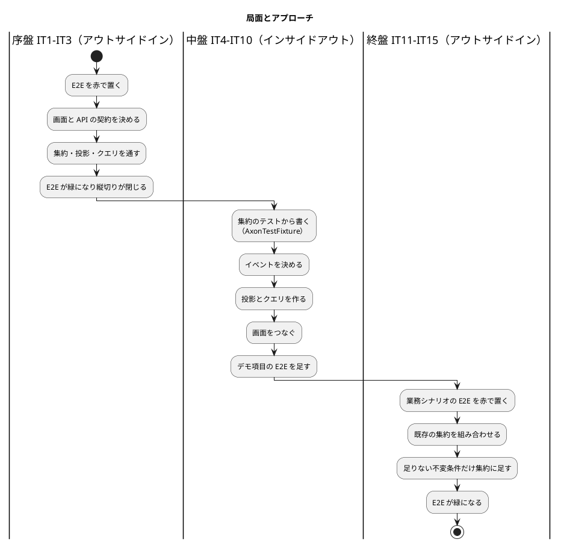
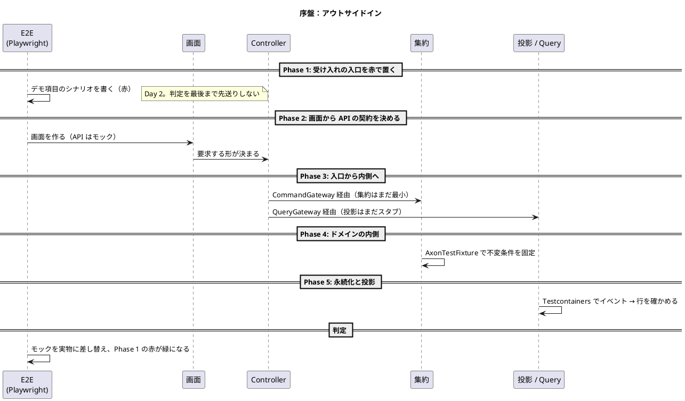
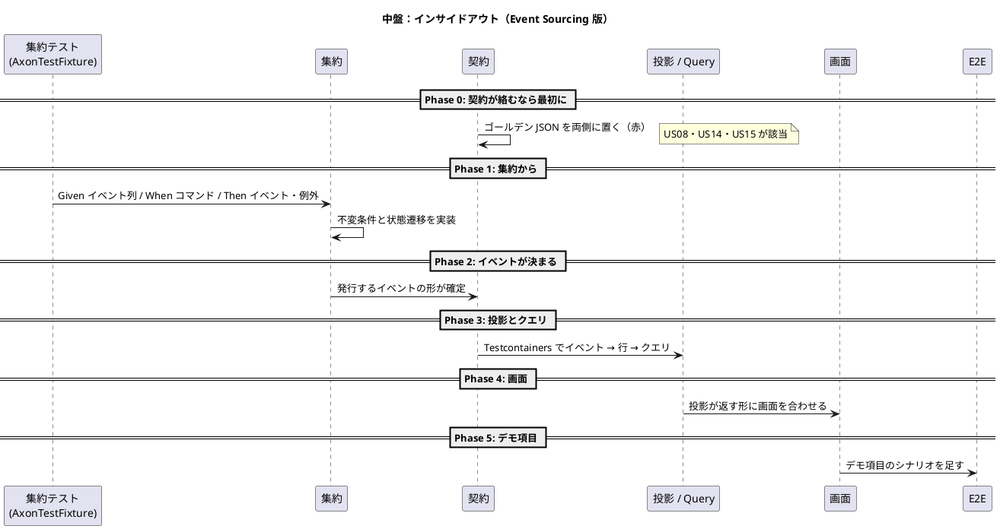
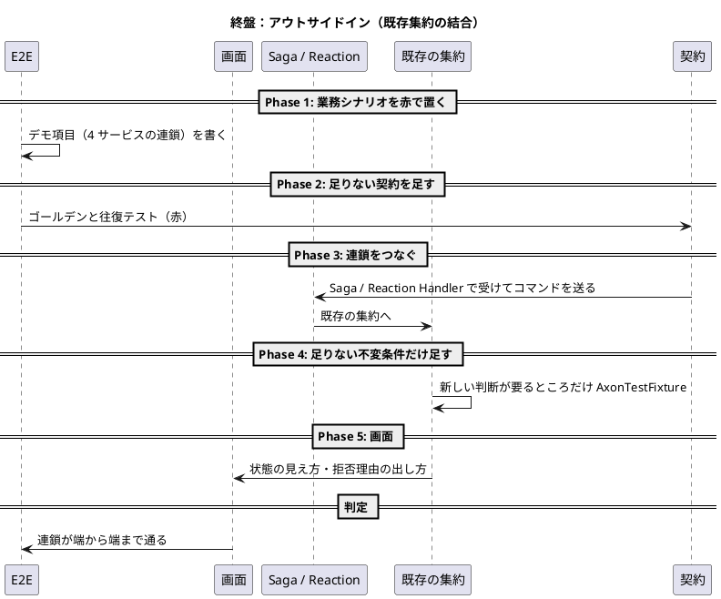

# 開発戦略 - 国際貨物輸送管理システム（CQRS / Event Sourcing 版）

## 概要

[リリース計画](release_plan.md) で確定した 15 イテレーションを **序盤・中盤・終盤** の 3 局面に分け、各局面で「テストの入口をどこに置き、レイヤーをどの順に貫通するか」を定めます。

局面ごとに変えるのは**テストの入口とレイヤー貫通の順序だけ**です。Red-Green-Refactor のサイクル、1 コミット 1 変更、品質基準、アーキテクチャテストを常に緑に保つことは、局面が変わっても動きません。局面を分ける目的は、作り方を都合よく変えることではなく、**その時点で最も不確かなものを最初に潰す**ことにあります。

### 参照元（この文書が正典でないもの）

| 内容 | 正典 |
| :--- | :--- |
| イテレーションへのストーリー配分・SP・リリースの区切り | [リリース計画](release_plan.md) |
| 各 IT の対象ストーリー・タスク・デモ項目・DoD | `iteration_plan-N.md` |
| 受入基準 | [ユーザーストーリー](../../requirements/user_story.md) |
| アーキテクチャ・ドメイン・データ・UI・テスト・非機能・運用 | [設計 10 件](../../design/cargo-tracker/index.md) |
| 技術的意思決定 | [ADR-0001〜0003](../../adr/cargo-tracker/index.md) |
| TDD サイクルとアプローチ選択フロー | [コーディングとテストガイド](../../reference/コーディングとテストガイド.md) |

**この文書が正典なのは「どの IT でどちらのアプローチを採るか」と「イテレーションの完了をどう受け入れ判定するか」です。**

### この設計に固有の前提

Event Sourcing では「内側」の意味が普通の CRUD と違います。集約が生むのはイベントで、テーブルはそのイベントから作られる**下流**です。したがってインサイドアウトの出発点はデータ層ではなく**集約**であり、投影テーブルはそのあとに来ます。この順序の入れ替わりが、本戦略で最も注意を要する点です。

もう 1 つ、サービスを越えるストーリーには **契約**（`shared/contract` のイベント・コマンド・クエリ）という第 3 の入口があります。契約は両側のサービスが同じ 1 つを読むもので、片側だけ先に書くと相手側は緑のまま壊れます。契約が絡む IT では、局面のアプローチにかかわらず**契約のゴールデン JSON を最初に置きます**。

## 戦略の全体像

| 局面 | 対象 IT | リリース | 主アプローチ | 狙い |
| :--- | :--- | :--- | :--- | :--- |
| **序盤** | IT1〜IT3 | 0.1 | アウトサイドイン | 縦切りで「歩けるスケルトン」を通し、Axon 5 とサービス構成の妥当性を早期に確かめる |
| **中盤** | IT4〜IT10 | 0.2〜1.0 | インサイドアウト | 中核ドメイン（経路探索・状態遷移・荷役の妥当性）を集約から作り込み、貧血ドメインモデルを避ける |
| **終盤** | IT11〜IT15 | 1.1〜2.0 | アウトサイドイン | できあがった集約を業務シナリオ起点で束ね、例外・通関・精算・キャンセルの一貫性を担保する |

### アプローチ選択の根拠

[コーディングとテストガイド](../../reference/コーディングとテストガイド.md) の実装アプローチ選択フローに対応づけます。局面が機械的な区切りではなく、そのときの状態から導かれることを示すためです。

| 局面 | フロー上の判定 | 導かれるアプローチ |
| :--- | :--- | :--- |
| 序盤 | API 実装済み？ → **いいえ** | 「アウトサイドイン活用（UI のニーズから API 設計を導出）」。加えて Axon 5 の実機挙動も未確定なので、薄く速く貫通させて不確実性を先に消す |
| 中盤 | 基本 CRUD 実装済み？ → **いいえ**（中核ドメインは未着手） | 「インサイドアウト推奨（データ層から開始し基盤を固めて上位層へ）」。ただし ES では起点が集約になる。経路探索・状態遷移・荷役の妥当性・料金計算は、画面から導くと必ず貧血になる |
| 終盤 | 基本 CRUD 実装済み？ → **はい** かつ ドメインロジックが複雑？ → **はい** | 「アウトサイドイン推奨（UI からスタートしドメインロジックを段階的に実装）」。例外・通関・精算・キャンセルは既存集約の組み合わせであり、業務シナリオから束ねるほうが漏れが出ない |

**中盤を省略しない理由。** 本システムの中核は CRUD ではありません。予約の状態遷移表、経路探索、荷役種別ごとの要件、料金計算はいずれも集約の内側に置くべき判断です。これらを画面から導くと、判断がコントローラや投影に漏れて集約が空になります（[ドメインモデル設計](../../design/cargo-tracker/domain-model.md) の不変条件が守られなくなる）。中盤はそれを避けるための局面です。

## 共通の TDD サイクル

局面が変わっても、ここは動きません。

### Red-Green-Refactor の 3 原則

1. **失敗するテストを書くまで、本番コードを書かない。** 「壊して赤」を確かめる。不変条件を 1 つ外して赤くならないテストは、その判断を検査していない
2. **失敗させるのに十分なだけのテストを書く。** コンパイルが通らないことも失敗のうち
3. **テストを通すのに十分なだけの本番コードを書く。** 通ったらリファクタリングし、テストは緑のまま保つ

コミットは 1 変更 1 コミット。リファクタリングと振る舞いの変更を同じコミットに混ぜません。

### テスト種別とレイヤーの対応

| 種別 | 対象 | 判別すること | 判別しないこと |
| :--- | :--- | :--- | :--- |
| ユニット（`AxonTestFixture`） | 集約 | 不変条件・状態遷移・発行するイベント | イベントが Event Store に書かれること、投影が動くこと |
| ユニット | 値オブジェクト・ドメインサービス | 生成時の検証、料金計算、経路探索 | — |
| 統合（Testcontainers） | 投影・Saga・Reaction・Query | イベントから行への写し、冪等性、トークンの同一トランザクション、リプレイ | 画面での見え方 |
| 契約（ゴールデン + 往復） | `shared/contract` | JSON の形（丸ごと一致）、両側が同じ 1 つを読むこと | 業務の正しさ |
| 境界（ArchUnit・ソース走査） | パッケージ・名簿・設定 | 依存方向、契約の名簿、Processing Group の列挙 | 実行時の振る舞い |
| E2E（Playwright） | 画面 | 到達性、反映中、409、デモ項目のシナリオ | 個々の不変条件 |

詳細は [テスト戦略](../../design/cargo-tracker/test_strategy.md) を正典とします。

### 品質チェック

各 IT の DoD で確認します。**ローカルも CI と同じコマンドを使います。** `test` だけでは SpotBugs と JaCoCo の閾値が抜けます。

| 対象 | コマンド |
| :--- | :--- |
| バックエンド | `./gradlew build`（SpotBugs・JaCoCo のレイヤー別閾値を含む） |
| バックエンド（時刻） | `TZ=UTC ./gradlew test` |
| フロントエンド | `npm run test`、`npx tsc -b`、`npm run build` |
| E2E | Playwright |
| ドキュメント | `npx gulp okf:check`、`mkdocs build` |

`npx tsc --noEmit` は使いません。プロジェクト参照構成では何も検査しないためです。

### 不変の規律

| 規律 | 内容 |
| :--- | :--- |
| アーキテクチャテストを常に緑に保つ | ArchUnit が赤のままコミットしない。ルールを緩めるときは ADR を起こす |
| 名簿は「載っていないもの」を通さない向きで書く | 契約・Processing Group・許可リストはすべてこの向き |
| コメントで書いた保証は同じ変更で検査に落とす | 「〜しない」「〜まで確かめる」は宣言しただけでは守られない |
| 設計判断が変わったらその場で `docs/design/` を更新する | 計画側だけに書いて放置しない |
| 投影はコマンドを送らない | イベントからコマンドを送るのは `application/reaction` と `@Saga` だけ |

## デモ項目を受け入れ基準とする

各 `iteration_plan-N.md` のデモ項目は、イテレーションレビューで実演するシナリオです。これを**そのままパスする受け入れテストに翻訳し、当該 IT の受け入れ基準とします**。

- **序盤（IT1）**: まず E2E 基盤（Playwright）を立て、スモークを **Day 2 に赤で置きます**。ウォーキングスケルトンの成立を最後まで判定できない状態を作らないためです。IT1 のデモ項目は「ログインから荷主登録の縦切り」と「全ルートの到達性」が中心になります
- **序盤（IT2・IT3）以降**: 各 IT のデモ項目を「操作の系列」に翻訳して E2E に足します
- **判定**: 当該 IT のデモ項目テストがすべて緑であることを DoD に含めます。**緑でなければイテレーションはクローズしません**
- **回帰**: 追加したテストは以降のすべての IT で回します。過去のデモ項目が壊れたら、それは新しい変更の責任です

### デモ項目の書き方

**「誰が・何を操作し・何が起きるか」**で書きます。機能名の羅列にしません。加えて、**拒否・失敗する側を先に見せます**。

> IT1 #5「Axon Server を止めて登録 → コマンドが失敗する。一方で荷主一覧（クエリ）は表示できる」
> IT10「荷受人の確認なしの引取が断られる」→「確認を入れて引取を記録し、状態が『引取済』になる」

安全装置は「入れたこと」ではなく「働くこと」を見せて初めて入ったと言えます。この設計には無音で壊れうる箇所（Axon Server への接続、DCB、投影とトークンのトランザクション、契約の食い違い）が多いので、デモ項目に破る側を入れます。

### E2E の日時

テストデータの日時は業務タイムゾーン（`Asia/Tokyo`）の共有ヘルパで作ります。`toISOString()` を直接使うと CI（UTC）で 1 日中落ちます。荷役の日時だけは港のローカル時刻で入力し JST を併記する画面仕様なので、E2E もその形で書きます。

## 序盤: アウトサイドイン（IT1〜IT3 / Release 0.1）

### 目的

**Axon 5 とサービス構成の妥当性を、業務ロジックが薄いうちに確かめること。** この局面で確かめたいのは「荷主が登録できること」ではなく、「コマンドが Axon Server を通って集約に届き、イベントが Event Store に載り、投影が動き、クエリが返り、画面に出る」という経路が本当に閉じるかです。ここが閉じないまま中盤に進むと、ドメインを作り込んだ後で基盤の作り直しになります。

### 対象ユーザーストーリー

| IT | US | SP | この IT で確かめる不確実性 |
| :--- | :--- | :--: | :--- |
| IT1 | US26(3), US27(1), US02(5) | 9 | Axon 5 の API・DCB・crypto-shredding・縦切りの成立 |
| IT2 | US31(2), US03(2), US04(5) | 9 | 状態遷移を持つ集約（`Cargo`）が ES で書けるか。ES 適用範囲の見直し判定 |
| IT3 | US05(3), US06(2), US24(4) | 9 | 2 つ目のサービス（routingms）が同じ型で立ち上がるか |

### ワークフロー

### 手順

1. **E2E を赤で置く。** デモ項目のシナリオを Playwright に書く。この時点で必ず落ちる
2. **画面を先に作り、API の形を決める。** MSW でモックする。**モックは本物より甘くしない**（型・日付形式を OpenAPI に合わせ、`202` / `409` / `422` を返せるようにする）
3. **入口から内側へ薄く貫通させる。** Controller → CommandGateway → 集約（最小）→ QueryGateway → 投影（スタブ）
4. **集約の不変条件を `AxonTestFixture` で固定する。** ここで初めてドメインの判断を書く
5. **投影とクエリを Testcontainers で確かめ、モックを実物に差し替える。** Phase 1 の E2E が緑になったら縦切りが閉じた

### 完了条件

- [ ] 各 IT のデモ項目の受け入れテストが全緑
- [ ] IT1 のスパイク 7 項目に結論が出て、ADR-0001 と設計文書に反映されている
- [ ] 全ルートのプレースホルダ画面とロール別ナビが揃い、到達性が E2E で固定されている
- [ ] 品質ゲート（ArchUnit の未適用サービス検知・JaCoCo のレイヤー別閾値・Testcontainers・契約のゴールデン・Playwright・CI）が実配線されている
- [ ] `./gradlew build` と `TZ=UTC ./gradlew test` が緑
- [ ] IT2 のふりかえりで ES 適用範囲の見直し判定（実績ベロシティが 6.3 SP 未満なら `Quotation` / `Voyage` を状態保存へ）を行った

## 中盤: インサイドアウト（IT4〜IT10 / Release 0.2〜1.0）

### 目的

**中核ドメインを集約から作り込むこと。** この局面のストーリー（経路候補算出・経路の確定と状態遷移・荷役の妥当性検証・追跡状態の遷移）は、いずれも「どういう条件なら許すか」という判断の塊です。画面から導くと、その判断がコントローラや投影に漏れ、集約が値の入れ物になります。

ES では出発点がデータ層ではなく**集約**です。集約が発行するイベントが決まって初めて、投影テーブルの形が決まります。テーブルを先に決めると、イベントがテーブルの都合で歪みます。

### 対象ユーザーストーリー

| IT | US | SP | 中核の判断 |
| :--- | :--- | :--: | :--- |
| IT4 | US25(3), US07(3) | 6 + 負債 2 | 航海スケジュールの整合（時刻昇順・港の連結） |
| IT5 | US08(6), US09(4) | 10 | 経路探索（期限・貨物種別・除外港）、経路仕様を満たすかの判定 |
| IT6 | US10(3), US11(2), US12(3) | 8 | 経路設計へ戻す条件、通知の記録 |
| IT7 | US13(3), US14(6) | 9 | 「通知していない予約は確定できない」、追跡番号の二重発行禁止 |
| IT8 | US18(5), US17(3) | 8 | 荷主のデータ分離、手動更新で許される遷移 |
| IT9 | US15(7) | 7 + 予備 1 | 荷役種別ごとの要件、予定ルート外の判定 |
| IT10 | US16(3), US19(4) | 7 + 負債 1 | 引取の要件、例外から元の状態への復帰 |

### ワークフロー

### 手順

1. **契約が絡むなら、ゴールデン JSON を両側に置いてから始める。** 発行側だけのゴールデンは、購読側が別の形を期待していても緑になる
2. **集約のテストから書く。** Given にイベント列、When にコマンド、Then に発行イベントまたは例外。不変条件 1 つにつきテスト 1 つ。**壊して赤になることを確かめる**
3. **イベントの形を決める。** イベントには判断の**結果**だけを載せ、判断材料を載せない。再生時に判断をやり直さないため
4. **投影とクエリを Testcontainers で作る。** 冪等性（同一イベントの再配送）とトークンの同一トランザクションを一緒に確かめる
5. **画面をつなぎ、デモ項目の E2E を足す。** 画面は投影が返す形に合わせる。投影に無い値を画面で作らない

### 完了条件

- [ ] 各 IT のデモ項目の受け入れテストが全緑
- [ ] 追加した不変条件が「壊して赤」になることを確かめた
- [ ] 契約を足した IT では、両側のゴールデンと Axon Server 経由の往復テストがある
- [ ] 投影の冪等性・トークンの同一トランザクション・リプレイの検査がある
- [ ] `docs/design/cargo-tracker/` に反映すべき設計判断の変更を、同じ IT の中で反映した
- [ ] ArchUnit が緑（契約の名簿・Processing Group の列挙・`CommandGateway` の許可箇所）

## 終盤: アウトサイドイン（IT11〜IT15 / Release 1.1〜2.0）

### 目的

**できあがった集約を業務シナリオで束ねること。** この局面のストーリー（破損・紛失、誤配の再設計、通関、料金と精算、キャンセル承認）は、新しい集約を作るのではなく、既にある集約を複数サービスにまたがって連鎖させます。連鎖の抜けは集約のテストでは見つからず、業務シナリオを端から端まで通して初めて出ます。

たとえば US30（キャンセル承認）は、bookingms の承認 → 契約イベント → trackingms が陸揚げ地を記録 → handlingms でその港の荷降し → trackingms が追跡を閉じる → billingms がキャンセル料を載せる、という 4 サービスの連鎖です。ここは画面から入るのが自然です。

### 対象ユーザーストーリー

| IT | US | SP | 束ねる連鎖 |
| :--- | :--- | :--: | :--- |
| IT11 | US20(4), US28(6) | 10 | 荷役 → 誤配検知 → 追跡の例外 → 予約の経路状態 → 現在地起点の再設計 |
| IT12 | US29(6) | 6 + 負債 2 | 通関の状態変更 → 追跡の例外起票 → 引取のガード有効化 |
| IT13 | US21(6), US22(2) | 8 | 引取済 → 料金算出 → 割引 |
| IT14 | US01(4), US23(4) | 8 | 見積と請求の突き合わせ、入金 → 予約の精算済 |
| IT15 | US30(6) | 6 + 仕上げ 2 | キャンセル承認 → 陸揚げ → 追跡を閉じる → キャンセル料 |

### ワークフロー

### 手順

1. **業務シナリオの E2E を赤で置く。** 4 サービスの連鎖を 1 本のシナリオとして書く
2. **足りない契約を足す。** ゴールデン JSON を両側に置き、Axon Server 経由の往復テストを書く。契約が増えるときは名簿の ArchUnit が赤くなるので、ADR を起こして名簿を更新する
3. **Saga または Reaction Handler で連鎖をつなぐ。** 補償の経路も 1 本ずつ書く。**失敗は「例外にしない」ではなく「イベントとして残す」**（要確認一覧に出る）
4. **足りない不変条件だけ集約に足す。** 既存の集約を壊さない。追加した判断は「壊して赤」を確かめる
5. **画面で状態と拒否理由を出す。** 拒否は集約の判定であり画面の誤りではない、という扱いを守る

### 完了条件

- [ ] 各 IT のデモ項目の受け入れテストが全緑
- [ ] 連鎖の補償経路が 1 本ずつ検査されている（宛先が居ない・タイムアウト）
- [ ] 契約を足した IT では、名簿の ArchUnit・両側のゴールデン・往復テストが揃っている
- [ ] Saga・Reaction の失敗が要確認一覧（`attention_item`）に出ることを確かめた
- [ ] IT15 の仕上げ枠で、記事第 5 章の参照元として実行手順が揃っている

## ウォーキングスケルトンの基盤化

序盤の IT1 で、横断基盤を業務ロジックが薄いうちに全画面で成立させます。以降の各 IT は「スタブを実画面へ差し替える」作業になります。

### 骨格に含めるもの

| 区分 | 内容 |
| :--- | :--- |
| 認証・認可 | authms の JWT 発行、gatewayms の検証とロール伝播、`RequireRole`、403 画面 |
| 画面の型 | 共通レイアウト（左サイドナビ + トップヘッダ）、ロール別ナビ、[UI 設計](../../design/cargo-tracker/ui_design.md) の全ルートにプレースホルダ |
| 反映中の型 | `202` を「反映中」に変える `api/pending.ts`、ヘッダの遅れ表示、要確認一覧（S70） |
| 検査の型 | ArchUnit（未適用サービスを落とすメタテスト込み）、JaCoCo のレイヤー別閾値、Testcontainers、契約のゴールデン、Playwright、CI |
| ES の型 | Axon Server（DCB 有効）への接続検査、投影とトークンの同一トランザクション、リプレイ、crypto-shredding |

### 成立の判定

**E2E が緑になることをもって成立とします。** 到達性の対応表を IT1 で作り、以降の IT で埋めていきます。

| 対象 | 判定 | 担当 IT |
| :--- | :--- | :--- |
| 全ルートへの到達（ロール別のナビ表示・非表示・403） | Playwright | IT1 |
| 認証不要の入口（ログイン画面とポータルから公開追跡へ） | Playwright | IT1（US18 の先行確認） |
| 縦切り（コマンド → イベント → 投影 → クエリ → 画面） | Playwright（荷主登録） | IT1 |
| 反映中（`202` → `200`、30 秒で再読込の案内） | Playwright（Event Processor を止めて） | IT1 |
| 状態の競合（`409`） | Playwright（2 ブラウザ） | IT7 |
| 状態軸の到達性（その状態のレコードから操作へ行けるか） | Playwright | 各 IT で追加 |

ロール別の到達性は認証済み利用者にしか働きません。**公開追跡の入口はログイン画面とポータルの両方に置き、別に検査します。**

## イテレーションごとの設計ドキュメント整合

`iteration_plan-N.md` は局所のビュー、`docs/design/cargo-tracker/` は全体の正典です。実装で設計判断が変わったら、**その場で正典を更新します**。計画側だけに書いて放置すると、次の IT が古い正典を読みます。

| タイミング | 作業 |
| :--- | :--- |
| 着手時 | `validating-iteration-plan` で計画と設計（ドメイン・データ・UI・ユーザーストーリー）を突き合わせる。`validating-design` で開発戦略・過去の IT との連続性も見る |
| 実装中 | 設計判断が変わったら同じ変更の中で `docs/design/` を更新する。構造の変更は ArchUnit とフルテストで裏取りする |
| 完了時 | `closing-iteration` の手順で、正典・索引・ADR・`mkdocs.yml` の同期を確認する |

ADR に書いた決定は、**同じ変更の中で検査に落とします**。落とさなければ守られません。ADR-0001〜0003 のコンプライアンス表がその一覧です。

## 局面移行時の一貫性維持

局面が変わってもアプローチ以外は変えません。移行のたびに次を確かめます。

| 観点 | 確認すること |
| :--- | :--- |
| ユビキタス言語 | 状態名・イベント名・コマンド名が [ドメインモデル設計](../../design/cargo-tracker/domain-model.md) と一致しているか。局面をまたいで新しい言い方を持ち込まない |
| アーキテクチャ | 契約の名簿（イベント 11・コマンド 2・クエリ 1）が増えていないか。増えたなら ADR があるか |
| 検査 | 前の局面で作った検査が今も回っているか。特に到達性と契約のゴールデンは、追加した IT でだけ回して終わりにしない |
| 品質 | カバレッジのレイヤー別閾値が下がっていないか。ArchUnit のルールが緩められていないか |
| 負債 | 枠（IT4・IT10・IT12・IT15）が消化されたか。消化できなかった理由がふりかえりに書かれているか |

**中盤 → 終盤の移行が最も注意を要します。** 中盤で集約に置いた判断を、終盤の連鎖の中で Saga や画面に書き直したくなります。書き直すと本番と検査が別の判定を持つことになり、検査だけが正しくなります。連鎖で必要になった判断も、置き場所は集約です。

## 更新履歴

| 日付 | 更新内容 | 更新者 |
| :--- | :--- | :--- |
| 2026-09-02 | 初版作成。IT1〜IT15 を序盤（IT1-3）・中盤（IT4-10）・終盤（IT11-15）に割り当て | claude-code/claude-fable-5-1 |

## 関連ドキュメント

- [リリース計画](release_plan.md)、[イテレーション計画 1](iteration_plan-1.md)
- [コーディングとテストガイド](../../reference/コーディングとテストガイド.md)
- [テスト戦略](../../design/cargo-tracker/test_strategy.md)、[UI 設計](../../design/cargo-tracker/ui_design.md)
- [ADR-0001](../../adr/cargo-tracker/0001-cqrs-es-with-axon-in-microservices.md)、[ADR-0002](../../adr/cargo-tracker/0002-event-store-axon-server-and-postgresql-read-models.md)、[ADR-0003](../../adr/cargo-tracker/0003-crypto-shredding-for-personal-data.md)
