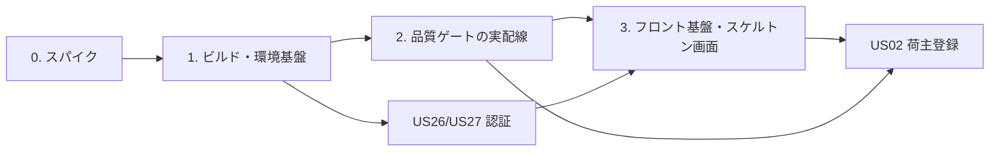
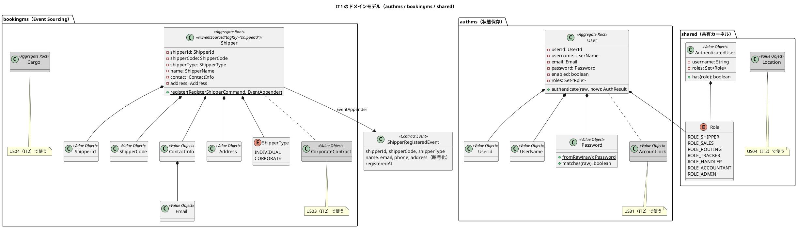
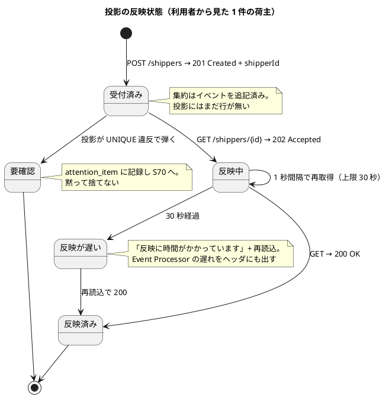
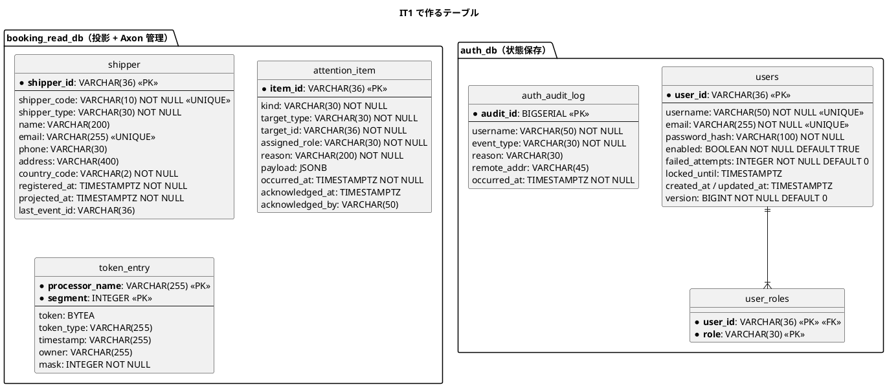
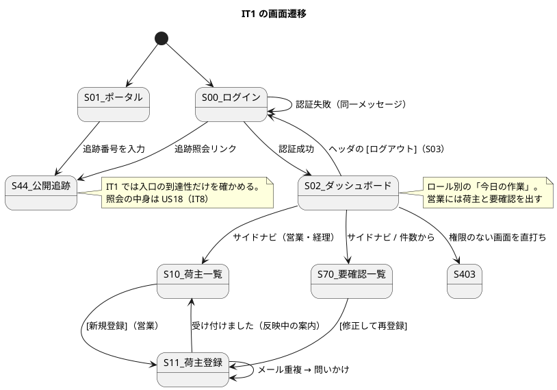

# イテレーション 1 計画 - 基盤・認証・荷主登録

## 概要

| 項目 | 内容 |
| :--- | :--- |
| イテレーション | IT1（Release 0.1 予約基盤・**序盤**） |
| 期間 | 2 週間 |
| ゴール | Axon 5 の実機挙動を確定し、コマンドからイベント・投影・クエリ・画面までの縦切りを 1 本通す |
| 目標 SP | 9 SP（US26 3・US27 1・US02 5）+ SP 対象外の基盤投資 |
| 局面 | 序盤（アウトサイドイン）。[開発戦略](development_strategy.md) を参照 |

## ゴール

### イテレーション終了時の達成状態

1. **Axon 5 の未確定事項が実機で確定している。** [ADR-0001](../../adr/cargo-tracker/0001-cqrs-es-with-axon-in-microservices.md) 決定 5 の 7 項目に答えが出て、ADR と設計文書が更新されている
2. **ウォーキングスケルトンが通っている。** 荷主の登録が「画面 → Gateway → bookingms → Axon Server（Event Store）→ 投影 → Query → 画面」の順に流れ、E2E で緑になる
3. **全ロールがログインでき、行ける画面と行けない画面が決まっている。** 全ルートのプレースホルダ画面とロール別ナビが揃い、到達性が E2E で固定されている
4. **品質ゲートが実配線されている。** ArchUnit・JaCoCo のレイヤー別閾値・Testcontainers（Axon Server + PostgreSQL, DCB 有効）・契約のゴールデン・受け入れ（Cucumber）・Playwright が CI で回る
5. **個人情報が鍵で暗号化されている。** [ADR-0003](../../adr/cargo-tracker/0003-crypto-shredding-for-personal-data.md) の crypto-shredding が最初のイベント（`ShipperRegisteredEvent`）から効いている

### 成功基準

- [ ] デモ項目 7 件の受け入れテスト（Cucumber の Feature・画面の到達性は Playwright）がすべて緑
- [ ] `./gradlew build` と `TZ=UTC ./gradlew test` が緑
- [ ] フロントの `npm run test`・`npx tsc -b`・`npm run build` が緑
- [ ] ADR-0001 決定 5 の 7 項目に結論が書かれ、外れた前提が設計文書に反映されている
- [ ] `npx gulp okf:check` が ERROR 0

## ユーザーストーリー

### 対象ストーリー

受入基準は [ユーザーストーリー](../../requirements/user_story.md) を正典とし、ここには複写しません。

| ID | ストーリー | SP | 優先度 | Issue |
| :--- | :--- | :--: | :---: | :--- |
| US26 | システムにログインする | 3 | 高 | [#568](https://github.com/k2works/case-study-cargo-tracker/issues/568) |
| US27 | システムからログアウトする | 1 | 中 | [#569](https://github.com/k2works/case-study-cargo-tracker/issues/569) |
| US02 | 荷主を登録する | 5 | 高 | [#570](https://github.com/k2works/case-study-cargo-tracker/issues/570) |
| | **合計** | **9** | | Milestone: [java/take-8] Release 0.1 予約基盤 |

GitHub Project: [CargoTracker java/take-8](https://github.com/users/k2works/projects/41)（イテレーション=IT1・リリース=Release 0.1・SP・優先度を設定済み。Status は着手時に In Progress へ）

### ストーリー詳細

**受入基準は複写しません。** 書き写した条件は正典が変わっても追随せず、達成判定を誤らせます。件数と参照だけを持ち、判定は `user_story.md` を開いて行います。

| ID | として | したい | なぜなら | UC | 受入基準 |
| :--- | :--- | :--- | :--- | :--- | :--- |
| US26 | システム利用者（荷主・営業担当者・経路設計者・追跡管理者・荷役作業員・経理担当者） | 利用者 ID とパスワードでログインし、自分のロールに応じた機能を利用したい | 本人確認により予約・精算等の業務データを安全に扱え、操作者の監査証跡を残せるからだ | UC20 | 6 件（[US26](../../requirements/user_story.md)） |
| US27 | システム利用者 | 業務終了時にログアウトしてセッションを終了したい | 共用端末・モバイル端末での第三者による不正操作を防げるからだ | UC20 | 3 件（[US27](../../requirements/user_story.md)） |
| US02 | 営業担当者 | 新規荷主の氏名/社名・住所・連絡先・メールアドレスをシステムに登録したい | 次回以降の予約で荷主情報の再入力を省略でき、顧客情報を一元管理できるからだ | UC02 | 4 件（[US02](../../requirements/user_story.md)） |

**US02 §受入基準 2（メール重複時に既存荷主を表示しどちらを使うか選択できる）** は、[UI 設計](../../design/cargo-tracker/ui_design.md) の入力規約「重複や競合は拒否ではなく問いかけにする」に対応します。拒否した事実は `attention_item` に残し、要確認一覧（S70）へ出します。

### 依存関係

US02 は縦切りの本体です。認証（US26）と基盤が通ってから着手します。

### タスク

#### 0. スパイク（SP 対象外・タイムボックス 4h）

| # | タスク | 見積 | 状態 |
| :--- | :--- | :--: | :--: |
| 0.1 | 集約の登録 API：`@EventSourcedEntity` 単独が Command Bus に登録されるか、bootJar の実機で確かめる（`CommandGateway` をモックしない） | 1h | [x] 結論：`@EventSourced` が必要 |
| 0.2 | Spring Boot 4.1（Jackson 3）と Axon の自動設定。`TransactionManager` Bean が 1 つ・`SpringTransactionManager` の第 3 引数・`token_entry.mask` | 1h | [x] 起動可。`allow-circular-references` と `TokenStore` Bean が必須。DB 側は 1.3 で確認 |
| 0.3 | `AxonTestFixture.with(...)` の組み立て方 | 0.5h | [x] `with(ApplicationConfigurer)`。`AxonServerContainer` 同梱を発見 |
| 0.4 | Saga のアノテーションと `SagaLifecycle` の 5 系での名称 | 0.5h | [x] **Axon 5 に Saga・Deadline・`@ProcessingGroup` は無い** |
| 0.5 | Axon Server 経由でサービス越しにクエリ・コマンドが届くこと（`shared/contract` の型で 1 往復） | 0.5h | [x] 2 JVM で届くことを確認 |
| 0.6 | `axon-server-connector` の明示依存と DCB 無効時の検知 | 0.25h | [x] 明示依存が必要。DCB 無効は `AXONIQ-1302` で**起動が止まらない** |
| 0.7 | S3 へエクスポートした Event Store からの差分再投入の可否 | 0.25h | [ ] **IT2 へ持ち越し**（0.1〜0.6 で版の前提が崩れ、その確定に時間を使った） |
| 0.8 | 結果を ADR-0001 決定 3・5 と `architecture_backend.md`・`tech_stack.md` に反映 | — | [x] ADR-0001（決定 6 を追加）・tech_stack・architecture_backend/infrastructure・domain-model・data-model・test_strategy・operation・ui_design・ADR-0002 |
| | 小計 | 4h | |

**スパイクのコードは残しません。** 結論だけを ADR と設計に書き、実装は本タスクでゼロから書きます。

#### 1. ビルド・環境基盤（SP 対象外）

| # | タスク | 見積 | 状態 |
| :--- | :--- | :--: | :--: |
| 1.1 | `apps/cargo-tracker/backend` の Gradle マルチプロジェクト（shared・gatewayms・authms・bookingms・routingms・trackingms・handlingms・billingms）と `libs.versions.toml` | 4h | [x] |
| 1.2 | kind + Kustomize（`ops/k8s/base/axonserver/`・`postgres/`・各サービス）。Axon Server は `AXONIQ_AXONSERVER_STANDALONE_DCB=true` | 6h | [ ] |
| 1.3 | PostgreSQL の 6 DB と接続ユーザー、各サービスの Flyway（`V001__create_axon_tables.sql` を含む） | 3h | [x] |
| 1.4 | 起動時の接続検査（Axon Server に繋がること・context が DCB であること。失敗したら起動を止める） | 2h | [x] |
| 1.5 | 運用スクリプトの雛形（`gulp ops:health`・`projection:status`） | 2h | [x] |
| | 小計 | 17h | |

#### 2. 品質ゲートの実配線（SP 対象外）

| # | タスク | 見積 | 状態 |
| :--- | :--- | :--: | :--: |
| 2.1 | ArchUnit を `shared` の testFixtures に置き全サービスへ適用。**未適用のサービスがあること自体を落とすメタテスト**を含む | 4h | [x] |
| 2.2 | ルールの実装：レイヤー依存・共有カーネルの範囲・`CommandGateway` の許可箇所（`interfaces`・`application/saga`・`application/reaction`）・契約の名簿（送信/購読の引数型が `shared/contract` 以外なら赤）・`BusinessClock`（`Clock.systemUTC()` 直呼び禁止）。**違反フィクスチャは実コードと同じ形**で書き、ルールが赤を出すことを確かめる | 5h | [x] |
| 2.3 | JaCoCo のレイヤー別閾値（domain 90 / application 85 / infrastructure 70 / interfaces 60 / 全体 80）を `check` に紐付け | 2h | [x] |
| 2.4 | Testcontainers の基底クラス（Axon Server + PostgreSQL、DCB 有効） | 3h | [x] |
| 2.5 | 契約のゴールデン JSON の型（丸ごと一致 + 往復を分ける）と `contract-tests` サブプロジェクト | 3h | [ ] |
| 2.6 | **受け入れテスト基盤（Cucumber + `acceptance-tests` サブプロジェクト）**。`# language: ja` の Gherkin、Testcontainers（Axon Server（DCB）+ PostgreSQL）、`Awaitility` に閉じた「N 秒以内に」共通ステップ。**デモ項目 #3 の Feature を Day 2 に「赤で置く」** | 4h | [ ] |
| 2.7 | **E2E 基盤（Playwright）と到達性スモーク 1 本を Day 2 に「赤で置く」** | 3h | [ ] |
| 2.8 | CI（`./gradlew build`・`TZ=UTC ./gradlew test`・`:acceptance-tests:test`・フロント・E2E・`gulp okf:check`） | 3h | [ ] |
| | 小計 | 27h | |

#### 3. フロント基盤とスケルトン画面（SP 対象外）

| # | タスク | 見積 | 状態 |
| :--- | :--- | :--: | :--: |
| 3.1 | Vite + React + TypeScript、`features/` のディレクトリ型、ESLint の `import/no-restricted-paths` | 3h | [x] |
| 3.2 | 共通レイアウト（左サイドナビ + トップヘッダ）、認可ガード（`RequireRole`）、403 画面、ポータル（`/portal`）。**アクセシビリティの型**：送信中は `disabled` でなく `aria-disabled` でフォーカスを保つ、状態の変化は `role="status"`・エラーは `role="alert"`、反映中の経過秒数は live region の外、色トークンをコントラスト比つきで定義 | 6h | [~] レイアウト・認可ガード・403・到達性は完了。アクセシビリティの型（aria-disabled・role=status・色トークン）は 6.6 の画面と対で入れる |
| 3.3 | [UI 設計](../../design/cargo-tracker/ui_design.md) の全ルートにプレースホルダ画面を置く。**ナビゲーション整合**：サイドナビ（ロール条件付き）とダッシュボード（S02）の「今日の作業」の両方に IT1 の実画面（S10・S11・S70）を出し、ロール × 画面の到達性を E2E で固定する | 6h | [ ] |
| 3.4 | API クライアント（`queryClient` / `commandClient`）、`202` を `pending` に変える `api/pending.ts`、`BusinessClock` に対応する日付ヘルパ | 3h | [ ] |
| 3.5 | 認証ストア（Zustand + `sessionStorage`）、無操作 15/20 分（荷役画面は 60 分） | 2h | [~] ストアと sessionStorage は完了。無操作タイムアウトは US26 と対で入れる |
| 3.6 | **設計への反映**：`ui_design.md` に S00・S03・S10・S11 の salt ワイヤーフレームを追加する（後述「設計への反映が必要な事項」） | 3h | [ ] |
| | 小計 | 23h | |

#### 7. ユーザーマニュアル初版（SP 対象外）

IT1 は画面を伴う IT なので、マニュアルの更新をここで見積もります。クローズ時に思い出すと計画外の作業がイテレーション末に積み上がります。

| # | タスク | 見積 | 状態 |
| :--- | :--- | :--: | :--: |
| 7.1 | マニュアルの構成・執筆テンプレート・キャプチャ方針を決める（`creating-manual`） | 2h | [ ] |
| 7.2 | 「ログインする」「ログアウトする」「荷主を登録する」「要確認一覧を確認する」の 4 節を執筆 | 4h | [ ] |
| 7.3 | 画面キャプチャを Playwright（2.7 の基盤）で自動生成する仕組み | 3h | [ ] |
| | 小計 | 9h | |

#### 4. US26 システムにログインする（3 SP）

| # | タスク | 見積 | 状態 |
| :--- | :--- | :--: | :--: |
| 4.1 | ロール名の確定（`ROLE_SALES` ほか 7 種）と `shared/domain/auth`（`AuthenticatedUser` / `Role`） | 2h | [ ] |
| 4.2 | authms の `User`（状態保存・MyBatis）、`users` / `user_roles` / `auth_audit_log` の Flyway | 4h | [ ] |
| 4.3 | JWT 発行（jjwt）と `LoginCommand`。失敗理由を問わず同一メッセージ | 3h | [ ] |
| 4.4 | gatewayms の JWT 検証フィルタとロール伝播。**public-paths の破壊検証**（公開追跡が 401 にならない） | 3h | [ ] |
| 4.5 | ログイン画面（S00）と認証エラー表示 | 2h | [ ] |
| 4.6 | 後段サービスが署名を再検証しないこと（Gateway に任せる分担）を統合テストで固定 | 1h | [ ] |
| | 小計 | 15h | |

#### 5. US27 システムからログアウトする（1 SP）

| # | タスク | 見積 | 状態 |
| :--- | :--- | :--: | :--: |
| 5.1 | ヘッダの `[ログアウト]`（S03）。認証ストアの破棄、`no-store`、ブラウザバックで戻れないこと | 3h | [ ] |
| | 小計 | 3h | |

#### 6. US02 荷主を登録する（5 SP・ウォーキングスケルトンの本体）

| # | タスク | 見積 | 状態 |
| :--- | :--- | :--: | :--: |
| 6.1 | `Shipper` 集約（`@EventSourced` または 0.1 の結論に従う）、`RegisterShipperCommand` → `ShipperRegisteredEvent`。`AxonTestFixture` で不変条件を固定 | 5h | [x] |
| 6.2 | crypto-shredding：荷主ごとの KMS 鍵で name/email/phone/address を暗号化し、鍵が無ければ復号結果を `null` にする（ADR-0003） | 5h | [x] |
| 6.3 | 投影 `booking-shipper-projection` → `shipper` テーブル（個人情報列は NULL 許容）。`attention_item` テーブルと拒否の記録 | 4h | [x] |
| 6.4 | `ExistsShipperEmailQuery` と `FindShipperQuery`（`@QueryHandler` + MyBatis）。一意性の三段（存在確認 + UNIQUE + `attention_item`） | 3h | [x] |
| 6.5 | `ShipperController`（`POST /api/v1/booking/shippers`・`GET`）。`201` + 識別子、詳細は投影が無ければ `202` | 3h | [x] |
| 6.6 | 荷主一覧（S10）・登録（S11）・要確認一覧（S70）の画面。「受け付けました」と反映中の案内 | 5h | [ ] |
| 6.7 | 鍵の破棄 → リプレイ → 個人情報が消えることの統合テストと `gulp shipper:shred` の雛形 | 3h | [~] 雛形と鍵破棄の単体・Converter 検査は完了。実 Event Store からのリプレイ演習は残り |
| | 小計 | 28h | |

### タスク合計

| カテゴリ | SP | 理想時間 | 備考 |
| :--- | :--: | :--: | :--- |
| ユーザーストーリー（US26・US27・US02） | 9 | 46h | 1 SP ≒ 5.1h |
| 基盤投資（0〜3） | — | 75h | SP 対象外。以降の IT で再利用する |
| ユーザーマニュアル（7） | — | 9h | SP 対象外。画面を伴う IT では毎回計上する |
| **合計** | **9** | **130h** | |

**130h は 2 週間（10 営業日）に収まりません。** 1 日 13h の計算になります。基盤投資が本体の 2 倍以上ある IT1 の性質上これは避けられないので、**入りきらないときに何を落とすかを先に決めます**（下の「スコープを落とす順序」）。落とす判断は Day 5 の時点で行い、ふりかえりに理由を書きます。

#### スコープを落とす順序

上から順に IT2 の枠へ送ります。**US02 の縦切り（タスク 6）とスパイク（タスク 0）は落としません。** IT1 の目的がそこにあるためです。

| 順 | 落とすもの | 送り先 | 落としてよい理由 |
| :--- | :--- | :--- | :--- |
| 1 | 7. ユーザーマニュアル（9h） | IT2 | 画面が固まってから書くほうが撮り直しが減る。ただし IT2 で必ず消化する |
| 2 | 3.6 salt の追加（3h） | IT2 | 実装した画面から起こしても設計に追随できる。ただし IT2 の着手前に |
| 3 | 3.3 の全ルートのプレースホルダ（6h のうち IT1 で使わない画面分） | IT2 | IT1 で使う S00・S02・S03・S10・S11・S70・S44 の到達性は落とさない |
| 4 | 1.5 運用スクリプトの雛形（2h） | IT4 の負債枠 | IT1 では手動で確認できる |

基盤投資が本体より重い IT です。これは序盤の 1 回だけで、IT2 以降は US のタスクが中心になります。

## スケジュール

### Week 1

| 日 | タスク | アウトサイドインの位置づけ |
| :--- | :--- | :--- |
| Day 1 | 0. スパイク（7 項目）→ ADR と設計へ反映 | 着手前の不確実性の除去 |
| Day 2 | 2.6 **デモ項目 #3 の Feature（Cucumber）** と 2.7 **E2E スモーク**を赤で置く、2.1〜2.3 検査の土台 | Phase 1：受け入れの入口を先に作る |
| Day 3 | 1.1〜1.3 ビルドと環境（kind・Axon Server・PostgreSQL・Flyway） | Phase 1 |
| Day 4 | 1.4〜1.5、2.4〜2.5、2.8 CI | Phase 1 |
| Day 5 | 3.1〜3.3 フロント基盤とスケルトン画面（API はモック） | Phase 2：UI から API の契約を決める |

### Week 2

| 日 | タスク | アウトサイドインの位置づけ |
| :--- | :--- | :--- |
| Day 6 | 4.1〜4.4 authms と gatewayms | Phase 3：入口から内側へ |
| Day 7 | 4.5〜4.6、5.1、3.4〜3.5 | Phase 3 |
| Day 8 | 6.5〜6.6 Controller と画面（投影はまだスタブ） | Phase 3 |
| Day 9 | 6.1〜6.2 集約と crypto-shredding | Phase 4：ドメインの内側 |
| Day 10 | 6.3〜6.4 投影とクエリ、6.7 | Phase 5：永続化 |
| Day 11-12 | **モックを実物に差し替え、Day 2 に置いた E2E が緑になることで縦切りの成立を判定** | 判定 |
| Day 13-14 | デモ項目の受け入れテスト、ふりかえり、ドキュメント同期 | クローズ |

**Day 2 に E2E を赤で置くことが要です。** ウォーキングスケルトンの成立を最後まで判定できない状態を作りません。

## 設計

設計は `docs/design/cargo-tracker/` が正典です。本計画には複写しません。

| トピック | 正典 |
| :--- | :--- |
| サービス分割・パッケージ構成・Axon の設定 | [バックエンドアーキテクチャ](../../design/cargo-tracker/architecture_backend.md) |
| `Shipper` / `User` 集約・不変条件・契約イベント | [ドメインモデル設計](../../design/cargo-tracker/domain-model.md) |
| `shipper` / `attention_item` / `users` / `token_entry` | [データモデル設計](../../design/cargo-tracker/data-model.md) |
| S00・S03・S10・S11・S70・ロール別ナビ・反映中の規約 | [UI 設計](../../design/cargo-tracker/ui_design.md) |
| 検査の 5 種・カバレッジ・品質ゲート | [テスト戦略](../../design/cargo-tracker/test_strategy.md) |
| kind + Kustomize・DCB・CI | [インフラストラクチャ](../../design/cargo-tracker/architecture_infrastructure.md) |
| バージョン | [技術スタック](../../design/cargo-tracker/tech_stack.md) |

### 対象スコープの設計図

`docs/design/cargo-tracker/` の全体図は写さず、IT1 の実装対象に絞って描きます。後続 IT の要素は破線で区別します。

#### ドメインモデル図（IT1 スコープ）

**注**: `ShipperRegisteredEvent` は契約イベント（billingms が `shipper_contract_snapshot` を作るために購読する）です。IT1 では購読側が居ませんが、[ADR-0003](../../adr/cargo-tracker/0003-crypto-shredding-for-personal-data.md) の対象イベントなので、個人情報 4 項目を暗号化して載せます。新規に追加する設計要素はありません（すべて [ドメインモデル設計](../../design/cargo-tracker/domain-model.md) に定義済み）。

#### 状態遷移図（IT1 スコープ）

**IT1 の対象集約（`User`・`Shipper`）は業務上の状態遷移を持ちません。** `BookingStatus` などの業務状態は US04（IT2）の `Cargo` から現れます。代わりに、IT1 の中核である**投影の反映状態**を示します。これは集約の状態ではなく、利用者から見た 1 件のデータの見え方です。

#### ER 図（IT1 スコープ）

**注**: `shipper` の `name` / `email` / `phone` / `address` は NULL 許容です（[ADR-0003](../../adr/cargo-tracker/0003-crypto-shredding-for-personal-data.md)。鍵を破棄したあとのリプレイで `NOT NULL` 違反が起きないようにするため）。`email` の UNIQUE は NULL を許します。`saga_entry` / `association_value_entry` は**作りません**（Axon 5 に Saga が無いことが IT1 スパイクで判明。ADR-0001 決定 6）。

#### 画面遷移図（IT1 スコープ）

**注**: 上記以外の全ルートには、この IT でプレースホルダ画面を置きます（タスク 3.3）。ナビゲーション整合は「[UI 設計](../../design/cargo-tracker/ui_design.md) の画面一覧・サイドナビ・ダッシュボード・到達性テスト」の 4 点が一致することで判定します。

| ADR | タイトル | ステータス |
| :--- | :--- | :--- |
| [ADR-0001](../../adr/cargo-tracker/0001-cqrs-es-with-axon-in-microservices.md) | CQRS / Event Sourcing を Axon Framework 5 でマイクロサービスとして実装する | 提案（IT1 のスパイク結果で改訂する） |
| [ADR-0002](../../adr/cargo-tracker/0002-event-store-axon-server-and-postgresql-read-models.md) | Event Store は Axon Server SE、Read Model は PostgreSQL + MyBatis | 提案 |
| [ADR-0003](../../adr/cargo-tracker/0003-crypto-shredding-for-personal-data.md) | 荷主の個人情報は crypto-shredding で削除可能にする | 提案（IT1 で実装） |

### 設計への反映が必要な事項

検証（`validating-iteration-plan` / `validating-design`）で見つかった設計ドキュメント側の欠落です。**設計が正**なので、計画側で代替せず当該 IT で設計に反映します。

| # | 欠落 | 対象 | 対応 |
| :--- | :--- | :--- | :--- |
| 1 | S00（ログイン）・S03（ログアウト）・S10（荷主一覧）・S11（荷主登録）の salt ワイヤーフレームが `ui_design.md` に無い（画面一覧の行はある） | [UI 設計](../../design/cargo-tracker/ui_design.md) | タスク 3.6 で追加する。実装より先に描き、実装がそれに従う |

**受入基準を複写しないことについて。** `validating-iteration-plan` のステップ 2 は「受入基準の項目数と内容が一致」を求めますが、本計画は意図的に複写せず件数と参照だけを持ちます。書き写した条件は正典が変わっても追随せず、達成判定を誤らせるためです（同シリーズで実際に 3 イテレーション連続の誤記録がありました）。件数（US26 6・US27 3・US02 4）の一致だけを検証項目とします。

## リスクと対策

| リスク | 影響度 | 対策 |
| :--- | :---: | :--- |
| スパイクで集約の登録 API が確定しない | 高 | `@EventSourced`（ADR-0008 の形）を既定として進める。それも動かなければ Mockito + `EventAppender` モックで代替し、「イベント列からの復元は判別しない」と検査の限界を明記する |
| DCB の設定漏れで全サービスが起動しない | 高 | 1.4 の接続検査を Day 3 に置き、以降のタスクが止まらないようにする |
| crypto-shredding が投影のリプレイと両立しない | 中 | 6.3 で個人情報列を NULL 許容にし、6.7 の統合テストで鍵破棄後のリプレイを確かめる |
| 基盤投資 75h + マニュアル 9h が 2 週間に収まらない（合計 130h / 10 日） | **高** | Day 5 に進捗を確認し、「スコープを落とす順序」の上から IT2 の枠へ送る。**US02 の縦切りとスパイクは落とさない**。落とした分はふりかえりに理由とともに記録する |
| Jackson 3 と Axon のシリアライザが噛み合わない | 中 | 0.2 のスパイクで先に確かめ、噛み合わなければ手動構成する（take-4 ADR-0009 と同じ経路） |

## 完了条件

### Definition of Done

- [ ] US26・US27・US02 の受入基準（`user_story.md`）を満たす
- [ ] デモ項目 7 件の受け入れテストがすべて緑
- [ ] `./gradlew build`（SpotBugs・JaCoCo のレイヤー別閾値を含む）が緑
- [ ] `TZ=UTC ./gradlew test` が緑
- [ ] フロントの `npm run test`・`npx tsc -b`・`npm run build` が緑
- [ ] ArchUnit の未適用サービスを落とすメタテストが働いている
- [ ] ADR-0001 決定 5 の 7 項目に結論があり、ADR と設計文書に反映されている
- [ ] UI 設計・navbar・ダッシュボード・到達性テストの 4 点が一致している
- [ ] `npx gulp okf:check` が ERROR 0、`mkdocs build` が成功する
- [ ] ユーザーマニュアルの 4 節が執筆され、画面キャプチャが自動生成されている
- [ ] ふりかえり（`retrospective-1.md`）と完了報告書（`iteration_report-1.md`）を作成した

### デモ項目

イテレーションレビューで実演します。**この 7 件をそのままパスする受け入れテストが、IT1 の受け入れ基準です。**

| # | 見せるもの | 役割 | 対応 |
| :--- | :--- | :--- | :--- |
| 1 | ログイン → ダッシュボード → ログアウト → ブラウザバックで業務画面に戻れない | 全ロール | US26・US27 |
| 2 | 未ログインで業務画面を開く → ログイン画面へ誘導。**公開追跡の入口（`/track/...`）は 401 にならない**（US18 の先行確認） | 未認証 | US26 §受入基準 |
| 3 | 営業でログインし荷主を登録 → 「受け付けました」→ 一覧に「反映には数秒かかります」→ 数秒で行が出る | 営業担当者 | US02 |
| 4 | **同じメールでもう 1 件登録 → 断らずに問いかけ → 続けると要確認一覧に「メールアドレスの重複」が出る**（一意性の三段の 3 段目） | 営業担当者 | US02 §受入基準 |
| 5 | **Axon Server を止めて登録 → コマンドが失敗する。一方で荷主一覧（クエリ）は表示できる**（無音で in-memory に落ちない） | 営業担当者 | ADR-0002 |
| 6 | **荷主の鍵を破棄 → 投影をリプレイ → 氏名とメールが「（削除済み）」になる**（イベントは消えない） | システム管理者 | ADR-0003 |
| 7 | 営業でログインすると経理の画面がナビに出ない。URL を直打ちすると 403 | 営業・経理 | US26 §受入基準 |

デモ項目 4・5・6 は「拒否・失敗する側」を先に見せます。**安全装置は働くことを見せて初めて入ったと言えます。**

## 更新履歴

| 日付 | 更新内容 | 更新者 |
| :--- | :--- | :--- |
| 2026-09-02 | 初版作成 | claude-code/claude-fable-5-1 |

## 関連ドキュメント

- [リリース計画](release_plan.md)、[開発戦略](development_strategy.md)
- [ユーザーストーリー](../../requirements/user_story.md)
- [設計](../../design/cargo-tracker/index.md)、[ADR](../../adr/cargo-tracker/index.md)
