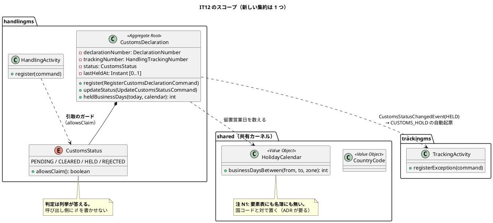
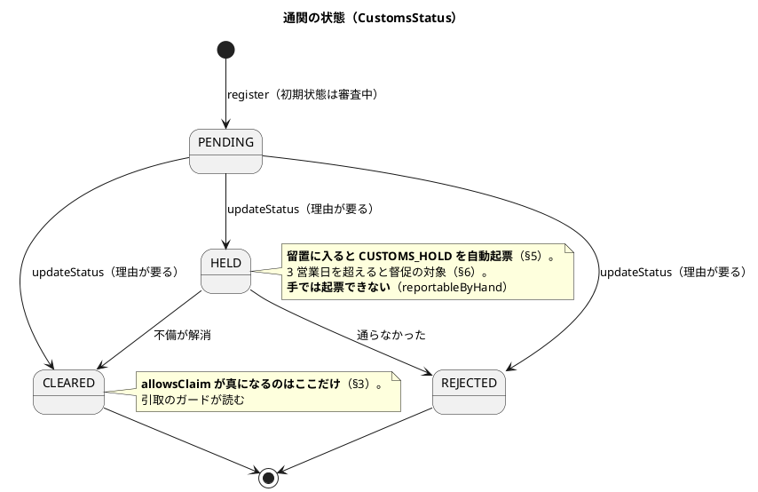
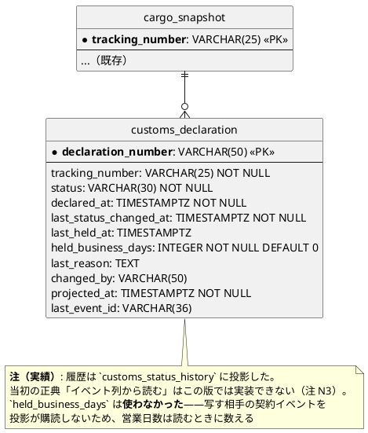
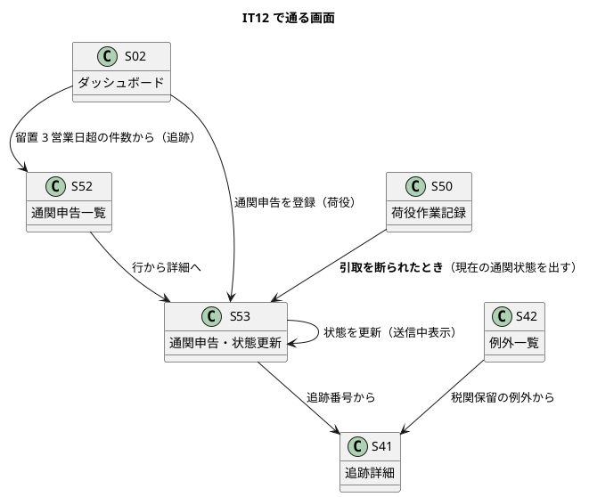

# イテレーション 12 計画

| 項目 | 内容 |
| :--- | :--- |
| イテレーション | IT12（Release 1.1 例外・誤配・通関・**Release 1.1 の最後**） |
| 対象 | US29 通関申告を登録・管理する（6） |
| SP | 6 + **負債枠 2**（SP 対象外）+ **引き継ぎ枠 2**（SP 対象外） |
| 局面 | 終盤（**アウトサイドイン**。既にある集約を業務シナリオで束ねる） |
| 前提 | IT11 クローズ済み（10/10 SP・引き継ぎ 12 件） |

## ゴール

**輸入港で通関申告を登録し、状態を管理できます。** 留置になると税関保留の例外が自動で起票され、3 営業日を超えると督促の対象として一覧とダッシュボードに出ます。**通関が済んでいない貨物の引取は断られます**——IT9 から 3 IT のあいだ「読む側の無い配線を敷かない」として保留してきたガードを、ここで有効にします。

## 対象ストーリー

| ID | ストーリー | SP | 対応 UC |
| :--- | :--- | :--: | :--- |
| US29 | 通関申告を登録・管理する | 6 | UC21 |

## 局面（終盤・アウトサイドイン）

**新しい集約を 1 つ作ります**（`CustomsDeclaration`）。終盤で新設するのはこれが唯一で、既存の集約に混ぜられないためです——通関は税関という別の当事者との手続きで、荷役（`HandlingActivity`）の一種ではありません（`HandlingType` の要素表が「税関は荷役ではない」と明記しています）。

ただし**進め方は終盤のまま**です。業務シナリオ（デモ項目）を先に赤で置き、契約 → 連鎖 → 不変条件 → 画面の順に進めます。通関は **handlingms → trackingms（例外の自動起票）→ handlingms（引取のガード）→ billingms（留置日数を調整根拠に）** という 3 サービスの連鎖を作ります。

## 受入基準（**1 項目ずつ表にする**）

**実装を始める前に作ります。** 空欄のまま残れば、それが未達です。

| # | 受入基準 | 満たす手段 | 検査の所在 | 状態 |
| :--- | :--- | :--- | :--- | :--- |
| §1 | 追跡番号・申告番号・申告日時を入力して通関申告を登録できる（初期状態は「審査中」） | `CustomsDeclaration.register`（`@EventSourced(tagKey="declarationNumber")`）と S53。**申告番号は利用者が持ち込む**（税関が採番する）ので、集約の識別子にする | `CustomsDeclarationTest`・`CustomsControllerIT`・`CustomsScreens.test.tsx`・受け入れテスト | 達成 |
| §2 | 通関状態を「通関済」「留置」「不可」に更新できる。更新時は**理由の入力が必須**で、監査ログに記録される | `updateStatus`。**理由の無い更新は断る**（IT10・IT11 で「何が起きたか読めない記録を残さない」を守った形）。監査は Event Store が持つ——`auth_audit_log` ではなくイベント列が正典（`data-model.md:656`） | `CustomsDeclarationTest`・`CustomsControllerIT`・受け入れテスト | 達成 |
| §3 | 通関状態が「通関済」でない貨物への**引取（CLAIM）は拒否され、現在の通関状態が提示される** | `CustomsStatus#allowsClaim` を `HandlingActivity` の CLAIM ガードで呼ぶ。**判定は列挙が答える**（呼び出し側に `if` を書かせない）。**通関状態はコマンドに載せる**（`customsStatus` / `customsStatusAsOf`。`offRoute` と同じく application 層が解決して載せる。`domain-model.md:942`）。**拒否時は判定に使った状態と時点を返し**、画面は「直近で変わった可能性があります」と再確認ボタンを出す（`domain-model.md:1021`・`architecture_frontend.md:126`） | `HandlingActivityTest`（`customsStatusAsOf` を含む）・`HandlingControllerIT`・`HandlingRecordPage.test.tsx`・クラスタ E2E | 達成 |
| §4 | 通関状態が「通関済」になると、荷主・荷受人に**通関完了が通知される** | **送信基盤はスコープ外**（`ui_design.md:120`）。**記録と読み口を対で出す**——通知した事実を残し、S52・S53 と追跡詳細（S41）の履歴に出す。注 N2 | `CustomsDeclarationTest`・`CustomsProjectionIT`・`CustomsScreens.test.tsx` | 達成（記録と読み口の組。送信基盤はスコープ外） |
| §5 | 通関状態が「留置」になると、**例外種別「税関保留」の例外イベントが自動起票される** | 契約 `CustomsStatusChangedEvent`（handlingms → trackingms・billingms）→ `TrackingReactionHandler` → `RegisterTrackingExceptionCommand(CUSTOMS_HOLD)`。**手では起票できないまま**（`reportableByHand`）。IT11 の誤配と同じ形 | `TrackingActivityTest`・`TrackingReactionHandlerTest`・**`CustomsStatusChangedRoundTripIT`**（`test_strategy.md:414` が名指し）・クラスタ E2E・受け入れテスト | 達成 |
| §6 | 「留置」のまま **3 日を超えた**申告は、一覧で警告表示され、追跡管理者のダッシュボードに件数が現れる | **営業日で数える**（不変条件 4。港の所在国の休日カレンダー `HolidayCalendar`）。`heldBusinessDays` を投影に写し、一覧は留置営業日の多い順。**件数は次の行動へ繋ぐ**（S02 の行から S52 へ） | `HolidayCalendarTest`・`CustomsDeclarationTest`・`CustomsProjectionIT`・`DashboardPage.test.tsx` | 達成 |
| §7 | 通関申告の一覧を**貨物 ID・追跡番号・通関状態で検索**できる | `FindCustomsDeclarationsQuery` と S52。**既定で通関済を外す**（決着したものが混ざると一覧が「まだ手を入れる場所」に見えなくなる）。`[通関済も表示]` で切り替える | `CustomsQueryHandlerTest`・`CustomsProjectionIT`・`CustomsScreens.test.tsx` | 達成（貨物 ID は追跡番号で引く。申告は貨物 ID を持たない） |
| §8 | 通関状態の**変更履歴（日時・変更者・理由）**が申告詳細から参照できる | **`customs_status_history` 投影から読む**（**当初は Event Store から読む予定だったが実装できなかった**。注 N3）。主キーは元イベントの識別子なのでリプレイで積み上がらない | `CustomsControllerIT#readsHistory`・`CustomsScreens.test.tsx`・受け入れテスト | 達成（Event Store ではなく投影から読む。注 N3） |

### 受入基準に現れない不変条件（**正典にあり、実装が要る**）

| # | 不変条件 | 本 IT での扱い |
| :--- | :--- | :--- |
| 3 | **未決着（`PENDING` / `HELD`）の申告は貨物あたり高々 1 件。** `REJECTED` の後は出し直せる。`CLEARED` の後は断る | T3。**集約は他の申告を知らない**（1 申告 1 集約）ので、**application 層が守る**——IT9 の「5 分規則」と同じ形（`domain-model.md` の注記が既に「集約が守る」と書けない規則を分けている） |
| 5 | 通関申告は**輸入港（目的港）での輸入通関のみ**。輸出通関は扱わない | T3。不変条件 3 の前提。**画面にも書く**（マニュアル 16 章） |

### 注（設計への反映が必要）

着手前の突合で見つけた、**設計ドキュメント側の欠落**です。本 IT の中で反映します。

| # | 欠落 | 反映先 | 反映するタスク |
| :--- | :--- | :--- | :--- |
| N1 | **`HolidayCalendar` の置き場が決まっていない。** `domain-model.md:1033` は「港の所在国の休日カレンダー」と書くが、**要素表にも共有カーネルの名簿にも無い**。国コードから休日を引くので、`shared.domain.location.CountryCode` と対になる | `domain-model.md` の要素表（値オブジェクト）と、共有カーネルの範囲（ADR-0001 決定 4 / `SharedKernelScopeTest` の名簿） | T1（**共有カーネルではなく handlingms に置いた**。上の ADR 表を参照） |
| N2 | US29 §4 の**通知の置き場が設計に無い**。`ui_design.md:120` の「記録と手作業の組で満たす」US 一覧に US29 はあるが、**記録先のイベントが `domain-model.md` の handlingms のイベント表に無い** | `domain-model.md`（`CustomsClearanceNotifiedEvent` を追加）・`ui_design.md:120` | T5 |
| N3 | **履歴を Event Store から読むクエリが設計に無い。** `data-model.md:656` は「履歴は Event Store から読む」と書くが、`domain-model.md` のクエリ一覧に該当する問い合わせが無い | `domain-model.md` のクエリ一覧（`FindCustomsHistoryQuery`） | **T4 で反映。ただし正典どおりには実装できなかった**——`@QueryHandler` から Event Store を読むと、タグを指定しても `havingAnyTag()` でも 0 件になる（実測）。ADR-0012 と同じ形で正典を直し、`customs_status_history` 投影にした（主キーは元イベントの識別子なのでリプレイで積み上がらない） |
| N4 | **S52・S53 の `###` 節が `ui_design.md` に無い**（S53 はある。**S52 が無い**）。画面一覧の行と一覧規約の行だけで、画面項目・操作手順が未記述 | `ui_design.md`（S52 の節を新設） | **T6 で反映済み**。あわせてモバイル下部タブを 3 つに（`ui_design.md:246`） |
| N5 | **IT10 から 3 IT 続けて未反映の注**——`ui_design.md` に **S42・S43 の `###` 節が無い**。IT10 で「T6 で反映する」と書き、IT11 でも繰り越した | `ui_design.md`（S42・S43 の節を新設） | **T9 で反映済み（3 IT 繰り越しを終わらせた）** |

## 成功基準

IT11 のふりかえり Try 10 件をすべて落とし込みます。

- [x] デモ項目の受け入れテストがすべて緑 — 達成（handling 19/19・tracking・routing とも緑）
- [x] **`TZ=UTC` でモジュールを分けて `build` が緑**（Try T5。この環境では 10 分を超える通しが完走しない。分割の単位を `operation.md` に書く） — 達成（**5 群**：shared / authms+gatewayms / bookingms+routingms / trackingms+handlingms / billingms+contract-tests+acceptance-tests。`operation.md` に単位を記載）
- [x] フロントの `npm run test`・`npx tsc -b`・`npm run build` が緑 — 達成（414 件・`tsc -b`・`build` とも緑）
- [x] `./gradlew :acceptance-tests:build` が緑 — 達成
- [x] **受入基準の表を、実装を始める前に作った**（継続） — 達成
- [x] **経路を増やしたら、既存の経路がやっていることを数えて写した**（**Try T1**。(1) 新しい「その状態にする経路」を `grep` で全部出す、(2) 既存の経路の後段を列挙する、(3) 新しい経路が同じ後段を通るか 1 行ずつ確かめる。**本 IT では引取のガードが 2 経路になる**——その場の記録と、預かりからの再適用） — 達成（引取のガードは `HandlingActivity#requireCustomsCleared` の 1 か所に集約し、2 経路とも同じ後段を通ることを `ClaimCustomsGuardIT` で固定）
- [x] **守りを緩めた／足した軸を書き出し、軸ごとに赤テストを対で置いた**（**Try T2**。本 IT で足す軸は「通関」。**緩めた側（通関済なら通る）と緩めていない側（審査中・留置・不可は断る）**の両方） — 達成（`CustomsStatus#allowsClaim` は CLEARED のみ真。断る側 3 状態も対で赤にした）
- [x] **マニュアルを書いたら、書いた手順を画面で 1 度なぞった**（**Try T3**。キャプチャを撮るだけでなく、文章のとおりに操作する。IT11 は文章が実装より先に「あるべき姿」を書いていた） — 達成
- [x] **重い検証は 1 本ずつ**（**Try T4**・**3 IT 目**。**手立てを変える**——走っている Gradle があれば断る入口を序盤に作り、そこからしか回さない） — 達成（`dev:backend:guard` を作り、走っている Gradle があれば断る）
- [x] **一覧から自分のデータを名指しで探していない**（**Try T6**。クラスタ E2E の規約。詳細は URL で開き、一覧は「絞り込みが効く」ことだけ見る） — 達成
- [x] **US ごとにクラスタ E2E を 1 度回した**（**Try T8**。US29 は 3 サービスの連鎖なので独立したタスク行 T7e を立てる） — 達成（T7e。**実際に欠陥を 1 件見つけた**——`PENDING → CLEARED` で解除を送っていた）
- [ ] **レビューは 5 通そろうまでクローズしない。返らない視点には再送した**（**Try T7**。IT11 は user 視点が 1 時間後に返り、**高 3 件**を持っていた） — **未達**（並列 5 視点を起動し 48 分待ち、催促を 5 通送ったが**1 通も返着しなかった**。逐次フォールバックで 5 視点をたどった。IT7 と同じ形。[レビュー](../../review/cargo-tracker/IT12実装_review_20260910.md)に経緯を記録）
- [x] **レビューの「達成と書いたが実務では足りない」欄を、受入基準の表に突き合わせた**（**Try T9**。返着を待ってから実績表を確定する） — 達成（逐次レビューで**高 3 件**。うち 2 件は「記録はあるのに読み口が繋がっていない」形で、§6 の督促と §3 の引取が実務では足りていなかった）
- [x] **過去の教訓を当てはめる前に「その人はそこで何をするのか」を問うた**（**Try T10**。IT11 は「リンクを出し分ける」に従って行き止まりを作った） — 達成（S52 の宛先と「次の行動」を督促の対象で分けた）
- [x] **US を閉じるコミットのメッセージに、回した品質ゲートの結果を書いた**（`.gitmessage` の欄。IT11 で達成した形を続ける） — 達成
- [x] **イメージを作り直したことを、作成時刻で確かめた**（`k8s:images` が出す） — 達成
- [x] **「〜する」「〜しない」と書いたコメント・javadoc には、同じ変更の中で赤にできる検査を書いた** — 達成
- [x] **タスクに着手する前に、その名前で `grep -r` して既にあるか探した**（下表に結果を書く） — 達成
- [x] **注釈マッパーで `SELECT *` を書いていない** — 達成（`CustomsDeclarationMapper.COLUMNS` で列を並べた）
- [x] **イベントに載せる値を「購読側の投影が作れるか」で決めた** — 達成（`CustomsStatusChangedEvent` に `bookingId` と `heldBusinessDays` を載せた）
- [x] **利用者に見せる文字列を、設計の要素表と突き合わせる canon テストで固定した**（`CustomsStatus` が本 IT で出る） — 達成
- [x] SonarQube の Quality Gate がバックエンド・フロントエンドとも PASS — 達成（backend / frontend とも PASS。Bug 0・Vulnerability 0・重複 0.2% / 0.0%・カバレッジ 93.4% / 95.2%）。**残した Code Smell 34 件はすべて新規コードの外**——`ApiExceptionHandler` の三項や `RouteSearchService` の複雑度など、本 IT で触っていない箇所である。触っていないものを直すコミットは、本 IT の変更を読みにくくする
- [x] `npx gulp okf:check` が ERROR 0 — 達成（ERROR 0 / WARN 0）
- [x] **ユーザーマニュアル 16 章（通関）を新設し、13 章の引取に通関のガードを足し、画面キャプチャを再生成した** — 達成

## 引き継ぎ枠・負債枠（SP 対象外・**IT の序盤に独立コミットで消化**）

IT11 から 12 件を受けています。`release_plan.md` の IT12 の枠は**負債 2 + 引き継ぎ 2** です。

| # | 内容 | 扱い |
| :--- | :--- | :--- |
| H.1 | **Dead Letter Queue が無い。** 1 件の不正イベントで Event Processor が止まり、後続が全部届かない | **引き継ぎ枠 A**。**IT11 で実際に起きた**。本 IT は契約イベントを 1 本足すので、同じ形が再発しうる |
| H.2 | **未解決の誤配が S30 の表示上限を食う** | **引き継ぎ枠 B**。誤配は並びの先頭に来る設計なので、滞留すると通常の設計依頼が沈む |
| H.7 | 荷役の時刻が港のローカル時刻でなく JST 固定（IT9 から**3 IT 繰り越し**） | **負債枠**（`release_plan.md:235` に名指しで載っている）。**本 IT は通関の日時を扱う**ので、同じ問題を増やす前に直す |
| H.3 / N5 | `ui_design.md` の S42・S43 の `###` 節（IT10 から**3 IT 繰り越し**） | **負債枠**。本 IT で S52 の節を書くので、同じ変更で片づける |
| H.4 | S42 に荷主名が出せない（契約が `shipperId` しか運ばない。Upcaster が要る） | **T6 で判断する**。S52 も同じ問題を持つ（通関の一覧に荷主名を出せるか） |
| H.5 | `CargoDeliveredEvent` の往復テスト（IT10 から**2 IT 繰り越し**） | **T2 に統合**。本 IT で契約 `CustomsStatusChangedEvent` を足すので、往復の共通部品をそこで作る |
| H.6 | 旧ペイロードを新レコードへ読み戻す検査が無い | **T2 に統合**（契約を足す同じ枠で） |
| H.8 | 航海一覧に「航海番号で探す」手段が無い | **IT13 へ送る**。本 IT のスコープ（通関）と独立で、S52 の検索を作る経験を先に積みたい |
| H.9 | N16（誤配バナーに港名を添える）・N7（港名からの検索） | **IT13 へ送る**。UN/LOCODE と港名の対応表を routingms から配る設計が要る。**S52 も同じ問題を持つ**ので、まとめて扱う |
| H.10 | 確認ダイアログのキャプチャが無い | **負債枠**（余れば） |
| H.11 | 「0 を入れる互換コンストラクタ」が 3 本 | **IT13 へ送る**（呼び出し側が新形に揃うまで外せない） |
| H.12 | レビュー中の残り（IT11 の N 表） | 上記に振り分け済み |

## タスク

| # | タスク | ストーリー | 見積 |
| :--- | :--- | :--- | :--: |
| T0 | **US を終えるたびに SonarQube を回す**（継続） | — | 2h |
| S | **序盤の段取り**（Try T4・T5）：**走っている Gradle があれば断る入口**を作る（3 IT 目。手順書の文章では守れなかった）。分割ビルドの単位を `operation.md` に書く | — | 3h |
| A | **引き継ぎ枠 A**：Dead Letter Queue。**書けないイベントを退避して処理を続ける**。退避したことは `attention_item` に出す（**黙って捨てない**）。**IT11 の事象を再現してから直す** | — | 5h |
| B | **引き継ぎ枠 B**：S30 に「誤配だけ / 設計待ちだけ」の絞り込み。**表示上限に当たったことは既に知らせている**ので、絞る手段を足す | — | 3h |
| P1 | **業務シナリオを赤で置く**（終盤の Phase 1）。デモ項目を受け入れテストとクラスタ E2E に先に書く | — | 4h |
| T1 | **`HolidayCalendar` と `CustomsStatus`**（`allowsClaim`）。**営業日は handlingms に置く**（**当初は共有カーネルの予定だったが、読む側が 1 つしかないので変えた**。上の ADR 表）。要素表と突き合わせる canon テスト | US29 | 5h |
| T2 | **契約 `CustomsStatusChangedEvent` を先に置く**（Phase 2）。**購読側は trackingms（例外の自動起票）と billingms（留置営業日を調整根拠に）**。ゴールデンと**往復テスト**（H.5・H.6 をここで） | US29 | 5h |
| T3 | **`CustomsDeclaration` 集約**（`register` / `updateStatus` / `heldBusinessDays`）と不変条件。**理由の無い更新を断る**。**留置日数は営業日で数える** | US29 | 6h |
| T4 | **`customs_declaration` 投影**（`INDEX(tracking_number, status)`・`INDEX(status, held_business_days DESC)`）と `FindCustomsDeclarationsQuery`（**既定で通関済を外す**） | US29 | 4h |
| T5 | **連鎖**（Phase 3）：留置 → `CUSTOMS_HOLD` の自動起票（trackingms）。**通関完了の通知の記録**（注 N2）。**Try T1 の手順で、既存の経路の後段を数える** | US29 | 5h |
| T6 | **S52 通関申告一覧・S53 通関申告**（`/customs`・`/customs/new`・`/customs/:no`）。**履歴はイベント列から読む**（注 N3）。**注 N4（S52 の節）を `ui_design.md` に足す**。ナビゲーション整合（構成表・`navigation.ts`・S02・検証テストの 4 点）。**モバイル幅の下部タブを 3 つにする**（`ui_design.md:246`「通関を足す IT でタブを 3 つにします」） | US29 | 8h |
| T7 | **引取のガードを有効にする**（Phase 4）。`CustomsStatus#allowsClaim` を CLAIM の条件に足し、**現在の通関状態を断りの理由に出す**。**Try T1**——引取は 2 経路ある（その場の記録・預かりからの再適用） | US29 | 4h |
| T7e | **US29 のクラスタ E2E**（Try T8。申告 → 留置 → 例外が起票 → 引取が断られる → 通関済 → 引取できる）。**US29 を閉じる前に回す** | US29 | 3h |
| T8 | 認可の宣言（登録は荷役、状態更新は追跡）。**メソッド込みで宣言し、そのロール以外が 403 になることを検査する** | US29 | 3h |
| T9 | **負債枠**：H.7（荷役の時刻を港のローカル時刻に。**3 IT 繰り越し**）・N5（S42・S43 の節。**3 IT 繰り越し**）・H.10 | — | 5h |
| T10 | 受け入れテスト（デモ項目）・**マニュアル 16 章「通関を通す」新設と 13 章への追記**・全体のクラスタ E2E | — | 8h |
| **合計** | | | **73h** |

### 既にあるもの（**着手前に `grep` で確かめた**）

| 対象 | 状態 | 本 IT での扱い |
| :--- | :--- | :--- |
| `CustomsDeclaration`・`CustomsStatus`・`DeclarationNumber` | **実装 0 件**（javadoc が名前だけ言及） | T1・T3 で新設 |
| `CustomsStatusChangedEvent` | **実装 0 件**（契約に無い） | T2 で新設（**契約**） |
| `customs_declaration` テーブル | **実装 0 件** | T4（handlingms のマイグレーション） |
| `HolidayCalendar` | **実装 0 件・設計の要素表にも無い**（注 N1） | T1 で新設（**handlingms**。共有カーネルには置かない） |
| `ExceptionType.CUSTOMS_HOLD`・`reportableByHand` | **実装済み**（IT10・IT11） | T5 でその経路を繋ぐ |
| `TrackingReactionHandler` | **実装済み**（荷役の 2 経路を購読） | T5 で通関の購読を足す |
| `HandlingType.CLAIM` の荷受人確認ガード | **実装済み**（IT10） | T7 で**通関のガードを足す**（置き換えない） |
| `BusinessClock` | **実装済み**（12 か所） | T1 で営業日の判定に使う |
| S53 の `###` 節 | **設計にある**（画面項目・履歴の出し方） | T6 で実装 |
| S52 の `###` 節 | **設計に無い**（注 N4） | T6 で新設 |

## スケジュール

**順序は開発戦略の終盤ワークフロー（`development_strategy.md:298`）に従います**——シナリオを赤で置く → 契約 → 連鎖 → 不変条件 → 画面。

| 区切り | Phase | 内容 |
| :--- | :--- | :--- |
| 序盤 | — | S（段取り。**Gradle の入口を機械で塞ぐ**）→ 引き継ぎ枠 A（DLQ）→ 引き継ぎ枠 B（S30 の絞り込み） |
| US29 | 1 | **P1**：デモ項目を受け入れテストとクラスタ E2E に赤で置く |
| US29 | 2 | T1（`HolidayCalendar`・`CustomsStatus`）→ T2（契約とゴールデン・往復テスト） |
| US29 | 3 | T3（集約）→ T4（投影とクエリ）→ T5（連鎖：例外の自動起票・通知の記録） |
| US29 | 4 | T7（引取のガード。**Try T1 の手順で 2 経路を数える**） |
| US29 | 5 | T6（S52・S53）→ **T7e（クラスタ E2E）** → T0 → US29 を閉じる |
| 終盤 | — | T8（認可）→ T9（負債枠）→ T10（マニュアル 16 章・通しのクラスタ E2E）→ 分割フルビルド |

## ADR

| 判断 | ADR の要否 |
| :--- | :--- |
| **`HolidayCalendar` を共有カーネルに置く** | **不要（判断を変えた）。** ADR-0013 が立てた問い——「全 BC で同じでなければならない業務上の理由が言えるか」——に、いまは言えない。**営業日を数えるのは handlingms だけ**である。billingms が保管料を数え始めたら（US21・IT13）同じ日数でなければならなくなるので、そのときに共有へ移して ADR-0001 の名簿を書き換える。**読む側の無い配線を先に敷かない**（IT9・IT10 と同じ判断。計画 R4 の「書けないなら handlingms の中に置く」に従った）。注 N1 の反映は `domain-model.md` の要素表に置き場つきで載せることで済ませた |
| **Dead Letter Queue の導入** | **要**（引き継ぎ枠 A）。退避先・再投入の手順・`attention_item` との関係を決める。**IT11 で実際に投影が止まった**ことが動機 |
| **履歴を Event Store から読む**（追記専用テーブルを作らない） | **不要**。`data-model.md:656` が既に決定として書いている。注 N3 は「クエリが設計に無い」ことの反映のみ |
| **引取の通関ガードを有効にする** | **不要**。`release_plan.md:205` が「US29 で有効化」と決めている。IT9〜IT11 は「読む側の無い配線を先に敷かない」として保留していた |

## 設計

### ドメインモデル図（本 IT のスコープ）

### 状態遷移図（本 IT で通る経路）

### ER 図（本 IT で足す表）

### 画面遷移図（本 IT のスコープ）

## デモ項目（**すべて受け入れテストかクラスタ E2E に落とす**）

| # | シナリオ | 受入基準 |
| :--- | :--- | :--- |
| D1 | 荷役作業員が申告番号・追跡番号・申告日時を入れて登録すると、状態が「審査中」になる | §1 |
| D2 | 追跡管理者が理由を入れて「通関済」に更新できる | §2 |
| D3 | **理由を入れずに更新しようとすると断られる** | §2 |
| D4 | 「審査中」の貨物の引取は**断られ、現在の通関状態が出る** | §3 |
| D5 | 「通関済」にすると**引取できる** | §3 |
| D6 | 「通関済」にすると、**通関完了を知らせた記録が残る** | §4 |
| D7 | 「留置」にすると、**税関保留の例外が自動で起票される** | §5 |
| D8 | **税関保留は手で起票できない** | §5 |
| D9 | 留置が 3 営業日を超えると、一覧で警告が出て、**ダッシュボードに件数が現れる** | §6 |
| D10 | 一覧を追跡番号・通関状態で絞り込める。**既定で通関済は出ない** | §7 |
| D11 | 申告詳細で**状態の変更履歴（日時・変更者・理由）**が読める | §8 |

## リスク

| # | リスク | 対処 |
| :--- | :--- | :--- |
| R1 | **引取のガードを有効にすると、既存のクラスタ E2E（US16）が落ちる。** 申告を登録していない貨物は引き取れなくなる | **既存の E2E に通関の前提づくりを足す**。IT9 から「読む側の無い配線を敷かない」として保留してきたので、**有効化と同時に前提が要る**ことを見落とさない |
| R2 | **引取のガードが 2 経路ある**（その場の記録・預かりからの再適用）。IT11 で「片方にだけ書いた」欠陥を 3 件作った | **Try T1 の手順を必ず踏む**。成功基準に入れた |
| R3 | **営業日の計算は休日カレンダーに依存する。** カレンダーが無い国の港をどう扱うか | **既定を決めて明記する**（土日のみ休みとして数える）。カレンダーを持たない国で「3 日超」が早く点くほうが、遅れて点かないより安全 |
| R4 | **`HolidayCalendar` を共有カーネルに置く判断が ADR を要する。** 決めないまま実装すると、ADR-0001 の名簿と食い違う | **T1 の前に ADR を書く**。書けないなら handlingms の中に置く |
| R5 | **契約を 1 本足す。** 購読側が 2 つ（trackingms・billingms）で、billingms は**まだ集約を持たない** | **T2 で判断した：billingms には受け皿も置かない。** 受け皿だけを置くと記録を積んで誰にも読めない状態になり、これは IT10 で 2 回踏んだ形である。一方で**イベントの項目はいま決める**——追記専用なので、後から足しても過去のイベントには入らない。`bookingId` と `heldBusinessDays` を載せたうえで、購読は US21（IT13）から |

## DoD

- [x] 受入基準の表がすべて埋まっている（未達は**未達と書く**） — 達成
- [x] デモ項目 11 件が受け入れテストかクラスタ E2E で緑 — 達成（11 件）
- [x] ナビゲーション整合（`ui_design.md` の構成表・`navigation.ts`・S02・検証テストの 4 点が一致） — 達成
- [x] **`TZ=UTC` で分割 `build` が緑** — 達成
- [x] フロントの `npm run test`・`npx tsc -b`・`npm run build` が緑 — 達成
- [x] クラスタ E2E が緑（US ごとに 1 度 + 通し） — 達成（**通し 21/21**）
- [x] SonarQube の Quality Gate がバックエンド・フロントエンドとも PASS — 達成
- [x] CI が緑 — 達成（run 34452552170 / success）
- [x] **注 N1〜N5 を設計ドキュメントに反映した**（**N5 は 3 IT 繰り越し。今回で終わらせる**） — 達成（N5 の 3 IT 繰り越しを終わらせた）
- [x] **マニュアル 16 章を新設し、13 章に通関のガードを足し、キャプチャを生成 spec で撮り直した**。**書いた手順を画面で 1 度なぞった**（Try T3） — 達成
- [x] `npx gulp okf:check` が ERROR 0 — 達成
- [x] 引き継ぎ枠 A・B と負債枠を消化した（できなければ**理由をふりかえりに書く**） — 達成（H.6・H.7 と N1/N3/N4）
- [x] 各タスクの成果を意味のある単位でコミットした（**品質ゲートの結果を書く欄を持つテンプレートで**） — 達成

## IT13 へ送るもの（**本 IT で分かった分**）

| # | 内容 | なぜ |
| :--- | :--- | :--- |
| 1 | **退避先から処理し直す入口**（`projection:dead-letters:retry`。Axon の `SequencedDeadLetterProcessor` を呼ぶ） | 直したあとに退避を消すのは「黙って捨てる」ことで、[ADR-0014](../../adr/cargo-tracker/0014-poison-events-are-parked-not-blocking.md) 決定 1 に反する。本番では消せない。T7e で実際に `DELETE` で片づけた |
| 2 | **処理の列を分ける**（`EventProcessorDefinition` + `SequenceOverridingEventHandlingComponent`） | 列が全体で 1 本なので、1 件の毒で**別の貨物のイベントまで**退避される（T7e で 4 件のうち 3 件が巻き添え） |
| 4 | **`customs_declaration.held_business_days` の削除**（追加マイグレーションで） | 列は常に 0 で、誰も読まない。IT12 のレビューで見つけた——V006 は適用済みなので、コメントも含めて編集できない（checksum が変わると既存クラスタが起動しない） |
| 3 | H.4（S42・S52 に荷主名を出す。Upcaster が要る）・H.8（航海番号で探す）・H.9（港名の対応表）・H.11（互換コンストラクタ 3 本） | IT12 の計画で「IT13 へ送る」と決めていた分 |

## 関連ドキュメント

- [リリース計画](release_plan.md)・[開発戦略](development_strategy.md)
- [IT11 ふりかえり](retrospective-11.md)・[IT11 完了報告書](iteration_report-11.md)
- [IT11 レビュー](../../review/cargo-tracker/IT11実装_review_20260909.md)
- [ユーザーストーリー](../../requirements/user_story.md)（US29）
- [ドメインモデル](../../design/cargo-tracker/domain-model.md)・[データモデル](../../design/cargo-tracker/data-model.md)・[UI 設計](../../design/cargo-tracker/ui_design.md)

## 更新履歴

| 日付 | 内容 | 記録者 |
| :--- | :--- | :--- |
| 2026-09-09 | 初版作成（IT12 開始準備 ステップ 1・2） | claude-code/claude-opus-5 |
| 2026-09-09 | 検証（ステップ 3・4）で見つけた 5 件を反映。GitHub（Issue #594・Project 41）と索引を同期 | claude-code/claude-opus-5 |
| 2026-09-10 | US29 の実装を通した：T1（`CustomsStatus`・`HolidayCalendar`）→ T2（契約 + H.6 返済）→ T3（集約）→ T4（投影・クエリ・不変条件 3/5）→ T5・T7（連鎖と引取のガード）→ T6（S52・S53 と注 N4）→ T8（認可）→ T9（H.7・N5 の 3 IT 繰り越しを 2 件返済）→ T10（マニュアル 16 章）。**正典を 2 か所直した**——注 N3（履歴は Event Store から読めない）と `held_business_days`（留置中は列が古くなる） | claude-code/claude-opus-5 |
| 2026-09-09 | 序盤を消化：T0 の入口（S）・引き継ぎ枠 A（DLQ・[ADR-0014](../../adr/cargo-tracker/0014-poison-events-are-parked-not-blocking.md)）・引き継ぎ枠 B（S30 の絞り込み）。**枠 A は一部未達**——退避と処理継続は入ったが、**列がまだ全体で 1 本**なので同じ列の後続は届かない（この版に手立てが無い。ADR-0014「引き受けていないこと」に記録し IT13 へ送る） | claude-code/claude-opus-5 |
| 2026-09-10 | T7e（クラスタ E2E 通し 21/21）と T0（分割フルビルド・SonarQube）を通し、成功基準と DoD を実績で埋めた。**フルビルドで 2 件・SonarQube で 13 件の指摘を直した**——ドメイン層の未検査分岐（読む側の無い `heldOver` は消した）と、`DayOfWeek` を `==` で比べていた欠陥。**未達はレビュー（Try T7・T9）と CI の 3 件**で、いずれもクローズのステップで行う | claude-code/claude-opus-5 |
| 2026-09-10 | クローズのステップ 1（レビュー）を実施。**並列 5 視点は 48 分無応答**だったので逐次フォールバックでたどり、**高 3 件・中 6 件をクローズ前に修正**した——留置から出ると営業日数が 0 に落ちる／S02 の督促リンクが全件の一覧に着く／引取待ちが「通関の状態は分かりません」と言い続けていた。低 4 件は IT13 送り。修正後に通し E2E 21/21・キャプチャ 35 件・CI 緑 | claude-code/claude-opus-5 |
