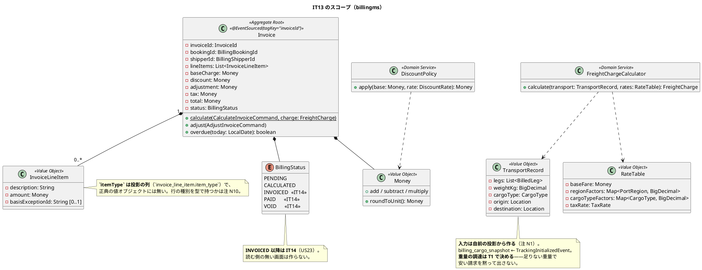
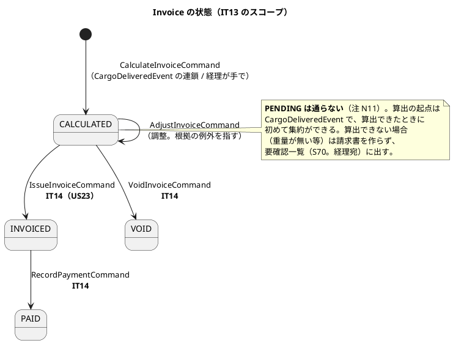
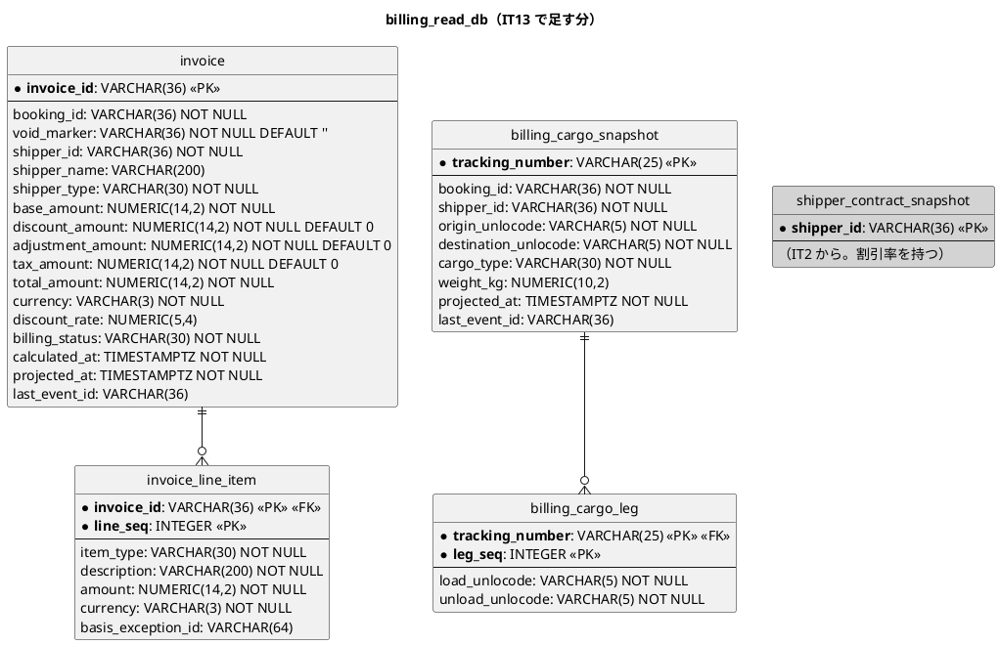
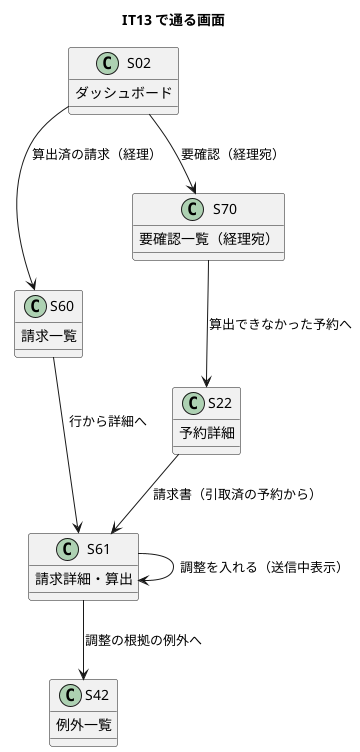

# イテレーション 13 計画

| 項目 | 内容 |
| :--- | :--- |
| イテレーション | IT13（Release 2.0 精算とキャンセル・**Release 2.0 の最初**） |
| 対象 | US21 輸送料金を算出する（6）・US22 法人割引を適用する（2） |
| SP | 8 + **引き継ぎ枠 2**（SP 対象外）+ **負債枠 2**（SP 対象外） |
| 局面 | 終盤（**アウトサイドイン**。既にある集約を業務シナリオで束ねる） |
| 前提 | IT12 クローズ済み（6/6 SP・累計 100・引き継ぎ 5 件 + レビューの低 9 件） |

## ゴール

**引取済の予約から請求書を組み立てられます。** 実際に通った区間・重量・貨物種別から基本料金を出し、法人荷主には契約割引を当て、輸出は免税になります。例外（遅延・破損・留置）があれば根拠の例外を指してから調整します。

**billingms が初めて集約を持ちます。** IT2 から `shipper_contract_snapshot` を写すだけの器だったサービスに、`Invoice` と料金計算が入ります。

## 対象ストーリー

| ID | ストーリー | SP | 対応 UC |
| :--- | :--- | :--: | :--- |
| US21 | 輸送料金を算出する | 6 | UC17 |
| US22 | 法人割引を適用する | 2 | UC17 |

## 局面（終盤・アウトサイドイン）

**新しい集約を 1 つ作ります**（`Invoice`）。終盤で 2 つ目の新設です（IT12 の `CustomsDeclaration` に続く）。請求は予約・追跡・荷役のどれの一部でもなく、経理担当者が別の当事者（荷主）に対して立てる文書なので、既存の集約には混ぜられません。

進め方は終盤のまま——業務シナリオ（デモ項目）を先に赤で置き、**入力の調達 → 計算 → 集約 → 連鎖 → 画面**の順に進めます。IT12 と違い、**新しい契約イベントは足しません**（後述の注 N1・N2）。既にある `CargoDeliveredEvent` と `TrackingInitializedEvent` の購読で足りるかを最初に確かめます。

## 受入基準（**1 項目ずつ表にする**）

**実装を始める前に作ります。** 空欄のまま残れば、それが未達です。

### US21 輸送料金を算出する

| # | 受入基準 | 満たす手段 | 検査の所在 | 状態 |
| :--- | :--- | :--- | :--- | :--- |
| §1 | 「引取済」状態の予約に対して**料金算出を開始できる** | `CargoDeliveredEvent` を `BillingReactionHandler` が購読して `CalculateInvoiceCommand` を送る（`domain-model.md` のコマンド表）。経理担当者が S60 から手で始めることもできる。**引取済でない予約では始められない**——`CargoDeliveredEvent` が来ていない予約の請求書は作らない | `BillingReactionHandlerTest`・`InvoiceControllerIT`・受け入れテスト | |
| §2 | **輸送実績（経路・距離・重量・貨物種別・荷役作業実績）が表示される** | `billing_cargo_snapshot`（新設。`TrackingInitializedEvent` を購読。ADR-0012 と同じ形）から `TransportRecord` を作り、S61 に「基本料金（3 区間・近海 2.5 + 遠洋 6.0・1,200 kg・一般）」の形で根拠を並べる。**距離は持たない**——正典の式は区間の地域係数で数え、距離は使わない（注 N3） | `InvoiceProjectionIT`・`InvoiceScreens.test.tsx`・受け入れテスト | |
| §3 | **基本料金が自動計算される** | `FreightChargeCalculator`（ドメインサービス）。式と料率は正典（`domain-model.md`「料金計算（正典）」）。**料率は `application.yml` から読む**（`RateTable`）——ハードコードしない。**丸めは `Money` の中 1 か所** | `FreightChargeCalculatorTest`（式の各係数を 1 つずつ動かす）・`MoneyTest`・`RateTableTest` | |
| §4 | 算出結果を**確認して確定操作ができる** | `Invoice` は `CALCULATED` で作られ、経理担当者が S61 で確定（`IssueInvoiceCommand` は US23・IT14 なので、本 IT の「確定」は**算出の確定**＝`CALCULATED` の登録まで）。注 N4 | `InvoiceTest`・`InvoiceControllerIT`・`InvoiceScreens.test.tsx` | |
| §5 | 確定後、輸送料金が**「確定」状態で登録される** | `InvoiceCalculatedEvent` → `invoice` 投影（`billing_status = 'CALCULATED'`）。**有効な請求書は予約ごとに 1 通**（不変条件 2。三段で守る） | `InvoiceProjectionIT`・`InvoiceControllerIT` | |
| §6 | 例外（遅延・破損等）が発生している場合、**料金調整（減額・補償費用）の入力ができる** | `AdjustInvoiceCommand` と `InvoiceLineItem`。**調整行は根拠の例外 ID を持つ**（`basisExceptionId`）——US28 §8「誤配の事実は料金調整の根拠として参照できる」の受け側。S61 から例外へリンクする。**留置は `CustomsStatusChangedEvent.heldBusinessDays` を根拠にする**（IT12 で載せた項目の最初の読み手） | `InvoiceTest`・`InvoiceProjectionIT`・`InvoiceScreens.test.tsx`・受け入れテスト | |

### US22 法人割引を適用する

| # | 受入基準 | 満たす手段 | 検査の所在 | 状態 |
| :--- | :--- | :--- | :--- | :--- |
| §1 | 荷主種別が「法人」の場合、料金算出時に**契約割引率が自動的に取得・表示される** | `shipper_contract_snapshot`（IT2 から写している）から読む。**同期問い合わせをしない**（bookingms が落ちていても請求書は作れる）。注 N2 | `BillingReactionHandlerTest`・`InvoiceProjectionIT`・`InvoiceScreens.test.tsx` | |
| §2 | 割引率（**0〜30%**）が基本料金に適用され、割引後の金額が表示される | `DiscountPolicy`（ドメインサービス）。**範囲は値オブジェクトが守る**（`DiscountRate`。bookingms に既にある形を billingms の型として持つ——BC が違えば型も違う） | `DiscountPolicyTest`・`InvoiceTest` | |
| §3 | **個人荷主の場合は割引が適用されない** | 同上。`INDIVIDUAL` は 0%。**判定は列挙が答える** | `DiscountPolicyTest`（`ShipperType.values()` を回す）・`InvoiceTest` | |
| §4 | 割引計算の**根拠（割引率・基本料金・割引後料金）が精算書に記載される** | `InvoiceLineItem` と S61。**請求書は作成時の割引率を持つ**（`invoice.discount_rate`）——作成後に荷主の契約が変わっても、出した請求書は変わらない。**契約番号も割引行に出す**（正典の S61 は「法人割引 (15%) … 法人契約 C-0012」と書く）ので、`shipper_contract_snapshot.contract_number` を**請求書へ複写する**——後から荷主の契約が差し替わっても、その請求書がどの契約に基づくかは変わらない | `InvoiceProjectionIT`・`InvoiceScreens.test.tsx`・受け入れテスト | |

### 受入基準に現れない不変条件（**正典にあり、実装が要る**）

| # | 不変条件 | 本 IT での扱い |
| :--- | :--- | :--- |
| 1 | `total = base − discount + adjustment + tax`。**通貨は集約内で一貫** | T3。`Money` の演算が通貨違いを断る |
| 2 | **有効な請求書は予約ごとに 1 通**（`VOID` は数えない）。三段で守る（作成前の存在確認 + 投影の `UNIQUE(booking_id, void_marker)` + 拒否の記録 `attention_item`） | T3・T4。**IT12 のレビュー #L15 を踏まえ、DB の UNIQUE を最初から置く**——投影を読む確認だけでは同時 2 件が通る |
| 4 | 期限超過は列に持たず `overdue(today)` で判定。**期限当日は超過ではない** | **本 IT では扱わない**（注 N4）。`dueDate` が確定するのは不変条件 3（`INVOICED` になるとき）＝US23・IT14 なので、いま `overdue` を作ると**入力経路が無く常に同じ答えを返す述語**になる——壊しても赤にならない。**US23 で `dueDate` と同じ変更の中で入れる** |
| 7 | `quotedAmount` は**計算し直さない** | 注 N5。**見積は US01・IT14** なので本 IT では入力が無く、常に `NULL` |

### 注（設計への反映が必要）

| # | 注 | 反映先 | 本 IT での対応 |
| :--- | :--- | :--- | :--- |
| N1 | **`CargoDeliveredEvent` だけでは料金を計算できない。** 運ぶのは追跡番号・予約 ID・引渡時刻・場所だけで、**区間・重量・貨物種別が無い**。`TrackingInitializedEvent` は区間・貨物種別・出発地・目的地を運ぶが**重量が無い** | `domain-model.md` の契約イベント表・`data-model.md` の 4 か所（サービス別テーブル一覧 `:95`・`billing_read_db` の ER `:661`・Processing Group の対象 `:873`・集約↔テーブル対応 `:893`。**新設は `billing_cargo_snapshot` と `billing_cargo_leg` の 2 表**） | **T1 で決める。** 候補は (a) `TrackingInitializedEvent` に `weightKg` を足す（追記専用なので過去のイベントには入らない。旧ペイロードが読めることを `LegacyContractPayloadTest` で固定し、**ゴールデン JSON を両側に置いて Axon Server 経由の往復テストを書く**——開発戦略の終盤 Phase 2 が契約を足す IT に課している形。IT12 は T2 で守った）、(b) Upcaster、(c) 算出を断って要確認に出す。**(a) + (c) を採る**——足りない重量で安い請求を黙って出さない |
| N2 | **`CorporateContractAssignedEvent` は足さない。** `data-model.md:739` は「US22 の IT13 で足す」と書くが、法人契約は**荷主登録で設定され** `ShipperRegisteredEvent` が既に運んでいる（billingms は写している）。付与を後から行う操作（`AssignCorporateContractCommand`）は bookingms に無い | `data-model.md:739` | **T2 で正典を直す。** 読む側の無い契約を先に足さない（IT9〜IT12 と同じ判断） |
| N3 | **正典の式に「距離」は無い。** US21 §2 は「距離」を挙げるが、料金計算（正典）は区間の**地域係数**で数える | `user_story.md`（US21 §2 の言い換え）または計画の注 | **注として残す。** 画面には区間と地域区分を出す（距離は出さない）。数えていないものを出すと、根拠として読めない |
| N4 | **`overdue`・`dueDate`・`payment` の書き手も読み手も本 IT に無い**（発行と入金は US23・IT14）。正典は `invoice` に `INDEX(billing_status, due_on)` を課し、一覧 SQL が `due_on < :today AND billing_status = 'INVOICED'` で判定する | `data-model.md:736`（索引）・`:738`（`payment`）・`:893`（集約↔テーブル対応）・`:1008`（一覧 SQL） | **本 IT では作らない。** 列・索引・`payment` 表・`overdue` 述語をまとめて US23（IT14）で入れる——**`dueDate` と同じ変更の中で**。いま述語だけ作ると入力経路が無く、壊しても赤にならない（IT12 の `held_business_days` が「常に 0 の列」になった形と同型）。**正典側にも「IT14 で入る」ことを注記する** |
| N5 | **`quotedAmount` の入力が無い**（見積は US01・IT14）。S61 の「見積時の概算 → 請求 → 差額」は出せない | `ui_design.md:1238`（S61 の節） | **S61 の節に「見積を経ない予約では概算行と差額を出さない」が既にある。** 本 IT はすべてその場合になることを注記する |
| N6 | **`### S60` の節が `ui_design.md` に無い**（画面一覧の行・一覧規約の行「入金済（`PAID`）・取消（`VOID`）を外す／支払期限が近い順／「入金済も表示」」・ナビ構成表の行・画面遷移図はある。**画面項目と操作手順だけが未記述**）。IT12 の N4（S52 が無い）と同じ形 | `ui_design.md`（S60 の節を新設） | **T6 で反映する。** ただし本 IT では `PAID` / `VOID` に至らないので、**一覧規約のうち書けるのは「支払期限が近い順」だけ**——期限は US23 で入る。**並びの既定は算出日時の新しい順**にし、その理由を節に書く |
| N7 | **ナビゲーション構成表には「請求 S60 経理」が既にある**が、実装側（`navigation.ts`・S02・`demoAccounts.ts` の説明）に `/invoices` が無い。**設計が先にあり実装が追いついていない形**（IT12 の S52 と逆） | `navigation.ts`・S02（`DashboardPage`）・`demoAccounts.ts`・`navigationMatchesUiDesign.test.ts` | **T6 で反映する**（4 点一致：構成表・`navigation.ts`・S02・検証テスト。**検証テストは構成表を読んで突き合わせるので、実装を足すと自動的に緑になるかを先に確かめる**） |

| N8 | **要素表（ユビキタス言語）に本 IT の新規要素が無い。** `BillingStatus` はあるが、**ドメインサービス 2 つ**（`FreightChargeCalculator`・`DiscountPolicy`）と**列挙 1 つ**（`LineItemType`。`BASE` / `DISCOUNT` / `ADJUSTMENT` / `CANCELLATION_FEE` / `TAX`）が載っていない。`RouteSearchService` は載っているので、載せるのが本プロジェクトの形 | `domain-model.md` の要素表 | **T2・T3 で足す**（IT1〜IT3 で反復したドリフトと同じ形。`validating-design` 軸 B の絶対項目） |
| N9 | **`Money` は共有カーネルに置かない**（`domain-model.md:287` の「置かないもの」が明記）。BC ごとに持つ | — | **T2 で billingms の型として作る。** `HolidayCalendar` を移すのと逆方向の判断だが、理由が違う——営業日は「全 BC で同じでなければならない」、金額の型は「BC ごとに通貨も丸めも違いうる」 |

| N10 | **`ApplyDiscountCommand` は足さない。** 正典は US22 のコマンドとして `ApplyDiscountCommand` → `DiscountAppliedEvent` を定義し、`Invoice#applyDiscount` と `invoice` 投影の元イベントにも挙げている。しかし**割引は算出の中で当てる**——別コマンドにすると、割引の無い請求書が一瞬見える状態が正常系として存在する。あわせて `InvoiceLineItem` に**行の種別**（`LineItemType`）を持たせるかも決める（正典の値オブジェクトには無く、投影の列 `item_type` にだけある） | `domain-model.md:1073`・`:1165`・`:1316`・`:1429`、`data-model.md:736`・`:737` | **T4 で正典を直す**（コマンド表・クラス図・投影の元イベント）。行の種別は**投影の列のまま**にし、値オブジェクトには持たせない（表示の分類であって業務判断ではない） |
| N11 | **`BillingStatus.PENDING` は通らない。** 正典は「算出待ち」として列挙に含むが、算出の起点は `CargoDeliveredEvent` で、**算出できたときに初めて集約ができる**（算出できなければ請求書を作らず要確認に出す） | `domain-model.md:138`・`:1092` | **列挙には残す**（US23 以降で使う余地を消さない）。**要素表に「本プロジェクトの経路では通らない」を注記する**——書いてあるのに通らない値は、次に読む人が使おうとする |
| N12 | **`invoice.shipper_name` の `NOT NULL` は成立しない。** 正典 ER は `NOT NULL` だが、荷主名は crypto-shredding 後に `NULL` になる（ADR-0003）——実装の `shipper_contract_snapshot` も NULL 許容 | `data-model.md:675`（ER の `NOT NULL` を外す） | **T5 で正典を直す**（本文 `:1012` は既に「`NULL` になる」と書いており、ER だけが食い違っている） |
| N13 | **S61 から例外へ・要確認一覧（S70）への遷移が画面遷移図に無い。** 正典の経理ブロックは `S02 → S60 → S61` だけで、S61 から出る遷移が無い | `ui_design.md:318-321`（画面遷移図） | **T6・T9 で反映する。** S70 は経理も読む画面（「請求の失敗は経理」）なので、**要確認に出したものを経理が開けることをタスクに落とす** |

## 成功基準

IT12 のふりかえり Try 8 件をすべて落とし込みます。

- [ ] デモ項目の受け入れテストがすべて緑
- [ ] **`TZ=UTC` でモジュールを分けて `build` が緑**（`dev:backend:full:split`。5 群）
- [ ] フロントの `npm run test`・`npx tsc -b`・`npm run build` が緑
- [ ] **受入基準の表を、実装を始める前に作った**（継続）
- [ ] **画面から画面への繋ぎ目を、件数・リンクを作った時点で 1 度踏んだ**（**Try T1**。href を検査するだけでなく、**着いた先が期待の絞り込みで開くか**をテストに書く。本 IT では S02 → S60、S22 → S61、S61 → 例外）
- [ ] **「後の IT で作る」と書いたコメントを、序盤に `grep` で回収した**（**Try T2**。`IT13`・`US21`・`US22`・`US23` で探す）
- [ ] **自分が書いた javadoc・SQL コメントの「〜する」を、同じ変更の中で赤にできる検査と対にした**（**Try T3**・**3 IT 目**。**手立てを変える**——`grep` で「写す」「返す」「読む」「数える」を含むコメントを列挙し、対応する検査を表にしてから書く）
- [ ] **レビューは 15 分で逐次に切り替え、そのうえで返着を待って統合した**（**Try T4**。IT11・IT12 と 2 IT 続けて遅着分にしか出ない欠陥があった。**クローズを確定する前に、届いた分をもう一度突き合わせる**）
- [ ] **受け入れフィクスチャの日付を「今」から導いた**（**Try T5**。handling・tracking に残る固定日付を直し、**固定日付を書かせない規約テスト**を置く）
- [ ] **処理の列を分け、退避からの再処理入口を作った**（**Try T6**。引き継ぎ枠 A・B）
- [ ] **US ごとにクラスタ E2E を 1 度回した**（**Try T7**。US21 と US22 で独立したタスク行を立てる）
- [ ] **手立てを機械に移した**（**Try T8**。IT11 の `.gitmessage`・IT12 の `dev:backend:guard` に続く形。本 IT では「受入基準の表に書いたクラス名が実在するか」を検査にする）
- [ ] **受入基準の表の「検査の所在」に書いたクラス名・メソッド名が実在する**（IT12 レビューの懸念。`AdrHasChecksTest` と同じ作りの検査を 1 本置く）
- [ ] **料率をハードコードしていない**（`application.yml` の `RateTable`）
- [ ] **丸めが `Money` の中 1 か所だけ**（正典）
- [ ] SonarQube の Quality Gate がバックエンド・フロントエンドとも PASS
- [ ] `npx gulp okf:check` が ERROR 0
- [ ] **ユーザーマニュアル 17 章（請求を組み立てる）を新設し、画面キャプチャを生成 spec で撮った**

## 引き継ぎ枠・負債枠（SP 対象外・**IT の序盤に独立コミットで消化**）

IT12 から 5 件 + レビューの低 9 件を受けています。`release_plan.md` の IT13 の枠は**引き継ぎ 2 + 負債 2** です。

| 枠 | 内容 | 由来 |
| :--- | :--- | :--- |
| **引き継ぎ A** | **退避先から処理し直す入口**（`projection:dead-letters:retry`。Axon の `SequencedDeadLetterProcessor`）。運用手順書にも載せる | IT12 H.1（高）。**直したあとに退避を消すのは ADR-0014 決定 1 に反する**。T7e で実際に `DELETE` で片づけた |
| **引き継ぎ B** | **処理の列を分ける**（`EventProcessorDefinition` + `SequenceOverridingEventHandlingComponent`） | IT12 H.2（高）。列が全体で 1 本なので 1 件の毒で別の貨物のイベントまで退避される（4 件のうち 3 件が巻き添え） |
| **負債 1** | **受け入れフィクスチャの固定日付**（handling・tracking に残る `2026-09-10T09:00:00Z` の航海区間）と、**固定日付を書かせない規約テスト** | IT12 H.3（中）。routing では実際に赤になった（同じ日の 08:00 UTC は緑、09:51 UTC は 13 件が赤） |
| **負債 2** | **`customs_declaration.held_business_days` の削除**（追加マイグレーション）と、**不変条件 3 の部分ユニークインデックス**（`UNIQUE (tracking_number) WHERE status IN ('PENDING','HELD')`） | IT12 H.4（中）・レビュー #L15。**どちらもスキーマ変更**。ユーザーの承認済み（2026-09-11） |

**レビューの低 9 件のうち、本 IT のスコープに直接触れる 2 件**は US21 のタスクに含めます。

- **`CountOverdueCustomsHoldsQuery` の配線か削除**（定義済み未使用。母集合が一覧と違う）→ T0 で消す
- **輸入港の国で営業日を数える**（いまは `CountryCode("JP")` 固定が 2 か所。`HolidayCalendarTest` の国別分岐が本番経路で一度も踏まれない）→ **本 IT で `HolidayCalendar` を共有カーネルへ移す**判断とあわせて T1 で扱う。移す条件を書いた `domain-model.md:101`（「billingms が保管料を数え始めたら、そのとき移す」）の答えを出す

残りは **3 件**（#11 引取待ちに通関状態の列——**IT12 で実装済みなので消える**、#L18 は上のとおり T1 に含めた、#L19 図と表の細部・`AdrHasChecksTest` の対応数検査）です。**#L19 の「ADR の決定と検査の対応数を見る検査」だけ IT14 へ送ります**（本 IT で ADR を 1 本立てるので、そのときに形を確かめてから作るほうが実物に合う）。

**IT12 の引き継ぎ H.5（5 項目の束）の行き先も決めます。**

| H.5 の項目 | 行き先 | 理由 |
| :--- | :--- | :--- |
| 引取待ちに通関状態の列 | **済**（IT12 のクローズで実装した） | レビューの最重要指摘だったので IT12 内で返した |
| S42・S52 に荷主名を出す（Upcaster が要る） | IT14 | Upcaster は契約の版管理の話で、US23（請求書の発行）と同じ IT に置くほうがまとまる |
| 航海番号で探す・港名の対応表 | IT14 | 経路設計の画面の話で、本 IT のスコープ（請求）と接点が無い |
| 互換コンストラクタ 3 本の削除 | **本 IT の T2** | `Money` を作るときに同じ「値オブジェクトの整理」として片づける |

## タスク

| # | タスク | US | 見積 |
| :--- | :--- | :--- | :--- |
| T0 | **引き継ぎ枠 A・B と負債枠 1・2 を消化する**（独立コミット。先に済ませる）。あわせて `CountOverdueCustomsHoldsQuery` を消す | — | 12h |
| P1 | **業務シナリオを赤で置く**（終盤の Phase 1）。デモ項目を受け入れテストとクラスタ E2E に先に書く | US21・US22 | 4h |
| T1 | **入力の調達を決める**（注 N1）。`billing_cargo_snapshot`・`billing_cargo_leg` を新設し `TrackingInitializedEvent` を購読。**重量を運ぶかを決めて実装**し、旧ペイロードが読めることと**ゴールデン JSON・往復テスト**を揃える。**`HolidayCalendar` を共有カーネルへ移す**——`domain-model.md:101` が書いた移送条件の答えを出し、**ADR-0001 の名簿（コンプライアンス表）に足し、`SharedKernelScopeTest` の名簿を同じ変更で更新する**（決定は同じ変更で検査に落とす）。**輸入港の国で数える**（レビュー #L17）。**記録時と読み取り時の営業日数が同じ値を返す検査**を置く（レビュー #L18。US21 で請求と画面が食い違う余地） | US21 | 10h |
| T2 | **値オブジェクトと料率表**（`Money`・`DiscountRate`・`RateTable`・`TransportRecord`・`FreightCharge`・`BillingStatus`・`LineItemType`）。**`Money` は billingms の型として作る**（注 N9）。**料率は `application.yml` から読む**。注 N2 の正典修正・注 N8 の要素表への追加 | US21・US22 | 8h |
| T3 | **`FreightChargeCalculator` と `DiscountPolicy`**（ドメインサービス）。式の各係数を 1 つずつ動かす検査。**輸出免税**（出発地と目的地の国が違えば 0%） | US21・US22 | 8h |
| T4 | **`Invoice` 集約**（`calculate` / `adjust`）と不変条件 1・2。**`applyDiscount` は作らない**（注 N10）。**`overdue` も作らない**（注 N4。`dueDate` が入るのは US23・IT14 で、いま作ると入力経路の無い述語になる——IT12 の「常に 0 の列」と同型） | US21・US22 | 8h |
| T5 | **投影とクエリ**（`invoice`・`invoice_line_item`・`billing_cargo_snapshot`・`billing_cargo_leg`。`FindInvoicesQuery` / `FindInvoiceQuery`）。**`attention_item` を billingms に作る**（実在しない。追加マイグレーション）。**不変条件 2 の三段目**（拒否を記録。宛先は経理）。**索引は本 IT で置く分だけ**——`UNIQUE(booking_id, void_marker)` と `INDEX(shipper_id)`。`INDEX(billing_status, due_on)` は IT14（注 N4）。**`InvoiceAdjustedEvent` も投影の元イベント**。**`BillingReplayIT`**（規約テストが要求する。リスク R3）。注 N12 の正典修正 | US21 | 8h |
| T6 | **S60 請求一覧・S61 請求詳細**（`/invoices`・`/invoices/:id`）。**注 N6（S60 の節）・N7（経理のナビ）を `ui_design.md` に足す**。ナビゲーション整合（構成表・`navigation.ts`・S02・検証テストの 4 点） | US21・US22 | 8h |
| T7 | **連鎖**（`BillingReactionHandler`。`CargoDeliveredEvent` 購読 → `CalculateInvoiceCommand`）。**割引は算出の中で当てる**（注 N10）。**補償経路を 1 本ずつ検査する**——荷主スナップショットが無い／重量が無い／再試行の上限を超えた場合に `InvoiceCreationFailedEvent` を出し、**経理の要確認一覧（S70）に写す**（`architecture_backend.md:863`・`domain-model.md:1376`。開発戦略の完了条件「連鎖の補償経路が 1 本ずつ検査されている」） | US21・US22 | 8h |
| T7e | **クラスタ E2E（US21・US22）**。引取済 → 請求書ができる → 割引が入る → 調整を入れる | US21・US22 | 4h |
| T8 | **認可**（`ROLE_ACCOUNTANT`（利用者 `accountant01`）に `/api/v1/billing/**`）。**メソッド込みで宣言し、そのロール以外が 403 になることを肯定・否定の両方で検査する**（IT10 の引き継ぎ枠 B で同じ穴を返済した形）。荷主は自社分だけ＝S62 は US23・IT14 なので本 IT では開けない | US21 | 4h |
| T9 | **調整の根拠**（`basisExceptionId` から例外へのリンク。US28 §8 の受け側）。**留置営業日数を根拠にする**（IT12 で載せた `heldBusinessDays` の最初の読み手）。**S61 → S42 と S70 への遷移を `ui_design.md` の画面遷移図に足す**（注 N13） | US21 | 6h |
| T10 | 受け入れテスト（デモ項目）・**マニュアル 17 章「請求を組み立てる」新設**・全体のクラスタ E2E | US21・US22 | 8h |
| **合計** | | | **96h** |

### 既にあるもの（**着手前に `grep` で確かめる**）

| 探すもの | 結果 | 本 IT での扱い |
| :--- | :--- | :--- |
| `Invoice`・`FreightCharge`・`Money`（billingms） | **無い**（`domain/model` は `package-info.java` だけ） | T2・T4 で新設 |
| `shipper_contract_snapshot` | **ある**（IT2 から。`ShipperContractProjection` が `ShipperRegisteredEvent` を写す） | US22 §1 はこれを読む |
| `CargoDeliveredEvent` | **ある**（契約。trackingms が出す） | T7 で購読。ただし注 N1 |
| `TrackingInitializedEvent` | **ある**（契約。区間・貨物種別・出発地・目的地。**重量は無い**） | T1 で扱う |
| `CorporateContractAssignedEvent` | **無い**（`ShipperRegisteredEvent` が契約情報を運んでいる） | 注 N2。足さない |
| `attention_item`（billingms） | **無い**（マイグレーションは V001 Axon・V002 荷主スナップショット・V003 退避先の 3 本。**正典は billingms にも置くと書いている**が、まだ作っていない） | **T5 で追加マイグレーションを書く。** 不変条件 2 の三段目がこの表に依存する |
| `HolidayCalendar` | **ある**（handlingms。共有カーネルには置いていない） | T1 で共有カーネルへ移す（ADR-0015 を起票。移す条件の出典は `domain-model.md:101`） |
| `DiscountRate` | **ある**（bookingms の値オブジェクト） | **BC が違えば型も違う**。billingms の型を作る |

## スケジュール

**順序は開発戦略の終盤ワークフローに従います**（`development_strategy.md:298`）——シナリオを赤で置く → 契約 → 連鎖 → 不変条件 → 画面。本 IT は**契約の前に入力の調達**（T1）が入ります（注 N1。ここが決まらないと計算が書けない）。

| 日 | Phase | 内容 |
| :--- | :--- | :--- |
| 1 | 枠 | T0（引き継ぎ枠 A・B・負債枠。独立コミット） |
| 2 | 1 シナリオを赤で置く | P1・T1（入力の調達・`HolidayCalendar` 移送） |
| 3 | 2 契約 | T2（値オブジェクトと料率表） |
| 4 | 2 契約 | T3（料金計算・割引・輸出免税） |
| 5 | 4 不変条件 | T4（`Invoice` 集約） |
| 6 | 3 連鎖 | T5（投影とクエリ）・T7（連鎖と補償経路） |
| 7 | 5 画面 | T6（S60・S61 と注 N6・N7・N13） |
| 8 | 5 画面 | T8（認可）・T9（調整の根拠） |
| 9 | 確認 | T7e（US ごとのクラスタ E2E）・T10（受け入れ・マニュアル 17 章） |
| 10 | クローズ | レビューは**最初に起動し、15 分で逐次へ切り替えて並行**（Try T4） |

**T4（不変条件）を T5・T7（投影・連鎖）より前に置いています。** 集約が受け付ける形が決まらないと、連鎖が送るコマンドの形も決まらないためです（IT12 も同じ順で進めました）。

## ADR

| # | 判断 | 起票 |
| :--- | :--- | :--- |
| `HolidayCalendar` の置き場 | **共有カーネルへ移す**。billingms が保管料（留置営業日）を数え始めるので、「全 BC で同じでなければならない業務上の理由」（ADR-0001 決定 4 の判断基準）が立つ | **ADR-0015 を起票**（「営業日の数え方は共有カーネルが持つ」）。**移す条件を書いたのは `domain-model.md:101` の要素表行**で、ADR-0013（共有カーネルが例外の対応表を持つ）は営業日に触れていない——**ADR-0013 を改訂すると誤った履歴が残る**。正典の指定を訂正する形は ADR-0012 の前例に従う。名簿は ADR-0001 のコンプライアンス表に足し、`SharedKernelScopeTest` を同じ変更で更新する |
| 料率の置き場 | `application.yml` の `RateTable`。見積（US01・IT14）と同じ値を読むことを契約テストで固定する | **ADR-0016 を起票**（「料率は設定に置き、見積と請求で同じものを読む」）。決定ごとに検査を対応させる |

## 設計

### ドメインモデル図（本 IT のスコープ）

### 状態遷移図（本 IT で通る経路）

### ER 図（本 IT で足す表）

**`payment` は作りません**（入金は US23・IT14）。`quoted_amount` / `issued_on` / `due_on` / `paid_at` / `voided_at` の列も、書き手が来る IT14 で足します——**読む側の無い列を先に作らない**（IT12 の `held_business_days` が「常に 0 の列」になった形の再発を避ける）。

`weight_kg` が NULL 許容なのは、**重量を運んでいない旧イベントから作られた行**があるためです（注 N1）。NULL のまま算出しようとしたら断って要確認に出します。

### 画面遷移図（本 IT のスコープ）

**S62（自社請求書）は作りません**（US23・IT14）。荷主が読む請求書は発行（`INVOICED`）が前提です。

**S70（要確認一覧）は既にあります**（IT7 から）。本 IT で足すのは**経理宛の項目を書く側**で、画面は既に `assigned_role` で絞って出します。算出できなかった予約（重量が無い・荷主スナップショットが無い・再試行の上限を超えた）がここに出ます。

## デモ項目（**すべて受け入れテストかクラスタ E2E に落とす**）

| # | シナリオ | 受入基準 |
| :--- | :--- | :--- |
| D1 | 引取済になった予約に、請求書が自動でできる（基本料金つき） | US21 §1・§3・§5 |
| D2 | 請求詳細に**根拠が並ぶ**（区間・地域区分・重量・貨物種別） | US21 §2 |
| D3 | **法人荷主なら割引が入る**（割引率・基本料金・割引後が読める） | US22 §1・§2・§4 |
| D4 | **個人荷主では割引が入らない** | US22 §3 |
| D5 | **輸出（出発地と目的地の国が違う）は消費税 0 円** | 正典の式 |
| D6 | 経理担当者が**調整を入れられる**（減額・補償費用） | US21 §6 |
| D7 | 調整行から**根拠の例外へ行ける** | US21 §6・US28 §8 |
| D8 | **留置 4 営業日の保管料を調整の根拠にできる** | US21 §6 |
| D9 | **同じ予約に有効な請求書は 1 通だけ**（2 通目は断られ、要確認に出る） | 不変条件 2 |
| D10 | **重量が分からない貨物では請求書を作らず、要確認に出る** | 注 N1 |
| D11 | 経理以外は請求を開けない | US21 §1（認可） |

## リスク

| # | リスク | 対処 |
| :--- | :--- | :--- |
| R1 | **入力が足りない**（注 N1。重量が契約イベントに無い）。ここで詰まると T3 以降が全部止まる | **T1 を最初に置き、P1 の次に潰す。** 決め方も先に書いた——足りない重量で安い請求を出さず、断って要確認に出す |
| R2 | **料率と式が 2 か所に散る**（見積は US01・IT14 で来る）。散ると片方だけ直る | **`application.yml` の `RateTable` を単一の出典にし、ADR-0015 で決定と検査を対応させる。** IT14 で見積が来たとき、同じ入力に対する出力を突き合わせる契約テストを足す |
| R3 | **billingms は投影しか持たないサービスだった。** `Invoice` を足した瞬間に「Event Sourcing の集約を持つサービス」として扱われ、`EventSourcedServicesHaveTheSameShapeTest` の 4 つの規約が**新たに効き始める**——(1) コマンドハンドラは static でない（作成系を除く）、(2) 共有カーネルの対応表を使う（写さない）、(3) `@EventHandler` のパッケージが Processing Group として列挙され退避先が付いている、(4) **投影を持つサービスには `ReplayIT` がある** | **T2 の前に一度走らせ、赤になる項目を洗い出してから書く。** とくに (4) の `ReplayIT` はタスクに現れていないと最後に出てくる——**T5 に含める** |
| R4 | **`Money` の丸めが散る。** 各所で `setScale` を書くと、合計が一致しない | **丸めは `Money` の中 1 か所**（正典）。成功基準に入れた。`MoneyTest` で「加算の順序を変えても合計が同じ」を固定する |
| R5 | **`HolidayCalendar` を共有カーネルへ移すと handlingms の参照が変わる。** 移送そのものは機械的だが、名簿（ADR-0001 のコンプライアンス表）と `SharedKernelScopeTest` の更新が要る | **T1 で ADR-0015 を起票してから移す。** 名簿と検査は同じ変更の中で更新する——落とさなければ守られない（`development_strategy.md:404`） |

## DoD

- [ ] 受入基準の表がすべて埋まっている（未達は**未達と書く**）
- [ ] デモ項目 11 件が受け入れテストかクラスタ E2E で緑
- [ ] **受入基準の表の「検査の所在」に書いたクラス名が実在する**（検査で固定）
- [ ] ナビゲーション整合（`ui_design.md` の構成表・`navigation.ts`・S02・検証テストの 4 点が一致）
- [ ] **`TZ=UTC` で分割 `build` が緑**
- [ ] フロントの `npm run test`・`npx tsc -b`・`npm run build` が緑
- [ ] クラスタ E2E が緑（US ごとに 1 度 + 通し）
- [ ] SonarQube の Quality Gate がバックエンド・フロントエンドとも PASS
- [ ] CI が緑
- [ ] **注 N1〜N9 を設計ドキュメントに反映した**
- [ ] **ADR-0015・ADR-0016 を起票した**（決定ごとに検査を対応させる）。**ADR-0013 は改訂しない**（営業日に触れていない）
- [ ] **マニュアル 17 章を新設し、キャプチャを生成 spec で撮った**。**書いた手順を画面で 1 度なぞった**
- [ ] `npx gulp okf:check` が ERROR 0
- [ ] 引き継ぎ枠 A・B と負債枠 1・2 を消化した（できなければ**理由をふりかえりに書く**）
- [ ] 各タスクの成果を意味のある単位でコミットした（品質ゲートの結果を書く欄を持つテンプレートで）

## 関連ドキュメント

- [リリース計画](release_plan.md)・[開発戦略](development_strategy.md)
- [IT12 ふりかえり](retrospective-12.md)・[IT12 完了報告書](iteration_report-12.md)
- [IT12 レビュー](../../review/cargo-tracker/IT12実装_review_20260910.md)
- [ユーザーストーリー](../../requirements/user_story.md)（US21・US22）
- [ドメインモデル](../../design/cargo-tracker/domain-model.md)・[データモデル](../../design/cargo-tracker/data-model.md)・[UI 設計](../../design/cargo-tracker/ui_design.md)
- [ADR-0001](../../adr/cargo-tracker/0001-cqrs-es-with-axon-in-microservices.md)（共有カーネルの名簿）・[ADR-0012](../../adr/cargo-tracker/0012-cargo-snapshot-from-tracking-initialized.md)（正典の指定を訂正する形の前例）・[ADR-0014](../../adr/cargo-tracker/0014-poison-events-are-parked-not-blocking.md)（引き継ぎ枠 A・B）

## 更新履歴

| 日付 | 内容 | 記録者 |
| :--- | :--- | :--- |
| 2026-09-11 | 初版作成（IT13 開始準備 ステップ 1・2） | claude-code/claude-opus-5 |
| 2026-09-11 | **T0（引き継ぎ枠 A・B / 負債枠 1・2）を消化**。(1) 通関申告の `held_business_days` を落とし、不変条件 3 の部分ユニークインデックスを置いた（V008）、(2) 受け入れフィクスチャの日時を「今」から導く形に直し、**固定日付を書かせない規約テスト 2 本**を置いた（.feature は期限の 30 日前に赤くする）、(3) **処理の列を貨物・予約・荷主・申告・航海ごとに分けた**（`@SequencingPolicy`。IT12 の「この版に手立てが無い」は誤りだった）、(4) **退避からの処理し直す入口**（`/actuator/deadletters`・`gulp projection:dead-letters:retry`）。`CountOverdueCustomsHoldsQuery` も削除 | claude-code/claude-opus-5 |
| 2026-09-11 | **T1（入力の調達）**。`TrackingInitializedEvent`・`InitializeTrackingCommand`・`TrackingNumberIssuedEvent` に**重量**を足し（旧ペイロードはゴールデン legacy で固定）、billingms に `billing_cargo_snapshot` / `billing_cargo_leg` を新設。**Axon Server 経由の往復テスト**で重量と区間が実際に届くことを確かめた。`HolidayCalendar` を共有カーネルへ移し（**ADR-0015** 起票・ADR-0001 の名簿と `SharedKernelScopeTest` を同じ変更で更新）、**営業日を数える国を輸入港から決める**ようにした（#L17）。記録時と読み取り時の日数が一致する検査（#L18）も置いた | claude-code/claude-opus-5 |
| 2026-09-11 | ステップ 3・4 の検証で見つけた **28 件**を反映。重いものは (1) **`attention_item`（billingms）が実在しなかった**（「V001 で作成済み」と書いていた。不変条件 2 の三段目が依存するので T5 に追加マイグレーションを立てた）、(2) **`overdue` を本 IT で作らない**ことにした（`dueDate` が入るのは IT14 で、いま作ると入力経路の無い述語になる——計画自身が「再発を避ける」と書いた IT12 の「常に 0 の列」と同型だった）、(3) **`HolidayCalendar` の移送の宛先が誤り**（問いを立てたのは ADR-0013 ではなく `domain-model.md:101`。ADR-0013 を改訂すると誤った履歴が残るので ADR-0015 を起票する）、(4) **契約を足すならゴールデンと往復テストが要る**（開発戦略の終盤 Phase 2）、(5) **補償経路**（`InvoiceCreationFailedEvent`）が抜けていた。あわせて注を N10〜N13 まで足し、開発戦略の終盤の目的文に「新設した例外 2 件」を明記した | claude-code/claude-opus-5 |
