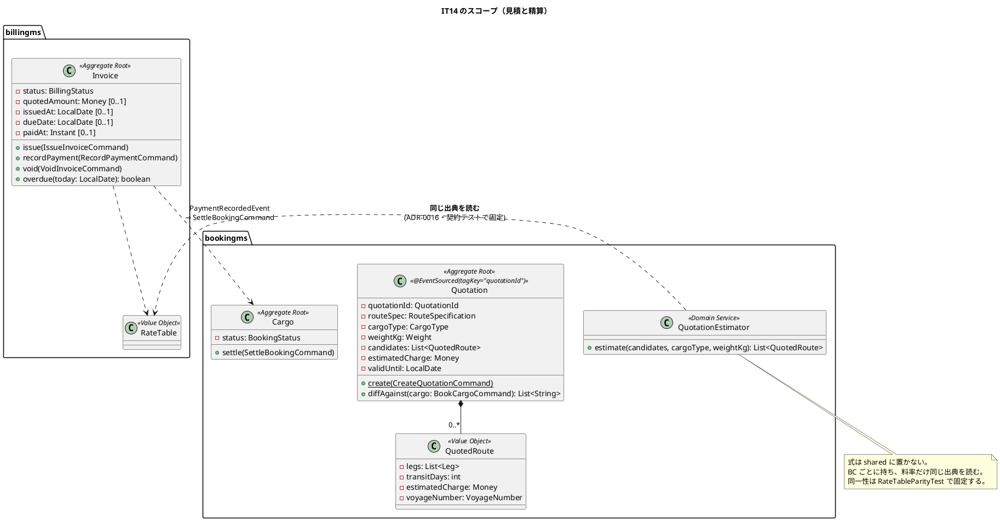
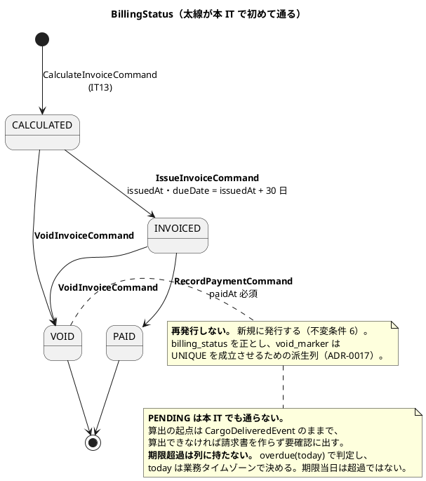
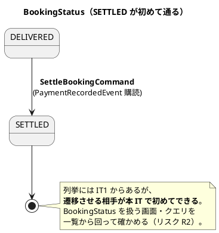
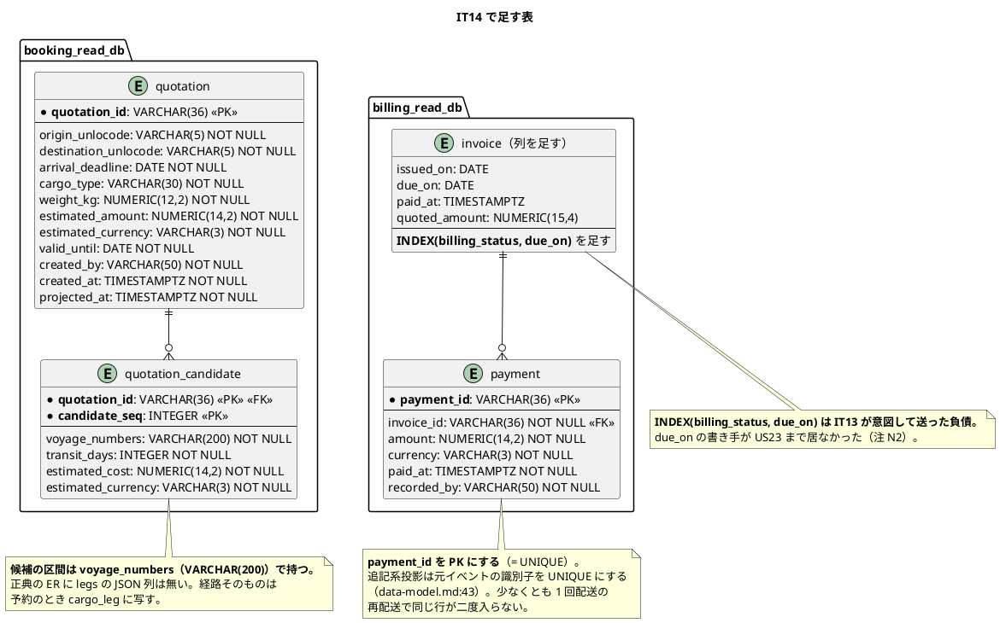
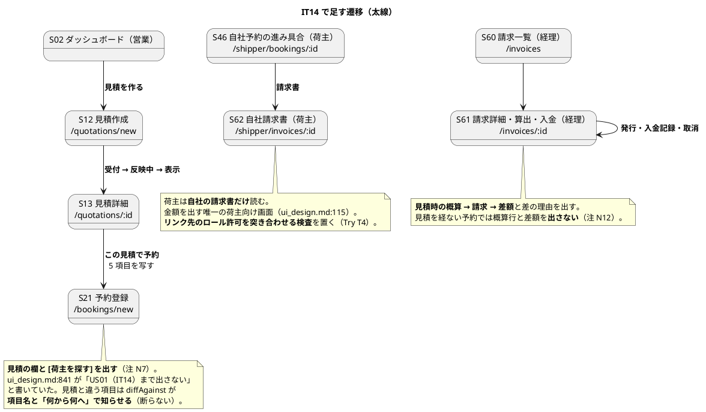

# イテレーション 14 計画

| 項目 | 内容 |
| :--- | :--- |
| イテレーション | IT14（Release 2.0 精算とキャンセル・**2 つ目**） |
| 対象 | US01 輸送見積を作成する（4）・US23 精算を処理する（4） |
| SP | 8 + **引き継ぎ枠 3**（SP 対象外）+ **負債枠 2**（SP 対象外） |
| 局面 | 終盤（**アウトサイドイン**。既にある集約を業務シナリオで束ねる） |
| 前提 | IT13 クローズ済み（8/8 SP・累計 108・引き継ぎ 12 件） |

## ゴール

**見積から精算まで、金額の流れが 1 本につながります。** 営業担当者が荷主の輸送要件から概算を出し、その見積で予約すると、引取後の請求書が「見積時の概算 → 請求 → 差額」を理由つきで説明します。経理担当者は請求書を発行し、入金を記録すると予約が「精算済」になります。

**輪が閉じる IT です。** US01 は業務の入口（見積）、US23 は出口（精算）で、あいだの予約・経路・追跡・荷役・請求は IT1〜IT13 で作り終えています。**新しい集約は `Quotation` 1 つだけ**で、残りは既にある `Invoice` と `Cargo` に状態遷移を足す作業です。

## 対象ストーリー

| ID | ストーリー | SP | 対応 UC |
| :--- | :--- | :--: | :--- |
| US01 | 輸送見積を作成する | 4 | UC01 |
| US23 | 精算を処理する | 4 | UC18 |

## 局面（終盤・アウトサイドイン）

**新しい集約を 1 つ作ります**（`Quotation`。bookingms）。終盤で 3 つ目の新設です（IT12 の `CustomsDeclaration`・IT13 の `Invoice` に続く）。見積は予約の前段にあり、**予約に至らない見積が存在する**ので `Cargo` には混ぜられません。

US23 は**新設ゼロ**です。`Invoice` に `issue` / `recordPayment` / `void` / `overdue` を足し、`Cargo` に `SETTLED` への遷移を足します。正典（`domain-model.md:1080`・`:525`）が既に形を決めているので、**書くべきものは決まっています**。

進め方は終盤のまま——業務シナリオ（デモ項目）を先に赤で置き、**入力の調達 → 計算 → 集約 → 連鎖 → 画面**の順に進めます。

## 受入基準（**1 項目ずつ表にする**）

### US01 輸送見積を作成する

| # | 受入基準 | 検査の所在 |
| :--- | :--- | :--- |
| §1 | 出発地・目的地・希望期限・貨物種別・重量を入力できる | 受け入れ「営業担当者が輸送要件から見積を作る」・`QuotationTest` |
| §2 | 航海スケジュール情報をもとにルート概算候補が表示される | 受け入れ「航海スケジュールから候補が出る」・`QuotationCandidateIT`（**既にある `FindRouteCandidatesQuery` を使う**） |
| §3 | ルート候補ごとに「経由港・所要日数・概算料金・航海番号」が表示される | `QuotationScreens.test.tsx`・`QuotationEstimatorTest` |
| §4 | 見積情報が保存され、見積番号が発行される | `QuotationProjectionIT`・`QuotationTest` |
| §5 | 希望期限に間に合うルートが存在しない場合、その旨が通知される | 受け入れ「期限に間に合う候補が無い」・`QuotationTest`（**候補 0 件でも見積は作れる**。正典の不変条件） |
| §6 | 危険物が含まれる場合、危険物申告情報の入力フォームが表示される | `QuotationScreens.test.tsx`（`HazardousDeclaration` は既にある） |

### US23 精算を処理する

| # | 受入基準 | 検査の所在 |
| :--- | :--- | :--- |
| §1 | 「確定」状態の輸送料金をもとに精算書（請求番号・請求金額・支払い期限）を発行できる | 受け入れ「算出済の請求書を発行する」・`InvoiceIssueTest`（不変条件 3：`dueDate = issuedAt + 30 日`） |
| §2 | 精算書が荷主にメール通知される | **送信基盤はスコープ外**（注 N9）。残すのは「いつ・何を伝えたか」で、荷主は S62 で自社の請求書を読む。`InvoiceNotificationIT` |
| §3 | 決済機関との連携により入金確認ができる | **決済機関との接続はスコープ外**（注 N9）。経理担当者が入金を記録する。`InvoicePaymentTest` |
| §4 | 入金確認後、精算状態が「精算済」に更新され予約状態も「精算済」になる | 受け入れ「入金を記録すると予約が精算済になる」・`SettleBookingIT`・クラスタ E2E |
| §5 | 支払い期限超過時、経理担当者に未払い通知が送信される | 受け入れ「期限を過ぎた請求書が未払いとして出る」・`InvoiceOverdueTest`（**列を持たず `overdue(today)` で判定**。期限当日は超過ではない） |

### 受入基準に現れない不変条件（**正典にあり、実装が要る**）

| # | 不変条件 | 出典 | 守る場所 |
| :--- | :--- | :--- | :--- |
| 1 | 見積は 5 項目を持ち、出発地と目的地は異なる | `domain-model.md:613` | `Quotation#create` |
| 2 | 概算料金は Billing の `FreightCharge` と**同じ式・同じ料率**で出す。同一性は**契約テストで固定**する | `domain-model.md:614`・ADR-0016 | `QuotationEstimator` + `RateTableParityTest`（契約テスト） |
| 3 | 予約との食い違いは**断らず項目名で知らせる** | `domain-model.md:616` | `Quotation#diffAgainst` |
| 4 | `INVOICED` になるとき `issuedAt` と `dueDate = issuedAt + 30 日` が確定する | `domain-model.md` 不変条件 3 | `Invoice#issue` |
| 5 | `PAID` になるとき `paidAt` は必須 | 同 不変条件 5 | `Invoice#recordPayment` |
| 6 | `VOID` の請求書は**再発行しない**。新規に発行する | 同 不変条件 6 | `Invoice#void` / `issue` |
| 7 | `quotedAmount` は見積時の概算を**そのまま持つ。計算し直さない** | 同 不変条件 7 | `Invoice#calculate` |
| 8 | 期限超過は列に持たず `overdue(today)` で判定。**`today` は業務タイムゾーン** | 同 不変条件 4・`data-model.md:1030` | `Invoice#overdue` + 一覧 SQL |
| 9 | 追記系投影は元イベントの識別子を UNIQUE にする（`payment.payment_id` を PK） | `data-model.md:43` | V009（billing） |

### 注（設計への反映が必要）

| # | 注 | 反映先 | 本 IT での対応 |
| :--- | :--- | :--- | :--- |
| N1 | **`### S12`・`### S13`・`### S62` の節が `ui_design.md` に無い**（画面一覧の行・ナビ構成表の行・画面遷移図はある。**画面項目と操作手順だけが未記述**）。IT12 の S52・IT13 の S60 と同じ形で、**3 IT 連続** | `ui_design.md`（3 節を新設） | **T8 で反映する。** 3 IT 続けて同じ欠落が出ているので、**画面一覧に行があって節が無い画面を検出する検査**を置く（Try T9 の「機械に移す」） |
| N2 | **`invoice` の `INDEX(billing_status, due_on)` を本 IT で足す。** 正典が「`due_on` の書き手が US23 まで居ないので IT14 で足す」と明記している | `data-model.md:757`（注記を消す） | **T5 で足す**（V009）。IT13 が意図して送った負債の回収 |
| N3 | **`payment` 表を新設する。** 正典の ER にはあるが実体が無い | `data-model.md:707` | **T5 で作る**（V010）。`payment_id` を PK（追記系投影の規約） |
| N4 | **`quotation` / `quotation_candidate` 表を新設する。** 正典の ER にはあるが実体が無い | `data-model.md:360`・`:376` | **T2 で作る**（booking V019） |
| N5 | **US21 §2 の文言が実装と食い違う。** 「距離・荷役作業実績」を挙げるが、正典の式は区間の**地域係数**で数えており距離を数えていない（IT13 で一部達成として記録した） | `user_story.md`（US21 §2） | **T0 で直す**（負債枠 1）。**数えていないものを受入基準に書かない** |
| N6 | **貨物種別の語彙が契約と料率表で食い違う**（契約 `REEFER` / 料率表 `REFRIGERATED`）。見積が同じ料率表を読むので、**本 IT で 2 か所目の読み手ができる** | `billing-rates.yml`・`CargoType` | **T0 で揃える**（負債枠 2）。読み手が増える前に直す |
| N7 | **S21（予約登録）の見積欄を出す。** `ui_design.md:841` が「見積の欄と `[荷主を探す]` は US01（IT14）まで出さない」と書いている | `ui_design.md:841`（注記を消す）・S21 の実装 | **T9 で出す。** 見積を選ぶと 5 項目を写し、変えた項目は `diffAgainst` が項目名で知らせる |
| N8 | **要素表（ユビキタス言語）に本 IT の新規要素が無い。** `Quotation` はあるが、**ドメインサービス 1 つ**（`QuotationEstimator`）と**値オブジェクト 2 つ**（`QuotedRoute`・`QuotationId`）が載っていない | `domain-model.md` の要素表 | **T2 で足す**（IT13 の N8 と同じ形。`validating-design` 軸 B の絶対項目） |
| N9 | **メール送信基盤と決済機関との接続はスコープ外。** US19 §3（例外の荷主通知）で確立した扱いと同じ | `ui_design.md:120`・`domain-model.md:900` | **同じ形を踏襲する。** 残すのは「いつ・何を伝えたか」（投影 `invoice_notification`）で、荷主は S62 で読む。入金は経理担当者が記録する。**「連携した」と書ける実体が無いのに済ませない**——受入基準の表に**スコープ外と明記する** |
| N10 | **`void_marker` と `billing_status` が二重表現**（IT13 レビュー中指摘）。有効／決着が 2 か所にある | `data-model.md:757` | **本 IT で触る**（`void` と `issue` が両方を動かす）。**どちらを正とするか決めて正典に書く**——`billing_status` を正とし、`void_marker` は UNIQUE を成立させるための派生列と注記する |
| N11 | **`BillingStatus.PENDING` は本 IT でも通らない。** US23 を入れても算出の起点は `CargoDeliveredEvent` のまま | `domain-model.md:143` | **注記を維持する**（IT13 の判断を引き継ぐ） |
| N12 | **`quotedAmount` の入力経路が本 IT でできる。** IT13 は「見積を経ない予約しかない」ので常に `null` だった | `BillingQueries`・`InvoiceQueryHandler` のコメント | **T7 で繋ぐ。** 予約が見積から作られたとき `CalculateInvoiceCommand` に概算を載せる。**見積を経ない予約は今後も `null`** なので、S61 は両方の場合を出し分ける |
| N14 | **US23 は「精算書」と呼ぶが、正典の実体は `Invoice`（請求書）。** ユビキタス言語は「請求書」で統一されている（画面 S60・S61・S62 も「請求」） | `user_story.md`（US23） | **用語は「請求書」を使う。** 受入基準の引用でだけ原文の「精算書」を残す。**US21 §2 と同じ形の食い違い**なので、負債 1 で直すときに US23 §1・§2 の文言もあわせて見る |
| N13 | **精算の連鎖が BC をまたぐ**（billingms → bookingms）。`PaymentRecordedEvent` は契約イベントで、bookingms が `SettleBookingCommand` を起こす | `domain-model.md:582`・`:1252` | **T7 で作る。** 契約イベントを足すので**ゴールデン JSON と Axon Server 経由の往復テスト**が要る（開発戦略の終盤 Phase 2。IT13 の T1 と同じ形） |

## 成功基準

- [ ] デモ項目の受け入れテストがすべて緑
- [ ] **`TZ=UTC` でモジュールを分けて `build` が緑**（`dev:backend:full:split`。5 群）
- [ ] フロントの `npm run test`・`npx tsc -b`・`npm run build` が緑
- [ ] **受入基準の表を、実装を始める前に作った**（継続）
- [ ] **検査を足した変更では、その検査を 1 度赤にした**（**Try T1**。IT13 の最重の問題。**コミット本文に「どう壊して赤を見たか」を 1 行書く**）
- [ ] **赤の理由を推測しなかった**（**Try T2**。赤が出たコマンドの出力を、原因の行まで引用してから直す）
- [ ] **記録を書いた変更で、同じ変更に読み口の検査を置いた**（**Try T3**。`invoice_notification` に書くなら S62 が読む経路の検査を対で置く）
- [ ] **画面の中のリンク先の到達性を検査した**（**Try T4**・**2 IT 目**。S13 → S21、S46 → S62、S61 → S13。**リンク先のロール許可を突き合わせる検査**を置く。IT13 は未達だった）
- [ ] **判別できるデータで検査を書いた**（**Try T5**。並び・絞り込みでは、**その条件を外すと赤になること**をコミット本文に書く）
- [ ] **正典を引くときも 3 点を回った**（**Try T6**。`domain-model` / `data-model` / `architecture_backend` を `grep` した結果を残す）
- [ ] **US ごとにクラスタ E2E を 1 度回した**（**Try T7**・**5 IT 目**。US01 と US23 で独立したタスク行を立てる）
- [ ] **レビューはクローズの最初に起動して待った**（**Try T8**。全通そろってから確定する）
- [ ] **「後の IT で作る」と書いたコメントを、序盤に `grep` で回収した**（**Try T9**・**2 IT 目**。IT13 は未達で 29 件積み増した。**T0 で一覧にして計画に貼る**）
- [ ] **コミットの品質ゲート欄を空のままにしなかった**（**Try T10**。IT13 は 11 件中 2 件。埋められないならその理由を 1 行書く）
- [ ] **前 IT の Try を、クローズの最初に採点した**（**Try T11**。未達・一部達成はその場でふりかえりの Try に起こす）
- [ ] **見積と請求が同じ料率を読んでいる**（契約テストで固定。ADR-0016 決定 1）
- [ ] **画面一覧に行があって節が無い画面が 0 件**（検査で固定。N1 の再発防止）
- [ ] SonarQube の Quality Gate がバックエンド・フロントエンドとも PASS
- [ ] `npx gulp okf:check` が ERROR 0
- [ ] **ユーザーマニュアル 18 章（見積を作る）・17 章への発行と入金の追記**。画面キャプチャを生成 spec で撮る

## 引き継ぎ枠・負債枠（SP 対象外・**IT の序盤に独立コミットで消化**）

IT13 から 12 件を引き継ぎます。**US23 の発行を足す前に入れる必要がある 3 件**を引き継ぎ枠に、残りのうち本 IT で触る 2 件を負債枠に置きます。

| 枠 | 内容 | 由来 | なぜ発行の前か |
| :--- | :--- | :--- | :--- |
| 引き継ぎ A | **確認の跡を残す**（「確認済にする」操作と経理ダッシュボードの件数） | IT13 レビュー user #4 | **確認の跡が無いまま発行を足すと、未確認の請求書をそのまま出せる** |
| 引き継ぎ B | **算出漏れを塞ぐ**（材料を直したあとに請求を作り直す入口） | IT13 レビュー user #3 | **塞がらないと、発行の母集団から落ち続ける** |
| 引き継ぎ C | **調整の取り消し**（誤入力の訂正・符号の選択式化） | IT13 レビュー user #5・#6 | **取り消せないと、誤った請求書が出た時点で事故になる** |
| 負債 1 | US21 §2 の文言を直す（注 N5） | IT13 の一部達成 | 見積が同じ式を読むので、**数えていないものが 2 か所に書かれる前に直す** |
| 負債 2 | 貨物種別の語彙を揃える（注 N6） | IT13 レビュー中指摘 | **本 IT で料率表の読み手が 2 つになる** |

**残り 7 件**（一覧の絞り込みと合計、経理宛の要確認件数、明細の表示順、コマンド失敗の行き先、連鎖が投影を追い越したときの検知、要素表の 3 行、IT12 から引き継いだ H.5 の 2 件）は **IT15 へ送ります**。本 IT で触らない箇所なので、触る IT で直すほうが安全です。

## タスク

| # | タスク | 対象 | 見積 |
| :--- | :--- | :--- | :--- |
| T0 | **枠の消化**（引き継ぎ A・B・C / 負債 1・2）。あわせて **Try T9 の `grep` 回収**——`IT14`・`IT15`・`US30` で検索した結果を一覧にして本計画に貼る | — | 8h |
| T1 | **デモ項目を赤で置く**（受け入れ `.feature` を先に書く。日付は `AcceptanceFixtureTime` から導く） | 受け入れ | 4h |
| T2 | **`Quotation` 集約と投影**（`QuotationId`・`QuotedRoute`・`QuotationEstimator`）。**料率は billingms と同じ出典を読む**（ADR-0016）。注 N4 の表・注 N8 の要素表 | US01 | 8h |
| T3 | **料率の同一性を契約テストで固定**（`RateTableParityTest`。同じ入力に対する出力を突き合わせる） | US01 | 4h |
| T4 | **見積の候補算出**（既にある `FindRouteCandidatesQuery` を使う。**作る前に開く**）。期限に間に合う候補が無い場合・候補 0 件 | US01 | 6h |
| T5 | **`Invoice` の発行・入金・取消**（`issue` / `recordPayment` / `void` / `overdue`）。注 N2・N3 の表（V009・V010）・注 N10 の正典修正 | US23 | 8h |
| T6 | **未払いの検知**（`overdue(today)` と一覧 SQL。**`today` は業務タイムゾーン**） | US23 | 4h |
| T7 | **精算の連鎖**（`PaymentRecordedEvent` → `SettleBookingCommand` → `BookingSettledEvent`）。**契約イベントなのでゴールデン JSON と往復テスト**（注 N13）。`quotedAmount` の入力経路（注 N12） | US23 | 8h |
| T8 | **画面**（S12 見積作成・S13 見積詳細・S62 自社請求書）と `ui_design.md` の 3 節新設（注 N1）。**画面一覧に行があって節が無い画面を検出する検査** | US01・US23 | 8h |
| T9 | **S21 の見積欄**（注 N7）と S61 への発行・入金・差額の追加。`diffAgainst` の表示 | US01・US23 | 6h |
| T10 | **ナビゲーション整合**（構成表・`navigation.ts`・S02・検証テストの 4 点） | — | 2h |
| T11e | **クラスタ E2E（US01）** | US01 | 2h |
| T12e | **クラスタ E2E（US23）** | US23 | 2h |
| T13 | **マニュアル 18 章の新設と 17 章への追記**・キャプチャ生成 | — | 4h |

### 既にあるもの（**着手前に `grep` で確かめる**）

| もの | 状態 | 本 IT での扱い |
| :--- | :--- | :--- |
| `FindRouteCandidatesQuery` / `RouteCandidatesResponse` / `RouteCandidateDto` | **ある**（契約。bookingms → routingms） | T4 で再利用。**新しい経路探索を作らない** |
| `RouteSearchService`（routingms） | **ある** | そのまま |
| `HazardousDeclaration` / `CargoType` / `Location` | **ある**（bookingms） | T2 で再利用 |
| `RateTable` / `billing-rates.yml` | **ある**（billingms） | T2 で bookingms からも同じ出典を読む（ADR-0016） |
| `Invoice#calculate` / `#adjust` | **ある** | T5 で `issue` / `recordPayment` / `void` / `overdue` を足す |
| `attention_item`（billingms） | **ある** | 引き継ぎ A・B で読み口と操作を足す |
| `BookingStatus.SETTLED` | **列挙にある**（`domain-model.md:124`・`:525`） | T7 で初めて通る |
| `payment` / `quotation` / `quotation_candidate` テーブル | **無い**（正典の ER にだけある） | T5・T2 で作る |
| `Quotation` 集約 | **無い** | T2 で作る |

### T0 の `grep` 回収（Try T9・**IT13 は未達だったので本 IT では計画に貼る**）

`IT14`・`IT15`・`US30` で検索した結果は **33 件**です。内訳と本 IT での扱いは次のとおりです。

| 区分 | 件数 | 本 IT での扱い |
| :--- | :--: | :--- |
| **本 IT で回収する**（`US01`・`US23`・`IT14` と書いたコメント・注記） | 23 | T2〜T9 で実装したときに**同じ変更でコメントを消す**。消し忘れを防ぐため、クローズ前にもう一度 `grep` する |
| **IT15 へ送る**（`US30`・`IT15`。キャンセル） | 5 | `CargoCancelledEvent` の書き手・`LineItemType.CANCELLATION`・`cargo_snapshot` のキャンセル列・`BookingConfirmedEvent` の注記・`CargoSnapshotProjection` の注記 |
| **注記として残す**（正典の判断を述べたもの。回収対象ではない） | 5 | `BillingStatus.PENDING` は本 IT でも通らない（注 N11）・料率の出典が 1 つであること（ADR-0016）の 4 か所 |

回収対象 23 件のうち、**スコープ外だった画面・経路に関するものが 5 件**あります（`routes.tsx` の S62 プレースホルダ、`RoleAuthorization` の「荷主に開く経路が無い」、`EveryServiceEndpointIsRoutedAndProtectedTest` の「いまは開かない」、`BookingDtos` の見積欄 2 件）。**これらは検査と対になっている**ので、実装したときに検査のほうも裏返す必要があります。

## スケジュール

| 日 | 内容 |
| :--- | :--- |
| 1 | T0（枠の消化と `grep` 回収） |
| 2 | T1（デモ項目を赤で置く）・T2 着手 |
| 3-4 | T2・T3（`Quotation` と料率の同一性） |
| 5 | T4（候補算出） |
| 6-7 | T5・T6（発行・入金・未払い） |
| 8 | T7（精算の連鎖・往復テスト） |
| 9-10 | T8・T9（画面） |
| 11 | T10・T11e・T12e（ナビと クラスタ E2E） |
| 12 | T13（マニュアル） |
| 13-14 | クローズ（レビューを**最初に**起動） |

## ADR

| # | 決定 | 起票するか |
| :--- | :--- | :--- |
| — | 見積と請求が同じ料率を読む | **起票しない。** ADR-0016（料率は設定に置く）の決定 1 がすでに述べている。**本 IT はその決定の 2 人目の読み手を作るだけ** |
| — | `Quotation` を Event Sourcing で作る | **起票しない。** ADR-0001 決定 2 の見直し（`Quotation` と `Voyage` を状態保存に落とす）は **IT2 終了時点で「発動しない」と判定済み**（実績 9 SP / 閾値 6.3 SP）。正典どおり `@EventSourced(tagKey="quotationId")` で作る |
| — | 送信基盤・決済機関との接続をスコープ外にする | **起票しない。** US19 §3 で確立した扱いを踏襲する（`ui_design.md:120`）。**受入基準の表にスコープ外と明記する**ほうが、読む人に届く |
| ADR-0017 | **`billing_status` を正とし、`void_marker` は派生列とする**（注 N10） | **起票する。** 2 か所で有効／決着を表すことの取引（UNIQUE 制約が列を要求する）を書き残す。**決定ごとに検査を対応させる** |

## 設計

### ドメインモデル図（本 IT のスコープ）

**式を共有カーネルに置きません。** 見積の入力は候補経路、請求の入力は実際に通った区間なので、**金額は一致しません**（区間数の増減・誤配・留置）。困るのは差ではなく説明できないことなので、`Invoice` が `quotedAmount` を並べて説明します（正典 `domain-model.md:1153`）。

### 状態遷移図（本 IT で通る経路）

### ER 図（本 IT で足す表）

**マイグレーションは番号順に読みます。** booking は V019、billing は **V008（調整の識別子・引き継ぎ C で先に消化）**・V009（索引）・V010（`payment` 表）です。**適用済みのマイグレーションは編集しません**——CI は緑のまま、適用済みクラスタだけが checksum mismatch で起動しなくなります。

### 画面遷移図（本 IT のスコープ）

**S12・S13・S62 の節が `ui_design.md` に無い**ので、T8 で新設します（注 N1）。**3 IT 連続で同じ欠落**（IT12 の S52・IT13 の S60）なので、画面一覧に行があって節が無い画面を検出する検査を置きます。

## デモ項目（**すべて受け入れテストかクラスタ E2E に落とす**）

| # | デモ項目 | 出典 | 検査の所在 |
| :--- | :--- | :--- | :--- |
| D1 | 営業担当者が輸送要件を入力すると、候補ごとに経由港・所要日数・概算料金・航海番号が出る | US01 §1・US01 §2・US01 §3 | 受け入れ・`QuotationScreens.test.tsx` |
| D2 | 見積が保存され、見積番号が発行される | US01 §4 | 受け入れ・`QuotationProjectionIT` |
| D3 | 期限に間に合う候補が無いと、その旨が出る（**見積自体は作れる**） | US01 §5 | 受け入れ・`QuotationTest` |
| D4 | 危険物を選ぶと危険物申告の入力が出る | US01 §6 | `QuotationScreens.test.tsx` |
| D5 | 見積で予約すると 5 項目が写り、変えた項目が「見積と異なる項目」として出る | 正典の不変条件 3 | 受け入れ・`QuotationDiffTest` |
| D6 | 見積と請求が同じ料率で計算している | 正典の不変条件 2 | `RateTableParityTest`（契約テスト） |
| D7 | 算出済の請求書を発行すると、請求番号・金額・支払期限（発行日 + 30 日）が確定する | US23 §1 | 受け入れ・`InvoiceIssueTest` |
| D8 | 荷主が自社の請求書を S62 で読める（**他社の請求書は読めない**） | US23 §2 | 受け入れ・クラスタ E2E |
| D9 | 入金を記録すると請求が「入金済」になり、**予約が「精算済」になる** | US23 §3・§4 | 受け入れ・`SettleBookingIT`・クラスタ E2E |
| D10 | 期限を過ぎた請求書が未払いとして経理に出る（**期限当日は超過ではない**） | US23 §5 | 受け入れ・`InvoiceOverdueTest` |
| D11 | 取り消した請求書は再発行できず、新規に発行する | 正典の不変条件 6 | `InvoiceVoidTest` |
| D12 | 請求詳細に「見積時の概算 → 請求 → 差額」と差の理由が出る（**見積を経ない予約では出さない**） | 正典・注 N12 | `InvoiceScreens.test.tsx` |

## リスク

| # | リスク | 手当て |
| :--- | :--- | :--- |
| R1 | **見積と請求の料率が静かにずれる。** 出典は同じでも、読み方（丸め・係数の掛け順）が違えば金額が変わる | **契約テストで同じ入力の出力を突き合わせる**（T3）。式そのものは共有しない（BC ごとに持つ）ので、**ずれたら赤になる検査だけが担保**になる |
| R2 | **`SETTLED` が初めて通る。** 列挙にはあるが、本 IT まで誰も遷移させていない | T7 でクラスタ E2E を回す。**列挙に値を足したら全箇所を回る**のと同じ形で、`BookingStatus` を扱う画面・クエリを一覧から回る |
| R3 | **契約イベントを足すので過去のイベントが読めなくなる。** `PaymentRecordedEvent` は新設 | 追記専用なので過去には入らない。**ゴールデン JSON と Axon Server 経由の往復テスト**（IT13 の T1 と同じ形） |
| R4 | **引き継ぎ 3 件が発行より後になる。** 順序を守らないと、未確認の請求書が出せる・算出漏れが残る・誤りを直せない | **T0 で消化する**（IT の序盤・独立コミット）。**「余力次第」にしない** |
| R5 | **画面が 3 つ増える**（S12・S13・S62）。IT13 の S60・S61 より多い | 節の新設（注 N1）を T8 の中に入れ、**画面一覧に行があって節が無い画面を検出する検査**で 3 IT 続いた欠落を止める |

## DoD

- [ ] 受入基準の表がすべて埋まっている（未達は**未達と書く**。スコープ外は**スコープ外と書く**）
- [ ] デモ項目 12 件が受け入れテストかクラスタ E2E で緑
- [ ] **受入基準の表の「検査の所在」に書いたクラス名が実在する**（`IterationPlanChecksExistTest`）
- [ ] **画面一覧に行があって節が無い画面が 0 件**（新しい検査）
- [ ] ナビゲーション整合（`ui_design.md` の構成表・`navigation.ts`・S02・検証テストの 4 点が一致）
- [ ] **`TZ=UTC` で分割 `build` が緑**
- [ ] フロントの `npm run test`・`npx tsc -b`・`npm run build` が緑
- [ ] クラスタ E2E が緑（US ごとに 1 度 + 通し）
- [ ] SonarQube の Quality Gate がバックエンド・フロントエンドとも PASS
- [ ] CI が緑
- [ ] **注 N1〜N14 を設計ドキュメントに反映した**
- [ ] **ADR-0017 を起票した**（決定ごとに検査を対応させる）
- [ ] **マニュアル 18 章を新設し、17 章に発行と入金を追記した**。キャプチャを生成 spec で撮った
- [ ] `npx gulp okf:check` が ERROR 0
- [ ] 引き継ぎ枠 A・B・C と負債枠 1・2 を消化した（できなければ**理由をふりかえりに書く**）
- [ ] **前 IT（IT13）の Try T1〜T11 を採点した**（Try T11。クローズのステップ 3 で先に埋める）
- [ ] 各タスクの成果を意味のある単位でコミットした（**品質ゲートの結果を書く欄を埋める**。Try T10）

## 関連ドキュメント

- [IT13 計画](iteration_plan-13.md)・[ふりかえり](retrospective-13.md)・[完了報告書](iteration_report-13.md)
- [IT13 実装レビュー](../../review/cargo-tracker/IT13実装_review_20260911.md)
- [リリース計画](release_plan.md)・[開発戦略](development_strategy.md)
- [ドメインモデル](../../design/cargo-tracker/domain-model.md)・[データモデル](../../design/cargo-tracker/data-model.md)・[UI 設計](../../design/cargo-tracker/ui_design.md)
- [ADR-0016 料率は設定に置く](../../adr/cargo-tracker/0016-rates-live-in-configuration.md)

## 更新履歴

| 日付 | 内容 | 記録者 |
| :--- | :--- | :--- |
| 2026-09-11 | 初版作成（IT14 開始準備 ステップ 1・2）。IT13 のふりかえり Try T1〜T11 を成功基準に、引き継ぎ 12 件のうち**発行より前に要る 3 件を引き継ぎ枠**・**本 IT で触る 2 件を負債枠**に置き、残り 7 件を IT15 へ送った | claude-code/claude-opus-5 |
| 2026-09-11 | ステップ 3・4 の検証で見つけた **11 件**を反映。重いものは (1) **ER 図が正典と食い違っていた**——`quotation` の `origin` / `destination` は正典では `origin_unlocode` / `destination_unlocode`、金額の桁は `NUMERIC(14,2)`（`15,4` ではない）、`created_by` / `projected_at` / `recorded_by` が抜けていた、(2) **`quotation_candidate` に `legs_json` を置こうとしていた**（正典は `voyage_numbers VARCHAR(200)`。経路そのものは予約のとき `cargo_leg` に写す）、(3) 画面遷移図に **URL パスを明記**（新規 3 画面のパスを画面一覧と一致させる）、(4) **US23 の「精算書」は正典の `Invoice`（請求書）**という用語の食い違いを注 N14 に起こした（US21 §2 と同じ形）、(5) デモ項目の出典に `US01 §2`・`US01 §3`・`US23 §3` を明記して受入基準 11 件すべてを追えるようにした。**軸 A（局面・US 割当）と軸 C（命名・BC 独立性・過去計画の連続性）は不整合なし** | claude-code/claude-opus-5 |
