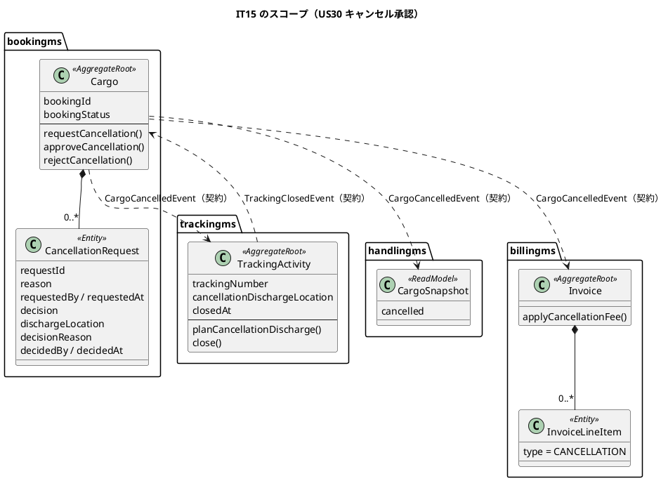
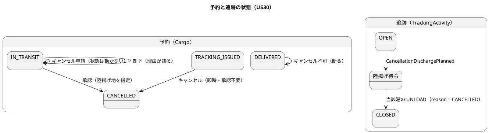
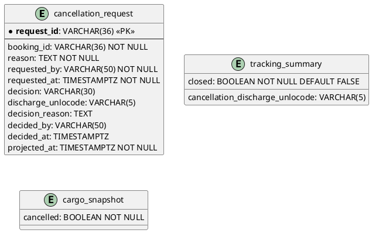
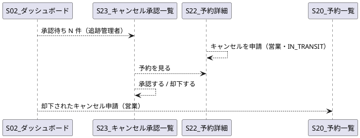

# イテレーション 15 計画

| 項目 | 内容 |
| :--- | :--- |
| イテレーション | IT15（Release 2.0 精算とキャンセル・**3 つ目／最終**） |
| 対象 | US30 輸送中の予約キャンセルを承認する（6） |
| SP | 6 + **引き継ぎ枠 4**（SP 対象外）+ **負債枠 2**（SP 対象外）+ **仕上げ枠 2**（SP 対象外） |
| 局面 | 終盤（**アウトサイドイン**。4 サービスの連鎖を業務シナリオで束ねる） |
| 前提 | IT14 クローズ済み（7/8 SP・累計 115・**US23 §受入基準 4 が未達**） |

## ゴール

**輸送中の貨物を、宙に浮かせずに止められるようにします。** 営業が理由を添えて申請し、
追跡管理者が**どこで降ろすか**を決めて承認し、その港の荷降しが記録されて初めて追跡が
閉じ、キャンセル料が請求に載ります。

**あわせて、IT14 で閉じきれなかった輪を閉じます。** 入金が予約へ届かない欠陥
（US23 §受入基準 4）を直すまで、Release 2.0 は完了しません。

## 対象ストーリー

| US | 名前 | SP | 受入基準 |
| :--- | :--- | :--: | :--: |
| US30 | 輸送中の予約キャンセルを承認する | 6 | 10 |

**US23 §受入基準 4 の修復は SP に数えません。** IT14 で 1 SP を落とした分の返済であり、
新しい価値ではないためです（実績は IT14 側に戻さず、IT15 のふりかえりで経緯を書きます）。

## 局面（終盤・アウトサイドイン）

US30 は **bookingms → trackingms → handlingms → trackingms → billingms** の 4 サービス
連鎖です（[開発戦略](development_strategy.md) L306）。**画面から入るのが自然**なので、
S22（申請）・S23（承認）を先に置き、連鎖を後ろから埋めます。

## 受入基準（**1 項目ずつ表にする**）

### US30 輸送中の予約キャンセルを承認する

| # | 受入基準 | 落とし先 |
| :--- | :--- | :--- |
| 1 | 輸送開始前（仮受付・経路提案済・確認済・追跡番号発行済）は営業の操作で即座にキャンセルできる | `Cargo#requestCancellation` が `CargoCancelledEvent` を直接出す。受け入れ |
| 2 | `IN_TRANSIT` では営業に `[キャンセル（要承認）]` の申請ボタンだけが出る | S22 の操作出し分け。**集約の述語をそのまま呼ぶ**（判定を 2 か所に書かない） |
| 3 | キャンセル申請には理由の入力が必須 | 集約の不変条件 + 画面。**空文字は入口で `null` に寄せる**（Try T4） |
| 4 | 申請は追跡管理者に通知され、承認待ちの一覧に出る | `cancellation_request`（`decision IS NULL`）+ S02 の件数 + S23。**件数から一覧へ辿れる形** |
| 5 | 追跡管理者は陸揚げ地（現在地の港または残りの寄港地）を指定して承認できる | `CancellationDecision` の不変条件。**選択肢は残りの寄港地から作る** |
| 6 | 承認するとキャンセルが確定し、指定した陸揚げ地への荷降しが手配され、荷主に通知される | `CargoCancelledEvent` → `PlanCancellationDischargeCommand` → `CancellationDischargePlannedEvent`。通知は**記録 + 手作業**（正典 L120） |
| 7 | 却下すると予約は輸送中のまま維持され、却下理由が申請者と荷主に通知される | `CancellationRejectedEvent`。**状態は動かさない**。営業のダッシュボードに出す |
| 8 | `DELIVERED` 以降はキャンセルできない | 集約の守り。**画面から踏むテストと対にする**（画面で 500 にならないこと） |
| 9 | キャンセル料が状態別料率で算定され、精算に引き渡される | `ApplyCancellationFeeCommand` → `CancellationFeeAppliedEvent`。`LineItemType.CANCELLATION` |
| 10 | 申請・承認・却下の履歴（日時・実行者・理由）が予約詳細から参照できる | S22 の履歴欄。**記録と読み口は対で出す** |

### 受入基準に現れない不変条件（**正典にあり、実装が要る**）

| # | 不変条件 | 出典 |
| :--- | :--- | :--- |
| 1 | `IN_TRANSIT` のキャンセルは申請 → 承認（陸揚げ地必須）の 2 段階 | domain-model L580（Cargo #9） |
| 2 | **キャンセル承認を受けても追跡は閉じない。** `cancellationDischargeLocation` を記録し、**その港の `UNLOAD` を受けてから** `CloseTrackingCommand` で閉じる | domain-model L913（TrackingActivity #9） |
| 3 | `CloseTrackingCommand` は `TrackingReactionHandler` から送る。`BookingReactionHandler` からは送らない | domain-model L1315・ADR-0010 |
| 4 | `cargo_snapshot.cancelled` の書き手は本 IT（既定 `false` は業務上正しい） | ADR-0012 決定 3・data-model L655 |
| 5 | `TrackingClosedEvent` は bookingms が購読してキャンセル完了を投影に写す | domain-model L1299 |
| 6 | S20・S45 の既定はキャンセルを外す（「終了したものも表示」で出す） | ui_design L83・L89 |

### 注（設計への反映が必要）

| # | 注 | 内容 |
| :--- | :--- | :--- |
| N1 | **キャンセル料の「状態別料率」が正典に数字で無い** | domain-model L1195 は「輸送開始前は低率、輸送中は高率 + 陸揚げ実費」としか書いていない。**料率は `billing-rates.yml` に置く**（ADR-0016 決定 1。見積・請求と同じ出典）。数字を決めて domain-model と `billing-rates.yml` の両方に書く。**陸揚げ実費は自動では出せない**ので、経理が S61 の調整で入れる形にし、その旨をマニュアル 17 章に書く |
| N2 | **`cancellation_request` の DDL が bookingms に無い** | data-model L345 の ER にだけある。`V021__create_cancellation_request.sql` で作る（`request_id` PK・`INDEX(booking_id)`・`INDEX(decision)`） |
| N3 | **`CancellationFeeAppliedEvent` の受け皿が正典に無い** | `invoice_line_item` に `CANCELLATION` 行を積むのか、請求書が未作成なら何をするのかが書かれていない。**引取前のキャンセルには請求書がまだ無い**ので、`billing_cargo_snapshot` を元に算出する経路が要る。決めて data-model に書く |
| N4 | **S23 が `ui_design.md` にあるが画面一覧の実装が無い** | 画面一覧（L138）に行はあり、節（L1119）もある。**実装だけが無い**——IT14 で入れた「行があって節が無い画面を検出する検査」の逆向きなので、**実装の有無まで見る検査に広げる**か、本 IT で実装して解消する |
| N7 | **列挙が 2 つ増える**（`CancellationDecision` の判断値と `TrackingCloseReason`）。**要素表に行を足す** | 列挙に値を足したら全箇所を回る（扱っていない場所は名乗り出ない）。`domain-model` の要素表に 2 表を足し、`it.each` で値の一覧から回る検査を置く |
| N6 | **追跡を閉じた理由と日時の置き場が正典に無い** | 正典の `tracking_summary` は `closed: BOOLEAN` だけを持つ。`TrackingClosedEvent` は `closedAt` と `reason` を運ぶので、**S41 で「なぜ閉じたか」を出すなら列が要る**。出さないなら運ばせる意味が薄い。決めて data-model に書く（**記録と読み口は対で出す**） |
| N8 | **S42・S52 に荷主名を出すには契約イベントの版上げ（Upcaster）が要る** | trackingms・handlingms は荷主 ID しか持たず、名前を運ぶ契約イベントが無い。**`TrackingInitializedEvent` に荷主名を足すと既存のイベントが読めなくなる**ので Upcaster が要り、これは「契約の版管理」という別の主題である。IT12 → IT13 → IT14 → IT15 と 4 IT 持ち越しているので、**本 IT では着手せず、Release 3.0 の独立した課題として起票する**（余力次第にしない）。それまで S42・S52 は追跡番号と予約番号で辿る |
| N5 | **`CancellationRequest` は集約か投影か** | domain-model の用語表（L110）はエンティティとして挙げるが、コマンド表（L603-605）は `Cargo` のコマンドとして並べている。**`Cargo` の中のエンティティ**として実装し、`cancellation_request` はその投影とする。正典に 1 行足す |

## 成功基準

- [ ] **US23 §受入基準 4 が緑**（`ContractEventRoundTripIT#paymentRecordedReachesBooking` の `@Disabled` を外す。クラスタ E2E の `fixme` も外す）
- [ ] デモ項目の受け入れテストがすべて緑。**シナリオ数を数で書く**（**Try T1**。`4 スイート緑` ではなく `4 スイート / 52 シナリオ緑`）
- [ ] **`TZ=UTC` でモジュールを分けて `build` が緑**（`dev:backend:full:split`）
- [ ] **触ったモジュールの `build` を各コミットで回した**（**Try T2**。`test` で済ませない。回していないならコミット本文にそう書く）
- [ ] フロントの `npm run test`・`npx tsc -b`・`npm run build` が緑
- [ ] **受入基準の表を、実装を始める前に作った**（継続）
- [ ] **検査を足した変更では、その検査を 1 度赤にした**（継続。**コミット本文に「どう壊して赤を見たか」を 1 行書く**）
- [ ] **記録の側も検査した**（**Try T3**。列を足す変更では「書いて → 読んで → 期待値と比べる」を 1 本の検査で通す）
- [ ] **入口ごとに違う扱いをしなかった**（**Try T4**。入力の正規化は 1 か所。**新しい入口を足す変更では既存の入口を `grep` する**）
- [ ] **定義済み未使用を IT の終わりに `grep` した**（**Try T5**。その IT で足した public メソッドの本番参照数を数える）
- [ ] **コミットの品質ゲート欄を空にしなかった**（**Try T6**・**3 IT 目**。埋められないならその理由を 1 行書く）
- [ ] **クラスタ E2E を IT の途中で 1 度回した**（**Try T7**・**6 IT 目**。US30 の実装が終わった時点で回し、結果をコミット本文に書く）
- [ ] **レビューは切れる前提で出力形を指定して起動した**（**Try T8**。「高と中だけ・1 件 1 行の表で・良い点は最後に 5 件まで」）
- [ ] **BC をまたぐ契約イベントに、向きごとの往復テストを置いた**（**Try T9**。ゴールデン JSON だけで済ませない。**購読側の表で確かめる**）
- [ ] **前 IT の Try を、クローズの最初に採点した**（継続）
- [ ] **画面の中のリンク先の到達性を検査した**（継続。S02 → S23、S23 → S22）
- [ ] SonarQube の Quality Gate がバックエンド・フロントエンドとも PASS（新規指摘 0 件）
- [ ] `npx gulp okf:check` が ERROR 0
- [ ] **ユーザーマニュアル 19 章（キャンセルを申請して承認する）の新設**と 17 章へのキャンセル料の追記。画面キャプチャを生成 spec で撮る

## 引き継ぎ枠・負債枠・仕上げ枠（SP 対象外・**IT の序盤に独立コミットで消化**）

IT14 から 4 件、IT13 から 7 件を引き継ぎます。**「余力次第」にしません**——行として立てます。

| 枠 | 内容 | 由来 | いつ |
| :--- | :--- | :--- | :--- |
| **引き継ぎ 0** | **精算の連鎖の修復**（`PaymentRecordedEvent` が bookingms へ届かない。US23 §受入基準 4） | IT14 クローズ | **最優先。T0 の前**（Release 2.0 が完了しないため） |
| 引き継ぎ 1 | ~~**`dead_letter_entry` の業務向け読み口**~~ **完了**（2026-09-13）。**S91 を正典に立てて実装**——5 サービスを画面が束ね、`[処理し直す]` は Actuator と同じ入口を呼ぶ。**中身（payload）は返さない**（ADR-0003） | IT14 レビュー architect | T0 |
| 引き継ぎ 2 | **Processing Group を書くテーブルの単位に分け直す** | IT14 レビュー architect | **移行手順は書いた・分け直しは本 IT では行わない**（2026-09-13）。判断は下の「引き継ぎ 2 の扱い」を参照 |
| 引き継ぎ 3 | ~~**入金の取り消し**~~ **完了**（2026-09-13）。`PaymentVoidedEvent`（契約）で請求書を請求済へ、予約を引取済へ戻す。**入金の行は消さず印を付け、読み口も同じ変更で出した** | IT14 レビュー writer | T0 |
| 負債 1 | **IT13 から送った 7 件**。**6 件完了・1 件は行き先を決めて明示的に送る**（2026-09-13） ・D 一覧の期間・荷主の絞り込みと合計 → **完了**（合計は**サーバが数える**。画面で足すと上限で切れたぶんが落ちる） ・E 経理宛の要確認件数 → **完了**（宛先はサーバがロールで絞るので**全ロール同じ形**にした） ・F 明細の表示順 → **完了**（並べ方の出典は `LineItemType` の宣言順 1 か所） ・I コマンド失敗の行き先 → **完了**（`sendOrRaise` で断りは要確認へ・障害は投げ直す。**スタブの名簿方式もやめた**） ・J 連鎖が投影を追い越したときの検知 → **完了**（引き継ぎ 1 の S91 がそのまま読み口） ・K 要素表の 3 行 → **完了**（`TransportRecord`・`FreightCharge`・`DiscountRate`） ・H.5 航海番号で探す → **完了**（部分一致・大文字小文字を問わない。解釈はサーバ 1 か所） ・**H.5 S42・S52 に荷主名を出す → 残**（注 N8 へ） | IT13 → IT14 → IT15 | T0。**3 IT 目**——「余力次第」にせず、残す 1 件は行き先と理由を書いた |
| 負債 2 | ~~**キャンセル料の料率を正典と設定に書く**~~ **完了**（2026-09-13）。状態別 6 行を domain-model と `cargo-rates.yml` に。**表に無い状態は断る** | 本計画 | T0 |
| 仕上げ 1 | **記事第 5 章の参照元としての整理**（README・実行手順） | release_plan L237 | 最終日 |
| 仕上げ 2 | **Release 2.0 の完了報告**（`creating-release-report`） | release_plan | 最終日 |

## タスク

| # | タスク | 対象 | 見積 |
| :--- | :--- | :--- | :--- |
| **T-1** | ~~**精算の連鎖の修復**（引き継ぎ 0）~~ **完了**（2026-09-13、見積 8h に対し実績 3h）。**原因は配送ではなく投影の欠落**——`BookingSettledEvent` の書き手が無く、購読の型一覧にすら載っていなかった。`CargoProgressProjection#on(BookingSettledEvent)` を足し、往復テストの `@Disabled` とクラスタ E2E の `test.fixme` を外して**クラスタ 24/24 緑**。US23 §4 達成 | US23 | 8h |
| T0 | **枠の消化**（引き継ぎ 1・2・3 / 負債 1・2）。あわせて **`grep` 回収**——`IT15`・`US30` で検索した **9 件**（下表） | — | 8h |
| T1 | **デモ項目を赤で置く**（受け入れ `.feature` と**ステップ定義を同じ変更で**書く。IT14 で 0 件のまま緑になった形を繰り返さない） | 受け入れ | 4h |
| T2 | **`CancellationRequest` エンティティと `Cargo` のコマンド 3 本**（`requestCancellation` / `approveCancellation` / `rejectCancellation`）。注 N5 の正典修正 | US30 | 8h |
| T3 | **`cancellation_request` 投影**（注 N2 の V021）と承認待ちの読み口（`FindPendingCancellationsQuery`——**正典に名前が無いので本 IT で命名し、`domain-model` のクエリ表に足す**）。**記録と読み口は対で出す** | US30 | 6h |
| T4 | **陸揚げ地の選択肢**（現在地または残りの寄港地）。**判定は集約に置き、画面はその述語を呼ぶ** | US30 | 4h |
| T5 | **trackingms の連鎖**（`CargoCancelledEvent` → `PlanCancellationDischargeCommand` → `CancellationDischargePlannedEvent`）。**追跡は閉じない**（不変条件 2） | US30 | 6h |
| T6 | **陸揚げの荷降しで追跡を閉じる**（当該港の `UNLOAD` → `CloseTrackingCommand` → `TrackingClosedEvent(reason=CANCELLED)`）。**`TrackingReactionHandler` から送る**（不変条件 3） | US30 | 6h |
| T7 | **handlingms の `cargo_snapshot.cancelled`**（ADR-0012 決定 3 の書き手。既定 `false` の逆） | US30 | 3h |
| T8 | **キャンセル料**（`ApplyCancellationFeeCommand` / `CancellationFeeAppliedEvent` / `LineItemType.CANCELLATION`）。注 N1・N3 | US30 | 8h |
| T9 | **契約イベントの往復テスト**（**向きごとに**。booking → tracking、tracking → booking、booking → billing、booking → handling の 4 本。**Try T9**） | US30 | 4h |
| T10 | **画面**（S22 の申請と履歴欄・S23 キャンセル承認一覧）。注 N4 | US30 | 8h |
| T11 | **ナビゲーション整合**（構成表・`navigation.ts`・S02 の承認待ち件数・検証テストの 4 点）。**件数から S23 へ辿れる形** | — | 3h |
| T12e | **クラスタ E2E（US30）**。**IT の途中で 1 度回す**（Try T7） | US30 | 3h |
| T13 | **マニュアル 19 章の新設**と 17 章へのキャンセル料の追記・キャプチャ生成 | — | 4h |

### 既にあるもの（**着手前に `grep` で確かめる**）

| もの | 状態 | 本 IT での扱い |
| :--- | :--- | :--- |
| `BookingStatus.CANCELLED` | **列挙にある** | T2 で初めて通る |
| `LineItemType.CANCELLATION` | **列挙にある**（`// キャンセル料（US30・IT15）`） | T8 で初めて通る |
| `cargo_snapshot.cancelled` 列 | **ある**（既定 `false`・書き手なし） | T7 で書き手を作る |
| `TrackingClosedEvent` | **正典にある**（実装の有無を T5 着手前に確かめる） | T6 |
| `CargoSnapshotProjection` | **ある**（「キャンセルは US30 が書く」と注記） | T7 で注記を回収 |
| `billing_cargo_snapshot` / `billing_cargo_leg` | **ある** | T8 で基本料金の再算出に使う（注 N3） |
| `attention_item` | **ある**（3 サービス） | T5・T6 で連鎖が断られたときの行き先 |
| `cancellation_request` テーブル | **無い**（正典の ER にだけある） | T3 で作る（注 N2） |
| S23 の画面 | **無い**（画面一覧と節はある） | T10 で作る（注 N4） |

### 引き継ぎ 2 の扱い（**「余力次第」にせず、決めて書く**）

**分け直しは本 IT では行いません。** 代わりに、いちばん繰り越されやすい部分——
**token の移行手順**——を先に書きました（運用手順書「Processing Group を分け直すとき」）。

| 問い | 答え |
| :--- | :--- |
| 何が欲しかったのか | ①毒の巻き添え範囲を狭める ②テーブル単位でリプレイできる |
| ①は解決済みか | **済**。`@SequencingPolicy` が予約ごとに列を切っている（ADR-0014 決定 4）。**Processing Group を分けても、これ以上狭くならない** |
| ②はいつ要るのか | **投影の不具合を直してリプレイする日**。そのとき「他のテーブルまで巻き込む」ことが問題になる |
| なぜ今やらないのか | 3 サービス（booking・handling・billing）のパッケージ移動と token 移行を伴い、**既存環境だけが「途中まで正しい」状態になる**（Testcontainers では出ない壊れ方）。US30 の連鎖を入れる前にこれを動かすと、赤が出たときに**どちらが原因か切り分けられない** |
| 何があれば実行できるか | **手順（書いた）** + **退避が 0 件であること** + **ステージングで 1 度通すこと** |
| 着手の引き金 | **投影のリプレイが必要になった最初のとき**、またはこの表のテーブルが 1 サービスで 5 つを超えたとき |

**据え置きではありません。** 落とした負債は育つので、**育つ条件（テーブル数）を
引き金に書いて**あります。

### `grep` 回収（`IT15`・`US30`）

検索結果は **9 件**です。

| 区分 | 件数 | 本 IT での扱い |
| :--- | :--: | :--- |
| **本 IT で回収する** | 6 | `LineItemType.CANCELLATION`・`BookingConfirmedEvent` の注記・`CargoSnapshotProjection`・`CargoSnapshotMapper.xml`・`V002__create_cargo_snapshot.sql`・`CargoSnapshotProjectionIT` |
| **引き継ぎ 0 で裏返す** | 3 | `ContractEventRoundTripIT` の `@Disabled` 理由 2 か所・`cluster.spec.ts` の `fixme` |

**3 件は検査と対になっています**——直したら `@Disabled` と `fixme` を外し、**検査そのものは消しません**。

## スケジュール

| 日 | 内容 |
| :--- | :--- |
| 1-2 | ~~**T-1（精算の連鎖の修復）**~~ **完了**（初日午前）。US30 へ進む |
| 3 | T0（枠の消化と `grep` 回収） |
| 4 | T1（デモ項目を赤で置く）・T2 着手 |
| 5-6 | T2・T3（申請と投影） |
| 7 | T4（陸揚げ地） |
| 8-9 | T5・T6（trackingms の連鎖と追跡を閉じる） |
| 10 | T7・T8（スナップショットとキャンセル料） |
| 11 | T9・T12e（往復テストと**途中の**クラスタ E2E） |
| 12 | T10・T11（画面とナビ） |
| 13 | T13（マニュアル）・仕上げ 1・2 |
| 14 | クローズ（レビューを**最初に**・**出力形を指定して**起動） |

## ADR

| # | 決定 | 起票するか |
| :--- | :--- | :--- |
| — | キャンセル料の料率を設定に置く | **起票しない。** ADR-0016 決定 1 がすでに述べている。**3 人目の読み手を作るだけ** |
| — | 追跡はキャンセル承認では閉じず、陸揚げの荷降しで閉じる | **起票しない。** domain-model L913 と ADR-0010 が述べている |
| — | ~~`PaymentRecordedEvent` が届かなかった原因と対処~~ | **起票しない**（T-1 で決着）。**届いていた**——欠けていたのは投影の書き手だけで、Axon 5 の配送に関する決定は 1 つも要らなかった。規律としては既存の「記録と読み口は対で出す」がそのまま当たる。**足りなかったのは検査のほう**なので、`ContractEventRoundTripIT`（BC をまたぐ往復）と投影テストを対で置くことで返した |

## 設計

### ドメインモデル図（本 IT のスコープ）

### 状態遷移図（本 IT で通る経路）

**承認しても追跡は閉じません。** 貨物は船の上にあるので、陸揚げの荷役を記録できる状態を
保ちます（不変条件 2）。

### ER 図（本 IT で足す表）

| 表 | サービス | マイグレーション | 備考 |
| :--- | :--- | :--- | :--- |
| `cancellation_request` | bookingms | **`V021__create_cancellation_request.sql`（新規）** | `INDEX(booking_id)`・`INDEX(decision)`（`NULL` = 承認待ち） |
| `tracking_summary` | trackingms | **列の追加**（`cancellation_discharge_unlocode`・`closed`）。**V012 が次番**（実 DB で確認済み。どちらの列も未実装） | 正典の列名は `closed`（BOOLEAN）。**`closed_at` / `close_reason` は正典に無い**——要るなら注 N6 で正典に足してから作る。`cancellation_discharge_unlocode` は `NOT NULL` にしない（**新しい不変条件は既存行を壊す**） |
| `cargo_snapshot` | handlingms | **既にある**（`cancelled`） | 書き手を作るだけ |

**識別子は列の長さに収めます**（`request_id` は `VARCHAR(36)`。接頭辞 + UUID は 40 文字で入りません）。
**マイグレーションは番号順に読みます**（booking は V020 まで）。**適用済みのマイグレーションは編集しません。**

### 画面遷移図（本 IT のスコープ）

| 画面 | パス | ロール | 本 IT での扱い |
| :--- | :--- | :--- | :--- |
| S23 キャンセル承認一覧 | `/bookings/cancellations` | 追跡 | **新設**（注 N4） |
| S22 予約詳細 | `/bookings/:id` | 営業・経路設計・追跡 | 申請ボタン・履歴欄・「陸揚げ待ち: SGSIN」を足す |
| S02 ダッシュボード | `/` | 追跡・営業 | 承認待ち件数（追跡）・却下された申請（営業） |

**リンク先はそのロールで開けることを検査します**（`routes.test.tsx` の到達性表に 2 行足す）。

## デモ項目（**すべて受け入れテストかクラスタ E2E に落とす**）

| # | 項目 | 出典 | 落とし先 |
| :--- | :--- | :--- | :--- |
| D1 | 追跡番号発行済の予約を営業が即座にキャンセルできる | US30 §1 | 受け入れ |
| D2 | 輸送中の予約では営業に申請ボタンだけが出る | US30 §2 | 受け入れ・画面 |
| D3 | 理由の無い申請は断られる | US30 §3 | 受け入れ |
| D4 | 申請が承認待ち一覧に出て、ダッシュボードの件数から辿れる | US30 §4 | 受け入れ・クラスタ E2E |
| D5 | 残りの寄港地から陸揚げ地を選んで承認できる | US30 §5 | 受け入れ |
| D6 | 承認すると予約がキャンセルになり、**追跡は開いたまま**陸揚げ待ちになる | US30 §6・不変条件 2 | **クラスタ E2E**（BC をまたぐ） |
| D7 | 陸揚げ地で `UNLOAD` を記録すると追跡が閉じる | 不変条件 2 | **クラスタ E2E** |
| D8 | 却下すると予約は輸送中のまま、理由が残る | US30 §7 | 受け入れ |
| D9 | 配送完了以降はキャンセルできない（**画面で 500 にならない**） | US30 §8 | 受け入れ・画面 |
| D10 | キャンセル料が請求に載る | US30 §9 | **クラスタ E2E**（BC をまたぐ） |
| D11 | 申請・承認・却下の履歴が予約詳細から読める | US30 §10 | 受け入れ・画面 |
| D12 | **入金を記録すると予約が精算済になる**（IT14 の未達の返済） | US23 §4 | **契約の往復テスト**・クラスタ E2E |

## リスク

| # | リスク | 対処 |
| :--- | :--- | :--- |
| R1 | ~~**T-1（精算の連鎖）に時間が読めない**~~ **解消**（2026-09-13）。TRACE ログで配送を 1 度追ったら、Axon の中ではなく自分の投影の欠落だった。**「読んだが配送されていない」と読んだのが誤りで、実際は「読んで処理して、書く先が無かった」** |
| R2 | **4 サービスの連鎖は 1 サービスの検査では判別できない**（IT14 で実証済み） | **向きごとの往復テスト**（T9）と**途中のクラスタ E2E**（T12e）を計画に行として立てた |
| R3 | **追跡を閉じるタイミングを間違えやすい**。承認で閉じると陸揚げの荷役が記録できない | 不変条件 2 を受入基準の表に載せた。**「閉じない」ことを赤で固定する**検査を置く |
| R4 | キャンセル料の料率が正典に無い（注 N1） | T0（負債 2）で先に決めて書く。**実装より先** |
| R5 | Processing Group の分け直し（引き継ぎ 2）は **token の移行が要る** | **移行手順を先に書く。** 適用済みクラスタだけが壊れる形（ブローカーのトポロジ変更と同型） |

## DoD

- [ ] US30 の受入基準 10 件がすべて緑（未達があればその旨を明記）
- [ ] **US23 §受入基準 4 が緑**（IT14 の未達の返済）
- [ ] デモ項目 12 件が受け入れテストかクラスタ E2E で緑（**シナリオ数を数で書く**）
- [ ] `TZ=UTC` の分割フルビルドが 5 群すべて緑
- [ ] フロントの `test` / `tsc -b` / `build` が緑
- [ ] クラスタ E2E が緑（**IT の途中で 1 度 + クローズで通し**）
- [ ] CI が緑
- [ ] SonarQube の Quality Gate が両プロジェクト PASS
- [ ] **ユーザーマニュアル 19 章を新設し、17 章にキャンセル料を追記した**。キャプチャを撮った
- [ ] 正典（`domain-model` / `data-model` / `architecture_backend` / `ui_design`）に注 N1〜N7 を反映した
- [ ] `npx gulp okf:check` が ERROR 0
- [ ] 各タスクの成果を意味のある単位でコミットした（**品質ゲートの欄を空にしない**）
- [ ] **Release 2.0 の完了報告書を作成した**（仕上げ 2）

## 関連ドキュメント

- [リリース計画](release_plan.md)
- [開発戦略](development_strategy.md)
- [IT14 ふりかえり](retrospective-14.md) / [IT14 完了報告書](iteration_report-14.md)
- [ユーザーストーリー](../../requirements/user_story.md) US30
- [ドメインモデル](../../design/cargo-tracker/domain-model.md) / [データモデル](../../design/cargo-tracker/data-model.md) / [UI 設計](../../design/cargo-tracker/ui_design.md)
- [ADR-0010](../../adr/cargo-tracker/0010-reaction-handler-as-the-only-coordinator.md) / [ADR-0012](../../adr/cargo-tracker/0012-cargo-snapshot-from-tracking-initialized.md) / [ADR-0016](../../adr/cargo-tracker/0016-rates-live-in-configuration.md)

## 更新履歴

| 日付 | 内容 | 担当 |
| :--- | :--- | :--- |
| 2026-09-13 | **T0 完了**（引き継ぎ 2 は「手順を書いて実行は引き金つきで送る」と決めた） | claude-code/claude-opus-5 |
| 2026-09-13 | **T0 の枠**（負債 1 の 6 件を消化し、残る 1 件＝荷主名の表示は注 N8 で Release 3.0 へ送った）。残るは引き継ぎ 2（Processing Group の分け直し） | claude-code/claude-opus-5 |
| 2026-09-13 | **T0 の 3 件完了**（引き継ぎ 1・3、負債 2）。残るは引き継ぎ 2（Processing Group の分け直し）と負債 1（IT13 からの 7 件） | claude-code/claude-opus-5 |
| 2026-09-13 | **T-1 完了**。`BookingSettledEvent` の投影を足して US23 §4 を達成し、クラスタ E2E を 24/24 緑にした。ADR 候補は「起票しない」で決着 | claude-code/claude-opus-5 |
| 2026-09-13 | 初版作成（IT15 開始準備 ステップ 1・2）。IT14 のふりかえり Try T1〜T9 を成功基準に、引き継ぎ 4 件・IT13 から送られた 7 件・仕上げ 2 件を**行として**計上。**US23 §4 の修復（T-1）を最優先タスクに置き、SP には数えない** | claude-code/claude-opus-5 |
| 2026-09-13 | ステップ 3・4 の検証結果を反映。**ER 図が正典と食い違っていた**——`tracking_summary` に `closed_at` / `close_reason` を置こうとしていたが、正典の列は `closed`（BOOLEAN）だけ。実 DB でも両列とも未実装で次番は V012 だと確かめた。あわせて注を 2 件起こした——**N6 追跡を閉じた理由と日時の置き場が正典に無い**（運ぶのに読み口が無い）、**N7 列挙が 2 つ増える**（要素表の行と、値の一覧から回る検査）。`FindPendingCancellationsQuery` は正典に名前が無いので本 IT で命名する旨を T3 に明記。**軸 A（局面・US 割当・仕上げ枠）と軸 C（BC 独立性・契約イベントのみで越境・`CloseTrackingCommand` の送り手）は不整合なし** | claude-code/claude-opus-5 |
