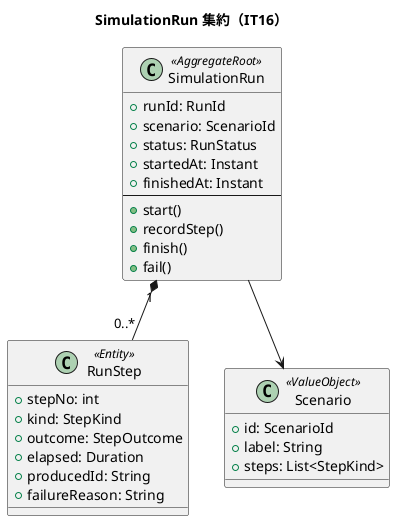
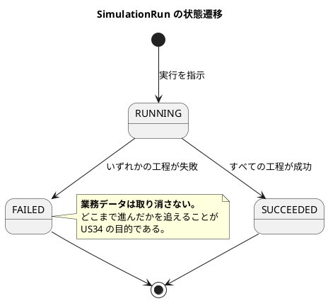
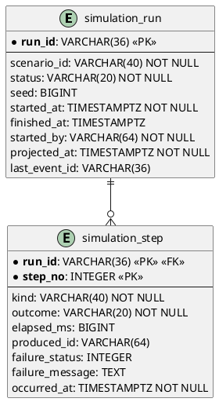
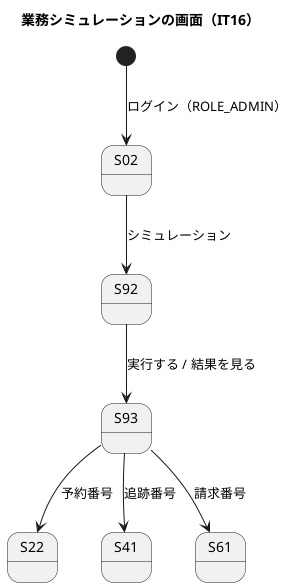

# イテレーション 16 計画

| 項目 | 内容 |
| :--- | :--- |
| イテレーション | IT16（Release 3.0 運用と実演・**1 つ目**） |
| 対象 | US33 業務シナリオを選んで自動実行する（5）・US34 業務シミュレーションの結果を工程ごとに確認する（3） |
| SP | 8 + **引き継ぎ枠 2**（SP 対象外）+ **負債枠 2**（SP 対象外） |
| 局面 | 終盤の続き（**アウトサイドイン**。新しい業務ロジックは足さず、既存の API を呼ぶ順序と待ち方を組み立てる） |
| 前提 | IT15 クローズ済み（6/6 SP・累計 121・**Release 2.0 のスコープ 22 SP を消化しきった**） |

## ゴール

**シナリオを 1 つ選ぶと、予約から精算までが人手なしで通り、どの工程で何が起きたかが読める。**

いまは予約から精算まで手で追うのに 7 ロール分のログインと 20 以上の画面操作が要ります。配備直後に「どこが切れているか」を切り分ける手段もありません。IT16 で作るのは**業務ではなく、業務が成立していることを確かめる手段**です。

## 対象ストーリー

| US | 内容 | SP | 受入基準 |
| :--- | :--- | ---: | ---: |
| US33 | 業務シナリオを選んで自動実行する | 5 | 6 件 |
| US34 | 業務シミュレーションの結果を工程ごとに確認する | 3 | 5 件 |

対応 UC は **UC23（業務シミュレーションを自動実行する・要約レベル）**、BUC は **BUC25（業務シミュレーション実行）**です。

## 局面（終盤の続き・アウトサイドイン）

入口は「シナリオを 1 本流したときに何が見えるか」（US34 の実行結果）です。そこから逆に「どの工程で何を待つか」を決めます。

**内側から作りません。** 待ち方（結果整合の連鎖をどこまで待つか）を後付けにすると、失敗が「連鎖の欠落」なのか「待ち不足」なのかを判別できない実行結果ができます。**判別できない結果は、切り分けの手段になりません。**

## 受入基準（**1 項目ずつ表にする**）

### US33 業務シナリオを選んで自動実行する

| # | 受入基準 | 落とし先（**画面から踏む検査を対で置く**・Try T1） |
| :--- | :--- | :--- |
| 1 | シナリオを選んで実行を指示すると、予約登録 → 経路確定 → 荷主通知 → 予約確定 → 追跡番号発行 → 荷役 → 通関 → 引取 → 料金算出 → 発行 → 入金 → 精算までが順に実行される | 受け入れ `業務シミュレーション.feature`／S92 のシナリオ一覧から実行 → 実行結果が「精算済」で終わる |
| 2 | 各工程は**本番と同じ API**（Gateway 経由）を通る | 規約検査（`simulationms` の本番コードが他サービスの内部型・DB を参照しない／HTTP 呼び出し先が Gateway に限られる） |
| 3 | 生成された荷主・予約・請求書は**シミュレーション由来であると識別できる** | 予約一覧・請求一覧・要確認一覧の**読み口が既定で除外する**ことを、それぞれの画面テストで固定 |
| 4 | 本番環境では実行が拒否される | `simulationms` の起動条件と API の拒否を IT で固定（**設定名を推測させない**） |
| 5 | 同じシナリオの二重実行が拒否され、実行中の結果へ案内される | 集約の検査 + S92 の画面テスト（案内のリンク先まで） |
| 6 | **BC をまたぐ連鎖の結果を待ってから次の工程へ進む** | 待ちを外すと赤になる検査（**待ち時間ではなく、読み口が返した値で判別する**） |

### US34 業務シミュレーションの結果を工程ごとに確認する

| # | 受入基準 | 落とし先 |
| :--- | :--- | :--- |
| 1 | 工程ごとに成否・所要時間・生成した識別子（予約番号・追跡番号・請求番号）が表示される | S93 実行結果の画面テスト |
| 2 | 失敗した工程には理由（応答コード・メッセージ）が出る | 失敗するシナリオを 1 本作り、画面に理由が出ることを固定 |
| 3 | 失敗しても、それまでに作られた業務データは**取り消されない** | 失敗後に予約が残っていることを受け入れで確かめる |
| 4 | 実行の開始・終了・到達した工程が記録に残る | 投影 IT（**書いて → 読んで → 期待値と比べる**を 1 本で） |
| 5 | 生成した識別子から、対応する業務画面（予約詳細・追跡・請求書）へ**遷移できる** | リンク先の到達性検査（S93 → S22 / S41 / S61） |

## 成功基準

- [ ] US33・US34 の受入基準 11 件がすべて緑（未達があればその旨を明記）
- [ ] **受入基準の「落とし先」列に空欄が無い**（**Try T1**。空欄のまま着手しない）
- [ ] **クラスタ E2E のシミュレーション経路は、画面の一覧から対象を選んで始める**（**Try T2**。識別子を握って API を叩かない）
- [ ] **正典が約束していて実装が無いものを、序盤に `grep` で洗った**（**Try T3**。IT15 では却下の知らせと陸揚げ待ちが正典にだけ存在した）
- [ ] **名簿を足す変更では、名簿そのものを数え上げる検査にした**（**Try T4**。シナリオ一覧・除外する読み口の一覧が対象）
- [ ] **2 段階の操作には両方に守りを置いた**（**Try T5**。実行の開始と各工程の実行）
- [ ] **検査を足した変更では、その検査を 1 度赤にした**（**Try T6**・3 IT 目。コミット本文に「どう壊して赤を見たか」を 1 行書く）
- [ ] **前 IT の Try を、クローズの最初に採点した**（**Try T7**・継続）
- [ ] `TZ=UTC` の分割フルビルドが緑（**新サービスを群に加える**）
- [ ] フロントの `test` / `tsc -b` / `build` が緑
- [ ] クラスタ E2E が緑（**IT の途中で 1 度 + クローズで通し**）
- [ ] CI が緑
- [ ] SonarQube の Quality Gate が両プロジェクト PASS（新規指摘 0 件）
- [ ] `npx gulp okf:check` が ERROR 0
- [ ] **ユーザーマニュアル 20 章（業務シミュレーションを実行する）の新設**。画面キャプチャを生成 spec で撮る

## 引き継ぎ枠・負債枠（SP 対象外・**IT の序盤に独立コミットで消化**）

IT15 から 4 件を引き継ぎます。**「余力次第」にしません**——行として立てます。

| 枠 | 内容 | 由来 | いつ |
| :--- | :--- | :--- | :--- |
| 引き継ぎ 1 | **ADR を 3 件起こす**——(a) `TrackingClosedEvent` を契約から外した、(b) `CloseTrackingCommand` を作らなかった、(c) **`SETTLED → DELIVERED` の巻き戻し**（終端状態を覆す決定） | IT15 レビュー architect | T0（**最初**） |
| 引き継ぎ 2 | **`CancellationDecision.approve` の不到達分岐**を解消し、陸揚げ地未指定の断りを承認者に伝わる文言にする | IT15 レビュー programmer | T0 |
| 負債 1 | `prepareCancellationFee` と `prepareFor` の重複・`toListView` の N+1・ROUTING に空のキャンセル欄が出る・`DecisionForm` が読み込み中とエラーを出さない | IT15 レビュー programmer | T0 |
| 負債 2 | 陸揚げ候補の境界「現在地が最終荷降し港」（候補 1 件）のテスト・設計トピック 5 の文書整合 | IT15 レビュー tester | T0 |

**Release 3.0 送りにしたもの**（本 IT では着手しません。理由を書いて送ります）: キャンセル料の材料を予約側から取る・陸揚げ待ち一覧と S23 の判断材料・`@SequencingPolicy` と null の順序キー・共有カーネルの `DeadLetterController`・要確認の宛先と打ち手の食い違い・S42/S52 の荷主名（注 N8）・Processing Group の分け直し。

## 注（着手前の検証で出たもの・**当該 IT で決めて正典に反映する**）

計画を上流設計と突き合わせ、過去の計画・実装と横断で見た結果です。**設計が正**なので、食い違いは計画側を直しました。設計側に無いものは注として立て、本 IT で反映します。

| # | 注 | いま分かっていること | 本 IT でどうするか |
| :--- | :--- | :--- | :--- |
| N1 | **`simulationms` を Event Sourcing にするか** | ADR-0001 は CQRS / ES を全 BC の既定としているが、`SimulationRun` は業務の事実ではなく**実行の記録**である。監査対象でもなく、リプレイして作り直す価値も薄い | **ADR-0018 で決める。** 既定から外すなら、外す理由（業務の事実ではない）と、外したことで失うもの（リプレイ・監査）を書く |
| N2 | **HTTP でサービスを越える前例が無い** | 本システムの越境は**すべて Axon の契約イベント／コマンド／クエリ**で、`RestClient` 等で他サービスを呼ぶ本番コードは 1 件も無い（実測 0 件）。`simulationms` は**あえて HTTP で Gateway を叩く**——人が操作するのと同じ経路を踏むことが目的だから | ArchUnit の BC 分離ルールを、`simulationms` だけ「Gateway の URL を組み立てて HTTP で呼ぶ」ことを**明示的に許す**形に書く。**名簿で緩めない**——`simulationms` 以外が HTTP で越境したら赤になる形にする |
| N3 | **シミュレーション由来の印をどう運ぶか**（最大の設計判断） | 既存の契約イベント（`CargoBookedEvent` ほか）に項目を足すと、**過去のイベントが読めなくなり Upcaster が要る**（注 N8・Release 3.0 送りにした課題と同じ問題）。一方、印が無ければ読み口は除外できない | **3 案を比べて決める。** (a) 専用の荷主（`シミュレーション` 種別）を作り、**荷主の属性で除外する**——契約の版上げが荷主登録の 1 本で済む、(b) 既存の契約イベントに項目を足して Upcaster を書く、(c) `simulationms` が対応表を持つ——**却下**（各 BC の読み口が他サービスを読むことになる）。**現時点の第 1 候補は (a)** |
| N4 | **S92・S93 と `simulation_read_db` が正典に無い** | `ui_design.md` の画面一覧は S91 まで、`data-model.md` の DB 一覧は 6 サービス分 | T3・T10 と**同じ変更で**正典に反映する（先行乖離を作らない） |
| N5 | **分割フルビルドの群に新サービスが入っていない** | `BUILD_GROUPS` は 5 群・`SERVICES` は 7 件で、いずれも固定の配列 | T3 で群と一覧に加え、**その回のビルドを緑にしてから**次へ進む。加え忘れると「回していない群が緑に見える」 |
| N6 | **本番で起動しない条件の設定名** | `@ConditionalOnProperty` は環境変数名を推測しない（過去に空振りした） | `application.yml` で `${ENV:default}` として明示的に受け、**設定を外すと赤になる検査**を置く |
| N7 | **除外は読み口の側に置く** | 印を付けるだけでは、予約一覧・請求一覧・要確認一覧に混ざる | 3 つの読み口それぞれに画面テストを置く（**記録と読み口は対で出す**の裏面） |

## タスク

| # | タスク | 対象 | 見積 |
| :--- | :--- | :--- | ---: |
| T0 | **引き継ぎ 2 件・負債 2 件を返す**（独立コミット） | — | 6h |
| T1 | **正典と実装のドリフトを洗う**（Try T3。`ui_design` / `domain-model` が約束していて実装が無いものを `grep` で一覧化し、計画に貼る） | — | 2h |
| T2 | **受け入れシナリオを赤で置く**（`業務シミュレーション.feature`）。**シナリオ数を数で書く** | US33・US34 | 3h |
| T3 | **`simulationms` の骨組み**——サービス追加・Gradle・Docker・k8s マニフェスト・分割フルビルドの群・Gateway の経路と認可（`ROLE_ADMIN`） | US33 | 4h |
| T4 | **シナリオ定義と実行の集約**（`SimulationRun`）——工程の並び・状態遷移・二重実行の拒否 | US33 §1・§5 | 4h |
| T5 | **工程の実行**（Gateway 経由の HTTP 呼び出し・ロールごとのトークン取得） | US33 §1・§2 | 4h |
| T6 | **連鎖の待ち方**——工程ごとに「何が読めたら次へ進むか」を宣言し、読み口の値で判別する | US33 §6 | 4h |
| T7 | **シミュレーション由来の印**——契約イベントに載せ、予約・請求・要確認の読み口が既定で除外する | US33 §3 | 4h |
| T8 | **環境による拒否**——本番では起動も実行もしない。設定名を推測させない（`@ConditionalOnProperty` は環境変数名を推測しない） | US33 §4 | 2h |
| T9 | **実行と工程の投影・読み口**（開始・終了・到達工程・所要時間・識別子・失敗理由） | US34 §1〜§4 | 4h |
| T10 | **S92 シナリオ一覧・S93 実行結果**（画面）。識別子から業務画面へ遷移できる | US34 §1・§5 | 5h |
| T11 | **往復の契約テスト**——印が 4 つの BC の読み口に届くこと | US33 §3 | 3h |
| T12 | **クラスタ E2E**（**IT の途中で 1 度回す**・Try T2。**S92 の一覧から選んで実行する**） | US33・US34 | 4h |
| T13 | **マニュアル 20 章の新設**・キャプチャ生成 | — | 4h |

合計 **53 理想時間**（枠 6h を含む）。

## スケジュール

| 日 | 内容 |
| :--- | :--- |
| 1 | T0（引き継ぎ・負債）・T1（ドリフトの洗い出し） |
| 2 | T2（赤いシナリオ）・T3（骨組み） |
| 3〜4 | T4・T5（集約と工程の実行） |
| 5〜6 | T6（待ち方）・T7（印） |
| 7 | T8（環境の拒否）・T11（往復） |
| 8〜9 | T9・T10（読み口と画面） |
| 10 | T12（途中のクラスタ E2E） |
| 11 | T13（マニュアル） |
| 12 | クローズ（レビューを**最初に**・**出力形を指定して**起動） |

## ADR

本 IT で起こす ADR は **3 件**（引き継ぎ 1）に加えて、新規に **1 件**を見込みます。

| # | 決定 | なぜ ADR が要るか |
| :--- | :--- | :--- |
| ADR-0018 | **業務シミュレーションを独立サービス（`simulationms`）に置く** | 既存サービスの中に置くと、業務の実装とそれを確かめる仕組みが同じデプロイ単位になる。本番で起動しない仕組みを業務サービスに入れると、**業務サービスが環境で振る舞いを変える**ことになる |

**検査を対で用意します**（ADR は決定の数だけ検査を用意する）。

## 設計

### ドメインモデル（本 IT のスコープ）

**新しい業務の不変条件は増えません。** `SimulationRun` が守るのは「同じシナリオを二重に走らせない」「工程は宣言した順に記録する」「終わった実行に工程を足さない」の 3 つで、いずれも**実行そのものの整合**です。

### 状態遷移

### データモデル（`simulation_read_db`）

`seed` は US36（IT17）で使います。**列は IT16 で置きます**——あとから足すと、IT16 の実行だけ種が無く再現できません。

### 画面遷移

| 画面 | 名前 | ロール |
| :--- | :--- | :--- |
| S92 | シナリオ一覧・実行 | ROLE_ADMIN |
| S93 | 実行結果（工程ごと） | ROLE_ADMIN |

**S91（退避したイベント）の隣に置きます。** どちらも運用管理の画面で、ロールも同じです。

## デモ項目（**すべて受け入れテストかクラスタ E2E に落とす**）

| # | 見せるもの |
| :--- | :--- |
| 1 | シナリオ一覧から「一般貨物の標準輸送」を選んで実行する |
| 2 | 工程が順に進み、予約番号・追跡番号・請求番号が出る |
| 3 | 実行が「精算済」で終わる |
| 4 | 予約番号のリンクから予約詳細へ行き、**キャンセルされていない実物の予約**が開く |
| 5 | 生成した予約が、営業の予約一覧に**シミュレーション由来として混ざらない** |
| 6 | 経路候補が 0 件になるシナリオを流すと、その工程で止まり理由が出る |
| 7 | 失敗しても、それまでに作られた予約は残っている |
| 8 | 同じシナリオを二重に実行しようとすると断られ、実行中の結果へ案内される |

## リスク

| # | リスク | 手立て |
| :--- | :--- | :--- |
| R1 | **待ち方を誤ると、通っている経路が失敗として記録される** | 待ちは時間ではなく**読み口が返した値**で判別する。工程ごとに「何が読めたら次へ」を宣言し、宣言を外すと赤になる検査を置く |
| R2 | **シミュレーション専用の書き込み経路を作ってしまう** | 規約検査で `simulationms` の本番コードが他サービスの内部型・DB を参照しないことを固定する。呼び出しは Gateway 経由に限る |
| R3 | **印を付けても読み口が除外しなければ混ざる** | 除外は**読み口の側**に置き、予約・請求・要確認それぞれの画面テストで固定する（**記録と読み口は対で出す**） |
| R4 | **新サービスの追加で分割フルビルドの群が崩れる** | T3 で群への追加まで済ませ、その回のビルドを緑にしてから次へ進む |
| R5 | 本番での拒否が、設定名の食い違いで効かない | `@ConditionalOnProperty` は環境変数名を推測しない。`application.yml` で `${ENV:default}` として明示的に受ける |

## DoD

- [ ] US33・US34 の受入基準 11 件がすべて緑（未達があればその旨を明記）
- [ ] **受入基準の落とし先に空欄が無い**
- [ ] デモ項目 8 件が受け入れテストかクラスタ E2E で緑（**シナリオ数を数で書く**）
- [ ] `TZ=UTC` の分割フルビルドが緑（`simulationms` を含む）
- [ ] フロントの `test` / `tsc -b` / `build` が緑
- [ ] クラスタ E2E が緑（**IT の途中で 1 度 + クローズで通し**・**一覧から選んで始める**）
- [ ] CI が緑
- [ ] SonarQube の Quality Gate が両プロジェクト PASS
- [ ] **ユーザーマニュアル 20 章を新設し、キャプチャを撮った**
- [ ] 正典（`requirements` / `domain-model` / `data-model` / `architecture_backend` / `ui_design`）に `simulationms`・S92・S93・`simulation_read_db` を反映した
- [ ] ADR-0018 を起票し、**検査を対で用意した**
- [ ] 引き継ぎ 2 件・負債 2 件を返した
- [ ] `npx gulp okf:check` が ERROR 0
- [ ] 各タスクの成果を意味のある単位でコミットした（**品質ゲートの欄を空にしない**）

## 関連ドキュメント

- [リリース計画](release_plan.md)
- [開発戦略](development_strategy.md)
- [IT15 ふりかえり](retrospective-15.md)
- [IT15 完了報告書](iteration_report-15.md)
- [IT15 実装レビュー](../../review/cargo-tracker/IT15実装_review_20260914.md)
- [ユーザーストーリー](../../requirements/user_story.md)（US33・US34）
- [システムユースケース](../../requirements/system_usecase.md)（UC23）

## 更新履歴

| 日付 | 内容 | 担当 |
| :--- | :--- | :--- |
| 2026-09-14 | 初版作成。`tmp/take-7/docs/requirements/user_story.md` の US34〜US37 を参考に BUC25・UC23・US33〜US36 を起票し、Release 3.0（IT16〜IT17・16 SP）を計画に追加したうえで IT16 を立てた。IT15 のふりかえり Try 7 件を成功基準に、引き継ぎ 2 件・負債 2 件を**行として**計上 | claude-code/claude-opus-5 |
