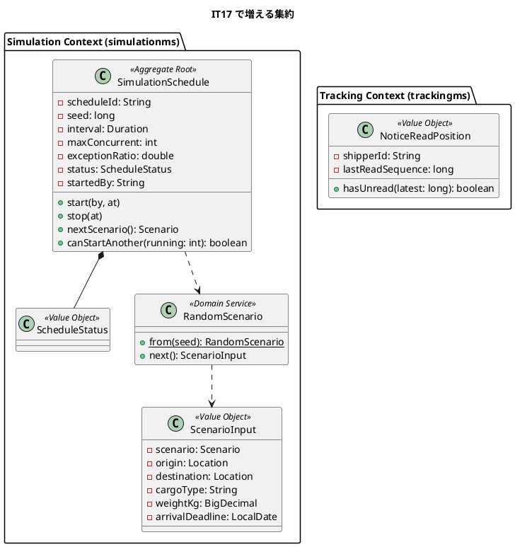
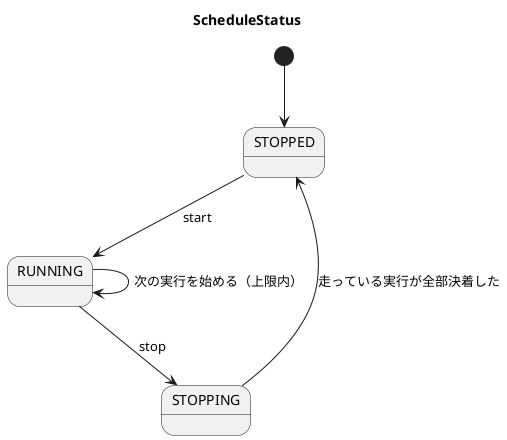
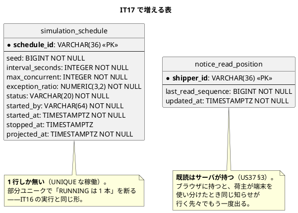
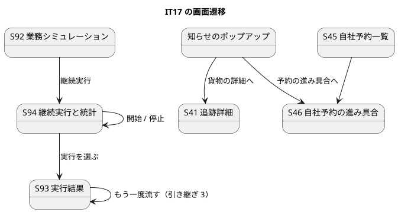

# イテレーション 17 計画

| 項目 | 内容 |
| :--- | :--- |
| イテレーション | IT17（Release 3.0 運用と実演・**最後**） |
| 期間 | 2026-09-15 〜 |
| 対象 | US35 例外シナリオ（3）・US36 乱数での継続実行（5）・US37 貨物の知らせ（3） |
| SP | 11 + **引き継ぎ枠 3**（SP 対象外）+ **負債枠 2**（SP 対象外） |
| 局面 | 終盤の続き・アウトサイドイン |

## ゴール

**業務が成立していることを、例外まで含めて・放っておいても・荷主の側からも確かめられる状態にする。** IT16 は正常系 1 本を手で流す形だった。本 IT は (a) 例外が起きたあとの対応まで流し、(b) 乱数で選んだシナリオをバックエンドが流し続け、(c) その貨物の知らせを荷主が画面で受け取れるようにする。

**Release 3.0 の最後**であり、**IT18 は予定していない**。落とすものがあれば、それはリリースから落ちる。

## 対象ストーリー

| US | 内容 | SP | 優先 |
| :--- | :--- | ---: | :--- |
| US36 | ランダムな業務シナリオをバックエンドが継続実行する | 5 | **1**（US37 の材料を作る） |
| US37 | 貨物の知らせを画面で受け取る | 3 | **2**（US36 が作る貨物で確かめる） |
| US35 | 例外を含む業務シナリオを自動実行する | 3 | **3**（下記リスク R1 の落とし先） |

**この順にします。** US36 が作る貨物が US37 を確かめる材料になり（release_plan の意図）、US35 は他の 2 つに依存されません。**落とすなら US35 です**——理由は R1 に書きます。

## 局面（終盤の続き・アウトサイドイン）

`development_strategy.md`「終盤の続き: 業務を確かめる手段（IT16〜IT17 / Release 3.0）」に従います。**新しい業務ロジックは足しません**——US35 が流す例外対応（例外の起票・解決・経路の組み直し・キャンセル承認）はすべて既存の API です。US36 は既存の実行を乱数と時間で回すだけ、US37 は既にある記録（`tracking_event`）の読み口を裏返すだけです。

**集約は 2 つ増えます。** `SimulationSchedule`（US36 の継続実行の設定と稼働）と、荷主ごとの既読位置（US37）。どちらも業務の事実ではなく、既存の集約に混ぜられません（IT12 の `CustomsDeclaration`・IT13 の `Invoice` と同じ判断）。

**この局面に固有の危険 3 番（負荷をかける側が業務を止める）が、本 IT で初めて現実になります**（US36）。手立ては受入基準に落とします。

## 受入基準（**1 項目ずつ表にする**）

### US36 ランダムな業務シナリオをバックエンドが継続実行する（5）

| # | 基準 | 落とし先 |
| :--- | :--- | :--- |
| 1 | 乱数でシナリオ・出発地・目的地・貨物種別・重量・期限を選び、**一定間隔で実行し続ける** | `RandomScenarioTest`（同じ種で同じ並び）・受け入れ `業務シミュレーションの継続実行.feature`・クラスタ E2E |
| 2 | 実行間隔・同時実行数・例外の発生比率を設定でき、**設定した上限を超えて実行しない** | `SimulationScheduleTest`（上限を 1 超える要求を断る）・`SimulationPropertiesTest`（設定名を明示的に受ける。**継続実行の設定も同じ検査に置いた**——設定の読み方は 1 か所で数え上げるほうが漏れない） |
| 3 | **乱数の種が記録され、同じ種を指定すると同じ並びを再現できる** | `RandomScenarioTest`（**種から 20 件生成して一致**）・S94 の画面テスト `SimulationSchedule.test.tsx`（種が読める） |
| 4 | 管理者が**開始・停止**でき、停止すると進行中の実行は最後まで終えてから止まる | `SimulationScheduleTest`（停止中は新しい実行を始めない・走っている実行は決着する）・受け入れ・画面テスト |
| 5 | 生成データは US33 と同じ印で識別できる | **引き継ぎ 1 で 3 つの読み口を閉じてから**、往復の契約テスト（`SimulatedOriginRoundTripIT` に追跡・荷役・要確認を足す）で固定 |
| 6 | 本番環境では起動しない | `SimulationPropertiesTest`（既定は無効・実行の許可とは別の段）・**無効な設定の実物を立てた受け入れ**（IT16 と同じ形） |
| 7 | 実行中も**ヘルスチェックと実利用者の操作は劣化しない** | `HealthProbeUnderLoadIT`（継続実行中に `/actuator/health` が 200 を返し続ける）・クラスタ E2E（継続実行中に営業の予約登録が通る） |
| 8 | 実行の統計（件数・成功／失敗の内訳・失敗した工程の分布）が US34 と同じ形式で読める | `SimulationScheduleQueryHandlerIT`（**統計は稼働の読み口と同じ場所**。分けると同じ稼働を 2 回引くことになる）・S94 の画面テスト `SimulationSchedule.test.tsx` |

### US37 貨物の知らせを画面で受け取る（3）

| # | 基準 | 落とし先 |
| :--- | :--- | :--- |
| 1 | 自社の貨物に新しい知らせがあると、画面の隅にポップアップで出る | `ShipperNotice.test.tsx`（新着があると出る・無ければ出ない） |
| 2 | ポップアップから、その貨物の詳細へ行ける | `ShipperNotice.test.tsx`（**行き先を数え上げる**・Try T2）・クラスタ E2E |
| 3 | 一度出た知らせは、**別の端末で開き直しても**もう一度出ない | `NoticeQueryHandlerIT`（**既読はサーバが持つ**。ブラウザの記憶を消しても出ない・位置は戻さない） |
| 4 | 他社の貨物の知らせは、追跡番号を知っていても届かない | `NoticeQueryHandlerIT`（荷主 ID で絞る。**読み口と既読は同じ表を読むので 1 つの検査にまとめた**）・`RoleAuthorizationDeclarationTest` |
| 5 | 荷主以外のロールでは何も出ない（**読みにも行かない**） | `ShipperNotice.test.tsx`（他ロールで問い合わせが 0 件であることを見る） |
| 6 | シミュレーションで作った貨物の知らせを、確認用の利用者で見られる | クラスタ E2E（**US36 が作った貨物で確かめる**） |

### US35 例外を含む業務シナリオを自動実行する（3）

| # | 基準 | 落とし先 |
| :--- | :--- | :--- |
| 1 | 例外シナリオ（遅延・破損・誤配・税関保留・輸送中キャンセル）を選んで実行できる | `ScenarioTest`（**工程の並びを `containsExactly` で固定**・IT16 の反省）・S92 の画面テスト |
| 2 | 例外が記録され、対応（解決・組み直し・承認）まで含めて実行される | 受け入れ `業務シミュレーション.feature` にシナリオを 5 本足す |
| 3 | 誤配シナリオでは、現在地からの経路が組み直されて輸送が再開する | 受け入れ・クラスタ E2E |
| 4 | 輸送中キャンセルでは、**承認で指定した港での荷降しまで実行され、追跡が閉じる** | 受け入れ（`CancellationRoundTripIT` が確かめた連鎖を、シミュレーションから通す） |
| 5 | 例外シナリオの結果も US34 と同じ形式で工程ごとに読める | S93 の画面テスト（既存の形をそのまま使う） |

## 成功基準

**クローズの 1 行目でこの表を採点します**（**Try T6**。IT16 では DoD だけ埋めて、この表を空のままクローズ確定と報告した）。

- [x] US35・US36・US37 の受入基準 19 件がすべて緑。**ただし 2 件はクローズのレビューまで働いていなかった**（US36 §1 は乱数を集約が持ち毎回同じ・US37 §2/§6 はクラスタ E2E が要素に触れていない）。どちらも直して緑
- [x] **受入基準の「落とし先」列に空欄が無く、書いた検査名が実在する**
- [x] **入口を足した変更では「意図した相手以外が通る道」を書き出した**（US36 の開始・停止は管理者だけ・US37 の知らせは荷主だけで**読みにも行かない**）
- [x] **複数の行き先・複数の一覧が出てくる受入基準は、検査を数え上げる形で書いた**。ただし **US37 §2 の行き先はクラスタ E2E で踏んでおらず、レビューで足した**
- [ ] **未達（部分）**。壊し方を書いたのは **15 / 20 コミット**（IT16 の 13/30 から改善）。**残った 5 件のうち 4 件がそのまま判別しない検査になった**——割合ではなく「残数 0」で測るべきだった（ふりかえり Try T4）
- [x] **除外・絞り込みを足したら、同じ列を読む読み口を数え上げて表にした**。ADR-0020 決定 4 の表は「未」ゼロ。**ただしレビューで S42・S23・S52 の 3 つが漏れていた**——表が「完成して見えていた」
- [ ] **未達**。受け入れの停止検査が `await(() -> size() == before)` で **1 回目のポーリングから真**になり、待たずに抜けていた。さらに**除外を足した一覧を連鎖の待ちに使い**、シミュレーション自身が出した申請を自分で見つけられなかった（CI とフルビルドで実測）
- [x] `TZ=UTC` の分割フルビルドが緑（**2 度赤にして直した**——通関の投影 12 件・JaCoCo 分岐 2 件）
- [x] フロントの `test`（574 / 52 ファイル）・`tsc -b` が緑
- [x] クラスタ E2E が緑（**IT の途中で 1 度**・29 本）。**クローズで足した知らせのポップアップの分は、クラスタを立て直してからの確認になる**
- [x] CI が緑（**1 度赤にして直した**——輸送中キャンセルの連鎖）
- [ ] SonarQube の Quality Gate（完了報告書の「課題と残作業」に記録）
- [x] `npx gulp okf:check` が ERROR 0
- [x] **マニュアル 20 章の更新と 21 章の新設**（キャプチャ 6 枚を生成 spec で撮影）。あわせて **ch.00 の担当と画面の表**・**ch.01 の「いま使える範囲」**・**ch.06 の荷主の紐付け**を直した（レビュー指摘）

## 引き継ぎ枠・負債枠（SP 対象外・**IT の序盤に独立コミットで消化**）

IT16 から 5 件を引き継ぎます。**「余力次第」にしません**——行として立てます。

| 枠 | 内容 | 由来 | いつ |
| :--- | :--- | :--- | :--- |
| 引き継ぎ 1 | **US33 §3 の未達を閉じる**——印を `trackingms`・`handlingms` へ運び、**追跡一覧・荷役の作業一覧・要確認一覧**が既定で除外する。ADR-0020 決定 4 の表から「未」を消す | IT16 レビュー N1（3 視点）・注 N7 | **T0（最初）**。US36 §5 の前提で、**乱数実行は大量にデータを作るので、混ざったままでは業務の一覧が使えなくなる** |
| 引き継ぎ 2 | **S45 自社予約一覧・S46 自社予約の進み具合**。着手して分かった——**「ルートが無い」ではなく画面も読み口も無い**。`FindShipperBookingProgressQuery` は正典にあるが実装 0 件で、荷主で絞る予約の読み口も無い。見積もりは 6h の一部ではなく**単独で 5〜8h** | IT16 計画 D2（**6 IT 連続で起票されず**） | T0。**US37 のポップアップの行き先**になる |
| 引き継ぎ 3 | 実行中の見え方（予定の工程を並べる）・失敗の先のリンク・再実行の手段 | IT16 レビュー N4・N5・N6 | T1。**US36 の統計画面と同じ場所**を触る |
| 負債 1 | 受け入れスイートが Gateway の経路を書き写している（本番 yml が変わっても緑） | IT16 レビュー N2 | T1 |
| 負債 2 | 細かいもの 8 件——管理者の読みを単票に絞る（N3）・Axon 依存を外す（N7）・所要時間に待ちを含める（N8）・二重実行の競合を断りに翻訳（N9）・トークンの期限切れ（N10）・`pointsAtTheGateway` の空振り（N11）・`JIG_MODULE_COUNT`（N13）・`.scannerwork`（N14） | IT16 レビュー | T1 |

**N12（`attention_item` の除外は `targetType=SHIPPER` も対象）は引き継ぎ 1 に含みます。**

## 注（着手前の検証で出たもの・**当該 IT で決めて正典に反映する**）

| # | 注 | 内容 | 決め方 |
| :--- | :--- | :--- | :--- |
| N1 | **継続実行の集約をどこに置くか** | `SimulationSchedule`（設定と稼働）を `simulationms` に置く。実行 1 本（`SimulationRun`）とは寿命が違う——スケジュールは長く生き、実行は数十秒で終わる | T2 で決めて `domain-model.md` に反映 |
| N2 | **既読位置をどこが持つか**（US37 §3） | 知らせの出典は `trackingms` の `tracking_event`。既読も同じ BC に置くのが自然だが、**荷主の識別は authms の紐付け**である。`trackingms` に `notice_read_position`（荷主 ID・最後に読んだ位置）を置き、荷主 ID は Gateway のヘッダから受ける | T4 で決めて `data-model.md` に反映 |
| N3 | **知らせの「新着」をどう決めるか** → **確かめた。実装が無いので足す** | `tracking_event` の主キーは `event_id`（UUID）で、**順序を決める連番が無い**。索引も `(tracking_number, occurred_at)` だけ。時刻で持つと同時刻の取りこぼしが出るので、**`BIGSERIAL` の連番を足す**。追記は `ON CONFLICT (event_id) DO NOTHING` なので、**リプレイでも既存行の連番は変わらない**（実測）。また `tracking_event` に `shipper_id` は無く、荷主で絞るには `tracking_summary` との結合が要る | T4。**「正典が実装不能なことがある」の実例**——着手前に確かめたので、設計を変えずに済む |
| N4 | **乱数の種から同じ並びを作る範囲**（US36 §3） | シナリオ・出発地・目的地・貨物種別・重量・期限まで。**実行の時刻と生成される識別子は再現しない**（UUID と採番は種の外）。この線引きを正典に書く | T2。書かないと「再現できない」と読まれる |
| N5 | **ポップアップの「画面の隅」はどの画面か** | 荷主がログインしているあいだ常に。共通レイアウト（`AppLayout`）に置き、**荷主以外は問い合わせにも行かない**（US37 §5） | T5 で `ui_design.md` に反映 |
| N6 | **S94（実行の統計）を新設するか、S92 に足すか** | 統計は「いま何が起きているか」で、一覧は「何を流したか」。**S92 に足す**と一覧の目的がぼやける。S94 として立てる | T3 で `ui_design.md` に反映 |
| N7 | **US36 の負荷が業務を止めないことをどう確かめるか**（§7） | 継続実行中に `/actuator/health` を叩き続ける検査と、**クラスタ E2E で営業の操作が通ること**。IT7 の「横断的な防御がヘルスチェックを殺した」と同型なので、**同じ形を先に塞ぐ** | T3 |
| N8 | **`ScheduleStatus` を状態の一覧に足す**（横断検証・軸 B） | `domain-model.md`「状態の一覧」は列挙をすべて載せる表である。IT16 で 3 つ足したのと同じ形で、`ScheduleStatus`（実行中 / 停止処理中 / 停止中）を足す。**列挙は値の一覧から回る検査とセットで置く** | T2 |
| N9 | **S45・S46 をサイドナビに載せるか**（横断検証・軸 B） | 自社予約一覧（S45）は荷主の**毎日の入口**なのでナビに載せる。S46 は一覧から開くので載せない。**IT16 で作った `alsoOpenableBy`** は「開けるがナビに出さない」用で、ここでは使わない | T0 |
| N10 | **例外シナリオの工程をどこまで並べるか**（US35） | 5 種類それぞれに `StepKind` を足すと列挙が肥大する。**例外の起票・対応・解決は種類を問わず同じ 3 工程**で、種類は入力で変える | T6。**列挙に値を足したら全箇所を回る**（過去の教訓） |

## タスク

| # | タスク | 対象 | 見積 |
| :--- | :--- | :--- | ---: |
| T0 | **引き継ぎ 1・2 を返す**（除外を 3 つの読み口へ・S45/S46 のルート） | — | 6h |
| T1 | **引き継ぎ 3・負債 1・2 を返す** | — | 6h |
| T2 | **継続実行の集約と乱数**（`SimulationSchedule`・種から同じ並びを作る・上限） | US36 §1〜§4 | 5h |
| T3 | **開始・停止と統計の読み口**（S94）・**負荷が業務を止めないことの検査** | US36 §4・§7・§8 | 5h |
| T4 | **知らせの読み口と既読位置**（`trackingms`） | US37 §1・§3・§4 | 4h |
| T5 | **ポップアップ**（共通レイアウト・荷主だけが読みに行く） | US37 §1・§2・§5 | 4h |
| T6 | **例外シナリオ 5 本**（工程は 3 つ・種類は入力） | US35 §1〜§3 | 5h |
| T7 | **輸送中キャンセルのシナリオ**（承認 → 指定港の荷降し → 追跡が閉じる） | US35 §4 | 3h |
| T8 | **受け入れシナリオ**（継続実行 + 例外 5 本。**シナリオ数を数で書く**） | US35・US36 | 4h |
| T9 | **クラスタ E2E**（**IT の途中で 1 度回す**。継続実行中に業務が止まらない・US36 の貨物で知らせを受け取る） | US35〜US37 | 4h |
| T10 | **マニュアル 20 章の更新と荷主向けの節**・キャプチャ生成 | — | 4h |

合計 **50 理想時間**（枠 12h を含む）。

## スケジュール

| 日 | 内容 |
| :--- | :--- |
| 1 | T0（引き継ぎ 1・2） |
| 2 | T1（引き継ぎ 3・負債）・T2 着手 |
| 3 | T2（集約と乱数）・T3（開始停止と統計） |
| 4 | T4（知らせの読み口）・T5（ポップアップ） |
| 5 | **T9 の 1 回目**（途中でクラスタを通す）・T6 着手 |
| 6 | T6（例外シナリオ）・T7（キャンセル） |
| 7 | T8（受け入れ）・T10（マニュアル） |
| 8 | クローズ（**成功基準の採点から**） |

## 設計

### ドメインモデル（本 IT のスコープ）

**`SimulationSchedule` は `SimulationRun` を持ちません。** 寿命が違います（スケジュールは長く生き、実行は数十秒で終わる）。スケジュールは「次に何を流すか」を決め、実行は既存の `SimulationRun` が担います。

**`NoticeReadPosition` は集約にしません。** 荷主ごとに 1 行の位置だけで、不変条件がありません（[[N2]]）。

### 状態遷移（継続実行）

**`STOPPING` を置きます。** 「停止すると進行中の実行は最後まで終えてから止まる」（US36 §4）を状態で表さないと、止めたのに実行が残っている状態を誰も読めません。

### データモデル（本 IT で増える表）

**`simulation_run` に `schedule_id` と `seed` を足します**（どの稼働が流したか・種は何か）。`seed` は IT16 で列だけ作って使っていません（`SimulationRun.seed` が常に `null`）——**定義済み未使用は配線漏れのサイン**で、本 IT で埋まります。

### 画面遷移（本 IT のスコープ）

| 画面 | 内容 | URL | ロール |
| :--- | :--- | :--- | :--- |
| S94 | 継続実行と統計 | `/admin/simulations/schedule` | 管理者 |
| S45 | 自社予約一覧（**ルートを足す**・引き継ぎ 2） | `/shipper/bookings` | 荷主 |
| S46 | 自社予約の進み具合（**ルートを足す**・引き継ぎ 2） | `/shipper/bookings/:id` | 荷主 |

**知らせのポップアップは画面ではありません。** 共通レイアウトに置く要素なので画面一覧には足さず、`ui_design.md` の「共通要素」に書きます（N5）。

## ADR

| # | 決めること | なぜ |
| :--- | :--- | :--- |
| ADR-0021 | **知らせを押し出さない**（ポーリングで読む） | ブラウザはメッセージ基盤を直接読めず、押し出す経路は Gateway と認証をもう 1 本通すことになる。荷主が求めているのは「数分以内に気づける」こと。**US37 の設計判断を文章のまま残さない** |

**ADR-0020 は改訂します**（新規ではありません）。決定 4 の表から「未」を消し、除外した読み口を確定させます。

## デモ項目（**すべて受け入れテストかクラスタ E2E に落とす**）

| # | 見せるもの | 落とし先 |
| :--- | :--- | :--- |
| 1 | 継続実行を開始すると、乱数で選ばれたシナリオが一定間隔で流れ続ける | 受け入れ・クラスタ E2E |
| 2 | 同じ種を指定すると、同じ並びが再現される | 受け入れ |
| 3 | 停止すると、進行中の実行は最後まで終えてから止まる | 受け入れ |
| 4 | 継続実行中も、営業は普段どおり予約を登録できる | **クラスタ E2E** |
| 5 | 荷主の画面に、自社貨物の知らせがポップアップで出る | クラスタ E2E |
| 6 | 別の端末で開き直しても、読んだ知らせは出ない | クラスタ E2E |
| 7 | 遅延・破損・誤配・税関保留のシナリオが、対応まで通る | 受け入れ |
| 8 | 輸送中キャンセルのシナリオが、指定港の荷降しまで通って追跡が閉じる | 受け入れ |

**8 件**です。

## リスク

| # | リスク | 対策 |
| :--- | :--- | :--- |
| **R1** | **11 SP は直近 6 IT の平均（7.5）を大きく超える**（IT11=10・IT12=6・IT13=8・IT14=7・IT15=6・IT16=8）。加えて引き継ぎ 3 件・負債 2 件（枠 12h）がある | **落とす順序を先に決めます**——US35（3 SP）です。US36・US37 は互いに材料を渡す関係で、US35 は誰にも依存されません。**ただし IT18 は予定していないので、落とせば Release 3.0 から落ちます。** 3 日目の終わりに T2・T3 が終わっていなければ、US35 をリリースから外すことを決めます（**「余力次第」にしない**——判断する日を決める） |
| R2 | **負荷をかける側が業務を止める**（局面の危険 3） | ヘルスチェックを劣化させないことを受入基準（§7）に立て、**クラスタ E2E で営業の操作が通ることまで**見る。IT7 の同型を先に塞ぐ |
| R3 | **乱数実行が大量のデータを作り、業務の一覧が使えなくなる** | **引き継ぎ 1 を T0 に置く**（3 つの読み口の除外）。除外が閉じるまで継続実行を長く回さない |
| R4 | **種から同じ並びを作る範囲を曖昧にすると「再現できない」と読まれる** | 注 N4 で線引きを決め、正典に書く。識別子と時刻は種の外 |
| R5 | **例外の種類だけ `StepKind` が増える** | 注 N10。例外の起票・対応・解決は種類を問わず 3 工程で、種類は入力で変える |
| R6 | **既読をブラウザに持つ誘惑** | US37 §3 を `NoticeQueryHandlerIT` で固定する（ブラウザの記憶を消しても出ない・古い画面が位置を巻き戻さない） |

## DoD

- [x] US35・US36・US37 の受入基準 19 件がすべて緑（**2 件はレビューまで働いていなかった**——成功基準に明記）
- [x] **受入基準の落とし先に空欄が無く、書いた検査名が実在する**
- [x] デモ項目 8 件が受け入れテストかクラスタ E2E で緑（受け入れ 18 シナリオ・数で固定）
- [x] `TZ=UTC` の分割フルビルドが緑（**2 度赤にして直した**）
- [x] フロントの `test` / `tsc -b` が緑
- [x] クラスタ E2E が緑（**IT の途中で 1 度**・29 本。クローズで足した分はクラスタ再構築後の確認）
- [x] CI が緑（**1 度赤にして直した**）
- [ ] SonarQube の Quality Gate（完了報告書の「課題と残作業」に記録）
- [x] **マニュアル 20 章の更新と 21 章の新設**・キャプチャ 6 枚
- [x] 正典（`domain-model` / `data-model` / `ui_design` / `architecture_backend`）に `SimulationSchedule`・`notice_read_position`・S94・S45/S46 を反映した
- [x] **ADR-0020 決定 4 の表から「未」が消えた**（レビューでさらに S42・S23・S52 の 3 つを閉じた）
- [x] ADR-0021（知らせを押し出さない）を起票した
- [x] **`IterationPlanChecksExistTest` の `CURRENT_PLAN` を `iteration_plan-17.md` へ進めた**
- [x] 引き継ぎ 3 件・負債 2 件を返した（**13 回連続で繰越ゼロ**）
- [x] `npx gulp okf:check` が ERROR 0
- [ ] **部分達成**。壊し方をコミット本文に書いたのは 15 / 20（成功基準に明記）

## 関連ドキュメント

- [リリース計画](release_plan.md)
- [開発戦略](development_strategy.md)
- [IT16 ふりかえり](retrospective-16.md)
- [IT16 完了報告書](iteration_report-16.md)
- [IT16 実装レビュー](../../review/cargo-tracker/IT16実装_review_20260915.md)
- [ADR-0020 シミュレーションは駆動役であって Event Sourcing の文脈ではない](../../adr/cargo-tracker/0020-simulation-is-a-driver-not-an-event-sourced-context.md)
- [ユーザーストーリー](../../requirements/user_story.md)

## 更新履歴

| 日付 | 内容 | 担当 |
| :--- | :--- | :--- |
| 2026-09-15 | 初版作成。IT16 のふりかえり Try 7 件を成功基準に、引き継ぎ 3 件・負債 2 件を**行として**計上。**11 SP が直近平均を超えることと、落とす順序（US35）・判断する日（3 日目）を R1 に明記**した | claude-code/claude-opus-5 |
| 2026-09-15 | **T9（クラスタ）で 3 件の欠陥を見つけた**。(1) `users.shipper_id` は**読まれるだけでどこからも書かれていなかった**——紐付けが無いと Gateway は `X-Auth-Shipper-Id` を載せられず、**荷主向けの画面がすべて 403** になる（S45・S46・S62・追跡の荷主絞り・貨物の知らせ）。管理者だけが使える紐付けの入口を足した。(2) 監査ログの `reason` が 30 文字で、荷主 ID（UUID・36 文字）が入らず 500 になった（**識別子が列に収まらない形は 4 度目**）。(3) **追跡番号を発行しても画面に出ないことがある**——投影が追いつく前に画面がポーリングを止めるので、利用者は自分で読み込み直すしかない。どれも層ごとの検査では出ず、クラスタで荷主としてログインして初めて分かった | claude-code/claude-opus-5 |
| 2026-09-15 | **T0 の実測で引き継ぎ 2 の見積もりを訂正**。正典の「未実装」という記述を「ルートだけが無い」と読んでいたが、実際は読み口（`FindShipperBookingProgressQuery`）も荷主で絞る予約の一覧も実装 0 件だった。**7 IT 目の先送りにしない**ので実装するが、超過したら R1 の規則どおり US35 を落とす | claude-code/claude-opus-5 |
| 2026-09-15 | ステップ 3・4 の検証結果を反映。**不整合 4 件を計画側で直した**——(1) S46 の URL が正典と違った（`:bookingId` → `:id`。**設計が正**）、(2) 注 N3 の「新着をどう決めるか」を**実測で確定**（`tracking_event` に順序を決める連番が無く、索引も `(tracking_number, occurred_at)` だけ。`ON CONFLICT DO NOTHING` なのでリプレイでも連番は変わらないことを確認）、(3) **`ScheduleStatus` を状態の一覧に足す**行が無かった（軸 B。注 N8 として追加）、(4) **S45 をサイドナビに載せる判断**が無かった（軸 B。注 N9 として追加）。**軸 A（局面・アプローチ・US 割当）と軸 C（BC 独立性・荷主 ID の受け取り方・前 IT 引き継ぎの反映）に不整合なし**——荷主 ID を Gateway のヘッダから受ける形は `TrackingController` の既存の前例と一致する | claude-code/claude-opus-5 |
| 2026-09-16 | **クローズで実績を反映**。成功基準 13 件のうち **10 件達成・3 件未達**（壊して赤を見るが 15/20・待ち条件の確認・SonarQube）。フルビルドと CI が**除外の副作用を 2 件**見つけた——`EXISTS ... simulated = FALSE` が写しの届く前の本物まで消す（通関の投影 12 件が赤）、除外を足した承認待ち一覧を連鎖の待ちに使いシミュレーション自身の申請が見えない（輸送中キャンセルが必ず時間切れ）。レビューの高 14 件はすべてクローズ前に修正した | claude-code/claude-opus-5 |
