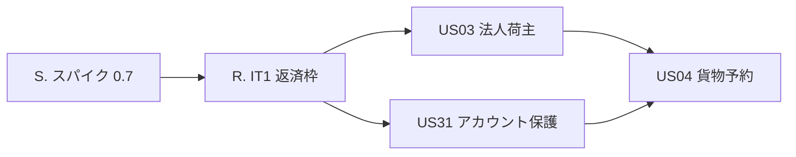
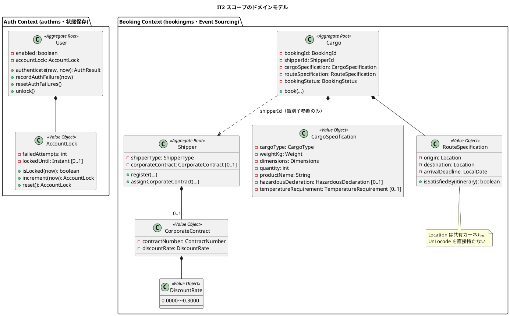
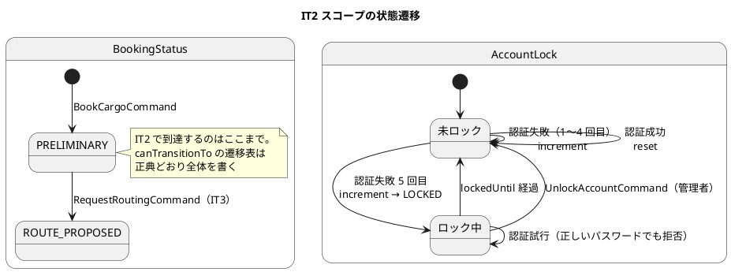
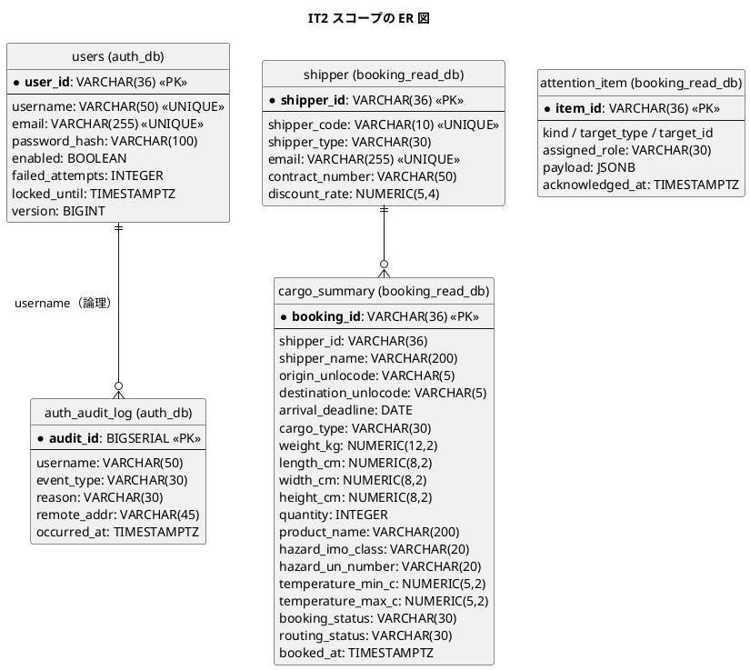
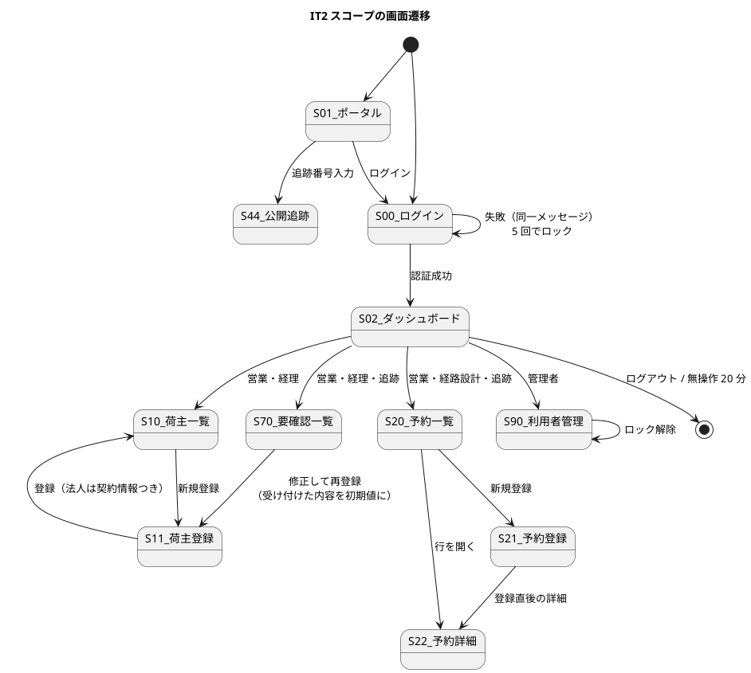

# イテレーション計画 2 - 貨物予約・法人荷主・アカウント保護

## 概要

| 項目 | 内容 |
| :--- | :--- |
| イテレーション | IT2（Release 0.1 予約基盤・**序盤**） |
| 期間 | 2 週間 |
| ゴール | 状態遷移を持つ集約 `Cargo` を Event Sourcing で書き切り、IT1 の持ち越しを返済して基盤を閉じる |
| 目標 SP | 9 SP（US31 2・US03 2・US04 5）+ 返済枠（IT1 持ち越し 5 件・レビュー指摘） |
| 局面 | 序盤（アウトサイドイン）。[開発戦略](development_strategy.md) を参照 |

## ゴール

### イテレーション終了時の達成状態

1. **状態を持つ集約が Event Sourcing で書けている。** `Cargo` が `BookCargoCommand` を受けて `PRELIMINARY` になり、[ドメインモデル](../../design/cargo-tracker/domain-model.md) の不変条件 1・2・3 が `AxonTestFixture` で固定されている。IT1 の `Shipper`（登録のみ）と違い、**イベント列からの復元が判定に効く**最初のストーリー
2. **アカウント保護が働くことを破って見せられる。** 5 回失敗でロックされ、**ロック中は正しいパスワードでも入れない**。ロック中と認証情報の誤りが同一メッセージであることを検査で固定する
3. **IT1 の持ち越し 5 件が返済されている。** S01 ポータル・無操作タイムアウト・スパイク 0.7・契約テストの往復・「修正して再登録」の初期値
4. **検査そのものが働くことを確かめている。** 足した検査はその場で壊して赤を見る（ふりかえり T1）
5. **ES 適用範囲の見直し判定が済んでいる。** [ADR-0001](../../adr/cargo-tracker/0001-cqrs-es-with-axon-in-microservices.md) 決定 2 の発動条件（実績ベロシティ 6.3 SP 未満）を IT2 のふりかえりで判定し、結果を ADR に追記する

### 成功基準

- [ ] デモ項目 8 件の受け入れテスト（Cucumber の Feature・到達性は Playwright）がすべて緑
- [ ] `./gradlew build` と `TZ=UTC ./gradlew cleanTest test` が緑（`cleanTest` を外さない。Gradle は TZ を入力と見ない）
- [ ] フロントの `npm run test`・`npx tsc -b`・`npm run build` が緑
- [ ] 契約テストが 2 サービス起動で往復し、ゴールデンの丸ごと一致だけでなく**実際に届くこと**を検査している
- [ ] `npx gulp okf:check` が ERROR 0
- [ ] SonarQube の Quality Gate がバックエンド・フロントエンドとも PASS
- [ ] ADR-0001 決定 2 の発動条件を判定し、結果を ADR に追記した

## ユーザーストーリー

### 対象ストーリー

受入基準は [ユーザーストーリー](../../requirements/user_story.md) を正典とし、**複写しません**。件数と参照だけを持ち、判定は正典を開いて行います（IT1 の方針を継続。書き写した条件は正典が変わっても追随しません）。

| ID | ストーリー | SP | 優先度 | Issue |
| :--- | :--- | :--: | :---: | :--- |
| US31 | 認証失敗が続いたアカウントを保護する | 2 | 高 | [#571](https://github.com/k2works/case-study-cargo-tracker/issues/571) |
| US03 | 法人荷主を登録する | 2 | 高 | [#572](https://github.com/k2works/case-study-cargo-tracker/issues/572) |
| US04 | 貨物予約を登録する | 5 | 高 | [#573](https://github.com/k2works/case-study-cargo-tracker/issues/573) |
| | **合計** | **9** | | Milestone: [java/take-8] Release 0.1 予約基盤 |

GitHub Project: [CargoTracker java/take-8](https://github.com/users/k2works/projects/41)（イテレーション=IT2・リリース=Release 0.1・SP・優先度を設定済み。Status は着手時に In Progress へ）

### ストーリー詳細

| ID | として | したい | なぜなら | UC | 受入基準 |
| :--- | :--- | :--- | :--- | :--- | :--- |
| US31 | システム管理者（利益を受けるのは全利用者） | 認証失敗が連続した場合にアカウントを一時ロックし、無効化されたアカウントの利用を拒否したい | 総当たり攻撃で業務データが第三者に渡ることを防げるからだ。退職者のアカウントが生きたままになることも防げる | UC20 | 8 件（[US31](../../requirements/user_story.md)） |
| US03 | 営業担当者 | 法人荷主の契約番号と割引率を含めて登録したい | 法人契約条件（割引率）を精算時に自動適用できるからだ | UC02 | 4 件（[US03](../../requirements/user_story.md)） |
| US04 | 営業担当者 | 荷主 ID・貨物仕様（種別・重量・寸法・個数・品名）・輸送条件（出発地・目的地・希望日）を入力して予約を登録したい | 荷主の見積承認後に正式な予約を受け付け、経路設計フェーズに引き継げるからだ | UC03 | 6 件（[US04](../../requirements/user_story.md)） |

**US04 §受入基準 5（経路設計者への通知）** は、[ユーザーストーリー](../../requirements/user_story.md) の「通知に関する注記」により**送信基盤はスコープ外**です。システムは通知した事実を記録し、経路設計者は S30 経路設計作業一覧で気づきます。IT2 では S30 が無いため、**ダッシュボード（S02）の経路設計ロールの「今日の作業」に仮受付の件数と導線を出す**ことで「気づいて次の行動に移れる」ことを満たします。

**US04 §受入基準 6（見積情報との整合性が確認される）** は、見積（US01・IT14）が未実装のため IT2 では**見積の選択欄を出さない**。差分表示（S21 の「見積と異なる項目」）は US01 と同じ IT で入れます。この判断を「設計への反映が必要な事項」に記録します。

### 依存関係

US03 は IT1 の `Shipper` 集約に契約情報を足すだけなので短く、**US04 の前に置いて `Shipper` の投影を法人まで通してから**予約を積みます。予約は `shipper_name` を非正規化して持つため、荷主側が完成していないと投影が書けません。

### タスク

状態は `[x]` 完了・`[~]` 一部（**何が残っているかを必ず書く**）・`[ ]` 未着手の 3 値です（ふりかえり T4）。

#### S. スパイク（SP 対象外・タイムボックス 2h）

| # | タスク | 見積 | 状態 |
| :--- | :--- | :--: | :--: |
| S.1 | ADR-0001 決定 5 第 7 項：S3 へエクスポートした Event Store からの差分再投入。RPO の根拠を実測する | 2h | [x] **差分再投入は成立。ただしエクスポートがタグを落とすため、そのままでは集約が復元できない**（件数も内容も一致し投影のリプレイも通るのに集約だけ読めない）。重複投入も冪等でない |
| S.2 | 結果を ADR-0001 決定 5 と `non_functional.md`（「未検証」の記述）に反映 | — | [x] ADR-0001 に「第 7 項の詳細」を追加。`operation.md` 4.1 にタグ併記と `id` 重複除去、復元演習の合格条件に「復元した集約へコマンドを 1 本送る」を追加 |
| | 小計 | 2h | |

**IT1 で唯一落ちてはいけないものが落ちました。** IT2 では Day 1 に置き、他のタスクに依存させません。

#### R. IT1 返済枠（SP 対象外・「余力次第」にしない）

ふりかえり T2・T3 に従い、**IT の序盤に独立したコミットで消化**します。落とす順序は「価値の低い順」ではなく **「依存で着手できない順」** で作ります（T3）。

| # | タスク | 由来 | 見積 | 状態 |
| :--- | :--- | :--- | :--: | :--: |
| R.1 | S01 ポータル（`/portal`）の実装。未認証者が公開追跡（S44）へ入る導線 | 引き継ぎ 2・レビュー H4 | 4h | [ ] |
| R.2 | 無操作タイムアウト（15 分警告・20 分で認証ストア破棄。荷役ロールの画面は 60 分）。警告に「入力中の内容は保存されない」を明示 | 引き継ぎ 3・T8 | 5h | [ ] |
| R.3 | 契約テストの往復（2 サービス起動）。ゴールデンの一致だけでなく**実際に届くこと**を検査する | 引き継ぎ 4・レビュー M4 | 6h | [ ] |
| R.4 | 「修正して再登録」に受け付けた内容を引き継ぐ（`attention_item.payload`）。**個人情報を要確認一覧の応答に載せる是非を ADR-0003 と突き合わせ、判断を ADR に追記する** | 引き継ぎ 5b・レビュー H6 | 5h | [ ] |
| R.5 | 403 をシェルの内側に出す（サイドナビを失わない） | 引き継ぎ 5・レビュー M2 | 2h | [ ] |
| R.6 | 荷主種別「個人」の REST 層・受け入れ層の検査（`ShipperControllerIT`・`荷主の登録.feature` が `CORPORATE` 固定） | 引き継ぎ 5c・レビュー M8 | 2h | [ ] |
| R.7 | US26 の文言統一（「利用者 ID」/「利用者名」）。**正典側を直す** | 引き継ぎ 5d・レビュー M7 | 1h | [ ] |
| R.8 | `FormEvent` 非推奨（S1874）・`FormData` の文字列化（S6551）の解消 | 引き継ぎ 6・レビュー M6 | 1h | [ ] |
| R.9 | ADR-0004（デモログイン）の承認と `verify` | 引き継ぎ 7 | 0.5h | [ ] |
| | 小計 | | 26.5h | |

**R.4 は判断を伴います。** 実装の前に ADR-0003 との整合を決め、決まらなければ「氏名・メールは伏せ、業務項目だけを初期値にする」で進めます。

#### Q. 検査が働くことの確認（SP 対象外・ふりかえり T1）

| # | タスク | 見積 | 状態 |
| :--- | :--- | :--: | :--: |
| Q.1 | 本 IT で足す検査すべてについて、**実装を壊して赤を見る**（集約の不変条件・ロックの同一メッセージ・投影の UNIQUE・契約の往復） | 3h | [ ] |
| Q.2 | デモ項目とテストの対応表を、**テスト名ではなく本文のアサーション**で作る（T9） | 1h | [ ] |
| Q.3 | Quality Gate の対象と鮮度の再確認（スキャンした数だけ確かめる・前回の解析結果を読まない） | 1h | [ ] |
| | 小計 | 5h | |

#### 1. US31 認証失敗が続いたアカウントを保護する（2 SP）

| # | タスク | 見積 | 状態 |
| :--- | :--- | :--: | :--: |
| 1.1 | 受け入れの入口を赤で置く：`アカウント保護.feature`（5 回失敗 → ロック → **正しいパスワードでも拒否**） | 2h | [ ] |
| 1.2 | `AccountLock` 値オブジェクト（`failedAttempts` / `lockedUntil` / `isLocked` / `increment` / `reset`）とその単体テスト | 2h | [ ] |
| 1.3 | `User#authenticate` にロック判定を入れる。**ロック中・認証情報誤り・無効化で同一メッセージ**（理由は監査ログにだけ残す） | 2h | [ ] |
| 1.4 | `auth_audit_log` への記録（`LOGIN_SUCCESS` / `LOGIN_FAILURE` / `LOCKED` / `UNLOCKED`、`reason` は `BAD_CREDENTIALS` / `LOCKED` / `DISABLED`） | 2h | [ ] |
| 1.5 | `UnlockAccountCommand` と S90 利用者管理（管理者ロール。一覧・ロック状態・解除） | 3h | [ ] |
| 1.6 | 「ロックされたことが利用者に通知される」の実現。**送信基盤はスコープ外**なので、監査ログへの記録と S90 での可視化で満たす。この解釈を「設計への反映が必要な事項」に記録する | 1h | [ ] |
| | 小計 | 12h | |

#### 2. US03 法人荷主を登録する（2 SP）

**着手時に分かったこと。** US03 のドメイン側は **IT1 で先に実装されていました**。`DiscountRate`（0.0000〜0.3000）・`CorporateContract`・`Shipper` の不変条件（`CORPORATE` は契約番号必須／`INDIVIDUAL` は法人契約を持てない）・S11 の法人フィールドの出し分け・投影の 2 列・受け入れシナリオの法人登録は、いずれも US02 の実装に含まれていました。**残っているのは受入基準 2（割引率 0〜30%）と 4（US22 から参照される）だけです。** 見積を 9h から 4h に改め、浮いた 5h は返済枠と US04 に回します。

| # | タスク | 見積 | 状態 |
| :--- | :--- | :--: | :--: |
| 2.1 | 受け入れの入口を赤で置く：`荷主の登録.feature` に **割引率 31% が断られる**シナリオを足す（受入基準 2。現状 REST 層・受け入れ層に検査が無い） | 1h | [ ] |
| 2.2 | 割引率の範囲検査を REST の入口から集約まで通す。**壊して赤を見る**（Q.1） | 1h | [ ] |
| 2.3 | **billingms が `ShipperRegisteredEvent`（契約イベント）を購読し `shipper_contract_snapshot` に写す**（受入基準 4「US22 で参照される」の実体。現状 billingms は購読していない） | 2h | [ ] |
| | 小計 | 4h | |

**`AssignCorporateContractCommand` は US03 の受入基準に無いので入れません。** [ドメインモデル](../../design/cargo-tracker/domain-model.md) では UC02 / US03・US22 に紐づいていますが、受入基準が求めるのは「法人として**登録**できること」であり、契約の後付け・変更は US22（IT13）の話です。読む側の無い配線を先に敷きません（[リリース計画](release_plan.md) の順序の根拠と同じ判断）。

#### 3. US04 貨物予約を登録する（5 SP・状態を持つ集約の初回）

| # | タスク | 見積 | 状態 |
| :--- | :--- | :--: | :--: |
| 3.1 | 受け入れの入口を赤で置く：`貨物予約の登録.feature`（登録 → 予約番号発行 → 状態「仮受付」→ 一覧・詳細に出る） | 2h | [ ] |
| 3.2 | S21 予約登録の画面（API はモック。**モックは本物より甘くしない**。到着期限は日付、`202` / `409` / `422` を返せる）。**寸法の入力欄を含める**（「設計への反映が必要な事項」6） | 5h | [ ] |
| 3.3 | S20 予約一覧・S22 予約詳細（IT2 スコープ：状態・貨物仕様・輸送条件のみ。旅程・通知履歴・誤配バナーは後の IT） | 5h | [ ] |
| 3.4 | `Cargo` 集約：`book`。不変条件 1（`ShipperId` 必須）・2（出発地と目的地は異なる）・3（`HAZARDOUS` / `REFRIGERATED` の必須項目）を `AxonTestFixture` で固定 | 5h | [ ] |
| 3.5 | `BookingStatus` と `canTransitionTo`（判定を 1 か所に置く）。IT2 で使うのは `[*] → PRELIMINARY` のみだが、**遷移表は正典どおり全体を書く**（後の IT で足すたびに全箇所を回らずに済む） | 3h | [ ] |
| 3.6 | `BookCargoCommand` / `CargoBookedEvent`、`BookingId` の採番と予約番号の表示形式 | 3h | [ ] |
| 3.7 | 投影：`cargo_summary`（`shipper_name` を非正規化。`booking_status` / `routing_status`）。**寸法 3 列を Flyway で追加**（「設計への反映が必要な事項」6） | 4h | [ ] |
| 3.8 | クエリ：`FindBookingsQuery` / `FindBookingByIdQuery`。一覧の既定の絞り込みは UI 設計の表に従う（`SETTLED`・`CANCELLED` を除く・到着期限が近い順・「終了したものも表示」） | 3h | [ ] |
| 3.9 | ダッシュボード（S02）の経路設計ロールに仮受付の件数と導線を出す（US04 §受入基準 5 の代替。**気づく手段は次の行動へ繋ぐ**） | 2h | [ ] |
| 3.10 | モックを実物に差し替え、3.1 の赤が緑になることで縦切りの成立を判定 | 2h | [ ] |
| 3.11 | **ナビゲーション整合**：S20（営業・経路設計・追跡）・S90（管理者）・S01（未認証）を [UI 設計のロール別ナビゲーション](../../design/cargo-tracker/ui_design.md)どおりにサイドナビとダッシュボードへロール条件つきで反映し、**ロール × 画面の到達性テスト（`routes.test.tsx`）を同時に更新**する。個別画面の整合だけでは不足 | 3h | [ ] |
| | 小計 | 37h | |

#### 4. ユーザーマニュアル（SP 対象外・画面を伴う IT なので毎回計上）

| # | タスク | 見積 | 状態 |
| :--- | :--- | :--: | :--: |
| 4.1 | 対象章：荷主登録（法人の節を追加）・貨物予約の登録（新規）・ログイン（ロックの案内を追加）・利用者管理 S90（新規）。**章数は書き写さず索引を正とする**（T5） | 5h | [ ] |
| 4.2 | 画面キャプチャの再生成（S11 法人・S21・S20・S22・S90・S01） | 2h | [ ] |
| | 小計 | 7h | |

### タスク合計

| カテゴリ | SP | 理想時間 | 備考 |
| :--- | :--: | :--: | :--- |
| ユーザーストーリー（US31・US03・US04） | 9 | 53h | 1 SP ≒ 5.9h（US03 は IT1 で先行実装されていた分を差し引いた） |
| スパイク（S） | — | 2h | IT1 からの持ち越し |
| IT1 返済枠（R） | — | 26.5h | 「余力次第」にしない |
| 検査の確認（Q） | — | 5h | ふりかえり T1 |
| ユーザーマニュアル（4） | — | 7h | 画面を伴う IT では毎回計上 |
| **合計** | **9** | **93.5h** | |

**93.5h も 2 週間（10 営業日）に収まりません。** IT1 の 130h より軽くなりましたが、返済枠が 26.5h あります。落とす順序を先に決めます。

#### スコープを落とす順序

**「依存で着手できない順」で作ります**（ふりかえり T3）。IT1 では「価値の低い順」で作ったため、実際に落ちたものと一致しませんでした。

| 順 | 落とすもの | 送り先 | 依存で着手できない理由 |
| :--- | :--- | :--- | :--- |
| 1 | R.3 契約テストの往復（6h） | IT3 | 2 サービス起動が要る。routingms が立つ IT3 のほうが検査対象が増えて価値が出る |
| 2 | 1.5 S90 利用者管理（3h） | IT3 | 管理者ロールの画面は他に無く、ナビと対で入れるほうが安い。ロック解除は当面 SQL で代替できることを運用手順に書く |
| 3 | 3.3 の S22 予約詳細（5h のうち一覧で代替できる分） | IT3 | 詳細で見せる項目（旅程・通知履歴）が IT3〜IT6 で増える |
| 4 | 4. ユーザーマニュアル（7h） | **落とさない** | IT1 で順序 1 に置いたのに落ちなかった。実績どおり落とさない |

**S.1 スパイク・R.1 ポータル・R.2 無操作タイムアウト・US04 の縦切り（3.4〜3.10）は落としません。** スパイクは IT1 で唯一落としてはいけないものが落ちた反省、R.1・R.2 は 2 IT 連続の繰越を避けるため、US04 は IT2 の目的そのものだからです。

## スケジュール

### Week 1

| 日 | タスク | アウトサイドインの位置づけ |
| :--- | :--- | :--- |
| Day 1 | S.1〜S.2 スパイク 0.7 → ADR と `non_functional.md` へ反映。R.9 ADR-0004 の承認 | 着手前の不確実性の除去 |
| Day 2 | 1.1・2.1・3.1 **受け入れの入口を 3 本とも赤で置く** | Phase 1 |
| Day 3 | R.1 ポータル・R.2 無操作タイムアウト・R.5 403 | 返済枠（序盤に独立コミットで） |
| Day 4 | R.4 修正して再登録（ADR-0003 との突き合わせを先に）・R.6・R.7・R.8 | 返済枠 |
| Day 5 | 2.2 S11 法人フィールド・3.2 S21 予約登録（API はモック） | Phase 2：UI から API の契約を決める |

### Week 2

| 日 | タスク | アウトサイドインの位置づけ |
| :--- | :--- | :--- |
| Day 6 | 1.2〜1.4 アカウント保護・3.3 S20/S22 | Phase 3：入口から内側へ |
| Day 7 | 2.3〜2.6 法人荷主の集約と投影と契約 | Phase 3・4 |
| Day 8 | 3.4〜3.6 `Cargo` 集約と `BookingStatus` | Phase 4：ドメインの内側 |
| Day 9 | 3.7〜3.9 投影とクエリとダッシュボード、3.11 ナビゲーション整合 | Phase 5：永続化と投影 |
| Day 10 | 3.10 **モックを実物に差し替え、Day 2 の赤が緑になることで判定**。R.3 契約の往復 | 判定 |
| Day 11-12 | 1.5 S90・4. マニュアル・Q.1〜Q.3 検査が働くことの確認 | 仕上げ |
| Day 13-14 | デモ項目の受け入れテスト、**レビュー（結果が届くまでクローズを確定しない）**、ふりかえり、ドキュメント同期 | クローズ |

## 設計

設計は `docs/design/cargo-tracker/` が正典です。本計画には複写しません。

| トピック | 正典 |
| :--- | :--- |
| `Cargo` / `Shipper` / `User` 集約・不変条件・契約イベント | [ドメインモデル設計](../../design/cargo-tracker/domain-model.md) |
| `users` / `auth_audit_log` / `shipper` / `cargo_summary` / `attention_item` | [データモデル設計](../../design/cargo-tracker/data-model.md) |
| S00・S01・S02・S11・S20・S21・S22・S90 と一覧の既定の絞り込み | [UI 設計](../../design/cargo-tracker/ui_design.md) |
| サービス分割・パッケージ構成・Axon の設定 | [バックエンドアーキテクチャ](../../design/cargo-tracker/architecture_backend.md) |
| テストの層と閾値 | [テスト戦略](../../design/cargo-tracker/test_strategy.md) |

### 対象スコープの設計図

#### ドメインモデル図（IT2 スコープ）

`Cargo` は `Shipper` を識別子でだけ参照します（[ドメインモデル](../../design/cargo-tracker/domain-model.md) の集約の粒度）。一覧が JOIN しないよう `shipper_name` は投影で非正規化します。

#### 状態遷移図（IT2 スコープ）

#### ER 図（IT2 スコープ）

`arrival_deadline` は **DATE** です。期限当日着は「間に合う」扱いなので、比較は日付単位で行います（ドメインモデルの不変条件 5）。IT2 では旅程を持たないため判定は入りませんが、列の型をここで決めます。

#### 画面遷移図（IT2 スコープ）

**S02 → S20 の導線は経路設計ロールにも出します。** US04 §受入基準 5 の「経路設計者への通知」の代替であり、気づく手段が次の行動に繋がっている必要があります。

### 設計への反映が必要な事項

**設計が正**なので、計画側で代替せず当該 IT で設計に反映します。

| # | 事項 | 対象 | 対応 |
| :--- | :--- | :--- | :--- |
| 1 | S90（利用者管理）の salt ワイヤーフレームが無い（画面一覧の行はある） | [UI 設計](../../design/cargo-tracker/ui_design.md) | **1.5 の着手前に描く**（IT1 では実装後に描いて順序が逆になった） |
| 2 | S20（予約一覧）の salt ワイヤーフレームが無い | [UI 設計](../../design/cargo-tracker/ui_design.md) | 3.3 の着手前に描く |
| 3 | US04 §受入基準 6（見積との整合性確認）は見積（US01・IT14）が無いと成立しない。IT2 では S21 に見積欄を出さない | [ユーザーストーリー](../../requirements/user_story.md)・UI 設計 S21 | US04 の受入基準に「US01 実装後」の但し書きを追記するか、US01 と同じ IT で判定する。**IT2 のふりかえりで決める** |
| 4 | US31 §受入基準 3（ロックが利用者に通知される）・6（無効化で管理者への問い合わせが案内される）は、**同一メッセージを返す方針（受入基準 8）と真正面から衝突する。** その人にだけ伝えれば利用者名の存在を教えることになる | [ユーザーストーリー](../../requirements/user_story.md)・[UI 設計](../../design/cargo-tracker/ui_design.md) S00 | **解決済み。** 失敗した全員に同じ文で「続けて 5 回失敗すると 15 分ロックされる」「心当たりがなければ管理者へ」を出す。起こりうることと次の行動を、存在を漏らさずに伝えられる唯一の形。受入基準 3 の「通知」をこの解釈で満たす旨を `user_story.md` の通知に関する注記へ追記する |
| 5 | R.4 で個人情報を要確認一覧の応答に載せる是非 | [ADR-0003](../../adr/cargo-tracker/0003-crypto-shredding-for-personal-data.md) | 判断を ADR-0003 に追記する |
| 6 | **`CargoSpecification.dimensions`（寸法）が投影と画面に無い。** ドメインモデルは `dimensions: Dimensions` を持ち US04 §受入基準 2 も「寸法」を求めるが、`cargo_summary` に列が無く S21 の salt にも欄が無い | [データモデル](../../design/cargo-tracker/data-model.md)・[UI 設計](../../design/cargo-tracker/ui_design.md) | **IT2 で反映する。** `cargo_summary` に `length_cm` / `width_cm` / `height_cm`（`NUMERIC(8,2)`）を足し、S21 に入力欄と salt を足す。集約が持つ値を投影が落とすと、US04 の受入基準を満たせない |
| 7 | **US04 §受入基準 3 の「希望引渡日」に置き場が無い。** `RouteSpecification` は `arrivalDeadline`（希望着日）だけを持つ | [ドメインモデル](../../design/cargo-tracker/domain-model.md)・ユーザーストーリー | **IT2 のふりかえりで決める。** 経路探索（US08）の入力になるのは着日側なので、引渡日を持つ必要があるかを判断し、不要なら受入基準側を直す。決まるまで S21 に欄を出さない |

## リスクと対策

| リスク | 影響度 | 対策 |
| :--- | :---: | :--- |
| 返済枠 26.5h が本体を圧迫し、US04 の縦切りが閉じない | **高** | 返済枠を Day 3-4 に固め、Day 5 時点で「落とす順序」の 1・2 を判断する。US04 は落とさない |
| 実績ベロシティが 6.3 SP を下回り、ADR-0001 決定 2 が発動する | 中 | 発動しても慌てないよう、`Quotation`（IT14）と `Voyage`（IT3）が状態保存になった場合の影響（US24 と US01 の SP 見直し）を IT2 のふりかえりで見積もる |
| `Cargo` の不変条件 3（危険物・冷凍の必須項目）が US05（IT3）と重なる | 中 | IT2 では `CargoSpecification.of` に検査を置き、専用の入力欄（S21 の IMO クラス・温度条件）は US05 で仕上げる。**検査は IT2 から働かせる**（後から足すと既存イベントが検査を通っていない状態になる） |
| ロックの同一メッセージが、実装のどこか 1 か所で理由を漏らす | 中 | Q.1 で「ロック中」「認証情報誤り」「無効化」「存在しない利用者」の 4 経路すべてを 1 つのテストで並べ、応答が完全一致することを検査する |
| 無操作タイムアウト（R.2）が荷役ロールの 60 分と混ざる | 低 | ロール別の値を設定の 1 か所に置き、ロールごとに開いて確かめる（T7） |

## 完了条件

### Definition of Done

- [ ] US31・US03・US04 の受入基準（`user_story.md`）を満たす（US04 §受入基準 6 は「設計への反映が必要な事項」3 の判断に従う）
- [ ] デモ項目 8 件の受け入れテストがすべて緑。**対応はテスト名でなく本文のアサーションで確かめる**
- [ ] 画面は**ナビゲーションと到達性テストに対で**足した（プレースホルダは置かない。[開発戦略](development_strategy.md) の骨格）
- [ ] IT1 の持ち越し 5 件（S01 ポータル・無操作タイムアウト・スパイク 0.7・契約の往復・修正して再登録）が返済されている、または「落とす順序」に従って送った理由がふりかえりに書かれている
- [ ] 本 IT で足した検査を壊して赤を見た（Q.1）
- [ ] `./gradlew build` が緑
- [ ] `TZ=UTC ./gradlew cleanTest test` が緑
- [ ] フロントの `npm run test`・`npx tsc -b`・`npm run build` が緑
- [ ] UI 設計・navbar・ダッシュボード・到達性テストの 4 点が一致している（**本 IT で足した S01・S20・S21・S22・S90 について**）
- [ ] 追加した各画面を、**そのロールで実際に 1 回開いた**（T7）
- [ ] `npx gulp okf:check` が ERROR 0
- [ ] SonarQube の Quality Gate がバックエンド・フロントエンドとも PASS、`mkdocs build` が成功する
- [ ] ユーザーマニュアルの該当章が更新され、画面キャプチャが再生成されている（**章は索引を正とする**）
- [ ] レビューの結果が**全視点届いてから**クローズした（T6。IT1 は無応答のままクローズして実欠陥 3 件が後から届いた）
- [ ] ADR-0001 決定 2 の発動条件を判定し、結果を ADR に追記した
- [ ] ふりかえり（`retrospective-2.md`）と完了報告書（`iteration_report-2.md`）を作成した

### デモ項目

イテレーションレビューで実演します。**この 8 件をそのままパスする受け入れテストが、IT2 の受け入れ基準です。**

| # | 見せるもの | 役割 | 対応 |
| :--- | :--- | :--- | :--- |
| 1 | 営業でログインし、荷主 → 貨物予約を登録 → 予約番号が出て状態が「仮受付」→ 一覧と詳細に出る | 営業担当者 | US04 |
| 2 | **出発地と目的地を同じにして登録 → 断られる**（集約の不変条件 2） | 営業担当者 | US04 |
| 3 | **危険物を選んで申告情報を空のまま登録 → 断られる**（不変条件 3） | 営業担当者 | US04・US05 の先行 |
| 4 | 法人を選ぶと契約番号と割引率が現れ、個人に戻すと消える。割引率 31% は断られる | 営業担当者 | US03 |
| 5 | **パスワードを 5 回間違える → ロック → 正しいパスワードを入れても入れない。メッセージは 4 回目までと同じ** | 全ロール | US31 |
| 6 | **管理者が S90 でロックを解除すると入れるようになる。監査ログにロックと解除が残る** | システム管理者 | US31 |
| 7 | **20 分放置すると認証が切れる**（15 分で警告が出て、入力中の内容が保存されないことを告げる） | 全ロール | R.2 |
| 8 | 未認証でポータル（`/portal`）を開き、追跡番号から公開追跡（S44）へ入れる | 未認証 | R.1・US18 の先行 |

デモ項目 2・3・5・7 は「拒否・失敗する側」です。**安全装置は働くことを見せて初めて入ったと言えます。**

## 更新履歴

| 日付 | 更新内容 | 更新者 |
| :--- | :--- | :--- |
| 2026-09-03 | 初版作成。IT1 のふりかえり Try 9 件と引き継ぎ 10 件を返済枠・検査確認枠・DoD に反映 | claude-code/claude-opus-5 |

## 関連ドキュメント

- [リリース計画](release_plan.md)、[開発戦略](development_strategy.md)
- [イテレーション計画 1](iteration_plan-1.md)、[ふりかえり 1](retrospective-1.md)、[完了報告書 1](iteration_report-1.md)
- [IT1 実装レビュー](../../review/cargo-tracker/IT1実装_review_20260903.md)
- [ユーザーストーリー](../../requirements/user_story.md)
- [設計](../../design/cargo-tracker/index.md)、[ADR](../../adr/cargo-tracker/index.md)
