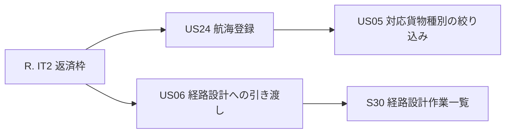
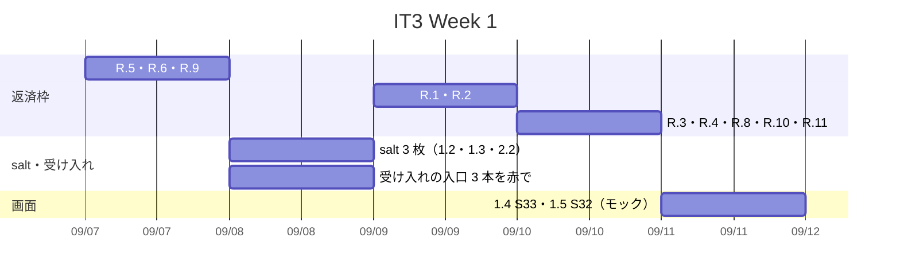
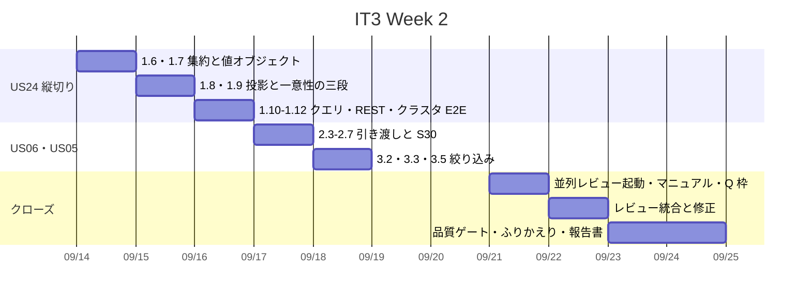
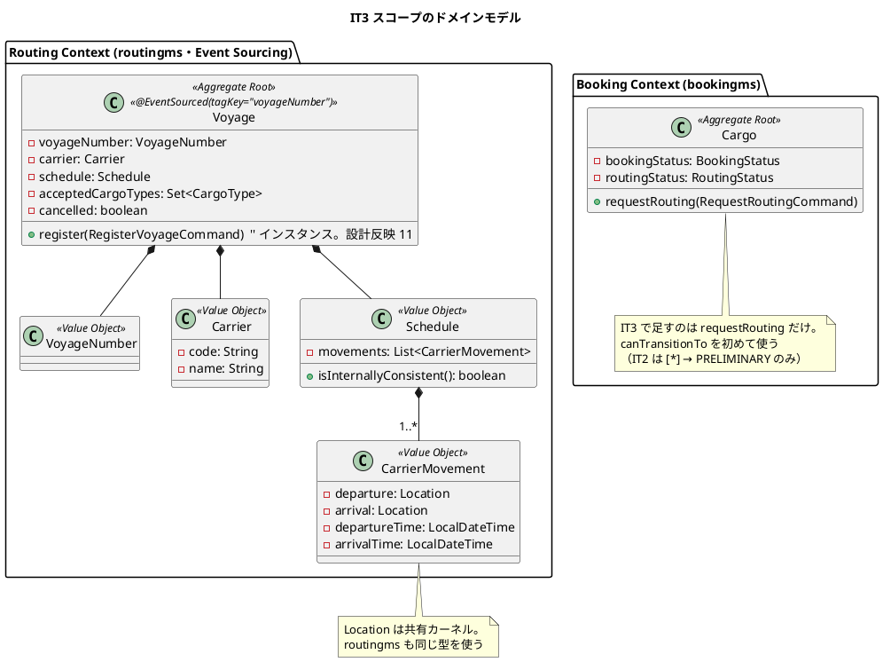
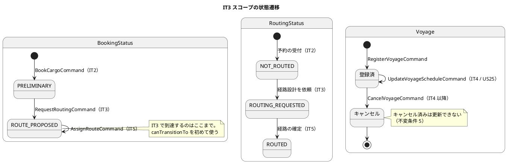
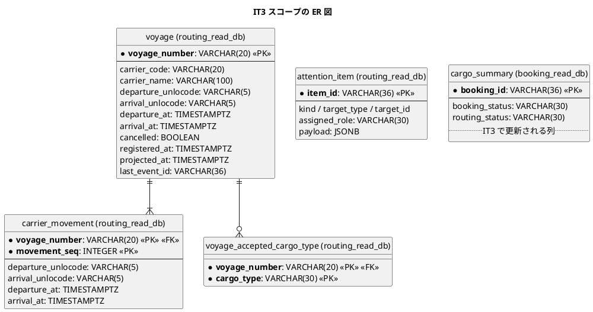
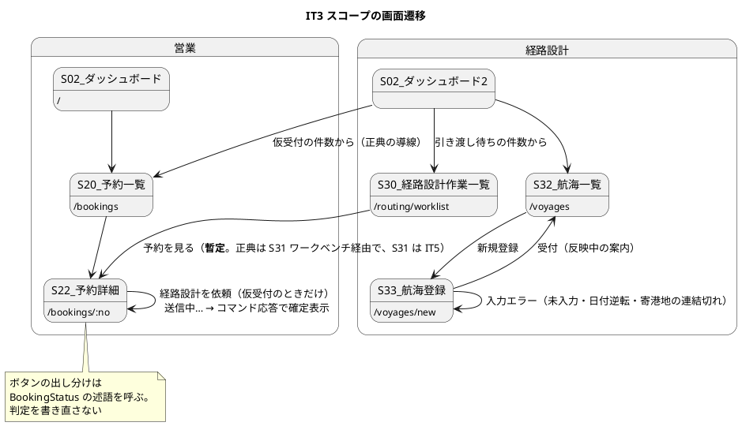

# イテレーション 3 計画 - 危険物・引き渡し・航海登録

## 概要

| 項目 | 内容 |
| :--- | :--- |
| イテレーション | IT3（Release 0.1 予約基盤・**序盤**の最後） |
| 期間 | 2 週間（開発 Day 1-10）+ クローズ Day 11-14（レビュー統合・品質ゲート・報告書・Release 0.1 の締め） |
| ゴール | 2 つ目のサービス（routingms）を bookingms と同じ型で立ち上げ、Release 0.1 を閉じる |
| 目標 SP | 9 SP（US05 3・US06 2・US24 4）+ 返済枠（IT2 の引き継ぎ 12 件）。**コミットメント上限 8 SP を 1 SP 超える**（[リリース計画](release_plan.md)）。Release 0.1 を IT3 で閉じるための意図的な超過で、超えた分は「落とす順序」の先頭から落として吸収する |
| 局面 | 序盤（アウトサイドイン）。[開発戦略](development_strategy.md) を参照 |

## ゴール

### イテレーション終了時の達成状態

1. **2 つ目のサービスが同じ型で立ち上がっている。** routingms が bookingms と同じ形（集約 → イベント → 投影 → クエリ → 画面、`@EventTag`・`@TargetEntityId`・インスタンスのコマンドハンドラ）で動く。**型が同じであることを検査で固定する**（3 つ目のサービスで同じ失敗を繰り返さないため）
2. **予約が経路設計へ渡っている。** 営業が引き渡すと `ROUTE_PROPOSED` になり、経路設計者の作業一覧（S30）に出る。**状態遷移を持つ最初のコマンド**（IT2 は `[*] → PRELIMINARY` だけだった）
3. **危険物・冷凍の予約が正しく扱われている。** 申告なしでは登録できず、対応可能な航海だけが候補になる素地ができている
4. **IT2 の引き継ぎ 12 件が返済されている。** とくに並列レビューの運び（T1）とクラスタ E2E の順序依存
**前提（IT2 クローズ時に確定）。** ADR-0001 決定 2（実績が続かなければ Event Sourcing をやめる）は **発動しませんでした**（IT2 実績 9 SP・100%）。`Voyage` も Event Sourcing 集約として作ります。

5. **Release 0.1 が閉じている。** 全ロールがログインでき、営業担当者が荷主と貨物予約を登録し、経路設計者へ渡せる

### 成功基準

- [ ] デモ項目の受け入れテストがすべて緑
- [ ] `./gradlew build` と `TZ=UTC ./gradlew cleanTest test` が緑
- [ ] フロントの `npm run test`・`npx tsc -b`・`npm run build` が緑
- [ ] **契約テストが 2 サービス起動で往復する**（IT2 から送った 1 件）
- [ ] **kind クラスタで動き、クラスタに対する E2E が緑**（Day 8 に 1 度、クローズ前にもう 1 度）
- [ ] `./gradlew :acceptance-tests:test`（Cucumber + Testcontainers）が緑
- [ ] **Gateway に足した経路が保護されていることを検査した**（IT2 レビュー L3）
- [ ] **局面移行（IT3 序盤 → IT4 中盤・インサイドアウト）の 5 観点を確かめた**（ユビキタス言語・契約の名簿・検査・品質・負債。[開発戦略](development_strategy.md)）
- [ ] **正典の数字と突き合わせた**（IT2 T2）。**赤いゲートも配線を疑った**（T5）
- [ ] `npx gulp okf:check` が ERROR 0
- [ ] SonarQube の Quality Gate がバックエンド・フロントエンドとも PASS
- [ ] **IT3 終了時点でベロシティを再評価した**（routingms の立ち上げコストが乗る。[リリース計画](release_plan.md) の検証計画）

## ユーザーストーリー

### 対象ストーリー

受入基準は [ユーザーストーリー](../../requirements/user_story.md) を正典とし、**複写しません**。

| ID | ストーリー | SP | 優先度 | Issue |
| :--- | :--- | :--: | :---: | :--- |
| US05 | 危険物・冷凍貨物の予約を登録する | 3 | 高 | [#576](https://github.com/k2works/case-study-cargo-tracker/issues/576) |
| US06 | 予約情報を経路設計者に引き渡す | 2 | 高 | [#575](https://github.com/k2works/case-study-cargo-tracker/issues/575) |
| US24 | 航海スケジュールを新規登録する | 4 | 高 | [#574](https://github.com/k2works/case-study-cargo-tracker/issues/574) |
| | **合計** | **9** | | Milestone: [java/take-8] Release 0.1 予約基盤 |

### ストーリー詳細

| ID | として | したい | なぜなら | UC | 受入基準 |
| :--- | :--- | :--- | :--- | :--- | :--- |
| US05 | 営業担当者 | 危険物や冷凍・冷蔵貨物の場合に、特別な追加情報（危険物申告・温度管理条件）を含めて予約を登録したい | 貨物種別に応じた法的要件と取扱い条件を正確に管理し、安全な輸送を保証できるからだ | UC03 | 3 件（[US05](../../requirements/user_story.md)） |
| US06 | 営業担当者 | 仮受付された予約の出発地・目的地・期限・貨物仕様を確認し、経路設計者に引き渡したい | 経路設計者が正確な情報をもとに最適な経路設計を開始できるからだ | UC04 | 4 件（[US06](../../requirements/user_story.md)） |
| US24 | 経路設計者 | 各運送会社が公開している航海スケジュール（航海番号・船名・出発港・到着港・出発日・到着日・寄港地・対応貨物種別）をシステムに新規登録したい | 最新の運航情報をシステムに反映することで、経路候補の算出精度が上がり荷主に正確な経路・所要日数を提案できるからだ | UC19 | 6 件（[US24](../../requirements/user_story.md)） |

**受入基準のうち IT3 で満たさないもの（先に明示します）。**

| ストーリー | 受入基準 | 扱い |
| :--- | :--- | :--- |
| US06 | §3 経路設計者に経路設計依頼の通知が送信される | **送信基盤を持たないので、S30 の件数表示を代替とします。** 通知の扱いは設計反映 10 で正典に書きます |
| US06 | §4 予約情報に不備がある場合、修正してから引き渡せる | **予約編集画面が設計に無いので IT3 では満たしません。** R.5・R.6 と同じ形で、受入基準側に但し書きを付けるか US25 相当の編集ストーリーを起こすかを IT3 で判断します（0.5h、返済枠 R.11） |
| US24 | §6 登録後、UC05（航海スケジュール検索）の検索対象として利用できる | **US07（IT4）に依存します。** US05 §3 と同じ形で IT4 送りと明記します |

**着手時に分かったこと（US05）。** 受入基準 1・2（種別を選ぶと入力欄が現れ必須になる）は **IT2 で実装済み**です。`CargoSpecification` が種別ごとの必須項目を守り、S21 が欄を出し分け、付帯情報が POST に載ることも検査済みです。**残るのは受入基準 3**（特別情報が登録された予約は、経路設計時に対応可能な航海・ルートのみが候補になる）で、これは US24 で `acceptedCargoTypes` を持ってから成立します。

そのため US05 の実質は「**危険物・冷凍の予約が、対応可能な航海だけに絞られる素地を作る**」ことです。経路候補の算出そのものは US08（IT5）なので、IT3 では**航海側が対応貨物種別を持ち、絞り込みのクエリが書ける状態**までを範囲とします。

### 依存関係



US24 を先に置きます。US05 の受入基準 3 は航海が対応貨物種別を持って初めて確かめられ、US06 の引き渡し先（S30）は航海の一覧と並んで経路設計者の入口になるためです。

### タスク

状態は `[x]` 完了・`[~]` 一部（**何が残っているかを必ず書く**）・`[ ]` 未着手の 3 値です。

#### R. IT2 返済枠（SP 対象外・「余力次第」にしない）

IT2 のふりかえり T1〜T8 と引き継ぎ 12 件から。**IT の序盤に独立したコミットで消化**します。

| # | タスク | 由来 | 見積 | 状態 |
| :--- | :--- | :--- | :--: | :--: |
| R.1 | **契約テストの往復（2 サービス起動）。** 対象は **bookingms ↔ billingms**（ゴールデンは `ShipperRegisteredEvent.json` 1 本）。**routingms は購読側なので契約は増えません**（契約イベント 11 本の発行元は bookingms/handlingms/trackingms/billingms）。ゴールデンの一致だけでなく**実際に届くこと**を検査する | 引き継ぎ 1 | 6h | [ ] |
| R.2 | **クラスタ E2E の順序依存を外す。** 各テストが自分で前提を作る。**前回実行の残骸でも緑になる**箇所がある | 引き継ぎ 7 | 3h | [ ] |
| R.3 | 規約テストの入力宣言（他モジュールの `.java`）。Gradle の up-to-date でスキップされうる | 引き継ぎ 8 | 2h | [ ] |
| R.4 | 値オブジェクトの検査を `BusinessRuleViolation` に寄せる。いま `IllegalArgumentException` を広く受けているので、`UUID.fromString` のようなプログラミングエラーが業務規則違反に化ける | 引き継ぎ 9 | 3h | [ ] |
| R.5 | US04 §受入基準 3「希望引渡日」の扱いを決める（設計に置き場が無い）。**US08 の入力になるのは着日側**なので、持つ必要があるかを判断し、不要なら受入基準側を直す | 引き継ぎ 2 | 1h | [ ] |
| R.6 | US04 §受入基準 6（見積との整合）に「US01 実装後」の但し書きを付けるか判断する | 引き継ぎ 3 | 0.5h | [ ] |
| R.7 | `attention_item` の識別子の形（内容から導いた値を UUID の見た目に整形している） | 引き継ぎ 4 | 1h | [ ] |
| R.8 | `everyStatusHasTransitions` の名前が実体より広い（例外が出ないことしか見ない） | レビュー L7 | 0.5h | [ ] |
| R.9 | ADR-0004（デモログイン）の承認と `verify` | 引き継ぎ 5 | 0.5h | [ ] |
| R.10 | **Reaction Handler を入れるなら `ReplayIT` にコマンドの再送を見る検査を足す。** 対応は `ReplayCheckAccompaniesReactionTest` で機械化済みなので、IT3 が Reaction Handler を入れなければ発動しません。**「発動せず」とふりかえりに書く**（黙って数から外さない） | 引き継ぎ 6 | 0.5h | [ ] |
| R.11 | US06 §受入基準 4（不備を修正してから引き渡す）の扱いを決める（予約編集画面が設計に無い） | US06 の未達 | 0.5h | [ ] |
| | 小計 | | 18.5h | |

**引き継ぎ 10・11・12（港のローカル時刻・危険物かつ冷凍・UN/LOCODE のマスタ）は設計の判断が要るので、下の「設計への反映が必要な事項」で扱います。**

#### Q. 検査が働くことの確認（SP 対象外）

| # | タスク | 見積 | 状態 |
| :--- | :--- | :--: | :--: |
| Q.1 | 本 IT で足す検査すべてについて、**実装を壊して赤を見る** | 3h | [ ] |
| Q.2 | デモ項目とテストの対応表を、**テスト名ではなく本文のアサーション**で作る | 1h | [ ] |
| Q.4 | **値を捨てる分岐を探す**（IT2 T3：表示のためだけに運ぶ値はどこか一層で潰しても緑になる）。**設定の重複を探す**（T6：同じ絞りが複数層にあると 1 か所緩めても効かない） | 2h | [ ] |
| Q.3 | **routingms が bookingms と同じ型であることを検査で固定する。** bookingms にある 4 本の IT を routingms にも置く：`ProjectionIdempotencyIT`・`TokenTransactionIT`・`TransactionManagerIT`・`ReplayIT`。あわせて `@EventTag`・`@TargetEntityId`・インスタンスのコマンドハンドラ・Processing Group の列挙を規約テストで固定する。**3 つ目の ES サービス（trackingms / IT8）で同じ失敗を繰り返さない** | 5h | [ ] |
| | 小計 | 11h | |

#### 1. US24 航海スケジュールを新規登録する（4 SP）

| # | タスク | 見積 | 状態 |
| :--- | :--- | :--: | :--: |
| 1.1 | 受け入れの入口を赤で置く：`航海スケジュールの登録.feature`（登録 → 一覧に出る → 同一番号は要確認一覧） | 2h | [ ] |
| 1.2 | S33 航海スケジュール登録（`/voyages/new`）の salt を `ui_design.md` に描く（**実装より先に**）。正典の画面名は「登録・更新」だが **IT3 は登録側のみ**（更新は US25 / IT4） | 1h | [ ] |
| 1.3 | S32 航海スケジュール一覧（`/voyages`）の salt を描く | 1h | [ ] |
| 1.4 | S33 の画面（API は MSW でモック。寄港地を複数・順序つきで入力する）。**モックは本物より甘くしない**（型・日付形式を OpenAPI に合わせ、`202`/`409`/`422` を返せる） | 5h | [ ] |
| 1.5 | S32 の画面（既定は出港済み・キャンセルを外し、出発日が近い順） | 3h | [ ] |
| 1.6 | `Voyage` 集約：`register`。不変条件 1〜4 を `AxonTestFixture` で固定。**`@EventTag(key = "voyageNumber")` を最初から付ける** | 5h | [ ] |
| 1.7 | `VoyageNumber` / `Carrier` / `Schedule` / `CarrierMovement` の値オブジェクト。時刻昇順と港の連結（不変条件 2）、`arrivalTime > departureTime`（3） | 4h | [ ] |
| 1.8 | 投影：`voyage`（V002） / `carrier_movement`（V003） / `voyage_accepted_cargo_type`（V004）。**1 テーブル 1 ファイル**（`data-model.md` の規約）。`V001__create_axon_tables.sql` が `token_entry`。適用済みファイルは編集できないので初回の番号取りを間違えない。**Processing Group `routing-voyage-projection` を `application.yml` に明示列挙する**（列挙漏れは設定ファイル走査で赤。いま `processors:` があるのは bookingms/billingms だけ） | 5h | [ ] |
| 1.9 | 一意性の三段（登録前の存在確認 + 投影の UNIQUE + `attention_item`）。**bookingms と同じ形にする** | 3h | [ ] |
| 1.10 | クエリ：`FindVoyagesQuery` / `FindVoyageQuery`。一覧の既定条件は UI 設計の表に従う | 3h | [ ] |
| 1.11 | REST（`/api/v1/routing/voyages`）と Gateway のルート。**新しく足した経路が保護されていることを検査する**（IT2 レビュー L3：足した経路が未検査だった） | 2h | [ ] |
| 1.12 | モックを実物に差し替え、1.1 の赤が緑になることで縦切りの成立を判定 | 2h | [ ] |
| | 小計 | 36h | |

#### 2. US06 予約情報を経路設計者に引き渡す（2 SP）

| # | タスク | 見積 | 状態 |
| :--- | :--- | :--: | :--: |
| 2.1 | 受け入れの入口を赤で置く：`貨物予約の登録.feature` に「引き渡すと経路提案中になる」を足す | 1h | [ ] |
| 2.2 | S30 経路設計作業一覧（`/routing/worklist`）と **S02 ダッシュボード（経路設計ロール版）** の salt を描く（**実装より先に**）。正典の S02 salt は営業版・荷役版の 2 枚しかなく、向け直す先の仕様が無い | 2h | [ ] |
| 2.3 | `Cargo.requestRouting`：`PRELIMINARY → ROUTE_PROPOSED`、`RoutingStatus = ROUTING_REQUESTED`。**`canTransitionTo` を通す**（IT2 で置いた遷移表を初めて使う） | 3h | [ ] |
| 2.4 | `RequestRoutingCommand` / `RoutingRequestedEvent`。投影が `booking_status` / `routing_status` を更新 | 3h | [ ] |
| 2.5 | S22 予約詳細に `[経路設計を依頼する]`。**ボタンの出し分けは `BookingStatus` の述語をそのまま呼ぶ**（判定を書き直さない） | 3h | [ ] |
| 2.6 | S30 経路設計作業一覧（経路設計ロール）。**データ供給元は bookingms の `/api/v1/bookings` を経路設計ロールに開放する形**（`routing_read_db` に予約の表は無い。ACL は作らず Gateway のルートとロールで開ける）。既定は設計済（`ROUTED`）を外し、誤配は含める。**並び順は誤配 → 到着期限が近い順**（`ui_design.md` 画面一覧）。並び順を消したら赤になる検査を置く | 4h | [ ] |
| 2.7 | ダッシュボードに S30 への導線を足す（S20 への導線は残す）。**同じ変更で `ui_design.md` の該当記述も直す**（設計反映 7） | 1h | [ ] |
| 2.8 | **サイドナビ（`shared/ui/navigation.ts`）に S30・S32・S33 を経路設計ロール限定で足す。** `AppLayout.test.tsx` にロール別の表示検証を置き、`routes.tsx` のロールガードと突き合わせる。**画面の到達性の正典は `navigation.ts`** | 2h | [ ] |
| | 小計 | 19h | |

#### 3. US05 危険物・冷凍の絞り込みの素地（3 SP）

| # | タスク | 見積 | 状態 |
| :--- | :--- | :--: | :--: |
| 3.1 | 受け入れの入口を赤で置く：「危険物に対応しない航海は候補に出ない」 | 1h | [ ] |
| 3.2 | 航海の対応貨物種別を S33 で入力し、投影に持つ（1.8 と同時） | 2h | [ ] |
| 3.3 | `FindVoyagesQuery` に貨物種別の絞り込みを足す。**空なら一般貨物のみ**（不変条件 4） | 3h | [ ] |
| 3.4 | 危険物・冷凍の予約から S30 → 航海一覧へ行くと、対応する航海だけが出ることを画面から確かめる | 3h | [ ] |
| 3.5 | US05 §受入基準 1・2 が IT2 の実装で満たされていることを、受け入れ層で確かめる（**実装済みでも固定されているとは限らない**） | 2h | [ ] |
| | 小計 | 11h | |

#### 4. ユーザーマニュアル（SP 対象外・画面を伴う IT なので毎回計上）

| # | タスク | 見積 | 状態 |
| :--- | :--- | :--: | :--: |
| 4.1 | 対象章：07 航海スケジュールを登録する（新規）・08 経路設計に引き渡す（新規）・05 に危険物と冷凍の節を追加・00 の「担当と使える画面」を更新 | 5h | [ ] |
| 4.2 | 画面キャプチャの再生成（S30・S32・S33）。**本文の更新は 1.4・1.5・2.6 の変更の中で行い、ここは撮り直しだけ**（IT2 T7：画面を変えたらその変更の中でマニュアルを見る。IT の終わりにまとめて見ない） | 2h | [ ] |
| | 小計 | 7h | |

### タスク合計

| カテゴリ | SP | 理想時間 | 備考 |
| :--- | :--: | :--: | :--- |
| ユーザーストーリー（US24 36h・US06 19h・US05 11h） | 9 | 66h | 1 SP ≒ 7.3h |
| IT2 返済枠（R） | — | 18.5h | 「余力次第」にしない |
| 検査の確認（Q） | — | 11h | routingms に投影 4 本の IT を置く分 |
| ユーザーマニュアル（4） | — | 7h | 本文は各画面タスクの中で。ここは撮り直し |
| **合計** | **9** | **102.5h** | |

**102.5h は開発 10 営業日に収まりません。** IT1 は 130h、IT2 は 93.5h で、いずれも収まらないまま完走しています。落とす順序を先に決めます。

#### スコープを落とす順序

**「依存で着手できない順」で作ります**（IT2 の T3）。

| 順 | 落とすもの | 送り先 | 依存で着手できない理由 |
| :--- | :--- | :--- | :--- |
| 1 | 3.4 危険物の絞り込みを画面から確かめる（3h） | IT5 | 経路候補の算出（US08）が無いと、絞り込みの効果は航海一覧でしか見えない。US08 と同じ IT で見るほうが実際の使われ方に近い |
| 2 | 1.5 S32 航海一覧（3h のうち検索条件の部分） | IT4 | US07（航海スケジュール検索）が IT4 にある。検索条件は US07 で入れるほうが二度手間にならない |
| 3 | R.7 `attention_item` の識別子の形（1h） | IT4 | 実害が無い |
| 4 | 4. ユーザーマニュアル（7h） | **落とさない** | IT1 で順序 1 に置いたのに落ちず、IT2 でも落ちなかった。実績どおり落とさない |
| 5 | Q.4 値を捨てる分岐・設定の重複を探す（2h） | IT4 | 検証で 9h 増えた分の吸収先。T3・T6 は「探す」枠なので、対象が増える IT4 に送るほうが実入りが大きい（[落とした負債は育つ]の逆で、対象が増える側に置く） |

**R.1 契約テストの往復・R.2 クラスタ E2E の順序依存・US24 の縦切り（1.6〜1.12）・US06 の引き渡し（2.3〜2.6）は落としません。** R.1 は IT2 から送った 1 件で 2 IT 連続の繰越を避けるため、R.2 は「前回の残骸で緑」が今も残っているため、あとの 2 つは IT3 の目的そのものです。

## スケジュール

### Week 1



| 日 | タスク | アウトサイドインの位置づけ |
| :--- | :--- | :--- |
| Day 1 | R.5・R.6（設計の判断）→ R.9 ADR-0004 → 1.2・1.3・2.2 **salt を 3 枚描く**（実装より先に） | 着手前の不確実性の除去 |
| Day 2 | 1.1・2.1・3.1 **受け入れの入口を 3 本とも赤で置く** | Phase 1 |
| Day 3 | R.1 契約テストの往復・R.2 クラスタ E2E の順序依存 | 返済枠（序盤に独立コミットで） |
| Day 4 | R.3・R.4・R.8 | 返済枠 |
| Day 5 | 1.4 S33 航海登録・1.5 S32 一覧（API はモック） | Phase 2：UI から API の契約を決める |

### Week 2



| 日 | タスク | アウトサイドインの位置づけ |
| :--- | :--- | :--- |
| Day 6 | 1.6・1.7 `Voyage` 集約と値オブジェクト | Phase 4：ドメインの内側 |
| Day 7 | 1.8・1.9 投影と一意性の三段 | Phase 5：永続化と投影 |
| Day 8 | 1.10〜1.12 クエリと REST → **クラスタ E2E を 1 度回す**（IT2 では終わりにだけ回して修正がクローズを押した） | 判定 |
| Day 9 | 2.3〜2.7 引き渡しと S30 | Phase 3・4 |
| Day 10 | 3.2・3.3・3.5 対応貨物種別の絞り込み | Phase 4・5 |
| Day 11 | **並列レビューを起動**（結果は 35〜40 分で届く）→ 待つあいだに 4.2 キャプチャ撮り直し・Q.1〜Q.3 | クローズの準備 |
| Day 12 | 遅着したレビューを統合して修正 | クローズ |
| Day 13-14 | 品質ゲート・ふりかえり・報告書・同期。**Release 0.1 の締め** | クローズ |

**Day 11 に並列レビューを起動するのが要です。** IT1・IT2 はどちらもクローズ確定後に届き、遅着分に実欠陥がありました（IT2 は高 6 件）。40 分以上前に起動すれば、待ち時間がクローズ作業に吸収されます。

## 設計

設計は `docs/design/cargo-tracker/` が正典です。本計画には複写しません。

| トピック | 正典 |
| :--- | :--- |
| `Voyage` 集約・不変条件・`RouteSearchService` | [ドメインモデル設計](../../design/cargo-tracker/domain-model.md) |
| `voyage` / `carrier_movement` / `voyage_accepted_cargo_type` | [データモデル設計](../../design/cargo-tracker/data-model.md) |
| S30・S32・S33 と一覧の既定の絞り込み | [UI 設計](../../design/cargo-tracker/ui_design.md) |
| サービス分割・パッケージ構成 | [バックエンドアーキテクチャ](../../design/cargo-tracker/architecture_backend.md) |

### 対象スコープの設計図

#### ドメインモデル図（IT3 スコープ）



**`CargoType` は BC ごとに別の型です。** routingms の `acceptedCargoTypes` は Routing Context の `CargoType` で、bookingms のものとは別に定義します（[ドメインモデル](../../design/cargo-tracker/domain-model.md)「共有カーネルの範囲」— 識別子と列挙は共有カーネルに置かない）。**同じ名前の別の型を持つことは重複ではなく、境界を分けた代金です。**

#### 状態遷移図（IT3 スコープ）



#### ER 図（IT3 スコープ）



**`attention_item` を routing_read_db にも置きます。** 定義は `booking_read_db` と同一で、一意性の三段の 3 段目です。ただし **`data-model.md` の複製先は現時点で `tracking_read_db`・`billing_read_db` だけ**なので、正典に無いテーブルに依存しないよう設計反映事項 8 で追記します（[データモデル](../../design/cargo-tracker/data-model.md)）。**IT2 で見つけた「識別子を内容から導く」形を最初から入れます**（`UUID.randomUUID()` にするとリプレイで増える）。

#### 画面遷移図（IT3 スコープ）



**経路設計者のダッシュボード導線を S30 に足します（S20 は残します）。** 経路設計者が毎朝見るべきは「引き渡し待ちの予約」であり、全予約の一覧（S20）だけでは仕事が始まりません（IT2 レビュー L10「予約詳細から次にできることが何もない」）。ただし **`ui_design.md` は「経路設計担当もこの一覧（S20）を開く」と明記している**ので、計画側で置き換えず、下の設計反映事項 7 で正典を同じ変更で書き換えます。

**S33 は登録側のみ**です（正典の画面名は「航海スケジュール登録・更新」で、更新の `/voyages/:no/edit` は US25 / IT4）。

### API 設計

routingms の REST は bookingms と同じ形（`/api/v1/<bc>/<resource>`）です。Gateway のルートを同じ変更で足します。

| メソッド | エンドポイント | 説明 | ロール |
| :--- | :--- | :--- | :--- |
| POST | `/api/v1/routing/voyages` | 航海スケジュールを登録する。同一航海番号があれば 409（`ILLEGAL_STATE`）、不変条件違反は 422（`BUSINESS_RULE_VIOLATION`） | 経路設計 |
| GET | `/api/v1/routing/voyages` | 航海一覧。既定は出港済み・キャンセルを外し、出発日が近い順。`cargoType` で対応貨物種別を絞る（US05 §3） | 経路設計 |
| GET | `/api/v1/routing/voyages/{voyageNumber}` | 航海 1 件 | 経路設計 |
| GET | `/api/v1/routing/attention-items` | 要確認一覧（一意性の三段の 3 段目） | 経路設計 |
| POST | `/api/v1/bookings/{bookingId}/routing-request` | 経路設計を依頼する。仮受付でなければ 409 | 営業 |
| GET | `/api/v1/bookings?status=ROUTE_PROPOSED` | S30 経路設計作業一覧の元。設計済（`ROUTED`）を外し誤配は含める | 経路設計 |

### ADR

| # | 決定 | 状態 | 本 IT での扱い |
| :--- | :--- | :--- | :--- |
| ADR-0004 | デモログイン | draft | R.9 で承認と `verify` |
| （候補） | `CarrierMovement` の時刻を港のローカル時刻で持つか `Instant` + タイムゾーンか | 未起票 | 設計反映 2 で判断し、**構造が変わるなら ADR を起こす** |
| （候補） | 危険物かつ冷凍を扱う `CargoSpecification` の形 | 未起票 | 設計反映 3 で判断だけする（実装は US08 以降） |

### ディレクトリ構成

bookingms と同じ並びにします（Q.3 の検査対象）。

```text
apps/cargo-tracker/backend/routingms/src/main/java/com/example/cargotracker/routing/
├── domain/model/
│   ├── aggregates/Voyage.java              @EventSourced(tagKey = "voyageNumber")
│   ├── valueobjects/{VoyageNumber,Carrier,Schedule,CarrierMovement,CargoType}.java
│   ├── commands/{RegisterVoyageCommand}.java   @TargetEntityId
│   └── events/{VoyageRegisteredEvent}.java     @EventTag(key = "voyageNumber")
├── infrastructure/
│   ├── projection/{VoyageProjection,AttentionItemRecorder}.java
│   └── query/RoutingQueryHandler.java
└── interfaces/rest/{VoyageController,ApiExceptionHandler}.java
```

### 設計への反映が必要な事項

**設計が正**なので、計画側で代替せず当該 IT で設計に反映します。

| # | 事項 | 対象 | 対応 |
| :--- | :--- | :--- | :--- |
| 1 | S30・S32・S33 の salt が `ui_design.md` に無い（画面一覧の行はある） | [UI 設計](../../design/cargo-tracker/ui_design.md) | **実装より先に描く**（タスク 1.2・1.3・2.2）。IT1・IT2 とも実装後に描いて順序が逆だった |
| 2 | **航海の時刻の型が 3 文書で食い違う。** `domain-model` は `LocalDateTime`、`data-model` は `TIMESTAMPTZ`、`non_functional` は「港のローカル時刻で入力・表示し JST を併記、**保存は `TIMESTAMPTZ`**」と既に決めている | [ドメインモデル](../../design/cargo-tracker/domain-model.md)・[データモデル](../../design/cargo-tracker/data-model.md)・[非機能要件](../../design/cargo-tracker/non_functional.md) | **既決規約を航海に適用し、2 文書の食い違いを解消する**（新たな判断ではない）。US08（IT5）の経路探索が入る前に閉じる |
| 3 | **危険物かつ冷凍**の貨物が実務にある。`CargoSpecification` は種別 1 つしか持てない | ドメインモデル・ユーザーストーリー | **IT3 で判断だけする。** 実装は US08 以降。種別を集合にするか、危険物申告と温度条件を独立させるか |
| 4 | UN/LOCODE は形式しか見ておらず `AAAAA` でも通る | 共有カーネル | **港のマスタを持つ IT で。** `shared` のリソース（CSV）から読む方針は `data-model.md` にある。US07（IT4）で航海を検索するときに要る |
| 5 | US04 §受入基準 3「希望引渡日」の置き場 | ユーザーストーリー・ドメインモデル | R.5 で判断する |
| 6 | US04 §受入基準 6（見積との整合）の但し書き | ユーザーストーリー | R.6 で判断する |
| 7 | **経路設計者のダッシュボード導線。** `ui_design.md` は「経路設計担当も S20 を開く」と書いており、S30 を足す本 IT の変更と食い違う | [UI 設計](../../design/cargo-tracker/ui_design.md) | **タスク 2.7 と同じ変更で正典を書き換える。** 書き換えないと DoD の「4 点一致」が正典と食い違ったまま緑になる |
| 8 | **`attention_item` の複製先に `routing_read_db` が無い。** テーブル一覧・備考・`routing-voyage-projection` の書き込み先の 3 か所 | [データモデル](../../design/cargo-tracker/data-model.md) | **タスク 1.9 と同じ変更で追記する** |
| 9 | **`Carrier` の要素表がフィールド未定義。** 投影の `carrier_code` / `carrier_name` に対応する `code` / `name` を持つ | [ドメインモデル](../../design/cargo-tracker/domain-model.md) | タスク 1.7 と同じ変更で追記する |
| 11 | **`Voyage.register` が `{static}` のまま。** IT2 の H1（static ハンドラが勝つと 2 度目の受付が素通りする）と衝突し、`Shipper` では同じ直しを済ませたのに正典が未更新 | [ドメインモデル](../../design/cargo-tracker/domain-model.md) | **タスク 1.6 と同じ変更で `{static}` を外す** |
| 12 | **船名の置き場が設計に一切無い**（4 文書で「船名 / vessel」0 件）。US24 §受入基準 1 は必須入力として要求 | ドメインモデル・データモデル・[UI 設計](../../design/cargo-tracker/ui_design.md) | **IT3 で判断する。** `Voyage` に `vessel` を持つか受入基準側を直すか。持つなら要素表・ER 図・S33 salt の 3 つに同じ変更で反映 |
| 13 | **要素表のドリフト。** `RouteSearchService`・`VoyageGraph`・`TransitPath`・`Carrier`・`Schedule` がクラス図にしか無く、コア概念表に定義行が無い。Routing の `CargoType` も BC 固有の列挙として登録されていない | [ドメインモデル](../../design/cargo-tracker/domain-model.md) | **タスク 1.6・1.7 と同じ変更でコア概念表に足す。** あわせて「共有カーネルに置かないもの」の列挙に**列挙型**を明記する（計画が引いていた根拠が本文に無かった） |
| 14 | **画面一覧に「サイドナビ掲載」列が無い。** 表示ロール列はあるが、ナビに載る画面と載らない画面を正典から読み取れず、DoD の 4 点一致を機械的に確かめられない | [UI 設計](../../design/cargo-tracker/ui_design.md) | **タスク 2.8 と同じ変更で列を足し、`navigation.ts` と 1 対 1 で突合できるようにする** |
| 10 | **US06 §受入基準 3（経路設計者への通知）が「通知はスコープ外・記録だけ」の対象 US に入っていない**（列挙は US12・US14・US23・US29・US30） | ユーザーストーリー・[UI 設計](../../design/cargo-tracker/ui_design.md) | **IT3 で判断する。** US06 を同じ扱いに加えるか、S30 の件数表示を通知の代替と位置づけるかを決め、同じ変更で正典に書く |

## リスクと対策

| リスク | 影響度 | 対策 |
| :--- | :---: | :--- |
| **2 つ目のサービスの立ち上げで、bookingms と違う形になる** | **高** | Q.3 で「同じ型であること」を検査に落とす。`@EventTag`・`@TargetEntityId`・投影の冪等・`ReplayIT` は bookingms で得た知見なので、routingms では**最初から**入れる。3 つ目のサービス（IT8 の trackingms）で同じ失敗を繰り返さない |
| routingms の立ち上げコストでベロシティが落ちる | 中 | [リリース計画](release_plan.md) の検証計画（IT3 終了時点の平均が 8 SP を下回ったら期日を動かす）で判定する。**ストーリーを削らず期日を動かす** |
| 返済枠 17.5h が本体を圧迫する | 中 | Day 3-4 に固め、Day 5 時点で「落とす順序」の 1・2 を判断する |
| 並列レビューがまた遅れる | 低 | Day 11 に起動する。40 分以上前なら待ち時間がクローズ作業に吸収される |
| Release 0.1 の締めが IT3 の末に集中する | 中 | リリース完了報告書は IT3 のクローズと**同じ週**に作る。US01（見積）と US25（航海更新）は Release 0.1 に含まれないことを確認済み |

## 完了条件

### Definition of Done

- [ ] US05・US06・US24 の受入基準（`user_story.md`）を満たす（US05 §3 は「設計への反映が必要な事項」の判断に従う）
- [ ] デモ項目の受け入れテストがすべて緑。**対応はテスト名でなく本文のアサーションで確かめる**
- [ ] IT2 の引き継ぎ 12 件が返済されている、または「落とす順序」に従って送った理由がふりかえりに書かれている
- [ ] 本 IT で足した検査を壊して赤を見た（Q.1）
- [ ] **routingms が bookingms と同じ型であることが検査で固定されている**（Q.3）
- [ ] `./gradlew build` が緑
- [ ] `TZ=UTC ./gradlew cleanTest test` が緑
- [ ] フロントの `npm run test`・`npx tsc -b`・`npm run build` が緑
- [ ] **契約テストが 2 サービス起動で往復する**
- [ ] UI 設計・navbar・ダッシュボード・到達性テストの 4 点が一致している（本 IT で足した S30・S32・S33 について）
- [ ] **一覧から開く画面（ナビに載せない）のロール制御も検査されている**（IT2 レビュー M6 で見つけた漏れ）
- [ ] 追加した各画面を、**そのロールで実際に 1 回開いた**
- [ ] **kind クラスタで動く**：イメージを作り直して載せ直し、全 Pod が Ready
- [ ] **クラスタに対して E2E が緑**（Day 8 とクローズ前の 2 回）
- [ ] `npx gulp okf:check` が ERROR 0
- [ ] SonarQube の Quality Gate がバックエンド・フロントエンドとも PASS、`mkdocs build` が成功する
- [ ] ユーザーマニュアルの該当章が更新され、画面キャプチャが再生成されている
- [ ] **並列レビューを Day 11 に起動し、その結果を統合してからクローズを確定した**
- [ ] **IT3 終了時点でベロシティを再評価した**（リリース計画の検証計画）
- [ ] ふりかえり（`retrospective-3.md`）と完了報告書（`iteration_report-3.md`）を作成した
- [ ] **Release 0.1 の完了報告書を作成した**（`creating-release-report`）

### デモ項目

イテレーションレビューで実演します。**この 7 件をそのままパスする受け入れテストが、IT3 の受け入れ基準です。**

| # | 見せるもの | 役割 | 対応 |
| :--- | :--- | :--- | :--- |
| 1 | 経路設計者が航海を登録 → 一覧に出る → 寄港地が順に並ぶ | 経路設計者 | US24 |
| 2 | **出発日が到着日より後の航海は断られる**（不変条件 3） | 経路設計者 | US24 §受入基準 4 |
| 3 | **寄港地の連結が切れた航海は断られる**（前の到着港と次の出発港が違う） | 経路設計者 | **不変条件 2**（US24 §2 は「入力できる」であって拒否側の基準ではない） |
| 4 | **同じ航海番号をもう 1 件登録 → 断らずに問いかけ → 続けると要確認一覧に出る** | 経路設計者 | **不変条件 1（一意性の三段）**（US24 §5 は成功側の基準） |
| 5 | 営業が予約詳細から経路設計を依頼 → 状態が「経路提案中」→ 経路設計者の作業一覧に出る | 営業・経路設計 | US06 |
| 6 | **仮受付でない予約には「経路設計を依頼する」が出ない。** 出ていない状態で API を叩くと 409 | 営業 | US06・`canTransitionTo` |
| 7 | 危険物に対応しない航海は、危険物の絞り込みで候補に出ない | 経路設計者 | US05 §受入基準 3。**受け入れ層はタスク 3.3（`FindVoyagesQuery` の絞り込み）で固定する。**「落とす順序」1 で 3.4（画面から確かめる）を IT5 へ送っても、この項目の検査は残る |

デモ項目 2・3・4・6 は「拒否・失敗する側」です。**安全装置は働くことを見せて初めて入ったと言えます。**

## 更新履歴

| 日付 | 更新内容 | 更新者 |
| :--- | :--- | :--- |
| 2026-09-04 | 初版作成。IT2 のふりかえり Try 8 件と引き継ぎ 12 件を返済枠・検査確認枠・DoD に反映 | claude-code/claude-opus-5 |
| 2026-09-04 | `validating-iteration-plan`（8 ステップ）と `validating-design`（3 軸）の検証結果を反映。OKF フロントマター追加、US24 のストーリー文を正典に一致、R.1 の対象を bookingms ↔ billingms に訂正、R.10・R.11 追加（引き継ぎ 12 件を数え直し）、Q.3 を投影 4 本の IT の具体名に、Q.4 追加、navbar タスク 2.8 新設、S30 のデータ供給元を明記、設計反映事項を 6 件 → 14 件、デモ項目 3・4 の受入基準対応を不変条件に付け替え、見積 93.5h → 102.5h | claude-code/claude-opus-5 |

## 関連ドキュメント

- [リリース計画](release_plan.md)、[開発戦略](development_strategy.md)
- [イテレーション計画 2](iteration_plan-2.md)、[ふりかえり 2](retrospective-2.md)、[完了報告書 2](iteration_report-2.md)
- [IT2 実装レビュー](../../review/cargo-tracker/IT2実装_review_20260904.md)
- [ユーザーストーリー](../../requirements/user_story.md)
- [設計](../../design/cargo-tracker/index.md)、[ADR](../../adr/cargo-tracker/index.md)
