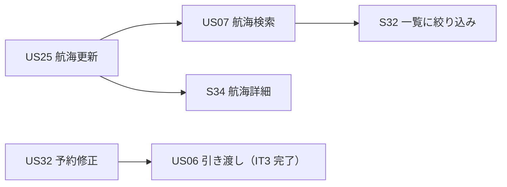
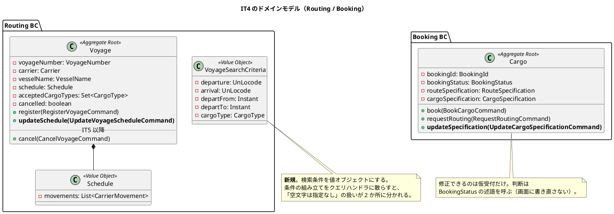
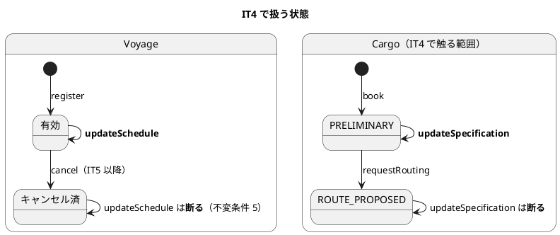
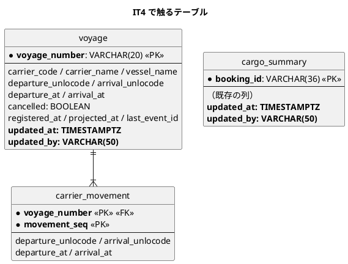
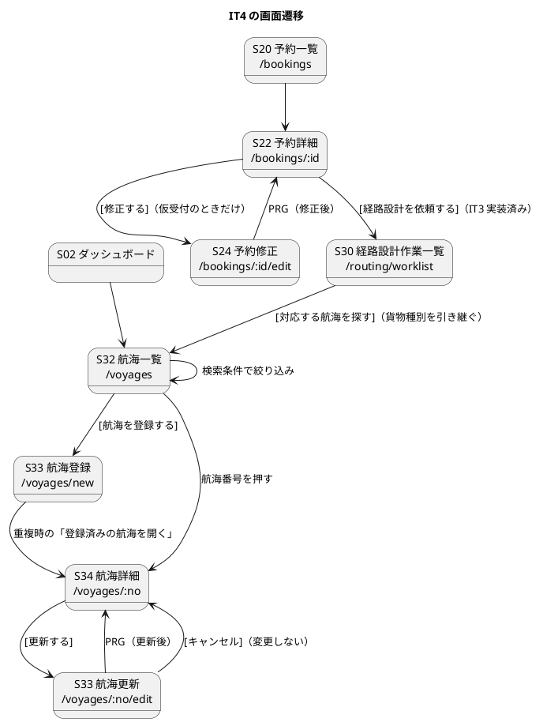

# イテレーション 4 計画 - 航海の更新と検索・予約の修正

## 概要

| 項目 | 内容 |
| :--- | :--- |
| イテレーション | IT4（Release 0.2 経路設計と予約確定・**中盤**の最初） |
| 期間 | 2 週間（開発 Day 1-10）+ クローズ Day 11-14 |
| ゴール | 登録した情報を**直せる・探せる**ようにする。集約に「更新」の判断を置き、画面から導かない |
| 目標 SP | 8 SP（US25 3・US07 3・US32 2）+ 負債枠 2（[リリース計画](release_plan.md)） |
| 局面 | **中盤（インサイドアウト）**。[開発戦略](development_strategy.md) を参照 |

**序盤から中盤への移行イテレーションです。** アプローチが変わります（アウトサイドイン → インサイドアウト）。移行の 5 観点は下記「局面移行の確認」に記録しました。

## ゴール

### イテレーション終了時の達成状態

1. **登録したものを直せる。** 航海スケジュール（US25）と仮受付の予約（US32）を更新できる。**更新は登録と同じ検査を通る**。「作れるが直せない」状態を抜ける
2. **登録したものを探せる。** 出発地・目的地・出発期間・貨物種別で航海を絞り込める（US07）。IT3 で「絞り込みは今後追加されます」と出していた欄が実際に働く
3. **集約が更新の判断を持っている。** キャンセル済みの航海は更新できない（不変条件 5）、仮受付より先へ進んだ予約は修正できない。**この判断は画面にも投影にも置かない**
4. **IT3 の引き継ぎのうち負債 6 件が返済されている**（負債枠 2）

### 成功基準

- [x] デモ項目の受け入れテストがすべて緑
- [x] `TZ=UTC ./gradlew build` が緑（JaCoCo の層別閾値を含む）
- [x] フロントの `npm run test`・`npx tsc -b`・`npm run build` が緑
- [x] `./gradlew :acceptance-tests:test` が緑
- [x] **クラスタ E2E を Day 8 に 1 度、クローズ前にもう 1 度回した**（IT2・IT3 と 2 回続けて未達。3 回目の宿題）
- [x] **足した検査を壊して赤を見た**、かつ**検査の Javadoc に書いた方針どおりでない書き方を 1 つ食わせて赤を見た**（IT3 の T4）
- [x] **書いた保証（「〜で守る」「〜まで比べる」）を、その変更の中で破って赤を見た**（IT3 の T3）
- [x] **値オブジェクトが本番経路を通ることを検査した**（IT3 の T5）
- [x] **記録する先を足したら読み口も同じ変更で足した**（IT3 の T6）
- [x] **画面に出す件数・一覧について「これはその人の仕事か」を確かめた**（IT3 の T7）
- [x] SonarQube の Quality Gate がバックエンド・フロントエンドとも PASS
- [x] `npx gulp okf:check` が ERROR 0
- [ ] ユーザーマニュアルの該当章が更新され、画面キャプチャが再生成されている
- [x] **並列レビューをクローズの最初に起動し、切れていないか表の最終行を確かめてから統合した**（IT3 の T1・T2）
- [ ] **Release 0.1 の完了報告書を作成した**（IT3 の DoD からの持ち越し）

## ユーザーストーリー

### 対象ストーリー

受入基準は [ユーザーストーリー](../../requirements/user_story.md) を正典とし、**複写しません**。

| ID | ストーリー | SP | 優先度 | 対応 UC | Issue |
| :--- | :--- | :--: | :--- | :--- | :--- |
| US25 | 既存航海スケジュールを更新する | 3 | 高 | UC19 | [#577](https://github.com/k2works/case-study-cargo-tracker/issues/577) |
| US07 | 航海スケジュールを検索する | 3 | 高 | UC05 | [#578](https://github.com/k2works/case-study-cargo-tracker/issues/578) |
| US32 | 仮受付の予約情報を修正する | 2 | 中 | UC03・UC04 | [#579](https://github.com/k2works/case-study-cargo-tracker/issues/579) |
| | **合計** | **8** | | | |

マイルストーンは **[java/take-8] Release 0.2 経路設計と予約確定**（IT4〜IT7・35 SP）です。Release 0.1 のマイルストーンは IT3 のクローズで締めました（9 件すべて完了）。

### ストーリー詳細

#### US25 既存航海スケジュールを更新する（3 SP）

**中盤の最初のストーリーとして、集約から作ります。** `Voyage.updateSchedule` が不変条件 2・3・5 を守り、**画面はその判断を持ちません**。

受入基準の「差分が確認画面に表示される」は**画面の仕事**ですが、差分の計算そのものは「更新前の集約の状態」と「更新後の入力」の比較なので、**画面に出す前にサーバが返す形**にします。画面で 2 つの値を並べて `if` を書くと、属性が増えたときに比べ忘れます（IT3 で投影の「丸ごと比較」がヘッダだけだった件と同じ形）。

**航海詳細画面（S34）をこのストーリーで作ります。** IT3 のレビューで「登録した中身を確認できない」「409 の案内が指す先が無い」と指摘されました。更新画面は詳細から入るので、ここで自然に埋まります。

#### US07 航海スケジュールを検索する（3 SP）

受入基準の「制約条件に基づいて利用可能な航海が表示される」のうち、**港湾制約と経路探索は US08（IT5）です。** IT4 で扱うのは航海スケジュール自身の条件（出発地・目的地・出発期間・貨物種別）に限ります。この線引きを計画に明記します。

「予約番号を指定して出発地・目的地・期限・貨物仕様を確認できる」は S30 → S34 の導線として実装します（IT3 のレビューで「S30 から貨物種別を引き継がない」と指摘された件の受け皿）。

#### US32 仮受付の予約情報を修正する（2 SP）

**`adjustRouteSpecification`（US10・経路条件の調整）とは別物です。** あちらは経路設計者が候補を出し直すために条件を動かすもので、US32 は営業が入力の誤りを直すものです。名前が近いので、コマンド名は `UpdateCargoSpecificationCommand` にして取り違えを避けます。

`Cargo.updateSpecification` が「仮受付だけ修正できる」を守ります。**遷移表（`BookingStatus`）の述語をそのまま呼びます**（IT3 で `canRequestRouting` に使った形）。

「修正の履歴が残る」はイベント（`CargoSpecificationUpdatedEvent`）そのものが履歴なので、**別のテーブルを作りません**。画面に出すときは Event Store から読むのではなく、投影に「最終更新日時・更新者」を持たせます。

### 依存関係

US25 を先に作ると、S34（詳細）が US07 の検索結果からの遷移先として使えます。US32 は独立です。

## 設計

### 対象スコープの設計図

#### ドメインモデル図（IT4 スコープ）

**`VoyageSearchCriteria` は新規の値オブジェクトです。** [ドメインモデル設計](../../design/cargo-tracker/domain-model.md) の要素表には**開始準備の時点で追加しました**（下記「設計への反映が必要な事項」）。

#### 状態遷移図（IT4 スコープ）

**`Voyage` の「有効 / キャンセル済」は集約が持ちます。** IT3 のレビューで「`cancelled` が定義済み未使用で、投影とドメインのどちらが正か決まっていない」と指摘されました。**集約が正**とし、投影は集約のイベントから写すだけにします。

#### ER 図（IT4 スコープ）

**`updated_at` / `updated_by` を投影に足します。** 「修正の履歴が残る」（US32 §受入基準 4）を画面に出すためです。**履歴そのものは Event Store が持ちます**。投影に持たせるのは最終更新の 2 列だけで、変更内容の履歴テーブルは作りません。

**`carrier_movement` は更新時に全行を入れ替えます**（[データモデル設計](../../design/cargo-tracker/data-model.md) の既定）。

#### 画面遷移図（IT4 スコープ）

**更新画面は S33 です。** [UI 設計](../../design/cargo-tracker/ui_design.md) の画面一覧では S33 が「航海スケジュール登録・**更新**」（`/voyages/new`, `/voyages/:no/edit`）を兼ねています。**正典に合わせ、更新用の画面 ID は新設しません。**

**新規なのは S34（航海詳細）と S24（予約修正）です。** どちらも正典の画面一覧に無く、IT3 のレビューで欠落として指摘されました（「登録した中身を確認できない」「409 の案内が指す先が無い」）。画面一覧への追加が要ります（下記）。

### API 設計

| メソッド | パス | 用途 | ロール |
| :--- | :--- | :--- | :--- |
| `PUT` | `/api/v1/routing/voyages/{voyageNumber}` | 航海スケジュールの更新（US25） | ROLE_ROUTING |
| `GET` | `/api/v1/routing/voyages/{voyageNumber}/diff` | 更新前後の差分（US25 §受入基準 2） | ROLE_ROUTING |
| `GET` | `/api/v1/routing/voyages` | 検索条件つき一覧（US07。既存に条件を足す） | ROLE_ROUTING |
| `PUT` | `/api/v1/booking/bookings/{bookingId}` | 予約情報の修正（US32） | ROLE_SALES |

**新しい経路を足したら `RoleAuthorization` の宣言表にも足します**（[ADR-0006](../../adr/cargo-tracker/0006-role-authorization-at-the-gateway.md)）。忘れると 403 になって動きません（黙って通るのではないので気づけます）。`PUT /voyages/{no}` は既存の `/api/v1/routing/voyages/**`（ROLE_ROUTING）に含まれます。`PUT /bookings/{id}` は既存の `/api/v1/booking/bookings/**`（営業・経路設計・追跡）に含まれるため、**営業だけに絞る宣言を先に置く必要があります**（`/bookings/*/routing-request` と同じ扱い）。

差分の計算をサーバに置く理由は、上の US25 の項に書いたとおりです。

### 契約への影響

**契約イベントは増えません。** `VoyageScheduleUpdatedEvent` と `CargoSpecificationUpdatedEvent` はいずれも BC の内側で閉じます（他サービスが購読しません）。契約の名簿（イベント 11・コマンド 2・クエリ 1）は変わらないので、ADR は不要です。

### ADR

**新規の ADR は予定していません。** 判断が要りそうな点を先に挙げます。

| 論点 | 現時点の方針 | ADR にするか |
| :--- | :--- | :--- |
| 更新の差分をサーバで計算するか画面で並べるか | サーバ。画面で `if` を積むと属性が増えたとき比べ忘れる | 判断が他 BC にも波及したら起票 |
| 修正の履歴を専用テーブルに持つか | 持たない。Event Store が履歴。投影は最終更新の 2 列だけ | ADR-0002 の範囲内 |
| `carrier_movement` を更新時に全行入れ替えるか | 入れ替える（データモデルの既定） | 不要 |

### 設計への反映が必要な事項

**開始準備の時点で反映しました**（IT3 で正典ドリフトを 5 件出した反省。実装より先に正典を直す）。5 と 6 だけは実装と同時に行います（salt は画面の形が決まってから描くほうが、描き直しが減るため）。

| # | 反映先 | 内容 | 状態 |
| :--- | :--- | :--- | :--- |
| 1 | `domain-model.md` 要素表 | `VoyageSearchCriteria`（新規の値オブジェクト）を追加 | **反映済み** |
| 2 | `ui_design.md` 画面一覧 | **S34 航海詳細**（`/voyages/:no`）と **S24 予約修正**（`/bookings/:id/edit`）を追加。更新は S33 が兼ねる（正典どおり・新設しない） | **反映済み** |
| 3 | `ui_design.md` サイドナビ表 | S34・S24 は一覧・詳細から開く画面なのでサイドナビに載せない。その旨を注記（`navigationMatchesUiDesign.test.ts` は実装した画面がナビに載っているかを見るので、載せない画面はこの表の外に置く） | **反映済み** |
| 4 | `data-model.md` | `voyage` と `cargo_summary` に `updated_at` / `updated_by` を追加 | **反映済み** |
| 5 | `ui_design.md` S32 | 検索条件（出発地・目的地・出発期間・貨物種別）の salt を実装より先に描く | 実装と同時 |
| 6 | `ui_design.md` トレーサビリティ（US24・US25 の行） | S34 を足す | **反映済み** |
| 7 | `domain-model.md` `Cargo` のメソッド | **`updateSpecification(UpdateCargoSpecificationCommand)` を追加**。US32 は IT3 で新設したストーリーで、コマンド・イベント・メソッドが正典に無い | **反映済み** |
| 8 | `domain-model.md` コマンド → イベント表 | `UpdateCargoSpecificationCommand` → `CargoSpecificationUpdatedEvent`（UC03 / US32）を追加 | **反映済み** |
| 9 | `domain-model.md` `Cargo` のメソッド | **`book` の `{static}` を外す**。IT2 で「static とインスタンスを両方置くと 2 度目の登録が通る」と分かって実装は非 static にしたが、正典が古いまま（`Voyage.register` の側には注記が入っている） | **反映済み** |
| 10 | `domain-model.md` Cargo 不変条件 | 「修正できるのは `PRELIMINARY` の予約だけ」を追加（US32） | **反映済み** |

## スケジュール

### Day 1: 返済枠（負債 2）

**IT の序盤に独立したコミットで消化します。** 「余力次第」にしません（[リリース計画](release_plan.md)）。

| # | 内容 | 出典 | 見積 |
| :--- | :--- | :--- | :--: |
| R.1 | `attention_item` の識別子の形（内容から導いた値を UUID の見た目に整形している） | IT2 → IT3 → IT4 （2 回繰越） | 2h |
| R.2 | 値を捨てる分岐・設定の重複を探す | IT2 → IT3 → IT4（2 回繰越） | 3h |
| R.3 | `VoyageController` の `catch (Exception)` が広く、業務例外が 500 に化けうる | IT3 レビュー | 2h |
| R.4 | S30 に「いつ引き渡されたか」の列を足す（期限が遠く放置された案件が埋もれる） | IT3 レビュー | 2h |
| R.5 | S33 に「登録して続けて入力」を足す（航海はまとめて何十本も入れる作業） | IT3 レビュー | 3h |
| R.6 | マニュアル 08 のキャプチャが 05 と同一ファイル | IT3 レビュー | 1h |

**R.1・R.2 は 2 回繰り越しています。** [ふりかえり](retrospective-3.md) の「落とした負債は育つ」に従い、**この 2 件を Day 1 の先頭に置きます**。3 回目の繰越はしません。

### 落とす順序

枠を超えたときに落とす順序を**先に決めます**。

1. R.5（登録して続けて入力）— 業務は回る。IT5 へ
2. R.6（キャプチャの重複）— 実害は容量だけ。IT5 へ
3. R.4（引き渡し日時の列）— 埋もれる案件は S30 の件数が少ないうちは起きにくい。IT5 へ

**R.1・R.2・R.3 は落としません。** R.1・R.2 は 2 回繰越済み、R.3 は業務例外が 500 に化ける実害があります。

### IT4 で扱わない引き継ぎ（行き先を先に決める）

[IT3 のふりかえり](retrospective-3.md) の引き継ぎ 15 件のうち、IT4 で扱わない 4 件です。**「余力があれば」にしません。** 行き先と理由を先に書きます。

| # | 引き継ぎ | 行き先 | 理由 |
| :--- | :--- | :--- | :--- |
| 10 | 港のローカル時刻での日時表示 | **IT5** | 港ごとの時間帯を持つ必要があり、港マスタの設計が先。IT4 は UTC を明示する形（IT3 の対応）で回す |
| 11 | 期限に間に合うかの判定を港のローカル時刻で行う | **IT5（US08 と同時）** | 判定が要るのは経路探索から。US08 で期限判定を作るときに一緒に決める |
| 12 | **危険物かつ冷凍**の貨物が表現できない（`CargoSpecification` は種別 1 つ） | **IT5（ADR 起票）** | 集約の構造変更で、投影・画面・受け入れテストに波及する。US32（修正）で顕在化しうるが、修正機能そのものは種別 1 つでも成立する |
| 13 | 誤配時に状態をどう戻すか。S30 の絞りと並び順をその決定に合わせる | **IT11（US28）** | 誤配が発生する経路そのものが IT11。IT3 で入れた「誤配も作業一覧に出す」絞りは、その決定に合わせて組み直す |

**8 番（S33 の整合性エラーが「どの区間か」を示さない）は US25 に含めます。** S33 を更新にも使うので、同じ変更の中で直せます（タスク 25.1）。

### Day 2-4: US25 既存航海スケジュールを更新する

| # | 内容 | 見積 |
| :--- | :--- | :--: |
| 25.1 | `Voyage.updateSchedule` と不変条件 5（キャンセル済みは更新できない）。**先に赤いテストを書く**。あわせて `Schedule` の整合性エラーに**区間番号**を載せる（IT3 レビュー。5 区間で「到着日時は出発日時より後に」とだけ出てもどこを直すか分からない） | 5h |
| 25.2 | `VoyageScheduleUpdatedEvent` と投影（`carrier_movement` は全行入れ替え・`updated_at` / `updated_by`） | 4h |
| 25.3 | 差分の計算（更新前の状態と入力の比較）をサーバに置く。**丸ごと比べる**（項目ごとに積み上げない） | 3h |
| 25.4 | `PUT /voyages/{no}` と `GET /voyages/{no}/diff` | 3h |
| 25.5 | S34 航海詳細（寄港地の順序・対応貨物種別・最終更新）。**新規画面** | 3h |
| 25.6 | S33 を更新にも使えるようにする（`/voyages/:no/edit`。差分の確認 → 更新 / キャンセル） | 4h |
| 25.7 | 受け入れシナリオ（更新が検索結果に反映される・キャンセルすると変わらない・キャンセル済みは更新できない） | 3h |

### Day 5-7: US07 航海スケジュールを検索する

| # | 内容 | 見積 |
| :--- | :--- | :--: |
| 7.1 | `VoyageSearchCriteria` 値オブジェクト（空文字は「指定なし」に寄せる判断を 1 か所に） | 2h |
| 7.2 | `VoyageMapper` の検索条件（出発地・目的地・出発期間・貨物種別）。既定条件（`visible`）と組み合わせる | 3h |
| 7.3 | `FindVoyagesQuery` に条件を足す。**既定の絞り込みが消えないこと**を検査する | 2h |
| 7.4 | S32 に検索フォーム。IT3 で「絞り込みは今後追加されます」と出していた欄を実装に置き換える | 4h |
| 7.5 | S30 → S32 の導線に貨物種別を引き継ぐ（IT3 レビュー） | 2h |
| 7.6 | 条件を満たす航海がないときの案内（条件を緩和して再検索できる） | 2h |
| 7.7 | 受け入れシナリオ（条件で絞れる・0 件の案内・危険物は対応航海だけ） | 3h |

### Day 8: クラスタ E2E（1 回目）

**3 イテレーション連続の宿題です。** ここで回します。

| # | 内容 | 見積 |
| :--- | :--- | :--: |
| C.1 | `k8s:images` → `k8s:load` → `k8s:wait` → クラスタ E2E | 2h |
| C.2 | 出た食い違いの修正 | 4h |

### Day 9-10: US32 仮受付の予約情報を修正する

| # | 内容 | 見積 |
| :--- | :--- | :--: |
| 32.1 | `Cargo.updateSpecification`（遷移表の述語を呼ぶ。登録時と同じ検査を通す） | 4h |
| 32.2 | `CargoSpecificationUpdatedEvent` と投影（`updated_at` / `updated_by`） | 2h |
| 32.3 | `PUT /bookings/{id}` と `RoleAuthorization` への宣言追加（営業だけ） | 2h |
| 32.4 | S24 予約修正。S22 に `[修正する]`（仮受付のときだけ・営業だけ） | 4h |
| 32.5 | 受け入れシナリオ（仮受付は直せる・経路提案中は断られる・危険物の申告は修正時も必須） | 3h |

### Day 11-14: クローズ

| # | 内容 | 見積 |
| :--- | :--- | :--: |
| Q.1 | **並列レビューをクローズの最初に起動**（IT3 の T1）。結果が切れていないか表の最終行を確かめる（T2） | 1h |
| Q.2 | 指摘の反映 | 8h |
| Q.3 | ユーザーマニュアル（航海の更新・検索・予約の修正）とキャプチャ | 4h |
| Q.4 | クラスタ E2E（2 回目）・SonarQube・CI | 3h |
| Q.5 | **Release 0.1 の完了報告書**（IT3 からの持ち越し） | 3h |
| Q.6 | ふりかえり・完了報告書・GitHub 同期・ドキュメント同期 | 4h |

### 見積合計

| 区分 | 見積 |
| :--- | :--: |
| 返済枠（R.1-R.6） | 13h |
| US25 | 25h |
| US07 | 18h |
| クラスタ E2E（Day 8） | 6h |
| US32 | 15h |
| クローズ | 23h |
| **合計** | **100h** |

**IT3 の実績（US 3 本 + 返済 12 件 + レビュー 29 件で 2 日）と同程度です。** 返済枠は落とす順序を先に決めてあります。

## 局面移行の確認（序盤 → 中盤）

[開発戦略](development_strategy.md) の 5 観点を IT4 の着手前に確認しました。

| 観点 | 確認結果 |
| :--- | :--- |
| ユビキタス言語 | 状態名・イベント名・コマンド名は `domain-model.md` と一致。IT3 で `VesselName`・`Carrier`・`CargoType`（Routing 固有）を要素表に反映済み。**新しい言い方は持ち込んでいない** |
| アーキテクチャ | 契約の名簿は**増えていない**（実装済みの契約イベントは `ShipperRegisteredEvent` 1 本。名簿の 11 本は今後実装する分を含む）。IT4 で足す 2 イベントも BC の内側で閉じる |
| 検査 | 到達性 E2E 11 本・契約往復・規約テスト 6 種はいずれも毎回のビルドで回っている。**IT3 で「足したときだけ回る」形（Gradle の UP-TO-DATE）を入力宣言で塞いだ** |
| 品質 | JaCoCo の層別閾値（domain 0.90 / application 0.85 / infrastructure 0.70 / interfaces 0.60 / 全体 0.80）は**下がっていない**。ArchUnit のルールは**緩めておらず、IT3 で 1 本追加した**（BC 間の依存禁止） |
| 負債 | IT4 に枠 2 がある。**R.1・R.2 は 2 回繰り越しているので Day 1 の先頭に置く**（3 回目の繰越はしない） |

**中盤で変えるのはアプローチだけです。** インサイドアウトなので、US25・US32 は集約の不変条件から書き始めます（画面から導くと、更新できる条件の判断が画面と投影に漏れます）。US07 は読み取りだけなので投影とクエリから書きます。

## リスクと対策

| # | リスク | 影響 | 対策 |
| :--- | :--- | :--- | :--- |
| 1 | 差分の計算を画面に置きたくなる | 属性が増えたときに比べ忘れる（IT3 の投影で実際に起きた） | サーバが差分を返す。丸ごと比べる |
| 2 | 更新の検査が登録と分かれる | 「登録では断るのに更新では通る」が起きる | 検査は値オブジェクトと `CargoSpecification.of` に置き、更新も同じ経路を通す。**登録で断る入力を更新でも断ることをテストで固定する** |
| 3 | 検索条件が既定の絞り込み（出港済み・キャンセルを外す）を消す | 出港済みの航海が候補に出る | `<sql id="visible">` と条件を組み合わせる形にし、既定が消えないことを検査する |
| 4 | `PUT /bookings/{id}` が経路設計・追跡にも開いてしまう | 営業以外が予約を書き換えられる | `RoleAuthorization` に営業だけの宣言を `/bookings/**` より**先に**置く（順序依存。IT3 の `routing-worklist` と同じ） |
| 5 | 中盤の最初でアプローチの切り替えを忘れる | 画面から導いて集約が空になる | Day 2 の最初のコミットを「集約の不変条件のテスト」にする |

## 完了条件

### Definition of Done

- [x] US25・US07・US32 の受入基準（`user_story.md`）を満たす（US07 の港湾制約・経路探索は US08（IT5）。この線引きを計画に明記済み）。**ただし US32 §受入基準 4 の「何を変えたか」は未達**（いつ・誰が は満たす。理由と行き先は[レビュー](../../review/cargo-tracker/IT4実装_review_20260905.md)）
- [x] デモ項目の受け入れテストがすべて緑。**対応はテスト名でなく本文のアサーションで確かめる**
- [x] IT3 の引き継ぎのうち負債 6 件が返済されている、または「落とす順序」に従って送った理由がふりかえりに書かれている
- [x] **R.1・R.2（2 回繰越）が返済されている**
- [x] 本 IT で足した検査を壊して赤を見た
- [x] **検査の Javadoc に書いた方針どおりでない書き方を 1 つ食わせて赤を見た**（IT3 の T4）
- [x] **書いた保証を、その変更の中で破って赤を見た**（IT3 の T3）
- [x] **足した値オブジェクトが本番経路を通ることを検査した**（IT3 の T5）
- [x] `./gradlew build` が緑
- [x] `TZ=UTC ./gradlew cleanTest test` が緑
- [x] フロントの `npm run test`・`npx tsc -b`・`npm run build` が緑
- [x] **新しい経路が `RoleAuthorization` に宣言され、そのロール以外は 403 になることを検査した**
- [x] UI 設計・navbar・ダッシュボード・到達性テストの 4 点が一致している。**一覧・詳細から開く画面（S34・S24）のロール制御も検査されている**
- [x] 追加した各画面を、**そのロールで実際に 1 回開いた**
- [x] **kind クラスタで動く**：イメージを作り直して載せ直し、全 Pod が Ready
- [x] **クラスタに対して E2E が緑（Day 8 とクローズ前の 2 回）**
- [x] `npx gulp okf:check` が ERROR 0
- [x] SonarQube の Quality Gate がバックエンド・フロントエンドとも PASS
- [ ] **ユーザーマニュアルの該当章が更新され、画面キャプチャが再生成されている**（航海の更新・検索、予約の修正）
- [x] **並列レビューをクローズの最初に起動し、結果が切れていないか確かめてから統合した**
- [x] **設計への反映が必要な事項 5 件が `docs/design/` に反映されている**
- [ ] ふりかえり（`retrospective-4.md`）と完了報告書（`iteration_report-4.md`）を作成した
- [ ] **Release 0.1 の完了報告書を作成した**（IT3 からの持ち越し）

### デモ項目

イテレーションレビューで実演します。**この 7 件をそのままパスする受け入れテストが、IT4 の受け入れ基準です。**

| # | 見せるもの | 役割 | 何をアサートするか |
| :--- | :--- | :--- | :--- |
| 1 | 航海の詳細を開くと寄港地が順に読める | 経路設計 | 詳細の応答で `JPTYO → SGSIN → USNYC` の順（IT3 の受け入れシナリオを画面から踏む） |
| 2 | 航海を更新すると差分が出て、承認すると反映される | 経路設計 | 差分の応答に変わった項目が並ぶ。更新後の一覧・詳細が新しい値 |
| 3 | 「キャンセル」を選ぶと既存スケジュールは変わらない | 経路設計 | 更新前の値のまま。イベントが 1 本も増えない |
| 4 | 出発地・目的地・出発期間で航海を絞り込める | 経路設計 | 条件に合う航海だけが返る。**既定の絞り込み（出港済み・キャンセルを外す）が消えない** |
| 5 | 危険物の予約から「対応する航海を探す」と、対応航海だけが出る | 経路設計 | S30 の行から S32 へ遷移したとき `cargoType=HAZARDOUS` が引き継がれる |
| 6 | 条件を満たす航海が無いとき、その旨と再検索の案内が出る | 経路設計 | 0 件の案内が出て、条件を消して再検索できる |
| 7 | 仮受付の予約は修正でき、経路提案中になると修正できない | 営業 | 仮受付では `[修正する]` が出て保存できる。経路提案中では出ず、API を直接叩くと 409 |

## 更新履歴

| 日付 | 更新内容 | 更新者 |
| :--- | :--- | :--- |
| 2026-09-05 | 初版作成。IT3 のふりかえり（Try 8 件・引き継ぎ 15 件）を反映。局面移行の 5 観点を確認して記録 | claude-code/claude-opus-5 |
| 2026-09-05 | 開発完了を実績で反映（下記「開発の実績」）。US25・US07・US32 の 8 SP を完了。返済枠は R.1〜R.5 を消化し、R.6 はマニュアル更新（Q.3）に合流 | claude-code/claude-opus-5 |
| 2026-09-05 | マルチパースペクティブレビュー（5 視点）を実施し、高 10 件を全件反映。SonarQube はバックエンド・フロントエンドとも PASS。詳細は [IT4 実装レビュー](../../review/cargo-tracker/IT4実装_review_20260905.md) | claude-code/claude-opus-5 |

## 開発の実績（2026-09-05）

### ストーリー

| ID | SP | 状態 | 主なコミット |
| :--- | :--: | :--- | :--- |
| US25 既存航海スケジュールを更新する | 3 | **完了** | 集約（13e1be98f）・投影（bd3d1d797）・API と差分（5154bb8dc）・画面（1db2df2cd）・受け入れ（e89aa450f） |
| US07 航海スケジュールを検索する | 3 | **完了** | 検索条件と投影（9665ad8dd）・画面と引き継ぎ（b7d763988）・受け入れ（d18821d5b） |
| US32 仮受付の予約情報を修正する | 2 | **完了** | 集約（33a4e71a3）・投影と API と認可（bced5c2e1）・画面（b06b1a054）・受け入れ（d7ebc93f5） |
| | **8** | | |

### 返済枠（負債 2・SP 対象外）

| # | 内容 | 結果 |
| :--- | :--- | :--- |
| R.1 | 要確認一覧の識別子が UUID の見た目に整形されていた | **返済**（d3694036b）。導出を共有カーネルの `AttentionItemId` に寄せ、既存行を付け替えるマイグレーションも置いた。**2 回繰越を解消** |
| R.2 | 値を捨てる分岐・設定の重複 | **返済**（d3694036b・55f26bb49）。識別子の導出が 2 BC で区切り文字ごと食い違っていた件と、Controller 3 本に写された問い合わせの包み方を 1 か所に寄せた。**2 回繰越を解消** |
| R.3 | `VoyageController` の広い `catch (Exception)` | **返済**（55f26bb49）。印を見て 422 / 409 のまま返す。印の無い失敗だけを包む |
| R.4 | S30 に「いつ引き渡されたか」の列 | **返済**（9cd1d8f48）。`routing_requested_at` を投影に足し、一覧の列にした |
| R.5 | S33 に「登録して続けて入力」 | **返済**（1db2df2cd）。S33 を更新にも使う変更と同じコミットで入れた（先に入れると同じ画面を 2 度直すことになるため後ろへ回した） |
| R.6 | マニュアル 08 のキャプチャが 05 と同一 | **クローズの Q.3 に合流**。マニュアル更新でキャプチャを撮り直すので、そこで一緒に直す |

### 予定と違えたこと

- **`RoleAuthorization` をメソッド込みの宣言に拡張した。** 計画では「営業だけに絞る宣言を先に置く」としていたが、`PUT /bookings/{id}` は `GET /bookings/{id}` と**同じ経路**なので、経路だけの宣言では表せなかった。ADR-0006 に決定 6 として追補し、検査も同じ変更で置いた
- **`VoyageCancelledEvent` を発行側コマンド無しで先に置いた。** 不変条件 5（キャンセル済みは更新できない）を書くと、その状態に到達する手段が無いと集約のテストでも踏めない。発行側は IT5（航海キャンセル）で足す
- **`CargoType.resolveAcceptedNames` を集約から切り出した。** 受入種別の既定（空なら一般貨物のみ）を集約と差分の 2 か所に書くと、何も選ばなかっただけの更新が「対応貨物種別が変わった」と差分に出る

## レビューと品質ゲート（2026-09-05）

[IT4 実装レビュー](../../review/cargo-tracker/IT4実装_review_20260905.md) に詳細を残しました。

| 項目 | 結果 |
| :--- | :--- |
| マルチパースペクティブレビュー（5 視点） | 高 10 件を**全件対応**。中 17 件のうち 12 件、低 9 件のうち 5 件に対応 |
| `TZ=UTC ./gradlew build` | 緑（途中 1 度だけ落ち、再実行で緑。落ちたタスクは特定できていない） |
| 受け入れテスト（39 シナリオ） | 緑 |
| フロント（198 テスト・`tsc -b`） | 緑 |
| クラスタ E2E（10 本） | 緑（載せ直した直後の 2 回は落ち、その後 3 回連続で緑。[レビュー](../../review/cargo-tracker/IT4実装_review_20260905.md) に記録） |
| SonarQube Quality Gate | バックエンド **PASSED** / フロントエンド **PASSED** |

**レビューで見つかった実害のある欠陥は 3 件でした。** どれも受け入れテストと単体テストが全緑の状態で残っていたものです。

1. 差分を確認したあとに入力を変えると、確認した内容と違うものが送られる（US25 §受入基準 3 が形だけになる）
2. 期限を過ぎた仮受付の予約は、品名だけ直そうとしても断られる（画面のコメントは逆のことを書いていた）
3. 更新済みの航海に登録イベントが読み直されると、偽の「重複」が要確認一覧に積まれる

## 関連ドキュメント

- [リリース計画](release_plan.md)・[開発戦略](development_strategy.md)
- [IT3 計画](iteration_plan-3.md)・[ふりかえり](retrospective-3.md)・[完了報告書](iteration_report-3.md)
- [IT3 実装レビュー](../../review/cargo-tracker/IT3実装_review_20260904.md)
- [ユーザーストーリー](../../requirements/user_story.md)・[ドメインモデル設計](../../design/cargo-tracker/domain-model.md)・[データモデル設計](../../design/cargo-tracker/data-model.md)・[UI 設計](../../design/cargo-tracker/ui_design.md)
- [ADR-0006 Gateway でのロール認可](../../adr/cargo-tracker/0006-role-authorization-at-the-gateway.md)
