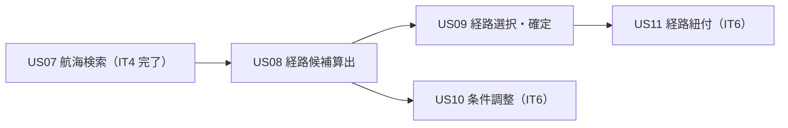
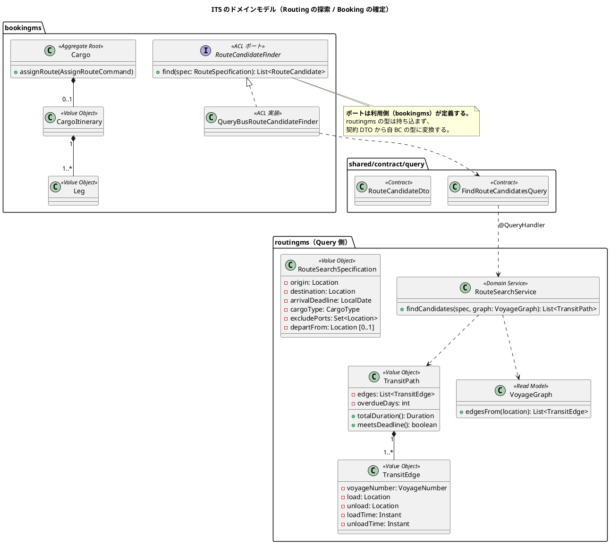
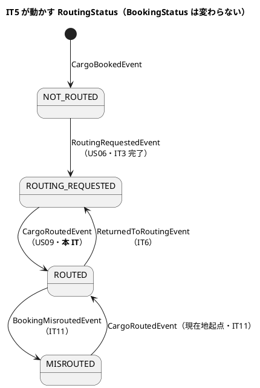
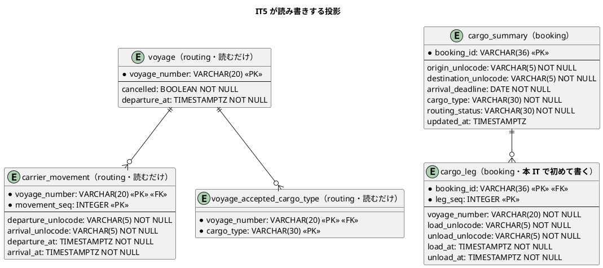
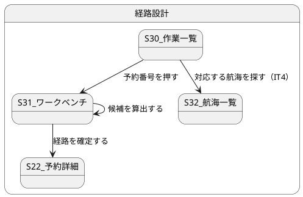

# イテレーション 5 計画 - 経路候補の算出と確定

## 概要

| 項目 | 内容 |
| :--- | :--- |
| イテレーション | IT5（Release 0.2 経路設計と予約確定・**中盤**） |
| 期間 | 2 週間（開発 Day 1-10）+ クローズ Day 11-14 |
| ゴール | 経路設計者が**候補を自動で受け取り、選んで確定できる**ようにする。探索の判断はドメインサービスに置き、画面にも SQL にも置かない |
| 目標 SP | 10 SP（US08 6・US09 4）+ **引き継ぎ枠（SP 対象外）**（[リリース計画](release_plan.md)） |
| 局面 | **中盤（インサイドアウト）**。[開発戦略](development_strategy.md) を参照 |

**このイテレーションで初めてサービス越しの同期問い合わせが出ます。** bookingms が routingms に Axon Query Bus 越しに問い合わせます（[ADR-0001](../../adr/cargo-tracker/0001-cqrs-es-with-axon-in-microservices.md) 決定 4 の検証点）。契約クエリ 1 本目です。

## ゴール

### イテレーション終了時の達成状態

1. **経路候補が自動で出る。** 出発地・目的地・期限・貨物種別から、寄港地の接続を評価した候補が推奨順に並ぶ（US08）。IT4 で「端点で航海を絞る」ところまで来たので、その上に探索が乗る
2. **候補が無いことを候補 0 件と言い分けられる。** 期限内に到達できないときは、その旨と条件調整（US10・IT6）への導線が出る
3. **候補を選んで確定できる。** 選んだ旅程が予約に紐づき、`ROUTED` になる（US09）。**期限を満たすかの判断は集約が持つ**（不変条件 5）
4. **サービス越しの問い合わせが 1 本通っている。** bookingms の ACL ポートが routingms の `@QueryHandler` に届き、routingms が落ちているときは明示的に失敗する
5. **IT4 の引き継ぎのうち高 2 件と設計の追いつき 3 件が返済されている**（引き継ぎ枠）

### 成功基準

- [ ] デモ項目の受け入れテストがすべて緑
- [ ] `TZ=UTC ./gradlew build` が緑（JaCoCo の層別閾値を含む）
- [ ] フロントの `npm run test`・`npx tsc -b`・`npm run build` が緑
- [ ] `./gradlew :acceptance-tests:test` が緑
- [ ] **契約テストで `FindRouteCandidatesQuery` の「ゴールデン一致」と「往復」を両方置いた**（[テスト戦略](../../design/cargo-tracker/test_strategy.md) は契約イベント・コマンド・**クエリごと**に丸ごと一致を求める）。往復は bookingms と routingms を同じ JVM に起動して実際に届くことで確かめる（IT3 の R.1 と同じ形）。**ゴールデンは壊して赤を見る**
- [ ] **routingms が落ちているときの振る舞いを検査した**（`NoHandlerForQueryException` → 503。黙って 0 件にしない）
- [ ] **クラスタ E2E を Day 9 に 1 度、クローズ前にもう 1 度回した**（IT4 の T3）
- [ ] **「確認してから送る」を作ったら、確認のあとに入力を変える経路を赤で固定した**（IT4 の T1）
- [ ] **不変条件を足すときは「据え置き（変えない）」をテストに入れた**（IT4 の T2）
- [ ] **層別カバレッジと SonarQube をストーリー完了ごとに 1 度回した**（IT4 の T4）
- [ ] **受入基準を「記録」と「読み口」に割って、両方に検査を対応させた**（IT4 の T6）
- [ ] **未使用の private 要素を、その検査・クラスの方針と突き合わせて棚卸しした**（IT4 の T7）
- [ ] SonarQube の Quality Gate がバックエンド・フロントエンドとも PASS
- [ ] `npx gulp okf:check` が ERROR 0
- [ ] ユーザーマニュアルの該当章が更新され、画面キャプチャが再生成されている（**S31 経路設計ワークベンチの新章**）
- [ ] **並列レビューをクローズの最初に起動し、切れていないか表の最終行を確かめてから統合した**（IT4 の T8）

## ユーザーストーリー

### 対象ストーリー

| ID | ストーリー | SP | 対応 UC | サービス |
| :--- | :--- | :--: | :--- | :--- |
| US08 | 経路候補を算出する | 6 | UC06 | routingms（探索）+ bookingms（ACL・画面） |
| US09 | 経路を選択・確定する | 4 | UC07 | bookingms |
| | **合計** | **10** | | |

### ストーリー詳細

#### US08 経路候補を算出する（6 SP）

[ユーザーストーリー](../../requirements/user_story.md) US08 が正典です。受入基準は複写しません。

**中核は `RouteSearchService`（ドメインサービス）です。** 集約境界を越えるグラフ探索なので `Voyage` には置きません（[ドメインモデル設計](../../design/cargo-tracker/domain-model.md)）。状態を変えないので Query 側に置きます。

| 論点 | 方針 |
| :--- | :--- |
| 入力 | `RouteSearchSpecification`（出発地・目的地・到着期限・貨物種別・除外港・`departFrom`）と `VoyageGraph`（`voyage` / `carrier_movement` から組む） |
| 出力 | `List<TransitPath>`。`edges` と `overdueDays` を持つ |
| 期限の比較 | **日付単位**。期限当日着は間に合う（IT4 で `Voyage` に入れたのと同じ判断） |
| 貨物種別 | `acceptedCargoTypes` に含む航海だけを通す |
| 出港済み | 探索の対象から外す（S32 の既定と同じ理由。走らない船を候補に出さない） |
| キャンセル済み | 探索の対象から外す（`cancelled = TRUE` は既存の一覧でも外している。IT4 の不変条件 5 と同じ理由で「走らない船」） |
| 期限超過 | `departFrom` 指定のときだけ返す（誤配の再設計・US28 は IT11）。通常は返さない |
| 推奨順 | 所要時間の短い順。**直行便は最優先**（受入基準 5） |
| 候補 0 件 | 空リストを返す。エラーにしない。**「探索できなかった」と「候補が無い」を言い分ける**のは画面と Controller の責務 |

**費用は算出しません。** 受入基準 3 の「費用」は US21（料金算出・IT13）が正典で、現時点で料金表がありません。**候補に費用欄を出さないことを受入基準の未達として記録します**（数を合わせるために「完了」にしません）。所要日数・経由港・航海番号は出します。

**同じ理由で US09 §受入基準 1 の「費用」も未達です。** 候補一覧は US08 が作るものを US09 が使うので、片方だけ満たすことはありません。両方を未達として記録します。

**US09 §受入基準 4「最適な候補がない場合、経路条件調整（US10）に進める」も未達です（IT5 レビューで検出・2026-09-05）。** 進む先の US10（経路条件を調整して再算出する）が本 IT のスコープに入っていないため、候補 0 件のときに画面が案内できるのは「到着期限を延ばすか、経由できる港を増やす」という文面までで、条件を変えて再算出する導線はありません。**US10 を実装する IT で満たします。** 計画時に見落としていたため、当初から未達として挙げていた「費用」の 2 件とは別に、ここに追記して記録します。

#### US09 経路を選択・確定する（4 SP）

**中核は `Cargo.assignRoute` です。** 選んだ候補を `CargoItinerary` として受け取り、不変条件 4（区間の連結・時刻昇順）と不変条件 5（旅程は経路仕様を満たす）を集約が検査します。

| 論点 | 方針 |
| :--- | :--- |
| 誰が検査するか | **集約**。画面は候補をそのまま送るだけ。「候補は探索が作ったのだから正しい」としない（探索と集約は別の判断） |
| 送るもの | 選んだ候補の区間列。**候補 ID ではない**（候補はテーブルに持たないため、送信までの間に航海が更新されうる） |
| 状態 | `ROUTE_PROPOSED` のまま `RoutingStatus` が `ROUTING_REQUESTED` → `ROUTED` |
| 投影 | `cargo_leg` を**全行入れ替え**（データモデルの既定）。再設計で行が増えない |
| 期限超過 | 通常の設計では許さない。`departFrom` 指定の再設計だけが例外（IT11） |

### 依存関係

US08 を先に作らないと US09 が選ぶものを持ちません。**US08 の中でも探索（routingms）が先で、ACL と画面はその後**です（インサイドアウト）。

## 設計

### 対象スコープの設計図

#### ドメインモデル図（IT5 スコープ）

#### 状態遷移図（IT5 スコープ）

**`BookingStatus` は `ROUTE_PROPOSED` のまま動きません。** 経路が付いても荷主に通知するまでは提案中です（通知は US12・IT6）。

#### ER 図（IT5 スコープ）

**経路候補はテーブルに持ちません**（[データモデル設計](../../design/cargo-tracker/data-model.md)）。問い合わせのたびに `carrier_movement` から探索します。保存するのは選ばれた旅程（`cargo_leg`）だけです。

#### 画面遷移図（IT5 スコープ）

**S31 経路設計ワークベンチが新規実装です。** [UI 設計](../../design/cargo-tracker/ui_design.md) には節も salt もあります（新規作成ではなく改訂）。IT4 までは S30 から S22 を開いていました。

### API 設計

| メソッド | パス | 用途 | ロール |
| :--- | :--- | :--- | :--- |
| `GET` | `/api/v1/booking/bookings/{bookingId}/route-candidates` | 経路候補の算出（US08） | ROLE_ROUTING |
| `POST` | `/api/v1/booking/bookings/{bookingId}/route` | 経路の確定（US09） | ROLE_ROUTING |

**候補の REST は bookingms に置きます。** [バックエンドアーキテクチャ](../../design/cargo-tracker/architecture_backend.md) が「bookingms の Controller が ACL を通して問い合わせる」と決めているためです。フロントエンドアーキテクチャに `/api/v1/routing/route-candidates` と書かれているのは食い違いなので、正典（バックエンド側）に合わせて直します（下記「設計への反映が必要な事項」1）。

**予約 ID を経路に含めます。** 候補は「その予約の経路仕様に対する候補」なので、条件を画面から組み立てて送りません。画面が条件を組むと、予約の期限を直したのに古い期限で探すことが起きます。

**条件は `cargo_summary` から組みます**（`origin_unlocode`・`destination_unlocode`・`arrival_deadline`・`cargo_type`）。候補算出は Query 側なので、集約を読み出しません。`Cargo` は経路仕様をフィールドに持たない（IT4 時点では `arrivalDeadline` だけ）ので、集約から取ろうとすると経路仕様を集約に足す変更が要ります。**それは US10（条件調整・IT6）の仕事**で、本 IT では投影を読みます。

**新しい経路を足したら `RoleAuthorization` の宣言表にも足します**（[ADR-0006](../../adr/cargo-tracker/0006-role-authorization-at-the-gateway.md) 決定 6）。どちらも `/api/v1/booking/bookings/**` に含まれますが、**経路設計者だけに絞る宣言**が要ります（`GET /bookings/{id}` は営業・追跡にも開いているため）。IT4 の `PUT /bookings/{id}` と同じ形です。

**宣言の順序を先に決めます**（IT4 レビューの懸念 8・ふりかえりの T5）。`/bookings/*` は `/bookings/routing-worklist` にも当たるので、**細かい経路を先に置きます**。`POST /bookings/{id}/route` は `/bookings/*/routing-request` と同じ形なので、既存の並びのすぐ隣に置きます。

### 契約への影響

**契約クエリ 1 本目を実装します。** 名簿（イベント 11・コマンド 2・**クエリ 1**）は変わりません。`FindRouteCandidatesQuery` と `RouteCandidateDto` を `shared/contract/query` に置きます。

| 規則 | 内容 |
| :--- | :--- |
| タイムアウト | 5 秒（Resilience4j の TimeLimiter）。`join()` で無期限に待たない |
| 落ちているとき | `NoHandlerForQueryException` → 503。**黙って 0 件にしない**（「候補が無い」と読まれる） |
| 呼ぶ場所 | Controller のみ。Reaction Handler からは呼ばない（Processing Group が止まる） |
| 型の持ち込み | しない。ACL が契約 DTO から自 BC の型へ変換する |
| DTO の中身 | **文字列・数値・日時だけ**。識別子型（`VoyageNumber`）と列挙型（`CargoType`）は共有カーネルに置かない決まりなので、各 BC で組み直す（`TransitEdge` をそのまま写さない） |

### ADR

| 論点 | 現時点の方針 | 結果 |
| :--- | :--- | :--- |
| 探索の打ち切り（乗り継ぎ回数・候補数の上限） | 乗り継ぎ 3 回・候補 20 件で打ち切る。無制限だと航海が増えたときに応答が返らない | **[ADR-0007](../../adr/cargo-tracker/0007-route-search-cutoff.md) を起票**。打ち切りを候補件数だけで判断しない点も決定に含めた |
| `QueryDispatcher` が 2 BC でバイト一致（IT4 引き継ぎ 3） | `shared.infrastructure.axon` へ寄せる | **寄せた**（R.4）。ADR にはせず、寄せると空振りする ArchUnit の規則を同じ変更で広げた |
| `POST /diff` が読み取りに POST を使う（IT4 引き継ぎ 7） | 入力が大きく URL に載らないため | **ADR-0006 決定 7** に追記（R.5） |
| 予約の修正内容を投影に持つか（R.2） | IT4 は「履歴テーブルは作らない」と決めたが、読み口がどこにも無かった | **[ADR-0008](../../adr/cargo-tracker/0008-cargo-revision-as-a-projection.md) を起票**して判断を改めた |

### 設計への反映が必要な事項

**開始準備の時点で反映します**（IT3 で正典ドリフトを 5 件出した反省）。salt だけは画面の形が決まってからのほうが描き直しが減るため、実装と同時にします。

| # | 反映先 | 内容 | 状態 |
| :--- | :--- | :--- | :--- |
| 1 | `architecture_frontend.md`・`ui_design.md` S31 | 経路候補の REST が `/api/v1/routing/route-candidates` になっていた。バックエンド側の正典（bookingms の Controller が ACL 経由）と食い違う。両方を `/api/v1/booking/bookings/:id/route-candidates` に直し、確定の REST も明記する | **反映済み**（8e2593fac ほか） |
| 2 | `domain-model.md` 要素表 | `RouteCandidate` が Routing の読み取りモデルとして 1 行しかないが、bookingms 側にも同名の型が要る（ACL の変換先）。`CargoType` と同じく**BC ごとに別の型**であることを明記する | **反映済み**（8e2593fac） |
| 3 | `ui_design.md` 全体遷移図・S30・S22 節 | IT4 の導線（S34 航海詳細・S24 予約修正・S30 の引き渡し列）に追いついていない（IT4 引き継ぎ 4） | **反映済み**（8e2593fac）。R.3 はこれで消化 |
| 4 | `ui_design.md` S31 節 | **既存節の改訂**（新規作成ではない）。候補一覧から**概算（費用）の列を外す**（US21・IT13 まで出せない）、航海番号の列を足す、0 件と 503 の言い分け・打ち切りの表示を書く | **反映済み**（概算列・言い分け・打ち切り） |
| 4-2 | `architecture_backend.md` | `FindRouteCandidatesQuery` の引数が端点と期限の 3 つしかない。貨物種別で絞れないと、危険物を運べない航海が候補に混ざる。`cargoType`・`excludePorts`・`departFrom` を足す | **反映済み** |
| 4-3 | `domain-model.md` 要素表 | `RouteSearchSpecification` と `TransitEdge` が載っていない | **反映済み** |
| 5 | `data-model.md` | `cargo_leg` の定義は済んでいるが、**マイグレーションがまだ無い**。R.2 で `V008__create_cargo_revision.sql` を使ったので、**`cargo_leg` は V009** になる | 実装（Day 7） |
| 6 | `domain-model.md` Voyage のコマンド表 | `CancelVoyageCommand` は表にあるが実装が無い（IT4 で `VoyageCancelledEvent` だけ先に置いた）。引き継ぎ枠で実装する | **反映済み**（R.1。`data-model.md` に `cancelled_at` / `cancel_reason` / `cancelled_by`、`ui_design.md` S34 にキャンセルの導線） |
| 7 | `architecture_backend.md`・`domain-model.md` | ACL ポートの入力が集約の `RouteSpecification`（端点と期限）と同じ名前になっていたが、探索は貨物種別・除外港・起点を持つ。**別の型（`RouteSearchRequest`）に分けた**。集約に探索の都合を足すのは US10 の仕事 | **反映済み**（Day 5） |
| 8 | `architecture_backend.md` | 同期問い合わせのタイムアウトを「Resilience4j の TimeLimiter」と書いていたが、`QueryDispatcher`（共有カーネル）が既に 5 秒で切っている。**待ち方を決める仕組みを 2 つ持たない**ため Resilience4j は導入しない | **反映済み**（Day 5） |

## スケジュール

### Day 1: 引き継ぎ枠（SP 対象外）

**リリース計画は IT5 に枠を置いていません。** IT4 のふりかえりで高 2 件が出たため、この IT に限って枠を置きます（リリース計画の更新履歴に記録）。**枠は序盤に独立したコミットで消化します。**

| # | 内容 | 出所 | 見積 |
| :--- | :--- | :--- | :--- |
| R.1 | **航海キャンセル**（`CancelVoyageCommand` + REST + S34 のボタン）。不変条件 5 への到達手段がイベントの直接適用しかない | IT4 引き継ぎ 1（高） | 3h → **返済済み**（2cf3e9e43） |
| R.2 | **US32 §受入基準 4「何を変えたか」の読み口**。記録はあるが誰にも見えない | IT4 引き継ぎ 2（高） | 3h → **返済済み**（71958f42c。ADR-0008 で IT4 の判断を改めた） |
| R.3 | ~~`ui_design.md` の全体遷移図・S30・S22 節を IT4 の導線に合わせる~~ | IT4 引き継ぎ 4 | **開始準備で消化済み**（8e2593fac） |
| R.4 | `QueryDispatcher` の重複を寄せるか決め、ADR かコメントに残す | IT4 引き継ぎ 3 | 2h → **返済済み**（2e7abafc8。共有カーネルへ 1 本化し、ArchUnit の規則を包みにも広げた） |
| R.5 | `POST /diff` の理由を ADR-0006 に一行足す | IT4 引き継ぎ 7 | 0.5h → **返済済み**（決定 7） |
| R.6 | 検査コードの未使用要素を棚卸しする（IT4 の T7） | IT4 引き継ぎ 14 | 2h → **返済済み**（`serialVersionUID` 以外 0 件） |

**枠は 6 件すべて返済しました。** 落とす順序は使いませんでした。

**落とす順序**（消化できないときは上から落とす）: R.6 → R.5 → R.4 → R.3 → R.2 → R.1。R.1・R.2 は高で、落とすなら理由をふりかえりに書きます。

### IT5 で扱わない引き継ぎ（行き先を先に決める）

| # | 内容 | 行き先 | 理由 |
| :--- | :--- | :--- | :--- |
| 1 | 更新専用の行型を分ける | IT6 | 経路の投影（`cargo_leg`）を書く本 IT で同じ形が増えるので、増えてから 1 度に寄せる |
| 2 | `transitions.canon.test.ts` の正規表現 | IT6 | 現状はフェイルセーフ |
| 3 | 港のローカル時刻での入力・表示 | **IT6 で判断する**（4 回目の繰越。「落とした負債は育つ」に従い、次で落とすなら ADR にする） | 本 IT は UTC のまま。探索の期限比較は日付単位なので影響しない |
| 4 | 危険物かつ冷凍の貨物 | IT6 以降 | 探索は種別 1 つを前提にしている。両方を持つ設計変更は `CargoSpecification` から |
| 5 | 誤配時に状態をどう戻すか | IT11（US28） | 本 IT は `departFrom` の口だけ開けて使わない |
| 6 | ADR-0004・0005・0006 の承認と `verify` | 人の署名待ち | 代筆しない |
| 7 | 一度だけ落ちて再現しないもの 2 件 | 次に見たら追う | 再現待ち |
| 8 | 連続入力で寄港地も残す | IT6 以降 | US24 の範囲 |

### Day 2-5: US08 経路候補を算出する（6 SP）

インサイドアウトで進みます。**探索 → クエリハンドラ → 契約 → ACL → Controller → 画面**の順です。

| Day | 内容 | 実績 |
| :--- | :--- | :--- |
| 2 | `VoyageGraph`・`TransitEdge`・`TransitPath`・`RouteSearchSpecification`（値オブジェクトの単体。**期限は日付単位・当日着は間に合う**を赤で固定） | 完了（83388a3ba） |
| 3 | `RouteSearchService.findCandidates`（接続・種別・出港済み・打ち切り・推奨順・直行便優先。**候補 0 件は例外にしない**） | 完了。**打ち切りは候補件数だけで判断しない**形に変えた（乗り継ぎ上限で捨てた枝は件数に現れず、「候補 0 件」と同じ見え方になる） |
| 4 | `FindRouteCandidatesQuery` の `@QueryHandler` と `VoyageGraph` の組み立て（投影から）。契約テストで往復を確かめる | 完了。ゴールデン 3 本（`RouteCandidateDto` を含む。名簿の検査が欠落を捕まえた）+ `ContractQueryRoundTripIT` |
| 5 | bookingms の ACL（ポート・実装・タイムアウト・503）と Controller、S31 の候補表示。**S30 の行リンクを `/bookings/:id` から `/routing/bookings/:id` に切り替え**、到達性のテストを更新する（IT4 までは S31 が無いので S22 を開いていた） | 完了。**`RouteSearchRequest` を新設**して集約の `RouteSpecification` と分けた。Resilience4j は入れず `QueryDispatcher` の 5 秒を使う |

### Day 6-8: US09 経路を選択・確定する（4 SP）

| Day | 内容 | 実績 |
| :--- | :--- | :--- |
| 6 | `CargoItinerary`・`Leg` の不変条件 4（連結・時刻昇順）と `RouteSpecification.isSatisfiedBy`（不変条件 5） | 完了。期限の比較に**業務タイムゾーンを渡す** |
| 7 | `Cargo.assignRoute` と `AssignRouteCommand` → `CargoRoutedEvent`、**`V009__create_cargo_leg.sql`**（R.2 が V008 を使ったため繰り上がり）と `cargo_leg` の投影（全行入れ替え） | 完了。**集約が端点も覚える**ようにした（期限だけでは、目的地を直した予約に古い目的地の経路が付く） |
| 8 | S31 の確定（送信中表示・確定後は S22 へ）、REST と認可の宣言 | 完了。S22 に旅程の読み口も同じ変更で出した |

### Day 9: クラスタ E2E（1 回目）

**IT4 の T3。** イメージを作り直して載せ直し、クラスタに対して E2E を回します。**載せ直し直後の 1 回目は落ちうる前提で、2 回目まで見ます。** サービス越しの問い合わせは、この確認でしか出ない失敗の宝庫です（IT4 では Spring の起動失敗が出ました）。

### Day 10: 受け入れテストとマニュアル

| 内容 | 見積 |
| :--- | :--- |
| 受け入れテスト（経路候補の算出・経路の確定） | 4h |
| ユーザーマニュアル（**09 経路を設計する**の新章・S31 のキャプチャ） | 4h |

### Day 11-14: クローズ

| # | 内容 | 見積 |
| :--- | :--- | :--- |
| Q.1 | **並列レビューをクローズの最初に起動**（IT4 の T8）。切れていないか表の最終行を確かめる | 1h |
| Q.2 | 指摘の反映 | 8h |
| Q.3 | クラスタ E2E（2 回目）・SonarQube・CI | 3h |
| Q.4 | ふりかえり・完了報告書・GitHub 同期・ドキュメント同期 | 4h |

### 見積合計

| 区分 | 見積 |
| :--- | :--- |
| 引き継ぎ枠（SP 対象外） | 10.5h（R.3 は開始準備で消化） |
| US08（6 SP） | 32h |
| US09（4 SP） | 22h |
| クラスタ E2E・受け入れ・マニュアル | 14h |
| クローズ | 16h |
| **合計** | **94.5h** |

## リスクと対策

| リスク | 影響 | 対策 |
| :--- | :--- | :--- |
| **10 SP は過去最大（IT1〜IT4 は 9・9・9・8）** | 未達で終わる | US08 を先に完成させる。US09 が入らなければ「US08 完了・US09 未着手」と正直に記録し、数を合わせるために両方を半端にしない |
| サービス越しの同期問い合わせが初めて | Axon Query Bus の挙動が想定と違う | Day 4 に契約テストで往復を確かめる。**ここで詰まったら ADR-0001 決定 4 を見直す**（REST に落とす判断も含めて） |
| 探索が返らない（航海が増えると組合せ爆発） | 画面が固まる | 乗り継ぎ 3 回・候補 20 件で打ち切る。ADR-0007 に根拠を残す。**打ち切りに当たったことを画面に出す**（黙って切ると「候補が無い」と読まれる） |
| 候補 0 件と探索失敗の混同 | 「候補が無い」と誤解して条件を変え続ける | 503 と空リストを別の見え方にする。**赤で固定する** |
| 費用が出せない（US21 が IT13） | 受入基準 3 の未達 | 計画時点で未達として明記する。「費用は料金算出（US21）で出ます」と画面に書く |

## 完了条件

### Definition of Done

- [ ] US08・US09 の受入基準（`user_story.md`）を満たす。**ただし US08 §受入基準 3・US09 §受入基準 1 の「費用」と US09 §受入基準 4「経路条件調整へ進める」は未達**（前者は US21・IT13、後者は US10 が前提。理由を完了報告書に記録）
- [ ] デモ項目の受け入れテストがすべて緑。**対応はテスト名でなく本文のアサーションで確かめる**
- [ ] 引き継ぎ枠 R.1〜R.6 が返済されている、または「落とす順序」に従って送った理由がふりかえりに書かれている
- [ ] **R.1・R.2（IT4 の高 2 件）が返済されている**
- [ ] 本 IT で足した検査を壊して赤を見た
- [ ] **`cargo_leg` の投影テストは行を丸ごと比べた**（列ごとに積み上げない。IT3 でヘッダだけ比べていた欠陥・IT4 で差分に同じ規律を入れた経緯）。**再設計で行が増えないこと**も含める
- [ ] **契約クエリの往復を、同じ JVM に 2 サービスを起動して確かめた**
- [ ] **routingms が落ちているときに 503 になり、0 件と区別できることを検査した**
- [ ] **探索の打ち切りに当たったことが画面に出ることを検査した**
- [ ] `./gradlew build` が緑・`TZ=UTC ./gradlew cleanTest test` が緑
- [ ] フロントの `npm run test`・`npx tsc -b`・`npm run build` が緑
- [ ] **新しい経路が `RoleAuthorization` にメソッド込みで宣言され、そのロール以外は 403 になることを検査した**
- [ ] **宣言の順序を確かめた**（IT4 の T5）。`GET /bookings/*/route-candidates` と `POST /bookings/*/route` は、いずれも `/bookings/**`（営業・経路設計・追跡）より**前**に置かないと広い宣言に吸われる。とくに **`GET` は既存の広い宣言と同じメソッドなので、順序でしか絞れない**
- [ ] **候補算出と経路確定が、営業・追跡のどちらのロールでも 403 になることを検査した**（経路設計者だけ）
- [ ] UI 設計・navbar・ダッシュボード・到達性テストの 4 点が一致している。**S31 は一覧から開く画面なのでサイドナビに載せない**
- [ ] 追加した画面を、**そのロールで実際に 1 回開いた**
- [ ] **kind クラスタで動く**：イメージを作り直して載せ直し、全 Pod が Ready
- [ ] **クラスタに対して E2E が緑（Day 9 とクローズ前の 2 回）**
- [ ] `npx gulp okf:check` が ERROR 0
- [ ] SonarQube の Quality Gate がバックエンド・フロントエンドとも PASS
- [ ] **ユーザーマニュアルの該当章が更新され、画面キャプチャが再生成されている**（09 経路を設計する）
- [ ] **並列レビューをクローズの最初に起動し、結果が切れていないか確かめてから統合した**
- [ ] **設計への反映が必要な事項 6 件が `docs/design/` に反映されている**
- [ ] ふりかえり（`retrospective-5.md`）と完了報告書（`iteration_report-5.md`）を作成した

### デモ項目

イテレーションレビューで実演します。**この 7 件をそのままパスする受け入れテストが、IT5 の受け入れ基準です。**

| # | 見せるもの | 役割 | 何をアサートするか | 対応する検査 |
| :--- | :--- | :--- | :--- | :--- |
| 1 | 作業一覧から予約を開くと、候補が推奨順に出る | 経路設計 | 所要日数の短い順。経由港・航海番号が各候補に出る | `RouteSearchServiceTest#ordersByDuration`・`RoutingWorkbenchPage.test.tsx`・クラスタ E2E |
| 2 | 直行便があるときは最優先で出る | 経路設計 | 乗り継ぎのある候補より上 | `RouteSearchServiceTest#directRouteComesFirst` |
| 3 | 危険物の予約では、対応しない航海を含む候補が出ない | 経路設計 | `acceptedCargoTypes` に `HAZARDOUS` を含む航海だけ | `RouteSearchServiceTest#skipsVoyagesThatRejectTheCargoType`・`RouteCandidateQueryIT#excludesVoyagesThatRejectTheCargoType` |
| 4 | 期限内に着けないときは、その旨と条件調整の案内が出る | 経路設計 | 空リスト + 案内。**エラー表示ではない** | `RouteCandidateQueryIT#returnsEmptyWhenNothingMeetsTheDeadline`・`RoutingWorkbenchPage.test.tsx`（`queryByRole('alert')` が無いことも見る） |
| 5 | routingms が落ちているときは「候補が無い」と言わない | 経路設計 | 503 の案内。空の候補一覧を出さない | `QueryBusRouteCandidateFinderTest#unavailableIsNotEmpty`・`RoutingWorkbenchPage.test.tsx`（503） |
| 6 | 候補を選んで確定すると、経路設定状態が「設計済」になる | 経路設計 | `RoutingStatus = ROUTED`。予約詳細に区間が順に出る | `経路の確定.feature` シナリオ 1・`CargoProjectionIT#projectsItinerary`・クラスタ E2E |
| 7 | 期限を満たさない旅程は、API を直接叩いても断られる | 経路設計 | 集約が断る。画面の検査を通さない経路でも守られる | `経路の確定.feature` シナリオ 2・3（**画面を通さず API を直接叩く**）・`CargoRoutingTest` |

**デモ項目に対応する検査を表に書き出しました**（IT4 の T6・「実演で緑になるものは、実装済みでも固定されていないことがある」）。7 件とも本文のアサーションで対応を確かめています。

**受入基準 3 の「費用」は未達です。** 料金表は US21（IT13）が正典で、現時点で存在しません。0 を返すと「費用 0 円の経路」と読めるので、応答にも画面にも欄を置いていません。US09 §受入基準 1 の「費用」も同じ理由で未達です。

## 局面の確認（中盤の継続）

IT4 に続き中盤（インサイドアウト）です。移行ではないので 5 観点の確認は不要ですが、**中盤の要点が守られているか**だけ記します。

| 観点 | 本 IT での形 |
| :--- | :--- |
| 判断を集約・ドメインサービスに置く | 探索は `RouteSearchService`、旅程の妥当性は `Cargo.assignRoute`。**画面と SQL には置かない** |
| 画面から導かない | Day 2-4 は画面を書かない。テストの入口は値オブジェクトとドメインサービス |
| 貧血にしない | `TransitPath.meetsDeadline()` を Controller の `if` にしない |

## 更新履歴

| 日付 | 更新内容 | 更新者 |
| :--- | :--- | :--- |
| 2026-09-05 | 初版作成。IT4 のふりかえり（Try 8 件・引き継ぎ 14 件）を反映。引き継ぎ枠を IT5 に置く判断を記録 | claude-code/claude-opus-5 |

## 関連ドキュメント

- [リリース計画](release_plan.md)・[開発戦略](development_strategy.md)
- [IT4 計画](iteration_plan-4.md)・[ふりかえり](retrospective-4.md)・[完了報告書](iteration_report-4.md)
- [IT4 実装レビュー](../../review/cargo-tracker/IT4実装_review_20260905.md)
- [ユーザーストーリー](../../requirements/user_story.md)・[ドメインモデル設計](../../design/cargo-tracker/domain-model.md)・[データモデル設計](../../design/cargo-tracker/data-model.md)・[UI 設計](../../design/cargo-tracker/ui_design.md)
- [バックエンドアーキテクチャ](../../design/cargo-tracker/architecture_backend.md)（ACL と Query Bus）
- [ADR-0001 CQRS/ES with Axon](../../adr/cargo-tracker/0001-cqrs-es-with-axon-in-microservices.md) 決定 4
