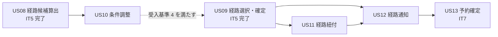
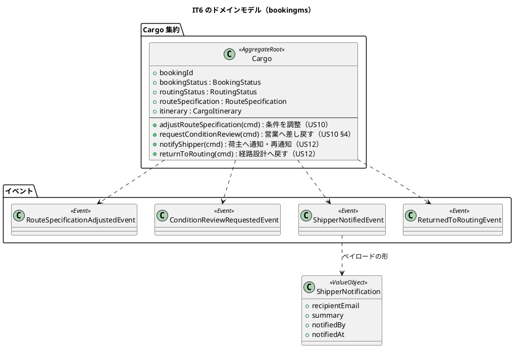
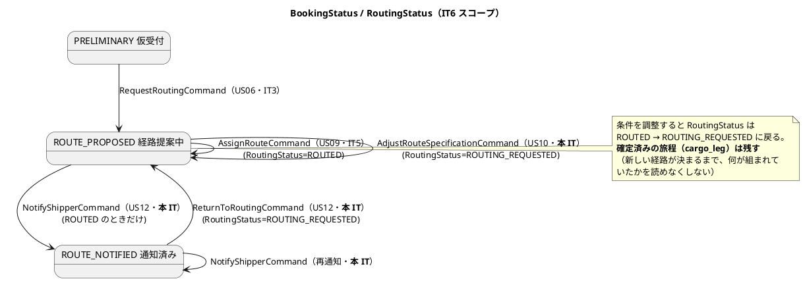
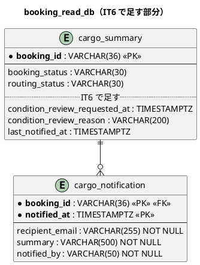
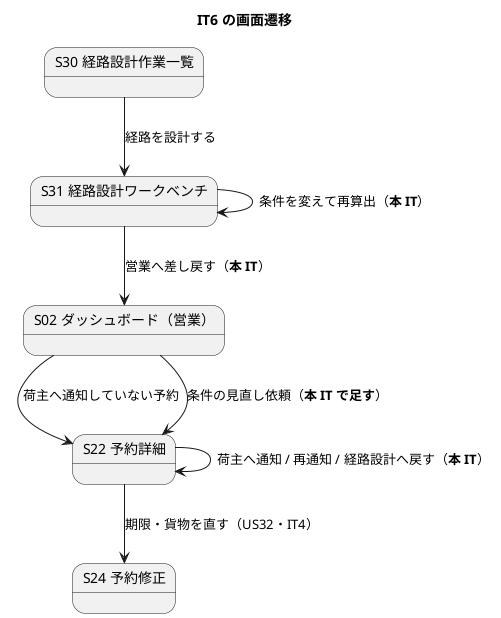

# イテレーション 6 計画 - 条件調整と荷主への通知

## 概要

| 項目 | 内容 |
| :--- | :--- |
| イテレーション | IT6（Release 0.2 経路設計と予約確定・**中盤**） |
| 期間 | 2 週間（開発 Day 1-10）+ クローズ Day 11-14 |
| ゴール | 経路が組めないときに**条件を変えて探し直すか、営業へ差し戻せる**ようにし、決まった経路を**荷主へ通知した事実を残せる**ようにする |
| 目標 SP | 8 SP（US10 3・US11 2・US12 3）+ **引き継ぎ枠（SP 対象外）**（[リリース計画](release_plan.md)） |
| 局面 | **中盤（インサイドアウト）**。[開発戦略](development_strategy.md) を参照 |

**IT5 で「候補が無い」と言えるようになりました。本 IT はその先を作ります。** 条件を変えて探し直す（US10）、営業へ差し戻す（US10 §受入基準 4）、通知した事実を残す（US12）。IT5 で未達として記録した **US09 §受入基準 4 は US10 の完成で満たされます**。

**サービス越しの新しいメッセージはありません。** 契約の名簿（イベント 11・コマンド 2・クエリ 1）は変わりません。IT5 で通した `FindRouteCandidatesQuery` に条件を足すだけです。

## ゴール

### イテレーション終了時の達成状態

1. **条件を変えて探し直せる。** 出発港と除外港を変えて再算出でき、現在の制約条件が画面から読める（US10）
2. **組めないときは営業へ差し戻せる。** 差し戻した予約は経路設計の作業一覧から外れ、**営業のダッシュボードに「条件の見直し依頼」として現れる**（US10 §受入基準 4）
3. **確定経路が予約に紐づいていることが検査で固定されている**（US11）。**IT5 で実装済みの振る舞いに、受入基準と対応する検査を置く**（下記「US11 の扱い」）
4. **荷主へ通知した事実が残る。** 通知内容（経由港・所要日数・到着予定日）を確認して通知すると `ROUTE_NOTIFIED` になり、通知履歴が予約詳細に出る（US12）
5. **通知した予約は経路設計へ戻せる。** `ROUTE_NOTIFIED → ROUTE_PROPOSED` の逆向きの遷移が働く

### 成功基準

- [ ] デモ項目の受け入れテストがすべて緑
- [ ] `TZ=UTC ./gradlew build` が緑（JaCoCo の層別閾値を含む）
- [ ] フロントの `npm run test`・`npx tsc -b`・`npm run build` が緑
- [ ] `./gradlew :acceptance-tests:test` が緑
- [ ] **層別カバレッジと SonarQube を、US ごとに 1 度回した**（IT5 の T4。**IT5 で守れなかったので、Day 4・Day 5・Day 8 のタスクとして置く**）
- [ ] **実環境で症状を見たときに、テストを直す前に実装を疑った**（IT5 の T1）。E2E に回避を書くなら、その回避が実装の欠陥を隠していない理由を 1 行で書く
- [ ] **javadoc・設計文書・テスト名に「〜する」と書いたら、同じ変更でその検査を書いた**（IT5 の T2）
- [ ] **画面から呼ぶ API を、HTTP の層で 1 本は通した**（IT5 の T3。正常系と、その API 固有の異常系）
- [ ] **受入基準を 1 行ずつ「本 IT で満たす / 未達（前提は何）」に割り当てた**（IT5 の T5。下記「受入基準の割り当て」）
- [ ] **追加・変更した画面を、それを見る他のロールから何が読めるか確かめた**（IT5 の T6）
- [ ] **内部の列挙名を利用者に見せていない**（IT5 の T7。マニュアルの注釈で埋め合わせない）
- [ ] **クラスタ E2E を Day 9 に 1 度、クローズ前にもう 1 度回した**
- [ ] SonarQube の Quality Gate がバックエンド・フロントエンドとも PASS
- [ ] `npx gulp okf:check` が ERROR 0
- [ ] ユーザーマニュアルの該当章が更新され、画面キャプチャが再生成されている（**05 章の撮り直しを含む**）
- [ ] **並列レビューをクローズの最初に起動し、切れていないか表の最終行を確かめてから統合した**（IT5 の T8）

## ユーザーストーリー

### 対象ストーリー

| ID | ストーリー | SP | 対応 UC | 主なサービス |
| :--- | :--- | :--: | :--- | :--- |
| US10 | 経路条件を調整して再算出する | 3 | UC08 | bookingms / routingms |
| US11 | 経路情報を予約に紐付ける | 2 | UC09 | bookingms |
| US12 | 確定経路を荷主に通知する | 3 | UC10 | bookingms |

### 受入基準の割り当て（IT5 の T5）

**費用のように目立つものだけを挙げると、IT5 の US09 §4 のような見落としが起きます。** 1 行ずつ割り当てます。

| ストーリー | 受入基準 | 本 IT | 備考 |
| :--- | :--- | :--- | :--- |
| US10 | 1. 現在の制約条件を確認できる | **満たす** | S31 の「条件」欄。出発港・除外港・期限・貨物種別 |
| US10 | 2. 条件を調整して再算出を実行できる | **一部未達** | **期限延長・貨物種別変更・除外港・出発港は満たす**（`AdjustRouteSpecificationCommand`）。**「経由地追加」＝必ず通る港の指定は未達**（探索の条件に無い。`RouteSearchSpecification` は除外しか持たない）。この 1 件は US28（誤配の再設計・IT11）で経由の指定が要るので、そこで足す |
| US10 | 3. 調整後の条件で新たな候補が算出・提示される | **満たす** | IT5 の探索に条件を渡すだけ |
| US10 | 4. 営業担当者に条件協議を依頼できる | **満たす** | 「営業へ差し戻す」。営業のダッシュボードに現れる |
| US11 | 1. 確定経路と予約番号を確認できる | **満たす（IT5 で実装済み）** | 予約詳細の旅程。本 IT で受入基準と対応する検査を置く |
| US11 | 2. 経路情報を予約に紐付ける操作を実行できる | **満たす（IT5 で実装済み）** | `POST /bookings/{id}/route` |
| US11 | 3. 紐付け後、予約状態が「経路提案中」に更新される | **満たす（IT5 で実装済み）** | 引き渡し（US06）の時点で既に `ROUTE_PROPOSED`。**紐付けで状態は動かない** |
| US12 | 1. 予約番号を指定して紐付けられた経路情報を確認できる | **満たす** | 通知前の確認画面（S22 内） |
| US12 | 2. 通知内容（経由港・所要日数・到着予定日・料金概算）を確認できる | **一部未達** | **料金概算は US21（IT13）が前提で未達**。経由港・所要日数・到着予定日は出す |
| US12 | 3. 荷主への経路通知を送信できる | **記録で満たす** | 送信基盤はスコープ外（[UI 設計](../../design/cargo-tracker/ui_design.md)）。通知した事実を記録し、送信は手作業 |
| US12 | 4. 通知送信記録が登録される | **満たす** | 通知履歴（宛先・要約・記録者・日時） |

**未達は 2 件です。**

1. **US10 §2 の「経由地追加」**（必ず通る港の指定）。探索は除外しか持たず、足すには `RouteSearchSpecification` と探索の変更が要ります。US28（IT11）で経由の指定が必要になるので、そこで足します
2. **US12 §2 の「料金概算」**（US21・IT13 が前提）

**IT5 は US09 §4 を計画時に見落としました。** 今回は着手前の検証で 1 件目が見つかっています。**数を合わせるために「完了」にはしません。**

### US11 の扱い（着手前の調査結果）

**US11 の受入基準 3 件は、IT5 で実装済みです。** 旅程の確認（IT5 で予約詳細に追加）・紐付け操作（`Cargo.assignRoute`）・状態（引き渡し時点で既に `ROUTE_PROPOSED`）のいずれも動きます。

**そこで本 IT の US11 は「受入基準に対応する検査を置くこと」を成果とします。** IT5 の学び（P2「書いた保証が空手形だった」）のとおり、**動いていることと固定されていることは別**です。受け入れシナリオを 3 本置き、`経路の紐付け.feature` として残します。

**浮いた工数は IT5 の引き継ぎ枠に充てます**（Day 1）。実績 SP は 8 のまま記録します（受入基準は満たしているため）。

### ストーリー詳細

**受入基準は書き写しません**（[テスト戦略](../../design/cargo-tracker/test_strategy.md) `:380`「正典が変わっても本表は追随する」）。項番で引用し、割り当ては上の表に置きます。

| ID | として | したい | なぜなら | 中核の判断 |
| :--- | :--- | :--- | :--- | :--- |
| US10 | 経路設計者 | 条件を調整して経路候補を再算出したい | 実現可能な経路を見つけ、輸送を実現できるから | **調整を集約に記録する**（誰がいつ期限を延ばしたかが残る）。差し戻せる状態の判断 |
| US11 | 経路設計者 | 確定した経路情報を予約に紐付けたい | 営業が荷主にルート提案できるから | **紐付けで状態は動かない**（引き渡しの時点で既に経路提案中） |
| US12 | 営業担当者 | 確定経路の詳細を荷主に通知したい | 荷主が承認・変更依頼を行えるから | **通知できるのは経路が決まっている予約だけ**。通知は記録で、送信は手作業 |

### タスク

| # | タスク | ストーリー | 見積 |
| :--- | :--- | :--- | :--: |
| T1 | `Cargo.adjustRouteSpecification`（期限・貨物種別・除外港・出発港） | US10 | 4h |
| T2 | `Cargo.requestConditionReview` と ADR-0009 | US10 | 4h |
| T3 | 投影（条件の更新・`condition_review_*`）と営業ダッシュボードの読み口 | US10 | 4h |
| T4 | `PUT /route-specification`・`POST /condition-review`・`GET /route-candidates` の配線 | US10 | 3h |
| T5 | S31 の条件欄・再算出・差し戻し、S02 の行 | US10 | 2h |
| T6 | `経路の紐付け.feature`（3 シナリオ）と赤の確認 | US11 | 6h |
| T7 | `Cargo.notifyShipper`・再通知・`Cargo.returnToRouting` | US12 | 5h |
| T8 | `cargo_notification` の投影とマイグレーション（データモデルへの反映を含む） | US12 | 4h |
| T9 | `POST`/`GET /notifications`・`POST /return-to-routing` と認可の宣言 | US12 | 4h |
| T10 | S22 の通知内容の確認・通知履歴・操作、S02 の行 | US12 | 5h |
| T11 | 引き継ぎ枠 H.1〜H.3 | — | 9h |
| T12 | クラスタ E2E・受け入れテスト・マニュアル | — | 10h |

### 依存関係

**US10 を先に作ります。** IT5 で未達として記録した US09 §受入基準 4（条件調整へ進める）が US10 に依存しているためで、先に片付けないと未達が 2 IT にまたがります。

## 設計

### 対象スコープの設計図

#### ドメインモデル（本 IT で触る部分）

**コマンドとイベントの名前は正典に合わせます**（[ドメインモデル](../../design/cargo-tracker/domain-model.md) の `:317-319`・`:557-561`・`:1393`）。当初の計画では「経路設計へ戻す」に既存の `RoutingRequestedEvent` を再利用し、条件調整は集約に記録しない設計にしていましたが、**正典は `ReturnToRoutingCommand` / `ReturnedToRoutingEvent` と `AdjustRouteSpecificationCommand` / `RouteSpecificationAdjustedEvent` を定義済み**でした。着手前の検証で見つかったので、**正典に合わせます**（設計が正）。

**`ShipperNotification` は集約が持ちません。** 通知履歴は投影が持ちます（`domain-model.md:574`「通知履歴として写します」）。値オブジェクトはイベントのペイロードの形として置きます。

**条件調整を集約に記録する理由が業務にあります。** 経路設計に入った予約（`ROUTE_PROPOSED`）は**修正（US32・S24）が使えません**（`Cargo.java:143` が状態で断る）。期限を延ばす手段が他に無いので、`AdjustRouteSpecificationCommand` が唯一の経路です。当初の計画が「期限は S24 が正典」としていたのは誤りでした。

**「経路設計へ戻す」は `ReturnToRoutingCommand` → `ReturnedToRoutingEvent` です**（正典どおり。主アクターは営業担当者）。既存の `RoutingRequestedEvent` を再利用すると、`routing_requested_at` の書き手が 2 つになるうえ、**「引き渡した」と「通知後に戻した」が履歴で区別できなくなります**。投影の結果（`routing_status = ROUTING_REQUESTED`・作業一覧に再び出る）は同じにしますが、**確定済みの旅程（`cargo_leg`）は消しません**（再設計で入れ替わるまで残す）。

**契約の名簿は変わりません。** 新しいイベント 2 本（`RouteSpecificationAdjustedEvent`・`ReturnedToRoutingEvent`）は bookingms 内で完結し、`shared/contract` には置きません。

#### 状態遷移（本 IT で通る経路）

**この図は正典（`domain-model.md:505-511`）をそのまま写しています。** 当初の計画は `AdjustRouteSpecificationCommand` による自己遷移を欠いていました。

**通知できるのは `bookingStatus = ROUTE_PROPOSED` かつ `routingStatus = ROUTED` のときだけです。** 経路が決まっていない予約を通知できると、荷主に空の旅程が届きます。判定は集約の述語に置き、画面はそれを呼びます。

#### ER（本 IT で足すもの）

**`cargo_notification` は新設です**（[データモデル](../../design/cargo-tracker/data-model.md)に無いので、本 IT で反映します。下記「設計への反映が必要な事項」1）。

**主キーに通知日時を含めます。** 採番するとリプレイのたびに行が積み上がります（`cargo_revision` と同じ形。[ADR-0008](../../adr/cargo-tracker/0008-cargo-revision-as-a-projection.md)）。

**`last_notified_at` を `cargo_summary` に持ちます。** 営業ダッシュボードの「荷主へ通知していない経路確定済みの予約」を、履歴テーブルを数えずに絞るためです。

#### 画面遷移（本 IT で触る画面）

**この注は着手前の検証で覆りました。** 当初は「期限と貨物種別は S31 から触らない（S24 が正典）」と書いていましたが、**経路設計に入った予約（`ROUTE_PROPOSED`）は S24 が使えません**（`Cargo.java` が状態で断る）。期限を延ばす手段が他に無いので、`AdjustRouteSpecificationCommand` が唯一の経路です。

**したがって S31 から 4 項目（期限・貨物種別・除外港・出発港）すべてを調整します。** 二重の入口にはなりません——S24 が開いているのは仮受付のあいだだけで、S31 が開くのは経路設計に入ってからです。**同じ予約に対して両方が同時に開くことはありません。** そのことを検査で固定します。

### API 設計

| メソッド | パス | 用途 | ロール |
| :--- | :--- | :--- | :--- |
| `GET` | `/api/v1/booking/bookings/{bookingId}/route-candidates?departFrom=&excludePorts=` | 条件を変えた再算出（US10。**IT5 の経路に条件を足す**） | ROLE_ROUTING |
| `POST` | `/api/v1/booking/bookings/{bookingId}/condition-review` | 営業へ差し戻す（US10 §4） | ROLE_ROUTING |
| `POST` | `/api/v1/booking/bookings/{bookingId}/notifications` | 荷主へ通知（US12） | ROLE_SALES |
| `GET` | `/api/v1/booking/bookings/{bookingId}/notifications` | 通知履歴（US12 §4） | ROLE_SALES, ROLE_ROUTING, ROLE_TRACKER |
| `PUT` | `/api/v1/booking/bookings/{bookingId}/route-specification` | 条件の調整（US10。期限・貨物種別・除外港・出発港） | ROLE_ROUTING |
| `POST` | `/api/v1/booking/bookings/{bookingId}/return-to-routing` | 経路設計へ戻す（US12） | ROLE_SALES |

**新しい経路は `RoleAuthorization` に宣言し、順序を確かめます**（[ADR-0006](../../adr/cargo-tracker/0006-role-authorization-at-the-gateway.md) 決定 6・IT4 の T5）。**実装を読んで確かめた並びの規則は次のとおりです**（`RoleAuthorization.java:106-107`）。

- **メソッドを絞る宣言は、経路だけの宣言より必ず前に置かれる**（`ordered.add(new Rule("PUT", ...))` をマップの展開より先に積んでいる）。したがって `POST /bookings/*/notifications`（営業だけ）はメソッド込みで宣言すれば順序を気にしなくてよい
- **`GET /bookings/*/notifications` は宣言を足しません。** 広い `/bookings/**` が `{SALES, ROUTING, TRACKER}` で、通知履歴に許したいロールと同じだからです。**同じ集合の宣言を重ねると、片方だけ直したときに食い違います**
- `POST /bookings/*/condition-review`（経路設計者だけ）もメソッド込みで宣言します
- `POST /bookings/*/return-to-routing`（営業）と `PUT /bookings/*/route-specification`（経路設計者）もメソッド込みで宣言します。**`POST /bookings/*/routing-request` は再利用しません**（引き渡しと戻しを履歴で区別するため）
- ~~**`PUT /bookings/*` は既に営業だけに宣言されています**。`PUT .../route-specification` は `PUT /bookings/*` より前に積む必要があります~~ → **実装したら誤りでした。** `AntPathMatcher` の `*` は `/` をまたがないので、`/bookings/*/route-specification` は `/bookings/*` に当たりません。**吸われる先は経路だけの宣言 `/bookings/**` のほう**です。宣言そのものを外すと営業に開くことを検査で確かめました（順序を入れ替えても赤にならないので、順序の検査にはなりません）

**「宣言を足さない」判断も検査で固定します。** `GET /notifications` が営業・経路設計・追跡で通り、それ以外で 403 になることを確かめます（宣言が無いことと、広い宣言に当たっていることは別）。

**条件の調整は集約に記録し、再算出はその結果を読みます。** 経路設計者が `PUT /route-specification` で条件を直すと `RouteSpecificationAdjustedEvent` が出て投影が更新され、`GET /route-candidates` は**更新後の `cargo_summary` から条件を組みます**。画面が条件を組み立てて送るのではありません。

**なぜ集約に記録するのか。** 条件を画面の一時的な絞り込みにすると、(a) 誰がいつ期限を延ばしたかが残らない（UC08 の最低保証「調整条件と再算出結果が記録される」を満たさない）、(b) 経路設計に入った予約は修正（US32・S24）が使えないので期限を延ばす手段が他に無い、の 2 点で行き詰まります。

### 契約への影響

**ありません。** 契約の名簿（イベント 11・コマンド 2・クエリ 1）は変わりません。`FindRouteCandidatesQuery` は IT5 の時点で `excludeUnLocodes` と `departFromUnLocode` を持っており、**IT5 では画面から使っていなかっただけ**です。本 IT でその配線を通します。

**「定義済み未使用は配線漏れのサイン」**（IT3 の T5）。契約に置いた 2 項目が 1 IT のあいだ使われていなかったことを、ふりかえりで確認します。**この規律は自分の逸脱にも適用します**——着手前の検証では、正典に定義済みの `AdjustRouteSpecificationCommand` を計画が黙って外していました（下記「着手前の検証」）。

### ADR

**ADR-0009（新規）: 営業への差し戻しを状態遷移にしない。**

差し戻したときに `routingStatus` を `NOT_ROUTED` へ戻すか、記録だけを残すかを決めます。戻すと「一度も設計していない予約」と区別が付かなくなり、S30 の一覧と誤配（`MISROUTED`）の扱いにも波及します。**記録（`condition_review_requested_at` / `reason`）で表し、状態は動かさない**案を軸に、決定と影響を残します。

**決定は 3 つです。** (1) 差し戻しを状態遷移にしない（記録で表す）、(2) 差し戻せるのは `ROUTING_REQUESTED` のときだけで **`MISROUTED` は含めない**（誤配の再設計は US28・IT11 が持つ）、(3) 条件の調整は集約に記録し、`routingStatus` を `ROUTED` から戻す。**決定ごとに検査を対応させます**（IT5 の architect 指摘。決定が 3 つなら検査も 3 つ）。

### 設計への反映が必要な事項

| # | 反映先 | 内容 |
| :--- | :--- | :--- |
| 1 | `data-model.md` | **`cargo_notification` テーブルが無い**（通知履歴を S22 に出すと決めているのに受け皿が無い）。ER 図と投影の表に追加。`cargo_summary` には **`condition_review_requested_at` / `condition_review_reason` の 2 列**を足す（`last_notified_at` は `:292` に既にある） |
| 2 | `domain-model.md` | **「営業へ差し戻す」のコマンド・イベントだけが無い**（`AdjustRouteSpecificationCommand` と `ReturnToRoutingCommand` は `:559-561` に定義済み）。`RequestConditionReviewCommand` / `ConditionReviewRequestedEvent` をコマンド一覧・イベント一覧・UC 対応表に追加 |
| 3 | `ui_design.md`（648 行付近） | 「条件の見直し依頼」の対応ストーリーが **US10（IT5）** になっている。**IT6** に直す |
| 4 | `ui_design.md`（S02） | **「条件の見直し依頼」の行が経路設計者の S02（`:631`）に置かれている。** 差し戻された予約に打てる手を持つのは営業（荷主と条件を協議する）なので、**営業の S02（`:560` 付近）へ移す**。同じ節の「引き渡していない予約の件数は営業に出す」（`:655`）と同じ理屈 |
| 5 | `domain-model.md` 要素表 | `ShipperNotification` 値オブジェクトを追加（イベントのペイロードの形として） |
| 6 | `architecture_backend.md` | 契約の名簿は変わらないが、**IT5 で契約に置いた `excludeUnLocodes` / `departFromUnLocode` が本 IT で初めて使われる**ことを一行残す |
| 7 | `domain-model.md`・`ui_design.md` | `AdjustRouteSpecificationCommand` が **`routingStatus` を `ROUTED` から戻す**ことを、S22・S31 の表示（旅程は残るが「再算出待ち」になる）と揃えて書く |

### 着手前の検証（ステップ 3・4）

**並列の検証エージェント 2 体から結果を受け取りました**（起動から約 55 分・直接依頼のあと再送）。**自分で先に確かめた 12 観点では見つからなかった不整合が高 4 件ありました。** 見つかった順に、すべて計画側を直しています（設計が正）。

| # | 重要度 | 指摘 | 対応 |
| :--- | :--: | :--- | :--- |
| 1 | 高 | **正典に `AdjustRouteSpecificationCommand` / `RouteSpecificationAdjustedEvent` があるのに、計画が黙って外していた**（条件をクエリパラメータだけで渡す設計にしていた） | 正典に合わせた。**経路設計に入った予約は修正（S24）が使えないので、期限を延ばす手段が他に無い**ことも確かめた |
| 2 | 高 | **正典に `ReturnToRoutingCommand` / `ReturnedToRoutingEvent` があるのに、既存の `RoutingRequestedEvent` を再利用する設計にしていた** | 正典に合わせた。再利用すると「引き渡した」と「通知後に戻した」が履歴で区別できない |
| 3 | 高 | **US10 §受入基準 2 を「満たす」としていたが、正典は「期限延長・経由地追加・貨物種別変更等」。** 当初の計画は出発港・除外港だけ | **「一部未達」に格下げ**。未達は 1 件から 2 件へ。IT5 の US09 §4 と同型の見落としだった |
| 4 | 高 | **「条件の見直し依頼」は経路設計者の S02 に描かれている**（計画は一貫して営業と書いていた） | 業務上は営業が正しい（打てる手を持つ側）ので、**`ui_design.md` を直す事項として明記**（反映事項 4） |
| 5 | 中 | 契約のフィールド名が `excludePortCodes` だった（実体は `excludeUnLocodes`） | 訂正 |
| 6 | 中 | 反映事項 1 の「`cargo_summary` の 3 列」のうち `last_notified_at` は既存 | 「2 列」に訂正 |
| 7 | 中 | 反映事項 2「UC08 のコマンドが無い」は不正確（無いのは差し戻しだけ） | 書き直した |
| 8 | 中 | 状態遷移図に `AdjustRouteSpecificationCommand` の自己遷移が無い | 正典（`domain-model.md:505-511`）を写した |
| 9 | 中 | テンプレートの「ストーリー詳細」節と「タスク」表が無い | 追加した |
| 10 | 低 | 図で集約が通知履歴を保持していた（`*--`） | イベントのペイロードの形（`..>`）に直した |
| 11 | 低 | 差し戻せる条件が `MISROUTED` を考慮していない | ADR-0009 で 1 行決める、と DoD に追加 |

**BC 独立性の違反はありません**（本 IT はサービス越しの新しいメッセージを足さない）。**軸 A（開発戦略との整合）も不整合なしです。**

**自分で先に確かめた分も残します**（重複は上の表が優先）。

| # | 観点 | 結果 | 根拠 |
| :--- | :--- | :--- | :--- |
| 1 | ストーリー ID・SP・対応 UC | **一致** | `release_plan.md:185`／`user_story.md:28-30` |
| 2 | US11 が IT5 で実装済みか | **実装済み**（検証エージェントも同じ結論） | `Cargo.java:187,289`／`BookingController.java:210` |
| 3 | `RoleAuthorization` の並び | **メソッド込みの宣言が先**。ただし**メソッド宣言どうしは追加順**なので `PUT` の細かい経路だけ順序を確かめる | `RoleAuthorization.java:106-107` |
| 4 | `cargo_notification` の不在 | **不在を確認** | `data-model.md`（該当なし） |
| 5 | `ShipperNotification` が要素表に無い | **不在を確認** | `domain-model.md:71` 付近 |
| 6 | `ui_design.md:648` の IT 番号 | **US10（IT5）と書かれている** | `ui_design.md:648` |
| 7 | サイドナビの突合表 | **影響なし**（本 IT で足す画面は無い） | `navigationMatchesUiDesign.test.ts:68-79` |
| 8 | テスト戦略との整合 | **1 件直した**（API から観測できるデモ項目に Gherkin を割り当て） | `test_strategy.md:245` |

**教訓を 1 つ残します。** 自前の確認は「計画に書いたことが正しいか」を見ましたが、**「計画が正典から落としたものはないか」を見ていませんでした。** 落ちたものは名乗り出ません。検証エージェントは正典の側から突き合わせて 2 件のコマンドの欠落を見つけています。

## スケジュール

### Day 1: 引き継ぎ枠（SP 対象外）

**IT5 のふりかえりで高 2 件が出たため、IT5 に続き枠を置きます。** IT5 で有効だった「Day 1 の独立コミットで消化する」形を繰り返します（余力次第にすると固定化する）。

| # | 内容 | 出所 | 見積 |
| :--- | :--- | :--- | :--: |
| H.1 | **05 章のキャプチャを撮り直す。** 「経路確定済みかつ一度修正した予約」の見本データを生成 spec に足す | IT5 引き継ぎ 1（高） | 3h |
| H.2 | **航海キャンセルの影響範囲を出す。** その航海で経路を組んだ貨物の件数と、対象への導線（`cargo_leg.voyage_number` の索引が既にある） | IT5 引き継ぎ 2（高） | 4h |
| H.3 | **時刻表記を業務タイムゾーンに揃える。** S34・S32 が UTC 表記のまま | IT5 引き継ぎ 4（中） | 2h |

**H.2 は US11 の浮いた工数を充てます**（上記「US11 の扱い」）。

#### Day 1 の実績（3 件とも返済済み）

| # | 結果 | コミット |
| :--- | :--- | :--- |
| H.1 | 済。**撮ってみて欠陥が 1 件見つかった**（下記） | `19d1cd4c3` |
| H.2 | 済。`GET /bookings/by-voyage/{voyageNumber}` と S34 の「この航海を使っている予約」 | `d733fd826` |
| H.3 | 済。**表示だけでなく入力（S33）と期間の絞り込みも**業務タイムゾーンに揃えた | `48ea1c880` |

**H.1 でキャプチャを撮ったら、引き渡し済みの予約に `[経路設計を依頼する]` が
出ていました。** 押すと `RoutingRequestedEvent` が `routingStatus` を
`ROUTING_REQUESTED` に戻すので、**確定済みの経路が理由も残さず未設計に戻ります**。

原因は、引き渡せるかどうかを遷移先（`ROUTE_PROPOSED` へ行けるか）で判断していた
ことです。正典で `ROUTE_PROPOSED` の自己遷移は経路の確定と条件の調整のもので、
引き渡しではありません。`BookingStatus#canRequestRouting` を置いて集約と画面の
両方がそれを呼ぶようにし、画面の写しは canon テストで正典の述語を読んで
突き合わせます。

**これは US12 の「経路設計へ戻す」と同じ穴です。** 差し戻しに専用のコマンドを
置く理由（ADR-0009 の決定 1）が、実物として先に出ました。

**教訓：マニュアルが説明していることを、キャプチャが写しているか確かめる。**
05 章は「旅程」と「修正履歴」を説明していましたが、キャプチャはどちらも
出ない予約でした。文章とキャプチャが別々に正しく見えるので、突き合わせるまで
気づきません。そして撮り直すと、画面の欠陥まで一緒に見つかります。

### 開発フェーズの実績（Day 1〜10）

**US10・US11・US12 の実装とデモ項目の受け入れテストが完了しました。** `./gradlew build`・フロントの全テスト・受け入れテスト・クラスタ E2E（14/14）・CI がすべて緑です。

| # | 結果 |
| :--- | :--- |
| T1〜T5（US10） | 済。ADR-0009 を作成し、決定 3 つに検査 3 つを対応させた |
| T6（US11） | 済。受入基準 3 件に 1 対 1 でシナリオを置いた |
| T7〜T10（US12） | 済。`cargo_notification`（V012・V013）と S22 の通知・履歴・戻し |
| 受け入れテスト | `条件調整.feature`（4）・`経路の通知.feature`（5）・`経路の紐付け.feature`（3） |
| クラスタ E2E | 14/14 緑（IT6 の 3 本を追加。デモ項目 2・3・5・7） |
| マニュアル | 09 章に条件調整と差し戻し、**10 章（荷主に経路を通知する）を新設** |
| 設計への反映 | 7 件すべて反映済み |

#### 実装して初めて分かったこと（5 件）

いずれも計画では見えず、**動かして初めて出ました**。

| # | 見つかった場所 | 内容 |
| :--- | :--- | :--- |
| 1 | マニュアルのキャプチャ（Day 1） | 引き渡し済みの予約に「経路設計を依頼する」が出て、押すと確定済みの経路が理由も残さず未設計に戻る。遷移先で判断していたのが原因 |
| 2 | US10 の配線（T4） | 調整した除外港と起点が投影に置き場が無く捨てられていた。集約の検査も投影の検査も緑のまま（どちらもその値を読んでいなかった） |
| 3 | US12 の配線（T9） | `notified_by` を NOT NULL にしたので、`X-Auth-Username` の無い呼び出しが 500 になっていた |
| 4 | 受け入れテスト | **経路設定状態の呼び名が実装だけ設計から逸れていた**（未設計/設計依頼済み/設計済 ↔ 正典は 未設定/設計依頼中/設定済）。この分岐を踏むシナリオが 1 本も無かったので IT5 から気づけていなかった |
| 5 | クラスタ E2E（Day 9） | 経路設計へ戻すと**確定済みの旅程が S22 から消えていた**。`ui_design.md` に「旅程は残ります」と自分で書いていた |
| 6 | マニュアルのキャプチャ（Day 10） | 見直し依頼の読み口が広いモックに吸われ、**ダッシュボードが真っ白**になっていた |

**4・5 は「書いた保証が守られていない」形です。** 設計に書いた・コメントに書いたことは、赤で固定するまで守られません。**1・2・5・6 は画面から踏むテストでしか見つかりませんでした。**

#### 計画の誤りを 2 件直しました

- **認可の順序**：「`PUT /bookings/*/route-specification` は `PUT /bookings/*` より前に積む必要がある」は誤り。`AntPathMatcher` の `*` は `/` をまたがないので当たらない。順序を入れ替えても赤にならないことを実測した
- **画面遷移の注**：「期限と貨物種別は S31 から触らない」は着手前の検証で覆っていたのに残っていた。4 項目すべてを S31 から調整する形に直した

### IT6 で扱わない引き継ぎ（行き先を先に決める）

| # | 内容 | 行き先 |
| :--- | :--- | :--- |
| 1 | 誤配の行が S31 に繋がるが扱えない | **US28（IT11）**。誤配からの再設計はそのストーリーの中核 |
| 2 | `/bookings/{id}/revisions` が内部クエリビューを返す | **IT7**。読み口の形を US13 の実装とあわせて揃える |
| 3 | `RouteCandidateQueryIT` の `truncated` アサートが全体状態に依存 | **本 IT で見る。** US10 で候補の条件が増えるので、偽陽性になったら直す |
| 4 | 修正履歴の回帰テストの 50 ms スリープ | **扱わない。** 本質の判定は「`/revisions` を呼ばない」ことに置き換え済みで、スリープは補助 |
| 5 | **港のローカル時刻での入力・表示**（IT2 から 4 回繰越） | **扱わない（決着）。** 港ごとのタイムゾーンは荷役の記録（US15・IT9）で初めて業務上の意味を持つ。**IT9 の範囲に含め、引き継ぎ表からは落とす** |
| 6 | **危険物かつ冷凍の貨物**（IT2 から 4 回繰越） | **扱わない（決着）。** 貨物種別が排他であることは `CargoType` の設計判断（IT2）で、変えるなら ADR が要る。**要件として起票するまで引き継がない**。引き継ぎ表からは落とす |
| 7 | ADR の承認と `verify`（0004〜0009） | **人の署名なので代筆しない。** ユーザーの承認を待つ |
| 8 | 連続入力で寄港地も残す | **US24 の範囲。** 航海登録を触る IT で拾う |

**5・6 は 4 回繰り越していました。** IT5 のふりかえり（「落とした負債は育つ」）に従い、**ここで行き先を決めて引き継ぎ表から落とします**。

### Day 2-4: US10 経路条件を調整して再算出する（3 SP）

インサイドアウト。既にある探索に条件を渡す配線が主なので、集約に足すのは差し戻しだけです。

1. **集約**（Day 2）：`Cargo.adjustRouteSpecification`（期限・貨物種別・除外港・出発港。`routingStatus` を `ROUTING_REQUESTED` へ戻す）と `Cargo.requestConditionReview`（営業へ差し戻す）。**差し戻せる状態の判断**は ADR-0009 で決める（`MISROUTED` を含めるかも 1 行で決める。誤配は US28・IT11 なので「含めない」で可）。`AxonTestFixture` で赤→緑
2. **投影・読み口**（Day 2-3）：`RouteSpecificationAdjustedEvent` で `cargo_summary` の期限・貨物種別・除外港を更新、`condition_review_requested_at` / `reason`、営業ダッシュボードの件数と一覧
3. **Controller**（Day 3）：`PUT /route-specification`・`POST /condition-review`、`GET /route-candidates` が更新後の条件を読む。**HTTP の層で 1 本通す**（IT5 の T3）
4. **画面**（Day 3-4）：S31 の「条件」欄（編集できる）と `[候補を再算出]`・`[営業へ差し戻す]`、S02 の「条件の見直し依頼」
5. **品質ゲート**（Day 4）：層別カバレッジと SonarQube を 1 度回す（IT5 の T4）

### Day 5: US11 経路情報を予約に紐付ける（2 SP）

**IT5 で実装済みの振る舞いに、受入基準と対応する検査を置きます。**

1. `経路の紐付け.feature` を 3 シナリオで置く（旅程と予約番号が読める / 紐付け操作 / 紐付け後も状態は経路提案中）
2. **3 番目は「状態が動かないこと」を確かめます。** 動かす実装に変えたら赤になることを確認する
3. 品質ゲートを 1 度回す

### Day 6-8: US12 確定経路を荷主に通知する（3 SP）

1. **集約**（Day 6）：`Cargo.notifyShipper`（`ROUTE_PROPOSED` かつ `ROUTED` のときだけ）・再通知・`Cargo.returnToRouting`（`ReturnToRoutingCommand` → `ReturnedToRoutingEvent`）
2. **投影**（Day 6-7）：`cargo_notification`、`last_notified_at`
3. **Controller**（Day 7）：`POST` / `GET /notifications`・`POST /return-to-routing`、`RoleAuthorization` の宣言と順序
4. **画面**（Day 7-8）：S22 の通知内容の確認・`[荷主へ通知]`・`[再通知]`・`[経路設計へ戻す]`・通知履歴、S02 の「荷主へ通知していない予約」
5. **品質ゲート**（Day 8）

### Day 9: クラスタ E2E（1 回目）

イメージを作り直して載せ直し、US10・US12 の通しを 1 度回します。**IT5 では、モックと単体では出ない実害をここで捕まえました。**

### Day 10: 受け入れテストとマニュアル

デモ項目の Gherkin と、マニュアル（05 章のキャプチャ・09 章の条件調整・**新章または既存章への通知の追記**）。

### Day 11-14: クローズ

`closing-iteration` の 7 ステップ。**並列レビューはクローズの最初に起動します。**

### 見積合計

| 区分 | 見積 |
| :--- | :--: |
| 引き継ぎ枠（SP 対象外） | 9h |
| US10（3 SP） | 17h |
| US11（2 SP） | 6h |
| US12（3 SP） | 18h |
| クラスタ E2E・受け入れ・マニュアル | 10h |
| **合計** | **60h** |

**US11 が 6h と軽いぶん、引き継ぎ枠に 9h を置いています。**

## リスクと対策

| リスク | 影響 | 対策 |
| :--- | :--- | :--- |
| **差し戻しの表し方を間違える** | 状態を戻すと「一度も設計していない予約」と混ざり、S30 と誤配の扱いに波及する | ADR-0009 で決め、決定ごとに検査を置く |
| 通知の記録だけで「通知した」と読まれる | 送信基盤が無いことが利用者に伝わらない | 画面に「送信はシステム外。記録のみ」と明記し、マニュアルにも書く。**文言を検査で固定する** |
| `/notifications` の `GET` と `POST` でロールが違う | 順序だけでは絞れず、広い宣言に吸われる | メソッド込みで宣言し、**両方のロールで 403 を検査する**（IT4 の T5） |
| US12 §2 の「料金概算」が出せない | 受入基準の未達 | 計画時点で未達として明記済み（US21・IT13 が前提） |
| 引き継ぎ枠が本体を押し出す | IT5 と同じ 3 件を Day 1 に置く | 独立コミットで Day 1 に閉じる。溢れたら **US12 を削らず引き継ぎ枠を落とす** |

## 完了条件

### Definition of Done

**クローズ時点の実績です。** 満たせなかったものは外したままにし、理由を書きます（数を合わせるために印を付けません）。

- [x] US10・US11・US12 の受入基準（`user_story.md`）を満たす。**ただし US12 §受入基準 2 の「料金概算」と US10 §受入基準 2 の「経由地追加」「貨物種別変更」は未達**（完了報告書に記録。貨物種別変更はクローズの自前点検で見つけた）
- [x] **IT5 で未達だった US09 §受入基準 4 が、US10 の完成で満たされている**（候補 0 件の案内のすぐ上に「探す条件」が出て、その場で調整できる）
- [x] デモ項目の受け入れテストがすべて緑。**対応はテスト名でなく本文のアサーションで確かめた**
- [x] 引き継ぎ枠 H.1〜H.3 が返済されている
- [x] 本 IT で足した検査を壊して赤を見た（認可の宣言・冪等性・イベントの再利用・呼び名・件数の表示など）
- [x] **`cargo_notification` の投影テストは行を丸ごと比べた**。**再通知で行が増えること**と、**リプレイで増えないこと**の両方を含めた
- [x] **画面から呼ぶ API を HTTP の層で 1 本通した**（正常系と、その API 固有の異常系）
- [x] **通知できない状態（経路未確定）で通知を試すと断られ、画面が 500 にならない**（409 を返し、画面は導線を出さない）
- [x] `./gradlew build` が緑・`TZ=UTC ./gradlew cleanTest test` が緑
- [x] フロントの `npm run test`（251）・`npx tsc -b`・`npm run build` が緑
- [x] **新しい経路が `RoleAuthorization` にメソッド込みで宣言され、そのロール以外は 403 になることを検査した**
- [x] **`GET` と `POST /notifications` の両方を、許されないロールで確かめた**（`GET` は「宣言を足さない」判断のほうを固定した）
- [x] UI 設計・navbar・ダッシュボード・到達性テストの 4 点が一致している（**新しい画面は無く**、S22・S31・S02 の中身が増えた。navbar は変わらない）
- [x] **追加・変更した画面を、それを見る他のロールから何が読めるか確かめた**（通知履歴は経路設計者も読める・操作は出ない）
- [x] **内部の列挙名を利用者に見せていない**。さらに**呼び名が設計と一致することを canon テストで固定した**（IT6 で実装だけ逸れていたのを見つけたため）
- [x] **kind クラスタで動く**：イメージを作り直して載せ直し、全 Pod が Ready。V010〜V013 の適用をログで確認
- [x] **クラスタに対して E2E が緑（Day 9 とクローズ前の 2 回）**。Day 9 に 14/14、クローズ（レビュー対応後）にイメージを作り直して 14/14。**2 回目の 1 回目の実行で 1 件落ち、再実行で通りました**（Pod を作り直した直後の初回。コードの欠陥ではないと判断しましたが、記録として残します）
- [x] `npx gulp okf:check` が ERROR 0
- [x] SonarQube の Quality Gate がバックエンド・フロントエンドとも PASS（カバレッジ 93.4%・重複 1.6%・Bug 0・脆弱性 0）
- [x] **ユーザーマニュアルが更新され、05 章のキャプチャが撮り直されている**（09 章に条件調整と差し戻し、**10 章を新設**）
- [x] **並列レビューをクローズの最初に起動し、結果が切れていないか確かめてから統合した**（2 視点は本文が上限を超えて切れたので、短い形で送り直してもらった）
- [x] **設計への反映が必要な事項 7 件が `docs/design/` に反映されている**
- [x] ADR-0009 を作成し、**決定の数だけ検査を対応させた**（決定 3 つに検査 3 つ）
- [x] **条件を調整すると `routingStatus` が `ROUTED` から戻り、確定済みの旅程は残ることを検査した**
- [x] **「引き渡した」と「通知後に戻した」がイベント履歴で区別できることを検査した**（同じイベントを再利用していない。再利用する実装に変えて赤を見た）
- [x] ふりかえり（`retrospective-6.md`）と完了報告書（`iteration_report-6.md`）を作成した

### デモ項目

イテレーションレビューで実演します。**この 7 件をそのままパスする受け入れテストが、IT6 の受け入れ基準です。**

| # | 見せるもの | 役割 | 何をアサートするか | 対応する検査 |
| :--- | :--- | :--- | :--- | :--- |
| 1 | 現在の制約条件が読める | 経路設計 | 出発港・除外港・期限・貨物種別が S31 に出る | `RoutingWorkbenchPage.test.tsx`（**画面でしか観測できないので Gherkin は持たない**） |
| 2 | 除外港を足して再算出すると、その港を通る候補が消える | 経路設計 | 除外前に出ていた候補が出ない | `条件調整.feature` シナリオ 1・`RouteCandidateQueryIT`・クラスタ E2E |
| 3 | 組めないときに営業へ差し戻せる | 経路設計 | 営業のダッシュボードに「条件の見直し依頼」が出る | `条件調整.feature`・`DashboardPage.test.tsx` |
| 4 | 設計済みの予約は差し戻せない | 経路設計 | 集約が断る。**API を直接叩いても守られる** | `条件調整.feature`（画面を通さない）・`CargoTest` |
| 5 | 経路が決まった予約を荷主へ通知すると「経路通知済」になる | 営業 | `ROUTE_NOTIFIED`。通知履歴に 1 行増える | `経路の通知.feature`・`CargoProjectionIT`・クラスタ E2E |
| 6 | 経路が決まっていない予約は通知できない | 営業 | 集約が断る。画面のボタンも出ない | `経路の通知.feature`・`transitions.test.ts` |
| 7 | 通知した予約を経路設計へ戻せる | 営業 | `ROUTE_PROPOSED` に戻り、経路設計の作業一覧に再び出る | `経路の通知.feature`・`RoutingWorklistPage.test.tsx` |

**デモ項目に対応する検査を表に書き出しました**（IT4 の T6）。**実演で緑になるものは、実装済みでも固定されていないことがあります。**

**US12 §受入基準 2 の「料金概算」は未達です。** 料金表は US21（IT13）が正典で、現時点で存在しません。0 を出すと「費用 0 円」と読めるので、通知内容にも欄を置きません。

## 局面の確認（中盤の継続）

IT5 に続き中盤（インサイドアウト）です。移行ではないので 5 観点の確認は不要ですが、**中盤の要点が守られているか**だけ記します。

- **集約から作る。** 差し戻せる条件・通知できる条件・経路設計へ戻せる条件は、いずれも「どういう条件なら許すか」の判断です。画面から導くとコントローラと投影に漏れます
- **イベントが先、テーブルが後。** `ShipperNotifiedEvent` の形が決まってから `cargo_notification` の列を決めます
- **画面は集約の述語を呼ぶ。** ボタンの出し分けを画面に書き直しません

## 更新履歴

| 日付 | 更新内容 | 更新者 |
| :--- | :--- | :--- |
| 2026-09-05 | IT6 計画を作成。US11 が IT5 で実装済みであることを調査し、検査で固定する方針に。4 回繰越の 2 件に行き先を決めて引き継ぎ表から落とす | claude-code/claude-opus-5 |
| 2026-09-06 | 着手前の検証（ステップ 3・4）の結果を反映。**正典に定義済みのコマンド 2 本を計画が黙って外していた**のを直し、US10 §受入基準 2 を「一部未達」に格下げ。ストーリー詳細・タスク表を追加 | claude-code/claude-opus-5 |

## 関連ドキュメント

- [リリース計画](release_plan.md)
- [開発戦略](development_strategy.md)
- [IT5 ふりかえり](retrospective-5.md)
- [IT5 完了報告書](iteration_report-5.md)
- [IT5 実装レビュー](../../review/cargo-tracker/IT5実装_review_20260905.md)
- [ユーザーストーリー](../../requirements/user_story.md)
- [ドメインモデル](../../design/cargo-tracker/domain-model.md)・[データモデル](../../design/cargo-tracker/data-model.md)・[UI 設計](../../design/cargo-tracker/ui_design.md)
