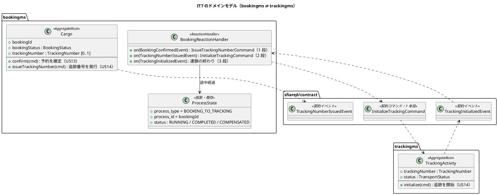
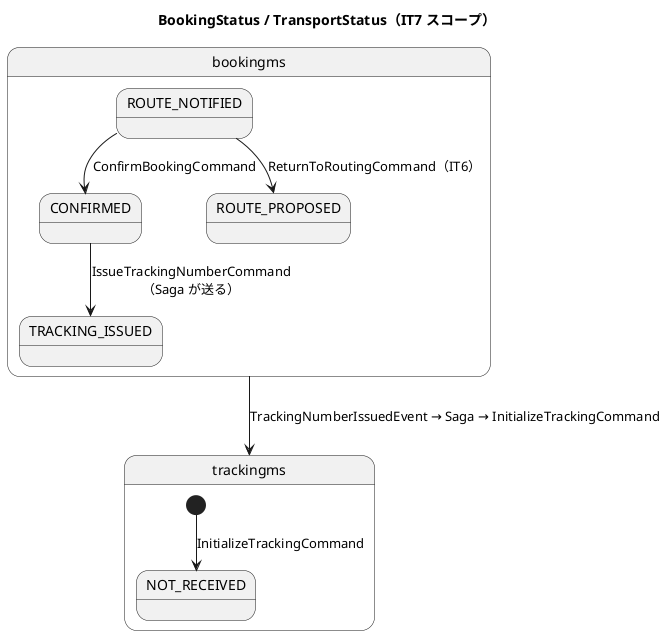
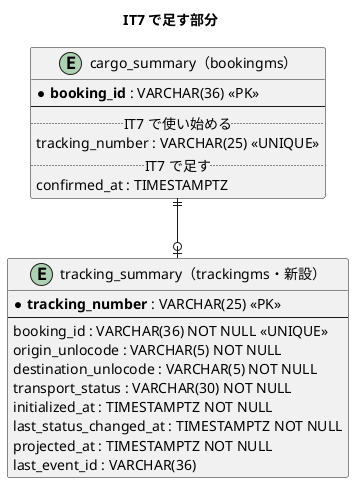
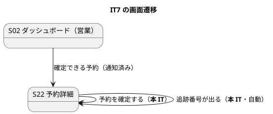

# イテレーション 7 計画 - 予約確定と追跡番号発行

## 概要

| 項目 | 内容 |
| :--- | :--- |
| イテレーション | IT7（Release 0.2 経路設計と予約確定・**中盤**） |
| 期間 | 2 週間 |
| SP | **9**（US13 3 / US14 6） |
| 局面 | 中盤（インサイドアウト）。IT4 から数えて 4 回目 |
| 引き継ぎ枠 | **SP 対象外で 3 件**（IT6 の高 3 件。Day 1 の独立コミットで消化） |

**本 IT の中核は、サービスをまたぐ最初の連鎖です。** 予約を確定すると追跡番号が発行され、trackingms に追跡が作られます。**契約コマンドの 1 本目**（`InitializeTrackingCommand`）と、**trackingms の最初の集約**（`TrackingActivity`）と、**`BookingReactionHandler` の 1 本目**が同時に出てきます。

**調整役は Axon の `@Saga` ではなく `BookingReactionHandler` + `process_state` です**（[ドメインモデル](../../design/cargo-tracker/domain-model.md) `:1318-1352`）。**着手前の検証で見つけました**——当初の計画は `architecture_backend.md` の「予約 Saga」節だけを読んで `@Saga` を使うと書いていましたが、**ドメインモデルは 3 段の Reaction Handler で決着済み**で、途中経過・タイムアウト・補償の置き場まで決まっています。設計が正なので、そちらに合わせます。

**これまでのサービス間はイベントの一方向でした。** IT5 で同期の問い合わせ（Query Bus 越しの ACL）が 1 本通り、本 IT で**コマンドを送る向き**が初めて通ります。

## ゴール

### イテレーション終了時の達成状態

- 営業が予約詳細（S22）から**予約を確定**でき、状態が「確定」になる
- 確定すると**追跡番号が自動で発行**され、予約詳細に出る
- 追跡番号が発行されると、**trackingms に追跡が作られ**、貨物状態が「未受領」になる
- 追跡番号は**一意**で、**二重に発行されない**

### 成功基準

- [ ] デモ項目の受け入れテストがすべて緑
- [ ] `TZ=UTC ./gradlew build` が緑（JaCoCo の層別閾値を含む）
- [ ] フロントの `npm run test`・`npx tsc -b`・`npm run build` が緑
- [ ] `./gradlew :acceptance-tests:test` が緑
- [ ] **US を終えたコミットのメッセージに、回した品質ゲートの結果を 1 行書いた**（IT6 の T5b。**IT5・IT6 と 2 回続けて守れなかったので、置き方を「タスク表」から「コミットの本文」に変える**。書けないなら回していない）
- [ ] **分岐を足したタスクの終わりに `jacocoTestCoverageVerification` を回した**（IT6 の T5）
- [ ] **設計ドキュメントに書いた「〜は残る」「〜になる」を、その変更の中で赤にした**（IT6 の T1）
- [ ] **利用者に見せる文字列を、設計の要素表と突き合わせる canon テストで固定した**（IT6 の T2。`BookingStatus`・**`TransportStatus`** に広げる）
- [ ] **値を足したら「集約 → イベント → 投影 → 読み口 → 画面」を 1 本読み直した**（IT6 の T3）
- [ ] **層をつなぐ組み立てを 1 本踏む検査を置いた。スタブは受け取った引数を捕捉し、捨てない**（IT6 の T8c）
- [ ] **モックは URL で出し分けた**（IT6 の T4）
- [ ] **受入基準を 1 項目ずつ表にして、満たす／未達を個別に書いた**（IT6 の T7。「等」でまとめない）
- [ ] **列を足したら、同じ変更の中で読み口まで作った**（IT6 の T8b）
- [ ] **追加・変更した画面を、それを見る他のロールから何が読めるか確かめた**
- [ ] **内部の列挙名を利用者に見せていない**
- [ ] **クラスタ E2E を Day 9 に 1 度、クローズ前にもう 1 度回した。Pod を作り直したあと 1 度空回ししてから測った**（IT6 の T8d）
- [ ] SonarQube の Quality Gate がバックエンド・フロントエンドとも PASS
- [ ] `npx gulp okf:check` が ERROR 0
- [ ] ユーザーマニュアルの該当章が更新され、画面キャプチャが再生成されている
- [ ] **並列レビューをクローズの最初に起動し、45 分は待った。返着するまでレビュー結果に関する記述を書かなかった**（IT6 の T8）
- [ ] **クローズで計画を更新するとき、文書内の `- [ ]` を全部数えてから埋めた**（IT6 の T8e）

## ユーザーストーリー

### 対象ストーリー

| ID | ストーリー | SP | 対応 UC |
| :--- | :--- | :--: | :--- |
| US13 | 予約を確定する | 3 | UC11 |
| US14 | 追跡番号を発行する | 6 | UC12 |
| **合計** | | **9** | |

### 受入基準の割り当て（IT6 の T7：1 項目ずつ数える）

| ID | # | 受入基準 | 本 IT | 備考 |
| :--- | :--: | :--- | :--- | :--- |
| US13 | 1 | 予約番号を指定して予約内容と選択ルートを確認できる | **満たす** | S22 に既にある（IT5・IT6） |
| US13 | 2 | 確定操作を行うと予約状態が「予約確定」に更新される | **満たす** | `ConfirmBookingCommand` |
| US13 | 3 | 経路設計者に追跡番号発行依頼の通知が送信される | **一部未達** | **発行は連鎖が自動で行うので、依頼の通知は要らなくなる**（下記「設計への反映が必要な事項」1）。通知の記録は残さない |
| US13 | 4 | 荷主がルート変更を希望する場合、予約を「経路提案中」に戻せる | **満たす** | **IT6 で実装済み**（`ReturnToRoutingCommand`）。検査で固定する |
| US13 | 5 | 荷主がキャンセルを希望する場合、予約をキャンセル状態に変更できる | **未達** | US30（IT12）が前提 |
| US13 | 6 | キャンセル時、荷主にキャンセル確認通知が送信される | **未達** | 同上 |
| US14 | 1 | 「予約確定」状態の予約に対して追跡番号を発行できる | **満たす** | 不変条件 8 |
| US14 | 2 | 追跡番号は一意に採番される | **満たす** | 投影側で採番（`booking_number` と同じ形） |
| US14 | 3 | 発行後、貨物状態が「受領待ち」に設定される | **満たす** | trackingms の `TransportStatus.NOT_RECEIVED` |
| US14 | 4 | 荷主に追跡番号と追跡方法をメール通知する | **一部未達** | 送信基盤はスコープ外（`ui_design.md:120`）。**通知した記録は US12 の仕組みで残せる**ので、S22 の通知内容に追跡番号を含める |

**未達は 3 点、一部未達は 2 点です。** US13 §5・§6 は US30（IT12）が前提で、US13 §3 は設計（連鎖が自動で発行する）によって不要になります。US14 §4 は記録と手作業の組で満たします。

### ストーリー詳細

| ID | として | したい | なぜなら | 中核の判断 |
| :--- | :--- | :--- | :--- | :--- |
| US13 | 営業担当者 | 荷主の承認を確認して予約を正式確定したい | 追跡番号発行・輸送手配に進めるから | **通知していない予約は確定できない**（荷主が知らないうちに確定しない） |
| US14 | 経路設計者 | 確定した予約に追跡番号を発行したい | 荷主が輸送状況を確認できるから | **二重に発行しない**（不変条件 8）。**採番は投影側**（集約で MAX+1 しない） |

## タスク

| # | タスク | ストーリー | 見積 |
| :--- | :--- | :--- | :--: |
| T1 | `Cargo.confirm`（`ConfirmBookingCommand` / `BookingConfirmedEvent`）と不変条件 | US13 | 4h |
| T2 | 投影（`booking_status`・`confirmed_at`）、S22 の確定操作、**S02 の「確定できる予約」の行と、その行から S22 へ行ける到達性テスト** | US13 | 5h |
| T3 | `Cargo.issueTrackingNumber`（不変条件 8：`CONFIRMED` のみ・二重発行禁止） | US14 | 4h |
| T4 | **契約コマンド `InitializeTrackingCommand` を `shared/contract/command/` に置く**（1 本目）。**ゴールデン JSON を両側に置いて赤から始める**。ArchUnit の名簿と「列挙型・識別子型を載せない」検査も更新 | US14 | 4h |
| T5 | **trackingms の `TrackingActivity` 集約**（`InitializeTrackingCommand` → `TrackingInitializedEvent`） | US14 | 5h |
| T6 | trackingms の投影（`tracking_summary`）とマイグレーション | US14 | 4h |
| T7 | **`BookingReactionHandler`（3 段）と `process_state`**（`BOOKING_TO_TRACKING`）。再試行の上限超過で `RevertTrackingNumberCommand` + `attention_item` | US14 | 8h |
| T8 | 追跡番号の採番（投影側）と S22 への表示 | US14 | 3h |
| T9 | 認可の宣言（`POST /bookings/{id}/confirmation`）と HTTP の配線 | US13・US14 | 3h |
| T10 | 引き継ぎ枠 H.1〜H.3 | — | 9h |
| T11 | クラスタ E2E・受け入れテスト・マニュアル | — | 10h |
| **合計** | | | **59h** |

### 依存関係

T1 → T2 → T3 → T4 → T5 → T6 → T7 → T8 の順。**T4〜T7 が本 IT の山**です。T7（調整役）は T3・T5 が動いてからでないと通しで確かめられません。

**T4 の最初にゴールデン JSON を置きます**（[開発戦略](development_strategy.md) の中盤ワークフロー「Phase 0: 契約が絡むなら最初に。US08・US14・US15 が該当」）。**US14 は名指しされています。**

## スケジュール

### Day 1: 引き継ぎ枠（SP 対象外）

**IT5・IT6 で有効だった「Day 1 の独立コミットで消化する」形を 3 回目も繰り返します**（IT6 の T9）。

| # | 内容 | 出所 | 見積 |
| :--- | :--- | :--- | :--: |
| H.1 | **探索が落ちていても条件と差し戻しを使えるようにする。** 条件を候補算出の応答から切り離し、予約から組む | IT6 引き継ぎ 8b（高・2 視点） | 4h |
| H.2 | **`BookingStatus`・`TransportStatus` の呼び名を canon テストで固定する。** IT6 で `RoutingStatus` に置いた形を広げる | IT6 引き継ぎ 3（高） | 2h |
| H.3 | **`assignRoute`／`notifyShipper`／`returnToRouting` を述語に寄せ、canon テストを述語本体を読む形へ統一する。** `canAssignRoute` にも突き合わせを足す | IT6 引き継ぎ 8c（中） | 3h |

**IT6 引き継ぎ 8（差し戻された営業に打つ手が無い）は本 IT で扱いません。** 新しいコマンドとイベントが要り、US13 の「経路提案中に戻す」（§4）とも重なるので、**US13 の実装で当たったら判断します**（下記リスク）。

### IT7 で扱わない引き継ぎ（行き先を先に決める）

| # | 内容 | 行き先 |
| :--- | :--- | :--- |
| 1 | US10 §2「経由地追加」が未達 | **IT11（US28）**。誤配の再設計で「必ず通る港」が要るので、そこで一緒に入れる |
| 1b | US10 §2「貨物種別変更」が未達 | **要件として起票するまで扱わない。** ADR が要る判断で、いま急ぐ業務が無い |
| 2 | US12 §2「料金概算」が未達 | **IT13（US21）** |
| 4 | `cargo_summary` の列が増え続けている | **IT8**。荷主向け一覧（US18）で読み口を分けるときに一緒に見る |
| 5 | 通知の宛先を荷主の連絡先から初期表示する | **IT8**。荷主向け画面（US18）で `shipper` を読むときに一緒に |
| 6 | ADR の承認と `verify`（0004〜0009） | **人の署名。代筆しない** |
| 7 | Sonar の Code Smell 46 件（既存分） | **扱わない。** 新規 0 を保ち、触るときに直す |
| 8 | 差し戻された営業に打つ手が無い | **US13 の実装で当たったら判断**（上記） |
| 9 | 経路設計者が「自分がもう差し戻したか」を S30 で読めない | **IT8** |
| 10 | 探索が落ちていると条件も差し戻しも使えない | **8b と同じもの**（ふりかえりに二重に載っていた）。H.1 で扱う |
| 11 | 確定済みの経路が外れる警告 | **IT8** |
| 12 | 航海キャンセル後に組み直しが要る予約が一覧に立たない | **IT9**。荷役（US15）で `cargo_snapshot` を作るときに一緒に |
| 13 | 所要日数の起点・計算式が 2 か所 | **IT8** |
| 14 | 到着期限の `min`・「所要日数／所要時間」の揺れ | **IT8** |

### Day 2-3: US13 予約を確定する（3 SP）

T1・T2。**「通知していない予約は確定できない」**を集約に置きます。

### Day 4-8: US14 追跡番号を発行する（6 SP）

T3〜T8。**ゴールデン JSON → 契約コマンド → trackingms の集約 → 調整役** の順に、下から積みます（中盤のインサイドアウト）。

**T5（trackingms の集約）だけで 1 度緑にしてから T6（投影）へ進みます。** 集約・投影・読み口・画面を同時に作ると、どこで落ちたか分からなくなります。

### Day 9: クラスタ E2E（1 回目）

**Pod を作り直したあと 1 度空回ししてから測ります**（IT6 の T8d）。

### Day 10: 受け入れテストとマニュアル

デモ項目の Gherkin と、マニュアル（05 章に確定、**11 章または既存章に追跡番号**）。

### Day 11-14: クローズ

`closing-iteration` の 7 ステップ。**並列レビューはクローズの最初に起動し、45 分は待ちます。**

## 設計

### 対象スコープの設計図

#### ドメインモデル（本 IT で触る部分）

**`BookingReactionHandler` を使います**（`domain-model.md:1318-1352`）。**Axon の `@Saga` は使いません。**

**着手前の検証で見つけた食い違いです。** 当初の計画は `architecture_backend.md:775-820`「予約 Saga」節だけを読んで `@Saga` を採ると書き、`release_plan.md:208`（「`BookingSaga` は US14 が 1 本目」）を根拠にしていました。**しかし `domain-model.md` は 3 段の Reaction Handler で決着済み**で、次まで決まっています。

| 決まっていること | 置き場 |
| :--- | :--- |
| 関連付け | `process_state` の行（`SagaLifecycle.associateWith()` の代わり） |
| 終了 | 3 段目で `status = 'COMPLETED'`（`@EndSaga` の代わり。行は消さない） |
| タイムアウト | `status = 'RUNNING'` かつ 24 時間より古い行を `gulp reaction:stuck` で走査 |
| 補償 | 上限超過で `RevertTrackingNumberCommand` + `attention_item`。**予約は `CONFIRMED` に留まる** |

**`process_state` は V003 で実装済みです**（`process_type = 'BOOKING_TO_TRACKING'`・`process_id = bookingId`）。**本 IT が最初の利用者になります。**

**Saga のストアに直列化して埋めるのと違い、止まった位置がそのまま SQL で読めます**（`domain-model.md:1345`）。

**`TrackingNumber` は BC ごとに別の型にします**（`domain-model.md:285`「置かないもの」に識別子が挙がっている）。契約コマンド・契約イベントでは**文字列**で運びます。**列挙型も契約に出しません**——`TransportStatus`（trackingms）も `BookingStatus` も、同じ名前でも BC ごとに値と意味が違います。`TrackingInitializedEvent` に状態を載せると違反です。

#### 状態遷移（本 IT で通る経路）

**正典どおりです**（`domain-model.md:513-515`）。

#### ER（本 IT で足すもの）

**`tracking_summary` はデータモデルに定義済み**（`data-model.md:501-521`）です。**本 IT で使う列だけを作り**、荷役・例外・キャンセルの列（`current_unlocode`・`misrouted`・`open_exception_count` など）は、それを書くイベントを実装する IT で足します（**中身の無い列を先に作ると、動くと誤解される**）。

**`tracking_number` は投影側で採番します**（`booking_number` と同じ形。`data-model.md`「集約で MAX+1 しない」）。

**`shipper_id` は本 IT で作りません。** データモデル（`data-model.md:504`）は `NOT NULL` と定めていますが、**`TrackingNumberIssuedEvent` に `shipperId` がありません**（`domain-model.md:1222` の主なフィールドは `bookingId`・`trackingNumber`・`origin`・`destination`・`cargoType`・`legs[]`・`issuedAt`）。trackingms は荷主 ID を得る手段を持ちません。

**着手前の検証で見つけました。** 選択肢は 2 つです。

| 案 | 内容 | 判断 |
| :--- | :--- | :--- |
| A | `TrackingNumberIssuedEvent` に `shipperId` を足す | **契約イベントの変更**になる。荷主向け追跡（US18・IT8）で必ず要るので、**そこで足すのが自然** |
| B | 本 IT では `shipper_id` を作らない | **採用。** 本 IT で書く相手がいない列を先に作らない（計画自身の方針。「中身の無い列を先に作ると、動くと誤解される」） |

**US18（IT8）で案 A を実施し、そのとき列を足します。** 反映事項 2c に書きます。

#### 画面遷移（本 IT で触る画面）

**新しい画面はありません。** S22 に確定の操作と追跡番号の表示が増え、S02 に「確定できる予約」の件数が増えます（`ui_design.md:66` が S22 の操作として「確定」を挙げています）。

### API 設計

| メソッド | パス | 用途 | ロール |
| :--- | :--- | :--- | :--- |
| `POST` | `/api/v1/booking/bookings/{bookingId}/confirmation` | 予約を確定（US13） | ROLE_SALES |

**追跡番号の発行に API はありません。** Saga が自動で送ります。**画面から発行させると、確定と発行の間に人の操作が挟まって連鎖が切れます。**

**`GET /bookings/{id}` に `trackingNumber` を足します**（既存の読み口）。

### 契約への影響

**増えます。** 契約コマンドが **0 → 1 本**（`InitializeTrackingCommand`）になります。

**契約の名簿は ArchUnit で固定されている**ので、名簿と検査を同じ変更で更新します。`architecture_backend.md:714` は「コマンド 2」（`InitializeTrackingCommand`・`CreateInvoiceCommand`）と書いていますが、実装は 0 本です。**本 IT で 1 本目を置きます。**

### ADR

**ADR-0010（新規）: サービスをまたぐ連鎖の調整役を Reaction Handler に一本化する。**

**「どちらを使うか」はドメインモデルで決着済み**なので、ADR が決めるのは**設計文書の食い違いをどう畳むか**と、**実装で初めて決まること**です。

1. **調整役は `BookingReactionHandler` + `process_state`。Axon の `@Saga` は使わない。** `architecture_backend.md:775-820`「予約 Saga」節と「Saga 実装パターン」節は**ドメインモデルと食い違うので改める**（同じ文書のコンポーネント図・ディレクトリ図は既に Reaction Handler）。`release_plan.md:208` の「`BookingSaga` は US14 が 1 本目」も直す
2. **追跡番号の採番は投影側。** 集約で MAX+1 しない（`ShipperCode`・`BookingNumber` と同じ形）
3. **`process_state` の 3 段をどう区切るか。** 段が進むたびに `completed_steps` を進め、3 段目で `COMPLETED` にする。**再試行の上限と、上限超過で `RevertTrackingNumberCommand` + `attention_item` に落とすところ**（`domain-model.md:1346` の既定路線）を、実装で決まる粒度まで書く

**決定の数だけ検査を対応させます**（IT5・IT6 で守れた形）。決定 3 は「止まった連鎖が SQL で読める」「上限超過で要確認一覧に出る」の 2 本になります。

### 設計への反映が必要な事項

| # | 反映先 | 内容 |
| :--- | :--- | :--- |
| 1 | `user_story.md`（US13 §3） | **「経路設計者に追跡番号発行依頼の通知が送信される」は、Saga が自動発行する設計と矛盾する。** 依頼が不要になるので、受入基準を「確定すると追跡番号が自動で発行される」に改めるか、未達として残すかを決める。**本 IT で当たる** |
| 2 | `architecture_backend.md`（`:775-820`） | **「予約 Saga」節と「Saga 実装パターン」節が `domain-model.md:1318-1352` と食い違う。** ドメインモデルは Reaction Handler + `process_state` で決着済み。**設計が正なので architecture_backend の 2 節を改める**（同じ文書のコンポーネント図・ディレクトリ図は既に Reaction Handler） |
| 2b | `release_plan.md`（`:208`） | 「`BookingSaga` は US14（IT7）が 1 本目」を、Reaction Handler の 1 本目に直す |
| 2c | `domain-model.md`（`:1222`） | **`TrackingNumberIssuedEvent` に `shipperId` が無いのに、`tracking_summary.shipper_id` は NOT NULL**。trackingms は荷主 ID を得る手段が無い。イベントに足すか、本 IT では列を作らないかを決める（下記 ER 参照） |
| 3 | `data-model.md` | `cargo_summary` に `confirmed_at` を足す。`tracking_summary` は「本 IT で作る列」と「後続 IT で足す列」を区別して書く |
| 4 | `domain-model.md` 要素表 | `TrackingNumber` が bookingms と trackingms で別の型になることを明記（`VoyageNumber` と同じ形） |
| 5 | `ui_design.md`（S22） | 予約確定の操作と追跡番号の表示を書く。**「追跡番号は自動で出る（発行の操作は無い）」**ことも書く |
| 6 | `ui_design.md`（S02 営業） | 「確定できる予約（通知済み）」の行を足す |

## リスクと対策

| リスク | 影響 | 対策 |
| :--- | :--- | :--- |
| **連鎖が初めてで、失敗の見え方を実装で作り直してしまう** | 既存の仕組み（`process_state`・`attention_item`）と別の見え方が増える | **どちらも実装済み**（`V003__create_process_state.sql`・`AttentionItemMapper`）。**新しく作らず既存を使う**。ADR-0010 決定 3 で粒度だけ決める |
| **契約コマンドの 1 本目で、両サービスが同じクラスを持つ必要がある** | 型名が違うと購読側で復元できない | `shared/contract/command/` に置き、ArchUnit の名簿を同じ変更で更新する。**クラスタで 1 度通す**（Testcontainers では両サービスを同時に起こさない） |
| **trackingms が空の骨組みで、投影・マイグレーション・設定が一式要る** | 見積もりを超える | T5・T6 を分け、**T5（集約）だけで 1 度緑にしてから** T6（投影）に進む |
| US13 §5・§6（キャンセル）が US30 前提 | 受入基準の未達 | 計画時点で未達として明記済み |
| 引き継ぎ枠が本体を押し出す | IT5・IT6 と同じ形で Day 1 に置く | 独立コミットで Day 1 に閉じる。溢れたら **US14 を削らず引き継ぎ枠を落とす** |

## 完了条件

### Definition of Done

- [ ] US13・US14 の受入基準（`user_story.md`）を満たす。**ただし US13 §3・§5・§6 と US14 §4 は未達または一部未達**（理由を完了報告書に記録）
- [ ] デモ項目の受け入れテストがすべて緑。**対応はテスト名でなく本文のアサーションで確かめる**
- [ ] 引き継ぎ枠 H.1〜H.3 が返済されている、または送った理由がふりかえりに書かれている
- [ ] 本 IT で足した検査を壊して赤を見た
- [ ] **通知していない予約は確定できないことを、集約と HTTP の両方で確かめた**
- [ ] **追跡番号を二重に発行できないことを確かめた**（不変条件 8）
- [ ] **連鎖が最後まで通ることを、クラスタで 1 度確かめた**（Testcontainers では両サービスを同時に起こさない）
- [ ] **連鎖が途中で止まったときに、止まった位置が `process_state` から SQL で読めることを確かめた**（ADR-0010 決定 3）
- [ ] **上限を超えた連鎖が要確認一覧に出ることを確かめた**（同上。`RevertTrackingNumberCommand` + `attention_item`）
- [ ] **契約のゴールデン JSON を bookingms・trackingms の両側に置き、赤から始めた**（開発戦略の Phase 0。US14 は名指し）
- [ ] **契約に列挙型・識別子型を載せていない**（文字列・数値・日付のみ。ArchUnit で固定）
- [ ] `./gradlew build` が緑・`TZ=UTC ./gradlew build` が緑
- [ ] フロントの `npm run test`・`npx tsc -b`・`npm run build` が緑
- [ ] **新しい経路が `RoleAuthorization` にメソッド込みで宣言され、そのロール以外は 403 になることを検査した**
- [ ] **契約コマンドの名簿を ArchUnit で固定し、同じ変更で更新した**
- [ ] UI 設計・navbar・ダッシュボード・到達性テストの 4 点が一致している
- [ ] **内部の列挙名を利用者に見せていない**。`TransportStatus` の呼び名も canon テストで固定した
- [ ] **kind クラスタで動く**：イメージを作り直して載せ直し、全 Pod が Ready
- [ ] **クラスタに対して E2E が緑（Day 9 とクローズ前の 2 回）**
- [ ] `npx gulp okf:check` が ERROR 0
- [ ] SonarQube の Quality Gate がバックエンド・フロントエンドとも PASS
- [ ] **ユーザーマニュアルが更新されている**（05 章に確定、追跡番号の説明）
- [ ] **設計への反映が必要な事項 6 件が `docs/design/` に反映されている**
- [ ] ADR-0010 を作成し、**決定の数だけ検査を対応させた**
- [ ] ふりかえり（`retrospective-7.md`）と完了報告書（`iteration_report-7.md`）を作成した

### デモ項目

| # | 見せるもの | 役割 | 何をアサートするか |
| :--- | :--- | :--- | :--- |
| 1 | 通知済みの予約を確定できる | 営業 | 状態が「確定」になる |
| 2 | 通知していない予約は確定できない | 営業 | 集約が断る。**API を直接叩いても守られる**。画面にボタンも出ない |
| 3 | 確定すると追跡番号が自動で出る | 営業 | S22 に追跡番号が出る（発行の操作は無い） |
| 4 | 追跡番号は二重に発行されない | — | 不変条件 8。同じ予約に 2 度目を送っても増えない |
| 5 | 追跡が trackingms に作られ、貨物状態が「未受領」になる | — | **サービスをまたいで届く**。クラスタで確かめる |
| 6 | 連鎖が途中で止まったら、誰かに見える | 追跡 | **`process_state` に止まった位置が残り**、上限超過で要確認一覧に出る（ADR-0010 決定 3） |
| 7 | 確定した予約は経路設計へ戻せない | 営業 | 遷移表どおり（`CONFIRMED` から `ROUTE_PROPOSED` は無い） |

## 局面の確認（中盤の継続）

IT4 から数えて 4 回目の中盤です。**本 IT はサービスをまたぐので、インサイドアウトの積み方を明示します。**

- **契約 → 相手の集約 → Saga の順に積む。** Saga から書き始めると、送る先が無いまま調整だけができる
- **trackingms は集約だけで 1 度緑にする。** 投影・読み口・画面を同時に作らない
- **クラスタで 1 度通す。** サービス間のコマンドは、Testcontainers の単一サービス構成では通らない

## 関連ドキュメント

- [リリース計画](release_plan.md)・[開発戦略](development_strategy.md)
- [IT6 ふりかえり](retrospective-6.md)・[IT6 完了報告書](iteration_report-6.md)・[IT6 実装レビュー](../../review/cargo-tracker/IT6実装_review_20260906.md)
- [ユーザーストーリー](../../requirements/user_story.md)
- [ドメインモデル](../../design/cargo-tracker/domain-model.md)・[データモデル](../../design/cargo-tracker/data-model.md)・[バックエンドアーキテクチャ](../../design/cargo-tracker/architecture_backend.md)・[UI 設計](../../design/cargo-tracker/ui_design.md)
