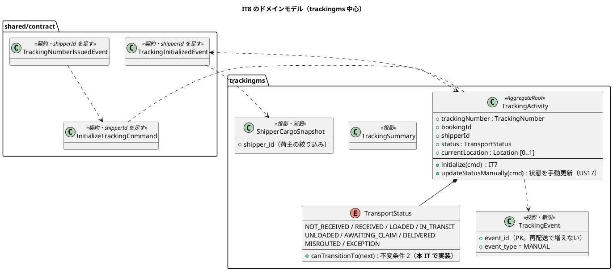
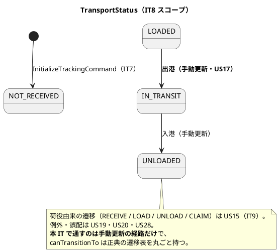
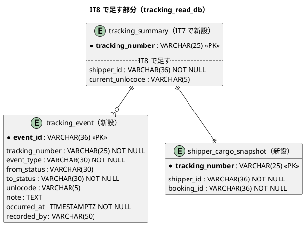
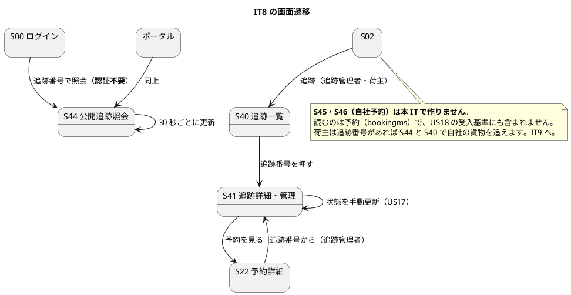

# イテレーション 8 計画 - 追跡照会と手動更新

## 概要

| 項目 | 内容 |
| :--- | :--- |
| イテレーション | IT8（Release 1.0 追跡と荷役・**中盤**） |
| 期間 | 2 週間 |
| SP | **8**（US18 5 / US17 3） |
| 局面 | 中盤（インサイドアウト）。IT4 から数えて 5 回目 |
| 引き継ぎ枠 | **SP 対象外で 3 件**（IT7 の**高 2 件 + 中 1 件**。Day 1 の独立コミットで消化） |

**本 IT で貨物が「見える」ようになります。** IT7 で追跡が作られるところまで通ったので、ここから**追跡番号だけで外から照会でき**（S44・認証不要）、**荷主は自社の貨物だけが見え**、**追跡管理者が状態を手動で更新できる**ようになります。

**trackingms がクエリ側と操作を持つ最初の IT です。** IT7 では集約と投影だけでした。

## 着手前に見つけた重大な不整合（**US18 の前提**）

### 追跡番号の形式が正典に違反している

| 項目 | 内容 |
| :--- | :--- |
| **正典** | `domain-model.md:1431`「`TrackingNumber` は荷主に共有されるため**推測されにくい形式（`TRK-` + 大文字英数字 10 桁）**」。`ui_design.md:1298`「総当たり対策 … 追跡番号は推測しにくい形式（英数 10 桁）にする」 |
| **IT7 の実装** | `T-2026-000001`（`T-` + 年 + 6 桁の**連番**）。`tracking_number_seq` から採る |
| **なぜ重大か** | **US18 の公開照会は認証不要**。連番だと 1 つ知れば前後がすべて推測でき、他人の貨物の状態・現在地・到着予定が読める。ui_design が明記した「総当たり対策」の設計意図を壊している |
| **どこで作り込んだか** | IT7 の T8。[ADR-0010](../../adr/cargo-tracker/0010-reaction-handler-as-the-only-coordinator.md) 決定 2 に「シーケンスで採る」と書いてしまっており、**ADR も正典と食い違っている** |

**T1 で直します。** ADR-0010 決定 2 を訂正し（形式は正典、採番の場所は投影側のまま）、既存の発行済み番号の扱いも決めます。

## ゴール

### イテレーション終了時の達成状態

- **追跡番号だけで、ログインせずに貨物の状態・現在地・到着予定・履歴が読める**（S44）
- **存在しない追跡番号と、権限の無い追跡番号を区別しない**（どちらも同じ案内）
- 荷主は**自社の貨物だけ**が見える
- 追跡管理者が**状態を手動で更新**でき、履歴に残る（S41）
- **追跡番号が推測しにくい形式になっている**

### 成功基準

- [ ] デモ項目の受け入れテストがすべて緑
- [ ] `TZ=UTC ./gradlew build` が緑（JaCoCo の層別閾値を含む）
- [ ] フロントの `npm run test`・`npx tsc -b`・`npm run build` が緑
- [ ] `./gradlew :acceptance-tests:test` が緑
- [ ] **タスクに着手する前に、その名前で `grep -r` して既にあるか探した**（IT7 の T1。**`process_state` の一式を上書きしかけた**）
- [ ] **行数の基準に合わせるために、判断の理由を書いたコメントを削らなかった**（IT7 の T3）
- [ ] **イベントに載せる値を「購読側の投影が作れるか」で決めた**（IT7 の T2。**受け側の列を先に並べて確かめる**）
- [ ] **要確認一覧・知らせの宛先を「対処できる人」に、リンクを「その人の次の一手」に合わせた**（IT7 クローズの高 2 件）
- [ ] **クラスタ E2E が自分の作ったデータを名指しで探していない**（IT7 の T5）
- [ ] **US を終えたコミットのメッセージに、回した品質ゲートの結果を 1 行書いた**（IT6 の T5b。IT7 で守れた）
- [ ] **分岐を足したタスクの終わりに `jacocoTestCoverageVerification` を回した**
- [ ] **US ごとに SonarQube を 1 度回した**（IT7 の T7。クローズで 11 件まとめて直すことになった）
- [ ] **利用者に見せる文字列を、設計の要素表と突き合わせる canon テストで固定した**（`TransportStatus` は IT7 で実施済み。**`ExceptionType`・`HandlingType` は本 IT で出たら**）
- [ ] **値を足したら「集約 → イベント → 投影 → 読み口 → 画面」を 1 本読み直した**
- [ ] **モックは URL で出し分けた**
- [ ] **受入基準を 1 項目ずつ表にして、満たす／未達を個別に書いた**
- [ ] **内部の列挙名を利用者に見せていない**
- [ ] **クラスタ E2E を Day 9 に 1 度、クローズ前にもう 1 度回した**
- [ ] SonarQube の Quality Gate がバックエンド・フロントエンドとも PASS
- [ ] `npx gulp okf:check` が ERROR 0
- [ ] ユーザーマニュアルの該当章が更新され、画面キャプチャが再生成されている
- [ ] **並列レビューをクローズの最初に起動し、1 時間は待った。返着しなければ自己レビューで補完し、待った時間を記録した**（IT7 の T4。**IT7 では 1 時間半待って返着しなかった**）
- [ ] **全体ビルドで落ちたテストは、単独で再実行して切り分けたうえで記録した**（IT7 の T6）
- [ ] **クローズで計画を更新するとき、文書内の `- [ ]` を全部数えてから埋めた**

## ユーザーストーリー

### 対象ストーリー

| ID | ストーリー | SP | 対応 UC |
| :--- | :--- | :--: | :--- |
| US18 | 追跡情報を照会する | 5 | UC15 |
| US17 | 貨物状態を手動更新する | 3 | UC14 |
| **合計** | | **8** | |

### 受入基準の割り当て（1 項目ずつ数える）

| ID | # | 受入基準 | 本 IT | 備考 |
| :--- | :--: | :--- | :--- | :--- |
| US18 | 1 | 追跡番号を入力して貨物情報を照会できる | **満たす** | S44（認証不要） |
| US18 | 2 | 現在の状態・位置（港湾名）・推定到着日が表示される | **一部未達** | **現在地は荷役（US15・IT9）が書く**。本 IT では手動更新（US17）で入った位置だけ。推定到着日は `tracking_leg` の最終区間から出す |
| US18 | 3 | 追跡イベント履歴が時系列で表示される | **一部未達** | 正典は「日時・**場所**・**作業種別**」（`user_story.md:428`）。**作業種別は荷役（US15・IT9）が書く**ので、`handling_type` を本 IT で作らない以上出せない。日時・場所・状態の変化までを出す |
| US18 | 4 | 見つからない場合「追跡番号が見つかりません」 | **満たす** | **存在しない番号と権限の無い番号を区別しない**（`ui_design.md:1296`） |
| US18 | 5 | ログインなしでも照会できる | **満たす** | S44。`/api/v1/tracking/public/**` は PUBLIC_PATHS に**予約済み**（IT1 から） |
| US18 | — | （画面の割り当て） | **一部を送る** | `ui_design.md:1537` は US18 に 5 画面（S44・S40・S41・S45・S46）を割り当てる。**S45・S46 は予約の画面**で受入基準に含まれないため IT9 へ（理由は下記） |
| US17 | 1 | 追跡番号を指定して現在の貨物情報を確認できる | **満たす** | S41 |
| US17 | 2 | 新しい状態・位置・日時を入力して更新できる | **満たす** | `UpdateTransportStatusCommand`。遷移は `TransportStatus#canTransitionTo` が許すものだけ（不変条件 2） |
| US17 | 3 | 更新後、追跡イベントが履歴に記録される | **満たす** | `tracking_event`（`event_type = MANUAL`） |
| US17 | 4 | 状態変更の種類に応じて荷主への通知が送信される | **一部未達** | 送信基盤はスコープ外（`ui_design.md:120`）。**記録として残す**か、荷主が S44/S46 で読めることで代える |

**一部未達は 3 点です。** US18 §2 の「現在位置」と §3 の「作業種別」は荷役（US15・IT9）が前提、US17 §4 は送信基盤がスコープ外です。**着手前の検証で §3 の判定の誤りを見つけました**——「履歴が出る」ことだけを見て「満たす」としていましたが、正典は履歴に何が載るかまで定めています。

### ストーリー詳細

| ID | として | したい | なぜなら | 中核の判断 |
| :--- | :--- | :--- | :--- | :--- |
| US18 | 荷主・荷受人 | 追跡番号で状況を自分で確認したい | 到着準備と業務計画に使えるから | **存在しない番号と権限の無い番号を区別しない**（区別すると番号の存在が漏れる）。**追跡番号は推測しにくい形式** |
| US17 | 追跡管理者 | 荷役では捕捉できない状態変化を反映したい | 出港・入港が追跡に出ないと荷主が読めないから | **遷移表が許すものだけ**（不変条件 2）。**例外発生中は動かさない**（不変条件 5） |

## タスク

| # | タスク | ストーリー | 見積 |
| :--- | :--- | :--- | :--: |
| T1 | **追跡番号を正典の形式（`TRK-` + 大文字英数字 10 桁）にする。** ADR-0010 決定 2 を訂正。既存の発行済み番号の扱いを決める。**採番の場所は投影側のまま** | US18 前提 | 4h |
| T2 | `TransportStatus#canTransitionTo`（不変条件 2）。**遷移表を正典から写し、canon テストで固定**。**同じ変更で javadoc を直す**——いまは「`canTransitionTo` と `afterHandling` は荷役（US15・IT9）で足す」と書いてあり、前倒しすると実装と食い違ったまま残る（コメントは仕様として読まれる） | US17 | 4h |
| T3 | `UpdateTransportStatusCommand` / `TransportStatusUpdatedEvent` と **`TrackingActivity#updateStatusManually`**（正典の名前。`domain-model.md:762`）。**荷役由来の `AdvanceTrackingCommand`（IT9）と同じ集約に入る**ので、名前で区別が付くようにする。**例外発生中は動かさない**（不変条件 5 の下地） | US17 | 5h |
| T4 | `tracking_event` テーブルと投影。**追記系なので `event_id` を PK にして再配送で増えない**（data-model:43） | US17・US18 | 4h |
| T5 | **`shipperId` を 3 本のイベント／コマンドに足す**（`TrackingNumberIssuedEvent` → `InitializeTrackingCommand` → `TrackingInitializedEvent`）。**`Cargo` 集約に `shipperId` フィールドと `on(CargoBookedEvent)` での代入を先に足す**（いまは `book()` を通り抜けるだけで保持していない）。`tracking_summary.shipper_id` と `shipper_cargo_snapshot` を作る。**契約 2 本（`InitializeTrackingCommand`・`TrackingInitializedEvent`）はゴールデン JSON を先に赤にする** | US18 | 7h |
| T6 | 公開照会の読み口（`GET /api/v1/tracking/public/{trackingNumber}`）と **S44 画面**（**既存の `PublicTrackingPage` プレースホルダを埋める**）。**見つからない案内・入力形式のヒント・問い合わせの出口** | US18 | 6h |
| T6b | **総当たり対策**（`ui_design.md:1298`）。同一 IP から 1 分に 10 回を超える公開照会を Gateway で `429` にする。**gatewayms に実装が無い**（`grep` で 0 件）ので新設。**認証不要経路の唯一の防御**で、番号の形式を直すだけでは止まらない | US18 | 4h |
| T7 | **S41 追跡詳細・管理**（状態の履歴・手動更新）と **S40 追跡一覧**（`/tracking`）。**追跡管理者と荷主の両方の入口**（`ui_design.md:144-145` は S40・S41 のロールを「追跡、**荷主（自社のみ）**」と定める）。navbar・ダッシュボード・到達性テストの 4 点を**両ロールで**合わせる | US17・US18 | 7h |
| T8 | 荷主の絞り込み（`ROLE_SHIPPER` は自社の追跡だけ）。**`X-Shipper-Id` ヘッダは伝播済み**（authms → Gateway）なので、trackingms 側で突き合わせる | US18 | 4h |
| T9 | 認可の宣言（公開経路・追跡管理者・荷主）と HTTP の配線 | US17・US18 | 3h |
| T10 | 引き継ぎ枠 H.1〜H.3 | — | 10h |
| T11 | クラスタ E2E・受け入れテスト・マニュアル | — | 10h |
| **合計** | | | **67h** |

### 既にあるもの（**着手前に `grep` で確かめた**。IT7 の T1）

IT7 で `process_state` を「新設」と誤認して実装済みの一式を上書きしかけたので、本 IT では計画の段階で確かめました。

| もの | 状態 | 本 IT での扱い |
| :--- | :--- | :--- |
| `/api/v1/tracking/public/**` | **PUBLIC_PATHS に登録済み**（IT1 から。`JwtAuthenticationFilter:37`） | そのまま使う。**新しく開けない** |
| `PublicTrackingPage` と `/track`・`/track/:trackingNumber` | **プレースホルダとして実装済み**（`routes.tsx:56-57`）。「次のイテレーションで使えるようになります」と出る | **中身を埋める**（新設ではない） |
| ログイン画面・ポータルからの入口 | **実装済み**（IT7 の教訓で入れた）。クラスタ E2E に検査もある | そのまま使う |
| `TransportStatus`（9 値・呼び名） | **実装済み**（IT7）。`canTransitionTo` は**未実装**（「いま要らない判断を先に書かない」として保留） | 遷移だけ足す |
| `tracking_summary`・`tracking_leg` | **実装済み**（IT7） | 列を足す |
| `tracking_event`・`shipper_cargo_snapshot` | **未実装**（`grep` で 0 件） | 新設 |
| `UpdateTransportStatusCommand`・`TransportStatusUpdatedEvent` | **未実装**（`grep` で 0 件） | 新設 |
| authms の利用者に `shipper_id` | **実装済み**（V002。`ROLE_SHIPPER` のときだけ持つ） | そのまま使う |

### US18 が触る画面（**着手前の確認で 5 画面あることが分かった**）

`ui_design.md:1537` は US18 に **S44・S40・S41・S45・S46** の 5 画面を割り当てています。計画は当初 S44 と S41 しか見ていませんでした。

| 画面 | 内容 | 本 IT |
| :--- | :--- | :--- |
| S44 公開追跡照会 | 追跡番号だけで照会（認証不要） | **作る**（T6）。**受入基準 1・4・5 はここ** |
| S41 追跡詳細・管理 | 状態の履歴・手動更新 | **作る**（T7）。**受入基準 2・3 はここ** |
| S40 追跡一覧 | 追跡管理者・荷主が自分の対象を並べる | **作る**（T7）。**S41 への入口**で、無いと追跡管理者は S41 にたどり着けない |
| S45 自社予約一覧 | 荷主が自社の**予約**を並べる | **作らない**（下記） |
| S46 自社予約の進み具合 | 荷主が自社の**予約**の進み具合を見る | **作らない**（下記） |

**S45・S46 を本 IT で作らない理由。** どちらも読むのは**予約**（bookingms）で、追跡ではありません。**US18 の受入基準 5 項目はすべて「追跡番号での照会」**であり、S45・S46 が無くても満たせます。荷主は追跡番号があれば S44 と S40 で自社の貨物を追えます。

**行き先は IT9 です**（US15 の荷役で `cargo_snapshot` を作り、荷主向けの読み口を bookingms 側に整えるときに一緒に）。**「余力次第」にはせず、ここで数字を書きます。**

### 依存関係

T1 → T5（形式を直してから `shipperId` を足す。契約を 2 度触らない）。T2 → T3 → T4 → T7（状態の判断 → 操作 → 履歴 → 画面）。T5 → T6 → T8（荷主 ID が入ってから絞り込み）。

**T1 を最初に置きます。** US18 の公開照会は認証不要で、番号の推測しやすさがそのまま情報漏れになります。

## スケジュール

### Day 1: 引き継ぎ枠（SP 対象外）

**IT5・IT6・IT7 で有効だった「Day 1 の独立コミットで消化する」形を 4 回目も繰り返します。**

| # | 内容 | 出所 | 見積 |
| :--- | :--- | :--- | :--: |
| H.1 | **止まった連鎖と補償をクラスタで再現する。** trackingms を落として `process_state` が `RUNNING` のまま残ること・上限超過で要確認一覧に出ることを確かめる | IT7 引き継ぎ 1（高） | 4h |
| H.2 | **差し戻された営業に打つ手を作る。** 見直しを終えたことを記録して経路設計者へ返す。**経路設計者が「自分がもう差し戻したか」を S30 で読める**ようにする | IT7 引き継ぎ 2（高。IT6 引き継ぎ 8・9 由来） | 4h |
| H.3 | **クラスタ E2E のデータが積み上がる問題。** 実行前にデータを作り直す手順、または区間を一意にする仕組み | IT7 引き継ぎ 8（中） | 2h |

**「余力次第」にはしません。** H.2 は **IT7 で「US13 の実装で当たったら判断」として送ったもの**で、当たらなかったため 2 IT 連続の繰越です。ここで返します。

**引き継ぎ 3（`shipper_id`・`shipper_cargo_snapshot`）は本体 T5 に取り込みました。** US18 の「荷主は自社の貨物だけが見える」が成り立たないためで、引き継ぎ枠ではなくストーリーの一部です。

**IT7 引き継ぎ 10 件の行き先（漏れなく）:** 1 → H.1、2 → H.2、**3 → T5（本体）**、4 → IT9、5 → T8 で当たったら / IT9、6 → IT9、7 → T6 で当たる、8 → H.3、9（ADR の承認と `verify`）→ **人の署名**、10（既存の Code Smell）→ 扱わない。

### IT8 で扱わない引き継ぎ（行き先を先に決める）

| # | 内容 | 行き先 |
| :--- | :--- | :--- |
| 4 | `cargo_summary` の列が増え続けている | **IT9**。荷役で `cargo_snapshot` を作るときに読み口の分け方を見る |
| 5 | 通知の宛先を荷主の連絡先から初期表示する | **IT8 の T8 で当たったら**（荷主 ID の紐付けを触るため）。当たらなければ IT9 |
| 6 | 確定済みの経路が外れる警告（航海キャンセル時） | **IT9**。荷役で予定と実績を照合するときに一緒に |
| 7 | 所要日数の起点・計算式が 2 か所／「所要日数／所要時間」の揺れ | **IT8 の T6 で当たる**（推定到着日を出すため）。そこで 1 か所に寄せる |
| 10 | Sonar の Code Smell（既存分） | **扱わない。** 新規 0 を保ち、触るときに直す |
| 9 | ADR の承認と `verify`（0004〜0010） | **人の署名。代筆しない** |

### Day 2-6: US18 追跡照会（5 SP）

T1（形式）→ T5（`shipperId`）→ T6（公開照会）→ T8（荷主の絞り込み）。

**T1 を終えてから契約を触ります。** 形式と `shipperId` を別々に足すと、契約を 2 度変えることになります。

### Day 7-9: US17 手動更新（3 SP）

T2（遷移表）→ T3（コマンド）→ T4（履歴）→ T7（画面）。**遷移の判断を先に集約へ置きます**（中盤のインサイドアウト）。

### Day 10: クラスタ E2E（1 回目）

### Day 11: 受け入れテストとマニュアル

### Day 12-14: クローズ

`closing-iteration` の 7 ステップ。**並列レビューはクローズの最初に起動し、1 時間で見切りをつけます**（IT7 の実測）。

## 設計

### 対象スコープの設計図

#### ドメインモデル（本 IT で触る部分）

**`TransportStatus#canTransitionTo` を本 IT で実装します。** IT7 では「いま要らない判断を先に書かない」として保留しました（書くと実装が無いまま「守っている」と読める）。US17 が最初の利用者です。

**`afterHandling(type, isFinalPort)` は本 IT で書きません。** 荷役（US15・IT9）が最初の利用者で、同じ理由です。

**不変条件 1 に注意します。** 「`TrackingNumber` は Booking が採番し、**Tracking は検証も採番もしない**」。IT7 の `TrackingNumber` 値オブジェクトは空チェックだけで、**形式の検証は入れません**（`TRK-` の形式を trackingms が知ると、採番の責任が二重になります）。

#### 状態遷移（本 IT で通る経路）

**遷移表は正典（`domain-model.md:822-860`）を丸ごと写します。** 本 IT で通るのは一部でも、表を部分的に持つと後続 IT で足すたびに「どこまで写したか」が分からなくなります。**canon テストで正典の図と突き合わせます。**

#### ER（本 IT で足すもの）

**`event_id` を PK にします**（`data-model.md:43`）。追記系の投影は元イベントの識別子を UNIQUE にしないと、少なくとも 1 回配送の再配送で同じ行が二度入ります。

**`handling_type` / `voyage_number` は本 IT で作りません。** 書くのは荷役（IT9）で、中身の無い列を先に作ると動くと誤解されます。

**`tracking_summary.shipper_id` は `NOT NULL` にします。** IT7 の既存行（クラスタに 1 件）は開発データなので、マイグレーションで**削除して作り直す**か、`DEFAULT` を置いて後で埋めるかを T5 で決めます。

#### 画面遷移（本 IT で触る画面）

**S44 は認証不要です。** ログイン画面とポータルに入口を置きます（`ui_design.md:114`。IT7 の教訓「認証不要の画面は入口も認証の外に置く」）。

### API 設計

| メソッド | パス | 用途 | ロール |
| :--- | :--- | :--- | :--- |
| `GET` | `/api/v1/tracking/public/{trackingNumber}` | 公開照会（US18） | **認証不要**（PUBLIC_PATHS に予約済み） |
| `GET` | `/api/v1/tracking/trackings/{trackingNumber}` | 追跡詳細（US17・US18） | ROLE_TRACKER・ROLE_SHIPPER（自社のみ） |
| `POST` | `/api/v1/tracking/trackings/{trackingNumber}/status` | 状態の手動更新（US17） | ROLE_TRACKER |

**公開の読み口と社内の読み口を分けます。** 同じ経路にロールで出し分けを足すと、認証不要の経路に社内向けの項目が漏れます。**公開側は状態・位置・到着予定・履歴だけ**で、荷主名・予約番号・社内メモは出しません。

### 契約への影響

**増えません（フィールドが増えます）。** 契約コマンドは 1 本のまま、契約イベントは 2 本のままです。

| 契約 | 変更 |
| :--- | :--- |
| `TrackingNumberIssuedEvent` | `shipperId` を足す（`data-model.md:575` が `shipper_cargo_snapshot` の元と指定） |
| `InitializeTrackingCommand` | 同上（trackingms へ渡す） |
| `TrackingInitializedEvent` | 同上（trackingms の投影が読む） |

**3 本すべてに載せます。** 1 本でも落とすと、そこで値が消えます（IT7 の実測）。

### `TrackingNumberIssuedEvent` は契約イベントではない（**着手前の検証で判明**）

**正典と実装が既に乖離しています。**

| | 実際 |
| :--- | :--- |
| `shared/contract/event/` の中身 | `ShipperRegisteredEvent` と `TrackingInitializedEvent` の **2 本だけ** |
| `TrackingNumberIssuedEvent` の場所 | `bookingms/domain/model/events/`（**bookingms 内部**）。`BookingReactionHandler` がプロセス内で購読 |
| `domain-model.md:1222` | 契約イベント 11 本の表に載せ、購読者に **trackingms と handlingms** を挙げる |
| `data-model.md:577,830` | `shipper_cargo_snapshot` の元イベントを `TrackingNumberIssuedEvent` と指定 |

**trackingms はこのイベントを購読できません**（BC の外にあるので）。つまり **正典が実装不能な指定をしています**。

**本 IT の判断: 契約へ昇格させず、正典側を直します。**

- trackingms が `shipper_cargo_snapshot` を作れるのは **`TrackingInitializedEvent` から**だけ。`data-model.md` の元イベントをこちらに直す
- `domain-model.md:1222` の購読と用途を「trackingms（**`BookingReactionHandler` 経由**。直接購読しない）」に直す
- **handlingms が `cargo_snapshot` を作る IT9 で、契約へ昇格させるかを判断します**。実際に BC の外から購読する必要が出るのはそのときで、それまで契約に置くと「読む側の無い契約を先に敷く」ことになります（`architecture_backend.md` の判断）

**したがってゴールデン JSON を赤にするのは契約 2 本**（`InitializeTrackingCommand`・`TrackingInitializedEvent`）です。`TrackingNumberIssuedEvent` は bookingms の内部イベントなので、bookingms の検査で守ります。

**フィールドの追加は許されます**（削除・型変更が禁止）。IT7 に発行済みのイベントは `shipperId` が `null` で復元されます。**投影は `null` の分を書きません**（`shipper_cargo_snapshot` に行ができない）。開発データなので作り直します。

### ADR

**ADR-0011（新規）: 追跡番号は推測されにくい形式にする。**

1. **形式は `TRK-` + 大文字英数字 10 桁**（正典どおり。`domain-model.md:1431`）
2. **採番の場所は投影側のまま**（ADR-0010 決定 2 は場所については正しい）。**連番をやめ、衝突検査つきの乱数にする**
3. **ADR-0010 決定 2 の「シーケンスで採る」を訂正する**
4. **既存の発行済み番号の扱い**（開発データの作り直し）

**決定の数だけ検査を対応させます。**

### 設計への反映が必要な事項

| # | 反映先 | 内容 |
| :--- | :--- | :--- |
| 1 | `domain-model.md`（`:1222`） | `TrackingNumberIssuedEvent` の payload に **`shipperId` を足す**（IT7 で「US18 で足す」と決めた） |
| 2 | `data-model.md` | `tracking_summary.shipper_id`・`tracking_event`・`shipper_cargo_snapshot` を「IT8 で作る」に更新。`current_unlocode` は手動更新で入る分だけ |
| 3 | ADR-0010 決定 2 | 採番の形式を訂正（ADR-0011 で行う） |
| 3b | `data-model.md`（`:577`・`:830`） | **`shipper_cargo_snapshot` の元イベントを `TrackingInitializedEvent` に直す**。`TrackingNumberIssuedEvent` は bookingms 内部で、trackingms は購読できない |
| 3c | `domain-model.md`（`:1222`） | **`TrackingNumberIssuedEvent` の購読と用途を「trackingms（`BookingReactionHandler` 経由。直接購読しない）」に直す**。契約イベント 11 本の表に載っているが `shared/contract` には無い |
| 3d | `trackingms/TransportStatus` の javadoc | 「`canTransitionTo` は IT9 で足す」を「**`canTransitionTo` は US17（IT8）で実装。`afterHandling` は IT9**」に直す（T2 の同じ変更で） |
| 4 | `ui_design.md`（S44） | **推定到着日の出し方**（`tracking_leg` の最終区間の荷降し）を明記。所要日数の計算式が 2 か所ある問題（IT7 引き継ぎ 7）もここで 1 か所に寄せる |
| 5 | `ui_design.md`（S41） | 本 IT で出すのは「状態の履歴」と「状態を手動更新」だけ。例外・誤配・陸揚げ待ちは後続 IT と明記 |

## 着手前の検証（ステップ 3・4）の結果

**自己検証を先に行い、そのあと並列の検証エージェント 2 本が遅れて返着したので統合しました。** IT7 のクローズでは「返らない」と判断して自己レビューで確定させましたが、**今回は遅着分に高 4 件・中 5 件が入っていました**（IT6 と同じ形で、待つ価値がありました）。

### 自己検証で見つけたもの

| # | 見つけたもの | 反映 |
| :--- | :--- | :--- |
| 高 1 | **追跡番号が正典違反**（`TRK-` + 英数 10 桁のはずが `T-2026-000001` の連番）。**US18 は認証不要なので推測で他人の貨物が読める** | **T1 を最初に置いた**。実データ（`-000001`・`-000005`・`-000007`）で裏を取った。ADR-0011 で訂正 |
| 高 2 | **US18 は 5 画面にまたがる**（`ui_design.md:1537`）。計画は 2 画面しか見ていなかった | S40 を足し、**S45・S46 を作らない理由と行き先（IT9）**を書いた |
| 中 1 | **`PublicTrackingPage` とルートが既に実装済み**（プレースホルダ） | 「既にあるもの」の表を足し、**中身を埋める作業**と書き直した |
| 中 2 | 不変条件 1「**Tracking は検証も採番もしない**」 | 設計の節に明記した |
| 中 3 | IT7 引き継ぎ 3（`shipper_id`）は引き継ぎ枠ではなく**ストーリーの一部** | 本体 T5 に取り込んだ |

### 検証エージェントの遅着分（自己検証で見落としていたもの）

| # | 見つけたもの | 反映 |
| :--- | :--- | :--- |
| 高 3 | **`TrackingNumberIssuedEvent` は契約イベントではない。** `shared/contract/event` にあるのは 2 本だけで、実体は bookingms 内部。**正典（`data-model.md:577,830`・`domain-model.md:1222`）が trackingms に購読できないイベントを投影の元と指定している** | **正典側を直す判断**を書いた（契約への昇格は handlingms が要る IT9）。ゴールデン JSON は契約 2 本 |
| 高 4 | **総当たり対策の `429` が実体を持たない。** `gatewayms/src/main` に実装 0 件（`grep`）。計画は T6 の括弧書きだけで、タスク行・DoD・デモ項目に無い。**認証不要経路の唯一の防御** | **T6b（4h）として独立**させ、DoD とデモ項目 8 に足した |
| 高 5 | **荷主の S40・S41 到達性がスコープに無い。** `ui_design.md:144-145` は両画面のロールを「追跡、**荷主（自社のみ）**」と定め、デモ項目 6 も荷主が対象なのに、T7 は追跡管理者しか見ていなかった | T7 を「**両ロールの入口**」に直し、DoD の 4 点一致も両ロールでと明記 |
| 中 4 | **`Cargo` 集約が `shipperId` を保持していない**（`book()` を通り抜けるだけ）。T5 は配線に見えて**集約変更を伴う** | T5 に集約フィールドと `on(CargoBookedEvent)` の更新を明記。見積 5h → 7h |
| 中 5 | **`TransportStatus` の javadoc が「`canTransitionTo` は IT9 で足す」と宣言**している。前倒しすると実装と食い違ったまま残る | T2 で**同じ変更で javadoc を直す**と明記（設計反映 3d） |
| 中 6 | **集約メソッド名が正典と違う**（正典は `updateStatusManually`）。IT9 の `AdvanceTrackingCommand` と併存するので名前で区別が要る | 正典に寄せた |
| 中 7 | **引き継ぎの番号取り違え**（引き継ぎ 9 は「ADR の承認」）。**引き継ぎ 3 が両表のどちらにも載っていない** | H.2 の出所を直し、**10 件の行き先を 1 行にまとめた** |
| 中 8 | **「更新履歴」セクションの欠落**（テンプレート必須。**IT7 に続き 2 回連続**） | 本計画に追加し、**IT7 の計画にも遡って追加** |

**両エージェントが独立に同じものを指摘したのは 5 件**（高 3・高 5・中 4・中 5・中 6・中 7）でした。

**検証の対象**: `user_story.md`（US18・US17）、`domain-model.md`（不変条件 1〜11・遷移表・コマンド表・`:762` のメソッド名・`:1222` の契約表・`:1431` の形式）、`data-model.md`（3 テーブルの列と制約・`:43` の追記系規約・`:577,830` の元イベント）、`ui_design.md`（S44・S41・S40・`:144-145` のロール・`:115` の荷主導線・`:1298` の総当たり対策・`:1537` の画面割り当て）、`development_strategy.md`（局面）、`release_plan.md:189`（SP）、`retrospective-7.md`（引き継ぎ 10 件）、`docs/template/イテレーション計画.md`（必須セクション）、既存コード（`grep` で実装状況）。

## リスクと対策

| リスク | 影響 | 対策 |
| :--- | :--- | :--- |
| **公開経路から社内の情報が漏れる** | 認証不要なので実害が大きい | 読み口を分ける（公開用の DTO を別に持つ）。**検査で「公開の応答に荷主名・予約番号が入らない」ことを固定** |
| **追跡番号の形式変更が契約に波及する** | 契約を 2 度触ることになる | **T1 を T5 より先に置く**。形式と `shipperId` を 1 度の変更にまとめる |
| 遷移表を部分的に写す | 後続 IT で「どこまで写したか」が分からなくなる | **正典を丸ごと写し、canon テストで突き合わせる** |
| `shipper_id` を `NOT NULL` にすると既存行が読めなくなる | IT7 の教訓「不変条件の追加は既存行を壊す」 | 開発データを作り直す。**手順を T5 で決めて記録する** |
| 引き継ぎ枠が本体を押し出す | IT5〜IT7 と同じ形で Day 1 に置く | 独立コミットで Day 1 に閉じる。溢れたら **US18 を削らず引き継ぎ枠を落とす** |

## 完了条件

### Definition of Done

- [ ] US18・US17 の受入基準（`user_story.md`）を満たす。**ただし US18 §2 と US17 §4 は一部未達**（理由を完了報告書に記録）
- [ ] デモ項目の受け入れテストがすべて緑。**対応はテスト名でなく本文のアサーションで確かめる**
- [ ] 引き継ぎ枠 H.1〜H.3 が返済されている、または送った理由がふりかえりに書かれている
- [ ] 本 IT で足した検査を壊して赤を見た
- [ ] **追跡番号が `TRK-` + 大文字英数字 10 桁になっている。連番でないことを検査した**
- [ ] **公開の応答に荷主名・予約番号・社内メモが入らないことを検査した**
- [ ] **同一 IP からの総当たりが `429` で止まることを検査した**（`ui_design.md:1298`。**認証不要経路の唯一の防御**）
- [ ] **存在しない追跡番号と権限の無い追跡番号を区別しないことを検査した**
- [ ] **遷移表が正典と一致していることを canon テストで固定した**（部分的に写していない）
- [ ] **例外発生中は手動更新で状態が動かないことを確かめた**（不変条件 5 の下地）
- [ ] **`tracking_event` が再配送で増えないことを確かめた**（`event_id` が PK）
- [ ] **`shipperId` が契約 3 本すべてを生き延びることを確かめた**（集約 → イベント → 投影 → 読み口 → 画面）
- [ ] **荷主は自社の追跡だけが見えることを確かめた**（他社の番号で 404 と同じ応答）
- [ ] `./gradlew build` が緑・`TZ=UTC ./gradlew build` が緑
- [ ] フロントの `npm run test`・`npx tsc -b`・`npm run build` が緑
- [ ] **新しい経路が `RoleAuthorization` にメソッド込みで宣言され、そのロール以外は 403 になることを検査した**（公開経路は除外の宣言も検査する）
- [ ] UI 設計・navbar・ダッシュボード・到達性テストの 4 点が一致している
- [ ] **追跡管理者と荷主の両方が S40・S41 にたどり着ける**（navbar・ダッシュボード。`ui_design.md:144-145`）。**状態軸の到達性**も——どの状態の追跡からでも開けるか
- [ ] **認証不要の画面の入口が、ログイン画面とポータルにある**（IT7 の教訓）
- [ ] **内部の列挙名を利用者に見せていない**
- [ ] **kind クラスタで動く**：イメージを作り直して載せ直し、全 Pod が Ready
- [ ] **クラスタに対して E2E が緑（Day 10 とクローズ前の 2 回）**
- [ ] `npx gulp okf:check` が ERROR 0
- [ ] SonarQube の Quality Gate がバックエンド・フロントエンドとも PASS
- [ ] **ユーザーマニュアルが更新されている**（公開追跡照会・追跡管理の章）
- [ ] **設計への反映が必要な事項 5 件が `docs/design/` に反映されている**
- [ ] ADR-0011 を作成し、**決定の数だけ検査を対応させた**
- [ ] ふりかえり（`retrospective-8.md`）と完了報告書（`iteration_report-8.md`）を作成した

### デモ項目

| # | 見せるもの | 役割 | 何をアサートするか |
| :--- | :--- | :--- | :--- |
| 1 | 追跡番号だけで、ログインせずに状況が読める | 荷受人 | S44。状態・出発・到着予定・履歴 |
| 2 | 見つからない番号には案内と問い合わせ先を出す | 荷受人 | **存在しない番号と権限の無い番号を区別しない** |
| 3 | 追跡番号が推測しにくい | — | `TRK-` + 英数 10 桁。**連番でない** |
| 4 | 追跡管理者が状態を手動更新でき、履歴に残る | 追跡 | S41。`event_type = MANUAL` |
| 5 | 遷移表が許さない更新は断る | 追跡 | 不変条件 2。**API を直接叩いても守られる** |
| 6 | 荷主は自社の貨物だけが見える | 荷主 | 他社の番号は「見つかりません」 |
| 7 | 公開の応答に社内の情報が入らない | — | 荷主名・予約番号・社内メモが無い |
| 8 | **総当たりが止まる** | — | 同一 IP から 1 分に 10 回を超えると `429`。**番号の形式を直すだけでは止まらない** |

## 局面の確認（中盤の継続）

IT4 から数えて 5 回目の中盤です。

- **遷移の判断を先に集約へ置く**（`canTransitionTo`）。画面から導くと貧血になる
- **契約を 1 度で変える。** 形式と `shipperId` を別々に足さない
- **公開の読み口を社内と分ける。** ロールで出し分けを足すと漏れる

## 更新履歴

| 日付 | 更新内容 | 更新者 |
| :--- | :--- | :--- |
| 2026-09-07 | IT8 計画を作成。**着手前の自己検証で高 2 件**——追跡番号が正典違反（連番。US18 は認証不要なので推測で他人の貨物が読める）、US18 が 5 画面にまたがる。既存実装を `grep` して「既にあるもの」の表を作った（IT7 で `process_state` を新設と誤認した反省） | claude-code/claude-opus-5 |
| 2026-09-07 | **検証エージェント 2 本が遅れて返着**したので統合。高 4 件・中 5 件を反映——US18 §3 の判定が誤り（作業種別は出せない）、**総当たり対策 429 が実体を持たない**（gatewayms に実装 0 件）、**`TrackingNumberIssuedEvent` は契約イベントではない**（正典が実装不能な指定をしている）、荷主の到達性がスコープに無い、`Cargo` が `shipperId` を保持していない、メソッド名が正典と違う、引き継ぎの番号取り違え、本節（更新履歴）の欠落。見積 61h → 67h | claude-code/claude-opus-5 |

## 関連ドキュメント

- [リリース計画](release_plan.md)・[開発戦略](development_strategy.md)
- [IT7 ふりかえり](retrospective-7.md)・[IT7 完了報告書](iteration_report-7.md)・[IT7 実装レビュー](../../review/cargo-tracker/IT7実装_review_20260907.md)
- [ユーザーストーリー](../../requirements/user_story.md)
- [ドメインモデル](../../design/cargo-tracker/domain-model.md)・[データモデル](../../design/cargo-tracker/data-model.md)・[UI 設計](../../design/cargo-tracker/ui_design.md)
