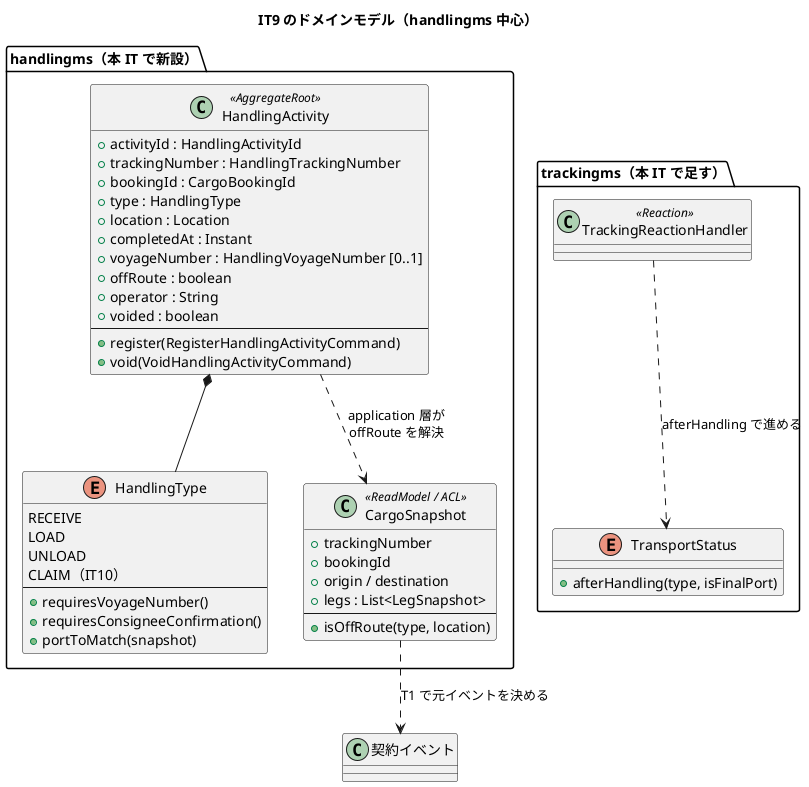
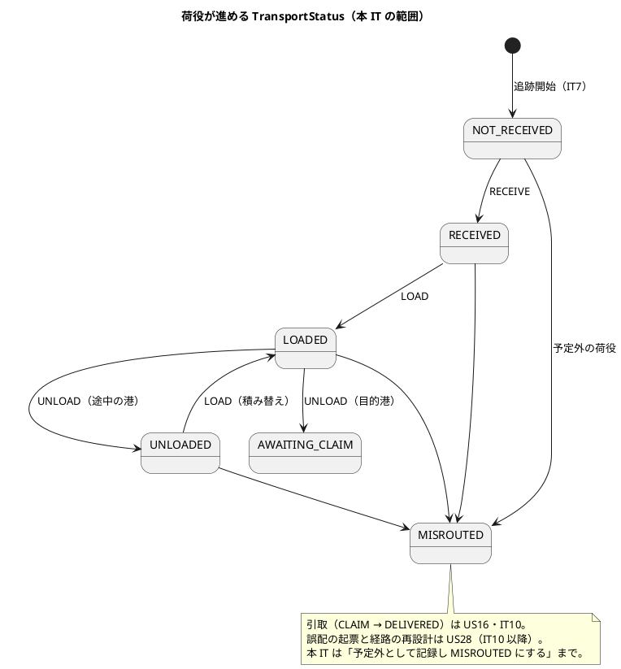
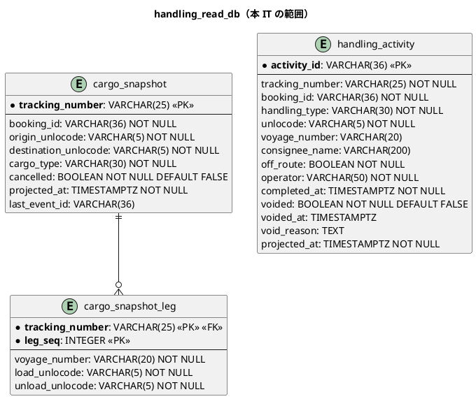
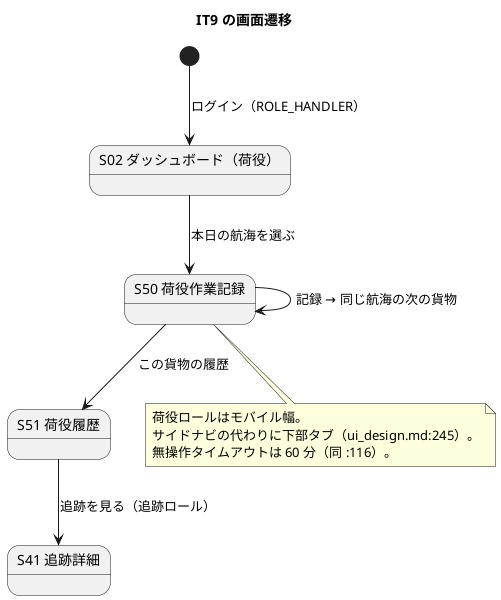

# イテレーション 9 計画 - 荷役作業の記録

## 概要

| 項目 | 内容 |
| :--- | :--- |
| イテレーション | IT9（Release 1.0 追跡と荷役・**中盤**） |
| 期間 | 2 週間 |
| SP | **7**（US15 7） |
| 局面 | 中盤（インサイドアウト）。IT4 から数えて 6 回目 |
| 引き継ぎ枠 | **SP 対象外で 3 件**（IT8 の高 1 件 + 中 2 件。Day 1 の独立コミットで消化） |
| 予備枠 | **1**（`release_plan.md`・`development_strategy.md` が IT9 に置いている。**ADR-0008 の返済に充てる**） |

**本 IT で handlingms が動き出します。** これまで骨組み（`package-info` と起動クラス）だけでした。荷役作業員が航海を起点に「この船からこの港で降ろす貨物」を出し、連続して記録できるようになります。**記録は追跡と予約に伝わり、貨物状態が自動で進みます。**

**荷役は 1 隻から 20〜50 本を連続で記録します。** 画面の作りも、冪等の担保も、この使い方から決まります。

## 着手前に見つけた重大な前提（**US15 の前提**）

### `cargo_snapshot` の元イベントが handlingms から購読できない

| 項目 | 内容 |
| :--- | :--- |
| **正典** | `data-model.md:648`「`cargo_snapshot` / `cargo_snapshot_leg` は `TrackingNumberIssuedEvent`, `CargoCancelledEvent`（**いずれも契約**）から作る」。`domain-model.md:215` も「`CargoSnapshot` は Booking の契約イベントを購読して Handling 側が作る」 |
| **実態** | `TrackingNumberIssuedEvent` は **bookingms の内部イベント**（`booking/domain/model/events/`）で、`shared/contract/event` には無い。契約イベントは現在 2 本（`ShipperRegisteredEvent`・`TrackingInitializedEvent`）だけ |
| **なぜ重大か** | `CargoSnapshot` が作れないと、**予定外の判定（`isOffRoute`）ができず**、US15 の受入基準「作業場所が予定ルートと異なる場合、警告が表示される」が満たせない。荷役の記録そのものが「どの貨物か」を解決できない |
| **既知だったか** | **IT8 で気づいて記録済み**。`domain-model.md:1223` に「handlingms が `cargo_snapshot` を作る IT9 で、契約へ昇格させるかを判断する」と書いた。**IT8 のふりかえり Try T5（正典の元イベントは購読できるか着手前に確かめる）が効いた** |

**T1 で決めます。** 選択肢は 2 つで、どちらを採るにも ADR が要ります。

| 案 | 内容 | 論点 |
| :--- | :--- | :--- |
| A | **`TrackingNumberIssuedEvent` を契約へ昇格**させる | 正典どおり。**契約は追記専用**なので、昇格したら形を変えられなくなる。IT8 で `shipperId` を足した直後なので、形は固まっている |
| B | **`TrackingInitializedEvent`（既存の契約）から作る** | 追加の昇格が要らない。ただし**発行者は trackingms**で、`domain-model.md` の「Booking の契約イベントを購読」と食い違う。`bookingId`・端点・貨物種別・旅程はすべて載っており、内容は足りる |

**IT8 で `shipper_cargo_snapshot` を取り下げたときと同じ判断が要ります。** あのときは「購読できる `TrackingInitializedEvent` から作れる内容が同じ」だったので表ごと畳みました。今回は表そのものが要る（予定外の判定に使う）ので、**畳むのではなく元イベントを決め直します**。

## ゴール

### イテレーション終了時の達成状態

- 荷役作業員が**航海を起点に**「この船からこの港で降ろす貨物」を出せる（S50）
- 追跡番号で貨物を特定し、**種別・日時・場所を連続して記録**できる
- 記録すると**貨物状態が自動で進む**（受領済・積込済・荷降し済）
- **予定ルート外の場所は警告のうえ記録に残る**（拒まない。現場ではすでに作業が終わっている）
- **同じ記録を二度送っても二重にならない**（クライアント生成の `activityId`）
- 記録を**取り消せる**（元の記録は残り、追跡と予約が戻る）

### 成功基準

- [ ] デモ項目の受け入れテストがすべて緑
- [ ] `TZ=UTC ./gradlew build` が緑（JaCoCo の層別閾値を含む）
- [ ] フロントの `npm run test`・`npx tsc -b`・`npm run build` が緑
- [ ] `./gradlew :acceptance-tests:test` が緑
- [ ] **US を終えるたびに SonarQube を回した**（IT7・IT8 と 2 回連続で守れていない。**T0 として独立のタスク行に立てた**）
- [ ] **クラスタ E2E を US ごとに回した**（IT8 の Try T2。終盤に集めない）
- [ ] **イメージを入れ替えたら「載ったこと」を確かめた**（IT8 の Try T3。Pod の年齢と配信物）
- [ ] **注釈マッパーで `SELECT *` を書いていない**（IT8 の Try T4。列名を定数に置く）
- [ ] **正典の「元になるイベント」が、その BC から購読できることを着手前に `grep` で確かめた**（IT8 の Try T5。**本 IT で 1 件見つかった**）
- [ ] **タスクに着手する前に、その名前で `grep -r` して既にあるか探した**
- [ ] **行数の基準に合わせるために、判断の理由を書いたコメントを削らなかった**
- [ ] **イベントに載せる値を「購読側の投影が作れるか」で決めた**
- [ ] **クラスタ E2E が自分の作ったデータを名指しで探していない**
- [ ] **US を終えたコミットのメッセージに、回した品質ゲートの結果を 1 行書いた**
- [ ] **分岐を足したタスクの終わりに `jacocoTestCoverageVerification` を回した**
- [ ] **利用者に見せる文字列を、設計の要素表と突き合わせる canon テストで固定した**（`HandlingType` は本 IT で出る）
- [ ] **値を足したら「集約 → イベント → 投影 → 読み口 → 画面」を 1 本読み直した**
- [ ] **モックは URL で出し分けた**
- [ ] **受入基準を 1 項目ずつ表にして、満たす／未達を個別に書いた**
- [ ] **内部の列挙名を利用者に見せていない**
- [ ] SonarQube の Quality Gate がバックエンド・フロントエンドとも PASS
- [ ] `npx gulp okf:check` が ERROR 0
- [ ] ユーザーマニュアルの該当章が更新され、画面キャプチャが再生成されている
- [ ] **並列レビューをクローズの最初に起動した**（IT8 は 10 分で全数返着した。**待つ価値がある**）
- [ ] **全体ビルドで落ちたテストは、単独で再実行して切り分けたうえで記録した**
- [ ] **クローズで計画を更新するとき、文書内の `- [ ]` を全部数えてから埋めた**

## ユーザーストーリー

### 対象ストーリー

| ID | ストーリー | SP | 対応 UC |
| :--- | :--- | :--: | :--- |
| US15 | 荷役作業を記録する | 7 | UC13 |
| **合計** | | **7** | |

### 受入基準の割り当て（1 項目ずつ数える）

| ID | # | 受入基準 | 本 IT | 備考 |
| :--- | :--: | :--- | :--- | :--- |
| US15 | 1 | 追跡番号の入力（またはスキャン）で貨物を特定できる | **満たす** | S50。**スキャンは入力欄への貼り付けで代える**（バーコード読取機はキーボード入力として届く。カメラ撮影は本 IT で作らない） |
| US15 | 2 | 作業種別（受領・積込・荷降し）を選択できる | **満たす** | `HandlingType` の `RECEIVE` / `LOAD` / `UNLOAD`。**`CLAIM` は US16（IT10）** |
| US15 | 3 | 作業日時と作業場所（UN/LOCODE）を入力できる | **満たす** | 既定は「今」と「当港」。**過去は通す・未来は拒否**（通信不能時は紙に控えて後から入れる） |
| US15 | 4 | 記録後、貨物状態が対応する状態に自動更新される | **満たす** | `TransportStatus#afterHandling` を実装し、`TrackingReactionHandler` が `AdvanceTrackingCommand` を送る |
| US15 | 5 | 記録後、荷主に状態変更通知が送信される | **一部未達** | 送信基盤はスコープ外（`ui_design.md:120`）。**荷主が S44・S41 で読めることで代える**。IT8 の引き継ぎ H.3（「変わったことに気づく手段」）を本 IT の T8 で作る |
| US15 | 6 | 追跡番号が存在しない場合、エラーメッセージが表示される | **満たす** | `cargo_snapshot` に無い番号。**Tracking の不変条件 8（知らない追跡番号の荷役では止まらない）とは別**——こちらは画面の入力検査 |
| US15 | 7 | 作業場所が予定ルートと異なる場合、警告が表示される | **満たす** | `CargoSnapshot#isOffRoute`。**場所を選んだ直後にインライン警告**（記録ボタンの前）。記録は拒まない |

**本 IT で IT8 の未達 2 件も解消します**（IT8 引き継ぎ H.2）。

| ID | # | IT8 で未達だった理由 | 本 IT での扱い |
| :--- | :--: | :--- | :--- |
| US18 | 2 | 現在位置は荷役が書く | **T6 で `tracking_summary.current_unlocode` を荷役由来でも埋める**（H.2 の N+1 解消と同じ変更） |
| US18 | 3 | 履歴の「作業種別」は荷役が書く | **T6 で `tracking_event` に `handling_type` を載せる**。`event_type = HANDLING` の行に種別が入る |

**一部未達は 1 点です。** US15 §5 は送信基盤がスコープ外で、IT8 の US17 §4 と同じ扱いになります。

### ストーリー詳細

| ID | として | したい | なぜなら | 中核の判断 |
| :--- | :--- | :--- | :--- | :--- |
| US15 | 荷役作業員 | 貨物を特定して作業種別・日時・場所を記録したい | 完了が即座に貨物状態へ反映され、荷主が読めるから | **要件は `HandlingType` 自身が持つ**（呼び出し側に `if (type == LOAD)` を書かせない）。**予定外でも記録は拒まない**（現場では作業が終わっている）。**冪等キーはクライアントが作る**（通信断の再送で二重にしない） |

## タスク

| # | タスク | ストーリー | 見積 |
| :--- | :--- | :--- | :--: |
| T0 | ✅ **US を終えるたびに SonarQube を回す**（IT7・IT8 と 2 回連続で守れていない。**独立の行として立てる**——括弧書きにすると実施されない） | — | 2h |
| T1 | **`cargo_snapshot` の元イベントを決めて ADR に書く**（上記の案 A / B）。**契約への昇格は追記専用で後戻りできない**ので、決めてから実装する。**`CargoCancelledEvent` も同じ判断に含める**——正典は元イベントを 2 本としており（data-model:648）、`cancelled` 列（同 :591）はキャンセル（US30・IT12）まで書き手が居ない。**書き手の無い列を先に作らない**なら、列ごと本 IT で作らないことを決める | US15 前提 | 3h |
| T1b | **契約のゴールデン JSON を先に置く**（`development_strategy.md:260` の Phase 0。**US15 は名指しで該当**）。本 IT で増える契約 2 本（`HandlingActivityRegisteredEvent`・`HandlingActivityVoidedEvent`）と、T1 で昇格を決めたものについて、**発行側と購読側の両方**にゴールデンと Axon Server 経由の往復テストを置く。**括弧書きにしない**——IT8 で「括弧書きの守りは実装されない」を実測した（T6b の 429） | US15 | 3h |
| T2 | `HandlingType`（`RECEIVE` / `LOAD` / `UNLOAD` / `CLAIM`）と要件表。**`requiresVoyageNumber` / `requiresConsigneeConfirmation` / `portToMatch` を型自身に持たせる**。要素表と突き合わせる canon テスト | US15 | 4h |
| T3 | `CargoSnapshot` の投影（`cargo_snapshot` / `cargo_snapshot_leg`）。**航海番号と港で引ける形**（`FindCargosOnVoyageQuery`）。T1 で決めた元イベントを購読。**投影が集約より先に来る理由**——これは他 BC のイベントから作る ACL の読み取りモデルで、`HandlingActivity` の登録時に予定外の判定（不変条件 2）に要る。中盤の順序（集約 → イベント → 投影）に対する例外はこの 1 件だけ | US15 | 6h |
| T4 | `HandlingActivity` 集約と `RegisterHandlingActivityCommand`（`activityId`・`trackingNumber`・**`bookingId`**・`type`・`location`・`completedAt`・`voyageNumber?`・**`operator`**・`offRoute`。`customsStatus` 系は IT10）。**不変条件 1（部分適用）・2・3・5・6・7**——**1 の `CLAIM` 行（荷受人確認・通関）は IT10** なので、T2 の canon テストでも `CLAIM` の要件列は固定しない。**冪等は同一 `activityId` の再送 + 5 分以内の重複拒否** | US15 | 7h |
| T5 | `handling_activity` 投影と `VoidHandlingActivityCommand`。**追記系なので `activity_id` を PK**（data-model:43）。索引は `INDEX(tracking_number, completed_at)` と **`INDEX(voyage_number, unlocode)`**（`FindCargosOnVoyageQuery` 用。data-model:649） | US15 | 4h |
| T6 | **`TransportStatus#afterHandling` と `TrackingReactionHandler`**。荷役から貨物状態が進む。**予定外は `MISROUTED`**（US28 の下地。誤配の起票そのものは IT10 以降）。**知らない追跡番号の荷役では止めず、記録を投影側に残す**（Tracking の不変条件 8。「止まらない」だけ作ると、届かなかった荷役が誰にも見えなくなる） | US15 | 6h |
| T6b | **bookingms 側の反応**（`BookingReactionHandler` が `HandlingActivityRegisteredEvent` / `HandlingActivityVoidedEvent` を購読 → `RecordHandlingCommand` / `RevertHandlingCommand`）。**Cargo の不変条件 12・13**（予定外なら `RoutingStatus = MISROUTED` と `BookingMisroutedEvent`、取り消しで `lastHandling` を巻き戻す）と `cargo_summary.last_handling_*` の投影。**ゴールとデモ項目 6・DoD が「予約に伝わる」と約束しているのに、タスクが無かった**（着手前の検証で発見） | US15 | 6h |
| T7 | **S50 荷役作業記録**（`/handling/voyages/:voyageNumber`。荷役）。航海起点・連続記録。**送信済みが積み上がり、未記録が減る**。予定外はインライン警告。**反映中の待ち合わせを持ち込まない**。**場所は港の候補から選ぶ**（IT8 レビュー 中 J。自由入力だと打ち間違いが現在地として荷受人にも出る） | US15 | 8h |
| T8 | ✅ **S51 荷役履歴**（`/handling/:trackingNumber`。荷役と追跡の両方）と、**荷主が「変わったこと」に気づく手段**（IT8 レビュー 中 M。「24 時間以内に状態が変わった N 件」をダッシュボードに）。荷役ロールのダッシュボード（**本日の航海だけ**。引取待ち・通関は IT10） | US15 | 6h |
| T9 | 認可の宣言（荷役ロール）と HTTP の配線。**S51 は荷役と追跡の両方**（`ui_design.md:236`） | US15 | 3h |
| T10 | 引き継ぎ枠 H.1〜H.3 | — | 8h |
| T11 | クラスタ E2E・受け入れテスト・マニュアル | — | 10h |
| **合計** | | | **76h** |

### 既にあるもの（**着手前に `grep` で確かめた**）

| 対象 | 状態 | 本 IT での扱い |
| :--- | :--- | :--- |
| handlingms | **骨組みだけ**（`package-info` 11 個と `HandlingApplication`）。マイグレーションは `V001__create_axon_tables.sql` のみ | 本 IT が最初の実装 |
| `TransportStatus#afterHandling` | **未実装**。javadoc が「荷役（US15・IT9）で足す」と宣言（IT8 の T2 で `canTransitionTo` だけ実装） | T6 で実装し、**同じ変更で javadoc を直す** |
| `AdvanceTrackingCommand` | **未実装**（`domain-model.md` にのみ存在） | T6 で新設 |
| `HandlingActivityRegisteredEvent`・`HandlingActivityVoidedEvent` | **未実装**。`data-model.md` は `cargo_summary` の `last_handling_*` の元イベントとして参照 | T4・T5 で新設（**契約**） |
| `CargoSnapshot` | **未実装**（コメントでの言及のみ 6 件） | T3 で新設 |
| 契約イベント | **2 本のみ**（`ShipperRegisteredEvent`・`TrackingInitializedEvent`）。`domain-model.md` の一覧は 11 本 | 本 IT で増える分だけ足す。**読む側の無い契約を先に敷かない** |
| 荷役ロール（`ROLE_HANDLER`） | `Role` に定義済み・`NAVIGATION` に荷役の項目は無い | T9 で navbar・ダッシュボード・到達性の 4 点をそろえる |

## 引き継ぎ枠（SP 対象外・Day 1 で消化）

| # | 内容 | 出所 | 見積 |
| :--- | :--- | :--- | :--: |
| H.1 | **荷主が上限を超えると予約が取れない**（荷主 219 件 / 一覧の上限 200 件）。**予約登録の荷主の選択肢に絞り込みを入れる**。クラスタ E2E 2 件が赤のまま | IT8 の高 1 | 4h |
| H.2 | **追跡一覧の N+1**（1 行ごとに旅程と履歴を引き、30 秒ごとに再実行）。`data-model.md` に定義済みの `current_unlocode` を投影で埋める | IT8 レビュー 中 A | 2h |
| H.3 | **`tracking_summary.shipper_id` が NULL の行の解消と NOT NULL 化**。誰にも紐づかないまま一覧に出続ける | IT8 レビュー 中 D | 2h |

### 予備枠（1・SP 対象外）

| # | 内容 | 出所 | 見積 |
| :--- | :--- | :--- | :--: |
| R.1 | **ADR-0008 の返済** | IT6 から 4 回連続の繰越 | 4h → **返済済み** |

**中身を確かめたら、繰り越されていたのは作業ではありませんでした。** ADR-0008 の決定 4 つは IT5 で実装済みで、**欠けていたのは検査の対応**でした（決定 3 の「ラベルの無い要素は例外にする」は実行時にしか落ちず、決定 4 の読み口は画面のモック越しにしか見ていなかった）。両方に検査を足し、ADR に「検査」の節を置きました。

**名前だけの引き継ぎは、中身を見るまで大きさが分かりません。** 4 回繰り越したのは「確かめていない」という事実でした。

**同じ形が他の ADR にもあります。** ADR-0001〜0007・0009 の 8 件に「検査」の節がありません。**新しい ADR が検査を持たなければ赤になる規約テスト**（`AdrHasChecksTest`）を置き、名簿を減らす方向にしか動かさない形にしました。

**当初「本 IT でも取らない」と書いていましたが、着手前の検証で撤回しました。** 根拠にした `release_plan.md:233` の枠一覧が、**同じ文書の :190 と `development_strategy.md:243`（どちらも「IT9 に予備 1」）と食い違っていた**ためです。正典 2 対 1 で IT9 に枠があり、送る根拠が消えました。

**落とした負債は育ちます。** 4 回落としてきた時点で「余力次第の返済枠は固定化する」という自分たちの観測どおりになっており、枠がある IT で返します。

## IT8 の引き継ぎ 6 件の行き先

| # | 内容 | 本 IT | 行き先 |
| :--- | :--- | :--- | :--- |
| H.1 | 荷主が上限を超えると予約が取れない | **返す** | 引き継ぎ枠 H.1（Day 1） |
| H.2 | US18 §2（現在位置）・§3（作業種別）は荷役が前提 | **返す** | **T6**。荷役が動くので本 IT で満たせる |
| H.3 | US17 §4（状態変更の通知）。荷主が気づく手段 | **返す** | T8 |
| H.4 | S45・S46（荷主の自社予約画面） | 送る | IT10。読むのは予約（bookingms）で、荷役とは別の作業 |
| H.5 | ADR-0008 の返済枠 | **返す** | **予備枠 R.1**（着手前の検証で枠の所在の食い違いが判明し、送る根拠が消えた） |
| H.6 | レビューの中低 14 件 | **一部返す** | 下の表で 1 件ずつ |

## IT8 レビューが IT9 へ送った 14 件の行き先

**送る／送らないを 1 件ずつ書きます。** 表に無いものは「忘れた」と区別が付きません。

| # | 内容 | 本 IT | 行き先 |
| :--- | :--- | :--- | :--- |
| A | 追跡一覧の N+1（`current_unlocode` を投影で埋める） | **返す** | H.2 |
| B | 遷移表の正典が手で書き写されている（PlantUML を読む形に） | 送る | IT10。本 IT では `HandlingType` の要素表を読む canon テストを T2 で作り、**その形を先に作る** |
| C | ADR-0011 決定 3 の検査が文字列リテラル 1 本に依存 | 送る | IT10 |
| D | `tracking_summary.shipper_id` の NULL 行の解消と NOT NULL 化 | **返す** | H.3 |
| E | 正規化が公開経路にしか掛からない（小文字の追跡番号） | **返す** | T7 で S50 の追跡番号入力を作るときに、同じ正規化を 1 か所に寄せる |
| F | 衝突時の採り直しテストが判別しない | 送る | IT10 |
| G | 追跡番号の衝突検査が非同期の投影を見ている（コメントが実装より強い） | 送る | IT10。**コメントだけ先に直す**のは T0 の SonarQube 回しと同じ枠で拾う |
| H | `last_event_id` を書いているのに誰も読まない | 送る | IT10 |
| I | 一覧から貨物の見分けが付かない（荷主名・予約番号） | 送る | IT10。S40 の拡張 |
| J | **場所が自由入力**。打ち間違えても保存され荷受人にも出る | **返す** | T7。S50 の「場所」欄は**港の候補から選ぶ**（US15 §3 に直結する） |
| K | 公開照会の「出発」が予定か実績か読めない | 送る | IT10 |
| L | ダッシュボードに追跡管理者・荷主の入口が無い | **一部返す** | T8 で荷主の「変わったこと」を出す。追跡管理者の受け皿は IT10 |
| M | 状態を更新しても荷主が気づけない（US17 §4） | **返す** | T8 |
| N | デモ項目 3・8 に Cucumber が無い | **返す** | T11。本 IT のデモ項目は 8 件とも受け入れテストに落とす |

## デモ項目

| # | 見せるもの | 役割 | 何をアサートするか |
| :--- | :--- | :--- | :--- |
| 1 | 航海を選ぶと、この船から降ろす貨物が出る | 荷役 | S50。`FindCargosOnVoyageQuery` |
| 2 | 追跡番号で特定して記録すると、貨物状態が進む | 荷役 | 受領済・積込済・荷降し済。**trackingms まで届く** |
| 3 | 予定ルート外の場所は警告のうえ記録される | 荷役 | **拒まない**。`offRoute = true` |
| 4 | 同じ記録を二度送っても二重にならない | — | 同一 `activityId` の再送 |
| 5 | 5 分以内の同一内容の重複登録は断る | 荷役 | `activityId` が違っても断る |
| 6 | 記録を取り消すと、追跡と予約が戻る | 荷役 | 元の記録は残る |
| 7 | 未来の日時は拒否、過去は通す | 荷役 | 通信不能時の後追い入力 |
| 8 | 存在しない追跡番号は記録できない | 荷役 | 画面の入力検査 |

## リスク

| 重要度 | リスク | 対処 |
| :--- | :--- | :--- |
| 高 | **`cargo_snapshot` の元イベントが決まっていない**（正典が実装不能な指定） | **T1 で決め、ADR に書く**。契約への昇格は後戻りできないので実装前に確定させる |
| 高 | **契約イベントが 2 本しかない**のに、`domain-model.md` の一覧は 11 本。本 IT で 2 本増える | 「読む側の無い契約を先に敷かない」を守り、**購読側を同じ IT で作る分だけ**昇格させる |
| 中 | **荷役は 20〜50 本の連続記録**。1 本ごとに反映を待つ作りにすると業務が止まる | **コマンド応答で完了**とし、投影を待たない。送信済みは画面に積み上げる |
| 中 | **クラスタ E2E が 2 件赤のまま**始まる | H.1 を Day 1 で消化し、**赤を持ち越さない** |
| 中 | 荷役ロールの画面が初めて（モバイル幅・60 分タイムアウト） | `ui_design.md:116` の規則に従う。到達性は 4 点一致で固定 |

## 設計への反映が必要な事項

| # | 対象 | 内容 |
| :--- | :--- | :--- |
| 1 | `data-model.md:648` / `domain-model.md:215` | **`cargo_snapshot` の元イベント**を T1 の決定に合わせて直す（現在の指定は購読不能） |
| 2 | `domain-model.md:1223` | `TrackingNumberIssuedEvent` の契約昇格の可否を、T1 の決定で確定させる |
| 3 | `trackingms/TransportStatus` の javadoc | 「`afterHandling` は荷役（US15・IT9）で足す」を実装に合わせて直す（T6 の同じ変更で） |
| 4 | `ui_design.md`（S50） | **スキャンの実現方法**（入力欄への貼り付けで代える。カメラは作らない）を明記 |
| 5 | `ui_design.md`（S02 荷役） | 荷役ロールのダッシュボード（本日の航海）を本 IT で作る範囲に絞って明記 |

## 設計

### 対象スコープの設計図

#### ドメインモデル（本 IT で触る部分）

**`CLAIM` は列挙には居ますが、本 IT では要件（通関・荷受人の確認）を実装しません**（US16・IT10）。値だけ先に置くのは、`HandlingType` が正典で 4 値だからです。

#### 状態遷移（荷役から進む分）

#### ER 図（本 IT で作るテーブル）

**`activity_id` を PK にします**（`data-model.md:43`）。追記系の投影は元イベントの識別子を UNIQUE にしないと、少なくとも 1 回配送の再配送で同じ行が二度入ります。**`activityId` はクライアントが作る**ので、通信断の再送でも同じ鍵になります。

**列は `data-model.md:586-622` をそのまま写しています**（着手前の検証で、写し違いを 6 か所直しました。`unlocode` を `location_unlocode` と書くと `INDEX(voyage_number, unlocode)` が張れません）。

**`cargo_snapshot_leg` に時刻の列はありません。** 予定の時刻は追跡側（`tracking_leg`）が持ちます。荷役が要るのは「どの航海がどの港で積み降ろすか」だけです。

**`cancelled` は本 IT では常に `false` です。** 書き手（`CargoCancelledEvent`）は US30（IT15）で、本 IT では作りません。**列は作ります**——`data-model.md` が定義しており、`NOT NULL DEFAULT FALSE` なので中身の無い列にはなりません。

**`consignee_name` は本 IT では常に NULL です。** 書くのは引取（US16・IT10）です。

**通関（`customs_declaration`）は本 IT で作りません。** 書くイベントは US29（IT12）で、中身の無い表を先に作ると画面が読んで「常に 0 件」を出します。

#### 画面遷移（本 IT の範囲）

## 局面の確認（中盤の継続）

IT4 から数えて 6 回目の中盤です。

- **荷役種別ごとの要件を型に置く**。画面から導くと `if (type == ...)` が散らばる
- **予定外の判定は読み取りモデルに聞く**（`CargoSnapshot#isOffRoute`）。Axon のコマンドハンドラは読み取りモデルを引数に取れないので、**application 層が解決してコマンドに載せ、集約が再検査する**
- **冪等はクライアントが鍵を作る**。サーバが採ると再送で別の鍵になる

## DoD

- [ ] US15 の受入基準（`user_story.md`）を満たす。**ただし §5 は一部未達**（理由を完了報告書に記録）
- [ ] デモ項目の受け入れテストがすべて緑。**対応はテスト名でなく本文のアサーションで確かめる**
- [ ] 引き継ぎ枠 H.1〜H.3 が返済されている、または送った理由がふりかえりに書かれている
- [ ] 本 IT で足した検査を壊して赤を見た
- [ ] **`cargo_snapshot` の元イベントが ADR で決まり、購読できることを実物で確かめた**
- [ ] **荷役種別ごとの要件が `HandlingType` に載っている**（呼び出し側に分岐が無い）
- [ ] **予定外でも記録が残ることを検査した**（拒まない）
- [ ] **同一 `activityId` の再送で二重にならないことを検査した**（集約側）
- [ ] **新しい投影 3 つ（`cargo_snapshot`・`cargo_snapshot_leg`・`handling_activity`）が、リプレイと再配送で行を増やさないことを検査した**（`development_strategy.md:295`。**追記系の `handling_activity` がいちばん落ちやすい**）
- [ ] **契約を足したので、両側のゴールデン JSON と Axon Server 経由の往復テストがある**（`development_strategy.md:294`）
- [ ] **US18 §2（現在位置）・§3（作業種別）が満たされた**（IT8 の未達を本 IT で解消）
- [ ] **5 分以内の重複登録が断られることを検査した**
- [ ] **未来の日時が拒否され、過去が通ることを検査した**
- [ ] **荷役から貨物状態が進むことを、trackingms まで通して確かめた**
- [ ] **取り消しで追跡と予約が戻ることを確かめた**
- [ ] `./gradlew build` が緑・`TZ=UTC ./gradlew build` が緑
- [ ] フロントの `npm run test`・`npx tsc -b`・`npm run build` が緑
- [ ] **新しい経路が `RoleAuthorization` にメソッド込みで宣言され、そのロール以外は 403 になることを検査した**
- [ ] UI 設計・navbar・ダッシュボード・到達性テストの 4 点が一致している
- [ ] **荷役ロールが S50・S51 にたどり着ける**。**下部タブは「本日の航海」と「追跡照会」の 2 つだけ**——「引取待ち」は US16、「通関」は US29（ともに IT10 以降）で、中身の無いタブを先に置くと押して何も無い画面に着く
- [ ] **内部の列挙名を利用者に見せていない**
- [ ] **kind クラスタで動く**：イメージを作り直して載せ直し、**載ったことを確かめ**、全 Pod が Ready
- [ ] **クラスタに対して E2E が緑**（US ごとに 1 度）
- [ ] `npx gulp okf:check` が ERROR 0
- [ ] SonarQube の Quality Gate がバックエンド・フロントエンドとも PASS
- [ ] **ユーザーマニュアルが更新されている**（荷役の章）
- [ ] **設計への反映が必要な事項 5 件が `docs/design/` に反映されている**
- [ ] ふりかえり（`retrospective-9.md`）と完了報告書（`iteration_report-9.md`）を作成した

## 更新履歴

| 日付 | 更新内容 | 更新者 |
| :--- | :--- | :--- |
| 2026-09-07 | IT9 計画を作成。**着手前の検証で高 1 件**——`cargo_snapshot` の元イベント（`TrackingNumberIssuedEvent`）が契約ではなく handlingms から購読できない。IT8 のふりかえり Try T5 が効いた。IT8 の Try 5 件をすべて成功基準に落とし、**SonarQube を独立のタスク行（T0）に立てた**（2 回連続で守れていないため） | claude-code/claude-opus-5 |
| 2026-09-07 | **着手前の検証（`validating-iteration-plan`）で高 2 件・中 5 件・低 3 件を反映。** 最も重いのは **bookingms 側の反応がタスクに無かった**こと——ゴール・デモ項目 6・DoD が「記録は予約に伝わる」と約束しているのに、`BookingReactionHandler` と `RecordHandlingCommand` の行が無く、見積にも入っていなかった（T6b として 6h を追加、67h → 73h）。**引き継ぎ H.3 が別物を指していた**（レビュー中 D と中 M の取り違え）。IT8 レビューが送った 14 件の**行き先を 1 件ずつ表にした**——表に無いものは「忘れた」と区別が付かない。下部タブ・不変条件 1 の部分適用・`CargoCancelledEvent`・URL パス・索引・コマンドの項目も補った | claude-code/claude-opus-5 |
| 2026-09-07 | **横断整合の検証（`validating-design`）で高 3 件・中 5 件を反映。** (1) **予備枠 1 の所在が 3 文書で食い違っていた**——`release_plan.md:233` だけが「IT10」で、同 :190 と `development_strategy.md:243` は「IT9」。**IT9 に枠があると分かり、ADR-0008 を送る根拠が消えた**ので予備枠 R.1 で返す（4 回連続の繰越を止める）。`release_plan.md` の枠一覧も直した。(2) **ER 図の列名が正典と 6 か所ずれていた**（`location_unlocode`→`unlocode` ほか）。このまま書くと `INDEX(voyage_number, unlocode)` が張れない。(3) **IT8 の引き継ぎ 6 件のうち 2 件が計画に無かった**（US18 §2・§3 は荷役が動く本 IT で満たせる）。契約ゴールデンを Phase 0 の独立行（T1b）に、投影の冪等性とリプレイを DoD に、Tracking の不変条件 8 の「記録を残す」を T6 に足した。見積 73h → 76h | claude-code/claude-opus-5 |
| 2026-09-08 | **T8（荷役・荷主のダッシュボード）と T0（SonarQube）を完了。** 品質ゲートは両プロジェクト PASSED（新規違反 0 / 新規カバレッジ backend 93.6%・frontend 94.9% / 重複 3% 未満）。**クラスタ E2E で実欠陥 3 件を捕まえた**——(1) **適用済みマイグレーション V004 への追記**で checksum が変わり、trackingms が既存クラスタでだけ起動しない（CI は新しい DB なので緑のまま）。(2) **予約一覧が到着期限順＋上限**で、登録したその日に一覧で確かめられない。画面には「絞り込みは次のイテレーションで入ります」と書いたまま IT8・IT9 と持ち越していたので、荷主一覧と同じ形で実装した。(3) `TransportStatus#afterHandling` の `IllegalArgumentException` がドメイン層の規約テストに触れていた。**(1) と (3) はモジュール単位のテストでは出ず、フルビルド／実クラスタでだけ赤になる**。同型の 4 件目として、T8 で足した読み口が `Instant.now()` を直接呼び ArchUnit に触れていた（業務タイムゾーンの時計に直した） | claude-code/claude-opus-5 |

## 関連ドキュメント

- [リリース計画](release_plan.md)・[開発戦略](development_strategy.md)
- [IT8 ふりかえり](retrospective-8.md)・[IT8 完了報告書](iteration_report-8.md)・[IT8 実装レビュー](../../review/cargo-tracker/IT8実装_review_20260907.md)
- [ユーザーストーリー](../../requirements/user_story.md)
- [ドメインモデル](../../design/cargo-tracker/domain-model.md)・[データモデル](../../design/cargo-tracker/data-model.md)・[UI 設計](../../design/cargo-tracker/ui_design.md)
