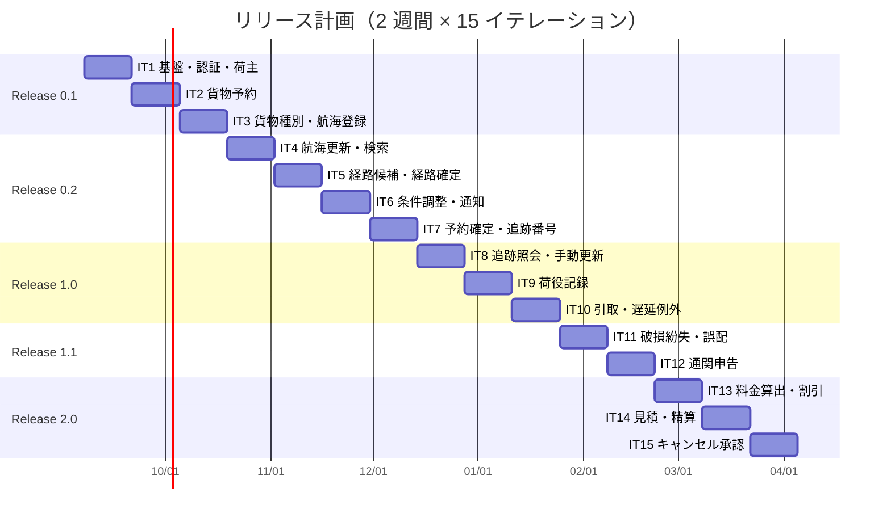

# リリース計画 - 国際貨物輸送管理システム（CQRS / Event Sourcing 版）

## 概要

| 項目 | 内容 |
| :--- | :--- |
| プロジェクト | 国際貨物輸送管理システム（Cargo Tracker）`java/take-8` |
| 目的 | Axon Framework 5 による CQRS / Event Sourcing のマイクロサービス実装。記事シリーズ「エンタープライズ Java における実践的 DDD」第 5 章の参照元になる |
| 対象ストーリー | US01〜US31（31 件）。優先度は [ユーザーストーリー](../../requirements/user_story.md) が正典 |
| 設計 | [設計 10 件](../../design/cargo-tracker/index.md)（すべて `stable`）、[ADR-0001〜0003](../../adr/cargo-tracker/index.md) |
| イテレーション | 1 IT = 2 週間 × 15 IT = 30 週 |
| 総ストーリーポイント | 120 SP |
| チーム | 開発者 1 名（AI 駆動開発） |

**この文書が正典なのは「イテレーションへのストーリー配分・ストーリーポイント・リリースの区切り」です。** 受入基準は `user_story.md`、設計は `docs/design/cargo-tracker/`、局面と TDD アプローチは [開発戦略](development_strategy.md) を正とし、ここには複写しません。

## 満足条件

### スコープ

各リリースで「その業務を担当するロールが仕事を完結できる」ことを満足条件とします。機能の数ではなく、**そのロールの 1 日が回るか**で切ります。

| リリース | 満足条件（このリリースで仕事が回るロール） |
| :--- | :--- |
| 0.1 予約基盤 | 全ロールがログインでき、営業担当者が荷主と貨物予約を登録できる |
| 0.2 経路設計と予約確定 | 経路設計者が航海を登録し経路を設計でき、営業担当者が荷主へ通知して予約を確定できる |
| 1.0 追跡と荷役 | 荷役作業員が港で作業を記録でき、荷主・荷受人が追跡を照会でき、追跡管理者が状態を管理できる |
| 1.1 例外・誤配・通関 | 追跡管理者が例外と誤配を扱え、通関の状態を管理できる |
| 2.0 精算とキャンセル | 経理担当者が料金を算出し請求・入金を扱え、輸送中のキャンセルを承認できる |

### スケジュール

30 週（15 イテレーション × 2 週間）。各リリースの終わりにリリース完了報告書を作成します。

### リソース

開発者 1 名（AI 駆動）。設計 10 件と ADR 3 件は着手前に完成し、人による検証済み（`stable`）です。

## ストーリーポイントと優先順位

### 優先順位の 4 軸

優先度そのものは `user_story.md` を正典とし、ここでは配分の根拠になる 4 軸だけを記します。

| 軸 | 内容 |
| :--- | :--- |
| BV（金銭価値） | その業務が止まると売上・信用が直接損なわれるか |
| C（コスト） | 実装・検査の重さ。Event Sourcing の上乗せを含む |
| KA（知識習得） | Axon 5・DCB・契約・リプレイの学習効果。記事の題材としての価値 |
| RR（リスク軽減） | 早く実装すると後の手戻りをどれだけ減らすか |

### ストーリーポイント一覧

| ID | ストーリー | SP | BV | C | KA | RR | 主なサービス |
| :--- | :--- | :--: | :--: | :--: | :--: | :--: | :--- |
| US26 | システムにログインする | 3 | 高 | 中 | 低 | 高 | authms, gatewayms |
| US27 | システムからログアウトする | 1 | 中 | 低 | 低 | 中 | frontend |
| US02 | 荷主を登録する | 5 | 高 | 高 | **高** | **高** | bookingms |
| US31 | 認証失敗が続いたアカウントを保護する | 2 | 中 | 低 | 低 | 中 | authms |
| US03 | 法人荷主を登録する | 2 | 高 | 低 | 低 | 中 | bookingms |
| US04 | 貨物予約を登録する | 5 | 高 | 高 | 高 | 高 | bookingms |
| US05 | 危険物・冷凍貨物の予約を登録する | 3 | 高 | 中 | 中 | 中 | bookingms |
| US06 | 予約情報を経路設計者に引き渡す | 2 | 中 | 低 | 低 | 中 | bookingms |
| US24 | 航海スケジュールを新規登録する | 4 | 高 | 中 | 中 | 高 | routingms |
| US25 | 既存航海スケジュールを更新する | 3 | 中 | 中 | 中 | 中 | routingms |
| US07 | 航海スケジュールを検索する | 3 | 中 | 中 | 低 | 中 | routingms |
| US08 | 経路候補を算出する | 6 | **高** | **高** | **高** | **高** | routingms, bookingms |
| US09 | 経路を選択・確定する | 4 | 高 | 中 | 中 | 中 | bookingms |
| US10 | 経路条件を調整して再算出する | 3 | 中 | 中 | 低 | 低 | bookingms |
| US11 | 経路情報を予約に紐付ける | 2 | 中 | 低 | 低 | 低 | bookingms |
| US12 | 確定経路を荷主に通知する | 3 | 高 | 中 | 中 | 中 | bookingms |
| US13 | 予約を確定する | 3 | 高 | 中 | 中 | 中 | bookingms |
| US14 | 追跡番号を発行する | 6 | 高 | **高** | **高** | **高** | bookingms, trackingms |
| US18 | 追跡情報を照会する | 5 | **高** | 中 | 中 | 中 | trackingms |
| US17 | 貨物状態を手動更新する | 3 | 中 | 中 | 低 | 低 | trackingms |
| US15 | 荷役作業を記録する | 7 | **高** | **高** | **高** | 高 | handlingms, trackingms, bookingms |
| US16 | 引取作業を記録する | 3 | 高 | 中 | 中 | 中 | handlingms |
| US19 | 遅延例外を処理する | 4 | 高 | 中 | 中 | 中 | trackingms |
| US20 | 破損・紛失例外を処理する | 4 | 高 | 中 | 中 | 中 | trackingms |
| US28 | 誤配を検知して経路を再設計する | 6 | 高 | **高** | 高 | 中 | handlingms, trackingms, bookingms, routingms |
| US29 | 通関申告を登録・管理する | 6 | 高 | **高** | 高 | 中 | handlingms, trackingms |
| US21 | 輸送料金を算出する | 6 | 高 | **高** | 中 | 中 | billingms |
| US22 | 法人割引を適用する | 2 | 中 | 低 | 低 | 低 | billingms |
| US01 | 輸送見積を作成する | 4 | 高 | 中 | 中 | 低 | bookingms, routingms |
| US23 | 精算を処理する | 4 | 中 | 中 | 中 | 低 | billingms, bookingms |
| US30 | 輸送中の予約キャンセルを承認する | 6 | 中 | **高** | 高 | 低 | bookingms, trackingms, handlingms, billingms |
| | **合計** | **120** | | | | | |

### ポイントに上乗せした理由

Event Sourcing とマイクロサービスの分を、コンシューマ側のストーリーに計上しています。上乗せを明記しておかないと、後でベロシティが読めなくなります。

| ID | 上乗せ | 理由 |
| :--- | :--: | :--- |
| US02 | +2 | crypto-shredding（[ADR-0003](../../adr/cargo-tracker/0003-crypto-shredding-for-personal-data.md)）の導入を含む。個人情報を載せる最初のイベントなので、鍵による暗号化をここで入れる |
| US08 | +2 | 契約クエリ 1 本目。Query Bus 越しの ACL と往復テスト |
| US14 | +2 | 契約イベント・契約コマンド・`BookingSaga` の 1 本目。サービス越しの連鎖がここで初めて閉じる |
| US15 | +2 | 荷役種別ごとの要件・航海番号起点の一覧・港のローカル時刻・冪等キー・Reaction Handler |
| US28 | +2 | 誤配の検知（handlingms → trackingms / bookingms）と現在地起点の再設計（routingms）で 4 サービスが関わる |
| US29 | +2 | `CustomsDeclaration` 集約・営業日の算定・引取の通関ガード有効化 |
| US30 | +2 | キャンセル申請 → 承認 → 陸揚げの荷降し → 追跡を閉じる、の連鎖とキャンセル料 |

## ベロシティ

| 項目 | 値 |
| :--- | :--- |
| イテレーション期間 | 2 週間 |
| チーム規模 | 1 名 |
| 初期ベロシティ（推定） | 10 SP / IT |
| バッファ係数 | 0.8 |
| **実効ベロシティ（コミットメント上限）** | **8 SP / IT** |

推定の根拠は同シリーズの実績です（`java-3` 8.6・`haskell` 10.6・`scala` 10.1・`take-6` 12）。take-8 は Event Sourcing の分を各ストーリーの SP に上乗せ済みなので、ベロシティ自体は 10 に据えます。

**検証計画**: IT1〜IT3 の実績で再調整します。IT3 終了時点の平均が 8 SP を下回ったら、以降のコミットメントを実績平均に合わせ、リリース 2.0 の期日を後ろにずらします。ストーリーを削るのではなく期日を動かします。

## 段階的リリース戦略

### リリースとイテレーション

| リリース | IT | 局面 | SP | テーマ |
| :--- | :--- | :--- | :--: | :--- |
| **0.1 予約基盤** | IT1〜IT3 | 序盤 | 27 | 基盤・認証・荷主・貨物予約・航海登録 |
| **0.2 経路設計と予約確定** | IT4〜IT7 | 中盤 | 33 | 航海検索・経路候補算出・経路確定・通知・予約確定・追跡番号発行 |
| **1.0 追跡と荷役** | IT8〜IT10 | 中盤 | 22 | 追跡照会・手動更新・荷役記録・引取・遅延例外 |
| **1.1 例外・誤配・通関** | IT11〜IT12 | 終盤 | 16 | 破損・紛失・誤配の再設計・通関申告 |
| **2.0 精算とキャンセル** | IT13〜IT15 | 終盤 | 22 | 料金算出・割引・見積・精算・キャンセル承認 |

局面（序盤・中盤・終盤）とアプローチの根拠は [開発戦略](development_strategy.md) を正典とします。

### スケジュール

## イテレーション計画概要

各 IT の「デモ項目」は概要です。実演のシナリオは `iteration_plan-N.md` が正典です。

| IT | 対象 US | SP | 枠 | デモの区切り（何が見せられるようになるか） |
| :--- | :--- | :--: | :--- | :--- |
| IT1 | US26(3), US27(1), US02(5) | 9 | — | ログインして荷主を登録し、一覧に出るまでを見せる。コマンド → イベント → 投影 → クエリ → 画面の縦切りが 1 本通る |
| IT2 | US31(2), US03(2), US04(5) | 9 | — | 貨物予約を登録し、予約一覧と詳細に出る。5 回のログイン失敗でロックされる |
| IT3 | US05(3), US06(2), US24(4) | 9 | — | 危険物の予約が申告なしでは登録できない。経路設計者の作業一覧に予約が現れる。航海を登録できる |
| IT4 | US25(3), US07(3) | 6 | 負債 2 | 航海を更新し、出港済みを除いた一覧から検索できる |
| IT5 | US08(6), US09(4) | 10 | — | 経路候補が期限内のものだけ提示され、選んで確定できる（bookingms → routingms を Axon Query Bus 越しに） |
| IT6 | US10(3), US11(2), US12(3) | 8 | — | 条件を変えて再算出し、荷主へ通知すると「経路通知済」になる |
| IT7 | US13(3), US14(6) | 9 | — | 通知していない予約は確定できない。確定 → 追跡番号発行 → trackingms に追跡が作られる（契約イベントと Saga の 1 本目） |
| IT8 | US18(5), US17(3) | 8 | — | 追跡番号だけで公開画面から照会できる。荷主は自社貨物だけが見える。追跡管理者が状態を手動更新できる |
| IT9 | US15(7) | 7 | 予備 1 | 航海番号から「この船から降ろす貨物」を出し、連続して荷役を記録する。予定外の港は警告のうえ記録に残る |
| IT10 | US16(3), US19(4) | 7 | 負債 1 | 荷受人の確認なしの引取が断られる。確認を入れると「引取済」になる。遅延を起票して解決すると元の状態に戻る |
| IT11 | US20(4), US28(6) | 10 | — | 紛失が一覧の先頭に出る。予定ルート外の荷役で誤配になり、現在地起点で再設計すると（期限超過でも）候補が出る |
| IT12 | US29(6) | 6 | 負債 2 | 通関が留置のあいだ引取が断られる。通関済にすると引取できる。留置 3 営業日超が督促対象として出る |
| IT13 | US21(6), US22(2) | 8 | — | 引取済の予約から請求を算出し、法人割引が入る。輸出は免税になる |
| IT14 | US01(4), US23(4) | 8 | — | 見積の概算と請求の差額が理由つきで出る。請求書を発行し入金を記録すると予約が「精算済」になる |
| IT15 | US30(6) | 6 | 仕上げ 2 | 輸送中のキャンセルを申請し、陸揚げ地を指定して承認する。その港で荷降しを記録すると追跡が閉じ、キャンセル料が請求に載る |

### 順序の根拠

配分は依存関係で決めています。設計上の理由があるものを記します。

| 判断 | 理由 |
| :--- | :--- |
| crypto-shredding を US02 と同じ IT1 に | [ADR-0003](../../adr/cargo-tracker/0003-crypto-shredding-for-personal-data.md)。後から入れると既存イベントが平文のまま残る |
| 引取（US16, IT10）の通関ガードは US29（IT12）で有効化 | IT10 では荷受人の確認で代替する（[ドメインモデル](../../design/cargo-tracker/domain-model.md) Handling の不変条件）。読む側の無い配線を先に敷かない |
| 見積（US01）は料金算出（US21）の後 | 式と料率の同一性を契約テストで固定するため、料率が確定してから |
| キャンセル（US30）は精算（US23）の後 | キャンセル料が Billing に依存する |
| `BookingSaga` は US14（IT7）が 1 本目 | それまではイベント購読と Reaction Handler で足りる。未確定の Saga API と補償設計を同時に抱えない |
| `BillingSaga` は IT13 以降 | 同上 |
| US08（経路候補）が最初の契約クエリ | Query Bus をサービス越しに使う最初の場所。[ADR-0001](../../adr/cargo-tracker/0001-cqrs-es-with-axon-in-microservices.md) 決定 4 の検証点 |

## バッファ戦略

### フィーチャバッファ

| リリース | 計画 SP | バッファ（30%） | 実効 SP |
| :--- | :--: | :--: | :--: |
| 0.1 | 27 | 8 | 19 |
| 0.2 | 33 | 10 | 23 |
| 1.0 | 22 | 7 | 15 |
| 1.1 | 16 | 5 | 11 |
| 2.0 | 22 | 7 | 15 |
| **合計** | **120** | **36** | **84** |

### 枠（負債・予備・仕上げ）

IT4・IT10・IT12・IT15 に SP 対象外の枠を置きます。**「余力次第」にしません。** 余力次第の返済枠は毎 IT 繰り越されて固定化します。枠は IT の序盤に独立したコミットで消化し、消化できなかったら次 IT の枠に積むのではなく、その IT のふりかえりで理由を書きます。

| IT | 枠 | 想定する内容 |
| :--- | :--- | :--- |
| IT4 | 負債 2 | IT1〜IT3 で積んだ検査の穴（ArchUnit の未適用サービス・契約のゴールデン漏れ） |
| IT10 | 予備 1 | 荷役の実機確認で出た調整 |
| IT12 | 負債 2 | 投影のリプレイ手順の実測と `operation.md` の更新 |
| IT15 | 仕上げ 2 | 記事第 5 章の参照元としての整理（README・実行手順） |

### スケジュールバッファと消費ルール

1. 各 IT の未完了は次 IT に持ち越さず、リリース単位のフィーチャバッファから充てる
2. リリースのフィーチャバッファを 50% 超消費したら、そのリリースのスコープを見直す（削るのはコアでないストーリー）
3. リリース 2.0 の期日は動かしてよい。ストーリーを削るより期日を動かす

## Event Sourcing 適用範囲の見直し

[ADR-0001](../../adr/cargo-tracker/0001-cqrs-es-with-axon-in-microservices.md) 決定 2 に発動条件があります。**IT2 終了時点で実績ベロシティが計画（9 SP）の 70%（6.3 SP）未満なら、`Quotation` と `Voyage` を状態保存に落とします。** 判定は IT2 のふりかえりで行い、結果を ADR-0001 に追記します。落とす場合、IT3 の US24（航海登録）と IT14 の US01（見積）の SP を見直します。

## リスク管理

| リスク | 影響 | 対策 |
| :--- | :--- | :--- |
| Axon 5 の API が想定と違う（集約の登録・Saga・テスト） | IT1 が丸ごと遅れる | IT1 の冒頭に ADR-0001 決定 5 のスパイク 7 項目をタイムボックス 4h で置く。結果で ADR を更新することを IT1 の DoD に含める |
| Event Sourcing の実装コストが見積もりを超える | 全 IT が遅れる | IT2 終了時の発動条件で `Quotation` / `Voyage` を状態保存に落とす |
| Axon Server の DCB 設定漏れで全サービスが起動しない | IT1 が止まる | 起動時の接続検査に DCB を含め、Testcontainers・kind・ECS の定義を設定走査で検査する |
| 契約（`shared`）の変更が 5 サービスに波及 | 変更のたびに全体再ビルド | `shared` を上げる PR は全サービスの往復テストを通す品質ゲートを置く |
| サービス数が多く 1 IT で複数サービスを触る | 統合の手戻り | サービス越しの結合が入るストーリー（US08・US14・US15・US28・US29・US30）に SP を上乗せ済み |
| 通知の送信基盤がスコープ外である | 荷主への連絡が手作業のまま | 通知した事実（宛先・要約）をイベントと画面に残す。送信基盤は別途 ADR |

## 進捗管理

### メトリクス

| 指標 | 目標 |
| :--- | :--- |
| ベロシティ | 8 SP / IT（IT3 で再調整） |
| カバレッジ | 全体 80%、`domain` 90%（[テスト戦略](../../design/cargo-tracker/test_strategy.md)） |
| 予定達成率 | 90% 以上 |
| デモ項目の受け入れテスト | 全緑（緑でなければクローズしない） |

### 進捗状況

| イテレーション | 計画 SP | 実績 SP | 達成率 | 状態 |
| :--- | :--: | :--: | :--: | :--- |
| IT1 | 9 | 9 | 100% | **完了**（[計画](iteration_plan-1.md)・[ふりかえり](retrospective-1.md)・[報告書](iteration_report-1.md)） |
| IT2 | 9 | 9 | 100% | **完了**（[計画](iteration_plan-2.md)・[ふりかえり](retrospective-2.md)・[報告書](iteration_report-2.md)） |
| IT3〜IT15 | 102 | — | — | 未着手 |
| **累計** | **120** | **9** | **100%** | |

**実績 SP は 9 です。** US26（3）・US27（1）・US02（5）の受入基準を満たし、デモ項目 7 件の受け入れテストが緑です。ただし **SP 対象外の基盤投資に持ち越しが 5 件あります**（S01 ポータル・全ルートのプレースホルダ・無操作タイムアウト・スパイク 0.7・契約テストの往復）。ベロシティは 9 と読めますが、基盤の未完了分を IT2 が負う点は [ふりかえり](retrospective-1.md) を参照してください。

**IT2 の実績 SP も 9 です。** US31（2）・US03（2）・US04（5）を完了し、デモ項目 8 件の受け入れテストが緑です。**IT1 の持ち越し 9 件のうち 8 件を返しました**（契約テストの往復のみ IT3 へ。理由と代替は [ふりかえり](retrospective-2.md)）。

**2 イテレーションの平均は 9 SP** で、計画の 9 SP と一致しています。[ADR-0001](../../adr/cargo-tracker/0001-cqrs-es-with-axon-in-microservices.md) 決定 2 の発動条件（6.3 SP 未満）は**満たしません**。

ただし IT1・IT2 とも**基盤と返済が本体と同じかそれ以上の重さ**でした（IT2 は US 58h に対し返済枠・検査・マニュアルで 40.5h）。IT3 で routingms が立ち上がると 2 つ目のサービスの立ち上げコストが乗るので、**IT3 終了時点でもう一度ベロシティを見ます**。

## 次のステップ

1. IT3 の計画を作る（`opening-iteration`）。**IT2 の引き継ぎ 6 件を先に枠へ入れる**
2. IT3 の Day 8 あたりで **kind クラスタに対する E2E を 1 度回す**（IT2 では終わりにだけ回し、見つかった食い違いの修正がクローズを押した）
3. `syncing-github-project` で IT2 の Issue をクローズし、IT3 の Status を更新する
4. IT3 終了時点でベロシティを再度見る（routingms の立ち上げコストが乗る）

## 更新履歴

| 日付 | 更新内容 | 更新者 |
| :--- | :--- | :--- |
| 2026-09-02 | 初版作成。US01〜US31 を 15 イテレーション・5 リリースに配分 | claude-code/claude-fable-5-1 |
| 2026-09-03 | IT1 クローズ。実績 SP 9（達成率 100%）と持ち越し 5 件を記録 | claude-code/claude-opus-5 |
| 2026-09-03 | IT2 開始準備。計画を作成し進捗表を「計画済み」に更新 | claude-code/claude-opus-5 |
| 2026-09-04 | IT2 クローズ。実績 SP 9（達成率 100%）と ADR-0001 決定 2 の判定（発動せず）を記録 | claude-code/claude-opus-5 |

## 関連ドキュメント

- [開発戦略](development_strategy.md)
- [イテレーション計画 1](iteration_plan-1.md)、[イテレーション計画 2](iteration_plan-2.md)
- [ふりかえり 2](retrospective-2.md)、[完了報告書 2](iteration_report-2.md)
- [ユーザーストーリー](../../requirements/user_story.md)
- [設計](../../design/cargo-tracker/index.md)、[ADR](../../adr/cargo-tracker/index.md)
- [リリース・イテレーション計画ガイド](../../reference/リリース・イテレーション計画ガイド.md)
