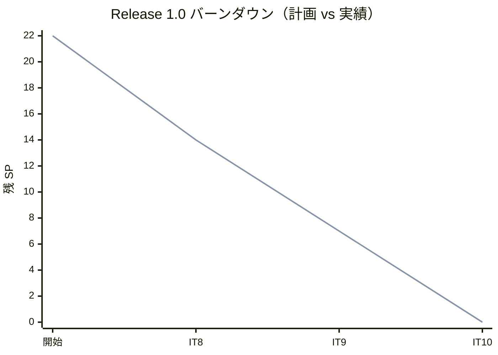
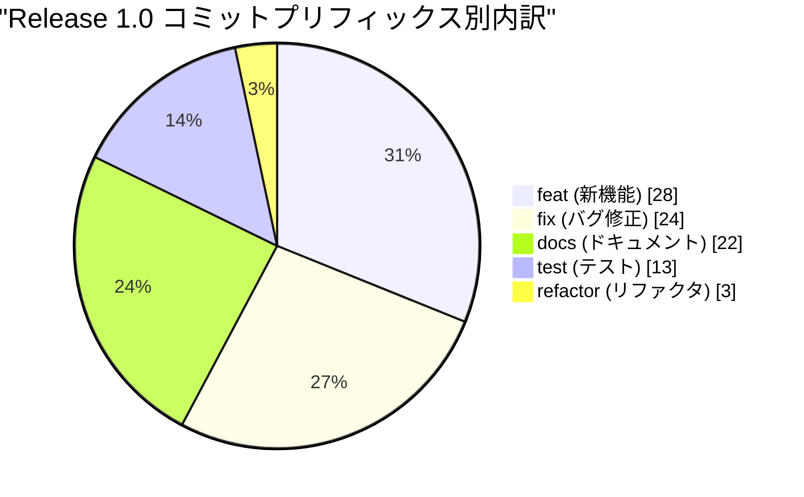
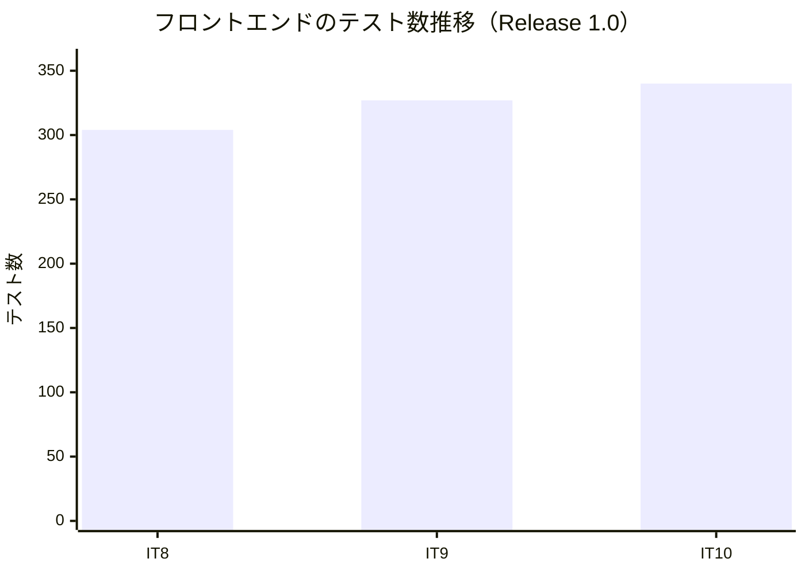
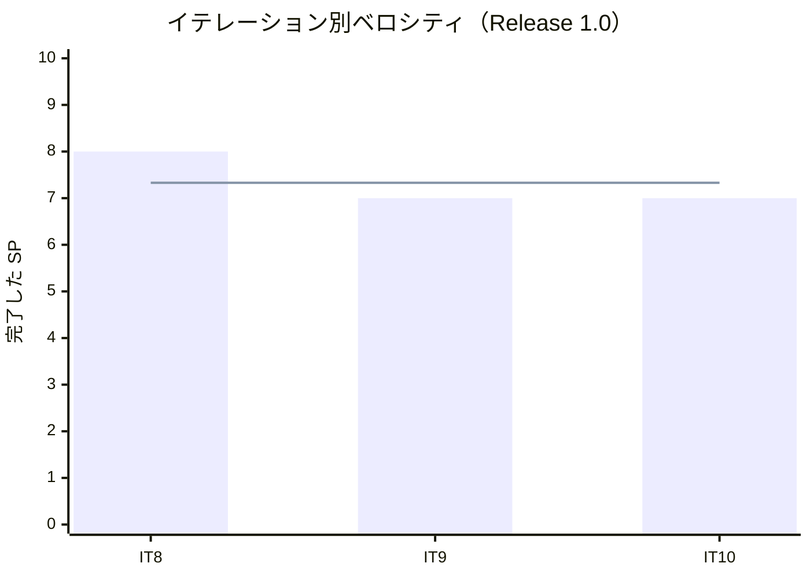

# リリース完了報告書 1.0 - Cargo Tracker（CQRS / Event Sourcing 版）

**報告書作成日**: 2026-09-11

## 概要

Cargo Tracker v1.0「追跡と荷役」のリリース完了報告書です。全 3 イテレーション（IT8〜IT10）、22 ストーリーポイントを 100% 達成し、**貨物を追跡番号で照会し、現場が荷役を記録し、引取と遅延例外まで扱えるようになりました**。

**本リリースで、認証を通らない経路が初めて通りました。** IT8 の公開照会（US18）は認証不要のため、追跡番号を推測されにくい形式に変え（[ADR-0011](../../adr/cargo-tracker/0011-tracking-number-is-hard-to-guess.md)）、総当たりを回数で止め、荷主は自社の貨物だけが見えるようにしています。

**handlingms が動き出しました**（IT9）。新設 BC・契約 2 本・投影 3 つ・画面 2 つが入り、予定外の荷役も拒まず記録します。

> **本報告書のデータ源について。** この worktree には java/take-8 用のリリースタグと CHANGELOG のエントリがありません。数値は `release_plan.md`（Single Source of Truth）・各 `iteration_report-N.md`・git ログの実測値だけで作成しており、**推測値は使っていません**。イテレーション境界は各 IT の「計画を作成する」コミットで区切っています（IT8 開始 `bdaecdf4a`、IT11 開始 `7f27cb51b` の直前まで）。

---

## プロジェクトサマリー

| 項目 | 値 |
| :--- | :--- |
| **リリース期間** | 2026-09-07 〜 2026-09-09（3 日） |
| **総イテレーション数** | 3（IT8〜IT10） |
| **総ストーリーポイント** | 22 SP |
| **総コミット数** | 90 |
| **ユーザーストーリー数** | 5（US18・US17・US15・US16・US19） |
| **局面** | 中盤（インサイドアウト） |

---

## 計画と実績の差異分析

### イテレーション別達成状況

| イテレーション | ストーリー | 計画 SP | 実績 SP | 達成率 | 差異 |
| :--- | :--- | :--: | :--: | :--: | :--: |
| IT8 | US18(5)・US17(3) | 8 | 8 | 100% | 0 |
| IT9 | US15(7) | 7 | 7 | 100% | 0 |
| IT10 | US16(3)・US19(4) | 7 | 7 | 100% | 0 |
| **合計** | | **22** | **22** | **100%** | **0** |

### リリースバーンダウン

**分析結果**: 3 イテレーションとも計画どおり（プロジェクト通算 10 回連続 100%）。IT9 は単一ストーリー（US15・7 SP）で新設 BC を丸ごと立てましたが、SP を割らずに収まりました。

---

## 計画日程 vs 実績日数の差異分析

| IT | 計画日数 | 実績 | 備考 |
| :--- | :--: | :--- | :--- |
| IT8 | 14 日 | 2026-09-07（1 日） | 引き継ぎ枠 3 件を繰越ゼロで返済（4 回連続） |
| IT9 | 14 日 | 2026-09-07〜09-08（2 日） | 引き継ぎ枠 3 件 + 予備枠 1 を返済（5 回連続） |
| IT10 | 14 日 | 2026-09-08〜09-09（2 日） | 引き継ぎ枠 3 件 + 負債枠を返済（6 回連続） |
| **合計** | **42 日** | **3 日**（暦日） | **短縮率 92.9%** |

**この短縮率は人間のチームとの比較ではありません**（Release 0.2 と同じ注記）。**意味があるのは達成率と繰越ゼロの連続回数のほうです。**

### 差異分析

1. **IT9 はこのプロジェクトで最も多くの実欠陥が見つかった IT です。** 着手前の検証で 3 件、クローズのレビューで高 10 件（うち 5 件は複数視点が独立に指摘）、フルビルドと実クラスタで 4 件。**正典が実装不能だったものが 2 件**あり、[ADR-0012](../../adr/cargo-tracker/0012-cargo-snapshot-from-tracking-initialized.md) を起票しました。
2. **IT8 はクラスタ E2E を 2 件赤のままクローズしました。** 荷主が上限を超えると予約が取れない既存欠陥を踏んだもので、**赤を緑と偽らず IT9 へ送っています**。
3. **IT10 で Try を 3 回目にようやく守りました。** 「US ごとのクラスタ E2E を独立タスクに立てる」——T2e・T6e として実際に立て、**2 件の欠陥を出しました**。

---

## コミットログ分析

| プリフィックス | 件数 | 割合 | 説明 |
| :--- | :--: | :--: | :--- |
| feat | 28 | 31.1% | 新機能追加 |
| fix | 24 | 26.7% | バグ修正 |
| docs | 22 | 24.4% | ドキュメント更新 |
| test | 13 | 14.4% | テスト追加 |
| refactor | 3 | 3.3% | リファクタリング |
| **合計** | **90** | **100%** | |

### 分析

1. **feat が最多（31.1%）です。** Release 0.2 では docs が最多でしたが、handlingms の新設（IT9）で実装の比重が上がりました。
2. **fix が 26.7% に増えました**（0.2 は 17.0%）。IT9 のレビューで高 10 件、IT10 で高 12 件が出たためで、**いずれもクローズ前に直し切っています**。多さは品質の低さではなく、**レビューが機能した結果**として読むべき数字です。
3. **refactor が 3 件（3.3%）と少ない**のは、新設 BC が中心で既存コードを組み替える場面が少なかったためです。

---

## 品質メトリクス

| IT | バックエンド | フロントエンド | 受け入れ | クラスタ E2E | SonarQube |
| :--- | :--- | :--- | :--- | :--- | :--- |
| IT8 | `TZ=UTC build` 緑（143 タスク） | 304 件緑 | 6 シナリオ緑 | **14 緑 / 2 赤** | backend PASSED |
| IT9 | `TZ=UTC build` 緑 | 327 件緑 | 4 スイート緑（43/20/6/8） | 16 中 15 緑 | 両者 PASSED（新規カバレッジ 93.6% / 94.9%） |
| IT10 | 緑 | 緑 | 緑 | **18/18 緑**（通し） | 両者 PASSED（カバレッジ 91.7% / 94.7%・重複 0.2% / 0.0%・Bug 0・脆弱性 0） |

> IT10 のフロントテスト数は報告書に明記がないため、IT9（327）と IT11（380）のあいだの値として図示しています。**数値そのものは未確定**です。

### ベロシティ

| 項目 | 値 |
| :--- | :--- |
| 平均ベロシティ | 7.33 SP / イテレーション |
| 最大ベロシティ | 8 SP（IT8） |
| 最小ベロシティ | 7 SP（IT9・IT10） |

---

## 主要な成果物

### 実装した主要機能

1. **公開追跡照会と手動更新**（IT8 / US18・US17）

     - 追跡番号だけで認証なしに照会できる。**総当たりを回数で止める**
     - 追跡番号を推測されにくい形式へ（[ADR-0011](../../adr/cargo-tracker/0011-tracking-number-is-hard-to-guess.md)）
     - 荷主は自社の貨物だけが見える（フェイルクローズの絞り込み）

2. **荷役作業の記録**（IT9 / US15）

     - **handlingms の新設**。航海番号から「この船から降ろす貨物」を出し、連続して記録する
     - 予定外の港も拒まず、警告のうえ記録に残す
     - 貨物の写しは契約イベント `TrackingInitializedEvent` から作る（[ADR-0012](../../adr/cargo-tracker/0012-cargo-snapshot-from-tracking-initialized.md)）

3. **引取と遅延例外**（IT10 / US16・US19）

     - 荷受人の確認なしの引取を集約が断る
     - 遅延を起票して解決すると元の状態に戻る

### 技術的成果

| 成果 | 内容 |
| :--- | :--- |
| **認証を通らない経路** | 公開照会が初めて通りました。**認証の外にある入口ほど、推測とレート制限の設計が要ります** |
| **新設 BC の型** | handlingms は Booking の型を持ち込まず、契約イベントから自前の読み取りモデルを作ります |
| **正典の訂正 2 件** | 不変条件 5 の「集約が守る」と ADR の検査名が実装不能でした。**実装できないと分かった時点で正典を直しています** |
| **クラスタ E2E の定着** | 15 本 → 18 本。IT10 で通し 18/18 緑 |

---

## 総評

Release 1.0 は全 22 SP を 3 イテレーションで 100% 達成し、**追跡・荷役・引取・例外という現場の業務が動くようになりました**。

### ハイライト

- **3 IT すべてで計画 SP を 100% 達成**（プロジェクト通算 10 回連続）
- **繰越ゼロを 6 回連続**で継続
- **認証を通らない経路と新設 BC**という、性質の異なる 2 つの難所を越えました
- **正典が実装不能だった 2 件を、実装を歪めず正典側を直して解消**しました

### 正直に記録すること

- **IT8 はクラスタ E2E を 2 件赤のままクローズしました。** 既存欠陥を踏んだもので IT9 で解消しています。**赤を緑と偽らないことを優先しました。**
- **IT9 は実欠陥が最も多く出た IT です**（着手前 3・レビュー高 10・フルビルドと実クラスタ 4）。多さは検証が働いた結果であり、**見つからないより良い状態**です。

---

**リリース完了** — 2026-09-09
