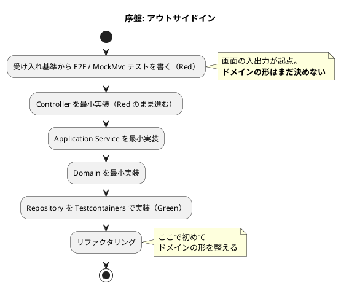
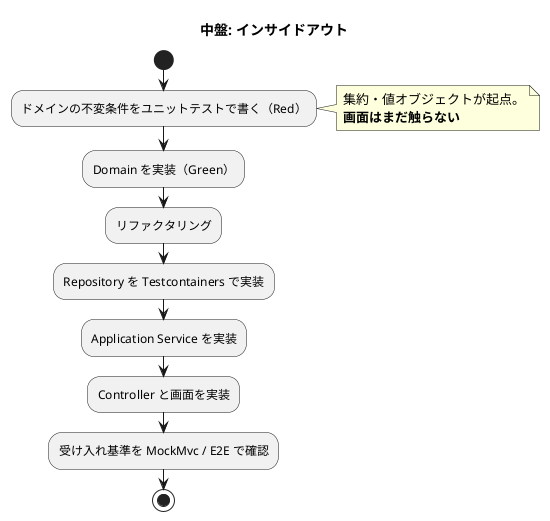

# 開発戦略 - 国際貨物輸送管理システム（java/take-6）

## 概要

[リリース計画](release_plan.md) で確定した IT1〜IT17 を **序盤・中盤・終盤・精算・整流** の 5 局面に分け、各局面で採用する TDD アプローチと横断的な進め方を定義します。

**局面ごとに変えるのは「テストの入口」と「レイヤー貫通の順序」だけです。** Red-Green-Refactor のサイクルそのものは全局面で不変とします。

---

## 局面戦略

| 局面 | 対象 IT | 主アプローチ | 狙い |
| :--- | :--- | :--- | :--- |
| **序盤** | IT1〜IT2 | アウトサイドイン | 縦切りで「歩けるスケルトン」を通し、アーキテクチャ基盤の妥当性を早期に検証する |
| **中盤** | IT3〜IT6 | インサイドアウト | 経路設計と追跡という中核ドメインを、ドメイン層から堅牢に作り込む。貧血ドメインモデルを避ける |
| **終盤** | IT7〜IT12 | アウトサイドイン | 既存ドメインを業務シナリオ起点で結合し、リリース全体の一貫性を担保する |
| **精算** | IT13〜IT15 | **IT13 はインサイドアウト、IT14・IT15 はアウトサイドイン** | 金額を扱う新規 BC（Billing）をドメイン層から固めるのは **IT13 だけ**である。集約が揃った後は既存の組み合わせであり、**条件が変わったのでアプローチも変える**（下記） |
| **整流** | IT16〜IT17 | アウトサイドイン | **新規ストーリーを作らない局面である。** 未達の受入基準を現場に届け、**宣言した規則に検査を与える**（下記） |

### アプローチ選択の根拠

| 局面 | 状況 | 選択理由 |
| :--- | :--- | :--- |
| 序盤 | 画面も API も未実装。基盤も未確立 | UI のニーズから API を導出し**薄く貫通**させるのが安全。ここで基盤（Security・Thymeleaf・MyBatis・Testcontainers）の妥当性を検証する |
| 中盤 | 基盤は確立済み。**中核ドメインが複雑** | 経路候補算出（US08）・BookingStatus の 8 状態遷移・荷役と輸送状態の連動は、上位から作ると貧血モデルになりやすい。**ドメイン層から固める** |
| 終盤 | 基本実装済み × ドメイン複雑 | 例外対応・誤配・通関は既存集約の組み合わせ。**業務シナリオを受け入れテストで束ねる** |
| 整流 | **すべて実装済み。ドメインは変えない** | 未達の受入基準（陸揚げ地を荷役の一覧に出す）は、既存の集約を**読み取って表示する**だけである。新しい業務規則を作らない。**条件が終盤と同じなので、同じ選択をする** |
| 精算 | 基盤は確立済み。**新規 BC・金額・丸め規則** | Billing Context をゼロから作る。**丸めと割引の規則は画面から下ろすと必ず表示都合が混ざる**。金額は誤ると請求が狂い、後から直せない（発行済みの請求書は書き換えてはならない）。**ドメイン層から固める** |

> **中核ドメインが複雑であるため中盤（インサイドアウト）を省略しません。** 本システムは `architecture_backend.md` の業務領域評価で「中核の業務領域 / データ構造は複雑 / 特殊要件あり」と判定されています。CRUD 中心ではありません。

---

## 序盤（IT1〜IT2）: アウトサイドイン

### 目的

ウォーキングスケルトンを通し、**アーキテクチャ基盤が実際に動くこと**を確認します。設計ドキュメントで妥当と判断した構成が、コードとして成立するかはここで初めて分かります。

### 対象ストーリー

| IT | US | 内容 |
| :--- | :--- | :--- |
| IT1 | US26 / US27 / US31 / US02 | 認証と荷主登録 |
| IT2 | US04 / US32 | 貨物予約登録と荷主情報の訂正（US32 は IT1 レビューの受け入れ条件として追加） |

### ワークフロー

### 手順

1. 受け入れ基準を MockMvc（Controller）のテストに 1:1 で落とす
2. 画面 → Controller → Application → Domain → Repository の順に**最小実装で貫通**させる
3. Repository のテストは Testcontainers で書く（ADR-003。H2 では書かない）
4. 緑になってからドメインの形を整える

### 完了条件

- [ ] 対象 US の受け入れ基準がすべて緑
- [ ] `./gradlew check` が緑
- [ ] Heroku 開発環境にデプロイして画面が動作する
- [x] **ArchUnit のルール 1・2・3 が有効化され、違反を検出できることを確認済み**（4・6 も IT1 で前倒し有効化）

---

## 中盤（IT3〜IT6）: インサイドアウト

### 目的

経路設計と追跡という**中核ドメイン**を、ドメイン層から作り込みます。ここが本システムの差別化領域です。

### 対象ストーリー

| IT | US | 中核となるドメイン |
| :--- | :--- | :--- |
| IT3 | US24 / US07 / US06 | `Voyage` 集約と `CarrierMovement` の連結制約 |
| IT4 | US08 | **`BookingRouteProposal` と経路探索**（本システム最大の複雑さ） |
| IT5 | US09 / US11 | `Cargo` への `CargoItinerary` 反映と `RoutingStatus` |
| IT6 | US13 / US14 / US15 | **BookingStatus の状態遷移**と荷役・輸送状態の連動 |

### ワークフロー

### 手順

1. **不変条件を先にテストにする**。BookingStatus の遷移表（`domain-model.md`）は許可・拒否の全セルを `@ParameterizedTest` で網羅する
2. 境界値を必ず含める（期限当日の時刻付き到着・ちょうど 48 時間・金額の丸め。`test_strategy.md` の必須境界値ケース）
3. ドメインが緑になってから外側へ展開する
4. 画面は最後に付ける

### 完了条件

- [ ] ドメインの不変条件がユニットテストで固定されている
- [ ] 必須境界値ケースが網羅されている
- [ ] 対象 US の受け入れ基準がすべて緑
- [x] **ArchUnit のルール 4・6（BC 分離・共有カーネルの範囲）は IT1 で有効化済み**

---

## 終盤（IT7〜IT12）: アウトサイドイン

### 目的

既存ドメインを**業務シナリオ起点で結合**し、リリース全体の一貫性を担保します。

### 対象ストーリー

| IT | US | 内容 |
| :--- | :--- | :--- |
| IT7 | US18 / US16 / US03 | 追跡照会・引取・法人荷主 |
| IT8 | US17 / US10 / US12 | 状態の手動更新・条件を変えた再算出・確定経路の通知 |
| IT9 | US05 / US34 / US25 | 危険物・冷凍の予約・荷主セルフサービス・航海スケジュールの更新 |
| IT10 | US19 / US20 | 遅延・破損・紛失の例外対応 |
| IT11 | US28 / US29 | 誤配の再設計・通関申告 |
| IT12 | US35 / US36 | 引取確認コードの採番・照合、引取記録の訂正・取り消し（**IT8 の開始準備で起票**） |

> **本表の割り当ての正典は [リリース計画](release_plan.md) である。** 旧版は IT7・IT8 の 2 イテレーションに 12 ストーリーを詰めた形のままだった（IT4 の開始準備で IT11 まで拡張したのに、こちらを直していなかった）。**局面の表が古いと、次のイテレーションの開始準備で読む文書がずれる。**

### 手順

1. **業務シナリオから E2E / 受け入れテストを書く**（「遅延が起きて解決するまで」「誤配を検知して組み直すまで」）
2. 既存集約を組み合わせて実装する。**新しい集約はできるだけ作らない**
3. 例外解決後の復帰（`status_before`）のように、**リクエストをまたぐ状態**を必ず統合テストで確認する

### 完了条件

- [ ] 業務シナリオが通しで動作する
- [ ] E2E のクリティカルパス 3 本（US13 / US15 / US18）が緑
- [ ] **ArchUnit の 6 ルールがすべて有効**（1・2・3・4・5・6 は IT1 で有効化済み。以降は無効化しない）

---

## 精算（IT13〜IT15）: インサイドアウト

### 目的

**金額を扱う新規 BC（Billing Context）をドメイン層から固める。**

### なぜ終盤のアウトサイドインを続けないか

終盤（IT7〜IT12）でアウトサイドインを採ったのは、**既存集約の組み合わせだった**からです。Release 2.0 はその条件を満たしません。

- **Billing Context は `package-info` のみで、集約が 1 つもない**（`architecture_backend.md` の実装状況）
- **ACL ポートを 3 つ同時に実装する**（`ShipperDiscountPort` / `TrackingStatusPort` / `BookingSettlementPort`）。BC 間の越境がこれまでで最も多い
- **金額の丸め規則を確定させる**。`domain-model.md` は「丸め後の値を永続化し、再計算で導出しない」と定めています。**税率が変わっても発行済み請求書の金額が変わってはならない**ため、規則を画面から下ろすと表示都合が混ざります

**条件が中盤（IT3〜IT6）と同じなので、同じ選択をします。** 局面の名前ではなく、そのときの条件でアプローチを選びます。

> **これは IT13 についての判断です。** IT14 以降は条件が変わります。
> `Invoice` 集約は既にあり、金額の丸め規則も確定済みで、作るのは
> **既存集約の組み合わせと業務の流れ**です。**条件が終盤（IT7〜IT12）と同じなので、
> IT14 / IT15 はアウトサイドインを採ります**（各イテレーション計画で条件表を示す）。
>
> **3 IT 中 2 IT が「逸脱」するなら、それは逸脱ではない。** 局面とアプローチを
> 1 対 1 に固定していたことのほうが誤りだったので、上の局面表を直しました。

### 対象ストーリー

| IT | US | 内容 |
| :--- | :--- | :--- |
| IT13 | US21 / US22 | 輸送料金の算出・法人割引の適用（**Billing Context の立ち上げ**） |
| IT14 | US23 | 精算書の発行・入金確認・精算完了。アプローチは**アウトサイドイン** |
| IT15 | US30 | 輸送中キャンセルの承認（**キャンセル料が US21 に依存する**）。アプローチは**アウトサイドイン** |

> **本表の割り当ての正典は [リリース計画](release_plan.md) である。**

### 手順

1. **`Money`・`DiscountRate`・丸め規則を値オブジェクトのテストから書く**（画面もコントローラも作らない）
2. `Invoice` 集約と状態遷移（`PaymentStatus`）を作る
3. **ACL ポートを 1 つずつ足す。** ポートを足したら**必ず `./gradlew test` をフルで回す**（ArchUnit の BC 分離ルールはレビューでは捕まらない）。
   **ただし状態の伝播はポートではなくイベントにする**（IT14 のふりかえり T1。判断基準は「呼び出し側が戻り値を使っているか」）
4. アプリケーション層 → 画面の順に上げる
5. **`MapperTableOwnershipTest.OWNER` に Billing のテーブルを登録する**（ADR-015。新しい BC を足すときの手順）

### 完了条件

- [ ] 精算までの業務シナリオが通しで動作する（予約 → 追跡 → 引取 → 料金算出 → 請求 → 入金確認）
- [ ] **丸め後の金額が永続化され、税率を変えても発行済み請求書の金額が変わらない**ことをテストで固定している
- [ ] ArchUnit の全ルールと ADR-015 の検査が緑（Billing を `OWNER` 表に登録済み）
- [ ] **ROLE_BILLING の月次業務**（締め・請求書一括発行・未入金の督促）が運用要件として定義されている（`release_scope.md` の「業務運用」。Release 1.1 で積み残した）

---

## 整流（IT16〜IT17）: アウトサイドイン

**新規ユーザーストーリーを作らない唯一の局面である。**

### なぜ整流という局面を置くか

Release 0.1〜2.0 の 35 US はすべて完了し、`java/take-6/v2.0.0` としてタグを打った。それでも次の 2 つが残っている。

1. **受入基準に届いていないものが 1 件ある。** US30 の「指定した陸揚げ地への荷降しが手配され」は、承認の記録が予約詳細と荷主通知に残るところまでで止まっており、**実際に降ろす荷役作業員には届いていない**（IT15 で見積超過により落とした）
2. **宣言した規則に守り手が無い。** ADR-009 は「必ず守る」と書きながら、検査を書いた瞬間に**既存 5 本の違反**が見つかった。ADR-015 の名簿方式の検査は**名簿に無いテーブルを素通り**させていた。どちらも「入れたこと」と「働くこと」の差である

**どちらも、新しいストーリーを積んでも解消しない。** ストーリーを足すほど、届いていないものと守られていない規則は増える。

### 手順

1. **検査を先に書き、既存の違反を見つける**（ADR の守り手・名簿の未登録・一覧の問い合わせ回数）。**IT15 で ADR-009 の違反 5 本が見つかったのは、検査を書いた瞬間だった**
2. **育つ負債を先に返す。** 落とす順序は見積もりの大きさではなく「次の IT で対象が増えるか」で決める
3. **未達の受入基準を画面から満たす**（アウトサイドイン。既存集約の読み取りであり、ドメインを変えない）
4. **実装の途中で 1 度レビューを回す**（IT14・IT15 と 2 IT 連続で落としている）

### 完了条件

- [ ] **US30 の未達受入基準を満たす**（正典は `../requirements/user_story.md` の US30）
- [ ] **すべての ADR に「守り手」が書かれている。** 検査を書けないものは「守り手: 守らない」と明記する — **空欄を残さない**
- [ ] **名簿方式の検査すべてに「名簿に無い入力 → 赤」のテストがある**
- [ ] **一覧を返すクエリサービスすべてに問い合わせ回数のテストがある**
- [ ] **育つ負債（テストヘルパーの重複・ビューの引数）を落とさずに返した**

> **この局面を繰り返さないことが目的である。** 整流が毎リリース必要になるなら、
> それは各イテレーションの DoD が働いていないということである。
> IT16 で入れる検査は、**次のリリースで同じ穴が開かないための装置**である。

> **整流は 2 回に分かれた（IT16 / IT17）。** IT16 で数えたところ、
> **記録された負債は実態の 5〜10 分の 1** だった（C2 は 7 → 39 クラス、
> C3 は 2 → 21 件）。1 回では返しきれない量である。
>
> **IT16 は発見と計測、IT17 は返済である。** 発見した負債はすべて
> 「縮む表」として検査に登録してあり、**増やせば落ちる状態で引き渡されている**。
>
> **局面を終わらせる条件**は `NOT_SPLIT_YET` と `NOT_MEASURED_YET` が
> 空になることである。**表が空にならないまま次の局面へ進むと、
> 「据え置き」が「固定」に変わる**（ADR-008 が 3 IT 繰り越した形）。

---

## 横断方針

### 1. デモ項目を受け入れ基準とする

各イテレーションのデモ項目を**受け入れ基準**として DoD に組み込みます。テストピラミッド上 E2E は 5% ですが、「**業務価値が実際に成立するか**」を担保する最終ゲートです。

| 局面 | 受け入れの形 |
| :--- | :--- |
| 序盤 | E2E 基盤（Playwright）をセットアップし、全ナビゲーション遷移を確認する |
| 中盤 | 対象ドメインの業務フローを MockMvc の統合テストで確認する |
| 終盤 | クリティカルパス 3 本（US13 / US15 / US18）を E2E で緑にする |

### 2. 品質ゲートの段階的有効化

**実装が 0 件の状態で強制しても意味を持たないため**、実装の追加にあわせて有効化します。

| 対象 | 有効化する IT | 理由 |
| :--- | :--- | :--- |
| ArchUnit ルール 1・2・3（依存方向） | **IT1** | 骨格のみの今のうちに入れる。後になるほど直す量が増える |
| ArchUnit ルール 4・6（BC 分離・共有カーネル） | **IT1（前倒し）** | `shipper` と `security` に実クラスが入った時点で検査対象が揃った。**最初の BC 間依存が生まれる瞬間に守るルールが無いと、ACL を挟まない直接参照に気づけない** |
| JaCoCo カバレッジ閾値 | **IT1（前倒し）** | 当初は IT2 の予定だったが、実測が行 96.5% / 分岐 78.9% と閾値を十分上回り、「閾値を満たすためのテストを書く」懸念が現実にならないことを確認できた。**上回っているうちに入れる** |
| E2E（Playwright） | **IT6** | 一気通貫が成立して初めてクリティカルパスを通せる |
| JaCoCo レイヤー別ルール | **IT8** | Release 1.1 の途中で全体ルールから分割する |

> **有効化のたびに、違反を実際に検出できることを確認します。** `allowEmptyShould(true)` のような「何も検査しないまま緑」を作りません。設定したことと働いていることは別です。

### 3. 局面が変わっても不変の規律

| 規律 | 内容 |
| :--- | :--- |
| TDD サイクル | Red → Green → Refactor。テストを先に書く |
| コミット単位 | 意味のある単位。Conventional Commits（`feat(booking):` 等。スコープは BC 名） |
| 品質基準 | Checkstyle 0 件 / SpotBugs 0 件（`test_strategy.md` §6.2 が正典） |
| アーキテクチャテスト | **常時グリーン**。有効化したルールを後から無効化しない |
| ユビキタス言語 | `domain-model.md` の用語をコードの識別子に使う。JIG の `glossary.html` で乖離を確認する |
| DB の使い分け | Repository のテストは Testcontainers。H2 では書かない（ADR-003） |

### 4. 設計ドキュメントとの整合

**実装と設計の乖離は、目視ではなく生成物の差分で検出します。**

| 生成物 | 突き合わせ先 | タイミング |
| :--- | :--- | :--- |
| JIG（`gulp app:jig`） | `domain-model.md` / `architecture_backend.md` | 各 IT のクローズ時 |
| jig-erd（`gulp app:jig-erd`） | `data-model.md` | マイグレーション追加時 |

設計ドキュメントの欠落・先行実装が必要な要素が見つかった場合は、**当該 IT で設計ドキュメントも同時に更新**します。実装だけ進めると、次の IT の計画が古い設計を参照します。

---

## 局面の見直し

**IT3 終了時にベロシティの実績で局面配分を見直しました。** 初期ベロシティ 12SP は過大であり、IT1〜IT5 の実績平均 7.8SP に基づいて **8SP を採用値としています**（`release_plan.md`）。これに合わせて終盤を IT7〜IT11 の 5 イテレーションに広げました。**スコープを削らずに 8SP へ収めるには、期間を伸ばす以外にありません。**

見直しの判断材料:

- IT1〜IT3 の実績 SP
- 中核ドメイン（US08）の実装難度が想定どおりだったか
- 品質ゲートの有効化が計画どおり進んだか

---

## 関連ドキュメント

- [リリース計画](release_plan.md) — IT 配分と SP の正典
- [リリーススコープ定義](release_scope.md) — スコープの正典
- [テスト戦略](../design/test_strategy.md) — テストレベル・品質基準の正典
- [バックエンドアーキテクチャ](../design/architecture_backend.md) — 業務領域評価とパッケージ構成
- [ADR 一覧](../adr/index.md) — 技術的意思決定
