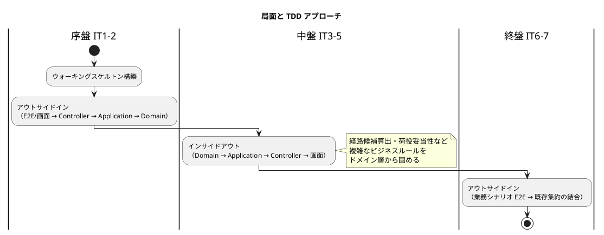
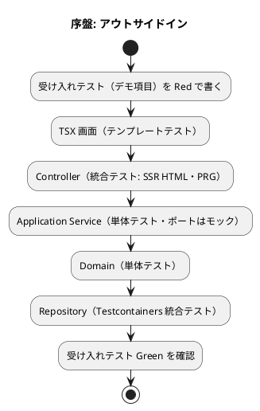
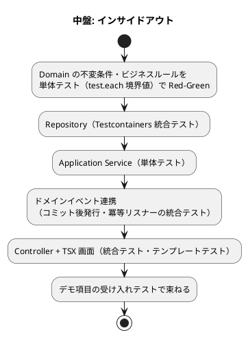
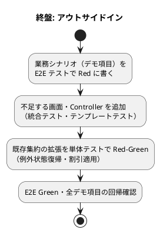

# 開発戦略 - 国際貨物輸送管理システム（TypeScript 版）

## 概要

本ドキュメントは、[リリース計画](release_plan.md) で計画した 7 イテレーションを **序盤・中盤・終盤** の 3 局面に分け、各局面で採用する TDD アプローチと横断的な進め方を定義します。

個々の TDD サイクルは [コーディングとテストガイド](../reference/コーディングとテストガイド.md) に従います。本戦略はその上位で「テストの入口をどこに置き、レイヤーをどの順で貫通するか」を局面ごとに決めます。

### 参照元（Single Source of Truth）

| 項目 | 正となるドキュメント |
| :--- | :--- |
| イテレーション × US のマクロ配分 | [release_plan.md](release_plan.md) |
| イテレーション詳細・デモ項目 | 各 `iteration_plan-N.md`（IT 開始時に作成。未計画分の局面割り当ては暫定案） |
| TDD アプローチ・品質基準 | [コーディングとテストガイド](../reference/コーディングとテストガイド.md) |
| テスト種別・受け入れ/E2E 方針 | [テスト戦略](../design/test_strategy.md) |
| 画面遷移・ナビゲーション | [UI 設計](../design/ui_design.md) |
| アーキテクチャ・BC 定義 | [バックエンドアーキテクチャ](../design/architecture_backend.md)・[ドメインモデル設計](../design/domain-model.md)・[ADR](../adr/index.md) |

> **前提**: イテレーション計画は IT 開始時に順次作成します。本戦略の局面割り当てはリリース計画のイテレーション概要に基づく暫定案を含み、各 `iteration_plan-N.md` の確定時に追従します。

---

## 戦略の全体像

| 局面 | 対象 IT | 主アプローチ | 対象 US | 狙い |
| :--- | :--- | :--- | :--- | :--- |
| 序盤 | IT1-2 | アウトサイドイン | US26/US27/US02/US03（IT1）、US01/US04/US05/US06（IT2） | 縦切りで「歩けるスケルトン」を通し、TSX SSR + htmx + NestJS + Kysely の基盤妥当性を早期検証 |
| 中盤 | IT3-5 | インサイドアウト | US24/US25/US07/US08（IT3）、US09〜US14（IT4）、US15/US16/US17（IT5） | 中核ドメイン（経路設計・荷役妥当性）をドメイン層から堅牢に作り込み、貧血ドメインモデルを回避 |
| 終盤 | IT6-7 | アウトサイドイン | US18/US19/US20（IT6）、US21/US22/US23（IT7） | 既存集約を業務シナリオ起点で結合し、追跡・例外・精算のフロー全体の一貫性を担保 |



### アプローチ選択の根拠

コーディングとテストガイドの実装アプローチ選択フローに対応づけます。

- **序盤（アウトサイドイン）**: API・基盤とも未実装の状態は選択フローの「API 未実装 → アウトサイドイン活用」に該当します。画面（TSX テンプレート）と受け入れテストのニーズから Controller・Application の API を導出し、全レイヤーを薄く貫通させることで、非典型構成（TSX SSR + htmx）の実装リスクを最初の 2 週間で消化します。
- **中盤（インサイドアウト）**: 経路候補算出（US08）・荷役妥当性デシジョンテーブル（US15）は本システムの中核ドメインであり、「基本 CRUD 未実装の複雑ドメイン → インサイドアウト推奨（データ層から開始・基盤を固めて上位層へ展開）」に該当します。ドメインモデル設計の集約・値オブジェクト・不変条件を先にテストで固め、貧血ドメインモデルを回避します。
- **終盤（アウトサイドイン）**: 追跡照会・例外処理・精算は既存集約（Cargo・TrackingActivity・HandlingActivity・Invoice）の組み合わせであり、「基本実装済み × ドメインロジックが複雑 → アウトサイドイン推奨」に該当します。業務シナリオを受け入れテストで束ね、リリース全体の一貫性を担保します。

---

## 共通の TDD サイクル

全局面で Red-Green-Refactor サイクルは不変です。

1. **Red**: 失敗するテストを書く（このとき実装は書かない）
2. **Green**: テストを通す最小の実装を書く
3. **Refactor**: テストを green に保ったままコードを整理する

### テスト種別とレイヤーの対応

テストピラミッド比率（70/25/5）とツールは [テスト戦略](../design/test_strategy.md) に従います。

| テスト種別 | ツール | 対象レイヤー | 実行タイミング |
| :--- | :--- | :--- | :--- |
| 単体テスト | Vitest | domain / application（ポートはモック） | 常時（watch）・コミット前 |
| TSX レンダリングテスト | Vitest + cheerio | views（型付き props・ロール分岐・htmx 属性） | 常時・コミット前 |
| 統合テスト | Vitest + @testcontainers/postgresql + supertest | infrastructure / presentation（SSR HTML・PRG 302） | PR・CI |
| 契約テスト | nock | 外部 5 ポートの ACL | PR・CI |
| アーキテクチャテスト | dependency-cruiser | 全レイヤー依存・BC 間参照禁止 | コミット前・CI（常時グリーン） |
| 受け入れ/E2E テスト | Playwright | 業務シナリオ（デモ項目） | IT 完了判定・CI |

### 品質チェック

コマンドは [アプリケーション開発環境セットアップ手順書](../operation/アプリケーション開発環境セットアップ手順書.md) に定義した npm scripts を使用します（`apps/cargo-tracker` はウォーキングスケルトンで作成）。

```bash
npm run test          # 単体テスト
npm run check         # lint + typecheck + arch（dependency-cruiser）
npm run verify        # 全テスト + 品質チェック（コミット前・IT クローズ前）
```

不変の規律:

- 1 コミット 1 変更（構造変更と動作変更を混ぜない、Conventional Commits 準拠）
- dependency-cruiser の 4 ルールは常時グリーン（domain→infra 禁止 / domain に NestJS デコレータ禁止 / application は Port 経由 / BC 間直接参照禁止)
- テストの合否判定は Testcontainers（実 PostgreSQL）を正とする（ADR-004）
- カバレッジ目標: ドメイン 85% / アプリケーション 80% / 全体 75%

---

## デモ項目を受け入れ基準とする

各 `iteration_plan-N.md` のデモ項目を、当該 IT の受け入れ基準として位置づけます。

- **序盤（IT1)**: Playwright の E2E 基盤をセットアップし、ウォーキングスケルトンの妥当性を「全ナビゲーション遷移 + ロール別表示制御」の E2E テストで担保する
- **中盤・終盤**: 各 IT のデモ項目を操作系列に翻訳した E2E テストを追加し、green であることを DoD に含める。green でなければイテレーションはクローズしない
- 追加したデモ項目テストは以降の IT でも実行し、既存機能の回帰を防ぐ

E2E のテストデータ準備・ポーリング間隔短縮はテスト戦略の「E2E テストデータの準備方針」に従います。

---

## 序盤: アウトサイドイン（IT1-2）

### 目的

TSX SSR + htmx + NestJS + Kysely + pg-mem/Testcontainers という技術スタックの全結合を、業務ロジックが薄いうちに縦に貫通させ、アーキテクチャ基盤の妥当性を早期検証します。

### 対象ユーザーストーリー

| IT | US | 内容 |
| :--- | :--- | :--- |
| IT1 | US26/US27 | ログイン・ログアウト（RBAC 6 ロール・アカウントロック） |
| IT1 | US02/US03 | 荷主登録（個人/法人・割引率 0〜30%） |
| IT2 | US01 | 輸送見積作成（ルート候補スタブ） |
| IT2 | US04/US05/US06 | 貨物予約登録（荷受人必須・危険物/冷凍）・経路設計者への引き渡し |

### ウォーキングスケルトンの基盤化

IT1 の最初のタスクとして以下を一括構築し、E2E テストで骨格の成立を判定します。

1. `apps/cargo-tracker` の NestJS 雛形（ディレクトリ規約 `src/contexts/<context>/{domain,application,infrastructure,presentation}`）
2. 横断基盤: DI 組み立て・Passport セッション認証・CSRF・pino ログ・`/health`・TSX レンダリング基盤（`views/render.tsx`・`Layout.tsx`）
3. UI 設計の画面遷移図に従った全ルートのプレースホルダ画面と navbar（ロール制御付き）
4. 品質ゲート: dependency-cruiser・ESLint・Vitest・Testcontainers・Playwright・GitHub Actions CI
5. DB 基盤: node-pg-migrate 初期マイグレーション・pg-mem 起動配線・シード

**スケルトン成立の判定基準**: 全ルート到達とロール別の表示/非表示/403 を検証する Playwright テストが green であること。対象ルートと表示ロールは UI 設計の「ロール別到達性マトリクス」を正とします。

### ワークフロー



### 完了条件

- IT1: スケルトン判定 E2E（全ナビゲーション + ロール制御）green、US26/US27/US02/US03 のデモ項目テスト green
- IT2: US01/US04/US05/US06 のデモ項目テスト green（見積 → 予約 → 引き渡しの縦フロー）
- `npm run verify` がパスし、Release 0.1 のリリース条件を満たす

---

## 中盤: インサイドアウト（IT3-5）

### 目的

経路設計（航海スケジュール・経路候補算出・Leg 連結制約）と荷役（妥当性デシジョンテーブル・MISROUTED 判定）という中核ドメインを、ドメイン層のテストから固めて貧血ドメインモデルを回避します。

### 対象ユーザーストーリー

| IT | US | 中核ドメイン要素 |
| :--- | :--- | :--- |
| IT3 | US24/US25/US07/US08 | Voyage 集約・Schedule・RouteCandidate 算出（外部経路 ACL + フォールバック） |
| IT4 | US09〜US14 | CargoItinerary の Leg 連結制約・BookingStatus 遷移（ROUTING_IN_PROGRESS → ROUTE_PROPOSED → CONFIRMED）・追跡番号発行 |
| IT5 | US15/US16/US17 | HandlingActivity の isValidFor デシジョンテーブル・MISROUTED 判定・CustomsStatus 前提条件 |

### ワークフロー



### 手順上の要点

- ビジネスルール（割引率 0〜30%、エスカレーション 48 時間、到着期限の当日境界）はテスト戦略の境界値テスト（test.each）を必ず適用する
- 外部ポート（ExternalRoutingServicePort 等）は nock 契約テストを実装と同一 IT で追加する
- コンテキスト間連携（CargoRoutedEvent・HandlingActivityRegisteredEvent）はコミット後発行と冪等性を統合テストで検証する（ADR-005）

### 完了条件

- 各 IT のデモ項目テスト green（IT4 完了時に Release 0.5 の基幹フロー E2E がパス）
- ドメイン層カバレッジ 85% 以上を維持
- dependency-cruiser 常時グリーン（BC 追加時は設定の allowlist 更新を同一コミットで行う）

---

## 終盤: アウトサイドイン（IT6-7）

### 目的

既存集約を業務シナリオ起点で結合し、追跡照会（公開ページ・ポーリング）・例外処理・精算のフロー全体をリリース品質に仕上げます。

### 対象ユーザーストーリー

| IT | US | 結合する既存要素 |
| :--- | :--- | :--- |
| IT6 | US18/US19/US20 | TrackingActivity + HandlingActivity（追跡照会・htmx ポーリング・公開ページ）、TrackingExceptionEvent（例外登録・対応報告・エスカレーション） |
| IT7 | US21/US22/US23 | Invoice + Shipper（料金算出・法人割引・請求書 → 入金 → 精算完了）、InvoiceRequestedEvent |

### ワークフロー



### 完了条件

- IT6: 追跡ポーリング（終端状態での停止含む）・公開ページ・例外フローの E2E green（Release 0.8）
- IT7: 精算フロー E2E green、カバレッジ目標達成、セキュリティチェックリスト完了（Release 1.0）
- 全イテレーションのデモ項目テストが回帰なしで green

---

## イテレーションごとの設計ドキュメント整合

- **着手時**: `opening-iteration` の手順に従い `validating-iteration-plan` / `validating-design` で計画と `docs/design/` の整合を検証する
- **実装中**: 設計判断が変わったら、その場で `docs/design/`（ドメイン/データモデル・UI 設計・ADR）を更新する。イテレーション計画側だけに書いて放置しない
- **完了時**: スコープ変更があった場合は ADR・domain-model・該当計画を同一変更で更新する
- 構造変更（BC 追加・ディレクトリ変更）は dependency-cruiser とフルテストで裏取りする

---

## 局面移行時の一貫性維持

局面が変わっても以下は不変です。

- Red-Green-Refactor の 3 原則と 1 コミット 1 変更
- ユビキタス言語（domain-model.md の用語集が正。「請求書」「経路設計中/経路提案中」等の呼称を含む）
- アーキテクチャ規律（dependency-cruiser 4 ルール常時グリーン、ADR-001〜005 の決定）
- デモ項目受け入れテストの累積実行（過去 IT の回帰防止）
- テスト合否判定は Testcontainers を正とする（pg-mem はローカル開発体験のみ）

局面移行時（IT2→IT3、IT5→IT6）は、直前 IT のふりかえりでベロシティと見積もり精度を確認し、リリース計画の残イテレーションを再調整します。

---

## 更新履歴

| 日付 | 更新内容 | 更新者 |
|------|---------|--------|
| 2026-07-27 | 初版作成（IT1-7 の局面割り当ては release_plan.md に基づく暫定案） | k2works |
