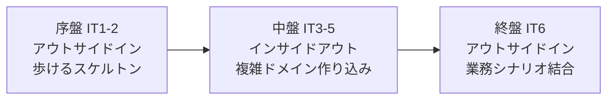
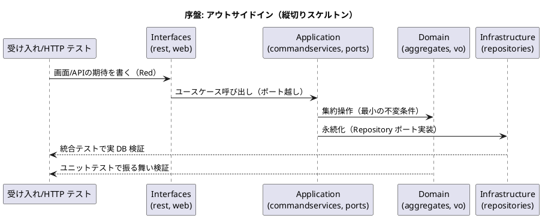
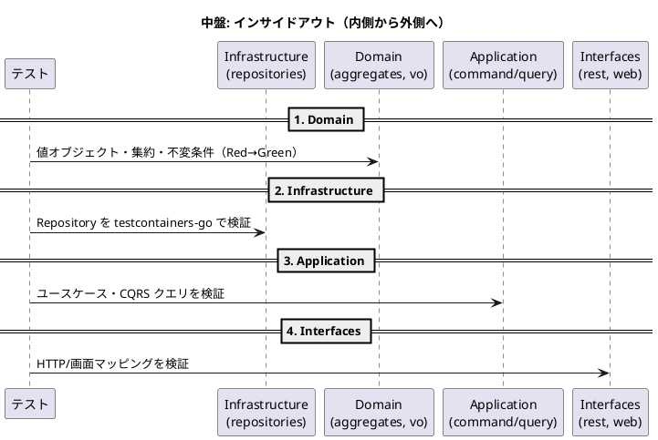
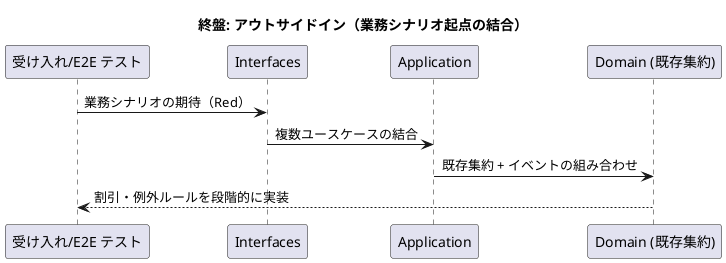

# 開発戦略 - 国際貨物輸送管理システム（Go 版）

## 概要

本ドキュメントは、リリース計画のイテレーション群を **序盤・中盤・終盤** の 3 局面に分け、各局面で採用する TDD アプローチ（テストの入口とレイヤー貫通の順序）を定義する。局面が切り替わってもアーキテクチャ・品質・ユビキタス言語の一貫性を保つことが狙いである。

### Single Source of Truth（参照元）

| 対象 | 正となる参照元 |
| :--- | :--- |
| TDD アプローチ・手順・品質基準 | [コーディングとテストガイド](../reference/コーディングとテストガイド.md) |
| イテレーション × ユーザーストーリー割り当て | [リリース計画](release_plan.md)（**未作成**。作成後に本戦略の局面割り当てを同期する） |
| アーキテクチャ・レイヤー・BC 構成 | [バックエンドアーキテクチャ](../design/architecture_backend.md) |
| テスト種別・ピラミッド・カバレッジ目標 | [テスト戦略](../design/test_strategy.md) |
| 画面遷移・ナビゲーション | [UI 設計](../design/ui_design.md) |

> **注記**: 本戦略の局面割り当て（IT × US）は、本ケーススタディ共通の正典フェーズ構成（Phase 1: 予約・荷主基盤 / Phase 2: 経路設計・追跡 / Phase 3: 精算・例外処理）に基づく暫定案である。`release_plan.md` を `planning-releases` で作成した時点で、そちらを SSoT とし本ドキュメントの割り当て表・対象 US を追従させること。

## 戦略の全体像

局面ごとに変えるのは **テストの入口** と **レイヤー貫通の順序** のみ。Red-Green-Refactor サイクルそのものは全局面で不変とする。

| 局面 | 対象イテレーション | フェーズ | 主アプローチ | 狙い |
| :--- | :--- | :--- | :--- | :--- |
| 序盤 | IT1-2 | Phase 1 予約・荷主基盤 | アウトサイドイン | 縦切りで「歩けるスケルトン」を通し、ヘキサゴナル + BC 分割の基盤妥当性を早期検証 |
| 中盤 | IT3-5 | Phase 2 経路設計・追跡 | インサイドアウト | 経路算出・追跡の複雑ドメインを domain / data 層から堅牢に作り込み、貧血ドメインモデルを回避 |
| 終盤 | IT6 | Phase 3 精算・例外処理 | アウトサイドイン | 実装済みの集約を業務シナリオ起点で結合し、精算・例外処理でリリース全体の一貫性を担保 |



### アプローチ選択の根拠

選択は [コーディングとテストガイドの実装アプローチ選択フロー](../reference/コーディングとテストガイド.md#アプローチ戦略) に対応づけて説明する。

- **序盤（アウトサイドイン）**: API・基盤ともに未実装。ヘキサゴナル構造・BC 境界・sqlc + pgx の永続化・REST/htmx の入口はまだ「歩けて」いない。選択フローの「**API 実装済み? → いいえ → アウトサイドイン活用（UI のニーズから API 設計を導出）**」に該当する。受け入れテスト／画面のニーズから interfaces → application → domain → infrastructure を薄く縦に貫通させ、アーキテクチャ基盤の妥当性を最小コストで検証する。
- **中盤（インサイドアウト）**: 経路候補算出（US08=8SP）・航海スケジュール検索・追跡といった複雑ドメインを扱う。ここでアウトサイドインを続けると、ロジックがサービス層に漏れ「貧血ドメインモデル」に陥りやすい。選択フローの「**基本 CRUD 実装済み? → いいえ → インサイドアウト推奨（データ層から開始し基盤を固めて上位層へ展開）**」に該当する。domain（値オブジェクト・集約・不変条件）と infrastructure（Repository）を先に固め、application → interfaces へ展開する。
- **終盤（アウトサイドイン）**: 中核ドメインは実装済みで、精算（料金算出・法人割引）と例外処理（遅延・破損・紛失）は既存集約とイベントを組み合わせる。選択フローの「**基本 CRUD 実装済み? → はい → ドメインロジックが複雑? → はい → アウトサイドイン推奨（UI からスタートしドメインロジックを段階的に実装）**」に該当する。業務シナリオを受け入れテストで束ね、複数 BC 横断の整合を担保する。

## 共通の TDD サイクル

局面が変わっても不変な規律。詳細は [コーディングとテストガイド](../reference/コーディングとテストガイド.md) を正とする。

### Red-Green-Refactor の 3 原則

1. 失敗するテストを書くまでプロダクションコードを書かない。
2. コンパイル不能を含め、失敗させるのに十分なテストだけを書く。
3. 現在失敗しているテストを通すのに十分なプロダクションコードだけを書く。

### テストレイヤーとパッケージの対応

| テスト種別 | 対象レイヤー | パッケージ | ツール / コマンド |
| :--- | :--- | :--- | :--- |
| ユニットテスト | Domain / Application | `internal/<bc>/domain/`・`internal/<bc>/application/` | testify・`make test`（`go test -cover ./...`、目標 30 秒以内） |
| 統合テスト（Repository） | Infrastructure | `internal/<bc>/infrastructure/` | testcontainers-go・`make test-integration`（`go test -tags=integration ./...`） |
| 統合テスト（HTTP / ACL） | Interfaces / 外部 ACL ポート | `internal/<bc>/interfaces/`・`.../outboundservices/acl` | `net/http/httptest`・`make test-integration` |
| E2E テスト | ユーザーシナリオ全体 | `web/` | Playwright（序盤=全ナビゲーション、中盤以降=各 IT のデモ項目。受け入れ基準として DoD に組み込む） |
| アーキテクチャテスト | BC 境界・レイヤー依存 | 全 BC | go-arch-lint・`make arch` |

### 品質チェック（コミット前の必須確認）

```bash
cd apps/cargo-tracker
make check   # build + test + lint + arch を一括実行
```

- `make build` — コンパイル成功。
- `make test` — 全ユニットテスト green（カバレッジ付き）。
- `make lint` — golangci-lint + govulncheck に指摘なし。
- `make arch` — go-arch-lint による BC 境界・レイヤー依存ルールが**常時グリーン**。
- コミット単位は 1 コミット 1 変更（構造変更と動作変更を混在させない）。

## 序盤: アウトサイドイン（IT1-2 / Phase 1 予約・荷主基盤）

### 目的

ヘキサゴナル + 8 BC 分割 + sqlc/pgx + REST/htmx という構成が「実際に歩けるか」を、業務価値の高い予約・荷主フローで縦切りに検証する。横断関心事（DI 組み立て・PRG・フラッシュ・レイアウト・エラーハンドリング）をロジックの薄いうちに全画面で成立させる。

### 対象ユーザーストーリー（暫定）

| IT | US | 概要 | 主 BC |
| :--- | :--- | :--- | :--- |
| IT1 | US02 荷主を登録する | 荷主マスタ登録 | shipper |
| IT1 | US03 法人荷主を登録する | 法人属性・割引前提 | shipper |
| IT1 | US04 貨物予約を登録する | 予約集約の生成 | booking |
| IT2 | US05 危険物・冷凍貨物の予約を登録する | 特殊貨物属性 | booking |
| IT2 | US13 予約を確定する | 予約確定・状態遷移 | booking |

### ワークフロー



### 手順

1. 受け入れ／HTTP テスト（httptest）で画面・API の期待を書く（Red）。
2. interfaces → application のポート（Go interface）を薄く定義し、application → domain → infrastructure を最小実装で貫通させる（Green）。
3. Repository は testcontainers-go の統合テストで実 DB 検証する。
4. Refactor で値オブジェクト・DTO 変換・エラーハンドリングを整理する。

### 完了条件

- US02〜US05・US13 の主フローが画面／API から DB まで通し実行できる。
- `make check` が green（`make arch` を含む）。
- **Playwright E2E のナビゲーションテストが全ルートで green**（下記「ウォーキングスケルトンの基盤化」）。

### ウォーキングスケルトンの基盤化（Playwright E2E で担保）

IT1 で横断基盤（DI 組み立て・共通ミドルウェア・レイアウト）を構築した直後に、[UI 設計の画面遷移図](../design/ui_design.md) に従ったナビゲーションと全ルートのプレースホルダ画面（html/template + htmx）を一括作成し、これを骨格とする。以降の各 IT は「スタブ画面を実画面へ差し替える」インクリメンタルな作業に落ちる。

**このスケルトンの妥当性は Playwright の E2E テストで担保する。** 序盤の最初のタスクとして Playwright をセットアップし、UI 設計の画面遷移図に対応する **各ナビゲーション遷移の E2E テスト**（ナビバー／ダッシュボードからの各ルート到達、ロール別の表示・非表示）を作成する。全ルートのナビゲーション E2E が green であることを、ウォーキングスケルトン成立の判定基準とする。

- **セットアップ**: `web/` 配下に Playwright を導入し、開発サーバー（`make run` / `make watch`）または CI 起動のアプリに対して実行する。
- **テスト対象**: UI 設計の画面遷移図の全ルート。各ナビゲーションリンクが期待の画面（プレースホルダ含む）へ遷移し、ロール制御（表示・非表示・403）が仕様どおりであること。
- **判定**: `ui_design → navbar → dashboard → E2E ナビゲーションテスト` の 4 点一致を DoD とする。プレースホルダ段階でも遷移とロール制御は成立させる。
- ルート・表示ロール・担当 IT の対応表は `release_plan.md` 作成時に UI 設計と突き合わせて確定する。

## 中盤: インサイドアウト（IT3-5 / Phase 2 経路設計・追跡）

### 目的

経路候補算出・航海スケジュール検索・貨物追跡という、本システムで最もドメインロジックが複雑な領域を、domain 層・data 層から堅牢に作り込む。貧血ドメインモデルを避け、不変条件と CQRS の読み取りモデルを正しく分離する。

### 対象ユーザーストーリー（暫定）

| IT | US | 概要 | 主 BC |
| :--- | :--- | :--- | :--- |
| IT3 | US01 輸送見積を作成する / US06 予約情報を経路設計者に引き渡す | 見積・ハンドオフ | estimation, booking |
| IT4 | US07 航海スケジュールを検索する / US08 経路候補を算出する | 経路探索（複雑） | routing |
| IT4-5 | US09 経路を選択・確定する / US10 経路条件を調整して再算出する / US11 経路情報を予約に紐付ける | 経路確定・紐付け | routing, booking |
| IT5 | US14 追跡番号を発行する / US15 荷役作業を記録する / US16 引取作業を記録する / US18 追跡情報を照会する | 追跡・荷役 | tracking, handling |
| IT5 | US12 確定経路を荷主に通知する | 通知（イベント） | routing, shared |

### ワークフロー



### 手順

1. domain の値オブジェクト（経路・航海・追跡番号など）と集約の不変条件をユニットテストで固める。
2. infrastructure の Repository を testcontainers-go で実 DB 検証する（sqlc + pgx）。
3. application のコマンド／クエリサービスでユースケースを組み立てる。CQRS の読み取りモデルはドメインを持たせず統合テストで直接検証する。
4. 最後に interfaces（REST / htmx 画面）で入口を差し替える。BC 間参照はイベントまたは ACL ポート経由のみ（`make arch` で担保）。

### 完了条件

- 経路算出・追跡の中核ドメインがユニットテストで十分に保護されている（複雑ロジックの分岐カバレッジを重視）。
- 序盤で作ったスタブ画面が実画面へ差し替わっている。
- **当該イテレーション計画のデモ項目をパスする E2E テストが追加され、green である**（下記「デモ項目を E2E 受け入れ基準とする」）。
- `make check` が green。

## 終盤: アウトサイドイン（IT6 / Phase 3 精算・例外処理）

### 目的

実装済みの集約（予約・経路・追跡・荷主）を業務シナリオ起点で結合し、精算（料金算出・法人割引）と例外処理（遅延・破損・紛失）でリリース全体の一貫性を担保する。

### 対象ユーザーストーリー（暫定）

| IT | US | 概要 | 主 BC |
| :--- | :--- | :--- | :--- |
| IT6 | US21 輸送料金を算出する / US22 法人割引を適用する / US23 精算を処理する | 精算・割引 | billing, shipper |
| IT6 | US17 貨物状態を手動更新する / US19 遅延例外を処理する / US20 破損・紛失例外を処理する | 例外処理 | tracking, handling |

### ワークフロー



### 手順

1. 業務シナリオ（精算フロー・例外フロー）を受け入れテスト／E2E で束ねる。
2. 既存集約とドメインイベントを組み合わせ、割引率上限・例外時の状態遷移などのルールを段階的に実装する。
3. 複数 BC 横断の整合をイベント経由で検証し、`make arch` で境界違反がないことを確認する。

### 完了条件

- 精算・例外処理の業務シナリオがクリティカルパスの E2E で保証されている。
- **当該イテレーション計画のデモ項目をパスする E2E テストが追加され、green である**（下記「デモ項目を E2E 受け入れ基準とする」）。
- リリース全 US の受け入れ基準を満たす。
- `make check` が green。

## E2E テストによる受け入れ基準

本戦略では、Playwright の E2E テストを局面横断の受け入れ基準として位置づける。E2E はテストピラミッド上は最小（5%）だが、「業務価値が実際にブラウザから成立するか」を担保する最終ゲートとして各 IT の DoD に組み込む。

### 序盤: ナビゲーション E2E でスケルトンを担保

序盤では Playwright をセットアップし、UI 設計の画面遷移図に対応する各ナビゲーション遷移の E2E テストを作成する（詳細は「ウォーキングスケルトンの基盤化」）。プレースホルダ段階でも、全ルートへの遷移とロール制御が E2E で green であることをスケルトン成立の判定基準とする。

### 中盤・終盤: デモ項目を E2E 受け入れ基準とする

中盤以降は、各 `iteration_plan-N.md` に定義されたイテレーションの **デモ項目（イテレーションレビューで実演するシナリオ）** を、そのままパスする E2E テストを追加し、当該 IT の受け入れ基準とする。

- **入口**: イテレーション計画のデモ項目 = 受け入れシナリオ。デモ項目を「ブラウザ操作の系列」に翻訳して E2E に落とす。
- **追加タイミング**: 序盤で作ったナビゲーション E2E を土台に、各 IT でデモ項目分の E2E を積み増す（プレースホルダ画面向けのナビゲーション E2E を、実画面のシナリオ E2E へ差し替え・拡張する）。
- **判定**: 当該 IT のデモ項目 E2E がすべて green であることを DoD に含める。green でなければイテレーションはクローズしない。
- **回帰**: 追加した E2E は以降のイテレーションでも実行し、既存デモ項目の回帰を防ぐ。

これにより、ユニット・統合テスト（内部品質）に加えて「デモで見せる業務シナリオ」が自動テストとして固定され、イテレーションレビューの実演が常に再現可能な状態になる。

## イテレーションごとの設計ドキュメント整合

各 IT で `iteration_plan-N.md` の設計トピックと `docs/design/`（ドメイン/データモデル・UI 設計・アーキテクチャ・ADR）の整合を、着手時・実装中・完了時に確認する。

- イテレーション計画は局所ビュー、`docs/design/` は全体の「正」である。実装で設計判断が変わったら、その場で `docs/design/` を更新する（計画側だけに書いて放置しない）。
- 着手時は `validating-iteration-plan`、局面をまたぐ整合は `validating-design` で検証する。
- 構造変更（BC 追加・ポート追加・レイヤー依存変更）はアーキテクチャテスト（`make arch`）とフルテスト（`make test-all`）で裏取りする。

## 局面移行時の一貫性維持

- **不変な規律**: Red-Green-Refactor の 3 原則、1 コミット 1 変更、品質基準（`make check` green）、アーキテクチャテスト常時グリーンは全局面で守る。
- **ユビキタス言語の連続性**: BC 名（booking / shipper / routing / tracking / handling / billing / estimation / shared）と集約・値オブジェクトの命名を局面をまたいで一貫させる。ドメインモデルの用語を実装コードと計画・設計の双方で揃える。
- **アーキテクチャの連続性**: 局面でアプローチ（テストの入口）は変わっても、ヘキサゴナル + ポート/アダプター + BC 境界（イベント／ACL 経由）の構造は不変。序盤で確立した骨格を中盤・終盤で壊さない。
- **リリース計画への追従**: `release_plan.md` 作成後にイテレーション構成が変わった場合は、局面割り当て表と各局面の対象 US を追従させ、更新履歴に反映する。

## 更新履歴

| 日付 | 変更内容 |
| :--- | :--- |
| 2026-07-24 | 初版作成。序盤（IT1-2）アウトサイドイン、中盤（IT3-5）インサイドアウト、終盤（IT6）アウトサイドインの 3 局面戦略を定義。局面割り当ては正典フェーズ構成に基づく暫定案（`release_plan.md` 作成後に同期）。 |
| 2026-07-24 | E2E テストによる受け入れ基準を追加。序盤は Playwright の全ナビゲーション E2E でウォーキングスケルトンを担保、中盤以降は各イテレーション計画のデモ項目をパスする E2E を追加して DoD に組み込む方針を明記。 |
