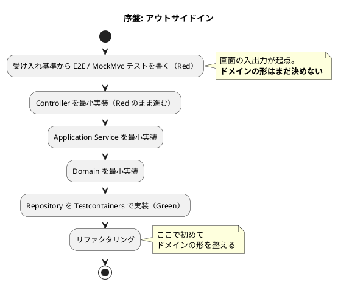
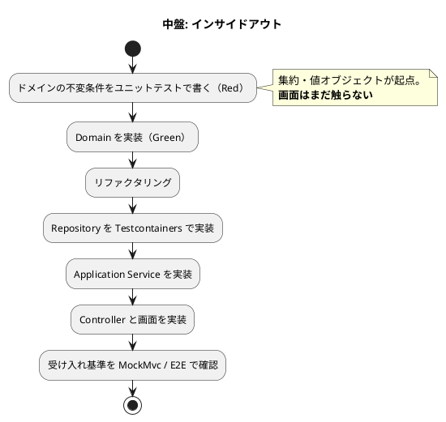

# 開発戦略 - 国際貨物輸送管理システム（java/take-6）

## 概要

[リリース計画](release_plan.md) で確定した IT1〜IT8 を **序盤・中盤・終盤** の 3 局面に分け、各局面で採用する TDD アプローチと横断的な進め方を定義します。

**局面ごとに変えるのは「テストの入口」と「レイヤー貫通の順序」だけです。** Red-Green-Refactor のサイクルそのものは全局面で不変とします。

---

## 局面戦略

| 局面 | 対象 IT | 主アプローチ | 狙い |
| :--- | :--- | :--- | :--- |
| **序盤** | IT1〜IT2 | アウトサイドイン | 縦切りで「歩けるスケルトン」を通し、アーキテクチャ基盤の妥当性を早期に検証する |
| **中盤** | IT3〜IT6 | インサイドアウト | 経路設計と追跡という中核ドメインを、ドメイン層から堅牢に作り込む。貧血ドメインモデルを避ける |
| **終盤** | IT7〜IT8 | アウトサイドイン | 既存ドメインを業務シナリオ起点で結合し、リリース全体の一貫性を担保する |

### アプローチ選択の根拠

| 局面 | 状況 | 選択理由 |
| :--- | :--- | :--- |
| 序盤 | 画面も API も未実装。基盤も未確立 | UI のニーズから API を導出し**薄く貫通**させるのが安全。ここで基盤（Security・Thymeleaf・MyBatis・Testcontainers）の妥当性を検証する |
| 中盤 | 基盤は確立済み。**中核ドメインが複雑** | 経路候補算出（US08）・BookingStatus の 8 状態遷移・荷役と輸送状態の連動は、上位から作ると貧血モデルになりやすい。**ドメイン層から固める** |
| 終盤 | 基本実装済み × ドメイン複雑 | 例外対応・誤配・通関は既存集約の組み合わせ。**業務シナリオを受け入れテストで束ねる** |

> **中核ドメインが複雑であるため中盤（インサイドアウト）を省略しません。** 本システムは `architecture_backend.md` の業務領域評価で「中核の業務領域 / データ構造は複雑 / 特殊要件あり」と判定されています。CRUD 中心ではありません。

---

## 序盤（IT1〜IT2）: アウトサイドイン

### 目的

ウォーキングスケルトンを通し、**アーキテクチャ基盤が実際に動くこと**を確認します。設計ドキュメントで妥当と判断した構成が、コードとして成立するかはここで初めて分かります。

### 対象ストーリー

| IT | US | 内容 |
| :--- | :--- | :--- |
| IT1 | US26 / US27 / US31 / US02 | 認証と荷主登録 |
| IT2 | US04 | 貨物予約登録 |

### ワークフロー

### 手順

1. 受け入れ基準を MockMvc（Controller）のテストに 1:1 で落とす
2. 画面 → Controller → Application → Domain → Repository の順に**最小実装で貫通**させる
3. Repository のテストは Testcontainers で書く（ADR-003。H2 では書かない）
4. 緑になってからドメインの形を整える

### 完了条件

- [ ] 対象 US の受け入れ基準がすべて緑
- [ ] `./gradlew check` が緑
- [ ] Heroku 開発環境にデプロイして画面が動作する
- [x] **ArchUnit のルール 1・2・3 が有効化され、違反を検出できることを確認済み**（4・6 も IT1 で前倒し有効化）

---

## 中盤（IT3〜IT6）: インサイドアウト

### 目的

経路設計と追跡という**中核ドメイン**を、ドメイン層から作り込みます。ここが本システムの差別化領域です。

### 対象ストーリー

| IT | US | 中核となるドメイン |
| :--- | :--- | :--- |
| IT3 | US24 / US07 / US06 | `Voyage` 集約と `CarrierMovement` の連結制約 |
| IT4 | US08 | **`BookingRouteProposal` と経路探索**（本システム最大の複雑さ） |
| IT5 | US09 / US11 | `Cargo` への `CargoItinerary` 反映と `RoutingStatus` |
| IT6 | US13 / US14 / US15 | **BookingStatus の状態遷移**と荷役・輸送状態の連動 |

### ワークフロー

### 手順

1. **不変条件を先にテストにする**。BookingStatus の遷移表（`domain-model.md`）は許可・拒否の全セルを `@ParameterizedTest` で網羅する
2. 境界値を必ず含める（期限当日の時刻付き到着・ちょうど 48 時間・金額の丸め。`test_strategy.md` の必須境界値ケース）
3. ドメインが緑になってから外側へ展開する
4. 画面は最後に付ける

### 完了条件

- [ ] ドメインの不変条件がユニットテストで固定されている
- [ ] 必須境界値ケースが網羅されている
- [ ] 対象 US の受け入れ基準がすべて緑
- [x] **ArchUnit のルール 4・6（BC 分離・共有カーネルの範囲）は IT1 で有効化済み**

---

## 終盤（IT7〜IT8）: アウトサイドイン

### 目的

既存ドメインを**業務シナリオ起点で結合**し、リリース全体の一貫性を担保します。

### 対象ストーリー

| IT | US | 内容 |
| :--- | :--- | :--- |
| IT7 | US18 / US16 / US17 / US03 / US25 | 追跡照会・引取・状態更新 |
| IT8 | US05 / US10 / US12 / US19 / US20 / US28 / US29 | 例外対応・誤配・通関 |

### 手順

1. **業務シナリオから E2E / 受け入れテストを書く**（「遅延が起きて解決するまで」「誤配を検知して組み直すまで」）
2. 既存集約を組み合わせて実装する。**新しい集約はできるだけ作らない**
3. 例外解決後の復帰（`status_before`）のように、**リクエストをまたぐ状態**を必ず統合テストで確認する

### 完了条件

- [ ] 業務シナリオが通しで動作する
- [ ] E2E のクリティカルパス 3 本（US13 / US15 / US18）が緑
- [ ] **ArchUnit の 6 ルールがすべて有効**（1・2・3・4・5・6 は IT1 で有効化済み。以降は無効化しない）

---

## 横断方針

### 1. デモ項目を受け入れ基準とする

各イテレーションのデモ項目を**受け入れ基準**として DoD に組み込みます。テストピラミッド上 E2E は 5% ですが、「**業務価値が実際に成立するか**」を担保する最終ゲートです。

| 局面 | 受け入れの形 |
| :--- | :--- |
| 序盤 | E2E 基盤（Playwright）をセットアップし、全ナビゲーション遷移を確認する |
| 中盤 | 対象ドメインの業務フローを MockMvc の統合テストで確認する |
| 終盤 | クリティカルパス 3 本（US13 / US15 / US18）を E2E で緑にする |

### 2. 品質ゲートの段階的有効化

**実装が 0 件の状態で強制しても意味を持たないため**、実装の追加にあわせて有効化します。

| 対象 | 有効化する IT | 理由 |
| :--- | :--- | :--- |
| ArchUnit ルール 1・2・3（依存方向） | **IT1** | 骨格のみの今のうちに入れる。後になるほど直す量が増える |
| ArchUnit ルール 4・6（BC 分離・共有カーネル） | **IT1（前倒し）** | `shipper` と `security` に実クラスが入った時点で検査対象が揃った。**最初の BC 間依存が生まれる瞬間に守るルールが無いと、ACL を挟まない直接参照に気づけない** |
| JaCoCo カバレッジ閾値 | **IT2** | 実装量が少ない段階で 75% を強制すると、閾値を満たすためのテストを書くことになる |
| E2E（Playwright） | **IT6** | 一気通貫が成立して初めてクリティカルパスを通せる |
| JaCoCo レイヤー別ルール | **IT8** | Release 1 の最終イテレーションまでに全体ルールから分割する |

> **有効化のたびに、違反を実際に検出できることを確認します。** `allowEmptyShould(true)` のような「何も検査しないまま緑」を作りません。設定したことと働いていることは別です。

### 3. 局面が変わっても不変の規律

| 規律 | 内容 |
| :--- | :--- |
| TDD サイクル | Red → Green → Refactor。テストを先に書く |
| コミット単位 | 意味のある単位。Conventional Commits（`feat(booking):` 等。スコープは BC 名） |
| 品質基準 | Checkstyle 0 件 / SpotBugs 0 件（`test_strategy.md` §6.2 が正典） |
| アーキテクチャテスト | **常時グリーン**。有効化したルールを後から無効化しない |
| ユビキタス言語 | `domain-model.md` の用語をコードの識別子に使う。JIG の `glossary.html` で乖離を確認する |
| DB の使い分け | Repository のテストは Testcontainers。H2 では書かない（ADR-003） |

### 4. 設計ドキュメントとの整合

**実装と設計の乖離は、目視ではなく生成物の差分で検出します。**

| 生成物 | 突き合わせ先 | タイミング |
| :--- | :--- | :--- |
| JIG（`gulp app:jig`） | `domain-model.md` / `architecture_backend.md` | 各 IT のクローズ時 |
| jig-erd（`gulp app:jig-erd`） | `data-model.md` | マイグレーション追加時 |

設計ドキュメントの欠落・先行実装が必要な要素が見つかった場合は、**当該 IT で設計ドキュメントも同時に更新**します。実装だけ進めると、次の IT の計画が古い設計を参照します。

---

## 局面の見直し

**IT3 終了時にベロシティの実績で局面配分を見直します。** 初期ベロシティ 12SP は他言語版からの推測値であり、実績が出るまでは IT7・IT8 の配分（13SP / 28SP）も暫定です。

見直しの判断材料:

- IT1〜IT3 の実績 SP
- 中核ドメイン（US08）の実装難度が想定どおりだったか
- 品質ゲートの有効化が計画どおり進んだか

---

## 関連ドキュメント

- [リリース計画](release_plan.md) — IT 配分と SP の正典
- [リリーススコープ定義](release_scope.md) — スコープの正典
- [テスト戦略](../design/test_strategy.md) — テストレベル・品質基準の正典
- [バックエンドアーキテクチャ](../design/architecture_backend.md) — 業務領域評価とパッケージ構成
- [ADR 一覧](../adr/index.md) — 技術的意思決定
