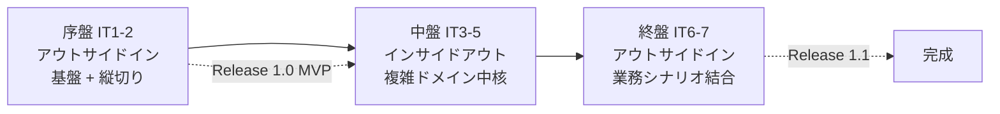
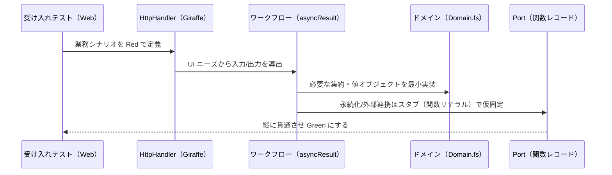
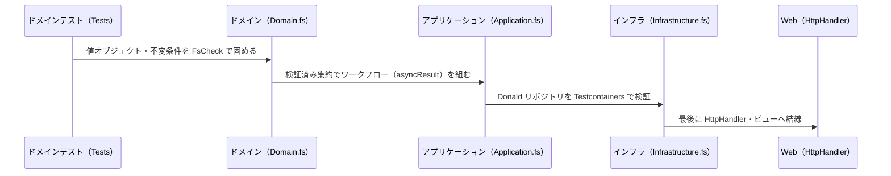
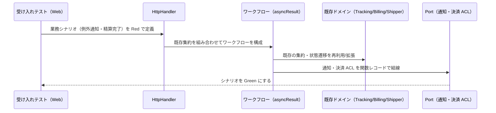

# 開発戦略 - 国際貨物輸送管理システム（Cargo Tracker F# 版）

## 概要

本ドキュメントは、[リリース計画](./release_plan.md)のイテレーション群を **序盤・中盤・終盤** の 3 局面に分け、
各局面で採用する TDD アプローチ（アウトサイドイン / インサイドアウト）と横断的な進め方を定義する。

個々の Red-Green-Refactor サイクルの手順・品質基準・コミット規約は
[コーディングとテストガイド](../reference/コーディングとテストガイド.md)を Single Source of Truth とする。
本戦略はその上位で「**テストの入口をどこに置き、レイヤーをどの順で貫通するか**」を局面ごとに決めるものである。
局面が切り替わっても、アーキテクチャ（DDD + ヘキサゴナル + CQRS の関数型実装）・品質・ユビキタス言語の一貫性を保つことを狙う。

### 参照元（Single Source of Truth）

| 参照元 | 責務 |
| :--- | :--- |
| [コーディングとテストガイド](../reference/コーディングとテストガイド.md) | アプローチ・手順・品質基準・コミット規約 |
| [リリース計画](./release_plan.md) | イテレーション × ユーザーストーリー割り当て・SP・DDD コンテキスト |
| [UI 設計](../design/ui_design.md) | 画面遷移・ナビゲーション（ウォーキングスケルトンの骨格） |
| [バックエンドアーキテクチャ](../design/architecture_backend.md) | レイヤー構成・ROP・Port（関数レコード） |

---

## 戦略の全体像

局面ごとに変えるのは **テストの入口** と **レイヤー貫通の順序** のみ。Red-Green-Refactor サイクルそのものは全局面で不変とする。

| 局面 | 対象 IT | 主アプローチ | 対象コンテキスト | 狙い |
| :--- | :--- | :--- | :--- | :--- |
| 序盤 | IT1-IT2 | アウトサイドイン | Shipper・Estimation・Booking | 縦切りで「歩けるスケルトン」を通し、基盤（DbUp・UoW + post-commit・認証・ROP）の妥当性を早期検証 |
| 中盤 | IT3-IT5 | インサイドアウト | Routing・Tracking・Handling | 経路算出・追跡状態遷移・荷役妥当性という複雑ドメインをドメイン層から堅牢に作り込み、貧血モデルを回避 |
| 終盤 | IT6-IT7 | アウトサイドイン | Tracking（例外）・Billing | 既存集約を業務シナリオ起点で結合し、例外対応〜精算までリリース全体の一貫性を担保 |

### アプローチ選択の根拠

選択は[コーディングとテストガイドの実装アプローチ選択フロー](../reference/コーディングとテストガイド.md#アプローチ戦略)に対応づける。
理由を明記することで、局面が機械的な区切りでなく論理的必然であることを示す。

- **序盤（アウトサイドイン）**: API・基盤とも未実装。選択フローの「API 実装済み? → いいえ → アウトサイドイン活用」に該当する。
  UI／受け入れテストのニーズから `HttpHandler`（Giraffe）と Port（関数レコード）を導出し、薄く縦に貫通させるのが安全。
  基盤（認証・DbUp・UoW）が固まっていない段階では、まず一気通貫の細い経路を通してアーキテクチャの妥当性を検証する。
- **中盤（インサイドアウト）**: 経路候補算出・追跡状態遷移・荷役妥当性は不変条件と網羅的な状態遷移を持つ複雑ドメイン。
  選択フローの「基本 CRUD 実装済み? → いいえ → 貧血ドメインモデル懸念 → インサイドアウト推奨」に該当する。
  判別共用体・スマートコンストラクタでドメイン層（`Domain.fs`）を FsCheck で固めてから、Application → Infrastructure → Web へ展開する。
- **終盤（アウトサイドイン）**: 中核ドメインは実装済みで、例外対応・精算は既存集約（Tracking・Shipper・Booking）を跨いだ業務シナリオ。
  選択フローの「基本 CRUD 実装済み? → はい × ドメイン複雑 → アウトサイドイン推奨」に該当する。
  受け入れテストで業務シナリオを束ね、既存ドメインを組み合わせて結合する。

---

## 共通の TDD サイクル

全局面で不変。詳細は[コーディングとテストガイド](../reference/コーディングとテストガイド.md#red-green-refactor-サイクル)に従う。

### Red-Green-Refactor の 3 原則

1. 失敗するテストを書くまでプロダクトコードを書かない
2. 失敗させるのに十分な分だけテストを書く（コンパイルエラーも失敗のうち）
3. テストを通すのに十分な分だけプロダクトコードを書く

### テストプロジェクトとレイヤーの対応

F# のプロジェクトはファイル順コンパイル（`Domain.fs → Application.fs → Infrastructure.fs`）でレイヤー依存方向を静的に保証する。
`CargoTracker.Web` が Interfaces 層（Giraffe ハンドラ + ViewEngine ビュー）を担う。

| テストプロジェクト | 対象レイヤー | 主なツール |
| :--- | :--- | :--- |
| `CargoTracker.Tests` | Domain / Application（純粋関数・ワークフロー） | xUnit・FsUnit・FsCheck |
| `CargoTracker.IntegrationTests` | Infrastructure（Donald リポジトリ・外部 ACL） | Testcontainers・WireMock.Net |
| `CargoTracker.Web`（受け入れ） | Interfaces（HttpHandler・ビュー・E2E） | WebApplicationFactory・Microsoft.Playwright |
| `CargoTracker.ArchTests` | 全体（依存方向・BC 分離） | ArchUnitNET |

### 品質チェック（コミット前の必須確認）

`ops/scripts/develop.js`（Gulp タスク）経由で実行する。

| コマンド | 内容 |
| :--- | :--- |
| `gulp dev:test` | 全テスト実行（`dotnet test`） |
| `gulp dev:test:coverage` | カバレッジ計測（coverlet・ドメイン層 85% / 全体 80%） |
| `gulp dev:format:check` | Fantomas フォーマット検証 |
| `gulp dev:lint` | FSharpLint 静的解析 |
| `gulp dev:check` | フォーマット + Lint + テストの一括確認 |
| `gulp tdd:backend` | TDD ウォッチ（`dotnet watch test`） |

> **不変の規律**: ArchUnitNET のアーキテクチャテストは全局面で常時グリーンを維持する。
> ビルド警告 0・Fantomas クリーン・FSharpLint 警告なしをコミットの前提とする。1 コミット 1 論理変更（Conventional Commits）。

---

## 序盤: アウトサイドイン（IT1-IT2）

### 目的

基盤（DbUp 二方言・UnitOfWork + post-commit イベント・Cookie 認証/RBAC・FsToolkit ROP ワークフロー）を確立し、
Shipper・Estimation・Booking を縦切りで貫通させて「歩けるスケルトン」を通す。アーキテクチャの妥当性を最小の業務ロジックで早期検証する。

### 対象ユーザーストーリー

| IT | US | コンテキスト |
| :--- | :--- | :--- |
| IT1 | US02・US03（荷主登録）・US01（見積） + 認証基盤 | Shipper・Estimation |
| IT2 | US04・US05（貨物予約）・US06（引き渡し） | Booking |

### ワークフロー（アウトサイドイン）

### 手順

1. `HttpHandler` レベルの受け入れテスト（WebApplicationFactory）で業務シナリオを Red にする。
2. UI が要求する入力・出力から Command / Query（判別共用体）と `asyncResult` ワークフローを導出する。
3. ドメイン層は当該シナリオを通す最小限（スマートコンストラクタ・状態遷移）に留める。
4. Port（`ExternalRoutingPort` 等）は関数リテラルのスタブで仮固定し、実装は後続 IT に委ねる。
5. 縦に貫通したら Refactor で重複を除去し、ArchUnitNET を緑に保つ。

### ウォーキングスケルトンの基盤化

IT1 で認証（Cookie 認証・`requiresRole`）を確立した直後に、[UI 設計の画面遷移図](../design/ui_design.md#画面遷移図)に従った
ロール制御付きナビゲーションと全ルートのプレースホルダ画面を一括作成し、これを骨格とする。
認証・認可・PRG（Post/Redirect/Get）・フラッシュメッセージ・共通レイアウトといった横断関心事を、業務ロジックが薄いうちに全画面で成立させる。
以降の各 IT は「プレースホルダを実画面へ差し替える」インクリメンタルな作業に落ちる。

| ルート | 表示ロール | 差し替え担当 IT |
| :--- | :--- | :--- |
| `/login`・`/logout` | 全ロール（未認証可） | IT1 |
| `/shippers`・`/estimates` | ROLE_SALES | IT1 |
| `/bookings` | ROLE_SALES・ROLE_SHIPPER | IT2 |
| `/voyages` | ROLE_ROUTE_DESIGNER | IT3-IT4 |
| `/tracking`・`/handling` | ROLE_TRACKER・ROLE_HANDLER | IT5 |
| `/public/tracking/{accessToken}` | 未認証可 | IT5 |
| `/tracking/{trackingNumber}/exceptions/new` | ROLE_TRACKER | IT6 |
| `/admin/discount-policies` | ROLE_ADMIN | IT7 |

### 完了条件

- [ ] 「ログイン → 荷主登録 → 見積 →（IT2）予約」が WebApplicationFactory 受け入れテストで一気通貫
- [ ] ロールバック時にドメインイベントが発行されないことを統合テストで実証
- [ ] ウォーキングスケルトン（全ルートのロール制御付きプレースホルダ）が成立
- [ ] ArchUnitNET・方言検出テストが緑

---

## 中盤: インサイドアウト（IT3-IT5）

### 目的

経路候補算出（Routing）・追跡状態遷移（Tracking）・荷役妥当性検証（Handling）という不変条件と網羅的状態遷移を持つ
複雑ドメインを、ドメイン層から堅牢に作り込む。貧血ドメインモデルを避け、業務ルールをドメインに凝集させる。

### 対象ユーザーストーリー

| IT | US | コンテキスト |
| :--- | :--- | :--- |
| IT3 | US24・US25（航海スケジュール）・US07（検索）・US08（経路候補算出） | Routing |
| IT4 | US09・US10・US11・US12・US13（経路確定〜予約確定） | Routing・Booking |
| IT5 | US14〜US18（追跡番号・荷役・引取・照会） | Tracking・Handling |

### ワークフロー（インサイドアウト）

### 手順

1. ドメイン層（`Domain.fs`）の値オブジェクト・状態遷移をユニット + FsCheck（プロパティ）で先に固める。
2. スマートコンストラクタで不正状態を型レベルに排除する（Make Illegal States Unrepresentable）。
3. Application 層で `asyncResult` / `validation` によるワークフローを組み、Port 経由でインフラを呼ぶ。
4. Infrastructure 層の Donald リポジトリを Testcontainers（実 PostgreSQL）で検証する。
5. 最後に Web 層（`HttpHandler` + ViewEngine）へ結線し、受け入れ・E2E で束ねる。
6. 経路候補算出（US08）は Routing Context が保有する Voyage スケジュールから構成するドメインサービスとして実装する（ADR-0009）。外部経路 ACL（`ExternalRoutingServicePort`）は Estimation の概算見積・将来の代替経路連携に役割を限定し、WireMock.Net で契約を固定する。

### 完了条件

- [ ] Routing・Tracking・Handling のドメイン不変条件が FsCheck で検証済み（ドメイン被覆 85% 以上）
- [ ] 経路候補算出が Routing 保有スケジュールからのドメインサービスで動作（ADR-0009）、状態遷移（追跡・荷役）が網羅的に検証済み
- [ ] IT5 完了時点で Release 1.0 MVP の業務フローが一気通貫（US13・US15・US18 の E2E）
- [ ] ArchUnitNET（BC 間の直接参照禁止・ドメインのフレームワーク非侵入）が緑

---

## 終盤: アウトサイドイン（IT6-IT7）

### 目的

例外対応（遅延・破損・紛失）と料金算出〜精算という、既存集約を跨いだ業務シナリオを結合する。
基本実装済みのドメインを業務シナリオ起点で束ね、Release 1.1 全体の一貫性を担保する。

### 対象ユーザーストーリー

| IT | US | コンテキスト |
| :--- | :--- | :--- |
| IT6 | US19（遅延例外）・US20（破損・紛失例外） | Tracking |
| IT7 | US-ADM-01（割引ポリシー）・US21（料金算出）・US22（法人割引）・US23（精算） | Billing |

### ワークフロー（アウトサイドイン）

### 手順

1. 業務シナリオ（例外登録 → エスカレーション → 荷主通知、精算書発行 → 入金確認 → 予約 Settled 同期）を受け入れテストで Red にする。
2. 既存の Tracking・Booking・Shipper 集約を再利用・拡張してワークフローを構成する。
3. 通知 ACL（`NotificationPort`）・決済 ACL（`PaymentGatewayPort`）を関数レコードで結線し、WireMock.Net で契約を固定する。
4. Money 値オブジェクト（銀行家丸め）・割引上限 30% の境界値をユニットで固める。
5. BC 間連携は ACL / Event 経由に限定し、ArchUnitNET で直接参照がないことを保証する。

### 完了条件

- [ ] 例外対応が全層（ドメイン → 永続化 → イベント → 通知 → UI → 受け入れ）で完結
- [ ] 料金算出（Delivered 制限）・法人割引・精算書発行・入金確認・予約 Settled 同期が一気通貫
- [ ] 金額計算の境界値テスト（Money・割引上限）が完了
- [ ] Release 1.1 出荷条件を充足、全テスト緑・カバレッジ維持

---

## イテレーションごとの設計ドキュメント整合

各 IT で `iteration_plan-N.md` の設計トピックと `docs/design/`（ドメイン/データモデル・UI 設計・アーキテクチャ・ADR）の整合を、
着手時・実装中・完了時に確認する。イテレーション計画は局所ビュー、`docs/design/` は全体の「正」である。

- **着手時**: `validating-iteration-plan` で計画と上流設計の整合を検証する。
- **実装中**: 実装で設計判断が変わったら、その場で `docs/design/` を更新する（計画側だけに書いて放置しない）。
- **完了時**: 構造変更はアーキテクチャテスト（ArchUnitNET）とフルテスト（`gulp dev:test`）で裏取りする。
- 局面をまたぐ設計トピックの連続性（命名・ユビキタス言語・設計判断）は `validating-design` で横断検証する。

---

## 局面移行時の一貫性維持

アプローチ（テストの入口・貫通順序）が変わっても、以下の規律は全局面で不変とする。

1. **Red-Green-Refactor の 3 原則** — テストが先、最小実装、こまめなリファクタリング。
2. **1 コミット 1 論理変更** — Conventional Commits 準拠。局面が変わってもコミット粒度は変えない。
3. **品質基準** — ビルド警告 0・Fantomas クリーン・FSharpLint 警告なし・カバレッジ（ドメイン 85% / 全体 80%）。
4. **アーキテクチャテスト常時グリーン** — ヘキサゴナルの依存方向・BC 分離を ArchUnitNET で継続保証。ファイル順コンパイルと二重防御。
5. **ユビキタス言語の連続性** — 序盤で確立した用語（荷主・見積・予約・経路・追跡・精算）を全局面で一貫使用する。
6. **Port は関数レコード** — 外部連携は全局面で ACL ポート（関数レコード）として抽象化し、テストは関数リテラルのスタブで差し込む。

局面の移行（IT2→IT3、IT5→IT6）は、前局面の完了条件を満たしたうえで行う。移行時にアプローチが変わることを
`iteration_plan-N.md` の冒頭に明記し、レビュー（`developing-review`）で入口の妥当性を確認する。

---

## 更新履歴

| 日付 | 更新内容 | 更新者 |
|------|---------|--------|
| 2026-07-14 | 初版作成。IT1-7 を 3 局面（序盤 IT1-2 / 中盤 IT3-5 / 終盤 IT6-7）に割り当て、F# 技術スタック（Giraffe/Donald/FsToolkit ROP・ファイル順コンパイル）に即した各局面のワークフローと不変規律を定義 | - |
| 2026-07-15 | 中盤の US08 経路候補算出を「外部 ACL スタブ駆動」から「Routing 自コンテキストのドメインサービス構成」に修正（ADR-0009 に整合。US24/25 の登録スケジュールを US08 で活用）。ExternalRoutingServicePort は Estimation 概算・将来連携に役割限定 | - |
