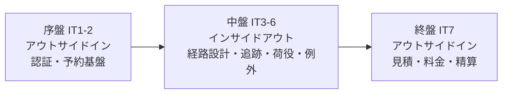
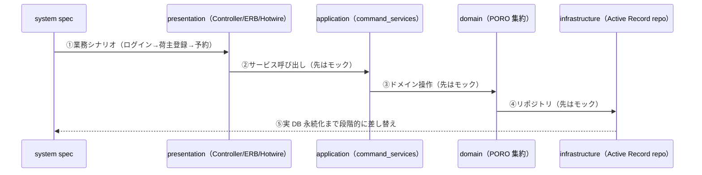
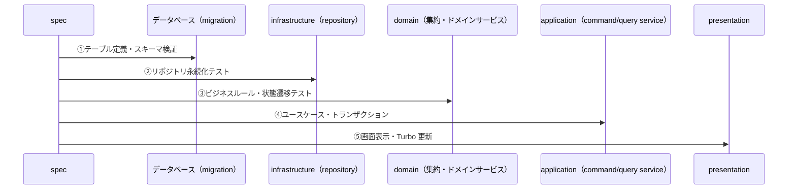

# 開発戦略 - 国際貨物輸送管理システム（Rails 版）

## 概要

本ドキュメントは、計画済みのイテレーション群（IT1〜IT7）を **序盤・中盤・終盤** の局面に振り分け、各局面で採用する TDD アプローチ（アウトサイドイン／インサイドアウト）と横断的な進め方を定義する。個々の Red-Green-Refactor サイクルは [コーディングとテストガイド](../reference/コーディングとテストガイド.md) に従い、本戦略はその上位で「テストの入口をどこに置き、レイヤーをどの順で貫通するか」を局面ごとに決める。局面が切り替わってもアーキテクチャ・品質・ユビキタス言語の一貫性を保つことが狙いである。

### 参照元（Single Source of Truth）

| 参照対象 | 正となるドキュメント |
|---------|---------------------|
| イテレーション × US のマクロ配分 | [release_plan.md](release_plan.md) |
| 各 IT の対象 US・デモ項目・受け入れ条件 | `docs/development/iteration_plan-N.md`（IT 着手時に作成） |
| TDD アプローチ・手順・品質基準・コミット規約 | [コーディングとテストガイド](../reference/コーディングとテストガイド.md) |
| テスト種別・ピラミッド・カバレッジ目標 | [test_strategy.md](../design/test_strategy.md) |
| レイヤ・BC 境界・ヘキサゴナル構成 | [architecture_backend.md](../design/architecture_backend.md) |
| 技術スタック（Rails 8 / RSpec / Packwerk 等） | [tech_stack.md](../design/tech_stack.md) |
| 画面遷移・ナビゲーション | [ui_design.md](../design/ui_design.md) |

> **前提**: 本戦略はイテレーション計画を前提とする。`iteration_plan-N.md` が未作成の IT については、release_plan.md のイテレーションゴールを **デモ項目の暫定案** として扱い、各 IT 着手時（`opening-iteration`）に計画確定へ追従させる。

---

## 戦略の全体像

局面ごとに変えるのは **テストの入口** と **レイヤー貫通の順序** のみ。Red-Green-Refactor サイクルそのものは全局面で不変とする。

| 局面 | イテレーション | 主アプローチ | 対象 US | 狙い |
|:-----|:--------------|:------------|:--------|:-----|
| **序盤** | IT1-IT2 | アウトサイドイン | US26/US27/US02/US03/US04/US05/US06 | 認証・予約入口を縦切りで通し、packs 構成・認証・CQRS 基盤の妥当性を早期検証（ウォーキングスケルトン） |
| **中盤** | IT3-IT6 | インサイドアウト | US24/US25/US07〜US20 | 経路設計・追跡・荷役・例外という複雑な中核ドメインを、データ層・ドメイン層から堅牢に作り込み貧血モデルを回避 |
| **終盤** | IT7 | アウトサイドイン | US01/US21/US22/US23 | 既存集約（Booking/Routing/Shipper/Billing）を見積〜精算の業務シナリオ起点で結合し、リリース全体の一貫性を担保 |



### アプローチ選択の根拠

選択は [コーディングとテストガイド](../reference/コーディングとテストガイド.md) の「実装アプローチ選択フロー」に対応づける。

- **序盤（アウトサイドイン）**: API・基盤とも未実装。UI／受け入れテストのニーズから API を導出し薄く貫通させるのが安全（フロー「API 未実装 → アウトサイドイン活用」）。認証・荷主・予約の入口を先に縦へ通すことで、DDD + ヘキサゴナル + CQRS + packs という構成そのものの妥当性を最初のリリースで検証する。
- **中盤（インサイドアウト）**: 経路候補算出・料金前提となる荷役履歴・状態遷移など、ドメインロジックが複雑で貧血モデルに陥りやすい。データ層（Active Record）→ リポジトリ（ヘキサゴナルのアダプタ）→ ドメイン層（PORO 集約）の順で基盤を固めてから上位へ展開する（フロー「基本 CRUD 未実装／貧血ドメインモデル → インサイドアウト推奨」）。
- **終盤（アウトサイドイン）**: 見積・料金・精算は既存の Booking/Routing/Shipper/Billing 集約を組み合わせる。基本実装済み × ドメイン複雑のため、業務シナリオ（見積→料金算出→割引→精算）を受け入れテストで束ねて上位から結合する（フロー「基本実装済み × 複雑 → アウトサイドイン推奨」）。

---

## 共通の TDD サイクル

局面が変わっても不変な規律。

### Red-Green-Refactor の 3 原則

1. 失敗するテストを書くまでプロダクションコードを書かない。
2. コンパイル不能・失敗を除き、失敗させる以上のテストを書かない。
3. 現在失敗しているテストを通す以上のプロダクションコードを書かない。

### テスト種別とレイヤーの対応

[test_strategy.md](../design/test_strategy.md) のピラミッド型に従う。

| テストレベル | ツール | 検証対象 | 主に書く局面 |
|:------------|:-------|:---------|:------------|
| ユニット（ドメイン spec） | RSpec + instance_double | PORO 集約・値オブジェクト・状態遷移・ドメインサービス | 全局面（中盤で最も厚く） |
| 統合（request / repository spec） | RSpec（rails_helper）+ PostgreSQL 16 | HTTP 層・リポジトリ永続化・ACL アダプタ | 全局面 |
| E2E（system spec） | Capybara + capybara-playwright-driver | 業務シナリオ・Turbo 動的更新・ナビゲーション | 序盤（骨格）・終盤（シナリオ結合） |
| アーキテクチャ | Packwerk | BC 境界・レイヤ依存・ドメイン層の Rails 非依存 | 全局面（常時グリーン） |

### コミット前の必須品質チェック

各コミット前に以下を green にする（[コーディングとテストガイド](../reference/コーディングとテストガイド.md) の品質チェックリストに準拠）。

```bash
bundle exec rspec        # テスト実行（ドメイン層のみは bundle exec rspec spec/domain で高速化）
bundle exec rubocop      # コードスタイル・静的解析
bundle exec brakeman     # セキュリティ静的解析
bin/packwerk check       # アーキテクチャ（BC 境界・レイヤ依存）テスト
```

- **カバレッジ目標**: ドメイン層 85% 以上 / 全体 80% 以上（SimpleCov で計測）。
- **コミット単位**: 1 コミット 1 目的。構造変更（refactor）と動作変更（feat/fix）を混在させない。

---

## デモ項目を受け入れ基準とする（局面横断）

各 `iteration_plan-N.md` のデモ項目（イテレーションレビューで実演するシナリオ）を、局面横断の受け入れ基準として位置づける。受け入れ／E2E テストはピラミッド上は最小でも、「業務価値が実際に成立するか」を担保する最終ゲートとして各 IT の DoD に組み込む。

- **序盤**: system spec（Capybara + Playwright）の基盤をセットアップし、ウォーキングスケルトンの妥当性を担保する。UI 設計の画面遷移図に従い、全ルート到達とロール別の表示／非表示／403 を system spec で green にする。
- **中盤・終盤**: 各 IT のデモ項目をそのままパスする受け入れ／E2E テストを追加し、当該 IT の受け入れ基準とする。デモ項目を「操作の系列」に翻訳してテスト化する。
- **判定**: 当該 IT のデモ項目テストがすべて green であることを DoD に含める。green でなければイテレーションはクローズしない。追加したテストは以降も実行し、既存デモ項目の回帰を防ぐ。

---

## 序盤: アウトサイドイン（IT1-IT2）

### 目的

Rails 8 + packs + DDD/ヘキサゴナル/CQRS という構成を、認証・荷主・貨物予約という予約業務の入口で縦切りに貫通させ、アーキテクチャ基盤の妥当性を Release 0.1 で早期検証する。

### 対象ユーザーストーリー

| IT | US | 概要 | BC |
|:---|:---|:-----|:---|
| IT1 | US26/US27 | ログイン・ログアウト | 共通（認証・認可基盤） |
| IT1 | US02/US03 | 荷主・法人荷主登録 | Shipper Context |
| IT2 | US04/US05 | 貨物予約・危険物/冷凍予約 | Booking Context |
| IT2 | US06 | 経路設計者への引き渡し | Booking Context |

### ワークフロー（アウトサイドイン）



### 手順

1. **ウォーキングスケルトンの基盤化**: 横断基盤（packs/Packwerk・Rails 8 標準認証 + Pundit・共通レイアウト）を構築し、直後に UI 設計の画面遷移図に従ったナビゲーション（ロール制御付き）と全ルートのプレースホルダ画面を一括作成する。その妥当性を system spec（全ナビゲーション遷移・ロール別 403）で green にする。
2. 受け入れシナリオ（system spec）を先に書き、UI → application → domain → infrastructure の順にモックを実装へ差し替える。
3. 各層でユニット／統合テストを補い、ドメイン層は PORO（Active Record 非依存）で実装する。

### 完了条件

- IT1/IT2 のデモ項目 system spec がすべて green。
- 全ナビゲーション遷移とロール別アクセス制御が system spec で担保されている。
- Packwerk / RuboCop / Brakeman green、ドメイン層カバレッジ 85% 以上。
- Release 0.1 のリリース条件（release_plan.md）を満たす。

---

## 中盤: インサイドアウト（IT3-IT6）

### 目的

経路候補算出（外部 ACL 含む）・追跡・荷役履歴・例外処理という、状態遷移とビジネスルールが複雑な中核ドメインを、データ層・ドメイン層から堅牢に作り込み、貧血ドメインモデルを回避する。

### 対象ユーザーストーリー

| IT | US | 概要 | BC |
|:---|:---|:-----|:---|
| IT3 | US24/US25/US07/US08 | 航海スケジュール登録・更新・検索・経路候補算出 | Routing Context |
| IT4 | US09/US10/US11/US12/US13 | 経路選択・再算出・紐付け・通知・予約確定 | Routing / Booking Context |
| IT5 | US14/US15/US16/US17 | 追跡番号発行・荷役記録・引取・状態手動更新 | Tracking / Handling Context |
| IT6 | US18/US19/US20 | 追跡照会・遅延/破損/紛失の例外処理 | Tracking Context |

### ワークフロー（インサイドアウト）



### 手順

1. migration → リポジトリ（ヘキサゴナルのアダプタ）→ ドメイン集約（PORO）の順に、下位層から固める。
2. 複雑なドメインロジック（経路候補算出・状態遷移・例外エスカレーション）はドメイン層のユニット spec を厚く書く。外部経路システムは ACL（アダプタ）を WebMock 契約テストで固定し、フォールバックを必須実装する。
3. 下位が固まってから application（command/query service）→ presentation へ展開し、最後に当該 IT のデモ項目 system spec を green にする。

### 完了条件

- 各 IT のデモ項目テスト（受け入れ／E2E）が green。
- ドメイン層カバレッジ 85% 以上、複雑ドメインの状態遷移・境界値がユニット spec で網羅されている。
- Packwerk で BC 境界（例: Booking が Routing に直接依存しない、ACL 経由）が担保されている。
- Release 0.2 / 0.3 のリリース条件を満たす。

---

## 終盤: アウトサイドイン（IT7）

### 目的

見積・料金計算・法人割引・精算を、既存の Booking/Routing/Shipper/Billing 集約を組み合わせる業務シナリオ起点で結合し、見積〜精算の一気通貫フローとしてリリース全体の一貫性を担保する。

### 対象ユーザーストーリー

| IT | US | 概要 | BC |
|:---|:---|:-----|:---|
| IT7 | US01 | 輸送見積作成 | Estimation Context |
| IT7 | US21/US22 | 料金算出・法人割引 | Billing Context |
| IT7 | US23 | 精算処理 | Billing Context |

### 手順

1. 見積→料金算出→割引→精算の業務シナリオを system spec で先に定義する。
2. 既存集約（Routing の経路候補・Shipper の割引率・Booking の確定情報）を組み合わせる FreightCalculationService・精算サービスを、シナリオを満たす形で上位から実装する。
3. 金額計算（距離係数 × 重量 × 貨物種別係数 + 割引 + 燃油サーチャージ + 消費税 10%）は `MoneyAmount` 値オブジェクトのユニット spec で境界値を担保する。

### 完了条件

- 見積〜精算の E2E シナリオ（US01→US21→US22→US23）が green。
- セキュリティレビュー（Brakeman + 手動）完了、パフォーマンス目標のスモーク確認。
- Release 1.0 のリリース条件を満たす。

---

## イテレーションごとの設計ドキュメント整合

各 IT で `iteration_plan-N.md` の設計トピックと `docs/design/`（ドメイン／データモデル・UI 設計・アーキテクチャ・ADR）の整合を、着手時・実装中・完了時に確認する。イテレーション計画は局所ビュー、`docs/design/` は全体の「正」であり、実装で設計判断が変わったらその場で `docs/design/` を更新する（計画側だけに書いて放置しない）。

- **着手時**: `validating-iteration-plan`（詳細突合）と `validating-design`（横断整合）で検証する。
- **実装中**: 構造変更は Packwerk と `bundle exec rspec`（フル）で裏取りする。
- **完了時**: 変更した設計判断・ユビキタス言語を `docs/design/` に反映してからクローズする。

---

## 局面移行時の一貫性維持

アプローチ（テストの入口）が変わっても、以下は全局面で不変とする。

- **Red-Green-Refactor の 3 原則** と **1 コミット 1 目的**。
- **品質基準**（ドメイン層 85% / 全体 80%、RuboCop / Brakeman green）。
- **アーキテクチャテスト常時グリーン**（Packwerk による BC 境界・レイヤ依存・ドメイン層 Rails 非依存）。
- **ユビキタス言語の連続性**（集約名・値オブジェクト名・enum・BookingStatus 等の状態語を局面をまたいで踏襲）。
- **BC 独立性**（コンテキスト間参照は ACL／共有カーネル経由。domain-A が domain-B の実装に直接依存しない）。

局面が序盤→中盤→終盤と移っても、これらの規律を保つことで「変更を楽に安全にできる」状態を維持する。

---

## 更新履歴

| 日付 | 更新内容 | 更新者 |
|------|---------|--------|
| 2026-07-27 | 初版作成。IT1-7 を序盤（IT1-2）・中盤（IT3-6）・終盤（IT7）の 3 局面に割り当て | - |
